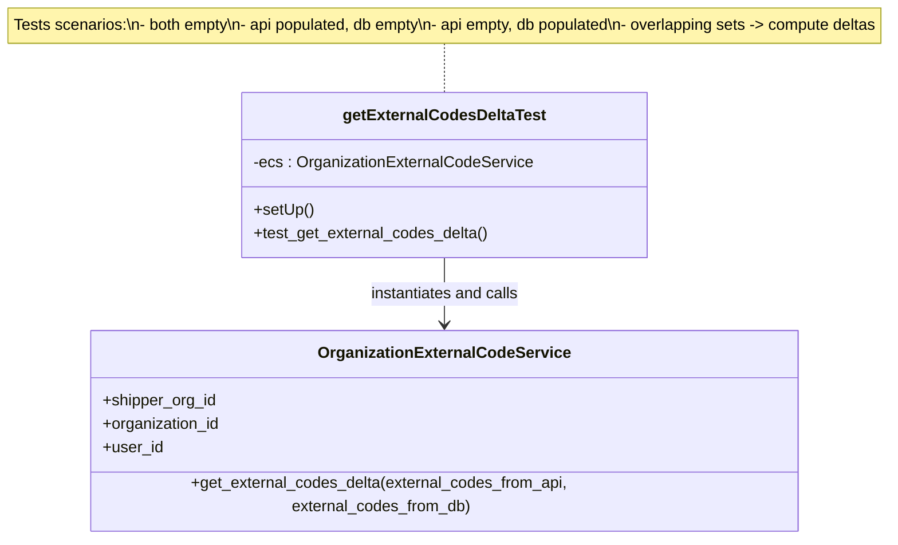

# Diagram: common/iam_service/tests/unit_tests/test_organization_management/test_get_delta.py

> Auto-generated by Obscura crawlers

## Mermaid

### SVG

<svg id="container" width="950.015625" xmlns="http://www.w3.org/2000/svg" class="classDiagram" height="536" viewBox="0 0 950.015625 536" role="graphics-document document" aria-roledescription="class"><g><defs><marker id="container_class-aggregationStart" class="marker aggregation class" refX="18" refY="7" markerWidth="190" markerHeight="240" orient="auto"><path d="M 18,7 L9,13 L1,7 L9,1 Z"></path></marker></defs><defs><marker id="container_class-aggregationEnd" class="marker aggregation class" refX="1" refY="7" markerWidth="20" markerHeight="28" orient="auto"><path d="M 18,7 L9,13 L1,7 L9,1 Z"></path></marker></defs><defs><marker id="container_class-extensionStart" class="marker extension class" refX="18" refY="7" markerWidth="190" markerHeight="240" orient="auto"><path d="M 1,7 L18,13 V 1 Z"></path></marker></defs><defs><marker id="container_class-extensionEnd" class="marker extension class" refX="1" refY="7" markerWidth="20" markerHeight="28" orient="auto"><path d="M 1,1 V 13 L18,7 Z"></path></marker></defs><defs><marker id="container_class-compositionStart" class="marker composition class" refX="18" refY="7" markerWidth="190" markerHeight="240" orient="auto"><path d="M 18,7 L9,13 L1,7 L9,1 Z"></path></marker></defs><defs><marker id="container_class-compositionEnd" class="marker composition class" refX="1" refY="7" markerWidth="20" markerHeight="28" orient="auto"><path d="M 18,7 L9,13 L1,7 L9,1 Z"></path></marker></defs><defs><marker id="container_class-dependencyStart" class="marker dependency class" refX="6" refY="7" markerWidth="190" markerHeight="240" orient="auto"><path d="M 5,7 L9,13 L1,7 L9,1 Z"></path></marker></defs><defs><marker id="container_class-dependencyEnd" class="marker dependency class" refX="13" refY="7" markerWidth="20" markerHeight="28" orient="auto"><path d="M 18,7 L9,13 L14,7 L9,1 Z"></path></marker></defs><defs><marker id="container_class-lollipopStart" class="marker lollipop class" refX="13" refY="7" markerWidth="190" markerHeight="240" orient="auto"><circle stroke="black" fill="transparent" cx="7" cy="7" r="6"></circle></marker></defs><defs><marker id="container_class-lollipopEnd" class="marker lollipop class" refX="1" refY="7" markerWidth="190" markerHeight="240" orient="auto"><circle stroke="black" fill="transparent" cx="7" cy="7" r="6"></circle></marker></defs><g class="root"><g class="clusters"></g><g class="edgePaths"><path d="M475.008,44L475.008,48.167C475.008,52.333,475.008,60.667,475.008,69C475.008,77.333,475.008,85.667,475.008,89.833L475.008,94" id="edgeNote1" class="edge-thickness-normal edge-pattern-dotted relation" style="fill: none;;;fill: none" data-edge="true" data-et="edge" data-id="edgeNote1" data-points="W3sieCI6NDc1LjAwNzgxMjUsInkiOjQ0fSx7IngiOjQ3NS4wMDc4MTI1LCJ5Ijo2OX0seyJ4Ijo0NzUuMDA3ODEyNSwieSI6OTR9XQ=="></path><path d="M475.008,262L475.008,268.167C475.008,274.333,475.008,286.667,475.008,298C475.008,309.333,475.008,319.667,475.008,324.833L475.008,330" id="id_getExternalCodesDeltaTest_OrganizationExternalCodeService_1" class="edge-thickness-normal edge-pattern-solid relation" style=";;;" data-edge="true" data-et="edge" data-id="id_getExternalCodesDeltaTest_OrganizationExternalCodeService_1" data-points="W3sieCI6NDc1LjAwNzgxMjUsInkiOjI2Mn0seyJ4Ijo0NzUuMDA3ODEyNSwieSI6Mjk5fSx7IngiOjQ3NS4wMDc4MTI1LCJ5IjozMzZ9XQ==" marker-end="url(#container_class-dependencyEnd)"></path></g><g class="edgeLabels"><g class="edgeLabel"><g class="label" data-id="edgeNote1" transform="translate(0, 0)"><foreignObject width="0" height="0">

</foreignObject></g></g><g class="edgeLabel" transform="translate(475.0078125, 299)"><g class="label" data-id="id_getExternalCodesDeltaTest_OrganizationExternalCodeService_1" transform="translate(-77.421875, -12)"><foreignObject width="154.84375" height="24">

instantiates and calls

</foreignObject></g></g></g><g class="nodes"><g class="node default" id="classId-OrganizationExternalCodeService-0" transform="translate(475.0078125, 432)"><g class="basic label-container"><path d="M-359.33203125 -96 L359.33203125 -96 L359.33203125 96 L-359.33203125 96" stroke="none" stroke-width="0" fill="#ECECFF" style=""></path><path d="M-359.33203125 -96 C-110.8168565803634 -96, 137.6983180892732 -96, 359.33203125 -96 M-359.33203125 -96 C-88.06652841866503 -96, 183.19897441266994 -96, 359.33203125 -96 M359.33203125 -96 C359.33203125 -51.86913306609588, 359.33203125 -7.738266132191754, 359.33203125 96 M359.33203125 -96 C359.33203125 -33.39514776795076, 359.33203125 29.20970446409848, 359.33203125 96 M359.33203125 96 C80.14086126448035 96, -199.0503087210393 96, -359.33203125 96 M359.33203125 96 C152.036784095009 96, -55.25846305998198 96, -359.33203125 96 M-359.33203125 96 C-359.33203125 51.13543907033521, -359.33203125 6.270878140670419, -359.33203125 -96 M-359.33203125 96 C-359.33203125 24.682313575644528, -359.33203125 -46.635372848710944, -359.33203125 -96" stroke="#9370DB" stroke-width="1.3" fill="none" stroke-dasharray="0 0" style=""></path></g><g class="annotation-group text" transform="translate(0, -72)"></g><g class="label-group text" transform="translate(-121.8359375, -72)"><g class="label" style="font-weight: bolder" transform="translate(0,-12)"><foreignObject width="243.671875" height="24">

OrganizationExternalCodeService

</foreignObject></g></g><g class="members-group text" transform="translate(-347.33203125, -24)"><g class="label" style="" transform="translate(0,-12)"><foreignObject width="116.046875" height="24">

+shipper_org_id

</foreignObject></g><g class="label" style="" transform="translate(0,12)"><foreignObject width="120.75" height="24">

+organization_id

</foreignObject></g><g class="label" style="" transform="translate(0,36)"><foreignObject width="60.796875" height="24">

+user_id

</foreignObject></g></g><g class="methods-group text" transform="translate(-347.33203125, 72)"><g class="label" style="" transform="translate(0,-12)"><foreignObject width="572.828125" height="24">

+get_external_codes_delta(external_codes_from_api, external_codes_from_db)

</foreignObject></g></g><g class="divider" style=""><path d="M-359.33203125 -48 C-110.26788088022539 -48, 138.79626948954922 -48, 359.33203125 -48 M-359.33203125 -48 C-211.47386212551623 -48, -63.61569300103247 -48, 359.33203125 -48" stroke="#9370DB" stroke-width="1.3" fill="none" stroke-dasharray="0 0" style=""></path></g><g class="divider" style=""><path d="M-359.33203125 48 C-97.25364781606146 48, 164.82473561787708 48, 359.33203125 48 M-359.33203125 48 C-120.47140538029825 48, 118.3892204894035 48, 359.33203125 48" stroke="#9370DB" stroke-width="1.3" fill="none" stroke-dasharray="0 0" style=""></path></g></g><g class="node default" id="classId-getExternalCodesDeltaTest-1" transform="translate(475.0078125, 178)"><g class="basic label-container"><path d="M-202.55078125 -84 L202.55078125 -84 L202.55078125 84 L-202.55078125 84" stroke="none" stroke-width="0" fill="#ECECFF" style=""></path><path d="M-202.55078125 -84 C-43.20437380888319 -84, 116.14203363223362 -84, 202.55078125 -84 M-202.55078125 -84 C-83.16964036440085 -84, 36.2115005211983 -84, 202.55078125 -84 M202.55078125 -84 C202.55078125 -24.62451118063187, 202.55078125 34.75097763873626, 202.55078125 84 M202.55078125 -84 C202.55078125 -38.11231782445343, 202.55078125 7.775364351093145, 202.55078125 84 M202.55078125 84 C46.748766274640076 84, -109.05324870071985 84, -202.55078125 84 M202.55078125 84 C90.68248035211408 84, -21.185820545771833 84, -202.55078125 84 M-202.55078125 84 C-202.55078125 43.640986744472016, -202.55078125 3.2819734889440326, -202.55078125 -84 M-202.55078125 84 C-202.55078125 18.770802360537843, -202.55078125 -46.458395278924314, -202.55078125 -84" stroke="#9370DB" stroke-width="1.3" fill="none" stroke-dasharray="0 0" style=""></path></g><g class="annotation-group text" transform="translate(0, -60)"></g><g class="label-group text" transform="translate(-98.7265625, -60)"><g class="label" style="font-weight: bolder" transform="translate(0,-12)"><foreignObject width="197.453125" height="24">

getExternalCodesDeltaTest

</foreignObject></g></g><g class="members-group text" transform="translate(-190.55078125, -12)"><g class="label" style="" transform="translate(0,-12)"><foreignObject width="282.375" height="24">

-ecs : OrganizationExternalCodeService

</foreignObject></g></g><g class="methods-group text" transform="translate(-190.55078125, 36)"><g class="label" style="" transform="translate(0,-12)"><foreignObject width="60.421875" height="24">

+setUp()

</foreignObject></g><g class="label" style="" transform="translate(0,12)"><foreignObject width="239.640625" height="24">

+test_get_external_codes_delta()

</foreignObject></g></g><g class="divider" style=""><path d="M-202.55078125 -36 C-73.11681873986643 -36, 56.31714377026714 -36, 202.55078125 -36 M-202.55078125 -36 C-108.13840766498957 -36, -13.726034079979144 -36, 202.55078125 -36" stroke="#9370DB" stroke-width="1.3" fill="none" stroke-dasharray="0 0" style=""></path></g><g class="divider" style=""><path d="M-202.55078125 12 C-86.6614510491488 12, 29.22787915170241 12, 202.55078125 12 M-202.55078125 12 C-41.4409908377869 12, 119.6687995744262 12, 202.55078125 12" stroke="#9370DB" stroke-width="1.3" fill="none" stroke-dasharray="0 0" style=""></path></g></g><g class="node undefined" id="note0" transform="translate(475.0078125, 26)"><g class="basic label-container"><path d="M-467.0078125 -18 L467.0078125 -18 L467.0078125 18 L-467.0078125 18" stroke="none" stroke-width="0" fill="#fff5ad" style="fill:#fff5ad !important;stroke:#aaaa33 !important"></path><path d="M-467.0078125 -18 C-175.71378482059777 -18, 115.58024285880447 -18, 467.0078125 -18 M-467.0078125 -18 C-139.5625392351298 -18, 187.8827340297404 -18, 467.0078125 -18 M467.0078125 -18 C467.0078125 -7.389945545085872, 467.0078125 3.220108909828255, 467.0078125 18 M467.0078125 -18 C467.0078125 -3.939566618822637, 467.0078125 10.120866762354726, 467.0078125 18 M467.0078125 18 C220.55685576781482 18, -25.894100964370352 18, -467.0078125 18 M467.0078125 18 C213.51916852023203 18, -39.96947545953594 18, -467.0078125 18 M-467.0078125 18 C-467.0078125 8.038987045108193, -467.0078125 -1.9220259097836134, -467.0078125 -18 M-467.0078125 18 C-467.0078125 6.8874217208173505, -467.0078125 -4.225156558365299, -467.0078125 -18" stroke="#aaaa33" stroke-width="1.3" fill="none" stroke-dasharray="0 0" style="fill:#fff5ad !important;stroke:#aaaa33 !important"></path></g><g class="label" style="text-align:left !important;white-space:nowrap !important" transform="translate(-461.0078125, -12)"><rect></rect><foreignObject width="922.015625" height="24">

Tests scenarios:\n- both empty\n- api populated, db empty\n- api empty, db populated\n- overlapping sets -&gt; compute deltas

</foreignObject></g></g></g></g></g></svg>
