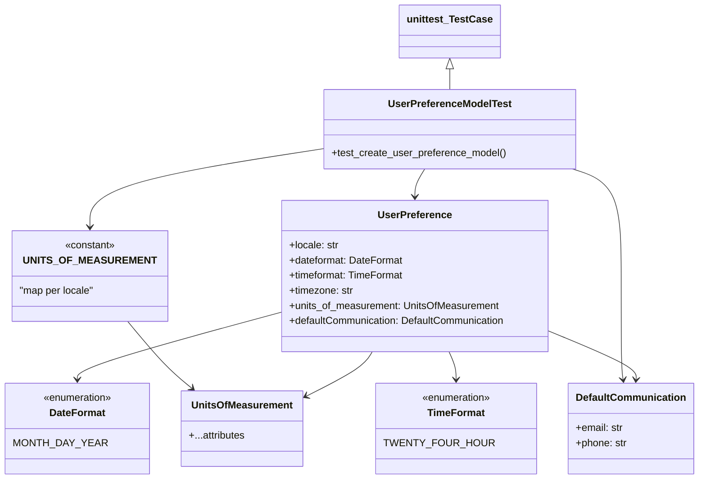

# Diagram: common/iam_service/tests/unit_tests/user_preferences/test_models.py

> Auto-generated by Obscura crawlers

## Mermaid

### SVG

<svg id="container" width="1066.150390625" xmlns="http://www.w3.org/2000/svg" class="classDiagram" height="760" viewBox="0 0 1066.150390625 760" role="graphics-document document" aria-roledescription="class"><g><defs><marker id="container_class-aggregationStart" class="marker aggregation class" refX="18" refY="7" markerWidth="190" markerHeight="240" orient="auto"><path d="M 18,7 L9,13 L1,7 L9,1 Z"></path></marker></defs><defs><marker id="container_class-aggregationEnd" class="marker aggregation class" refX="1" refY="7" markerWidth="20" markerHeight="28" orient="auto"><path d="M 18,7 L9,13 L1,7 L9,1 Z"></path></marker></defs><defs><marker id="container_class-extensionStart" class="marker extension class" refX="18" refY="7" markerWidth="190" markerHeight="240" orient="auto"><path d="M 1,7 L18,13 V 1 Z"></path></marker></defs><defs><marker id="container_class-extensionEnd" class="marker extension class" refX="1" refY="7" markerWidth="20" markerHeight="28" orient="auto"><path d="M 1,1 V 13 L18,7 Z"></path></marker></defs><defs><marker id="container_class-compositionStart" class="marker composition class" refX="18" refY="7" markerWidth="190" markerHeight="240" orient="auto"><path d="M 18,7 L9,13 L1,7 L9,1 Z"></path></marker></defs><defs><marker id="container_class-compositionEnd" class="marker composition class" refX="1" refY="7" markerWidth="20" markerHeight="28" orient="auto"><path d="M 18,7 L9,13 L1,7 L9,1 Z"></path></marker></defs><defs><marker id="container_class-dependencyStart" class="marker dependency class" refX="6" refY="7" markerWidth="190" markerHeight="240" orient="auto"><path d="M 5,7 L9,13 L1,7 L9,1 Z"></path></marker></defs><defs><marker id="container_class-dependencyEnd" class="marker dependency class" refX="13" refY="7" markerWidth="20" markerHeight="28" orient="auto"><path d="M 18,7 L9,13 L14,7 L9,1 Z"></path></marker></defs><defs><marker id="container_class-lollipopStart" class="marker lollipop class" refX="13" refY="7" markerWidth="190" markerHeight="240" orient="auto"><circle stroke="black" fill="transparent" cx="7" cy="7" r="6"></circle></marker></defs><defs><marker id="container_class-lollipopEnd" class="marker lollipop class" refX="1" refY="7" markerWidth="190" markerHeight="240" orient="auto"><circle stroke="black" fill="transparent" cx="7" cy="7" r="6"></circle></marker></defs><g class="root"><g class="clusters"></g><g class="edgePaths"><path d="M567.787,558L565.734,562.167C563.68,566.333,559.574,574.667,542.479,586.463C525.384,598.26,495.301,613.52,480.26,621.149L465.218,628.779" id="id_UserPreference_UnitsOfMeasurement_1" class="edge-thickness-normal edge-pattern-solid relation" style=";;;" data-edge="true" data-et="edge" data-id="id_UserPreference_UnitsOfMeasurement_1" data-points="W3sieCI6NTY3Ljc4NzMxMTQyMjQxMzgsInkiOjU1OH0seyJ4Ijo1NTUuNDY2Nzk2ODc1LCJ5Ijo1ODN9LHsieCI6NDU5Ljg2NzE4NzUsInkiOjYzMS40OTM1NjAyMTUzMDY0fV0=" marker-end="url(#container_class-dependencyEnd)"></path><path d="M840.887,527.751L862.838,536.959C884.79,546.168,928.693,564.584,950.317,576.964C971.942,589.344,971.288,595.688,970.961,598.86L970.634,602.032" id="id_UserPreference_DefaultCommunication_2" class="edge-thickness-normal edge-pattern-solid relation" style=";;;" data-edge="true" data-et="edge" data-id="id_UserPreference_DefaultCommunication_2" data-points="W3sieCI6ODQwLjg4NjcxODc1LCJ5Ijo1MjcuNzUxMzMyMDQ4ODQwOH0seyJ4Ijo5NzIuNTk1NzAzMTI1LCJ5Ijo1ODN9LHsieCI6OTcwLjAxODM4MzUzNzM3MTIsInkiOjYwOH1d" marker-end="url(#container_class-dependencyEnd)"></path><path d="M412.965,498.404L363.022,512.503C313.079,526.602,213.194,554.801,163.251,572.067C113.309,589.333,113.309,595.667,113.309,598.833L113.309,602" id="id_UserPreference_DateFormat_3" class="edge-thickness-normal edge-pattern-solid relation" style=";;;" data-edge="true" data-et="edge" data-id="id_UserPreference_DateFormat_3" data-points="W3sieCI6NDEyLjk2NDg0Mzc1LCJ5Ijo0OTguNDAzNjE3MTE1MTMwMTV9LHsieCI6MTEzLjMwODU5Mzc1LCJ5Ijo1ODN9LHsieCI6MTEzLjMwODU5Mzc1LCJ5Ijo2MDh9XQ==" marker-end="url(#container_class-dependencyEnd)"></path><path d="M684.76,558L686.768,562.167C688.776,566.333,692.792,574.667,694.8,582C696.809,589.333,696.809,595.667,696.809,598.833L696.809,602" id="id_UserPreference_TimeFormat_4" class="edge-thickness-normal edge-pattern-solid relation" style=";;;" data-edge="true" data-et="edge" data-id="id_UserPreference_TimeFormat_4" data-points="W3sieCI6Njg0Ljc1OTgzMjk3NDEzNzksInkiOjU1OH0seyJ4Ijo2OTYuODA4NTkzNzUsInkiOjU4M30seyJ4Ijo2OTYuODA4NTkzNzUsInkiOjYwOH1d" marker-end="url(#container_class-dependencyEnd)"></path><path d="M190.644,510L200.332,522.167C210.021,534.333,229.398,558.667,245.662,576.357C261.925,594.047,275.075,605.094,281.65,610.617L288.225,616.141" id="id_UNITS_OF_MEASUREMENT_UnitsOfMeasurement_5" class="edge-thickness-normal edge-pattern-solid relation" style=";;;" data-edge="true" data-et="edge" data-id="id_UNITS_OF_MEASUREMENT_UnitsOfMeasurement_5" data-points="W3sieCI6MTkwLjY0MzgzMDgxODk2NTUsInkiOjUxMH0seyJ4IjoyNDguNzc1MzkwNjI1LCJ5Ijo1ODN9LHsieCI6MjkyLjgxOTQyNjU0NjM5MTc1LCJ5Ijo2MjB9XQ==" marker-end="url(#container_class-dependencyEnd)"></path><path d="M686.809,109.25L686.809,110.542C686.809,111.833,686.809,114.417,686.809,119.875C686.809,125.333,686.809,133.667,686.809,137.833L686.809,142" id="id_unittest_TestCase_UserPreferenceModelTest_6" class="edge-thickness-normal edge-pattern-solid relation" style=";;;" data-edge="true" data-et="edge" data-id="id_unittest_TestCase_UserPreferenceModelTest_6" data-points="W3sieCI6Njg2LjgwODU5Mzc1LCJ5Ijo5Mn0seyJ4Ijo2ODYuODA4NTkzNzUsInkiOjExN30seyJ4Ijo2ODYuODA4NTkzNzUsInkiOjE0Mn1d" marker-start="url(#container_class-extensionStart)"></path><path d="M643.938,268L641.103,272.167C638.267,276.333,632.597,284.667,629.761,292C626.926,299.333,626.926,305.667,626.926,308.833L626.926,312" id="id_UserPreferenceModelTest_UserPreference_7" class="edge-thickness-normal edge-pattern-solid relation" style=";;;" data-edge="true" data-et="edge" data-id="id_UserPreferenceModelTest_UserPreference_7" data-points="W3sieCI6NjQzLjkzNzk0Mzg5MjA0NTUsInkiOjI2OH0seyJ4Ijo2MjYuOTI1NzgxMjUsInkiOjI5M30seyJ4Ijo2MjYuOTI1NzgxMjUsInkiOjMxOH1d" marker-end="url(#container_class-dependencyEnd)"></path><path d="M489.547,236.362L430.174,245.802C370.801,255.242,252.055,274.121,192.682,294.727C133.309,315.333,133.309,337.667,133.309,348.833L133.309,360" id="id_UserPreferenceModelTest_UNITS_OF_MEASUREMENT_8" class="edge-thickness-normal edge-pattern-solid relation" style=";;;" data-edge="true" data-et="edge" data-id="id_UserPreferenceModelTest_UNITS_OF_MEASUREMENT_8" data-points="W3sieCI6NDg5LjU0Njg3NSwieSI6MjM2LjM2MjI5Njc0Nzk2NzV9LHsieCI6MTMzLjMwODU5Mzc1LCJ5IjoyOTN9LHsieCI6MTMzLjMwODU5Mzc1LCJ5IjozNjZ9XQ==" marker-end="url(#container_class-dependencyEnd)"></path><path d="M877.088,268L889.673,272.167C902.257,276.333,927.426,284.667,940.011,313C952.596,341.333,952.596,389.667,952.596,438C952.596,486.333,952.596,534.667,952.923,562.005C953.25,589.344,953.904,595.688,954.231,598.86L954.558,602.032" id="id_UserPreferenceModelTest_DefaultCommunication_9" class="edge-thickness-normal edge-pattern-solid relation" style=";;;" data-edge="true" data-et="edge" data-id="id_UserPreferenceModelTest_DefaultCommunication_9" data-points="W3sieCI6ODc3LjA4ODAwMTU5ODAxMTQsInkiOjI2OH0seyJ4Ijo5NTIuNTk1NzAzMTI1LCJ5IjoyOTN9LHsieCI6OTUyLjU5NTcwMzEyNSwieSI6NDM4fSx7IngiOjk1Mi41OTU3MDMxMjUsInkiOjU4M30seyJ4Ijo5NTUuMTczMDIyNzEyNjI4OCwieSI6NjA4fV0=" marker-end="url(#container_class-dependencyEnd)"></path></g><g class="edgeLabels"><g class="edgeLabel"><g class="label" data-id="id_UserPreference_UnitsOfMeasurement_1" transform="translate(0, 0)"><foreignObject width="0" height="0">

</foreignObject></g></g><g class="edgeLabel"><g class="label" data-id="id_UserPreference_DefaultCommunication_2" transform="translate(0, 0)"><foreignObject width="0" height="0">

</foreignObject></g></g><g class="edgeLabel"><g class="label" data-id="id_UserPreference_DateFormat_3" transform="translate(0, 0)"><foreignObject width="0" height="0">

</foreignObject></g></g><g class="edgeLabel"><g class="label" data-id="id_UserPreference_TimeFormat_4" transform="translate(0, 0)"><foreignObject width="0" height="0">

</foreignObject></g></g><g class="edgeLabel"><g class="label" data-id="id_UNITS_OF_MEASUREMENT_UnitsOfMeasurement_5" transform="translate(0, 0)"><foreignObject width="0" height="0">

</foreignObject></g></g><g class="edgeLabel"><g class="label" data-id="id_unittest_TestCase_UserPreferenceModelTest_6" transform="translate(0, 0)"><foreignObject width="0" height="0">

</foreignObject></g></g><g class="edgeLabel"><g class="label" data-id="id_UserPreferenceModelTest_UserPreference_7" transform="translate(0, 0)"><foreignObject width="0" height="0">

</foreignObject></g></g><g class="edgeLabel"><g class="label" data-id="id_UserPreferenceModelTest_UNITS_OF_MEASUREMENT_8" transform="translate(0, 0)"><foreignObject width="0" height="0">

</foreignObject></g></g><g class="edgeLabel"><g class="label" data-id="id_UserPreferenceModelTest_DefaultCommunication_9" transform="translate(0, 0)"><foreignObject width="0" height="0">

</foreignObject></g></g></g><g class="nodes"><g class="node default" id="classId-DateFormat-0" transform="translate(113.30859375, 680)"><g class="basic label-container"><path d="M-105.30859375 -72 L105.30859375 -72 L105.30859375 72 L-105.30859375 72" stroke="none" stroke-width="0" fill="#ECECFF" style=""></path><path d="M-105.30859375 -72 C-57.7394960336706 -72, -10.170398317341196 -72, 105.30859375 -72 M-105.30859375 -72 C-21.628486557308847 -72, 62.05162063538231 -72, 105.30859375 -72 M105.30859375 -72 C105.30859375 -16.604461066581827, 105.30859375 38.791077866836346, 105.30859375 72 M105.30859375 -72 C105.30859375 -27.81764828496918, 105.30859375 16.36470343006164, 105.30859375 72 M105.30859375 72 C23.263213031015155 72, -58.78216768796969 72, -105.30859375 72 M105.30859375 72 C40.81465993969779 72, -23.67927387060442 72, -105.30859375 72 M-105.30859375 72 C-105.30859375 41.56637209639855, -105.30859375 11.132744192797105, -105.30859375 -72 M-105.30859375 72 C-105.30859375 26.4660467131597, -105.30859375 -19.067906573680602, -105.30859375 -72" stroke="#9370DB" stroke-width="1.3" fill="none" stroke-dasharray="0 0" style=""></path></g><g class="annotation-group text" transform="translate(-55.5546875, -48)"><g class="label" style="" transform="translate(0,-12)"><foreignObject width="111.109375" height="24">

«enumeration»

</foreignObject></g></g><g class="label-group text" transform="translate(-42.6015625, -24)"><g class="label" style="font-weight: bolder" transform="translate(0,-12)"><foreignObject width="85.203125" height="24">

DateFormat

</foreignObject></g></g><g class="members-group text" transform="translate(-93.30859375, 24)"><g class="label" style="" transform="translate(0,-12)"><foreignObject width="131.0625" height="24">

MONTH_DAY_YEAR

</foreignObject></g></g><g class="methods-group text" transform="translate(-93.30859375, 72)"></g><g class="divider" style=""><path d="M-105.30859375 0 C-47.28427007389362 0, 10.740053602212754 0, 105.30859375 0 M-105.30859375 0 C-60.83062858066356 0, -16.352663411327114 0, 105.30859375 0" stroke="#9370DB" stroke-width="1.3" fill="none" stroke-dasharray="0 0" style=""></path></g><g class="divider" style=""><path d="M-105.30859375 48 C-36.18835539901447 48, 32.93188295197106 48, 105.30859375 48 M-105.30859375 48 C-47.07507566478783 48, 11.158442420424336 48, 105.30859375 48" stroke="#9370DB" stroke-width="1.3" fill="none" stroke-dasharray="0 0" style=""></path></g></g><g class="node default" id="classId-TimeFormat-1" transform="translate(696.80859375, 680)"><g class="basic label-container"><path d="M-117.05859375 -72 L117.05859375 -72 L117.05859375 72 L-117.05859375 72" stroke="none" stroke-width="0" fill="#ECECFF" style=""></path><path d="M-117.05859375 -72 C-28.96850497862279 -72, 59.12158379275442 -72, 117.05859375 -72 M-117.05859375 -72 C-55.36857792659401 -72, 6.321437896811986 -72, 117.05859375 -72 M117.05859375 -72 C117.05859375 -18.85942421507559, 117.05859375 34.28115156984882, 117.05859375 72 M117.05859375 -72 C117.05859375 -30.690681229107312, 117.05859375 10.618637541785375, 117.05859375 72 M117.05859375 72 C55.38782165982052 72, -6.282950430358966 72, -117.05859375 72 M117.05859375 72 C57.28407760337497 72, -2.4904385432500646 72, -117.05859375 72 M-117.05859375 72 C-117.05859375 35.39832062546911, -117.05859375 -1.2033587490617776, -117.05859375 -72 M-117.05859375 72 C-117.05859375 33.83668659575033, -117.05859375 -4.326626808499341, -117.05859375 -72" stroke="#9370DB" stroke-width="1.3" fill="none" stroke-dasharray="0 0" style=""></path></g><g class="annotation-group text" transform="translate(-55.5546875, -48)"><g class="label" style="" transform="translate(0,-12)"><foreignObject width="111.109375" height="24">

«enumeration»

</foreignObject></g></g><g class="label-group text" transform="translate(-43.484375, -24)"><g class="label" style="font-weight: bolder" transform="translate(0,-12)"><foreignObject width="86.96875" height="24">

TimeFormat

</foreignObject></g></g><g class="members-group text" transform="translate(-105.05859375, 24)"><g class="label" style="" transform="translate(0,-12)"><foreignObject width="154.5625" height="24">

TWENTY_FOUR_HOUR

</foreignObject></g></g><g class="methods-group text" transform="translate(-105.05859375, 72)"></g><g class="divider" style=""><path d="M-117.05859375 0 C-24.760861977164453 0, 67.5368697956711 0, 117.05859375 0 M-117.05859375 0 C-27.704408913983514 0, 61.64977592203297 0, 117.05859375 0" stroke="#9370DB" stroke-width="1.3" fill="none" stroke-dasharray="0 0" style=""></path></g><g class="divider" style=""><path d="M-117.05859375 48 C-46.440465443472505 48, 24.17766286305499 48, 117.05859375 48 M-117.05859375 48 C-55.04340216282202 48, 6.971789424355961 48, 117.05859375 48" stroke="#9370DB" stroke-width="1.3" fill="none" stroke-dasharray="0 0" style=""></path></g></g><g class="node default" id="classId-UNITS_OF_MEASUREMENT-2" transform="translate(133.30859375, 438)"><g class="basic label-container"><path d="M-118.48828125 -72 L118.48828125 -72 L118.48828125 72 L-118.48828125 72" stroke="none" stroke-width="0" fill="#ECECFF" style=""></path><path d="M-118.48828125 -72 C-41.34121223273205 -72, 35.805856784535905 -72, 118.48828125 -72 M-118.48828125 -72 C-59.634975680581185 -72, -0.7816701111623701 -72, 118.48828125 -72 M118.48828125 -72 C118.48828125 -24.296951839255478, 118.48828125 23.406096321489045, 118.48828125 72 M118.48828125 -72 C118.48828125 -22.44633429396748, 118.48828125 27.107331412065037, 118.48828125 72 M118.48828125 72 C28.062372027975343 72, -62.363537194049314 72, -118.48828125 72 M118.48828125 72 C62.01797449289639 72, 5.5476677357927855 72, -118.48828125 72 M-118.48828125 72 C-118.48828125 37.19261452575439, -118.48828125 2.385229051508773, -118.48828125 -72 M-118.48828125 72 C-118.48828125 30.040899287231582, -118.48828125 -11.918201425536836, -118.48828125 -72" stroke="#9370DB" stroke-width="1.3" fill="none" stroke-dasharray="0 0" style=""></path></g><g class="annotation-group text" transform="translate(-40.4921875, -48)"><g class="label" style="" transform="translate(0,-12)"><foreignObject width="80.984375" height="24">

«constant»

</foreignObject></g></g><g class="label-group text" transform="translate(-92.2421875, -24)"><g class="label" style="font-weight: bolder" transform="translate(0,-12)"><foreignObject width="184.484375" height="24">

UNITS_OF_MEASUREMENT

</foreignObject></g></g><g class="members-group text" transform="translate(-106.48828125, 24)"><g class="label" style="" transform="translate(0,-12)"><foreignObject width="120.734375" height="24">

"map per locale"

</foreignObject></g></g><g class="methods-group text" transform="translate(-106.48828125, 72)"></g><g class="divider" style=""><path d="M-118.48828125 0 C-49.93913150868127 0, 18.610018232637458 0, 118.48828125 0 M-118.48828125 0 C-55.92951326121116 0, 6.629254727577674 0, 118.48828125 0" stroke="#9370DB" stroke-width="1.3" fill="none" stroke-dasharray="0 0" style=""></path></g><g class="divider" style=""><path d="M-118.48828125 48 C-55.47564836973727 48, 7.536984510525457 48, 118.48828125 48 M-118.48828125 48 C-52.533322242319585 48, 13.42163676536083 48, 118.48828125 48" stroke="#9370DB" stroke-width="1.3" fill="none" stroke-dasharray="0 0" style=""></path></g></g><g class="node default" id="classId-UnitsOfMeasurement-3" transform="translate(364.2421875, 680)"><g class="basic label-container"><path d="M-95.625 -60 L95.625 -60 L95.625 60 L-95.625 60" stroke="none" stroke-width="0" fill="#ECECFF" style=""></path><path d="M-95.625 -60 C-21.75589369110311 -60, 52.11321261779378 -60, 95.625 -60 M-95.625 -60 C-22.380027998670045 -60, 50.86494400265991 -60, 95.625 -60 M95.625 -60 C95.625 -16.224191250732858, 95.625 27.551617498534284, 95.625 60 M95.625 -60 C95.625 -31.779899144545794, 95.625 -3.5597982890915887, 95.625 60 M95.625 60 C19.158582978060267 60, -57.30783404387947 60, -95.625 60 M95.625 60 C43.041668708474376 60, -9.541662583051249 60, -95.625 60 M-95.625 60 C-95.625 21.11483759409044, -95.625 -17.770324811819123, -95.625 -60 M-95.625 60 C-95.625 30.66809316533355, -95.625 1.336186330667097, -95.625 -60" stroke="#9370DB" stroke-width="1.3" fill="none" stroke-dasharray="0 0" style=""></path></g><g class="annotation-group text" transform="translate(0, -36)"></g><g class="label-group text" transform="translate(-77.046875, -36)"><g class="label" style="font-weight: bolder" transform="translate(0,-12)"><foreignObject width="154.09375" height="24">

UnitsOfMeasurement

</foreignObject></g></g><g class="members-group text" transform="translate(-83.625, 12)"><g class="label" style="" transform="translate(0,-12)"><foreignObject width="90.203125" height="24">

+...attributes

</foreignObject></g></g><g class="methods-group text" transform="translate(-83.625, 60)"></g><g class="divider" style=""><path d="M-95.625 -12 C-28.103040034416836 -12, 39.41891993116633 -12, 95.625 -12 M-95.625 -12 C-41.63800839557369 -12, 12.348983208852616 -12, 95.625 -12" stroke="#9370DB" stroke-width="1.3" fill="none" stroke-dasharray="0 0" style=""></path></g><g class="divider" style=""><path d="M-95.625 36 C-43.29411284478802 36, 9.036774310423965 36, 95.625 36 M-95.625 36 C-43.91338321380261 36, 7.798233572394778 36, 95.625 36" stroke="#9370DB" stroke-width="1.3" fill="none" stroke-dasharray="0 0" style=""></path></g></g><g class="node default" id="classId-DefaultCommunication-4" transform="translate(962.595703125, 680)"><g class="basic label-container"><path d="M-95.5546875 -72 L95.5546875 -72 L95.5546875 72 L-95.5546875 72" stroke="none" stroke-width="0" fill="#ECECFF" style=""></path><path d="M-95.5546875 -72 C-45.94927058336162 -72, 3.656146333276766 -72, 95.5546875 -72 M-95.5546875 -72 C-38.98187701389815 -72, 17.5909334722037 -72, 95.5546875 -72 M95.5546875 -72 C95.5546875 -42.480531884978404, 95.5546875 -12.961063769956816, 95.5546875 72 M95.5546875 -72 C95.5546875 -25.36926309235468, 95.5546875 21.261473815290643, 95.5546875 72 M95.5546875 72 C33.522903723839946 72, -28.50888005232011 72, -95.5546875 72 M95.5546875 72 C29.764693744572654 72, -36.02530001085469 72, -95.5546875 72 M-95.5546875 72 C-95.5546875 39.718903089895136, -95.5546875 7.437806179790272, -95.5546875 -72 M-95.5546875 72 C-95.5546875 17.742118430065126, -95.5546875 -36.51576313986975, -95.5546875 -72" stroke="#9370DB" stroke-width="1.3" fill="none" stroke-dasharray="0 0" style=""></path></g><g class="annotation-group text" transform="translate(0, -48)"></g><g class="label-group text" transform="translate(-83.5546875, -48)"><g class="label" style="font-weight: bolder" transform="translate(0,-12)"><foreignObject width="167.109375" height="24">

DefaultCommunication

</foreignObject></g></g><g class="members-group text" transform="translate(-83.5546875, 0)"><g class="label" style="" transform="translate(0,-12)"><foreignObject width="75.984375" height="24">

+email: str

</foreignObject></g><g class="label" style="" transform="translate(0,12)"><foreignObject width="81.8125" height="24">

+phone: str

</foreignObject></g></g><g class="methods-group text" transform="translate(-83.5546875, 72)"></g><g class="divider" style=""><path d="M-95.5546875 -24 C-55.02844610023916 -24, -14.502204700478316 -24, 95.5546875 -24 M-95.5546875 -24 C-42.92036958817712 -24, 9.713948323645766 -24, 95.5546875 -24" stroke="#9370DB" stroke-width="1.3" fill="none" stroke-dasharray="0 0" style=""></path></g><g class="divider" style=""><path d="M-95.5546875 48 C-24.620298364618876 48, 46.31409077076225 48, 95.5546875 48 M-95.5546875 48 C-48.009165574205355 48, -0.4636436484107094 48, 95.5546875 48" stroke="#9370DB" stroke-width="1.3" fill="none" stroke-dasharray="0 0" style=""></path></g></g><g class="node default" id="classId-UserPreference-5" transform="translate(626.92578125, 438)"><g class="basic label-container"><path d="M-213.9609375 -120 L213.9609375 -120 L213.9609375 120 L-213.9609375 120" stroke="none" stroke-width="0" fill="#ECECFF" style=""></path><path d="M-213.9609375 -120 C-72.02238721834476 -120, 69.91616306331048 -120, 213.9609375 -120 M-213.9609375 -120 C-82.94805830321388 -120, 48.06482089357223 -120, 213.9609375 -120 M213.9609375 -120 C213.9609375 -64.85796265987312, 213.9609375 -9.715925319746248, 213.9609375 120 M213.9609375 -120 C213.9609375 -70.75692791084396, 213.9609375 -21.513855821687912, 213.9609375 120 M213.9609375 120 C49.48908199536186 120, -114.98277350927629 120, -213.9609375 120 M213.9609375 120 C108.57577286123791 120, 3.1906082224758165 120, -213.9609375 120 M-213.9609375 120 C-213.9609375 68.84219897642853, -213.9609375 17.68439795285707, -213.9609375 -120 M-213.9609375 120 C-213.9609375 27.432526513303685, -213.9609375 -65.13494697339263, -213.9609375 -120" stroke="#9370DB" stroke-width="1.3" fill="none" stroke-dasharray="0 0" style=""></path></g><g class="annotation-group text" transform="translate(0, -96)"></g><g class="label-group text" transform="translate(-55.953125, -96)"><g class="label" style="font-weight: bolder" transform="translate(0,-12)"><foreignObject width="111.90625" height="24">

UserPreference

</foreignObject></g></g><g class="members-group text" transform="translate(-201.9609375, -48)"><g class="label" style="" transform="translate(0,-12)"><foreignObject width="78.8125" height="24">

+locale: str

</foreignObject></g><g class="label" style="" transform="translate(0,12)"><foreignObject width="181.6875" height="24">

+dateformat: DateFormat

</foreignObject></g><g class="label" style="" transform="translate(0,36)"><foreignObject width="183.90625" height="24">

+timeformat: TimeFormat

</foreignObject></g><g class="label" style="" transform="translate(0,60)"><foreignObject width="102.34375" height="24">

+timezone: str

</foreignObject></g><g class="label" style="" transform="translate(0,84)"><foreignObject width="334.90625" height="24">

+units_of_measurement: UnitsOfMeasurement

</foreignObject></g><g class="label" style="" transform="translate(0,108)"><foreignObject width="347.96875" height="24">

+defaultCommunication: DefaultCommunication

</foreignObject></g></g><g class="methods-group text" transform="translate(-201.9609375, 120)"></g><g class="divider" style=""><path d="M-213.9609375 -72 C-110.04275174074641 -72, -6.124565981492822 -72, 213.9609375 -72 M-213.9609375 -72 C-93.73774286118034 -72, 26.485451777639327 -72, 213.9609375 -72" stroke="#9370DB" stroke-width="1.3" fill="none" stroke-dasharray="0 0" style=""></path></g><g class="divider" style=""><path d="M-213.9609375 96 C-84.17325656021339 96, 45.61442437957322 96, 213.9609375 96 M-213.9609375 96 C-67.30427480787066 96, 79.35238788425869 96, 213.9609375 96" stroke="#9370DB" stroke-width="1.3" fill="none" stroke-dasharray="0 0" style=""></path></g></g><g class="node default" id="classId-unittest_TestCase-6" transform="translate(686.80859375, 50)"><g class="basic label-container"><path d="M-76.9609375 -42 L76.9609375 -42 L76.9609375 42 L-76.9609375 42" stroke="none" stroke-width="0" fill="#ECECFF" style=""></path><path d="M-76.9609375 -42 C-28.44661702834709 -42, 20.067703443305817 -42, 76.9609375 -42 M-76.9609375 -42 C-29.342799057016073 -42, 18.275339385967854 -42, 76.9609375 -42 M76.9609375 -42 C76.9609375 -11.608157079517888, 76.9609375 18.783685840964225, 76.9609375 42 M76.9609375 -42 C76.9609375 -17.86304152431845, 76.9609375 6.273916951363098, 76.9609375 42 M76.9609375 42 C21.612279481798573 42, -33.73637853640285 42, -76.9609375 42 M76.9609375 42 C23.679994840255212 42, -29.600947819489576 42, -76.9609375 42 M-76.9609375 42 C-76.9609375 12.055179011004228, -76.9609375 -17.889641977991545, -76.9609375 -42 M-76.9609375 42 C-76.9609375 8.84038291443904, -76.9609375 -24.31923417112192, -76.9609375 -42" stroke="#9370DB" stroke-width="1.3" fill="none" stroke-dasharray="0 0" style=""></path></g><g class="annotation-group text" transform="translate(0, -18)"></g><g class="label-group text" transform="translate(-64.9609375, -18)"><g class="label" style="font-weight: bolder" transform="translate(0,-12)"><foreignObject width="129.921875" height="24">

unittest_TestCase

</foreignObject></g></g><g class="members-group text" transform="translate(-64.9609375, 30)"></g><g class="methods-group text" transform="translate(-64.9609375, 60)"></g><g class="divider" style=""><path d="M-76.9609375 6 C-38.874359628298194 6, -0.787781756596388 6, 76.9609375 6 M-76.9609375 6 C-29.89162384068753 6, 17.17768981862494 6, 76.9609375 6" stroke="#9370DB" stroke-width="1.3" fill="none" stroke-dasharray="0 0" style=""></path></g><g class="divider" style=""><path d="M-76.9609375 24 C-34.72857536219401 24, 7.503786775611985 24, 76.9609375 24 M-76.9609375 24 C-29.829246580480763 24, 17.302444339038473 24, 76.9609375 24" stroke="#9370DB" stroke-width="1.3" fill="none" stroke-dasharray="0 0" style=""></path></g></g><g class="node default" id="classId-UserPreferenceModelTest-7" transform="translate(686.80859375, 205)"><g class="basic label-container"><path d="M-197.26171875 -63 L197.26171875 -63 L197.26171875 63 L-197.26171875 63" stroke="none" stroke-width="0" fill="#ECECFF" style=""></path><path d="M-197.26171875 -63 C-83.90606411501885 -63, 29.4495905199623 -63, 197.26171875 -63 M-197.26171875 -63 C-103.84066573904119 -63, -10.41961272808237 -63, 197.26171875 -63 M197.26171875 -63 C197.26171875 -35.40922334040232, 197.26171875 -7.818446680804648, 197.26171875 63 M197.26171875 -63 C197.26171875 -21.37433808010011, 197.26171875 20.25132383979978, 197.26171875 63 M197.26171875 63 C91.30825692778511 63, -14.645204894429781 63, -197.26171875 63 M197.26171875 63 C66.08870542024499 63, -65.08430790951002 63, -197.26171875 63 M-197.26171875 63 C-197.26171875 15.586910369109269, -197.26171875 -31.826179261781462, -197.26171875 -63 M-197.26171875 63 C-197.26171875 13.683245405074118, -197.26171875 -35.633509189851765, -197.26171875 -63" stroke="#9370DB" stroke-width="1.3" fill="none" stroke-dasharray="0 0" style=""></path></g><g class="annotation-group text" transform="translate(0, -39)"></g><g class="label-group text" transform="translate(-93.7578125, -39)"><g class="label" style="font-weight: bolder" transform="translate(0,-12)"><foreignObject width="187.515625" height="24">

UserPreferenceModelTest

</foreignObject></g></g><g class="members-group text" transform="translate(-185.26171875, 9)"></g><g class="methods-group text" transform="translate(-185.26171875, 39)"><g class="label" style="" transform="translate(0,-12)"><foreignObject width="276.765625" height="24">

+test_create_user_preference_model()

</foreignObject></g></g><g class="divider" style=""><path d="M-197.26171875 -15 C-117.64212302942258 -15, -38.022527308845156 -15, 197.26171875 -15 M-197.26171875 -15 C-105.57600195287823 -15, -13.890285155756459 -15, 197.26171875 -15" stroke="#9370DB" stroke-width="1.3" fill="none" stroke-dasharray="0 0" style=""></path></g><g class="divider" style=""><path d="M-197.26171875 9 C-111.39344560515086 9, -25.525172460301718 9, 197.26171875 9 M-197.26171875 9 C-70.93155928986246 9, 55.398600170275074 9, 197.26171875 9" stroke="#9370DB" stroke-width="1.3" fill="none" stroke-dasharray="0 0" style=""></path></g></g></g></g></g></svg>
