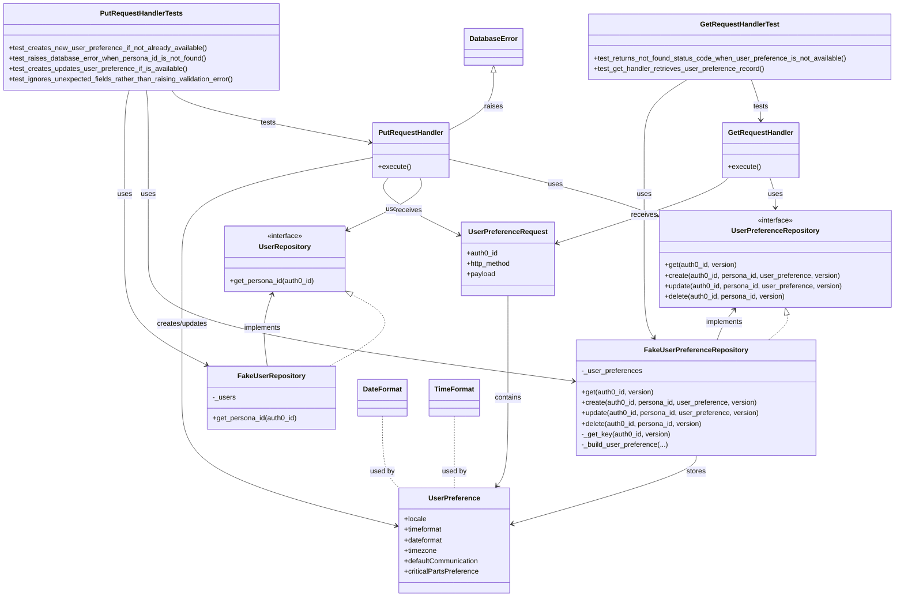

# Diagram: common/iam_service/tests/unit_tests/user_preferences/test_user_preference_handlers.py

> Auto-generated by Obscura crawlers

## Mermaid

### SVG

<svg id="container" width="2038.880859375" xmlns="http://www.w3.org/2000/svg" class="classDiagram" height="1362" viewBox="0 0 2038.880859375 1362" role="graphics-document document" aria-roledescription="class"><g><defs><marker id="container_class-aggregationStart" class="marker aggregation class" refX="18" refY="7" markerWidth="190" markerHeight="240" orient="auto"><path d="M 18,7 L9,13 L1,7 L9,1 Z"></path></marker></defs><defs><marker id="container_class-aggregationEnd" class="marker aggregation class" refX="1" refY="7" markerWidth="20" markerHeight="28" orient="auto"><path d="M 18,7 L9,13 L1,7 L9,1 Z"></path></marker></defs><defs><marker id="container_class-extensionStart" class="marker extension class" refX="18" refY="7" markerWidth="190" markerHeight="240" orient="auto"><path d="M 1,7 L18,13 V 1 Z"></path></marker></defs><defs><marker id="container_class-extensionEnd" class="marker extension class" refX="1" refY="7" markerWidth="20" markerHeight="28" orient="auto"><path d="M 1,1 V 13 L18,7 Z"></path></marker></defs><defs><marker id="container_class-compositionStart" class="marker composition class" refX="18" refY="7" markerWidth="190" markerHeight="240" orient="auto"><path d="M 18,7 L9,13 L1,7 L9,1 Z"></path></marker></defs><defs><marker id="container_class-compositionEnd" class="marker composition class" refX="1" refY="7" markerWidth="20" markerHeight="28" orient="auto"><path d="M 18,7 L9,13 L1,7 L9,1 Z"></path></marker></defs><defs><marker id="container_class-dependencyStart" class="marker dependency class" refX="6" refY="7" markerWidth="190" markerHeight="240" orient="auto"><path d="M 5,7 L9,13 L1,7 L9,1 Z"></path></marker></defs><defs><marker id="container_class-dependencyEnd" class="marker dependency class" refX="13" refY="7" markerWidth="20" markerHeight="28" orient="auto"><path d="M 18,7 L9,13 L14,7 L9,1 Z"></path></marker></defs><defs><marker id="container_class-lollipopStart" class="marker lollipop class" refX="13" refY="7" markerWidth="190" markerHeight="240" orient="auto"><circle stroke="black" fill="transparent" cx="7" cy="7" r="6"></circle></marker></defs><defs><marker id="container_class-lollipopEnd" class="marker lollipop class" refX="1" refY="7" markerWidth="190" markerHeight="240" orient="auto"><circle stroke="black" fill="transparent" cx="7" cy="7" r="6"></circle></marker></defs><g class="root"><g class="clusters"></g><g class="edgePaths"><path d="M807,673.546L827.187,684.455C847.374,695.364,887.747,717.182,878.719,744.258C869.691,771.333,811.261,803.667,782.046,819.833L752.831,836" id="id_UserRepository_FakeUserRepository_1" class="edge-thickness-normal edge-pattern-dashed relation" style=";;;" data-edge="true" data-et="edge" data-id="id_UserRepository_FakeUserRepository_1" data-points="W3sieCI6NzkxLjgyNDIxODc1LCJ5Ijo2NjUuMzQ1MTM4NDIzMzU3Mn0seyJ4Ijo5MjguMTIxMDkzNzUsInkiOjczOX0seyJ4Ijo3NTIuODMwOTkxMTI0MjYwMywieSI6ODM2fV0=" marker-start="url(#container_class-extensionStart)"></path><path d="M1790.68,718.871L1791.395,722.226C1792.11,725.581,1793.539,732.29,1786.544,741.812C1779.55,751.333,1764.131,763.667,1756.421,769.833L1748.711,776" id="id_UserPreferenceRepository_FakeUserPreferenceRepository_2" class="edge-thickness-normal edge-pattern-dashed relation" style=";;;" data-edge="true" data-et="edge" data-id="id_UserPreferenceRepository_FakeUserPreferenceRepository_2" data-points="W3sieCI6MTc4Ny4wODU5Mzc1LCJ5Ijo3MDJ9LHsieCI6MTc5NC45Njg3NSwieSI6NzM5fSx7IngiOjE3NDguNzExNDgwNjc2Nzc1MiwieSI6Nzc2fV0=" marker-start="url(#container_class-extensionStart)"></path><path d="M1751.23,406L1753.265,412.167C1755.299,418.333,1759.368,430.667,1761.403,442C1763.438,453.333,1763.438,463.667,1763.438,468.833L1763.438,474" id="id_GetRequestHandler_UserPreferenceRepository_3" class="edge-thickness-normal edge-pattern-solid relation" style=";;;" data-edge="true" data-et="edge" data-id="id_GetRequestHandler_UserPreferenceRepository_3" data-points="W3sieCI6MTc1MS4yMzAzOTA2MjUsInkiOjQwNn0seyJ4IjoxNzYzLjQzNzUsInkiOjQ0M30seyJ4IjoxNzYzLjQzNzUsInkiOjQ4MH1d" marker-end="url(#container_class-dependencyEnd)"></path><path d="M1656.958,406L1649.765,412.167C1642.572,418.333,1628.185,430.667,1563.151,455.476C1498.117,480.286,1382.435,517.571,1324.595,536.214L1266.754,554.857" id="id_GetRequestHandler_UserPreferenceRequest_4" class="edge-thickness-normal edge-pattern-solid relation" style=";;;" data-edge="true" data-et="edge" data-id="id_GetRequestHandler_UserPreferenceRequest_4" data-points="W3sieCI6MTY1Ni45NTgwMjczNDM3NSwieSI6NDA2fSx7IngiOjE2MTMuNzk4ODI4MTI1LCJ5Ijo0NDN9LHsieCI6MTI2MS4wNDI5Njg3NSwieSI6NTU2LjY5NzYzNjMzNTAyMn1d" marker-end="url(#container_class-dependencyEnd)"></path><path d="M1022.945,363.259L1078.592,376.549C1134.238,389.839,1245.531,416.42,1323.961,438.002C1402.39,459.585,1447.956,476.17,1470.739,484.463L1493.522,492.756" id="id_PutRequestHandler_UserPreferenceRepository_5" class="edge-thickness-normal edge-pattern-solid relation" style=";;;" data-edge="true" data-et="edge" data-id="id_PutRequestHandler_UserPreferenceRepository_5" data-points="W3sieCI6MTAyMi45NDUzMTI1LCJ5IjozNjMuMjU4Nzk3NjI2NTk5OTd9LHsieCI6MTM1Ni44MjQyMTg3NSwieSI6NDQzfSx7IngiOjE0OTkuMTYwMTU2MjUsInkiOjQ5NC44MDc3NDg4Mzk5Nzk2NH1d" marker-end="url(#container_class-dependencyEnd)"></path><path d="M958.906,406L960.941,412.167C962.975,418.333,967.044,430.667,940.103,450.367C913.162,470.068,855.211,497.135,826.236,510.669L797.26,524.203" id="id_PutRequestHandler_UserRepository_6" class="edge-thickness-normal edge-pattern-solid relation" style=";;;" data-edge="true" data-et="edge" data-id="id_PutRequestHandler_UserRepository_6" data-points="W3sieCI6OTU4LjkwNjE3MTg3NSwieSI6NDA2fSx7IngiOjk3MS4xMTMyODEyNSwieSI6NDQzfSx7IngiOjc5MS44MjQyMTg3NSwieSI6NTI2Ljc0MjA1MTYwNDQ3MjV9XQ==" marker-end="url(#container_class-dependencyEnd)"></path><path d="M886.181,406L881.096,412.167C876.012,418.333,865.844,430.667,891.95,452.275C918.055,473.883,980.435,504.766,1011.625,520.207L1042.814,535.649" id="id_PutRequestHandler_UserPreferenceRequest_7" class="edge-thickness-normal edge-pattern-solid relation" style=";;;" data-edge="true" data-et="edge" data-id="id_PutRequestHandler_UserPreferenceRequest_7" data-points="W3sieCI6ODg2LjE4MDU0Njg3NSwieSI6NDA2fSx7IngiOjg1NS42NzU3ODEyNSwieSI6NDQzfSx7IngiOjEwNDguMTkxNDA2MjUsInkiOjUzOC4zMTA2OTI2Nzg1OTI0fV0=" marker-end="url(#container_class-dependencyEnd)"></path><path d="M614.129,836L612.2,819.833C610.272,803.667,606.414,771.333,608.405,743.944C610.396,716.555,618.236,694.11,622.156,682.887L626.076,671.664" id="id_FakeUserRepository_UserRepository_8" class="edge-thickness-normal edge-pattern-solid relation" style=";;;" data-edge="true" data-et="edge" data-id="id_FakeUserRepository_UserRepository_8" data-points="W3sieCI6NjE0LjEyODk3NTU5MTcxNiwieSI6ODM2fSx7IngiOjYwMi41NTY2NDA2MjUsInkiOjczOX0seyJ4Ijo2MjguMDU0MDQwODU3MjYzNSwieSI6NjY2fV0=" marker-end="url(#container_class-dependencyEnd)"></path><path d="M1631.834,776L1634.083,769.833C1636.333,763.667,1640.831,751.333,1647.378,739.782C1653.925,728.23,1662.52,717.46,1666.817,712.075L1671.114,706.69" id="id_FakeUserPreferenceRepository_UserPreferenceRepository_9" class="edge-thickness-normal edge-pattern-solid relation" style=";;;" data-edge="true" data-et="edge" data-id="id_FakeUserPreferenceRepository_UserPreferenceRepository_9" data-points="W3sieCI6MTYzMS44MzM5MzgxNDcxODk0LCJ5Ijo3NzZ9LHsieCI6MTY0NS4zMzAwNzgxMjUsInkiOjczOX0seyJ4IjoxNjc0Ljg1NjkzMzU5Mzc1LCJ5Ijo3MDJ9XQ==" marker-end="url(#container_class-dependencyEnd)"></path><path d="M1709.737,182L1713.188,192.167C1716.64,202.333,1723.542,222.667,1726.994,238C1730.445,253.333,1730.445,263.667,1730.445,268.833L1730.445,274" id="id_GetRequestHandlerTest_GetRequestHandler_10" class="edge-thickness-normal edge-pattern-solid relation" style=";;;" data-edge="true" data-et="edge" data-id="id_GetRequestHandlerTest_GetRequestHandler_10" data-points="W3sieCI6MTcwOS43MzY3NDQ2MDAxODM4LCJ5IjoxODJ9LHsieCI6MTczMC40NDUzMTI1LCJ5IjoyNDN9LHsieCI6MTczMC40NDUzMTI1LCJ5IjoyODB9XQ==" marker-end="url(#container_class-dependencyEnd)"></path><path d="M1562.888,182L1546.434,192.167C1529.979,202.333,1497.07,222.667,1480.615,249.5C1464.16,276.333,1464.16,309.667,1464.16,343C1464.16,376.333,1464.16,409.667,1464.16,451C1464.16,492.333,1464.16,541.667,1464.16,591C1464.16,640.333,1464.16,689.667,1467.944,719.684C1471.728,749.7,1479.296,760.401,1483.08,765.751L1486.864,771.101" id="id_GetRequestHandlerTest_FakeUserPreferenceRepository_11" class="edge-thickness-normal edge-pattern-solid relation" style=";;;" data-edge="true" data-et="edge" data-id="id_GetRequestHandlerTest_FakeUserPreferenceRepository_11" data-points="W3sieCI6MTU2Mi44ODgzMTI4NDQ2NjkxLCJ5IjoxODJ9LHsieCI6MTQ2NC4xNjAxNTYyNSwieSI6MjQzfSx7IngiOjE0NjQuMTYwMTU2MjUsInkiOjM0M30seyJ4IjoxNDY0LjE2MDE1NjI1LCJ5Ijo0NDN9LHsieCI6MTQ2NC4xNjAxNTYyNSwieSI6NTkxfSx7IngiOjE0NjQuMTYwMTU2MjUsInkiOjczOX0seyJ4IjoxNDkwLjMyODQzNzAzNzcyMTksInkiOjc3Nn1d" marker-end="url(#container_class-dependencyEnd)"></path><path d="M395.034,206L399.342,212.167C403.649,218.333,412.264,230.667,487.659,250.577C563.055,270.487,705.23,297.975,776.318,311.718L847.406,325.462" id="id_PutRequestHandlerTests_PutRequestHandler_12" class="edge-thickness-normal edge-pattern-solid relation" style=";;;" data-edge="true" data-et="edge" data-id="id_PutRequestHandlerTests_PutRequestHandler_12" data-points="W3sieCI6Mzk1LjAzNDM4MDc0NDQ4NTMsInkiOjIwNn0seyJ4Ijo0MjAuODc4OTA2MjUsInkiOjI0M30seyJ4Ijo4NTMuMjk2ODc1LCJ5IjozMjYuNjAwNjc2NjY1NjA5NH1d" marker-end="url(#container_class-dependencyEnd)"></path><path d="M337.776,206L338.517,212.167C339.257,218.333,340.739,230.667,341.48,253.5C342.221,276.333,342.221,309.667,342.221,343C342.221,376.333,342.221,409.667,342.221,451C342.221,492.333,342.221,541.667,342.221,591C342.221,640.333,342.221,689.667,502.717,736.182C663.214,782.697,984.208,826.393,1144.705,848.242L1305.201,870.09" id="id_PutRequestHandlerTests_FakeUserPreferenceRepository_13" class="edge-thickness-normal edge-pattern-solid relation" style=";;;" data-edge="true" data-et="edge" data-id="id_PutRequestHandlerTests_FakeUserPreferenceRepository_13" data-points="W3sieCI6MzM3Ljc3NTgzNTgyMjYxMDMsInkiOjIwNn0seyJ4IjozNDIuMjIwNzAzMTI1LCJ5IjoyNDN9LHsieCI6MzQyLjIyMDcwMzEyNSwieSI6MzQzfSx7IngiOjM0Mi4yMjA3MDMxMjUsInkiOjQ0M30seyJ4IjozNDIuMjIwNzAzMTI1LCJ5Ijo1OTF9LHsieCI6MzQyLjIyMDcwMzEyNSwieSI6NzM5fSx7IngiOjEzMTEuMTQ2NDg0Mzc1LCJ5Ijo4NzAuODk5MzkxMTU1MjMxOH1d" marker-end="url(#container_class-dependencyEnd)"></path><path d="M299.206,206L297.545,212.167C295.883,218.333,292.56,230.667,290.898,253.5C289.236,276.333,289.236,309.667,289.236,343C289.236,376.333,289.236,409.667,289.236,451C289.236,492.333,289.236,541.667,289.236,591C289.236,640.333,289.236,689.667,320.246,730.048C351.255,770.429,413.273,801.859,444.282,817.573L475.291,833.288" id="id_PutRequestHandlerTests_FakeUserRepository_14" class="edge-thickness-normal edge-pattern-solid relation" style=";;;" data-edge="true" data-et="edge" data-id="id_PutRequestHandlerTests_FakeUserRepository_14" data-points="W3sieCI6Mjk5LjIwNjMyNzU1MDU1MTQ2LCJ5IjoyMDZ9LHsieCI6Mjg5LjIzNjMyODEyNSwieSI6MjQzfSx7IngiOjI4OS4yMzYzMjgxMjUsInkiOjM0M30seyJ4IjoyODkuMjM2MzI4MTI1LCJ5Ijo0NDN9LHsieCI6Mjg5LjIzNjMyODEyNSwieSI6NTkxfSx7IngiOjI4OS4yMzYzMjgxMjUsInkiOjczOX0seyJ4Ijo0ODAuNjQzMzk4NjY4NjM5MDcsInkiOjgzNn1d" marker-end="url(#container_class-dependencyEnd)"></path><path d="M1154.617,675L1154.617,685.667C1154.617,696.333,1154.617,717.667,1154.617,756.5C1154.617,795.333,1154.617,851.667,1154.617,908C1154.617,964.333,1154.617,1020.667,1150.461,1054.209C1146.306,1087.751,1137.994,1098.502,1133.838,1103.878L1129.683,1109.253" id="id_UserPreferenceRequest_UserPreference_15" class="edge-thickness-normal edge-pattern-solid relation" style=";;;" data-edge="true" data-et="edge" data-id="id_UserPreferenceRequest_UserPreference_15" data-points="W3sieCI6MTE1NC42MTcxODc1LCJ5Ijo2NzV9LHsieCI6MTE1NC42MTcxODc1LCJ5Ijo3Mzl9LHsieCI6MTE1NC42MTcxODc1LCJ5Ijo5MDh9LHsieCI6MTE1NC42MTcxODc1LCJ5IjoxMDc3fSx7IngiOjExMjYuMDEyODg4MTM2OTQyNiwieSI6MTExNH1d" marker-end="url(#container_class-dependencyEnd)"></path><path d="M853.297,359.426L781.368,373.355C709.438,387.284,565.579,415.142,493.65,453.738C421.721,492.333,421.721,541.667,421.721,591C421.721,640.333,421.721,689.667,421.721,742.5C421.721,795.333,421.721,851.667,421.721,908C421.721,964.333,421.721,1020.667,501.545,1069.327C581.369,1117.988,741.017,1158.975,820.841,1179.469L900.665,1199.963" id="id_PutRequestHandler_UserPreference_16" class="edge-thickness-normal edge-pattern-solid relation" style=";;;" data-edge="true" data-et="edge" data-id="id_PutRequestHandler_UserPreference_16" data-points="W3sieCI6ODUzLjI5Njg3NSwieSI6MzU5LjQyNjA1NjI3MTQ0MDN9LHsieCI6NDIxLjcyMDcwMzEyNSwieSI6NDQzfSx7IngiOjQyMS43MjA3MDMxMjUsInkiOjU5MX0seyJ4Ijo0MjEuNzIwNzAzMTI1LCJ5Ijo3Mzl9LHsieCI6NDIxLjcyMDcwMzEyNSwieSI6OTA4fSx7IngiOjQyMS43MjA3MDMxMjUsInkiOjEwNzd9LHsieCI6OTA2LjQ3NjU2MjUsInkiOjEyMDEuNDU0NjEzMzk3MDQwNX1d" marker-end="url(#container_class-dependencyEnd)"></path><path d="M1583.686,1040L1583.686,1046.167C1583.686,1052.333,1583.686,1064.667,1514.034,1090.7C1444.383,1116.733,1305.08,1156.465,1235.429,1176.331L1165.778,1196.198" id="id_FakeUserPreferenceRepository_UserPreference_17" class="edge-thickness-normal edge-pattern-solid relation" style=";;;" data-edge="true" data-et="edge" data-id="id_FakeUserPreferenceRepository_UserPreference_17" data-points="W3sieCI6MTU4My42ODU1NDY4NzUsInkiOjEwNDB9LHsieCI6MTU4My42ODU1NDY4NzUsInkiOjEwNzd9LHsieCI6MTE2MC4wMDc4MTI1LCJ5IjoxMTk3Ljg0MzMyMjMyMTg0OTl9XQ==" marker-end="url(#container_class-dependencyEnd)"></path><path d="M1122.721,166.25L1122.721,179.042C1122.721,191.833,1122.721,217.417,1106.091,239.217C1089.462,261.017,1056.204,279.033,1039.575,288.041L1022.945,297.05" id="id_DatabaseError_PutRequestHandler_18" class="edge-thickness-normal edge-pattern-solid relation" style=";;;" data-edge="true" data-et="edge" data-id="id_DatabaseError_PutRequestHandler_18" data-points="W3sieCI6MTEyMi43MjA3MDMxMjUsInkiOjE0OX0seyJ4IjoxMTIyLjcyMDcwMzEyNSwieSI6MjQzfSx7IngiOjEwMjIuOTQ1MzEyNSwieSI6Mjk3LjA0OTYyMTc1MzE2MDg2fV0=" marker-start="url(#container_class-extensionStart)"></path><path d="M873.156,950L873.156,971.167C873.156,992.333,873.156,1034.667,879.444,1062C885.732,1089.333,898.308,1101.667,904.596,1107.833L910.884,1114" id="id_DateFormat_UserPreference_19" class="edge-thickness-normal edge-pattern-dashed relation" style=";;;" data-edge="true" data-et="edge" data-id="id_DateFormat_UserPreference_19" data-points="W3sieCI6ODczLjE1NjI1LCJ5Ijo5NTB9LHsieCI6ODczLjE1NjI1LCJ5IjoxMDc3fSx7IngiOjkxMC44ODM1MDkxNTYwNTEsInkiOjExMTR9XQ=="></path><path d="M1033.242,950L1033.242,971.167C1033.242,992.333,1033.242,1034.667,1033.242,1062C1033.242,1089.333,1033.242,1101.667,1033.242,1107.833L1033.242,1114" id="id_TimeFormat_UserPreference_20" class="edge-thickness-normal edge-pattern-dashed relation" style=";;;" data-edge="true" data-et="edge" data-id="id_TimeFormat_UserPreference_20" data-points="W3sieCI6MTAzMy4yNDIxODc1LCJ5Ijo5NTB9LHsieCI6MTAzMy4yNDIxODc1LCJ5IjoxMDc3fSx7IngiOjEwMzMuMjQyMTg3NSwieSI6MTExNH1d"></path></g><g class="edgeLabels"><g class="edgeLabel"><g class="label" data-id="id_UserRepository_FakeUserRepository_1" transform="translate(0, 0)"><foreignObject width="0" height="0">

</foreignObject></g></g><g class="edgeLabel"><g class="label" data-id="id_UserPreferenceRepository_FakeUserPreferenceRepository_2" transform="translate(0, 0)"><foreignObject width="0" height="0">

</foreignObject></g></g><g class="edgeLabel" transform="translate(1763.4375, 443)"><g class="label" data-id="id_GetRequestHandler_UserPreferenceRepository_3" transform="translate(-16.4921875, -12)"><foreignObject width="32.984375" height="24">

uses

</foreignObject></g></g><g class="edgeLabel" transform="translate(1464.47447, 491.12911)"><g class="label" data-id="id_GetRequestHandler_UserPreferenceRequest_4" transform="translate(-29.4921875, -12)"><foreignObject width="58.984375" height="24">

receives

</foreignObject></g></g><g class="edgeLabel" transform="translate(1263.54863, 420.72274)"><g class="label" data-id="id_PutRequestHandler_UserPreferenceRepository_5" transform="translate(-16.4921875, -12)"><foreignObject width="32.984375" height="24">

uses

</foreignObject></g></g><g class="edgeLabel" transform="translate(899.11918, 476.62689)"><g class="label" data-id="id_PutRequestHandler_UserRepository_6" transform="translate(-16.4921875, -12)"><foreignObject width="32.984375" height="24">

uses

</foreignObject></g></g><g class="edgeLabel" transform="translate(930.44601, 480.01727)"><g class="label" data-id="id_PutRequestHandler_UserPreferenceRequest_7" transform="translate(-29.4921875, -12)"><foreignObject width="58.984375" height="24">

receives

</foreignObject></g></g><g class="edgeLabel" transform="translate(603.76277, 749.10986)"><g class="label" data-id="id_FakeUserRepository_UserRepository_8" transform="translate(-43.0625, -12)"><foreignObject width="86.125" height="24">

implements

</foreignObject></g></g><g class="edgeLabel" transform="translate(1647.81039, 735.89193)"><g class="label" data-id="id_FakeUserPreferenceRepository_UserPreferenceRepository_9" transform="translate(-43.0625, -12)"><foreignObject width="86.125" height="24">

implements

</foreignObject></g></g><g class="edgeLabel" transform="translate(1730.4453125, 243)"><g class="label" data-id="id_GetRequestHandlerTest_GetRequestHandler_10" transform="translate(-17.4921875, -12)"><foreignObject width="34.984375" height="24">

tests

</foreignObject></g></g><g class="edgeLabel" transform="translate(1464.16015625, 443)"><g class="label" data-id="id_GetRequestHandlerTest_FakeUserPreferenceRepository_11" transform="translate(-16.4921875, -12)"><foreignObject width="32.984375" height="24">

uses

</foreignObject></g></g><g class="edgeLabel" transform="translate(614.93193, 280.51686)"><g class="label" data-id="id_PutRequestHandlerTests_PutRequestHandler_12" transform="translate(-17.4921875, -12)"><foreignObject width="34.984375" height="24">

tests

</foreignObject></g></g><g class="edgeLabel" transform="translate(342.220703125, 443)"><g class="label" data-id="id_PutRequestHandlerTests_FakeUserPreferenceRepository_13" transform="translate(-16.4921875, -12)"><foreignObject width="32.984375" height="24">

uses

</foreignObject></g></g><g class="edgeLabel" transform="translate(289.236328125, 443)"><g class="label" data-id="id_PutRequestHandlerTests_FakeUserRepository_14" transform="translate(-16.4921875, -12)"><foreignObject width="32.984375" height="24">

uses

</foreignObject></g></g><g class="edgeLabel" transform="translate(1154.6171875, 908)"><g class="label" data-id="id_UserPreferenceRequest_UserPreference_15" transform="translate(-30.890625, -12)"><foreignObject width="61.78125" height="24">

contains

</foreignObject></g></g><g class="edgeLabel" transform="translate(421.720703125, 739)"><g class="label" data-id="id_PutRequestHandler_UserPreference_16" transform="translate(-59.5, -12)"><foreignObject width="119" height="24">

creates/updates

</foreignObject></g></g><g class="edgeLabel" transform="translate(1583.685546875, 1077)"><g class="label" data-id="id_FakeUserPreferenceRepository_UserPreference_17" transform="translate(-22.125, -12)"><foreignObject width="44.25" height="24">

stores

</foreignObject></g></g><g class="edgeLabel" transform="translate(1122.720703125, 243)"><g class="label" data-id="id_DatabaseError_PutRequestHandler_18" transform="translate(-21.25, -12)"><foreignObject width="42.5" height="24">

raises

</foreignObject></g></g><g class="edgeLabel" transform="translate(873.15625, 1077)"><g class="label" data-id="id_DateFormat_UserPreference_19" transform="translate(-28.3125, -12)"><foreignObject width="56.625" height="24">

used by

</foreignObject></g></g><g class="edgeLabel" transform="translate(1033.2421875, 1077)"><g class="label" data-id="id_TimeFormat_UserPreference_20" transform="translate(-28.3125, -12)"><foreignObject width="56.625" height="24">

used by

</foreignObject></g></g></g><g class="nodes"><g class="node default" id="classId-GetRequestHandler-0" transform="translate(1730.4453125, 343)"><g class="basic label-container"><path d="M-85.03125 -63 L85.03125 -63 L85.03125 63 L-85.03125 63" stroke="none" stroke-width="0" fill="#ECECFF" style=""></path><path d="M-85.03125 -63 C-23.24805509370715 -63, 38.5351398125857 -63, 85.03125 -63 M-85.03125 -63 C-30.747368351296608 -63, 23.536513297406785 -63, 85.03125 -63 M85.03125 -63 C85.03125 -30.996747993843314, 85.03125 1.0065040123133713, 85.03125 63 M85.03125 -63 C85.03125 -32.42442805093279, 85.03125 -1.8488561018655716, 85.03125 63 M85.03125 63 C35.84943023716175 63, -13.332389525676504 63, -85.03125 63 M85.03125 63 C27.87598270499575 63, -29.2792845900085 63, -85.03125 63 M-85.03125 63 C-85.03125 26.59833414625801, -85.03125 -9.803331707483977, -85.03125 -63 M-85.03125 63 C-85.03125 18.369438314983817, -85.03125 -26.261123370032365, -85.03125 -63" stroke="#9370DB" stroke-width="1.3" fill="none" stroke-dasharray="0 0" style=""></path></g><g class="annotation-group text" transform="translate(0, -39)"></g><g class="label-group text" transform="translate(-71.734375, -39)"><g class="label" style="font-weight: bolder" transform="translate(0,-12)"><foreignObject width="143.46875" height="24">

GetRequestHandler

</foreignObject></g></g><g class="members-group text" transform="translate(-73.03125, 9)"></g><g class="methods-group text" transform="translate(-73.03125, 39)"><g class="label" style="" transform="translate(0,-12)"><foreignObject width="74.328125" height="24">

+execute()

</foreignObject></g></g><g class="divider" style=""><path d="M-85.03125 -15 C-34.18884224373051 -15, 16.653565512538975 -15, 85.03125 -15 M-85.03125 -15 C-37.65346812182499 -15, 9.724313756350014 -15, 85.03125 -15" stroke="#9370DB" stroke-width="1.3" fill="none" stroke-dasharray="0 0" style=""></path></g><g class="divider" style=""><path d="M-85.03125 9 C-39.104470735716525 9, 6.82230852856695 9, 85.03125 9 M-85.03125 9 C-45.426877291275204 9, -5.822504582550408 9, 85.03125 9" stroke="#9370DB" stroke-width="1.3" fill="none" stroke-dasharray="0 0" style=""></path></g></g><g class="node default" id="classId-PutRequestHandler-1" transform="translate(938.12109375, 343)"><g class="basic label-container"><path d="M-84.82421875 -63 L84.82421875 -63 L84.82421875 63 L-84.82421875 63" stroke="none" stroke-width="0" fill="#ECECFF" style=""></path><path d="M-84.82421875 -63 C-49.7494804270253 -63, -14.674742104050594 -63, 84.82421875 -63 M-84.82421875 -63 C-38.22080408394388 -63, 8.382610582112235 -63, 84.82421875 -63 M84.82421875 -63 C84.82421875 -16.36676616815, 84.82421875 30.2664676637, 84.82421875 63 M84.82421875 -63 C84.82421875 -35.586927972946725, 84.82421875 -8.173855945893457, 84.82421875 63 M84.82421875 63 C33.73929392813001 63, -17.34563089373998 63, -84.82421875 63 M84.82421875 63 C37.28803691549157 63, -10.248144919016866 63, -84.82421875 63 M-84.82421875 63 C-84.82421875 24.26470480318944, -84.82421875 -14.470590393621123, -84.82421875 -63 M-84.82421875 63 C-84.82421875 12.742419522197793, -84.82421875 -37.515160955604415, -84.82421875 -63" stroke="#9370DB" stroke-width="1.3" fill="none" stroke-dasharray="0 0" style=""></path></g><g class="annotation-group text" transform="translate(0, -39)"></g><g class="label-group text" transform="translate(-71.3203125, -39)"><g class="label" style="font-weight: bolder" transform="translate(0,-12)"><foreignObject width="142.640625" height="24">

PutRequestHandler

</foreignObject></g></g><g class="members-group text" transform="translate(-72.82421875, 9)"></g><g class="methods-group text" transform="translate(-72.82421875, 39)"><g class="label" style="" transform="translate(0,-12)"><foreignObject width="74.328125" height="24">

+execute()

</foreignObject></g></g><g class="divider" style=""><path d="M-84.82421875 -15 C-46.57453890136213 -15, -8.324859052724264 -15, 84.82421875 -15 M-84.82421875 -15 C-27.614352208438618 -15, 29.595514333122765 -15, 84.82421875 -15" stroke="#9370DB" stroke-width="1.3" fill="none" stroke-dasharray="0 0" style=""></path></g><g class="divider" style=""><path d="M-84.82421875 9 C-22.076980373695676 9, 40.67025800260865 9, 84.82421875 9 M-84.82421875 9 C-42.87066874963765 9, -0.9171187492753035 9, 84.82421875 9" stroke="#9370DB" stroke-width="1.3" fill="none" stroke-dasharray="0 0" style=""></path></g></g><g class="node default" id="classId-UserPreferenceRequest-2" transform="translate(1154.6171875, 591)"><g class="basic label-container"><path d="M-106.42578125 -84 L106.42578125 -84 L106.42578125 84 L-106.42578125 84" stroke="none" stroke-width="0" fill="#ECECFF" style=""></path><path d="M-106.42578125 -84 C-52.94942672836254 -84, 0.5269277932749219 -84, 106.42578125 -84 M-106.42578125 -84 C-30.167560488512834 -84, 46.09066027297433 -84, 106.42578125 -84 M106.42578125 -84 C106.42578125 -47.66561758187416, 106.42578125 -11.331235163748318, 106.42578125 84 M106.42578125 -84 C106.42578125 -29.72707248638355, 106.42578125 24.545855027232903, 106.42578125 84 M106.42578125 84 C34.35025635743612 84, -37.72526853512775 84, -106.42578125 84 M106.42578125 84 C29.348405818479392 84, -47.728969613041215 84, -106.42578125 84 M-106.42578125 84 C-106.42578125 49.36979584131723, -106.42578125 14.739591682634455, -106.42578125 -84 M-106.42578125 84 C-106.42578125 23.365452785752566, -106.42578125 -37.26909442849487, -106.42578125 -84" stroke="#9370DB" stroke-width="1.3" fill="none" stroke-dasharray="0 0" style=""></path></g><g class="annotation-group text" transform="translate(0, -60)"></g><g class="label-group text" transform="translate(-85.9296875, -60)"><g class="label" style="font-weight: bolder" transform="translate(0,-12)"><foreignObject width="171.859375" height="24">

UserPreferenceRequest

</foreignObject></g></g><g class="members-group text" transform="translate(-94.42578125, -12)"><g class="label" style="" transform="translate(0,-12)"><foreignObject width="71.765625" height="24">

+auth0_id

</foreignObject></g><g class="label" style="" transform="translate(0,12)"><foreignObject width="102.921875" height="24">

+http_method

</foreignObject></g><g class="label" style="" transform="translate(0,36)"><foreignObject width="65.734375" height="24">

+payload

</foreignObject></g></g><g class="methods-group text" transform="translate(-94.42578125, 84)"></g><g class="divider" style=""><path d="M-106.42578125 -36 C-34.71386327270173 -36, 36.99805470459654 -36, 106.42578125 -36 M-106.42578125 -36 C-49.280502536023235 -36, 7.86477617795353 -36, 106.42578125 -36" stroke="#9370DB" stroke-width="1.3" fill="none" stroke-dasharray="0 0" style=""></path></g><g class="divider" style=""><path d="M-106.42578125 60 C-47.89189661041938 60, 10.64198802916124 60, 106.42578125 60 M-106.42578125 60 C-23.081132718666368 60, 60.263515812667265 60, 106.42578125 60" stroke="#9370DB" stroke-width="1.3" fill="none" stroke-dasharray="0 0" style=""></path></g></g><g class="node default" id="classId-UserPreference-3" transform="translate(1033.2421875, 1234)"><g class="basic label-container"><path d="M-126.765625 -120 L126.765625 -120 L126.765625 120 L-126.765625 120" stroke="none" stroke-width="0" fill="#ECECFF" style=""></path><path d="M-126.765625 -120 C-43.5454013111122 -120, 39.6748223777756 -120, 126.765625 -120 M-126.765625 -120 C-73.38487076847309 -120, -20.004116536946185 -120, 126.765625 -120 M126.765625 -120 C126.765625 -28.99933473960988, 126.765625 62.00133052078024, 126.765625 120 M126.765625 -120 C126.765625 -62.585417698952206, 126.765625 -5.170835397904412, 126.765625 120 M126.765625 120 C30.062965513266676 120, -66.63969397346665 120, -126.765625 120 M126.765625 120 C70.50991368163683 120, 14.254202363273663 120, -126.765625 120 M-126.765625 120 C-126.765625 47.30487270285235, -126.765625 -25.3902545942953, -126.765625 -120 M-126.765625 120 C-126.765625 52.93210091152102, -126.765625 -14.135798176957962, -126.765625 -120" stroke="#9370DB" stroke-width="1.3" fill="none" stroke-dasharray="0 0" style=""></path></g><g class="annotation-group text" transform="translate(0, -96)"></g><g class="label-group text" transform="translate(-55.953125, -96)"><g class="label" style="font-weight: bolder" transform="translate(0,-12)"><foreignObject width="111.90625" height="24">

UserPreference

</foreignObject></g></g><g class="members-group text" transform="translate(-114.765625, -48)"><g class="label" style="" transform="translate(0,-12)"><foreignObject width="51.296875" height="24">

+locale

</foreignObject></g><g class="label" style="" transform="translate(0,12)"><foreignObject width="89.546875" height="24">

+timeformat

</foreignObject></g><g class="label" style="" transform="translate(0,36)"><foreignObject width="89.4375" height="24">

+dateformat

</foreignObject></g><g class="label" style="" transform="translate(0,60)"><foreignObject width="74.84375" height="24">

+timezone

</foreignObject></g><g class="label" style="" transform="translate(0,84)"><foreignObject width="173.578125" height="24">

+defaultCommunication

</foreignObject></g><g class="label" style="" transform="translate(0,108)"><foreignObject width="171.03125" height="24">

+criticalPartsPreference

</foreignObject></g></g><g class="methods-group text" transform="translate(-114.765625, 120)"></g><g class="divider" style=""><path d="M-126.765625 -72 C-56.574159417823196 -72, 13.617306164353607 -72, 126.765625 -72 M-126.765625 -72 C-74.97647056436716 -72, -23.187316128734338 -72, 126.765625 -72" stroke="#9370DB" stroke-width="1.3" fill="none" stroke-dasharray="0 0" style=""></path></g><g class="divider" style=""><path d="M-126.765625 96 C-55.66164931326526 96, 15.442326373469484 96, 126.765625 96 M-126.765625 96 C-62.70757464322416 96, 1.350475713551674 96, 126.765625 96" stroke="#9370DB" stroke-width="1.3" fill="none" stroke-dasharray="0 0" style=""></path></g></g><g class="node default" id="classId-UserRepository-4" transform="translate(654.25, 591)"><g class="basic label-container"><path d="M-137.57421875 -75 L137.57421875 -75 L137.57421875 75 L-137.57421875 75" stroke="none" stroke-width="0" fill="#ECECFF" style=""></path><path d="M-137.57421875 -75 C-67.73769394828183 -75, 2.09883085343634 -75, 137.57421875 -75 M-137.57421875 -75 C-34.103713294737915 -75, 69.36679216052417 -75, 137.57421875 -75 M137.57421875 -75 C137.57421875 -25.370675631821868, 137.57421875 24.258648736356264, 137.57421875 75 M137.57421875 -75 C137.57421875 -30.657655594754885, 137.57421875 13.68468881049023, 137.57421875 75 M137.57421875 75 C54.911755000399765 75, -27.75070874920047 75, -137.57421875 75 M137.57421875 75 C45.64966829744267 75, -46.27488215511465 75, -137.57421875 75 M-137.57421875 75 C-137.57421875 15.416961032045748, -137.57421875 -44.166077935908504, -137.57421875 -75 M-137.57421875 75 C-137.57421875 42.70741100734955, -137.57421875 10.414822014699098, -137.57421875 -75" stroke="#9370DB" stroke-width="1.3" fill="none" stroke-dasharray="0 0" style=""></path></g><g class="annotation-group text" transform="translate(-41.015625, -51)"><g class="label" style="" transform="translate(0,-12)"><foreignObject width="82.03125" height="24">

«interface»

</foreignObject></g></g><g class="label-group text" transform="translate(-56.4296875, -27)"><g class="label" style="font-weight: bolder" transform="translate(0,-12)"><foreignObject width="112.859375" height="24">

UserRepository

</foreignObject></g></g><g class="members-group text" transform="translate(-125.57421875, 21)"></g><g class="methods-group text" transform="translate(-125.57421875, 51)"><g class="label" style="" transform="translate(0,-12)"><foreignObject width="194.71875" height="24">

+get_persona_id(auth0_id)

</foreignObject></g></g><g class="divider" style=""><path d="M-137.57421875 -3 C-47.786019104353144 -3, 42.00218054129371 -3, 137.57421875 -3 M-137.57421875 -3 C-46.34108991202116 -3, 44.89203892595768 -3, 137.57421875 -3" stroke="#9370DB" stroke-width="1.3" fill="none" stroke-dasharray="0 0" style=""></path></g><g class="divider" style=""><path d="M-137.57421875 21 C-44.80339515274038 21, 47.96742844451924 21, 137.57421875 21 M-137.57421875 21 C-63.46851886745962 21, 10.637181015080756 21, 137.57421875 21" stroke="#9370DB" stroke-width="1.3" fill="none" stroke-dasharray="0 0" style=""></path></g></g><g class="node default" id="classId-UserPreferenceRepository-5" transform="translate(1763.4375, 591)"><g class="basic label-container"><path d="M-264.27734375 -111 L264.27734375 -111 L264.27734375 111 L-264.27734375 111" stroke="none" stroke-width="0" fill="#ECECFF" style=""></path><path d="M-264.27734375 -111 C-58.12630949256268 -111, 148.02472476487463 -111, 264.27734375 -111 M-264.27734375 -111 C-127.55975755693538 -111, 9.157828636129238 -111, 264.27734375 -111 M264.27734375 -111 C264.27734375 -29.207118580876056, 264.27734375 52.58576283824789, 264.27734375 111 M264.27734375 -111 C264.27734375 -44.508969517745314, 264.27734375 21.982060964509373, 264.27734375 111 M264.27734375 111 C133.4847869962265 111, 2.692230242452979 111, -264.27734375 111 M264.27734375 111 C96.05079280521974 111, -72.17575813956051 111, -264.27734375 111 M-264.27734375 111 C-264.27734375 56.14910330563483, -264.27734375 1.2982066112696629, -264.27734375 -111 M-264.27734375 111 C-264.27734375 36.23772911735904, -264.27734375 -38.524541765281924, -264.27734375 -111" stroke="#9370DB" stroke-width="1.3" fill="none" stroke-dasharray="0 0" style=""></path></g><g class="annotation-group text" transform="translate(-41.015625, -87)"><g class="label" style="" transform="translate(0,-12)"><foreignObject width="82.03125" height="24">

«interface»

</foreignObject></g></g><g class="label-group text" transform="translate(-95.7265625, -63)"><g class="label" style="font-weight: bolder" transform="translate(0,-12)"><foreignObject width="191.453125" height="24">

UserPreferenceRepository

</foreignObject></g></g><g class="members-group text" transform="translate(-252.27734375, -15)"></g><g class="methods-group text" transform="translate(-252.27734375, 15)"><g class="label" style="" transform="translate(0,-12)"><foreignObject width="166.1875" height="24">

+get(auth0_id, version)

</foreignObject></g><g class="label" style="" transform="translate(0,12)"><foreignObject width="402.34375" height="24">

+create(auth0_id, persona_id, user_preference, version)

</foreignObject></g><g class="label" style="" transform="translate(0,36)"><foreignObject width="408.828125" height="24">

+update(auth0_id, persona_id, user_preference, version)

</foreignObject></g><g class="label" style="" transform="translate(0,60)"><foreignObject width="279.03125" height="24">

+delete(auth0_id, persona_id, version)

</foreignObject></g></g><g class="divider" style=""><path d="M-264.27734375 -39 C-146.8781138665836 -39, -29.47888398316718 -39, 264.27734375 -39 M-264.27734375 -39 C-113.70913650194004 -39, 36.859070746119926 -39, 264.27734375 -39" stroke="#9370DB" stroke-width="1.3" fill="none" stroke-dasharray="0 0" style=""></path></g><g class="divider" style=""><path d="M-264.27734375 -15 C-126.30481863864199 -15, 11.66770647271602 -15, 264.27734375 -15 M-264.27734375 -15 C-140.04205831792302 -15, -15.806772885846044 -15, 264.27734375 -15" stroke="#9370DB" stroke-width="1.3" fill="none" stroke-dasharray="0 0" style=""></path></g></g><g class="node default" id="classId-FakeUserRepository-6" transform="translate(622.71875, 908)"><g class="basic label-container"><path d="M-145.8359375 -72 L145.8359375 -72 L145.8359375 72 L-145.8359375 72" stroke="none" stroke-width="0" fill="#ECECFF" style=""></path><path d="M-145.8359375 -72 C-77.59742093147882 -72, -9.358904362957645 -72, 145.8359375 -72 M-145.8359375 -72 C-85.22854705817127 -72, -24.621156616342546 -72, 145.8359375 -72 M145.8359375 -72 C145.8359375 -37.65206320318913, 145.8359375 -3.304126406378259, 145.8359375 72 M145.8359375 -72 C145.8359375 -17.219018263186015, 145.8359375 37.56196347362797, 145.8359375 72 M145.8359375 72 C71.77288965739284 72, -2.290158185214324 72, -145.8359375 72 M145.8359375 72 C60.910662510760815 72, -24.01461247847837 72, -145.8359375 72 M-145.8359375 72 C-145.8359375 22.688303061364373, -145.8359375 -26.623393877271255, -145.8359375 -72 M-145.8359375 72 C-145.8359375 36.05023171291498, -145.8359375 0.10046342582995749, -145.8359375 -72" stroke="#9370DB" stroke-width="1.3" fill="none" stroke-dasharray="0 0" style=""></path></g><g class="annotation-group text" transform="translate(0, -48)"></g><g class="label-group text" transform="translate(-72.953125, -48)"><g class="label" style="font-weight: bolder" transform="translate(0,-12)"><foreignObject width="145.90625" height="24">

FakeUserRepository

</foreignObject></g></g><g class="members-group text" transform="translate(-133.8359375, 0)"><g class="label" style="" transform="translate(0,-12)"><foreignObject width="52.09375" height="24">

-_users

</foreignObject></g></g><g class="methods-group text" transform="translate(-133.8359375, 48)"><g class="label" style="" transform="translate(0,-12)"><foreignObject width="194.71875" height="24">

+get_persona_id(auth0_id)

</foreignObject></g></g><g class="divider" style=""><path d="M-145.8359375 -24 C-71.30598728449743 -24, 3.2239629310051328 -24, 145.8359375 -24 M-145.8359375 -24 C-60.220068797336836 -24, 25.395799905326328 -24, 145.8359375 -24" stroke="#9370DB" stroke-width="1.3" fill="none" stroke-dasharray="0 0" style=""></path></g><g class="divider" style=""><path d="M-145.8359375 24 C-55.730259678337816 24, 34.37541814332437 24, 145.8359375 24 M-145.8359375 24 C-58.35119776165318 24, 29.133541976693635 24, 145.8359375 24" stroke="#9370DB" stroke-width="1.3" fill="none" stroke-dasharray="0 0" style=""></path></g></g><g class="node default" id="classId-FakeUserPreferenceRepository-7" transform="translate(1583.685546875, 908)"><g class="basic label-container"><path d="M-272.5390625 -132 L272.5390625 -132 L272.5390625 132 L-272.5390625 132" stroke="none" stroke-width="0" fill="#ECECFF" style=""></path><path d="M-272.5390625 -132 C-84.51611395036701 -132, 103.50683459926597 -132, 272.5390625 -132 M-272.5390625 -132 C-94.4006617428773 -132, 83.73773901424539 -132, 272.5390625 -132 M272.5390625 -132 C272.5390625 -52.62313847061816, 272.5390625 26.753723058763683, 272.5390625 132 M272.5390625 -132 C272.5390625 -68.62384137815289, 272.5390625 -5.247682756305778, 272.5390625 132 M272.5390625 132 C91.77985121855872 132, -88.97936006288256 132, -272.5390625 132 M272.5390625 132 C104.23058319791241 132, -64.07789610417518 132, -272.5390625 132 M-272.5390625 132 C-272.5390625 41.74587152058277, -272.5390625 -48.508256958834465, -272.5390625 -132 M-272.5390625 132 C-272.5390625 48.60135222392282, -272.5390625 -34.79729555215437, -272.5390625 -132" stroke="#9370DB" stroke-width="1.3" fill="none" stroke-dasharray="0 0" style=""></path></g><g class="annotation-group text" transform="translate(0, -108)"></g><g class="label-group text" transform="translate(-112.25, -108)"><g class="label" style="font-weight: bolder" transform="translate(0,-12)"><foreignObject width="224.5" height="24">

FakeUserPreferenceRepository

</foreignObject></g></g><g class="members-group text" transform="translate(-260.5390625, -60)"><g class="label" style="" transform="translate(0,-12)"><foreignObject width="137.046875" height="24">

-_user_preferences

</foreignObject></g></g><g class="methods-group text" transform="translate(-260.5390625, -12)"><g class="label" style="" transform="translate(0,-12)"><foreignObject width="166.1875" height="24">

+get(auth0_id, version)

</foreignObject></g><g class="label" style="" transform="translate(0,12)"><foreignObject width="402.34375" height="24">

+create(auth0_id, persona_id, user_preference, version)

</foreignObject></g><g class="label" style="" transform="translate(0,36)"><foreignObject width="408.828125" height="24">

+update(auth0_id, persona_id, user_preference, version)

</foreignObject></g><g class="label" style="" transform="translate(0,60)"><foreignObject width="279.03125" height="24">

+delete(auth0_id, persona_id, version)

</foreignObject></g><g class="label" style="" transform="translate(0,84)"><foreignObject width="204.734375" height="24">

-_get_key(auth0_id, version)

</foreignObject></g><g class="label" style="" transform="translate(0,108)"><foreignObject width="197.28125" height="24">

-_build_user_preference(...)

</foreignObject></g></g><g class="divider" style=""><path d="M-272.5390625 -84 C-92.23631816217971 -84, 88.06642617564057 -84, 272.5390625 -84 M-272.5390625 -84 C-80.63461676606983 -84, 111.26982896786035 -84, 272.5390625 -84" stroke="#9370DB" stroke-width="1.3" fill="none" stroke-dasharray="0 0" style=""></path></g><g class="divider" style=""><path d="M-272.5390625 -36 C-96.02805705185202 -36, 80.48294839629597 -36, 272.5390625 -36 M-272.5390625 -36 C-69.29437120803053 -36, 133.95032008393895 -36, 272.5390625 -36" stroke="#9370DB" stroke-width="1.3" fill="none" stroke-dasharray="0 0" style=""></path></g></g><g class="node default" id="classId-GetRequestHandlerTest-8" transform="translate(1684.275390625, 107)"><g class="basic label-container"><path d="M-346.60546875 -75 L346.60546875 -75 L346.60546875 75 L-346.60546875 75" stroke="none" stroke-width="0" fill="#ECECFF" style=""></path><path d="M-346.60546875 -75 C-120.45714324956828 -75, 105.69118225086345 -75, 346.60546875 -75 M-346.60546875 -75 C-145.56786854515516 -75, 55.46973165968967 -75, 346.60546875 -75 M346.60546875 -75 C346.60546875 -30.70391289709314, 346.60546875 13.59217420581372, 346.60546875 75 M346.60546875 -75 C346.60546875 -41.73945216326369, 346.60546875 -8.478904326527385, 346.60546875 75 M346.60546875 75 C83.41932181222518 75, -179.76682512554964 75, -346.60546875 75 M346.60546875 75 C206.30810274237268 75, 66.01073673474536 75, -346.60546875 75 M-346.60546875 75 C-346.60546875 39.21733523591084, -346.60546875 3.4346704718216756, -346.60546875 -75 M-346.60546875 75 C-346.60546875 34.258934594925925, -346.60546875 -6.482130810148149, -346.60546875 -75" stroke="#9370DB" stroke-width="1.3" fill="none" stroke-dasharray="0 0" style=""></path></g><g class="annotation-group text" transform="translate(0, -51)"></g><g class="label-group text" transform="translate(-86.9765625, -51)"><g class="label" style="font-weight: bolder" transform="translate(0,-12)"><foreignObject width="173.953125" height="24">

GetRequestHandlerTest

</foreignObject></g></g><g class="members-group text" transform="translate(-334.60546875, -3)"></g><g class="methods-group text" transform="translate(-334.60546875, 27)"><g class="label" style="" transform="translate(0,-12)"><foreignObject width="582.234375" height="24">

+test_returns_not_found_status_code_when_user_preference_is_not_available()

</foreignObject></g><g class="label" style="" transform="translate(0,12)"><foreignObject width="390.671875" height="24">

+test_get_handler_retrieves_user_preference_record()

</foreignObject></g></g><g class="divider" style=""><path d="M-346.60546875 -27 C-134.1661359101453 -27, 78.2731969297094 -27, 346.60546875 -27 M-346.60546875 -27 C-152.8393504327365 -27, 40.92676788452701 -27, 346.60546875 -27" stroke="#9370DB" stroke-width="1.3" fill="none" stroke-dasharray="0 0" style=""></path></g><g class="divider" style=""><path d="M-346.60546875 -3 C-167.53472102929885 -3, 11.536026691402299 -3, 346.60546875 -3 M-346.60546875 -3 C-152.4470634953716 -3, 41.71134175925681 -3, 346.60546875 -3" stroke="#9370DB" stroke-width="1.3" fill="none" stroke-dasharray="0 0" style=""></path></g></g><g class="node default" id="classId-PutRequestHandlerTests-9" transform="translate(325.8828125, 107)"><g class="basic label-container"><path d="M-317.8828125 -99 L317.8828125 -99 L317.8828125 99 L-317.8828125 99" stroke="none" stroke-width="0" fill="#ECECFF" style=""></path><path d="M-317.8828125 -99 C-155.16936157434864 -99, 7.544089351302716 -99, 317.8828125 -99 M-317.8828125 -99 C-116.07361740753637 -99, 85.73557768492725 -99, 317.8828125 -99 M317.8828125 -99 C317.8828125 -38.44959186476646, 317.8828125 22.100816270467078, 317.8828125 99 M317.8828125 -99 C317.8828125 -54.93268134702636, 317.8828125 -10.86536269405272, 317.8828125 99 M317.8828125 99 C179.02123780230218 99, 40.15966310460436 99, -317.8828125 99 M317.8828125 99 C112.71179687909094 99, -92.45921874181812 99, -317.8828125 99 M-317.8828125 99 C-317.8828125 51.44122418199051, -317.8828125 3.8824483639810268, -317.8828125 -99 M-317.8828125 99 C-317.8828125 58.18462941023511, -317.8828125 17.369258820470222, -317.8828125 -99" stroke="#9370DB" stroke-width="1.3" fill="none" stroke-dasharray="0 0" style=""></path></g><g class="annotation-group text" transform="translate(0, -75)"></g><g class="label-group text" transform="translate(-90.4375, -75)"><g class="label" style="font-weight: bolder" transform="translate(0,-12)"><foreignObject width="180.875" height="24">

PutRequestHandlerTests

</foreignObject></g></g><g class="members-group text" transform="translate(-305.8828125, -27)"></g><g class="methods-group text" transform="translate(-305.8828125, 3)"><g class="label" style="" transform="translate(0,-12)"><foreignObject width="452.5625" height="24">

+test_creates_new_user_preference_if_not_already_available()

</foreignObject></g><g class="label" style="" transform="translate(0,12)"><foreignObject width="453.828125" height="24">

+test_raises_database_error_when_persona_id_is_not_found()

</foreignObject></g><g class="label" style="" transform="translate(0,36)"><foreignObject width="407.515625" height="24">

+test_creates_updates_user_preference_if_is_available()

</foreignObject></g><g class="label" style="" transform="translate(0,60)"><foreignObject width="521.328125" height="24">

+test_ignores_unexpected_fields_rather_than_raising_validation_error()

</foreignObject></g></g><g class="divider" style=""><path d="M-317.8828125 -51 C-147.56968060336877 -51, 22.743451293262467 -51, 317.8828125 -51 M-317.8828125 -51 C-122.82545313454744 -51, 72.23190623090511 -51, 317.8828125 -51" stroke="#9370DB" stroke-width="1.3" fill="none" stroke-dasharray="0 0" style=""></path></g><g class="divider" style=""><path d="M-317.8828125 -27 C-130.64266304883213 -27, 56.59748640233573 -27, 317.8828125 -27 M-317.8828125 -27 C-83.78661167795909 -27, 150.30958914408183 -27, 317.8828125 -27" stroke="#9370DB" stroke-width="1.3" fill="none" stroke-dasharray="0 0" style=""></path></g></g><g class="node default" id="classId-DatabaseError-10" transform="translate(1122.720703125, 107)"><g class="basic label-container"><path d="M-64.359375 -42 L64.359375 -42 L64.359375 42 L-64.359375 42" stroke="none" stroke-width="0" fill="#ECECFF" style=""></path><path d="M-64.359375 -42 C-36.37244410696469 -42, -8.385513213929393 -42, 64.359375 -42 M-64.359375 -42 C-33.909344487446134 -42, -3.459313974892268 -42, 64.359375 -42 M64.359375 -42 C64.359375 -20.126582018847884, 64.359375 1.7468359623042318, 64.359375 42 M64.359375 -42 C64.359375 -17.578077095538543, 64.359375 6.843845808922914, 64.359375 42 M64.359375 42 C24.16334269397521 42, -16.03268961204958 42, -64.359375 42 M64.359375 42 C35.41209314716723 42, 6.464811294334446 42, -64.359375 42 M-64.359375 42 C-64.359375 11.36214848922533, -64.359375 -19.27570302154934, -64.359375 -42 M-64.359375 42 C-64.359375 18.366479048687495, -64.359375 -5.26704190262501, -64.359375 -42" stroke="#9370DB" stroke-width="1.3" fill="none" stroke-dasharray="0 0" style=""></path></g><g class="annotation-group text" transform="translate(0, -18)"></g><g class="label-group text" transform="translate(-52.359375, -18)"><g class="label" style="font-weight: bolder" transform="translate(0,-12)"><foreignObject width="104.71875" height="24">

DatabaseError

</foreignObject></g></g><g class="members-group text" transform="translate(-52.359375, 30)"></g><g class="methods-group text" transform="translate(-52.359375, 60)"></g><g class="divider" style=""><path d="M-64.359375 6 C-35.81458597289088 6, -7.2697969457817635 6, 64.359375 6 M-64.359375 6 C-31.065233351308535 6, 2.2289082973829295 6, 64.359375 6" stroke="#9370DB" stroke-width="1.3" fill="none" stroke-dasharray="0 0" style=""></path></g><g class="divider" style=""><path d="M-64.359375 24 C-24.505551998557422 24, 15.348271002885156 24, 64.359375 24 M-64.359375 24 C-38.3037614537662 24, -12.248147907532399 24, 64.359375 24" stroke="#9370DB" stroke-width="1.3" fill="none" stroke-dasharray="0 0" style=""></path></g></g><g class="node default" id="classId-DateFormat-11" transform="translate(873.15625, 908)"><g class="basic label-container"><path d="M-54.6015625 -42 L54.6015625 -42 L54.6015625 42 L-54.6015625 42" stroke="none" stroke-width="0" fill="#ECECFF" style=""></path><path d="M-54.6015625 -42 C-12.769290362465526 -42, 29.06298177506895 -42, 54.6015625 -42 M-54.6015625 -42 C-16.97130978636533 -42, 20.658942927269337 -42, 54.6015625 -42 M54.6015625 -42 C54.6015625 -15.459579217334294, 54.6015625 11.080841565331411, 54.6015625 42 M54.6015625 -42 C54.6015625 -22.84266451737481, 54.6015625 -3.6853290347496213, 54.6015625 42 M54.6015625 42 C11.389413478555952 42, -31.822735542888097 42, -54.6015625 42 M54.6015625 42 C16.678304172734556 42, -21.244954154530888 42, -54.6015625 42 M-54.6015625 42 C-54.6015625 13.15636894326094, -54.6015625 -15.68726211347812, -54.6015625 -42 M-54.6015625 42 C-54.6015625 12.494499318650213, -54.6015625 -17.011001362699574, -54.6015625 -42" stroke="#9370DB" stroke-width="1.3" fill="none" stroke-dasharray="0 0" style=""></path></g><g class="annotation-group text" transform="translate(0, -18)"></g><g class="label-group text" transform="translate(-42.6015625, -18)"><g class="label" style="font-weight: bolder" transform="translate(0,-12)"><foreignObject width="85.203125" height="24">

DateFormat

</foreignObject></g></g><g class="members-group text" transform="translate(-42.6015625, 30)"></g><g class="methods-group text" transform="translate(-42.6015625, 60)"></g><g class="divider" style=""><path d="M-54.6015625 6 C-18.08464926283599 6, 18.432263974328023 6, 54.6015625 6 M-54.6015625 6 C-27.908176760391726 6, -1.2147910207834514 6, 54.6015625 6" stroke="#9370DB" stroke-width="1.3" fill="none" stroke-dasharray="0 0" style=""></path></g><g class="divider" style=""><path d="M-54.6015625 24 C-17.44342745756203 24, 19.71470758487594 24, 54.6015625 24 M-54.6015625 24 C-21.218765127460024 24, 12.164032245079952 24, 54.6015625 24" stroke="#9370DB" stroke-width="1.3" fill="none" stroke-dasharray="0 0" style=""></path></g></g><g class="node default" id="classId-TimeFormat-12" transform="translate(1033.2421875, 908)"><g class="basic label-container"><path d="M-55.484375 -42 L55.484375 -42 L55.484375 42 L-55.484375 42" stroke="none" stroke-width="0" fill="#ECECFF" style=""></path><path d="M-55.484375 -42 C-15.024014534478788 -42, 25.436345931042425 -42, 55.484375 -42 M-55.484375 -42 C-20.79791341999102 -42, 13.888548160017962 -42, 55.484375 -42 M55.484375 -42 C55.484375 -9.398934692694802, 55.484375 23.202130614610397, 55.484375 42 M55.484375 -42 C55.484375 -16.257788516750537, 55.484375 9.484422966498926, 55.484375 42 M55.484375 42 C12.021954557159006 42, -31.440465885681988 42, -55.484375 42 M55.484375 42 C24.900202843337507 42, -5.683969313324987 42, -55.484375 42 M-55.484375 42 C-55.484375 22.1292247531183, -55.484375 2.2584495062366017, -55.484375 -42 M-55.484375 42 C-55.484375 24.256669805863076, -55.484375 6.513339611726153, -55.484375 -42" stroke="#9370DB" stroke-width="1.3" fill="none" stroke-dasharray="0 0" style=""></path></g><g class="annotation-group text" transform="translate(0, -18)"></g><g class="label-group text" transform="translate(-43.484375, -18)"><g class="label" style="font-weight: bolder" transform="translate(0,-12)"><foreignObject width="86.96875" height="24">

TimeFormat

</foreignObject></g></g><g class="members-group text" transform="translate(-43.484375, 30)"></g><g class="methods-group text" transform="translate(-43.484375, 60)"></g><g class="divider" style=""><path d="M-55.484375 6 C-26.0202097724482 6, 3.4439554551035982 6, 55.484375 6 M-55.484375 6 C-30.60708077062403 6, -5.72978654124806 6, 55.484375 6" stroke="#9370DB" stroke-width="1.3" fill="none" stroke-dasharray="0 0" style=""></path></g><g class="divider" style=""><path d="M-55.484375 24 C-16.71898931796514 24, 22.04639636406972 24, 55.484375 24 M-55.484375 24 C-23.80395814235286 24, 7.876458715294277 24, 55.484375 24" stroke="#9370DB" stroke-width="1.3" fill="none" stroke-dasharray="0 0" style=""></path></g></g></g></g></g></svg>
