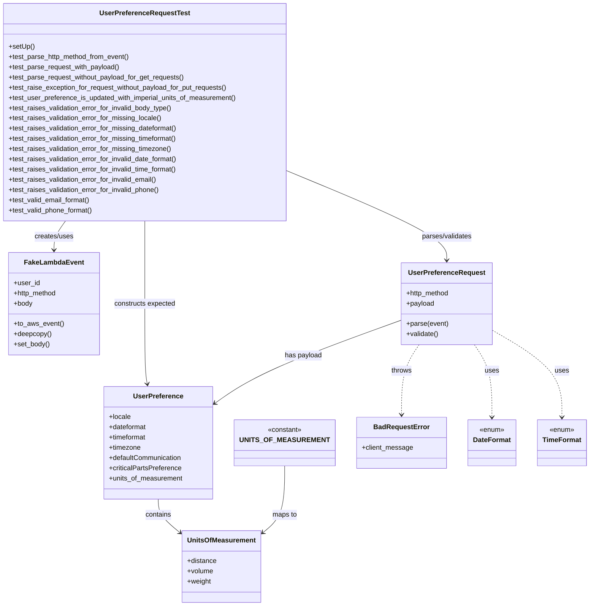

# Diagram: common/iam_service/tests/unit_tests/user_preferences/test_user_preference_request.py

> Auto-generated by Obscura crawlers

## Mermaid

### SVG

<svg id="container" width="1342.3359375" xmlns="http://www.w3.org/2000/svg" class="classDiagram" height="1420" viewBox="0 0 1342.3359375 1420" role="graphics-document document" aria-roledescription="class"><g><defs><marker id="container_class-aggregationStart" class="marker aggregation class" refX="18" refY="7" markerWidth="190" markerHeight="240" orient="auto"><path d="M 18,7 L9,13 L1,7 L9,1 Z"></path></marker></defs><defs><marker id="container_class-aggregationEnd" class="marker aggregation class" refX="1" refY="7" markerWidth="20" markerHeight="28" orient="auto"><path d="M 18,7 L9,13 L1,7 L9,1 Z"></path></marker></defs><defs><marker id="container_class-extensionStart" class="marker extension class" refX="18" refY="7" markerWidth="190" markerHeight="240" orient="auto"><path d="M 1,7 L18,13 V 1 Z"></path></marker></defs><defs><marker id="container_class-extensionEnd" class="marker extension class" refX="1" refY="7" markerWidth="20" markerHeight="28" orient="auto"><path d="M 1,1 V 13 L18,7 Z"></path></marker></defs><defs><marker id="container_class-compositionStart" class="marker composition class" refX="18" refY="7" markerWidth="190" markerHeight="240" orient="auto"><path d="M 18,7 L9,13 L1,7 L9,1 Z"></path></marker></defs><defs><marker id="container_class-compositionEnd" class="marker composition class" refX="1" refY="7" markerWidth="20" markerHeight="28" orient="auto"><path d="M 18,7 L9,13 L1,7 L9,1 Z"></path></marker></defs><defs><marker id="container_class-dependencyStart" class="marker dependency class" refX="6" refY="7" markerWidth="190" markerHeight="240" orient="auto"><path d="M 5,7 L9,13 L1,7 L9,1 Z"></path></marker></defs><defs><marker id="container_class-dependencyEnd" class="marker dependency class" refX="13" refY="7" markerWidth="20" markerHeight="28" orient="auto"><path d="M 18,7 L9,13 L14,7 L9,1 Z"></path></marker></defs><defs><marker id="container_class-lollipopStart" class="marker lollipop class" refX="13" refY="7" markerWidth="190" markerHeight="240" orient="auto"><circle stroke="black" fill="transparent" cx="7" cy="7" r="6"></circle></marker></defs><defs><marker id="container_class-lollipopEnd" class="marker lollipop class" refX="1" refY="7" markerWidth="190" markerHeight="240" orient="auto"><circle stroke="black" fill="transparent" cx="7" cy="7" r="6"></circle></marker></defs><g class="root"><g class="clusters"></g><g class="edgePaths"><path d="M156.65,518L152.191,524.167C147.733,530.333,138.816,542.667,134.357,554C129.898,565.333,129.898,575.667,129.898,580.833L129.898,586" id="id_UserPreferenceRequestTest_FakeLambdaEvent_1" class="edge-thickness-normal edge-pattern-solid relation" style=";;;" data-edge="true" data-et="edge" data-id="id_UserPreferenceRequestTest_FakeLambdaEvent_1" data-points="W3sieCI6MTU2LjY1MDA4Mjk0MDkyNDY1LCJ5Ijo1MTh9LHsieCI6MTI5Ljg5ODQzNzUsInkiOjU1NX0seyJ4IjoxMjkuODk4NDM3NSwieSI6NTkyfV0=" marker-end="url(#container_class-dependencyEnd)"></path><path d="M674.039,407.271L730.872,431.893C787.706,456.514,901.372,505.757,958.206,539.545C1015.039,573.333,1015.039,591.667,1015.039,600.833L1015.039,610" id="id_UserPreferenceRequestTest_UserPreferenceRequest_2" class="edge-thickness-normal edge-pattern-solid relation" style=";;;" data-edge="true" data-et="edge" data-id="id_UserPreferenceRequestTest_UserPreferenceRequest_2" data-points="W3sieCI6Njc0LjAzOTA2MjUsInkiOjQwNy4yNzEzNDMyMTI2NTI2fSx7IngiOjEwMTUuMDM5MDYyNSwieSI6NTU1fSx7IngiOjEwMTUuMDM5MDYyNSwieSI6NjE2fV0=" marker-end="url(#container_class-dependencyEnd)"></path><path d="M341.02,518L341.02,524.167C341.02,530.333,341.02,542.667,341.02,575C341.02,607.333,341.02,659.667,341.02,712C341.02,764.333,341.02,816.667,341.996,848.017C342.973,879.368,344.927,889.736,345.904,894.92L346.881,900.104" id="id_UserPreferenceRequestTest_UserPreference_3" class="edge-thickness-normal edge-pattern-solid relation" style=";;;" data-edge="true" data-et="edge" data-id="id_UserPreferenceRequestTest_UserPreference_3" data-points="W3sieCI6MzQxLjAxOTUzMTI1LCJ5Ijo1MTh9LHsieCI6MzQxLjAxOTUzMTI1LCJ5Ijo1NTV9LHsieCI6MzQxLjAxOTUzMTI1LCJ5Ijo3MTJ9LHsieCI6MzQxLjAxOTUzMTI1LCJ5Ijo4Njl9LHsieCI6MzQ3Ljk5MjA5NTA0NDM3ODcsInkiOjkwNn1d" marker-end="url(#container_class-dependencyEnd)"></path><path d="M908.613,752.061L856.837,771.551C805.061,791.041,701.509,830.02,634.203,861.171C566.896,892.321,535.835,915.642,520.305,927.302L504.775,938.962" id="id_UserPreferenceRequest_UserPreference_4" class="edge-thickness-normal edge-pattern-solid relation" style=";;;" data-edge="true" data-et="edge" data-id="id_UserPreferenceRequest_UserPreference_4" data-points="W3sieCI6OTA4LjYxMzI4MTI1LCJ5Ijo3NTIuMDYxMjk4MjY4Mjg4OX0seyJ4Ijo1OTcuOTU3MDMxMjUsInkiOjg2OX0seyJ4Ijo0OTkuOTc2NTYyNSwieSI6OTQyLjU2NDg0Mzg5OTEzNzV9XQ==" marker-end="url(#container_class-dependencyEnd)"></path><path d="M372.867,1170L372.867,1176.167C372.867,1182.333,372.867,1194.667,380.714,1207.583C388.561,1220.498,404.254,1233.997,412.101,1240.746L419.947,1247.495" id="id_UserPreference_UnitsOfMeasurement_5" class="edge-thickness-normal edge-pattern-solid relation" style=";;;" data-edge="true" data-et="edge" data-id="id_UserPreference_UnitsOfMeasurement_5" data-points="W3sieCI6MzcyLjg2NzE4NzUsInkiOjExNzB9LHsieCI6MzcyLjg2NzE4NzUsInkiOjEyMDd9LHsieCI6NDI0LjQ5NjA5Mzc1LCJ5IjoxMjUxLjQwNzc2OTQxNjU5OTZ9XQ==" marker-end="url(#container_class-dependencyEnd)"></path><path d="M654.219,1092L654.219,1111.167C654.219,1130.333,654.219,1168.667,646.372,1194.583C638.525,1220.498,622.832,1233.997,614.985,1240.746L607.139,1247.495" id="id_UNITS_OF_MEASUREMENT_UnitsOfMeasurement_6" class="edge-thickness-normal edge-pattern-solid relation" style=";;;" data-edge="true" data-et="edge" data-id="id_UNITS_OF_MEASUREMENT_UnitsOfMeasurement_6" data-points="W3sieCI6NjU0LjIxODc1LCJ5IjoxMDkyfSx7IngiOjY1NC4yMTg3NSwieSI6MTIwN30seyJ4Ijo2MDIuNTg5ODQzNzUsInkiOjEyNTEuNDA3NzY5NDE2NTk5Nn1d" marker-end="url(#container_class-dependencyEnd)"></path><path d="M951.614,808L944.897,818.167C938.18,828.333,924.746,848.667,918.029,876C911.313,903.333,911.313,937.667,911.313,954.833L911.313,972" id="id_UserPreferenceRequest_BadRequestError_7" class="edge-thickness-normal edge-pattern-dashed relation" style=";;;" data-edge="true" data-et="edge" data-id="id_UserPreferenceRequest_BadRequestError_7" data-points="W3sieCI6OTUxLjYxMzkwMzI2NDMzMTIsInkiOjgwOH0seyJ4Ijo5MTEuMzEyNSwieSI6ODY5fSx7IngiOjkxMS4zMTI1LCJ5Ijo5Nzh9XQ==" marker-end="url(#container_class-dependencyEnd)"></path><path d="M1078.464,808L1085.181,818.167C1091.898,828.333,1105.332,848.667,1112.049,877C1118.766,905.333,1118.766,941.667,1118.766,959.833L1118.766,978" id="id_UserPreferenceRequest_DateFormat_8" class="edge-thickness-normal edge-pattern-dashed relation" style=";;;" data-edge="true" data-et="edge" data-id="id_UserPreferenceRequest_DateFormat_8" data-points="W3sieCI6MTA3OC40NjQyMjE3MzU2Njg4LCJ5Ijo4MDh9LHsieCI6MTExOC43NjU2MjUsInkiOjg2OX0seyJ4IjoxMTE4Ljc2NTYyNSwieSI6OTg0fV0=" marker-end="url(#container_class-dependencyEnd)"></path><path d="M1121.465,775.336L1147.696,790.947C1173.927,806.557,1226.389,837.779,1252.62,871.556C1278.852,905.333,1278.852,941.667,1278.852,959.833L1278.852,978" id="id_UserPreferenceRequest_TimeFormat_9" class="edge-thickness-normal edge-pattern-dashed relation" style=";;;" data-edge="true" data-et="edge" data-id="id_UserPreferenceRequest_TimeFormat_9" data-points="W3sieCI6MTEyMS40NjQ4NDM3NSwieSI6Nzc1LjMzNjA3MjYxMzEyNDl9LHsieCI6MTI3OC44NTE1NjI1LCJ5Ijo4Njl9LHsieCI6MTI3OC44NTE1NjI1LCJ5Ijo5ODR9XQ==" marker-end="url(#container_class-dependencyEnd)"></path></g><g class="edgeLabels"><g class="edgeLabel" transform="translate(129.8984375, 555)"><g class="label" data-id="id_UserPreferenceRequestTest_FakeLambdaEvent_1" transform="translate(-46.578125, -12)"><foreignObject width="93.15625" height="24">

creates/uses

</foreignObject></g></g><g class="edgeLabel" transform="translate(1015.0390625, 555)"><g class="label" data-id="id_UserPreferenceRequestTest_UserPreferenceRequest_2" transform="translate(-60.5078125, -12)"><foreignObject width="121.015625" height="24">

parses/validates

</foreignObject></g></g><g class="edgeLabel" transform="translate(341.01953125, 712)"><g class="label" data-id="id_UserPreferenceRequestTest_UserPreference_3" transform="translate(-72.9765625, -12)"><foreignObject width="145.953125" height="24">

constructs expected

</foreignObject></g></g><g class="edgeLabel" transform="translate(695.95099, 832.11265)"><g class="label" data-id="id_UserPreferenceRequest_UserPreference_4" transform="translate(-43.6953125, -12)"><foreignObject width="87.390625" height="24">

has payload

</foreignObject></g></g><g class="edgeLabel" transform="translate(372.8671875, 1207)"><g class="label" data-id="id_UserPreference_UnitsOfMeasurement_5" transform="translate(-30.890625, -12)"><foreignObject width="61.78125" height="24">

contains

</foreignObject></g></g><g class="edgeLabel" transform="translate(654.21875, 1207)"><g class="label" data-id="id_UNITS_OF_MEASUREMENT_UnitsOfMeasurement_6" transform="translate(-29.2578125, -12)"><foreignObject width="58.515625" height="24">

maps to

</foreignObject></g></g><g class="edgeLabel" transform="translate(911.3125, 869)"><g class="label" data-id="id_UserPreferenceRequest_BadRequestError_7" transform="translate(-24.5703125, -12)"><foreignObject width="49.140625" height="24">

throws

</foreignObject></g></g><g class="edgeLabel" transform="translate(1118.765625, 869)"><g class="label" data-id="id_UserPreferenceRequest_DateFormat_8" transform="translate(-16.4921875, -12)"><foreignObject width="32.984375" height="24">

uses

</foreignObject></g></g><g class="edgeLabel" transform="translate(1278.8515625, 869)"><g class="label" data-id="id_UserPreferenceRequest_TimeFormat_9" transform="translate(-16.4921875, -12)"><foreignObject width="32.984375" height="24">

uses

</foreignObject></g></g></g><g class="nodes"><g class="node default" id="classId-UserPreferenceRequestTest-0" transform="translate(341.01953125, 263)"><g class="basic label-container"><path d="M-333.01953125 -255 L333.01953125 -255 L333.01953125 255 L-333.01953125 255" stroke="none" stroke-width="0" fill="#ECECFF" style=""></path><path d="M-333.01953125 -255 C-148.88080367631142 -255, 35.25792389737717 -255, 333.01953125 -255 M-333.01953125 -255 C-152.26370647024876 -255, 28.492118309502473 -255, 333.01953125 -255 M333.01953125 -255 C333.01953125 -100.66188179775776, 333.01953125 53.676236404484484, 333.01953125 255 M333.01953125 -255 C333.01953125 -54.022983093189, 333.01953125 146.954033813622, 333.01953125 255 M333.01953125 255 C158.53421119502946 255, -15.951108859941087 255, -333.01953125 255 M333.01953125 255 C82.86239202449099 255, -167.29474720101803 255, -333.01953125 255 M-333.01953125 255 C-333.01953125 90.83458078708568, -333.01953125 -73.33083842582863, -333.01953125 -255 M-333.01953125 255 C-333.01953125 86.3891934778274, -333.01953125 -82.22161304434519, -333.01953125 -255" stroke="#9370DB" stroke-width="1.3" fill="none" stroke-dasharray="0 0" style=""></path></g><g class="annotation-group text" transform="translate(0, -231)"></g><g class="label-group text" transform="translate(-101.1796875, -231)"><g class="label" style="font-weight: bolder" transform="translate(0,-12)"><foreignObject width="202.359375" height="24">

UserPreferenceRequestTest

</foreignObject></g></g><g class="members-group text" transform="translate(-321.01953125, -183)"></g><g class="methods-group text" transform="translate(-321.01953125, -153)"><g class="label" style="" transform="translate(0,-12)"><foreignObject width="60.421875" height="24">

+setUp()

</foreignObject></g><g class="label" style="" transform="translate(0,12)"><foreignObject width="287.65625" height="24">

+test_parse_http_method_from_event()

</foreignObject></g><g class="label" style="" transform="translate(0,36)"><foreignObject width="262.75" height="24">

+test_parse_request_with_payload()

</foreignObject></g><g class="label" style="" transform="translate(0,60)"><foreignObject width="416.703125" height="24">

+test_parse_request_without_payload_for_get_requests()

</foreignObject></g><g class="label" style="" transform="translate(0,84)"><foreignObject width="519.625" height="24">

+test_raise_exception_for_request_without_payload_for_put_requests()

</foreignObject></g><g class="label" style="" transform="translate(0,108)"><foreignObject width="540.859375" height="24">

+test_user_preference_is_updated_with_imperial_units_of_measurement()

</foreignObject></g><g class="label" style="" transform="translate(0,132)"><foreignObject width="387.984375" height="24">

+test_raises_validation_error_for_invalid_body_type()

</foreignObject></g><g class="label" style="" transform="translate(0,156)"><foreignObject width="362.109375" height="24">

+test_raises_validation_error_for_missing_locale()

</foreignObject></g><g class="label" style="" transform="translate(0,180)"><foreignObject width="400.078125" height="24">

+test_raises_validation_error_for_missing_dateformat()

</foreignObject></g><g class="label" style="" transform="translate(0,204)"><foreignObject width="400.265625" height="24">

+test_raises_validation_error_for_missing_timeformat()

</foreignObject></g><g class="label" style="" transform="translate(0,228)"><foreignObject width="385.5625" height="24">

+test_raises_validation_error_for_missing_timezone()

</foreignObject></g><g class="label" style="" transform="translate(0,252)"><foreignObject width="401.171875" height="24">

+test_raises_validation_error_for_invalid_date_format()

</foreignObject></g><g class="label" style="" transform="translate(0,276)"><foreignObject width="401.375" height="24">

+test_raises_validation_error_for_invalid_time_format()

</foreignObject></g><g class="label" style="" transform="translate(0,300)"><foreignObject width="352.390625" height="24">

+test_raises_validation_error_for_invalid_email()

</foreignObject></g><g class="label" style="" transform="translate(0,324)"><foreignObject width="358.703125" height="24">

+test_raises_validation_error_for_invalid_phone()

</foreignObject></g><g class="label" style="" transform="translate(0,348)"><foreignObject width="193.796875" height="24">

+test_valid_email_format()

</foreignObject></g><g class="label" style="" transform="translate(0,372)"><foreignObject width="199.78125" height="24">

+test_valid_phone_format()

</foreignObject></g></g><g class="divider" style=""><path d="M-333.01953125 -207 C-84.32063905932253 -207, 164.37825313135494 -207, 333.01953125 -207 M-333.01953125 -207 C-73.341930966 -207, 186.335669318 -207, 333.01953125 -207" stroke="#9370DB" stroke-width="1.3" fill="none" stroke-dasharray="0 0" style=""></path></g><g class="divider" style=""><path d="M-333.01953125 -183 C-72.4660419008685 -183, 188.087447448263 -183, 333.01953125 -183 M-333.01953125 -183 C-121.37441926493545 -183, 90.27069272012909 -183, 333.01953125 -183" stroke="#9370DB" stroke-width="1.3" fill="none" stroke-dasharray="0 0" style=""></path></g></g><g class="node default" id="classId-FakeLambdaEvent-1" transform="translate(129.8984375, 712)"><g class="basic label-container"><path d="M-103.14453125 -120 L103.14453125 -120 L103.14453125 120 L-103.14453125 120" stroke="none" stroke-width="0" fill="#ECECFF" style=""></path><path d="M-103.14453125 -120 C-39.248653035076586 -120, 24.647225179846828 -120, 103.14453125 -120 M-103.14453125 -120 C-57.392317890143254 -120, -11.640104530286507 -120, 103.14453125 -120 M103.14453125 -120 C103.14453125 -43.571825403277685, 103.14453125 32.85634919344463, 103.14453125 120 M103.14453125 -120 C103.14453125 -24.89963500828135, 103.14453125 70.2007299834373, 103.14453125 120 M103.14453125 120 C31.73294502936254 120, -39.67864119127492 120, -103.14453125 120 M103.14453125 120 C43.73853952993131 120, -15.667452190137382 120, -103.14453125 120 M-103.14453125 120 C-103.14453125 37.23109163093643, -103.14453125 -45.537816738127134, -103.14453125 -120 M-103.14453125 120 C-103.14453125 35.199464829979476, -103.14453125 -49.60107034004105, -103.14453125 -120" stroke="#9370DB" stroke-width="1.3" fill="none" stroke-dasharray="0 0" style=""></path></g><g class="annotation-group text" transform="translate(0, -96)"></g><g class="label-group text" transform="translate(-65.8671875, -96)"><g class="label" style="font-weight: bolder" transform="translate(0,-12)"><foreignObject width="131.734375" height="24">

FakeLambdaEvent

</foreignObject></g></g><g class="members-group text" transform="translate(-91.14453125, -48)"><g class="label" style="" transform="translate(0,-12)"><foreignObject width="60.796875" height="24">

+user_id

</foreignObject></g><g class="label" style="" transform="translate(0,12)"><foreignObject width="102.921875" height="24">

+http_method

</foreignObject></g><g class="label" style="" transform="translate(0,36)"><foreignObject width="44.28125" height="24">

+body

</foreignObject></g></g><g class="methods-group text" transform="translate(-91.14453125, 48)"><g class="label" style="" transform="translate(0,-12)"><foreignObject width="116.421875" height="24">

+to_aws_event()

</foreignObject></g><g class="label" style="" transform="translate(0,12)"><foreignObject width="88.859375" height="24">

+deepcopy()

</foreignObject></g><g class="label" style="" transform="translate(0,36)"><foreignObject width="84.9375" height="24">

+set_body()

</foreignObject></g></g><g class="divider" style=""><path d="M-103.14453125 -72 C-42.455395788706866 -72, 18.233739672586267 -72, 103.14453125 -72 M-103.14453125 -72 C-57.56697502476435 -72, -11.989418799528707 -72, 103.14453125 -72" stroke="#9370DB" stroke-width="1.3" fill="none" stroke-dasharray="0 0" style=""></path></g><g class="divider" style=""><path d="M-103.14453125 24 C-30.76756460182844 24, 41.60940204634312 24, 103.14453125 24 M-103.14453125 24 C-34.96094462141578 24, 33.222642007168446 24, 103.14453125 24" stroke="#9370DB" stroke-width="1.3" fill="none" stroke-dasharray="0 0" style=""></path></g></g><g class="node default" id="classId-UserPreferenceRequest-2" transform="translate(1015.0390625, 712)"><g class="basic label-container"><path d="M-106.42578125 -96 L106.42578125 -96 L106.42578125 96 L-106.42578125 96" stroke="none" stroke-width="0" fill="#ECECFF" style=""></path><path d="M-106.42578125 -96 C-26.79897097302961 -96, 52.82783930394078 -96, 106.42578125 -96 M-106.42578125 -96 C-59.12332882107011 -96, -11.820876392140221 -96, 106.42578125 -96 M106.42578125 -96 C106.42578125 -30.722685294770272, 106.42578125 34.554629410459455, 106.42578125 96 M106.42578125 -96 C106.42578125 -41.514142380661696, 106.42578125 12.971715238676609, 106.42578125 96 M106.42578125 96 C58.83901334852101 96, 11.252245447042014 96, -106.42578125 96 M106.42578125 96 C27.693223783979377 96, -51.039333682041246 96, -106.42578125 96 M-106.42578125 96 C-106.42578125 48.60144726998483, -106.42578125 1.2028945399696624, -106.42578125 -96 M-106.42578125 96 C-106.42578125 51.73278193696433, -106.42578125 7.465563873928659, -106.42578125 -96" stroke="#9370DB" stroke-width="1.3" fill="none" stroke-dasharray="0 0" style=""></path></g><g class="annotation-group text" transform="translate(0, -72)"></g><g class="label-group text" transform="translate(-85.9296875, -72)"><g class="label" style="font-weight: bolder" transform="translate(0,-12)"><foreignObject width="171.859375" height="24">

UserPreferenceRequest

</foreignObject></g></g><g class="members-group text" transform="translate(-94.42578125, -24)"><g class="label" style="" transform="translate(0,-12)"><foreignObject width="102.921875" height="24">

+http_method

</foreignObject></g><g class="label" style="" transform="translate(0,12)"><foreignObject width="65.734375" height="24">

+payload

</foreignObject></g></g><g class="methods-group text" transform="translate(-94.42578125, 48)"><g class="label" style="" transform="translate(0,-12)"><foreignObject width="98.875" height="24">

+parse(event)

</foreignObject></g><g class="label" style="" transform="translate(0,12)"><foreignObject width="76.09375" height="24">

+validate()

</foreignObject></g></g><g class="divider" style=""><path d="M-106.42578125 -48 C-41.966309017127216 -48, 22.493163215745568 -48, 106.42578125 -48 M-106.42578125 -48 C-48.75927869552324 -48, 8.907223858953515 -48, 106.42578125 -48" stroke="#9370DB" stroke-width="1.3" fill="none" stroke-dasharray="0 0" style=""></path></g><g class="divider" style=""><path d="M-106.42578125 24 C-43.27100052982262 24, 19.883780190354756 24, 106.42578125 24 M-106.42578125 24 C-24.488441103984684 24, 57.44889904203063 24, 106.42578125 24" stroke="#9370DB" stroke-width="1.3" fill="none" stroke-dasharray="0 0" style=""></path></g></g><g class="node default" id="classId-UserPreference-3" transform="translate(372.8671875, 1038)"><g class="basic label-container"><path d="M-127.109375 -132 L127.109375 -132 L127.109375 132 L-127.109375 132" stroke="none" stroke-width="0" fill="#ECECFF" style=""></path><path d="M-127.109375 -132 C-33.29917681820912 -132, 60.51102136358176 -132, 127.109375 -132 M-127.109375 -132 C-65.4847205663751 -132, -3.8600661327502195 -132, 127.109375 -132 M127.109375 -132 C127.109375 -51.13508504676025, 127.109375 29.729829906479495, 127.109375 132 M127.109375 -132 C127.109375 -75.58322160969895, 127.109375 -19.166443219397905, 127.109375 132 M127.109375 132 C41.12564327060103 132, -44.85808845879794 132, -127.109375 132 M127.109375 132 C41.20505481902583 132, -44.699265361948335 132, -127.109375 132 M-127.109375 132 C-127.109375 73.70052252063329, -127.109375 15.40104504126657, -127.109375 -132 M-127.109375 132 C-127.109375 51.3163723680355, -127.109375 -29.367255263928996, -127.109375 -132" stroke="#9370DB" stroke-width="1.3" fill="none" stroke-dasharray="0 0" style=""></path></g><g class="annotation-group text" transform="translate(0, -108)"></g><g class="label-group text" transform="translate(-55.953125, -108)"><g class="label" style="font-weight: bolder" transform="translate(0,-12)"><foreignObject width="111.90625" height="24">

UserPreference

</foreignObject></g></g><g class="members-group text" transform="translate(-115.109375, -60)"><g class="label" style="" transform="translate(0,-12)"><foreignObject width="51.296875" height="24">

+locale

</foreignObject></g><g class="label" style="" transform="translate(0,12)"><foreignObject width="89.4375" height="24">

+dateformat

</foreignObject></g><g class="label" style="" transform="translate(0,36)"><foreignObject width="89.546875" height="24">

+timeformat

</foreignObject></g><g class="label" style="" transform="translate(0,60)"><foreignObject width="74.84375" height="24">

+timezone

</foreignObject></g><g class="label" style="" transform="translate(0,84)"><foreignObject width="173.578125" height="24">

+defaultCommunication

</foreignObject></g><g class="label" style="" transform="translate(0,108)"><foreignObject width="171.03125" height="24">

+criticalPartsPreference

</foreignObject></g><g class="label" style="" transform="translate(0,132)"><foreignObject width="174.265625" height="24">

+units_of_measurement

</foreignObject></g></g><g class="methods-group text" transform="translate(-115.109375, 132)"></g><g class="divider" style=""><path d="M-127.109375 -84 C-26.431066876215723 -84, 74.24724124756855 -84, 127.109375 -84 M-127.109375 -84 C-26.897523451366695 -84, 73.31432809726661 -84, 127.109375 -84" stroke="#9370DB" stroke-width="1.3" fill="none" stroke-dasharray="0 0" style=""></path></g><g class="divider" style=""><path d="M-127.109375 108 C-65.4323579743621 108, -3.755340948724225 108, 127.109375 108 M-127.109375 108 C-47.222303516407706 108, 32.66476796718459 108, 127.109375 108" stroke="#9370DB" stroke-width="1.3" fill="none" stroke-dasharray="0 0" style=""></path></g></g><g class="node default" id="classId-UnitsOfMeasurement-4" transform="translate(513.54296875, 1328)"><g class="basic label-container"><path d="M-89.046875 -84 L89.046875 -84 L89.046875 84 L-89.046875 84" stroke="none" stroke-width="0" fill="#ECECFF" style=""></path><path d="M-89.046875 -84 C-51.536959349905665 -84, -14.02704369981133 -84, 89.046875 -84 M-89.046875 -84 C-43.0317758235018 -84, 2.9833233529963934 -84, 89.046875 -84 M89.046875 -84 C89.046875 -39.276323877015756, 89.046875 5.447352245968489, 89.046875 84 M89.046875 -84 C89.046875 -20.24727998693011, 89.046875 43.50544002613978, 89.046875 84 M89.046875 84 C40.41256815942623 84, -8.221738681147542 84, -89.046875 84 M89.046875 84 C20.469074209241057 84, -48.108726581517885 84, -89.046875 84 M-89.046875 84 C-89.046875 38.5415804761036, -89.046875 -6.916839047792806, -89.046875 -84 M-89.046875 84 C-89.046875 17.585134333544815, -89.046875 -48.82973133291037, -89.046875 -84" stroke="#9370DB" stroke-width="1.3" fill="none" stroke-dasharray="0 0" style=""></path></g><g class="annotation-group text" transform="translate(0, -60)"></g><g class="label-group text" transform="translate(-77.046875, -60)"><g class="label" style="font-weight: bolder" transform="translate(0,-12)"><foreignObject width="154.09375" height="24">

UnitsOfMeasurement

</foreignObject></g></g><g class="members-group text" transform="translate(-77.046875, -12)"><g class="label" style="" transform="translate(0,-12)"><foreignObject width="69.34375" height="24">

+distance

</foreignObject></g><g class="label" style="" transform="translate(0,12)"><foreignObject width="61.421875" height="24">

+volume

</foreignObject></g><g class="label" style="" transform="translate(0,36)"><foreignObject width="56.171875" height="24">

+weight

</foreignObject></g></g><g class="methods-group text" transform="translate(-77.046875, 84)"></g><g class="divider" style=""><path d="M-89.046875 -36 C-46.70509191772734 -36, -4.363308835454674 -36, 89.046875 -36 M-89.046875 -36 C-52.256498357002116 -36, -15.466121714004231 -36, 89.046875 -36" stroke="#9370DB" stroke-width="1.3" fill="none" stroke-dasharray="0 0" style=""></path></g><g class="divider" style=""><path d="M-89.046875 60 C-28.59592725948785 60, 31.855020481024297 60, 89.046875 60 M-89.046875 60 C-53.377194880244176 60, -17.70751476048835 60, 89.046875 60" stroke="#9370DB" stroke-width="1.3" fill="none" stroke-dasharray="0 0" style=""></path></g></g><g class="node default" id="classId-UNITS_OF_MEASUREMENT-5" transform="translate(654.21875, 1038)"><g class="basic label-container"><path d="M-104.2421875 -54 L104.2421875 -54 L104.2421875 54 L-104.2421875 54" stroke="none" stroke-width="0" fill="#ECECFF" style=""></path><path d="M-104.2421875 -54 C-40.867401168298635 -54, 22.50738516340273 -54, 104.2421875 -54 M-104.2421875 -54 C-55.673531779575626 -54, -7.104876059151252 -54, 104.2421875 -54 M104.2421875 -54 C104.2421875 -26.340210814325307, 104.2421875 1.3195783713493867, 104.2421875 54 M104.2421875 -54 C104.2421875 -29.560836642226416, 104.2421875 -5.121673284452832, 104.2421875 54 M104.2421875 54 C24.339365342409877 54, -55.563456815180245 54, -104.2421875 54 M104.2421875 54 C27.532202849495306 54, -49.17778180100939 54, -104.2421875 54 M-104.2421875 54 C-104.2421875 29.986632551919403, -104.2421875 5.973265103838806, -104.2421875 -54 M-104.2421875 54 C-104.2421875 16.615509457255534, -104.2421875 -20.76898108548893, -104.2421875 -54" stroke="#9370DB" stroke-width="1.3" fill="none" stroke-dasharray="0 0" style=""></path></g><g class="annotation-group text" transform="translate(-40.4921875, -30)"><g class="label" style="" transform="translate(0,-12)"><foreignObject width="80.984375" height="24">

«constant»

</foreignObject></g></g><g class="label-group text" transform="translate(-92.2421875, -6)"><g class="label" style="font-weight: bolder" transform="translate(0,-12)"><foreignObject width="184.484375" height="24">

UNITS_OF_MEASUREMENT

</foreignObject></g></g><g class="members-group text" transform="translate(-92.2421875, 42)"></g><g class="methods-group text" transform="translate(-92.2421875, 72)"></g><g class="divider" style=""><path d="M-104.2421875 18 C-36.78032604082341 18, 30.681535418353178 18, 104.2421875 18 M-104.2421875 18 C-45.09605472438029 18, 14.050078051239424 18, 104.2421875 18" stroke="#9370DB" stroke-width="1.3" fill="none" stroke-dasharray="0 0" style=""></path></g><g class="divider" style=""><path d="M-104.2421875 36 C-45.984510653640776 36, 12.273166192718449 36, 104.2421875 36 M-104.2421875 36 C-60.74612719665686 36, -17.250066893313715 36, 104.2421875 36" stroke="#9370DB" stroke-width="1.3" fill="none" stroke-dasharray="0 0" style=""></path></g></g><g class="node default" id="classId-BadRequestError-6" transform="translate(911.3125, 1038)"><g class="basic label-container"><path d="M-102.8515625 -60 L102.8515625 -60 L102.8515625 60 L-102.8515625 60" stroke="none" stroke-width="0" fill="#ECECFF" style=""></path><path d="M-102.8515625 -60 C-44.35995886333457 -60, 14.131644773330862 -60, 102.8515625 -60 M-102.8515625 -60 C-58.39425529200723 -60, -13.93694808401446 -60, 102.8515625 -60 M102.8515625 -60 C102.8515625 -16.131356444251693, 102.8515625 27.737287111496613, 102.8515625 60 M102.8515625 -60 C102.8515625 -19.70886277752041, 102.8515625 20.582274444959182, 102.8515625 60 M102.8515625 60 C53.368083694335525 60, 3.884604888671049 60, -102.8515625 60 M102.8515625 60 C38.96954865593787 60, -24.91246518812426 60, -102.8515625 60 M-102.8515625 60 C-102.8515625 23.795377943374127, -102.8515625 -12.409244113251745, -102.8515625 -60 M-102.8515625 60 C-102.8515625 31.458692474185135, -102.8515625 2.9173849483702696, -102.8515625 -60" stroke="#9370DB" stroke-width="1.3" fill="none" stroke-dasharray="0 0" style=""></path></g><g class="annotation-group text" transform="translate(0, -36)"></g><g class="label-group text" transform="translate(-62.28125, -36)"><g class="label" style="font-weight: bolder" transform="translate(0,-12)"><foreignObject width="124.5625" height="24">

BadRequestError

</foreignObject></g></g><g class="members-group text" transform="translate(-90.8515625, 12)"><g class="label" style="" transform="translate(0,-12)"><foreignObject width="119.421875" height="24">

+client_message

</foreignObject></g></g><g class="methods-group text" transform="translate(-90.8515625, 60)"></g><g class="divider" style=""><path d="M-102.8515625 -12 C-60.691741984878675 -12, -18.53192146975735 -12, 102.8515625 -12 M-102.8515625 -12 C-37.29354086243323 -12, 28.264480775133535 -12, 102.8515625 -12" stroke="#9370DB" stroke-width="1.3" fill="none" stroke-dasharray="0 0" style=""></path></g><g class="divider" style=""><path d="M-102.8515625 36 C-54.01324731967565 36, -5.174932139351299 36, 102.8515625 36 M-102.8515625 36 C-27.942716022223863 36, 46.966130455552275 36, 102.8515625 36" stroke="#9370DB" stroke-width="1.3" fill="none" stroke-dasharray="0 0" style=""></path></g></g><g class="node default" id="classId-DateFormat-7" transform="translate(1118.765625, 1038)"><g class="basic label-container"><path d="M-54.6015625 -54 L54.6015625 -54 L54.6015625 54 L-54.6015625 54" stroke="none" stroke-width="0" fill="#ECECFF" style=""></path><path d="M-54.6015625 -54 C-18.265313999862293 -54, 18.070934500275413 -54, 54.6015625 -54 M-54.6015625 -54 C-22.15477516770998 -54, 10.292012164580044 -54, 54.6015625 -54 M54.6015625 -54 C54.6015625 -20.309971409645883, 54.6015625 13.380057180708235, 54.6015625 54 M54.6015625 -54 C54.6015625 -11.824003895710163, 54.6015625 30.351992208579674, 54.6015625 54 M54.6015625 54 C20.49016916288376 54, -13.62122417423248 54, -54.6015625 54 M54.6015625 54 C20.900419410681003 54, -12.800723678637993 54, -54.6015625 54 M-54.6015625 54 C-54.6015625 13.72217842692281, -54.6015625 -26.55564314615438, -54.6015625 -54 M-54.6015625 54 C-54.6015625 27.68133977926217, -54.6015625 1.3626795585243414, -54.6015625 -54" stroke="#9370DB" stroke-width="1.3" fill="none" stroke-dasharray="0 0" style=""></path></g><g class="annotation-group text" transform="translate(-29.53125, -30)"><g class="label" style="" transform="translate(0,-12)"><foreignObject width="59.0625" height="24">

«enum»

</foreignObject></g></g><g class="label-group text" transform="translate(-42.6015625, -6)"><g class="label" style="font-weight: bolder" transform="translate(0,-12)"><foreignObject width="85.203125" height="24">

DateFormat

</foreignObject></g></g><g class="members-group text" transform="translate(-42.6015625, 42)"></g><g class="methods-group text" transform="translate(-42.6015625, 72)"></g><g class="divider" style=""><path d="M-54.6015625 18 C-23.665632276891852 18, 7.270297946216296 18, 54.6015625 18 M-54.6015625 18 C-21.742455171371653 18, 11.116652157256695 18, 54.6015625 18" stroke="#9370DB" stroke-width="1.3" fill="none" stroke-dasharray="0 0" style=""></path></g><g class="divider" style=""><path d="M-54.6015625 36 C-28.916917812488048 36, -3.2322731249760963 36, 54.6015625 36 M-54.6015625 36 C-21.761482717660783 36, 11.078597064678434 36, 54.6015625 36" stroke="#9370DB" stroke-width="1.3" fill="none" stroke-dasharray="0 0" style=""></path></g></g><g class="node default" id="classId-TimeFormat-8" transform="translate(1278.8515625, 1038)"><g class="basic label-container"><path d="M-55.484375 -54 L55.484375 -54 L55.484375 54 L-55.484375 54" stroke="none" stroke-width="0" fill="#ECECFF" style=""></path><path d="M-55.484375 -54 C-11.124350879931505 -54, 33.23567324013699 -54, 55.484375 -54 M-55.484375 -54 C-17.82841499200088 -54, 19.82754501599824 -54, 55.484375 -54 M55.484375 -54 C55.484375 -22.56401733201271, 55.484375 8.87196533597458, 55.484375 54 M55.484375 -54 C55.484375 -18.596920333924658, 55.484375 16.806159332150685, 55.484375 54 M55.484375 54 C18.75386529296803 54, -17.97664441406394 54, -55.484375 54 M55.484375 54 C17.050232815070196 54, -21.38390936985961 54, -55.484375 54 M-55.484375 54 C-55.484375 12.185366327538006, -55.484375 -29.62926734492399, -55.484375 -54 M-55.484375 54 C-55.484375 17.84042996472825, -55.484375 -18.319140070543497, -55.484375 -54" stroke="#9370DB" stroke-width="1.3" fill="none" stroke-dasharray="0 0" style=""></path></g><g class="annotation-group text" transform="translate(-29.53125, -30)"><g class="label" style="" transform="translate(0,-12)"><foreignObject width="59.0625" height="24">

«enum»

</foreignObject></g></g><g class="label-group text" transform="translate(-43.484375, -6)"><g class="label" style="font-weight: bolder" transform="translate(0,-12)"><foreignObject width="86.96875" height="24">

TimeFormat

</foreignObject></g></g><g class="members-group text" transform="translate(-43.484375, 42)"></g><g class="methods-group text" transform="translate(-43.484375, 72)"></g><g class="divider" style=""><path d="M-55.484375 18 C-31.191397929248705 18, -6.89842085849741 18, 55.484375 18 M-55.484375 18 C-33.14558370545547 18, -10.806792410910944 18, 55.484375 18" stroke="#9370DB" stroke-width="1.3" fill="none" stroke-dasharray="0 0" style=""></path></g><g class="divider" style=""><path d="M-55.484375 36 C-27.73572083075939 36, 0.01293333848121847 36, 55.484375 36 M-55.484375 36 C-13.620793514365829 36, 28.242787971268342 36, 55.484375 36" stroke="#9370DB" stroke-width="1.3" fill="none" stroke-dasharray="0 0" style=""></path></g></g></g></g></g></svg>
