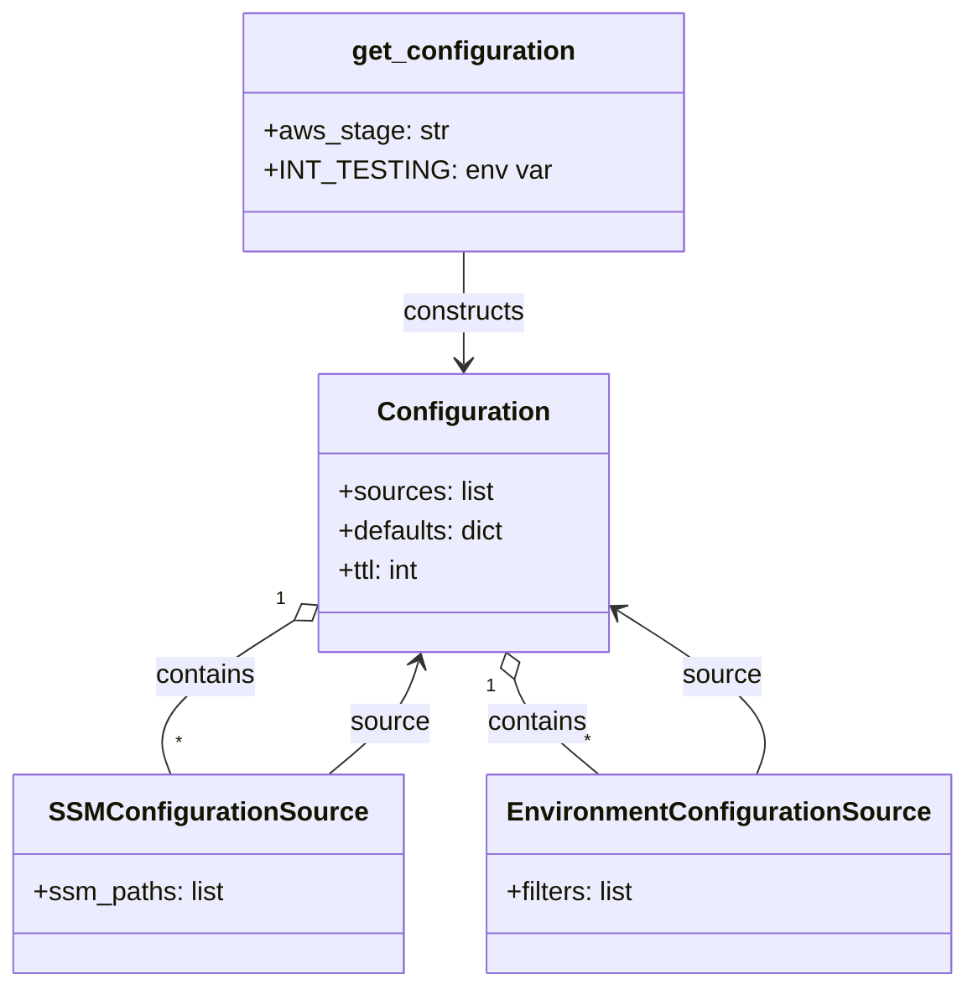

# Diagram: common/jwt_custom_authorizer/config.py


> Auto-generated by Obscura crawlers

## Diagram 1

```mermaid
flowchart TD
    A[Start: module import & env read] --> B[get_configuration()]
    B --> C{AWS_STAGE present?}
    C -- no --> E[raise KeyError: missing AWS_STAGE]
    C -- yes --> D{INT_TESTING set?}
    D -- yes --> F[AWS_STAGE += "-test"]
    D -- no --> G[AWS_STAGE unchanged]
    F --> H[Build fv.config.Configuration]
    G --> H
    H --> I[sources: SSMConfigurationSource, EnvironmentConfigurationSource]
    H --> J[defaults: {"LOG_LEVEL":"INFO","DB_APPLICATION_NAME":"loc"}]
    H --> K[ttl: 30]
    I --> L[SSM path: /fv/{AWS_STAGE}/database]
    I --> M[Env filter: DB_.*]
    H --> N[Return Configuration instance]
    N --> O[config = get_configuration()]
```

> SVG rendering failed for this diagram.

## Diagram 2



### SVG

<svg id="container" width="560.3515625" xmlns="http://www.w3.org/2000/svg" class="classDiagram" height="596" viewBox="0 0 560.3515625 596" role="graphics-document document" aria-roledescription="class"><style>#container{font-family:"trebuchet ms",verdana,arial,sans-serif;font-size:16px;fill:#333;}@keyframes edge-animation-frame{from{stroke-dashoffset:0;}}@keyframes dash{to{stroke-dashoffset:0;}}#container .edge-animation-slow{stroke-dasharray:9,5!important;stroke-dashoffset:900;animation:dash 50s linear infinite;stroke-linecap:round;}#container .edge-animation-fast{stroke-dasharray:9,5!important;stroke-dashoffset:900;animation:dash 20s linear infinite;stroke-linecap:round;}#container .error-icon{fill:#552222;}#container .error-text{fill:#552222;stroke:#552222;}#container .edge-thickness-normal{stroke-width:1px;}#container .edge-thickness-thick{stroke-width:3.5px;}#container .edge-pattern-solid{stroke-dasharray:0;}#container .edge-thickness-invisible{stroke-width:0;fill:none;}#container .edge-pattern-dashed{stroke-dasharray:3;}#container .edge-pattern-dotted{stroke-dasharray:2;}#container .marker{fill:#333333;stroke:#333333;}#container .marker.cross{stroke:#333333;}#container svg{font-family:"trebuchet ms",verdana,arial,sans-serif;font-size:16px;}#container p{margin:0;}#container g.classGroup text{fill:#9370DB;stroke:none;font-family:"trebuchet ms",verdana,arial,sans-serif;font-size:10px;}#container g.classGroup text .title{font-weight:bolder;}#container .nodeLabel,#container .edgeLabel{color:#131300;}#container .edgeLabel .label rect{fill:#ECECFF;}#container .label text{fill:#131300;}#container .labelBkg{background:#ECECFF;}#container .edgeLabel .label span{background:#ECECFF;}#container .classTitle{font-weight:bolder;}#container .node rect,#container .node circle,#container .node ellipse,#container .node polygon,#container .node path{fill:#ECECFF;stroke:#9370DB;stroke-width:1px;}#container .divider{stroke:#9370DB;stroke-width:1;}#container g.clickable{cursor:pointer;}#container g.classGroup rect{fill:#ECECFF;stroke:#9370DB;}#container g.classGroup line{stroke:#9370DB;stroke-width:1;}#container .classLabel .box{stroke:none;stroke-width:0;fill:#ECECFF;opacity:0.5;}#container .classLabel .label{fill:#9370DB;font-size:10px;}#container .relation{stroke:#333333;stroke-width:1;fill:none;}#container .dashed-line{stroke-dasharray:3;}#container .dotted-line{stroke-dasharray:1 2;}#container #compositionStart,#container .composition{fill:#333333!important;stroke:#333333!important;stroke-width:1;}#container #compositionEnd,#container .composition{fill:#333333!important;stroke:#333333!important;stroke-width:1;}#container #dependencyStart,#container .dependency{fill:#333333!important;stroke:#333333!important;stroke-width:1;}#container #dependencyStart,#container .dependency{fill:#333333!important;stroke:#333333!important;stroke-width:1;}#container #extensionStart,#container .extension{fill:transparent!important;stroke:#333333!important;stroke-width:1;}#container #extensionEnd,#container .extension{fill:transparent!important;stroke:#333333!important;stroke-width:1;}#container #aggregationStart,#container .aggregation{fill:transparent!important;stroke:#333333!important;stroke-width:1;}#container #aggregationEnd,#container .aggregation{fill:transparent!important;stroke:#333333!important;stroke-width:1;}#container #lollipopStart,#container .lollipop{fill:#ECECFF!important;stroke:#333333!important;stroke-width:1;}#container #lollipopEnd,#container .lollipop{fill:#ECECFF!important;stroke:#333333!important;stroke-width:1;}#container .edgeTerminals{font-size:11px;line-height:initial;}#container .classTitleText{text-anchor:middle;font-size:18px;fill:#333;}#container .label-icon{display:inline-block;height:1em;overflow:visible;vertical-align:-0.125em;}#container .node .label-icon path{fill:currentColor;stroke:revert;stroke-width:revert;}#container :root{--mermaid-font-family:"trebuchet ms",verdana,arial,sans-serif;}</style><g><defs><marker id="container_class-aggregationStart" class="marker aggregation class" refX="18" refY="7" markerWidth="190" markerHeight="240" orient="auto"><path d="M 18,7 L9,13 L1,7 L9,1 Z"></path></marker></defs><defs><marker id="container_class-aggregationEnd" class="marker aggregation class" refX="1" refY="7" markerWidth="20" markerHeight="28" orient="auto"><path d="M 18,7 L9,13 L1,7 L9,1 Z"></path></marker></defs><defs><marker id="container_class-extensionStart" class="marker extension class" refX="18" refY="7" markerWidth="190" markerHeight="240" orient="auto"><path d="M 1,7 L18,13 V 1 Z"></path></marker></defs><defs><marker id="container_class-extensionEnd" class="marker extension class" refX="1" refY="7" markerWidth="20" markerHeight="28" orient="auto"><path d="M 1,1 V 13 L18,7 Z"></path></marker></defs><defs><marker id="container_class-compositionStart" class="marker composition class" refX="18" refY="7" markerWidth="190" markerHeight="240" orient="auto"><path d="M 18,7 L9,13 L1,7 L9,1 Z"></path></marker></defs><defs><marker id="container_class-compositionEnd" class="marker composition class" refX="1" refY="7" markerWidth="20" markerHeight="28" orient="auto"><path d="M 18,7 L9,13 L1,7 L9,1 Z"></path></marker></defs><defs><marker id="container_class-dependencyStart" class="marker dependency class" refX="6" refY="7" markerWidth="190" markerHeight="240" orient="auto"><path d="M 5,7 L9,13 L1,7 L9,1 Z"></path></marker></defs><defs><marker id="container_class-dependencyEnd" class="marker dependency class" refX="13" refY="7" markerWidth="20" markerHeight="28" orient="auto"><path d="M 18,7 L9,13 L14,7 L9,1 Z"></path></marker></defs><defs><marker id="container_class-lollipopStart" class="marker lollipop class" refX="13" refY="7" markerWidth="190" markerHeight="240" orient="auto"><circle stroke="black" fill="transparent" cx="7" cy="7" r="6"></circle></marker></defs><defs><marker id="container_class-lollipopEnd" class="marker lollipop class" refX="1" refY="7" markerWidth="190" markerHeight="240" orient="auto"><circle stroke="black" fill="transparent" cx="7" cy="7" r="6"></circle></marker></defs><g class="root"><g class="clusters"></g><g class="edgePaths"><path d="M168.757,376.719L154.85,385.766C140.944,394.813,113.13,412.906,101.602,428.12C90.074,443.333,94.831,455.667,97.209,461.833L99.588,468" id="id_Configuration_SSMConfigurationSource_1" class="edge-thickness-normal edge-pattern-solid relation" style=";;;" data-edge="true" data-et="edge" data-id="id_Configuration_SSMConfigurationSource_1" data-points="W3sieCI6MTgzLjIxNjc5Njg3NSwieSI6MzY3LjMxMjc4MDIzMzc0MjV9LHsieCI6ODUuMzE2NDA2MjUsInkiOjQzMX0seyJ4Ijo5OS41ODc3NDk2Nzc4MzUwNSwieSI6NDY4fV0=" marker-start="url(#container_class-aggregationStart)"></path><path d="M302.388,410.48L303.445,413.9C304.503,417.32,306.617,424.16,314.743,433.747C322.868,443.333,337.003,455.667,344.071,461.833L351.139,468" id="id_Configuration_EnvironmentConfigurationSource_2" class="edge-thickness-normal edge-pattern-solid relation" style=";;;" data-edge="true" data-et="edge" data-id="id_Configuration_EnvironmentConfigurationSource_2" data-points="W3sieCI6Mjk3LjI5MTc1ODEzNTMzMDU1LCJ5IjozOTR9LHsieCI6MzA4LjczMjQyMTg3NSwieSI6NDMxfSx7IngiOjM1MS4xMzg5MzM2MzQwMjA2NSwieSI6NDY4fV0=" marker-start="url(#container_class-aggregationStart)"></path><path d="M271.318,152L271.318,158.167C271.318,164.333,271.318,176.667,271.318,188C271.318,199.333,271.318,209.667,271.318,214.833L271.318,220" id="id_get_configuration_Configuration_3" class="edge-thickness-normal edge-pattern-solid relation" style=";;;" data-edge="true" data-et="edge" data-id="id_get_configuration_Configuration_3" data-points="W3sieCI6MjcxLjMxODM1OTM3NSwieSI6MTUyfSx7IngiOjI3MS4zMTgzNTkzNzUsInkiOjE4OX0seyJ4IjoyNzEuMzE4MzU5Mzc1LCJ5IjoyMjZ9XQ==" marker-end="url(#container_class-dependencyEnd)"></path><path d="M191.498,468L198.566,461.833C205.633,455.667,219.769,443.333,228.448,431.955C237.127,420.577,240.35,410.155,241.961,404.944L243.573,399.732" id="id_SSMConfigurationSource_Configuration_4" class="edge-thickness-normal edge-pattern-solid relation" style=";;;" data-edge="true" data-et="edge" data-id="id_SSMConfigurationSource_Configuration_4" data-points="W3sieCI6MTkxLjQ5Nzc4NTExNTk3OTM4LCJ5Ijo0Njh9LHsieCI6MjMzLjkwNDI5Njg3NSwieSI6NDMxfSx7IngiOjI0NS4zNDQ5NjA2MTQ2Njk0MiwieSI6Mzk0fV0=" marker-end="url(#container_class-dependencyEnd)"></path><path d="M443.049,468L445.428,461.833C447.806,455.667,452.563,443.333,439.463,427.097C426.363,410.862,395.406,390.723,379.928,380.654L364.449,370.585" id="id_EnvironmentConfigurationSource_Configuration_5" class="edge-thickness-normal edge-pattern-solid relation" style=";;;" data-edge="true" data-et="edge" data-id="id_EnvironmentConfigurationSource_Configuration_5" data-points="W3sieCI6NDQzLjA0ODk2OTA3MjE2NDk0LCJ5Ijo0Njh9LHsieCI6NDU3LjMyMDMxMjUsInkiOjQzMX0seyJ4IjozNTkuNDE5OTIxODc1LCJ5IjozNjcuMzEyNzgwMjMzNzQyNX1d" marker-end="url(#container_class-dependencyEnd)"></path></g><g class="edgeLabels"><g class="edgeLabel" transform="translate(117.64559, 409.96887)"><g class="label" data-id="id_Configuration_SSMConfigurationSource_1" transform="translate(-30.890625, -12)"><foreignObject width="61.78125" height="24"><div xmlns="http://www.w3.org/1999/xhtml" class="labelBkg" style="display: table-cell; white-space: nowrap; line-height: 1.5; max-width: 200px; text-align: center;"><span class="edgeLabel"><p>contains</p></span></div></foreignObject></g></g><g class="edgeLabel" transform="translate(315.34462, 436.7692)"><g class="label" data-id="id_Configuration_EnvironmentConfigurationSource_2" transform="translate(-30.890625, -12)"><foreignObject width="61.78125" height="24"><div xmlns="http://www.w3.org/1999/xhtml" class="labelBkg" style="display: table-cell; white-space: nowrap; line-height: 1.5; max-width: 200px; text-align: center;"><span class="edgeLabel"><p>contains</p></span></div></foreignObject></g></g><g class="edgeLabel" transform="translate(271.318359375, 189)"><g class="label" data-id="id_get_configuration_Configuration_3" transform="translate(-37.84375, -12)"><foreignObject width="75.6875" height="24"><div xmlns="http://www.w3.org/1999/xhtml" class="labelBkg" style="display: table-cell; white-space: nowrap; line-height: 1.5; max-width: 200px; text-align: center;"><span class="edgeLabel"><p>constructs</p></span></div></foreignObject></g></g><g class="edgeLabel" transform="translate(227.29209, 436.7692)"><g class="label" data-id="id_SSMConfigurationSource_Configuration_4" transform="translate(-23.9375, -12)"><foreignObject width="47.875" height="24"><div xmlns="http://www.w3.org/1999/xhtml" class="labelBkg" style="display: table-cell; white-space: nowrap; line-height: 1.5; max-width: 200px; text-align: center;"><span class="edgeLabel"><p>source</p></span></div></foreignObject></g></g><g class="edgeLabel" transform="translate(424.99113, 409.96887)"><g class="label" data-id="id_EnvironmentConfigurationSource_Configuration_5" transform="translate(-23.9375, -12)"><foreignObject width="47.875" height="24"><div xmlns="http://www.w3.org/1999/xhtml" class="labelBkg" style="display: table-cell; white-space: nowrap; line-height: 1.5; max-width: 200px; text-align: center;"><span class="edgeLabel"><p>source</p></span></div></foreignObject></g></g><g class="edgeTerminals" transform="translate(160.36807621497712, 364.2819468939899)"><g class="inner" transform="translate(0, 0)"><foreignObject style="width: 9px; height: 12px;"><div xmlns="http://www.w3.org/1999/xhtml" style="display: inline-block; padding-right: 1px; white-space: nowrap;"><span class="edgeLabel">1</span></div></foreignObject></g></g><g class="edgeTerminals" transform="translate(288.1308186914034, 415.15011190233406)"><g class="inner" transform="translate(0, 0)"><foreignObject style="width: 9px; height: 12px;"><div xmlns="http://www.w3.org/1999/xhtml" style="display: inline-block; padding-right: 1px; white-space: nowrap;"><span class="edgeLabel">1</span></div></foreignObject></g></g><g class="edgeTerminals" transform="translate(102.28505495689447, 441.2744055313426)"><g class="inner" transform="translate(0, 0)"></g><foreignObject style="width: 9px; height: 12px;"><div xmlns="http://www.w3.org/1999/xhtml" style="display: inline-block; padding-right: 1px; white-space: nowrap;"><span class="edgeLabel">*</span></div></foreignObject></g><g class="edgeTerminals" transform="translate(342.8141709107288, 440.1921950911846)"><g class="inner" transform="translate(0, 0)"></g><foreignObject style="width: 9px; height: 12px;"><div xmlns="http://www.w3.org/1999/xhtml" style="display: inline-block; padding-right: 1px; white-space: nowrap;"><span class="edgeLabel">*</span></div></foreignObject></g></g><g class="nodes"><g class="node default" id="classId-Configuration-0" transform="translate(271.318359375, 310)"><g class="basic label-container"><path d="M-88.1015625 -84 L88.1015625 -84 L88.1015625 84 L-88.1015625 84" stroke="none" stroke-width="0" fill="#ECECFF" style=""></path><path d="M-88.1015625 -84 C-34.29733957229001 -84, 19.506883355419987 -84, 88.1015625 -84 M-88.1015625 -84 C-20.92459667543261 -84, 46.25236914913478 -84, 88.1015625 -84 M88.1015625 -84 C88.1015625 -30.867685563790836, 88.1015625 22.264628872418328, 88.1015625 84 M88.1015625 -84 C88.1015625 -21.44404521981764, 88.1015625 41.11190956036472, 88.1015625 84 M88.1015625 84 C29.576019102761343 84, -28.949524294477314 84, -88.1015625 84 M88.1015625 84 C26.55512691011228 84, -34.99130867977544 84, -88.1015625 84 M-88.1015625 84 C-88.1015625 22.218478224334476, -88.1015625 -39.56304355133105, -88.1015625 -84 M-88.1015625 84 C-88.1015625 48.47255567753464, -88.1015625 12.945111355069287, -88.1015625 -84" stroke="#9370DB" stroke-width="1.3" fill="none" stroke-dasharray="0 0" style=""></path></g><g class="annotation-group text" transform="translate(0, -60)"></g><g class="label-group text" transform="translate(-49.375, -60)"><g class="label" style="font-weight: bolder" transform="translate(0,-12)"><foreignObject width="98.75" height="24"><div xmlns="http://www.w3.org/1999/xhtml" style="display: table-cell; white-space: nowrap; line-height: 1.5; max-width: 147px; text-align: center;"><span class="nodeLabel markdown-node-label" style=""><p>Configuration</p></span></div></foreignObject></g></g><g class="members-group text" transform="translate(-76.1015625, -12)"><g class="label" style="" transform="translate(0,-12)"><foreignObject width="93.859375" height="24"><div xmlns="http://www.w3.org/1999/xhtml" style="display: table-cell; white-space: nowrap; line-height: 1.5; max-width: 151px; text-align: center;"><span class="nodeLabel markdown-node-label" style=""><p>+sources: list</p></span></div></foreignObject></g><g class="label" style="" transform="translate(0,12)"><foreignObject width="102.828125" height="24"><div xmlns="http://www.w3.org/1999/xhtml" style="display: table-cell; white-space: nowrap; line-height: 1.5; max-width: 160px; text-align: center;"><span class="nodeLabel markdown-node-label" style=""><p>+defaults: dict</p></span></div></foreignObject></g><g class="label" style="" transform="translate(0,36)"><foreignObject width="51.890625" height="24"><div xmlns="http://www.w3.org/1999/xhtml" style="display: table-cell; white-space: nowrap; line-height: 1.5; max-width: 109px; text-align: center;"><span class="nodeLabel markdown-node-label" style=""><p>+ttl: int</p></span></div></foreignObject></g></g><g class="methods-group text" transform="translate(-76.1015625, 84)"></g><g class="divider" style=""><path d="M-88.1015625 -36 C-38.07188153793686 -36, 11.957799424126279 -36, 88.1015625 -36 M-88.1015625 -36 C-47.95809561530246 -36, -7.814628730604923 -36, 88.1015625 -36" stroke="#9370DB" stroke-width="1.3" fill="none" stroke-dasharray="0 0" style=""></path></g><g class="divider" style=""><path d="M-88.1015625 60 C-51.67220509792879 60, -15.242847695857577 60, 88.1015625 60 M-88.1015625 60 C-26.499730047659803 60, 35.102102404680394 60, 88.1015625 60" stroke="#9370DB" stroke-width="1.3" fill="none" stroke-dasharray="0 0" style=""></path></g></g><g class="node default" id="classId-SSMConfigurationSource-1" transform="translate(122.73046875, 528)"><g class="basic label-container"><path d="M-114.73046875 -60 L114.73046875 -60 L114.73046875 60 L-114.73046875 60" stroke="none" stroke-width="0" fill="#ECECFF" style=""></path><path d="M-114.73046875 -60 C-26.468446094087454 -60, 61.79357656182509 -60, 114.73046875 -60 M-114.73046875 -60 C-28.214153998923052 -60, 58.302160752153895 -60, 114.73046875 -60 M114.73046875 -60 C114.73046875 -30.63270994742445, 114.73046875 -1.2654198948488968, 114.73046875 60 M114.73046875 -60 C114.73046875 -35.8435079861665, 114.73046875 -11.687015972333, 114.73046875 60 M114.73046875 60 C45.51446164378825 60, -23.701545462423496 60, -114.73046875 60 M114.73046875 60 C32.3580641844821 60, -50.014340381035794 60, -114.73046875 60 M-114.73046875 60 C-114.73046875 30.45718369452705, -114.73046875 0.9143673890540995, -114.73046875 -60 M-114.73046875 60 C-114.73046875 34.61092935809208, -114.73046875 9.221858716184165, -114.73046875 -60" stroke="#9370DB" stroke-width="1.3" fill="none" stroke-dasharray="0 0" style=""></path></g><g class="annotation-group text" transform="translate(0, -36)"></g><g class="label-group text" transform="translate(-89.4453125, -36)"><g class="label" style="font-weight: bolder" transform="translate(0,-12)"><foreignObject width="178.890625" height="24"><div xmlns="http://www.w3.org/1999/xhtml" style="display: table-cell; white-space: nowrap; line-height: 1.5; max-width: 226px; text-align: center;"><span class="nodeLabel markdown-node-label" style=""><p>SSMConfigurationSource</p></span></div></foreignObject></g></g><g class="members-group text" transform="translate(-102.73046875, 12)"><g class="label" style="" transform="translate(0,-12)"><foreignObject width="116.015625" height="24"><div xmlns="http://www.w3.org/1999/xhtml" style="display: table-cell; white-space: nowrap; line-height: 1.5; max-width: 174px; text-align: center;"><span class="nodeLabel markdown-node-label" style=""><p>+ssm_paths: list</p></span></div></foreignObject></g></g><g class="methods-group text" transform="translate(-102.73046875, 60)"></g><g class="divider" style=""><path d="M-114.73046875 -12 C-29.961027968831473 -12, 54.80841281233705 -12, 114.73046875 -12 M-114.73046875 -12 C-29.289013844647215 -12, 56.15244106070557 -12, 114.73046875 -12" stroke="#9370DB" stroke-width="1.3" fill="none" stroke-dasharray="0 0" style=""></path></g><g class="divider" style=""><path d="M-114.73046875 36 C-38.97195014154802 36, 36.78656846690396 36, 114.73046875 36 M-114.73046875 36 C-39.189845930614126 36, 36.35077688877175 36, 114.73046875 36" stroke="#9370DB" stroke-width="1.3" fill="none" stroke-dasharray="0 0" style=""></path></g></g><g class="node default" id="classId-EnvironmentConfigurationSource-2" transform="translate(419.90625, 528)"><g class="basic label-container"><path d="M-132.4453125 -60 L132.4453125 -60 L132.4453125 60 L-132.4453125 60" stroke="none" stroke-width="0" fill="#ECECFF" style=""></path><path d="M-132.4453125 -60 C-57.062590129279826 -60, 18.320132241440348 -60, 132.4453125 -60 M-132.4453125 -60 C-48.10552540934428 -60, 36.23426168131144 -60, 132.4453125 -60 M132.4453125 -60 C132.4453125 -34.353108104062656, 132.4453125 -8.706216208125312, 132.4453125 60 M132.4453125 -60 C132.4453125 -19.51549602279657, 132.4453125 20.969007954406862, 132.4453125 60 M132.4453125 60 C40.878709901084235 60, -50.68789269783153 60, -132.4453125 60 M132.4453125 60 C36.56075110855464 60, -59.32381028289072 60, -132.4453125 60 M-132.4453125 60 C-132.4453125 29.832897935789756, -132.4453125 -0.3342041284204882, -132.4453125 -60 M-132.4453125 60 C-132.4453125 15.09896874129813, -132.4453125 -29.80206251740374, -132.4453125 -60" stroke="#9370DB" stroke-width="1.3" fill="none" stroke-dasharray="0 0" style=""></path></g><g class="annotation-group text" transform="translate(0, -36)"></g><g class="label-group text" transform="translate(-120.4453125, -36)"><g class="label" style="font-weight: bolder" transform="translate(0,-12)"><foreignObject width="240.890625" height="24"><div xmlns="http://www.w3.org/1999/xhtml" style="display: table-cell; white-space: nowrap; line-height: 1.5; max-width: 289px; text-align: center;"><span class="nodeLabel markdown-node-label" style=""><p>EnvironmentConfigurationSource</p></span></div></foreignObject></g></g><g class="members-group text" transform="translate(-120.4453125, 12)"><g class="label" style="" transform="translate(0,-12)"><foreignObject width="79.828125" height="24"><div xmlns="http://www.w3.org/1999/xhtml" style="display: table-cell; white-space: nowrap; line-height: 1.5; max-width: 137px; text-align: center;"><span class="nodeLabel markdown-node-label" style=""><p>+filters: list</p></span></div></foreignObject></g></g><g class="methods-group text" transform="translate(-120.4453125, 60)"></g><g class="divider" style=""><path d="M-132.4453125 -12 C-65.33775966266062 -12, 1.7697931746787674 -12, 132.4453125 -12 M-132.4453125 -12 C-79.05318425342544 -12, -25.661056006850885 -12, 132.4453125 -12" stroke="#9370DB" stroke-width="1.3" fill="none" stroke-dasharray="0 0" style=""></path></g><g class="divider" style=""><path d="M-132.4453125 36 C-70.41323160571739 36, -8.381150711434756 36, 132.4453125 36 M-132.4453125 36 C-63.3792832996066 36, 5.6867459007868035 36, 132.4453125 36" stroke="#9370DB" stroke-width="1.3" fill="none" stroke-dasharray="0 0" style=""></path></g></g><g class="node default" id="classId-get_configuration-3" transform="translate(271.318359375, 80)"><g class="basic label-container"><path d="M-123.3515625 -72 L123.3515625 -72 L123.3515625 72 L-123.3515625 72" stroke="none" stroke-width="0" fill="#ECECFF" style=""></path><path d="M-123.3515625 -72 C-72.19433786695522 -72, -21.037113233910446 -72, 123.3515625 -72 M-123.3515625 -72 C-73.9135686056398 -72, -24.47557471127959 -72, 123.3515625 -72 M123.3515625 -72 C123.3515625 -33.06107903454977, 123.3515625 5.877841930900459, 123.3515625 72 M123.3515625 -72 C123.3515625 -36.39831166758108, 123.3515625 -0.7966233351621668, 123.3515625 72 M123.3515625 72 C67.31449670015151 72, 11.277430900303017 72, -123.3515625 72 M123.3515625 72 C61.50620726050245 72, -0.33914797899510063 72, -123.3515625 72 M-123.3515625 72 C-123.3515625 37.957521666266615, -123.3515625 3.91504333253323, -123.3515625 -72 M-123.3515625 72 C-123.3515625 41.44304637400984, -123.3515625 10.886092748019678, -123.3515625 -72" stroke="#9370DB" stroke-width="1.3" fill="none" stroke-dasharray="0 0" style=""></path></g><g class="annotation-group text" transform="translate(0, -48)"></g><g class="label-group text" transform="translate(-64.34375, -48)"><g class="label" style="font-weight: bolder" transform="translate(0,-12)"><foreignObject width="128.6875" height="24"><div xmlns="http://www.w3.org/1999/xhtml" style="display: table-cell; white-space: nowrap; line-height: 1.5; max-width: 177px; text-align: center;"><span class="nodeLabel markdown-node-label" style=""><p>get_configuration</p></span></div></foreignObject></g></g><g class="members-group text" transform="translate(-111.3515625, 0)"><g class="label" style="" transform="translate(0,-12)"><foreignObject width="109.28125" height="24"><div xmlns="http://www.w3.org/1999/xhtml" style="display: table-cell; white-space: nowrap; line-height: 1.5; max-width: 167px; text-align: center;"><span class="nodeLabel markdown-node-label" style=""><p>+aws_stage: str</p></span></div></foreignObject></g><g class="label" style="" transform="translate(0,12)"><foreignObject width="158.359375" height="24"><div xmlns="http://www.w3.org/1999/xhtml" style="display: table-cell; white-space: nowrap; line-height: 1.5; max-width: 217px; text-align: center;"><span class="nodeLabel markdown-node-label" style=""><p>+INT_TESTING: env var</p></span></div></foreignObject></g></g><g class="methods-group text" transform="translate(-111.3515625, 72)"></g><g class="divider" style=""><path d="M-123.3515625 -24 C-41.17797101493092 -24, 40.995620470138164 -24, 123.3515625 -24 M-123.3515625 -24 C-54.45350963169237 -24, 14.44454323661526 -24, 123.3515625 -24" stroke="#9370DB" stroke-width="1.3" fill="none" stroke-dasharray="0 0" style=""></path></g><g class="divider" style=""><path d="M-123.3515625 48 C-62.10126156242389 48, -0.8509606248477866 48, 123.3515625 48 M-123.3515625 48 C-64.84545469271785 48, -6.339346885435688 48, 123.3515625 48" stroke="#9370DB" stroke-width="1.3" fill="none" stroke-dasharray="0 0" style=""></path></g></g></g></g></g></svg>
