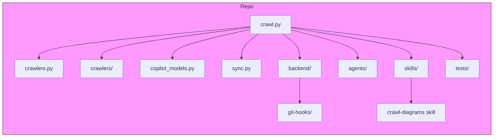
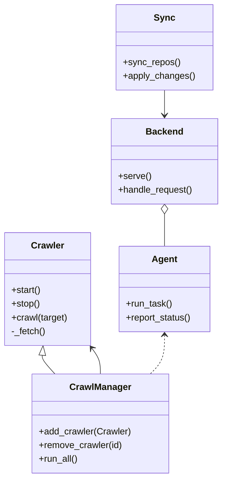

# Diagram: common/jwt_custom_authorizer/config/config.dev.yml


> Auto-generated by Obscura crawlers

## Diagram 1



### SVG

<svg id="container" width="1467.171875" xmlns="http://www.w3.org/2000/svg" class="flowchart" height="403" viewBox="0 0 1467.171875 403" role="graphics-document document" aria-roledescription="flowchart-v2"><style>#container{font-family:"trebuchet ms",verdana,arial,sans-serif;font-size:16px;fill:#333;}@keyframes edge-animation-frame{from{stroke-dashoffset:0;}}@keyframes dash{to{stroke-dashoffset:0;}}#container .edge-animation-slow{stroke-dasharray:9,5!important;stroke-dashoffset:900;animation:dash 50s linear infinite;stroke-linecap:round;}#container .edge-animation-fast{stroke-dasharray:9,5!important;stroke-dashoffset:900;animation:dash 20s linear infinite;stroke-linecap:round;}#container .error-icon{fill:#552222;}#container .error-text{fill:#552222;stroke:#552222;}#container .edge-thickness-normal{stroke-width:1px;}#container .edge-thickness-thick{stroke-width:3.5px;}#container .edge-pattern-solid{stroke-dasharray:0;}#container .edge-thickness-invisible{stroke-width:0;fill:none;}#container .edge-pattern-dashed{stroke-dasharray:3;}#container .edge-pattern-dotted{stroke-dasharray:2;}#container .marker{fill:#333333;stroke:#333333;}#container .marker.cross{stroke:#333333;}#container svg{font-family:"trebuchet ms",verdana,arial,sans-serif;font-size:16px;}#container p{margin:0;}#container .label{font-family:"trebuchet ms",verdana,arial,sans-serif;color:#333;}#container .cluster-label text{fill:#333;}#container .cluster-label span{color:#333;}#container .cluster-label span p{background-color:transparent;}#container .label text,#container span{fill:#333;color:#333;}#container .node rect,#container .node circle,#container .node ellipse,#container .node polygon,#container .node path{fill:#ECECFF;stroke:#9370DB;stroke-width:1px;}#container .rough-node .label text,#container .node .label text,#container .image-shape .label,#container .icon-shape .label{text-anchor:middle;}#container .node .katex path{fill:#000;stroke:#000;stroke-width:1px;}#container .rough-node .label,#container .node .label,#container .image-shape .label,#container .icon-shape .label{text-align:center;}#container .node.clickable{cursor:pointer;}#container .root .anchor path{fill:#333333!important;stroke-width:0;stroke:#333333;}#container .arrowheadPath{fill:#333333;}#container .edgePath .path{stroke:#333333;stroke-width:2.0px;}#container .flowchart-link{stroke:#333333;fill:none;}#container .edgeLabel{background-color:rgba(232,232,232, 0.8);text-align:center;}#container .edgeLabel p{background-color:rgba(232,232,232, 0.8);}#container .edgeLabel rect{opacity:0.5;background-color:rgba(232,232,232, 0.8);fill:rgba(232,232,232, 0.8);}#container .labelBkg{background-color:rgba(232, 232, 232, 0.5);}#container .cluster rect{fill:#ffffde;stroke:#aaaa33;stroke-width:1px;}#container .cluster text{fill:#333;}#container .cluster span{color:#333;}#container div.mermaidTooltip{position:absolute;text-align:center;max-width:200px;padding:2px;font-family:"trebuchet ms",verdana,arial,sans-serif;font-size:12px;background:hsl(80, 100%, 96.2745098039%);border:1px solid #aaaa33;border-radius:2px;pointer-events:none;z-index:100;}#container .flowchartTitleText{text-anchor:middle;font-size:18px;fill:#333;}#container rect.text{fill:none;stroke-width:0;}#container .icon-shape,#container .image-shape{background-color:rgba(232,232,232, 0.8);text-align:center;}#container .icon-shape p,#container .image-shape p{background-color:rgba(232,232,232, 0.8);padding:2px;}#container .icon-shape rect,#container .image-shape rect{opacity:0.5;background-color:rgba(232,232,232, 0.8);fill:rgba(232,232,232, 0.8);}#container .label-icon{display:inline-block;height:1em;overflow:visible;vertical-align:-0.125em;}#container .node .label-icon path{fill:currentColor;stroke:revert;stroke-width:revert;}#container :root{--mermaid-font-family:"trebuchet ms",verdana,arial,sans-serif;}</style><g><marker id="container_flowchart-v2-pointEnd" class="marker flowchart-v2" viewBox="0 0 10 10" refX="5" refY="5" markerUnits="userSpaceOnUse" markerWidth="8" markerHeight="8" orient="auto"><path d="M 0 0 L 10 5 L 0 10 z" class="arrowMarkerPath" style="stroke-width: 1; stroke-dasharray: 1, 0;"></path></marker><marker id="container_flowchart-v2-pointStart" class="marker flowchart-v2" viewBox="0 0 10 10" refX="4.5" refY="5" markerUnits="userSpaceOnUse" markerWidth="8" markerHeight="8" orient="auto"><path d="M 0 5 L 10 10 L 10 0 z" class="arrowMarkerPath" style="stroke-width: 1; stroke-dasharray: 1, 0;"></path></marker><marker id="container_flowchart-v2-circleEnd" class="marker flowchart-v2" viewBox="0 0 10 10" refX="11" refY="5" markerUnits="userSpaceOnUse" markerWidth="11" markerHeight="11" orient="auto"><circle cx="5" cy="5" r="5" class="arrowMarkerPath" style="stroke-width: 1; stroke-dasharray: 1, 0;"></circle></marker><marker id="container_flowchart-v2-circleStart" class="marker flowchart-v2" viewBox="0 0 10 10" refX="-1" refY="5" markerUnits="userSpaceOnUse" markerWidth="11" markerHeight="11" orient="auto"><circle cx="5" cy="5" r="5" class="arrowMarkerPath" style="stroke-width: 1; stroke-dasharray: 1, 0;"></circle></marker><marker id="container_flowchart-v2-crossEnd" class="marker cross flowchart-v2" viewBox="0 0 11 11" refX="12" refY="5.2" markerUnits="userSpaceOnUse" markerWidth="11" markerHeight="11" orient="auto"><path d="M 1,1 l 9,9 M 10,1 l -9,9" class="arrowMarkerPath" style="stroke-width: 2; stroke-dasharray: 1, 0;"></path></marker><marker id="container_flowchart-v2-crossStart" class="marker cross flowchart-v2" viewBox="0 0 11 11" refX="-1" refY="5.2" markerUnits="userSpaceOnUse" markerWidth="11" markerHeight="11" orient="auto"><path d="M 1,1 l 9,9 M 10,1 l -9,9" class="arrowMarkerPath" style="stroke-width: 2; stroke-dasharray: 1, 0;"></path></marker><g class="root"><g class="clusters"></g><g class="edgePaths"></g><g class="edgeLabels"></g><g class="nodes"><g class="root" transform="translate(0, 0)"><g class="clusters"><g class="cluster" id="Repo" data-look="classic"><rect style="fill:#f9f !important;stroke:#333 !important;stroke-width:1px !important" x="8" y="8" width="1451.171875" height="387"></rect><g class="cluster-label" transform="translate(715.078125, 8)"><foreignObject width="37.015625" height="24"><div xmlns="http://www.w3.org/1999/xhtml" style="display: table-cell; white-space: nowrap; line-height: 1.5; max-width: 200px; text-align: center;"><span class="nodeLabel"><p>Repo</p></span></div></foreignObject></g></g></g><g class="edgePaths"><path d="M738.945,78.115L634.725,87.93C530.505,97.744,322.065,117.372,217.845,132.769C113.625,148.167,113.625,159.333,113.625,164.917L113.625,170.5" id="L_A_B_0" class="edge-thickness-normal edge-pattern-solid edge-thickness-normal edge-pattern-solid flowchart-link" style=";" data-edge="true" data-et="edge" data-id="L_A_B_0" data-points="W3sieCI6NzM4Ljk0NTMxMjUsInkiOjc4LjExNTQ0NDcxNTY1MTE3fSx7IngiOjExMy42MjUsInkiOjEzN30seyJ4IjoxMTMuNjI1LCJ5IjoxNzQuNX1d" marker-end="url(#container_flowchart-v2-pointEnd)"></path><path d="M738.945,80.191L665.531,89.659C592.117,99.127,445.289,118.064,371.875,133.115C298.461,148.167,298.461,159.333,298.461,164.917L298.461,170.5" id="L_A_C_0" class="edge-thickness-normal edge-pattern-solid edge-thickness-normal edge-pattern-solid flowchart-link" style=";" data-edge="true" data-et="edge" data-id="L_A_C_0" data-points="W3sieCI6NzM4Ljk0NTMxMjUsInkiOjgwLjE5MDgzMDI3NDE1NDV9LHsieCI6Mjk4LjQ2MDkzNzUsInkiOjEzN30seyJ4IjoyOTguNDYwOTM3NSwieSI6MTc0LjV9XQ==" marker-end="url(#container_flowchart-v2-pointEnd)"></path><path d="M738.945,85.8L700.684,94.333C662.422,102.866,585.898,119.933,547.637,134.05C509.375,148.167,509.375,159.333,509.375,164.917L509.375,170.5" id="L_A_D_0" class="edge-thickness-normal edge-pattern-solid edge-thickness-normal edge-pattern-solid flowchart-link" style=";" data-edge="true" data-et="edge" data-id="L_A_D_0" data-points="W3sieCI6NzM4Ljk0NTMxMjUsInkiOjg1Ljc5OTcwNTU0ODY1MjAxfSx7IngiOjUwOS4zNzUsInkiOjEzN30seyJ4Ijo1MDkuMzc1LCJ5IjoxNzQuNX1d" marker-end="url(#container_flowchart-v2-pointEnd)"></path><path d="M762.666,99.5L754.354,105.75C746.041,112,729.415,124.5,721.102,136.333C712.789,148.167,712.789,159.333,712.789,164.917L712.789,170.5" id="L_A_E_0" class="edge-thickness-normal edge-pattern-solid edge-thickness-normal edge-pattern-solid flowchart-link" style=";" data-edge="true" data-et="edge" data-id="L_A_E_0" data-points="W3sieCI6NzYyLjY2NjQyNDQxODYwNDYsInkiOjk5LjV9LHsieCI6NzEyLjc4OTA2MjUsInkiOjEzN30seyJ4Ijo3MTIuNzg5MDYyNSwieSI6MTc0LjV9XQ==" marker-end="url(#container_flowchart-v2-pointEnd)"></path><path d="M834.49,99.5L842.803,105.75C851.116,112,867.741,124.5,876.054,136.333C884.367,148.167,884.367,159.333,884.367,164.917L884.367,170.5" id="L_A_F_0" class="edge-thickness-normal edge-pattern-solid edge-thickness-normal edge-pattern-solid flowchart-link" style=";" data-edge="true" data-et="edge" data-id="L_A_F_0" data-points="W3sieCI6ODM0LjQ4OTgyNTU4MTM5NTQsInkiOjk5LjV9LHsieCI6ODg0LjM2NzE4NzUsInkiOjEzN30seyJ4Ijo4ODQuMzY3MTg3NSwieSI6MTc0LjV9XQ==" marker-end="url(#container_flowchart-v2-pointEnd)"></path><path d="M858.211,87.362L891.405,95.635C924.599,103.908,990.987,120.454,1024.181,134.31C1057.375,148.167,1057.375,159.333,1057.375,164.917L1057.375,170.5" id="L_A_G_0" class="edge-thickness-normal edge-pattern-solid edge-thickness-normal edge-pattern-solid flowchart-link" style=";" data-edge="true" data-et="edge" data-id="L_A_G_0" data-points="W3sieCI6ODU4LjIxMDkzNzUsInkiOjg3LjM2MjI5ODQ5NjY0OTE2fSx7IngiOjEwNTcuMzc1LCJ5IjoxMzd9LHsieCI6MTA1Ny4zNzUsInkiOjE3NC41fV0=" marker-end="url(#container_flowchart-v2-pointEnd)"></path><path d="M858.211,81.666L918.208,90.889C978.206,100.111,1098.201,118.555,1158.198,133.361C1218.195,148.167,1218.195,159.333,1218.195,164.917L1218.195,170.5" id="L_A_H_0" class="edge-thickness-normal edge-pattern-solid edge-thickness-normal edge-pattern-solid flowchart-link" style=";" data-edge="true" data-et="edge" data-id="L_A_H_0" data-points="W3sieCI6ODU4LjIxMDkzNzUsInkiOjgxLjY2NjI1MDg2MTA4OTl9LHsieCI6MTIxOC4xOTUzMTI1LCJ5IjoxMzd9LHsieCI6MTIxOC4xOTUzMTI1LCJ5IjoxNzQuNX1d" marker-end="url(#container_flowchart-v2-pointEnd)"></path><path d="M858.211,79.202L943.93,88.835C1029.648,98.468,1201.086,117.734,1286.805,132.95C1372.523,148.167,1372.523,159.333,1372.523,164.917L1372.523,170.5" id="L_A_I_0" class="edge-thickness-normal edge-pattern-solid edge-thickness-normal edge-pattern-solid flowchart-link" style=";" data-edge="true" data-et="edge" data-id="L_A_I_0" data-points="W3sieCI6ODU4LjIxMDkzNzUsInkiOjc5LjIwMTUzODE0NzQxNzE0fSx7IngiOjEzNzIuNTIzNDM3NSwieSI6MTM3fSx7IngiOjEzNzIuNTIzNDM3NSwieSI6MTc0LjV9XQ==" marker-end="url(#container_flowchart-v2-pointEnd)"></path><path d="M884.367,228.5L884.367,234.75C884.367,241,884.367,253.5,884.367,265.333C884.367,277.167,884.367,288.333,884.367,293.917L884.367,299.5" id="L_F_J_0" class="edge-thickness-normal edge-pattern-solid edge-thickness-normal edge-pattern-solid flowchart-link" style=";" data-edge="true" data-et="edge" data-id="L_F_J_0" data-points="W3sieCI6ODg0LjM2NzE4NzUsInkiOjIyOC41fSx7IngiOjg4NC4zNjcxODc1LCJ5IjoyNjZ9LHsieCI6ODg0LjM2NzE4NzUsInkiOjMwMy41fV0=" marker-end="url(#container_flowchart-v2-pointEnd)"></path><path d="M1218.195,228.5L1218.195,234.75C1218.195,241,1218.195,253.5,1218.195,265.333C1218.195,277.167,1218.195,288.333,1218.195,293.917L1218.195,299.5" id="L_H_K_0" class="edge-thickness-normal edge-pattern-solid edge-thickness-normal edge-pattern-solid flowchart-link" style=";" data-edge="true" data-et="edge" data-id="L_H_K_0" data-points="W3sieCI6MTIxOC4xOTUzMTI1LCJ5IjoyMjguNX0seyJ4IjoxMjE4LjE5NTMxMjUsInkiOjI2Nn0seyJ4IjoxMjE4LjE5NTMxMjUsInkiOjMwMy41fV0=" marker-end="url(#container_flowchart-v2-pointEnd)"></path></g><g class="edgeLabels"><g class="edgeLabel"><g class="label" data-id="L_A_B_0" transform="translate(0, 0)"><foreignObject width="0" height="0"><div xmlns="http://www.w3.org/1999/xhtml" class="labelBkg" style="display: table-cell; white-space: nowrap; line-height: 1.5; max-width: 200px; text-align: center;"><span class="edgeLabel"></span></div></foreignObject></g></g><g class="edgeLabel"><g class="label" data-id="L_A_C_0" transform="translate(0, 0)"><foreignObject width="0" height="0"><div xmlns="http://www.w3.org/1999/xhtml" class="labelBkg" style="display: table-cell; white-space: nowrap; line-height: 1.5; max-width: 200px; text-align: center;"><span class="edgeLabel"></span></div></foreignObject></g></g><g class="edgeLabel"><g class="label" data-id="L_A_D_0" transform="translate(0, 0)"><foreignObject width="0" height="0"><div xmlns="http://www.w3.org/1999/xhtml" class="labelBkg" style="display: table-cell; white-space: nowrap; line-height: 1.5; max-width: 200px; text-align: center;"><span class="edgeLabel"></span></div></foreignObject></g></g><g class="edgeLabel"><g class="label" data-id="L_A_E_0" transform="translate(0, 0)"><foreignObject width="0" height="0"><div xmlns="http://www.w3.org/1999/xhtml" class="labelBkg" style="display: table-cell; white-space: nowrap; line-height: 1.5; max-width: 200px; text-align: center;"><span class="edgeLabel"></span></div></foreignObject></g></g><g class="edgeLabel"><g class="label" data-id="L_A_F_0" transform="translate(0, 0)"><foreignObject width="0" height="0"><div xmlns="http://www.w3.org/1999/xhtml" class="labelBkg" style="display: table-cell; white-space: nowrap; line-height: 1.5; max-width: 200px; text-align: center;"><span class="edgeLabel"></span></div></foreignObject></g></g><g class="edgeLabel"><g class="label" data-id="L_A_G_0" transform="translate(0, 0)"><foreignObject width="0" height="0"><div xmlns="http://www.w3.org/1999/xhtml" class="labelBkg" style="display: table-cell; white-space: nowrap; line-height: 1.5; max-width: 200px; text-align: center;"><span class="edgeLabel"></span></div></foreignObject></g></g><g class="edgeLabel"><g class="label" data-id="L_A_H_0" transform="translate(0, 0)"><foreignObject width="0" height="0"><div xmlns="http://www.w3.org/1999/xhtml" class="labelBkg" style="display: table-cell; white-space: nowrap; line-height: 1.5; max-width: 200px; text-align: center;"><span class="edgeLabel"></span></div></foreignObject></g></g><g class="edgeLabel"><g class="label" data-id="L_A_I_0" transform="translate(0, 0)"><foreignObject width="0" height="0"><div xmlns="http://www.w3.org/1999/xhtml" class="labelBkg" style="display: table-cell; white-space: nowrap; line-height: 1.5; max-width: 200px; text-align: center;"><span class="edgeLabel"></span></div></foreignObject></g></g><g class="edgeLabel"><g class="label" data-id="L_F_J_0" transform="translate(0, 0)"><foreignObject width="0" height="0"><div xmlns="http://www.w3.org/1999/xhtml" class="labelBkg" style="display: table-cell; white-space: nowrap; line-height: 1.5; max-width: 200px; text-align: center;"><span class="edgeLabel"></span></div></foreignObject></g></g><g class="edgeLabel"><g class="label" data-id="L_H_K_0" transform="translate(0, 0)"><foreignObject width="0" height="0"><div xmlns="http://www.w3.org/1999/xhtml" class="labelBkg" style="display: table-cell; white-space: nowrap; line-height: 1.5; max-width: 200px; text-align: center;"><span class="edgeLabel"></span></div></foreignObject></g></g></g><g class="nodes"><g class="node default" id="flowchart-A-0" transform="translate(798.578125, 72.5)"><rect class="basic label-container" style="" x="-59.6328125" y="-27" width="119.265625" height="54"></rect><g class="label" style="" transform="translate(-29.6328125, -12)"><rect></rect><foreignObject width="59.265625" height="24"><div xmlns="http://www.w3.org/1999/xhtml" style="display: table-cell; white-space: nowrap; line-height: 1.5; max-width: 200px; text-align: center;"><span class="nodeLabel"><p>crawl.py</p></span></div></foreignObject></g></g><g class="node default" id="flowchart-B-1" transform="translate(113.625, 201.5)"><rect class="basic label-container" style="" x="-70.625" y="-27" width="141.25" height="54"></rect><g class="label" style="" transform="translate(-40.625, -12)"><rect></rect><foreignObject width="81.25" height="24"><div xmlns="http://www.w3.org/1999/xhtml" style="display: table-cell; white-space: nowrap; line-height: 1.5; max-width: 200px; text-align: center;"><span class="nodeLabel"><p>crawlers.py</p></span></div></foreignObject></g></g><g class="node default" id="flowchart-C-3" transform="translate(298.4609375, 201.5)"><rect class="basic label-container" style="" x="-64.2109375" y="-27" width="128.421875" height="54"></rect><g class="label" style="" transform="translate(-34.2109375, -12)"><rect></rect><foreignObject width="68.421875" height="24"><div xmlns="http://www.w3.org/1999/xhtml" style="display: table-cell; white-space: nowrap; line-height: 1.5; max-width: 200px; text-align: center;"><span class="nodeLabel"><p>crawlers/</p></span></div></foreignObject></g></g><g class="node default" id="flowchart-D-5" transform="translate(509.375, 201.5)"><rect class="basic label-container" style="" x="-96.703125" y="-27" width="193.40625" height="54"></rect><g class="label" style="" transform="translate(-66.703125, -12)"><rect></rect><foreignObject width="133.40625" height="24"><div xmlns="http://www.w3.org/1999/xhtml" style="display: table-cell; white-space: nowrap; line-height: 1.5; max-width: 200px; text-align: center;"><span class="nodeLabel"><p>copilot_models.py</p></span></div></foreignObject></g></g><g class="node default" id="flowchart-E-7" transform="translate(712.7890625, 201.5)"><rect class="basic label-container" style="" x="-56.7109375" y="-27" width="113.421875" height="54"></rect><g class="label" style="" transform="translate(-26.7109375, -12)"><rect></rect><foreignObject width="53.421875" height="24"><div xmlns="http://www.w3.org/1999/xhtml" style="display: table-cell; white-space: nowrap; line-height: 1.5; max-width: 200px; text-align: center;"><span class="nodeLabel"><p>sync.py</p></span></div></foreignObject></g></g><g class="node default" id="flowchart-F-9" transform="translate(884.3671875, 201.5)"><rect class="basic label-container" style="" x="-64.8671875" y="-27" width="129.734375" height="54"></rect><g class="label" style="" transform="translate(-34.8671875, -12)"><rect></rect><foreignObject width="69.734375" height="24"><div xmlns="http://www.w3.org/1999/xhtml" style="display: table-cell; white-space: nowrap; line-height: 1.5; max-width: 200px; text-align: center;"><span class="nodeLabel"><p>backend/</p></span></div></foreignObject></g></g><g class="node default" id="flowchart-G-11" transform="translate(1057.375, 201.5)"><rect class="basic label-container" style="" x="-58.140625" y="-27" width="116.28125" height="54"></rect><g class="label" style="" transform="translate(-28.140625, -12)"><rect></rect><foreignObject width="56.28125" height="24"><div xmlns="http://www.w3.org/1999/xhtml" style="display: table-cell; white-space: nowrap; line-height: 1.5; max-width: 200px; text-align: center;"><span class="nodeLabel"><p>agents/</p></span></div></foreignObject></g></g><g class="node default" id="flowchart-H-13" transform="translate(1218.1953125, 201.5)"><rect class="basic label-container" style="" x="-52.6796875" y="-27" width="105.359375" height="54"></rect><g class="label" style="" transform="translate(-22.6796875, -12)"><rect></rect><foreignObject width="45.359375" height="24"><div xmlns="http://www.w3.org/1999/xhtml" style="display: table-cell; white-space: nowrap; line-height: 1.5; max-width: 200px; text-align: center;"><span class="nodeLabel"><p>skills/</p></span></div></foreignObject></g></g><g class="node default" id="flowchart-I-15" transform="translate(1372.5234375, 201.5)"><rect class="basic label-container" style="" x="-51.6484375" y="-27" width="103.296875" height="54"></rect><g class="label" style="" transform="translate(-21.6484375, -12)"><rect></rect><foreignObject width="43.296875" height="24"><div xmlns="http://www.w3.org/1999/xhtml" style="display: table-cell; white-space: nowrap; line-height: 1.5; max-width: 200px; text-align: center;"><span class="nodeLabel"><p>tests/</p></span></div></foreignObject></g></g><g class="node default" id="flowchart-J-17" transform="translate(884.3671875, 330.5)"><rect class="basic label-container" style="" x="-68.1953125" y="-27" width="136.390625" height="54"></rect><g class="label" style="" transform="translate(-38.1953125, -12)"><rect></rect><foreignObject width="76.390625" height="24"><div xmlns="http://www.w3.org/1999/xhtml" style="display: table-cell; white-space: nowrap; line-height: 1.5; max-width: 200px; text-align: center;"><span class="nodeLabel"><p>git-hooks/</p></span></div></foreignObject></g></g><g class="node default" id="flowchart-K-19" transform="translate(1218.1953125, 330.5)"><rect class="basic label-container" style="" x="-102.2890625" y="-27" width="204.578125" height="54"></rect><g class="label" style="" transform="translate(-72.2890625, -12)"><rect></rect><foreignObject width="144.578125" height="24"><div xmlns="http://www.w3.org/1999/xhtml" style="display: table-cell; white-space: nowrap; line-height: 1.5; max-width: 200px; text-align: center;"><span class="nodeLabel"><p>crawl-diagrams skill</p></span></div></foreignObject></g></g></g></g></g></g></g></svg>

## Diagram 2



### SVG

<svg id="container" width="391.3203125" xmlns="http://www.w3.org/2000/svg" class="classDiagram" height="838" viewBox="0 0 391.3203125 838" role="graphics-document document" aria-roledescription="class"><style>#container{font-family:"trebuchet ms",verdana,arial,sans-serif;font-size:16px;fill:#333;}@keyframes edge-animation-frame{from{stroke-dashoffset:0;}}@keyframes dash{to{stroke-dashoffset:0;}}#container .edge-animation-slow{stroke-dasharray:9,5!important;stroke-dashoffset:900;animation:dash 50s linear infinite;stroke-linecap:round;}#container .edge-animation-fast{stroke-dasharray:9,5!important;stroke-dashoffset:900;animation:dash 20s linear infinite;stroke-linecap:round;}#container .error-icon{fill:#552222;}#container .error-text{fill:#552222;stroke:#552222;}#container .edge-thickness-normal{stroke-width:1px;}#container .edge-thickness-thick{stroke-width:3.5px;}#container .edge-pattern-solid{stroke-dasharray:0;}#container .edge-thickness-invisible{stroke-width:0;fill:none;}#container .edge-pattern-dashed{stroke-dasharray:3;}#container .edge-pattern-dotted{stroke-dasharray:2;}#container .marker{fill:#333333;stroke:#333333;}#container .marker.cross{stroke:#333333;}#container svg{font-family:"trebuchet ms",verdana,arial,sans-serif;font-size:16px;}#container p{margin:0;}#container g.classGroup text{fill:#9370DB;stroke:none;font-family:"trebuchet ms",verdana,arial,sans-serif;font-size:10px;}#container g.classGroup text .title{font-weight:bolder;}#container .nodeLabel,#container .edgeLabel{color:#131300;}#container .edgeLabel .label rect{fill:#ECECFF;}#container .label text{fill:#131300;}#container .labelBkg{background:#ECECFF;}#container .edgeLabel .label span{background:#ECECFF;}#container .classTitle{font-weight:bolder;}#container .node rect,#container .node circle,#container .node ellipse,#container .node polygon,#container .node path{fill:#ECECFF;stroke:#9370DB;stroke-width:1px;}#container .divider{stroke:#9370DB;stroke-width:1;}#container g.clickable{cursor:pointer;}#container g.classGroup rect{fill:#ECECFF;stroke:#9370DB;}#container g.classGroup line{stroke:#9370DB;stroke-width:1;}#container .classLabel .box{stroke:none;stroke-width:0;fill:#ECECFF;opacity:0.5;}#container .classLabel .label{fill:#9370DB;font-size:10px;}#container .relation{stroke:#333333;stroke-width:1;fill:none;}#container .dashed-line{stroke-dasharray:3;}#container .dotted-line{stroke-dasharray:1 2;}#container #compositionStart,#container .composition{fill:#333333!important;stroke:#333333!important;stroke-width:1;}#container #compositionEnd,#container .composition{fill:#333333!important;stroke:#333333!important;stroke-width:1;}#container #dependencyStart,#container .dependency{fill:#333333!important;stroke:#333333!important;stroke-width:1;}#container #dependencyStart,#container .dependency{fill:#333333!important;stroke:#333333!important;stroke-width:1;}#container #extensionStart,#container .extension{fill:transparent!important;stroke:#333333!important;stroke-width:1;}#container #extensionEnd,#container .extension{fill:transparent!important;stroke:#333333!important;stroke-width:1;}#container #aggregationStart,#container .aggregation{fill:transparent!important;stroke:#333333!important;stroke-width:1;}#container #aggregationEnd,#container .aggregation{fill:transparent!important;stroke:#333333!important;stroke-width:1;}#container #lollipopStart,#container .lollipop{fill:#ECECFF!important;stroke:#333333!important;stroke-width:1;}#container #lollipopEnd,#container .lollipop{fill:#ECECFF!important;stroke:#333333!important;stroke-width:1;}#container .edgeTerminals{font-size:11px;line-height:initial;}#container .classTitleText{text-anchor:middle;font-size:18px;fill:#333;}#container .label-icon{display:inline-block;height:1em;overflow:visible;vertical-align:-0.125em;}#container .node .label-icon path{fill:currentColor;stroke:revert;stroke-width:revert;}#container :root{--mermaid-font-family:"trebuchet ms",verdana,arial,sans-serif;}</style><g><defs><marker id="container_class-aggregationStart" class="marker aggregation class" refX="18" refY="7" markerWidth="190" markerHeight="240" orient="auto"><path d="M 18,7 L9,13 L1,7 L9,1 Z"></path></marker></defs><defs><marker id="container_class-aggregationEnd" class="marker aggregation class" refX="1" refY="7" markerWidth="20" markerHeight="28" orient="auto"><path d="M 18,7 L9,13 L1,7 L9,1 Z"></path></marker></defs><defs><marker id="container_class-extensionStart" class="marker extension class" refX="18" refY="7" markerWidth="190" markerHeight="240" orient="auto"><path d="M 1,7 L18,13 V 1 Z"></path></marker></defs><defs><marker id="container_class-extensionEnd" class="marker extension class" refX="1" refY="7" markerWidth="20" markerHeight="28" orient="auto"><path d="M 1,1 V 13 L18,7 Z"></path></marker></defs><defs><marker id="container_class-compositionStart" class="marker composition class" refX="18" refY="7" markerWidth="190" markerHeight="240" orient="auto"><path d="M 18,7 L9,13 L1,7 L9,1 Z"></path></marker></defs><defs><marker id="container_class-compositionEnd" class="marker composition class" refX="1" refY="7" markerWidth="20" markerHeight="28" orient="auto"><path d="M 18,7 L9,13 L1,7 L9,1 Z"></path></marker></defs><defs><marker id="container_class-dependencyStart" class="marker dependency class" refX="6" refY="7" markerWidth="190" markerHeight="240" orient="auto"><path d="M 5,7 L9,13 L1,7 L9,1 Z"></path></marker></defs><defs><marker id="container_class-dependencyEnd" class="marker dependency class" refX="13" refY="7" markerWidth="20" markerHeight="28" orient="auto"><path d="M 18,7 L9,13 L14,7 L9,1 Z"></path></marker></defs><defs><marker id="container_class-lollipopStart" class="marker lollipop class" refX="13" refY="7" markerWidth="190" markerHeight="240" orient="auto"><circle stroke="black" fill="transparent" cx="7" cy="7" r="6"></circle></marker></defs><defs><marker id="container_class-lollipopEnd" class="marker lollipop class" refX="1" refY="7" markerWidth="190" markerHeight="240" orient="auto"><circle stroke="black" fill="transparent" cx="7" cy="7" r="6"></circle></marker></defs><g class="root"><g class="clusters"></g><g class="edgePaths"><path d="M74.13,623.194L74.025,624.495C73.92,625.796,73.71,628.398,77.44,633.866C81.171,639.333,88.841,647.667,92.677,651.833L96.512,656" id="id_Crawler_CrawlManager_1" class="edge-thickness-normal edge-pattern-solid relation" style=";;;" data-edge="true" data-et="edge" data-id="id_Crawler_CrawlManager_1" data-points="W3sieCI6NzUuNTE2MTI5MDMyMjU4MDYsInkiOjYwNn0seyJ4Ijo3My41LCJ5Ijo2MzF9LHsieCI6OTYuNTExOTk3NzY3ODU3MTQsInkiOjY1Nn1d" marker-start="url(#container_class-extensionStart)"></path><path d="M289.688,588L289.688,595.167C289.688,602.333,289.688,616.667,285.48,628C281.273,639.333,272.858,647.667,268.651,651.833L264.443,656" id="id_Agent_CrawlManager_2" class="edge-thickness-normal edge-pattern-dashed relation" style=";;;" data-edge="true" data-et="edge" data-id="id_Agent_CrawlManager_2" data-points="W3sieCI6Mjg5LjY4NzUsInkiOjU4Mn0seyJ4IjoyODkuNjg3NSwieSI6NjMxfSx7IngiOjI2NC40NDMzNTkzNzUsInkiOjY1Nn1d" marker-start="url(#container_class-dependencyStart)"></path><path d="M289.688,158L289.688,162.167C289.688,166.333,289.688,174.667,289.688,182C289.688,189.333,289.688,195.667,289.688,198.833L289.688,202" id="id_Sync_Backend_3" class="edge-thickness-normal edge-pattern-solid relation" style=";;;" data-edge="true" data-et="edge" data-id="id_Sync_Backend_3" data-points="W3sieCI6Mjg5LjY4NzUsInkiOjE1OH0seyJ4IjoyODkuNjg3NSwieSI6MTgzfSx7IngiOjI4OS42ODc1LCJ5IjoyMDh9XQ==" marker-end="url(#container_class-dependencyEnd)"></path><path d="M176.594,656L176.594,651.833C176.594,647.667,176.594,639.333,174.066,631.8C171.538,624.266,166.483,617.532,163.955,614.165L161.427,610.798" id="id_CrawlManager_Crawler_4" class="edge-thickness-normal edge-pattern-solid relation" style=";;;" data-edge="true" data-et="edge" data-id="id_CrawlManager_Crawler_4" data-points="W3sieCI6MTc2LjU5Mzc1LCJ5Ijo2NTZ9LHsieCI6MTc2LjU5Mzc1LCJ5Ijo2MzF9LHsieCI6MTU3LjgyNDg0ODc5MDMyMjU2LCJ5Ijo2MDZ9XQ==" marker-end="url(#container_class-dependencyEnd)"></path><path d="M289.688,375.25L289.688,376.542C289.688,377.833,289.688,380.417,289.688,389.875C289.688,399.333,289.688,415.667,289.688,423.833L289.688,432" id="id_Backend_Agent_5" class="edge-thickness-normal edge-pattern-solid relation" style=";;;" data-edge="true" data-et="edge" data-id="id_Backend_Agent_5" data-points="W3sieCI6Mjg5LjY4NzUsInkiOjM1OH0seyJ4IjoyODkuNjg3NSwieSI6MzgzfSx7IngiOjI4OS42ODc1LCJ5Ijo0MzJ9XQ==" marker-start="url(#container_class-aggregationStart)"></path></g><g class="edgeLabels"><g class="edgeLabel"><g class="label" data-id="id_Crawler_CrawlManager_1" transform="translate(0, 0)"><foreignObject width="0" height="0"><div xmlns="http://www.w3.org/1999/xhtml" class="labelBkg" style="display: table-cell; white-space: nowrap; line-height: 1.5; max-width: 200px; text-align: center;"><span class="edgeLabel"></span></div></foreignObject></g></g><g class="edgeLabel"><g class="label" data-id="id_Agent_CrawlManager_2" transform="translate(0, 0)"><foreignObject width="0" height="0"><div xmlns="http://www.w3.org/1999/xhtml" class="labelBkg" style="display: table-cell; white-space: nowrap; line-height: 1.5; max-width: 200px; text-align: center;"><span class="edgeLabel"></span></div></foreignObject></g></g><g class="edgeLabel"><g class="label" data-id="id_Sync_Backend_3" transform="translate(0, 0)"><foreignObject width="0" height="0"><div xmlns="http://www.w3.org/1999/xhtml" class="labelBkg" style="display: table-cell; white-space: nowrap; line-height: 1.5; max-width: 200px; text-align: center;"><span class="edgeLabel"></span></div></foreignObject></g></g><g class="edgeLabel"><g class="label" data-id="id_CrawlManager_Crawler_4" transform="translate(0, 0)"><foreignObject width="0" height="0"><div xmlns="http://www.w3.org/1999/xhtml" class="labelBkg" style="display: table-cell; white-space: nowrap; line-height: 1.5; max-width: 200px; text-align: center;"><span class="edgeLabel"></span></div></foreignObject></g></g><g class="edgeLabel"><g class="label" data-id="id_Backend_Agent_5" transform="translate(0, 0)"><foreignObject width="0" height="0"><div xmlns="http://www.w3.org/1999/xhtml" class="labelBkg" style="display: table-cell; white-space: nowrap; line-height: 1.5; max-width: 200px; text-align: center;"><span class="edgeLabel"></span></div></foreignObject></g></g></g><g class="nodes"><g class="node default" id="classId-Crawler-0" transform="translate(83.5, 507)"><g class="basic label-container"><path d="M-75.5 -99 L75.5 -99 L75.5 99 L-75.5 99" stroke="none" stroke-width="0" fill="#ECECFF" style=""></path><path d="M-75.5 -99 C-25.109925613852347 -99, 25.280148772295306 -99, 75.5 -99 M-75.5 -99 C-25.28537860233083 -99, 24.92924279533834 -99, 75.5 -99 M75.5 -99 C75.5 -36.45596298658266, 75.5 26.088074026834676, 75.5 99 M75.5 -99 C75.5 -42.85435938463975, 75.5 13.2912812307205, 75.5 99 M75.5 99 C26.486348157406887 99, -22.527303685186226 99, -75.5 99 M75.5 99 C23.153748131268124 99, -29.192503737463753 99, -75.5 99 M-75.5 99 C-75.5 49.76064654358351, -75.5 0.5212930871670238, -75.5 -99 M-75.5 99 C-75.5 50.28536457566537, -75.5 1.5707291513307382, -75.5 -99" stroke="#9370DB" stroke-width="1.3" fill="none" stroke-dasharray="0 0" style=""></path></g><g class="annotation-group text" transform="translate(0, -75)"></g><g class="label-group text" transform="translate(-27.734375, -75)"><g class="label" style="font-weight: bolder" transform="translate(0,-12)"><foreignObject width="55.46875" height="24"><div xmlns="http://www.w3.org/1999/xhtml" style="display: table-cell; white-space: nowrap; line-height: 1.5; max-width: 105px; text-align: center;"><span class="nodeLabel markdown-node-label" style=""><p>Crawler</p></span></div></foreignObject></g></g><g class="members-group text" transform="translate(-63.5, -27)"></g><g class="methods-group text" transform="translate(-63.5, 3)"><g class="label" style="" transform="translate(0,-12)"><foreignObject width="52.15625" height="24"><div xmlns="http://www.w3.org/1999/xhtml" style="display: table-cell; white-space: nowrap; line-height: 1.5; max-width: 110px; text-align: center;"><span class="nodeLabel markdown-node-label" style=""><p>+start()</p></span></div></foreignObject></g><g class="label" style="" transform="translate(0,12)"><foreignObject width="50.21875" height="24"><div xmlns="http://www.w3.org/1999/xhtml" style="display: table-cell; white-space: nowrap; line-height: 1.5; max-width: 108px; text-align: center;"><span class="nodeLabel markdown-node-label" style=""><p>+stop()</p></span></div></foreignObject></g><g class="label" style="" transform="translate(0,36)"><foreignObject width="99.265625" height="24"><div xmlns="http://www.w3.org/1999/xhtml" style="display: table-cell; white-space: nowrap; line-height: 1.5; max-width: 157px; text-align: center;"><span class="nodeLabel markdown-node-label" style=""><p>+crawl(target)</p></span></div></foreignObject></g><g class="label" style="" transform="translate(0,60)"><foreignObject width="60.03125" height="24"><div xmlns="http://www.w3.org/1999/xhtml" style="display: table-cell; white-space: nowrap; line-height: 1.5; max-width: 117px; text-align: center;"><span class="nodeLabel markdown-node-label" style=""><p>-_fetch()</p></span></div></foreignObject></g></g><g class="divider" style=""><path d="M-75.5 -51 C-41.740208969981055 -51, -7.980417939962109 -51, 75.5 -51 M-75.5 -51 C-25.69257091239559 -51, 24.114858175208823 -51, 75.5 -51" stroke="#9370DB" stroke-width="1.3" fill="none" stroke-dasharray="0 0" style=""></path></g><g class="divider" style=""><path d="M-75.5 -27 C-24.287073720342235 -27, 26.92585255931553 -27, 75.5 -27 M-75.5 -27 C-28.47085875364982 -27, 18.558282492700357 -27, 75.5 -27" stroke="#9370DB" stroke-width="1.3" fill="none" stroke-dasharray="0 0" style=""></path></g></g><g class="node default" id="classId-CrawlManager-1" transform="translate(176.59375, 743)"><g class="basic label-container"><path d="M-118.1796875 -87 L118.1796875 -87 L118.1796875 87 L-118.1796875 87" stroke="none" stroke-width="0" fill="#ECECFF" style=""></path><path d="M-118.1796875 -87 C-39.110457470341956 -87, 39.95877255931609 -87, 118.1796875 -87 M-118.1796875 -87 C-49.10776597144647 -87, 19.964155557107063 -87, 118.1796875 -87 M118.1796875 -87 C118.1796875 -17.699306024332472, 118.1796875 51.601387951335056, 118.1796875 87 M118.1796875 -87 C118.1796875 -45.65310510350871, 118.1796875 -4.306210207017415, 118.1796875 87 M118.1796875 87 C34.92725017915234 87, -48.325187141695324 87, -118.1796875 87 M118.1796875 87 C63.596012135724166 87, 9.012336771448332 87, -118.1796875 87 M-118.1796875 87 C-118.1796875 21.595014312877154, -118.1796875 -43.80997137424569, -118.1796875 -87 M-118.1796875 87 C-118.1796875 44.822638064316195, -118.1796875 2.645276128632389, -118.1796875 -87" stroke="#9370DB" stroke-width="1.3" fill="none" stroke-dasharray="0 0" style=""></path></g><g class="annotation-group text" transform="translate(0, -63)"></g><g class="label-group text" transform="translate(-51.59375, -63)"><g class="label" style="font-weight: bolder" transform="translate(0,-12)"><foreignObject width="103.1875" height="24"><div xmlns="http://www.w3.org/1999/xhtml" style="display: table-cell; white-space: nowrap; line-height: 1.5; max-width: 152px; text-align: center;"><span class="nodeLabel markdown-node-label" style=""><p>CrawlManager</p></span></div></foreignObject></g></g><g class="members-group text" transform="translate(-106.1796875, -15)"></g><g class="methods-group text" transform="translate(-106.1796875, 15)"><g class="label" style="" transform="translate(0,-12)"><foreignObject width="160.765625" height="24"><div xmlns="http://www.w3.org/1999/xhtml" style="display: table-cell; white-space: nowrap; line-height: 1.5; max-width: 218px; text-align: center;"><span class="nodeLabel markdown-node-label" style=""><p>+add_crawler(Crawler)</p></span></div></foreignObject></g><g class="label" style="" transform="translate(0,12)"><foreignObject width="146.921875" height="24"><div xmlns="http://www.w3.org/1999/xhtml" style="display: table-cell; white-space: nowrap; line-height: 1.5; max-width: 204px; text-align: center;"><span class="nodeLabel markdown-node-label" style=""><p>+remove_crawler(id)</p></span></div></foreignObject></g><g class="label" style="" transform="translate(0,36)"><foreignObject width="69.140625" height="24"><div xmlns="http://www.w3.org/1999/xhtml" style="display: table-cell; white-space: nowrap; line-height: 1.5; max-width: 127px; text-align: center;"><span class="nodeLabel markdown-node-label" style=""><p>+run_all()</p></span></div></foreignObject></g></g><g class="divider" style=""><path d="M-118.1796875 -39 C-49.92658889754409 -39, 18.326509704911814 -39, 118.1796875 -39 M-118.1796875 -39 C-48.767890714442274 -39, 20.643906071115453 -39, 118.1796875 -39" stroke="#9370DB" stroke-width="1.3" fill="none" stroke-dasharray="0 0" style=""></path></g><g class="divider" style=""><path d="M-118.1796875 -15 C-67.63288183468345 -15, -17.086076169366905 -15, 118.1796875 -15 M-118.1796875 -15 C-36.513981863965725 -15, 45.15172377206855 -15, 118.1796875 -15" stroke="#9370DB" stroke-width="1.3" fill="none" stroke-dasharray="0 0" style=""></path></g></g><g class="node default" id="classId-Agent-2" transform="translate(289.6875, 507)"><g class="basic label-container"><path d="M-80.6875 -75 L80.6875 -75 L80.6875 75 L-80.6875 75" stroke="none" stroke-width="0" fill="#ECECFF" style=""></path><path d="M-80.6875 -75 C-32.511998176649044 -75, 15.663503646701912 -75, 80.6875 -75 M-80.6875 -75 C-42.27244442836702 -75, -3.8573888567340333 -75, 80.6875 -75 M80.6875 -75 C80.6875 -24.20090263707783, 80.6875 26.598194725844337, 80.6875 75 M80.6875 -75 C80.6875 -23.132457188099274, 80.6875 28.735085623801453, 80.6875 75 M80.6875 75 C41.03120742962261 75, 1.374914859245223 75, -80.6875 75 M80.6875 75 C16.38974473943931 75, -47.90801052112138 75, -80.6875 75 M-80.6875 75 C-80.6875 25.256153247011753, -80.6875 -24.487693505976495, -80.6875 -75 M-80.6875 75 C-80.6875 24.30559038459205, -80.6875 -26.388819230815898, -80.6875 -75" stroke="#9370DB" stroke-width="1.3" fill="none" stroke-dasharray="0 0" style=""></path></g><g class="annotation-group text" transform="translate(0, -51)"></g><g class="label-group text" transform="translate(-21.078125, -51)"><g class="label" style="font-weight: bolder" transform="translate(0,-12)"><foreignObject width="42.15625" height="24"><div xmlns="http://www.w3.org/1999/xhtml" style="display: table-cell; white-space: nowrap; line-height: 1.5; max-width: 91px; text-align: center;"><span class="nodeLabel markdown-node-label" style=""><p>Agent</p></span></div></foreignObject></g></g><g class="members-group text" transform="translate(-68.6875, -3)"></g><g class="methods-group text" transform="translate(-68.6875, 27)"><g class="label" style="" transform="translate(0,-12)"><foreignObject width="81.09375" height="24"><div xmlns="http://www.w3.org/1999/xhtml" style="display: table-cell; white-space: nowrap; line-height: 1.5; max-width: 138px; text-align: center;"><span class="nodeLabel markdown-node-label" style=""><p>+run_task()</p></span></div></foreignObject></g><g class="label" style="" transform="translate(0,12)"><foreignObject width="116.296875" height="24"><div xmlns="http://www.w3.org/1999/xhtml" style="display: table-cell; white-space: nowrap; line-height: 1.5; max-width: 174px; text-align: center;"><span class="nodeLabel markdown-node-label" style=""><p>+report_status()</p></span></div></foreignObject></g></g><g class="divider" style=""><path d="M-80.6875 -27 C-47.339678575653025 -27, -13.99185715130605 -27, 80.6875 -27 M-80.6875 -27 C-41.65768262176035 -27, -2.627865243520702 -27, 80.6875 -27" stroke="#9370DB" stroke-width="1.3" fill="none" stroke-dasharray="0 0" style=""></path></g><g class="divider" style=""><path d="M-80.6875 -3 C-42.23897434687102 -3, -3.790448693742036 -3, 80.6875 -3 M-80.6875 -3 C-23.413468189297923 -3, 33.860563621404154 -3, 80.6875 -3" stroke="#9370DB" stroke-width="1.3" fill="none" stroke-dasharray="0 0" style=""></path></g></g><g class="node default" id="classId-Sync-3" transform="translate(289.6875, 83)"><g class="basic label-container"><path d="M-83.1015625 -75 L83.1015625 -75 L83.1015625 75 L-83.1015625 75" stroke="none" stroke-width="0" fill="#ECECFF" style=""></path><path d="M-83.1015625 -75 C-32.40673062416061 -75, 18.288101251678782 -75, 83.1015625 -75 M-83.1015625 -75 C-45.173252518553035 -75, -7.24494253710607 -75, 83.1015625 -75 M83.1015625 -75 C83.1015625 -40.70654270943756, 83.1015625 -6.413085418875113, 83.1015625 75 M83.1015625 -75 C83.1015625 -26.36869695613671, 83.1015625 22.26260608772658, 83.1015625 75 M83.1015625 75 C47.91829941129593 75, 12.735036322591867 75, -83.1015625 75 M83.1015625 75 C34.04848049876305 75, -15.004601502473903 75, -83.1015625 75 M-83.1015625 75 C-83.1015625 19.084188349838264, -83.1015625 -36.83162330032347, -83.1015625 -75 M-83.1015625 75 C-83.1015625 17.838151537098653, -83.1015625 -39.32369692580269, -83.1015625 -75" stroke="#9370DB" stroke-width="1.3" fill="none" stroke-dasharray="0 0" style=""></path></g><g class="annotation-group text" transform="translate(0, -51)"></g><g class="label-group text" transform="translate(-17.09375, -51)"><g class="label" style="font-weight: bolder" transform="translate(0,-12)"><foreignObject width="34.1875" height="24"><div xmlns="http://www.w3.org/1999/xhtml" style="display: table-cell; white-space: nowrap; line-height: 1.5; max-width: 84px; text-align: center;"><span class="nodeLabel markdown-node-label" style=""><p>Sync</p></span></div></foreignObject></g></g><g class="members-group text" transform="translate(-71.1015625, -3)"></g><g class="methods-group text" transform="translate(-71.1015625, 27)"><g class="label" style="" transform="translate(0,-12)"><foreignObject width="99.515625" height="24"><div xmlns="http://www.w3.org/1999/xhtml" style="display: table-cell; white-space: nowrap; line-height: 1.5; max-width: 157px; text-align: center;"><span class="nodeLabel markdown-node-label" style=""><p>+sync_repos()</p></span></div></foreignObject></g><g class="label" style="" transform="translate(0,12)"><foreignObject width="125.109375" height="24"><div xmlns="http://www.w3.org/1999/xhtml" style="display: table-cell; white-space: nowrap; line-height: 1.5; max-width: 182px; text-align: center;"><span class="nodeLabel markdown-node-label" style=""><p>+apply_changes()</p></span></div></foreignObject></g></g><g class="divider" style=""><path d="M-83.1015625 -27 C-40.55302006102098 -27, 1.9955223779580393 -27, 83.1015625 -27 M-83.1015625 -27 C-19.75334398536379 -27, 43.59487452927242 -27, 83.1015625 -27" stroke="#9370DB" stroke-width="1.3" fill="none" stroke-dasharray="0 0" style=""></path></g><g class="divider" style=""><path d="M-83.1015625 -3 C-23.741339839352655 -3, 35.61888282129469 -3, 83.1015625 -3 M-83.1015625 -3 C-20.856941030070708 -3, 41.387680439858585 -3, 83.1015625 -3" stroke="#9370DB" stroke-width="1.3" fill="none" stroke-dasharray="0 0" style=""></path></g></g><g class="node default" id="classId-Backend-4" transform="translate(289.6875, 283)"><g class="basic label-container"><path d="M-93.6328125 -75 L93.6328125 -75 L93.6328125 75 L-93.6328125 75" stroke="none" stroke-width="0" fill="#ECECFF" style=""></path><path d="M-93.6328125 -75 C-28.965997933762722 -75, 35.700816632474556 -75, 93.6328125 -75 M-93.6328125 -75 C-20.38848010896126 -75, 52.85585228207748 -75, 93.6328125 -75 M93.6328125 -75 C93.6328125 -42.48500839199641, 93.6328125 -9.970016783992818, 93.6328125 75 M93.6328125 -75 C93.6328125 -36.41370951187511, 93.6328125 2.172580976249776, 93.6328125 75 M93.6328125 75 C45.99013291102097 75, -1.6525466779580569 75, -93.6328125 75 M93.6328125 75 C39.965187917739364 75, -13.702436664521272 75, -93.6328125 75 M-93.6328125 75 C-93.6328125 43.27008957852452, -93.6328125 11.540179157049032, -93.6328125 -75 M-93.6328125 75 C-93.6328125 39.52598003337158, -93.6328125 4.051960066743163, -93.6328125 -75" stroke="#9370DB" stroke-width="1.3" fill="none" stroke-dasharray="0 0" style=""></path></g><g class="annotation-group text" transform="translate(0, -51)"></g><g class="label-group text" transform="translate(-31.296875, -51)"><g class="label" style="font-weight: bolder" transform="translate(0,-12)"><foreignObject width="62.59375" height="24"><div xmlns="http://www.w3.org/1999/xhtml" style="display: table-cell; white-space: nowrap; line-height: 1.5; max-width: 112px; text-align: center;"><span class="nodeLabel markdown-node-label" style=""><p>Backend</p></span></div></foreignObject></g></g><g class="members-group text" transform="translate(-81.6328125, -3)"></g><g class="methods-group text" transform="translate(-81.6328125, 27)"><g class="label" style="" transform="translate(0,-12)"><foreignObject width="57.25" height="24"><div xmlns="http://www.w3.org/1999/xhtml" style="display: table-cell; white-space: nowrap; line-height: 1.5; max-width: 115px; text-align: center;"><span class="nodeLabel markdown-node-label" style=""><p>+serve()</p></span></div></foreignObject></g><g class="label" style="" transform="translate(0,12)"><foreignObject width="131.96875" height="24"><div xmlns="http://www.w3.org/1999/xhtml" style="display: table-cell; white-space: nowrap; line-height: 1.5; max-width: 189px; text-align: center;"><span class="nodeLabel markdown-node-label" style=""><p>+handle_request()</p></span></div></foreignObject></g></g><g class="divider" style=""><path d="M-93.6328125 -27 C-23.932489278492454 -27, 45.76783394301509 -27, 93.6328125 -27 M-93.6328125 -27 C-36.344545282840684 -27, 20.94372193431863 -27, 93.6328125 -27" stroke="#9370DB" stroke-width="1.3" fill="none" stroke-dasharray="0 0" style=""></path></g><g class="divider" style=""><path d="M-93.6328125 -3 C-35.04198401093712 -3, 23.54884447812576 -3, 93.6328125 -3 M-93.6328125 -3 C-26.198023891447775 -3, 41.23676471710445 -3, 93.6328125 -3" stroke="#9370DB" stroke-width="1.3" fill="none" stroke-dasharray="0 0" style=""></path></g></g></g></g></g></svg>

## Diagram 3

```mermaid
flowchart TD
    Start[User triggers crawl] --> Queue[Task Queue]
    Queue --> Scheduler[Scheduler]
    Scheduler --> Worker[Worker (Crawler)]
    Worker -->|stores data| BackendDB[(Backend / DB)]
    BackendDB --> API[Backend API]
    API --> Client[Web UI / CLI]
    Scheduler --> AgentRunner[Agents subsystem]
    AgentRunner --> Worker
    Client -->|requests sync| SyncService[Sync service]
    SyncService --> BackendDB
```

> SVG rendering failed for this diagram.
