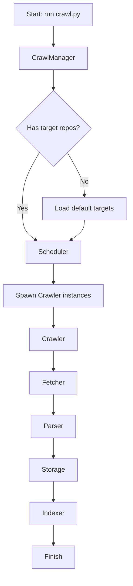
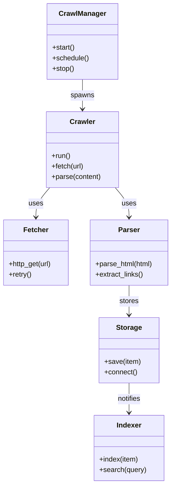

# Diagram: common/jwt_custom_authorizer/config/config.dev2.yml

> Auto-generated by Obscura crawlers

## Diagram 1

### SVG

<svg id="container" width="313.0234375" xmlns="http://www.w3.org/2000/svg" class="flowchart" height="1363.84375" viewBox="0 0 313.0234375 1363.84375" role="graphics-document document" aria-roledescription="flowchart-v2"><g><marker id="container_flowchart-v2-pointEnd" class="marker flowchart-v2" viewBox="0 0 10 10" refX="5" refY="5" markerUnits="userSpaceOnUse" markerWidth="8" markerHeight="8" orient="auto"><path d="M 0 0 L 10 5 L 0 10 z" class="arrowMarkerPath" style="stroke-width: 1; stroke-dasharray: 1, 0;"></path></marker><marker id="container_flowchart-v2-pointStart" class="marker flowchart-v2" viewBox="0 0 10 10" refX="4.5" refY="5" markerUnits="userSpaceOnUse" markerWidth="8" markerHeight="8" orient="auto"><path d="M 0 5 L 10 10 L 10 0 z" class="arrowMarkerPath" style="stroke-width: 1; stroke-dasharray: 1, 0;"></path></marker><marker id="container_flowchart-v2-circleEnd" class="marker flowchart-v2" viewBox="0 0 10 10" refX="11" refY="5" markerUnits="userSpaceOnUse" markerWidth="11" markerHeight="11" orient="auto"><circle cx="5" cy="5" r="5" class="arrowMarkerPath" style="stroke-width: 1; stroke-dasharray: 1, 0;"></circle></marker><marker id="container_flowchart-v2-circleStart" class="marker flowchart-v2" viewBox="0 0 10 10" refX="-1" refY="5" markerUnits="userSpaceOnUse" markerWidth="11" markerHeight="11" orient="auto"><circle cx="5" cy="5" r="5" class="arrowMarkerPath" style="stroke-width: 1; stroke-dasharray: 1, 0;"></circle></marker><marker id="container_flowchart-v2-crossEnd" class="marker cross flowchart-v2" viewBox="0 0 11 11" refX="12" refY="5.2" markerUnits="userSpaceOnUse" markerWidth="11" markerHeight="11" orient="auto"><path d="M 1,1 l 9,9 M 10,1 l -9,9" class="arrowMarkerPath" style="stroke-width: 2; stroke-dasharray: 1, 0;"></path></marker><marker id="container_flowchart-v2-crossStart" class="marker cross flowchart-v2" viewBox="0 0 11 11" refX="-1" refY="5.2" markerUnits="userSpaceOnUse" markerWidth="11" markerHeight="11" orient="auto"><path d="M 1,1 l 9,9 M 10,1 l -9,9" class="arrowMarkerPath" style="stroke-width: 2; stroke-dasharray: 1, 0;"></path></marker><g class="root"><g class="clusters"></g><g class="edgePaths"><path d="M127.289,62L127.289,66.167C127.289,70.333,127.289,78.667,127.289,86.333C127.289,94,127.289,101,127.289,104.5L127.289,108" id="L_A_B_0" class="edge-thickness-normal edge-pattern-solid edge-thickness-normal edge-pattern-solid flowchart-link" style=";" data-edge="true" data-et="edge" data-id="L_A_B_0" data-points="W3sieCI6MTI3LjI4OTA2MjUsInkiOjYyfSx7IngiOjEyNy4yODkwNjI1LCJ5Ijo4N30seyJ4IjoxMjcuMjg5MDYyNSwieSI6MTEyfV0=" marker-end="url(#container_flowchart-v2-pointEnd)"></path><path d="M127.289,166L127.289,170.167C127.289,174.333,127.289,182.667,127.289,190.333C127.289,198,127.289,205,127.289,208.5L127.289,212" id="L_B_C_0" class="edge-thickness-normal edge-pattern-solid edge-thickness-normal edge-pattern-solid flowchart-link" style=";" data-edge="true" data-et="edge" data-id="L_B_C_0" data-points="W3sieCI6MTI3LjI4OTA2MjUsInkiOjE2Nn0seyJ4IjoxMjcuMjg5MDYyNSwieSI6MTkxfSx7IngiOjEyNy4yODkwNjI1LCJ5IjoyMTZ9XQ==" marker-end="url(#container_flowchart-v2-pointEnd)"></path><path d="M93.911,362.466L86.987,374.196C80.063,385.925,66.215,409.384,59.291,431.781C52.367,454.177,52.367,475.51,52.367,494.844C52.367,514.177,52.367,531.51,57.823,543.964C63.279,556.417,74.19,563.99,79.646,567.776L85.101,571.563" id="L_C_D_0" class="edge-thickness-normal edge-pattern-solid edge-thickness-normal edge-pattern-solid flowchart-link" style=";" data-edge="true" data-et="edge" data-id="L_C_D_0" data-points="W3sieCI6OTMuOTExMTg3MzkzNTU5MzcsInkiOjM2Mi40NjU4NzQ4OTM1NTk0fSx7IngiOjUyLjM2NzE4NzUsInkiOjQzMi44NDM3NX0seyJ4Ijo1Mi4zNjcxODc1LCJ5Ijo0OTYuODQzNzV9LHsieCI6NTIuMzY3MTg3NSwieSI6NTQ4Ljg0Mzc1fSx7IngiOjg4LjM4NzMxOTcxMTUzODQ1LCJ5Ijo1NzMuODQzNzV9XQ==" marker-end="url(#container_flowchart-v2-pointEnd)"></path><path d="M160.667,362.466L167.591,374.196C174.515,385.925,188.363,409.384,195.287,426.614C202.211,443.844,202.211,454.844,202.211,460.344L202.211,465.844" id="L_C_E_0" class="edge-thickness-normal edge-pattern-solid edge-thickness-normal edge-pattern-solid flowchart-link" style=";" data-edge="true" data-et="edge" data-id="L_C_E_0" data-points="W3sieCI6MTYwLjY2NjkzNzYwNjQ0MDYzLCJ5IjozNjIuNDY1ODc0ODkzNTU5NH0seyJ4IjoyMDIuMjEwOTM3NSwieSI6NDMyLjg0Mzc1fSx7IngiOjIwMi4yMTA5Mzc1LCJ5Ijo0NjkuODQzNzV9XQ==" marker-end="url(#container_flowchart-v2-pointEnd)"></path><path d="M127.289,627.844L127.289,632.01C127.289,636.177,127.289,644.51,127.289,652.177C127.289,659.844,127.289,666.844,127.289,670.344L127.289,673.844" id="L_D_F_0" class="edge-thickness-normal edge-pattern-solid edge-thickness-normal edge-pattern-solid flowchart-link" style=";" data-edge="true" data-et="edge" data-id="L_D_F_0" data-points="W3sieCI6MTI3LjI4OTA2MjUsInkiOjYyNy44NDM3NX0seyJ4IjoxMjcuMjg5MDYyNSwieSI6NjUyLjg0Mzc1fSx7IngiOjEyNy4yODkwNjI1LCJ5Ijo2NzcuODQzNzV9XQ==" marker-end="url(#container_flowchart-v2-pointEnd)"></path><path d="M127.289,731.844L127.289,736.01C127.289,740.177,127.289,748.51,127.289,756.177C127.289,763.844,127.289,770.844,127.289,774.344L127.289,777.844" id="L_F_G_0" class="edge-thickness-normal edge-pattern-solid edge-thickness-normal edge-pattern-solid flowchart-link" style=";" data-edge="true" data-et="edge" data-id="L_F_G_0" data-points="W3sieCI6MTI3LjI4OTA2MjUsInkiOjczMS44NDM3NX0seyJ4IjoxMjcuMjg5MDYyNSwieSI6NzU2Ljg0Mzc1fSx7IngiOjEyNy4yODkwNjI1LCJ5Ijo3ODEuODQzNzV9XQ==" marker-end="url(#container_flowchart-v2-pointEnd)"></path><path d="M127.289,835.844L127.289,840.01C127.289,844.177,127.289,852.51,127.289,860.177C127.289,867.844,127.289,874.844,127.289,878.344L127.289,881.844" id="L_G_H_0" class="edge-thickness-normal edge-pattern-solid edge-thickness-normal edge-pattern-solid flowchart-link" style=";" data-edge="true" data-et="edge" data-id="L_G_H_0" data-points="W3sieCI6MTI3LjI4OTA2MjUsInkiOjgzNS44NDM3NX0seyJ4IjoxMjcuMjg5MDYyNSwieSI6ODYwLjg0Mzc1fSx7IngiOjEyNy4yODkwNjI1LCJ5Ijo4ODUuODQzNzV9XQ==" marker-end="url(#container_flowchart-v2-pointEnd)"></path><path d="M127.289,939.844L127.289,944.01C127.289,948.177,127.289,956.51,127.289,964.177C127.289,971.844,127.289,978.844,127.289,982.344L127.289,985.844" id="L_H_I_0" class="edge-thickness-normal edge-pattern-solid edge-thickness-normal edge-pattern-solid flowchart-link" style=";" data-edge="true" data-et="edge" data-id="L_H_I_0" data-points="W3sieCI6MTI3LjI4OTA2MjUsInkiOjkzOS44NDM3NX0seyJ4IjoxMjcuMjg5MDYyNSwieSI6OTY0Ljg0Mzc1fSx7IngiOjEyNy4yODkwNjI1LCJ5Ijo5ODkuODQzNzV9XQ==" marker-end="url(#container_flowchart-v2-pointEnd)"></path><path d="M127.289,1043.844L127.289,1048.01C127.289,1052.177,127.289,1060.51,127.289,1068.177C127.289,1075.844,127.289,1082.844,127.289,1086.344L127.289,1089.844" id="L_I_J_0" class="edge-thickness-normal edge-pattern-solid edge-thickness-normal edge-pattern-solid flowchart-link" style=";" data-edge="true" data-et="edge" data-id="L_I_J_0" data-points="W3sieCI6MTI3LjI4OTA2MjUsInkiOjEwNDMuODQzNzV9LHsieCI6MTI3LjI4OTA2MjUsInkiOjEwNjguODQzNzV9LHsieCI6MTI3LjI4OTA2MjUsInkiOjEwOTMuODQzNzV9XQ==" marker-end="url(#container_flowchart-v2-pointEnd)"></path><path d="M127.289,1147.844L127.289,1152.01C127.289,1156.177,127.289,1164.51,127.289,1172.177C127.289,1179.844,127.289,1186.844,127.289,1190.344L127.289,1193.844" id="L_J_K_0" class="edge-thickness-normal edge-pattern-solid edge-thickness-normal edge-pattern-solid flowchart-link" style=";" data-edge="true" data-et="edge" data-id="L_J_K_0" data-points="W3sieCI6MTI3LjI4OTA2MjUsInkiOjExNDcuODQzNzV9LHsieCI6MTI3LjI4OTA2MjUsInkiOjExNzIuODQzNzV9LHsieCI6MTI3LjI4OTA2MjUsInkiOjExOTcuODQzNzV9XQ==" marker-end="url(#container_flowchart-v2-pointEnd)"></path><path d="M127.289,1251.844L127.289,1256.01C127.289,1260.177,127.289,1268.51,127.289,1276.177C127.289,1283.844,127.289,1290.844,127.289,1294.344L127.289,1297.844" id="L_K_L_0" class="edge-thickness-normal edge-pattern-solid edge-thickness-normal edge-pattern-solid flowchart-link" style=";" data-edge="true" data-et="edge" data-id="L_K_L_0" data-points="W3sieCI6MTI3LjI4OTA2MjUsInkiOjEyNTEuODQzNzV9LHsieCI6MTI3LjI4OTA2MjUsInkiOjEyNzYuODQzNzV9LHsieCI6MTI3LjI4OTA2MjUsInkiOjEzMDEuODQzNzV9XQ==" marker-end="url(#container_flowchart-v2-pointEnd)"></path><path d="M202.211,523.844L202.211,528.01C202.211,532.177,202.211,540.51,196.755,548.464C191.3,556.417,180.388,563.99,174.933,567.776L169.477,571.563" id="L_E_D_0" class="edge-thickness-normal edge-pattern-solid edge-thickness-normal edge-pattern-solid flowchart-link" style=";" data-edge="true" data-et="edge" data-id="L_E_D_0" data-points="W3sieCI6MjAyLjIxMDkzNzUsInkiOjUyMy44NDM3NX0seyJ4IjoyMDIuMjEwOTM3NSwieSI6NTQ4Ljg0Mzc1fSx7IngiOjE2Ni4xOTA4MDUyODg0NjE1NSwieSI6NTczLjg0Mzc1fV0=" marker-end="url(#container_flowchart-v2-pointEnd)"></path></g><g class="edgeLabels"><g class="edgeLabel"><g class="label" data-id="L_A_B_0" transform="translate(0, 0)"><foreignObject width="0" height="0">

</foreignObject></g></g><g class="edgeLabel"><g class="label" data-id="L_B_C_0" transform="translate(0, 0)"><foreignObject width="0" height="0">

</foreignObject></g></g><g class="edgeLabel" transform="translate(52.3671875, 496.84375)"><g class="label" data-id="L_C_D_0" transform="translate(-12.03125, -12)"><foreignObject width="24.0625" height="24">

Yes

</foreignObject></g></g><g class="edgeLabel" transform="translate(202.2109375, 432.84375)"><g class="label" data-id="L_C_E_0" transform="translate(-10.140625, -12)"><foreignObject width="20.28125" height="24">

No

</foreignObject></g></g><g class="edgeLabel"><g class="label" data-id="L_D_F_0" transform="translate(0, 0)"><foreignObject width="0" height="0">

</foreignObject></g></g><g class="edgeLabel"><g class="label" data-id="L_F_G_0" transform="translate(0, 0)"><foreignObject width="0" height="0">

</foreignObject></g></g><g class="edgeLabel"><g class="label" data-id="L_G_H_0" transform="translate(0, 0)"><foreignObject width="0" height="0">

</foreignObject></g></g><g class="edgeLabel"><g class="label" data-id="L_H_I_0" transform="translate(0, 0)"><foreignObject width="0" height="0">

</foreignObject></g></g><g class="edgeLabel"><g class="label" data-id="L_I_J_0" transform="translate(0, 0)"><foreignObject width="0" height="0">

</foreignObject></g></g><g class="edgeLabel"><g class="label" data-id="L_J_K_0" transform="translate(0, 0)"><foreignObject width="0" height="0">

</foreignObject></g></g><g class="edgeLabel"><g class="label" data-id="L_K_L_0" transform="translate(0, 0)"><foreignObject width="0" height="0">

</foreignObject></g></g><g class="edgeLabel"><g class="label" data-id="L_E_D_0" transform="translate(0, 0)"><foreignObject width="0" height="0">

</foreignObject></g></g></g><g class="nodes"><g class="node default" id="flowchart-A-0" transform="translate(127.2890625, 35)"><rect class="basic label-container" style="" x="-95.78125" y="-27" width="191.5625" height="54"></rect><g class="label" style="" transform="translate(-65.78125, -12)"><rect></rect><foreignObject width="131.5625" height="24">

Start: run crawl.py

</foreignObject></g></g><g class="node default" id="flowchart-B-1" transform="translate(127.2890625, 139)"><rect class="basic label-container" style="" x="-80.578125" y="-27" width="161.15625" height="54"></rect><g class="label" style="" transform="translate(-50.578125, -12)"><rect></rect><foreignObject width="101.15625" height="24">

CrawlManager

</foreignObject></g></g><g class="node default" id="flowchart-C-3" transform="translate(127.2890625, 305.921875)"><polygon points="89.921875,0 179.84375,-89.921875 89.921875,-179.84375 0,-89.921875" class="label-container" transform="translate(-89.421875, 89.921875)"></polygon><g class="label" style="" transform="translate(-62.921875, -12)"><rect></rect><foreignObject width="125.84375" height="24">

Has target repos?

</foreignObject></g></g><g class="node default" id="flowchart-D-5" transform="translate(127.2890625, 600.84375)"><rect class="basic label-container" style="" x="-66.4296875" y="-27" width="132.859375" height="54"></rect><g class="label" style="" transform="translate(-36.4296875, -12)"><rect></rect><foreignObject width="72.859375" height="24">

Scheduler

</foreignObject></g></g><g class="node default" id="flowchart-E-7" transform="translate(202.2109375, 496.84375)"><rect class="basic label-container" style="" x="-102.8125" y="-27" width="205.625" height="54"></rect><g class="label" style="" transform="translate(-72.8125, -12)"><rect></rect><foreignObject width="145.625" height="24">

Load default targets

</foreignObject></g></g><g class="node default" id="flowchart-F-9" transform="translate(127.2890625, 704.84375)"><rect class="basic label-container" style="" x="-119.2890625" y="-27" width="238.578125" height="54"></rect><g class="label" style="" transform="translate(-89.2890625, -12)"><rect></rect><foreignObject width="178.578125" height="24">

Spawn Crawler instances

</foreignObject></g></g><g class="node default" id="flowchart-G-11" transform="translate(127.2890625, 808.84375)"><rect class="basic label-container" style="" x="-56.96875" y="-27" width="113.9375" height="54"></rect><g class="label" style="" transform="translate(-26.96875, -12)"><rect></rect><foreignObject width="53.9375" height="24">

Crawler

</foreignObject></g></g><g class="node default" id="flowchart-H-13" transform="translate(127.2890625, 912.84375)"><rect class="basic label-container" style="" x="-56.7421875" y="-27" width="113.484375" height="54"></rect><g class="label" style="" transform="translate(-26.7421875, -12)"><rect></rect><foreignObject width="53.484375" height="24">

Fetcher

</foreignObject></g></g><g class="node default" id="flowchart-I-15" transform="translate(127.2890625, 1016.84375)"><rect class="basic label-container" style="" x="-52.71875" y="-27" width="105.4375" height="54"></rect><g class="label" style="" transform="translate(-22.71875, -12)"><rect></rect><foreignObject width="45.4375" height="24">

Parser

</foreignObject></g></g><g class="node default" id="flowchart-J-17" transform="translate(127.2890625, 1120.84375)"><rect class="basic label-container" style="" x="-57.2734375" y="-27" width="114.546875" height="54"></rect><g class="label" style="" transform="translate(-27.2734375, -12)"><rect></rect><foreignObject width="54.546875" height="24">

Storage

</foreignObject></g></g><g class="node default" id="flowchart-K-19" transform="translate(127.2890625, 1224.84375)"><rect class="basic label-container" style="" x="-57.3828125" y="-27" width="114.765625" height="54"></rect><g class="label" style="" transform="translate(-27.3828125, -12)"><rect></rect><foreignObject width="54.765625" height="24">

Indexer

</foreignObject></g></g><g class="node default" id="flowchart-L-21" transform="translate(127.2890625, 1328.84375)"><rect class="basic label-container" style="" x="-51.2734375" y="-27" width="102.546875" height="54"></rect><g class="label" style="" transform="translate(-21.2734375, -12)"><rect></rect><foreignObject width="42.546875" height="24">

Finish

</foreignObject></g></g></g></g></g></svg>

## Diagram 2

### SVG

<svg id="container" width="397.7421875" xmlns="http://www.w3.org/2000/svg" class="classDiagram" height="1110" viewBox="0 0 397.7421875 1110" role="graphics-document document" aria-roledescription="class"><g><defs><marker id="container_class-aggregationStart" class="marker aggregation class" refX="18" refY="7" markerWidth="190" markerHeight="240" orient="auto"><path d="M 18,7 L9,13 L1,7 L9,1 Z"></path></marker></defs><defs><marker id="container_class-aggregationEnd" class="marker aggregation class" refX="1" refY="7" markerWidth="20" markerHeight="28" orient="auto"><path d="M 18,7 L9,13 L1,7 L9,1 Z"></path></marker></defs><defs><marker id="container_class-extensionStart" class="marker extension class" refX="18" refY="7" markerWidth="190" markerHeight="240" orient="auto"><path d="M 1,7 L18,13 V 1 Z"></path></marker></defs><defs><marker id="container_class-extensionEnd" class="marker extension class" refX="1" refY="7" markerWidth="20" markerHeight="28" orient="auto"><path d="M 1,1 V 13 L18,7 Z"></path></marker></defs><defs><marker id="container_class-compositionStart" class="marker composition class" refX="18" refY="7" markerWidth="190" markerHeight="240" orient="auto"><path d="M 18,7 L9,13 L1,7 L9,1 Z"></path></marker></defs><defs><marker id="container_class-compositionEnd" class="marker composition class" refX="1" refY="7" markerWidth="20" markerHeight="28" orient="auto"><path d="M 18,7 L9,13 L1,7 L9,1 Z"></path></marker></defs><defs><marker id="container_class-dependencyStart" class="marker dependency class" refX="6" refY="7" markerWidth="190" markerHeight="240" orient="auto"><path d="M 5,7 L9,13 L1,7 L9,1 Z"></path></marker></defs><defs><marker id="container_class-dependencyEnd" class="marker dependency class" refX="13" refY="7" markerWidth="20" markerHeight="28" orient="auto"><path d="M 18,7 L9,13 L14,7 L9,1 Z"></path></marker></defs><defs><marker id="container_class-lollipopStart" class="marker lollipop class" refX="13" refY="7" markerWidth="190" markerHeight="240" orient="auto"><circle stroke="black" fill="transparent" cx="7" cy="7" r="6"></circle></marker></defs><defs><marker id="container_class-lollipopEnd" class="marker lollipop class" refX="1" refY="7" markerWidth="190" markerHeight="240" orient="auto"><circle stroke="black" fill="transparent" cx="7" cy="7" r="6"></circle></marker></defs><g class="root"><g class="clusters"></g><g class="edgePaths"><path d="M191.299,182L191.299,188.167C191.299,194.333,191.299,206.667,191.299,218C191.299,229.333,191.299,239.667,191.299,244.833L191.299,250" id="id_CrawlManager_Crawler_1" class="edge-thickness-normal edge-pattern-solid relation" style=";;;" data-edge="true" data-et="edge" data-id="id_CrawlManager_Crawler_1" data-points="W3sieCI6MTkxLjI5ODgyODEyNSwieSI6MTgyfSx7IngiOjE5MS4yOTg4MjgxMjUsInkiOjIxOX0seyJ4IjoxOTEuMjk4ODI4MTI1LCJ5IjoyNTZ9XQ==" marker-end="url(#container_class-dependencyEnd)"></path><path d="M115.57,430L110.202,436.167C104.834,442.333,94.099,454.667,88.731,466C83.363,477.333,83.363,487.667,83.363,492.833L83.363,498" id="id_Crawler_Fetcher_2" class="edge-thickness-normal edge-pattern-solid relation" style=";;;" data-edge="true" data-et="edge" data-id="id_Crawler_Fetcher_2" data-points="W3sieCI6MTE1LjU2OTg1NTcyMDc2NjEzLCJ5Ijo0MzB9LHsieCI6ODMuMzYzMjgxMjUsInkiOjQ2N30seyJ4Ijo4My4zNjMyODEyNSwieSI6NTA0fV0=" marker-end="url(#container_class-dependencyEnd)"></path><path d="M267.028,430L272.396,436.167C277.763,442.333,288.499,454.667,293.867,466C299.234,477.333,299.234,487.667,299.234,492.833L299.234,498" id="id_Crawler_Parser_3" class="edge-thickness-normal edge-pattern-solid relation" style=";;;" data-edge="true" data-et="edge" data-id="id_Crawler_Parser_3" data-points="W3sieCI6MjY3LjAyNzgwMDUyOTIzMzksInkiOjQzMH0seyJ4IjoyOTkuMjM0Mzc1LCJ5Ijo0Njd9LHsieCI6Mjk5LjIzNDM3NSwieSI6NTA0fV0=" marker-end="url(#container_class-dependencyEnd)"></path><path d="M299.234,654L299.234,660.167C299.234,666.333,299.234,678.667,299.234,690C299.234,701.333,299.234,711.667,299.234,716.833L299.234,722" id="id_Parser_Storage_4" class="edge-thickness-normal edge-pattern-solid relation" style=";;;" data-edge="true" data-et="edge" data-id="id_Parser_Storage_4" data-points="W3sieCI6Mjk5LjIzNDM3NSwieSI6NjU0fSx7IngiOjI5OS4yMzQzNzUsInkiOjY5MX0seyJ4IjoyOTkuMjM0Mzc1LCJ5Ijo3Mjh9XQ==" marker-end="url(#container_class-dependencyEnd)"></path><path d="M299.234,878L299.234,884.167C299.234,890.333,299.234,902.667,299.234,914C299.234,925.333,299.234,935.667,299.234,940.833L299.234,946" id="id_Storage_Indexer_5" class="edge-thickness-normal edge-pattern-solid relation" style=";;;" data-edge="true" data-et="edge" data-id="id_Storage_Indexer_5" data-points="W3sieCI6Mjk5LjIzNDM3NSwieSI6ODc4fSx7IngiOjI5OS4yMzQzNzUsInkiOjkxNX0seyJ4IjoyOTkuMjM0Mzc1LCJ5Ijo5NTJ9XQ==" marker-end="url(#container_class-dependencyEnd)"></path></g><g class="edgeLabels"><g class="edgeLabel" transform="translate(191.298828125, 219)"><g class="label" data-id="id_CrawlManager_Crawler_1" transform="translate(-26.8828125, -12)"><foreignObject width="53.765625" height="24">

spawns

</foreignObject></g></g><g class="edgeLabel" transform="translate(83.36328125, 467)"><g class="label" data-id="id_Crawler_Fetcher_2" transform="translate(-16.4921875, -12)"><foreignObject width="32.984375" height="24">

uses

</foreignObject></g></g><g class="edgeLabel" transform="translate(299.234375, 467)"><g class="label" data-id="id_Crawler_Parser_3" transform="translate(-16.4921875, -12)"><foreignObject width="32.984375" height="24">

uses

</foreignObject></g></g><g class="edgeLabel" transform="translate(299.234375, 691)"><g class="label" data-id="id_Parser_Storage_4" transform="translate(-22.125, -12)"><foreignObject width="44.25" height="24">

stores

</foreignObject></g></g><g class="edgeLabel" transform="translate(299.234375, 915)"><g class="label" data-id="id_Storage_Indexer_5" transform="translate(-27.203125, -12)"><foreignObject width="54.40625" height="24">

notifies

</foreignObject></g></g></g><g class="nodes"><g class="node default" id="classId-CrawlManager-0" transform="translate(191.298828125, 95)"><g class="basic label-container"><path d="M-79.6875 -87 L79.6875 -87 L79.6875 87 L-79.6875 87" stroke="none" stroke-width="0" fill="#ECECFF" style=""></path><path d="M-79.6875 -87 C-16.918684779553928 -87, 45.850130440892144 -87, 79.6875 -87 M-79.6875 -87 C-24.42236239993108 -87, 30.842775200137837 -87, 79.6875 -87 M79.6875 -87 C79.6875 -20.552657016323195, 79.6875 45.89468596735361, 79.6875 87 M79.6875 -87 C79.6875 -28.8386414875863, 79.6875 29.322717024827398, 79.6875 87 M79.6875 87 C34.98757210753836 87, -9.712355784923275 87, -79.6875 87 M79.6875 87 C31.293299903399344 87, -17.100900193201312 87, -79.6875 87 M-79.6875 87 C-79.6875 48.42588536154679, -79.6875 9.85177072309358, -79.6875 -87 M-79.6875 87 C-79.6875 38.62744740173244, -79.6875 -9.745105196535121, -79.6875 -87" stroke="#9370DB" stroke-width="1.3" fill="none" stroke-dasharray="0 0" style=""></path></g><g class="annotation-group text" transform="translate(0, -63)"></g><g class="label-group text" transform="translate(-51.59375, -63)"><g class="label" style="font-weight: bolder" transform="translate(0,-12)"><foreignObject width="103.1875" height="24">

CrawlManager

</foreignObject></g></g><g class="members-group text" transform="translate(-67.6875, -15)"></g><g class="methods-group text" transform="translate(-67.6875, 15)"><g class="label" style="" transform="translate(0,-12)"><foreignObject width="52.15625" height="24">

+start()

</foreignObject></g><g class="label" style="" transform="translate(0,12)"><foreignObject width="83.78125" height="24">

+schedule()

</foreignObject></g><g class="label" style="" transform="translate(0,36)"><foreignObject width="50.21875" height="24">

+stop()

</foreignObject></g></g><g class="divider" style=""><path d="M-79.6875 -39 C-23.674661191624274 -39, 32.33817761675145 -39, 79.6875 -39 M-79.6875 -39 C-26.189854506224613 -39, 27.307790987550774 -39, 79.6875 -39" stroke="#9370DB" stroke-width="1.3" fill="none" stroke-dasharray="0 0" style=""></path></g><g class="divider" style=""><path d="M-79.6875 -15 C-30.36771263703732 -15, 18.952074725925357 -15, 79.6875 -15 M-79.6875 -15 C-42.88374109718317 -15, -6.0799821943663375 -15, 79.6875 -15" stroke="#9370DB" stroke-width="1.3" fill="none" stroke-dasharray="0 0" style=""></path></g></g><g class="node default" id="classId-Crawler-1" transform="translate(191.298828125, 343)"><g class="basic label-container"><path d="M-82.859375 -87 L82.859375 -87 L82.859375 87 L-82.859375 87" stroke="none" stroke-width="0" fill="#ECECFF" style=""></path><path d="M-82.859375 -87 C-20.569934007633726 -87, 41.71950698473255 -87, 82.859375 -87 M-82.859375 -87 C-27.105528494491985 -87, 28.64831801101603 -87, 82.859375 -87 M82.859375 -87 C82.859375 -18.070514671295143, 82.859375 50.858970657409714, 82.859375 87 M82.859375 -87 C82.859375 -42.64236194637392, 82.859375 1.7152761072521656, 82.859375 87 M82.859375 87 C30.84437345468355 87, -21.170628090632903 87, -82.859375 87 M82.859375 87 C45.459338048896456 87, 8.059301097792911 87, -82.859375 87 M-82.859375 87 C-82.859375 36.671707676469104, -82.859375 -13.656584647061791, -82.859375 -87 M-82.859375 87 C-82.859375 46.52180113390319, -82.859375 6.043602267806378, -82.859375 -87" stroke="#9370DB" stroke-width="1.3" fill="none" stroke-dasharray="0 0" style=""></path></g><g class="annotation-group text" transform="translate(0, -63)"></g><g class="label-group text" transform="translate(-27.734375, -63)"><g class="label" style="font-weight: bolder" transform="translate(0,-12)"><foreignObject width="55.46875" height="24">

Crawler

</foreignObject></g></g><g class="members-group text" transform="translate(-70.859375, -15)"></g><g class="methods-group text" transform="translate(-70.859375, 15)"><g class="label" style="" transform="translate(0,-12)"><foreignObject width="43.21875" height="24">

+run()

</foreignObject></g><g class="label" style="" transform="translate(0,12)"><foreignObject width="74.78125" height="24">

+fetch(url)

</foreignObject></g><g class="label" style="" transform="translate(0,36)"><foreignObject width="113.984375" height="24">

+parse(content)

</foreignObject></g></g><g class="divider" style=""><path d="M-82.859375 -39 C-26.32350572740129 -39, 30.21236354519742 -39, 82.859375 -39 M-82.859375 -39 C-42.72668747311529 -39, -2.593999946230582 -39, 82.859375 -39" stroke="#9370DB" stroke-width="1.3" fill="none" stroke-dasharray="0 0" style=""></path></g><g class="divider" style=""><path d="M-82.859375 -15 C-30.2829354449893 -15, 22.293504110021402 -15, 82.859375 -15 M-82.859375 -15 C-26.97208710833209 -15, 28.91520078333582 -15, 82.859375 -15" stroke="#9370DB" stroke-width="1.3" fill="none" stroke-dasharray="0 0" style=""></path></g></g><g class="node default" id="classId-Fetcher-2" transform="translate(83.36328125, 579)"><g class="basic label-container"><path d="M-75.36328125 -75 L75.36328125 -75 L75.36328125 75 L-75.36328125 75" stroke="none" stroke-width="0" fill="#ECECFF" style=""></path><path d="M-75.36328125 -75 C-21.182173723442276 -75, 32.99893380311545 -75, 75.36328125 -75 M-75.36328125 -75 C-29.767379342481803 -75, 15.828522565036394 -75, 75.36328125 -75 M75.36328125 -75 C75.36328125 -30.09437620555117, 75.36328125 14.811247588897658, 75.36328125 75 M75.36328125 -75 C75.36328125 -28.958089247443887, 75.36328125 17.083821505112226, 75.36328125 75 M75.36328125 75 C30.289664104527674 75, -14.783953040944652 75, -75.36328125 75 M75.36328125 75 C43.460096779272966 75, 11.556912308545932 75, -75.36328125 75 M-75.36328125 75 C-75.36328125 43.649151255025174, -75.36328125 12.298302510050341, -75.36328125 -75 M-75.36328125 75 C-75.36328125 23.263068977561183, -75.36328125 -28.473862044877635, -75.36328125 -75" stroke="#9370DB" stroke-width="1.3" fill="none" stroke-dasharray="0 0" style=""></path></g><g class="annotation-group text" transform="translate(0, -51)"></g><g class="label-group text" transform="translate(-27.0546875, -51)"><g class="label" style="font-weight: bolder" transform="translate(0,-12)"><foreignObject width="54.109375" height="24">

Fetcher

</foreignObject></g></g><g class="members-group text" transform="translate(-63.36328125, -3)"></g><g class="methods-group text" transform="translate(-63.36328125, 27)"><g class="label" style="" transform="translate(0,-12)"><foreignObject width="99.671875" height="24">

+http_get(url)

</foreignObject></g><g class="label" style="" transform="translate(0,12)"><foreignObject width="52.59375" height="24">

+retry()

</foreignObject></g></g><g class="divider" style=""><path d="M-75.36328125 -27 C-19.426796301038912 -27, 36.509688647922175 -27, 75.36328125 -27 M-75.36328125 -27 C-24.013848367330304 -27, 27.33558451533939 -27, 75.36328125 -27" stroke="#9370DB" stroke-width="1.3" fill="none" stroke-dasharray="0 0" style=""></path></g><g class="divider" style=""><path d="M-75.36328125 -3 C-30.057800163147164 -3, 15.247680923705673 -3, 75.36328125 -3 M-75.36328125 -3 C-24.075566656979895 -3, 27.21214793604021 -3, 75.36328125 -3" stroke="#9370DB" stroke-width="1.3" fill="none" stroke-dasharray="0 0" style=""></path></g></g><g class="node default" id="classId-Parser-3" transform="translate(299.234375, 579)"><g class="basic label-container"><path d="M-90.5078125 -75 L90.5078125 -75 L90.5078125 75 L-90.5078125 75" stroke="none" stroke-width="0" fill="#ECECFF" style=""></path><path d="M-90.5078125 -75 C-29.436103231324168 -75, 31.635606037351664 -75, 90.5078125 -75 M-90.5078125 -75 C-24.15705218225189 -75, 42.19370813549622 -75, 90.5078125 -75 M90.5078125 -75 C90.5078125 -44.52304888020447, 90.5078125 -14.04609776040894, 90.5078125 75 M90.5078125 -75 C90.5078125 -21.941400003343475, 90.5078125 31.11719999331305, 90.5078125 75 M90.5078125 75 C32.80201883976213 75, -24.903774820475746 75, -90.5078125 75 M90.5078125 75 C29.50347727159265 75, -31.5008579568147 75, -90.5078125 75 M-90.5078125 75 C-90.5078125 34.58878940713566, -90.5078125 -5.822421185728686, -90.5078125 -75 M-90.5078125 75 C-90.5078125 41.39401728329142, -90.5078125 7.788034566582837, -90.5078125 -75" stroke="#9370DB" stroke-width="1.3" fill="none" stroke-dasharray="0 0" style=""></path></g><g class="annotation-group text" transform="translate(0, -51)"></g><g class="label-group text" transform="translate(-23.375, -51)"><g class="label" style="font-weight: bolder" transform="translate(0,-12)"><foreignObject width="46.75" height="24">

Parser

</foreignObject></g></g><g class="members-group text" transform="translate(-78.5078125, -3)"></g><g class="methods-group text" transform="translate(-78.5078125, 27)"><g class="label" style="" transform="translate(0,-12)"><foreignObject width="133.640625" height="24">

+parse_html(html)

</foreignObject></g><g class="label" style="" transform="translate(0,12)"><foreignObject width="110.53125" height="24">

+extract_links()

</foreignObject></g></g><g class="divider" style=""><path d="M-90.5078125 -27 C-36.33180693745623 -27, 17.844198625087543 -27, 90.5078125 -27 M-90.5078125 -27 C-38.29887766911623 -27, 13.91005716176754 -27, 90.5078125 -27" stroke="#9370DB" stroke-width="1.3" fill="none" stroke-dasharray="0 0" style=""></path></g><g class="divider" style=""><path d="M-90.5078125 -3 C-28.211568870740784 -3, 34.08467475851843 -3, 90.5078125 -3 M-90.5078125 -3 C-42.02674674497391 -3, 6.454319010052174 -3, 90.5078125 -3" stroke="#9370DB" stroke-width="1.3" fill="none" stroke-dasharray="0 0" style=""></path></g></g><g class="node default" id="classId-Storage-4" transform="translate(299.234375, 803)"><g class="basic label-container"><path d="M-67.609375 -75 L67.609375 -75 L67.609375 75 L-67.609375 75" stroke="none" stroke-width="0" fill="#ECECFF" style=""></path><path d="M-67.609375 -75 C-18.061565012604994 -75, 31.48624497479001 -75, 67.609375 -75 M-67.609375 -75 C-37.93978813054153 -75, -8.270201261083052 -75, 67.609375 -75 M67.609375 -75 C67.609375 -42.96918716064337, 67.609375 -10.938374321286744, 67.609375 75 M67.609375 -75 C67.609375 -44.128468189490846, 67.609375 -13.256936378981699, 67.609375 75 M67.609375 75 C17.727772942684304 75, -32.15382911463139 75, -67.609375 75 M67.609375 75 C35.86443979949274 75, 4.119504598985479 75, -67.609375 75 M-67.609375 75 C-67.609375 38.942935606952936, -67.609375 2.8858712139058724, -67.609375 -75 M-67.609375 75 C-67.609375 40.167703663006634, -67.609375 5.335407326013268, -67.609375 -75" stroke="#9370DB" stroke-width="1.3" fill="none" stroke-dasharray="0 0" style=""></path></g><g class="annotation-group text" transform="translate(0, -51)"></g><g class="label-group text" transform="translate(-28.078125, -51)"><g class="label" style="font-weight: bolder" transform="translate(0,-12)"><foreignObject width="56.15625" height="24">

Storage

</foreignObject></g></g><g class="members-group text" transform="translate(-55.609375, -3)"></g><g class="methods-group text" transform="translate(-55.609375, 27)"><g class="label" style="" transform="translate(0,-12)"><foreignObject width="83.140625" height="24">

+save(item)

</foreignObject></g><g class="label" style="" transform="translate(0,12)"><foreignObject width="75.921875" height="24">

+connect()

</foreignObject></g></g><g class="divider" style=""><path d="M-67.609375 -27 C-38.480668517717206 -27, -9.351962035434404 -27, 67.609375 -27 M-67.609375 -27 C-13.543054791445414 -27, 40.52326541710917 -27, 67.609375 -27" stroke="#9370DB" stroke-width="1.3" fill="none" stroke-dasharray="0 0" style=""></path></g><g class="divider" style=""><path d="M-67.609375 -3 C-36.95081808008288 -3, -6.292261160165772 -3, 67.609375 -3 M-67.609375 -3 C-24.313075720946905 -3, 18.98322355810619 -3, 67.609375 -3" stroke="#9370DB" stroke-width="1.3" fill="none" stroke-dasharray="0 0" style=""></path></g></g><g class="node default" id="classId-Indexer-5" transform="translate(299.234375, 1027)"><g class="basic label-container"><path d="M-79.58203125 -75 L79.58203125 -75 L79.58203125 75 L-79.58203125 75" stroke="none" stroke-width="0" fill="#ECECFF" style=""></path><path d="M-79.58203125 -75 C-24.123022150479663 -75, 31.335986949040674 -75, 79.58203125 -75 M-79.58203125 -75 C-39.05408878646569 -75, 1.4738536770686181 -75, 79.58203125 -75 M79.58203125 -75 C79.58203125 -23.078231426669227, 79.58203125 28.843537146661546, 79.58203125 75 M79.58203125 -75 C79.58203125 -24.669200702176234, 79.58203125 25.661598595647533, 79.58203125 75 M79.58203125 75 C39.30643651974326 75, -0.9691582105134842 75, -79.58203125 75 M79.58203125 75 C18.321600063690447 75, -42.938831122619106 75, -79.58203125 75 M-79.58203125 75 C-79.58203125 36.08257178673566, -79.58203125 -2.834856426528674, -79.58203125 -75 M-79.58203125 75 C-79.58203125 17.47645661542866, -79.58203125 -40.04708676914268, -79.58203125 -75" stroke="#9370DB" stroke-width="1.3" fill="none" stroke-dasharray="0 0" style=""></path></g><g class="annotation-group text" transform="translate(0, -51)"></g><g class="label-group text" transform="translate(-27.6953125, -51)"><g class="label" style="font-weight: bolder" transform="translate(0,-12)"><foreignObject width="55.390625" height="24">

Indexer

</foreignObject></g></g><g class="members-group text" transform="translate(-67.58203125, -3)"></g><g class="methods-group text" transform="translate(-67.58203125, 27)"><g class="label" style="" transform="translate(0,-12)"><foreignObject width="90.625" height="24">

+index(item)

</foreignObject></g><g class="label" style="" transform="translate(0,12)"><foreignObject width="107.46875" height="24">

+search(query)

</foreignObject></g></g><g class="divider" style=""><path d="M-79.58203125 -27 C-28.210427300639154 -27, 23.161176648721693 -27, 79.58203125 -27 M-79.58203125 -27 C-18.64174284545348 -27, 42.29854555909304 -27, 79.58203125 -27" stroke="#9370DB" stroke-width="1.3" fill="none" stroke-dasharray="0 0" style=""></path></g><g class="divider" style=""><path d="M-79.58203125 -3 C-23.448169330390506 -3, 32.68569258921899 -3, 79.58203125 -3 M-79.58203125 -3 C-24.279536315703822 -3, 31.022958618592355 -3, 79.58203125 -3" stroke="#9370DB" stroke-width="1.3" fill="none" stroke-dasharray="0 0" style=""></path></g></g></g></g></g></svg>
