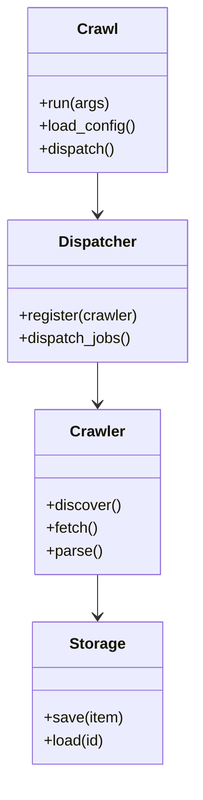
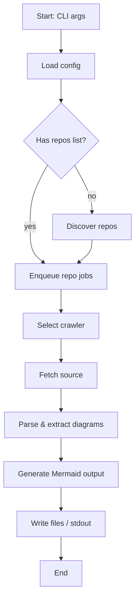

# Diagram: common/jwt_custom_authorizer/config/config.prod-b.yml

> Auto-generated by Obscura crawlers

## Diagram 1

### SVG

<svg id="container" width="205.8046875" xmlns="http://www.w3.org/2000/svg" class="classDiagram" height="814" viewBox="0 0 205.8046875 814" role="graphics-document document" aria-roledescription="class"><g><defs><marker id="container_class-aggregationStart" class="marker aggregation class" refX="18" refY="7" markerWidth="190" markerHeight="240" orient="auto"><path d="M 18,7 L9,13 L1,7 L9,1 Z"></path></marker></defs><defs><marker id="container_class-aggregationEnd" class="marker aggregation class" refX="1" refY="7" markerWidth="20" markerHeight="28" orient="auto"><path d="M 18,7 L9,13 L1,7 L9,1 Z"></path></marker></defs><defs><marker id="container_class-extensionStart" class="marker extension class" refX="18" refY="7" markerWidth="190" markerHeight="240" orient="auto"><path d="M 1,7 L18,13 V 1 Z"></path></marker></defs><defs><marker id="container_class-extensionEnd" class="marker extension class" refX="1" refY="7" markerWidth="20" markerHeight="28" orient="auto"><path d="M 1,1 V 13 L18,7 Z"></path></marker></defs><defs><marker id="container_class-compositionStart" class="marker composition class" refX="18" refY="7" markerWidth="190" markerHeight="240" orient="auto"><path d="M 18,7 L9,13 L1,7 L9,1 Z"></path></marker></defs><defs><marker id="container_class-compositionEnd" class="marker composition class" refX="1" refY="7" markerWidth="20" markerHeight="28" orient="auto"><path d="M 18,7 L9,13 L1,7 L9,1 Z"></path></marker></defs><defs><marker id="container_class-dependencyStart" class="marker dependency class" refX="6" refY="7" markerWidth="190" markerHeight="240" orient="auto"><path d="M 5,7 L9,13 L1,7 L9,1 Z"></path></marker></defs><defs><marker id="container_class-dependencyEnd" class="marker dependency class" refX="13" refY="7" markerWidth="20" markerHeight="28" orient="auto"><path d="M 18,7 L9,13 L14,7 L9,1 Z"></path></marker></defs><defs><marker id="container_class-lollipopStart" class="marker lollipop class" refX="13" refY="7" markerWidth="190" markerHeight="240" orient="auto"><circle stroke="black" fill="transparent" cx="7" cy="7" r="6"></circle></marker></defs><defs><marker id="container_class-lollipopEnd" class="marker lollipop class" refX="1" refY="7" markerWidth="190" markerHeight="240" orient="auto"><circle stroke="black" fill="transparent" cx="7" cy="7" r="6"></circle></marker></defs><g class="root"><g class="clusters"></g><g class="edgePaths"><path d="M102.902,182L102.902,186.167C102.902,190.333,102.902,198.667,102.902,206C102.902,213.333,102.902,219.667,102.902,222.833L102.902,226" id="id_Crawl_Dispatcher_1" class="edge-thickness-normal edge-pattern-solid relation" style=";;;" data-edge="true" data-et="edge" data-id="id_Crawl_Dispatcher_1" data-points="W3sieCI6MTAyLjkwMjM0Mzc1LCJ5IjoxODJ9LHsieCI6MTAyLjkwMjM0Mzc1LCJ5IjoyMDd9LHsieCI6MTAyLjkwMjM0Mzc1LCJ5IjoyMzJ9XQ==" marker-end="url(#container_class-dependencyEnd)"></path><path d="M102.902,382L102.902,386.167C102.902,390.333,102.902,398.667,102.902,406C102.902,413.333,102.902,419.667,102.902,422.833L102.902,426" id="id_Dispatcher_Crawler_2" class="edge-thickness-normal edge-pattern-solid relation" style=";;;" data-edge="true" data-et="edge" data-id="id_Dispatcher_Crawler_2" data-points="W3sieCI6MTAyLjkwMjM0Mzc1LCJ5IjozODJ9LHsieCI6MTAyLjkwMjM0Mzc1LCJ5Ijo0MDd9LHsieCI6MTAyLjkwMjM0Mzc1LCJ5Ijo0MzJ9XQ==" marker-end="url(#container_class-dependencyEnd)"></path><path d="M102.902,606L102.902,610.167C102.902,614.333,102.902,622.667,102.902,630C102.902,637.333,102.902,643.667,102.902,646.833L102.902,650" id="id_Crawler_Storage_3" class="edge-thickness-normal edge-pattern-solid relation" style=";;;" data-edge="true" data-et="edge" data-id="id_Crawler_Storage_3" data-points="W3sieCI6MTAyLjkwMjM0Mzc1LCJ5Ijo2MDZ9LHsieCI6MTAyLjkwMjM0Mzc1LCJ5Ijo2MzF9LHsieCI6MTAyLjkwMjM0Mzc1LCJ5Ijo2NTZ9XQ==" marker-end="url(#container_class-dependencyEnd)"></path></g><g class="edgeLabels"><g class="edgeLabel"><g class="label" data-id="id_Crawl_Dispatcher_1" transform="translate(0, 0)"><foreignObject width="0" height="0">

</foreignObject></g></g><g class="edgeLabel"><g class="label" data-id="id_Dispatcher_Crawler_2" transform="translate(0, 0)"><foreignObject width="0" height="0">

</foreignObject></g></g><g class="edgeLabel"><g class="label" data-id="id_Crawler_Storage_3" transform="translate(0, 0)"><foreignObject width="0" height="0">

</foreignObject></g></g></g><g class="nodes"><g class="node default" id="classId-Crawl-0" transform="translate(102.90234375, 95)"><g class="basic label-container"><path d="M-73.06640625 -87 L73.06640625 -87 L73.06640625 87 L-73.06640625 87" stroke="none" stroke-width="0" fill="#ECECFF" style=""></path><path d="M-73.06640625 -87 C-20.663571670537195 -87, 31.73926290892561 -87, 73.06640625 -87 M-73.06640625 -87 C-22.696955314034128 -87, 27.672495621931745 -87, 73.06640625 -87 M73.06640625 -87 C73.06640625 -38.015213735073544, 73.06640625 10.969572529852911, 73.06640625 87 M73.06640625 -87 C73.06640625 -32.20668477996471, 73.06640625 22.58663044007058, 73.06640625 87 M73.06640625 87 C18.67401379092366 87, -35.71837866815268 87, -73.06640625 87 M73.06640625 87 C20.995240071636175 87, -31.07592610672765 87, -73.06640625 87 M-73.06640625 87 C-73.06640625 19.30974347518803, -73.06640625 -48.38051304962394, -73.06640625 -87 M-73.06640625 87 C-73.06640625 37.86052369230096, -73.06640625 -11.278952615398083, -73.06640625 -87" stroke="#9370DB" stroke-width="1.3" fill="none" stroke-dasharray="0 0" style=""></path></g><g class="annotation-group text" transform="translate(0, -63)"></g><g class="label-group text" transform="translate(-20.1484375, -63)"><g class="label" style="font-weight: bolder" transform="translate(0,-12)"><foreignObject width="40.296875" height="24">

Crawl

</foreignObject></g></g><g class="members-group text" transform="translate(-61.06640625, -15)"></g><g class="methods-group text" transform="translate(-61.06640625, 15)"><g class="label" style="" transform="translate(0,-12)"><foreignObject width="73.546875" height="24">

+run(args)

</foreignObject></g><g class="label" style="" transform="translate(0,12)"><foreignObject width="101.984375" height="24">

+load_config()

</foreignObject></g><g class="label" style="" transform="translate(0,36)"><foreignObject width="80.515625" height="24">

+dispatch()

</foreignObject></g></g><g class="divider" style=""><path d="M-73.06640625 -39 C-43.733484275214856 -39, -14.400562300429712 -39, 73.06640625 -39 M-73.06640625 -39 C-30.76656972505682 -39, 11.533266799886363 -39, 73.06640625 -39" stroke="#9370DB" stroke-width="1.3" fill="none" stroke-dasharray="0 0" style=""></path></g><g class="divider" style=""><path d="M-73.06640625 -15 C-16.262776264482902 -15, 40.540853721034196 -15, 73.06640625 -15 M-73.06640625 -15 C-36.65903903508607 -15, -0.25167182017213463 -15, 73.06640625 -15" stroke="#9370DB" stroke-width="1.3" fill="none" stroke-dasharray="0 0" style=""></path></g></g><g class="node default" id="classId-Crawler-1" transform="translate(102.90234375, 519)"><g class="basic label-container"><path d="M-65.4765625 -87 L65.4765625 -87 L65.4765625 87 L-65.4765625 87" stroke="none" stroke-width="0" fill="#ECECFF" style=""></path><path d="M-65.4765625 -87 C-29.67907157102792 -87, 6.118419357944163 -87, 65.4765625 -87 M-65.4765625 -87 C-20.54506898289185 -87, 24.386424534216303 -87, 65.4765625 -87 M65.4765625 -87 C65.4765625 -21.326571635297512, 65.4765625 44.346856729404976, 65.4765625 87 M65.4765625 -87 C65.4765625 -23.752315081547252, 65.4765625 39.495369836905496, 65.4765625 87 M65.4765625 87 C20.94103390990886 87, -23.59449468018228 87, -65.4765625 87 M65.4765625 87 C21.121261509532637 87, -23.234039480934726 87, -65.4765625 87 M-65.4765625 87 C-65.4765625 46.76304792398164, -65.4765625 6.526095847963276, -65.4765625 -87 M-65.4765625 87 C-65.4765625 46.065265857330274, -65.4765625 5.130531714660549, -65.4765625 -87" stroke="#9370DB" stroke-width="1.3" fill="none" stroke-dasharray="0 0" style=""></path></g><g class="annotation-group text" transform="translate(0, -63)"></g><g class="label-group text" transform="translate(-27.734375, -63)"><g class="label" style="font-weight: bolder" transform="translate(0,-12)"><foreignObject width="55.46875" height="24">

Crawler

</foreignObject></g></g><g class="members-group text" transform="translate(-53.4765625, -15)"></g><g class="methods-group text" transform="translate(-53.4765625, 15)"><g class="label" style="" transform="translate(0,-12)"><foreignObject width="79.21875" height="24">

+discover()

</foreignObject></g><g class="label" style="" transform="translate(0,12)"><foreignObject width="54.59375" height="24">

+fetch()

</foreignObject></g><g class="label" style="" transform="translate(0,36)"><foreignObject width="58.53125" height="24">

+parse()

</foreignObject></g></g><g class="divider" style=""><path d="M-65.4765625 -39 C-31.33431053401366 -39, 2.8079414319726794 -39, 65.4765625 -39 M-65.4765625 -39 C-18.610928308494195 -39, 28.25470588301161 -39, 65.4765625 -39" stroke="#9370DB" stroke-width="1.3" fill="none" stroke-dasharray="0 0" style=""></path></g><g class="divider" style=""><path d="M-65.4765625 -15 C-36.92234819129348 -15, -8.36813388258696 -15, 65.4765625 -15 M-65.4765625 -15 C-21.448013802875927 -15, 22.580534894248146 -15, 65.4765625 -15" stroke="#9370DB" stroke-width="1.3" fill="none" stroke-dasharray="0 0" style=""></path></g></g><g class="node default" id="classId-Dispatcher-2" transform="translate(102.90234375, 307)"><g class="basic label-container"><path d="M-94.90234375 -75 L94.90234375 -75 L94.90234375 75 L-94.90234375 75" stroke="none" stroke-width="0" fill="#ECECFF" style=""></path><path d="M-94.90234375 -75 C-24.726137881763535 -75, 45.45006798647293 -75, 94.90234375 -75 M-94.90234375 -75 C-50.32245371369053 -75, -5.742563677381057 -75, 94.90234375 -75 M94.90234375 -75 C94.90234375 -27.055496580730953, 94.90234375 20.889006838538094, 94.90234375 75 M94.90234375 -75 C94.90234375 -27.98772233482716, 94.90234375 19.024555330345677, 94.90234375 75 M94.90234375 75 C22.769849371700673 75, -49.362645006598655 75, -94.90234375 75 M94.90234375 75 C55.25562890093188 75, 15.608914051863763 75, -94.90234375 75 M-94.90234375 75 C-94.90234375 43.427964489964594, -94.90234375 11.855928979929182, -94.90234375 -75 M-94.90234375 75 C-94.90234375 37.68569971496244, -94.90234375 0.3713994299248782, -94.90234375 -75" stroke="#9370DB" stroke-width="1.3" fill="none" stroke-dasharray="0 0" style=""></path></g><g class="annotation-group text" transform="translate(0, -51)"></g><g class="label-group text" transform="translate(-39.4296875, -51)"><g class="label" style="font-weight: bolder" transform="translate(0,-12)"><foreignObject width="78.859375" height="24">

Dispatcher

</foreignObject></g></g><g class="members-group text" transform="translate(-82.90234375, -3)"></g><g class="methods-group text" transform="translate(-82.90234375, 27)"><g class="label" style="" transform="translate(0,-12)"><foreignObject width="126.375" height="24">

+register(crawler)

</foreignObject></g><g class="label" style="" transform="translate(0,12)"><foreignObject width="120.21875" height="24">

+dispatch_jobs()

</foreignObject></g></g><g class="divider" style=""><path d="M-94.90234375 -27 C-50.33460146984315 -27, -5.766859189686301 -27, 94.90234375 -27 M-94.90234375 -27 C-45.86480372469133 -27, 3.172736300617345 -27, 94.90234375 -27" stroke="#9370DB" stroke-width="1.3" fill="none" stroke-dasharray="0 0" style=""></path></g><g class="divider" style=""><path d="M-94.90234375 -3 C-46.41613487322579 -3, 2.070074003548413 -3, 94.90234375 -3 M-94.90234375 -3 C-32.62066280475038 -3, 29.661018140499237 -3, 94.90234375 -3" stroke="#9370DB" stroke-width="1.3" fill="none" stroke-dasharray="0 0" style=""></path></g></g><g class="node default" id="classId-Storage-3" transform="translate(102.90234375, 731)"><g class="basic label-container"><path d="M-67.609375 -75 L67.609375 -75 L67.609375 75 L-67.609375 75" stroke="none" stroke-width="0" fill="#ECECFF" style=""></path><path d="M-67.609375 -75 C-34.758849519884976 -75, -1.9083240397699512 -75, 67.609375 -75 M-67.609375 -75 C-28.850405347429145 -75, 9.90856430514171 -75, 67.609375 -75 M67.609375 -75 C67.609375 -30.552760088565137, 67.609375 13.894479822869727, 67.609375 75 M67.609375 -75 C67.609375 -40.16042710060257, 67.609375 -5.320854201205137, 67.609375 75 M67.609375 75 C40.037562508420805 75, 12.465750016841618 75, -67.609375 75 M67.609375 75 C18.980368930269876 75, -29.64863713946025 75, -67.609375 75 M-67.609375 75 C-67.609375 37.73542150938994, -67.609375 0.470843018779874, -67.609375 -75 M-67.609375 75 C-67.609375 40.98975010164957, -67.609375 6.979500203299139, -67.609375 -75" stroke="#9370DB" stroke-width="1.3" fill="none" stroke-dasharray="0 0" style=""></path></g><g class="annotation-group text" transform="translate(0, -51)"></g><g class="label-group text" transform="translate(-28.078125, -51)"><g class="label" style="font-weight: bolder" transform="translate(0,-12)"><foreignObject width="56.15625" height="24">

Storage

</foreignObject></g></g><g class="members-group text" transform="translate(-55.609375, -3)"></g><g class="methods-group text" transform="translate(-55.609375, 27)"><g class="label" style="" transform="translate(0,-12)"><foreignObject width="83.140625" height="24">

+save(item)

</foreignObject></g><g class="label" style="" transform="translate(0,12)"><foreignObject width="64.5" height="24">

+load(id)

</foreignObject></g></g><g class="divider" style=""><path d="M-67.609375 -27 C-24.96075201445464 -27, 17.687870971090717 -27, 67.609375 -27 M-67.609375 -27 C-18.72455913489408 -27, 30.16025673021184 -27, 67.609375 -27" stroke="#9370DB" stroke-width="1.3" fill="none" stroke-dasharray="0 0" style=""></path></g><g class="divider" style=""><path d="M-67.609375 -3 C-19.424268733785 -3, 28.760837532430003 -3, 67.609375 -3 M-67.609375 -3 C-28.08944861260789 -3, 11.430477774784222 -3, 67.609375 -3" stroke="#9370DB" stroke-width="1.3" fill="none" stroke-dasharray="0 0" style=""></path></g></g></g></g></g></svg>

## Diagram 2

### SVG

<svg id="container" width="287.859375" xmlns="http://www.w3.org/2000/svg" class="flowchart" height="1239.4375" viewBox="0 0 287.859375 1239.4375" role="graphics-document document" aria-roledescription="flowchart-v2"><g><marker id="container_flowchart-v2-pointEnd" class="marker flowchart-v2" viewBox="0 0 10 10" refX="5" refY="5" markerUnits="userSpaceOnUse" markerWidth="8" markerHeight="8" orient="auto"><path d="M 0 0 L 10 5 L 0 10 z" class="arrowMarkerPath" style="stroke-width: 1; stroke-dasharray: 1, 0;"></path></marker><marker id="container_flowchart-v2-pointStart" class="marker flowchart-v2" viewBox="0 0 10 10" refX="4.5" refY="5" markerUnits="userSpaceOnUse" markerWidth="8" markerHeight="8" orient="auto"><path d="M 0 5 L 10 10 L 10 0 z" class="arrowMarkerPath" style="stroke-width: 1; stroke-dasharray: 1, 0;"></path></marker><marker id="container_flowchart-v2-circleEnd" class="marker flowchart-v2" viewBox="0 0 10 10" refX="11" refY="5" markerUnits="userSpaceOnUse" markerWidth="11" markerHeight="11" orient="auto"><circle cx="5" cy="5" r="5" class="arrowMarkerPath" style="stroke-width: 1; stroke-dasharray: 1, 0;"></circle></marker><marker id="container_flowchart-v2-circleStart" class="marker flowchart-v2" viewBox="0 0 10 10" refX="-1" refY="5" markerUnits="userSpaceOnUse" markerWidth="11" markerHeight="11" orient="auto"><circle cx="5" cy="5" r="5" class="arrowMarkerPath" style="stroke-width: 1; stroke-dasharray: 1, 0;"></circle></marker><marker id="container_flowchart-v2-crossEnd" class="marker cross flowchart-v2" viewBox="0 0 11 11" refX="12" refY="5.2" markerUnits="userSpaceOnUse" markerWidth="11" markerHeight="11" orient="auto"><path d="M 1,1 l 9,9 M 10,1 l -9,9" class="arrowMarkerPath" style="stroke-width: 2; stroke-dasharray: 1, 0;"></path></marker><marker id="container_flowchart-v2-crossStart" class="marker cross flowchart-v2" viewBox="0 0 11 11" refX="-1" refY="5.2" markerUnits="userSpaceOnUse" markerWidth="11" markerHeight="11" orient="auto"><path d="M 1,1 l 9,9 M 10,1 l -9,9" class="arrowMarkerPath" style="stroke-width: 2; stroke-dasharray: 1, 0;"></path></marker><g class="root"><g class="clusters"></g><g class="edgePaths"><path d="M131.422,62L131.422,66.167C131.422,70.333,131.422,78.667,131.422,86.333C131.422,94,131.422,101,131.422,104.5L131.422,108" id="L_A_B_0" class="edge-thickness-normal edge-pattern-solid edge-thickness-normal edge-pattern-solid flowchart-link" style=";" data-edge="true" data-et="edge" data-id="L_A_B_0" data-points="W3sieCI6MTMxLjQyMTg3NSwieSI6NjJ9LHsieCI6MTMxLjQyMTg3NSwieSI6ODd9LHsieCI6MTMxLjQyMTg3NSwieSI6MTEyfV0=" marker-end="url(#container_flowchart-v2-pointEnd)"></path><path d="M131.422,166L131.422,170.167C131.422,174.333,131.422,182.667,131.422,190.333C131.422,198,131.422,205,131.422,208.5L131.422,212" id="L_B_C_0" class="edge-thickness-normal edge-pattern-solid edge-thickness-normal edge-pattern-solid flowchart-link" style=";" data-edge="true" data-et="edge" data-id="L_B_C_0" data-points="W3sieCI6MTMxLjQyMTg3NSwieSI6MTY2fSx7IngiOjEzMS40MjE4NzUsInkiOjE5MX0seyJ4IjoxMzEuNDIxODc1LCJ5IjoyMTZ9XQ==" marker-end="url(#container_flowchart-v2-pointEnd)"></path><path d="M102.865,346.881L96.766,357.807C90.668,368.733,78.471,390.585,72.372,412.178C66.273,433.771,66.273,455.104,66.273,474.438C66.273,493.771,66.273,511.104,70.973,523.522C75.672,535.939,85.07,543.441,89.769,547.191L94.469,550.942" id="L_C_D_0" class="edge-thickness-normal edge-pattern-solid edge-thickness-normal edge-pattern-solid flowchart-link" style=";" data-edge="true" data-et="edge" data-id="L_C_D_0" data-points="W3sieCI6MTAyLjg2NTAzNTk0OTc4MzA2LCJ5IjozNDYuODgwNjYwOTQ5NzgzMX0seyJ4Ijo2Ni4yNzM0Mzc1LCJ5Ijo0MTIuNDM3NX0seyJ4Ijo2Ni4yNzM0Mzc1LCJ5Ijo0NzYuNDM3NX0seyJ4Ijo2Ni4yNzM0Mzc1LCJ5Ijo1MjguNDM3NX0seyJ4Ijo5Ny41OTQ4MDE2ODI2OTIzLCJ5Ijo1NTMuNDM3NX1d" marker-end="url(#container_flowchart-v2-pointEnd)"></path><path d="M159.979,346.881L166.077,357.807C172.176,368.733,184.373,390.585,190.472,407.011C196.57,423.438,196.57,434.438,196.57,439.938L196.57,445.438" id="L_C_E_0" class="edge-thickness-normal edge-pattern-solid edge-thickness-normal edge-pattern-solid flowchart-link" style=";" data-edge="true" data-et="edge" data-id="L_C_E_0" data-points="W3sieCI6MTU5Ljk3ODcxNDA1MDIxNjkyLCJ5IjozNDYuODgwNjYwOTQ5NzgzMX0seyJ4IjoxOTYuNTcwMzEyNSwieSI6NDEyLjQzNzV9LHsieCI6MTk2LjU3MDMxMjUsInkiOjQ0OS40Mzc1fV0=" marker-end="url(#container_flowchart-v2-pointEnd)"></path><path d="M196.57,503.438L196.57,507.604C196.57,511.771,196.57,520.104,191.871,528.022C187.172,535.939,177.774,543.441,173.074,547.191L168.375,550.942" id="L_E_D_0" class="edge-thickness-normal edge-pattern-solid edge-thickness-normal edge-pattern-solid flowchart-link" style=";" data-edge="true" data-et="edge" data-id="L_E_D_0" data-points="W3sieCI6MTk2LjU3MDMxMjUsInkiOjUwMy40Mzc1fSx7IngiOjE5Ni41NzAzMTI1LCJ5Ijo1MjguNDM3NX0seyJ4IjoxNjUuMjQ4OTQ4MzE3MzA3NjgsInkiOjU1My40Mzc1fV0=" marker-end="url(#container_flowchart-v2-pointEnd)"></path><path d="M131.422,607.438L131.422,611.604C131.422,615.771,131.422,624.104,131.422,631.771C131.422,639.438,131.422,646.438,131.422,649.938L131.422,653.438" id="L_D_F_0" class="edge-thickness-normal edge-pattern-solid edge-thickness-normal edge-pattern-solid flowchart-link" style=";" data-edge="true" data-et="edge" data-id="L_D_F_0" data-points="W3sieCI6MTMxLjQyMTg3NSwieSI6NjA3LjQzNzV9LHsieCI6MTMxLjQyMTg3NSwieSI6NjMyLjQzNzV9LHsieCI6MTMxLjQyMTg3NSwieSI6NjU3LjQzNzV9XQ==" marker-end="url(#container_flowchart-v2-pointEnd)"></path><path d="M131.422,711.438L131.422,715.604C131.422,719.771,131.422,728.104,131.422,735.771C131.422,743.438,131.422,750.438,131.422,753.938L131.422,757.438" id="L_F_G_0" class="edge-thickness-normal edge-pattern-solid edge-thickness-normal edge-pattern-solid flowchart-link" style=";" data-edge="true" data-et="edge" data-id="L_F_G_0" data-points="W3sieCI6MTMxLjQyMTg3NSwieSI6NzExLjQzNzV9LHsieCI6MTMxLjQyMTg3NSwieSI6NzM2LjQzNzV9LHsieCI6MTMxLjQyMTg3NSwieSI6NzYxLjQzNzV9XQ==" marker-end="url(#container_flowchart-v2-pointEnd)"></path><path d="M131.422,815.438L131.422,819.604C131.422,823.771,131.422,832.104,131.422,839.771C131.422,847.438,131.422,854.438,131.422,857.938L131.422,861.438" id="L_G_H_0" class="edge-thickness-normal edge-pattern-solid edge-thickness-normal edge-pattern-solid flowchart-link" style=";" data-edge="true" data-et="edge" data-id="L_G_H_0" data-points="W3sieCI6MTMxLjQyMTg3NSwieSI6ODE1LjQzNzV9LHsieCI6MTMxLjQyMTg3NSwieSI6ODQwLjQzNzV9LHsieCI6MTMxLjQyMTg3NSwieSI6ODY1LjQzNzV9XQ==" marker-end="url(#container_flowchart-v2-pointEnd)"></path><path d="M131.422,919.438L131.422,923.604C131.422,927.771,131.422,936.104,131.422,943.771C131.422,951.438,131.422,958.438,131.422,961.938L131.422,965.438" id="L_H_I_0" class="edge-thickness-normal edge-pattern-solid edge-thickness-normal edge-pattern-solid flowchart-link" style=";" data-edge="true" data-et="edge" data-id="L_H_I_0" data-points="W3sieCI6MTMxLjQyMTg3NSwieSI6OTE5LjQzNzV9LHsieCI6MTMxLjQyMTg3NSwieSI6OTQ0LjQzNzV9LHsieCI6MTMxLjQyMTg3NSwieSI6OTY5LjQzNzV9XQ==" marker-end="url(#container_flowchart-v2-pointEnd)"></path><path d="M131.422,1023.438L131.422,1027.604C131.422,1031.771,131.422,1040.104,131.422,1047.771C131.422,1055.438,131.422,1062.438,131.422,1065.938L131.422,1069.438" id="L_I_J_0" class="edge-thickness-normal edge-pattern-solid edge-thickness-normal edge-pattern-solid flowchart-link" style=";" data-edge="true" data-et="edge" data-id="L_I_J_0" data-points="W3sieCI6MTMxLjQyMTg3NSwieSI6MTAyMy40Mzc1fSx7IngiOjEzMS40MjE4NzUsInkiOjEwNDguNDM3NX0seyJ4IjoxMzEuNDIxODc1LCJ5IjoxMDczLjQzNzV9XQ==" marker-end="url(#container_flowchart-v2-pointEnd)"></path><path d="M131.422,1127.438L131.422,1131.604C131.422,1135.771,131.422,1144.104,131.422,1151.771C131.422,1159.438,131.422,1166.438,131.422,1169.938L131.422,1173.438" id="L_J_K_0" class="edge-thickness-normal edge-pattern-solid edge-thickness-normal edge-pattern-solid flowchart-link" style=";" data-edge="true" data-et="edge" data-id="L_J_K_0" data-points="W3sieCI6MTMxLjQyMTg3NSwieSI6MTEyNy40Mzc1fSx7IngiOjEzMS40MjE4NzUsInkiOjExNTIuNDM3NX0seyJ4IjoxMzEuNDIxODc1LCJ5IjoxMTc3LjQzNzV9XQ==" marker-end="url(#container_flowchart-v2-pointEnd)"></path></g><g class="edgeLabels"><g class="edgeLabel"><g class="label" data-id="L_A_B_0" transform="translate(0, 0)"><foreignObject width="0" height="0">

</foreignObject></g></g><g class="edgeLabel"><g class="label" data-id="L_B_C_0" transform="translate(0, 0)"><foreignObject width="0" height="0">

</foreignObject></g></g><g class="edgeLabel" transform="translate(66.2734375, 476.4375)"><g class="label" data-id="L_C_D_0" transform="translate(-12.0078125, -12)"><foreignObject width="24.015625" height="24">

yes

</foreignObject></g></g><g class="edgeLabel" transform="translate(196.5703125, 412.4375)"><g class="label" data-id="L_C_E_0" transform="translate(-9.3671875, -12)"><foreignObject width="18.734375" height="24">

no

</foreignObject></g></g><g class="edgeLabel"><g class="label" data-id="L_E_D_0" transform="translate(0, 0)"><foreignObject width="0" height="0">

</foreignObject></g></g><g class="edgeLabel"><g class="label" data-id="L_D_F_0" transform="translate(0, 0)"><foreignObject width="0" height="0">

</foreignObject></g></g><g class="edgeLabel"><g class="label" data-id="L_F_G_0" transform="translate(0, 0)"><foreignObject width="0" height="0">

</foreignObject></g></g><g class="edgeLabel"><g class="label" data-id="L_G_H_0" transform="translate(0, 0)"><foreignObject width="0" height="0">

</foreignObject></g></g><g class="edgeLabel"><g class="label" data-id="L_H_I_0" transform="translate(0, 0)"><foreignObject width="0" height="0">

</foreignObject></g></g><g class="edgeLabel"><g class="label" data-id="L_I_J_0" transform="translate(0, 0)"><foreignObject width="0" height="0">

</foreignObject></g></g><g class="edgeLabel"><g class="label" data-id="L_J_K_0" transform="translate(0, 0)"><foreignObject width="0" height="0">

</foreignObject></g></g></g><g class="nodes"><g class="node default" id="flowchart-A-0" transform="translate(131.421875, 35)"><rect class="basic label-container" style="" x="-79.703125" y="-27" width="159.40625" height="54"></rect><g class="label" style="" transform="translate(-49.703125, -12)"><rect></rect><foreignObject width="99.40625" height="24">

Start: CLI args

</foreignObject></g></g><g class="node default" id="flowchart-B-1" transform="translate(131.421875, 139)"><rect class="basic label-container" style="" x="-71.421875" y="-27" width="142.84375" height="54"></rect><g class="label" style="" transform="translate(-41.421875, -12)"><rect></rect><foreignObject width="82.84375" height="24">

Load config

</foreignObject></g></g><g class="node default" id="flowchart-C-3" transform="translate(131.421875, 295.71875)"><polygon points="79.71875,0 159.4375,-79.71875 79.71875,-159.4375 0,-79.71875" class="label-container" transform="translate(-79.21875, 79.71875)"></polygon><g class="label" style="" transform="translate(-52.71875, -12)"><rect></rect><foreignObject width="105.4375" height="24">

Has repos list?

</foreignObject></g></g><g class="node default" id="flowchart-D-5" transform="translate(131.421875, 580.4375)"><rect class="basic label-container" style="" x="-97.9765625" y="-27" width="195.953125" height="54"></rect><g class="label" style="" transform="translate(-67.9765625, -12)"><rect></rect><foreignObject width="135.953125" height="24">

Enqueue repo jobs

</foreignObject></g></g><g class="node default" id="flowchart-E-7" transform="translate(196.5703125, 476.4375)"><rect class="basic label-container" style="" x="-83.2890625" y="-27" width="166.578125" height="54"></rect><g class="label" style="" transform="translate(-53.2890625, -12)"><rect></rect><foreignObject width="106.578125" height="24">

Discover repos

</foreignObject></g></g><g class="node default" id="flowchart-F-11" transform="translate(131.421875, 684.4375)"><rect class="basic label-container" style="" x="-80.6484375" y="-27" width="161.296875" height="54"></rect><g class="label" style="" transform="translate(-50.6484375, -12)"><rect></rect><foreignObject width="101.296875" height="24">

Select crawler

</foreignObject></g></g><g class="node default" id="flowchart-G-13" transform="translate(131.421875, 788.4375)"><rect class="basic label-container" style="" x="-75.3515625" y="-27" width="150.703125" height="54"></rect><g class="label" style="" transform="translate(-45.3515625, -12)"><rect></rect><foreignObject width="90.703125" height="24">

Fetch source

</foreignObject></g></g><g class="node default" id="flowchart-H-15" transform="translate(131.421875, 892.4375)"><rect class="basic label-container" style="" x="-119.96875" y="-27" width="239.9375" height="54"></rect><g class="label" style="" transform="translate(-89.96875, -12)"><rect></rect><foreignObject width="179.9375" height="24">

Parse &amp; extract diagrams

</foreignObject></g></g><g class="node default" id="flowchart-I-17" transform="translate(131.421875, 996.4375)"><rect class="basic label-container" style="" x="-123.421875" y="-27" width="246.84375" height="54"></rect><g class="label" style="" transform="translate(-93.421875, -12)"><rect></rect><foreignObject width="186.84375" height="24">

Generate Mermaid output

</foreignObject></g></g><g class="node default" id="flowchart-J-19" transform="translate(131.421875, 1100.4375)"><rect class="basic label-container" style="" x="-98.0703125" y="-27" width="196.140625" height="54"></rect><g class="label" style="" transform="translate(-68.0703125, -12)"><rect></rect><foreignObject width="136.140625" height="24">

Write files / stdout

</foreignObject></g></g><g class="node default" id="flowchart-K-21" transform="translate(131.421875, 1204.4375)"><rect class="basic label-container" style="" x="-43.6796875" y="-27" width="87.359375" height="54"></rect><g class="label" style="" transform="translate(-13.6796875, -12)"><rect></rect><foreignObject width="27.359375" height="24">

End

</foreignObject></g></g></g></g></g></svg>
