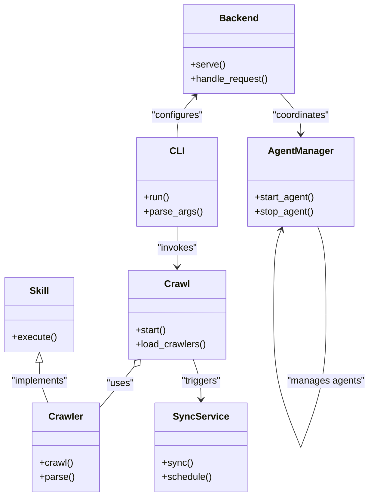

# Diagram: common/jwt_custom_authorizer/config/config.qa.yml

> Auto-generated by Obscura crawlers

## Mermaid

### SVG

<svg id="container" width="615.255859375" xmlns="http://www.w3.org/2000/svg" class="classDiagram" height="838" viewBox="0 0 615.255859375 838" role="graphics-document document" aria-roledescription="class"><g><defs><marker id="container_class-aggregationStart" class="marker aggregation class" refX="18" refY="7" markerWidth="190" markerHeight="240" orient="auto"><path d="M 18,7 L9,13 L1,7 L9,1 Z"></path></marker></defs><defs><marker id="container_class-aggregationEnd" class="marker aggregation class" refX="1" refY="7" markerWidth="20" markerHeight="28" orient="auto"><path d="M 18,7 L9,13 L1,7 L9,1 Z"></path></marker></defs><defs><marker id="container_class-extensionStart" class="marker extension class" refX="18" refY="7" markerWidth="190" markerHeight="240" orient="auto"><path d="M 1,7 L18,13 V 1 Z"></path></marker></defs><defs><marker id="container_class-extensionEnd" class="marker extension class" refX="1" refY="7" markerWidth="20" markerHeight="28" orient="auto"><path d="M 1,1 V 13 L18,7 Z"></path></marker></defs><defs><marker id="container_class-compositionStart" class="marker composition class" refX="18" refY="7" markerWidth="190" markerHeight="240" orient="auto"><path d="M 18,7 L9,13 L1,7 L9,1 Z"></path></marker></defs><defs><marker id="container_class-compositionEnd" class="marker composition class" refX="1" refY="7" markerWidth="20" markerHeight="28" orient="auto"><path d="M 18,7 L9,13 L1,7 L9,1 Z"></path></marker></defs><defs><marker id="container_class-dependencyStart" class="marker dependency class" refX="6" refY="7" markerWidth="190" markerHeight="240" orient="auto"><path d="M 5,7 L9,13 L1,7 L9,1 Z"></path></marker></defs><defs><marker id="container_class-dependencyEnd" class="marker dependency class" refX="13" refY="7" markerWidth="20" markerHeight="28" orient="auto"><path d="M 18,7 L9,13 L14,7 L9,1 Z"></path></marker></defs><defs><marker id="container_class-lollipopStart" class="marker lollipop class" refX="13" refY="7" markerWidth="190" markerHeight="240" orient="auto"><circle stroke="black" fill="transparent" cx="7" cy="7" r="6"></circle></marker></defs><defs><marker id="container_class-lollipopEnd" class="marker lollipop class" refX="1" refY="7" markerWidth="190" markerHeight="240" orient="auto"><circle stroke="black" fill="transparent" cx="7" cy="7" r="6"></circle></marker></defs><g class="root"><g class="clusters"></g><g class="edgePaths"><path d="M295.904,382L295.904,388.167C295.904,394.333,295.904,406.667,295.904,418C295.904,429.333,295.904,439.667,295.904,444.833L295.904,450" id="id_CLI_Crawl_1" class="edge-thickness-normal edge-pattern-solid relation" style=";;;" data-edge="true" data-et="edge" data-id="id_CLI_Crawl_1" data-points="W3sieCI6Mjk1LjkwNDI5Njg3NSwieSI6MzgyfSx7IngiOjI5NS45MDQyOTY4NzUsInkiOjQxOX0seyJ4IjoyOTUuOTA0Mjk2ODc1LCJ5Ijo0NTZ9XQ==" marker-end="url(#container_class-dependencyEnd)"></path><path d="M224.499,619.42L221.325,623.35C218.152,627.28,211.804,635.14,202.111,646.817C192.418,658.495,179.379,673.989,172.859,681.737L166.34,689.484" id="id_Crawl_Crawler_2" class="edge-thickness-normal edge-pattern-solid relation" style=";;;" data-edge="true" data-et="edge" data-id="id_Crawl_Crawler_2" data-points="W3sieCI6MjM1LjMzNjkzMTUwMTExNjA2LCJ5Ijo2MDZ9LHsieCI6MjA1LjQ1NzAzMTI1LCJ5Ijo2NDN9LHsieCI6MTY2LjMzOTg0Mzc1LCJ5Ijo2ODkuNDg0MDg0ODgwNjM2Nn1d" marker-start="url(#container_class-aggregationStart)"></path><path d="M322.206,606L324.369,612.167C326.532,618.333,330.857,630.667,333.019,642C335.182,653.333,335.182,663.667,335.182,668.833L335.182,674" id="id_Crawl_SyncService_3" class="edge-thickness-normal edge-pattern-solid relation" style=";;;" data-edge="true" data-et="edge" data-id="id_Crawl_SyncService_3" data-points="W3sieCI6MzIyLjIwNjM1MTE0MzcyMzc0LCJ5Ijo2MDZ9LHsieCI6MzM1LjE4MjAzMTI0OTYyNzQ3LCJ5Ijo2NDN9LHsieCI6MzM1LjE4MjAzMTI0OTYyNzQ3LCJ5Ijo2ODB9XQ==" marker-end="url(#container_class-dependencyEnd)"></path><path d="M528.616,382L530.947,388.167C533.277,394.333,537.938,406.667,540.269,431.492C542.6,456.317,542.6,493.633,542.6,512.292L542.6,530.95" id="AgentManager-cyclic-special-1" class="edge-thickness-normal edge-pattern-solid relation" style=";;;" data-edge="true" data-et="edge" data-id="AgentManager-cyclic-special-1" data-points="W3sieCI6NTI4LjYxNjIxMDkzNzUsInkiOjM4Mn0seyJ4Ijo1NDIuNTk5NjA5Mzc1LCJ5Ijo0MTl9LHsieCI6NTQyLjU5OTYwOTM3NSwieSI6NTMwLjk0OTk5OTk5OTI1NDl9XQ=="></path><path d="M542.6,531.05L542.6,549.708C542.6,568.367,542.6,605.683,535.548,643C528.497,680.317,514.393,717.633,507.342,736.292L500.29,754.95" id="AgentManager-cyclic-special-mid" class="edge-thickness-normal edge-pattern-solid relation" style=";;;" data-edge="true" data-et="edge" data-id="AgentManager-cyclic-special-mid" data-points="W3sieCI6NTQyLjU5OTYwOTM3NSwieSI6NTMxLjA1MDAwMDAwMDc0NTF9LHsieCI6NTQyLjU5OTYwOTM3NSwieSI6NjQzfSx7IngiOjUwMC4yOTAzODA4NTk2NTY2LCJ5Ijo3NTQuOTQ5OTk5OTk5MjU0OX1d"></path><path d="M500.252,754.95L492.919,736.292C485.586,717.633,470.92,680.317,463.587,642.992C456.254,605.667,456.254,568.333,456.254,531C456.254,493.667,456.254,456.333,458.312,432.431C460.37,408.528,464.485,398.056,466.543,392.82L468.601,387.584" id="AgentManager-cyclic-special-2" class="edge-thickness-normal edge-pattern-solid relation" style=";;;" data-edge="true" data-et="edge" data-id="AgentManager-cyclic-special-2" data-points="W3sieCI6NTAwLjI1MTgzMzY3MDE4NzA3LCJ5Ijo3NTQuOTQ5OTk5OTk5MjU0OX0seyJ4Ijo0NTYuMjUzOTA2MjUsInkiOjY0M30seyJ4Ijo0NTYuMjUzOTA2MjUsInkiOjUzMX0seyJ4Ijo0NTYuMjUzOTA2MjUsInkiOjQxOX0seyJ4Ijo0NzAuNzk1NDI3NTk0ODY2MDYsInkiOjM4Mn1d" marker-end="url(#container_class-dependencyEnd)"></path><path d="M325.617,162.432L320.665,167.86C315.713,173.288,305.809,184.144,300.856,195.739C295.904,207.333,295.904,219.667,295.904,225.833L295.904,232" id="id_Backend_CLI_5" class="edge-thickness-normal edge-pattern-solid relation" style=";;;" data-edge="true" data-et="edge" data-id="id_Backend_CLI_5" data-points="W3sieCI6MzI5LjY2MTM3Njk1MzEyNSwieSI6MTU4fSx7IngiOjI5NS45MDQyOTY4NzUsInkiOjE5NX0seyJ4IjoyOTUuOTA0Mjk2ODc1LCJ5IjoyMzJ9XQ==" marker-start="url(#container_class-dependencyStart)"></path><path d="M466.514,158L472.141,164.167C477.767,170.333,489.019,182.667,494.645,194C500.271,205.333,500.271,215.667,500.271,220.833L500.271,226" id="id_Backend_AgentManager_6" class="edge-thickness-normal edge-pattern-solid relation" style=";;;" data-edge="true" data-et="edge" data-id="id_Backend_AgentManager_6" data-points="W3sieCI6NDY2LjUxNDQwNDI5Njg3NSwieSI6MTU4fSx7IngiOjUwMC4yNzE0ODQzNzUsInkiOjE5NX0seyJ4Ijo1MDAuMjcxNDg0Mzc1LCJ5IjoyMzJ9XQ==" marker-end="url(#container_class-dependencyEnd)"></path><path d="M65.168,611.25L65.168,616.542C65.168,621.833,65.168,632.417,67.703,643.875C70.238,655.333,75.308,667.667,77.842,673.833L80.377,680" id="id_Skill_Crawler_7" class="edge-thickness-normal edge-pattern-solid relation" style=";;;" data-edge="true" data-et="edge" data-id="id_Skill_Crawler_7" data-points="W3sieCI6NjUuMTY3OTY4NzUsInkiOjU5NH0seyJ4Ijo2NS4xNjc5Njg3NSwieSI6NjQzfSx7IngiOjgwLjM3NzMwMTg5NzMyMTQzLCJ5Ijo2ODB9XQ==" marker-start="url(#container_class-extensionStart)"></path></g><g class="edgeLabels"><g class="edgeLabel" transform="translate(295.904296875, 419)"><g class="label" data-id="id_CLI_Crawl_1" transform="translate(-33.8515625, -12)"><foreignObject width="67.703125" height="24">

"invokes"

</foreignObject></g></g><g class="edgeLabel" transform="translate(201.20924, 648.04777)"><g class="label" data-id="id_Crawl_Crawler_2" transform="translate(-22.7578125, -12)"><foreignObject width="45.515625" height="24">

"uses"

</foreignObject></g></g><g class="edgeLabel" transform="translate(335.18203124962747, 643)"><g class="label" data-id="id_Crawl_SyncService_3" transform="translate(-33.8359375, -12)"><foreignObject width="67.671875" height="24">

"triggers"

</foreignObject></g></g><g class="edgeLabel"><g class="label" data-id="AgentManager-cyclic-special-1" transform="translate(0, 0)"><foreignObject width="0" height="0">

</foreignObject></g></g><g class="edgeLabel" transform="translate(542.599609375, 643)"><g class="label" data-id="AgentManager-cyclic-special-mid" transform="translate(-64.65625, -12)"><foreignObject width="129.3125" height="24">

"manages agents"

</foreignObject></g></g><g class="edgeLabel"><g class="label" data-id="AgentManager-cyclic-special-2" transform="translate(0, 0)"><foreignObject width="0" height="0">

</foreignObject></g></g><g class="edgeLabel" transform="translate(295.904296875, 195)"><g class="label" data-id="id_Backend_CLI_5" transform="translate(-43.4921875, -12)"><foreignObject width="86.984375" height="24">

"configures"

</foreignObject></g></g><g class="edgeLabel" transform="translate(500.271484375, 195)"><g class="label" data-id="id_Backend_AgentManager_6" transform="translate(-48.984375, -12)"><foreignObject width="97.96875" height="24">

"coordinates"

</foreignObject></g></g><g class="edgeLabel" transform="translate(65.16796875, 643)"><g class="label" data-id="id_Skill_Crawler_7" transform="translate(-49.3203125, -12)"><foreignObject width="98.640625" height="24">

"implements"

</foreignObject></g></g></g><g class="nodes"><g class="node default" id="classId-CLI-0" transform="translate(295.904296875, 307)"><g class="basic label-container"><path d="M-65.79296875 -75 L65.79296875 -75 L65.79296875 75 L-65.79296875 75" stroke="none" stroke-width="0" fill="#ECECFF" style=""></path><path d="M-65.79296875 -75 C-24.522682296078862 -75, 16.747604157842275 -75, 65.79296875 -75 M-65.79296875 -75 C-21.673941797660305 -75, 22.44508515467939 -75, 65.79296875 -75 M65.79296875 -75 C65.79296875 -38.31400645928076, 65.79296875 -1.6280129185615237, 65.79296875 75 M65.79296875 -75 C65.79296875 -31.92398971645919, 65.79296875 11.152020567081621, 65.79296875 75 M65.79296875 75 C16.25315007271724 75, -33.28666860456552 75, -65.79296875 75 M65.79296875 75 C37.12693156494153 75, 8.460894379883051 75, -65.79296875 75 M-65.79296875 75 C-65.79296875 36.71849240719148, -65.79296875 -1.563015185617033, -65.79296875 -75 M-65.79296875 75 C-65.79296875 37.23627868470418, -65.79296875 -0.5274426305916364, -65.79296875 -75" stroke="#9370DB" stroke-width="1.3" fill="none" stroke-dasharray="0 0" style=""></path></g><g class="annotation-group text" transform="translate(0, -51)"></g><g class="label-group text" transform="translate(-11.0546875, -51)"><g class="label" style="font-weight: bolder" transform="translate(0,-12)"><foreignObject width="22.109375" height="24">

CLI

</foreignObject></g></g><g class="members-group text" transform="translate(-53.79296875, -3)"></g><g class="methods-group text" transform="translate(-53.79296875, 27)"><g class="label" style="" transform="translate(0,-12)"><foreignObject width="43.21875" height="24">

+run()

</foreignObject></g><g class="label" style="" transform="translate(0,12)"><foreignObject width="96.53125" height="24">

+parse_args()

</foreignObject></g></g><g class="divider" style=""><path d="M-65.79296875 -27 C-36.59068311217123 -27, -7.3883974743424545 -27, 65.79296875 -27 M-65.79296875 -27 C-21.170088640951498 -27, 23.452791468097004 -27, 65.79296875 -27" stroke="#9370DB" stroke-width="1.3" fill="none" stroke-dasharray="0 0" style=""></path></g><g class="divider" style=""><path d="M-65.79296875 -3 C-29.009569941683438 -3, 7.773828866633124 -3, 65.79296875 -3 M-65.79296875 -3 C-31.385535259462728 -3, 3.0218982310745446 -3, 65.79296875 -3" stroke="#9370DB" stroke-width="1.3" fill="none" stroke-dasharray="0 0" style=""></path></g></g><g class="node default" id="classId-Crawl-1" transform="translate(295.904296875, 531)"><g class="basic label-container"><path d="M-81.33203125 -75 L81.33203125 -75 L81.33203125 75 L-81.33203125 75" stroke="none" stroke-width="0" fill="#ECECFF" style=""></path><path d="M-81.33203125 -75 C-31.720639318721105 -75, 17.89075261255779 -75, 81.33203125 -75 M-81.33203125 -75 C-38.3957627813453 -75, 4.540505687309405 -75, 81.33203125 -75 M81.33203125 -75 C81.33203125 -42.313828915631156, 81.33203125 -9.627657831262312, 81.33203125 75 M81.33203125 -75 C81.33203125 -22.834681642801364, 81.33203125 29.330636714397272, 81.33203125 75 M81.33203125 75 C32.396533728538195 75, -16.53896379292361 75, -81.33203125 75 M81.33203125 75 C27.096508153284105 75, -27.13901494343179 75, -81.33203125 75 M-81.33203125 75 C-81.33203125 36.79834540479559, -81.33203125 -1.4033091904088195, -81.33203125 -75 M-81.33203125 75 C-81.33203125 21.97092177426218, -81.33203125 -31.05815645147564, -81.33203125 -75" stroke="#9370DB" stroke-width="1.3" fill="none" stroke-dasharray="0 0" style=""></path></g><g class="annotation-group text" transform="translate(0, -51)"></g><g class="label-group text" transform="translate(-20.1484375, -51)"><g class="label" style="font-weight: bolder" transform="translate(0,-12)"><foreignObject width="40.296875" height="24">

Crawl

</foreignObject></g></g><g class="members-group text" transform="translate(-69.33203125, -3)"></g><g class="methods-group text" transform="translate(-69.33203125, 27)"><g class="label" style="" transform="translate(0,-12)"><foreignObject width="52.15625" height="24">

+start()

</foreignObject></g><g class="label" style="" transform="translate(0,12)"><foreignObject width="118.515625" height="24">

+load_crawlers()

</foreignObject></g></g><g class="divider" style=""><path d="M-81.33203125 -27 C-26.931250817224246 -27, 27.469529615551508 -27, 81.33203125 -27 M-81.33203125 -27 C-22.593336876880755 -27, 36.14535749623849 -27, 81.33203125 -27" stroke="#9370DB" stroke-width="1.3" fill="none" stroke-dasharray="0 0" style=""></path></g><g class="divider" style=""><path d="M-81.33203125 -3 C-25.30638505609543 -3, 30.71926113780914 -3, 81.33203125 -3 M-81.33203125 -3 C-33.655105893312424 -3, 14.021819463375152 -3, 81.33203125 -3" stroke="#9370DB" stroke-width="1.3" fill="none" stroke-dasharray="0 0" style=""></path></g></g><g class="node default" id="classId-Crawler-2" transform="translate(111.20703125, 755)"><g class="basic label-container"><path d="M-55.1328125 -75 L55.1328125 -75 L55.1328125 75 L-55.1328125 75" stroke="none" stroke-width="0" fill="#ECECFF" style=""></path><path d="M-55.1328125 -75 C-13.863668053820248 -75, 27.405476392359503 -75, 55.1328125 -75 M-55.1328125 -75 C-26.04998192944765 -75, 3.0328486411046995 -75, 55.1328125 -75 M55.1328125 -75 C55.1328125 -21.241745238145228, 55.1328125 32.516509523709544, 55.1328125 75 M55.1328125 -75 C55.1328125 -21.666685732558157, 55.1328125 31.666628534883685, 55.1328125 75 M55.1328125 75 C27.323006771766888 75, -0.48679895646622384 75, -55.1328125 75 M55.1328125 75 C23.84025127975776 75, -7.452309940484483 75, -55.1328125 75 M-55.1328125 75 C-55.1328125 37.164966927343905, -55.1328125 -0.670066145312191, -55.1328125 -75 M-55.1328125 75 C-55.1328125 27.123588847873314, -55.1328125 -20.75282230425337, -55.1328125 -75" stroke="#9370DB" stroke-width="1.3" fill="none" stroke-dasharray="0 0" style=""></path></g><g class="annotation-group text" transform="translate(0, -51)"></g><g class="label-group text" transform="translate(-27.734375, -51)"><g class="label" style="font-weight: bolder" transform="translate(0,-12)"><foreignObject width="55.46875" height="24">

Crawler

</foreignObject></g></g><g class="members-group text" transform="translate(-43.1328125, -3)"></g><g class="methods-group text" transform="translate(-43.1328125, 27)"><g class="label" style="" transform="translate(0,-12)"><foreignObject width="56.40625" height="24">

+crawl()

</foreignObject></g><g class="label" style="" transform="translate(0,12)"><foreignObject width="58.53125" height="24">

+parse()

</foreignObject></g></g><g class="divider" style=""><path d="M-55.1328125 -27 C-20.89341189723926 -27, 13.345988705521478 -27, 55.1328125 -27 M-55.1328125 -27 C-19.91658664752677 -27, 15.299639204946459 -27, 55.1328125 -27" stroke="#9370DB" stroke-width="1.3" fill="none" stroke-dasharray="0 0" style=""></path></g><g class="divider" style=""><path d="M-55.1328125 -3 C-29.754560583014324 -3, -4.376308666028649 -3, 55.1328125 -3 M-55.1328125 -3 C-24.884357679888303 -3, 5.364097140223393 -3, 55.1328125 -3" stroke="#9370DB" stroke-width="1.3" fill="none" stroke-dasharray="0 0" style=""></path></g></g><g class="node default" id="classId-SyncService-3" transform="translate(335.18203124962747, 755)"><g class="basic label-container"><path d="M-75.76171875 -75 L75.76171875 -75 L75.76171875 75 L-75.76171875 75" stroke="none" stroke-width="0" fill="#ECECFF" style=""></path><path d="M-75.76171875 -75 C-28.74241747604775 -75, 18.276883797904503 -75, 75.76171875 -75 M-75.76171875 -75 C-42.0605971060316 -75, -8.359475462063202 -75, 75.76171875 -75 M75.76171875 -75 C75.76171875 -21.585067124372564, 75.76171875 31.82986575125487, 75.76171875 75 M75.76171875 -75 C75.76171875 -24.719603879784508, 75.76171875 25.560792240430985, 75.76171875 75 M75.76171875 75 C40.48379650191542 75, 5.205874253830842 75, -75.76171875 75 M75.76171875 75 C33.04785079803585 75, -9.666017153928294 75, -75.76171875 75 M-75.76171875 75 C-75.76171875 19.601683952964613, -75.76171875 -35.79663209407077, -75.76171875 -75 M-75.76171875 75 C-75.76171875 32.89348954127557, -75.76171875 -9.213020917448858, -75.76171875 -75" stroke="#9370DB" stroke-width="1.3" fill="none" stroke-dasharray="0 0" style=""></path></g><g class="annotation-group text" transform="translate(0, -51)"></g><g class="label-group text" transform="translate(-43.7421875, -51)"><g class="label" style="font-weight: bolder" transform="translate(0,-12)"><foreignObject width="87.484375" height="24">

SyncService

</foreignObject></g></g><g class="members-group text" transform="translate(-63.76171875, -3)"></g><g class="methods-group text" transform="translate(-63.76171875, 27)"><g class="label" style="" transform="translate(0,-12)"><foreignObject width="50.453125" height="24">

+sync()

</foreignObject></g><g class="label" style="" transform="translate(0,12)"><foreignObject width="83.78125" height="24">

+schedule()

</foreignObject></g></g><g class="divider" style=""><path d="M-75.76171875 -27 C-32.383974380089235 -27, 10.99376998982153 -27, 75.76171875 -27 M-75.76171875 -27 C-27.930180860860467 -27, 19.901357028279065 -27, 75.76171875 -27" stroke="#9370DB" stroke-width="1.3" fill="none" stroke-dasharray="0 0" style=""></path></g><g class="divider" style=""><path d="M-75.76171875 -3 C-41.3060637847037 -3, -6.850408819407406 -3, 75.76171875 -3 M-75.76171875 -3 C-34.760389202830275 -3, 6.2409403443394496 -3, 75.76171875 -3" stroke="#9370DB" stroke-width="1.3" fill="none" stroke-dasharray="0 0" style=""></path></g></g><g class="node default" id="classId-AgentManager-4" transform="translate(500.271484375, 307)"><g class="basic label-container"><path d="M-88.57421875 -75 L88.57421875 -75 L88.57421875 75 L-88.57421875 75" stroke="none" stroke-width="0" fill="#ECECFF" style=""></path><path d="M-88.57421875 -75 C-39.7494351545099 -75, 9.075348440980207 -75, 88.57421875 -75 M-88.57421875 -75 C-24.934274404521226 -75, 38.70566994095755 -75, 88.57421875 -75 M88.57421875 -75 C88.57421875 -18.307633776132455, 88.57421875 38.38473244773509, 88.57421875 75 M88.57421875 -75 C88.57421875 -41.0765831996597, 88.57421875 -7.153166399319403, 88.57421875 75 M88.57421875 75 C24.42914565933978 75, -39.71592743132044 75, -88.57421875 75 M88.57421875 75 C41.642175294364954 75, -5.289868161270093 75, -88.57421875 75 M-88.57421875 75 C-88.57421875 30.402047034073682, -88.57421875 -14.195905931852636, -88.57421875 -75 M-88.57421875 75 C-88.57421875 44.969092712742004, -88.57421875 14.938185425484008, -88.57421875 -75" stroke="#9370DB" stroke-width="1.3" fill="none" stroke-dasharray="0 0" style=""></path></g><g class="annotation-group text" transform="translate(0, -51)"></g><g class="label-group text" transform="translate(-52.5234375, -51)"><g class="label" style="font-weight: bolder" transform="translate(0,-12)"><foreignObject width="105.046875" height="24">

AgentManager

</foreignObject></g></g><g class="members-group text" transform="translate(-76.57421875, -3)"></g><g class="methods-group text" transform="translate(-76.57421875, 27)"><g class="label" style="" transform="translate(0,-12)"><foreignObject width="100.625" height="24">

+start_agent()

</foreignObject></g><g class="label" style="" transform="translate(0,12)"><foreignObject width="98.375" height="24">

+stop_agent()

</foreignObject></g></g><g class="divider" style=""><path d="M-88.57421875 -27 C-40.72670653717257 -27, 7.120805675654864 -27, 88.57421875 -27 M-88.57421875 -27 C-47.087951676608746 -27, -5.6016846032174925 -27, 88.57421875 -27" stroke="#9370DB" stroke-width="1.3" fill="none" stroke-dasharray="0 0" style=""></path></g><g class="divider" style=""><path d="M-88.57421875 -3 C-42.44723007317849 -3, 3.679758603643023 -3, 88.57421875 -3 M-88.57421875 -3 C-51.39838450123364 -3, -14.222550252467286 -3, 88.57421875 -3" stroke="#9370DB" stroke-width="1.3" fill="none" stroke-dasharray="0 0" style=""></path></g></g><g class="node default" id="classId-Backend-5" transform="translate(398.087890625, 83)"><g class="basic label-container"><path d="M-93.6328125 -75 L93.6328125 -75 L93.6328125 75 L-93.6328125 75" stroke="none" stroke-width="0" fill="#ECECFF" style=""></path><path d="M-93.6328125 -75 C-54.66133488927074 -75, -15.689857278541481 -75, 93.6328125 -75 M-93.6328125 -75 C-39.857632864958674 -75, 13.917546770082652 -75, 93.6328125 -75 M93.6328125 -75 C93.6328125 -34.73790493026751, 93.6328125 5.524190139464977, 93.6328125 75 M93.6328125 -75 C93.6328125 -17.586995445277594, 93.6328125 39.82600910944481, 93.6328125 75 M93.6328125 75 C21.366125424204213 75, -50.90056165159157 75, -93.6328125 75 M93.6328125 75 C39.7045399575584 75, -14.223732584883194 75, -93.6328125 75 M-93.6328125 75 C-93.6328125 26.530912987895142, -93.6328125 -21.938174024209715, -93.6328125 -75 M-93.6328125 75 C-93.6328125 26.844117892932125, -93.6328125 -21.31176421413575, -93.6328125 -75" stroke="#9370DB" stroke-width="1.3" fill="none" stroke-dasharray="0 0" style=""></path></g><g class="annotation-group text" transform="translate(0, -51)"></g><g class="label-group text" transform="translate(-31.296875, -51)"><g class="label" style="font-weight: bolder" transform="translate(0,-12)"><foreignObject width="62.59375" height="24">

Backend

</foreignObject></g></g><g class="members-group text" transform="translate(-81.6328125, -3)"></g><g class="methods-group text" transform="translate(-81.6328125, 27)"><g class="label" style="" transform="translate(0,-12)"><foreignObject width="57.25" height="24">

+serve()

</foreignObject></g><g class="label" style="" transform="translate(0,12)"><foreignObject width="131.96875" height="24">

+handle_request()

</foreignObject></g></g><g class="divider" style=""><path d="M-93.6328125 -27 C-22.45066760362195 -27, 48.7314772927561 -27, 93.6328125 -27 M-93.6328125 -27 C-21.89677801722391 -27, 49.83925646555218 -27, 93.6328125 -27" stroke="#9370DB" stroke-width="1.3" fill="none" stroke-dasharray="0 0" style=""></path></g><g class="divider" style=""><path d="M-93.6328125 -3 C-55.68872067735209 -3, -17.744628854704175 -3, 93.6328125 -3 M-93.6328125 -3 C-48.065730895014696 -3, -2.498649290029391 -3, 93.6328125 -3" stroke="#9370DB" stroke-width="1.3" fill="none" stroke-dasharray="0 0" style=""></path></g></g><g class="node default" id="classId-Skill-6" transform="translate(65.16796875, 531)"><g class="basic label-container"><path d="M-57.16796875 -63 L57.16796875 -63 L57.16796875 63 L-57.16796875 63" stroke="none" stroke-width="0" fill="#ECECFF" style=""></path><path d="M-57.16796875 -63 C-31.73698179760314 -63, -6.305994845206278 -63, 57.16796875 -63 M-57.16796875 -63 C-11.614606192782773 -63, 33.938756364434454 -63, 57.16796875 -63 M57.16796875 -63 C57.16796875 -15.07452065497855, 57.16796875 32.8509586900429, 57.16796875 63 M57.16796875 -63 C57.16796875 -19.257126580917927, 57.16796875 24.485746838164147, 57.16796875 63 M57.16796875 63 C13.615971974576865 63, -29.93602480084627 63, -57.16796875 63 M57.16796875 63 C28.355203935913373 63, -0.4575608781732541 63, -57.16796875 63 M-57.16796875 63 C-57.16796875 26.37525669940291, -57.16796875 -10.249486601194178, -57.16796875 -63 M-57.16796875 63 C-57.16796875 20.54772882895311, -57.16796875 -21.904542342093777, -57.16796875 -63" stroke="#9370DB" stroke-width="1.3" fill="none" stroke-dasharray="0 0" style=""></path></g><g class="annotation-group text" transform="translate(0, -39)"></g><g class="label-group text" transform="translate(-16.0078125, -39)"><g class="label" style="font-weight: bolder" transform="translate(0,-12)"><foreignObject width="32.015625" height="24">

Skill

</foreignObject></g></g><g class="members-group text" transform="translate(-45.16796875, 9)"></g><g class="methods-group text" transform="translate(-45.16796875, 39)"><g class="label" style="" transform="translate(0,-12)"><foreignObject width="74.328125" height="24">

+execute()

</foreignObject></g></g><g class="divider" style=""><path d="M-57.16796875 -15 C-19.483272540592196 -15, 18.201423668815607 -15, 57.16796875 -15 M-57.16796875 -15 C-32.72207028239089 -15, -8.276171814781769 -15, 57.16796875 -15" stroke="#9370DB" stroke-width="1.3" fill="none" stroke-dasharray="0 0" style=""></path></g><g class="divider" style=""><path d="M-57.16796875 9 C-19.241866597248432 9, 18.684235555503136 9, 57.16796875 9 M-57.16796875 9 C-31.524763381240703 9, -5.881558012481406 9, 57.16796875 9" stroke="#9370DB" stroke-width="1.3" fill="none" stroke-dasharray="0 0" style=""></path></g></g><g class="label edgeLabel" id="AgentManager---AgentManager---1" transform="translate(542.599609375, 531)"><rect width="0.1" height="0.1"></rect><g class="label" style="" transform="translate(0, 0)"><rect></rect><foreignObject width="0" height="0">

</foreignObject></g></g><g class="label edgeLabel" id="AgentManager---AgentManager---2" transform="translate(500.271484375, 755)"><rect width="0.1" height="0.1"></rect><g class="label" style="" transform="translate(0, 0)"><rect></rect><foreignObject width="0" height="0">

</foreignObject></g></g></g></g></g></svg>
