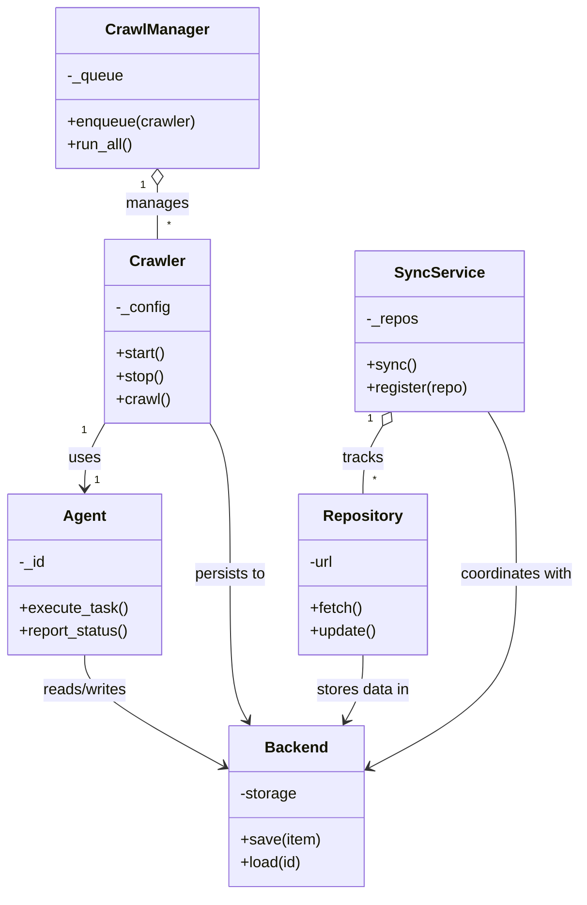

# Diagram: common/jwt_custom_authorizer/config/config.qa2.yml

> Auto-generated by Obscura crawlers

## Mermaid

### SVG

<svg id="container" width="612.8203125" xmlns="http://www.w3.org/2000/svg" class="classDiagram" height="934" viewBox="0 0 612.8203125 934" role="graphics-document document" aria-roledescription="class"><g><defs><marker id="container_class-aggregationStart" class="marker aggregation class" refX="18" refY="7" markerWidth="190" markerHeight="240" orient="auto"><path d="M 18,7 L9,13 L1,7 L9,1 Z"></path></marker></defs><defs><marker id="container_class-aggregationEnd" class="marker aggregation class" refX="1" refY="7" markerWidth="20" markerHeight="28" orient="auto"><path d="M 18,7 L9,13 L1,7 L9,1 Z"></path></marker></defs><defs><marker id="container_class-extensionStart" class="marker extension class" refX="18" refY="7" markerWidth="190" markerHeight="240" orient="auto"><path d="M 1,7 L18,13 V 1 Z"></path></marker></defs><defs><marker id="container_class-extensionEnd" class="marker extension class" refX="1" refY="7" markerWidth="20" markerHeight="28" orient="auto"><path d="M 1,1 V 13 L18,7 Z"></path></marker></defs><defs><marker id="container_class-compositionStart" class="marker composition class" refX="18" refY="7" markerWidth="190" markerHeight="240" orient="auto"><path d="M 18,7 L9,13 L1,7 L9,1 Z"></path></marker></defs><defs><marker id="container_class-compositionEnd" class="marker composition class" refX="1" refY="7" markerWidth="20" markerHeight="28" orient="auto"><path d="M 18,7 L9,13 L1,7 L9,1 Z"></path></marker></defs><defs><marker id="container_class-dependencyStart" class="marker dependency class" refX="6" refY="7" markerWidth="190" markerHeight="240" orient="auto"><path d="M 5,7 L9,13 L1,7 L9,1 Z"></path></marker></defs><defs><marker id="container_class-dependencyEnd" class="marker dependency class" refX="13" refY="7" markerWidth="20" markerHeight="28" orient="auto"><path d="M 18,7 L9,13 L14,7 L9,1 Z"></path></marker></defs><defs><marker id="container_class-lollipopStart" class="marker lollipop class" refX="13" refY="7" markerWidth="190" markerHeight="240" orient="auto"><circle stroke="black" fill="transparent" cx="7" cy="7" r="6"></circle></marker></defs><defs><marker id="container_class-lollipopEnd" class="marker lollipop class" refX="1" refY="7" markerWidth="190" markerHeight="240" orient="auto"><circle stroke="black" fill="transparent" cx="7" cy="7" r="6"></circle></marker></defs><g class="root"><g class="clusters"></g><g class="edgePaths"><path d="M165.527,193.25L165.527,196.542C165.527,199.833,165.527,206.417,165.527,215.875C165.527,225.333,165.527,237.667,165.527,243.833L165.527,250" id="id_CrawlManager_Crawler_1" class="edge-thickness-normal edge-pattern-solid relation" style=";;;" data-edge="true" data-et="edge" data-id="id_CrawlManager_Crawler_1" data-points="W3sieCI6MTY1LjUyNzM0Mzc1LCJ5IjoxNzZ9LHsieCI6MTY1LjUyNzM0Mzc1LCJ5IjoyMTN9LHsieCI6MTY1LjUyNzM0Mzc1LCJ5IjoyNTB9XQ==" marker-start="url(#container_class-aggregationStart)"></path><path d="M111.285,439.886L107.519,446.405C103.753,452.924,96.22,465.962,92.454,477.648C88.688,489.333,88.688,499.667,88.688,504.833L88.688,510" id="id_Crawler_Agent_2" class="edge-thickness-normal edge-pattern-solid relation" style=";;;" data-edge="true" data-et="edge" data-id="id_Crawler_Agent_2" data-points="W3sieCI6MTExLjI4NTE1NjI1LCJ5Ijo0MzkuODg2MzMwMTMwNjQ5Mn0seyJ4Ijo4OC42ODc1LCJ5Ijo0Nzl9LHsieCI6ODguNjg3NSwieSI6NTE2fV0=" marker-end="url(#container_class-dependencyEnd)"></path><path d="M219.77,439.886L223.536,446.405C227.302,452.924,234.835,465.962,238.601,492.648C242.367,519.333,242.367,559.667,242.367,600C242.367,640.333,242.367,680.667,245.428,706.134C248.488,731.601,254.61,742.203,257.67,747.503L260.731,752.804" id="id_Crawler_Backend_3" class="edge-thickness-normal edge-pattern-solid relation" style=";;;" data-edge="true" data-et="edge" data-id="id_Crawler_Backend_3" data-points="W3sieCI6MjE5Ljc2OTUzMTI1LCJ5Ijo0MzkuODg2MzMwMTMwNjQ5Mn0seyJ4IjoyNDIuMzY3MTg3NSwieSI6NDc5fSx7IngiOjI0Mi4zNjcxODc1LCJ5Ijo2MDB9LHsieCI6MjQyLjM2NzE4NzUsInkiOjcyMX0seyJ4IjoyNjMuNzMwOTM2ODU0MzM4ODQsInkiOjc1OH1d" marker-end="url(#container_class-dependencyEnd)"></path><path d="M403,444.727L399.517,450.439C396.033,456.151,389.065,467.576,385.581,479.455C382.098,491.333,382.098,503.667,382.098,509.833L382.098,516" id="id_SyncService_Repository_4" class="edge-thickness-normal edge-pattern-solid relation" style=";;;" data-edge="true" data-et="edge" data-id="id_SyncService_Repository_4" data-points="W3sieCI6NDExLjk4MjIxNjI4Mjg5NDc0LCJ5Ijo0MzB9LHsieCI6MzgyLjA5NzY1NjI1LCJ5Ijo0Nzl9LHsieCI6MzgyLjA5NzY1NjI1LCJ5Ijo1MTZ9XQ==" marker-start="url(#container_class-aggregationStart)"></path><path d="M514.444,430L519.424,438.167C524.405,446.333,534.367,462.667,539.347,491C544.328,519.333,544.328,559.667,544.328,600C544.328,640.333,544.328,680.667,518.069,714.523C491.809,748.38,439.29,775.76,413.031,789.45L386.772,803.14" id="id_SyncService_Backend_5" class="edge-thickness-normal edge-pattern-solid relation" style=";;;" data-edge="true" data-et="edge" data-id="id_SyncService_Backend_5" data-points="W3sieCI6NTE0LjQ0MzU2NDk2NzEwNTIsInkiOjQzMH0seyJ4Ijo1NDQuMzI4MTI1LCJ5Ijo0Nzl9LHsieCI6NTQ0LjMyODEyNSwieSI6NjAwfSx7IngiOjU0NC4zMjgxMjUsInkiOjcyMX0seyJ4IjozODEuNDUxMTcxODc1LCJ5Ijo4MDUuOTEzNzI3NjY4MjQwM31d" marker-end="url(#container_class-dependencyEnd)"></path><path d="M88.688,684L88.688,690.167C88.688,696.333,88.688,708.667,113.529,728.28C138.371,747.892,188.054,774.785,212.895,788.231L237.737,801.677" id="id_Agent_Backend_6" class="edge-thickness-normal edge-pattern-solid relation" style=";;;" data-edge="true" data-et="edge" data-id="id_Agent_Backend_6" data-points="W3sieCI6ODguNjg3NSwieSI6Njg0fSx7IngiOjg4LjY4NzUsInkiOjcyMX0seyJ4IjoyNDMuMDEzNjcxODc1LCJ5Ijo4MDQuNTMzMzk3NDA1MDkzOH1d" marker-end="url(#container_class-dependencyEnd)"></path><path d="M382.098,684L382.098,690.167C382.098,696.333,382.098,708.667,379.037,720.134C375.976,731.601,369.855,742.203,366.795,747.503L363.734,752.804" id="id_Repository_Backend_7" class="edge-thickness-normal edge-pattern-solid relation" style=";;;" data-edge="true" data-et="edge" data-id="id_Repository_Backend_7" data-points="W3sieCI6MzgyLjA5NzY1NjI1LCJ5Ijo2ODR9LHsieCI6MzgyLjA5NzY1NjI1LCJ5Ijo3MjF9LHsieCI6MzYwLjczMzkwNjg5NTY2MTE2LCJ5Ijo3NTh9XQ==" marker-end="url(#container_class-dependencyEnd)"></path></g><g class="edgeLabels"><g class="edgeLabel" transform="translate(165.52734375, 213)"><g class="label" data-id="id_CrawlManager_Crawler_1" transform="translate(-32.296875, -12)"><foreignObject width="64.59375" height="24">

manages

</foreignObject></g></g><g class="edgeLabel" transform="translate(88.6875, 479)"><g class="label" data-id="id_Crawler_Agent_2" transform="translate(-16.4921875, -12)"><foreignObject width="32.984375" height="24">

uses

</foreignObject></g></g><g class="edgeLabel" transform="translate(242.3671875, 600)"><g class="label" data-id="id_Crawler_Backend_3" transform="translate(-37.9921875, -12)"><foreignObject width="75.984375" height="24">

persists to

</foreignObject></g></g><g class="edgeLabel" transform="translate(382.09765625, 479)"><g class="label" data-id="id_SyncService_Repository_4" transform="translate(-21.6640625, -12)"><foreignObject width="43.328125" height="24">

tracks

</foreignObject></g></g><g class="edgeLabel" transform="translate(544.328125, 600)"><g class="label" data-id="id_SyncService_Backend_5" transform="translate(-60.4921875, -12)"><foreignObject width="120.984375" height="24">

coordinates with

</foreignObject></g></g><g class="edgeLabel" transform="translate(88.6875, 721)"><g class="label" data-id="id_Agent_Backend_6" transform="translate(-45.9453125, -12)"><foreignObject width="91.890625" height="24">

reads/writes

</foreignObject></g></g><g class="edgeLabel" transform="translate(382.09765625, 721)"><g class="label" data-id="id_Repository_Backend_7" transform="translate(-49.625, -12)"><foreignObject width="99.25" height="24">

stores data in

</foreignObject></g></g><g class="edgeTerminals" transform="translate(150.52734187500008, 193.49999839285715)"><g class="inner" transform="translate(0, 0)"><foreignObject style="width: 9px; height: 12px;">
1
</foreignObject></g></g><g class="edgeTerminals" transform="translate(89.54252191579614, 447.53536879865186)"><g class="inner" transform="translate(0, 0)"><foreignObject style="width: 9px; height: 12px;">
1
</foreignObject></g></g><g class="edgeTerminals" transform="translate(390.06395247647, 437.1301973374035)"><g class="inner" transform="translate(0, 0)"><foreignObject style="width: 9px; height: 12px;">
1
</foreignObject></g></g><g class="edgeTerminals" transform="translate(175.5273418749999, 227.49999839285715)"><g class="inner" transform="translate(0, 0)"></g><foreignObject style="width: 9px; height: 12px;">
*
</foreignObject></g><g class="edgeTerminals" transform="translate(98.6875, 493.5)"><g class="inner" transform="translate(0, 0)"></g><foreignObject style="width: 9px; height: 12px;">
1
</foreignObject></g><g class="edgeTerminals" transform="translate(392.0976581249999, 493.50000160714285)"><g class="inner" transform="translate(0, 0)"></g><foreignObject style="width: 9px; height: 12px;">
*
</foreignObject></g></g><g class="nodes"><g class="node default" id="classId-Crawler-0" transform="translate(165.52734375, 346)"><g class="basic label-container"><path d="M-54.2421875 -96 L54.2421875 -96 L54.2421875 96 L-54.2421875 96" stroke="none" stroke-width="0" fill="#ECECFF" style=""></path><path d="M-54.2421875 -96 C-11.503975320817489 -96, 31.234236858365023 -96, 54.2421875 -96 M-54.2421875 -96 C-28.607877183256097 -96, -2.9735668665121935 -96, 54.2421875 -96 M54.2421875 -96 C54.2421875 -21.04025598393352, 54.2421875 53.91948803213296, 54.2421875 96 M54.2421875 -96 C54.2421875 -20.148426403949088, 54.2421875 55.703147192101824, 54.2421875 96 M54.2421875 96 C14.757358825640225 96, -24.72746984871955 96, -54.2421875 96 M54.2421875 96 C14.832627980947784 96, -24.576931538104432 96, -54.2421875 96 M-54.2421875 96 C-54.2421875 20.907101581683037, -54.2421875 -54.185796836633926, -54.2421875 -96 M-54.2421875 96 C-54.2421875 21.34402049409752, -54.2421875 -53.31195901180496, -54.2421875 -96" stroke="#9370DB" stroke-width="1.3" fill="none" stroke-dasharray="0 0" style=""></path></g><g class="annotation-group text" transform="translate(0, -72)"></g><g class="label-group text" transform="translate(-27.734375, -72)"><g class="label" style="font-weight: bolder" transform="translate(0,-12)"><foreignObject width="55.46875" height="24">

Crawler

</foreignObject></g></g><g class="members-group text" transform="translate(-42.2421875, -24)"><g class="label" style="" transform="translate(0,-12)"><foreignObject width="56.75" height="24">

-_config

</foreignObject></g></g><g class="methods-group text" transform="translate(-42.2421875, 24)"><g class="label" style="" transform="translate(0,-12)"><foreignObject width="52.15625" height="24">

+start()

</foreignObject></g><g class="label" style="" transform="translate(0,12)"><foreignObject width="50.21875" height="24">

+stop()

</foreignObject></g><g class="label" style="" transform="translate(0,36)"><foreignObject width="56.40625" height="24">

+crawl()

</foreignObject></g></g><g class="divider" style=""><path d="M-54.2421875 -48 C-27.688017142861582 -48, -1.1338467857231649 -48, 54.2421875 -48 M-54.2421875 -48 C-25.003785932452683 -48, 4.2346156350946345 -48, 54.2421875 -48" stroke="#9370DB" stroke-width="1.3" fill="none" stroke-dasharray="0 0" style=""></path></g><g class="divider" style=""><path d="M-54.2421875 0 C-29.730109451667992 0, -5.218031403335985 0, 54.2421875 0 M-54.2421875 0 C-11.899838956669022 0, 30.442509586661956 0, 54.2421875 0" stroke="#9370DB" stroke-width="1.3" fill="none" stroke-dasharray="0 0" style=""></path></g></g><g class="node default" id="classId-CrawlManager-1" transform="translate(165.52734375, 92)"><g class="basic label-container"><path d="M-105.2734375 -84 L105.2734375 -84 L105.2734375 84 L-105.2734375 84" stroke="none" stroke-width="0" fill="#ECECFF" style=""></path><path d="M-105.2734375 -84 C-59.723005356029994 -84, -14.172573212059987 -84, 105.2734375 -84 M-105.2734375 -84 C-27.34252720848032 -84, 50.58838308303936 -84, 105.2734375 -84 M105.2734375 -84 C105.2734375 -19.311722134895064, 105.2734375 45.37655573020987, 105.2734375 84 M105.2734375 -84 C105.2734375 -29.77703287976788, 105.2734375 24.44593424046424, 105.2734375 84 M105.2734375 84 C38.793354224855946 84, -27.686729050288108 84, -105.2734375 84 M105.2734375 84 C31.114701913121493 84, -43.04403367375701 84, -105.2734375 84 M-105.2734375 84 C-105.2734375 30.145500062236913, -105.2734375 -23.708999875526175, -105.2734375 -84 M-105.2734375 84 C-105.2734375 46.72072440113455, -105.2734375 9.441448802269093, -105.2734375 -84" stroke="#9370DB" stroke-width="1.3" fill="none" stroke-dasharray="0 0" style=""></path></g><g class="annotation-group text" transform="translate(0, -60)"></g><g class="label-group text" transform="translate(-51.59375, -60)"><g class="label" style="font-weight: bolder" transform="translate(0,-12)"><foreignObject width="103.1875" height="24">

CrawlManager

</foreignObject></g></g><g class="members-group text" transform="translate(-93.2734375, -12)"><g class="label" style="" transform="translate(0,-12)"><foreignObject width="58.8125" height="24">

-_queue

</foreignObject></g></g><g class="methods-group text" transform="translate(-93.2734375, 36)"><g class="label" style="" transform="translate(0,-12)"><foreignObject width="134.953125" height="24">

+enqueue(crawler)

</foreignObject></g><g class="label" style="" transform="translate(0,12)"><foreignObject width="69.140625" height="24">

+run_all()

</foreignObject></g></g><g class="divider" style=""><path d="M-105.2734375 -36 C-48.68520297268148 -36, 7.903031554637039 -36, 105.2734375 -36 M-105.2734375 -36 C-51.94332886847133 -36, 1.3867797630573335 -36, 105.2734375 -36" stroke="#9370DB" stroke-width="1.3" fill="none" stroke-dasharray="0 0" style=""></path></g><g class="divider" style=""><path d="M-105.2734375 12 C-28.248003444522766 12, 48.77743061095447 12, 105.2734375 12 M-105.2734375 12 C-43.435138894054795 12, 18.40315971189041 12, 105.2734375 12" stroke="#9370DB" stroke-width="1.3" fill="none" stroke-dasharray="0 0" style=""></path></g></g><g class="node default" id="classId-Agent-2" transform="translate(88.6875, 600)"><g class="basic label-container"><path d="M-80.6875 -84 L80.6875 -84 L80.6875 84 L-80.6875 84" stroke="none" stroke-width="0" fill="#ECECFF" style=""></path><path d="M-80.6875 -84 C-27.02202411685989 -84, 26.643451766280222 -84, 80.6875 -84 M-80.6875 -84 C-38.71008041832129 -84, 3.26733916335742 -84, 80.6875 -84 M80.6875 -84 C80.6875 -30.374563877848274, 80.6875 23.25087224430345, 80.6875 84 M80.6875 -84 C80.6875 -31.14428329687931, 80.6875 21.711433406241383, 80.6875 84 M80.6875 84 C36.65223842692412 84, -7.383023146151757 84, -80.6875 84 M80.6875 84 C32.81493169620586 84, -15.057636607588279 84, -80.6875 84 M-80.6875 84 C-80.6875 39.14960937947353, -80.6875 -5.700781241052937, -80.6875 -84 M-80.6875 84 C-80.6875 23.846589459009294, -80.6875 -36.30682108198141, -80.6875 -84" stroke="#9370DB" stroke-width="1.3" fill="none" stroke-dasharray="0 0" style=""></path></g><g class="annotation-group text" transform="translate(0, -60)"></g><g class="label-group text" transform="translate(-21.078125, -60)"><g class="label" style="font-weight: bolder" transform="translate(0,-12)"><foreignObject width="42.15625" height="24">

Agent

</foreignObject></g></g><g class="members-group text" transform="translate(-68.6875, -12)"><g class="label" style="" transform="translate(0,-12)"><foreignObject width="27.578125" height="24">

-_id

</foreignObject></g></g><g class="methods-group text" transform="translate(-68.6875, 36)"><g class="label" style="" transform="translate(0,-12)"><foreignObject width="111.875" height="24">

+execute_task()

</foreignObject></g><g class="label" style="" transform="translate(0,12)"><foreignObject width="116.296875" height="24">

+report_status()

</foreignObject></g></g><g class="divider" style=""><path d="M-80.6875 -36 C-47.80892007193744 -36, -14.930340143874886 -36, 80.6875 -36 M-80.6875 -36 C-37.31568169625631 -36, 6.056136607487375 -36, 80.6875 -36" stroke="#9370DB" stroke-width="1.3" fill="none" stroke-dasharray="0 0" style=""></path></g><g class="divider" style=""><path d="M-80.6875 12 C-18.34041574926588 12, 44.00666850146824 12, 80.6875 12 M-80.6875 12 C-22.631137273806836 12, 35.42522545238633 12, 80.6875 12" stroke="#9370DB" stroke-width="1.3" fill="none" stroke-dasharray="0 0" style=""></path></g></g><g class="node default" id="classId-Backend-3" transform="translate(312.232421875, 842)"><g class="basic label-container"><path d="M-69.21875 -84 L69.21875 -84 L69.21875 84 L-69.21875 84" stroke="none" stroke-width="0" fill="#ECECFF" style=""></path><path d="M-69.21875 -84 C-39.83447633745004 -84, -10.45020267490009 -84, 69.21875 -84 M-69.21875 -84 C-34.48670551388742 -84, 0.24533897222515577 -84, 69.21875 -84 M69.21875 -84 C69.21875 -35.835476255900474, 69.21875 12.329047488199052, 69.21875 84 M69.21875 -84 C69.21875 -26.497099137864026, 69.21875 31.005801724271947, 69.21875 84 M69.21875 84 C38.08747812210882 84, 6.956206244217633 84, -69.21875 84 M69.21875 84 C24.639383913184552 84, -19.939982173630895 84, -69.21875 84 M-69.21875 84 C-69.21875 22.420708049013122, -69.21875 -39.158583901973756, -69.21875 -84 M-69.21875 84 C-69.21875 42.4083767724976, -69.21875 0.8167535449951941, -69.21875 -84" stroke="#9370DB" stroke-width="1.3" fill="none" stroke-dasharray="0 0" style=""></path></g><g class="annotation-group text" transform="translate(0, -60)"></g><g class="label-group text" transform="translate(-31.296875, -60)"><g class="label" style="font-weight: bolder" transform="translate(0,-12)"><foreignObject width="62.59375" height="24">

Backend

</foreignObject></g></g><g class="members-group text" transform="translate(-57.21875, -12)"><g class="label" style="" transform="translate(0,-12)"><foreignObject width="59.75" height="24">

-storage

</foreignObject></g></g><g class="methods-group text" transform="translate(-57.21875, 36)"><g class="label" style="" transform="translate(0,-12)"><foreignObject width="83.140625" height="24">

+save(item)

</foreignObject></g><g class="label" style="" transform="translate(0,12)"><foreignObject width="64.5" height="24">

+load(id)

</foreignObject></g></g><g class="divider" style=""><path d="M-69.21875 -36 C-32.96769404356432 -36, 3.2833619128713565 -36, 69.21875 -36 M-69.21875 -36 C-26.09841702636168 -36, 17.02191594727664 -36, 69.21875 -36" stroke="#9370DB" stroke-width="1.3" fill="none" stroke-dasharray="0 0" style=""></path></g><g class="divider" style=""><path d="M-69.21875 12 C-14.118546090891954 12, 40.98165781821609 12, 69.21875 12 M-69.21875 12 C-34.75883327300649 12, -0.29891654601297546 12, 69.21875 12" stroke="#9370DB" stroke-width="1.3" fill="none" stroke-dasharray="0 0" style=""></path></g></g><g class="node default" id="classId-SyncService-4" transform="translate(463.212890625, 346)"><g class="basic label-container"><path d="M-87.26171875 -84 L87.26171875 -84 L87.26171875 84 L-87.26171875 84" stroke="none" stroke-width="0" fill="#ECECFF" style=""></path><path d="M-87.26171875 -84 C-22.29326847646965 -84, 42.6751817970607 -84, 87.26171875 -84 M-87.26171875 -84 C-18.3937985805223 -84, 50.4741215889554 -84, 87.26171875 -84 M87.26171875 -84 C87.26171875 -39.529378660137766, 87.26171875 4.941242679724468, 87.26171875 84 M87.26171875 -84 C87.26171875 -30.53560421365396, 87.26171875 22.928791572692077, 87.26171875 84 M87.26171875 84 C23.065888220017285 84, -41.12994230996543 84, -87.26171875 84 M87.26171875 84 C47.02464175847665 84, 6.787564766953295 84, -87.26171875 84 M-87.26171875 84 C-87.26171875 26.939624252852568, -87.26171875 -30.120751494294865, -87.26171875 -84 M-87.26171875 84 C-87.26171875 25.08909745548568, -87.26171875 -33.82180508902864, -87.26171875 -84" stroke="#9370DB" stroke-width="1.3" fill="none" stroke-dasharray="0 0" style=""></path></g><g class="annotation-group text" transform="translate(0, -60)"></g><g class="label-group text" transform="translate(-43.7421875, -60)"><g class="label" style="font-weight: bolder" transform="translate(0,-12)"><foreignObject width="87.484375" height="24">

SyncService

</foreignObject></g></g><g class="members-group text" transform="translate(-75.26171875, -12)"><g class="label" style="" transform="translate(0,-12)"><foreignObject width="54.234375" height="24">

-_repos

</foreignObject></g></g><g class="methods-group text" transform="translate(-75.26171875, 36)"><g class="label" style="" transform="translate(0,-12)"><foreignObject width="50.453125" height="24">

+sync()

</foreignObject></g><g class="label" style="" transform="translate(0,12)"><foreignObject width="106.78125" height="24">

+register(repo)

</foreignObject></g></g><g class="divider" style=""><path d="M-87.26171875 -36 C-23.02060411485259 -36, 41.22051052029482 -36, 87.26171875 -36 M-87.26171875 -36 C-39.54914223689503 -36, 8.16343427620994 -36, 87.26171875 -36" stroke="#9370DB" stroke-width="1.3" fill="none" stroke-dasharray="0 0" style=""></path></g><g class="divider" style=""><path d="M-87.26171875 12 C-24.451004029145892 12, 38.359710691708216 12, 87.26171875 12 M-87.26171875 12 C-49.92790421083876 12, -12.594089671677523 12, 87.26171875 12" stroke="#9370DB" stroke-width="1.3" fill="none" stroke-dasharray="0 0" style=""></path></g></g><g class="node default" id="classId-Repository-5" transform="translate(382.09765625, 600)"><g class="basic label-container"><path d="M-66.73828125 -84 L66.73828125 -84 L66.73828125 84 L-66.73828125 84" stroke="none" stroke-width="0" fill="#ECECFF" style=""></path><path d="M-66.73828125 -84 C-36.24349555519801 -84, -5.748709860396012 -84, 66.73828125 -84 M-66.73828125 -84 C-31.57139719531807 -84, 3.5954868593638594 -84, 66.73828125 -84 M66.73828125 -84 C66.73828125 -17.851631291894904, 66.73828125 48.29673741621019, 66.73828125 84 M66.73828125 -84 C66.73828125 -26.085686783419206, 66.73828125 31.82862643316159, 66.73828125 84 M66.73828125 84 C23.508067265178823 84, -19.722146719642353 84, -66.73828125 84 M66.73828125 84 C39.14152541233261 84, 11.544769574665231 84, -66.73828125 84 M-66.73828125 84 C-66.73828125 26.491447993557266, -66.73828125 -31.01710401288547, -66.73828125 -84 M-66.73828125 84 C-66.73828125 18.768881372067142, -66.73828125 -46.462237255865716, -66.73828125 -84" stroke="#9370DB" stroke-width="1.3" fill="none" stroke-dasharray="0 0" style=""></path></g><g class="annotation-group text" transform="translate(0, -60)"></g><g class="label-group text" transform="translate(-39.7734375, -60)"><g class="label" style="font-weight: bolder" transform="translate(0,-12)"><foreignObject width="79.546875" height="24">

Repository

</foreignObject></g></g><g class="members-group text" transform="translate(-54.73828125, -12)"><g class="label" style="" transform="translate(0,-12)"><foreignObject width="26.625" height="24">

-url

</foreignObject></g></g><g class="methods-group text" transform="translate(-54.73828125, 36)"><g class="label" style="" transform="translate(0,-12)"><foreignObject width="54.59375" height="24">

+fetch()

</foreignObject></g><g class="label" style="" transform="translate(0,12)"><foreignObject width="69.703125" height="24">

+update()

</foreignObject></g></g><g class="divider" style=""><path d="M-66.73828125 -36 C-28.722674337226834 -36, 9.292932575546331 -36, 66.73828125 -36 M-66.73828125 -36 C-13.993635853306259 -36, 38.75100954338748 -36, 66.73828125 -36" stroke="#9370DB" stroke-width="1.3" fill="none" stroke-dasharray="0 0" style=""></path></g><g class="divider" style=""><path d="M-66.73828125 12 C-23.411510475966374 12, 19.915260298067253 12, 66.73828125 12 M-66.73828125 12 C-18.75130057928137 12, 29.23568009143726 12, 66.73828125 12" stroke="#9370DB" stroke-width="1.3" fill="none" stroke-dasharray="0 0" style=""></path></g></g></g></g></g></svg>
