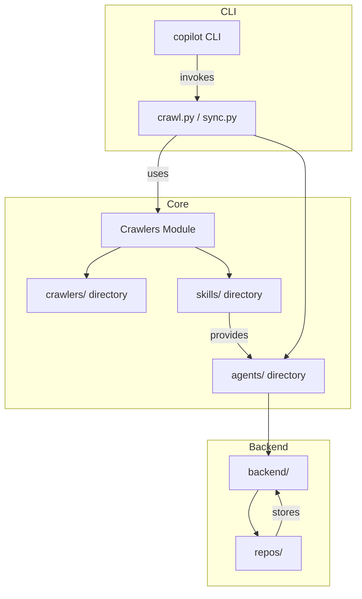
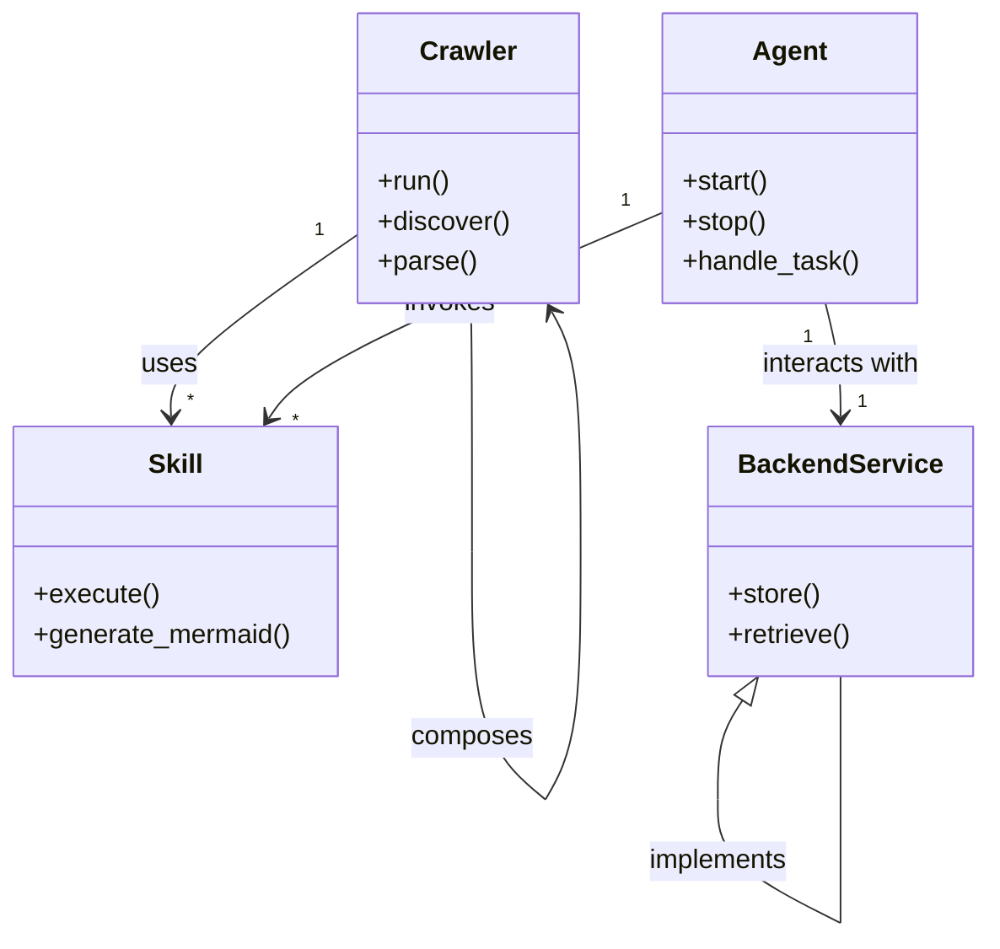

# Diagram: common/jwt_custom_authorizer/config/config.staging.yml

> Auto-generated by Obscura crawlers

## Diagram 1

### SVG

<svg id="container" width="584.453125" xmlns="http://www.w3.org/2000/svg" class="flowchart" height="940" viewBox="0 0 584.453125 940" role="graphics-document document" aria-roledescription="flowchart-v2"><g><marker id="container_flowchart-v2-pointEnd" class="marker flowchart-v2" viewBox="0 0 10 10" refX="5" refY="5" markerUnits="userSpaceOnUse" markerWidth="8" markerHeight="8" orient="auto"><path d="M 0 0 L 10 5 L 0 10 z" class="arrowMarkerPath" style="stroke-width: 1; stroke-dasharray: 1, 0;"></path></marker><marker id="container_flowchart-v2-pointStart" class="marker flowchart-v2" viewBox="0 0 10 10" refX="4.5" refY="5" markerUnits="userSpaceOnUse" markerWidth="8" markerHeight="8" orient="auto"><path d="M 0 5 L 10 10 L 10 0 z" class="arrowMarkerPath" style="stroke-width: 1; stroke-dasharray: 1, 0;"></path></marker><marker id="container_flowchart-v2-circleEnd" class="marker flowchart-v2" viewBox="0 0 10 10" refX="11" refY="5" markerUnits="userSpaceOnUse" markerWidth="11" markerHeight="11" orient="auto"><circle cx="5" cy="5" r="5" class="arrowMarkerPath" style="stroke-width: 1; stroke-dasharray: 1, 0;"></circle></marker><marker id="container_flowchart-v2-circleStart" class="marker flowchart-v2" viewBox="0 0 10 10" refX="-1" refY="5" markerUnits="userSpaceOnUse" markerWidth="11" markerHeight="11" orient="auto"><circle cx="5" cy="5" r="5" class="arrowMarkerPath" style="stroke-width: 1; stroke-dasharray: 1, 0;"></circle></marker><marker id="container_flowchart-v2-crossEnd" class="marker cross flowchart-v2" viewBox="0 0 11 11" refX="12" refY="5.2" markerUnits="userSpaceOnUse" markerWidth="11" markerHeight="11" orient="auto"><path d="M 1,1 l 9,9 M 10,1 l -9,9" class="arrowMarkerPath" style="stroke-width: 2; stroke-dasharray: 1, 0;"></path></marker><marker id="container_flowchart-v2-crossStart" class="marker cross flowchart-v2" viewBox="0 0 11 11" refX="-1" refY="5.2" markerUnits="userSpaceOnUse" markerWidth="11" markerHeight="11" orient="auto"><path d="M 1,1 l 9,9 M 10,1 l -9,9" class="arrowMarkerPath" style="stroke-width: 2; stroke-dasharray: 1, 0;"></path></marker><g class="root"><g class="clusters"><g class="cluster" id="Backend" data-look="classic"><rect style="" x="340.55078125" y="700" width="199.734375" height="232"></rect><g class="cluster-label" transform="translate(409.51953125, 700)"><foreignObject width="61.796875" height="24">

Backend

</foreignObject></g></g><g class="cluster" id="Core" data-look="classic"><rect style="" x="8" y="314" width="567.48046875" height="336"></rect><g class="cluster-label" transform="translate(275.537109375, 314)"><foreignObject width="32.40625" height="24">

Core

</foreignObject></g></g><g class="cluster" id="CLI" data-look="classic"><rect style="" x="175.09375" y="8" width="401.359375" height="232"></rect><g class="cluster-label" transform="translate(364.9453125, 8)"><foreignObject width="21.65625" height="24">

CLI

</foreignObject></g></g></g><g class="edgePaths"><path d="M322.32,87L322.32,93.167C322.32,99.333,322.32,111.667,322.32,123.333C322.32,135,322.32,146,322.32,151.5L322.32,157" id="L_CP_RUN_0" class="edge-thickness-normal edge-pattern-solid edge-thickness-normal edge-pattern-solid flowchart-link" style=";" data-edge="true" data-et="edge" data-id="L_CP_RUN_0" data-points="W3sieCI6MzIyLjMyMDMxMjUsInkiOjg3fSx7IngiOjMyMi4zMjAzMTI1LCJ5IjoxMjR9LHsieCI6MzIyLjMyMDMxMjUsInkiOjE2MX1d" marker-end="url(#container_flowchart-v2-pointEnd)"></path><path d="M289.943,215L284.947,219.167C279.951,223.333,269.958,231.667,264.961,242C259.965,252.333,259.965,264.667,259.965,277C259.965,289.333,259.965,301.667,259.965,311.333C259.965,321,259.965,328,259.965,331.5L259.965,335" id="L_RUN_CRAWL_0" class="edge-thickness-normal edge-pattern-solid edge-thickness-normal edge-pattern-solid flowchart-link" style=";" data-edge="true" data-et="edge" data-id="L_RUN_CRAWL_0" data-points="W3sieCI6Mjg5Ljk0MzQzNDQ5NTE5MjMsInkiOjIxNX0seyJ4IjoyNTkuOTY0ODQzNzUsInkiOjI0MH0seyJ4IjoyNTkuOTY0ODQzNzUsInkiOjI3N30seyJ4IjoyNTkuOTY0ODQzNzUsInkiOjMxNH0seyJ4IjoyNTkuOTY0ODQzNzUsInkiOjMzOX1d" marker-end="url(#container_flowchart-v2-pointEnd)"></path><path d="M198.645,393L189.182,397.167C179.719,401.333,160.793,409.667,151.33,417.333C141.867,425,141.867,432,141.867,435.5L141.867,439" id="L_CRAWL_CRAWLERS_DIR_0" class="edge-thickness-normal edge-pattern-solid edge-thickness-normal edge-pattern-solid flowchart-link" style=";" data-edge="true" data-et="edge" data-id="L_CRAWL_CRAWLERS_DIR_0" data-points="W3sieCI6MTk4LjY0NDkwNjg1MDk2MTU1LCJ5IjozOTN9LHsieCI6MTQxLjg2NzE4NzUsInkiOjQxOH0seyJ4IjoxNDEuODY3MTg3NSwieSI6NDQzfV0=" marker-end="url(#container_flowchart-v2-pointEnd)"></path><path d="M321.285,393L330.748,397.167C340.211,401.333,359.137,409.667,368.6,417.333C378.063,425,378.063,432,378.063,435.5L378.063,439" id="L_CRAWL_SKILLS_0" class="edge-thickness-normal edge-pattern-solid edge-thickness-normal edge-pattern-solid flowchart-link" style=";" data-edge="true" data-et="edge" data-id="L_CRAWL_SKILLS_0" data-points="W3sieCI6MzIxLjI4NDc4MDY0OTAzODQ1LCJ5IjozOTN9LHsieCI6Mzc4LjA2MjUsInkiOjQxOH0seyJ4IjozNzguMDYyNSwieSI6NDQzfV0=" marker-end="url(#container_flowchart-v2-pointEnd)"></path><path d="M415.399,215L429.762,219.167C444.126,223.333,472.854,231.667,487.218,242C501.582,252.333,501.582,264.667,501.582,277C501.582,289.333,501.582,301.667,501.582,316.5C501.582,331.333,501.582,348.667,501.582,366C501.582,383.333,501.582,400.667,501.582,418C501.582,435.333,501.582,452.667,501.582,472C501.582,491.333,501.582,512.667,496.149,529.018C490.716,545.369,479.851,556.739,474.418,562.424L468.985,568.108" id="L_RUN_AGENTS_0" class="edge-thickness-normal edge-pattern-solid edge-thickness-normal edge-pattern-solid flowchart-link" style=";" data-edge="true" data-et="edge" data-id="L_RUN_AGENTS_0" data-points="W3sieCI6NDE1LjM5ODUxMjYyMDE5MjMsInkiOjIxNX0seyJ4Ijo1MDEuNTgyMDMxMjUsInkiOjI0MH0seyJ4Ijo1MDEuNTgyMDMxMjUsInkiOjI3N30seyJ4Ijo1MDEuNTgyMDMxMjUsInkiOjMxNH0seyJ4Ijo1MDEuNTgyMDMxMjUsInkiOjM2Nn0seyJ4Ijo1MDEuNTgyMDMxMjUsInkiOjQxOH0seyJ4Ijo1MDEuNTgyMDMxMjUsInkiOjQ3MH0seyJ4Ijo1MDEuNTgyMDMxMjUsInkiOjUzNH0seyJ4Ijo0NjYuMjIxNTU3NjE3MTg3NSwieSI6NTcxfV0=" marker-end="url(#container_flowchart-v2-pointEnd)"></path><path d="M440.418,625L440.418,629.167C440.418,633.333,440.418,641.667,440.418,650C440.418,658.333,440.418,666.667,440.418,675C440.418,683.333,440.418,691.667,440.418,699.333C440.418,707,440.418,714,440.418,717.5L440.418,721" id="L_AGENTS_BACKEND_0" class="edge-thickness-normal edge-pattern-solid edge-thickness-normal edge-pattern-solid flowchart-link" style=";" data-edge="true" data-et="edge" data-id="L_AGENTS_BACKEND_0" data-points="W3sieCI6NDQwLjQxNzk2ODc1LCJ5Ijo2MjV9LHsieCI6NDQwLjQxNzk2ODc1LCJ5Ijo2NTB9LHsieCI6NDQwLjQxNzk2ODc1LCJ5Ijo2NzV9LHsieCI6NDQwLjQxNzk2ODc1LCJ5Ijo3MDB9LHsieCI6NDQwLjQxNzk2ODc1LCJ5Ijo3MjV9XQ==" marker-end="url(#container_flowchart-v2-pointEnd)"></path><path d="M423.571,779L419.723,785.167C415.875,791.333,408.18,803.667,407.827,815.434C407.474,827.202,414.464,838.404,417.959,844.005L421.454,849.606" id="L_BACKEND_REPOS_0" class="edge-thickness-normal edge-pattern-solid edge-thickness-normal edge-pattern-solid flowchart-link" style=";" data-edge="true" data-et="edge" data-id="L_BACKEND_REPOS_0" data-points="W3sieCI6NDIzLjU3MDk4Mzg4NjcxODc1LCJ5Ijo3Nzl9LHsieCI6NDAwLjQ4NDM3NSwieSI6ODE2fSx7IngiOjQyMy41NzA5ODM4ODY3MTg3NSwieSI6ODUzfV0=" marker-end="url(#container_flowchart-v2-pointEnd)"></path><path d="M378.063,497L378.063,503.167C378.063,509.333,378.063,521.667,383.605,533.523C389.148,545.378,400.234,556.757,405.777,562.446L411.32,568.135" id="L_SKILLS_AGENTS_0" class="edge-thickness-normal edge-pattern-solid edge-thickness-normal edge-pattern-solid flowchart-link" style=";" data-edge="true" data-et="edge" data-id="L_SKILLS_AGENTS_0" data-points="W3sieCI6Mzc4LjA2MjUsInkiOjQ5N30seyJ4IjozNzguMDYyNSwieSI6NTM0fSx7IngiOjQxNC4xMTE3NTUzNzEwOTM3NSwieSI6NTcxfV0=" marker-end="url(#container_flowchart-v2-pointEnd)"></path><path d="M452.598,853L455.38,846.833C458.162,840.667,463.725,828.333,463.999,816.608C464.274,804.882,459.258,793.764,456.751,788.205L454.243,782.646" id="L_REPOS_BACKEND_0" class="edge-thickness-normal edge-pattern-solid edge-thickness-normal edge-pattern-solid flowchart-link" style=";" data-edge="true" data-et="edge" data-id="L_REPOS_BACKEND_0" data-points="W3sieCI6NDUyLjU5Nzk2MTQyNTc4MTI1LCJ5Ijo4NTN9LHsieCI6NDY5LjI4OTA2MjUsInkiOjgxNn0seyJ4Ijo0NTIuNTk3OTYxNDI1NzgxMjUsInkiOjc3OX1d" marker-end="url(#container_flowchart-v2-pointEnd)"></path></g><g class="edgeLabels"><g class="edgeLabel" transform="translate(322.3203125, 124)"><g class="label" data-id="L_CP_RUN_0" transform="translate(-27.5859375, -12)"><foreignObject width="55.171875" height="24">

invokes

</foreignObject></g></g><g class="edgeLabel" transform="translate(259.96484375, 277)"><g class="label" data-id="L_RUN_CRAWL_0" transform="translate(-16.4921875, -12)"><foreignObject width="32.984375" height="24">

uses

</foreignObject></g></g><g class="edgeLabel"><g class="label" data-id="L_CRAWL_CRAWLERS_DIR_0" transform="translate(0, 0)"><foreignObject width="0" height="0">

</foreignObject></g></g><g class="edgeLabel"><g class="label" data-id="L_CRAWL_SKILLS_0" transform="translate(0, 0)"><foreignObject width="0" height="0">

</foreignObject></g></g><g class="edgeLabel"><g class="label" data-id="L_RUN_AGENTS_0" transform="translate(0, 0)"><foreignObject width="0" height="0">

</foreignObject></g></g><g class="edgeLabel"><g class="label" data-id="L_AGENTS_BACKEND_0" transform="translate(0, 0)"><foreignObject width="0" height="0">

</foreignObject></g></g><g class="edgeLabel"><g class="label" data-id="L_BACKEND_REPOS_0" transform="translate(0, 0)"><foreignObject width="0" height="0">

</foreignObject></g></g><g class="edgeLabel" transform="translate(378.0625, 534)"><g class="label" data-id="L_SKILLS_AGENTS_0" transform="translate(-31.3125, -12)"><foreignObject width="62.625" height="24">

provides

</foreignObject></g></g><g class="edgeLabel" transform="translate(469.2890625, 816)"><g class="label" data-id="L_REPOS_BACKEND_0" transform="translate(-22.125, -12)"><foreignObject width="44.25" height="24">

stores

</foreignObject></g></g></g><g class="nodes"><g class="node default" id="flowchart-CP-0" transform="translate(322.3203125, 60)"><rect class="basic label-container" style="" x="-68.15625" y="-27" width="136.3125" height="54"></rect><g class="label" style="" transform="translate(-38.15625, -12)"><rect></rect><foreignObject width="76.3125" height="24">

copilot CLI

</foreignObject></g></g><g class="node default" id="flowchart-RUN-1" transform="translate(322.3203125, 188)"><rect class="basic label-container" style="" x="-94.7421875" y="-27" width="189.484375" height="54"></rect><g class="label" style="" transform="translate(-64.7421875, -12)"><rect></rect><foreignObject width="129.484375" height="24">

crawl.py / sync.py

</foreignObject></g></g><g class="node default" id="flowchart-CRAWL-2" transform="translate(259.96484375, 366)"><rect class="basic label-container" style="" x="-89.7109375" y="-27" width="179.421875" height="54"></rect><g class="label" style="" transform="translate(-59.7109375, -12)"><rect></rect><foreignObject width="119.421875" height="24">

Crawlers Module

</foreignObject></g></g><g class="node default" id="flowchart-CRAWLERS_DIR-3" transform="translate(141.8671875, 470)"><rect class="basic label-container" style="" x="-98.8671875" y="-27" width="197.734375" height="54"></rect><g class="label" style="" transform="translate(-68.8671875, -12)"><rect></rect><foreignObject width="137.734375" height="24">

crawlers/ directory

</foreignObject></g></g><g class="node default" id="flowchart-SKILLS-4" transform="translate(378.0625, 470)"><rect class="basic label-container" style="" x="-87.328125" y="-27" width="174.65625" height="54"></rect><g class="label" style="" transform="translate(-57.328125, -12)"><rect></rect><foreignObject width="114.65625" height="24">

skills/ directory

</foreignObject></g></g><g class="node default" id="flowchart-AGENTS-5" transform="translate(440.41796875, 598)"><rect class="basic label-container" style="" x="-92.796875" y="-27" width="185.59375" height="54"></rect><g class="label" style="" transform="translate(-62.796875, -12)"><rect></rect><foreignObject width="125.59375" height="24">

agents/ directory

</foreignObject></g></g><g class="node default" id="flowchart-BACKEND-6" transform="translate(440.41796875, 752)"><rect class="basic label-container" style="" x="-64.8671875" y="-27" width="129.734375" height="54"></rect><g class="label" style="" transform="translate(-34.8671875, -12)"><rect></rect><foreignObject width="69.734375" height="24">

backend/

</foreignObject></g></g><g class="node default" id="flowchart-REPOS-7" transform="translate(440.41796875, 880)"><rect class="basic label-container" style="" x="-54.53125" y="-27" width="109.0625" height="54"></rect><g class="label" style="" transform="translate(-24.53125, -12)"><rect></rect><foreignObject width="49.0625" height="24">

repos/

</foreignObject></g></g></g></g></g></svg>

## Diagram 2

### SVG

<svg id="container" width="590.0695190429688" xmlns="http://www.w3.org/2000/svg" class="classDiagram" height="562.25" viewBox="0 0 590.0695190429688 562.25" role="graphics-document document" aria-roledescription="class"><g><defs><marker id="container_class-aggregationStart" class="marker aggregation class" refX="18" refY="7" markerWidth="190" markerHeight="240" orient="auto"><path d="M 18,7 L9,13 L1,7 L9,1 Z"></path></marker></defs><defs><marker id="container_class-aggregationEnd" class="marker aggregation class" refX="1" refY="7" markerWidth="20" markerHeight="28" orient="auto"><path d="M 18,7 L9,13 L1,7 L9,1 Z"></path></marker></defs><defs><marker id="container_class-extensionStart" class="marker extension class" refX="18" refY="7" markerWidth="190" markerHeight="240" orient="auto"><path d="M 1,7 L18,13 V 1 Z"></path></marker></defs><defs><marker id="container_class-extensionEnd" class="marker extension class" refX="1" refY="7" markerWidth="20" markerHeight="28" orient="auto"><path d="M 1,1 V 13 L18,7 Z"></path></marker></defs><defs><marker id="container_class-compositionStart" class="marker composition class" refX="18" refY="7" markerWidth="190" markerHeight="240" orient="auto"><path d="M 18,7 L9,13 L1,7 L9,1 Z"></path></marker></defs><defs><marker id="container_class-compositionEnd" class="marker composition class" refX="1" refY="7" markerWidth="20" markerHeight="28" orient="auto"><path d="M 18,7 L9,13 L1,7 L9,1 Z"></path></marker></defs><defs><marker id="container_class-dependencyStart" class="marker dependency class" refX="6" refY="7" markerWidth="190" markerHeight="240" orient="auto"><path d="M 5,7 L9,13 L1,7 L9,1 Z"></path></marker></defs><defs><marker id="container_class-dependencyEnd" class="marker dependency class" refX="13" refY="7" markerWidth="20" markerHeight="28" orient="auto"><path d="M 18,7 L9,13 L14,7 L9,1 Z"></path></marker></defs><defs><marker id="container_class-lollipopStart" class="marker lollipop class" refX="13" refY="7" markerWidth="190" markerHeight="240" orient="auto"><circle stroke="black" fill="transparent" cx="7" cy="7" r="6"></circle></marker></defs><defs><marker id="container_class-lollipopEnd" class="marker lollipop class" refX="1" refY="7" markerWidth="190" markerHeight="240" orient="auto"><circle stroke="black" fill="transparent" cx="7" cy="7" r="6"></circle></marker></defs><g class="root"><g class="clusters"></g><g class="edgePaths"><path d="M215.73,140.218L196.717,153.348C177.704,166.479,139.678,192.739,120.841,211.037C102.004,229.334,102.356,239.669,102.532,244.836L102.708,250.003" id="id_Crawler_Skill_1" class="edge-thickness-normal edge-pattern-solid relation" style=";;;" data-edge="true" data-et="edge" data-id="id_Crawler_Skill_1" data-points="W3sieCI6MjE1LjcyOTY4NzUwMDc0NTA2LCJ5IjoxNDAuMjE4MTQwNDQzMzU5NTJ9LHsieCI6MTAxLjY1MjM0Mzc1LCJ5IjoyMTl9LHsieCI6MTAyLjkxMTgzMDM1NzE0Mjg2LCJ5IjoyNTZ9XQ==" marker-end="url(#container_class-dependencyEnd)"></path><path d="M494.477,182L496.046,188.167C497.614,194.333,500.75,206.667,502.318,218C503.886,229.333,503.886,239.667,503.886,244.833L503.886,250" id="id_Agent_BackendService_2" class="edge-thickness-normal edge-pattern-solid relation" style=";;;" data-edge="true" data-et="edge" data-id="id_Agent_BackendService_2" data-points="W3sieCI6NDk0LjQ3NzQxOTM1NTU4MzgsInkiOjE4Mn0seyJ4Ijo1MDMuODg1OTM3NTAwNzQ1MDYsInkiOjIxOX0seyJ4Ijo1MDMuODg1OTM3NTAwNzQ1MDYsInkiOjI1Nn1d" marker-end="url(#container_class-dependencyEnd)"></path><path d="M396.683,127.502L361.178,142.752C325.674,158.001,254.665,188.501,215.428,209.097C176.19,229.693,168.725,240.387,164.992,245.734L161.26,251.08" id="id_Agent_Skill_3" class="edge-thickness-normal edge-pattern-solid relation" style=";;;" data-edge="true" data-et="edge" data-id="id_Agent_Skill_3" data-points="W3sieCI6Mzk2LjY4MjgxMjUwMDc0NTA2LCJ5IjoxMjcuNTAyMDgwMzE5OTI4MTh9LHsieCI6MTgzLjY1NTg1OTM3NTM3MjUzLCJ5IjoyMTl9LHsieCI6MTU3LjgyNDg5ODg1NjI3NjI2LCJ5IjoyNTZ9XQ==" marker-end="url(#container_class-dependencyEnd)"></path><path d="M283.525,182L283.689,188.167C283.854,194.333,284.182,206.667,284.347,231.492C284.511,256.317,284.511,293.633,284.511,312.292L284.511,330.95" id="Crawler-cyclic-special-1" class="edge-thickness-normal edge-pattern-solid relation" style=";;;" data-edge="true" data-et="edge" data-id="Crawler-cyclic-special-1" data-points="W3sieCI6MjgzLjUyNDg2MTM5MTg3NDEsInkiOjE4Mn0seyJ4IjoyODQuNTEwOTM3NTAwNzQ1MDYsInkiOjIxOX0seyJ4IjoyODQuNTEwOTM3NTAwNzQ1MDYsInkiOjMzMC45NDk5OTk5OTkyNTQ5NH1d"></path><path d="M284.511,331.05L284.511,349.708C284.511,368.367,284.511,405.683,291.553,430.509C298.596,455.335,312.681,467.671,319.724,473.839L326.766,480.006" id="Crawler-cyclic-special-mid" class="edge-thickness-normal edge-pattern-solid relation" style=";;;" data-edge="true" data-et="edge" data-id="Crawler-cyclic-special-mid" data-points="W3sieCI6Mjg0LjUxMDkzNzUwMDc0NTA2LCJ5IjozMzEuMDUwMDAwMDAwNzQ1MDZ9LHsieCI6Mjg0LjUxMDkzNzUwMDc0NTA2LCJ5Ijo0NDN9LHsieCI6MzI2Ljc2NjAxNTYyNDYyNzQ3LCJ5Ijo0ODAuMDA2MjEwOTMwNzM4M31d"></path><path d="M326.845,480L330.44,473.833C334.035,467.667,341.225,455.333,344.82,430.5C348.415,405.667,348.415,368.333,348.415,331C348.415,293.667,348.415,256.333,345.549,232.379C342.684,208.425,336.952,197.85,334.086,192.562L331.22,187.275" id="Crawler-cyclic-special-2" class="edge-thickness-normal edge-pattern-solid relation" style=";;;" data-edge="true" data-et="edge" data-id="Crawler-cyclic-special-2" data-points="W3sieCI6MzI2Ljg0NTE2NDM2OTA1OTE1LCJ5Ijo0ODB9LHsieCI6MzQ4LjQxNTIzNDM3NTc0NTA2LCJ5Ijo0NDN9LHsieCI6MzQ4LjQxNTIzNDM3NTc0NTA2LCJ5IjozMzF9LHsieCI6MzQ4LjQxNTIzNDM3NTc0NTA2LCJ5IjoyMTl9LHsieCI6MzI4LjM2MDk0MDY1MDk0NjY1LCJ5IjoxODJ9XQ==" marker-end="url(#container_class-dependencyEnd)"></path><path d="M444.953,420.402L442.47,424.169C439.988,427.935,435.022,435.467,432.54,445.4C430.057,455.333,430.057,467.667,430.057,473.833L430.057,480" id="BackendService-cyclic-special-1" class="edge-thickness-normal edge-pattern-solid relation" style=";;;" data-edge="true" data-et="edge" data-id="BackendService-cyclic-special-1" data-points="W3sieCI6NDU0LjQ0NjkzNzc4MDI2MTg2LCJ5Ijo0MDZ9LHsieCI6NDMwLjA1NzAzMTI1MTQ5MDEsInkiOjQ0M30seyJ4Ijo0MzAuMDU3MDMxMjUxNDkwMSwieSI6NDgwfV0=" marker-start="url(#container_class-extensionStart)"></path><path d="M430.057,480.1L430.057,486.267C430.057,492.433,430.057,504.767,442.354,517.104C454.65,529.442,479.243,541.783,491.539,547.954L503.836,554.125" id="BackendService-cyclic-special-mid" class="edge-thickness-normal edge-pattern-solid relation" style=";;;" data-edge="true" data-et="edge" data-id="BackendService-cyclic-special-mid" data-points="W3sieCI6NDMwLjA1NzAzMTI1MTQ5MDEsInkiOjQ4MC4xMDAwMDAwMDE0OTAxfSx7IngiOjQzMC4wNTcwMzEyNTE0OTAxLCJ5Ijo1MTcuMTAwMDAwMDAxNDkwMX0seyJ4Ijo1MDMuODM1OTM3NSwieSI6NTU0LjEyNDkwODIwMzg5MDF9XQ=="></path><path d="M503.886,554.1L503.886,547.933C503.886,541.767,503.886,529.433,503.886,517.092C503.886,504.75,503.886,492.4,503.886,480.05C503.886,467.7,503.886,455.35,503.886,443.008C503.886,430.667,503.886,418.333,503.886,412.167L503.886,406" id="BackendService-cyclic-special-2" class="edge-thickness-normal edge-pattern-solid relation" style=";;;" data-edge="true" data-et="edge" data-id="BackendService-cyclic-special-2" data-points="W3sieCI6NTAzLjg4NTkzNzUwMDc0NTA2LCJ5Ijo1NTQuMTAwMDAwMDAxNDkwMX0seyJ4Ijo1MDMuODg1OTM3NTAwNzQ1MDYsInkiOjUxNy4xMDAwMDAwMDE0OTAxfSx7IngiOjUwMy44ODU5Mzc1MDA3NDUwNiwieSI6NDgwLjA1MDAwMDAwMDc0NTA2fSx7IngiOjUwMy44ODU5Mzc1MDA3NDUwNiwieSI6NDQzfSx7IngiOjUwMy44ODU5Mzc1MDA3NDUwNiwieSI6NDA2fV0="></path></g><g class="edgeLabels"><g class="edgeLabel" transform="translate(101.65234375, 219)"><g class="label" data-id="id_Crawler_Skill_1" transform="translate(-16.4921875, -12)"><foreignObject width="32.984375" height="24">

uses

</foreignObject></g></g><g class="edgeLabel" transform="translate(503.88593750074506, 219)"><g class="label" data-id="id_Agent_BackendService_2" transform="translate(-49.375, -12)"><foreignObject width="98.75" height="24">

interacts with

</foreignObject></g></g><g class="edgeLabel" transform="translate(269.43834, 182.15528)"><g class="label" data-id="id_Agent_Skill_3" transform="translate(-27.5859375, -12)"><foreignObject width="55.171875" height="24">

invokes

</foreignObject></g></g><g class="edgeLabel"><g class="label" data-id="Crawler-cyclic-special-1" transform="translate(0, 0)"><foreignObject width="0" height="0">

</foreignObject></g></g><g class="edgeLabel" transform="translate(284.51093750074506, 443)"><g class="label" data-id="Crawler-cyclic-special-mid" transform="translate(-36.453125, -12)"><foreignObject width="72.90625" height="24">

composes

</foreignObject></g></g><g class="edgeLabel"><g class="label" data-id="Crawler-cyclic-special-2" transform="translate(0, 0)"><foreignObject width="0" height="0">

</foreignObject></g></g><g class="edgeLabel"><g class="label" data-id="BackendService-cyclic-special-1" transform="translate(0, 0)"><foreignObject width="0" height="0">

</foreignObject></g></g><g class="edgeLabel" transform="translate(430.0570312514901, 517.1000000014901)"><g class="label" data-id="BackendService-cyclic-special-mid" transform="translate(-43.0625, -12)"><foreignObject width="86.125" height="24">

implements

</foreignObject></g></g><g class="edgeLabel"><g class="label" data-id="BackendService-cyclic-special-2" transform="translate(0, 0)"><foreignObject width="0" height="0">

</foreignObject></g></g><g class="edgeTerminals" transform="translate(192.80592897272822, 137.81995419676716)"><g class="inner" transform="translate(0, 0)"><foreignObject style="width: 9px; height: 12px;">
1
</foreignObject></g></g><g class="edgeTerminals" transform="translate(484.2527794138065, 202.65688159024558)"><g class="inner" transform="translate(0, 0)"><foreignObject style="width: 9px; height: 12px;">
1
</foreignObject></g></g><g class="edgeTerminals" transform="translate(374.68350759379325, 120.62598880518098)"><g class="inner" transform="translate(0, 0)"><foreignObject style="width: 9px; height: 12px;">
1
</foreignObject></g></g><g class="edgeTerminals" transform="translate(112.30778716578496, 232.99982128080836)"><g class="inner" transform="translate(0, 0)"></g><foreignObject style="width: 9px; height: 12px;">
*
</foreignObject></g><g class="edgeTerminals" transform="translate(513.8859387503725, 233.50000107110927)"><g class="inner" transform="translate(0, 0)"></g><foreignObject style="width: 9px; height: 12px;">
1
</foreignObject></g><g class="edgeTerminals" transform="translate(175.14176422710847, 245.23740249267874)"><g class="inner" transform="translate(0, 0)"></g><foreignObject style="width: 9px; height: 12px;">
*
</foreignObject></g></g><g class="nodes"><g class="node default" id="classId-Crawler-0" transform="translate(281.20625000074506, 95)"><g class="basic label-container"><path d="M-65.4765625 -87 L65.4765625 -87 L65.4765625 87 L-65.4765625 87" stroke="none" stroke-width="0" fill="#ECECFF" style=""></path><path d="M-65.4765625 -87 C-15.42986903013788 -87, 34.61682443972424 -87, 65.4765625 -87 M-65.4765625 -87 C-16.889232929236172 -87, 31.698096641527655 -87, 65.4765625 -87 M65.4765625 -87 C65.4765625 -30.13029543514717, 65.4765625 26.739409129705663, 65.4765625 87 M65.4765625 -87 C65.4765625 -21.84209135449032, 65.4765625 43.31581729101936, 65.4765625 87 M65.4765625 87 C19.373617249079288 87, -26.729328001841424 87, -65.4765625 87 M65.4765625 87 C22.189249476147573 87, -21.098063547704854 87, -65.4765625 87 M-65.4765625 87 C-65.4765625 47.01974083361179, -65.4765625 7.039481667223583, -65.4765625 -87 M-65.4765625 87 C-65.4765625 34.24104418647224, -65.4765625 -18.517911627055526, -65.4765625 -87" stroke="#9370DB" stroke-width="1.3" fill="none" stroke-dasharray="0 0" style=""></path></g><g class="annotation-group text" transform="translate(0, -63)"></g><g class="label-group text" transform="translate(-27.734375, -63)"><g class="label" style="font-weight: bolder" transform="translate(0,-12)"><foreignObject width="55.46875" height="24">

Crawler

</foreignObject></g></g><g class="members-group text" transform="translate(-53.4765625, -15)"></g><g class="methods-group text" transform="translate(-53.4765625, 15)"><g class="label" style="" transform="translate(0,-12)"><foreignObject width="43.21875" height="24">

+run()

</foreignObject></g><g class="label" style="" transform="translate(0,12)"><foreignObject width="79.21875" height="24">

+discover()

</foreignObject></g><g class="label" style="" transform="translate(0,36)"><foreignObject width="58.53125" height="24">

+parse()

</foreignObject></g></g><g class="divider" style=""><path d="M-65.4765625 -39 C-36.64386705288595 -39, -7.8111716057718965 -39, 65.4765625 -39 M-65.4765625 -39 C-31.56440729341754 -39, 2.3477479131649233 -39, 65.4765625 -39" stroke="#9370DB" stroke-width="1.3" fill="none" stroke-dasharray="0 0" style=""></path></g><g class="divider" style=""><path d="M-65.4765625 -15 C-29.80631245999038 -15, 5.86393758001924 -15, 65.4765625 -15 M-65.4765625 -15 C-37.00168997593815 -15, -8.52681745187629 -15, 65.4765625 -15" stroke="#9370DB" stroke-width="1.3" fill="none" stroke-dasharray="0 0" style=""></path></g></g><g class="node default" id="classId-Skill-1" transform="translate(105.46484375, 331)"><g class="basic label-container"><path d="M-97.46484375 -75 L97.46484375 -75 L97.46484375 75 L-97.46484375 75" stroke="none" stroke-width="0" fill="#ECECFF" style=""></path><path d="M-97.46484375 -75 C-51.9871845278233 -75, -6.509525305646605 -75, 97.46484375 -75 M-97.46484375 -75 C-39.23379860268331 -75, 18.997246544633384 -75, 97.46484375 -75 M97.46484375 -75 C97.46484375 -20.403687052600098, 97.46484375 34.192625894799804, 97.46484375 75 M97.46484375 -75 C97.46484375 -32.62636102176548, 97.46484375 9.747277956469034, 97.46484375 75 M97.46484375 75 C58.183088979145246 75, 18.901334208290493 75, -97.46484375 75 M97.46484375 75 C20.546666479993746 75, -56.37151079001251 75, -97.46484375 75 M-97.46484375 75 C-97.46484375 18.35836252359421, -97.46484375 -38.28327495281158, -97.46484375 -75 M-97.46484375 75 C-97.46484375 19.365197675438715, -97.46484375 -36.26960464912257, -97.46484375 -75" stroke="#9370DB" stroke-width="1.3" fill="none" stroke-dasharray="0 0" style=""></path></g><g class="annotation-group text" transform="translate(0, -51)"></g><g class="label-group text" transform="translate(-16.0078125, -51)"><g class="label" style="font-weight: bolder" transform="translate(0,-12)"><foreignObject width="32.015625" height="24">

Skill

</foreignObject></g></g><g class="members-group text" transform="translate(-85.46484375, -3)"></g><g class="methods-group text" transform="translate(-85.46484375, 27)"><g class="label" style="" transform="translate(0,-12)"><foreignObject width="74.328125" height="24">

+execute()

</foreignObject></g><g class="label" style="" transform="translate(0,12)"><foreignObject width="154.921875" height="24">

+generate_mermaid()

</foreignObject></g></g><g class="divider" style=""><path d="M-97.46484375 -27 C-22.521334036253577 -27, 52.422175677492845 -27, 97.46484375 -27 M-97.46484375 -27 C-25.84984442798489 -27, 45.76515489403022 -27, 97.46484375 -27" stroke="#9370DB" stroke-width="1.3" fill="none" stroke-dasharray="0 0" style=""></path></g><g class="divider" style=""><path d="M-97.46484375 -3 C-19.870044065077934 -3, 57.72475561984413 -3, 97.46484375 -3 M-97.46484375 -3 C-48.81157455593983 -3, -0.1583053618796555 -3, 97.46484375 -3" stroke="#9370DB" stroke-width="1.3" fill="none" stroke-dasharray="0 0" style=""></path></g></g><g class="node default" id="classId-Agent-2" transform="translate(472.35468750074506, 95)"><g class="basic label-container"><path d="M-75.671875 -87 L75.671875 -87 L75.671875 87 L-75.671875 87" stroke="none" stroke-width="0" fill="#ECECFF" style=""></path><path d="M-75.671875 -87 C-29.255458659020157 -87, 17.160957681959687 -87, 75.671875 -87 M-75.671875 -87 C-20.289582312272536 -87, 35.09271037545493 -87, 75.671875 -87 M75.671875 -87 C75.671875 -51.838105699788485, 75.671875 -16.67621139957697, 75.671875 87 M75.671875 -87 C75.671875 -22.177343772833396, 75.671875 42.64531245433321, 75.671875 87 M75.671875 87 C38.485783670299725 87, 1.2996923405994494 87, -75.671875 87 M75.671875 87 C32.940064092141746 87, -9.791746815716508 87, -75.671875 87 M-75.671875 87 C-75.671875 42.96800303356465, -75.671875 -1.0639939328707015, -75.671875 -87 M-75.671875 87 C-75.671875 18.303178518739728, -75.671875 -50.393642962520545, -75.671875 -87" stroke="#9370DB" stroke-width="1.3" fill="none" stroke-dasharray="0 0" style=""></path></g><g class="annotation-group text" transform="translate(0, -63)"></g><g class="label-group text" transform="translate(-21.078125, -63)"><g class="label" style="font-weight: bolder" transform="translate(0,-12)"><foreignObject width="42.15625" height="24">

Agent

</foreignObject></g></g><g class="members-group text" transform="translate(-63.671875, -15)"></g><g class="methods-group text" transform="translate(-63.671875, 15)"><g class="label" style="" transform="translate(0,-12)"><foreignObject width="52.15625" height="24">

+start()

</foreignObject></g><g class="label" style="" transform="translate(0,12)"><foreignObject width="50.21875" height="24">

+stop()

</foreignObject></g><g class="label" style="" transform="translate(0,36)"><foreignObject width="106.265625" height="24">

+handle_task()

</foreignObject></g></g><g class="divider" style=""><path d="M-75.671875 -39 C-39.597825988484765 -39, -3.523776976969529 -39, 75.671875 -39 M-75.671875 -39 C-45.13608031241847 -39, -14.600285624836935 -39, 75.671875 -39" stroke="#9370DB" stroke-width="1.3" fill="none" stroke-dasharray="0 0" style=""></path></g><g class="divider" style=""><path d="M-75.671875 -15 C-19.98285764321526 -15, 35.70615971356948 -15, 75.671875 -15 M-75.671875 -15 C-28.03238383328175 -15, 19.607107333436502 -15, 75.671875 -15" stroke="#9370DB" stroke-width="1.3" fill="none" stroke-dasharray="0 0" style=""></path></g></g><g class="node default" id="classId-BackendService-3" transform="translate(503.88593750074506, 331)"><g class="basic label-container"><path d="M-78.18359375 -75 L78.18359375 -75 L78.18359375 75 L-78.18359375 75" stroke="none" stroke-width="0" fill="#ECECFF" style=""></path><path d="M-78.18359375 -75 C-35.02617494821927 -75, 8.131243853561458 -75, 78.18359375 -75 M-78.18359375 -75 C-33.836330862267836 -75, 10.510932025464328 -75, 78.18359375 -75 M78.18359375 -75 C78.18359375 -41.671598905147036, 78.18359375 -8.343197810294072, 78.18359375 75 M78.18359375 -75 C78.18359375 -40.49206019426863, 78.18359375 -5.984120388537264, 78.18359375 75 M78.18359375 75 C40.542106706322514 75, 2.9006196626450276 75, -78.18359375 75 M78.18359375 75 C34.017017812656114 75, -10.149558124687772 75, -78.18359375 75 M-78.18359375 75 C-78.18359375 35.71115948585991, -78.18359375 -3.577681028280182, -78.18359375 -75 M-78.18359375 75 C-78.18359375 41.74291506394903, -78.18359375 8.485830127898055, -78.18359375 -75" stroke="#9370DB" stroke-width="1.3" fill="none" stroke-dasharray="0 0" style=""></path></g><g class="annotation-group text" transform="translate(0, -51)"></g><g class="label-group text" transform="translate(-57.9453125, -51)"><g class="label" style="font-weight: bolder" transform="translate(0,-12)"><foreignObject width="115.890625" height="24">

BackendService

</foreignObject></g></g><g class="members-group text" transform="translate(-66.18359375, -3)"></g><g class="methods-group text" transform="translate(-66.18359375, 27)"><g class="label" style="" transform="translate(0,-12)"><foreignObject width="55.125" height="24">

+store()

</foreignObject></g><g class="label" style="" transform="translate(0,12)"><foreignObject width="74.421875" height="24">

+retrieve()

</foreignObject></g></g><g class="divider" style=""><path d="M-78.18359375 -27 C-34.40045435421406 -27, 9.382685041571875 -27, 78.18359375 -27 M-78.18359375 -27 C-39.381815219153935 -27, -0.5800366883078709 -27, 78.18359375 -27" stroke="#9370DB" stroke-width="1.3" fill="none" stroke-dasharray="0 0" style=""></path></g><g class="divider" style=""><path d="M-78.18359375 -3 C-17.5388287176144 -3, 43.1059363147712 -3, 78.18359375 -3 M-78.18359375 -3 C-34.96437651133669 -3, 8.254840727326624 -3, 78.18359375 -3" stroke="#9370DB" stroke-width="1.3" fill="none" stroke-dasharray="0 0" style=""></path></g></g><g class="label edgeLabel" id="Crawler---Crawler---1" transform="translate(284.51093750074506, 331)"><rect width="0.1" height="0.1"></rect><g class="label" style="" transform="translate(0, 0)"><rect></rect><foreignObject width="0" height="0">

</foreignObject></g></g><g class="label edgeLabel" id="Crawler---Crawler---2" transform="translate(326.81601562537253, 480.05000000074506)"><rect width="0.1" height="0.1"></rect><g class="label" style="" transform="translate(0, 0)"><rect></rect><foreignObject width="0" height="0">

</foreignObject></g></g><g class="label edgeLabel" id="BackendService---BackendService---1" transform="translate(430.0570312514901, 480.05000000074506)"><rect width="0.1" height="0.1"></rect><g class="label" style="" transform="translate(0, 0)"><rect></rect><foreignObject width="0" height="0">

</foreignObject></g></g><g class="label edgeLabel" id="BackendService---BackendService---2" transform="translate(503.88593750074506, 554.1500000022352)"><rect width="0.1" height="0.1"></rect><g class="label" style="" transform="translate(0, 0)"><rect></rect><foreignObject width="0" height="0">

</foreignObject></g></g></g></g></g></svg>
