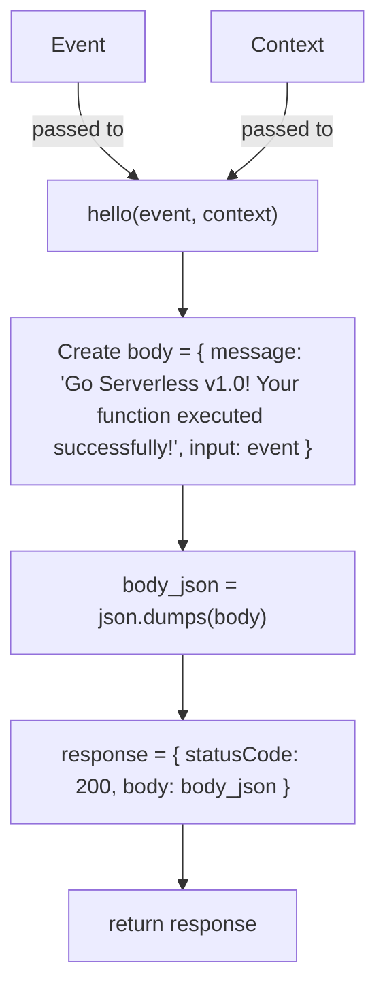

# Diagram: common/jwt_custom_authorizer/handler.py

> Auto-generated by Obscura crawlers

## Mermaid

### SVG

<svg id="container" width="282.2421875" xmlns="http://www.w3.org/2000/svg" class="flowchart" height="734" viewBox="0 0 282.2421875 734" role="graphics-document document" aria-roledescription="flowchart-v2"><g><marker id="container_flowchart-v2-pointEnd" class="marker flowchart-v2" viewBox="0 0 10 10" refX="5" refY="5" markerUnits="userSpaceOnUse" markerWidth="8" markerHeight="8" orient="auto"><path d="M 0 0 L 10 5 L 0 10 z" class="arrowMarkerPath" style="stroke-width: 1; stroke-dasharray: 1, 0;"></path></marker><marker id="container_flowchart-v2-pointStart" class="marker flowchart-v2" viewBox="0 0 10 10" refX="4.5" refY="5" markerUnits="userSpaceOnUse" markerWidth="8" markerHeight="8" orient="auto"><path d="M 0 5 L 10 10 L 10 0 z" class="arrowMarkerPath" style="stroke-width: 1; stroke-dasharray: 1, 0;"></path></marker><marker id="container_flowchart-v2-circleEnd" class="marker flowchart-v2" viewBox="0 0 10 10" refX="11" refY="5" markerUnits="userSpaceOnUse" markerWidth="11" markerHeight="11" orient="auto"><circle cx="5" cy="5" r="5" class="arrowMarkerPath" style="stroke-width: 1; stroke-dasharray: 1, 0;"></circle></marker><marker id="container_flowchart-v2-circleStart" class="marker flowchart-v2" viewBox="0 0 10 10" refX="-1" refY="5" markerUnits="userSpaceOnUse" markerWidth="11" markerHeight="11" orient="auto"><circle cx="5" cy="5" r="5" class="arrowMarkerPath" style="stroke-width: 1; stroke-dasharray: 1, 0;"></circle></marker><marker id="container_flowchart-v2-crossEnd" class="marker cross flowchart-v2" viewBox="0 0 11 11" refX="12" refY="5.2" markerUnits="userSpaceOnUse" markerWidth="11" markerHeight="11" orient="auto"><path d="M 1,1 l 9,9 M 10,1 l -9,9" class="arrowMarkerPath" style="stroke-width: 2; stroke-dasharray: 1, 0;"></path></marker><marker id="container_flowchart-v2-crossStart" class="marker cross flowchart-v2" viewBox="0 0 11 11" refX="-1" refY="5.2" markerUnits="userSpaceOnUse" markerWidth="11" markerHeight="11" orient="auto"><path d="M 1,1 l 9,9 M 10,1 l -9,9" class="arrowMarkerPath" style="stroke-width: 2; stroke-dasharray: 1, 0;"></path></marker><g class="root"><g class="clusters"></g><g class="edgePaths"><path d="M59.266,62L59.266,68.167C59.266,74.333,59.266,86.667,66.335,98.579C73.404,110.492,87.542,121.985,94.611,127.731L101.68,133.477" id="L_Event_Hello_0" class="edge-thickness-normal edge-pattern-solid edge-thickness-normal edge-pattern-solid flowchart-link" style=";" data-edge="true" data-et="edge" data-id="L_Event_Hello_0" data-points="W3sieCI6NTkuMjY1NjI1LCJ5Ijo2Mn0seyJ4Ijo1OS4yNjU2MjUsInkiOjk5fSx7IngiOjEwNC43ODM5MzU1NDY4NzUsInkiOjEzNn1d" marker-end="url(#container_flowchart-v2-pointEnd)"></path><path d="M216.734,62L216.734,68.167C216.734,74.333,216.734,86.667,209.665,98.579C202.596,110.492,188.458,121.985,181.389,127.731L174.32,133.477" id="L_Context_Hello_0" class="edge-thickness-normal edge-pattern-solid edge-thickness-normal edge-pattern-solid flowchart-link" style=";" data-edge="true" data-et="edge" data-id="L_Context_Hello_0" data-points="W3sieCI6MjE2LjczNDM3NSwieSI6NjJ9LHsieCI6MjE2LjczNDM3NSwieSI6OTl9LHsieCI6MTcxLjIxNjA2NDQ1MzEyNSwieSI6MTM2fV0=" marker-end="url(#container_flowchart-v2-pointEnd)"></path><path d="M138,190L138,194.167C138,198.333,138,206.667,138,214.333C138,222,138,229,138,232.5L138,236" id="L_Hello_BuildBody_0" class="edge-thickness-normal edge-pattern-solid edge-thickness-normal edge-pattern-solid flowchart-link" style=";" data-edge="true" data-et="edge" data-id="L_Hello_BuildBody_0" data-points="W3sieCI6MTM4LCJ5IjoxOTB9LHsieCI6MTM4LCJ5IjoyMTV9LHsieCI6MTM4LCJ5IjoyNDB9XQ==" marker-end="url(#container_flowchart-v2-pointEnd)"></path><path d="M138,366L138,370.167C138,374.333,138,382.667,138,390.333C138,398,138,405,138,408.5L138,412" id="L_BuildBody_Dump_0" class="edge-thickness-normal edge-pattern-solid edge-thickness-normal edge-pattern-solid flowchart-link" style=";" data-edge="true" data-et="edge" data-id="L_BuildBody_Dump_0" data-points="W3sieCI6MTM4LCJ5IjozNjZ9LHsieCI6MTM4LCJ5IjozOTF9LHsieCI6MTM4LCJ5Ijo0MTZ9XQ==" marker-end="url(#container_flowchart-v2-pointEnd)"></path><path d="M138,494L138,498.167C138,502.333,138,510.667,138,518.333C138,526,138,533,138,536.5L138,540" id="L_Dump_CreateResponse_0" class="edge-thickness-normal edge-pattern-solid edge-thickness-normal edge-pattern-solid flowchart-link" style=";" data-edge="true" data-et="edge" data-id="L_Dump_CreateResponse_0" data-points="W3sieCI6MTM4LCJ5Ijo0OTR9LHsieCI6MTM4LCJ5Ijo1MTl9LHsieCI6MTM4LCJ5Ijo1NDR9XQ==" marker-end="url(#container_flowchart-v2-pointEnd)"></path><path d="M138,622L138,626.167C138,630.333,138,638.667,138,646.333C138,654,138,661,138,664.5L138,668" id="L_CreateResponse_Return_0" class="edge-thickness-normal edge-pattern-solid edge-thickness-normal edge-pattern-solid flowchart-link" style=";" data-edge="true" data-et="edge" data-id="L_CreateResponse_Return_0" data-points="W3sieCI6MTM4LCJ5Ijo2MjJ9LHsieCI6MTM4LCJ5Ijo2NDd9LHsieCI6MTM4LCJ5Ijo2NzJ9XQ==" marker-end="url(#container_flowchart-v2-pointEnd)"></path></g><g class="edgeLabels"><g class="edgeLabel" transform="translate(59.265625, 99)"><g class="label" data-id="L_Event_Hello_0" transform="translate(-35.046875, -12)"><foreignObject width="70.09375" height="24">

passed to

</foreignObject></g></g><g class="edgeLabel" transform="translate(216.734375, 99)"><g class="label" data-id="L_Context_Hello_0" transform="translate(-35.046875, -12)"><foreignObject width="70.09375" height="24">

passed to

</foreignObject></g></g><g class="edgeLabel"><g class="label" data-id="L_Hello_BuildBody_0" transform="translate(0, 0)"><foreignObject width="0" height="0">

</foreignObject></g></g><g class="edgeLabel"><g class="label" data-id="L_BuildBody_Dump_0" transform="translate(0, 0)"><foreignObject width="0" height="0">

</foreignObject></g></g><g class="edgeLabel"><g class="label" data-id="L_Dump_CreateResponse_0" transform="translate(0, 0)"><foreignObject width="0" height="0">

</foreignObject></g></g><g class="edgeLabel"><g class="label" data-id="L_CreateResponse_Return_0" transform="translate(0, 0)"><foreignObject width="0" height="0">

</foreignObject></g></g></g><g class="nodes"><g class="node default" id="flowchart-Event-0" transform="translate(59.265625, 35)"><rect class="basic label-container" style="" x="-49.9609375" y="-27" width="99.921875" height="54"></rect><g class="label" style="" transform="translate(-19.9609375, -12)"><rect></rect><foreignObject width="39.921875" height="24">

Event

</foreignObject></g></g><g class="node default" id="flowchart-Hello-1" transform="translate(138, 163)"><rect class="basic label-container" style="" x="-104.640625" y="-27" width="209.28125" height="54"></rect><g class="label" style="" transform="translate(-74.640625, -12)"><rect></rect><foreignObject width="149.28125" height="24">

hello(event, context)

</foreignObject></g></g><g class="node default" id="flowchart-Context-2" transform="translate(216.734375, 35)"><rect class="basic label-container" style="" x="-57.5078125" y="-27" width="115.015625" height="54"></rect><g class="label" style="" transform="translate(-27.5078125, -12)"><rect></rect><foreignObject width="55.015625" height="24">

Context

</foreignObject></g></g><g class="node default" id="flowchart-BuildBody-5" transform="translate(138, 303)"><rect class="basic label-container" style="" x="-130" y="-63" width="260" height="126"></rect><g class="label" style="" transform="translate(-100, -48)"><rect></rect><foreignObject width="200" height="96">

Create body = { message: 'Go Serverless v1.0! Your function executed successfully!', input: event }

</foreignObject></g></g><g class="node default" id="flowchart-Dump-7" transform="translate(138, 455)"><rect class="basic label-container" style="" x="-130" y="-39" width="260" height="78"></rect><g class="label" style="" transform="translate(-100, -24)"><rect></rect><foreignObject width="200" height="48">

body_json = json.dumps(body)

</foreignObject></g></g><g class="node default" id="flowchart-CreateResponse-9" transform="translate(138, 583)"><rect class="basic label-container" style="" x="-130" y="-39" width="260" height="78"></rect><g class="label" style="" transform="translate(-100, -24)"><rect></rect><foreignObject width="200" height="48">

response = { statusCode: 200, body: body_json }

</foreignObject></g></g><g class="node default" id="flowchart-Return-11" transform="translate(138, 699)"><rect class="basic label-container" style="" x="-87.8046875" y="-27" width="175.609375" height="54"></rect><g class="label" style="" transform="translate(-57.8046875, -12)"><rect></rect><foreignObject width="115.609375" height="24">

return response

</foreignObject></g></g></g></g></g></svg>
