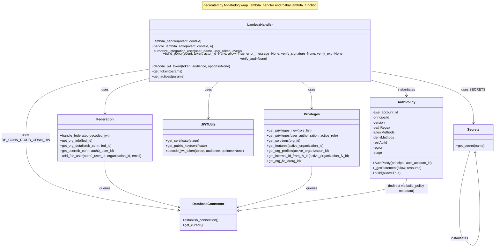

# Diagram: common/jwt_custom_authorizer/jwt_custom_authorizer/authorizer/api_gateway_authorizer.py

> Auto-generated by Obscura crawlers

## Mermaid

### SVG

<svg id="container" width="2327.3828125" xmlns="http://www.w3.org/2000/svg" class="classDiagram" height="1152.1500244140625" viewBox="0 0 2327.3828125 1152.1500244140625" role="graphics-document document" aria-roledescription="class"><g><defs><marker id="container_class-aggregationStart" class="marker aggregation class" refX="18" refY="7" markerWidth="190" markerHeight="240" orient="auto"><path d="M 18,7 L9,13 L1,7 L9,1 Z"></path></marker></defs><defs><marker id="container_class-aggregationEnd" class="marker aggregation class" refX="1" refY="7" markerWidth="20" markerHeight="28" orient="auto"><path d="M 18,7 L9,13 L1,7 L9,1 Z"></path></marker></defs><defs><marker id="container_class-extensionStart" class="marker extension class" refX="18" refY="7" markerWidth="190" markerHeight="240" orient="auto"><path d="M 1,7 L18,13 V 1 Z"></path></marker></defs><defs><marker id="container_class-extensionEnd" class="marker extension class" refX="1" refY="7" markerWidth="20" markerHeight="28" orient="auto"><path d="M 1,1 V 13 L18,7 Z"></path></marker></defs><defs><marker id="container_class-compositionStart" class="marker composition class" refX="18" refY="7" markerWidth="190" markerHeight="240" orient="auto"><path d="M 18,7 L9,13 L1,7 L9,1 Z"></path></marker></defs><defs><marker id="container_class-compositionEnd" class="marker composition class" refX="1" refY="7" markerWidth="20" markerHeight="28" orient="auto"><path d="M 18,7 L9,13 L1,7 L9,1 Z"></path></marker></defs><defs><marker id="container_class-dependencyStart" class="marker dependency class" refX="6" refY="7" markerWidth="190" markerHeight="240" orient="auto"><path d="M 5,7 L9,13 L1,7 L9,1 Z"></path></marker></defs><defs><marker id="container_class-dependencyEnd" class="marker dependency class" refX="13" refY="7" markerWidth="20" markerHeight="28" orient="auto"><path d="M 18,7 L9,13 L14,7 L9,1 Z"></path></marker></defs><defs><marker id="container_class-lollipopStart" class="marker lollipop class" refX="13" refY="7" markerWidth="190" markerHeight="240" orient="auto"><circle stroke="black" fill="transparent" cx="7" cy="7" r="6"></circle></marker></defs><defs><marker id="container_class-lollipopEnd" class="marker lollipop class" refX="1" refY="7" markerWidth="190" markerHeight="240" orient="auto"><circle stroke="black" fill="transparent" cx="7" cy="7" r="6"></circle></marker></defs><g class="root"><g class="clusters"></g><g class="edgePaths"><path d="M1213.604,44L1213.604,48.167C1213.604,52.333,1213.604,60.667,1213.604,69C1213.604,77.333,1213.604,85.667,1213.604,89.833L1213.604,94" id="edgeNote1" class="edge-thickness-normal edge-pattern-dotted relation" style="fill: none;;;fill: none" data-edge="true" data-et="edge" data-id="edgeNote1" data-points="W3sieCI6MTIxMy42MDM1MTU2MjUsInkiOjQ0fSx7IngiOjEyMTMuNjAzNTE1NjI1LCJ5Ijo2OX0seyJ4IjoxMjEzLjYwMzUxNTYyNSwieSI6OTR9XQ=="></path><path d="M1019.69,364L1010.832,370.167C1001.974,376.333,984.259,388.667,975.401,417.5C966.543,446.333,966.543,491.667,966.543,514.333L966.543,537" id="id_LambdaHandler_JWTUtils_1" class="edge-thickness-normal edge-pattern-solid relation" style=";;;" data-edge="true" data-et="edge" data-id="id_LambdaHandler_JWTUtils_1" data-points="W3sieCI6MTAxOS42ODk3MTQyOTg2OTE4LCJ5IjozNjR9LHsieCI6OTY2LjU0Mjk2ODc1LCJ5Ijo0MDF9LHsieCI6OTY2LjU0Mjk2ODc1LCJ5Ijo1NDN9XQ==" marker-end="url(#container_class-dependencyEnd)"></path><path d="M679.979,353.331L645.88,361.276C611.781,369.221,543.584,385.11,509.485,411.722C475.387,438.333,475.387,475.667,475.387,494.333L475.387,513" id="id_LambdaHandler_Federation_2" class="edge-thickness-normal edge-pattern-solid relation" style=";;;" data-edge="true" data-et="edge" data-id="id_LambdaHandler_Federation_2" data-points="W3sieCI6Njc5Ljk3ODUxNTYyNSwieSI6MzUzLjMzMTM2MjI2MTc4NDc2fSx7IngiOjQ3NS4zODY3MTg3NSwieSI6NDAxfSx7IngiOjQ3NS4zODY3MTg3NSwieSI6NTE5fV0=" marker-end="url(#container_class-dependencyEnd)"></path><path d="M1407.517,364L1416.375,370.167C1425.233,376.333,1442.948,388.667,1451.806,409.5C1460.664,430.333,1460.664,459.667,1460.664,474.333L1460.664,489" id="id_LambdaHandler_Privileges_3" class="edge-thickness-normal edge-pattern-solid relation" style=";;;" data-edge="true" data-et="edge" data-id="id_LambdaHandler_Privileges_3" data-points="W3sieCI6MTQwNy41MTczMTY5NTEzMDgyLCJ5IjozNjR9LHsieCI6MTQ2MC42NjQwNjI1LCJ5Ijo0MDF9LHsieCI6MTQ2MC42NjQwNjI1LCJ5Ijo0OTV9XQ==" marker-end="url(#container_class-dependencyEnd)"></path><path d="M679.979,312.257L585.181,327.048C490.384,341.838,300.79,371.419,205.993,424.376C111.195,477.333,111.195,553.667,111.195,632C111.195,710.333,111.195,790.667,230.606,848.114C350.017,905.562,588.839,940.124,708.25,957.406L827.661,974.687" id="id_LambdaHandler_DatabaseConnector_4" class="edge-thickness-normal edge-pattern-solid relation" style=";;;" data-edge="true" data-et="edge" data-id="id_LambdaHandler_DatabaseConnector_4" data-points="W3sieCI6Njc5Ljk3ODUxNTYyNSwieSI6MzEyLjI1NzI3MjM0MjMzMjk1fSx7IngiOjExMS4xOTUzMTI1LCJ5Ijo0MDF9LHsieCI6MTExLjE5NTMxMjUsInkiOjYzMH0seyJ4IjoxMTEuMTk1MzEyNSwieSI6ODcxfSx7IngiOjgzMy41OTk2MDkzNzUsInkiOjk3NS41NDU5NzEzNjUyMDE5fV0=" marker-end="url(#container_class-dependencyEnd)"></path><path d="M1747.229,319.578L1827.175,333.149C1907.122,346.719,2067.016,373.859,2146.963,414.096C2226.91,454.333,2226.91,507.667,2226.91,534.333L2226.91,561" id="id_LambdaHandler_Secrets_5" class="edge-thickness-normal edge-pattern-solid relation" style=";;;" data-edge="true" data-et="edge" data-id="id_LambdaHandler_Secrets_5" data-points="W3sieCI6MTc0Ny4yMjg1MTU2MjUsInkiOjMxOS41NzgyMDgzMzMyNTMwM30seyJ4IjoyMjI2LjkxMDE1NjI1LCJ5Ijo0MDF9LHsieCI6MjIyNi45MTAxNTYyNSwieSI6NTY3fV0=" marker-end="url(#container_class-dependencyEnd)"></path><path d="M1747.229,360.414L1774.696,367.179C1802.163,373.943,1857.097,387.471,1884.564,399.402C1912.031,411.333,1912.031,421.667,1912.031,426.833L1912.031,432" id="id_LambdaHandler_AuthPolicy_6" class="edge-thickness-normal edge-pattern-solid relation" style=";;;" data-edge="true" data-et="edge" data-id="id_LambdaHandler_AuthPolicy_6" data-points="W3sieCI6MTc0Ny4yMjg1MTU2MjUsInkiOjM2MC40MTQ0NTQ5MDAwOTY1fSx7IngiOjE5MTIuMDMxMjUsInkiOjQwMX0seyJ4IjoxOTEyLjAzMTI1LCJ5Ijo0Mzh9XQ==" marker-end="url(#container_class-dependencyEnd)"></path><path d="M475.387,741L475.387,762.667C475.387,784.333,475.387,827.667,534.119,864.117C592.852,900.567,710.316,930.133,769.049,944.916L827.781,959.7" id="id_Federation_DatabaseConnector_7" class="edge-thickness-normal edge-pattern-solid relation" style=";;;" data-edge="true" data-et="edge" data-id="id_Federation_DatabaseConnector_7" data-points="W3sieCI6NDc1LjM4NjcxODc1LCJ5Ijo3NDF9LHsieCI6NDc1LjM4NjcxODc1LCJ5Ijo4NzF9LHsieCI6ODMzLjU5OTYwOTM3NSwieSI6OTYxLjE2NDI1NDE5NTU1ODh9XQ==" marker-end="url(#container_class-dependencyEnd)"></path><path d="M1460.664,765L1460.664,782.667C1460.664,800.333,1460.664,835.667,1401.932,868.117C1343.199,900.567,1225.734,930.133,1167.002,944.916L1108.27,959.7" id="id_Privileges_DatabaseConnector_8" class="edge-thickness-normal edge-pattern-solid relation" style=";;;" data-edge="true" data-et="edge" data-id="id_Privileges_DatabaseConnector_8" data-points="W3sieCI6MTQ2MC42NjQwNjI1LCJ5Ijo3NjV9LHsieCI6MTQ2MC42NjQwNjI1LCJ5Ijo4NzF9LHsieCI6MTEwMi40NTExNzE4NzUsInkiOjk2MS4xNjQyNTQxOTU1NTg4fV0=" marker-end="url(#container_class-dependencyEnd)"></path><path d="M2209.866,693L2201.84,722.667C2193.813,752.333,2177.761,811.667,2169.735,861.992C2161.709,912.317,2161.709,953.633,2161.709,974.292L2161.709,994.95" id="Secrets-cyclic-special-1" class="edge-thickness-normal edge-pattern-solid relation" style=";;;" data-edge="true" data-et="edge" data-id="Secrets-cyclic-special-1" data-points="W3sieCI6MjIwOS44NjU3NjQzOTMyNTEsInkiOjY5M30seyJ4IjoyMTYxLjcwODU5Mzc1MDM3MjUsInkiOjg3MX0seyJ4IjoyMTYxLjcwODU5Mzc1MDM3MjUsInkiOjk5NC45NDk5OTk5OTkyNTQ5fV0="></path><path d="M2161.709,995.05L2161.709,1013.708C2161.709,1032.367,2161.709,1069.683,2172.567,1094.512C2183.426,1119.341,2205.143,1131.681,2216.002,1137.851L2226.86,1144.022" id="Secrets-cyclic-special-mid" class="edge-thickness-normal edge-pattern-solid relation" style=";;;" data-edge="true" data-et="edge" data-id="Secrets-cyclic-special-mid" data-points="W3sieCI6MjE2MS43MDg1OTM3NTAzNzI1LCJ5Ijo5OTUuMDUwMDAwMDAwNzQ1MX0seyJ4IjoyMTYxLjcwODU5Mzc1MDM3MjUsInkiOjExMDd9LHsieCI6MjIyNi44NjAxNTYyNDkyNTUsInkiOjExNDQuMDIxNTg4MTA0NTE3MX1d"></path><path d="M2226.953,1144L2232.188,1137.833C2237.424,1131.667,2247.896,1119.333,2253.131,1094.5C2258.367,1069.667,2258.367,1032.333,2258.367,993C2258.367,953.667,2258.367,912.333,2254.624,862.992C2250.881,813.65,2243.396,756.3,2239.653,727.625L2235.91,698.95" id="Secrets-cyclic-special-2" class="edge-thickness-normal edge-pattern-solid relation" style=";;;" data-edge="true" data-et="edge" data-id="Secrets-cyclic-special-2" data-points="W3sieCI6MjIyNi45NTI2MDgzODQ1NzIsInkiOjExNDR9LHsieCI6MjI1OC4zNjcxODc1LCJ5IjoxMTA3fSx7IngiOjIyNTguMzY3MTg3NSwieSI6OTk1fSx7IngiOjIyNTguMzY3MTg3NSwieSI6ODcxfSx7IngiOjIyMzUuMTMzMzYzNTg5MjExNSwieSI6NjkzfV0=" marker-end="url(#container_class-dependencyEnd)"></path><path d="M1912.031,822L1912.031,830.167C1912.031,838.333,1912.031,854.667,1778.093,880.427C1644.154,906.187,1376.277,941.374,1242.339,958.968L1108.4,976.561" id="id_AuthPolicy_DatabaseConnector_10" class="edge-thickness-normal edge-pattern-solid relation" style=";;;" data-edge="true" data-et="edge" data-id="id_AuthPolicy_DatabaseConnector_10" data-points="W3sieCI6MTkxMi4wMzEyNSwieSI6ODIyfSx7IngiOjE5MTIuMDMxMjUsInkiOjg3MX0seyJ4IjoxMTAyLjQ1MTE3MTg3NSwieSI6OTc3LjM0MjQ4NTc5MTMxMDh9XQ==" marker-end="url(#container_class-dependencyEnd)"></path></g><g class="edgeLabels"><g class="edgeLabel"><g class="label" data-id="edgeNote1" transform="translate(0, 0)"><foreignObject width="0" height="0">

</foreignObject></g></g><g class="edgeLabel" transform="translate(966.54296875, 401)"><g class="label" data-id="id_LambdaHandler_JWTUtils_1" transform="translate(-16.4921875, -12)"><foreignObject width="32.984375" height="24">

uses

</foreignObject></g></g><g class="edgeLabel" transform="translate(475.38671875, 401)"><g class="label" data-id="id_LambdaHandler_Federation_2" transform="translate(-16.4921875, -12)"><foreignObject width="32.984375" height="24">

uses

</foreignObject></g></g><g class="edgeLabel" transform="translate(1460.6640625, 401)"><g class="label" data-id="id_LambdaHandler_Privileges_3" transform="translate(-16.4921875, -12)"><foreignObject width="32.984375" height="24">

uses

</foreignObject></g></g><g class="edgeLabel" transform="translate(111.1953125, 630)"><g class="label" data-id="id_LambdaHandler_DatabaseConnector_4" transform="translate(-103.1953125, -24)"><foreignObject width="206.390625" height="48">

uses DB_CONN_RO/DB_CONN_RW

</foreignObject></g></g><g class="edgeLabel" transform="translate(2226.91015625, 401)"><g class="label" data-id="id_LambdaHandler_Secrets_5" transform="translate(-49.09375, -12)"><foreignObject width="98.1875" height="24">

uses SECRETS

</foreignObject></g></g><g class="edgeLabel" transform="translate(1912.03125, 401)"><g class="label" data-id="id_LambdaHandler_AuthPolicy_6" transform="translate(-42.9140625, -12)"><foreignObject width="85.828125" height="24">

instantiates

</foreignObject></g></g><g class="edgeLabel" transform="translate(475.38671875, 871)"><g class="label" data-id="id_Federation_DatabaseConnector_7" transform="translate(-27.2421875, -12)"><foreignObject width="54.484375" height="24">

queries

</foreignObject></g></g><g class="edgeLabel" transform="translate(1460.6640625, 871)"><g class="label" data-id="id_Privileges_DatabaseConnector_8" transform="translate(-27.2421875, -12)"><foreignObject width="54.484375" height="24">

queries

</foreignObject></g></g><g class="edgeLabel"><g class="label" data-id="Secrets-cyclic-special-1" transform="translate(0, 0)"><foreignObject width="0" height="0">

</foreignObject></g></g><g class="edgeLabel" transform="translate(2161.7085937503725, 1107)"><g class="label" data-id="Secrets-cyclic-special-mid" transform="translate(-42.9140625, -12)"><foreignObject width="85.828125" height="24">

instantiates

</foreignObject></g></g><g class="edgeLabel"><g class="label" data-id="Secrets-cyclic-special-2" transform="translate(0, 0)"><foreignObject width="0" height="0">

</foreignObject></g></g><g class="edgeLabel" transform="translate(1912.03125, 871)"><g class="label" data-id="id_AuthPolicy_DatabaseConnector_10" transform="translate(-100, -24)"><foreignObject width="200" height="48">

(indirect via build_policy metadata)

</foreignObject></g></g></g><g class="nodes"><g class="node default" id="classId-LambdaHandler-0" transform="translate(1213.603515625, 229)"><g class="basic label-container"><path d="M-533.625 -135 L533.625 -135 L533.625 135 L-533.625 135" stroke="none" stroke-width="0" fill="#ECECFF" style=""></path><path d="M-533.625 -135 C-192.09535544060998 -135, 149.43428911878004 -135, 533.625 -135 M-533.625 -135 C-247.62987246617973 -135, 38.36525506764053 -135, 533.625 -135 M533.625 -135 C533.625 -46.058919874658585, 533.625 42.88216025068283, 533.625 135 M533.625 -135 C533.625 -80.42502815078208, 533.625 -25.850056301564152, 533.625 135 M533.625 135 C110.04090075008742 135, -313.54319849982517 135, -533.625 135 M533.625 135 C264.13763617137215 135, -5.349727657255698 135, -533.625 135 M-533.625 135 C-533.625 58.0544816824967, -533.625 -18.8910366350066, -533.625 -135 M-533.625 135 C-533.625 32.198678748607534, -533.625 -70.60264250278493, -533.625 -135" stroke="#9370DB" stroke-width="1.3" fill="none" stroke-dasharray="0 0" style=""></path></g><g class="annotation-group text" transform="translate(0, -111)"></g><g class="label-group text" transform="translate(-58.21875, -111)"><g class="label" style="font-weight: bolder" transform="translate(0,-12)"><foreignObject width="116.4375" height="24">

LambdaHandler

</foreignObject></g></g><g class="members-group text" transform="translate(-521.625, -63)"></g><g class="methods-group text" transform="translate(-521.625, -33)"><g class="label" style="" transform="translate(0,-12)"><foreignObject width="240.1875" height="24">

+lambda_handler(event, context)

</foreignObject></g><g class="label" style="" transform="translate(0,12)"><foreignObject width="294.5" height="24">

+handle_lambda_error(event, context, e)

</foreignObject></g><g class="label" style="" transform="translate(0,36)"><foreignObject width="429.390625" height="24">

+authorize_integration_user(user_name, user_token, event)

</foreignObject></g><g class="label" style="" transform="translate(0,60)"><foreignObject width="985.03125" height="24">

+build_policy(event, token, actor_id=None, allow=True, error_message=None, verify_signature=None, verify_exp=None, verify_aud=None)

</foreignObject></g><g class="label" style="" transform="translate(0,84)"><foreignObject width="375.890625" height="24">

+decode_jwt_token(token, audience, options=None)

</foreignObject></g><g class="label" style="" transform="translate(0,108)"><foreignObject width="143.5" height="24">

+get_token(params)

</foreignObject></g><g class="label" style="" transform="translate(0,132)"><foreignObject width="153.109375" height="24">

+get_actives(params)

</foreignObject></g></g><g class="divider" style=""><path d="M-533.625 -87 C-312.42408342843027 -87, -91.22316685686053 -87, 533.625 -87 M-533.625 -87 C-255.30505888972948 -87, 23.01488222054104 -87, 533.625 -87" stroke="#9370DB" stroke-width="1.3" fill="none" stroke-dasharray="0 0" style=""></path></g><g class="divider" style=""><path d="M-533.625 -63 C-137.99381308461375 -63, 257.6373738307725 -63, 533.625 -63 M-533.625 -63 C-265.30377201616903 -63, 3.017455967661931 -63, 533.625 -63" stroke="#9370DB" stroke-width="1.3" fill="none" stroke-dasharray="0 0" style=""></path></g></g><g class="node default" id="classId-AuthPolicy-1" transform="translate(1912.03125, 630)"><g class="basic label-container"><path d="M-172.40625 -192 L172.40625 -192 L172.40625 192 L-172.40625 192" stroke="none" stroke-width="0" fill="#ECECFF" style=""></path><path d="M-172.40625 -192 C-67.03180949424984 -192, 38.342631011500316 -192, 172.40625 -192 M-172.40625 -192 C-97.82339899508207 -192, -23.240547990164146 -192, 172.40625 -192 M172.40625 -192 C172.40625 -89.16036606903148, 172.40625 13.679267861937035, 172.40625 192 M172.40625 -192 C172.40625 -106.2791099335112, 172.40625 -20.558219867022387, 172.40625 192 M172.40625 192 C78.75699713716047 192, -14.892255725679064 192, -172.40625 192 M172.40625 192 C43.520824668991395 192, -85.36460066201721 192, -172.40625 192 M-172.40625 192 C-172.40625 45.7233840942626, -172.40625 -100.5532318114748, -172.40625 -192 M-172.40625 192 C-172.40625 54.17108435306574, -172.40625 -83.65783129386853, -172.40625 -192" stroke="#9370DB" stroke-width="1.3" fill="none" stroke-dasharray="0 0" style=""></path></g><g class="annotation-group text" transform="translate(0, -168)"></g><g class="label-group text" transform="translate(-38.84375, -168)"><g class="label" style="font-weight: bolder" transform="translate(0,-12)"><foreignObject width="77.6875" height="24">

AuthPolicy

</foreignObject></g></g><g class="members-group text" transform="translate(-160.40625, -120)"><g class="label" style="" transform="translate(0,-12)"><foreignObject width="121.03125" height="24">

-aws_account_id

</foreignObject></g><g class="label" style="" transform="translate(0,12)"><foreignObject width="85.046875" height="24">

-principalId

</foreignObject></g><g class="label" style="" transform="translate(0,36)"><foreignObject width="59.46875" height="24">

-version

</foreignObject></g><g class="label" style="" transform="translate(0,60)"><foreignObject width="82.21875" height="24">

-pathRegex

</foreignObject></g><g class="label" style="" transform="translate(0,84)"><foreignObject width="107.578125" height="24">

-allowMethods

</foreignObject></g><g class="label" style="" transform="translate(0,108)"><foreignObject width="104.578125" height="24">

-denyMethods

</foreignObject></g><g class="label" style="" transform="translate(0,132)"><foreignObject width="71.59375" height="24">

-restApiId

</foreignObject></g><g class="label" style="" transform="translate(0,156)"><foreignObject width="52.421875" height="24">

-region

</foreignObject></g><g class="label" style="" transform="translate(0,180)"><foreignObject width="44.921875" height="24">

-stage

</foreignObject></g></g><g class="methods-group text" transform="translate(-160.40625, 120)"><g class="label" style="" transform="translate(0,-12)"><foreignObject width="281.96875" height="24">

+AuthPolicy(principal, aws_account_id)

</foreignObject></g><g class="label" style="" transform="translate(0,12)"><foreignObject width="231.734375" height="24">

+_getStatement(allow, resource)

</foreignObject></g><g class="label" style="" transform="translate(0,36)"><foreignObject width="134.515625" height="24">

+build(allow=True)

</foreignObject></g></g><g class="divider" style=""><path d="M-172.40625 -144 C-37.87051169575693 -144, 96.66522660848614 -144, 172.40625 -144 M-172.40625 -144 C-60.071784605743844 -144, 52.26268078851231 -144, 172.40625 -144" stroke="#9370DB" stroke-width="1.3" fill="none" stroke-dasharray="0 0" style=""></path></g><g class="divider" style=""><path d="M-172.40625 96 C-99.90071106980412 96, -27.395172139608235 96, 172.40625 96 M-172.40625 96 C-81.33989509739865 96, 9.726459805202694 96, 172.40625 96" stroke="#9370DB" stroke-width="1.3" fill="none" stroke-dasharray="0 0" style=""></path></g></g><g class="node default" id="classId-DatabaseConnector-2" transform="translate(968.025390625, 995)"><g class="basic label-container"><path d="M-134.42578125 -75 L134.42578125 -75 L134.42578125 75 L-134.42578125 75" stroke="none" stroke-width="0" fill="#ECECFF" style=""></path><path d="M-134.42578125 -75 C-71.66243998927722 -75, -8.899098728554435 -75, 134.42578125 -75 M-134.42578125 -75 C-70.45434825504354 -75, -6.482915260087083 -75, 134.42578125 -75 M134.42578125 -75 C134.42578125 -41.42345147279104, 134.42578125 -7.846902945582073, 134.42578125 75 M134.42578125 -75 C134.42578125 -37.946266117890914, 134.42578125 -0.8925322357818288, 134.42578125 75 M134.42578125 75 C52.465305444712726 75, -29.495170360574548 75, -134.42578125 75 M134.42578125 75 C61.554637611059135 75, -11.31650602788173 75, -134.42578125 75 M-134.42578125 75 C-134.42578125 38.627899646560394, -134.42578125 2.2557992931207878, -134.42578125 -75 M-134.42578125 75 C-134.42578125 21.847937655387703, -134.42578125 -31.304124689224594, -134.42578125 -75" stroke="#9370DB" stroke-width="1.3" fill="none" stroke-dasharray="0 0" style=""></path></g><g class="annotation-group text" transform="translate(0, -51)"></g><g class="label-group text" transform="translate(-71.5859375, -51)"><g class="label" style="font-weight: bolder" transform="translate(0,-12)"><foreignObject width="143.171875" height="24">

DatabaseConnector

</foreignObject></g></g><g class="members-group text" transform="translate(-122.42578125, -3)"></g><g class="methods-group text" transform="translate(-122.42578125, 27)"><g class="label" style="" transform="translate(0,-12)"><foreignObject width="173.265625" height="24">

+establish_connection()

</foreignObject></g><g class="label" style="" transform="translate(0,12)"><foreignObject width="94.640625" height="24">

+get_cursor()

</foreignObject></g></g><g class="divider" style=""><path d="M-134.42578125 -27 C-71.2867469188387 -27, -8.147712587677418 -27, 134.42578125 -27 M-134.42578125 -27 C-78.87993554511138 -27, -23.334089840222745 -27, 134.42578125 -27" stroke="#9370DB" stroke-width="1.3" fill="none" stroke-dasharray="0 0" style=""></path></g><g class="divider" style=""><path d="M-134.42578125 -3 C-34.05432393010096 -3, 66.31713338979807 -3, 134.42578125 -3 M-134.42578125 -3 C-38.76124549090363 -3, 56.903290268192734 -3, 134.42578125 -3" stroke="#9370DB" stroke-width="1.3" fill="none" stroke-dasharray="0 0" style=""></path></g></g><g class="node default" id="classId-Secrets-3" transform="translate(2226.91015625, 630)"><g class="basic label-container"><path d="M-92.47265625 -63 L92.47265625 -63 L92.47265625 63 L-92.47265625 63" stroke="none" stroke-width="0" fill="#ECECFF" style=""></path><path d="M-92.47265625 -63 C-19.546470599146502 -63, 53.379715051706995 -63, 92.47265625 -63 M-92.47265625 -63 C-46.78914362615841 -63, -1.1056310023168265 -63, 92.47265625 -63 M92.47265625 -63 C92.47265625 -28.415926954552695, 92.47265625 6.168146090894609, 92.47265625 63 M92.47265625 -63 C92.47265625 -27.55118466748838, 92.47265625 7.897630665023243, 92.47265625 63 M92.47265625 63 C37.54950770520614 63, -17.373640839587722 63, -92.47265625 63 M92.47265625 63 C19.15237598489722 63, -54.16790428020556 63, -92.47265625 63 M-92.47265625 63 C-92.47265625 32.91545099816207, -92.47265625 2.830901996324137, -92.47265625 -63 M-92.47265625 63 C-92.47265625 33.61177238257656, -92.47265625 4.223544765153122, -92.47265625 -63" stroke="#9370DB" stroke-width="1.3" fill="none" stroke-dasharray="0 0" style=""></path></g><g class="annotation-group text" transform="translate(0, -39)"></g><g class="label-group text" transform="translate(-27.1640625, -39)"><g class="label" style="font-weight: bolder" transform="translate(0,-12)"><foreignObject width="54.328125" height="24">

Secrets

</foreignObject></g></g><g class="members-group text" transform="translate(-80.47265625, 9)"></g><g class="methods-group text" transform="translate(-80.47265625, 39)"><g class="label" style="" transform="translate(0,-12)"><foreignObject width="133.78125" height="24">

+get_secret(name)

</foreignObject></g></g><g class="divider" style=""><path d="M-92.47265625 -15 C-41.16978247675199 -15, 10.13309129649602 -15, 92.47265625 -15 M-92.47265625 -15 C-53.963846910772 -15, -15.455037571543997 -15, 92.47265625 -15" stroke="#9370DB" stroke-width="1.3" fill="none" stroke-dasharray="0 0" style=""></path></g><g class="divider" style=""><path d="M-92.47265625 9 C-19.41882636344448 9, 53.63500352311104 9, 92.47265625 9 M-92.47265625 9 C-53.47569692021989 9, -14.478737590439778 9, 92.47265625 9" stroke="#9370DB" stroke-width="1.3" fill="none" stroke-dasharray="0 0" style=""></path></g></g><g class="node default" id="classId-JWTUtils-4" transform="translate(966.54296875, 630)"><g class="basic label-container"><path d="M-215.16015625 -87 L215.16015625 -87 L215.16015625 87 L-215.16015625 87" stroke="none" stroke-width="0" fill="#ECECFF" style=""></path><path d="M-215.16015625 -87 C-120.6072192326083 -87, -26.054282215216602 -87, 215.16015625 -87 M-215.16015625 -87 C-96.46874586290188 -87, 22.222664524196233 -87, 215.16015625 -87 M215.16015625 -87 C215.16015625 -39.057414295851935, 215.16015625 8.88517140829613, 215.16015625 87 M215.16015625 -87 C215.16015625 -27.71180930904095, 215.16015625 31.576381381918097, 215.16015625 87 M215.16015625 87 C114.37530796934404 87, 13.590459688688071 87, -215.16015625 87 M215.16015625 87 C79.08030422858434 87, -56.99954779283132 87, -215.16015625 87 M-215.16015625 87 C-215.16015625 47.31240562400851, -215.16015625 7.624811248017025, -215.16015625 -87 M-215.16015625 87 C-215.16015625 29.155951988216998, -215.16015625 -28.688096023566004, -215.16015625 -87" stroke="#9370DB" stroke-width="1.3" fill="none" stroke-dasharray="0 0" style=""></path></g><g class="annotation-group text" transform="translate(0, -63)"></g><g class="label-group text" transform="translate(-30.4296875, -63)"><g class="label" style="font-weight: bolder" transform="translate(0,-12)"><foreignObject width="60.859375" height="24">

JWTUtils

</foreignObject></g></g><g class="members-group text" transform="translate(-203.16015625, -15)"></g><g class="methods-group text" transform="translate(-203.16015625, 15)"><g class="label" style="" transform="translate(0,-12)"><foreignObject width="159.546875" height="24">

+get_certificate(stage)

</foreignObject></g><g class="label" style="" transform="translate(0,12)"><foreignObject width="199.46875" height="24">

+get_public_key(certificate)

</foreignObject></g><g class="label" style="" transform="translate(0,36)"><foreignObject width="375.890625" height="24">

+decode_jwt_token(token, audience, options=None)

</foreignObject></g></g><g class="divider" style=""><path d="M-215.16015625 -39 C-121.76843631341146 -39, -28.376716376822912 -39, 215.16015625 -39 M-215.16015625 -39 C-83.92736045402438 -39, 47.30543534195124 -39, 215.16015625 -39" stroke="#9370DB" stroke-width="1.3" fill="none" stroke-dasharray="0 0" style=""></path></g><g class="divider" style=""><path d="M-215.16015625 -15 C-124.97149299260604 -15, -34.78282973521209 -15, 215.16015625 -15 M-215.16015625 -15 C-52.353552135244826 -15, 110.45305197951035 -15, 215.16015625 -15" stroke="#9370DB" stroke-width="1.3" fill="none" stroke-dasharray="0 0" style=""></path></g></g><g class="node default" id="classId-Federation-5" transform="translate(475.38671875, 630)"><g class="basic label-container"><path d="M-225.99609375 -111 L225.99609375 -111 L225.99609375 111 L-225.99609375 111" stroke="none" stroke-width="0" fill="#ECECFF" style=""></path><path d="M-225.99609375 -111 C-111.21070061999656 -111, 3.5746925100068836 -111, 225.99609375 -111 M-225.99609375 -111 C-132.43445588925522 -111, -38.87281802851041 -111, 225.99609375 -111 M225.99609375 -111 C225.99609375 -62.55337268148625, 225.99609375 -14.106745362972504, 225.99609375 111 M225.99609375 -111 C225.99609375 -23.416799876670353, 225.99609375 64.1664002466593, 225.99609375 111 M225.99609375 111 C66.83786996750436 111, -92.32035381499128 111, -225.99609375 111 M225.99609375 111 C116.21288124507495 111, 6.429668740149907 111, -225.99609375 111 M-225.99609375 111 C-225.99609375 36.49984630973239, -225.99609375 -38.00030738053522, -225.99609375 -111 M-225.99609375 111 C-225.99609375 62.81333588795653, -225.99609375 14.626671775913053, -225.99609375 -111" stroke="#9370DB" stroke-width="1.3" fill="none" stroke-dasharray="0 0" style=""></path></g><g class="annotation-group text" transform="translate(0, -87)"></g><g class="label-group text" transform="translate(-39.1953125, -87)"><g class="label" style="font-weight: bolder" transform="translate(0,-12)"><foreignObject width="78.390625" height="24">

Federation

</foreignObject></g></g><g class="members-group text" transform="translate(-213.99609375, -39)"></g><g class="methods-group text" transform="translate(-213.99609375, -9)"><g class="label" style="" transform="translate(0,-12)"><foreignObject width="240.1875" height="24">

+handle_federated(decoded_jwt)

</foreignObject></g><g class="label" style="" transform="translate(0,12)"><foreignObject width="155.21875" height="24">

+get_org_info(fed_id)

</foreignObject></g><g class="label" style="" transform="translate(0,36)"><foreignObject width="246.0625" height="24">

+get_org_details(db_conn, fed_id)

</foreignObject></g><g class="label" style="" transform="translate(0,60)"><foreignObject width="253.265625" height="24">

+get_user(db_conn, auth0_user_id)

</foreignObject></g><g class="label" style="" transform="translate(0,84)"><foreignObject width="388.796875" height="24">

+add_fed_user(auth0_user_id, organization_id, email)

</foreignObject></g></g><g class="divider" style=""><path d="M-225.99609375 -63 C-106.44719281641558 -63, 13.10170811716884 -63, 225.99609375 -63 M-225.99609375 -63 C-123.59246721830691 -63, -21.188840686613815 -63, 225.99609375 -63" stroke="#9370DB" stroke-width="1.3" fill="none" stroke-dasharray="0 0" style=""></path></g><g class="divider" style=""><path d="M-225.99609375 -39 C-51.58829885931172 -39, 122.81949603137656 -39, 225.99609375 -39 M-225.99609375 -39 C-65.55138903446891 -39, 94.89331568106218 -39, 225.99609375 -39" stroke="#9370DB" stroke-width="1.3" fill="none" stroke-dasharray="0 0" style=""></path></g></g><g class="node default" id="classId-Privileges-6" transform="translate(1460.6640625, 630)"><g class="basic label-container"><path d="M-228.9609375 -135 L228.9609375 -135 L228.9609375 135 L-228.9609375 135" stroke="none" stroke-width="0" fill="#ECECFF" style=""></path><path d="M-228.9609375 -135 C-92.27383732855247 -135, 44.41326284289505 -135, 228.9609375 -135 M-228.9609375 -135 C-89.78273850776739 -135, 49.39546048446522 -135, 228.9609375 -135 M228.9609375 -135 C228.9609375 -41.498746007006275, 228.9609375 52.00250798598745, 228.9609375 135 M228.9609375 -135 C228.9609375 -79.2846279466207, 228.9609375 -23.569255893241404, 228.9609375 135 M228.9609375 135 C126.04932982075144 135, 23.137722141502877 135, -228.9609375 135 M228.9609375 135 C80.47846545772751 135, -68.00400658454498 135, -228.9609375 135 M-228.9609375 135 C-228.9609375 54.31789180634699, -228.9609375 -26.364216387306016, -228.9609375 -135 M-228.9609375 135 C-228.9609375 32.794233025542155, -228.9609375 -69.41153394891569, -228.9609375 -135" stroke="#9370DB" stroke-width="1.3" fill="none" stroke-dasharray="0 0" style=""></path></g><g class="annotation-group text" transform="translate(0, -111)"></g><g class="label-group text" transform="translate(-35.734375, -111)"><g class="label" style="font-weight: bolder" transform="translate(0,-12)"><foreignObject width="71.46875" height="24">

Privileges

</foreignObject></g></g><g class="members-group text" transform="translate(-216.9609375, -63)"></g><g class="methods-group text" transform="translate(-216.9609375, -33)"><g class="label" style="" transform="translate(0,-12)"><foreignObject width="215.625" height="24">

+get_privileges_new(role_list)

</foreignObject></g><g class="label" style="" transform="translate(0,12)"><foreignObject width="343.078125" height="24">

+get_privileges(user_authorization, active_role)

</foreignObject></g><g class="label" style="" transform="translate(0,36)"><foreignObject width="162.59375" height="24">

+get_solutions(org_id)

</foreignObject></g><g class="label" style="" transform="translate(0,60)"><foreignObject width="271.953125" height="24">

+get_features(active_organization_id)

</foreignObject></g><g class="label" style="" transform="translate(0,84)"><foreignObject width="299.046875" height="24">

+get_org_profiles(active_organization_id)

</foreignObject></g><g class="label" style="" transform="translate(0,108)"><foreignObject width="398.1875" height="24">

+get_internal_id_from_fv_id(active_organization_fv_id)

</foreignObject></g><g class="label" style="" transform="translate(0,132)"><foreignObject width="161.796875" height="24">

+get_org_fv_id(org_id)

</foreignObject></g></g><g class="divider" style=""><path d="M-228.9609375 -87 C-93.68947114700794 -87, 41.58199520598413 -87, 228.9609375 -87 M-228.9609375 -87 C-89.03033202320265 -87, 50.90027345359471 -87, 228.9609375 -87" stroke="#9370DB" stroke-width="1.3" fill="none" stroke-dasharray="0 0" style=""></path></g><g class="divider" style=""><path d="M-228.9609375 -63 C-76.87471937143926 -63, 75.21149875712149 -63, 228.9609375 -63 M-228.9609375 -63 C-59.067734862227695 -63, 110.82546777554461 -63, 228.9609375 -63" stroke="#9370DB" stroke-width="1.3" fill="none" stroke-dasharray="0 0" style=""></path></g></g><g class="node undefined" id="note0" transform="translate(1213.603515625, 26)"><g class="basic label-container"><path d="M-282.09375 -18 L282.09375 -18 L282.09375 18 L-282.09375 18" stroke="none" stroke-width="0" fill="#fff5ad" style="fill:#fff5ad !important;stroke:#aaaa33 !important"></path><path d="M-282.09375 -18 C-72.32443972064561 -18, 137.44487055870877 -18, 282.09375 -18 M-282.09375 -18 C-129.81821059522764 -18, 22.45732880954472 -18, 282.09375 -18 M282.09375 -18 C282.09375 -9.540858641055983, 282.09375 -1.081717282111967, 282.09375 18 M282.09375 -18 C282.09375 -10.396610878430197, 282.09375 -2.793221756860394, 282.09375 18 M282.09375 18 C83.11438533466634 18, -115.86497933066732 18, -282.09375 18 M282.09375 18 C154.77898479495195 18, 27.464219589903877 18, -282.09375 18 M-282.09375 18 C-282.09375 8.420921647432172, -282.09375 -1.1581567051356565, -282.09375 -18 M-282.09375 18 C-282.09375 7.202148230102921, -282.09375 -3.595703539794158, -282.09375 -18" stroke="#aaaa33" stroke-width="1.3" fill="none" stroke-dasharray="0 0" style="fill:#fff5ad !important;stroke:#aaaa33 !important"></path></g><g class="label" style="text-align:left !important;white-space:nowrap !important" transform="translate(-276.09375, -12)"><rect></rect><foreignObject width="552.1875" height="24">

decorated by fv.datadog.wrap_lambda_handler and rollbar.lambda_function

</foreignObject></g></g><g class="label edgeLabel" id="Secrets---Secrets---1" transform="translate(2161.7085937503725, 995)"><rect width="0.1" height="0.1"></rect><g class="label" style="" transform="translate(0, 0)"><rect></rect><foreignObject width="0" height="0">

</foreignObject></g></g><g class="label edgeLabel" id="Secrets---Secrets---2" transform="translate(2226.91015625, 1144.050000000745)"><rect width="0.1" height="0.1"></rect><g class="label" style="" transform="translate(0, 0)"><rect></rect><foreignObject width="0" height="0">

</foreignObject></g></g></g></g></g></svg>
