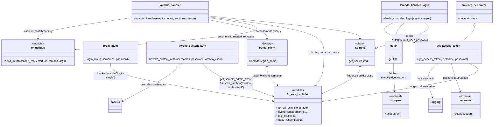

# Diagram: common/jwt_custom_authorizer/jwt_custom_authorizer/login_load_test/login_load_test.py

> Auto-generated by Obscura crawlers

## Mermaid

### SVG

<svg id="container" width="2898.86328125" xmlns="http://www.w3.org/2000/svg" class="classDiagram" height="734" viewBox="0 0 2898.86328125 734" role="graphics-document document" aria-roledescription="class"><g><defs><marker id="container_class-aggregationStart" class="marker aggregation class" refX="18" refY="7" markerWidth="190" markerHeight="240" orient="auto"><path d="M 18,7 L9,13 L1,7 L9,1 Z"></path></marker></defs><defs><marker id="container_class-aggregationEnd" class="marker aggregation class" refX="1" refY="7" markerWidth="20" markerHeight="28" orient="auto"><path d="M 18,7 L9,13 L1,7 L9,1 Z"></path></marker></defs><defs><marker id="container_class-extensionStart" class="marker extension class" refX="18" refY="7" markerWidth="190" markerHeight="240" orient="auto"><path d="M 1,7 L18,13 V 1 Z"></path></marker></defs><defs><marker id="container_class-extensionEnd" class="marker extension class" refX="1" refY="7" markerWidth="20" markerHeight="28" orient="auto"><path d="M 1,1 V 13 L18,7 Z"></path></marker></defs><defs><marker id="container_class-compositionStart" class="marker composition class" refX="18" refY="7" markerWidth="190" markerHeight="240" orient="auto"><path d="M 18,7 L9,13 L1,7 L9,1 Z"></path></marker></defs><defs><marker id="container_class-compositionEnd" class="marker composition class" refX="1" refY="7" markerWidth="20" markerHeight="28" orient="auto"><path d="M 18,7 L9,13 L1,7 L9,1 Z"></path></marker></defs><defs><marker id="container_class-dependencyStart" class="marker dependency class" refX="6" refY="7" markerWidth="190" markerHeight="240" orient="auto"><path d="M 5,7 L9,13 L1,7 L9,1 Z"></path></marker></defs><defs><marker id="container_class-dependencyEnd" class="marker dependency class" refX="13" refY="7" markerWidth="20" markerHeight="28" orient="auto"><path d="M 18,7 L9,13 L14,7 L9,1 Z"></path></marker></defs><defs><marker id="container_class-lollipopStart" class="marker lollipop class" refX="13" refY="7" markerWidth="190" markerHeight="240" orient="auto"><circle stroke="black" fill="transparent" cx="7" cy="7" r="6"></circle></marker></defs><defs><marker id="container_class-lollipopEnd" class="marker lollipop class" refX="1" refY="7" markerWidth="190" markerHeight="240" orient="auto"><circle stroke="black" fill="transparent" cx="7" cy="7" r="6"></circle></marker></defs><g class="root"><g class="clusters"></g><g class="edgePaths"><path d="M2784.391,151.25L2784.391,156.542C2784.391,161.833,2784.391,172.417,2772.086,187.875C2759.781,203.333,2735.172,223.667,2722.867,233.833L2710.563,244" id="id_timeout_decorator_get_access_token_1" class="edge-thickness-normal edge-pattern-solid relation" style=";;;" data-edge="true" data-et="edge" data-id="id_timeout_decorator_get_access_token_1" data-points="W3sieCI6Mjc4NC4zOTA2MjUsInkiOjEzNH0seyJ4IjoyNzg0LjM5MDYyNSwieSI6MTgzfSx7IngiOjI3MTAuNTYyODMwNzcxMTY5NSwieSI6MjQ0fV0=" marker-start="url(#container_class-extensionStart)"></path><path d="M2758.677,370L2782.694,382.167C2806.711,394.333,2854.745,418.667,2710.13,455.966C2565.514,493.265,2228.249,543.529,2059.616,568.662L1890.983,593.794" id="id_get_access_token_fv_aws_lambdas_2" class="edge-thickness-normal edge-pattern-solid relation" style=";;;" data-edge="true" data-et="edge" data-id="id_get_access_token_fv_aws_lambdas_2" data-points="W3sieCI6Mjc1OC42NzY4NDM5Nzk3NzkzLCJ5IjozNzB9LHsieCI6MjkwMi43NzkyOTY4NzUsInkiOjQ0M30seyJ4IjoxODg1LjA0ODgyODEyNSwieSI6NTk0LjY3ODY4MTMxMTI0MjR9XQ==" marker-end="url(#container_class-dependencyEnd)"></path><path d="M2652.35,370L2655.833,382.167C2659.316,394.333,2666.282,418.667,2675.065,446.056C2683.847,473.445,2694.446,503.889,2699.746,519.111L2705.045,534.334" id="id_get_access_token_requests_3" class="edge-thickness-normal edge-pattern-solid relation" style=";;;" data-edge="true" data-et="edge" data-id="id_get_access_token_requests_3" data-points="W3sieCI6MjY1Mi4zNDk4Njc4NzY4MzgzLCJ5IjozNzB9LHsieCI6MjY3My4yNDgwNDY4NzUsInkiOjQ0M30seyJ4IjoyNzA3LjAxODA2NjQwNjI1LCJ5Ijo1NDB9XQ==" marker-end="url(#container_class-dependencyEnd)"></path><path d="M2570.752,370L2558.476,382.167C2546.201,394.333,2521.65,418.667,2516.589,451.556C2511.528,484.445,2525.957,525.889,2533.171,546.611L2540.386,567.334" id="id_get_access_token_logging_4" class="edge-thickness-normal edge-pattern-solid relation" style=";;;" data-edge="true" data-et="edge" data-id="id_get_access_token_logging_4" data-points="W3sieCI6MjU3MC43NTE2OTQ2MjMxNjE3LCJ5IjozNzB9LHsieCI6MjQ5Ny4wOTk2MDkzNzUsInkiOjQ0M30seyJ4IjoyNTQyLjM1ODM5ODQzNzUsInkiOjU3M31d" marker-end="url(#container_class-dependencyEnd)"></path><path d="M652.582,370L652.582,382.167C652.582,394.333,652.582,418.667,811.555,455.779C970.527,492.891,1288.473,542.783,1447.446,567.728L1606.418,592.674" id="id_login_multi_fv_aws_lambdas_5" class="edge-thickness-normal edge-pattern-solid relation" style=";;;" data-edge="true" data-et="edge" data-id="id_login_multi_fv_aws_lambdas_5" data-points="W3sieCI6NjUyLjU4MjAzMTI1LCJ5IjozNzB9LHsieCI6NjUyLjU4MjAzMTI1LCJ5Ijo0NDN9LHsieCI6MTYxMi4zNDU3MDMxMjUsInkiOjU5My42MDQwMTE2ODE4ODA4fV0=" marker-end="url(#container_class-dependencyEnd)"></path><path d="M1189.746,370L1200.996,382.167C1212.246,394.333,1234.746,418.667,1304.235,451.216C1373.725,483.766,1490.204,524.531,1548.443,544.914L1606.683,565.297" id="id_invoke_custom_auth_fv_aws_lambdas_6" class="edge-thickness-normal edge-pattern-solid relation" style=";;;" data-edge="true" data-et="edge" data-id="id_invoke_custom_auth_fv_aws_lambdas_6" data-points="W3sieCI6MTE4OS43NDU4MzUyNDgxNjE3LCJ5IjozNzB9LHsieCI6MTI1Ny4yNDYwOTM3NSwieSI6NDQzfSx7IngiOjE2MTIuMzQ1NzAzMTI1LCJ5Ijo1NjcuMjc5MTQ3NzcyNjU5OX1d" marker-end="url(#container_class-dependencyEnd)"></path><path d="M1070.188,370L1058.348,382.167C1046.509,394.333,1022.831,418.667,963.882,455.668C904.934,492.668,810.716,542.337,763.606,567.171L716.497,592.005" id="id_invoke_custom_auth_base64_7" class="edge-thickness-normal edge-pattern-solid relation" style=";;;" data-edge="true" data-et="edge" data-id="id_invoke_custom_auth_base64_7" data-points="W3sieCI6MTA3MC4xODc3MDEwNTY5ODU0LCJ5IjozNzB9LHsieCI6OTk5LjE1MjM0Mzc1LCJ5Ijo0NDN9LHsieCI6NzExLjE4OTQ1MzEyNSwieSI6NTk0LjgwMzEwNDQwMzk5MTZ9XQ==" marker-end="url(#container_class-dependencyEnd)"></path><path d="M2316.414,370L2316.414,382.167C2316.414,394.333,2316.414,418.667,2317.361,446.002C2318.308,473.337,2320.203,503.674,2321.15,518.843L2322.097,534.012" id="id_getIP_urlopen_8" class="edge-thickness-normal edge-pattern-solid relation" style=";;;" data-edge="true" data-et="edge" data-id="id_getIP_urlopen_8" data-points="W3sieCI6MjMxNi40MTQwNjI1LCJ5IjozNzB9LHsieCI6MjMxNi40MTQwNjI1LCJ5Ijo0NDN9LHsieCI6MjMyMi40NzEwNTUxNDE3MTUsInkiOjU0MH1d" marker-end="url(#container_class-dependencyEnd)"></path><path d="M2496.049,134L2504.163,142.167C2512.277,150.333,2528.506,166.667,2480.835,191.11C2433.163,215.554,2321.592,248.109,2265.807,264.386L2210.022,280.663" id="id_lambda_handler_login_Secrets_9" class="edge-thickness-normal edge-pattern-solid relation" style=";;;" data-edge="true" data-et="edge" data-id="id_lambda_handler_login_Secrets_9" data-points="W3sieCI6MjQ5Ni4wNDg4MjgxMjUsInkiOjEzNH0seyJ4IjoyNTQ0LjczNDM3NSwieSI6MTgzfSx7IngiOjIyMDQuMjYxNzE4NzUsInkiOjI4Mi4zNDMzODI5MDcxNDU2fV0=" marker-end="url(#container_class-dependencyEnd)"></path><path d="M2373.66,134L2365.909,142.167C2358.158,150.333,2342.656,166.667,2334.111,184.004C2325.566,201.341,2323.977,219.682,2323.183,228.852L2322.389,238.022" id="id_lambda_handler_login_getIP_10" class="edge-thickness-normal edge-pattern-solid relation" style=";;;" data-edge="true" data-et="edge" data-id="id_lambda_handler_login_getIP_10" data-points="W3sieCI6MjM3My42NjAwMzQxNzk2ODc1LCJ5IjoxMzR9LHsieCI6MjMyNy4xNTQyOTY4NzUsInkiOjE4M30seyJ4IjoyMzIxLjg3MDc5NDQ4MDg0NjYsInkiOjI0NH1d" marker-end="url(#container_class-dependencyEnd)"></path><path d="M2306.754,134L2290.33,142.167C2273.907,150.333,2241.059,166.667,2262.892,185.967C2284.726,205.267,2361.241,227.533,2399.499,238.667L2437.757,249.8" id="id_lambda_handler_login_get_access_token_11" class="edge-thickness-normal edge-pattern-solid relation" style=";;;" data-edge="true" data-et="edge" data-id="id_lambda_handler_login_get_access_token_11" data-points="W3sieCI6MjMwNi43NTQzOTQ1MzEyNSwieSI6MTM0fSx7IngiOjIyMDguMjEwOTM3NSwieSI6MTgzfSx7IngiOjI0NDMuNTE3NTc4MTI1LCJ5IjoyNTEuNDc2MzczMzg3MTE1MjV9XQ==" marker-end="url(#container_class-dependencyEnd)"></path><path d="M1227.779,93.642L1376.442,108.535C1525.105,123.428,1822.432,153.214,1971.095,175.274C2119.758,197.333,2119.758,211.667,2119.758,218.833L2119.758,226" id="id_lambda_handler_Secrets_12" class="edge-thickness-normal edge-pattern-solid relation" style=";;;" data-edge="true" data-et="edge" data-id="id_lambda_handler_Secrets_12" data-points="W3sieCI6MTIyNy43NzkyOTY4NzUsInkiOjkzLjY0MjQyNTUxMjk1ODI1fSx7IngiOjIxMTkuNzU3ODEyNSwieSI6MTgzfSx7IngiOjIxMTkuNzU3ODEyNSwieSI6MjMyfV0=" marker-end="url(#container_class-dependencyEnd)"></path><path d="M1227.779,98.929L1341.175,112.94C1454.57,126.952,1681.361,154.976,1794.757,189.655C1908.152,224.333,1908.152,265.667,1908.152,309C1908.152,352.333,1908.152,397.667,1899.407,429.767C1890.662,461.867,1873.171,480.733,1864.426,490.167L1855.681,499.6" id="id_lambda_handler_fv_aws_lambdas_13" class="edge-thickness-normal edge-pattern-solid relation" style=";;;" data-edge="true" data-et="edge" data-id="id_lambda_handler_fv_aws_lambdas_13" data-points="W3sieCI6MTIyNy43NzkyOTY4NzUsInkiOjk4LjkyODUwMjYyNzgxOTMzfSx7IngiOjE5MDguMTUyMzQzNzUsInkiOjE4M30seyJ4IjoxOTA4LjE1MjM0Mzc1LCJ5IjozMDd9LHsieCI6MTkwOC4xNTIzNDM3NSwieSI6NDQzfSx7IngiOjE4NTEuNjAxNDE0ODgwMDg3MywieSI6NTA0fV0=" marker-end="url(#container_class-dependencyEnd)"></path><path d="M1227.779,103.573L1319.634,116.811C1411.49,130.049,1595.2,156.524,1465.103,187.469C1335.007,218.414,891.103,253.828,669.151,271.535L447.2,289.242" id="id_lambda_handler_fv_utilities_14" class="edge-thickness-normal edge-pattern-solid relation" style=";;;" data-edge="true" data-et="edge" data-id="id_lambda_handler_fv_utilities_14" data-points="W3sieCI6MTIyNy43NzkyOTY4NzUsInkiOjEwMy41NzMwODcyNzU0NzgwN30seyJ4IjoxNzc4LjkxMDE1NjI1LCJ5IjoxODN9LHsieCI6NDQxLjIxODc1LCJ5IjoyODkuNzE5MTk4OTk2NzM1NH1d" marker-end="url(#container_class-dependencyEnd)"></path><path d="M1227.779,115.725L1284.443,126.937C1341.107,138.15,1454.434,160.575,1511.098,178.954C1567.762,197.333,1567.762,211.667,1567.762,218.833L1567.762,226" id="id_lambda_handler_boto3_client_15" class="edge-thickness-normal edge-pattern-solid relation" style=";;;" data-edge="true" data-et="edge" data-id="id_lambda_handler_boto3_client_15" data-points="W3sieCI6MTIyNy43NzkyOTY4NzUsInkiOjExNS43MjQ1NTg1NjQyMTY1Mn0seyJ4IjoxNTY3Ljc2MTcxODc1LCJ5IjoxODN9LHsieCI6MTU2Ny43NjE3MTg3NSwieSI6MjMyfV0=" marker-end="url(#container_class-dependencyEnd)"></path><path d="M1567.762,388L1567.762,397.167C1567.762,406.333,1567.762,424.667,1577.732,443.311C1587.702,461.955,1607.642,480.911,1617.612,490.388L1627.582,499.866" id="id_boto3_client_fv_aws_lambdas_16" class="edge-thickness-normal edge-pattern-dashed relation" style=";;;" data-edge="true" data-et="edge" data-id="id_boto3_client_fv_aws_lambdas_16" data-points="W3sieCI6MTU2Ny43NjE3MTg3NSwieSI6MzgyfSx7IngiOjE1NjcuNzYxNzE4NzUsInkiOjQ0M30seyJ4IjoxNjMxLjkzMDcyMDgzOTM4OTYsInkiOjUwNH1d" marker-start="url(#container_class-dependencyStart)" marker-end="url(#container_class-dependencyEnd)"></path><path d="M2119.758,388L2119.758,397.167C2119.758,406.333,2119.758,424.667,2080.64,451.966C2041.521,479.265,1963.285,515.531,1924.167,533.663L1885.049,551.796" id="id_Secrets_fv_aws_lambdas_17" class="edge-thickness-normal edge-pattern-solid relation" style=";;;" data-edge="true" data-et="edge" data-id="id_Secrets_fv_aws_lambdas_17" data-points="W3sieCI6MjExOS43NTc4MTI1LCJ5IjozODJ9LHsieCI6MjExOS43NTc4MTI1LCJ5Ijo0NDN9LHsieCI6MTg4NS4wNDg4MjgxMjUsInkiOjU1MS43OTYxMTMzMzY0NTY0fV0=" marker-start="url(#container_class-dependencyStart)"></path><path d="M224.609,226L224.609,218.833C224.609,211.667,224.609,197.333,316.465,176.929C408.32,156.524,592.03,130.049,683.885,116.811L775.74,103.573" id="id_fv_utilities_lambda_handler_18" class="edge-thickness-normal edge-pattern-solid relation" style=";;;" data-edge="true" data-et="edge" data-id="id_fv_utilities_lambda_handler_18" data-points="W3sieCI6MjI0LjYwOTM3NSwieSI6MjMyfSx7IngiOjIyNC42MDkzNzUsInkiOjE4M30seyJ4Ijo3NzUuNzQwMjM0Mzc1LCJ5IjoxMDMuNTczMDg3Mjc1NDc4MDd9XQ==" marker-start="url(#container_class-dependencyStart)"></path></g><g class="edgeLabels"><g class="edgeLabel"><g class="label" data-id="id_timeout_decorator_get_access_token_1" transform="translate(0, 0)"><foreignObject width="0" height="0">

</foreignObject></g></g><g class="edgeLabel" transform="translate(2473.80071, 506.93334)"><g class="label" data-id="id_get_access_token_fv_aws_lambdas_2" transform="translate(-83.3125, -12)"><foreignObject width="166.625" height="24">

uses get_url_extension

</foreignObject></g></g><g class="edgeLabel" transform="translate(2677.65019, 455.64458)"><g class="label" data-id="id_get_access_token_requests_3" transform="translate(-77.078125, -12)"><foreignObject width="154.15625" height="24">

posts to oauth/token

</foreignObject></g></g><g class="edgeLabel" transform="translate(2502.68135, 459.03282)"><g class="label" data-id="id_get_access_token_logging_4" transform="translate(-49.9453125, -12)"><foreignObject width="99.890625" height="24">

logs rate limit

</foreignObject></g></g><g class="edgeLabel" transform="translate(652.58203125, 443)"><g class="label" data-id="id_login_multi_fv_aws_lambdas_5" transform="translate(-100, -24)"><foreignObject width="200" height="48">

invoke_lambda("login-single")

</foreignObject></g></g><g class="edgeLabel" transform="translate(1387.87421, 488.71774)"><g class="label" data-id="id_invoke_custom_auth_fv_aws_lambdas_6" transform="translate(-100, -36)"><foreignObject width="200" height="72">

get_sample_admin_event &amp; invoke_lambda("custom-authorizer2")

</foreignObject></g></g><g class="edgeLabel" transform="translate(900.22311, 495.15174)"><g class="label" data-id="id_invoke_custom_auth_base64_7" transform="translate(-72.75, -12)"><foreignObject width="145.5" height="24">

encodes credentials

</foreignObject></g></g><g class="edgeLabel" transform="translate(2316.4140625, 443)"><g class="label" data-id="id_getIP_urlopen_8" transform="translate(-100, -24)"><foreignObject width="200" height="48">

fetches checkip.dyndns.com

</foreignObject></g></g><g class="edgeLabel" transform="translate(2407.65278, 222.99778)"><g class="label" data-id="id_lambda_handler_login_Secrets_9" transform="translate(-108.375, -24)"><foreignObject width="216.75" height="48">

reads auth0/default_user_password

</foreignObject></g></g><g class="edgeLabel"><g class="label" data-id="id_lambda_handler_login_getIP_10" transform="translate(0, 0)"><foreignObject width="0" height="0">

</foreignObject></g></g><g class="edgeLabel"><g class="label" data-id="id_lambda_handler_login_get_access_token_11" transform="translate(0, 0)"><foreignObject width="0" height="0">

</foreignObject></g></g><g class="edgeLabel"><g class="label" data-id="id_lambda_handler_Secrets_12" transform="translate(0, 0)"><foreignObject width="0" height="0">

</foreignObject></g></g><g class="edgeLabel" transform="translate(1908.15234375, 307)"><g class="label" data-id="id_lambda_handler_fv_aws_lambdas_13" transform="translate(-92.1015625, -12)"><foreignObject width="184.203125" height="24">

split_list, make_response

</foreignObject></g></g><g class="edgeLabel" transform="translate(1387.59506, 214.21859)"><g class="label" data-id="id_lambda_handler_fv_utilities_14" transform="translate(-109.2421875, -12)"><foreignObject width="218.484375" height="24">

send_multithreaded_requests

</foreignObject></g></g><g class="edgeLabel" transform="translate(1567.76171875, 183)"><g class="label" data-id="id_lambda_handler_boto3_client_15" transform="translate(-81.90625, -12)"><foreignObject width="163.8125" height="24">

creates lambda clients

</foreignObject></g></g><g class="edgeLabel" transform="translate(1567.76171875, 443)"><g class="label" data-id="id_boto3_client_fv_aws_lambdas_16" transform="translate(-86.2421875, -12)"><foreignObject width="172.484375" height="24">

used to invoke lambdas

</foreignObject></g></g><g class="edgeLabel" transform="translate(2119.7578125, 443)"><g class="label" data-id="id_Secrets_fv_aws_lambdas_17" transform="translate(-76.65625, -12)"><foreignObject width="153.3125" height="24">

imports Secrets class

</foreignObject></g></g><g class="edgeLabel" transform="translate(224.609375, 183)"><g class="label" data-id="id_fv_utilities_lambda_handler_18" transform="translate(-86.0859375, -12)"><foreignObject width="172.171875" height="24">

used for multithreading

</foreignObject></g></g></g><g class="nodes"><g class="node default" id="classId-timeout_decorator-0" transform="translate(2784.390625, 71)"><g class="basic label-container"><path d="M-106.47265625 -63 L106.47265625 -63 L106.47265625 63 L-106.47265625 63" stroke="none" stroke-width="0" fill="#ECECFF" style=""></path><path d="M-106.47265625 -63 C-24.857343152486777 -63, 56.757969945026446 -63, 106.47265625 -63 M-106.47265625 -63 C-26.796203071440814 -63, 52.88025010711837 -63, 106.47265625 -63 M106.47265625 -63 C106.47265625 -31.356066681478318, 106.47265625 0.2878666370433649, 106.47265625 63 M106.47265625 -63 C106.47265625 -30.96148060187533, 106.47265625 1.0770387962493402, 106.47265625 63 M106.47265625 63 C53.947887315726035 63, 1.4231183814520705 63, -106.47265625 63 M106.47265625 63 C42.175998215854776 63, -22.12065981829045 63, -106.47265625 63 M-106.47265625 63 C-106.47265625 30.132025065529213, -106.47265625 -2.7359498689415744, -106.47265625 -63 M-106.47265625 63 C-106.47265625 33.292478103159695, -106.47265625 3.584956206319383, -106.47265625 -63" stroke="#9370DB" stroke-width="1.3" fill="none" stroke-dasharray="0 0" style=""></path></g><g class="annotation-group text" transform="translate(0, -39)"></g><g class="label-group text" transform="translate(-68.5546875, -39)"><g class="label" style="font-weight: bolder" transform="translate(0,-12)"><foreignObject width="137.109375" height="24">

timeout_decorator

</foreignObject></g></g><g class="members-group text" transform="translate(-94.47265625, 9)"></g><g class="methods-group text" transform="translate(-94.47265625, 39)"><g class="label" style="" transform="translate(0,-12)"><foreignObject width="120.390625" height="24">

+decorator(func)

</foreignObject></g></g><g class="divider" style=""><path d="M-106.47265625 -15 C-27.984545223005583 -15, 50.503565803988835 -15, 106.47265625 -15 M-106.47265625 -15 C-61.438922096087445 -15, -16.40518794217489 -15, 106.47265625 -15" stroke="#9370DB" stroke-width="1.3" fill="none" stroke-dasharray="0 0" style=""></path></g><g class="divider" style=""><path d="M-106.47265625 9 C-21.861931205545787 9, 62.748793838908426 9, 106.47265625 9 M-106.47265625 9 C-54.774471332157226 9, -3.0762864143144526 9, 106.47265625 9" stroke="#9370DB" stroke-width="1.3" fill="none" stroke-dasharray="0 0" style=""></path></g></g><g class="node default" id="classId-get_access_token-1" transform="translate(2634.314453125, 307)"><g class="basic label-container"><path d="M-190.796875 -63 L190.796875 -63 L190.796875 63 L-190.796875 63" stroke="none" stroke-width="0" fill="#ECECFF" style=""></path><path d="M-190.796875 -63 C-102.09059319674712 -63, -13.384311393494244 -63, 190.796875 -63 M-190.796875 -63 C-87.08038925366098 -63, 16.636096492678035 -63, 190.796875 -63 M190.796875 -63 C190.796875 -27.433821105541313, 190.796875 8.132357788917375, 190.796875 63 M190.796875 -63 C190.796875 -32.61653706304298, 190.796875 -2.2330741260859597, 190.796875 63 M190.796875 63 C84.5025742506944 63, -21.79172649861121 63, -190.796875 63 M190.796875 63 C76.8921612178682 63, -37.012552564263586 63, -190.796875 63 M-190.796875 63 C-190.796875 30.373609274849905, -190.796875 -2.2527814503001906, -190.796875 -63 M-190.796875 63 C-190.796875 34.881197669507024, -190.796875 6.7623953390140485, -190.796875 -63" stroke="#9370DB" stroke-width="1.3" fill="none" stroke-dasharray="0 0" style=""></path></g><g class="annotation-group text" transform="translate(0, -39)"></g><g class="label-group text" transform="translate(-64.359375, -39)"><g class="label" style="font-weight: bolder" transform="translate(0,-12)"><foreignObject width="128.71875" height="24">

get_access_token

</foreignObject></g></g><g class="members-group text" transform="translate(-178.796875, 9)"></g><g class="methods-group text" transform="translate(-178.796875, 39)"><g class="label" style="" transform="translate(0,-12)"><foreignObject width="293.234375" height="24">

+get_access_token(username, password)

</foreignObject></g></g><g class="divider" style=""><path d="M-190.796875 -15 C-73.0425679577625 -15, 44.711739084475 -15, 190.796875 -15 M-190.796875 -15 C-109.5732027607531 -15, -28.34953052150621 -15, 190.796875 -15" stroke="#9370DB" stroke-width="1.3" fill="none" stroke-dasharray="0 0" style=""></path></g><g class="divider" style=""><path d="M-190.796875 9 C-38.66428277314952 9, 113.46830945370095 9, 190.796875 9 M-190.796875 9 C-42.52477565679166 9, 105.74732368641668 9, 190.796875 9" stroke="#9370DB" stroke-width="1.3" fill="none" stroke-dasharray="0 0" style=""></path></g></g><g class="node default" id="classId-login_multi-2" transform="translate(652.58203125, 307)"><g class="basic label-container"><path d="M-161.36328125 -63 L161.36328125 -63 L161.36328125 63 L-161.36328125 63" stroke="none" stroke-width="0" fill="#ECECFF" style=""></path><path d="M-161.36328125 -63 C-55.85496016236813 -63, 49.65336092526374 -63, 161.36328125 -63 M-161.36328125 -63 C-90.1353659687996 -63, -18.90745068759921 -63, 161.36328125 -63 M161.36328125 -63 C161.36328125 -34.787307783394176, 161.36328125 -6.574615566788353, 161.36328125 63 M161.36328125 -63 C161.36328125 -29.79765286961119, 161.36328125 3.4046942607776174, 161.36328125 63 M161.36328125 63 C44.901342485953975 63, -71.56059627809205 63, -161.36328125 63 M161.36328125 63 C51.5170749741641 63, -58.329131301671794 63, -161.36328125 63 M-161.36328125 63 C-161.36328125 22.252222113686038, -161.36328125 -18.495555772627924, -161.36328125 -63 M-161.36328125 63 C-161.36328125 26.105370027840834, -161.36328125 -10.789259944318331, -161.36328125 -63" stroke="#9370DB" stroke-width="1.3" fill="none" stroke-dasharray="0 0" style=""></path></g><g class="annotation-group text" transform="translate(0, -39)"></g><g class="label-group text" transform="translate(-41.5078125, -39)"><g class="label" style="font-weight: bolder" transform="translate(0,-12)"><foreignObject width="83.015625" height="24">

login_multi

</foreignObject></g></g><g class="members-group text" transform="translate(-149.36328125, 9)"></g><g class="methods-group text" transform="translate(-149.36328125, 39)"><g class="label" style="" transform="translate(0,-12)"><foreignObject width="257.21875" height="24">

+login_multi(usernames, password)

</foreignObject></g></g><g class="divider" style=""><path d="M-161.36328125 -15 C-37.48957414176168 -15, 86.38413296647664 -15, 161.36328125 -15 M-161.36328125 -15 C-92.75430694872888 -15, -24.145332647457764 -15, 161.36328125 -15" stroke="#9370DB" stroke-width="1.3" fill="none" stroke-dasharray="0 0" style=""></path></g><g class="divider" style=""><path d="M-161.36328125 9 C-38.9269433273016 9, 83.5093945953968 9, 161.36328125 9 M-161.36328125 9 C-72.27574893536553 9, 16.811783379268945 9, 161.36328125 9" stroke="#9370DB" stroke-width="1.3" fill="none" stroke-dasharray="0 0" style=""></path></g></g><g class="node default" id="classId-invoke_custom_auth-3" transform="translate(1131.4921875, 307)"><g class="basic label-container"><path d="M-267.546875 -63 L267.546875 -63 L267.546875 63 L-267.546875 63" stroke="none" stroke-width="0" fill="#ECECFF" style=""></path><path d="M-267.546875 -63 C-90.13262411040131 -63, 87.28162677919738 -63, 267.546875 -63 M-267.546875 -63 C-105.69873136523606 -63, 56.149412269527886 -63, 267.546875 -63 M267.546875 -63 C267.546875 -28.170807331914304, 267.546875 6.658385336171392, 267.546875 63 M267.546875 -63 C267.546875 -16.81110103536333, 267.546875 29.377797929273342, 267.546875 63 M267.546875 63 C154.11364811069956 63, 40.68042122139909 63, -267.546875 63 M267.546875 63 C156.88802707117904 63, 46.22917914235808 63, -267.546875 63 M-267.546875 63 C-267.546875 24.987948824819142, -267.546875 -13.024102350361716, -267.546875 -63 M-267.546875 63 C-267.546875 33.701598313004624, -267.546875 4.40319662600924, -267.546875 -63" stroke="#9370DB" stroke-width="1.3" fill="none" stroke-dasharray="0 0" style=""></path></g><g class="annotation-group text" transform="translate(0, -39)"></g><g class="label-group text" transform="translate(-75.34375, -39)"><g class="label" style="font-weight: bolder" transform="translate(0,-12)"><foreignObject width="150.6875" height="24">

invoke_custom_auth

</foreignObject></g></g><g class="members-group text" transform="translate(-255.546875, 9)"></g><g class="methods-group text" transform="translate(-255.546875, 39)"><g class="label" style="" transform="translate(0,-12)"><foreignObject width="435.75" height="24">

+invoke_custom_auth(usernames, password, lambda_client)

</foreignObject></g></g><g class="divider" style=""><path d="M-267.546875 -15 C-63.00147620617389 -15, 141.54392258765222 -15, 267.546875 -15 M-267.546875 -15 C-114.71589926596596 -15, 38.11507646806808 -15, 267.546875 -15" stroke="#9370DB" stroke-width="1.3" fill="none" stroke-dasharray="0 0" style=""></path></g><g class="divider" style=""><path d="M-267.546875 9 C-66.68825948297678 9, 134.17035603404645 9, 267.546875 9 M-267.546875 9 C-97.59785206240821 9, 72.35117087518358 9, 267.546875 9" stroke="#9370DB" stroke-width="1.3" fill="none" stroke-dasharray="0 0" style=""></path></g></g><g class="node default" id="classId-getIP-4" transform="translate(2316.4140625, 307)"><g class="basic label-container"><path d="M-48.91015625 -63 L48.91015625 -63 L48.91015625 63 L-48.91015625 63" stroke="none" stroke-width="0" fill="#ECECFF" style=""></path><path d="M-48.91015625 -63 C-16.7450385557105 -63, 15.420079138578998 -63, 48.91015625 -63 M-48.91015625 -63 C-24.166378121153503 -63, 0.5774000076929937 -63, 48.91015625 -63 M48.91015625 -63 C48.91015625 -27.004099523999336, 48.91015625 8.991800952001327, 48.91015625 63 M48.91015625 -63 C48.91015625 -34.13649887109597, 48.91015625 -5.272997742191926, 48.91015625 63 M48.91015625 63 C16.83497082791115 63, -15.2402145941777 63, -48.91015625 63 M48.91015625 63 C28.9626319191112 63, 9.0151075882224 63, -48.91015625 63 M-48.91015625 63 C-48.91015625 26.133867562245413, -48.91015625 -10.732264875509173, -48.91015625 -63 M-48.91015625 63 C-48.91015625 37.07269584260682, -48.91015625 11.145391685213646, -48.91015625 -63" stroke="#9370DB" stroke-width="1.3" fill="none" stroke-dasharray="0 0" style=""></path></g><g class="annotation-group text" transform="translate(0, -39)"></g><g class="label-group text" transform="translate(-18.8828125, -39)"><g class="label" style="font-weight: bolder" transform="translate(0,-12)"><foreignObject width="37.765625" height="24">

getIP

</foreignObject></g></g><g class="members-group text" transform="translate(-36.91015625, 9)"></g><g class="methods-group text" transform="translate(-36.91015625, 39)"><g class="label" style="" transform="translate(0,-12)"><foreignObject width="54.9375" height="24">

+getIP()

</foreignObject></g></g><g class="divider" style=""><path d="M-48.91015625 -15 C-27.946986409447575 -15, -6.983816568895151 -15, 48.91015625 -15 M-48.91015625 -15 C-25.153231305341347 -15, -1.3963063606826935 -15, 48.91015625 -15" stroke="#9370DB" stroke-width="1.3" fill="none" stroke-dasharray="0 0" style=""></path></g><g class="divider" style=""><path d="M-48.91015625 9 C-13.317621141264034 9, 22.27491396747193 9, 48.91015625 9 M-48.91015625 9 C-20.405467408603972 9, 8.099221432792056 9, 48.91015625 9" stroke="#9370DB" stroke-width="1.3" fill="none" stroke-dasharray="0 0" style=""></path></g></g><g class="node default" id="classId-lambda_handler_login-5" transform="translate(2433.453125, 71)"><g class="basic label-container"><path d="M-194.46484375 -63 L194.46484375 -63 L194.46484375 63 L-194.46484375 63" stroke="none" stroke-width="0" fill="#ECECFF" style=""></path><path d="M-194.46484375 -63 C-51.126511015168035 -63, 92.21182171966393 -63, 194.46484375 -63 M-194.46484375 -63 C-110.42687092000668 -63, -26.388898090013356 -63, 194.46484375 -63 M194.46484375 -63 C194.46484375 -14.428364312438333, 194.46484375 34.143271375123334, 194.46484375 63 M194.46484375 -63 C194.46484375 -15.916949507977321, 194.46484375 31.166100984045357, 194.46484375 63 M194.46484375 63 C70.14819722905449 63, -54.16844929189102 63, -194.46484375 63 M194.46484375 63 C78.14002926267712 63, -38.184785224645765 63, -194.46484375 63 M-194.46484375 63 C-194.46484375 28.00094129696207, -194.46484375 -6.998117406075863, -194.46484375 -63 M-194.46484375 63 C-194.46484375 17.214311413834423, -194.46484375 -28.571377172331154, -194.46484375 -63" stroke="#9370DB" stroke-width="1.3" fill="none" stroke-dasharray="0 0" style=""></path></g><g class="annotation-group text" transform="translate(0, -39)"></g><g class="label-group text" transform="translate(-81.7109375, -39)"><g class="label" style="font-weight: bolder" transform="translate(0,-12)"><foreignObject width="163.421875" height="24">

lambda_handler_login

</foreignObject></g></g><g class="members-group text" transform="translate(-182.46484375, 9)"></g><g class="methods-group text" transform="translate(-182.46484375, 39)"><g class="label" style="" transform="translate(0,-12)"><foreignObject width="283.21875" height="24">

+lambda_handler_login(event, context)

</foreignObject></g></g><g class="divider" style=""><path d="M-194.46484375 -15 C-84.15809724877154 -15, 26.14864925245692 -15, 194.46484375 -15 M-194.46484375 -15 C-51.93478213361152 -15, 90.59527948277696 -15, 194.46484375 -15" stroke="#9370DB" stroke-width="1.3" fill="none" stroke-dasharray="0 0" style=""></path></g><g class="divider" style=""><path d="M-194.46484375 9 C-111.14543955867883 9, -27.82603536735766 9, 194.46484375 9 M-194.46484375 9 C-102.76820346536276 9, -11.07156318072552 9, 194.46484375 9" stroke="#9370DB" stroke-width="1.3" fill="none" stroke-dasharray="0 0" style=""></path></g></g><g class="node default" id="classId-lambda_handler-6" transform="translate(1001.759765625, 71)"><g class="basic label-container"><path d="M-226.01953125 -63 L226.01953125 -63 L226.01953125 63 L-226.01953125 63" stroke="none" stroke-width="0" fill="#ECECFF" style=""></path><path d="M-226.01953125 -63 C-66.45322276742664 -63, 93.11308571514672 -63, 226.01953125 -63 M-226.01953125 -63 C-91.28303968799676 -63, 43.453451874006475 -63, 226.01953125 -63 M226.01953125 -63 C226.01953125 -14.638344619050564, 226.01953125 33.72331076189887, 226.01953125 63 M226.01953125 -63 C226.01953125 -27.736034757677977, 226.01953125 7.527930484644045, 226.01953125 63 M226.01953125 63 C98.6005350488356 63, -28.81846115232881 63, -226.01953125 63 M226.01953125 63 C111.761833590819 63, -2.4958640683620104 63, -226.01953125 63 M-226.01953125 63 C-226.01953125 32.46145778238162, -226.01953125 1.9229155647632439, -226.01953125 -63 M-226.01953125 63 C-226.01953125 22.34956245574157, -226.01953125 -18.30087508851686, -226.01953125 -63" stroke="#9370DB" stroke-width="1.3" fill="none" stroke-dasharray="0 0" style=""></path></g><g class="annotation-group text" transform="translate(0, -39)"></g><g class="label-group text" transform="translate(-59.9765625, -39)"><g class="label" style="font-weight: bolder" transform="translate(0,-12)"><foreignObject width="119.953125" height="24">

lambda_handler

</foreignObject></g></g><g class="members-group text" transform="translate(-214.01953125, 9)"></g><g class="methods-group text" transform="translate(-214.01953125, 39)"><g class="label" style="" transform="translate(0,-12)"><foreignObject width="368.0625" height="24">

+lambda_handler(event, context, audit_refs=None)

</foreignObject></g></g><g class="divider" style=""><path d="M-226.01953125 -15 C-50.22232206231865 -15, 125.5748871253627 -15, 226.01953125 -15 M-226.01953125 -15 C-124.25375660795167 -15, -22.487981965903344 -15, 226.01953125 -15" stroke="#9370DB" stroke-width="1.3" fill="none" stroke-dasharray="0 0" style=""></path></g><g class="divider" style=""><path d="M-226.01953125 9 C-47.23441617726536 9, 131.55069889546928 9, 226.01953125 9 M-226.01953125 9 C-75.8543166305571 9, 74.31089798888581 9, 226.01953125 9" stroke="#9370DB" stroke-width="1.3" fill="none" stroke-dasharray="0 0" style=""></path></g></g><g class="node default" id="classId-fv_aws_lambdas-7" transform="translate(1748.697265625, 615)"><g class="basic label-container"><path d="M-136.3515625 -111 L136.3515625 -111 L136.3515625 111 L-136.3515625 111" stroke="none" stroke-width="0" fill="#ECECFF" style=""></path><path d="M-136.3515625 -111 C-31.615182495999463 -111, 73.12119750800107 -111, 136.3515625 -111 M-136.3515625 -111 C-30.87474288454885 -111, 74.6020767309023 -111, 136.3515625 -111 M136.3515625 -111 C136.3515625 -56.182439818084326, 136.3515625 -1.3648796361686522, 136.3515625 111 M136.3515625 -111 C136.3515625 -36.5689137615868, 136.3515625 37.8621724768264, 136.3515625 111 M136.3515625 111 C43.93091082176328 111, -48.489740856473446 111, -136.3515625 111 M136.3515625 111 C34.487865960585 111, -67.37583057883 111, -136.3515625 111 M-136.3515625 111 C-136.3515625 59.37362690124203, -136.3515625 7.747253802484053, -136.3515625 -111 M-136.3515625 111 C-136.3515625 55.60561569601364, -136.3515625 0.2112313920272868, -136.3515625 -111" stroke="#9370DB" stroke-width="1.3" fill="none" stroke-dasharray="0 0" style=""></path></g><g class="annotation-group text" transform="translate(-36.6015625, -87)"><g class="label" style="" transform="translate(0,-12)"><foreignObject width="73.203125" height="24">

«module»

</foreignObject></g></g><g class="label-group text" transform="translate(-60.0625, -63)"><g class="label" style="font-weight: bolder" transform="translate(0,-12)"><foreignObject width="120.125" height="24">

fv_aws_lambdas

</foreignObject></g></g><g class="members-group text" transform="translate(-124.3515625, -15)"></g><g class="methods-group text" transform="translate(-124.3515625, 15)"><g class="label" style="" transform="translate(0,-12)"><foreignObject width="186.234375" height="24">

+get_url_extension(stage)

</foreignObject></g><g class="label" style="" transform="translate(0,12)"><foreignObject width="188.640625" height="24">

+invoke_lambda(name, ...)

</foreignObject></g><g class="label" style="" transform="translate(0,36)"><foreignObject width="120.890625" height="24">

+split_list(list, n)

</foreignObject></g><g class="label" style="" transform="translate(0,60)"><foreignObject width="155.171875" height="24">

+make_response(obj)

</foreignObject></g></g><g class="divider" style=""><path d="M-136.3515625 -39 C-35.85649235671376 -39, 64.63857778657248 -39, 136.3515625 -39 M-136.3515625 -39 C-70.21949502863426 -39, -4.087427557268512 -39, 136.3515625 -39" stroke="#9370DB" stroke-width="1.3" fill="none" stroke-dasharray="0 0" style=""></path></g><g class="divider" style=""><path d="M-136.3515625 -15 C-80.94649934136272 -15, -25.541436182725448 -15, 136.3515625 -15 M-136.3515625 -15 C-55.46480419385112 -15, 25.421954112297755 -15, 136.3515625 -15" stroke="#9370DB" stroke-width="1.3" fill="none" stroke-dasharray="0 0" style=""></path></g></g><g class="node default" id="classId-Secrets-8" transform="translate(2119.7578125, 307)"><g class="basic label-container"><path d="M-84.50390625 -75 L84.50390625 -75 L84.50390625 75 L-84.50390625 75" stroke="none" stroke-width="0" fill="#ECECFF" style=""></path><path d="M-84.50390625 -75 C-23.805057441101724 -75, 36.89379136779655 -75, 84.50390625 -75 M-84.50390625 -75 C-27.811110376559853 -75, 28.881685496880294 -75, 84.50390625 -75 M84.50390625 -75 C84.50390625 -35.36482702164321, 84.50390625 4.270345956713584, 84.50390625 75 M84.50390625 -75 C84.50390625 -20.248672268271996, 84.50390625 34.50265546345601, 84.50390625 75 M84.50390625 75 C36.29676512196448 75, -11.910376006071047 75, -84.50390625 75 M84.50390625 75 C35.19627222953373 75, -14.111361790932534 75, -84.50390625 75 M-84.50390625 75 C-84.50390625 37.28989421222573, -84.50390625 -0.42021157554853517, -84.50390625 -75 M-84.50390625 75 C-84.50390625 42.17973410779539, -84.50390625 9.35946821559078, -84.50390625 -75" stroke="#9370DB" stroke-width="1.3" fill="none" stroke-dasharray="0 0" style=""></path></g><g class="annotation-group text" transform="translate(-26.765625, -51)"><g class="label" style="" transform="translate(0,-12)"><foreignObject width="53.53125" height="24">

«class»

</foreignObject></g></g><g class="label-group text" transform="translate(-27.1640625, -27)"><g class="label" style="font-weight: bolder" transform="translate(0,-12)"><foreignObject width="54.328125" height="24">

Secrets

</foreignObject></g></g><g class="members-group text" transform="translate(-72.50390625, 21)"></g><g class="methods-group text" transform="translate(-72.50390625, 51)"><g class="label" style="" transform="translate(0,-12)"><foreignObject width="117.84375" height="24">

+get_secret(key)

</foreignObject></g></g><g class="divider" style=""><path d="M-84.50390625 -3 C-27.40924781081609 -3, 29.68541062836782 -3, 84.50390625 -3 M-84.50390625 -3 C-17.82395397498894 -3, 48.85599830002212 -3, 84.50390625 -3" stroke="#9370DB" stroke-width="1.3" fill="none" stroke-dasharray="0 0" style=""></path></g><g class="divider" style=""><path d="M-84.50390625 21 C-22.74455960516277 21, 39.01478703967446 21, 84.50390625 21 M-84.50390625 21 C-16.9373200646899 21, 50.6292661206202 21, 84.50390625 21" stroke="#9370DB" stroke-width="1.3" fill="none" stroke-dasharray="0 0" style=""></path></g></g><g class="node default" id="classId-boto3_client-9" transform="translate(1567.76171875, 307)"><g class="basic label-container"><path d="M-118.72265625 -75 L118.72265625 -75 L118.72265625 75 L-118.72265625 75" stroke="none" stroke-width="0" fill="#ECECFF" style=""></path><path d="M-118.72265625 -75 C-34.978382525307865 -75, 48.76589119938427 -75, 118.72265625 -75 M-118.72265625 -75 C-30.52486288173175 -75, 57.6729304865365 -75, 118.72265625 -75 M118.72265625 -75 C118.72265625 -17.259412310744082, 118.72265625 40.481175378511836, 118.72265625 75 M118.72265625 -75 C118.72265625 -42.76442992286125, 118.72265625 -10.528859845722494, 118.72265625 75 M118.72265625 75 C47.54898323250477 75, -23.624689784990466 75, -118.72265625 75 M118.72265625 75 C46.57929292699819 75, -25.564070396003615 75, -118.72265625 75 M-118.72265625 75 C-118.72265625 43.42353368084717, -118.72265625 11.84706736169435, -118.72265625 -75 M-118.72265625 75 C-118.72265625 18.19465271114877, -118.72265625 -38.61069457770246, -118.72265625 -75" stroke="#9370DB" stroke-width="1.3" fill="none" stroke-dasharray="0 0" style=""></path></g><g class="annotation-group text" transform="translate(-34.2734375, -51)"><g class="label" style="" transform="translate(0,-12)"><foreignObject width="68.546875" height="24">

«factory»

</foreignObject></g></g><g class="label-group text" transform="translate(-45.4921875, -27)"><g class="label" style="font-weight: bolder" transform="translate(0,-12)"><foreignObject width="90.984375" height="24">

boto3_client

</foreignObject></g></g><g class="members-group text" transform="translate(-106.72265625, 21)"></g><g class="methods-group text" transform="translate(-106.72265625, 51)"><g class="label" style="" transform="translate(0,-12)"><foreignObject width="167.953125" height="24">

+lambda(region_name)

</foreignObject></g></g><g class="divider" style=""><path d="M-118.72265625 -3 C-34.81274484859644 -3, 49.097166552807124 -3, 118.72265625 -3 M-118.72265625 -3 C-36.28023775133336 -3, 46.16218074733328 -3, 118.72265625 -3" stroke="#9370DB" stroke-width="1.3" fill="none" stroke-dasharray="0 0" style=""></path></g><g class="divider" style=""><path d="M-118.72265625 21 C-64.82484525196105 21, -10.927034253922088 21, 118.72265625 21 M-118.72265625 21 C-31.35333140838422 21, 56.01599343323156 21, 118.72265625 21" stroke="#9370DB" stroke-width="1.3" fill="none" stroke-dasharray="0 0" style=""></path></g></g><g class="node default" id="classId-requests-10" transform="translate(2733.12890625, 615)"><g class="basic label-container"><path d="M-87.0390625 -75 L87.0390625 -75 L87.0390625 75 L-87.0390625 75" stroke="none" stroke-width="0" fill="#ECECFF" style=""></path><path d="M-87.0390625 -75 C-35.579865120329224 -75, 15.879332259341552 -75, 87.0390625 -75 M-87.0390625 -75 C-41.79972519076055 -75, 3.4396121184789052 -75, 87.0390625 -75 M87.0390625 -75 C87.0390625 -23.331228732344876, 87.0390625 28.33754253531025, 87.0390625 75 M87.0390625 -75 C87.0390625 -18.591253930655697, 87.0390625 37.81749213868861, 87.0390625 75 M87.0390625 75 C31.527029168411097 75, -23.985004163177805 75, -87.0390625 75 M87.0390625 75 C35.12377306410635 75, -16.791516371787296 75, -87.0390625 75 M-87.0390625 75 C-87.0390625 35.63897374631252, -87.0390625 -3.722052507374954, -87.0390625 -75 M-87.0390625 75 C-87.0390625 22.401548984259705, -87.0390625 -30.19690203148059, -87.0390625 -75" stroke="#9370DB" stroke-width="1.3" fill="none" stroke-dasharray="0 0" style=""></path></g><g class="annotation-group text" transform="translate(-38.65625, -51)"><g class="label" style="" transform="translate(0,-12)"><foreignObject width="77.3125" height="24">

«external»

</foreignObject></g></g><g class="label-group text" transform="translate(-31.9921875, -27)"><g class="label" style="font-weight: bolder" transform="translate(0,-12)"><foreignObject width="63.984375" height="24">

requests

</foreignObject></g></g><g class="members-group text" transform="translate(-75.0390625, 21)"></g><g class="methods-group text" transform="translate(-75.0390625, 51)"><g class="label" style="" transform="translate(0,-12)"><foreignObject width="111.421875" height="24">

+post(url, data)

</foreignObject></g></g><g class="divider" style=""><path d="M-87.0390625 -3 C-51.53146696043715 -3, -16.0238714208743 -3, 87.0390625 -3 M-87.0390625 -3 C-47.95297937117441 -3, -8.866896242348815 -3, 87.0390625 -3" stroke="#9370DB" stroke-width="1.3" fill="none" stroke-dasharray="0 0" style=""></path></g><g class="divider" style=""><path d="M-87.0390625 21 C-18.02583794623176 21, 50.98738660753648 21, 87.0390625 21 M-87.0390625 21 C-47.33500877479848 21, -7.630955049596963 21, 87.0390625 21" stroke="#9370DB" stroke-width="1.3" fill="none" stroke-dasharray="0 0" style=""></path></g></g><g class="node default" id="classId-urlopen-11" transform="translate(2327.154296875, 615)"><g class="basic label-container"><path d="M-79.1171875 -75 L79.1171875 -75 L79.1171875 75 L-79.1171875 75" stroke="none" stroke-width="0" fill="#ECECFF" style=""></path><path d="M-79.1171875 -75 C-22.066274141679692 -75, 34.984639216640616 -75, 79.1171875 -75 M-79.1171875 -75 C-20.541314889743276 -75, 38.03455772051345 -75, 79.1171875 -75 M79.1171875 -75 C79.1171875 -25.601076604397903, 79.1171875 23.797846791204194, 79.1171875 75 M79.1171875 -75 C79.1171875 -15.10853571539073, 79.1171875 44.78292856921854, 79.1171875 75 M79.1171875 75 C31.606783456502676 75, -15.903620586994649 75, -79.1171875 75 M79.1171875 75 C40.072721552745826 75, 1.0282556054916512 75, -79.1171875 75 M-79.1171875 75 C-79.1171875 33.233341786007564, -79.1171875 -8.533316427984872, -79.1171875 -75 M-79.1171875 75 C-79.1171875 22.8461467654854, -79.1171875 -29.3077064690292, -79.1171875 -75" stroke="#9370DB" stroke-width="1.3" fill="none" stroke-dasharray="0 0" style=""></path></g><g class="annotation-group text" transform="translate(-38.65625, -51)"><g class="label" style="" transform="translate(0,-12)"><foreignObject width="77.3125" height="24">

«external»

</foreignObject></g></g><g class="label-group text" transform="translate(-28.6015625, -27)"><g class="label" style="font-weight: bolder" transform="translate(0,-12)"><foreignObject width="57.203125" height="24">

urlopen

</foreignObject></g></g><g class="members-group text" transform="translate(-67.1171875, 21)"></g><g class="methods-group text" transform="translate(-67.1171875, 51)"><g class="label" style="" transform="translate(0,-12)"><foreignObject width="95.578125" height="24">

+urlopen(url)

</foreignObject></g></g><g class="divider" style=""><path d="M-79.1171875 -3 C-41.14055139175448 -3, -3.163915283508956 -3, 79.1171875 -3 M-79.1171875 -3 C-19.73541962781541 -3, 39.64634824436918 -3, 79.1171875 -3" stroke="#9370DB" stroke-width="1.3" fill="none" stroke-dasharray="0 0" style=""></path></g><g class="divider" style=""><path d="M-79.1171875 21 C-38.909648036489 21, 1.2978914270219946 21, 79.1171875 21 M-79.1171875 21 C-44.56959808501637 21, -10.022008670032747 21, 79.1171875 21" stroke="#9370DB" stroke-width="1.3" fill="none" stroke-dasharray="0 0" style=""></path></g></g><g class="node default" id="classId-fv_utilities-12" transform="translate(224.609375, 307)"><g class="basic label-container"><path d="M-216.609375 -75 L216.609375 -75 L216.609375 75 L-216.609375 75" stroke="none" stroke-width="0" fill="#ECECFF" style=""></path><path d="M-216.609375 -75 C-78.50924416885795 -75, 59.590886662284106 -75, 216.609375 -75 M-216.609375 -75 C-122.47179250821853 -75, -28.334210016437055 -75, 216.609375 -75 M216.609375 -75 C216.609375 -21.43520956256726, 216.609375 32.12958087486548, 216.609375 75 M216.609375 -75 C216.609375 -19.79596993646122, 216.609375 35.40806012707756, 216.609375 75 M216.609375 75 C121.33186414561823 75, 26.054353291236453 75, -216.609375 75 M216.609375 75 C113.36204368394112 75, 10.114712367882248 75, -216.609375 75 M-216.609375 75 C-216.609375 27.13431592310404, -216.609375 -20.73136815379192, -216.609375 -75 M-216.609375 75 C-216.609375 31.029009017601723, -216.609375 -12.941981964796554, -216.609375 -75" stroke="#9370DB" stroke-width="1.3" fill="none" stroke-dasharray="0 0" style=""></path></g><g class="annotation-group text" transform="translate(-36.6015625, -51)"><g class="label" style="" transform="translate(0,-12)"><foreignObject width="73.203125" height="24">

«module»

</foreignObject></g></g><g class="label-group text" transform="translate(-38.890625, -27)"><g class="label" style="font-weight: bolder" transform="translate(0,-12)"><foreignObject width="77.78125" height="24">

fv_utilities

</foreignObject></g></g><g class="members-group text" transform="translate(-204.609375, 21)"></g><g class="methods-group text" transform="translate(-204.609375, 51)"><g class="label" style="" transform="translate(0,-12)"><foreignObject width="370.328125" height="24">

+send_multithreaded_requests(func, threads, args)

</foreignObject></g></g><g class="divider" style=""><path d="M-216.609375 -3 C-87.90312013583144 -3, 40.80313472833711 -3, 216.609375 -3 M-216.609375 -3 C-56.321009377898264 -3, 103.96735624420347 -3, 216.609375 -3" stroke="#9370DB" stroke-width="1.3" fill="none" stroke-dasharray="0 0" style=""></path></g><g class="divider" style=""><path d="M-216.609375 21 C-90.03951625845862 21, 36.53034248308276 21, 216.609375 21 M-216.609375 21 C-77.99195597100646 21, 60.625463057987076 21, 216.609375 21" stroke="#9370DB" stroke-width="1.3" fill="none" stroke-dasharray="0 0" style=""></path></g></g><g class="node default" id="classId-logging-13" transform="translate(2556.98046875, 615)"><g class="basic label-container"><path d="M-39.109375 -42 L39.109375 -42 L39.109375 42 L-39.109375 42" stroke="none" stroke-width="0" fill="#ECECFF" style=""></path><path d="M-39.109375 -42 C-8.172272317448055 -42, 22.76483036510389 -42, 39.109375 -42 M-39.109375 -42 C-19.47045339736192 -42, 0.16846820527616302 -42, 39.109375 -42 M39.109375 -42 C39.109375 -15.499715346335648, 39.109375 11.000569307328703, 39.109375 42 M39.109375 -42 C39.109375 -14.389151428598787, 39.109375 13.221697142802427, 39.109375 42 M39.109375 42 C14.100497417097493 42, -10.908380165805013 42, -39.109375 42 M39.109375 42 C18.1227442947201 42, -2.8638864105598003 42, -39.109375 42 M-39.109375 42 C-39.109375 19.25550129712939, -39.109375 -3.488997405741223, -39.109375 -42 M-39.109375 42 C-39.109375 9.289404728434938, -39.109375 -23.421190543130123, -39.109375 -42" stroke="#9370DB" stroke-width="1.3" fill="none" stroke-dasharray="0 0" style=""></path></g><g class="annotation-group text" transform="translate(0, -18)"></g><g class="label-group text" transform="translate(-27.109375, -18)"><g class="label" style="font-weight: bolder" transform="translate(0,-12)"><foreignObject width="54.21875" height="24">

logging

</foreignObject></g></g><g class="members-group text" transform="translate(-27.109375, 30)"></g><g class="methods-group text" transform="translate(-27.109375, 60)"></g><g class="divider" style=""><path d="M-39.109375 6 C-18.94066997745797 6, 1.228035045084063 6, 39.109375 6 M-39.109375 6 C-11.694407568043417 6, 15.720559863913167 6, 39.109375 6" stroke="#9370DB" stroke-width="1.3" fill="none" stroke-dasharray="0 0" style=""></path></g><g class="divider" style=""><path d="M-39.109375 24 C-17.627199953817676 24, 3.854975092364647 24, 39.109375 24 M-39.109375 24 C-18.964672008292336 24, 1.1800309834153282 24, 39.109375 24" stroke="#9370DB" stroke-width="1.3" fill="none" stroke-dasharray="0 0" style=""></path></g></g><g class="node default" id="classId-base64-14" transform="translate(672.876953125, 615)"><g class="basic label-container"><path d="M-38.3125 -42 L38.3125 -42 L38.3125 42 L-38.3125 42" stroke="none" stroke-width="0" fill="#ECECFF" style=""></path><path d="M-38.3125 -42 C-20.647457106115255 -42, -2.982414212230509 -42, 38.3125 -42 M-38.3125 -42 C-20.439361378655295 -42, -2.566222757310591 -42, 38.3125 -42 M38.3125 -42 C38.3125 -25.096697366217, 38.3125 -8.193394732434001, 38.3125 42 M38.3125 -42 C38.3125 -21.64066269755337, 38.3125 -1.281325395106741, 38.3125 42 M38.3125 42 C14.706957291538362 42, -8.898585416923275 42, -38.3125 42 M38.3125 42 C18.250198955197078 42, -1.812102089605844 42, -38.3125 42 M-38.3125 42 C-38.3125 19.50740567186674, -38.3125 -2.985188656266523, -38.3125 -42 M-38.3125 42 C-38.3125 9.5019967090943, -38.3125 -22.9960065818114, -38.3125 -42" stroke="#9370DB" stroke-width="1.3" fill="none" stroke-dasharray="0 0" style=""></path></g><g class="annotation-group text" transform="translate(0, -18)"></g><g class="label-group text" transform="translate(-26.3125, -18)"><g class="label" style="font-weight: bolder" transform="translate(0,-12)"><foreignObject width="52.625" height="24">

base64

</foreignObject></g></g><g class="members-group text" transform="translate(-26.3125, 30)"></g><g class="methods-group text" transform="translate(-26.3125, 60)"></g><g class="divider" style=""><path d="M-38.3125 6 C-17.66389330143549 6, 2.9847133971290205 6, 38.3125 6 M-38.3125 6 C-20.50083292592189 6, -2.689165851843782 6, 38.3125 6" stroke="#9370DB" stroke-width="1.3" fill="none" stroke-dasharray="0 0" style=""></path></g><g class="divider" style=""><path d="M-38.3125 24 C-22.413401330932384 24, -6.514302661864768 24, 38.3125 24 M-38.3125 24 C-21.623308835477793 24, -4.934117670955587 24, 38.3125 24" stroke="#9370DB" stroke-width="1.3" fill="none" stroke-dasharray="0 0" style=""></path></g></g></g></g></g></svg>
