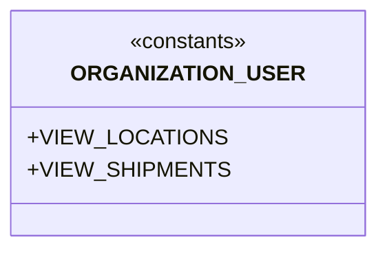

# Diagram: common/jwt_custom_authorizer/privileges.py

> Auto-generated by Obscura crawlers

## Mermaid

### SVG

<svg id="container" width="248.625" xmlns="http://www.w3.org/2000/svg" class="classDiagram" height="184" viewBox="0 0 248.625 184" role="graphics-document document" aria-roledescription="class"><g><defs><marker id="container_class-aggregationStart" class="marker aggregation class" refX="18" refY="7" markerWidth="190" markerHeight="240" orient="auto"><path d="M 18,7 L9,13 L1,7 L9,1 Z"></path></marker></defs><defs><marker id="container_class-aggregationEnd" class="marker aggregation class" refX="1" refY="7" markerWidth="20" markerHeight="28" orient="auto"><path d="M 18,7 L9,13 L1,7 L9,1 Z"></path></marker></defs><defs><marker id="container_class-extensionStart" class="marker extension class" refX="18" refY="7" markerWidth="190" markerHeight="240" orient="auto"><path d="M 1,7 L18,13 V 1 Z"></path></marker></defs><defs><marker id="container_class-extensionEnd" class="marker extension class" refX="1" refY="7" markerWidth="20" markerHeight="28" orient="auto"><path d="M 1,1 V 13 L18,7 Z"></path></marker></defs><defs><marker id="container_class-compositionStart" class="marker composition class" refX="18" refY="7" markerWidth="190" markerHeight="240" orient="auto"><path d="M 18,7 L9,13 L1,7 L9,1 Z"></path></marker></defs><defs><marker id="container_class-compositionEnd" class="marker composition class" refX="1" refY="7" markerWidth="20" markerHeight="28" orient="auto"><path d="M 18,7 L9,13 L1,7 L9,1 Z"></path></marker></defs><defs><marker id="container_class-dependencyStart" class="marker dependency class" refX="6" refY="7" markerWidth="190" markerHeight="240" orient="auto"><path d="M 5,7 L9,13 L1,7 L9,1 Z"></path></marker></defs><defs><marker id="container_class-dependencyEnd" class="marker dependency class" refX="13" refY="7" markerWidth="20" markerHeight="28" orient="auto"><path d="M 18,7 L9,13 L14,7 L9,1 Z"></path></marker></defs><defs><marker id="container_class-lollipopStart" class="marker lollipop class" refX="13" refY="7" markerWidth="190" markerHeight="240" orient="auto"><circle stroke="black" fill="transparent" cx="7" cy="7" r="6"></circle></marker></defs><defs><marker id="container_class-lollipopEnd" class="marker lollipop class" refX="1" refY="7" markerWidth="190" markerHeight="240" orient="auto"><circle stroke="black" fill="transparent" cx="7" cy="7" r="6"></circle></marker></defs><g class="root"><g class="clusters"></g><g class="edgePaths"></g><g class="edgeLabels"></g><g class="nodes"><g class="node default" id="classId-ORGANIZATION_USER-0" transform="translate(124.3125, 92)"><g class="basic label-container"><path d="M-116.3125 -84 L116.3125 -84 L116.3125 84 L-116.3125 84" stroke="none" stroke-width="0" fill="#ECECFF" style=""></path><path d="M-116.3125 -84 C-24.350969753499697 -84, 67.6105604930006 -84, 116.3125 -84 M-116.3125 -84 C-64.72299229810844 -84, -13.13348459621686 -84, 116.3125 -84 M116.3125 -84 C116.3125 -29.54027264022737, 116.3125 24.919454719545257, 116.3125 84 M116.3125 -84 C116.3125 -19.127952932351945, 116.3125 45.74409413529611, 116.3125 84 M116.3125 84 C50.5536453754105 84, -15.205209249179006 84, -116.3125 84 M116.3125 84 C68.10638516963745 84, 19.900270339274897 84, -116.3125 84 M-116.3125 84 C-116.3125 21.512085004026595, -116.3125 -40.97582999194681, -116.3125 -84 M-116.3125 84 C-116.3125 28.615860511151958, -116.3125 -26.768278977696085, -116.3125 -84" stroke="#9370DB" stroke-width="1.3" fill="none" stroke-dasharray="0 0" style=""></path></g><g class="annotation-group text" transform="translate(-44.2265625, -60)"><g class="label" style="" transform="translate(0,-12)"><foreignObject width="88.453125" height="24">

«constants»

</foreignObject></g></g><g class="label-group text" transform="translate(-76.859375, -36)"><g class="label" style="font-weight: bolder" transform="translate(0,-12)"><foreignObject width="153.71875" height="24">

ORGANIZATION_USER

</foreignObject></g></g><g class="members-group text" transform="translate(-104.3125, 12)"><g class="label" style="" transform="translate(0,-12)"><foreignObject width="129.703125" height="24">

+VIEW_LOCATIONS

</foreignObject></g><g class="label" style="" transform="translate(0,12)"><foreignObject width="131.765625" height="24">

+VIEW_SHIPMENTS

</foreignObject></g></g><g class="methods-group text" transform="translate(-104.3125, 84)"></g><g class="divider" style=""><path d="M-116.3125 -12 C-54.64732561673087 -12, 7.017848766538265 -12, 116.3125 -12 M-116.3125 -12 C-26.401697296786068 -12, 63.509105406427864 -12, 116.3125 -12" stroke="#9370DB" stroke-width="1.3" fill="none" stroke-dasharray="0 0" style=""></path></g><g class="divider" style=""><path d="M-116.3125 60 C-37.46987617753686 60, 41.37274764492628 60, 116.3125 60 M-116.3125 60 C-54.43201925229513 60, 7.448461495409745 60, 116.3125 60" stroke="#9370DB" stroke-width="1.3" fill="none" stroke-dasharray="0 0" style=""></path></g></g></g></g></g></svg>
