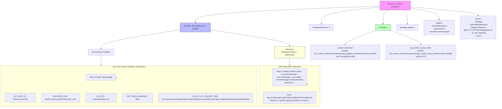

# Diagram: common/jwt_custom_authorizer/serverless.jwt_custom_auth.yml

> Auto-generated by Obscura crawlers

## Mermaid

### SVG

<svg id="container" width="4375.7890625" xmlns="http://www.w3.org/2000/svg" class="flowchart" height="848" viewBox="0 0 4375.7890625 848" role="graphics-document document" aria-roledescription="flowchart-v2"><g><marker id="container_flowchart-v2-pointEnd" class="marker flowchart-v2" viewBox="0 0 10 10" refX="5" refY="5" markerUnits="userSpaceOnUse" markerWidth="8" markerHeight="8" orient="auto"><path d="M 0 0 L 10 5 L 0 10 z" class="arrowMarkerPath" style="stroke-width: 1; stroke-dasharray: 1, 0;"></path></marker><marker id="container_flowchart-v2-pointStart" class="marker flowchart-v2" viewBox="0 0 10 10" refX="4.5" refY="5" markerUnits="userSpaceOnUse" markerWidth="8" markerHeight="8" orient="auto"><path d="M 0 5 L 10 10 L 10 0 z" class="arrowMarkerPath" style="stroke-width: 1; stroke-dasharray: 1, 0;"></path></marker><marker id="container_flowchart-v2-circleEnd" class="marker flowchart-v2" viewBox="0 0 10 10" refX="11" refY="5" markerUnits="userSpaceOnUse" markerWidth="11" markerHeight="11" orient="auto"><circle cx="5" cy="5" r="5" class="arrowMarkerPath" style="stroke-width: 1; stroke-dasharray: 1, 0;"></circle></marker><marker id="container_flowchart-v2-circleStart" class="marker flowchart-v2" viewBox="0 0 10 10" refX="-1" refY="5" markerUnits="userSpaceOnUse" markerWidth="11" markerHeight="11" orient="auto"><circle cx="5" cy="5" r="5" class="arrowMarkerPath" style="stroke-width: 1; stroke-dasharray: 1, 0;"></circle></marker><marker id="container_flowchart-v2-crossEnd" class="marker cross flowchart-v2" viewBox="0 0 11 11" refX="12" refY="5.2" markerUnits="userSpaceOnUse" markerWidth="11" markerHeight="11" orient="auto"><path d="M 1,1 l 9,9 M 10,1 l -9,9" class="arrowMarkerPath" style="stroke-width: 2; stroke-dasharray: 1, 0;"></path></marker><marker id="container_flowchart-v2-crossStart" class="marker cross flowchart-v2" viewBox="0 0 11 11" refX="-1" refY="5.2" markerUnits="userSpaceOnUse" markerWidth="11" markerHeight="11" orient="auto"><path d="M 1,1 l 9,9 M 10,1 l -9,9" class="arrowMarkerPath" style="stroke-width: 2; stroke-dasharray: 1, 0;"></path></marker><g class="root"><g class="clusters"><g class="cluster" id="ENV_VARS" data-look="classic"><rect style="" x="8" y="488" width="2181.171875" height="352"></rect><g class="cluster-label" transform="translate(998.5859375, 488)"><foreignObject width="200" height="48">

Key Environment Variables (examples)

</foreignObject></g></g><g class="cluster" id="IAM_STATEMENTS" data-look="classic"><rect style="" x="2209.171875" y="488" width="605" height="352"></rect><g class="cluster-label" transform="translate(2417.3828125, 488)"><foreignObject width="188.578125" height="24">

IAM Statements (selected)

</foreignObject></g></g></g><g class="edgePaths"><path d="M3356.113,59.103L3263.206,67.752C3170.299,76.402,2984.486,93.701,2891.579,113.85C2798.672,134,2798.672,157,2798.672,168.5L2798.672,180" id="L_svc_fw_0" class="edge-thickness-normal edge-pattern-solid edge-thickness-normal edge-pattern-solid flowchart-link" style=";" data-edge="true" data-et="edge" data-id="L_svc_fw_0" data-points="W3sieCI6MzM1Ni4xMTMyODEyNSwieSI6NTkuMTAyODQ5Njc0Njg4MTl9LHsieCI6Mjc5OC42NzE4NzUsInkiOjExMX0seyJ4IjoyNzk4LjY3MTg3NSwieSI6MTg0fV0=" marker-end="url(#container_flowchart-v2-pointEnd)"></path><path d="M3356.113,51.621L3077.679,61.517C2799.245,71.414,2242.376,91.207,1963.942,110.603C1685.508,130,1685.508,149,1685.508,158.5L1685.508,168" id="L_svc_prov_0" class="edge-thickness-normal edge-pattern-solid edge-thickness-normal edge-pattern-solid flowchart-link" style=";" data-edge="true" data-et="edge" data-id="L_svc_prov_0" data-points="W3sieCI6MzM1Ni4xMTMyODEyNSwieSI6NTEuNjIwNjY3OTYxMDgwOH0seyJ4IjoxNjg1LjUwNzgxMjUsInkiOjExMX0seyJ4IjoxNjg1LjUwNzgxMjUsInkiOjE3Mn1d" marker-end="url(#container_flowchart-v2-pointEnd)"></path><path d="M1555.508,227.098L1442.583,241.082C1329.659,255.065,1103.81,283.033,990.885,304.516C877.961,326,877.961,341,877.961,348.5L877.961,356" id="L_prov_env_0" class="edge-thickness-normal edge-pattern-solid edge-thickness-normal edge-pattern-solid flowchart-link" style=";" data-edge="true" data-et="edge" data-id="L_prov_env_0" data-points="W3sieCI6MTU1NS41MDc4MTI1LCJ5IjoyMjcuMDk4MTM2NzE4MDY5Nzh9LHsieCI6ODc3Ljk2MDkzNzUsInkiOjMxMX0seyJ4Ijo4NzcuOTYwOTM3NSwieSI6MzYwfV0=" marker-end="url(#container_flowchart-v2-pointEnd)"></path><path d="M1815.508,226.735L1931.535,240.779C2047.563,254.824,2279.617,282.912,2395.645,302.456C2511.672,322,2511.672,333,2511.672,338.5L2511.672,344" id="L_prov_iam_0" class="edge-thickness-normal edge-pattern-solid edge-thickness-normal edge-pattern-solid flowchart-link" style=";" data-edge="true" data-et="edge" data-id="L_prov_iam_0" data-points="W3sieCI6MTgxNS41MDc4MTI1LCJ5IjoyMjYuNzM1MzczMzg0MTQ1NDh9LHsieCI6MjUxMS42NzE4NzUsInkiOjMxMX0seyJ4IjoyNTExLjY3MTg3NSwieSI6MzQ4fV0=" marker-end="url(#container_flowchart-v2-pointEnd)"></path><path d="M3422.979,86L3416.234,90.167C3409.488,94.333,3395.998,102.667,3389.253,118.333C3382.508,134,3382.508,157,3382.508,168.5L3382.508,180" id="L_svc_funcs_0" class="edge-thickness-normal edge-pattern-solid edge-thickness-normal edge-pattern-solid flowchart-link" style=";" data-edge="true" data-et="edge" data-id="L_svc_funcs_0" data-points="W3sieCI6MzQyMi45Nzg2OTg3MzA0Njg4LCJ5Ijo4Nn0seyJ4IjozMzgyLjUwNzgxMjUsInkiOjExMX0seyJ4IjozMzgyLjUwNzgxMjUsInkiOjE4NH1d" marker-end="url(#container_flowchart-v2-pointEnd)"></path><path d="M3317.461,228.979L3268.004,242.649C3218.547,256.319,3119.633,283.66,3070.176,300.83C3020.719,318,3020.719,325,3020.719,328.5L3020.719,332" id="L_funcs_f1_0" class="edge-thickness-normal edge-pattern-solid edge-thickness-normal edge-pattern-solid flowchart-link" style=";" data-edge="true" data-et="edge" data-id="L_funcs_f1_0" data-points="W3sieCI6MzMxNy40NjA5Mzc1LCJ5IjoyMjguOTc5MjI2NTAwMjQ4MzN9LHsieCI6MzAyMC43MTg3NSwieSI6MzExfSx7IngiOjMwMjAuNzE4NzUsInkiOjMzNn1d" marker-end="url(#container_flowchart-v2-pointEnd)"></path><path d="M3447.555,228.979L3497.012,242.649C3546.469,256.319,3645.383,283.66,3694.84,300.83C3744.297,318,3744.297,325,3744.297,328.5L3744.297,332" id="L_funcs_f2_0" class="edge-thickness-normal edge-pattern-solid edge-thickness-normal edge-pattern-solid flowchart-link" style=";" data-edge="true" data-et="edge" data-id="L_funcs_f2_0" data-points="W3sieCI6MzQ0Ny41NTQ2ODc1LCJ5IjoyMjguOTc5MjI2NTAwMjQ4MzN9LHsieCI6Mzc0NC4yOTY4NzUsInkiOjMxMX0seyJ4IjozNzQ0LjI5Njg3NSwieSI6MzM2fV0=" marker-end="url(#container_flowchart-v2-pointEnd)"></path><path d="M3549.248,86L3555.993,90.167C3562.738,94.333,3576.228,102.667,3582.974,118.333C3589.719,134,3589.719,157,3589.719,168.5L3589.719,180" id="L_svc_pkg_0" class="edge-thickness-normal edge-pattern-solid edge-thickness-normal edge-pattern-solid flowchart-link" style=";" data-edge="true" data-et="edge" data-id="L_svc_pkg_0" data-points="W3sieCI6MzU0OS4yNDc4NjM3Njk1MzEyLCJ5Ijo4Nn0seyJ4IjozNTg5LjcxODc1LCJ5IjoxMTF9LHsieCI6MzU4OS43MTg3NSwieSI6MTg0fV0=" marker-end="url(#container_flowchart-v2-pointEnd)"></path><path d="M3616.113,69.141L3657.075,76.118C3698.036,83.094,3779.96,97.047,3820.921,111.524C3861.883,126,3861.883,141,3861.883,148.5L3861.883,156" id="L_svc_plugins_0" class="edge-thickness-normal edge-pattern-solid edge-thickness-normal edge-pattern-solid flowchart-link" style=";" data-edge="true" data-et="edge" data-id="L_svc_plugins_0" data-points="W3sieCI6MzYxNi4xMTMyODEyNSwieSI6NjkuMTQxMjMxMDE1NTIwMjN9LHsieCI6Mzg2MS44ODI4MTI1LCJ5IjoxMTF9LHsieCI6Mzg2MS44ODI4MTI1LCJ5IjoxNjB9XQ==" marker-end="url(#container_flowchart-v2-pointEnd)"></path><path d="M3616.113,58.576L3714.234,67.313C3812.354,76.051,4008.595,93.525,4106.715,105.763C4204.836,118,4204.836,125,4204.836,128.5L4204.836,132" id="L_svc_custom_cfg_0" class="edge-thickness-normal edge-pattern-solid edge-thickness-normal edge-pattern-solid flowchart-link" style=";" data-edge="true" data-et="edge" data-id="L_svc_custom_cfg_0" data-points="W3sieCI6MzYxNi4xMTMyODEyNSwieSI6NTguNTc2MDkyNTY4NzM5MDN9LHsieCI6NDIwNC44MzU5Mzc1LCJ5IjoxMTF9LHsieCI6NDIwNC44MzU5Mzc1LCJ5IjoxMzZ9XQ==" marker-end="url(#container_flowchart-v2-pointEnd)"></path><path d="M2511.672,426L2511.672,432.167C2511.672,438.333,2511.672,450.667,2511.672,460.333C2511.672,470,2511.672,477,2511.672,480.5L2511.672,484" id="L_iam_IAM_STATEMENTS_0" class="edge-thickness-normal edge-pattern-solid edge-thickness-normal edge-pattern-solid flowchart-link" style=";" data-edge="true" data-et="edge" data-id="L_iam_IAM_STATEMENTS_0" data-points="W3sieCI6MjUxMS42NzE4NzUsInkiOjQyNn0seyJ4IjoyNTExLjY3MTg3NSwieSI6NDYzfSx7IngiOjI1MTEuNjcxODc1LCJ5Ijo0ODh9LHsieCI6MjUxMS42NzE4NzUsInkiOjUxM31d" marker-end="url(#container_flowchart-v2-pointEnd)"></path><path d="M2705.273,649.232Z" id="L_IAM_STATEMENTS_s_allow_0" class="edge-thickness-normal edge-pattern-solid edge-thickness-normal edge-pattern-solid flowchart-link" style=";" data-edge="true" data-et="edge" data-id="L_IAM_STATEMENTS_s_allow_0" data-points="W3sieCI6MjcwMS4yNzM0Mzc1LCJ5Ijo1MjYuNzY4MjUwMDE2ODIwM30seyJ4IjoyNzQzLjkwNjI1LCJ5Ijo1MTN9LHsieCI6Mjc1NC41NjQ0NTMxMjUsInkiOjUxM30seyJ4IjoyNzY1LjIyMjY1NjI1LCJ5Ijo1ODh9LHsieCI6Mjc1NC41NjQ0NTMxMjUsInkiOjY2M30seyJ4IjoyNzQzLjkwNjI1LCJ5Ijo2NjN9LHsieCI6MjcwMS4yNzM0Mzc1LCJ5Ijo2NDkuMjMxNzQ5OTgzMTc5N31d" marker-end="url(#container_flowchart-v2-pointEnd)"></path><path d="M2515.672,713Z" id="L_IAM_STATEMENTS_s_deny_0" class="edge-thickness-normal edge-pattern-solid edge-thickness-normal edge-pattern-solid flowchart-link" style=";" data-edge="true" data-et="edge" data-id="L_IAM_STATEMENTS_s_deny_0" data-points="W3sieCI6MjUxMS42NzE4NzUsInkiOjY2M30seyJ4IjoyNTExLjY3MTg3NSwieSI6Njg4fSx7IngiOjI1MTEuNjcxODc1LCJ5Ijo3MTN9XQ==" marker-end="url(#container_flowchart-v2-pointEnd)"></path><path d="M877.961,414L877.961,422.167C877.961,430.333,877.961,446.667,877.961,458.333C877.961,470,877.961,477,877.961,480.5L877.961,484" id="L_env_ENV_VARS_0" class="edge-thickness-normal edge-pattern-solid edge-thickness-normal edge-pattern-solid flowchart-link" style=";" data-edge="true" data-et="edge" data-id="L_env_ENV_VARS_0" data-points="W3sieCI6ODc3Ljk2MDkzNzUsInkiOjQxNH0seyJ4Ijo4NzcuOTYwOTM3NSwieSI6NDYzfSx7IngiOjg3Ny45NjA5Mzc1LCJ5Ijo0ODh9LHsieCI6ODc3Ljk2MDkzNzUsInkiOjU2MX1d" marker-end="url(#container_flowchart-v2-pointEnd)"></path><path d="M999.969,591.934Z" id="L_ENV_VARS_e_stage_0" class="edge-thickness-normal edge-pattern-solid edge-thickness-normal edge-pattern-solid flowchart-link" style=";" data-edge="true" data-et="edge" data-id="L_ENV_VARS_e_stage_0" data-points="W3sieCI6OTk1Ljk2ODc1LCJ5Ijo1ODQuMDY2NDY5NDgxOTA3OH0seyJ4IjoxNjg3Ljk3Mzk1ODMzMzMzMzUsInkiOjU2MX0seyJ4IjoxODYwLjk3NTI2MDQxNjY2NjUsInkiOjU2MX0seyJ4IjoyMDMzLjk3NjU2MjUsInkiOjU4OH0seyJ4IjoxODYwLjk3NTI2MDQxNjY2NjUsInkiOjYxNX0seyJ4IjoxNjg3Ljk3Mzk1ODMzMzMzMzUsInkiOjYxNX0seyJ4Ijo5OTUuOTY4NzUsInkiOjU5MS45MzM1MzA1MTgwOTIyfV0=" marker-end="url(#container_flowchart-v2-pointEnd)"></path><path d="M177,725Z" id="L_ENV_VARS_e_account_0" class="edge-thickness-normal edge-pattern-solid edge-thickness-normal edge-pattern-solid flowchart-link" style=";" data-edge="true" data-et="edge" data-id="L_ENV_VARS_e_account_0" data-points="W3sieCI6NzU5Ljk1MzEyNSwieSI6NjA0LjczOTYyNDMxNDI5MDV9LHsieCI6MTczLCJ5Ijo2ODh9LHsieCI6MTczLCJ5Ijo3MjV9XQ==" marker-end="url(#container_flowchart-v2-pointEnd)"></path><path d="M520.172,725Z" id="L_ENV_VARS_e_spec_0" class="edge-thickness-normal edge-pattern-solid edge-thickness-normal edge-pattern-solid flowchart-link" style=";" data-edge="true" data-et="edge" data-id="L_ENV_VARS_e_spec_0" data-points="W3sieCI6NzgwLjI3Nzg5MDYyNSwieSI6NjE1fSx7IngiOjUxNi4xNzE4NzUsInkiOjY4OH0seyJ4Ijo1MTYuMTcxODc1LCJ5Ijo3MjV9XQ==" marker-end="url(#container_flowchart-v2-pointEnd)"></path><path d="M863.344,725Z" id="L_ENV_VARS_e_dd_site_0" class="edge-thickness-normal edge-pattern-solid edge-thickness-normal edge-pattern-solid flowchart-link" style=";" data-edge="true" data-et="edge" data-id="L_ENV_VARS_e_dd_site_0" data-points="W3sieCI6ODcyLjkzNDI5Njg3NSwieSI6NjE1fSx7IngiOjg1OS4zNDM3NSwieSI6Njg4fSx7IngiOjg1OS4zNDM3NSwieSI6NzI1fV0=" marker-end="url(#container_flowchart-v2-pointEnd)"></path><path d="M1167.359,737Z" id="L_ENV_VARS_e_dd_trace_0" class="edge-thickness-normal edge-pattern-solid edge-thickness-normal edge-pattern-solid flowchart-link" style=";" data-edge="true" data-et="edge" data-id="L_ENV_VARS_e_dd_trace_0" data-points="W3sieCI6OTU1LjAxODUxNTYyNSwieSI6NjE1fSx7IngiOjExNjMuMzU5Mzc1LCJ5Ijo2ODh9LHsieCI6MTE2My4zNTkzNzUsInkiOjczN31d" marker-end="url(#container_flowchart-v2-pointEnd)"></path><path d="M1749.773,725Z" id="L_ENV_VARS_e_dd_secret_0" class="edge-thickness-normal edge-pattern-solid edge-thickness-normal edge-pattern-solid flowchart-link" style=";" data-edge="true" data-et="edge" data-id="L_ENV_VARS_e_dd_secret_0" data-points="W3sieCI6OTk1Ljk2ODc1LCJ5Ijo2MDEuNTk4MzA3NTI2MTA3M30seyJ4IjoxNzQ1Ljc3MzQzNzUsInkiOjY4OH0seyJ4IjoxNzQ1Ljc3MzQzNzUsInkiOjcyNX1d" marker-end="url(#container_flowchart-v2-pointEnd)"></path></g><g class="edgeLabels"><g class="edgeLabel"><g class="label" data-id="L_svc_fw_0" transform="translate(0, 0)"><foreignObject width="0" height="0">

</foreignObject></g></g><g class="edgeLabel"><g class="label" data-id="L_svc_prov_0" transform="translate(0, 0)"><foreignObject width="0" height="0">

</foreignObject></g></g><g class="edgeLabel"><g class="label" data-id="L_prov_env_0" transform="translate(0, 0)"><foreignObject width="0" height="0">

</foreignObject></g></g><g class="edgeLabel"><g class="label" data-id="L_prov_iam_0" transform="translate(0, 0)"><foreignObject width="0" height="0">

</foreignObject></g></g><g class="edgeLabel"><g class="label" data-id="L_svc_funcs_0" transform="translate(0, 0)"><foreignObject width="0" height="0">

</foreignObject></g></g><g class="edgeLabel"><g class="label" data-id="L_funcs_f1_0" transform="translate(0, 0)"><foreignObject width="0" height="0">

</foreignObject></g></g><g class="edgeLabel"><g class="label" data-id="L_funcs_f2_0" transform="translate(0, 0)"><foreignObject width="0" height="0">

</foreignObject></g></g><g class="edgeLabel"><g class="label" data-id="L_svc_pkg_0" transform="translate(0, 0)"><foreignObject width="0" height="0">

</foreignObject></g></g><g class="edgeLabel"><g class="label" data-id="L_svc_plugins_0" transform="translate(0, 0)"><foreignObject width="0" height="0">

</foreignObject></g></g><g class="edgeLabel"><g class="label" data-id="L_svc_custom_cfg_0" transform="translate(0, 0)"><foreignObject width="0" height="0">

</foreignObject></g></g><g class="edgeLabel"><g class="label" data-id="L_iam_IAM_STATEMENTS_0" transform="translate(0, 0)"><foreignObject width="0" height="0">

</foreignObject></g></g><g class="edgeLabel"><g class="label" data-id="L_IAM_STATEMENTS_s_allow_0" transform="translate(0, 0)"><foreignObject width="0" height="0">

</foreignObject></g></g><g class="edgeLabel"><g class="label" data-id="L_IAM_STATEMENTS_s_deny_0" transform="translate(0, 0)"><foreignObject width="0" height="0">

</foreignObject></g></g><g class="edgeLabel"><g class="label" data-id="L_env_ENV_VARS_0" transform="translate(0, 0)"><foreignObject width="0" height="0">

</foreignObject></g></g><g class="edgeLabel"><g class="label" data-id="L_ENV_VARS_e_stage_0" transform="translate(0, 0)"><foreignObject width="0" height="0">

</foreignObject></g></g><g class="edgeLabel"><g class="label" data-id="L_ENV_VARS_e_account_0" transform="translate(0, 0)"><foreignObject width="0" height="0">

</foreignObject></g></g><g class="edgeLabel"><g class="label" data-id="L_ENV_VARS_e_spec_0" transform="translate(0, 0)"><foreignObject width="0" height="0">

</foreignObject></g></g><g class="edgeLabel"><g class="label" data-id="L_ENV_VARS_e_dd_site_0" transform="translate(0, 0)"><foreignObject width="0" height="0">

</foreignObject></g></g><g class="edgeLabel"><g class="label" data-id="L_ENV_VARS_e_dd_trace_0" transform="translate(0, 0)"><foreignObject width="0" height="0">

</foreignObject></g></g><g class="edgeLabel"><g class="label" data-id="L_ENV_VARS_e_dd_secret_0" transform="translate(0, 0)"><foreignObject width="0" height="0">

</foreignObject></g></g></g><g class="nodes"><g class="node default" id="flowchart-svc-0" transform="translate(3486.11328125, 47)"><rect class="basic label-container" style="fill:#f9f !important;stroke:#333 !important;stroke-width:1px !important" x="-130" y="-39" width="260" height="78"></rect><g class="label" style="" transform="translate(-100, -24)"><rect></rect><foreignObject width="200" height="48">

service: fv-custom-authorizer

</foreignObject></g></g><g class="node default" id="flowchart-prov-1" transform="translate(1685.5078125, 211)"><rect class="basic label-container" style="fill:#bbf !important;stroke:#333 !important;stroke-width:1px !important" x="-130" y="-39" width="260" height="78"></rect><g class="label" style="" transform="translate(-100, -24)"><rect></rect><foreignObject width="200" height="48">

provider: aws (python3.13, arm64)

</foreignObject></g></g><g class="node default" id="flowchart-fw-2" transform="translate(2798.671875, 211)"><rect class="basic label-container" style="" x="-103.609375" y="-27" width="207.21875" height="54"></rect><g class="label" style="" transform="translate(-73.609375, -12)"><rect></rect><foreignObject width="147.21875" height="24">

frameworkVersion: 3

</foreignObject></g></g><g class="node default" id="flowchart-env-3" transform="translate(877.9609375, 387)"><rect class="basic label-container" style="" x="-111.4765625" y="-27" width="222.953125" height="54"></rect><g class="label" style="" transform="translate(-81.4765625, -12)"><rect></rect><foreignObject width="162.953125" height="24">

Environment Variables

</foreignObject></g></g><g class="node default" id="flowchart-iam-4" transform="translate(2511.671875, 387)"><rect class="basic label-container" style="fill:#ffd !important;stroke:#333 !important;stroke-width:1px !important" x="-130" y="-39" width="260" height="78"></rect><g class="label" style="" transform="translate(-100, -24)"><rect></rect><foreignObject width="200" height="48">

IAM Role\nManaged Policies + Statements

</foreignObject></g></g><g class="node default" id="flowchart-funcs-5" transform="translate(3382.5078125, 211)"><rect class="basic label-container" style="fill:#bfb !important;stroke:#333 !important;stroke-width:1px !important" x="-65.046875" y="-27" width="130.09375" height="54"></rect><g class="label" style="" transform="translate(-35.046875, -12)"><rect></rect><foreignObject width="70.09375" height="24">

Functions

</foreignObject></g></g><g class="node default" id="flowchart-f1-6" transform="translate(3020.71875, 387)"><rect class="basic label-container" style="" x="-329.046875" y="-51" width="658.09375" height="102"></rect><g class="label" style="" transform="translate(-299.046875, -36)"><rect></rect><foreignObject width="598.09375" height="72">

custom-authorizer\nhandler: jwt_custom_authorizer/authorizer/api_gateway_authorizer.lambda_handler\nvpc: from globalConfig

</foreignObject></g></g><g class="node default" id="flowchart-f2-7" transform="translate(3744.296875, 387)"><rect class="basic label-container" style="" x="-344.53125" y="-51" width="689.0625" height="102"></rect><g class="label" style="" transform="translate(-314.53125, -36)"><rect></rect><foreignObject width="629.0625" height="72">

get_auth0_access_token\nhandler: jwt_custom_authorizer/authorizer/get_auth0_access_token.lambda_handler\noutside VPC

</foreignObject></g></g><g class="node default" id="flowchart-pkg-8" transform="translate(3589.71875, 211)"><rect class="basic label-container" style="" x="-92.1640625" y="-27" width="184.328125" height="54"></rect><g class="label" style="" transform="translate(-62.1640625, -12)"><rect></rect><foreignObject width="124.328125" height="24">

package patterns

</foreignObject></g></g><g class="node default" id="flowchart-plugins-9" transform="translate(3861.8828125, 211)"><rect class="basic label-container" style="" x="-130" y="-51" width="260" height="102"></rect><g class="label" style="" transform="translate(-100, -36)"><rect></rect><foreignObject width="200" height="72">

plugins:\n- serverless-python-requirements\n- serverless-prune-plugin

</foreignObject></g></g><g class="node default" id="flowchart-custom_cfg-10" transform="translate(4204.8359375, 211)"><rect class="basic label-container" style="" x="-162.953125" y="-75" width="325.90625" height="150"></rect><g class="label" style="" transform="translate(-132.953125, -60)"><rect></rect><foreignObject width="265.90625" height="120">

custom:\n- datadog\n- pythonRequirements\n- globalConfig from ${env:FV_PATH}/config.global.yml\n- no_dev mapping\n- prune

</foreignObject></g></g><g class="node default" id="flowchart-s_allow-31" transform="translate(2511.671875, 588)"><rect class="basic label-container" style="" x="-189.6015625" y="-75" width="379.203125" height="150"></rect><g class="label" style="" transform="translate(-159.6015625, -60)"><rect></rect><foreignObject width="319.203125" height="120">

Allow: lambda:InvokeFunction, ssm:GetParameter*, sns:CreateTopic, sns:Publish, secretsmanager:GetSecretValue\nResource: *

</foreignObject></g></g><g class="node default" id="flowchart-s_deny-32" transform="translate(2511.671875, 764)"><rect class="basic label-container" style="" x="-267.5" y="-51" width="535" height="102"></rect><g class="label" style="" transform="translate(-237.5, -36)"><rect></rect><foreignObject width="475" height="72">

Deny: logs:CreateLogGroup/CreateLogStream/PutLogEvents\nResource: specific log-group ARNs (us-east-1)

</foreignObject></g></g><g class="node default" id="flowchart-e_stage-39" transform="translate(877.9609375, 588)"><rect class="basic label-container" style="" x="-118.0078125" y="-27" width="236.015625" height="54"></rect><g class="label" style="" transform="translate(-88.0078125, -12)"><rect></rect><foreignObject width="176.015625" height="24">

AWS_STAGE: ${opt:stage}

</foreignObject></g></g><g class="node default" id="flowchart-e_account-40" transform="translate(173, 764)"><rect class="basic label-container" style="" x="-130" y="-39" width="260" height="78"></rect><g class="label" style="" transform="translate(-100, -24)"><rect></rect><foreignObject width="200" height="48">

ACCOUNT_ID: ${aws:accountId}

</foreignObject></g></g><g class="node default" id="flowchart-e_spec-41" transform="translate(516.171875, 764)"><rect class="basic label-container" style="" x="-163.171875" y="-39" width="326.34375" height="78"></rect><g class="label" style="" transform="translate(-133.171875, -24)"><rect></rect><foreignObject width="266.34375" height="48">

SPECIFIED_ENV: ${self:custom.globalConfig.spec_env}

</foreignObject></g></g><g class="node default" id="flowchart-e_dd_site-42" transform="translate(859.34375, 764)"><rect class="basic label-container" style="" x="-130" y="-39" width="260" height="78"></rect><g class="label" style="" transform="translate(-100, -24)"><rect></rect><foreignObject width="200" height="48">

DD_SITE: us3.datadoghq.com

</foreignObject></g></g><g class="node default" id="flowchart-e_dd_trace-43" transform="translate(1163.359375, 764)"><rect class="basic label-container" style="" x="-124.015625" y="-27" width="248.03125" height="54"></rect><g class="label" style="" transform="translate(-94.015625, -12)"><rect></rect><foreignObject width="188.03125" height="24">

DD_TRACE_ENABLED: false

</foreignObject></g></g><g class="node default" id="flowchart-e_dd_secret-44" transform="translate(1745.7734375, 764)"><rect class="basic label-container" style="" x="-408.3984375" y="-39" width="816.796875" height="78"></rect><g class="label" style="" transform="translate(-378.3984375, -24)"><rect></rect><foreignObject width="756.796875" height="48">

DD_API_KEY_SECRET_ARN: arn:aws:secretsmanager:${aws:region}:${aws:accountId}:secret:${opt:stage}/datadog/credentials/lambda

</foreignObject></g></g></g></g></g></svg>
