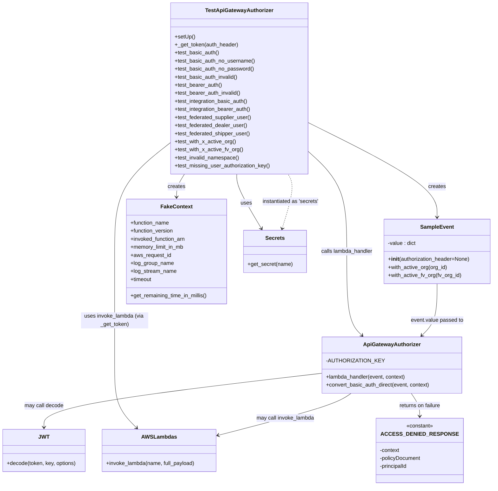
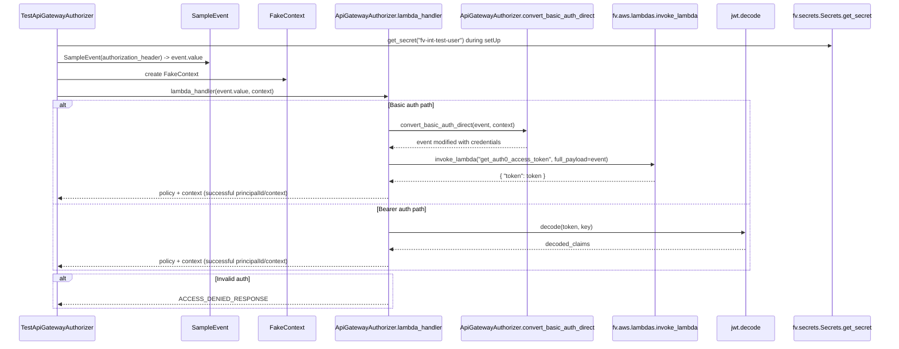

# Diagram: common/jwt_custom_authorizer/tests/test_api_gateway_authorizer.py

> Auto-generated by Obscura crawlers

## Diagram 1

### SVG

<svg id="container" width="1476.07421875" xmlns="http://www.w3.org/2000/svg" class="classDiagram" height="1444" viewBox="0 0 1476.07421875 1444" role="graphics-document document" aria-roledescription="class"><g><defs><marker id="container_class-aggregationStart" class="marker aggregation class" refX="18" refY="7" markerWidth="190" markerHeight="240" orient="auto"><path d="M 18,7 L9,13 L1,7 L9,1 Z"></path></marker></defs><defs><marker id="container_class-aggregationEnd" class="marker aggregation class" refX="1" refY="7" markerWidth="20" markerHeight="28" orient="auto"><path d="M 18,7 L9,13 L1,7 L9,1 Z"></path></marker></defs><defs><marker id="container_class-extensionStart" class="marker extension class" refX="18" refY="7" markerWidth="190" markerHeight="240" orient="auto"><path d="M 1,7 L18,13 V 1 Z"></path></marker></defs><defs><marker id="container_class-extensionEnd" class="marker extension class" refX="1" refY="7" markerWidth="20" markerHeight="28" orient="auto"><path d="M 1,1 V 13 L18,7 Z"></path></marker></defs><defs><marker id="container_class-compositionStart" class="marker composition class" refX="18" refY="7" markerWidth="190" markerHeight="240" orient="auto"><path d="M 18,7 L9,13 L1,7 L9,1 Z"></path></marker></defs><defs><marker id="container_class-compositionEnd" class="marker composition class" refX="1" refY="7" markerWidth="20" markerHeight="28" orient="auto"><path d="M 18,7 L9,13 L1,7 L9,1 Z"></path></marker></defs><defs><marker id="container_class-dependencyStart" class="marker dependency class" refX="6" refY="7" markerWidth="190" markerHeight="240" orient="auto"><path d="M 5,7 L9,13 L1,7 L9,1 Z"></path></marker></defs><defs><marker id="container_class-dependencyEnd" class="marker dependency class" refX="13" refY="7" markerWidth="20" markerHeight="28" orient="auto"><path d="M 18,7 L9,13 L14,7 L9,1 Z"></path></marker></defs><defs><marker id="container_class-lollipopStart" class="marker lollipop class" refX="13" refY="7" markerWidth="190" markerHeight="240" orient="auto"><circle stroke="black" fill="transparent" cx="7" cy="7" r="6"></circle></marker></defs><defs><marker id="container_class-lollipopEnd" class="marker lollipop class" refX="1" refY="7" markerWidth="190" markerHeight="240" orient="auto"><circle stroke="black" fill="transparent" cx="7" cy="7" r="6"></circle></marker></defs><g class="root"><g class="clusters"></g><g class="edgePaths"><path d="M916.678,362.678L982.101,394.732C1047.525,426.785,1178.372,490.893,1243.795,538.113C1309.219,585.333,1309.219,615.667,1309.219,630.833L1309.219,646" id="id_TestApiGatewayAuthorizer_SampleEvent_1" class="edge-thickness-normal edge-pattern-solid relation" style=";;;" data-edge="true" data-et="edge" data-id="id_TestApiGatewayAuthorizer_SampleEvent_1" data-points="W3sieCI6OTE2LjY3NzczNDM3NSwieSI6MzYyLjY3ODA5NjEzMDcxNzM0fSx7IngiOjEzMDkuMjE4NzUsInkiOjU1NX0seyJ4IjoxMzA5LjIxODc1LCJ5Ijo2NTJ9XQ==" marker-end="url(#container_class-dependencyEnd)"></path><path d="M550.886,518L546.96,524.167C543.034,530.333,535.182,542.667,531.256,554C527.33,565.333,527.33,575.667,527.33,580.833L527.33,586" id="id_TestApiGatewayAuthorizer_FakeContext_2" class="edge-thickness-normal edge-pattern-solid relation" style=";;;" data-edge="true" data-et="edge" data-id="id_TestApiGatewayAuthorizer_FakeContext_2" data-points="W3sieCI6NTUwLjg4NTcwMjA1NDc5NDUsInkiOjUxOH0seyJ4Ijo1MjcuMzMwMDc4MTI1LCJ5Ijo1NTV9LHsieCI6NTI3LjMzMDA3ODEyNSwieSI6NTkyfV0=" marker-end="url(#container_class-dependencyEnd)"></path><path d="M706.271,518L706.103,524.167C705.935,530.333,705.598,542.667,717.857,569.641C730.117,596.616,754.972,638.233,767.399,659.041L779.827,679.849" id="id_TestApiGatewayAuthorizer_Secrets_3" class="edge-thickness-normal edge-pattern-solid relation" style=";;;" data-edge="true" data-et="edge" data-id="id_TestApiGatewayAuthorizer_Secrets_3" data-points="W3sieCI6NzA2LjI3MTIxMDEzNDg0NTksInkiOjUxOH0seyJ4Ijo3MDUuMjYxNzE4NzUsInkiOjU1NX0seyJ4Ijo3ODIuOTAzMDkyNjE2NTgwNCwieSI6Njg1fV0=" marker-end="url(#container_class-dependencyEnd)"></path><path d="M916.678,446.5L936.727,464.584C956.776,482.667,996.874,518.833,1016.924,569.083C1036.973,619.333,1036.973,683.667,1036.973,750C1036.973,816.333,1036.973,884.667,1044.616,926.301C1052.259,967.936,1067.545,982.871,1075.188,990.339L1082.832,997.807" id="id_TestApiGatewayAuthorizer_ApiGatewayAuthorizer_4" class="edge-thickness-normal edge-pattern-solid relation" style=";;;" data-edge="true" data-et="edge" data-id="id_TestApiGatewayAuthorizer_ApiGatewayAuthorizer_4" data-points="W3sieCI6OTE2LjY3NzczNDM3NSwieSI6NDQ2LjUwMDM3NzA1Nzk4MjQ2fSx7IngiOjEwMzYuOTcyNjU2MjUsInkiOjU1NX0seyJ4IjoxMDM2Ljk3MjY1NjI1LCJ5Ijo3NDh9LHsieCI6MTAzNi45NzI2NTYyNSwieSI6OTUzfSx7IngiOjEwODcuMTIzMjUyNDY3MTA1MiwieSI6MTAwMn1d" marker-end="url(#container_class-dependencyEnd)"></path><path d="M509.779,422.858L481.75,444.882C453.721,466.905,397.662,510.953,369.633,565.143C341.604,619.333,341.604,683.667,341.604,750C341.604,816.333,341.604,884.667,341.604,941C341.604,997.333,341.604,1041.667,341.604,1084C341.604,1126.333,341.604,1166.667,352.492,1197.791C363.38,1228.915,385.157,1250.829,396.045,1261.787L406.933,1272.744" id="id_TestApiGatewayAuthorizer_AWSLambdas_5" class="edge-thickness-normal edge-pattern-solid relation" style=";;;" data-edge="true" data-et="edge" data-id="id_TestApiGatewayAuthorizer_AWSLambdas_5" data-points="W3sieCI6NTA5Ljc3OTI5Njg3NSwieSI6NDIyLjg1Nzg0NTYxMDQ5NDQ1fSx7IngiOjM0MS42MDM1MTU2MjUsInkiOjU1NX0seyJ4IjozNDEuNjAzNTE1NjI1LCJ5Ijo3NDh9LHsieCI6MzQxLjYwMzUxNTYyNSwieSI6OTUzfSx7IngiOjM0MS42MDM1MTU2MjUsInkiOjEwODZ9LHsieCI6MzQxLjYwMzUxNTYyNSwieSI6MTIwN30seyJ4Ijo0MTEuMTYyNTIwNTU5MjEwNSwieSI6MTI3N31d" marker-end="url(#container_class-dependencyEnd)"></path><path d="M1309.219,844L1309.219,862.167C1309.219,880.333,1309.219,916.667,1301.576,942.301C1293.932,967.936,1278.646,982.871,1271.003,990.339L1263.36,997.807" id="id_SampleEvent_ApiGatewayAuthorizer_6" class="edge-thickness-normal edge-pattern-solid relation" style=";;;" data-edge="true" data-et="edge" data-id="id_SampleEvent_ApiGatewayAuthorizer_6" data-points="W3sieCI6MTMwOS4yMTg3NSwieSI6ODQ0fSx7IngiOjEzMDkuMjE4NzUsInkiOjk1M30seyJ4IjoxMjU5LjA2ODE1Mzc4Mjg5NDgsInkiOjEwMDJ9XQ==" marker-end="url(#container_class-dependencyEnd)"></path><path d="M964.506,1110.216L825.563,1126.347C686.62,1142.478,408.734,1174.739,269.791,1201.536C130.848,1228.333,130.848,1249.667,130.848,1260.333L130.848,1271" id="id_ApiGatewayAuthorizer_JWT_7" class="edge-thickness-normal edge-pattern-solid relation" style=";;;" data-edge="true" data-et="edge" data-id="id_ApiGatewayAuthorizer_JWT_7" data-points="W3sieCI6OTY0LjUwNTg1OTM3NSwieSI6MTExMC4yMTYyODA1Mzg0MjQ2fSx7IngiOjEzMC44NDc2NTYyNSwieSI6MTIwN30seyJ4IjoxMzAuODQ3NjU2MjUsInkiOjEyNzd9XQ==" marker-end="url(#container_class-dependencyEnd)"></path><path d="M1053.799,1170L1045.041,1176.167C1036.283,1182.333,1018.768,1194.667,951.41,1215.609C884.053,1236.551,766.853,1266.101,708.254,1280.876L649.654,1295.652" id="id_ApiGatewayAuthorizer_AWSLambdas_8" class="edge-thickness-normal edge-pattern-solid relation" style=";;;" data-edge="true" data-et="edge" data-id="id_ApiGatewayAuthorizer_AWSLambdas_8" data-points="W3sieCI6MTA1My43OTkyMTU1MjE2OTQxLCJ5IjoxMTcwfSx7IngiOjEwMDEuMjUxOTUzMTI1LCJ5IjoxMjA3fSx7IngiOjY0My44MzU5Mzc1LCJ5IjoxMjk3LjExODYwMTI2NzA2NDh9XQ==" marker-end="url(#container_class-dependencyEnd)"></path><path d="M1232.218,1170L1236.558,1176.167C1240.898,1182.333,1249.579,1194.667,1253.919,1206C1258.26,1217.333,1258.26,1227.667,1258.26,1232.833L1258.26,1238" id="id_ApiGatewayAuthorizer_ACCESS_DENIED_RESPONSE_9" class="edge-thickness-normal edge-pattern-solid relation" style=";;;" data-edge="true" data-et="edge" data-id="id_ApiGatewayAuthorizer_ACCESS_DENIED_RESPONSE_9" data-points="W3sieCI6MTIzMi4yMTc4NjIyMTU5MDksInkiOjExNzB9LHsieCI6MTI1OC4yNTk3NjU2MjUsInkiOjEyMDd9LHsieCI6MTI1OC4yNTk3NjU2MjUsInkiOjEyNDR9XQ==" marker-end="url(#container_class-dependencyEnd)"></path><path d="M842.207,679.278L848.74,658.565C855.274,637.852,868.341,596.426,871.323,569.546C874.305,542.667,867.201,530.333,863.65,524.167L860.098,518" id="id_Secrets_TestApiGatewayAuthorizer_10" class="edge-thickness-normal edge-pattern-dashed relation" style=";;;" data-edge="true" data-et="edge" data-id="id_Secrets_TestApiGatewayAuthorizer_10" data-points="W3sieCI6ODQwLjQwMTY4NTk2MTc4NzUsInkiOjY4NX0seyJ4Ijo4ODEuNDA4MjAzMTI1LCJ5Ijo1NTV9LHsieCI6ODYwLjA5Nzc2MzI3MDU0OCwieSI6NTE4fV0=" marker-start="url(#container_class-dependencyStart)"></path></g><g class="edgeLabels"><g class="edgeLabel" transform="translate(1309.21875, 555)"><g class="label" data-id="id_TestApiGatewayAuthorizer_SampleEvent_1" transform="translate(-26.171875, -12)"><foreignObject width="52.34375" height="24">

creates

</foreignObject></g></g><g class="edgeLabel" transform="translate(527.330078125, 555)"><g class="label" data-id="id_TestApiGatewayAuthorizer_FakeContext_2" transform="translate(-26.171875, -12)"><foreignObject width="52.34375" height="24">

creates

</foreignObject></g></g><g class="edgeLabel" transform="translate(734.59294, 604.11117)"><g class="label" data-id="id_TestApiGatewayAuthorizer_Secrets_3" transform="translate(-16.4921875, -12)"><foreignObject width="32.984375" height="24">

uses

</foreignObject></g></g><g class="edgeLabel" transform="translate(1036.97265625, 748)"><g class="label" data-id="id_TestApiGatewayAuthorizer_ApiGatewayAuthorizer_4" transform="translate(-78.390625, -12)"><foreignObject width="156.78125" height="24">

calls lambda_handler

</foreignObject></g></g><g class="edgeLabel" transform="translate(341.603515625, 953)"><g class="label" data-id="id_TestApiGatewayAuthorizer_AWSLambdas_5" transform="translate(-100, -24)"><foreignObject width="200" height="48">

uses invoke_lambda (via _get_token)

</foreignObject></g></g><g class="edgeLabel" transform="translate(1309.21875, 953)"><g class="label" data-id="id_SampleEvent_ApiGatewayAuthorizer_6" transform="translate(-78.40625, -12)"><foreignObject width="156.8125" height="24">

event.value passed to

</foreignObject></g></g><g class="edgeLabel" transform="translate(130.84765625, 1207)"><g class="label" data-id="id_ApiGatewayAuthorizer_JWT_7" transform="translate(-58.59375, -12)"><foreignObject width="117.1875" height="24">

may call decode

</foreignObject></g></g><g class="edgeLabel" transform="translate(853.70215, 1244.20309)"><g class="label" data-id="id_ApiGatewayAuthorizer_AWSLambdas_8" transform="translate(-87.140625, -12)"><foreignObject width="174.28125" height="24">

may call invoke_lambda

</foreignObject></g></g><g class="edgeLabel" transform="translate(1258.259765625, 1207)"><g class="label" data-id="id_ApiGatewayAuthorizer_ACCESS_DENIED_RESPONSE_9" transform="translate(-63.1875, -12)"><foreignObject width="126.375" height="24">

returns on failure

</foreignObject></g></g><g class="edgeLabel" transform="translate(867.32726, 599.6398)"><g class="label" data-id="id_Secrets_TestApiGatewayAuthorizer_10" transform="translate(-85.265625, -12)"><foreignObject width="170.53125" height="24">

instantiated as 'secrets'

</foreignObject></g></g></g><g class="nodes"><g class="node default" id="classId-TestApiGatewayAuthorizer-0" transform="translate(713.228515625, 263)"><g class="basic label-container"><path d="M-203.44921875 -255 L203.44921875 -255 L203.44921875 255 L-203.44921875 255" stroke="none" stroke-width="0" fill="#ECECFF" style=""></path><path d="M-203.44921875 -255 C-112.01422071652712 -255, -20.57922268305424 -255, 203.44921875 -255 M-203.44921875 -255 C-96.92957043474551 -255, 9.590077880508971 -255, 203.44921875 -255 M203.44921875 -255 C203.44921875 -59.50653196687759, 203.44921875 135.98693606624482, 203.44921875 255 M203.44921875 -255 C203.44921875 -113.38922638235869, 203.44921875 28.221547235282628, 203.44921875 255 M203.44921875 255 C92.68972945971822 255, -18.069759830563555 255, -203.44921875 255 M203.44921875 255 C119.82674471591076 255, 36.20427068182153 255, -203.44921875 255 M-203.44921875 255 C-203.44921875 56.73501330591978, -203.44921875 -141.52997338816044, -203.44921875 -255 M-203.44921875 255 C-203.44921875 97.61440956416703, -203.44921875 -59.77118087166593, -203.44921875 -255" stroke="#9370DB" stroke-width="1.3" fill="none" stroke-dasharray="0 0" style=""></path></g><g class="annotation-group text" transform="translate(0, -231)"></g><g class="label-group text" transform="translate(-96.5546875, -231)"><g class="label" style="font-weight: bolder" transform="translate(0,-12)"><foreignObject width="193.109375" height="24">

TestApiGatewayAuthorizer

</foreignObject></g></g><g class="members-group text" transform="translate(-191.44921875, -183)"></g><g class="methods-group text" transform="translate(-191.44921875, -153)"><g class="label" style="" transform="translate(0,-12)"><foreignObject width="60.421875" height="24">

+setUp()

</foreignObject></g><g class="label" style="" transform="translate(0,12)"><foreignObject width="189.71875" height="24">

+_get_token(auth_header)

</foreignObject></g><g class="label" style="" transform="translate(0,36)"><foreignObject width="132.796875" height="24">

+test_basic_auth()

</foreignObject></g><g class="label" style="" transform="translate(0,60)"><foreignObject width="239.703125" height="24">

+test_basic_auth_no_username()

</foreignObject></g><g class="label" style="" transform="translate(0,84)"><foreignObject width="236.46875" height="24">

+test_basic_auth_no_password()

</foreignObject></g><g class="label" style="" transform="translate(0,108)"><foreignObject width="189.8125" height="24">

+test_basic_auth_invalid()

</foreignObject></g><g class="label" style="" transform="translate(0,132)"><foreignObject width="141.359375" height="24">

+test_bearer_auth()

</foreignObject></g><g class="label" style="" transform="translate(0,156)"><foreignObject width="198.375" height="24">

+test_bearer_auth_invalid()

</foreignObject></g><g class="label" style="" transform="translate(0,180)"><foreignObject width="220.90625" height="24">

+test_integration_basic_auth()

</foreignObject></g><g class="label" style="" transform="translate(0,204)"><foreignObject width="229.46875" height="24">

+test_integration_bearer_auth()

</foreignObject></g><g class="label" style="" transform="translate(0,228)"><foreignObject width="230.75" height="24">

+test_federated_supplier_user()

</foreignObject></g><g class="label" style="" transform="translate(0,252)"><foreignObject width="216.71875" height="24">

+test_federated_dealer_user()

</foreignObject></g><g class="label" style="" transform="translate(0,276)"><foreignObject width="226.125" height="24">

+test_federated_shipper_user()

</foreignObject></g><g class="label" style="" transform="translate(0,300)"><foreignObject width="183.453125" height="24">

+test_with_x_active_org()

</foreignObject></g><g class="label" style="" transform="translate(0,324)"><foreignObject width="204.203125" height="24">

+test_with_x_active_fv_org()

</foreignObject></g><g class="label" style="" transform="translate(0,348)"><foreignObject width="193.203125" height="24">

+test_invalid_namespace()

</foreignObject></g><g class="label" style="" transform="translate(0,372)"><foreignObject width="286.34375" height="24">

+test_missing_user_authorization_key()

</foreignObject></g></g><g class="divider" style=""><path d="M-203.44921875 -207 C-47.235264429308955 -207, 108.97868989138209 -207, 203.44921875 -207 M-203.44921875 -207 C-69.8096546174637 -207, 63.829909515072586 -207, 203.44921875 -207" stroke="#9370DB" stroke-width="1.3" fill="none" stroke-dasharray="0 0" style=""></path></g><g class="divider" style=""><path d="M-203.44921875 -183 C-68.21846760918021 -183, 67.01228353163958 -183, 203.44921875 -183 M-203.44921875 -183 C-50.7590127035356 -183, 101.9311933429288 -183, 203.44921875 -183" stroke="#9370DB" stroke-width="1.3" fill="none" stroke-dasharray="0 0" style=""></path></g></g><g class="node default" id="classId-SampleEvent-1" transform="translate(1309.21875, 748)"><g class="basic label-container"><path d="M-158.85546875 -96 L158.85546875 -96 L158.85546875 96 L-158.85546875 96" stroke="none" stroke-width="0" fill="#ECECFF" style=""></path><path d="M-158.85546875 -96 C-35.56168362598632 -96, 87.73210149802736 -96, 158.85546875 -96 M-158.85546875 -96 C-56.27795848138729 -96, 46.299551787225425 -96, 158.85546875 -96 M158.85546875 -96 C158.85546875 -28.157419119371838, 158.85546875 39.685161761256325, 158.85546875 96 M158.85546875 -96 C158.85546875 -48.00377146518166, 158.85546875 -0.007542930363314326, 158.85546875 96 M158.85546875 96 C70.09429992811968 96, -18.666868893760636 96, -158.85546875 96 M158.85546875 96 C58.44971776884785 96, -41.956033212304305 96, -158.85546875 96 M-158.85546875 96 C-158.85546875 57.42603981095124, -158.85546875 18.852079621902476, -158.85546875 -96 M-158.85546875 96 C-158.85546875 24.552612844830605, -158.85546875 -46.89477431033879, -158.85546875 -96" stroke="#9370DB" stroke-width="1.3" fill="none" stroke-dasharray="0 0" style=""></path></g><g class="annotation-group text" transform="translate(0, -72)"></g><g class="label-group text" transform="translate(-47.4609375, -72)"><g class="label" style="font-weight: bolder" transform="translate(0,-12)"><foreignObject width="94.921875" height="24">

SampleEvent

</foreignObject></g></g><g class="members-group text" transform="translate(-146.85546875, -24)"><g class="label" style="" transform="translate(0,-12)"><foreignObject width="85" height="24">

-value : dict

</foreignObject></g></g><g class="methods-group text" transform="translate(-146.85546875, 24)"><g class="label" style="" transform="translate(0,-12)"><foreignObject width="246.25" height="24">

+<strong>init</strong>(authorization_header=None)

</foreignObject></g><g class="label" style="" transform="translate(0,12)"><foreignObject width="178.015625" height="24">

+with_active_org(org_id)

</foreignObject></g><g class="label" style="" transform="translate(0,36)"><foreignObject width="219.515625" height="24">

+with_active_fv_org(fv_org_id)

</foreignObject></g></g><g class="divider" style=""><path d="M-158.85546875 -48 C-47.87334762726465 -48, 63.1087734954707 -48, 158.85546875 -48 M-158.85546875 -48 C-55.532627564498185 -48, 47.79021362100363 -48, 158.85546875 -48" stroke="#9370DB" stroke-width="1.3" fill="none" stroke-dasharray="0 0" style=""></path></g><g class="divider" style=""><path d="M-158.85546875 0 C-82.89112464844794 0, -6.926780546895884 0, 158.85546875 0 M-158.85546875 0 C-47.23899797068262 0, 64.37747280863476 0, 158.85546875 0" stroke="#9370DB" stroke-width="1.3" fill="none" stroke-dasharray="0 0" style=""></path></g></g><g class="node default" id="classId-FakeContext-2" transform="translate(527.330078125, 748)"><g class="basic label-container"><path d="M-150.7265625 -156 L150.7265625 -156 L150.7265625 156 L-150.7265625 156" stroke="none" stroke-width="0" fill="#ECECFF" style=""></path><path d="M-150.7265625 -156 C-51.37508713851079 -156, 47.976388222978414 -156, 150.7265625 -156 M-150.7265625 -156 C-73.73899910402093 -156, 3.2485642919581323 -156, 150.7265625 -156 M150.7265625 -156 C150.7265625 -70.71120489614606, 150.7265625 14.577590207707885, 150.7265625 156 M150.7265625 -156 C150.7265625 -75.9965677897792, 150.7265625 4.0068644204415875, 150.7265625 156 M150.7265625 156 C33.33662498779181 156, -84.05331252441638 156, -150.7265625 156 M150.7265625 156 C82.00937615737321 156, 13.292189814746422 156, -150.7265625 156 M-150.7265625 156 C-150.7265625 34.13751942248949, -150.7265625 -87.72496115502102, -150.7265625 -156 M-150.7265625 156 C-150.7265625 74.69949678226455, -150.7265625 -6.601006435470907, -150.7265625 -156" stroke="#9370DB" stroke-width="1.3" fill="none" stroke-dasharray="0 0" style=""></path></g><g class="annotation-group text" transform="translate(0, -132)"></g><g class="label-group text" transform="translate(-44.703125, -132)"><g class="label" style="font-weight: bolder" transform="translate(0,-12)"><foreignObject width="89.40625" height="24">

FakeContext

</foreignObject></g></g><g class="members-group text" transform="translate(-138.7265625, -84)"><g class="label" style="" transform="translate(0,-12)"><foreignObject width="117.28125" height="24">

+function_name

</foreignObject></g><g class="label" style="" transform="translate(0,12)"><foreignObject width="129.46875" height="24">

+function_version

</foreignObject></g><g class="label" style="" transform="translate(0,36)"><foreignObject width="166.21875" height="24">

+invoked_function_arn

</foreignObject></g><g class="label" style="" transform="translate(0,60)"><foreignObject width="162.15625" height="24">

+memory_limit_in_mb

</foreignObject></g><g class="label" style="" transform="translate(0,84)"><foreignObject width="120.984375" height="24">

+aws_request_id

</foreignObject></g><g class="label" style="" transform="translate(0,108)"><foreignObject width="129.484375" height="24">

+log_group_name

</foreignObject></g><g class="label" style="" transform="translate(0,132)"><foreignObject width="137.40625" height="24">

+log_stream_name

</foreignObject></g><g class="label" style="" transform="translate(0,156)"><foreignObject width="65.0625" height="24">

+timeout

</foreignObject></g></g><g class="methods-group text" transform="translate(-138.7265625, 132)"><g class="label" style="" transform="translate(0,-12)"><foreignObject width="232.75" height="24">

+get_remaining_time_in_millis()

</foreignObject></g></g><g class="divider" style=""><path d="M-150.7265625 -108 C-58.197886747503574 -108, 34.33078900499285 -108, 150.7265625 -108 M-150.7265625 -108 C-81.87871826679533 -108, -13.030874033590663 -108, 150.7265625 -108" stroke="#9370DB" stroke-width="1.3" fill="none" stroke-dasharray="0 0" style=""></path></g><g class="divider" style=""><path d="M-150.7265625 108 C-63.238452595364066 108, 24.249657309271868 108, 150.7265625 108 M-150.7265625 108 C-35.29418805795579 108, 80.13818638408841 108, 150.7265625 108" stroke="#9370DB" stroke-width="1.3" fill="none" stroke-dasharray="0 0" style=""></path></g></g><g class="node default" id="classId-Secrets-3" transform="translate(820.529296875, 748)"><g class="basic label-container"><path d="M-92.47265625 -63 L92.47265625 -63 L92.47265625 63 L-92.47265625 63" stroke="none" stroke-width="0" fill="#ECECFF" style=""></path><path d="M-92.47265625 -63 C-25.661156185359218 -63, 41.150343879281564 -63, 92.47265625 -63 M-92.47265625 -63 C-20.81485887271316 -63, 50.84293850457368 -63, 92.47265625 -63 M92.47265625 -63 C92.47265625 -20.854675292380016, 92.47265625 21.29064941523997, 92.47265625 63 M92.47265625 -63 C92.47265625 -17.09872626348507, 92.47265625 28.80254747302986, 92.47265625 63 M92.47265625 63 C26.357642222183017 63, -39.757371805633966 63, -92.47265625 63 M92.47265625 63 C43.7046407538841 63, -5.063374742231801 63, -92.47265625 63 M-92.47265625 63 C-92.47265625 13.933524938434665, -92.47265625 -35.13295012313067, -92.47265625 -63 M-92.47265625 63 C-92.47265625 28.037836441331358, -92.47265625 -6.924327117337285, -92.47265625 -63" stroke="#9370DB" stroke-width="1.3" fill="none" stroke-dasharray="0 0" style=""></path></g><g class="annotation-group text" transform="translate(0, -39)"></g><g class="label-group text" transform="translate(-27.1640625, -39)"><g class="label" style="font-weight: bolder" transform="translate(0,-12)"><foreignObject width="54.328125" height="24">

Secrets

</foreignObject></g></g><g class="members-group text" transform="translate(-80.47265625, 9)"></g><g class="methods-group text" transform="translate(-80.47265625, 39)"><g class="label" style="" transform="translate(0,-12)"><foreignObject width="133.78125" height="24">

+get_secret(name)

</foreignObject></g></g><g class="divider" style=""><path d="M-92.47265625 -15 C-35.70330557716485 -15, 21.066045095670304 -15, 92.47265625 -15 M-92.47265625 -15 C-18.548648655464433 -15, 55.375358939071134 -15, 92.47265625 -15" stroke="#9370DB" stroke-width="1.3" fill="none" stroke-dasharray="0 0" style=""></path></g><g class="divider" style=""><path d="M-92.47265625 9 C-26.641069778676865 9, 39.19051669264627 9, 92.47265625 9 M-92.47265625 9 C-52.63248736605048 9, -12.792318482100967 9, 92.47265625 9" stroke="#9370DB" stroke-width="1.3" fill="none" stroke-dasharray="0 0" style=""></path></g></g><g class="node default" id="classId-ApiGatewayAuthorizer-4" transform="translate(1173.095703125, 1086)"><g class="basic label-container"><path d="M-208.58984375 -84 L208.58984375 -84 L208.58984375 84 L-208.58984375 84" stroke="none" stroke-width="0" fill="#ECECFF" style=""></path><path d="M-208.58984375 -84 C-123.61410175987744 -84, -38.638359769754885 -84, 208.58984375 -84 M-208.58984375 -84 C-67.83481844177905 -84, 72.9202068664419 -84, 208.58984375 -84 M208.58984375 -84 C208.58984375 -49.22532641671277, 208.58984375 -14.450652833425536, 208.58984375 84 M208.58984375 -84 C208.58984375 -22.845441453847044, 208.58984375 38.30911709230591, 208.58984375 84 M208.58984375 84 C60.317786744222616 84, -87.95427026155477 84, -208.58984375 84 M208.58984375 84 C125.03048623060833 84, 41.471128711216664 84, -208.58984375 84 M-208.58984375 84 C-208.58984375 35.154850159109586, -208.58984375 -13.690299681780829, -208.58984375 -84 M-208.58984375 84 C-208.58984375 28.92811164013773, -208.58984375 -26.143776719724542, -208.58984375 -84" stroke="#9370DB" stroke-width="1.3" fill="none" stroke-dasharray="0 0" style=""></path></g><g class="annotation-group text" transform="translate(0, -60)"></g><g class="label-group text" transform="translate(-81.3046875, -60)"><g class="label" style="font-weight: bolder" transform="translate(0,-12)"><foreignObject width="162.609375" height="24">

ApiGatewayAuthorizer

</foreignObject></g></g><g class="members-group text" transform="translate(-196.58984375, -12)"><g class="label" style="" transform="translate(0,-12)"><foreignObject width="157.25" height="24">

-AUTHORIZATION_KEY

</foreignObject></g></g><g class="methods-group text" transform="translate(-196.58984375, 36)"><g class="label" style="" transform="translate(0,-12)"><foreignObject width="240.1875" height="24">

+lambda_handler(event, context)

</foreignObject></g><g class="label" style="" transform="translate(0,12)"><foreignObject width="311.875" height="24">

+convert_basic_auth_direct(event, context)

</foreignObject></g></g><g class="divider" style=""><path d="M-208.58984375 -36 C-91.00092836479638 -36, 26.58798702040724 -36, 208.58984375 -36 M-208.58984375 -36 C-90.68526606191571 -36, 27.219311626168576 -36, 208.58984375 -36" stroke="#9370DB" stroke-width="1.3" fill="none" stroke-dasharray="0 0" style=""></path></g><g class="divider" style=""><path d="M-208.58984375 12 C-74.1223960088036 12, 60.34505173239279 12, 208.58984375 12 M-208.58984375 12 C-91.44257647743184 12, 25.704690795136315 12, 208.58984375 12" stroke="#9370DB" stroke-width="1.3" fill="none" stroke-dasharray="0 0" style=""></path></g></g><g class="node default" id="classId-AWSLambdas-5" transform="translate(473.765625, 1340)"><g class="basic label-container"><path d="M-170.0703125 -63 L170.0703125 -63 L170.0703125 63 L-170.0703125 63" stroke="none" stroke-width="0" fill="#ECECFF" style=""></path><path d="M-170.0703125 -63 C-69.35406177070764 -63, 31.36218895858471 -63, 170.0703125 -63 M-170.0703125 -63 C-62.70233449719686 -63, 44.66564350560628 -63, 170.0703125 -63 M170.0703125 -63 C170.0703125 -19.305412343870152, 170.0703125 24.389175312259695, 170.0703125 63 M170.0703125 -63 C170.0703125 -20.3613083391298, 170.0703125 22.277383321740402, 170.0703125 63 M170.0703125 63 C48.13055865575856 63, -73.80919518848287 63, -170.0703125 63 M170.0703125 63 C96.34281945461912 63, 22.615326409238236 63, -170.0703125 63 M-170.0703125 63 C-170.0703125 13.798408331053643, -170.0703125 -35.40318333789271, -170.0703125 -63 M-170.0703125 63 C-170.0703125 28.664714348180425, -170.0703125 -5.67057130363915, -170.0703125 -63" stroke="#9370DB" stroke-width="1.3" fill="none" stroke-dasharray="0 0" style=""></path></g><g class="annotation-group text" transform="translate(0, -39)"></g><g class="label-group text" transform="translate(-48.90625, -39)"><g class="label" style="font-weight: bolder" transform="translate(0,-12)"><foreignObject width="97.8125" height="24">

AWSLambdas

</foreignObject></g></g><g class="members-group text" transform="translate(-158.0703125, 9)"></g><g class="methods-group text" transform="translate(-158.0703125, 39)"><g class="label" style="" transform="translate(0,-12)"><foreignObject width="267.234375" height="24">

+invoke_lambda(name, full_payload)

</foreignObject></g></g><g class="divider" style=""><path d="M-170.0703125 -15 C-101.98557052611453 -15, -33.90082855222906 -15, 170.0703125 -15 M-170.0703125 -15 C-101.68786329783313 -15, -33.305414095666265 -15, 170.0703125 -15" stroke="#9370DB" stroke-width="1.3" fill="none" stroke-dasharray="0 0" style=""></path></g><g class="divider" style=""><path d="M-170.0703125 9 C-41.49194388158682 9, 87.08642473682636 9, 170.0703125 9 M-170.0703125 9 C-68.39070042474818 9, 33.28891165050365 9, 170.0703125 9" stroke="#9370DB" stroke-width="1.3" fill="none" stroke-dasharray="0 0" style=""></path></g></g><g class="node default" id="classId-JWT-6" transform="translate(130.84765625, 1340)"><g class="basic label-container"><path d="M-122.84765625 -63 L122.84765625 -63 L122.84765625 63 L-122.84765625 63" stroke="none" stroke-width="0" fill="#ECECFF" style=""></path><path d="M-122.84765625 -63 C-24.8255767074493 -63, 73.1965028351014 -63, 122.84765625 -63 M-122.84765625 -63 C-37.992788599193986 -63, 46.86207905161203 -63, 122.84765625 -63 M122.84765625 -63 C122.84765625 -29.771330301661372, 122.84765625 3.4573393966772556, 122.84765625 63 M122.84765625 -63 C122.84765625 -29.900634177747754, 122.84765625 3.198731644504491, 122.84765625 63 M122.84765625 63 C38.87519096000783 63, -45.097274329984344 63, -122.84765625 63 M122.84765625 63 C53.49318791066061 63, -15.861280428678782 63, -122.84765625 63 M-122.84765625 63 C-122.84765625 26.21117720069953, -122.84765625 -10.577645598600938, -122.84765625 -63 M-122.84765625 63 C-122.84765625 24.87558175340962, -122.84765625 -13.248836493180761, -122.84765625 -63" stroke="#9370DB" stroke-width="1.3" fill="none" stroke-dasharray="0 0" style=""></path></g><g class="annotation-group text" transform="translate(0, -39)"></g><g class="label-group text" transform="translate(-13.6328125, -39)"><g class="label" style="font-weight: bolder" transform="translate(0,-12)"><foreignObject width="27.265625" height="24">

JWT

</foreignObject></g></g><g class="members-group text" transform="translate(-110.84765625, 9)"></g><g class="methods-group text" transform="translate(-110.84765625, 39)"><g class="label" style="" transform="translate(0,-12)"><foreignObject width="208.0625" height="24">

+decode(token, key, options)

</foreignObject></g></g><g class="divider" style=""><path d="M-122.84765625 -15 C-61.531087257258065 -15, -0.21451826451612988 -15, 122.84765625 -15 M-122.84765625 -15 C-33.418244456593484 -15, 56.01116733681303 -15, 122.84765625 -15" stroke="#9370DB" stroke-width="1.3" fill="none" stroke-dasharray="0 0" style=""></path></g><g class="divider" style=""><path d="M-122.84765625 9 C-56.32449902061721 9, 10.198658208765579 9, 122.84765625 9 M-122.84765625 9 C-47.510164149375356 9, 27.827327951249288 9, 122.84765625 9" stroke="#9370DB" stroke-width="1.3" fill="none" stroke-dasharray="0 0" style=""></path></g></g><g class="node default" id="classId-ACCESS_DENIED_RESPONSE-7" transform="translate(1258.259765625, 1340)"><g class="basic label-container"><path d="M-123.6171875 -96 L123.6171875 -96 L123.6171875 96 L-123.6171875 96" stroke="none" stroke-width="0" fill="#ECECFF" style=""></path><path d="M-123.6171875 -96 C-47.09535562704427 -96, 29.42647624591146 -96, 123.6171875 -96 M-123.6171875 -96 C-54.14539787437694 -96, 15.32639175124612 -96, 123.6171875 -96 M123.6171875 -96 C123.6171875 -55.691209432552355, 123.6171875 -15.382418865104711, 123.6171875 96 M123.6171875 -96 C123.6171875 -32.65613454900969, 123.6171875 30.687730901980615, 123.6171875 96 M123.6171875 96 C28.37718262457132 96, -66.86282225085736 96, -123.6171875 96 M123.6171875 96 C57.47290771787071 96, -8.671372064258577 96, -123.6171875 96 M-123.6171875 96 C-123.6171875 25.125770405935825, -123.6171875 -45.74845918812835, -123.6171875 -96 M-123.6171875 96 C-123.6171875 42.75316009145339, -123.6171875 -10.493679817093224, -123.6171875 -96" stroke="#9370DB" stroke-width="1.3" fill="none" stroke-dasharray="0 0" style=""></path></g><g class="annotation-group text" transform="translate(-40.4921875, -72)"><g class="label" style="" transform="translate(0,-12)"><foreignObject width="80.984375" height="24">

«constant»

</foreignObject></g></g><g class="label-group text" transform="translate(-99.171875, -48)"><g class="label" style="font-weight: bolder" transform="translate(0,-12)"><foreignObject width="198.34375" height="24">

ACCESS_DENIED_RESPONSE

</foreignObject></g></g><g class="members-group text" transform="translate(-111.6171875, 0)"><g class="label" style="" transform="translate(0,-12)"><foreignObject width="60.15625" height="24">

-context

</foreignObject></g><g class="label" style="" transform="translate(0,12)"><foreignObject width="124.0625" height="24">

-policyDocument

</foreignObject></g><g class="label" style="" transform="translate(0,36)"><foreignObject width="85.046875" height="24">

-principalId

</foreignObject></g></g><g class="methods-group text" transform="translate(-111.6171875, 96)"></g><g class="divider" style=""><path d="M-123.6171875 -24 C-42.67158900365409 -24, 38.27400949269182 -24, 123.6171875 -24 M-123.6171875 -24 C-53.03714468265615 -24, 17.542898134687704 -24, 123.6171875 -24" stroke="#9370DB" stroke-width="1.3" fill="none" stroke-dasharray="0 0" style=""></path></g><g class="divider" style=""><path d="M-123.6171875 72 C-57.29691600047747 72, 9.023355499045067 72, 123.6171875 72 M-123.6171875 72 C-62.16297956039005 72, -0.708771620780098 72, 123.6171875 72" stroke="#9370DB" stroke-width="1.3" fill="none" stroke-dasharray="0 0" style=""></path></g></g></g></g></g></svg>

## Diagram 2

### SVG

<svg id="container" width="2458.5" xmlns="http://www.w3.org/2000/svg" height="950" viewBox="-50 -10 2458.5 950" role="graphics-document document" aria-roledescription="sequence"><g><rect x="2135.5" y="864" fill="#eaeaea" stroke="#666" width="223" height="65" name="Secrets" rx="3" ry="3" class="actor actor-bottom"></rect><text x="2247" y="896.5" dominant-baseline="central" alignment-baseline="central" class="actor actor-box" style="text-anchor: middle; font-size: 16px; font-weight: 400;"><tspan x="2247" dy="0">fv.secrets.Secrets.get_secret</tspan></text></g><g><rect x="1935.5" y="864" fill="#eaeaea" stroke="#666" width="150" height="65" name="JWT" rx="3" ry="3" class="actor actor-bottom"></rect><text x="2010.5" y="896.5" dominant-baseline="central" alignment-baseline="central" class="actor actor-box" style="text-anchor: middle; font-size: 16px; font-weight: 400;"><tspan x="2010.5" dy="0">jwt.decode</tspan></text></g><g><rect x="1641.5" y="864" fill="#eaeaea" stroke="#666" width="244" height="65" name="AWS" rx="3" ry="3" class="actor actor-bottom"></rect><text x="1763.5" y="896.5" dominant-baseline="central" alignment-baseline="central" class="actor actor-box" style="text-anchor: middle; font-size: 16px; font-weight: 400;"><tspan x="1763.5" dy="0">fv.aws.lambdas.invoke_lambda</tspan></text></g><g><rect x="1218.5" y="864" fill="#eaeaea" stroke="#666" width="373" height="65" name="Converter" rx="3" ry="3" class="actor actor-bottom"></rect><text x="1405" y="896.5" dominant-baseline="central" alignment-baseline="central" class="actor actor-box" style="text-anchor: middle; font-size: 16px; font-weight: 400;"><tspan x="1405" dy="0">ApiGatewayAuthorizer.convert_basic_auth_direct</tspan></text></g><g><rect x="866.5" y="864" fill="#eaeaea" stroke="#666" width="302" height="65" name="Authorizer" rx="3" ry="3" class="actor actor-bottom"></rect><text x="1017.5" y="896.5" dominant-baseline="central" alignment-baseline="central" class="actor actor-box" style="text-anchor: middle; font-size: 16px; font-weight: 400;"><tspan x="1017.5" dy="0">ApiGatewayAuthorizer.lambda_handler</tspan></text></g><g><rect x="666.5" y="864" fill="#eaeaea" stroke="#666" width="150" height="65" name="Context" rx="3" ry="3" class="actor actor-bottom"></rect><text x="741.5" y="896.5" dominant-baseline="central" alignment-baseline="central" class="actor actor-box" style="text-anchor: middle; font-size: 16px; font-weight: 400;"><tspan x="741.5" dy="0">FakeContext</tspan></text></g><g><rect x="466.5" y="864" fill="#eaeaea" stroke="#666" width="150" height="65" name="Event" rx="3" ry="3" class="actor actor-bottom"></rect><text x="541.5" y="896.5" dominant-baseline="central" alignment-baseline="central" class="actor actor-box" style="text-anchor: middle; font-size: 16px; font-weight: 400;"><tspan x="541.5" dy="0">SampleEvent</tspan></text></g><g><rect x="0" y="864" fill="#eaeaea" stroke="#666" width="209" height="65" name="Test" rx="3" ry="3" class="actor actor-bottom"></rect><text x="104.5" y="896.5" dominant-baseline="central" alignment-baseline="central" class="actor actor-box" style="text-anchor: middle; font-size: 16px; font-weight: 400;"><tspan x="104.5" dy="0">TestApiGatewayAuthorizer</tspan></text></g><g><line id="actor7" x1="2247" y1="65" x2="2247" y2="864" class="actor-line 200" stroke-width="0.5px" stroke="#999" name="Secrets"></line><g id="root-7"><rect x="2135.5" y="0" fill="#eaeaea" stroke="#666" width="223" height="65" name="Secrets" rx="3" ry="3" class="actor actor-top"></rect><text x="2247" y="32.5" dominant-baseline="central" alignment-baseline="central" class="actor actor-box" style="text-anchor: middle; font-size: 16px; font-weight: 400;"><tspan x="2247" dy="0">fv.secrets.Secrets.get_secret</tspan></text></g></g><g><line id="actor6" x1="2010.5" y1="65" x2="2010.5" y2="864" class="actor-line 200" stroke-width="0.5px" stroke="#999" name="JWT"></line><g id="root-6"><rect x="1935.5" y="0" fill="#eaeaea" stroke="#666" width="150" height="65" name="JWT" rx="3" ry="3" class="actor actor-top"></rect><text x="2010.5" y="32.5" dominant-baseline="central" alignment-baseline="central" class="actor actor-box" style="text-anchor: middle; font-size: 16px; font-weight: 400;"><tspan x="2010.5" dy="0">jwt.decode</tspan></text></g></g><g><line id="actor5" x1="1763.5" y1="65" x2="1763.5" y2="864" class="actor-line 200" stroke-width="0.5px" stroke="#999" name="AWS"></line><g id="root-5"><rect x="1641.5" y="0" fill="#eaeaea" stroke="#666" width="244" height="65" name="AWS" rx="3" ry="3" class="actor actor-top"></rect><text x="1763.5" y="32.5" dominant-baseline="central" alignment-baseline="central" class="actor actor-box" style="text-anchor: middle; font-size: 16px; font-weight: 400;"><tspan x="1763.5" dy="0">fv.aws.lambdas.invoke_lambda</tspan></text></g></g><g><line id="actor4" x1="1405" y1="65" x2="1405" y2="864" class="actor-line 200" stroke-width="0.5px" stroke="#999" name="Converter"></line><g id="root-4"><rect x="1218.5" y="0" fill="#eaeaea" stroke="#666" width="373" height="65" name="Converter" rx="3" ry="3" class="actor actor-top"></rect><text x="1405" y="32.5" dominant-baseline="central" alignment-baseline="central" class="actor actor-box" style="text-anchor: middle; font-size: 16px; font-weight: 400;"><tspan x="1405" dy="0">ApiGatewayAuthorizer.convert_basic_auth_direct</tspan></text></g></g><g><line id="actor3" x1="1017.5" y1="65" x2="1017.5" y2="864" class="actor-line 200" stroke-width="0.5px" stroke="#999" name="Authorizer"></line><g id="root-3"><rect x="866.5" y="0" fill="#eaeaea" stroke="#666" width="302" height="65" name="Authorizer" rx="3" ry="3" class="actor actor-top"></rect><text x="1017.5" y="32.5" dominant-baseline="central" alignment-baseline="central" class="actor actor-box" style="text-anchor: middle; font-size: 16px; font-weight: 400;"><tspan x="1017.5" dy="0">ApiGatewayAuthorizer.lambda_handler</tspan></text></g></g><g><line id="actor2" x1="741.5" y1="65" x2="741.5" y2="864" class="actor-line 200" stroke-width="0.5px" stroke="#999" name="Context"></line><g id="root-2"><rect x="666.5" y="0" fill="#eaeaea" stroke="#666" width="150" height="65" name="Context" rx="3" ry="3" class="actor actor-top"></rect><text x="741.5" y="32.5" dominant-baseline="central" alignment-baseline="central" class="actor actor-box" style="text-anchor: middle; font-size: 16px; font-weight: 400;"><tspan x="741.5" dy="0">FakeContext</tspan></text></g></g><g><line id="actor1" x1="541.5" y1="65" x2="541.5" y2="864" class="actor-line 200" stroke-width="0.5px" stroke="#999" name="Event"></line><g id="root-1"><rect x="466.5" y="0" fill="#eaeaea" stroke="#666" width="150" height="65" name="Event" rx="3" ry="3" class="actor actor-top"></rect><text x="541.5" y="32.5" dominant-baseline="central" alignment-baseline="central" class="actor actor-box" style="text-anchor: middle; font-size: 16px; font-weight: 400;"><tspan x="541.5" dy="0">SampleEvent</tspan></text></g></g><g><line id="actor0" x1="104.5" y1="65" x2="104.5" y2="864" class="actor-line 200" stroke-width="0.5px" stroke="#999" name="Test"></line><g id="root-0"><rect x="0" y="0" fill="#eaeaea" stroke="#666" width="209" height="65" name="Test" rx="3" ry="3" class="actor actor-top"></rect><text x="104.5" y="32.5" dominant-baseline="central" alignment-baseline="central" class="actor actor-box" style="text-anchor: middle; font-size: 16px; font-weight: 400;"><tspan x="104.5" dy="0">TestApiGatewayAuthorizer</tspan></text></g></g><g></g><defs><symbol id="computer" width="24" height="24"><path transform="scale(.5)" d="M2 2v13h20v-13h-20zm18 11h-16v-9h16v9zm-10.228 6l.466-1h3.524l.467 1h-4.457zm14.228 3h-24l2-6h2.104l-1.33 4h18.45l-1.297-4h2.073l2 6zm-5-10h-14v-7h14v7z"></path></symbol></defs><defs><symbol id="database" fill-rule="evenodd" clip-rule="evenodd"><path transform="scale(.5)" d="M12.258.001l.256.004.255.005.253.008.251.01.249.012.247.015.246.016.242.019.241.02.239.023.236.024.233.027.231.028.229.031.225.032.223.034.22.036.217.038.214.04.211.041.208.043.205.045.201.046.198.048.194.05.191.051.187.053.183.054.18.056.175.057.172.059.168.06.163.061.16.063.155.064.15.066.074.033.073.033.071.034.07.034.069.035.068.035.067.035.066.035.064.036.064.036.062.036.06.036.06.037.058.037.058.037.055.038.055.038.053.038.052.038.051.039.05.039.048.039.047.039.045.04.044.04.043.04.041.04.04.041.039.041.037.041.036.041.034.041.033.042.032.042.03.042.029.042.027.042.026.043.024.043.023.043.021.043.02.043.018.044.017.043.015.044.013.044.012.044.011.045.009.044.007.045.006.045.004.045.002.045.001.045v17l-.001.045-.002.045-.004.045-.006.045-.007.045-.009.044-.011.045-.012.044-.013.044-.015.044-.017.043-.018.044-.02.043-.021.043-.023.043-.024.043-.026.043-.027.042-.029.042-.03.042-.032.042-.033.042-.034.041-.036.041-.037.041-.039.041-.04.041-.041.04-.043.04-.044.04-.045.04-.047.039-.048.039-.05.039-.051.039-.052.038-.053.038-.055.038-.055.038-.058.037-.058.037-.06.037-.06.036-.062.036-.064.036-.064.036-.066.035-.067.035-.068.035-.069.035-.07.034-.071.034-.073.033-.074.033-.15.066-.155.064-.16.063-.163.061-.168.06-.172.059-.175.057-.18.056-.183.054-.187.053-.191.051-.194.05-.198.048-.201.046-.205.045-.208.043-.211.041-.214.04-.217.038-.22.036-.223.034-.225.032-.229.031-.231.028-.233.027-.236.024-.239.023-.241.02-.242.019-.246.016-.247.015-.249.012-.251.01-.253.008-.255.005-.256.004-.258.001-.258-.001-.256-.004-.255-.005-.253-.008-.251-.01-.249-.012-.247-.015-.245-.016-.243-.019-.241-.02-.238-.023-.236-.024-.234-.027-.231-.028-.228-.031-.226-.032-.223-.034-.22-.036-.217-.038-.214-.04-.211-.041-.208-.043-.204-.045-.201-.046-.198-.048-.195-.05-.19-.051-.187-.053-.184-.054-.179-.056-.176-.057-.172-.059-.167-.06-.164-.061-.159-.063-.155-.064-.151-.066-.074-.033-.072-.033-.072-.034-.07-.034-.069-.035-.068-.035-.067-.035-.066-.035-.064-.036-.063-.036-.062-.036-.061-.036-.06-.037-.058-.037-.057-.037-.056-.038-.055-.038-.053-.038-.052-.038-.051-.039-.049-.039-.049-.039-.046-.039-.046-.04-.044-.04-.043-.04-.041-.04-.04-.041-.039-.041-.037-.041-.036-.041-.034-.041-.033-.042-.032-.042-.03-.042-.029-.042-.027-.042-.026-.043-.024-.043-.023-.043-.021-.043-.02-.043-.018-.044-.017-.043-.015-.044-.013-.044-.012-.044-.011-.045-.009-.044-.007-.045-.006-.045-.004-.045-.002-.045-.001-.045v-17l.001-.045.002-.045.004-.045.006-.045.007-.045.009-.044.011-.045.012-.044.013-.044.015-.044.017-.043.018-.044.02-.043.021-.043.023-.043.024-.043.026-.043.027-.042.029-.042.03-.042.032-.042.033-.042.034-.041.036-.041.037-.041.039-.041.04-.041.041-.04.043-.04.044-.04.046-.04.046-.039.049-.039.049-.039.051-.039.052-.038.053-.038.055-.038.056-.038.057-.037.058-.037.06-.037.061-.036.062-.036.063-.036.064-.036.066-.035.067-.035.068-.035.069-.035.07-.034.072-.034.072-.033.074-.033.151-.066.155-.064.159-.063.164-.061.167-.06.172-.059.176-.057.179-.056.184-.054.187-.053.19-.051.195-.05.198-.048.201-.046.204-.045.208-.043.211-.041.214-.04.217-.038.22-.036.223-.034.226-.032.228-.031.231-.028.234-.027.236-.024.238-.023.241-.02.243-.019.245-.016.247-.015.249-.012.251-.01.253-.008.255-.005.256-.004.258-.001.258.001zm-9.258 20.499v.01l.001.021.003.021.004.022.005.021.006.022.007.022.009.023.01.022.011.023.012.023.013.023.015.023.016.024.017.023.018.024.019.024.021.024.022.025.023.024.024.025.052.049.056.05.061.051.066.051.07.051.075.051.079.052.084.052.088.052.092.052.097.052.102.051.105.052.11.052.114.051.119.051.123.051.127.05.131.05.135.05.139.048.144.049.147.047.152.047.155.047.16.045.163.045.167.043.171.043.176.041.178.041.183.039.187.039.19.037.194.035.197.035.202.033.204.031.209.03.212.029.216.027.219.025.222.024.226.021.23.02.233.018.236.016.24.015.243.012.246.01.249.008.253.005.256.004.259.001.26-.001.257-.004.254-.005.25-.008.247-.011.244-.012.241-.014.237-.016.233-.018.231-.021.226-.021.224-.024.22-.026.216-.027.212-.028.21-.031.205-.031.202-.034.198-.034.194-.036.191-.037.187-.039.183-.04.179-.04.175-.042.172-.043.168-.044.163-.045.16-.046.155-.046.152-.047.148-.048.143-.049.139-.049.136-.05.131-.05.126-.05.123-.051.118-.052.114-.051.11-.052.106-.052.101-.052.096-.052.092-.052.088-.053.083-.051.079-.052.074-.052.07-.051.065-.051.06-.051.056-.05.051-.05.023-.024.023-.025.021-.024.02-.024.019-.024.018-.024.017-.024.015-.023.014-.024.013-.023.012-.023.01-.023.01-.022.008-.022.006-.022.006-.022.004-.022.004-.021.001-.021.001-.021v-4.127l-.077.055-.08.053-.083.054-.085.053-.087.052-.09.052-.093.051-.095.05-.097.05-.1.049-.102.049-.105.048-.106.047-.109.047-.111.046-.114.045-.115.045-.118.044-.12.043-.122.042-.124.042-.126.041-.128.04-.13.04-.132.038-.134.038-.135.037-.138.037-.139.035-.142.035-.143.034-.144.033-.147.032-.148.031-.15.03-.151.03-.153.029-.154.027-.156.027-.158.026-.159.025-.161.024-.162.023-.163.022-.165.021-.166.02-.167.019-.169.018-.169.017-.171.016-.173.015-.173.014-.175.013-.175.012-.177.011-.178.01-.179.008-.179.008-.181.006-.182.005-.182.004-.184.003-.184.002h-.37l-.184-.002-.184-.003-.182-.004-.182-.005-.181-.006-.179-.008-.179-.008-.178-.01-.176-.011-.176-.012-.175-.013-.173-.014-.172-.015-.171-.016-.17-.017-.169-.018-.167-.019-.166-.02-.165-.021-.163-.022-.162-.023-.161-.024-.159-.025-.157-.026-.156-.027-.155-.027-.153-.029-.151-.03-.15-.03-.148-.031-.146-.032-.145-.033-.143-.034-.141-.035-.14-.035-.137-.037-.136-.037-.134-.038-.132-.038-.13-.04-.128-.04-.126-.041-.124-.042-.122-.042-.12-.044-.117-.043-.116-.045-.113-.045-.112-.046-.109-.047-.106-.047-.105-.048-.102-.049-.1-.049-.097-.05-.095-.05-.093-.052-.09-.051-.087-.052-.085-.053-.083-.054-.08-.054-.077-.054v4.127zm0-5.654v.011l.001.021.003.021.004.021.005.022.006.022.007.022.009.022.01.022.011.023.012.023.013.023.015.024.016.023.017.024.018.024.019.024.021.024.022.024.023.025.024.024.052.05.056.05.061.05.066.051.07.051.075.052.079.051.084.052.088.052.092.052.097.052.102.052.105.052.11.051.114.051.119.052.123.05.127.051.131.05.135.049.139.049.144.048.147.048.152.047.155.046.16.045.163.045.167.044.171.042.176.042.178.04.183.04.187.038.19.037.194.036.197.034.202.033.204.032.209.03.212.028.216.027.219.025.222.024.226.022.23.02.233.018.236.016.24.014.243.012.246.01.249.008.253.006.256.003.259.001.26-.001.257-.003.254-.006.25-.008.247-.01.244-.012.241-.015.237-.016.233-.018.231-.02.226-.022.224-.024.22-.025.216-.027.212-.029.21-.03.205-.032.202-.033.198-.035.194-.036.191-.037.187-.039.183-.039.179-.041.175-.042.172-.043.168-.044.163-.045.16-.045.155-.047.152-.047.148-.048.143-.048.139-.05.136-.049.131-.05.126-.051.123-.051.118-.051.114-.052.11-.052.106-.052.101-.052.096-.052.092-.052.088-.052.083-.052.079-.052.074-.051.07-.052.065-.051.06-.05.056-.051.051-.049.023-.025.023-.024.021-.025.02-.024.019-.024.018-.024.017-.024.015-.023.014-.023.013-.024.012-.022.01-.023.01-.023.008-.022.006-.022.006-.022.004-.021.004-.022.001-.021.001-.021v-4.139l-.077.054-.08.054-.083.054-.085.052-.087.053-.09.051-.093.051-.095.051-.097.05-.1.049-.102.049-.105.048-.106.047-.109.047-.111.046-.114.045-.115.044-.118.044-.12.044-.122.042-.124.042-.126.041-.128.04-.13.039-.132.039-.134.038-.135.037-.138.036-.139.036-.142.035-.143.033-.144.033-.147.033-.148.031-.15.03-.151.03-.153.028-.154.028-.156.027-.158.026-.159.025-.161.024-.162.023-.163.022-.165.021-.166.02-.167.019-.169.018-.169.017-.171.016-.173.015-.173.014-.175.013-.175.012-.177.011-.178.009-.179.009-.179.007-.181.007-.182.005-.182.004-.184.003-.184.002h-.37l-.184-.002-.184-.003-.182-.004-.182-.005-.181-.007-.179-.007-.179-.009-.178-.009-.176-.011-.176-.012-.175-.013-.173-.014-.172-.015-.171-.016-.17-.017-.169-.018-.167-.019-.166-.02-.165-.021-.163-.022-.162-.023-.161-.024-.159-.025-.157-.026-.156-.027-.155-.028-.153-.028-.151-.03-.15-.03-.148-.031-.146-.033-.145-.033-.143-.033-.141-.035-.14-.036-.137-.036-.136-.037-.134-.038-.132-.039-.13-.039-.128-.04-.126-.041-.124-.042-.122-.043-.12-.043-.117-.044-.116-.044-.113-.046-.112-.046-.109-.046-.106-.047-.105-.048-.102-.049-.1-.049-.097-.05-.095-.051-.093-.051-.09-.051-.087-.053-.085-.052-.083-.054-.08-.054-.077-.054v4.139zm0-5.666v.011l.001.02.003.022.004.021.005.022.006.021.007.022.009.023.01.022.011.023.012.023.013.023.015.023.016.024.017.024.018.023.019.024.021.025.022.024.023.024.024.025.052.05.056.05.061.05.066.051.07.051.075.052.079.051.084.052.088.052.092.052.097.052.102.052.105.051.11.052.114.051.119.051.123.051.127.05.131.05.135.05.139.049.144.048.147.048.152.047.155.046.16.045.163.045.167.043.171.043.176.042.178.04.183.04.187.038.19.037.194.036.197.034.202.033.204.032.209.03.212.028.216.027.219.025.222.024.226.021.23.02.233.018.236.017.24.014.243.012.246.01.249.008.253.006.256.003.259.001.26-.001.257-.003.254-.006.25-.008.247-.01.244-.013.241-.014.237-.016.233-.018.231-.02.226-.022.224-.024.22-.025.216-.027.212-.029.21-.03.205-.032.202-.033.198-.035.194-.036.191-.037.187-.039.183-.039.179-.041.175-.042.172-.043.168-.044.163-.045.16-.045.155-.047.152-.047.148-.048.143-.049.139-.049.136-.049.131-.051.126-.05.123-.051.118-.052.114-.051.11-.052.106-.052.101-.052.096-.052.092-.052.088-.052.083-.052.079-.052.074-.052.07-.051.065-.051.06-.051.056-.05.051-.049.023-.025.023-.025.021-.024.02-.024.019-.024.018-.024.017-.024.015-.023.014-.024.013-.023.012-.023.01-.022.01-.023.008-.022.006-.022.006-.022.004-.022.004-.021.001-.021.001-.021v-4.153l-.077.054-.08.054-.083.053-.085.053-.087.053-.09.051-.093.051-.095.051-.097.05-.1.049-.102.048-.105.048-.106.048-.109.046-.111.046-.114.046-.115.044-.118.044-.12.043-.122.043-.124.042-.126.041-.128.04-.13.039-.132.039-.134.038-.135.037-.138.036-.139.036-.142.034-.143.034-.144.033-.147.032-.148.032-.15.03-.151.03-.153.028-.154.028-.156.027-.158.026-.159.024-.161.024-.162.023-.163.023-.165.021-.166.02-.167.019-.169.018-.169.017-.171.016-.173.015-.173.014-.175.013-.175.012-.177.01-.178.01-.179.009-.179.007-.181.006-.182.006-.182.004-.184.003-.184.001-.185.001-.185-.001-.184-.001-.184-.003-.182-.004-.182-.006-.181-.006-.179-.007-.179-.009-.178-.01-.176-.01-.176-.012-.175-.013-.173-.014-.172-.015-.171-.016-.17-.017-.169-.018-.167-.019-.166-.02-.165-.021-.163-.023-.162-.023-.161-.024-.159-.024-.157-.026-.156-.027-.155-.028-.153-.028-.151-.03-.15-.03-.148-.032-.146-.032-.145-.033-.143-.034-.141-.034-.14-.036-.137-.036-.136-.037-.134-.038-.132-.039-.13-.039-.128-.041-.126-.041-.124-.041-.122-.043-.12-.043-.117-.044-.116-.044-.113-.046-.112-.046-.109-.046-.106-.048-.105-.048-.102-.048-.1-.05-.097-.049-.095-.051-.093-.051-.09-.052-.087-.052-.085-.053-.083-.053-.08-.054-.077-.054v4.153zm8.74-8.179l-.257.004-.254.005-.25.008-.247.011-.244.012-.241.014-.237.016-.233.018-.231.021-.226.022-.224.023-.22.026-.216.027-.212.028-.21.031-.205.032-.202.033-.198.034-.194.036-.191.038-.187.038-.183.04-.179.041-.175.042-.172.043-.168.043-.163.045-.16.046-.155.046-.152.048-.148.048-.143.048-.139.049-.136.05-.131.05-.126.051-.123.051-.118.051-.114.052-.11.052-.106.052-.101.052-.096.052-.092.052-.088.052-.083.052-.079.052-.074.051-.07.052-.065.051-.06.05-.056.05-.051.05-.023.025-.023.024-.021.024-.02.025-.019.024-.018.024-.017.023-.015.024-.014.023-.013.023-.012.023-.01.023-.01.022-.008.022-.006.023-.006.021-.004.022-.004.021-.001.021-.001.021.001.021.001.021.004.021.004.022.006.021.006.023.008.022.01.022.01.023.012.023.013.023.014.023.015.024.017.023.018.024.019.024.02.025.021.024.023.024.023.025.051.05.056.05.06.05.065.051.07.052.074.051.079.052.083.052.088.052.092.052.096.052.101.052.106.052.11.052.114.052.118.051.123.051.126.051.131.05.136.05.139.049.143.048.148.048.152.048.155.046.16.046.163.045.168.043.172.043.175.042.179.041.183.04.187.038.191.038.194.036.198.034.202.033.205.032.21.031.212.028.216.027.22.026.224.023.226.022.231.021.233.018.237.016.241.014.244.012.247.011.25.008.254.005.257.004.26.001.26-.001.257-.004.254-.005.25-.008.247-.011.244-.012.241-.014.237-.016.233-.018.231-.021.226-.022.224-.023.22-.026.216-.027.212-.028.21-.031.205-.032.202-.033.198-.034.194-.036.191-.038.187-.038.183-.04.179-.041.175-.042.172-.043.168-.043.163-.045.16-.046.155-.046.152-.048.148-.048.143-.048.139-.049.136-.05.131-.05.126-.051.123-.051.118-.051.114-.052.11-.052.106-.052.101-.052.096-.052.092-.052.088-.052.083-.052.079-.052.074-.051.07-.052.065-.051.06-.05.056-.05.051-.05.023-.025.023-.024.021-.024.02-.025.019-.024.018-.024.017-.023.015-.024.014-.023.013-.023.012-.023.01-.023.01-.022.008-.022.006-.023.006-.021.004-.022.004-.021.001-.021.001-.021-.001-.021-.001-.021-.004-.021-.004-.022-.006-.021-.006-.023-.008-.022-.01-.022-.01-.023-.012-.023-.013-.023-.014-.023-.015-.024-.017-.023-.018-.024-.019-.024-.02-.025-.021-.024-.023-.024-.023-.025-.051-.05-.056-.05-.06-.05-.065-.051-.07-.052-.074-.051-.079-.052-.083-.052-.088-.052-.092-.052-.096-.052-.101-.052-.106-.052-.11-.052-.114-.052-.118-.051-.123-.051-.126-.051-.131-.05-.136-.05-.139-.049-.143-.048-.148-.048-.152-.048-.155-.046-.16-.046-.163-.045-.168-.043-.172-.043-.175-.042-.179-.041-.183-.04-.187-.038-.191-.038-.194-.036-.198-.034-.202-.033-.205-.032-.21-.031-.212-.028-.216-.027-.22-.026-.224-.023-.226-.022-.231-.021-.233-.018-.237-.016-.241-.014-.244-.012-.247-.011-.25-.008-.254-.005-.257-.004-.26-.001-.26.001z"></path></symbol></defs><defs><symbol id="clock" width="24" height="24"><path transform="scale(.5)" d="M12 2c5.514 0 10 4.486 10 10s-4.486 10-10 10-10-4.486-10-10 4.486-10 10-10zm0-2c-6.627 0-12 5.373-12 12s5.373 12 12 12 12-5.373 12-12-5.373-12-12-12zm5.848 12.459c.202.038.202.333.001.372-1.907.361-6.045 1.111-6.547 1.111-.719 0-1.301-.582-1.301-1.301 0-.512.77-5.447 1.125-7.445.034-.192.312-.181.343.014l.985 6.238 5.394 1.011z"></path></symbol></defs><defs><marker id="arrowhead" refX="7.9" refY="5" markerUnits="userSpaceOnUse" markerWidth="12" markerHeight="12" orient="auto-start-reverse"><path d="M -1 0 L 10 5 L 0 10 z"></path></marker></defs><defs><marker id="crosshead" markerWidth="15" markerHeight="8" orient="auto" refX="4" refY="4.5"><path fill="none" stroke="#000000" stroke-width="1pt" d="M 1,2 L 6,7 M 6,2 L 1,7" style="stroke-dasharray: 0, 0;"></path></marker></defs><defs><marker id="filled-head" refX="15.5" refY="7" markerWidth="20" markerHeight="28" orient="auto"><path d="M 18,7 L9,13 L14,7 L9,1 Z"></path></marker></defs><defs><marker id="sequencenumber" refX="15" refY="15" markerWidth="60" markerHeight="40" orient="auto"><circle cx="15" cy="15" r="6"></circle></marker></defs><g><line x1="93.5" y1="267" x2="2021.5" y2="267" class="loopLine"></line><line x1="2021.5" y1="267" x2="2021.5" y2="741" class="loopLine"></line><line x1="93.5" y1="741" x2="2021.5" y2="741" class="loopLine"></line><line x1="93.5" y1="267" x2="93.5" y2="741" class="loopLine"></line><line x1="93.5" y1="557" x2="2021.5" y2="557" class="loopLine" style="stroke-dasharray: 3, 3;"></line><polygon points="93.5,267 143.5,267 143.5,280 135.1,287 93.5,287" class="labelBox"></polygon><text x="119" y="280" text-anchor="middle" dominant-baseline="middle" alignment-baseline="middle" class="labelText" style="font-size: 16px; font-weight: 400;">alt</text><text x="1082.5" y="285" text-anchor="middle" class="loopText" style="font-size: 16px; font-weight: 400;"><tspan x="1082.5">[Basic auth path]</tspan></text><text x="1057.5" y="575" text-anchor="middle" class="loopText" style="font-size: 16px; font-weight: 400;">[Bearer auth path]</text></g><g><line x1="93.5" y1="751" x2="1028.5" y2="751" class="loopLine"></line><line x1="1028.5" y1="751" x2="1028.5" y2="844" class="loopLine"></line><line x1="93.5" y1="844" x2="1028.5" y2="844" class="loopLine"></line><line x1="93.5" y1="751" x2="93.5" y2="844" class="loopLine"></line><polygon points="93.5,751 143.5,751 143.5,764 135.1,771 93.5,771" class="labelBox"></polygon><text x="119" y="764" text-anchor="middle" dominant-baseline="middle" alignment-baseline="middle" class="labelText" style="font-size: 16px; font-weight: 400;">alt</text><text x="586" y="769" text-anchor="middle" class="loopText" style="font-size: 16px; font-weight: 400;"><tspan x="586">[Invalid auth]</tspan></text></g><text x="1174" y="80" text-anchor="middle" dominant-baseline="middle" alignment-baseline="middle" class="messageText" dy="1em" style="font-size: 16px; font-weight: 400;">get_secret("fv-int-test-user") during setUp</text><line x1="105.5" y1="113" x2="2243" y2="113" class="messageLine0" stroke-width="2" stroke="none" marker-end="url(#arrowhead)" style="fill: none;"></line><text x="322" y="128" text-anchor="middle" dominant-baseline="middle" alignment-baseline="middle" class="messageText" dy="1em" style="font-size: 16px; font-weight: 400;">SampleEvent(authorization_header) -&gt; event.value</text><line x1="105.5" y1="161" x2="537.5" y2="161" class="messageLine0" stroke-width="2" stroke="none" marker-end="url(#arrowhead)" style="fill: none;"></line><text x="422" y="176" text-anchor="middle" dominant-baseline="middle" alignment-baseline="middle" class="messageText" dy="1em" style="font-size: 16px; font-weight: 400;">create FakeContext</text><line x1="105.5" y1="209" x2="737.5" y2="209" class="messageLine0" stroke-width="2" stroke="none" marker-end="url(#arrowhead)" style="fill: none;"></line><text x="560" y="224" text-anchor="middle" dominant-baseline="middle" alignment-baseline="middle" class="messageText" dy="1em" style="font-size: 16px; font-weight: 400;">lambda_handler(event.value, context)</text><line x1="105.5" y1="257" x2="1013.5" y2="257" class="messageLine0" stroke-width="2" stroke="none" marker-end="url(#arrowhead)" style="fill: none;"></line><text x="1210" y="317" text-anchor="middle" dominant-baseline="middle" alignment-baseline="middle" class="messageText" dy="1em" style="font-size: 16px; font-weight: 400;">convert_basic_auth_direct(event, context)</text><line x1="1018.5" y1="350" x2="1401" y2="350" class="messageLine0" stroke-width="2" stroke="none" marker-end="url(#arrowhead)" style="fill: none;"></line><text x="1213" y="365" text-anchor="middle" dominant-baseline="middle" alignment-baseline="middle" class="messageText" dy="1em" style="font-size: 16px; font-weight: 400;">event modified with credentials</text><line x1="1404" y1="398" x2="1021.5" y2="398" class="messageLine1" stroke-width="2" stroke="none" marker-end="url(#arrowhead)" style="stroke-dasharray: 3, 3; fill: none;"></line><text x="1389" y="413" text-anchor="middle" dominant-baseline="middle" alignment-baseline="middle" class="messageText" dy="1em" style="font-size: 16px; font-weight: 400;">invoke_lambda("get_auth0_access_token", full_payload=event)</text><line x1="1018.5" y1="446" x2="1759.5" y2="446" class="messageLine0" stroke-width="2" stroke="none" marker-end="url(#arrowhead)" style="fill: none;"></line><text x="1392" y="461" text-anchor="middle" dominant-baseline="middle" alignment-baseline="middle" class="messageText" dy="1em" style="font-size: 16px; font-weight: 400;">{ "token": token }</text><line x1="1762.5" y1="494" x2="1021.5" y2="494" class="messageLine1" stroke-width="2" stroke="none" marker-end="url(#arrowhead)" style="stroke-dasharray: 3, 3; fill: none;"></line><text x="563" y="509" text-anchor="middle" dominant-baseline="middle" alignment-baseline="middle" class="messageText" dy="1em" style="font-size: 16px; font-weight: 400;">policy + context (successful principalId/context)</text><line x1="1016.5" y1="542" x2="108.5" y2="542" class="messageLine1" stroke-width="2" stroke="none" marker-end="url(#arrowhead)" style="stroke-dasharray: 3, 3; fill: none;"></line><text x="1513" y="602" text-anchor="middle" dominant-baseline="middle" alignment-baseline="middle" class="messageText" dy="1em" style="font-size: 16px; font-weight: 400;">decode(token, key)</text><line x1="1018.5" y1="635" x2="2006.5" y2="635" class="messageLine0" stroke-width="2" stroke="none" marker-end="url(#arrowhead)" style="fill: none;"></line><text x="1516" y="650" text-anchor="middle" dominant-baseline="middle" alignment-baseline="middle" class="messageText" dy="1em" style="font-size: 16px; font-weight: 400;">decoded_claims</text><line x1="2009.5" y1="683" x2="1021.5" y2="683" class="messageLine1" stroke-width="2" stroke="none" marker-end="url(#arrowhead)" style="stroke-dasharray: 3, 3; fill: none;"></line><text x="563" y="698" text-anchor="middle" dominant-baseline="middle" alignment-baseline="middle" class="messageText" dy="1em" style="font-size: 16px; font-weight: 400;">policy + context (successful principalId/context)</text><line x1="1016.5" y1="731" x2="108.5" y2="731" class="messageLine1" stroke-width="2" stroke="none" marker-end="url(#arrowhead)" style="stroke-dasharray: 3, 3; fill: none;"></line><text x="563" y="801" text-anchor="middle" dominant-baseline="middle" alignment-baseline="middle" class="messageText" dy="1em" style="font-size: 16px; font-weight: 400;">ACCESS_DENIED_RESPONSE</text><line x1="1016.5" y1="834" x2="108.5" y2="834" class="messageLine1" stroke-width="2" stroke="none" marker-end="url(#arrowhead)" style="stroke-dasharray: 3, 3; fill: none;"></line></svg>
