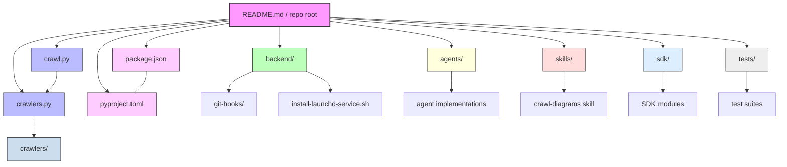

# Diagram: common/location_service/config/config.alpha.yml

> Auto-generated by Obscura crawlers

## Mermaid

### SVG

<svg id="container" width="1832.48828125" xmlns="http://www.w3.org/2000/svg" class="flowchart" height="382" viewBox="0 0 1832.48828125 382" role="graphics-document document" aria-roledescription="flowchart-v2"><g><marker id="container_flowchart-v2-pointEnd" class="marker flowchart-v2" viewBox="0 0 10 10" refX="5" refY="5" markerUnits="userSpaceOnUse" markerWidth="8" markerHeight="8" orient="auto"><path d="M 0 0 L 10 5 L 0 10 z" class="arrowMarkerPath" style="stroke-width: 1; stroke-dasharray: 1, 0;"></path></marker><marker id="container_flowchart-v2-pointStart" class="marker flowchart-v2" viewBox="0 0 10 10" refX="4.5" refY="5" markerUnits="userSpaceOnUse" markerWidth="8" markerHeight="8" orient="auto"><path d="M 0 5 L 10 10 L 10 0 z" class="arrowMarkerPath" style="stroke-width: 1; stroke-dasharray: 1, 0;"></path></marker><marker id="container_flowchart-v2-circleEnd" class="marker flowchart-v2" viewBox="0 0 10 10" refX="11" refY="5" markerUnits="userSpaceOnUse" markerWidth="11" markerHeight="11" orient="auto"><circle cx="5" cy="5" r="5" class="arrowMarkerPath" style="stroke-width: 1; stroke-dasharray: 1, 0;"></circle></marker><marker id="container_flowchart-v2-circleStart" class="marker flowchart-v2" viewBox="0 0 10 10" refX="-1" refY="5" markerUnits="userSpaceOnUse" markerWidth="11" markerHeight="11" orient="auto"><circle cx="5" cy="5" r="5" class="arrowMarkerPath" style="stroke-width: 1; stroke-dasharray: 1, 0;"></circle></marker><marker id="container_flowchart-v2-crossEnd" class="marker cross flowchart-v2" viewBox="0 0 11 11" refX="12" refY="5.2" markerUnits="userSpaceOnUse" markerWidth="11" markerHeight="11" orient="auto"><path d="M 1,1 l 9,9 M 10,1 l -9,9" class="arrowMarkerPath" style="stroke-width: 2; stroke-dasharray: 1, 0;"></path></marker><marker id="container_flowchart-v2-crossStart" class="marker cross flowchart-v2" viewBox="0 0 11 11" refX="-1" refY="5.2" markerUnits="userSpaceOnUse" markerWidth="11" markerHeight="11" orient="auto"><path d="M 1,1 l 9,9 M 10,1 l -9,9" class="arrowMarkerPath" style="stroke-width: 2; stroke-dasharray: 1, 0;"></path></marker><g class="root"><g class="clusters"></g><g class="edgePaths"><path d="M541.301,46.434L473.237,53.195C405.173,59.956,269.046,73.478,200.982,83.739C132.918,94,132.918,101,132.918,104.5L132.918,108" id="L_A_B_0" class="edge-thickness-normal edge-pattern-solid edge-thickness-normal edge-pattern-solid flowchart-link" style=";" data-edge="true" data-et="edge" data-id="L_A_B_0" data-points="W3sieCI6NTQxLjMwMDc4MTI1LCJ5Ijo0Ni40MzM1NDMyNjQ3ODIyNn0seyJ4IjoxMzIuOTE3OTY4NzUsInkiOjg3fSx7IngiOjEzMi45MTc5Njg3NSwieSI6MTEyfV0=" marker-end="url(#container_flowchart-v2-pointEnd)"></path><path d="M541.301,44.575L456.302,51.646C371.303,58.717,201.306,72.858,116.307,88.596C31.309,104.333,31.309,121.667,31.309,139C31.309,156.333,31.309,173.667,34.651,186.007C37.994,198.347,44.679,205.694,48.022,209.368L51.365,213.041" id="L_A_C_0" class="edge-thickness-normal edge-pattern-solid edge-thickness-normal edge-pattern-solid flowchart-link" style=";" data-edge="true" data-et="edge" data-id="L_A_C_0" data-points="W3sieCI6NTQxLjMwMDc4MTI1LCJ5Ijo0NC41NzUwMTM3NDc5Mzc4MX0seyJ4IjozMS4zMDg1OTM3NSwieSI6ODd9LHsieCI6MzEuMzA4NTkzNzUsInkiOjEzOX0seyJ4IjozMS4zMDg1OTM3NSwieSI6MTkxfSx7IngiOjU0LjA1Njg2NTk4NTU3NjkyLCJ5IjoyMTZ9XQ==" marker-end="url(#container_flowchart-v2-pointEnd)"></path><path d="M656.402,62L656.402,66.167C656.402,70.333,656.402,78.667,656.402,86.333C656.402,94,656.402,101,656.402,104.5L656.402,108" id="L_A_D_0" class="edge-thickness-normal edge-pattern-solid edge-thickness-normal edge-pattern-solid flowchart-link" style=";" data-edge="true" data-et="edge" data-id="L_A_D_0" data-points="W3sieCI6NjU2LjQwMjM0Mzc1LCJ5Ijo2Mn0seyJ4Ijo2NTYuNDAyMzQzNzUsInkiOjg3fSx7IngiOjY1Ni40MDIzNDM3NSwieSI6MTEyfV0=" marker-end="url(#container_flowchart-v2-pointEnd)"></path><path d="M771.504,49.631L820.499,55.86C869.493,62.088,967.483,74.544,1016.478,84.272C1065.473,94,1065.473,101,1065.473,104.5L1065.473,108" id="L_A_E_0" class="edge-thickness-normal edge-pattern-solid edge-thickness-normal edge-pattern-solid flowchart-link" style=";" data-edge="true" data-et="edge" data-id="L_A_E_0" data-points="W3sieCI6NzcxLjUwMzkwNjI1LCJ5Ijo0OS42MzE0MjQxNTE1NjMxOX0seyJ4IjoxMDY1LjQ3MjY1NjI1LCJ5Ijo4N30seyJ4IjoxMDY1LjQ3MjY1NjI1LCJ5IjoxMTJ9XQ==" marker-end="url(#container_flowchart-v2-pointEnd)"></path><path d="M771.504,43.859L864.917,51.05C958.329,58.24,1145.155,72.62,1238.568,83.31C1331.98,94,1331.98,101,1331.98,104.5L1331.98,108" id="L_A_F_0" class="edge-thickness-normal edge-pattern-solid edge-thickness-normal edge-pattern-solid flowchart-link" style=";" data-edge="true" data-et="edge" data-id="L_A_F_0" data-points="W3sieCI6NzcxLjUwMzkwNjI1LCJ5Ijo0My44NTk0OTUzMzk2Mzk2NjV9LHsieCI6MTMzMS45ODA0Njg3NSwieSI6ODd9LHsieCI6MTMzMS45ODA0Njg3NSwieSI6MTEyfV0=" marker-end="url(#container_flowchart-v2-pointEnd)"></path><path d="M771.504,41.609L903.251,49.174C1034.999,56.74,1298.493,71.87,1430.241,82.935C1561.988,94,1561.988,101,1561.988,104.5L1561.988,108" id="L_A_G_0" class="edge-thickness-normal edge-pattern-solid edge-thickness-normal edge-pattern-solid flowchart-link" style=";" data-edge="true" data-et="edge" data-id="L_A_G_0" data-points="W3sieCI6NzcxLjUwMzkwNjI1LCJ5Ijo0MS42MDkyOTEyOTEwMzIyMn0seyJ4IjoxNTYxLjk4ODI4MTI1LCJ5Ijo4N30seyJ4IjoxNTYxLjk4ODI4MTI1LCJ5IjoxMTJ9XQ==" marker-end="url(#container_flowchart-v2-pointEnd)"></path><path d="M771.504,40.438L935.77,48.198C1100.035,55.958,1428.566,71.479,1592.832,82.74C1757.098,94,1757.098,101,1757.098,104.5L1757.098,108" id="L_A_H_0" class="edge-thickness-normal edge-pattern-solid edge-thickness-normal edge-pattern-solid flowchart-link" style=";" data-edge="true" data-et="edge" data-id="L_A_H_0" data-points="W3sieCI6NzcxLjUwMzkwNjI1LCJ5Ijo0MC40Mzc3Mjc1NzI3NzAwNX0seyJ4IjoxNzU3LjA5NzY1NjI1LCJ5Ijo4N30seyJ4IjoxNzU3LjA5NzY1NjI1LCJ5IjoxMTJ9XQ==" marker-end="url(#container_flowchart-v2-pointEnd)"></path><path d="M541.301,53.87L507.621,59.392C473.941,64.914,406.582,75.957,372.902,84.978C339.223,94,339.223,101,339.223,104.5L339.223,108" id="L_A_I_0" class="edge-thickness-normal edge-pattern-solid edge-thickness-normal edge-pattern-solid flowchart-link" style=";" data-edge="true" data-et="edge" data-id="L_A_I_0" data-points="W3sieCI6NTQxLjMwMDc4MTI1LCJ5Ijo1My44NzAzMTcwMDI4ODE4NX0seyJ4IjozMzkuMjIyNjU2MjUsInkiOjg3fSx7IngiOjMzOS4yMjI2NTYyNSwieSI6MTEyfV0=" marker-end="url(#container_flowchart-v2-pointEnd)"></path><path d="M541.301,48.957L489.009,55.297C436.717,61.638,332.134,74.319,279.842,89.326C227.551,104.333,227.551,121.667,227.551,139C227.551,156.333,227.551,173.667,231.537,186.046C235.523,198.425,243.495,205.849,247.482,209.562L251.468,213.274" id="L_A_J_0" class="edge-thickness-normal edge-pattern-solid edge-thickness-normal edge-pattern-solid flowchart-link" style=";" data-edge="true" data-et="edge" data-id="L_A_J_0" data-points="W3sieCI6NTQxLjMwMDc4MTI1LCJ5Ijo0OC45NTY1MzM2MTk5NTE1NH0seyJ4IjoyMjcuNTUwNzgxMjUsInkiOjg3fSx7IngiOjIyNy41NTA3ODEyNSwieSI6MTM5fSx7IngiOjIyNy41NTA3ODEyNSwieSI6MTkxfSx7IngiOjI1NC4zOTQ5ODE5NzExNTM4NCwieSI6MjE2fV0=" marker-end="url(#container_flowchart-v2-pointEnd)"></path><path d="M132.918,166L132.918,170.167C132.918,174.333,132.918,182.667,129.049,190.539C125.18,198.411,117.442,205.822,113.573,209.528L109.704,213.233" id="L_B_C_0" class="edge-thickness-normal edge-pattern-solid edge-thickness-normal edge-pattern-solid flowchart-link" style=";" data-edge="true" data-et="edge" data-id="L_B_C_0" data-points="W3sieCI6MTMyLjkxNzk2ODc1LCJ5IjoxNjZ9LHsieCI6MTMyLjkxNzk2ODc1LCJ5IjoxOTF9LHsieCI6MTA2LjgxNTU3OTkyNzg4NDYxLCJ5IjoyMTZ9XQ==" marker-end="url(#container_flowchart-v2-pointEnd)"></path><path d="M78.625,270L78.625,274.167C78.625,278.333,78.625,286.667,78.625,294.333C78.625,302,78.625,309,78.625,312.5L78.625,316" id="L_C_K_0" class="edge-thickness-normal edge-pattern-solid edge-thickness-normal edge-pattern-solid flowchart-link" style=";" data-edge="true" data-et="edge" data-id="L_C_K_0" data-points="W3sieCI6NzguNjI1LCJ5IjoyNzB9LHsieCI6NzguNjI1LCJ5IjoyOTV9LHsieCI6NzguNjI1LCJ5IjozMjB9XQ==" marker-end="url(#container_flowchart-v2-pointEnd)"></path><path d="M593.567,166L583.871,170.167C574.174,174.333,554.78,182.667,545.083,190.333C535.387,198,535.387,205,535.387,208.5L535.387,212" id="L_D_L_0" class="edge-thickness-normal edge-pattern-solid edge-thickness-normal edge-pattern-solid flowchart-link" style=";" data-edge="true" data-et="edge" data-id="L_D_L_0" data-points="W3sieCI6NTkzLjU2NzMwNzY5MjMwNzcsInkiOjE2Nn0seyJ4Ijo1MzUuMzg2NzE4NzUsInkiOjE5MX0seyJ4Ijo1MzUuMzg2NzE4NzUsInkiOjIxNn1d" marker-end="url(#container_flowchart-v2-pointEnd)"></path><path d="M719.237,166L728.934,170.167C738.631,174.333,758.024,182.667,767.721,190.333C777.418,198,777.418,205,777.418,208.5L777.418,212" id="L_D_M_0" class="edge-thickness-normal edge-pattern-solid edge-thickness-normal edge-pattern-solid flowchart-link" style=";" data-edge="true" data-et="edge" data-id="L_D_M_0" data-points="W3sieCI6NzE5LjIzNzM3OTgwNzY5MjMsInkiOjE2Nn0seyJ4Ijo3NzcuNDE3OTY4NzUsInkiOjE5MX0seyJ4Ijo3NzcuNDE3OTY4NzUsInkiOjIxNn1d" marker-end="url(#container_flowchart-v2-pointEnd)"></path><path d="M1065.473,166L1065.473,170.167C1065.473,174.333,1065.473,182.667,1065.473,190.333C1065.473,198,1065.473,205,1065.473,208.5L1065.473,212" id="L_E_N_0" class="edge-thickness-normal edge-pattern-solid edge-thickness-normal edge-pattern-solid flowchart-link" style=";" data-edge="true" data-et="edge" data-id="L_E_N_0" data-points="W3sieCI6MTA2NS40NzI2NTYyNSwieSI6MTY2fSx7IngiOjEwNjUuNDcyNjU2MjUsInkiOjE5MX0seyJ4IjoxMDY1LjQ3MjY1NjI1LCJ5IjoyMTZ9XQ==" marker-end="url(#container_flowchart-v2-pointEnd)"></path><path d="M1331.98,166L1331.98,170.167C1331.98,174.333,1331.98,182.667,1331.98,190.333C1331.98,198,1331.98,205,1331.98,208.5L1331.98,212" id="L_F_O_0" class="edge-thickness-normal edge-pattern-solid edge-thickness-normal edge-pattern-solid flowchart-link" style=";" data-edge="true" data-et="edge" data-id="L_F_O_0" data-points="W3sieCI6MTMzMS45ODA0Njg3NSwieSI6MTY2fSx7IngiOjEzMzEuOTgwNDY4NzUsInkiOjE5MX0seyJ4IjoxMzMxLjk4MDQ2ODc1LCJ5IjoyMTZ9XQ==" marker-end="url(#container_flowchart-v2-pointEnd)"></path><path d="M1561.988,166L1561.988,170.167C1561.988,174.333,1561.988,182.667,1561.988,190.333C1561.988,198,1561.988,205,1561.988,208.5L1561.988,212" id="L_G_P_0" class="edge-thickness-normal edge-pattern-solid edge-thickness-normal edge-pattern-solid flowchart-link" style=";" data-edge="true" data-et="edge" data-id="L_G_P_0" data-points="W3sieCI6MTU2MS45ODgyODEyNSwieSI6MTY2fSx7IngiOjE1NjEuOTg4MjgxMjUsInkiOjE5MX0seyJ4IjoxNTYxLjk4ODI4MTI1LCJ5IjoyMTZ9XQ==" marker-end="url(#container_flowchart-v2-pointEnd)"></path><path d="M1757.098,166L1757.098,170.167C1757.098,174.333,1757.098,182.667,1757.098,190.333C1757.098,198,1757.098,205,1757.098,208.5L1757.098,212" id="L_H_Q_0" class="edge-thickness-normal edge-pattern-solid edge-thickness-normal edge-pattern-solid flowchart-link" style=";" data-edge="true" data-et="edge" data-id="L_H_Q_0" data-points="W3sieCI6MTc1Ny4wOTc2NTYyNSwieSI6MTY2fSx7IngiOjE3NTcuMDk3NjU2MjUsInkiOjE5MX0seyJ4IjoxNzU3LjA5NzY1NjI1LCJ5IjoyMTZ9XQ==" marker-end="url(#container_flowchart-v2-pointEnd)"></path><path d="M339.223,166L339.223,170.167C339.223,174.333,339.223,182.667,334.749,191C330.275,199.333,321.327,207.667,316.852,211.833L312.378,216" id="L_I_J_0" class="edge-thickness-normal edge-pattern-solid edge-thickness-normal edge-pattern-solid flowchart-link" style=";" data-edge="true" data-et="edge" data-id="L_I_J_0" data-points="W3sieCI6MzM5LjIyMjY1NjI1LCJ5IjoxNjZ9LHsieCI6MzM5LjIyMjY1NjI1LCJ5IjoxOTF9LHsieCI6MzEyLjM3ODQ1NTUyODg0NjEzLCJ5IjoyMTZ9XQ=="></path></g><g class="edgeLabels"><g class="edgeLabel"><g class="label" data-id="L_A_B_0" transform="translate(0, 0)"><foreignObject width="0" height="0">

</foreignObject></g></g><g class="edgeLabel"><g class="label" data-id="L_A_C_0" transform="translate(0, 0)"><foreignObject width="0" height="0">

</foreignObject></g></g><g class="edgeLabel"><g class="label" data-id="L_A_D_0" transform="translate(0, 0)"><foreignObject width="0" height="0">

</foreignObject></g></g><g class="edgeLabel"><g class="label" data-id="L_A_E_0" transform="translate(0, 0)"><foreignObject width="0" height="0">

</foreignObject></g></g><g class="edgeLabel"><g class="label" data-id="L_A_F_0" transform="translate(0, 0)"><foreignObject width="0" height="0">

</foreignObject></g></g><g class="edgeLabel"><g class="label" data-id="L_A_G_0" transform="translate(0, 0)"><foreignObject width="0" height="0">

</foreignObject></g></g><g class="edgeLabel"><g class="label" data-id="L_A_H_0" transform="translate(0, 0)"><foreignObject width="0" height="0">

</foreignObject></g></g><g class="edgeLabel"><g class="label" data-id="L_A_I_0" transform="translate(0, 0)"><foreignObject width="0" height="0">

</foreignObject></g></g><g class="edgeLabel"><g class="label" data-id="L_A_J_0" transform="translate(0, 0)"><foreignObject width="0" height="0">

</foreignObject></g></g><g class="edgeLabel"><g class="label" data-id="L_B_C_0" transform="translate(0, 0)"><foreignObject width="0" height="0">

</foreignObject></g></g><g class="edgeLabel"><g class="label" data-id="L_C_K_0" transform="translate(0, 0)"><foreignObject width="0" height="0">

</foreignObject></g></g><g class="edgeLabel"><g class="label" data-id="L_D_L_0" transform="translate(0, 0)"><foreignObject width="0" height="0">

</foreignObject></g></g><g class="edgeLabel"><g class="label" data-id="L_D_M_0" transform="translate(0, 0)"><foreignObject width="0" height="0">

</foreignObject></g></g><g class="edgeLabel"><g class="label" data-id="L_E_N_0" transform="translate(0, 0)"><foreignObject width="0" height="0">

</foreignObject></g></g><g class="edgeLabel"><g class="label" data-id="L_F_O_0" transform="translate(0, 0)"><foreignObject width="0" height="0">

</foreignObject></g></g><g class="edgeLabel"><g class="label" data-id="L_G_P_0" transform="translate(0, 0)"><foreignObject width="0" height="0">

</foreignObject></g></g><g class="edgeLabel"><g class="label" data-id="L_H_Q_0" transform="translate(0, 0)"><foreignObject width="0" height="0">

</foreignObject></g></g><g class="edgeLabel"><g class="label" data-id="L_I_J_0" transform="translate(0, 0)"><foreignObject width="0" height="0">

</foreignObject></g></g></g><g class="nodes"><g class="node default" id="flowchart-A-0" transform="translate(656.40234375, 35)"><rect class="basic label-container" style="fill:#f9f !important;stroke:#333 !important;stroke-width:2px !important" x="-115.1015625" y="-27" width="230.203125" height="54"></rect><g class="label" style="" transform="translate(-85.1015625, -12)"><rect></rect><foreignObject width="170.203125" height="24">

README.md / repo root

</foreignObject></g></g><g class="node default" id="flowchart-B-1" transform="translate(132.91796875, 139)"><rect class="basic label-container" style="fill:#bbf !important;stroke:#333 !important" x="-59.6328125" y="-27" width="119.265625" height="54"></rect><g class="label" style="" transform="translate(-29.6328125, -12)"><rect></rect><foreignObject width="59.265625" height="24">

crawl.py

</foreignObject></g></g><g class="node default" id="flowchart-C-3" transform="translate(78.625, 243)"><rect class="basic label-container" style="fill:#bbf !important;stroke:#333 !important" x="-70.625" y="-27" width="141.25" height="54"></rect><g class="label" style="" transform="translate(-40.625, -12)"><rect></rect><foreignObject width="81.25" height="24">

crawlers.py

</foreignObject></g></g><g class="node default" id="flowchart-D-5" transform="translate(656.40234375, 139)"><rect class="basic label-container" style="fill:#bfb !important;stroke:#333 !important" x="-64.8671875" y="-27" width="129.734375" height="54"></rect><g class="label" style="" transform="translate(-34.8671875, -12)"><rect></rect><foreignObject width="69.734375" height="24">

backend/

</foreignObject></g></g><g class="node default" id="flowchart-E-7" transform="translate(1065.47265625, 139)"><rect class="basic label-container" style="fill:#ffd !important;stroke:#333 !important" x="-58.140625" y="-27" width="116.28125" height="54"></rect><g class="label" style="" transform="translate(-28.140625, -12)"><rect></rect><foreignObject width="56.28125" height="24">

agents/

</foreignObject></g></g><g class="node default" id="flowchart-F-9" transform="translate(1331.98046875, 139)"><rect class="basic label-container" style="fill:#fdd !important;stroke:#333 !important" x="-52.6796875" y="-27" width="105.359375" height="54"></rect><g class="label" style="" transform="translate(-22.6796875, -12)"><rect></rect><foreignObject width="45.359375" height="24">

skills/

</foreignObject></g></g><g class="node default" id="flowchart-G-11" transform="translate(1561.98828125, 139)"><rect class="basic label-container" style="fill:#def !important;stroke:#333 !important" x="-46.78125" y="-27" width="93.5625" height="54"></rect><g class="label" style="" transform="translate(-16.78125, -12)"><rect></rect><foreignObject width="33.5625" height="24">

sdk/

</foreignObject></g></g><g class="node default" id="flowchart-H-13" transform="translate(1757.09765625, 139)"><rect class="basic label-container" style="fill:#eee !important;stroke:#333 !important" x="-51.6484375" y="-27" width="103.296875" height="54"></rect><g class="label" style="" transform="translate(-21.6484375, -12)"><rect></rect><foreignObject width="43.296875" height="24">

tests/

</foreignObject></g></g><g class="node default" id="flowchart-I-15" transform="translate(339.22265625, 139)"><rect class="basic label-container" style="fill:#fcf !important;stroke:#333 !important" x="-76.671875" y="-27" width="153.34375" height="54"></rect><g class="label" style="" transform="translate(-46.671875, -12)"><rect></rect><foreignObject width="93.34375" height="24">

package.json

</foreignObject></g></g><g class="node default" id="flowchart-J-17" transform="translate(283.38671875, 243)"><rect class="basic label-container" style="fill:#fcf !important;stroke:#333 !important" x="-82.59375" y="-27" width="165.1875" height="54"></rect><g class="label" style="" transform="translate(-52.59375, -12)"><rect></rect><foreignObject width="105.1875" height="24">

pyproject.toml

</foreignObject></g></g><g class="node default" id="flowchart-K-21" transform="translate(78.625, 347)"><rect class="basic label-container" style="fill:#cde !important;stroke:#333 !important" x="-64.2109375" y="-27" width="128.421875" height="54"></rect><g class="label" style="" transform="translate(-34.2109375, -12)"><rect></rect><foreignObject width="68.421875" height="24">

crawlers/

</foreignObject></g></g><g class="node default" id="flowchart-L-23" transform="translate(535.38671875, 243)"><rect class="basic label-container" style="" x="-68.1953125" y="-27" width="136.390625" height="54"></rect><g class="label" style="" transform="translate(-38.1953125, -12)"><rect></rect><foreignObject width="76.390625" height="24">

git-hooks/

</foreignObject></g></g><g class="node default" id="flowchart-M-25" transform="translate(777.41796875, 243)"><rect class="basic label-container" style="" x="-123.8359375" y="-27" width="247.671875" height="54"></rect><g class="label" style="" transform="translate(-93.8359375, -12)"><rect></rect><foreignObject width="187.671875" height="24">

install-launchd-service.sh

</foreignObject></g></g><g class="node default" id="flowchart-N-27" transform="translate(1065.47265625, 243)"><rect class="basic label-container" style="" x="-114.21875" y="-27" width="228.4375" height="54"></rect><g class="label" style="" transform="translate(-84.21875, -12)"><rect></rect><foreignObject width="168.4375" height="24">

agent implementations

</foreignObject></g></g><g class="node default" id="flowchart-O-29" transform="translate(1331.98046875, 243)"><rect class="basic label-container" style="" x="-102.2890625" y="-27" width="204.578125" height="54"></rect><g class="label" style="" transform="translate(-72.2890625, -12)"><rect></rect><foreignObject width="144.578125" height="24">

crawl-diagrams skill

</foreignObject></g></g><g class="node default" id="flowchart-P-31" transform="translate(1561.98828125, 243)"><rect class="basic label-container" style="" x="-77.71875" y="-27" width="155.4375" height="54"></rect><g class="label" style="" transform="translate(-47.71875, -12)"><rect></rect><foreignObject width="95.4375" height="24">

SDK modules

</foreignObject></g></g><g class="node default" id="flowchart-Q-33" transform="translate(1757.09765625, 243)"><rect class="basic label-container" style="" x="-67.390625" y="-27" width="134.78125" height="54"></rect><g class="label" style="" transform="translate(-37.390625, -12)"><rect></rect><foreignObject width="74.78125" height="24">

test suites

</foreignObject></g></g></g></g></g></svg>
