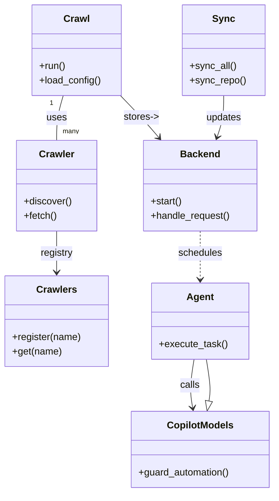

# Diagram: common/location_service/config/config.dev.yml


> Auto-generated by Obscura crawlers

## Diagram 1



### SVG

<svg id="container" width="449.474609375" xmlns="http://www.w3.org/2000/svg" class="classDiagram" height="814" viewBox="0 0 449.474609375 814" role="graphics-document document" aria-roledescription="class"><style>#container{font-family:"trebuchet ms",verdana,arial,sans-serif;font-size:16px;fill:#333;}@keyframes edge-animation-frame{from{stroke-dashoffset:0;}}@keyframes dash{to{stroke-dashoffset:0;}}#container .edge-animation-slow{stroke-dasharray:9,5!important;stroke-dashoffset:900;animation:dash 50s linear infinite;stroke-linecap:round;}#container .edge-animation-fast{stroke-dasharray:9,5!important;stroke-dashoffset:900;animation:dash 20s linear infinite;stroke-linecap:round;}#container .error-icon{fill:#552222;}#container .error-text{fill:#552222;stroke:#552222;}#container .edge-thickness-normal{stroke-width:1px;}#container .edge-thickness-thick{stroke-width:3.5px;}#container .edge-pattern-solid{stroke-dasharray:0;}#container .edge-thickness-invisible{stroke-width:0;fill:none;}#container .edge-pattern-dashed{stroke-dasharray:3;}#container .edge-pattern-dotted{stroke-dasharray:2;}#container .marker{fill:#333333;stroke:#333333;}#container .marker.cross{stroke:#333333;}#container svg{font-family:"trebuchet ms",verdana,arial,sans-serif;font-size:16px;}#container p{margin:0;}#container g.classGroup text{fill:#9370DB;stroke:none;font-family:"trebuchet ms",verdana,arial,sans-serif;font-size:10px;}#container g.classGroup text .title{font-weight:bolder;}#container .nodeLabel,#container .edgeLabel{color:#131300;}#container .edgeLabel .label rect{fill:#ECECFF;}#container .label text{fill:#131300;}#container .labelBkg{background:#ECECFF;}#container .edgeLabel .label span{background:#ECECFF;}#container .classTitle{font-weight:bolder;}#container .node rect,#container .node circle,#container .node ellipse,#container .node polygon,#container .node path{fill:#ECECFF;stroke:#9370DB;stroke-width:1px;}#container .divider{stroke:#9370DB;stroke-width:1;}#container g.clickable{cursor:pointer;}#container g.classGroup rect{fill:#ECECFF;stroke:#9370DB;}#container g.classGroup line{stroke:#9370DB;stroke-width:1;}#container .classLabel .box{stroke:none;stroke-width:0;fill:#ECECFF;opacity:0.5;}#container .classLabel .label{fill:#9370DB;font-size:10px;}#container .relation{stroke:#333333;stroke-width:1;fill:none;}#container .dashed-line{stroke-dasharray:3;}#container .dotted-line{stroke-dasharray:1 2;}#container #compositionStart,#container .composition{fill:#333333!important;stroke:#333333!important;stroke-width:1;}#container #compositionEnd,#container .composition{fill:#333333!important;stroke:#333333!important;stroke-width:1;}#container #dependencyStart,#container .dependency{fill:#333333!important;stroke:#333333!important;stroke-width:1;}#container #dependencyStart,#container .dependency{fill:#333333!important;stroke:#333333!important;stroke-width:1;}#container #extensionStart,#container .extension{fill:transparent!important;stroke:#333333!important;stroke-width:1;}#container #extensionEnd,#container .extension{fill:transparent!important;stroke:#333333!important;stroke-width:1;}#container #aggregationStart,#container .aggregation{fill:transparent!important;stroke:#333333!important;stroke-width:1;}#container #aggregationEnd,#container .aggregation{fill:transparent!important;stroke:#333333!important;stroke-width:1;}#container #lollipopStart,#container .lollipop{fill:#ECECFF!important;stroke:#333333!important;stroke-width:1;}#container #lollipopEnd,#container .lollipop{fill:#ECECFF!important;stroke:#333333!important;stroke-width:1;}#container .edgeTerminals{font-size:11px;line-height:initial;}#container .classTitleText{text-anchor:middle;font-size:18px;fill:#333;}#container .label-icon{display:inline-block;height:1em;overflow:visible;vertical-align:-0.125em;}#container .node .label-icon path{fill:currentColor;stroke:revert;stroke-width:revert;}#container :root{--mermaid-font-family:"trebuchet ms",verdana,arial,sans-serif;}</style><g><defs><marker id="container_class-aggregationStart" class="marker aggregation class" refX="18" refY="7" markerWidth="190" markerHeight="240" orient="auto"><path d="M 18,7 L9,13 L1,7 L9,1 Z"></path></marker></defs><defs><marker id="container_class-aggregationEnd" class="marker aggregation class" refX="1" refY="7" markerWidth="20" markerHeight="28" orient="auto"><path d="M 18,7 L9,13 L1,7 L9,1 Z"></path></marker></defs><defs><marker id="container_class-extensionStart" class="marker extension class" refX="18" refY="7" markerWidth="190" markerHeight="240" orient="auto"><path d="M 1,7 L18,13 V 1 Z"></path></marker></defs><defs><marker id="container_class-extensionEnd" class="marker extension class" refX="1" refY="7" markerWidth="20" markerHeight="28" orient="auto"><path d="M 1,1 V 13 L18,7 Z"></path></marker></defs><defs><marker id="container_class-compositionStart" class="marker composition class" refX="18" refY="7" markerWidth="190" markerHeight="240" orient="auto"><path d="M 18,7 L9,13 L1,7 L9,1 Z"></path></marker></defs><defs><marker id="container_class-compositionEnd" class="marker composition class" refX="1" refY="7" markerWidth="20" markerHeight="28" orient="auto"><path d="M 18,7 L9,13 L1,7 L9,1 Z"></path></marker></defs><defs><marker id="container_class-dependencyStart" class="marker dependency class" refX="6" refY="7" markerWidth="190" markerHeight="240" orient="auto"><path d="M 5,7 L9,13 L1,7 L9,1 Z"></path></marker></defs><defs><marker id="container_class-dependencyEnd" class="marker dependency class" refX="13" refY="7" markerWidth="20" markerHeight="28" orient="auto"><path d="M 18,7 L9,13 L14,7 L9,1 Z"></path></marker></defs><defs><marker id="container_class-lollipopStart" class="marker lollipop class" refX="13" refY="7" markerWidth="190" markerHeight="240" orient="auto"><circle stroke="black" fill="transparent" cx="7" cy="7" r="6"></circle></marker></defs><defs><marker id="container_class-lollipopEnd" class="marker lollipop class" refX="1" refY="7" markerWidth="190" markerHeight="240" orient="auto"><circle stroke="black" fill="transparent" cx="7" cy="7" r="6"></circle></marker></defs><g class="root"><g class="clusters"></g><g class="edgePaths"><path d="M103.627,158L101.817,164.167C100.007,170.333,96.386,182.667,94.576,195C92.766,207.333,92.766,219.667,92.766,225.833L92.766,232" id="id_Crawl_Crawler_1" class="edge-thickness-normal edge-pattern-solid relation" style=";;;" data-edge="true" data-et="edge" data-id="id_Crawl_Crawler_1" data-points="W3sieCI6MTAzLjYyNzQwNjUyOTAxNzg2LCJ5IjoxNTh9LHsieCI6OTIuNzY1NjI1LCJ5IjoxOTV9LHsieCI6OTIuNzY1NjI1LCJ5IjoyMzJ9XQ=="></path><path d="M92.766,382L92.766,388.167C92.766,394.333,92.766,406.667,92.766,418C92.766,429.333,92.766,439.667,92.766,444.833L92.766,450" id="id_Crawler_Crawlers_2" class="edge-thickness-normal edge-pattern-solid relation" style=";;;" data-edge="true" data-et="edge" data-id="id_Crawler_Crawlers_2" data-points="W3sieCI6OTIuNzY1NjI1LCJ5IjozODJ9LHsieCI6OTIuNzY1NjI1LCJ5Ijo0MTl9LHsieCI6OTIuNzY1NjI1LCJ5Ijo0NTZ9XQ==" marker-end="url(#container_class-dependencyEnd)"></path><path d="M197.043,158L202.913,164.167C208.784,170.333,220.525,182.667,230.97,194.237C241.415,205.807,250.564,216.614,255.138,222.017L259.713,227.421" id="id_Crawl_Backend_3" class="edge-thickness-normal edge-pattern-solid relation" style=";;;" data-edge="true" data-et="edge" data-id="id_Crawl_Backend_3" data-points="W3sieCI6MTk3LjA0MjU4NTEwMDQ0NjQ0LCJ5IjoxNTh9LHsieCI6MjMyLjI2NTYyNSwieSI6MTk1fSx7IngiOjI2My41ODk1NDcyOTM1MjY4LCJ5IjoyMzJ9XQ==" marker-end="url(#container_class-dependencyEnd)"></path><path d="M366.424,158L366.424,164.167C366.424,170.333,366.424,182.667,364.589,194.057C362.755,205.446,359.085,215.893,357.251,221.116L355.416,226.339" id="id_Sync_Backend_4" class="edge-thickness-normal edge-pattern-solid relation" style=";;;" data-edge="true" data-et="edge" data-id="id_Sync_Backend_4" data-points="W3sieCI6MzY2LjQyMzgyODEyNSwieSI6MTU4fSx7IngiOjM2Ni40MjM4MjgxMjUsInkiOjE5NX0seyJ4IjozNTMuNDI3NjI5NzQzMzAzNTYsInkiOjIzMn1d" marker-end="url(#container_class-dependencyEnd)"></path><path d="M316.834,594L315.505,602.167C314.176,610.333,311.519,626.667,311.135,640.016C310.75,653.366,312.639,663.731,313.584,668.914L314.528,674.097" id="id_Agent_CopilotModels_5" class="edge-thickness-normal edge-pattern-solid relation" style=";;;" data-edge="true" data-et="edge" data-id="id_Agent_CopilotModels_5" data-points="W3sieCI6MzE2LjgzMzc0MDIzNDM3NSwieSI6NTk0fSx7IngiOjMwOC44NjEzMjgxMjUsInkiOjY0M30seyJ4IjozMTUuNjAzNzEwOTM3NSwieSI6NjgwfV0=" marker-end="url(#container_class-dependencyEnd)"></path><path d="M327.084,382L327.084,388.167C327.084,394.333,327.084,406.667,327.084,420C327.084,433.333,327.084,447.667,327.084,454.833L327.084,462" id="id_Backend_Agent_6" class="edge-thickness-normal edge-pattern-dashed relation" style=";;;" data-edge="true" data-et="edge" data-id="id_Backend_Agent_6" data-points="W3sieCI6MzI3LjA4Mzk4NDM3NSwieSI6MzgyfSx7IngiOjMyNy4wODM5ODQzNzUsInkiOjQxOX0seyJ4IjozMjcuMDgzOTg0Mzc1LCJ5Ijo0Njh9XQ==" marker-end="url(#container_class-dependencyEnd)"></path><path d="M341.657,663.029L342.265,659.691C342.873,656.353,344.09,649.676,343.37,638.172C342.649,626.667,339.992,610.333,338.663,602.167L337.334,594" id="id_CopilotModels_Agent_7" class="edge-thickness-normal edge-pattern-solid relation" style=";;;" data-edge="true" data-et="edge" data-id="id_CopilotModels_Agent_7" data-points="W3sieCI6MzM4LjU2NDI1NzgxMjUsInkiOjY4MH0seyJ4IjozNDUuMzA2NjQwNjI1LCJ5Ijo2NDN9LHsieCI6MzM3LjMzNDIyODUxNTYyNSwieSI6NTk0fV0=" marker-start="url(#container_class-extensionStart)"></path></g><g class="edgeLabels"><g class="edgeLabel" transform="translate(92.765625, 195)"><g class="label" data-id="id_Crawl_Crawler_1" transform="translate(-16.4921875, -12)"><foreignObject width="32.984375" height="24"><div xmlns="http://www.w3.org/1999/xhtml" class="labelBkg" style="display: table-cell; white-space: nowrap; line-height: 1.5; max-width: 200px; text-align: center;"><span class="edgeLabel"><p>uses</p></span></div></foreignObject></g></g><g class="edgeLabel" transform="translate(92.765625, 419)"><g class="label" data-id="id_Crawler_Crawlers_2" transform="translate(-27.2734375, -12)"><foreignObject width="54.546875" height="24"><div xmlns="http://www.w3.org/1999/xhtml" class="labelBkg" style="display: table-cell; white-space: nowrap; line-height: 1.5; max-width: 200px; text-align: center;"><span class="edgeLabel"><p>registry</p></span></div></foreignObject></g></g><g class="edgeLabel" transform="translate(231.36717, 194.05621)"><g class="label" data-id="id_Crawl_Backend_3" transform="translate(-29.265625, -12)"><foreignObject width="58.53125" height="24"><div xmlns="http://www.w3.org/1999/xhtml" class="labelBkg" style="display: table-cell; white-space: nowrap; line-height: 1.5; max-width: 200px; text-align: center;"><span class="edgeLabel"><p>stores-&gt;</p></span></div></foreignObject></g></g><g class="edgeLabel" transform="translate(366.423828125, 195)"><g class="label" data-id="id_Sync_Backend_4" transform="translate(-29.4140625, -12)"><foreignObject width="58.828125" height="24"><div xmlns="http://www.w3.org/1999/xhtml" class="labelBkg" style="display: table-cell; white-space: nowrap; line-height: 1.5; max-width: 200px; text-align: center;"><span class="edgeLabel"><p>updates</p></span></div></foreignObject></g></g><g class="edgeLabel" transform="translate(309.82768, 637.06059)"><g class="label" data-id="id_Agent_CopilotModels_5" transform="translate(-16.4453125, -12)"><foreignObject width="32.890625" height="24"><div xmlns="http://www.w3.org/1999/xhtml" class="labelBkg" style="display: table-cell; white-space: nowrap; line-height: 1.5; max-width: 200px; text-align: center;"><span class="edgeLabel"><p>calls</p></span></div></foreignObject></g></g><g class="edgeLabel" transform="translate(327.083984375, 419)"><g class="label" data-id="id_Backend_Agent_6" transform="translate(-36.453125, -12)"><foreignObject width="72.90625" height="24"><div xmlns="http://www.w3.org/1999/xhtml" class="labelBkg" style="display: table-cell; white-space: nowrap; line-height: 1.5; max-width: 200px; text-align: center;"><span class="edgeLabel"><p>schedules</p></span></div></foreignObject></g></g><g class="edgeLabel"><g class="label" data-id="id_CopilotModels_Agent_7" transform="translate(0, 0)"><foreignObject width="0" height="0"><div xmlns="http://www.w3.org/1999/xhtml" class="labelBkg" style="display: table-cell; white-space: nowrap; line-height: 1.5; max-width: 200px; text-align: center;"><span class="edgeLabel"></span></div></foreignObject></g></g><g class="edgeTerminals" transform="translate(84.30544170826444, 170.5662898118255)"><g class="inner" transform="translate(0, 0)"><foreignObject style="width: 9px; height: 12px;"><div xmlns="http://www.w3.org/1999/xhtml" style="display: inline-block; padding-right: 1px; white-space: nowrap;"><span class="edgeLabel">1</span></div></foreignObject></g></g><g class="edgeTerminals" transform="translate(102.76562749999984, 209.50000214285714)"><g class="inner" transform="translate(0, 0)"></g><foreignObject style="width: 36px; height: 12px;"><div xmlns="http://www.w3.org/1999/xhtml" style="display: inline-block; padding-right: 1px; white-space: nowrap;"><span class="edgeLabel">many</span></div></foreignObject></g></g><g class="nodes"><g class="node default" id="classId-Crawl-0" transform="translate(125.64453125, 83)"><g class="basic label-container"><path d="M-73.06640625 -75 L73.06640625 -75 L73.06640625 75 L-73.06640625 75" stroke="none" stroke-width="0" fill="#ECECFF" style=""></path><path d="M-73.06640625 -75 C-16.298062079899218 -75, 40.470282090201565 -75, 73.06640625 -75 M-73.06640625 -75 C-23.639347236980164 -75, 25.78771177603967 -75, 73.06640625 -75 M73.06640625 -75 C73.06640625 -15.06055586354514, 73.06640625 44.87888827290972, 73.06640625 75 M73.06640625 -75 C73.06640625 -36.12300975106068, 73.06640625 2.7539804978786435, 73.06640625 75 M73.06640625 75 C36.93892404374929 75, 0.8114418374985775 75, -73.06640625 75 M73.06640625 75 C41.61848449286063 75, 10.17056273572127 75, -73.06640625 75 M-73.06640625 75 C-73.06640625 44.574924896940836, -73.06640625 14.149849793881671, -73.06640625 -75 M-73.06640625 75 C-73.06640625 40.1418889228733, -73.06640625 5.283777845746599, -73.06640625 -75" stroke="#9370DB" stroke-width="1.3" fill="none" stroke-dasharray="0 0" style=""></path></g><g class="annotation-group text" transform="translate(0, -51)"></g><g class="label-group text" transform="translate(-20.1484375, -51)"><g class="label" style="font-weight: bolder" transform="translate(0,-12)"><foreignObject width="40.296875" height="24"><div xmlns="http://www.w3.org/1999/xhtml" style="display: table-cell; white-space: nowrap; line-height: 1.5; max-width: 89px; text-align: center;"><span class="nodeLabel markdown-node-label" style=""><p>Crawl</p></span></div></foreignObject></g></g><g class="members-group text" transform="translate(-61.06640625, -3)"></g><g class="methods-group text" transform="translate(-61.06640625, 27)"><g class="label" style="" transform="translate(0,-12)"><foreignObject width="43.21875" height="24"><div xmlns="http://www.w3.org/1999/xhtml" style="display: table-cell; white-space: nowrap; line-height: 1.5; max-width: 101px; text-align: center;"><span class="nodeLabel markdown-node-label" style=""><p>+run()</p></span></div></foreignObject></g><g class="label" style="" transform="translate(0,12)"><foreignObject width="101.984375" height="24"><div xmlns="http://www.w3.org/1999/xhtml" style="display: table-cell; white-space: nowrap; line-height: 1.5; max-width: 159px; text-align: center;"><span class="nodeLabel markdown-node-label" style=""><p>+load_config()</p></span></div></foreignObject></g></g><g class="divider" style=""><path d="M-73.06640625 -27 C-22.45489993699178 -27, 28.15660637601644 -27, 73.06640625 -27 M-73.06640625 -27 C-29.027827733217713 -27, 15.010750783564575 -27, 73.06640625 -27" stroke="#9370DB" stroke-width="1.3" fill="none" stroke-dasharray="0 0" style=""></path></g><g class="divider" style=""><path d="M-73.06640625 -3 C-41.17504378684173 -3, -9.283681323683446 -3, 73.06640625 -3 M-73.06640625 -3 C-36.36401357682238 -3, 0.33837909635524 -3, 73.06640625 -3" stroke="#9370DB" stroke-width="1.3" fill="none" stroke-dasharray="0 0" style=""></path></g></g><g class="node default" id="classId-Crawler-1" transform="translate(92.765625, 307)"><g class="basic label-container"><path d="M-65.4765625 -75 L65.4765625 -75 L65.4765625 75 L-65.4765625 75" stroke="none" stroke-width="0" fill="#ECECFF" style=""></path><path d="M-65.4765625 -75 C-21.28307955627472 -75, 22.910403387450557 -75, 65.4765625 -75 M-65.4765625 -75 C-32.93362463174802 -75, -0.39068676349603493 -75, 65.4765625 -75 M65.4765625 -75 C65.4765625 -39.24631790628963, 65.4765625 -3.492635812579266, 65.4765625 75 M65.4765625 -75 C65.4765625 -24.280862699240103, 65.4765625 26.438274601519794, 65.4765625 75 M65.4765625 75 C33.43040447415328 75, 1.3842464483065555 75, -65.4765625 75 M65.4765625 75 C35.333607828183396 75, 5.190653156366793 75, -65.4765625 75 M-65.4765625 75 C-65.4765625 24.446306759822676, -65.4765625 -26.10738648035465, -65.4765625 -75 M-65.4765625 75 C-65.4765625 16.48927544593056, -65.4765625 -42.02144910813888, -65.4765625 -75" stroke="#9370DB" stroke-width="1.3" fill="none" stroke-dasharray="0 0" style=""></path></g><g class="annotation-group text" transform="translate(0, -51)"></g><g class="label-group text" transform="translate(-27.734375, -51)"><g class="label" style="font-weight: bolder" transform="translate(0,-12)"><foreignObject width="55.46875" height="24"><div xmlns="http://www.w3.org/1999/xhtml" style="display: table-cell; white-space: nowrap; line-height: 1.5; max-width: 105px; text-align: center;"><span class="nodeLabel markdown-node-label" style=""><p>Crawler</p></span></div></foreignObject></g></g><g class="members-group text" transform="translate(-53.4765625, -3)"></g><g class="methods-group text" transform="translate(-53.4765625, 27)"><g class="label" style="" transform="translate(0,-12)"><foreignObject width="79.21875" height="24"><div xmlns="http://www.w3.org/1999/xhtml" style="display: table-cell; white-space: nowrap; line-height: 1.5; max-width: 137px; text-align: center;"><span class="nodeLabel markdown-node-label" style=""><p>+discover()</p></span></div></foreignObject></g><g class="label" style="" transform="translate(0,12)"><foreignObject width="54.59375" height="24"><div xmlns="http://www.w3.org/1999/xhtml" style="display: table-cell; white-space: nowrap; line-height: 1.5; max-width: 112px; text-align: center;"><span class="nodeLabel markdown-node-label" style=""><p>+fetch()</p></span></div></foreignObject></g></g><g class="divider" style=""><path d="M-65.4765625 -27 C-28.52085490119147 -27, 8.43485269761706 -27, 65.4765625 -27 M-65.4765625 -27 C-26.289049870886757 -27, 12.898462758226486 -27, 65.4765625 -27" stroke="#9370DB" stroke-width="1.3" fill="none" stroke-dasharray="0 0" style=""></path></g><g class="divider" style=""><path d="M-65.4765625 -3 C-32.67041554399128 -3, 0.1357314120174351 -3, 65.4765625 -3 M-65.4765625 -3 C-19.146228524260792 -3, 27.184105451478416 -3, 65.4765625 -3" stroke="#9370DB" stroke-width="1.3" fill="none" stroke-dasharray="0 0" style=""></path></g></g><g class="node default" id="classId-Crawlers-2" transform="translate(92.765625, 531)"><g class="basic label-container"><path d="M-84.765625 -75 L84.765625 -75 L84.765625 75 L-84.765625 75" stroke="none" stroke-width="0" fill="#ECECFF" style=""></path><path d="M-84.765625 -75 C-48.436701862921645 -75, -12.10777872584329 -75, 84.765625 -75 M-84.765625 -75 C-20.813676210074213 -75, 43.138272579851574 -75, 84.765625 -75 M84.765625 -75 C84.765625 -30.00196323148071, 84.765625 14.996073537038583, 84.765625 75 M84.765625 -75 C84.765625 -21.38560448240265, 84.765625 32.2287910351947, 84.765625 75 M84.765625 75 C34.66593296520993 75, -15.433759069580134 75, -84.765625 75 M84.765625 75 C33.409225889384544 75, -17.947173221230912 75, -84.765625 75 M-84.765625 75 C-84.765625 23.385850059064694, -84.765625 -28.228299881870612, -84.765625 -75 M-84.765625 75 C-84.765625 42.02804501179286, -84.765625 9.056090023585725, -84.765625 -75" stroke="#9370DB" stroke-width="1.3" fill="none" stroke-dasharray="0 0" style=""></path></g><g class="annotation-group text" transform="translate(0, -51)"></g><g class="label-group text" transform="translate(-31.5, -51)"><g class="label" style="font-weight: bolder" transform="translate(0,-12)"><foreignObject width="63" height="24"><div xmlns="http://www.w3.org/1999/xhtml" style="display: table-cell; white-space: nowrap; line-height: 1.5; max-width: 111px; text-align: center;"><span class="nodeLabel markdown-node-label" style=""><p>Crawlers</p></span></div></foreignObject></g></g><g class="members-group text" transform="translate(-72.765625, -3)"></g><g class="methods-group text" transform="translate(-72.765625, 27)"><g class="label" style="" transform="translate(0,-12)"><foreignObject width="114.03125" height="24"><div xmlns="http://www.w3.org/1999/xhtml" style="display: table-cell; white-space: nowrap; line-height: 1.5; max-width: 171px; text-align: center;"><span class="nodeLabel markdown-node-label" style=""><p>+register(name)</p></span></div></foreignObject></g><g class="label" style="" transform="translate(0,12)"><foreignObject width="81.4375" height="24"><div xmlns="http://www.w3.org/1999/xhtml" style="display: table-cell; white-space: nowrap; line-height: 1.5; max-width: 139px; text-align: center;"><span class="nodeLabel markdown-node-label" style=""><p>+get(name)</p></span></div></foreignObject></g></g><g class="divider" style=""><path d="M-84.765625 -27 C-26.16671364452518 -27, 32.43219771094964 -27, 84.765625 -27 M-84.765625 -27 C-20.618926651642468 -27, 43.527771696715064 -27, 84.765625 -27" stroke="#9370DB" stroke-width="1.3" fill="none" stroke-dasharray="0 0" style=""></path></g><g class="divider" style=""><path d="M-84.765625 -3 C-27.587885995168364 -3, 29.589853009663273 -3, 84.765625 -3 M-84.765625 -3 C-34.97729756647298 -3, 14.811029867054046 -3, 84.765625 -3" stroke="#9370DB" stroke-width="1.3" fill="none" stroke-dasharray="0 0" style=""></path></g></g><g class="node default" id="classId-Backend-3" transform="translate(327.083984375, 307)"><g class="basic label-container"><path d="M-93.6328125 -75 L93.6328125 -75 L93.6328125 75 L-93.6328125 75" stroke="none" stroke-width="0" fill="#ECECFF" style=""></path><path d="M-93.6328125 -75 C-45.4843941208672 -75, 2.6640242582655986 -75, 93.6328125 -75 M-93.6328125 -75 C-29.454489836254595 -75, 34.72383282749081 -75, 93.6328125 -75 M93.6328125 -75 C93.6328125 -35.295591476141674, 93.6328125 4.408817047716653, 93.6328125 75 M93.6328125 -75 C93.6328125 -27.7679788151691, 93.6328125 19.464042369661797, 93.6328125 75 M93.6328125 75 C25.28580956129612 75, -43.06119337740776 75, -93.6328125 75 M93.6328125 75 C35.95995482930938 75, -21.712902841381236 75, -93.6328125 75 M-93.6328125 75 C-93.6328125 21.814076655487156, -93.6328125 -31.371846689025688, -93.6328125 -75 M-93.6328125 75 C-93.6328125 40.15961800890651, -93.6328125 5.319236017813026, -93.6328125 -75" stroke="#9370DB" stroke-width="1.3" fill="none" stroke-dasharray="0 0" style=""></path></g><g class="annotation-group text" transform="translate(0, -51)"></g><g class="label-group text" transform="translate(-31.296875, -51)"><g class="label" style="font-weight: bolder" transform="translate(0,-12)"><foreignObject width="62.59375" height="24"><div xmlns="http://www.w3.org/1999/xhtml" style="display: table-cell; white-space: nowrap; line-height: 1.5; max-width: 112px; text-align: center;"><span class="nodeLabel markdown-node-label" style=""><p>Backend</p></span></div></foreignObject></g></g><g class="members-group text" transform="translate(-81.6328125, -3)"></g><g class="methods-group text" transform="translate(-81.6328125, 27)"><g class="label" style="" transform="translate(0,-12)"><foreignObject width="52.15625" height="24"><div xmlns="http://www.w3.org/1999/xhtml" style="display: table-cell; white-space: nowrap; line-height: 1.5; max-width: 110px; text-align: center;"><span class="nodeLabel markdown-node-label" style=""><p>+start()</p></span></div></foreignObject></g><g class="label" style="" transform="translate(0,12)"><foreignObject width="131.96875" height="24"><div xmlns="http://www.w3.org/1999/xhtml" style="display: table-cell; white-space: nowrap; line-height: 1.5; max-width: 189px; text-align: center;"><span class="nodeLabel markdown-node-label" style=""><p>+handle_request()</p></span></div></foreignObject></g></g><g class="divider" style=""><path d="M-93.6328125 -27 C-39.806163293392146 -27, 14.020485913215708 -27, 93.6328125 -27 M-93.6328125 -27 C-53.88887580618044 -27, -14.144939112360873 -27, 93.6328125 -27" stroke="#9370DB" stroke-width="1.3" fill="none" stroke-dasharray="0 0" style=""></path></g><g class="divider" style=""><path d="M-93.6328125 -3 C-37.22370131495091 -3, 19.185409870098184 -3, 93.6328125 -3 M-93.6328125 -3 C-41.2550886683836 -3, 11.1226351632328 -3, 93.6328125 -3" stroke="#9370DB" stroke-width="1.3" fill="none" stroke-dasharray="0 0" style=""></path></g></g><g class="node default" id="classId-Sync-4" transform="translate(366.423828125, 83)"><g class="basic label-container"><path d="M-66.5703125 -75 L66.5703125 -75 L66.5703125 75 L-66.5703125 75" stroke="none" stroke-width="0" fill="#ECECFF" style=""></path><path d="M-66.5703125 -75 C-28.58376753387899 -75, 9.402777432242019 -75, 66.5703125 -75 M-66.5703125 -75 C-33.03070759424242 -75, 0.508897311515156 -75, 66.5703125 -75 M66.5703125 -75 C66.5703125 -31.462735151565553, 66.5703125 12.074529696868893, 66.5703125 75 M66.5703125 -75 C66.5703125 -32.488466314331156, 66.5703125 10.023067371337689, 66.5703125 75 M66.5703125 75 C32.958086172742206 75, -0.6541401545155878 75, -66.5703125 75 M66.5703125 75 C21.42046228313552 75, -23.729387933728958 75, -66.5703125 75 M-66.5703125 75 C-66.5703125 40.647083248281774, -66.5703125 6.294166496563548, -66.5703125 -75 M-66.5703125 75 C-66.5703125 18.02270238982932, -66.5703125 -38.95459522034136, -66.5703125 -75" stroke="#9370DB" stroke-width="1.3" fill="none" stroke-dasharray="0 0" style=""></path></g><g class="annotation-group text" transform="translate(0, -51)"></g><g class="label-group text" transform="translate(-17.09375, -51)"><g class="label" style="font-weight: bolder" transform="translate(0,-12)"><foreignObject width="34.1875" height="24"><div xmlns="http://www.w3.org/1999/xhtml" style="display: table-cell; white-space: nowrap; line-height: 1.5; max-width: 84px; text-align: center;"><span class="nodeLabel markdown-node-label" style=""><p>Sync</p></span></div></foreignObject></g></g><g class="members-group text" transform="translate(-54.5703125, -3)"></g><g class="methods-group text" transform="translate(-54.5703125, 27)"><g class="label" style="" transform="translate(0,-12)"><foreignObject width="76.375" height="24"><div xmlns="http://www.w3.org/1999/xhtml" style="display: table-cell; white-space: nowrap; line-height: 1.5; max-width: 134px; text-align: center;"><span class="nodeLabel markdown-node-label" style=""><p>+sync_all()</p></span></div></foreignObject></g><g class="label" style="" transform="translate(0,12)"><foreignObject width="92.046875" height="24"><div xmlns="http://www.w3.org/1999/xhtml" style="display: table-cell; white-space: nowrap; line-height: 1.5; max-width: 149px; text-align: center;"><span class="nodeLabel markdown-node-label" style=""><p>+sync_repo()</p></span></div></foreignObject></g></g><g class="divider" style=""><path d="M-66.5703125 -27 C-25.75280877156306 -27, 15.064694956873879 -27, 66.5703125 -27 M-66.5703125 -27 C-31.89995174574419 -27, 2.7704090085116206 -27, 66.5703125 -27" stroke="#9370DB" stroke-width="1.3" fill="none" stroke-dasharray="0 0" style=""></path></g><g class="divider" style=""><path d="M-66.5703125 -3 C-28.32918051491263 -3, 9.911951470174742 -3, 66.5703125 -3 M-66.5703125 -3 C-15.243522774087701 -3, 36.0832669518246 -3, 66.5703125 -3" stroke="#9370DB" stroke-width="1.3" fill="none" stroke-dasharray="0 0" style=""></path></g></g><g class="node default" id="classId-Agent-5" transform="translate(327.083984375, 531)"><g class="basic label-container"><path d="M-78.4765625 -63 L78.4765625 -63 L78.4765625 63 L-78.4765625 63" stroke="none" stroke-width="0" fill="#ECECFF" style=""></path><path d="M-78.4765625 -63 C-36.208413195991284 -63, 6.059736108017432 -63, 78.4765625 -63 M-78.4765625 -63 C-24.664619710233694 -63, 29.14732307953261 -63, 78.4765625 -63 M78.4765625 -63 C78.4765625 -13.526986543096115, 78.4765625 35.94602691380777, 78.4765625 63 M78.4765625 -63 C78.4765625 -15.547840088092059, 78.4765625 31.904319823815882, 78.4765625 63 M78.4765625 63 C18.770000934423194 63, -40.93656063115361 63, -78.4765625 63 M78.4765625 63 C39.57047777188803 63, 0.6643930437760588 63, -78.4765625 63 M-78.4765625 63 C-78.4765625 23.957075048999897, -78.4765625 -15.085849902000206, -78.4765625 -63 M-78.4765625 63 C-78.4765625 21.493302448030995, -78.4765625 -20.01339510393801, -78.4765625 -63" stroke="#9370DB" stroke-width="1.3" fill="none" stroke-dasharray="0 0" style=""></path></g><g class="annotation-group text" transform="translate(0, -39)"></g><g class="label-group text" transform="translate(-21.078125, -39)"><g class="label" style="font-weight: bolder" transform="translate(0,-12)"><foreignObject width="42.15625" height="24"><div xmlns="http://www.w3.org/1999/xhtml" style="display: table-cell; white-space: nowrap; line-height: 1.5; max-width: 91px; text-align: center;"><span class="nodeLabel markdown-node-label" style=""><p>Agent</p></span></div></foreignObject></g></g><g class="members-group text" transform="translate(-66.4765625, 9)"></g><g class="methods-group text" transform="translate(-66.4765625, 39)"><g class="label" style="" transform="translate(0,-12)"><foreignObject width="111.875" height="24"><div xmlns="http://www.w3.org/1999/xhtml" style="display: table-cell; white-space: nowrap; line-height: 1.5; max-width: 169px; text-align: center;"><span class="nodeLabel markdown-node-label" style=""><p>+execute_task()</p></span></div></foreignObject></g></g><g class="divider" style=""><path d="M-78.4765625 -15 C-36.909850520278795 -15, 4.6568614594424105 -15, 78.4765625 -15 M-78.4765625 -15 C-15.982795282470825 -15, 46.51097193505835 -15, 78.4765625 -15" stroke="#9370DB" stroke-width="1.3" fill="none" stroke-dasharray="0 0" style=""></path></g><g class="divider" style=""><path d="M-78.4765625 9 C-24.758271485696476 9, 28.96001952860705 9, 78.4765625 9 M-78.4765625 9 C-29.554037504037012 9, 19.368487491925976 9, 78.4765625 9" stroke="#9370DB" stroke-width="1.3" fill="none" stroke-dasharray="0 0" style=""></path></g></g><g class="node default" id="classId-CopilotModels-6" transform="translate(327.083984375, 743)"><g class="basic label-container"><path d="M-114.390625 -63 L114.390625 -63 L114.390625 63 L-114.390625 63" stroke="none" stroke-width="0" fill="#ECECFF" style=""></path><path d="M-114.390625 -63 C-54.189498931729304 -63, 6.011627136541392 -63, 114.390625 -63 M-114.390625 -63 C-32.995559259823025 -63, 48.39950648035395 -63, 114.390625 -63 M114.390625 -63 C114.390625 -24.129396352644896, 114.390625 14.741207294710208, 114.390625 63 M114.390625 -63 C114.390625 -22.816370370325146, 114.390625 17.36725925934971, 114.390625 63 M114.390625 63 C29.620516878580503 63, -55.149591242838994 63, -114.390625 63 M114.390625 63 C68.22017697278532 63, 22.04972894557065 63, -114.390625 63 M-114.390625 63 C-114.390625 12.960131423148162, -114.390625 -37.079737153703675, -114.390625 -63 M-114.390625 63 C-114.390625 33.518084252640094, -114.390625 4.0361685052801874, -114.390625 -63" stroke="#9370DB" stroke-width="1.3" fill="none" stroke-dasharray="0 0" style=""></path></g><g class="annotation-group text" transform="translate(0, -39)"></g><g class="label-group text" transform="translate(-52.65625, -39)"><g class="label" style="font-weight: bolder" transform="translate(0,-12)"><foreignObject width="105.3125" height="24"><div xmlns="http://www.w3.org/1999/xhtml" style="display: table-cell; white-space: nowrap; line-height: 1.5; max-width: 154px; text-align: center;"><span class="nodeLabel markdown-node-label" style=""><p>CopilotModels</p></span></div></foreignObject></g></g><g class="members-group text" transform="translate(-102.390625, 9)"></g><g class="methods-group text" transform="translate(-102.390625, 39)"><g class="label" style="" transform="translate(0,-12)"><foreignObject width="152.125" height="24"><div xmlns="http://www.w3.org/1999/xhtml" style="display: table-cell; white-space: nowrap; line-height: 1.5; max-width: 209px; text-align: center;"><span class="nodeLabel markdown-node-label" style=""><p>+guard_automation()</p></span></div></foreignObject></g></g><g class="divider" style=""><path d="M-114.390625 -15 C-63.77290919808122 -15, -13.155193396162446 -15, 114.390625 -15 M-114.390625 -15 C-47.80977239112626 -15, 18.771080217747482 -15, 114.390625 -15" stroke="#9370DB" stroke-width="1.3" fill="none" stroke-dasharray="0 0" style=""></path></g><g class="divider" style=""><path d="M-114.390625 9 C-28.23975103083768 9, 57.91112293832464 9, 114.390625 9 M-114.390625 9 C-36.81175345186729 9, 40.76711809626542 9, 114.390625 9" stroke="#9370DB" stroke-width="1.3" fill="none" stroke-dasharray="0 0" style=""></path></g></g></g></g></g></svg>

## Diagram 2

```mermaid
flowchart TD
    A[Start] --> B[Load config (mcp-config.json)]
    B --> C[Discover repositories]
    C --> D{Repository type}
    D -->|Python| E[Run crawlers.py]
    D -->|Generic| F[Run generic crawler]
    E --> G[Parse source files]
    F --> G
    G --> H[Generate metadata]
    H --> I[Store in backend]
    I --> J[Serve API / UI]
    J --> K[Sync jobs scheduled]
    K --> L[Agent executes tasks]
    L --> H
    I --> M[Optional: call copilot models]
    M --> N[Generate diagrams / insights]
    N --> J
```

> SVG rendering failed for this diagram.
