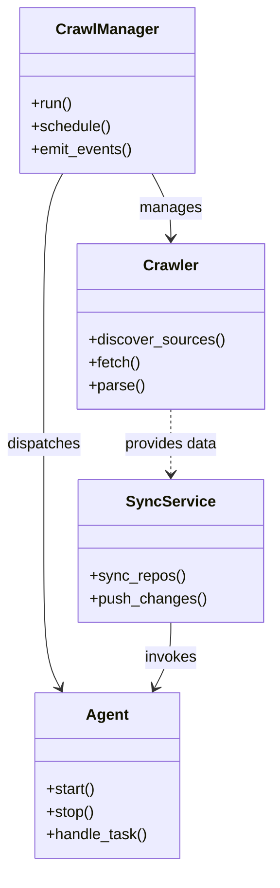
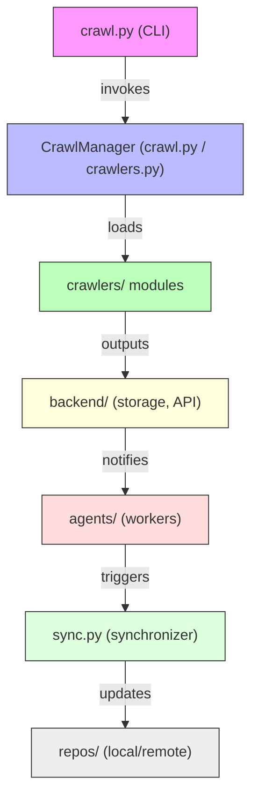

# Diagram: common/location_service/config/config.prod-b.yml

> Auto-generated by Obscura crawlers

## Diagram 1

### SVG

<svg id="container" width="283.5234375" xmlns="http://www.w3.org/2000/svg" class="classDiagram" height="910" viewBox="0 0 283.5234375 910" role="graphics-document document" aria-roledescription="class"><g><defs><marker id="container_class-aggregationStart" class="marker aggregation class" refX="18" refY="7" markerWidth="190" markerHeight="240" orient="auto"><path d="M 18,7 L9,13 L1,7 L9,1 Z"></path></marker></defs><defs><marker id="container_class-aggregationEnd" class="marker aggregation class" refX="1" refY="7" markerWidth="20" markerHeight="28" orient="auto"><path d="M 18,7 L9,13 L1,7 L9,1 Z"></path></marker></defs><defs><marker id="container_class-extensionStart" class="marker extension class" refX="18" refY="7" markerWidth="190" markerHeight="240" orient="auto"><path d="M 1,7 L18,13 V 1 Z"></path></marker></defs><defs><marker id="container_class-extensionEnd" class="marker extension class" refX="1" refY="7" markerWidth="20" markerHeight="28" orient="auto"><path d="M 1,1 V 13 L18,7 Z"></path></marker></defs><defs><marker id="container_class-compositionStart" class="marker composition class" refX="18" refY="7" markerWidth="190" markerHeight="240" orient="auto"><path d="M 18,7 L9,13 L1,7 L9,1 Z"></path></marker></defs><defs><marker id="container_class-compositionEnd" class="marker composition class" refX="1" refY="7" markerWidth="20" markerHeight="28" orient="auto"><path d="M 18,7 L9,13 L1,7 L9,1 Z"></path></marker></defs><defs><marker id="container_class-dependencyStart" class="marker dependency class" refX="6" refY="7" markerWidth="190" markerHeight="240" orient="auto"><path d="M 5,7 L9,13 L1,7 L9,1 Z"></path></marker></defs><defs><marker id="container_class-dependencyEnd" class="marker dependency class" refX="13" refY="7" markerWidth="20" markerHeight="28" orient="auto"><path d="M 18,7 L9,13 L14,7 L9,1 Z"></path></marker></defs><defs><marker id="container_class-lollipopStart" class="marker lollipop class" refX="13" refY="7" markerWidth="190" markerHeight="240" orient="auto"><circle stroke="black" fill="transparent" cx="7" cy="7" r="6"></circle></marker></defs><defs><marker id="container_class-lollipopEnd" class="marker lollipop class" refX="1" refY="7" markerWidth="190" markerHeight="240" orient="auto"><circle stroke="black" fill="transparent" cx="7" cy="7" r="6"></circle></marker></defs><g class="root"><g class="clusters"></g><g class="edgePaths"><path d="M159.207,182L162.481,188.167C165.755,194.333,172.303,206.667,175.577,218C178.852,229.333,178.852,239.667,178.852,244.833L178.852,250" id="id_CrawlManager_Crawler_1" class="edge-thickness-normal edge-pattern-solid relation" style=";;;" data-edge="true" data-et="edge" data-id="id_CrawlManager_Crawler_1" data-points="W3sieCI6MTU5LjIwNjk2ODI0NTk2Nzc0LCJ5IjoxODJ9LHsieCI6MTc4Ljg1MTU2MjUsInkiOjIxOX0seyJ4IjoxNzguODUxNTYyNSwieSI6MjU2fV0=" marker-end="url(#container_class-dependencyEnd)"></path><path d="M66.824,182L63.55,188.167C60.276,194.333,53.728,206.667,50.454,233.5C47.18,260.333,47.18,301.667,47.18,343C47.18,384.333,47.18,425.667,47.18,465C47.18,504.333,47.18,541.667,47.18,579C47.18,616.333,47.18,653.667,49.985,677.617C52.79,701.567,58.4,712.134,61.205,717.417L64.011,722.701" id="id_CrawlManager_Agent_2" class="edge-thickness-normal edge-pattern-solid relation" style=";;;" data-edge="true" data-et="edge" data-id="id_CrawlManager_Agent_2" data-points="W3sieCI6NjYuODI0MjgxNzU0MDMyMjYsInkiOjE4Mn0seyJ4Ijo0Ny4xNzk2ODc1LCJ5IjoyMTl9LHsieCI6NDcuMTc5Njg3NSwieSI6MzQzfSx7IngiOjQ3LjE3OTY4NzUsInkiOjQ2N30seyJ4Ijo0Ny4xNzk2ODc1LCJ5Ijo1Nzl9LHsieCI6NDcuMTc5Njg3NSwieSI6NjkxfSx7IngiOjY2LjgyNDI4MTc1NDAzMjI2LCJ5Ijo3Mjh9XQ==" marker-end="url(#container_class-dependencyEnd)"></path><path d="M178.852,654L178.852,660.167C178.852,666.333,178.852,678.667,176.046,690.117C173.241,701.567,167.631,712.134,164.826,717.417L162.021,722.701" id="id_SyncService_Agent_3" class="edge-thickness-normal edge-pattern-solid relation" style=";;;" data-edge="true" data-et="edge" data-id="id_SyncService_Agent_3" data-points="W3sieCI6MTc4Ljg1MTU2MjUsInkiOjY1NH0seyJ4IjoxNzguODUxNTYyNSwieSI6NjkxfSx7IngiOjE1OS4yMDY5NjgyNDU5Njc3NCwieSI6NzI4fV0=" marker-end="url(#container_class-dependencyEnd)"></path><path d="M178.852,430L178.852,436.167C178.852,442.333,178.852,454.667,178.852,466C178.852,477.333,178.852,487.667,178.852,492.833L178.852,498" id="id_Crawler_SyncService_4" class="edge-thickness-normal edge-pattern-dashed relation" style=";;;" data-edge="true" data-et="edge" data-id="id_Crawler_SyncService_4" data-points="W3sieCI6MTc4Ljg1MTU2MjUsInkiOjQzMH0seyJ4IjoxNzguODUxNTYyNSwieSI6NDY3fSx7IngiOjE3OC44NTE1NjI1LCJ5Ijo1MDR9XQ==" marker-end="url(#container_class-dependencyEnd)"></path></g><g class="edgeLabels"><g class="edgeLabel" transform="translate(178.8515625, 219)"><g class="label" data-id="id_CrawlManager_Crawler_1" transform="translate(-32.296875, -12)"><foreignObject width="64.59375" height="24">

manages

</foreignObject></g></g><g class="edgeLabel" transform="translate(47.1796875, 467)"><g class="label" data-id="id_CrawlManager_Agent_2" transform="translate(-39.1796875, -12)"><foreignObject width="78.359375" height="24">

dispatches

</foreignObject></g></g><g class="edgeLabel" transform="translate(178.8515625, 691)"><g class="label" data-id="id_SyncService_Agent_3" transform="translate(-27.5859375, -12)"><foreignObject width="55.171875" height="24">

invokes

</foreignObject></g></g><g class="edgeLabel" transform="translate(178.8515625, 467)"><g class="label" data-id="id_Crawler_SyncService_4" transform="translate(-49.7578125, -12)"><foreignObject width="99.515625" height="24">

provides data

</foreignObject></g></g></g><g class="nodes"><g class="node default" id="classId-Crawler-0" transform="translate(178.8515625, 343)"><g class="basic label-container"><path d="M-96.671875 -87 L96.671875 -87 L96.671875 87 L-96.671875 87" stroke="none" stroke-width="0" fill="#ECECFF" style=""></path><path d="M-96.671875 -87 C-55.753644982785794 -87, -14.835414965571587 -87, 96.671875 -87 M-96.671875 -87 C-22.808667220769692 -87, 51.054540558460616 -87, 96.671875 -87 M96.671875 -87 C96.671875 -49.58629040211888, 96.671875 -12.172580804237754, 96.671875 87 M96.671875 -87 C96.671875 -34.38184205934545, 96.671875 18.236315881309096, 96.671875 87 M96.671875 87 C35.06580343581186 87, -26.540268128376283 87, -96.671875 87 M96.671875 87 C48.788020668782586 87, 0.9041663375651723 87, -96.671875 87 M-96.671875 87 C-96.671875 42.61208869466364, -96.671875 -1.7758226106727193, -96.671875 -87 M-96.671875 87 C-96.671875 21.807793027079725, -96.671875 -43.38441394584055, -96.671875 -87" stroke="#9370DB" stroke-width="1.3" fill="none" stroke-dasharray="0 0" style=""></path></g><g class="annotation-group text" transform="translate(0, -63)"></g><g class="label-group text" transform="translate(-27.734375, -63)"><g class="label" style="font-weight: bolder" transform="translate(0,-12)"><foreignObject width="55.46875" height="24">

Crawler

</foreignObject></g></g><g class="members-group text" transform="translate(-84.671875, -15)"></g><g class="methods-group text" transform="translate(-84.671875, 15)"><g class="label" style="" transform="translate(0,-12)"><foreignObject width="141.609375" height="24">

+discover_sources()

</foreignObject></g><g class="label" style="" transform="translate(0,12)"><foreignObject width="54.59375" height="24">

+fetch()

</foreignObject></g><g class="label" style="" transform="translate(0,36)"><foreignObject width="58.53125" height="24">

+parse()

</foreignObject></g></g><g class="divider" style=""><path d="M-96.671875 -39 C-45.23269734949025 -39, 6.206480301019496 -39, 96.671875 -39 M-96.671875 -39 C-43.130151888822546 -39, 10.411571222354908 -39, 96.671875 -39" stroke="#9370DB" stroke-width="1.3" fill="none" stroke-dasharray="0 0" style=""></path></g><g class="divider" style=""><path d="M-96.671875 -15 C-24.8459593243428 -15, 46.9799563513144 -15, 96.671875 -15 M-96.671875 -15 C-50.124408018460684 -15, -3.5769410369213688 -15, 96.671875 -15" stroke="#9370DB" stroke-width="1.3" fill="none" stroke-dasharray="0 0" style=""></path></g></g><g class="node default" id="classId-CrawlManager-1" transform="translate(113.015625, 95)"><g class="basic label-container"><path d="M-91.2421875 -87 L91.2421875 -87 L91.2421875 87 L-91.2421875 87" stroke="none" stroke-width="0" fill="#ECECFF" style=""></path><path d="M-91.2421875 -87 C-32.31412927177686 -87, 26.613928956446287 -87, 91.2421875 -87 M-91.2421875 -87 C-20.35362666954005 -87, 50.5349341609199 -87, 91.2421875 -87 M91.2421875 -87 C91.2421875 -40.592933692225394, 91.2421875 5.814132615549212, 91.2421875 87 M91.2421875 -87 C91.2421875 -25.66905095406763, 91.2421875 35.66189809186474, 91.2421875 87 M91.2421875 87 C49.74039088420467 87, 8.238594268409344 87, -91.2421875 87 M91.2421875 87 C27.57560673018242 87, -36.09097403963516 87, -91.2421875 87 M-91.2421875 87 C-91.2421875 35.81944197924869, -91.2421875 -15.361116041502626, -91.2421875 -87 M-91.2421875 87 C-91.2421875 50.586968988677185, -91.2421875 14.17393797735437, -91.2421875 -87" stroke="#9370DB" stroke-width="1.3" fill="none" stroke-dasharray="0 0" style=""></path></g><g class="annotation-group text" transform="translate(0, -63)"></g><g class="label-group text" transform="translate(-51.59375, -63)"><g class="label" style="font-weight: bolder" transform="translate(0,-12)"><foreignObject width="103.1875" height="24">

CrawlManager

</foreignObject></g></g><g class="members-group text" transform="translate(-79.2421875, -15)"></g><g class="methods-group text" transform="translate(-79.2421875, 15)"><g class="label" style="" transform="translate(0,-12)"><foreignObject width="43.21875" height="24">

+run()

</foreignObject></g><g class="label" style="" transform="translate(0,12)"><foreignObject width="83.78125" height="24">

+schedule()

</foreignObject></g><g class="label" style="" transform="translate(0,36)"><foreignObject width="106.890625" height="24">

+emit_events()

</foreignObject></g></g><g class="divider" style=""><path d="M-91.2421875 -39 C-26.698859044740104 -39, 37.84446941051979 -39, 91.2421875 -39 M-91.2421875 -39 C-20.512735304403293 -39, 50.216716891193414 -39, 91.2421875 -39" stroke="#9370DB" stroke-width="1.3" fill="none" stroke-dasharray="0 0" style=""></path></g><g class="divider" style=""><path d="M-91.2421875 -15 C-30.27855810792454 -15, 30.685071284150922 -15, 91.2421875 -15 M-91.2421875 -15 C-32.158719001231276 -15, 26.924749497537448 -15, 91.2421875 -15" stroke="#9370DB" stroke-width="1.3" fill="none" stroke-dasharray="0 0" style=""></path></g></g><g class="node default" id="classId-SyncService-2" transform="translate(178.8515625, 579)"><g class="basic label-container"><path d="M-94.56640625 -75 L94.56640625 -75 L94.56640625 75 L-94.56640625 75" stroke="none" stroke-width="0" fill="#ECECFF" style=""></path><path d="M-94.56640625 -75 C-50.69552095318923 -75, -6.824635656378462 -75, 94.56640625 -75 M-94.56640625 -75 C-48.281769068517924 -75, -1.9971318870358488 -75, 94.56640625 -75 M94.56640625 -75 C94.56640625 -16.931084536177494, 94.56640625 41.13783092764501, 94.56640625 75 M94.56640625 -75 C94.56640625 -36.538081683479874, 94.56640625 1.9238366330402528, 94.56640625 75 M94.56640625 75 C19.101086545847153 75, -56.364233158305694 75, -94.56640625 75 M94.56640625 75 C40.73404927507577 75, -13.098307699848462 75, -94.56640625 75 M-94.56640625 75 C-94.56640625 22.72563779599278, -94.56640625 -29.548724408014436, -94.56640625 -75 M-94.56640625 75 C-94.56640625 16.576876427003818, -94.56640625 -41.846247145992365, -94.56640625 -75" stroke="#9370DB" stroke-width="1.3" fill="none" stroke-dasharray="0 0" style=""></path></g><g class="annotation-group text" transform="translate(0, -51)"></g><g class="label-group text" transform="translate(-43.7421875, -51)"><g class="label" style="font-weight: bolder" transform="translate(0,-12)"><foreignObject width="87.484375" height="24">

SyncService

</foreignObject></g></g><g class="members-group text" transform="translate(-82.56640625, -3)"></g><g class="methods-group text" transform="translate(-82.56640625, 27)"><g class="label" style="" transform="translate(0,-12)"><foreignObject width="99.515625" height="24">

+sync_repos()

</foreignObject></g><g class="label" style="" transform="translate(0,12)"><foreignObject width="121.390625" height="24">

+push_changes()

</foreignObject></g></g><g class="divider" style=""><path d="M-94.56640625 -27 C-24.363122224058955 -27, 45.84016180188209 -27, 94.56640625 -27 M-94.56640625 -27 C-25.715718533672444 -27, 43.13496918265511 -27, 94.56640625 -27" stroke="#9370DB" stroke-width="1.3" fill="none" stroke-dasharray="0 0" style=""></path></g><g class="divider" style=""><path d="M-94.56640625 -3 C-19.476025912920676 -3, 55.61435442415865 -3, 94.56640625 -3 M-94.56640625 -3 C-40.950653422630744 -3, 12.665099404738513 -3, 94.56640625 -3" stroke="#9370DB" stroke-width="1.3" fill="none" stroke-dasharray="0 0" style=""></path></g></g><g class="node default" id="classId-Agent-3" transform="translate(113.015625, 815)"><g class="basic label-container"><path d="M-75.671875 -87 L75.671875 -87 L75.671875 87 L-75.671875 87" stroke="none" stroke-width="0" fill="#ECECFF" style=""></path><path d="M-75.671875 -87 C-18.1904891324343 -87, 39.2908967351314 -87, 75.671875 -87 M-75.671875 -87 C-39.33083631288924 -87, -2.989797625778479 -87, 75.671875 -87 M75.671875 -87 C75.671875 -50.60042290232608, 75.671875 -14.200845804652161, 75.671875 87 M75.671875 -87 C75.671875 -30.678082123117633, 75.671875 25.643835753764733, 75.671875 87 M75.671875 87 C38.256175892839785 87, 0.8404767856795701 87, -75.671875 87 M75.671875 87 C18.83457018439475 87, -38.0027346312105 87, -75.671875 87 M-75.671875 87 C-75.671875 18.42288564790941, -75.671875 -50.15422870418118, -75.671875 -87 M-75.671875 87 C-75.671875 30.977891720695347, -75.671875 -25.044216558609307, -75.671875 -87" stroke="#9370DB" stroke-width="1.3" fill="none" stroke-dasharray="0 0" style=""></path></g><g class="annotation-group text" transform="translate(0, -63)"></g><g class="label-group text" transform="translate(-21.078125, -63)"><g class="label" style="font-weight: bolder" transform="translate(0,-12)"><foreignObject width="42.15625" height="24">

Agent

</foreignObject></g></g><g class="members-group text" transform="translate(-63.671875, -15)"></g><g class="methods-group text" transform="translate(-63.671875, 15)"><g class="label" style="" transform="translate(0,-12)"><foreignObject width="52.15625" height="24">

+start()

</foreignObject></g><g class="label" style="" transform="translate(0,12)"><foreignObject width="50.21875" height="24">

+stop()

</foreignObject></g><g class="label" style="" transform="translate(0,36)"><foreignObject width="106.265625" height="24">

+handle_task()

</foreignObject></g></g><g class="divider" style=""><path d="M-75.671875 -39 C-38.678871836737834 -39, -1.6858686734756674 -39, 75.671875 -39 M-75.671875 -39 C-43.71531181602772 -39, -11.758748632055436 -39, 75.671875 -39" stroke="#9370DB" stroke-width="1.3" fill="none" stroke-dasharray="0 0" style=""></path></g><g class="divider" style=""><path d="M-75.671875 -15 C-30.470011220095053 -15, 14.731852559809894 -15, 75.671875 -15 M-75.671875 -15 C-34.45942687147196 -15, 6.753021257056076 -15, 75.671875 -15" stroke="#9370DB" stroke-width="1.3" fill="none" stroke-dasharray="0 0" style=""></path></g></g></g></g></g></svg>

## Diagram 2

### SVG

<svg id="container" width="276" xmlns="http://www.w3.org/2000/svg" class="flowchart" height="862" viewBox="0 0 276 862" role="graphics-document document" aria-roledescription="flowchart-v2"><g><marker id="container_flowchart-v2-pointEnd" class="marker flowchart-v2" viewBox="0 0 10 10" refX="5" refY="5" markerUnits="userSpaceOnUse" markerWidth="8" markerHeight="8" orient="auto"><path d="M 0 0 L 10 5 L 0 10 z" class="arrowMarkerPath" style="stroke-width: 1; stroke-dasharray: 1, 0;"></path></marker><marker id="container_flowchart-v2-pointStart" class="marker flowchart-v2" viewBox="0 0 10 10" refX="4.5" refY="5" markerUnits="userSpaceOnUse" markerWidth="8" markerHeight="8" orient="auto"><path d="M 0 5 L 10 10 L 10 0 z" class="arrowMarkerPath" style="stroke-width: 1; stroke-dasharray: 1, 0;"></path></marker><marker id="container_flowchart-v2-circleEnd" class="marker flowchart-v2" viewBox="0 0 10 10" refX="11" refY="5" markerUnits="userSpaceOnUse" markerWidth="11" markerHeight="11" orient="auto"><circle cx="5" cy="5" r="5" class="arrowMarkerPath" style="stroke-width: 1; stroke-dasharray: 1, 0;"></circle></marker><marker id="container_flowchart-v2-circleStart" class="marker flowchart-v2" viewBox="0 0 10 10" refX="-1" refY="5" markerUnits="userSpaceOnUse" markerWidth="11" markerHeight="11" orient="auto"><circle cx="5" cy="5" r="5" class="arrowMarkerPath" style="stroke-width: 1; stroke-dasharray: 1, 0;"></circle></marker><marker id="container_flowchart-v2-crossEnd" class="marker cross flowchart-v2" viewBox="0 0 11 11" refX="12" refY="5.2" markerUnits="userSpaceOnUse" markerWidth="11" markerHeight="11" orient="auto"><path d="M 1,1 l 9,9 M 10,1 l -9,9" class="arrowMarkerPath" style="stroke-width: 2; stroke-dasharray: 1, 0;"></path></marker><marker id="container_flowchart-v2-crossStart" class="marker cross flowchart-v2" viewBox="0 0 11 11" refX="-1" refY="5.2" markerUnits="userSpaceOnUse" markerWidth="11" markerHeight="11" orient="auto"><path d="M 1,1 l 9,9 M 10,1 l -9,9" class="arrowMarkerPath" style="stroke-width: 2; stroke-dasharray: 1, 0;"></path></marker><g class="root"><g class="clusters"></g><g class="edgePaths"><path d="M138,62L138,68.167C138,74.333,138,86.667,138,98.333C138,110,138,121,138,126.5L138,132" id="L_CLI_Manager_0" class="edge-thickness-normal edge-pattern-solid edge-thickness-normal edge-pattern-solid flowchart-link" style=";" data-edge="true" data-et="edge" data-id="L_CLI_Manager_0" data-points="W3sieCI6MTM4LCJ5Ijo2Mn0seyJ4IjoxMzgsInkiOjk5fSx7IngiOjEzOCwieSI6MTM2fV0=" marker-end="url(#container_flowchart-v2-pointEnd)"></path><path d="M138,214L138,220.167C138,226.333,138,238.667,138,250.333C138,262,138,273,138,278.5L138,284" id="L_Manager_Crawlers_0" class="edge-thickness-normal edge-pattern-solid edge-thickness-normal edge-pattern-solid flowchart-link" style=";" data-edge="true" data-et="edge" data-id="L_Manager_Crawlers_0" data-points="W3sieCI6MTM4LCJ5IjoyMTR9LHsieCI6MTM4LCJ5IjoyNTF9LHsieCI6MTM4LCJ5IjoyODh9XQ==" marker-end="url(#container_flowchart-v2-pointEnd)"></path><path d="M138,342L138,348.167C138,354.333,138,366.667,138,378.333C138,390,138,401,138,406.5L138,412" id="L_Crawlers_Backend_0" class="edge-thickness-normal edge-pattern-solid edge-thickness-normal edge-pattern-solid flowchart-link" style=";" data-edge="true" data-et="edge" data-id="L_Crawlers_Backend_0" data-points="W3sieCI6MTM4LCJ5IjozNDJ9LHsieCI6MTM4LCJ5IjozNzl9LHsieCI6MTM4LCJ5Ijo0MTZ9XQ==" marker-end="url(#container_flowchart-v2-pointEnd)"></path><path d="M138,470L138,476.167C138,482.333,138,494.667,138,506.333C138,518,138,529,138,534.5L138,540" id="L_Backend_Agents_0" class="edge-thickness-normal edge-pattern-solid edge-thickness-normal edge-pattern-solid flowchart-link" style=";" data-edge="true" data-et="edge" data-id="L_Backend_Agents_0" data-points="W3sieCI6MTM4LCJ5Ijo0NzB9LHsieCI6MTM4LCJ5Ijo1MDd9LHsieCI6MTM4LCJ5Ijo1NDR9XQ==" marker-end="url(#container_flowchart-v2-pointEnd)"></path><path d="M138,598L138,604.167C138,610.333,138,622.667,138,634.333C138,646,138,657,138,662.5L138,668" id="L_Agents_Sync_0" class="edge-thickness-normal edge-pattern-solid edge-thickness-normal edge-pattern-solid flowchart-link" style=";" data-edge="true" data-et="edge" data-id="L_Agents_Sync_0" data-points="W3sieCI6MTM4LCJ5Ijo1OTh9LHsieCI6MTM4LCJ5Ijo2MzV9LHsieCI6MTM4LCJ5Ijo2NzJ9XQ==" marker-end="url(#container_flowchart-v2-pointEnd)"></path><path d="M138,726L138,732.167C138,738.333,138,750.667,138,762.333C138,774,138,785,138,790.5L138,796" id="L_Sync_Repos_0" class="edge-thickness-normal edge-pattern-solid edge-thickness-normal edge-pattern-solid flowchart-link" style=";" data-edge="true" data-et="edge" data-id="L_Sync_Repos_0" data-points="W3sieCI6MTM4LCJ5Ijo3MjZ9LHsieCI6MTM4LCJ5Ijo3NjN9LHsieCI6MTM4LCJ5Ijo4MDB9XQ==" marker-end="url(#container_flowchart-v2-pointEnd)"></path></g><g class="edgeLabels"><g class="edgeLabel" transform="translate(138, 99)"><g class="label" data-id="L_CLI_Manager_0" transform="translate(-27.5859375, -12)"><foreignObject width="55.171875" height="24">

invokes

</foreignObject></g></g><g class="edgeLabel" transform="translate(138, 251)"><g class="label" data-id="L_Manager_Crawlers_0" transform="translate(-19.7734375, -12)"><foreignObject width="39.546875" height="24">

loads

</foreignObject></g></g><g class="edgeLabel" transform="translate(138, 379)"><g class="label" data-id="L_Crawlers_Backend_0" transform="translate(-28.25, -12)"><foreignObject width="56.5" height="24">

outputs

</foreignObject></g></g><g class="edgeLabel" transform="translate(138, 507)"><g class="label" data-id="L_Backend_Agents_0" transform="translate(-27.203125, -12)"><foreignObject width="54.40625" height="24">

notifies

</foreignObject></g></g><g class="edgeLabel" transform="translate(138, 635)"><g class="label" data-id="L_Agents_Sync_0" transform="translate(-27.4921875, -12)"><foreignObject width="54.984375" height="24">

triggers

</foreignObject></g></g><g class="edgeLabel" transform="translate(138, 763)"><g class="label" data-id="L_Sync_Repos_0" transform="translate(-29.4140625, -12)"><foreignObject width="58.828125" height="24">

updates

</foreignObject></g></g></g><g class="nodes"><g class="node default" id="flowchart-CLI-0" transform="translate(138, 35)"><rect class="basic label-container" style="fill:#f9f !important;stroke:#333 !important;stroke-width:1px !important" x="-77.765625" y="-27" width="155.53125" height="54"></rect><g class="label" style="" transform="translate(-47.765625, -12)"><rect></rect><foreignObject width="95.53125" height="24">

crawl.py (CLI)

</foreignObject></g></g><g class="node default" id="flowchart-Manager-1" transform="translate(138, 175)"><rect class="basic label-container" style="fill:#bbf !important;stroke:#333 !important;stroke-width:1px !important" x="-130" y="-39" width="260" height="78"></rect><g class="label" style="" transform="translate(-100, -24)"><rect></rect><foreignObject width="200" height="48">

CrawlManager (crawl.py / crawlers.py)

</foreignObject></g></g><g class="node default" id="flowchart-Crawlers-3" transform="translate(138, 315)"><rect class="basic label-container" style="fill:#bfb !important;stroke:#333 !important;stroke-width:1px !important" x="-97.703125" y="-27" width="195.40625" height="54"></rect><g class="label" style="" transform="translate(-67.703125, -12)"><rect></rect><foreignObject width="135.40625" height="24">

crawlers/ modules

</foreignObject></g></g><g class="node default" id="flowchart-Backend-5" transform="translate(138, 443)"><rect class="basic label-container" style="fill:#ffd !important;stroke:#333 !important;stroke-width:1px !important" x="-114.375" y="-27" width="228.75" height="54"></rect><g class="label" style="" transform="translate(-84.375, -12)"><rect></rect><foreignObject width="168.75" height="24">

backend/ (storage, API)

</foreignObject></g></g><g class="node default" id="flowchart-Agents-7" transform="translate(138, 571)"><rect class="basic label-container" style="fill:#fdd !important;stroke:#333 !important;stroke-width:1px !important" x="-94.03125" y="-27" width="188.0625" height="54"></rect><g class="label" style="" transform="translate(-64.03125, -12)"><rect></rect><foreignObject width="128.0625" height="24">

agents/ (workers)

</foreignObject></g></g><g class="node default" id="flowchart-Sync-9" transform="translate(138, 699)"><rect class="basic label-container" style="fill:#dfd !important;stroke:#333 !important;stroke-width:1px !important" x="-110.1015625" y="-27" width="220.203125" height="54"></rect><g class="label" style="" transform="translate(-80.1015625, -12)"><rect></rect><foreignObject width="160.203125" height="24">

sync.py (synchronizer)

</foreignObject></g></g><g class="node default" id="flowchart-Repos-11" transform="translate(138, 827)"><rect class="basic label-container" style="fill:#eee !important;stroke:#333 !important;stroke-width:1px !important" x="-108.953125" y="-27" width="217.90625" height="54"></rect><g class="label" style="" transform="translate(-78.953125, -12)"><rect></rect><foreignObject width="157.90625" height="24">

repos/ (local/remote)

</foreignObject></g></g></g></g></g></svg>
