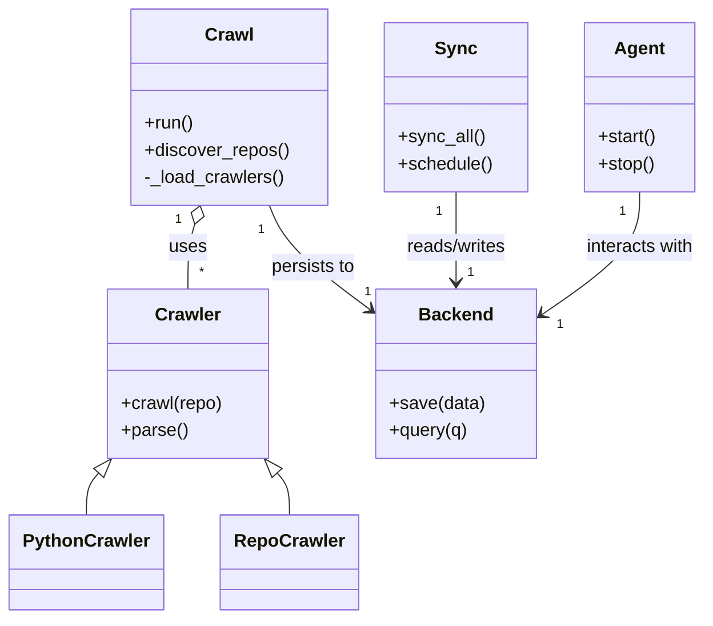
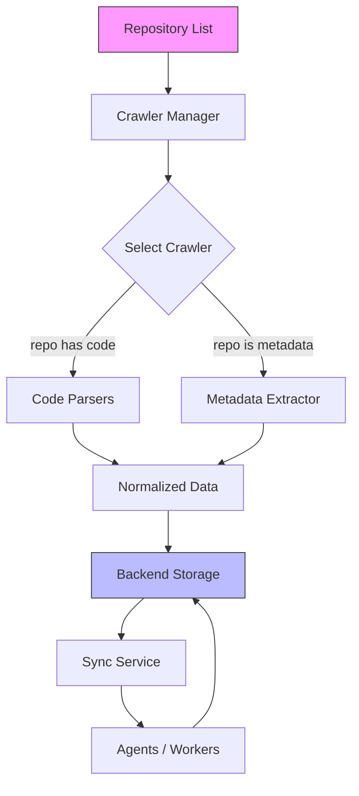

# Diagram: common/location_service/config/config.qa.yml

> Auto-generated by Obscura crawlers

## Diagram 1

### SVG

<svg id="container" width="614.328125" xmlns="http://www.w3.org/2000/svg" class="classDiagram" height="548" viewBox="0 0 614.328125 548" role="graphics-document document" aria-roledescription="class"><g><defs><marker id="container_class-aggregationStart" class="marker aggregation class" refX="18" refY="7" markerWidth="190" markerHeight="240" orient="auto"><path d="M 18,7 L9,13 L1,7 L9,1 Z"></path></marker></defs><defs><marker id="container_class-aggregationEnd" class="marker aggregation class" refX="1" refY="7" markerWidth="20" markerHeight="28" orient="auto"><path d="M 18,7 L9,13 L1,7 L9,1 Z"></path></marker></defs><defs><marker id="container_class-extensionStart" class="marker extension class" refX="18" refY="7" markerWidth="190" markerHeight="240" orient="auto"><path d="M 1,7 L18,13 V 1 Z"></path></marker></defs><defs><marker id="container_class-extensionEnd" class="marker extension class" refX="1" refY="7" markerWidth="20" markerHeight="28" orient="auto"><path d="M 1,1 V 13 L18,7 Z"></path></marker></defs><defs><marker id="container_class-compositionStart" class="marker composition class" refX="18" refY="7" markerWidth="190" markerHeight="240" orient="auto"><path d="M 18,7 L9,13 L1,7 L9,1 Z"></path></marker></defs><defs><marker id="container_class-compositionEnd" class="marker composition class" refX="1" refY="7" markerWidth="20" markerHeight="28" orient="auto"><path d="M 18,7 L9,13 L1,7 L9,1 Z"></path></marker></defs><defs><marker id="container_class-dependencyStart" class="marker dependency class" refX="6" refY="7" markerWidth="190" markerHeight="240" orient="auto"><path d="M 5,7 L9,13 L1,7 L9,1 Z"></path></marker></defs><defs><marker id="container_class-dependencyEnd" class="marker dependency class" refX="13" refY="7" markerWidth="20" markerHeight="28" orient="auto"><path d="M 18,7 L9,13 L14,7 L9,1 Z"></path></marker></defs><defs><marker id="container_class-lollipopStart" class="marker lollipop class" refX="13" refY="7" markerWidth="190" markerHeight="240" orient="auto"><circle stroke="black" fill="transparent" cx="7" cy="7" r="6"></circle></marker></defs><defs><marker id="container_class-lollipopEnd" class="marker lollipop class" refX="1" refY="7" markerWidth="190" markerHeight="240" orient="auto"><circle stroke="black" fill="transparent" cx="7" cy="7" r="6"></circle></marker></defs><g class="root"><g class="clusters"></g><g class="edgePaths"><path d="M166.795,198.521L165.77,201.934C164.745,205.347,162.695,212.174,161.67,221.753C160.645,231.333,160.645,243.667,160.645,249.833L160.645,256" id="id_Crawl_Crawler_1" class="edge-thickness-normal edge-pattern-solid relation" style=";;;" data-edge="true" data-et="edge" data-id="id_Crawl_Crawler_1" data-points="W3sieCI6MTcxLjc1NzExOTQ1NTY0NTE1LCJ5IjoxODJ9LHsieCI6MTYwLjY0NDUzMTI1LCJ5IjoyMTl9LHsieCI6MTYwLjY0NDUzMTI1LCJ5IjoyNTZ9XQ==" marker-start="url(#container_class-aggregationStart)"></path><path d="M230.889,182L233.228,188.167C235.567,194.333,240.245,206.667,255.394,222.336C270.543,238.006,296.163,257.012,308.973,266.515L321.783,276.018" id="id_Crawl_Backend_2" class="edge-thickness-normal edge-pattern-solid relation" style=";;;" data-edge="true" data-et="edge" data-id="id_Crawl_Backend_2" data-points="W3sieCI6MjMwLjg4ODU2MTYxNzk0MzU0LCJ5IjoxODJ9LHsieCI6MjQ0LjkyMzgyODEyNSwieSI6MjE5fSx7IngiOjMyNi42MDE1NjI1LCJ5IjoyNzkuNTkyMzQ5MTg5NTEwODZ9XQ==" marker-end="url(#container_class-dependencyEnd)"></path><path d="M395.898,170L395.898,178.167C395.898,186.333,395.898,202.667,395.898,216C395.898,229.333,395.898,239.667,395.898,244.833L395.898,250" id="id_Sync_Backend_3" class="edge-thickness-normal edge-pattern-solid relation" style=";;;" data-edge="true" data-et="edge" data-id="id_Sync_Backend_3" data-points="W3sieCI6Mzk1Ljg5ODQzNzUsInkiOjE3MH0seyJ4IjozOTUuODk4NDM3NSwieSI6MjE5fSx7IngiOjM5NS44OTg0Mzc1LCJ5IjoyNTZ9XQ==" marker-end="url(#container_class-dependencyEnd)"></path><path d="M556.953,170L556.953,178.167C556.953,186.333,556.953,202.667,542.481,220.897C528.009,239.128,499.065,259.256,484.593,269.32L470.121,279.384" id="id_Agent_Backend_4" class="edge-thickness-normal edge-pattern-solid relation" style=";;;" data-edge="true" data-et="edge" data-id="id_Agent_Backend_4" data-points="W3sieCI6NTU2Ljk1MzEyNSwieSI6MTcwfSx7IngiOjU1Ni45NTMxMjUsInkiOjIxOX0seyJ4Ijo0NjUuMTk1MzEyNSwieSI6MjgyLjgwOTg0NzE5ODY0MTc2fV0=" marker-end="url(#container_class-dependencyEnd)"></path><path d="M84.056,419.013L82.318,421.011C80.579,423.009,77.102,427.004,75.364,433.169C73.625,439.333,73.625,447.667,73.625,451.833L73.625,456" id="id_Crawler_PythonCrawler_5" class="edge-thickness-normal edge-pattern-solid relation" style=";;;" data-edge="true" data-et="edge" data-id="id_Crawler_PythonCrawler_5" data-points="W3sieCI6OTUuMzc5ODgyODEyNSwieSI6NDA2fSx7IngiOjczLjYyNSwieSI6NDMxfSx7IngiOjczLjYyNSwieSI6NDU2fV0=" marker-start="url(#container_class-extensionStart)"></path><path d="M237.233,419.013L238.971,421.011C240.71,423.009,244.187,427.004,245.926,433.169C247.664,439.333,247.664,447.667,247.664,451.833L247.664,456" id="id_Crawler_RepoCrawler_6" class="edge-thickness-normal edge-pattern-solid relation" style=";;;" data-edge="true" data-et="edge" data-id="id_Crawler_RepoCrawler_6" data-points="W3sieCI6MjI1LjkwOTE3OTY4NzUsInkiOjQwNn0seyJ4IjoyNDcuNjY0MDYyNSwieSI6NDMxfSx7IngiOjI0Ny42NjQwNjI1LCJ5Ijo0NTZ9XQ==" marker-start="url(#container_class-extensionStart)"></path></g><g class="edgeLabels"><g class="edgeLabel" transform="translate(160.64453125, 219)"><g class="label" data-id="id_Crawl_Crawler_1" transform="translate(-16.4921875, -12)"><foreignObject width="32.984375" height="24">

uses

</foreignObject></g></g><g class="edgeLabel" transform="translate(269.87169, 237.50749)"><g class="label" data-id="id_Crawl_Backend_2" transform="translate(-37.9921875, -12)"><foreignObject width="75.984375" height="24">

persists to

</foreignObject></g></g><g class="edgeLabel" transform="translate(395.8984375, 219)"><g class="label" data-id="id_Sync_Backend_3" transform="translate(-45.9453125, -12)"><foreignObject width="91.890625" height="24">

reads/writes

</foreignObject></g></g><g class="edgeLabel" transform="translate(556.953125, 219)"><g class="label" data-id="id_Agent_Backend_4" transform="translate(-49.375, -12)"><foreignObject width="98.75" height="24">

interacts with

</foreignObject></g></g><g class="edgeLabel"><g class="label" data-id="id_Crawler_PythonCrawler_5" transform="translate(0, 0)"><foreignObject width="0" height="0">

</foreignObject></g></g><g class="edgeLabel"><g class="label" data-id="id_Crawler_RepoCrawler_6" transform="translate(0, 0)"><foreignObject width="0" height="0">

</foreignObject></g></g><g class="edgeTerminals" transform="translate(152.35725148486202, 194.44568747480426)"><g class="inner" transform="translate(0, 0)"><foreignObject style="width: 9px; height: 12px;">
1
</foreignObject></g></g><g class="edgeTerminals" transform="translate(223.07045221597454, 203.68241530001424)"><g class="inner" transform="translate(0, 0)"><foreignObject style="width: 9px; height: 12px;">
1
</foreignObject></g></g><g class="edgeTerminals" transform="translate(380.89843875, 187.50000107142858)"><g class="inner" transform="translate(0, 0)"><foreignObject style="width: 9px; height: 12px;">
1
</foreignObject></g></g><g class="edgeTerminals" transform="translate(541.9531275, 187.50000214285714)"><g class="inner" transform="translate(0, 0)"><foreignObject style="width: 9px; height: 12px;">
1
</foreignObject></g></g><g class="edgeTerminals" transform="translate(170.64453062500002, 233.4999994642857)"><g class="inner" transform="translate(0, 0)"></g><foreignObject style="width: 9px; height: 12px;">
*
</foreignObject></g><g class="edgeTerminals" transform="translate(316.4837648414569, 252.11885206525392)"><g class="inner" transform="translate(0, 0)"></g><foreignObject style="width: 9px; height: 12px;">
1
</foreignObject></g><g class="edgeTerminals" transform="translate(405.8984387499999, 233.50000107142858)"><g class="inner" transform="translate(0, 0)"></g><foreignObject style="width: 9px; height: 12px;">
1
</foreignObject></g><g class="edgeTerminals" transform="translate(483.12675365847883, 280.1334448134526)"><g class="inner" transform="translate(0, 0)"></g><foreignObject style="width: 9px; height: 12px;">
1
</foreignObject></g></g><g class="nodes"><g class="node default" id="classId-Crawl-0" transform="translate(197.88671875, 95)"><g class="basic label-container"><path d="M-85.57421875 -87 L85.57421875 -87 L85.57421875 87 L-85.57421875 87" stroke="none" stroke-width="0" fill="#ECECFF" style=""></path><path d="M-85.57421875 -87 C-29.30651614722735 -87, 26.961186455545302 -87, 85.57421875 -87 M-85.57421875 -87 C-45.23601848667965 -87, -4.897818223359295 -87, 85.57421875 -87 M85.57421875 -87 C85.57421875 -17.43816590707192, 85.57421875 52.12366818585616, 85.57421875 87 M85.57421875 -87 C85.57421875 -26.31771588706357, 85.57421875 34.36456822587286, 85.57421875 87 M85.57421875 87 C32.48803189501927 87, -20.598154959961462 87, -85.57421875 87 M85.57421875 87 C17.143897335066427 87, -51.286424079867146 87, -85.57421875 87 M-85.57421875 87 C-85.57421875 42.76103539780992, -85.57421875 -1.4779292043801604, -85.57421875 -87 M-85.57421875 87 C-85.57421875 32.56288062585679, -85.57421875 -21.874238748286416, -85.57421875 -87" stroke="#9370DB" stroke-width="1.3" fill="none" stroke-dasharray="0 0" style=""></path></g><g class="annotation-group text" transform="translate(0, -63)"></g><g class="label-group text" transform="translate(-20.1484375, -63)"><g class="label" style="font-weight: bolder" transform="translate(0,-12)"><foreignObject width="40.296875" height="24">

Crawl

</foreignObject></g></g><g class="members-group text" transform="translate(-73.57421875, -15)"></g><g class="methods-group text" transform="translate(-73.57421875, 15)"><g class="label" style="" transform="translate(0,-12)"><foreignObject width="43.21875" height="24">

+run()

</foreignObject></g><g class="label" style="" transform="translate(0,12)"><foreignObject width="127" height="24">

+discover_repos()

</foreignObject></g><g class="label" style="" transform="translate(0,36)"><foreignObject width="123.859375" height="24">

-_load_crawlers()

</foreignObject></g></g><g class="divider" style=""><path d="M-85.57421875 -39 C-25.902252212336705 -39, 33.76971432532659 -39, 85.57421875 -39 M-85.57421875 -39 C-49.76790109116028 -39, -13.961583432320566 -39, 85.57421875 -39" stroke="#9370DB" stroke-width="1.3" fill="none" stroke-dasharray="0 0" style=""></path></g><g class="divider" style=""><path d="M-85.57421875 -15 C-19.872057405145483 -15, 45.83010393970903 -15, 85.57421875 -15 M-85.57421875 -15 C-35.14077457023854 -15, 15.292669609522918 -15, 85.57421875 -15" stroke="#9370DB" stroke-width="1.3" fill="none" stroke-dasharray="0 0" style=""></path></g></g><g class="node default" id="classId-Crawler-1" transform="translate(160.64453125, 331)"><g class="basic label-container"><path d="M-70.703125 -75 L70.703125 -75 L70.703125 75 L-70.703125 75" stroke="none" stroke-width="0" fill="#ECECFF" style=""></path><path d="M-70.703125 -75 C-36.85156074355503 -75, -2.999996487110053 -75, 70.703125 -75 M-70.703125 -75 C-23.984787448614846 -75, 22.73355010277031 -75, 70.703125 -75 M70.703125 -75 C70.703125 -24.330878850701545, 70.703125 26.33824229859691, 70.703125 75 M70.703125 -75 C70.703125 -31.379158079557627, 70.703125 12.241683840884747, 70.703125 75 M70.703125 75 C31.999952805875544 75, -6.703219388248911 75, -70.703125 75 M70.703125 75 C31.378209996106413 75, -7.946705007787173 75, -70.703125 75 M-70.703125 75 C-70.703125 41.59075167327331, -70.703125 8.18150334654662, -70.703125 -75 M-70.703125 75 C-70.703125 43.934081580607184, -70.703125 12.868163161214376, -70.703125 -75" stroke="#9370DB" stroke-width="1.3" fill="none" stroke-dasharray="0 0" style=""></path></g><g class="annotation-group text" transform="translate(0, -51)"></g><g class="label-group text" transform="translate(-27.734375, -51)"><g class="label" style="font-weight: bolder" transform="translate(0,-12)"><foreignObject width="55.46875" height="24">

Crawler

</foreignObject></g></g><g class="members-group text" transform="translate(-58.703125, -3)"></g><g class="methods-group text" transform="translate(-58.703125, 27)"><g class="label" style="" transform="translate(0,-12)"><foreignObject width="89.671875" height="24">

+crawl(repo)

</foreignObject></g><g class="label" style="" transform="translate(0,12)"><foreignObject width="58.53125" height="24">

+parse()

</foreignObject></g></g><g class="divider" style=""><path d="M-70.703125 -27 C-16.245423338301975 -27, 38.21227832339605 -27, 70.703125 -27 M-70.703125 -27 C-38.923757249686176 -27, -7.144389499372359 -27, 70.703125 -27" stroke="#9370DB" stroke-width="1.3" fill="none" stroke-dasharray="0 0" style=""></path></g><g class="divider" style=""><path d="M-70.703125 -3 C-16.809216287557405 -3, 37.08469242488519 -3, 70.703125 -3 M-70.703125 -3 C-17.32732806051318 -3, 36.04846887897364 -3, 70.703125 -3" stroke="#9370DB" stroke-width="1.3" fill="none" stroke-dasharray="0 0" style=""></path></g></g><g class="node default" id="classId-Backend-2" transform="translate(395.8984375, 331)"><g class="basic label-container"><path d="M-69.296875 -75 L69.296875 -75 L69.296875 75 L-69.296875 75" stroke="none" stroke-width="0" fill="#ECECFF" style=""></path><path d="M-69.296875 -75 C-36.03526868504177 -75, -2.7736623700835423 -75, 69.296875 -75 M-69.296875 -75 C-25.00475425745774 -75, 19.28736648508452 -75, 69.296875 -75 M69.296875 -75 C69.296875 -40.11427148823944, 69.296875 -5.228542976478877, 69.296875 75 M69.296875 -75 C69.296875 -19.374770808279827, 69.296875 36.250458383440346, 69.296875 75 M69.296875 75 C41.037674520198856 75, 12.778474040397711 75, -69.296875 75 M69.296875 75 C29.33878204065806 75, -10.61931091868388 75, -69.296875 75 M-69.296875 75 C-69.296875 30.175491297401337, -69.296875 -14.649017405197327, -69.296875 -75 M-69.296875 75 C-69.296875 38.74298249599178, -69.296875 2.4859649919835647, -69.296875 -75" stroke="#9370DB" stroke-width="1.3" fill="none" stroke-dasharray="0 0" style=""></path></g><g class="annotation-group text" transform="translate(0, -51)"></g><g class="label-group text" transform="translate(-31.296875, -51)"><g class="label" style="font-weight: bolder" transform="translate(0,-12)"><foreignObject width="62.59375" height="24">

Backend

</foreignObject></g></g><g class="members-group text" transform="translate(-57.296875, -3)"></g><g class="methods-group text" transform="translate(-57.296875, 27)"><g class="label" style="" transform="translate(0,-12)"><foreignObject width="83.296875" height="24">

+save(data)

</foreignObject></g><g class="label" style="" transform="translate(0,12)"><foreignObject width="69.578125" height="24">

+query(q)

</foreignObject></g></g><g class="divider" style=""><path d="M-69.296875 -27 C-38.77068903067731 -27, -8.24450306135462 -27, 69.296875 -27 M-69.296875 -27 C-18.67424560238949 -27, 31.94838379522102 -27, 69.296875 -27" stroke="#9370DB" stroke-width="1.3" fill="none" stroke-dasharray="0 0" style=""></path></g><g class="divider" style=""><path d="M-69.296875 -3 C-39.69222205042446 -3, -10.087569100848917 -3, 69.296875 -3 M-69.296875 -3 C-15.414256823910456 -3, 38.46836135217909 -3, 69.296875 -3" stroke="#9370DB" stroke-width="1.3" fill="none" stroke-dasharray="0 0" style=""></path></g></g><g class="node default" id="classId-Sync-3" transform="translate(395.8984375, 95)"><g class="basic label-container"><path d="M-62.4375 -75 L62.4375 -75 L62.4375 75 L-62.4375 75" stroke="none" stroke-width="0" fill="#ECECFF" style=""></path><path d="M-62.4375 -75 C-23.894173641385116 -75, 14.649152717229768 -75, 62.4375 -75 M-62.4375 -75 C-27.557050904222898 -75, 7.323398191554205 -75, 62.4375 -75 M62.4375 -75 C62.4375 -44.77538156770671, 62.4375 -14.550763135413419, 62.4375 75 M62.4375 -75 C62.4375 -17.089205484211355, 62.4375 40.82158903157729, 62.4375 75 M62.4375 75 C23.808454048098362 75, -14.820591903803276 75, -62.4375 75 M62.4375 75 C35.908574700510584 75, 9.379649401021162 75, -62.4375 75 M-62.4375 75 C-62.4375 33.34926380360676, -62.4375 -8.30147239278648, -62.4375 -75 M-62.4375 75 C-62.4375 31.944912377161657, -62.4375 -11.110175245676686, -62.4375 -75" stroke="#9370DB" stroke-width="1.3" fill="none" stroke-dasharray="0 0" style=""></path></g><g class="annotation-group text" transform="translate(0, -51)"></g><g class="label-group text" transform="translate(-17.09375, -51)"><g class="label" style="font-weight: bolder" transform="translate(0,-12)"><foreignObject width="34.1875" height="24">

Sync

</foreignObject></g></g><g class="members-group text" transform="translate(-50.4375, -3)"></g><g class="methods-group text" transform="translate(-50.4375, 27)"><g class="label" style="" transform="translate(0,-12)"><foreignObject width="76.375" height="24">

+sync_all()

</foreignObject></g><g class="label" style="" transform="translate(0,12)"><foreignObject width="83.78125" height="24">

+schedule()

</foreignObject></g></g><g class="divider" style=""><path d="M-62.4375 -27 C-28.147809291588857 -27, 6.141881416822287 -27, 62.4375 -27 M-62.4375 -27 C-18.118753335632654 -27, 26.199993328734692 -27, 62.4375 -27" stroke="#9370DB" stroke-width="1.3" fill="none" stroke-dasharray="0 0" style=""></path></g><g class="divider" style=""><path d="M-62.4375 -3 C-15.45279379437791 -3, 31.53191241124418 -3, 62.4375 -3 M-62.4375 -3 C-25.126463768795844 -3, 12.184572462408312 -3, 62.4375 -3" stroke="#9370DB" stroke-width="1.3" fill="none" stroke-dasharray="0 0" style=""></path></g></g><g class="node default" id="classId-Agent-4" transform="translate(556.953125, 95)"><g class="basic label-container"><path d="M-48.6171875 -75 L48.6171875 -75 L48.6171875 75 L-48.6171875 75" stroke="none" stroke-width="0" fill="#ECECFF" style=""></path><path d="M-48.6171875 -75 C-24.198473397706504 -75, 0.22024070458699185 -75, 48.6171875 -75 M-48.6171875 -75 C-23.627102234989383 -75, 1.3629830300212333 -75, 48.6171875 -75 M48.6171875 -75 C48.6171875 -35.247467602167475, 48.6171875 4.505064795665049, 48.6171875 75 M48.6171875 -75 C48.6171875 -41.785201337788, 48.6171875 -8.570402675576005, 48.6171875 75 M48.6171875 75 C16.143352083267864 75, -16.330483333464272 75, -48.6171875 75 M48.6171875 75 C25.782077269997835 75, 2.94696703999567 75, -48.6171875 75 M-48.6171875 75 C-48.6171875 44.79960394912413, -48.6171875 14.599207898248267, -48.6171875 -75 M-48.6171875 75 C-48.6171875 40.475892736509266, -48.6171875 5.951785473018532, -48.6171875 -75" stroke="#9370DB" stroke-width="1.3" fill="none" stroke-dasharray="0 0" style=""></path></g><g class="annotation-group text" transform="translate(0, -51)"></g><g class="label-group text" transform="translate(-21.078125, -51)"><g class="label" style="font-weight: bolder" transform="translate(0,-12)"><foreignObject width="42.15625" height="24">

Agent

</foreignObject></g></g><g class="members-group text" transform="translate(-36.6171875, -3)"></g><g class="methods-group text" transform="translate(-36.6171875, 27)"><g class="label" style="" transform="translate(0,-12)"><foreignObject width="52.15625" height="24">

+start()

</foreignObject></g><g class="label" style="" transform="translate(0,12)"><foreignObject width="50.21875" height="24">

+stop()

</foreignObject></g></g><g class="divider" style=""><path d="M-48.6171875 -27 C-16.40750478397802 -27, 15.80217793204396 -27, 48.6171875 -27 M-48.6171875 -27 C-27.21086588056515 -27, -5.804544261130303 -27, 48.6171875 -27" stroke="#9370DB" stroke-width="1.3" fill="none" stroke-dasharray="0 0" style=""></path></g><g class="divider" style=""><path d="M-48.6171875 -3 C-13.870807146842445 -3, 20.87557320631511 -3, 48.6171875 -3 M-48.6171875 -3 C-28.074114954471867 -3, -7.531042408943733 -3, 48.6171875 -3" stroke="#9370DB" stroke-width="1.3" fill="none" stroke-dasharray="0 0" style=""></path></g></g><g class="node default" id="classId-PythonCrawler-5" transform="translate(73.625, 498)"><g class="basic label-container"><path d="M-65.625 -42 L65.625 -42 L65.625 42 L-65.625 42" stroke="none" stroke-width="0" fill="#ECECFF" style=""></path><path d="M-65.625 -42 C-25.08081732168438 -42, 15.463365356631243 -42, 65.625 -42 M-65.625 -42 C-25.010832903490368 -42, 15.603334193019265 -42, 65.625 -42 M65.625 -42 C65.625 -14.01939584818043, 65.625 13.96120830363914, 65.625 42 M65.625 -42 C65.625 -10.827900301564835, 65.625 20.34419939687033, 65.625 42 M65.625 42 C20.781101623007224 42, -24.062796753985552 42, -65.625 42 M65.625 42 C19.876616111515297 42, -25.871767776969406 42, -65.625 42 M-65.625 42 C-65.625 14.507265087196899, -65.625 -12.985469825606202, -65.625 -42 M-65.625 42 C-65.625 9.692932966393634, -65.625 -22.61413406721273, -65.625 -42" stroke="#9370DB" stroke-width="1.3" fill="none" stroke-dasharray="0 0" style=""></path></g><g class="annotation-group text" transform="translate(0, -18)"></g><g class="label-group text" transform="translate(-53.625, -18)"><g class="label" style="font-weight: bolder" transform="translate(0,-12)"><foreignObject width="107.25" height="24">

PythonCrawler

</foreignObject></g></g><g class="members-group text" transform="translate(-53.625, 30)"></g><g class="methods-group text" transform="translate(-53.625, 60)"></g><g class="divider" style=""><path d="M-65.625 6 C-24.764020630312253 6, 16.096958739375495 6, 65.625 6 M-65.625 6 C-28.85705857216267 6, 7.910882855674657 6, 65.625 6" stroke="#9370DB" stroke-width="1.3" fill="none" stroke-dasharray="0 0" style=""></path></g><g class="divider" style=""><path d="M-65.625 24 C-26.557126785563568 24, 12.510746428872864 24, 65.625 24 M-65.625 24 C-20.05952287378723 24, 25.50595425242554 24, 65.625 24" stroke="#9370DB" stroke-width="1.3" fill="none" stroke-dasharray="0 0" style=""></path></g></g><g class="node default" id="classId-RepoCrawler-6" transform="translate(247.6640625, 498)"><g class="basic label-container"><path d="M-58.4140625 -42 L58.4140625 -42 L58.4140625 42 L-58.4140625 42" stroke="none" stroke-width="0" fill="#ECECFF" style=""></path><path d="M-58.4140625 -42 C-15.951631906177354 -42, 26.51079868764529 -42, 58.4140625 -42 M-58.4140625 -42 C-20.562544005299998 -42, 17.288974489400005 -42, 58.4140625 -42 M58.4140625 -42 C58.4140625 -12.57507418131214, 58.4140625 16.84985163737572, 58.4140625 42 M58.4140625 -42 C58.4140625 -10.049734089976873, 58.4140625 21.900531820046254, 58.4140625 42 M58.4140625 42 C21.87681050172307 42, -14.660441496553858 42, -58.4140625 42 M58.4140625 42 C29.77712922243697 42, 1.1401959448739376 42, -58.4140625 42 M-58.4140625 42 C-58.4140625 13.322971850441384, -58.4140625 -15.354056299117232, -58.4140625 -42 M-58.4140625 42 C-58.4140625 22.50734178370409, -58.4140625 3.014683567408177, -58.4140625 -42" stroke="#9370DB" stroke-width="1.3" fill="none" stroke-dasharray="0 0" style=""></path></g><g class="annotation-group text" transform="translate(0, -18)"></g><g class="label-group text" transform="translate(-46.4140625, -18)"><g class="label" style="font-weight: bolder" transform="translate(0,-12)"><foreignObject width="92.828125" height="24">

RepoCrawler

</foreignObject></g></g><g class="members-group text" transform="translate(-46.4140625, 30)"></g><g class="methods-group text" transform="translate(-46.4140625, 60)"></g><g class="divider" style=""><path d="M-58.4140625 6 C-29.512593156609736 6, -0.6111238132194714 6, 58.4140625 6 M-58.4140625 6 C-34.80637624132183 6, -11.198689982643657 6, 58.4140625 6" stroke="#9370DB" stroke-width="1.3" fill="none" stroke-dasharray="0 0" style=""></path></g><g class="divider" style=""><path d="M-58.4140625 24 C-34.50365578316514 24, -10.593249066330273 24, 58.4140625 24 M-58.4140625 24 C-26.222958164513997 24, 5.968146170972005 24, 58.4140625 24" stroke="#9370DB" stroke-width="1.3" fill="none" stroke-dasharray="0 0" style=""></path></g></g></g></g></g></svg>

## Diagram 2

### SVG

<svg id="container" width="416.71875" xmlns="http://www.w3.org/2000/svg" class="flowchart" height="924.375" viewBox="0 0 416.71875 924.375" role="graphics-document document" aria-roledescription="flowchart-v2"><g><marker id="container_flowchart-v2-pointEnd" class="marker flowchart-v2" viewBox="0 0 10 10" refX="5" refY="5" markerUnits="userSpaceOnUse" markerWidth="8" markerHeight="8" orient="auto"><path d="M 0 0 L 10 5 L 0 10 z" class="arrowMarkerPath" style="stroke-width: 1; stroke-dasharray: 1, 0;"></path></marker><marker id="container_flowchart-v2-pointStart" class="marker flowchart-v2" viewBox="0 0 10 10" refX="4.5" refY="5" markerUnits="userSpaceOnUse" markerWidth="8" markerHeight="8" orient="auto"><path d="M 0 5 L 10 10 L 10 0 z" class="arrowMarkerPath" style="stroke-width: 1; stroke-dasharray: 1, 0;"></path></marker><marker id="container_flowchart-v2-circleEnd" class="marker flowchart-v2" viewBox="0 0 10 10" refX="11" refY="5" markerUnits="userSpaceOnUse" markerWidth="11" markerHeight="11" orient="auto"><circle cx="5" cy="5" r="5" class="arrowMarkerPath" style="stroke-width: 1; stroke-dasharray: 1, 0;"></circle></marker><marker id="container_flowchart-v2-circleStart" class="marker flowchart-v2" viewBox="0 0 10 10" refX="-1" refY="5" markerUnits="userSpaceOnUse" markerWidth="11" markerHeight="11" orient="auto"><circle cx="5" cy="5" r="5" class="arrowMarkerPath" style="stroke-width: 1; stroke-dasharray: 1, 0;"></circle></marker><marker id="container_flowchart-v2-crossEnd" class="marker cross flowchart-v2" viewBox="0 0 11 11" refX="12" refY="5.2" markerUnits="userSpaceOnUse" markerWidth="11" markerHeight="11" orient="auto"><path d="M 1,1 l 9,9 M 10,1 l -9,9" class="arrowMarkerPath" style="stroke-width: 2; stroke-dasharray: 1, 0;"></path></marker><marker id="container_flowchart-v2-crossStart" class="marker cross flowchart-v2" viewBox="0 0 11 11" refX="-1" refY="5.2" markerUnits="userSpaceOnUse" markerWidth="11" markerHeight="11" orient="auto"><path d="M 1,1 l 9,9 M 10,1 l -9,9" class="arrowMarkerPath" style="stroke-width: 2; stroke-dasharray: 1, 0;"></path></marker><g class="root"><g class="clusters"></g><g class="edgePaths"><path d="M197.266,62L197.266,66.167C197.266,70.333,197.266,78.667,197.266,86.333C197.266,94,197.266,101,197.266,104.5L197.266,108" id="L_A_B_0" class="edge-thickness-normal edge-pattern-solid edge-thickness-normal edge-pattern-solid flowchart-link" style=";" data-edge="true" data-et="edge" data-id="L_A_B_0" data-points="W3sieCI6MTk3LjI2NTYyNSwieSI6NjJ9LHsieCI6MTk3LjI2NTYyNSwieSI6ODd9LHsieCI6MTk3LjI2NTYyNSwieSI6MTEyfV0=" marker-end="url(#container_flowchart-v2-pointEnd)"></path><path d="M197.266,166L197.266,170.167C197.266,174.333,197.266,182.667,197.266,190.333C197.266,198,197.266,205,197.266,208.5L197.266,212" id="L_B_C_0" class="edge-thickness-normal edge-pattern-solid edge-thickness-normal edge-pattern-solid flowchart-link" style=";" data-edge="true" data-et="edge" data-id="L_B_C_0" data-points="W3sieCI6MTk3LjI2NTYyNSwieSI6MTY2fSx7IngiOjE5Ny4yNjU2MjUsInkiOjE5MX0seyJ4IjoxOTcuMjY1NjI1LCJ5IjoyMTZ9XQ==" marker-end="url(#container_flowchart-v2-pointEnd)"></path><path d="M158.602,333.711L146.266,346.322C133.93,358.933,109.258,384.154,96.922,402.264C84.586,420.375,84.586,431.375,84.586,436.875L84.586,442.375" id="L_C_D_0" class="edge-thickness-normal edge-pattern-solid edge-thickness-normal edge-pattern-solid flowchart-link" style=";" data-edge="true" data-et="edge" data-id="L_C_D_0" data-points="W3sieCI6MTU4LjYwMjEyNDcyNTcxNzQzLCJ5IjozMzMuNzExNDk5NzI1NzE3NDN9LHsieCI6ODQuNTg1OTM3NSwieSI6NDA5LjM3NX0seyJ4Ijo4NC41ODU5Mzc1LCJ5Ijo0NDYuMzc1fV0=" marker-end="url(#container_flowchart-v2-pointEnd)"></path><path d="M235.929,333.711L248.265,346.322C260.601,358.933,285.273,384.154,297.609,402.264C309.945,420.375,309.945,431.375,309.945,436.875L309.945,442.375" id="L_C_E_0" class="edge-thickness-normal edge-pattern-solid edge-thickness-normal edge-pattern-solid flowchart-link" style=";" data-edge="true" data-et="edge" data-id="L_C_E_0" data-points="W3sieCI6MjM1LjkyOTEyNTI3NDI4MjU3LCJ5IjozMzMuNzExNDk5NzI1NzE3NDN9LHsieCI6MzA5Ljk0NTMxMjUsInkiOjQwOS4zNzV9LHsieCI6MzA5Ljk0NTMxMjUsInkiOjQ0Ni4zNzV9XQ==" marker-end="url(#container_flowchart-v2-pointEnd)"></path><path d="M84.586,500.375L84.586,504.542C84.586,508.708,84.586,517.042,93.009,525.096C101.433,533.15,118.28,540.924,126.703,544.812L135.127,548.699" id="L_D_F_0" class="edge-thickness-normal edge-pattern-solid edge-thickness-normal edge-pattern-solid flowchart-link" style=";" data-edge="true" data-et="edge" data-id="L_D_F_0" data-points="W3sieCI6ODQuNTg1OTM3NSwieSI6NTAwLjM3NX0seyJ4Ijo4NC41ODU5Mzc1LCJ5Ijo1MjUuMzc1fSx7IngiOjEzOC43NTg4NjQxODI2OTIzMiwieSI6NTUwLjM3NX1d" marker-end="url(#container_flowchart-v2-pointEnd)"></path><path d="M309.945,500.375L309.945,504.542C309.945,508.708,309.945,517.042,301.522,525.096C293.098,533.15,276.251,540.924,267.828,544.812L259.404,548.699" id="L_E_F_0" class="edge-thickness-normal edge-pattern-solid edge-thickness-normal edge-pattern-solid flowchart-link" style=";" data-edge="true" data-et="edge" data-id="L_E_F_0" data-points="W3sieCI6MzA5Ljk0NTMxMjUsInkiOjUwMC4zNzV9LHsieCI6MzA5Ljk0NTMxMjUsInkiOjUyNS4zNzV9LHsieCI6MjU1Ljc3MjM4NTgxNzMwNzY4LCJ5Ijo1NTAuMzc1fV0=" marker-end="url(#container_flowchart-v2-pointEnd)"></path><path d="M197.266,604.375L197.266,608.542C197.266,612.708,197.266,621.042,197.266,628.708C197.266,636.375,197.266,643.375,197.266,646.875L197.266,650.375" id="L_F_G_0" class="edge-thickness-normal edge-pattern-solid edge-thickness-normal edge-pattern-solid flowchart-link" style=";" data-edge="true" data-et="edge" data-id="L_F_G_0" data-points="W3sieCI6MTk3LjI2NTYyNSwieSI6NjA0LjM3NX0seyJ4IjoxOTcuMjY1NjI1LCJ5Ijo2MjkuMzc1fSx7IngiOjE5Ny4yNjU2MjUsInkiOjY1NC4zNzV9XQ==" marker-end="url(#container_flowchart-v2-pointEnd)"></path><path d="M168.74,708.375L164.338,712.542C159.936,716.708,151.132,725.042,146.73,732.708C142.328,740.375,142.328,747.375,142.328,750.875L142.328,754.375" id="L_G_H_0" class="edge-thickness-normal edge-pattern-solid edge-thickness-normal edge-pattern-solid flowchart-link" style=";" data-edge="true" data-et="edge" data-id="L_G_H_0" data-points="W3sieCI6MTY4Ljc0MDM4NDYxNTM4NDYsInkiOjcwOC4zNzV9LHsieCI6MTQyLjMyODEyNSwieSI6NzMzLjM3NX0seyJ4IjoxNDIuMzI4MTI1LCJ5Ijo3NTguMzc1fV0=" marker-end="url(#container_flowchart-v2-pointEnd)"></path><path d="M142.328,812.375L142.328,816.542C142.328,820.708,142.328,829.042,146.246,836.917C150.164,844.792,158,852.209,161.917,855.917L165.835,859.625" id="L_H_I_0" class="edge-thickness-normal edge-pattern-solid edge-thickness-normal edge-pattern-solid flowchart-link" style=";" data-edge="true" data-et="edge" data-id="L_H_I_0" data-points="W3sieCI6MTQyLjMyODEyNSwieSI6ODEyLjM3NX0seyJ4IjoxNDIuMzI4MTI1LCJ5Ijo4MzcuMzc1fSx7IngiOjE2OC43NDAzODQ2MTUzODQ2LCJ5Ijo4NjIuMzc1fV0=" marker-end="url(#container_flowchart-v2-pointEnd)"></path><path d="M225.791,862.375L230.193,858.208C234.595,854.042,243.399,845.708,247.801,832.875C252.203,820.042,252.203,802.708,252.203,785.375C252.203,768.042,252.203,750.708,248.285,738.333C244.367,725.958,236.532,718.541,232.614,714.833L228.696,711.125" id="L_I_G_0" class="edge-thickness-normal edge-pattern-solid edge-thickness-normal edge-pattern-solid flowchart-link" style=";" data-edge="true" data-et="edge" data-id="L_I_G_0" data-points="W3sieCI6MjI1Ljc5MDg2NTM4NDYxNTQsInkiOjg2Mi4zNzV9LHsieCI6MjUyLjIwMzEyNSwieSI6ODM3LjM3NX0seyJ4IjoyNTIuMjAzMTI1LCJ5Ijo3ODUuMzc1fSx7IngiOjI1Mi4yMDMxMjUsInkiOjczMy4zNzV9LHsieCI6MjI1Ljc5MDg2NTM4NDYxNTQsInkiOjcwOC4zNzV9XQ==" marker-end="url(#container_flowchart-v2-pointEnd)"></path></g><g class="edgeLabels"><g class="edgeLabel"><g class="label" data-id="L_A_B_0" transform="translate(0, 0)"><foreignObject width="0" height="0">

</foreignObject></g></g><g class="edgeLabel"><g class="label" data-id="L_B_C_0" transform="translate(0, 0)"><foreignObject width="0" height="0">

</foreignObject></g></g><g class="edgeLabel" transform="translate(84.5859375, 409.375)"><g class="label" data-id="L_C_D_0" transform="translate(-51.0546875, -12)"><foreignObject width="102.109375" height="24">

repo has code

</foreignObject></g></g><g class="edgeLabel" transform="translate(309.9453125, 409.375)"><g class="label" data-id="L_C_E_0" transform="translate(-61.5859375, -12)"><foreignObject width="123.171875" height="24">

repo is metadata

</foreignObject></g></g><g class="edgeLabel"><g class="label" data-id="L_D_F_0" transform="translate(0, 0)"><foreignObject width="0" height="0">

</foreignObject></g></g><g class="edgeLabel"><g class="label" data-id="L_E_F_0" transform="translate(0, 0)"><foreignObject width="0" height="0">

</foreignObject></g></g><g class="edgeLabel"><g class="label" data-id="L_F_G_0" transform="translate(0, 0)"><foreignObject width="0" height="0">

</foreignObject></g></g><g class="edgeLabel"><g class="label" data-id="L_G_H_0" transform="translate(0, 0)"><foreignObject width="0" height="0">

</foreignObject></g></g><g class="edgeLabel"><g class="label" data-id="L_H_I_0" transform="translate(0, 0)"><foreignObject width="0" height="0">

</foreignObject></g></g><g class="edgeLabel"><g class="label" data-id="L_I_G_0" transform="translate(0, 0)"><foreignObject width="0" height="0">

</foreignObject></g></g></g><g class="nodes"><g class="node default" id="flowchart-A-0" transform="translate(197.265625, 35)"><rect class="basic label-container" style="fill:#f9f !important;stroke:#333 !important;stroke-width:1px !important" x="-83.9453125" y="-27" width="167.890625" height="54"></rect><g class="label" style="" transform="translate(-53.9453125, -12)"><rect></rect><foreignObject width="107.890625" height="24">

Repository List

</foreignObject></g></g><g class="node default" id="flowchart-B-1" transform="translate(197.265625, 139)"><rect class="basic label-container" style="" x="-90.109375" y="-27" width="180.21875" height="54"></rect><g class="label" style="" transform="translate(-60.109375, -12)"><rect></rect><foreignObject width="120.21875" height="24">

Crawler Manager

</foreignObject></g></g><g class="node default" id="flowchart-C-3" transform="translate(197.265625, 294.1875)"><polygon points="78.1875,0 156.375,-78.1875 78.1875,-156.375 0,-78.1875" class="label-container" transform="translate(-77.6875, 78.1875)"></polygon><g class="label" style="" transform="translate(-51.1875, -12)"><rect></rect><foreignObject width="102.375" height="24">

Select Crawler

</foreignObject></g></g><g class="node default" id="flowchart-D-5" transform="translate(84.5859375, 473.375)"><rect class="basic label-container" style="" x="-76.5859375" y="-27" width="153.171875" height="54"></rect><g class="label" style="" transform="translate(-46.5859375, -12)"><rect></rect><foreignObject width="93.171875" height="24">

Code Parsers

</foreignObject></g></g><g class="node default" id="flowchart-E-7" transform="translate(309.9453125, 473.375)"><rect class="basic label-container" style="" x="-98.7734375" y="-27" width="197.546875" height="54"></rect><g class="label" style="" transform="translate(-68.7734375, -12)"><rect></rect><foreignObject width="137.546875" height="24">

Metadata Extractor

</foreignObject></g></g><g class="node default" id="flowchart-F-9" transform="translate(197.265625, 577.375)"><rect class="basic label-container" style="" x="-90.265625" y="-27" width="180.53125" height="54"></rect><g class="label" style="" transform="translate(-60.265625, -12)"><rect></rect><foreignObject width="120.53125" height="24">

Normalized Data

</foreignObject></g></g><g class="node default" id="flowchart-G-13" transform="translate(197.265625, 681.375)"><rect class="basic label-container" style="fill:#bbf !important;stroke:#333 !important;stroke-width:1px !important" x="-90.2890625" y="-27" width="180.578125" height="54"></rect><g class="label" style="" transform="translate(-60.2890625, -12)"><rect></rect><foreignObject width="120.578125" height="24">

Backend Storage

</foreignObject></g></g><g class="node default" id="flowchart-H-15" transform="translate(142.328125, 785.375)"><rect class="basic label-container" style="" x="-74.875" y="-27" width="149.75" height="54"></rect><g class="label" style="" transform="translate(-44.875, -12)"><rect></rect><foreignObject width="89.75" height="24">

Sync Service

</foreignObject></g></g><g class="node default" id="flowchart-I-17" transform="translate(197.265625, 889.375)"><rect class="basic label-container" style="" x="-92.0703125" y="-27" width="184.140625" height="54"></rect><g class="label" style="" transform="translate(-62.0703125, -12)"><rect></rect><foreignObject width="124.140625" height="24">

Agents / Workers

</foreignObject></g></g></g></g></g></svg>
