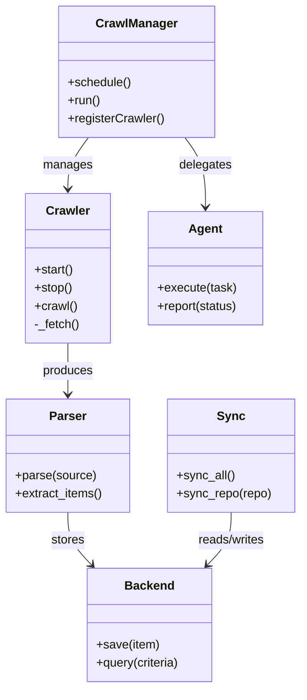
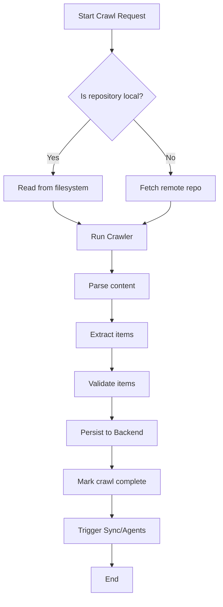

# Diagram: common/location_service/config/config.qa2.yml

> Auto-generated by Obscura crawlers

## Diagram 1

### SVG

<svg id="container" width="396.25" xmlns="http://www.w3.org/2000/svg" class="classDiagram" height="910" viewBox="0 0 396.25 910" role="graphics-document document" aria-roledescription="class"><g><defs><marker id="container_class-aggregationStart" class="marker aggregation class" refX="18" refY="7" markerWidth="190" markerHeight="240" orient="auto"><path d="M 18,7 L9,13 L1,7 L9,1 Z"></path></marker></defs><defs><marker id="container_class-aggregationEnd" class="marker aggregation class" refX="1" refY="7" markerWidth="20" markerHeight="28" orient="auto"><path d="M 18,7 L9,13 L1,7 L9,1 Z"></path></marker></defs><defs><marker id="container_class-extensionStart" class="marker extension class" refX="18" refY="7" markerWidth="190" markerHeight="240" orient="auto"><path d="M 1,7 L18,13 V 1 Z"></path></marker></defs><defs><marker id="container_class-extensionEnd" class="marker extension class" refX="1" refY="7" markerWidth="20" markerHeight="28" orient="auto"><path d="M 1,1 V 13 L18,7 Z"></path></marker></defs><defs><marker id="container_class-compositionStart" class="marker composition class" refX="18" refY="7" markerWidth="190" markerHeight="240" orient="auto"><path d="M 18,7 L9,13 L1,7 L9,1 Z"></path></marker></defs><defs><marker id="container_class-compositionEnd" class="marker composition class" refX="1" refY="7" markerWidth="20" markerHeight="28" orient="auto"><path d="M 18,7 L9,13 L1,7 L9,1 Z"></path></marker></defs><defs><marker id="container_class-dependencyStart" class="marker dependency class" refX="6" refY="7" markerWidth="190" markerHeight="240" orient="auto"><path d="M 5,7 L9,13 L1,7 L9,1 Z"></path></marker></defs><defs><marker id="container_class-dependencyEnd" class="marker dependency class" refX="13" refY="7" markerWidth="20" markerHeight="28" orient="auto"><path d="M 18,7 L9,13 L14,7 L9,1 Z"></path></marker></defs><defs><marker id="container_class-lollipopStart" class="marker lollipop class" refX="13" refY="7" markerWidth="190" markerHeight="240" orient="auto"><circle stroke="black" fill="transparent" cx="7" cy="7" r="6"></circle></marker></defs><defs><marker id="container_class-lollipopEnd" class="marker lollipop class" refX="1" refY="7" markerWidth="190" markerHeight="240" orient="auto"><circle stroke="black" fill="transparent" cx="7" cy="7" r="6"></circle></marker></defs><g class="root"><g class="clusters"></g><g class="edgePaths"><path d="M89.93,454L89.93,460.167C89.93,466.333,89.93,478.667,89.93,490C89.93,501.333,89.93,511.667,89.93,516.833L89.93,522" id="id_Crawler_Parser_1" class="edge-thickness-normal edge-pattern-solid relation" style=";;;" data-edge="true" data-et="edge" data-id="id_Crawler_Parser_1" data-points="W3sieCI6ODkuOTI5Njg3NSwieSI6NDU0fSx7IngiOjg5LjkyOTY4NzUsInkiOjQ5MX0seyJ4Ijo4OS45Mjk2ODc1LCJ5Ijo1Mjh9XQ==" marker-end="url(#container_class-dependencyEnd)"></path><path d="M89.93,678L89.93,684.167C89.93,690.333,89.93,702.667,95.159,714.279C100.389,725.891,110.848,736.782,116.078,742.227L121.308,747.672" id="id_Parser_Backend_2" class="edge-thickness-normal edge-pattern-solid relation" style=";;;" data-edge="true" data-et="edge" data-id="id_Parser_Backend_2" data-points="W3sieCI6ODkuOTI5Njg3NSwieSI6Njc4fSx7IngiOjg5LjkyOTY4NzUsInkiOjcxNX0seyJ4IjoxMjUuNDYzNzI3Njc4NTcxNDMsInkiOjc1Mn1d" marker-end="url(#container_class-dependencyEnd)"></path><path d="M117.144,182L112.608,188.167C108.072,194.333,99.001,206.667,94.465,218C89.93,229.333,89.93,239.667,89.93,244.833L89.93,250" id="id_CrawlManager_Crawler_3" class="edge-thickness-normal edge-pattern-solid relation" style=";;;" data-edge="true" data-et="edge" data-id="id_CrawlManager_Crawler_3" data-points="W3sieCI6MTE3LjE0MzUyMzE4NTQ4Mzg3LCJ5IjoxODJ9LHsieCI6ODkuOTI5Njg3NSwieSI6MjE5fSx7IngiOjg5LjkyOTY4NzUsInkiOjI1Nn1d" marker-end="url(#container_class-dependencyEnd)"></path><path d="M245.122,182L249.658,188.167C254.193,194.333,263.265,206.667,267.8,222C272.336,237.333,272.336,255.667,272.336,264.833L272.336,274" id="id_CrawlManager_Agent_4" class="edge-thickness-normal edge-pattern-solid relation" style=";;;" data-edge="true" data-et="edge" data-id="id_CrawlManager_Agent_4" data-points="W3sieCI6MjQ1LjEyMjEwMTgxNDUxNjEzLCJ5IjoxODJ9LHsieCI6MjcyLjMzNTkzNzUsInkiOjIxOX0seyJ4IjoyNzIuMzM1OTM3NSwieSI6MjgwfV0=" marker-end="url(#container_class-dependencyEnd)"></path><path d="M305.055,678L305.055,684.167C305.055,690.333,305.055,702.667,299.825,714.279C294.595,725.891,284.136,736.782,278.906,742.227L273.677,747.672" id="id_Sync_Backend_5" class="edge-thickness-normal edge-pattern-solid relation" style=";;;" data-edge="true" data-et="edge" data-id="id_Sync_Backend_5" data-points="W3sieCI6MzA1LjA1NDY4NzUsInkiOjY3OH0seyJ4IjozMDUuMDU0Njg3NSwieSI6NzE1fSx7IngiOjI2OS41MjA2NDczMjE0Mjg1NiwieSI6NzUyfV0=" marker-end="url(#container_class-dependencyEnd)"></path></g><g class="edgeLabels"><g class="edgeLabel" transform="translate(89.9296875, 491)"><g class="label" data-id="id_Crawler_Parser_1" transform="translate(-33.4765625, -12)"><foreignObject width="66.953125" height="24">

produces

</foreignObject></g></g><g class="edgeLabel" transform="translate(89.9296875, 715)"><g class="label" data-id="id_Parser_Backend_2" transform="translate(-22.125, -12)"><foreignObject width="44.25" height="24">

stores

</foreignObject></g></g><g class="edgeLabel" transform="translate(89.9296875, 219)"><g class="label" data-id="id_CrawlManager_Crawler_3" transform="translate(-32.296875, -12)"><foreignObject width="64.59375" height="24">

manages

</foreignObject></g></g><g class="edgeLabel" transform="translate(272.3359375, 219)"><g class="label" data-id="id_CrawlManager_Agent_4" transform="translate(-35.0390625, -12)"><foreignObject width="70.078125" height="24">

delegates

</foreignObject></g></g><g class="edgeLabel" transform="translate(305.0546875, 715)"><g class="label" data-id="id_Sync_Backend_5" transform="translate(-45.9453125, -12)"><foreignObject width="91.890625" height="24">

reads/writes

</foreignObject></g></g></g><g class="nodes"><g class="node default" id="classId-Crawler-0" transform="translate(89.9296875, 355)"><g class="basic label-container"><path d="M-55.8828125 -99 L55.8828125 -99 L55.8828125 99 L-55.8828125 99" stroke="none" stroke-width="0" fill="#ECECFF" style=""></path><path d="M-55.8828125 -99 C-26.493627394573476 -99, 2.8955577108530477 -99, 55.8828125 -99 M-55.8828125 -99 C-33.363054021677705 -99, -10.84329554335541 -99, 55.8828125 -99 M55.8828125 -99 C55.8828125 -28.883794595384956, 55.8828125 41.23241080923009, 55.8828125 99 M55.8828125 -99 C55.8828125 -56.14382739018407, 55.8828125 -13.287654780368143, 55.8828125 99 M55.8828125 99 C22.244821399649148 99, -11.393169700701705 99, -55.8828125 99 M55.8828125 99 C30.474901845879508 99, 5.066991191759016 99, -55.8828125 99 M-55.8828125 99 C-55.8828125 36.26401510206904, -55.8828125 -26.471969795861924, -55.8828125 -99 M-55.8828125 99 C-55.8828125 43.117265543772525, -55.8828125 -12.76546891245495, -55.8828125 -99" stroke="#9370DB" stroke-width="1.3" fill="none" stroke-dasharray="0 0" style=""></path></g><g class="annotation-group text" transform="translate(0, -75)"></g><g class="label-group text" transform="translate(-27.734375, -75)"><g class="label" style="font-weight: bolder" transform="translate(0,-12)"><foreignObject width="55.46875" height="24">

Crawler

</foreignObject></g></g><g class="members-group text" transform="translate(-43.8828125, -27)"></g><g class="methods-group text" transform="translate(-43.8828125, 3)"><g class="label" style="" transform="translate(0,-12)"><foreignObject width="52.15625" height="24">

+start()

</foreignObject></g><g class="label" style="" transform="translate(0,12)"><foreignObject width="50.21875" height="24">

+stop()

</foreignObject></g><g class="label" style="" transform="translate(0,36)"><foreignObject width="56.40625" height="24">

+crawl()

</foreignObject></g><g class="label" style="" transform="translate(0,60)"><foreignObject width="60.03125" height="24">

-_fetch()

</foreignObject></g></g><g class="divider" style=""><path d="M-55.8828125 -51 C-30.249242470568284 -51, -4.615672441136567 -51, 55.8828125 -51 M-55.8828125 -51 C-19.552725588244165 -51, 16.77736132351167 -51, 55.8828125 -51" stroke="#9370DB" stroke-width="1.3" fill="none" stroke-dasharray="0 0" style=""></path></g><g class="divider" style=""><path d="M-55.8828125 -27 C-33.10117199882126 -27, -10.319531497642522 -27, 55.8828125 -27 M-55.8828125 -27 C-13.390596755749307 -27, 29.101618988501386 -27, 55.8828125 -27" stroke="#9370DB" stroke-width="1.3" fill="none" stroke-dasharray="0 0" style=""></path></g></g><g class="node default" id="classId-CrawlManager-1" transform="translate(181.1328125, 95)"><g class="basic label-container"><path d="M-101.5234375 -87 L101.5234375 -87 L101.5234375 87 L-101.5234375 87" stroke="none" stroke-width="0" fill="#ECECFF" style=""></path><path d="M-101.5234375 -87 C-41.143183354490766 -87, 19.237070791018468 -87, 101.5234375 -87 M-101.5234375 -87 C-49.399446089048865 -87, 2.7245453219022693 -87, 101.5234375 -87 M101.5234375 -87 C101.5234375 -43.46454739115144, 101.5234375 0.070905217697117, 101.5234375 87 M101.5234375 -87 C101.5234375 -19.417028284039816, 101.5234375 48.16594343192037, 101.5234375 87 M101.5234375 87 C31.58205138818083 87, -38.35933472363834 87, -101.5234375 87 M101.5234375 87 C55.85964455946064 87, 10.195851618921282 87, -101.5234375 87 M-101.5234375 87 C-101.5234375 19.74070457327869, -101.5234375 -47.51859085344262, -101.5234375 -87 M-101.5234375 87 C-101.5234375 30.120127051382916, -101.5234375 -26.75974589723417, -101.5234375 -87" stroke="#9370DB" stroke-width="1.3" fill="none" stroke-dasharray="0 0" style=""></path></g><g class="annotation-group text" transform="translate(0, -63)"></g><g class="label-group text" transform="translate(-51.59375, -63)"><g class="label" style="font-weight: bolder" transform="translate(0,-12)"><foreignObject width="103.1875" height="24">

CrawlManager

</foreignObject></g></g><g class="members-group text" transform="translate(-89.5234375, -15)"></g><g class="methods-group text" transform="translate(-89.5234375, 15)"><g class="label" style="" transform="translate(0,-12)"><foreignObject width="83.78125" height="24">

+schedule()

</foreignObject></g><g class="label" style="" transform="translate(0,12)"><foreignObject width="43.21875" height="24">

+run()

</foreignObject></g><g class="label" style="" transform="translate(0,36)"><foreignObject width="127.453125" height="24">

+registerCrawler()

</foreignObject></g></g><g class="divider" style=""><path d="M-101.5234375 -39 C-23.271198046155405 -39, 54.98104140768919 -39, 101.5234375 -39 M-101.5234375 -39 C-60.646955899774674 -39, -19.77047429954935 -39, 101.5234375 -39" stroke="#9370DB" stroke-width="1.3" fill="none" stroke-dasharray="0 0" style=""></path></g><g class="divider" style=""><path d="M-101.5234375 -15 C-43.82168681019651 -15, 13.880063879606979 -15, 101.5234375 -15 M-101.5234375 -15 C-34.00176082826985 -15, 33.519915843460296 -15, 101.5234375 -15" stroke="#9370DB" stroke-width="1.3" fill="none" stroke-dasharray="0 0" style=""></path></g></g><g class="node default" id="classId-Parser-2" transform="translate(89.9296875, 603)"><g class="basic label-container"><path d="M-81.9296875 -75 L81.9296875 -75 L81.9296875 75 L-81.9296875 75" stroke="none" stroke-width="0" fill="#ECECFF" style=""></path><path d="M-81.9296875 -75 C-33.054566777060394 -75, 15.820553945879212 -75, 81.9296875 -75 M-81.9296875 -75 C-39.80909964793058 -75, 2.31148820413884 -75, 81.9296875 -75 M81.9296875 -75 C81.9296875 -21.81288985708818, 81.9296875 31.37422028582364, 81.9296875 75 M81.9296875 -75 C81.9296875 -15.078052147344167, 81.9296875 44.84389570531167, 81.9296875 75 M81.9296875 75 C41.46307618530296 75, 0.9964648706059194 75, -81.9296875 75 M81.9296875 75 C35.25338669454816 75, -11.422914110903676 75, -81.9296875 75 M-81.9296875 75 C-81.9296875 21.717280287018646, -81.9296875 -31.56543942596271, -81.9296875 -75 M-81.9296875 75 C-81.9296875 18.219220123260385, -81.9296875 -38.56155975347923, -81.9296875 -75" stroke="#9370DB" stroke-width="1.3" fill="none" stroke-dasharray="0 0" style=""></path></g><g class="annotation-group text" transform="translate(0, -51)"></g><g class="label-group text" transform="translate(-23.375, -51)"><g class="label" style="font-weight: bolder" transform="translate(0,-12)"><foreignObject width="46.75" height="24">

Parser

</foreignObject></g></g><g class="members-group text" transform="translate(-69.9296875, -3)"></g><g class="methods-group text" transform="translate(-69.9296875, 27)"><g class="label" style="" transform="translate(0,-12)"><foreignObject width="106.40625" height="24">

+parse(source)

</foreignObject></g><g class="label" style="" transform="translate(0,12)"><foreignObject width="116.484375" height="24">

+extract_items()

</foreignObject></g></g><g class="divider" style=""><path d="M-81.9296875 -27 C-43.20296039540125 -27, -4.476233290802497 -27, 81.9296875 -27 M-81.9296875 -27 C-26.59025931109113 -27, 28.749168877817738 -27, 81.9296875 -27" stroke="#9370DB" stroke-width="1.3" fill="none" stroke-dasharray="0 0" style=""></path></g><g class="divider" style=""><path d="M-81.9296875 -3 C-31.90641903796775 -3, 18.116849424064497 -3, 81.9296875 -3 M-81.9296875 -3 C-36.39394728556599 -3, 9.141792928868014 -3, 81.9296875 -3" stroke="#9370DB" stroke-width="1.3" fill="none" stroke-dasharray="0 0" style=""></path></g></g><g class="node default" id="classId-Backend-3" transform="translate(197.4921875, 827)"><g class="basic label-container"><path d="M-83.640625 -75 L83.640625 -75 L83.640625 75 L-83.640625 75" stroke="none" stroke-width="0" fill="#ECECFF" style=""></path><path d="M-83.640625 -75 C-44.083754130589526 -75, -4.5268832611790515 -75, 83.640625 -75 M-83.640625 -75 C-42.648810402289584 -75, -1.656995804579168 -75, 83.640625 -75 M83.640625 -75 C83.640625 -33.60652722100594, 83.640625 7.786945557988119, 83.640625 75 M83.640625 -75 C83.640625 -25.83550243339537, 83.640625 23.32899513320926, 83.640625 75 M83.640625 75 C39.714888475724266 75, -4.210848048551469 75, -83.640625 75 M83.640625 75 C25.241157150622946 75, -33.15831069875411 75, -83.640625 75 M-83.640625 75 C-83.640625 31.223605213808803, -83.640625 -12.552789572382395, -83.640625 -75 M-83.640625 75 C-83.640625 42.7172547465769, -83.640625 10.434509493153797, -83.640625 -75" stroke="#9370DB" stroke-width="1.3" fill="none" stroke-dasharray="0 0" style=""></path></g><g class="annotation-group text" transform="translate(0, -51)"></g><g class="label-group text" transform="translate(-31.296875, -51)"><g class="label" style="font-weight: bolder" transform="translate(0,-12)"><foreignObject width="62.59375" height="24">

Backend

</foreignObject></g></g><g class="members-group text" transform="translate(-71.640625, -3)"></g><g class="methods-group text" transform="translate(-71.640625, 27)"><g class="label" style="" transform="translate(0,-12)"><foreignObject width="83.140625" height="24">

+save(item)

</foreignObject></g><g class="label" style="" transform="translate(0,12)"><foreignObject width="111.984375" height="24">

+query(criteria)

</foreignObject></g></g><g class="divider" style=""><path d="M-83.640625 -27 C-20.885319653956522 -27, 41.869985692086956 -27, 83.640625 -27 M-83.640625 -27 C-33.950725044436446 -27, 15.739174911127108 -27, 83.640625 -27" stroke="#9370DB" stroke-width="1.3" fill="none" stroke-dasharray="0 0" style=""></path></g><g class="divider" style=""><path d="M-83.640625 -3 C-49.63683913500535 -3, -15.633053270010706 -3, 83.640625 -3 M-83.640625 -3 C-38.447073298638706 -3, 6.7464784027225875 -3, 83.640625 -3" stroke="#9370DB" stroke-width="1.3" fill="none" stroke-dasharray="0 0" style=""></path></g></g><g class="node default" id="classId-Sync-4" transform="translate(305.0546875, 603)"><g class="basic label-container"><path d="M-83.1953125 -75 L83.1953125 -75 L83.1953125 75 L-83.1953125 75" stroke="none" stroke-width="0" fill="#ECECFF" style=""></path><path d="M-83.1953125 -75 C-30.46344945089818 -75, 22.268413598203637 -75, 83.1953125 -75 M-83.1953125 -75 C-23.454615875027137 -75, 36.286080749945725 -75, 83.1953125 -75 M83.1953125 -75 C83.1953125 -18.64881734463887, 83.1953125 37.70236531072226, 83.1953125 75 M83.1953125 -75 C83.1953125 -26.195007918349162, 83.1953125 22.609984163301675, 83.1953125 75 M83.1953125 75 C29.012875137273788 75, -25.169562225452424 75, -83.1953125 75 M83.1953125 75 C35.12049577600028 75, -12.954320947999435 75, -83.1953125 75 M-83.1953125 75 C-83.1953125 32.97172648538085, -83.1953125 -9.056547029238303, -83.1953125 -75 M-83.1953125 75 C-83.1953125 36.185386142991256, -83.1953125 -2.629227714017489, -83.1953125 -75" stroke="#9370DB" stroke-width="1.3" fill="none" stroke-dasharray="0 0" style=""></path></g><g class="annotation-group text" transform="translate(0, -51)"></g><g class="label-group text" transform="translate(-17.09375, -51)"><g class="label" style="font-weight: bolder" transform="translate(0,-12)"><foreignObject width="34.1875" height="24">

Sync

</foreignObject></g></g><g class="members-group text" transform="translate(-71.1953125, -3)"></g><g class="methods-group text" transform="translate(-71.1953125, 27)"><g class="label" style="" transform="translate(0,-12)"><foreignObject width="76.375" height="24">

+sync_all()

</foreignObject></g><g class="label" style="" transform="translate(0,12)"><foreignObject width="125.296875" height="24">

+sync_repo(repo)

</foreignObject></g></g><g class="divider" style=""><path d="M-83.1953125 -27 C-27.524605854954444 -27, 28.14610079009111 -27, 83.1953125 -27 M-83.1953125 -27 C-27.08622709983222 -27, 29.022858300335557 -27, 83.1953125 -27" stroke="#9370DB" stroke-width="1.3" fill="none" stroke-dasharray="0 0" style=""></path></g><g class="divider" style=""><path d="M-83.1953125 -3 C-35.14025228972757 -3, 12.91480792054486 -3, 83.1953125 -3 M-83.1953125 -3 C-30.317136055682134 -3, 22.561040388635732 -3, 83.1953125 -3" stroke="#9370DB" stroke-width="1.3" fill="none" stroke-dasharray="0 0" style=""></path></g></g><g class="node default" id="classId-Agent-5" transform="translate(272.3359375, 355)"><g class="basic label-container"><path d="M-76.5234375 -75 L76.5234375 -75 L76.5234375 75 L-76.5234375 75" stroke="none" stroke-width="0" fill="#ECECFF" style=""></path><path d="M-76.5234375 -75 C-42.716895959711906 -75, -8.910354419423811 -75, 76.5234375 -75 M-76.5234375 -75 C-39.56911181407656 -75, -2.6147861281531135 -75, 76.5234375 -75 M76.5234375 -75 C76.5234375 -39.47081295287926, 76.5234375 -3.9416259057585137, 76.5234375 75 M76.5234375 -75 C76.5234375 -33.13024469102974, 76.5234375 8.739510617940525, 76.5234375 75 M76.5234375 75 C31.739766487289856 75, -13.043904525420288 75, -76.5234375 75 M76.5234375 75 C43.32994390866353 75, 10.13645031732706 75, -76.5234375 75 M-76.5234375 75 C-76.5234375 21.31963422974121, -76.5234375 -32.36073154051758, -76.5234375 -75 M-76.5234375 75 C-76.5234375 21.443005823836288, -76.5234375 -32.113988352327425, -76.5234375 -75" stroke="#9370DB" stroke-width="1.3" fill="none" stroke-dasharray="0 0" style=""></path></g><g class="annotation-group text" transform="translate(0, -51)"></g><g class="label-group text" transform="translate(-21.078125, -51)"><g class="label" style="font-weight: bolder" transform="translate(0,-12)"><foreignObject width="42.15625" height="24">

Agent

</foreignObject></g></g><g class="members-group text" transform="translate(-64.5234375, -3)"></g><g class="methods-group text" transform="translate(-64.5234375, 27)"><g class="label" style="" transform="translate(0,-12)"><foreignObject width="104.203125" height="24">

+execute(task)

</foreignObject></g><g class="label" style="" transform="translate(0,12)"><foreignObject width="107.96875" height="24">

+report(status)

</foreignObject></g></g><g class="divider" style=""><path d="M-76.5234375 -27 C-21.908197465501054 -27, 32.70704256899789 -27, 76.5234375 -27 M-76.5234375 -27 C-45.27470691571776 -27, -14.025976331435523 -27, 76.5234375 -27" stroke="#9370DB" stroke-width="1.3" fill="none" stroke-dasharray="0 0" style=""></path></g><g class="divider" style=""><path d="M-76.5234375 -3 C-21.388794931804895 -3, 33.74584763639021 -3, 76.5234375 -3 M-76.5234375 -3 C-36.19236670941156 -3, 4.138704081176883 -3, 76.5234375 -3" stroke="#9370DB" stroke-width="1.3" fill="none" stroke-dasharray="0 0" style=""></path></g></g></g></g></g></svg>

## Diagram 2

### SVG

<svg id="container" width="469.859375" xmlns="http://www.w3.org/2000/svg" class="flowchart" height="1270.625" viewBox="0 0 469.859375 1270.625" role="graphics-document document" aria-roledescription="flowchart-v2"><g><marker id="container_flowchart-v2-pointEnd" class="marker flowchart-v2" viewBox="0 0 10 10" refX="5" refY="5" markerUnits="userSpaceOnUse" markerWidth="8" markerHeight="8" orient="auto"><path d="M 0 0 L 10 5 L 0 10 z" class="arrowMarkerPath" style="stroke-width: 1; stroke-dasharray: 1, 0;"></path></marker><marker id="container_flowchart-v2-pointStart" class="marker flowchart-v2" viewBox="0 0 10 10" refX="4.5" refY="5" markerUnits="userSpaceOnUse" markerWidth="8" markerHeight="8" orient="auto"><path d="M 0 5 L 10 10 L 10 0 z" class="arrowMarkerPath" style="stroke-width: 1; stroke-dasharray: 1, 0;"></path></marker><marker id="container_flowchart-v2-circleEnd" class="marker flowchart-v2" viewBox="0 0 10 10" refX="11" refY="5" markerUnits="userSpaceOnUse" markerWidth="11" markerHeight="11" orient="auto"><circle cx="5" cy="5" r="5" class="arrowMarkerPath" style="stroke-width: 1; stroke-dasharray: 1, 0;"></circle></marker><marker id="container_flowchart-v2-circleStart" class="marker flowchart-v2" viewBox="0 0 10 10" refX="-1" refY="5" markerUnits="userSpaceOnUse" markerWidth="11" markerHeight="11" orient="auto"><circle cx="5" cy="5" r="5" class="arrowMarkerPath" style="stroke-width: 1; stroke-dasharray: 1, 0;"></circle></marker><marker id="container_flowchart-v2-crossEnd" class="marker cross flowchart-v2" viewBox="0 0 11 11" refX="12" refY="5.2" markerUnits="userSpaceOnUse" markerWidth="11" markerHeight="11" orient="auto"><path d="M 1,1 l 9,9 M 10,1 l -9,9" class="arrowMarkerPath" style="stroke-width: 2; stroke-dasharray: 1, 0;"></path></marker><marker id="container_flowchart-v2-crossStart" class="marker cross flowchart-v2" viewBox="0 0 11 11" refX="-1" refY="5.2" markerUnits="userSpaceOnUse" markerWidth="11" markerHeight="11" orient="auto"><path d="M 1,1 l 9,9 M 10,1 l -9,9" class="arrowMarkerPath" style="stroke-width: 2; stroke-dasharray: 1, 0;"></path></marker><g class="root"><g class="clusters"></g><g class="edgePaths"><path d="M239.863,62L239.863,66.167C239.863,70.333,239.863,78.667,239.863,86.333C239.863,94,239.863,101,239.863,104.5L239.863,108" id="L_A_B_0" class="edge-thickness-normal edge-pattern-solid edge-thickness-normal edge-pattern-solid flowchart-link" style=";" data-edge="true" data-et="edge" data-id="L_A_B_0" data-points="W3sieCI6MjM5Ljg2MzI4MTI1LCJ5Ijo2Mn0seyJ4IjoyMzkuODYzMjgxMjUsInkiOjg3fSx7IngiOjIzOS44NjMyODEyNSwieSI6MTEyfV0=" marker-end="url(#container_flowchart-v2-pointEnd)"></path><path d="M193.378,256.14L180.132,270.054C166.885,283.968,140.392,311.797,127.145,331.211C113.898,350.625,113.898,361.625,113.898,367.125L113.898,372.625" id="L_B_C_0" class="edge-thickness-normal edge-pattern-solid edge-thickness-normal edge-pattern-solid flowchart-link" style=";" data-edge="true" data-et="edge" data-id="L_B_C_0" data-points="W3sieCI6MTkzLjM3ODI3NDEwMzc5MzkzLCJ5IjoyNTYuMTM5OTkyODUzNzkzOX0seyJ4IjoxMTMuODk4NDM3NSwieSI6MzM5LjYyNX0seyJ4IjoxMTMuODk4NDM3NSwieSI6Mzc2LjYyNX1d" marker-end="url(#container_flowchart-v2-pointEnd)"></path><path d="M286.348,256.14L299.595,270.054C312.842,283.968,339.335,311.797,352.581,331.211C365.828,350.625,365.828,361.625,365.828,367.125L365.828,372.625" id="L_B_D_0" class="edge-thickness-normal edge-pattern-solid edge-thickness-normal edge-pattern-solid flowchart-link" style=";" data-edge="true" data-et="edge" data-id="L_B_D_0" data-points="W3sieCI6Mjg2LjM0ODI4ODM5NjIwNjEsInkiOjI1Ni4xMzk5OTI4NTM3OTM5fSx7IngiOjM2NS44MjgxMjUsInkiOjMzOS42MjV9LHsieCI6MzY1LjgyODEyNSwieSI6Mzc2LjYyNX1d" marker-end="url(#container_flowchart-v2-pointEnd)"></path><path d="M113.898,430.625L113.898,434.792C113.898,438.958,113.898,447.292,123.376,455.371C132.853,463.45,151.807,471.274,161.284,475.186L170.761,479.099" id="L_C_E_0" class="edge-thickness-normal edge-pattern-solid edge-thickness-normal edge-pattern-solid flowchart-link" style=";" data-edge="true" data-et="edge" data-id="L_C_E_0" data-points="W3sieCI6MTEzLjg5ODQzNzUsInkiOjQzMC42MjV9LHsieCI6MTEzLjg5ODQzNzUsInkiOjQ1NS42MjV9LHsieCI6MTc0LjQ1ODQ1ODUzMzY1Mzg0LCJ5Ijo0ODAuNjI1fV0=" marker-end="url(#container_flowchart-v2-pointEnd)"></path><path d="M365.828,430.625L365.828,434.792C365.828,438.958,365.828,447.292,356.351,455.371C346.874,463.45,327.92,471.274,318.443,475.186L308.965,479.099" id="L_D_E_0" class="edge-thickness-normal edge-pattern-solid edge-thickness-normal edge-pattern-solid flowchart-link" style=";" data-edge="true" data-et="edge" data-id="L_D_E_0" data-points="W3sieCI6MzY1LjgyODEyNSwieSI6NDMwLjYyNX0seyJ4IjozNjUuODI4MTI1LCJ5Ijo0NTUuNjI1fSx7IngiOjMwNS4yNjgxMDM5NjYzNDYyLCJ5Ijo0ODAuNjI1fV0=" marker-end="url(#container_flowchart-v2-pointEnd)"></path><path d="M239.863,534.625L239.863,538.792C239.863,542.958,239.863,551.292,239.863,558.958C239.863,566.625,239.863,573.625,239.863,577.125L239.863,580.625" id="L_E_F_0" class="edge-thickness-normal edge-pattern-solid edge-thickness-normal edge-pattern-solid flowchart-link" style=";" data-edge="true" data-et="edge" data-id="L_E_F_0" data-points="W3sieCI6MjM5Ljg2MzI4MTI1LCJ5Ijo1MzQuNjI1fSx7IngiOjIzOS44NjMyODEyNSwieSI6NTU5LjYyNX0seyJ4IjoyMzkuODYzMjgxMjUsInkiOjU4NC42MjV9XQ==" marker-end="url(#container_flowchart-v2-pointEnd)"></path><path d="M239.863,638.625L239.863,642.792C239.863,646.958,239.863,655.292,239.863,662.958C239.863,670.625,239.863,677.625,239.863,681.125L239.863,684.625" id="L_F_G_0" class="edge-thickness-normal edge-pattern-solid edge-thickness-normal edge-pattern-solid flowchart-link" style=";" data-edge="true" data-et="edge" data-id="L_F_G_0" data-points="W3sieCI6MjM5Ljg2MzI4MTI1LCJ5Ijo2MzguNjI1fSx7IngiOjIzOS44NjMyODEyNSwieSI6NjYzLjYyNX0seyJ4IjoyMzkuODYzMjgxMjUsInkiOjY4OC42MjV9XQ==" marker-end="url(#container_flowchart-v2-pointEnd)"></path><path d="M239.863,742.625L239.863,746.792C239.863,750.958,239.863,759.292,239.863,766.958C239.863,774.625,239.863,781.625,239.863,785.125L239.863,788.625" id="L_G_H_0" class="edge-thickness-normal edge-pattern-solid edge-thickness-normal edge-pattern-solid flowchart-link" style=";" data-edge="true" data-et="edge" data-id="L_G_H_0" data-points="W3sieCI6MjM5Ljg2MzI4MTI1LCJ5Ijo3NDIuNjI1fSx7IngiOjIzOS44NjMyODEyNSwieSI6NzY3LjYyNX0seyJ4IjoyMzkuODYzMjgxMjUsInkiOjc5Mi42MjV9XQ==" marker-end="url(#container_flowchart-v2-pointEnd)"></path><path d="M239.863,846.625L239.863,850.792C239.863,854.958,239.863,863.292,239.863,870.958C239.863,878.625,239.863,885.625,239.863,889.125L239.863,892.625" id="L_H_I_0" class="edge-thickness-normal edge-pattern-solid edge-thickness-normal edge-pattern-solid flowchart-link" style=";" data-edge="true" data-et="edge" data-id="L_H_I_0" data-points="W3sieCI6MjM5Ljg2MzI4MTI1LCJ5Ijo4NDYuNjI1fSx7IngiOjIzOS44NjMyODEyNSwieSI6ODcxLjYyNX0seyJ4IjoyMzkuODYzMjgxMjUsInkiOjg5Ni42MjV9XQ==" marker-end="url(#container_flowchart-v2-pointEnd)"></path><path d="M239.863,950.625L239.863,954.792C239.863,958.958,239.863,967.292,239.863,974.958C239.863,982.625,239.863,989.625,239.863,993.125L239.863,996.625" id="L_I_J_0" class="edge-thickness-normal edge-pattern-solid edge-thickness-normal edge-pattern-solid flowchart-link" style=";" data-edge="true" data-et="edge" data-id="L_I_J_0" data-points="W3sieCI6MjM5Ljg2MzI4MTI1LCJ5Ijo5NTAuNjI1fSx7IngiOjIzOS44NjMyODEyNSwieSI6OTc1LjYyNX0seyJ4IjoyMzkuODYzMjgxMjUsInkiOjEwMDAuNjI1fV0=" marker-end="url(#container_flowchart-v2-pointEnd)"></path><path d="M239.863,1054.625L239.863,1058.792C239.863,1062.958,239.863,1071.292,239.863,1078.958C239.863,1086.625,239.863,1093.625,239.863,1097.125L239.863,1100.625" id="L_J_K_0" class="edge-thickness-normal edge-pattern-solid edge-thickness-normal edge-pattern-solid flowchart-link" style=";" data-edge="true" data-et="edge" data-id="L_J_K_0" data-points="W3sieCI6MjM5Ljg2MzI4MTI1LCJ5IjoxMDU0LjYyNX0seyJ4IjoyMzkuODYzMjgxMjUsInkiOjEwNzkuNjI1fSx7IngiOjIzOS44NjMyODEyNSwieSI6MTEwNC42MjV9XQ==" marker-end="url(#container_flowchart-v2-pointEnd)"></path><path d="M239.863,1158.625L239.863,1162.792C239.863,1166.958,239.863,1175.292,239.863,1182.958C239.863,1190.625,239.863,1197.625,239.863,1201.125L239.863,1204.625" id="L_K_L_0" class="edge-thickness-normal edge-pattern-solid edge-thickness-normal edge-pattern-solid flowchart-link" style=";" data-edge="true" data-et="edge" data-id="L_K_L_0" data-points="W3sieCI6MjM5Ljg2MzI4MTI1LCJ5IjoxMTU4LjYyNX0seyJ4IjoyMzkuODYzMjgxMjUsInkiOjExODMuNjI1fSx7IngiOjIzOS44NjMyODEyNSwieSI6MTIwOC42MjV9XQ==" marker-end="url(#container_flowchart-v2-pointEnd)"></path></g><g class="edgeLabels"><g class="edgeLabel"><g class="label" data-id="L_A_B_0" transform="translate(0, 0)"><foreignObject width="0" height="0">

</foreignObject></g></g><g class="edgeLabel" transform="translate(113.8984375, 339.625)"><g class="label" data-id="L_B_C_0" transform="translate(-12.03125, -12)"><foreignObject width="24.0625" height="24">

Yes

</foreignObject></g></g><g class="edgeLabel" transform="translate(365.828125, 339.625)"><g class="label" data-id="L_B_D_0" transform="translate(-10.140625, -12)"><foreignObject width="20.28125" height="24">

No

</foreignObject></g></g><g class="edgeLabel"><g class="label" data-id="L_C_E_0" transform="translate(0, 0)"><foreignObject width="0" height="0">

</foreignObject></g></g><g class="edgeLabel"><g class="label" data-id="L_D_E_0" transform="translate(0, 0)"><foreignObject width="0" height="0">

</foreignObject></g></g><g class="edgeLabel"><g class="label" data-id="L_E_F_0" transform="translate(0, 0)"><foreignObject width="0" height="0">

</foreignObject></g></g><g class="edgeLabel"><g class="label" data-id="L_F_G_0" transform="translate(0, 0)"><foreignObject width="0" height="0">

</foreignObject></g></g><g class="edgeLabel"><g class="label" data-id="L_G_H_0" transform="translate(0, 0)"><foreignObject width="0" height="0">

</foreignObject></g></g><g class="edgeLabel"><g class="label" data-id="L_H_I_0" transform="translate(0, 0)"><foreignObject width="0" height="0">

</foreignObject></g></g><g class="edgeLabel"><g class="label" data-id="L_I_J_0" transform="translate(0, 0)"><foreignObject width="0" height="0">

</foreignObject></g></g><g class="edgeLabel"><g class="label" data-id="L_J_K_0" transform="translate(0, 0)"><foreignObject width="0" height="0">

</foreignObject></g></g><g class="edgeLabel"><g class="label" data-id="L_K_L_0" transform="translate(0, 0)"><foreignObject width="0" height="0">

</foreignObject></g></g></g><g class="nodes"><g class="node default" id="flowchart-A-0" transform="translate(239.86328125, 35)"><rect class="basic label-container" style="" x="-100.828125" y="-27" width="201.65625" height="54"></rect><g class="label" style="" transform="translate(-70.828125, -12)"><rect></rect><foreignObject width="141.65625" height="24">

Start Crawl Request

</foreignObject></g></g><g class="node default" id="flowchart-B-1" transform="translate(239.86328125, 207.3125)"><polygon points="95.3125,0 190.625,-95.3125 95.3125,-190.625 0,-95.3125" class="label-container" transform="translate(-94.8125, 95.3125)"></polygon><g class="label" style="" transform="translate(-68.3125, -12)"><rect></rect><foreignObject width="136.625" height="24">

Is repository local?

</foreignObject></g></g><g class="node default" id="flowchart-C-3" transform="translate(113.8984375, 403.625)"><rect class="basic label-container" style="" x="-105.8984375" y="-27" width="211.796875" height="54"></rect><g class="label" style="" transform="translate(-75.8984375, -12)"><rect></rect><foreignObject width="151.796875" height="24">

Read from filesystem

</foreignObject></g></g><g class="node default" id="flowchart-D-5" transform="translate(365.828125, 403.625)"><rect class="basic label-container" style="" x="-96.03125" y="-27" width="192.0625" height="54"></rect><g class="label" style="" transform="translate(-66.03125, -12)"><rect></rect><foreignObject width="132.0625" height="24">

Fetch remote repo

</foreignObject></g></g><g class="node default" id="flowchart-E-7" transform="translate(239.86328125, 507.625)"><rect class="basic label-container" style="" x="-73.2734375" y="-27" width="146.546875" height="54"></rect><g class="label" style="" transform="translate(-43.2734375, -12)"><rect></rect><foreignObject width="86.546875" height="24">

Run Crawler

</foreignObject></g></g><g class="node default" id="flowchart-F-11" transform="translate(239.86328125, 611.625)"><rect class="basic label-container" style="" x="-79.4765625" y="-27" width="158.953125" height="54"></rect><g class="label" style="" transform="translate(-49.4765625, -12)"><rect></rect><foreignObject width="98.953125" height="24">

Parse content

</foreignObject></g></g><g class="node default" id="flowchart-G-13" transform="translate(239.86328125, 715.625)"><rect class="basic label-container" style="" x="-77.0234375" y="-27" width="154.046875" height="54"></rect><g class="label" style="" transform="translate(-47.0234375, -12)"><rect></rect><foreignObject width="94.046875" height="24">

Extract items

</foreignObject></g></g><g class="node default" id="flowchart-H-15" transform="translate(239.86328125, 819.625)"><rect class="basic label-container" style="" x="-81.3671875" y="-27" width="162.734375" height="54"></rect><g class="label" style="" transform="translate(-51.3671875, -12)"><rect></rect><foreignObject width="102.734375" height="24">

Validate items

</foreignObject></g></g><g class="node default" id="flowchart-I-17" transform="translate(239.86328125, 923.625)"><rect class="basic label-container" style="" x="-96.9296875" y="-27" width="193.859375" height="54"></rect><g class="label" style="" transform="translate(-66.9296875, -12)"><rect></rect><foreignObject width="133.859375" height="24">

Persist to Backend

</foreignObject></g></g><g class="node default" id="flowchart-J-19" transform="translate(239.86328125, 1027.625)"><rect class="basic label-container" style="" x="-104.765625" y="-27" width="209.53125" height="54"></rect><g class="label" style="" transform="translate(-74.765625, -12)"><rect></rect><foreignObject width="149.53125" height="24">

Mark crawl complete

</foreignObject></g></g><g class="node default" id="flowchart-K-21" transform="translate(239.86328125, 1131.625)"><rect class="basic label-container" style="" x="-101.9375" y="-27" width="203.875" height="54"></rect><g class="label" style="" transform="translate(-71.9375, -12)"><rect></rect><foreignObject width="143.875" height="24">

Trigger Sync/Agents

</foreignObject></g></g><g class="node default" id="flowchart-L-23" transform="translate(239.86328125, 1235.625)"><rect class="basic label-container" style="" x="-43.6796875" y="-27" width="87.359375" height="54"></rect><g class="label" style="" transform="translate(-13.6796875, -12)"><rect></rect><foreignObject width="27.359375" height="24">

End

</foreignObject></g></g></g></g></g></svg>
