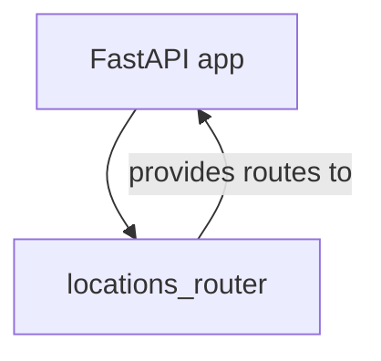
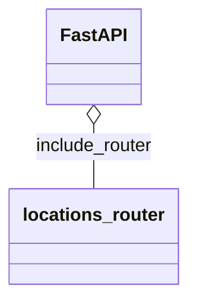

# Diagram: common/location_service/local/app/main.py

> Auto-generated by Obscura crawlers

## Diagram 1

### SVG

<svg id="container" width="214.76953125" xmlns="http://www.w3.org/2000/svg" class="flowchart" height="198" viewBox="0 0 214.76953125 198" role="graphics-document document" aria-roledescription="flowchart-v2"><g><marker id="container_flowchart-v2-pointEnd" class="marker flowchart-v2" viewBox="0 0 10 10" refX="5" refY="5" markerUnits="userSpaceOnUse" markerWidth="8" markerHeight="8" orient="auto"><path d="M 0 0 L 10 5 L 0 10 z" class="arrowMarkerPath" style="stroke-width: 1; stroke-dasharray: 1, 0;"></path></marker><marker id="container_flowchart-v2-pointStart" class="marker flowchart-v2" viewBox="0 0 10 10" refX="4.5" refY="5" markerUnits="userSpaceOnUse" markerWidth="8" markerHeight="8" orient="auto"><path d="M 0 5 L 10 10 L 10 0 z" class="arrowMarkerPath" style="stroke-width: 1; stroke-dasharray: 1, 0;"></path></marker><marker id="container_flowchart-v2-circleEnd" class="marker flowchart-v2" viewBox="0 0 10 10" refX="11" refY="5" markerUnits="userSpaceOnUse" markerWidth="11" markerHeight="11" orient="auto"><circle cx="5" cy="5" r="5" class="arrowMarkerPath" style="stroke-width: 1; stroke-dasharray: 1, 0;"></circle></marker><marker id="container_flowchart-v2-circleStart" class="marker flowchart-v2" viewBox="0 0 10 10" refX="-1" refY="5" markerUnits="userSpaceOnUse" markerWidth="11" markerHeight="11" orient="auto"><circle cx="5" cy="5" r="5" class="arrowMarkerPath" style="stroke-width: 1; stroke-dasharray: 1, 0;"></circle></marker><marker id="container_flowchart-v2-crossEnd" class="marker cross flowchart-v2" viewBox="0 0 11 11" refX="12" refY="5.2" markerUnits="userSpaceOnUse" markerWidth="11" markerHeight="11" orient="auto"><path d="M 1,1 l 9,9 M 10,1 l -9,9" class="arrowMarkerPath" style="stroke-width: 2; stroke-dasharray: 1, 0;"></path></marker><marker id="container_flowchart-v2-crossStart" class="marker cross flowchart-v2" viewBox="0 0 11 11" refX="-1" refY="5.2" markerUnits="userSpaceOnUse" markerWidth="11" markerHeight="11" orient="auto"><path d="M 1,1 l 9,9 M 10,1 l -9,9" class="arrowMarkerPath" style="stroke-width: 2; stroke-dasharray: 1, 0;"></path></marker><g class="root"><g class="clusters"></g><g class="edgePaths"><path d="M79.562,62L75.417,68.167C71.272,74.333,62.982,86.667,62.61,98.447C62.238,110.227,69.784,121.454,73.557,127.067L77.331,132.68" id="L_App_LocationsRouter_0" class="edge-thickness-normal edge-pattern-solid edge-thickness-normal edge-pattern-solid flowchart-link" style=";" data-edge="true" data-et="edge" data-id="L_App_LocationsRouter_0" data-points="W3sieCI6NzkuNTYyMDcyNzUzOTA2MjUsInkiOjYyfSx7IngiOjU0LjY5MTQwNjI1LCJ5Ijo5OX0seyJ4Ijo3OS41NjIwNzI3NTM5MDYyNSwieSI6MTM2fV0=" marker-end="url(#container_flowchart-v2-pointEnd)"></path><path d="M115.86,136L120.005,129.833C124.15,123.667,132.44,111.333,132.812,99.553C133.184,87.773,125.638,76.546,121.864,70.933L118.091,65.32" id="L_LocationsRouter_App_0" class="edge-thickness-normal edge-pattern-solid edge-thickness-normal edge-pattern-solid flowchart-link" style=";" data-edge="true" data-et="edge" data-id="L_LocationsRouter_App_0" data-points="W3sieCI6MTE1Ljg1OTgwMjI0NjA5Mzc1LCJ5IjoxMzZ9LHsieCI6MTQwLjczMDQ2ODc1LCJ5Ijo5OX0seyJ4IjoxMTUuODU5ODAyMjQ2MDkzNzUsInkiOjYyfV0=" marker-end="url(#container_flowchart-v2-pointEnd)"></path></g><g class="edgeLabels"><g class="edgeLabel"><g class="label" data-id="L_App_LocationsRouter_0" transform="translate(0, 0)"><foreignObject width="0" height="0">

</foreignObject></g></g><g class="edgeLabel" transform="translate(140.73046875, 99)"><g class="label" data-id="L_LocationsRouter_App_0" transform="translate(-66.0390625, -12)"><foreignObject width="132.078125" height="24">

provides routes to

</foreignObject></g></g></g><g class="nodes"><g class="node default" id="flowchart-App-0" transform="translate(97.7109375, 35)"><rect class="basic label-container" style="" x="-71.9140625" y="-27" width="143.828125" height="54"></rect><g class="label" style="" transform="translate(-41.9140625, -12)"><rect></rect><foreignObject width="83.828125" height="24">

FastAPI app

</foreignObject></g></g><g class="node default" id="flowchart-LocationsRouter-1" transform="translate(97.7109375, 163)"><rect class="basic label-container" style="" x="-89.7109375" y="-27" width="179.421875" height="54"></rect><g class="label" style="" transform="translate(-59.7109375, -12)"><rect></rect><foreignObject width="119.421875" height="24">

locations_router

</foreignObject></g></g></g></g></g></svg>

## Diagram 2

### SVG

<svg id="container" width="160.859375" xmlns="http://www.w3.org/2000/svg" class="classDiagram" height="258" viewBox="0 0 160.859375 258" role="graphics-document document" aria-roledescription="class"><g><defs><marker id="container_class-aggregationStart" class="marker aggregation class" refX="18" refY="7" markerWidth="190" markerHeight="240" orient="auto"><path d="M 18,7 L9,13 L1,7 L9,1 Z"></path></marker></defs><defs><marker id="container_class-aggregationEnd" class="marker aggregation class" refX="1" refY="7" markerWidth="20" markerHeight="28" orient="auto"><path d="M 18,7 L9,13 L1,7 L9,1 Z"></path></marker></defs><defs><marker id="container_class-extensionStart" class="marker extension class" refX="18" refY="7" markerWidth="190" markerHeight="240" orient="auto"><path d="M 1,7 L18,13 V 1 Z"></path></marker></defs><defs><marker id="container_class-extensionEnd" class="marker extension class" refX="1" refY="7" markerWidth="20" markerHeight="28" orient="auto"><path d="M 1,1 V 13 L18,7 Z"></path></marker></defs><defs><marker id="container_class-compositionStart" class="marker composition class" refX="18" refY="7" markerWidth="190" markerHeight="240" orient="auto"><path d="M 18,7 L9,13 L1,7 L9,1 Z"></path></marker></defs><defs><marker id="container_class-compositionEnd" class="marker composition class" refX="1" refY="7" markerWidth="20" markerHeight="28" orient="auto"><path d="M 18,7 L9,13 L1,7 L9,1 Z"></path></marker></defs><defs><marker id="container_class-dependencyStart" class="marker dependency class" refX="6" refY="7" markerWidth="190" markerHeight="240" orient="auto"><path d="M 5,7 L9,13 L1,7 L9,1 Z"></path></marker></defs><defs><marker id="container_class-dependencyEnd" class="marker dependency class" refX="13" refY="7" markerWidth="20" markerHeight="28" orient="auto"><path d="M 18,7 L9,13 L14,7 L9,1 Z"></path></marker></defs><defs><marker id="container_class-lollipopStart" class="marker lollipop class" refX="13" refY="7" markerWidth="190" markerHeight="240" orient="auto"><circle stroke="black" fill="transparent" cx="7" cy="7" r="6"></circle></marker></defs><defs><marker id="container_class-lollipopEnd" class="marker lollipop class" refX="1" refY="7" markerWidth="190" markerHeight="240" orient="auto"><circle stroke="black" fill="transparent" cx="7" cy="7" r="6"></circle></marker></defs><g class="root"><g class="clusters"></g><g class="edgePaths"><path d="M80.43,109.25L80.43,112.542C80.43,115.833,80.43,122.417,80.43,131.875C80.43,141.333,80.43,153.667,80.43,159.833L80.43,166" id="id_FastAPI_locations_router_1" class="edge-thickness-normal edge-pattern-solid relation" style=";;;" data-edge="true" data-et="edge" data-id="id_FastAPI_locations_router_1" data-points="W3sieCI6ODAuNDI5Njg3NSwieSI6OTJ9LHsieCI6ODAuNDI5Njg3NSwieSI6MTI5fSx7IngiOjgwLjQyOTY4NzUsInkiOjE2Nn1d" marker-start="url(#container_class-aggregationStart)"></path></g><g class="edgeLabels"><g class="edgeLabel" transform="translate(80.4296875, 129)"><g class="label" data-id="id_FastAPI_locations_router_1" transform="translate(-53.3046875, -12)"><foreignObject width="106.609375" height="24">

include_router

</foreignObject></g></g></g><g class="nodes"><g class="node default" id="classId-FastAPI-0" transform="translate(80.4296875, 50)"><g class="basic label-container"><path d="M-38.5390625 -42 L38.5390625 -42 L38.5390625 42 L-38.5390625 42" stroke="none" stroke-width="0" fill="#ECECFF" style=""></path><path d="M-38.5390625 -42 C-13.30936908660166 -42, 11.920324326796681 -42, 38.5390625 -42 M-38.5390625 -42 C-14.858677841522546 -42, 8.821706816954908 -42, 38.5390625 -42 M38.5390625 -42 C38.5390625 -18.772567386264345, 38.5390625 4.454865227471309, 38.5390625 42 M38.5390625 -42 C38.5390625 -19.656405135082927, 38.5390625 2.687189729834145, 38.5390625 42 M38.5390625 42 C18.59972436993592 42, -1.3396137601281595 42, -38.5390625 42 M38.5390625 42 C13.723862492105294 42, -11.091337515789412 42, -38.5390625 42 M-38.5390625 42 C-38.5390625 19.45689978975713, -38.5390625 -3.0862004204857385, -38.5390625 -42 M-38.5390625 42 C-38.5390625 13.466378868686888, -38.5390625 -15.067242262626223, -38.5390625 -42" stroke="#9370DB" stroke-width="1.3" fill="none" stroke-dasharray="0 0" style=""></path></g><g class="annotation-group text" transform="translate(0, -18)"></g><g class="label-group text" transform="translate(-26.5390625, -18)"><g class="label" style="font-weight: bolder" transform="translate(0,-12)"><foreignObject width="53.078125" height="24">

FastAPI

</foreignObject></g></g><g class="members-group text" transform="translate(-26.5390625, 30)"></g><g class="methods-group text" transform="translate(-26.5390625, 60)"></g><g class="divider" style=""><path d="M-38.5390625 6 C-9.924847007459395 6, 18.68936848508121 6, 38.5390625 6 M-38.5390625 6 C-10.962911544068294 6, 16.61323941186341 6, 38.5390625 6" stroke="#9370DB" stroke-width="1.3" fill="none" stroke-dasharray="0 0" style=""></path></g><g class="divider" style=""><path d="M-38.5390625 24 C-10.234843946123707 24, 18.069374607752586 24, 38.5390625 24 M-38.5390625 24 C-13.548171786587389 24, 11.442718926825222 24, 38.5390625 24" stroke="#9370DB" stroke-width="1.3" fill="none" stroke-dasharray="0 0" style=""></path></g></g><g class="node default" id="classId-locations_router-1" transform="translate(80.4296875, 208)"><g class="basic label-container"><path d="M-72.4296875 -42 L72.4296875 -42 L72.4296875 42 L-72.4296875 42" stroke="none" stroke-width="0" fill="#ECECFF" style=""></path><path d="M-72.4296875 -42 C-18.193577405212196 -42, 36.04253268957561 -42, 72.4296875 -42 M-72.4296875 -42 C-14.806737368515194 -42, 42.81621276296961 -42, 72.4296875 -42 M72.4296875 -42 C72.4296875 -19.48046729736259, 72.4296875 3.039065405274819, 72.4296875 42 M72.4296875 -42 C72.4296875 -18.43124561665016, 72.4296875 5.137508766699682, 72.4296875 42 M72.4296875 42 C31.678719555385463 42, -9.072248389229074 42, -72.4296875 42 M72.4296875 42 C38.486961343347446 42, 4.544235186694891 42, -72.4296875 42 M-72.4296875 42 C-72.4296875 14.780793788536165, -72.4296875 -12.43841242292767, -72.4296875 -42 M-72.4296875 42 C-72.4296875 16.739675404747572, -72.4296875 -8.520649190504855, -72.4296875 -42" stroke="#9370DB" stroke-width="1.3" fill="none" stroke-dasharray="0 0" style=""></path></g><g class="annotation-group text" transform="translate(0, -18)"></g><g class="label-group text" transform="translate(-60.4296875, -18)"><g class="label" style="font-weight: bolder" transform="translate(0,-12)"><foreignObject width="120.859375" height="24">

locations_router

</foreignObject></g></g><g class="members-group text" transform="translate(-60.4296875, 30)"></g><g class="methods-group text" transform="translate(-60.4296875, 60)"></g><g class="divider" style=""><path d="M-72.4296875 6 C-37.01423209383355 6, -1.5987766876670975 6, 72.4296875 6 M-72.4296875 6 C-23.352096993492133 6, 25.725493513015735 6, 72.4296875 6" stroke="#9370DB" stroke-width="1.3" fill="none" stroke-dasharray="0 0" style=""></path></g><g class="divider" style=""><path d="M-72.4296875 24 C-32.42603980411066 24, 7.577607891778683 24, 72.4296875 24 M-72.4296875 24 C-32.23702069907054 24, 7.9556461018589175 24, 72.4296875 24" stroke="#9370DB" stroke-width="1.3" fill="none" stroke-dasharray="0 0" style=""></path></g></g></g></g></g></svg>
