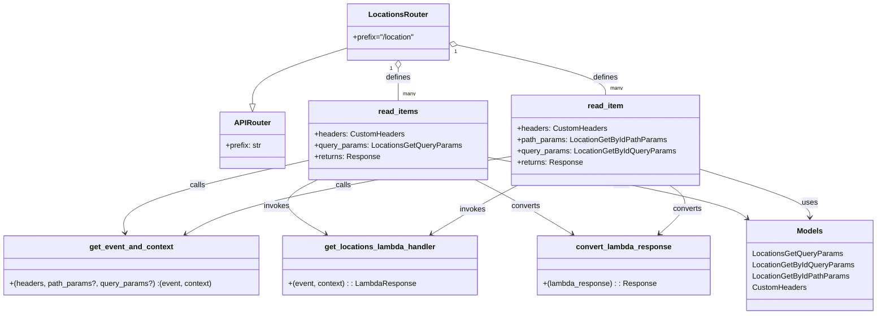

# Diagram: common/location_service/local/app/routes.py

> Auto-generated by Obscura crawlers

## Mermaid

### SVG

<svg id="container" width="1835.953125" xmlns="http://www.w3.org/2000/svg" class="classDiagram" height="668" viewBox="0 0 1835.953125 668" role="graphics-document document" aria-roledescription="class"><g><defs><marker id="container_class-aggregationStart" class="marker aggregation class" refX="18" refY="7" markerWidth="190" markerHeight="240" orient="auto"><path d="M 18,7 L9,13 L1,7 L9,1 Z"></path></marker></defs><defs><marker id="container_class-aggregationEnd" class="marker aggregation class" refX="1" refY="7" markerWidth="20" markerHeight="28" orient="auto"><path d="M 18,7 L9,13 L1,7 L9,1 Z"></path></marker></defs><defs><marker id="container_class-extensionStart" class="marker extension class" refX="18" refY="7" markerWidth="190" markerHeight="240" orient="auto"><path d="M 1,7 L18,13 V 1 Z"></path></marker></defs><defs><marker id="container_class-extensionEnd" class="marker extension class" refX="1" refY="7" markerWidth="20" markerHeight="28" orient="auto"><path d="M 1,1 V 13 L18,7 Z"></path></marker></defs><defs><marker id="container_class-compositionStart" class="marker composition class" refX="18" refY="7" markerWidth="190" markerHeight="240" orient="auto"><path d="M 18,7 L9,13 L1,7 L9,1 Z"></path></marker></defs><defs><marker id="container_class-compositionEnd" class="marker composition class" refX="1" refY="7" markerWidth="20" markerHeight="28" orient="auto"><path d="M 18,7 L9,13 L1,7 L9,1 Z"></path></marker></defs><defs><marker id="container_class-dependencyStart" class="marker dependency class" refX="6" refY="7" markerWidth="190" markerHeight="240" orient="auto"><path d="M 5,7 L9,13 L1,7 L9,1 Z"></path></marker></defs><defs><marker id="container_class-dependencyEnd" class="marker dependency class" refX="13" refY="7" markerWidth="20" markerHeight="28" orient="auto"><path d="M 18,7 L9,13 L14,7 L9,1 Z"></path></marker></defs><defs><marker id="container_class-lollipopStart" class="marker lollipop class" refX="13" refY="7" markerWidth="190" markerHeight="240" orient="auto"><circle stroke="black" fill="transparent" cx="7" cy="7" r="6"></circle></marker></defs><defs><marker id="container_class-lollipopEnd" class="marker lollipop class" refX="1" refY="7" markerWidth="190" markerHeight="240" orient="auto"><circle stroke="black" fill="transparent" cx="7" cy="7" r="6"></circle></marker></defs><g class="root"><g class="clusters"></g><g class="edgePaths"><path d="M724.133,102.767L691.473,113.139C658.813,123.512,593.492,144.256,560.832,163.92C528.172,183.583,528.172,202.167,528.172,211.458L528.172,220.75" id="id_LocationsRouter_APIRouter_1" class="edge-thickness-normal edge-pattern-solid relation" style=";;;" data-edge="true" data-et="edge" data-id="id_LocationsRouter_APIRouter_1" data-points="W3sieCI6NzI0LjEzMjgxMjUsInkiOjEwMi43NjcyNjUxOTMzNzAxNn0seyJ4Ijo1MjguMTcxODc1LCJ5IjoxNjV9LHsieCI6NTI4LjE3MTg3NSwieSI6MjM4fV0=" marker-end="url(#container_class-extensionEnd)"></path><path d="M833.609,145.25L833.609,148.542C833.609,151.833,833.609,158.417,833.609,169.875C833.609,181.333,833.609,197.667,833.609,205.833L833.609,214" id="id_LocationsRouter_read_items_2" class="edge-thickness-normal edge-pattern-solid relation" style=";;;" data-edge="true" data-et="edge" data-id="id_LocationsRouter_read_items_2" data-points="W3sieCI6ODMzLjYwOTM3NSwieSI6MTI4fSx7IngiOjgzMy42MDkzNzUsInkiOjE2NX0seyJ4Ijo4MzMuNjA5Mzc1LCJ5IjoyMTR9XQ==" marker-start="url(#container_class-aggregationStart)"></path><path d="M959.921,96.217L1011.239,107.681C1062.557,119.144,1165.192,142.072,1216.51,159.703C1267.828,177.333,1267.828,189.667,1267.828,195.833L1267.828,202" id="id_LocationsRouter_read_item_3" class="edge-thickness-normal edge-pattern-solid relation" style=";;;" data-edge="true" data-et="edge" data-id="id_LocationsRouter_read_item_3" data-points="W3sieCI6OTQzLjA4NTkzNzUsInkiOjkyLjQ1NTkzNzM4NzU0OTQ4fSx7IngiOjEyNjcuODI4MTI1LCJ5IjoxNjV9LHsieCI6MTI2Ny44MjgxMjUsInkiOjIwMn1d" marker-start="url(#container_class-aggregationStart)"></path><path d="M646.641,340.473L580.224,355.561C513.807,370.649,380.974,400.824,316.682,426.598C252.39,452.372,256.64,473.743,258.764,484.429L260.889,495.115" id="id_read_items_get_event_and_context_4" class="edge-thickness-normal edge-pattern-solid relation" style=";;;" data-edge="true" data-et="edge" data-id="id_read_items_get_event_and_context_4" data-points="W3sieCI6NjQ2LjY0MDYyNSwieSI6MzQwLjQ3MzM5MjA0Njk3MDl9LHsieCI6MjQ4LjE0MDYyNSwieSI6NDMxfSx7IngiOjI2Mi4wNTkyMTA1MjYzMTU4LCJ5Ijo1MDF9XQ==" marker-end="url(#container_class-dependencyEnd)"></path><path d="M664.896,382L648.494,390.167C632.091,398.333,599.286,414.667,602.007,433.996C604.729,453.325,642.978,475.65,662.102,486.813L681.227,497.975" id="id_read_items_get_locations_lambda_handler_5" class="edge-thickness-normal edge-pattern-solid relation" style=";;;" data-edge="true" data-et="edge" data-id="id_read_items_get_locations_lambda_handler_5" data-points="W3sieCI6NjY0Ljg5NjM4MTU3ODk0NzQsInkiOjM4Mn0seyJ4Ijo1NjYuNDgwNDY4NzUsInkiOjQzMX0seyJ4Ijo2ODYuNDA4NTExNTEzMTU3OSwieSI6NTAxfV0=" marker-end="url(#container_class-dependencyEnd)"></path><path d="M995.53,382L1011.273,390.167C1027.015,398.333,1058.5,414.667,1092.434,433.978C1126.368,453.289,1162.752,475.577,1180.944,486.721L1199.136,497.866" id="id_read_items_convert_lambda_response_6" class="edge-thickness-normal edge-pattern-solid relation" style=";;;" data-edge="true" data-et="edge" data-id="id_read_items_convert_lambda_response_6" data-points="W3sieCI6OTk1LjUzMDQyNzYzMTU3OSwieSI6MzgyfSx7IngiOjEwODkuOTg0Mzc1LCJ5Ijo0MzF9LHsieCI6MTIwNC4yNTI0NjcxMDUyNjMxLCJ5Ijo1MDF9XQ==" marker-end="url(#container_class-dependencyEnd)"></path><path d="M1070.578,332.276L975.89,348.73C881.202,365.184,691.826,398.092,578.013,425.709C464.2,453.325,425.952,475.65,406.827,486.813L387.703,497.975" id="id_read_item_get_event_and_context_7" class="edge-thickness-normal edge-pattern-solid relation" style=";;;" data-edge="true" data-et="edge" data-id="id_read_item_get_event_and_context_7" data-points="W3sieCI6MTA3MC41NzgxMjUsInkiOjMzMi4yNzYxNjAxOTQzNDgxN30seyJ4Ijo1MDIuNDQ5MjE4NzUsInkiOjQzMX0seyJ4IjozODIuNTIxMTc1OTg2ODQyMSwieSI6NTAxfV0=" marker-end="url(#container_class-dependencyEnd)"></path><path d="M1082.775,394L1070.888,400.167C1059.001,406.333,1035.227,418.667,1005.148,435.978C975.069,453.289,938.685,475.577,920.493,486.721L902.301,497.866" id="id_read_item_get_locations_lambda_handler_8" class="edge-thickness-normal edge-pattern-solid relation" style=";;;" data-edge="true" data-et="edge" data-id="id_read_item_get_locations_lambda_handler_8" data-points="W3sieCI6MTA4Mi43NzU0OTM0MjEwNTI3LCJ5IjozOTR9LHsieCI6MTAxMS40NTMxMjUsInkiOjQzMX0seyJ4Ijo4OTcuMTg1MDMyODk0NzM2OSwieSI6NTAxfV0=" marker-end="url(#container_class-dependencyEnd)"></path><path d="M1402.47,394L1411.119,400.167C1419.768,406.333,1437.066,418.667,1433.538,435.83C1430.011,452.993,1405.658,474.986,1393.482,485.982L1381.306,496.979" id="id_read_item_convert_lambda_response_9" class="edge-thickness-normal edge-pattern-solid relation" style=";;;" data-edge="true" data-et="edge" data-id="id_read_item_convert_lambda_response_9" data-points="W3sieCI6MTQwMi40NzAwNDIyOTMyMzMsInkiOjM5NH0seyJ4IjoxNDU0LjM2MzI4MTI1LCJ5Ijo0MzF9LHsieCI6MTM3Ni44NTMwMDE2NDQ3MzY5LCJ5Ijo1MDF9XQ==" marker-end="url(#container_class-dependencyEnd)"></path><path d="M1020.578,334.134L1104.115,350.278C1187.652,366.422,1354.727,398.711,1445.526,420.414C1536.326,442.118,1550.851,453.235,1558.113,458.794L1565.376,464.353" id="id_read_items_Models_10" class="edge-thickness-normal edge-pattern-solid relation" style=";;;" data-edge="true" data-et="edge" data-id="id_read_items_Models_10" data-points="W3sieCI6MTAyMC41NzgxMjUsInkiOjMzNC4xMzM2MTU2MjUxOTUxNX0seyJ4IjoxNTIxLjgwMDc4MTI1LCJ5Ijo0MzF9LHsieCI6MTU3MC4xNDA1MDc1MTg3OTcsInkiOjQ2OH1d" marker-end="url(#container_class-dependencyEnd)"></path><path d="M1465.078,359.333L1503.492,371.278C1541.906,383.222,1618.734,407.111,1657.148,424.222C1695.563,441.333,1695.563,451.667,1695.563,456.833L1695.563,462" id="id_read_item_Models_11" class="edge-thickness-normal edge-pattern-solid relation" style=";;;" data-edge="true" data-et="edge" data-id="id_read_item_Models_11" data-points="W3sieCI6MTQ2NS4wNzgxMjUsInkiOjM1OS4zMzMwNDEwOTU4OTA0fSx7IngiOjE2OTUuNTYyNSwieSI6NDMxfSx7IngiOjE2OTUuNTYyNSwieSI6NDY4fV0=" marker-end="url(#container_class-dependencyEnd)"></path></g><g class="edgeLabels"><g class="edgeLabel"><g class="label" data-id="id_LocationsRouter_APIRouter_1" transform="translate(0, 0)"><foreignObject width="0" height="0">

</foreignObject></g></g><g class="edgeLabel" transform="translate(833.609375, 165)"><g class="label" data-id="id_LocationsRouter_read_items_2" transform="translate(-26.53125, -12)"><foreignObject width="53.0625" height="24">

defines

</foreignObject></g></g><g class="edgeLabel" transform="translate(1267.828125, 165)"><g class="label" data-id="id_LocationsRouter_read_item_3" transform="translate(-26.53125, -12)"><foreignObject width="53.0625" height="24">

defines

</foreignObject></g></g><g class="edgeLabel" transform="translate(412.59205, 393.64183)"><g class="label" data-id="id_read_items_get_event_and_context_4" transform="translate(-16.4453125, -12)"><foreignObject width="32.890625" height="24">

calls

</foreignObject></g></g><g class="edgeLabel" transform="translate(578.97002, 438.28994)"><g class="label" data-id="id_read_items_get_locations_lambda_handler_5" transform="translate(-27.5859375, -12)"><foreignObject width="55.171875" height="24">

invokes

</foreignObject></g></g><g class="edgeLabel" transform="translate(1101.75061, 438.20793)"><g class="label" data-id="id_read_items_convert_lambda_response_6" transform="translate(-30.9453125, -12)"><foreignObject width="61.890625" height="24">

converts

</foreignObject></g></g><g class="edgeLabel" transform="translate(718.10764, 393.52501)"><g class="label" data-id="id_read_item_get_event_and_context_7" transform="translate(-16.4453125, -12)"><foreignObject width="32.890625" height="24">

calls

</foreignObject></g></g><g class="edgeLabel" transform="translate(988.5764, 445.01415)"><g class="label" data-id="id_read_item_get_locations_lambda_handler_8" transform="translate(-27.5859375, -12)"><foreignObject width="55.171875" height="24">

invokes

</foreignObject></g></g><g class="edgeLabel" transform="translate(1439.2578, 444.64185)"><g class="label" data-id="id_read_item_convert_lambda_response_9" transform="translate(-30.9453125, -12)"><foreignObject width="61.890625" height="24">

converts

</foreignObject></g></g><g class="edgeLabel" transform="translate(1301.07384, 388.34227)"><g class="label" data-id="id_read_items_Models_10" transform="translate(-16.4921875, -12)"><foreignObject width="32.984375" height="24">

uses

</foreignObject></g></g><g class="edgeLabel" transform="translate(1695.5625, 431)"><g class="label" data-id="id_read_item_Models_11" transform="translate(-16.4921875, -12)"><foreignObject width="32.984375" height="24">

uses

</foreignObject></g></g><g class="edgeTerminals" transform="translate(818.6093775, 145.50000214285714)"><g class="inner" transform="translate(0, 0)"><foreignObject style="width: 9px; height: 12px;">
1
</foreignObject></g></g><g class="edgeTerminals" transform="translate(956.8947377449828, 110.91039639503596)"><g class="inner" transform="translate(0, 0)"><foreignObject style="width: 9px; height: 12px;">
1
</foreignObject></g></g><g class="edgeTerminals" transform="translate(843.6093774999998, 191.50000214285714)"><g class="inner" transform="translate(0, 0)"></g><foreignObject style="width: 36px; height: 12px;">
many
</foreignObject></g><g class="edgeTerminals" transform="translate(1277.8281274999997, 179.5000021428572)"><g class="inner" transform="translate(0, 0)"></g><foreignObject style="width: 36px; height: 12px;">
many
</foreignObject></g></g><g class="nodes"><g class="node default" id="classId-APIRouter-0" transform="translate(528.171875, 298)"><g class="basic label-container"><path d="M-68.46875 -60 L68.46875 -60 L68.46875 60 L-68.46875 60" stroke="none" stroke-width="0" fill="#ECECFF" style=""></path><path d="M-68.46875 -60 C-21.36519533484453 -60, 25.738359330310942 -60, 68.46875 -60 M-68.46875 -60 C-36.80043566624952 -60, -5.13212133249904 -60, 68.46875 -60 M68.46875 -60 C68.46875 -12.538095879840839, 68.46875 34.92380824031832, 68.46875 60 M68.46875 -60 C68.46875 -28.34176329788422, 68.46875 3.3164734042315587, 68.46875 60 M68.46875 60 C35.26694097511796 60, 2.065131950235923 60, -68.46875 60 M68.46875 60 C31.68808685378184 60, -5.09257629243632 60, -68.46875 60 M-68.46875 60 C-68.46875 19.99818540614656, -68.46875 -20.003629187706878, -68.46875 -60 M-68.46875 60 C-68.46875 19.349581051507236, -68.46875 -21.300837896985527, -68.46875 -60" stroke="#9370DB" stroke-width="1.3" fill="none" stroke-dasharray="0 0" style=""></path></g><g class="annotation-group text" transform="translate(0, -36)"></g><g class="label-group text" transform="translate(-36.5, -36)"><g class="label" style="font-weight: bolder" transform="translate(0,-12)"><foreignObject width="73" height="24">

APIRouter

</foreignObject></g></g><g class="members-group text" transform="translate(-56.46875, 12)"><g class="label" style="" transform="translate(0,-12)"><foreignObject width="76.4375" height="24">

+prefix: str

</foreignObject></g></g><g class="methods-group text" transform="translate(-56.46875, 60)"></g><g class="divider" style=""><path d="M-68.46875 -12 C-27.266004244344828 -12, 13.936741511310345 -12, 68.46875 -12 M-68.46875 -12 C-34.07595732938568 -12, 0.3168353412286393 -12, 68.46875 -12" stroke="#9370DB" stroke-width="1.3" fill="none" stroke-dasharray="0 0" style=""></path></g><g class="divider" style=""><path d="M-68.46875 36 C-33.53982182979599 36, 1.38910634040802 36, 68.46875 36 M-68.46875 36 C-14.843435223987534 36, 38.78187955202493 36, 68.46875 36" stroke="#9370DB" stroke-width="1.3" fill="none" stroke-dasharray="0 0" style=""></path></g></g><g class="node default" id="classId-LocationsRouter-1" transform="translate(833.609375, 68)"><g class="basic label-container"><path d="M-109.4765625 -60 L109.4765625 -60 L109.4765625 60 L-109.4765625 60" stroke="none" stroke-width="0" fill="#ECECFF" style=""></path><path d="M-109.4765625 -60 C-63.42407453073211 -60, -17.371586561464227 -60, 109.4765625 -60 M-109.4765625 -60 C-36.44350139580298 -60, 36.589559708394034 -60, 109.4765625 -60 M109.4765625 -60 C109.4765625 -34.226487055546116, 109.4765625 -8.452974111092232, 109.4765625 60 M109.4765625 -60 C109.4765625 -22.13321337744295, 109.4765625 15.733573245114101, 109.4765625 60 M109.4765625 60 C35.95246458794533 60, -37.57163332410934 60, -109.4765625 60 M109.4765625 60 C61.82446021690236 60, 14.172357933804719 60, -109.4765625 60 M-109.4765625 60 C-109.4765625 29.125244872295983, -109.4765625 -1.7495102554080333, -109.4765625 -60 M-109.4765625 60 C-109.4765625 21.1454368049451, -109.4765625 -17.7091263901098, -109.4765625 -60" stroke="#9370DB" stroke-width="1.3" fill="none" stroke-dasharray="0 0" style=""></path></g><g class="annotation-group text" transform="translate(0, -36)"></g><g class="label-group text" transform="translate(-59.84375, -36)"><g class="label" style="font-weight: bolder" transform="translate(0,-12)"><foreignObject width="119.6875" height="24">

LocationsRouter

</foreignObject></g></g><g class="members-group text" transform="translate(-97.4765625, 12)"><g class="label" style="" transform="translate(0,-12)"><foreignObject width="135.109375" height="24">

+prefix="/location"

</foreignObject></g></g><g class="methods-group text" transform="translate(-97.4765625, 60)"></g><g class="divider" style=""><path d="M-109.4765625 -12 C-47.34632817980679 -12, 14.78390614038642 -12, 109.4765625 -12 M-109.4765625 -12 C-56.58297232891405 -12, -3.6893821578281063 -12, 109.4765625 -12" stroke="#9370DB" stroke-width="1.3" fill="none" stroke-dasharray="0 0" style=""></path></g><g class="divider" style=""><path d="M-109.4765625 36 C-37.301592132329404 36, 34.87337823534119 36, 109.4765625 36 M-109.4765625 36 C-28.7175741287937 36, 52.0414142424126 36, 109.4765625 36" stroke="#9370DB" stroke-width="1.3" fill="none" stroke-dasharray="0 0" style=""></path></g></g><g class="node default" id="classId-read_items-2" transform="translate(833.609375, 298)"><g class="basic label-container"><path d="M-186.96875 -84 L186.96875 -84 L186.96875 84 L-186.96875 84" stroke="none" stroke-width="0" fill="#ECECFF" style=""></path><path d="M-186.96875 -84 C-77.1078041633353 -84, 32.753141673329395 -84, 186.96875 -84 M-186.96875 -84 C-73.76070635872057 -84, 39.44733728255886 -84, 186.96875 -84 M186.96875 -84 C186.96875 -40.70805912964514, 186.96875 2.583881740709714, 186.96875 84 M186.96875 -84 C186.96875 -47.21782511391127, 186.96875 -10.435650227822535, 186.96875 84 M186.96875 84 C50.25677983274147 84, -86.45519033451706 84, -186.96875 84 M186.96875 84 C54.595560610738346 84, -77.77762877852331 84, -186.96875 84 M-186.96875 84 C-186.96875 29.97861453880813, -186.96875 -24.04277092238374, -186.96875 -84 M-186.96875 84 C-186.96875 27.98102307989859, -186.96875 -28.037953840202817, -186.96875 -84" stroke="#9370DB" stroke-width="1.3" fill="none" stroke-dasharray="0 0" style=""></path></g><g class="annotation-group text" transform="translate(0, -60)"></g><g class="label-group text" transform="translate(-40.890625, -60)"><g class="label" style="font-weight: bolder" transform="translate(0,-12)"><foreignObject width="81.78125" height="24">

read_items

</foreignObject></g></g><g class="members-group text" transform="translate(-174.96875, -12)"><g class="label" style="" transform="translate(0,-12)"><foreignObject width="188.3125" height="24">

+headers: CustomHeaders

</foreignObject></g><g class="label" style="" transform="translate(0,12)"><foreignObject width="309.046875" height="24">

+query_params: LocationsGetQueryParams

</foreignObject></g><g class="label" style="" transform="translate(0,36)"><foreignObject width="138.640625" height="24">

+returns: Response

</foreignObject></g></g><g class="methods-group text" transform="translate(-174.96875, 84)"></g><g class="divider" style=""><path d="M-186.96875 -36 C-75.44272469475123 -36, 36.08330061049753 -36, 186.96875 -36 M-186.96875 -36 C-57.648901145805326 -36, 71.67094770838935 -36, 186.96875 -36" stroke="#9370DB" stroke-width="1.3" fill="none" stroke-dasharray="0 0" style=""></path></g><g class="divider" style=""><path d="M-186.96875 60 C-105.13810239474624 60, -23.307454789492482 60, 186.96875 60 M-186.96875 60 C-62.01176230417326 60, 62.94522539165348 60, 186.96875 60" stroke="#9370DB" stroke-width="1.3" fill="none" stroke-dasharray="0 0" style=""></path></g></g><g class="node default" id="classId-read_item-3" transform="translate(1267.828125, 298)"><g class="basic label-container"><path d="M-197.25 -96 L197.25 -96 L197.25 96 L-197.25 96" stroke="none" stroke-width="0" fill="#ECECFF" style=""></path><path d="M-197.25 -96 C-100.57766165385948 -96, -3.905323307718959 -96, 197.25 -96 M-197.25 -96 C-91.58356880106571 -96, 14.082862397868581 -96, 197.25 -96 M197.25 -96 C197.25 -54.44412474845157, 197.25 -12.888249496903143, 197.25 96 M197.25 -96 C197.25 -31.860548269799963, 197.25 32.27890346040007, 197.25 96 M197.25 96 C46.32254425441141 96, -104.60491149117718 96, -197.25 96 M197.25 96 C99.24738814843674 96, 1.2447762968734821 96, -197.25 96 M-197.25 96 C-197.25 53.78624781890655, -197.25 11.572495637813105, -197.25 -96 M-197.25 96 C-197.25 41.82538369693248, -197.25 -12.349232606135047, -197.25 -96" stroke="#9370DB" stroke-width="1.3" fill="none" stroke-dasharray="0 0" style=""></path></g><g class="annotation-group text" transform="translate(0, -72)"></g><g class="label-group text" transform="translate(-37.03125, -72)"><g class="label" style="font-weight: bolder" transform="translate(0,-12)"><foreignObject width="74.0625" height="24">

read_item

</foreignObject></g></g><g class="members-group text" transform="translate(-185.25, -24)"><g class="label" style="" transform="translate(0,-12)"><foreignObject width="188.3125" height="24">

+headers: CustomHeaders

</foreignObject></g><g class="label" style="" transform="translate(0,12)"><foreignObject width="314.625" height="24">

+path_params: LocationGetByIdPathParams

</foreignObject></g><g class="label" style="" transform="translate(0,36)"><foreignObject width="333.46875" height="24">

+query_params: LocationGetByIdQueryParams

</foreignObject></g><g class="label" style="" transform="translate(0,60)"><foreignObject width="138.640625" height="24">

+returns: Response

</foreignObject></g></g><g class="methods-group text" transform="translate(-185.25, 96)"></g><g class="divider" style=""><path d="M-197.25 -48 C-88.38151905950211 -48, 20.48696188099578 -48, 197.25 -48 M-197.25 -48 C-93.72058684135118 -48, 9.808826317297644 -48, 197.25 -48" stroke="#9370DB" stroke-width="1.3" fill="none" stroke-dasharray="0 0" style=""></path></g><g class="divider" style=""><path d="M-197.25 72 C-39.83593138195317 72, 117.57813723609365 72, 197.25 72 M-197.25 72 C-48.5767623356202 72, 100.0964753287596 72, 197.25 72" stroke="#9370DB" stroke-width="1.3" fill="none" stroke-dasharray="0 0" style=""></path></g></g><g class="node default" id="classId-get_event_and_context-4" transform="translate(274.5859375, 564)"><g class="basic label-container"><path d="M-266.5859375 -63 L266.5859375 -63 L266.5859375 63 L-266.5859375 63" stroke="none" stroke-width="0" fill="#ECECFF" style=""></path><path d="M-266.5859375 -63 C-108.99776639862475 -63, 48.590404702750504 -63, 266.5859375 -63 M-266.5859375 -63 C-99.42374544657898 -63, 67.73844660684205 -63, 266.5859375 -63 M266.5859375 -63 C266.5859375 -30.16722715172414, 266.5859375 2.6655456965517175, 266.5859375 63 M266.5859375 -63 C266.5859375 -14.9320395749126, 266.5859375 33.1359208501748, 266.5859375 63 M266.5859375 63 C136.48994374100084 63, 6.393949982001686 63, -266.5859375 63 M266.5859375 63 C90.52096469398535 63, -85.5440081120293 63, -266.5859375 63 M-266.5859375 63 C-266.5859375 26.22816632916156, -266.5859375 -10.54366734167688, -266.5859375 -63 M-266.5859375 63 C-266.5859375 26.094357592041092, -266.5859375 -10.811284815917816, -266.5859375 -63" stroke="#9370DB" stroke-width="1.3" fill="none" stroke-dasharray="0 0" style=""></path></g><g class="annotation-group text" transform="translate(0, -39)"></g><g class="label-group text" transform="translate(-85.453125, -39)"><g class="label" style="font-weight: bolder" transform="translate(0,-12)"><foreignObject width="170.90625" height="24">

get_event_and_context

</foreignObject></g></g><g class="members-group text" transform="translate(-254.5859375, 9)"></g><g class="methods-group text" transform="translate(-254.5859375, 39)"><g class="label" style="" transform="translate(0,-12)"><foreignObject width="423.71875" height="24">

+(headers, path_params?, query_params?) :(event, context)

</foreignObject></g></g><g class="divider" style=""><path d="M-266.5859375 -15 C-53.735537648021506 -15, 159.114862203957 -15, 266.5859375 -15 M-266.5859375 -15 C-74.45798696000011 -15, 117.66996357999977 -15, 266.5859375 -15" stroke="#9370DB" stroke-width="1.3" fill="none" stroke-dasharray="0 0" style=""></path></g><g class="divider" style=""><path d="M-266.5859375 9 C-141.7851895655472 9, -16.9844416310944 9, 266.5859375 9 M-266.5859375 9 C-90.53692825355569 9, 85.51208099288863 9, 266.5859375 9" stroke="#9370DB" stroke-width="1.3" fill="none" stroke-dasharray="0 0" style=""></path></g></g><g class="node default" id="classId-convert_lambda_response-5" transform="translate(1307.09375, 564)"><g class="basic label-container"><path d="M-179.5859375 -63 L179.5859375 -63 L179.5859375 63 L-179.5859375 63" stroke="none" stroke-width="0" fill="#ECECFF" style=""></path><path d="M-179.5859375 -63 C-92.85031955453304 -63, -6.114701609066088 -63, 179.5859375 -63 M-179.5859375 -63 C-65.99479049378904 -63, 47.59635651242192 -63, 179.5859375 -63 M179.5859375 -63 C179.5859375 -25.819047786074137, 179.5859375 11.361904427851726, 179.5859375 63 M179.5859375 -63 C179.5859375 -18.38729969799634, 179.5859375 26.22540060400732, 179.5859375 63 M179.5859375 63 C76.13821820770711 63, -27.309501084585776 63, -179.5859375 63 M179.5859375 63 C90.47891375617294 63, 1.3718900123458866 63, -179.5859375 63 M-179.5859375 63 C-179.5859375 20.277957583510045, -179.5859375 -22.44408483297991, -179.5859375 -63 M-179.5859375 63 C-179.5859375 36.6176076580206, -179.5859375 10.235215316041213, -179.5859375 -63" stroke="#9370DB" stroke-width="1.3" fill="none" stroke-dasharray="0 0" style=""></path></g><g class="annotation-group text" transform="translate(0, -39)"></g><g class="label-group text" transform="translate(-96.9375, -39)"><g class="label" style="font-weight: bolder" transform="translate(0,-12)"><foreignObject width="193.875" height="24">

convert_lambda_response

</foreignObject></g></g><g class="members-group text" transform="translate(-167.5859375, 9)"></g><g class="methods-group text" transform="translate(-167.5859375, 39)"><g class="label" style="" transform="translate(0,-12)"><foreignObject width="238.234375" height="24">

+(lambda_response) : : Response

</foreignObject></g></g><g class="divider" style=""><path d="M-179.5859375 -15 C-65.51861445496242 -15, 48.548708590075165 -15, 179.5859375 -15 M-179.5859375 -15 C-59.954622968469224 -15, 59.67669156306155 -15, 179.5859375 -15" stroke="#9370DB" stroke-width="1.3" fill="none" stroke-dasharray="0 0" style=""></path></g><g class="divider" style=""><path d="M-179.5859375 9 C-102.9544671803481 9, -26.322996860696207 9, 179.5859375 9 M-179.5859375 9 C-45.05534099317029 9, 89.47525551365942 9, 179.5859375 9" stroke="#9370DB" stroke-width="1.3" fill="none" stroke-dasharray="0 0" style=""></path></g></g><g class="node default" id="classId-get_locations_lambda_handler-6" transform="translate(794.34375, 564)"><g class="basic label-container"><path d="M-203.171875 -63 L203.171875 -63 L203.171875 63 L-203.171875 63" stroke="none" stroke-width="0" fill="#ECECFF" style=""></path><path d="M-203.171875 -63 C-107.36333178622209 -63, -11.554788572444181 -63, 203.171875 -63 M-203.171875 -63 C-48.82071383005331 -63, 105.53044733989339 -63, 203.171875 -63 M203.171875 -63 C203.171875 -20.47325114755423, 203.171875 22.05349770489154, 203.171875 63 M203.171875 -63 C203.171875 -27.93016281926807, 203.171875 7.139674361463861, 203.171875 63 M203.171875 63 C82.82493523215877 63, -37.52200453568247 63, -203.171875 63 M203.171875 63 C66.41027752037434 63, -70.35131995925133 63, -203.171875 63 M-203.171875 63 C-203.171875 28.52362907899468, -203.171875 -5.952741842010639, -203.171875 -63 M-203.171875 63 C-203.171875 22.97960670281116, -203.171875 -17.04078659437768, -203.171875 -63" stroke="#9370DB" stroke-width="1.3" fill="none" stroke-dasharray="0 0" style=""></path></g><g class="annotation-group text" transform="translate(0, -39)"></g><g class="label-group text" transform="translate(-113.359375, -39)"><g class="label" style="font-weight: bolder" transform="translate(0,-12)"><foreignObject width="226.71875" height="24">

get_locations_lambda_handler

</foreignObject></g></g><g class="members-group text" transform="translate(-191.171875, 9)"></g><g class="methods-group text" transform="translate(-191.171875, 39)"><g class="label" style="" transform="translate(0,-12)"><foreignObject width="268.984375" height="24">

+(event, context) : : LambdaResponse

</foreignObject></g></g><g class="divider" style=""><path d="M-203.171875 -15 C-57.96136747111521 -15, 87.24914005776958 -15, 203.171875 -15 M-203.171875 -15 C-43.86477061568047 -15, 115.44233376863906 -15, 203.171875 -15" stroke="#9370DB" stroke-width="1.3" fill="none" stroke-dasharray="0 0" style=""></path></g><g class="divider" style=""><path d="M-203.171875 9 C-110.29425178237098 9, -17.416628564741956 9, 203.171875 9 M-203.171875 9 C-111.56793464759748 9, -19.963994295194965 9, 203.171875 9" stroke="#9370DB" stroke-width="1.3" fill="none" stroke-dasharray="0 0" style=""></path></g></g><g class="node default" id="classId-Models-7" transform="translate(1695.5625, 564)"><g class="basic label-container"><path d="M-132.390625 -96 L132.390625 -96 L132.390625 96 L-132.390625 96" stroke="none" stroke-width="0" fill="#ECECFF" style=""></path><path d="M-132.390625 -96 C-56.22664077307519 -96, 19.93734345384962 -96, 132.390625 -96 M-132.390625 -96 C-32.09460680797356 -96, 68.20141138405288 -96, 132.390625 -96 M132.390625 -96 C132.390625 -37.03676929873755, 132.390625 21.926461402524893, 132.390625 96 M132.390625 -96 C132.390625 -28.08342148206063, 132.390625 39.83315703587874, 132.390625 96 M132.390625 96 C78.64585958555608 96, 24.90109417111215 96, -132.390625 96 M132.390625 96 C73.64827018826014 96, 14.90591537652027 96, -132.390625 96 M-132.390625 96 C-132.390625 36.496392949177476, -132.390625 -23.007214101645047, -132.390625 -96 M-132.390625 96 C-132.390625 42.70250966252655, -132.390625 -10.594980674946896, -132.390625 -96" stroke="#9370DB" stroke-width="1.3" fill="none" stroke-dasharray="0 0" style=""></path></g><g class="annotation-group text" transform="translate(0, -72)"></g><g class="label-group text" transform="translate(-26.421875, -72)"><g class="label" style="font-weight: bolder" transform="translate(0,-12)"><foreignObject width="52.84375" height="24">

Models

</foreignObject></g></g><g class="members-group text" transform="translate(-120.390625, -24)"><g class="label" style="" transform="translate(0,-12)"><foreignObject width="189.9375" height="24">

LocationsGetQueryParams

</foreignObject></g><g class="label" style="" transform="translate(0,12)"><foreignObject width="214.359375" height="24">

LocationGetByIdQueryParams

</foreignObject></g><g class="label" style="" transform="translate(0,36)"><foreignObject width="203.5" height="24">

LocationGetByIdPathParams

</foreignObject></g><g class="label" style="" transform="translate(0,60)"><foreignObject width="113.90625" height="24">

CustomHeaders

</foreignObject></g></g><g class="methods-group text" transform="translate(-120.390625, 96)"></g><g class="divider" style=""><path d="M-132.390625 -48 C-71.01403344998171 -48, -9.63744189996342 -48, 132.390625 -48 M-132.390625 -48 C-57.844222763482605 -48, 16.70217947303479 -48, 132.390625 -48" stroke="#9370DB" stroke-width="1.3" fill="none" stroke-dasharray="0 0" style=""></path></g><g class="divider" style=""><path d="M-132.390625 72 C-37.69827608554216 72, 56.99407282891568 72, 132.390625 72 M-132.390625 72 C-33.76757615481631 72, 64.85547269036738 72, 132.390625 72" stroke="#9370DB" stroke-width="1.3" fill="none" stroke-dasharray="0 0" style=""></path></g></g></g></g></g></svg>
