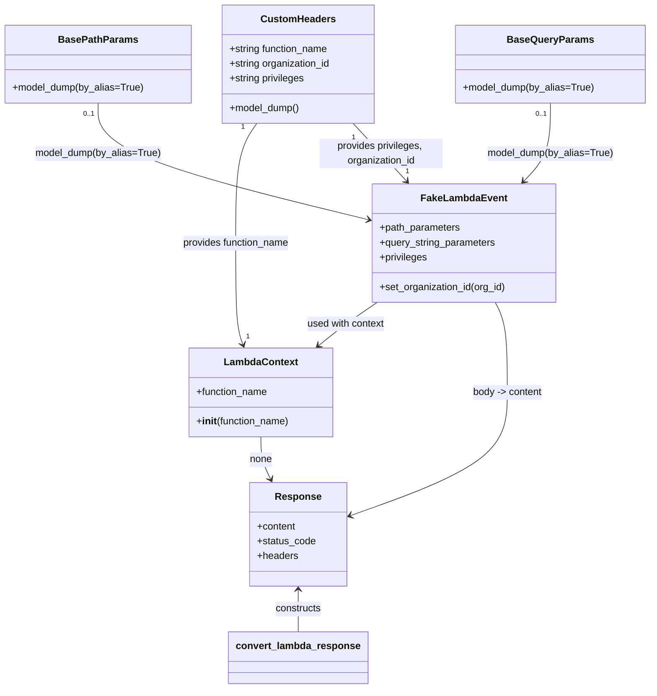
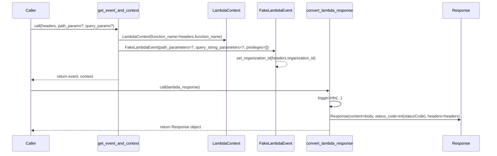

# Diagram: common/location_service/local/app/utils.py

> Auto-generated by Obscura crawlers

## Diagram 1

### SVG

<svg id="container" width="1049.392578125" xmlns="http://www.w3.org/2000/svg" class="classDiagram" height="1116" viewBox="0 0 1049.392578125 1116" role="graphics-document document" aria-roledescription="class"><g><defs><marker id="container_class-aggregationStart" class="marker aggregation class" refX="18" refY="7" markerWidth="190" markerHeight="240" orient="auto"><path d="M 18,7 L9,13 L1,7 L9,1 Z"></path></marker></defs><defs><marker id="container_class-aggregationEnd" class="marker aggregation class" refX="1" refY="7" markerWidth="20" markerHeight="28" orient="auto"><path d="M 18,7 L9,13 L1,7 L9,1 Z"></path></marker></defs><defs><marker id="container_class-extensionStart" class="marker extension class" refX="18" refY="7" markerWidth="190" markerHeight="240" orient="auto"><path d="M 1,7 L18,13 V 1 Z"></path></marker></defs><defs><marker id="container_class-extensionEnd" class="marker extension class" refX="1" refY="7" markerWidth="20" markerHeight="28" orient="auto"><path d="M 1,1 V 13 L18,7 Z"></path></marker></defs><defs><marker id="container_class-compositionStart" class="marker composition class" refX="18" refY="7" markerWidth="190" markerHeight="240" orient="auto"><path d="M 18,7 L9,13 L1,7 L9,1 Z"></path></marker></defs><defs><marker id="container_class-compositionEnd" class="marker composition class" refX="1" refY="7" markerWidth="20" markerHeight="28" orient="auto"><path d="M 18,7 L9,13 L1,7 L9,1 Z"></path></marker></defs><defs><marker id="container_class-dependencyStart" class="marker dependency class" refX="6" refY="7" markerWidth="190" markerHeight="240" orient="auto"><path d="M 5,7 L9,13 L1,7 L9,1 Z"></path></marker></defs><defs><marker id="container_class-dependencyEnd" class="marker dependency class" refX="13" refY="7" markerWidth="20" markerHeight="28" orient="auto"><path d="M 18,7 L9,13 L14,7 L9,1 Z"></path></marker></defs><defs><marker id="container_class-lollipopStart" class="marker lollipop class" refX="13" refY="7" markerWidth="190" markerHeight="240" orient="auto"><circle stroke="black" fill="transparent" cx="7" cy="7" r="6"></circle></marker></defs><defs><marker id="container_class-lollipopEnd" class="marker lollipop class" refX="1" refY="7" markerWidth="190" markerHeight="240" orient="auto"><circle stroke="black" fill="transparent" cx="7" cy="7" r="6"></circle></marker></defs><g class="root"><g class="clusters"></g><g class="edgePaths"><path d="M413.508,200L407.864,208.167C402.22,216.333,390.932,232.667,385.288,265C379.645,297.333,379.645,345.667,379.645,392C379.645,438.333,379.645,482.667,381.666,510.067C383.687,537.468,387.73,547.935,389.751,553.169L391.773,558.403" id="id_CustomHeaders_LambdaContext_1" class="edge-thickness-normal edge-pattern-solid relation" style=";;;" data-edge="true" data-et="edge" data-id="id_CustomHeaders_LambdaContext_1" data-points="W3sieCI6NDEzLjUwNzU5Njk4Mjc1ODYsInkiOjIwMH0seyJ4IjozNzkuNjQ0NTMxMjUsInkiOjI0OX0seyJ4IjozNzkuNjQ0NTMxMjUsInkiOjM5NH0seyJ4IjozNzkuNjQ0NTMxMjUsInkiOjUyN30seyJ4IjozOTMuOTM0NTYxMzUzMjExLCJ5Ijo1NjR9XQ==" marker-end="url(#container_class-dependencyEnd)"></path><path d="M569.796,200L577.447,208.167C585.099,216.333,600.402,232.667,615.021,248.27C629.641,263.874,643.576,278.748,650.544,286.185L657.512,293.622" id="id_CustomHeaders_FakeLambdaEvent_2" class="edge-thickness-normal edge-pattern-solid relation" style=";;;" data-edge="true" data-et="edge" data-id="id_CustomHeaders_FakeLambdaEvent_2" data-points="W3sieCI6NTY5Ljc5NTk1OTA1MTcyNDEsInkiOjIwMH0seyJ4Ijo2MTUuNzA1MDc4MTI1LCJ5IjoyNDl9LHsieCI6NjYxLjYxNDE5NzE5ODI3NTksInkiOjI5OH1d" marker-end="url(#container_class-dependencyEnd)"></path><path d="M156.891,167L156.891,180.667C156.891,194.333,156.891,221.667,230.28,253.228C303.669,284.789,450.447,320.579,523.836,338.474L597.225,356.368" id="id_BasePathParams_FakeLambdaEvent_3" class="edge-thickness-normal edge-pattern-solid relation" style=";;;" data-edge="true" data-et="edge" data-id="id_BasePathParams_FakeLambdaEvent_3" data-points="W3sieCI6MTU2Ljg5MDYyNSwieSI6MTY3fSx7IngiOjE1Ni44OTA2MjUsInkiOjI0OX0seyJ4Ijo2MDMuMDU0Njg3NSwieSI6MzU3Ljc4OTc2NTgyMjU3Njk1fV0=" marker-end="url(#container_class-dependencyEnd)"></path><path d="M889.807,167L889.807,180.667C889.807,194.333,889.807,221.667,882.71,242.776C875.614,263.886,861.421,278.772,854.325,286.215L847.229,293.657" id="id_BaseQueryParams_FakeLambdaEvent_4" class="edge-thickness-normal edge-pattern-solid relation" style=";;;" data-edge="true" data-et="edge" data-id="id_BaseQueryParams_FakeLambdaEvent_4" data-points="W3sieCI6ODg5LjgwNjY0MDYyNSwieSI6MTY3fSx7IngiOjg4OS44MDY2NDA2MjUsInkiOjI0OX0seyJ4Ijo4NDMuMDg4MzM1MTI5MzEwNCwieSI6Mjk4fV0=" marker-end="url(#container_class-dependencyEnd)"></path><path d="M611.555,490L602.562,496.167C593.569,502.333,575.582,514.667,559.683,526.374C543.784,538.082,529.972,549.163,523.066,554.704L516.16,560.245" id="id_FakeLambdaEvent_LambdaContext_5" class="edge-thickness-normal edge-pattern-solid relation" style=";;;" data-edge="true" data-et="edge" data-id="id_FakeLambdaEvent_LambdaContext_5" data-points="W3sieCI6NjExLjU1NTMwNDI3NjMxNTgsInkiOjQ5MH0seyJ4Ijo1NTcuNTk1NzAzMTI1LCJ5Ijo1Mjd9LHsieCI6NTExLjQ4MDI4OTU2NDIyMDIsInkiOjU2NH1d" marker-end="url(#container_class-dependencyEnd)"></path><path d="M801.415,490L804.618,496.167C807.82,502.333,814.226,514.667,817.428,539C820.631,563.333,820.631,599.667,820.631,636C820.631,672.333,820.631,708.667,777.65,742.095C734.669,775.523,648.706,806.045,605.725,821.306L562.744,836.568" id="id_FakeLambdaEvent_Response_6" class="edge-thickness-normal edge-pattern-solid relation" style=";;;" data-edge="true" data-et="edge" data-id="id_FakeLambdaEvent_Response_6" data-points="W3sieCI6ODAxLjQxNTI2NjY4MjMzMDksInkiOjQ5MH0seyJ4Ijo4MjAuNjMwODU5Mzc1LCJ5Ijo1Mjd9LHsieCI6ODIwLjYzMDg1OTM3NSwieSI6NjM2fSx7IngiOjgyMC42MzA4NTkzNzUsInkiOjc0NX0seyJ4Ijo1NTcuMDg5ODQzNzUsInkiOjgzOC41NzUxMTc5MjI1MDA3fV0=" marker-end="url(#container_class-dependencyEnd)"></path><path d="M421.742,708L421.742,714.167C421.742,720.333,421.742,732.667,424.271,744.099C426.799,755.53,431.857,766.061,434.385,771.326L436.914,776.591" id="id_LambdaContext_Response_7" class="edge-thickness-normal edge-pattern-solid relation" style=";;;" data-edge="true" data-et="edge" data-id="id_LambdaContext_Response_7" data-points="W3sieCI6NDIxLjc0MjE4NzUsInkiOjcwOH0seyJ4Ijo0MjEuNzQyMTg3NSwieSI6NzQ1fSx7IngiOjQzOS41MTExNjk5MzgwMTY1LCJ5Ijo3ODJ9XQ==" marker-end="url(#container_class-dependencyEnd)"></path><path d="M479.852,956L479.852,961.167C479.852,966.333,479.852,976.667,479.852,988C479.852,999.333,479.852,1011.667,479.852,1017.833L479.852,1024" id="id_Response_convert_lambda_response_8" class="edge-thickness-normal edge-pattern-solid relation" style=";;;" data-edge="true" data-et="edge" data-id="id_Response_convert_lambda_response_8" data-points="W3sieCI6NDc5Ljg1MTU2MjUsInkiOjk1MH0seyJ4Ijo0NzkuODUxNTYyNSwieSI6OTg3fSx7IngiOjQ3OS44NTE1NjI1LCJ5IjoxMDI0fV0=" marker-start="url(#container_class-dependencyStart)"></path></g><g class="edgeLabels"><g class="edgeLabel" transform="translate(379.64453125, 394)"><g class="label" data-id="id_CustomHeaders_LambdaContext_1" transform="translate(-88.203125, -12)"><foreignObject width="176.40625" height="24">

provides function_name

</foreignObject></g></g><g class="edgeLabel" transform="translate(615.705078125, 249)"><g class="label" data-id="id_CustomHeaders_FakeLambdaEvent_2" transform="translate(-100, -24)"><foreignObject width="200" height="48">

provides privileges, organization_id

</foreignObject></g></g><g class="edgeLabel" transform="translate(156.890625, 249)"><g class="label" data-id="id_BasePathParams_FakeLambdaEvent_3" transform="translate(-102.546875, -12)"><foreignObject width="205.09375" height="24">

model_dump(by_alias=True)

</foreignObject></g></g><g class="edgeLabel" transform="translate(889.806640625, 249)"><g class="label" data-id="id_BaseQueryParams_FakeLambdaEvent_4" transform="translate(-102.546875, -12)"><foreignObject width="205.09375" height="24">

model_dump(by_alias=True)

</foreignObject></g></g><g class="edgeLabel" transform="translate(560.19474, 525.21784)"><g class="label" data-id="id_FakeLambdaEvent_LambdaContext_5" transform="translate(-64.1953125, -12)"><foreignObject width="128.390625" height="24">

used with context

</foreignObject></g></g><g class="edgeLabel" transform="translate(820.630859375, 636)"><g class="label" data-id="id_FakeLambdaEvent_Response_6" transform="translate(-57.34375, -12)"><foreignObject width="114.6875" height="24">

body -&gt; content

</foreignObject></g></g><g class="edgeLabel" transform="translate(421.7421875, 745)"><g class="label" data-id="id_LambdaContext_Response_7" transform="translate(-18.4140625, -12)"><foreignObject width="36.828125" height="24">

none

</foreignObject></g></g><g class="edgeLabel" transform="translate(479.8515625, 987)"><g class="label" data-id="id_Response_convert_lambda_response_8" transform="translate(-37.84375, -12)"><foreignObject width="75.6875" height="24">

constructs

</foreignObject></g></g><g class="edgeTerminals" transform="translate(391.2183925569665, 205.86867877746522)"><g class="inner" transform="translate(0, 0)"><foreignObject style="width: 9px; height: 12px;">
1
</foreignObject></g></g><g class="edgeTerminals" transform="translate(570.8147681532531, 223.02633169242966)"><g class="inner" transform="translate(0, 0)"><foreignObject style="width: 9px; height: 12px;">
1
</foreignObject></g></g><g class="edgeTerminals" transform="translate(141.89062750000014, 184.50000214285714)"><g class="inner" transform="translate(0, 0)"><foreignObject style="width: 36px; height: 12px;">
0..1
</foreignObject></g></g><g class="edgeTerminals" transform="translate(874.8066403125, 184.49999973214287)"><g class="inner" transform="translate(0, 0)"><foreignObject style="width: 36px; height: 12px;">
0..1
</foreignObject></g></g><g class="edgeTerminals" transform="translate(396.62231679273344, 537.2710247032704)"><g class="inner" transform="translate(0, 0)"></g><foreignObject style="width: 9px; height: 12px;">
1
</foreignObject></g><g class="edgeTerminals" transform="translate(655.5953836352988, 269.9736668811447)"><g class="inner" transform="translate(0, 0)"></g><foreignObject style="width: 9px; height: 12px;">
1
</foreignObject></g></g><g class="nodes"><g class="node default" id="classId-CustomHeaders-0" transform="translate(479.8515625, 104)"><g class="basic label-container"><path d="M-124.0703125 -96 L124.0703125 -96 L124.0703125 96 L-124.0703125 96" stroke="none" stroke-width="0" fill="#ECECFF" style=""></path><path d="M-124.0703125 -96 C-51.53359278705072 -96, 21.003126925898556 -96, 124.0703125 -96 M-124.0703125 -96 C-33.71618292908384 -96, 56.637946641832315 -96, 124.0703125 -96 M124.0703125 -96 C124.0703125 -24.977610854762773, 124.0703125 46.044778290474454, 124.0703125 96 M124.0703125 -96 C124.0703125 -52.89480707187771, 124.0703125 -9.789614143755415, 124.0703125 96 M124.0703125 96 C61.81849602863399 96, -0.4333204427320254 96, -124.0703125 96 M124.0703125 96 C69.86121953583728 96, 15.652126571674557 96, -124.0703125 96 M-124.0703125 96 C-124.0703125 53.144948351661, -124.0703125 10.289896703322, -124.0703125 -96 M-124.0703125 96 C-124.0703125 22.97971302078841, -124.0703125 -50.04057395842318, -124.0703125 -96" stroke="#9370DB" stroke-width="1.3" fill="none" stroke-dasharray="0 0" style=""></path></g><g class="annotation-group text" transform="translate(0, -72)"></g><g class="label-group text" transform="translate(-57.53125, -72)"><g class="label" style="font-weight: bolder" transform="translate(0,-12)"><foreignObject width="115.0625" height="24">

CustomHeaders

</foreignObject></g></g><g class="members-group text" transform="translate(-112.0703125, -24)"><g class="label" style="" transform="translate(0,-12)"><foreignObject width="163.40625" height="24">

+string function_name

</foreignObject></g><g class="label" style="" transform="translate(0,12)"><foreignObject width="166.609375" height="24">

+string organization_id

</foreignObject></g><g class="label" style="" transform="translate(0,36)"><foreignObject width="124.03125" height="24">

+string privileges

</foreignObject></g></g><g class="methods-group text" transform="translate(-112.0703125, 72)"><g class="label" style="" transform="translate(0,-12)"><foreignObject width="114.484375" height="24">

+model_dump()

</foreignObject></g></g><g class="divider" style=""><path d="M-124.0703125 -48 C-47.567895686483624 -48, 28.934521127032752 -48, 124.0703125 -48 M-124.0703125 -48 C-46.577594855493246 -48, 30.91512278901351 -48, 124.0703125 -48" stroke="#9370DB" stroke-width="1.3" fill="none" stroke-dasharray="0 0" style=""></path></g><g class="divider" style=""><path d="M-124.0703125 48 C-72.61674230160602 48, -21.163172103212048 48, 124.0703125 48 M-124.0703125 48 C-65.80680828361814 48, -7.543304067236278 48, 124.0703125 48" stroke="#9370DB" stroke-width="1.3" fill="none" stroke-dasharray="0 0" style=""></path></g></g><g class="node default" id="classId-BasePathParams-1" transform="translate(156.890625, 104)"><g class="basic label-container"><path d="M-148.890625 -63 L148.890625 -63 L148.890625 63 L-148.890625 63" stroke="none" stroke-width="0" fill="#ECECFF" style=""></path><path d="M-148.890625 -63 C-35.71368593470977 -63, 77.46325313058045 -63, 148.890625 -63 M-148.890625 -63 C-55.9581261020426 -63, 36.9743727959148 -63, 148.890625 -63 M148.890625 -63 C148.890625 -34.72789519037255, 148.890625 -6.455790380745107, 148.890625 63 M148.890625 -63 C148.890625 -26.42634296904407, 148.890625 10.147314061911857, 148.890625 63 M148.890625 63 C37.36800645912382 63, -74.15461208175236 63, -148.890625 63 M148.890625 63 C49.09916685773304 63, -50.69229128453392 63, -148.890625 63 M-148.890625 63 C-148.890625 30.82046736315077, -148.890625 -1.3590652736984623, -148.890625 -63 M-148.890625 63 C-148.890625 15.60571832743517, -148.890625 -31.78856334512966, -148.890625 -63" stroke="#9370DB" stroke-width="1.3" fill="none" stroke-dasharray="0 0" style=""></path></g><g class="annotation-group text" transform="translate(0, -39)"></g><g class="label-group text" transform="translate(-60.703125, -39)"><g class="label" style="font-weight: bolder" transform="translate(0,-12)"><foreignObject width="121.40625" height="24">

BasePathParams

</foreignObject></g></g><g class="members-group text" transform="translate(-136.890625, 9)"></g><g class="methods-group text" transform="translate(-136.890625, 39)"><g class="label" style="" transform="translate(0,-12)"><foreignObject width="213.078125" height="24">

+model_dump(by_alias=True)

</foreignObject></g></g><g class="divider" style=""><path d="M-148.890625 -15 C-31.609801346699513 -15, 85.67102230660097 -15, 148.890625 -15 M-148.890625 -15 C-73.21338643470226 -15, 2.463852130595484 -15, 148.890625 -15" stroke="#9370DB" stroke-width="1.3" fill="none" stroke-dasharray="0 0" style=""></path></g><g class="divider" style=""><path d="M-148.890625 9 C-39.61263027980689 9, 69.66536444038621 9, 148.890625 9 M-148.890625 9 C-45.33986559441749 9, 58.21089381116502 9, 148.890625 9" stroke="#9370DB" stroke-width="1.3" fill="none" stroke-dasharray="0 0" style=""></path></g></g><g class="node default" id="classId-BaseQueryParams-2" transform="translate(889.806640625, 104)"><g class="basic label-container"><path d="M-151.5859375 -63 L151.5859375 -63 L151.5859375 63 L-151.5859375 63" stroke="none" stroke-width="0" fill="#ECECFF" style=""></path><path d="M-151.5859375 -63 C-42.60722393375423 -63, 66.37148963249155 -63, 151.5859375 -63 M-151.5859375 -63 C-56.15499921330289 -63, 39.27593907339423 -63, 151.5859375 -63 M151.5859375 -63 C151.5859375 -21.7773119693179, 151.5859375 19.4453760613642, 151.5859375 63 M151.5859375 -63 C151.5859375 -16.907226320600046, 151.5859375 29.18554735879991, 151.5859375 63 M151.5859375 63 C39.85638975976002 63, -71.87315798047996 63, -151.5859375 63 M151.5859375 63 C44.603025817979784 63, -62.37988586404043 63, -151.5859375 63 M-151.5859375 63 C-151.5859375 37.43357872245302, -151.5859375 11.867157444906049, -151.5859375 -63 M-151.5859375 63 C-151.5859375 25.073319108604423, -151.5859375 -12.853361782791154, -151.5859375 -63" stroke="#9370DB" stroke-width="1.3" fill="none" stroke-dasharray="0 0" style=""></path></g><g class="annotation-group text" transform="translate(0, -39)"></g><g class="label-group text" transform="translate(-66.09375, -39)"><g class="label" style="font-weight: bolder" transform="translate(0,-12)"><foreignObject width="132.1875" height="24">

BaseQueryParams

</foreignObject></g></g><g class="members-group text" transform="translate(-139.5859375, 9)"></g><g class="methods-group text" transform="translate(-139.5859375, 39)"><g class="label" style="" transform="translate(0,-12)"><foreignObject width="213.078125" height="24">

+model_dump(by_alias=True)

</foreignObject></g></g><g class="divider" style=""><path d="M-151.5859375 -15 C-47.202642217356996 -15, 57.18065306528601 -15, 151.5859375 -15 M-151.5859375 -15 C-46.04258127295614 -15, 59.50077495408772 -15, 151.5859375 -15" stroke="#9370DB" stroke-width="1.3" fill="none" stroke-dasharray="0 0" style=""></path></g><g class="divider" style=""><path d="M-151.5859375 9 C-31.18434754235797 9, 89.21724241528406 9, 151.5859375 9 M-151.5859375 9 C-57.32547353527259 9, 36.934990429454814 9, 151.5859375 9" stroke="#9370DB" stroke-width="1.3" fill="none" stroke-dasharray="0 0" style=""></path></g></g><g class="node default" id="classId-LambdaContext-3" transform="translate(421.7421875, 636)"><g class="basic label-container"><path d="M-116.8125 -72 L116.8125 -72 L116.8125 72 L-116.8125 72" stroke="none" stroke-width="0" fill="#ECECFF" style=""></path><path d="M-116.8125 -72 C-37.27182806255372 -72, 42.26884387489255 -72, 116.8125 -72 M-116.8125 -72 C-67.59623981259071 -72, -18.379979625181434 -72, 116.8125 -72 M116.8125 -72 C116.8125 -36.5468103766057, 116.8125 -1.0936207532113968, 116.8125 72 M116.8125 -72 C116.8125 -28.543008193656306, 116.8125 14.913983612687389, 116.8125 72 M116.8125 72 C32.7048179347093 72, -51.402864130581406 72, -116.8125 72 M116.8125 72 C26.924020410580127 72, -62.964459178839746 72, -116.8125 72 M-116.8125 72 C-116.8125 17.12982936824693, -116.8125 -37.74034126350614, -116.8125 -72 M-116.8125 72 C-116.8125 18.53583669812425, -116.8125 -34.9283266037515, -116.8125 -72" stroke="#9370DB" stroke-width="1.3" fill="none" stroke-dasharray="0 0" style=""></path></g><g class="annotation-group text" transform="translate(0, -48)"></g><g class="label-group text" transform="translate(-57.296875, -48)"><g class="label" style="font-weight: bolder" transform="translate(0,-12)"><foreignObject width="114.59375" height="24">

LambdaContext

</foreignObject></g></g><g class="members-group text" transform="translate(-104.8125, 0)"><g class="label" style="" transform="translate(0,-12)"><foreignObject width="117.28125" height="24">

+function_name

</foreignObject></g></g><g class="methods-group text" transform="translate(-104.8125, 48)"><g class="label" style="" transform="translate(0,-12)"><foreignObject width="152.328125" height="24">

+<strong>init</strong>(function_name)

</foreignObject></g></g><g class="divider" style=""><path d="M-116.8125 -24 C-29.32043851562166 -24, 58.17162296875668 -24, 116.8125 -24 M-116.8125 -24 C-43.04192020040877 -24, 30.728659599182464 -24, 116.8125 -24" stroke="#9370DB" stroke-width="1.3" fill="none" stroke-dasharray="0 0" style=""></path></g><g class="divider" style=""><path d="M-116.8125 24 C-35.62087123375797 24, 45.570757532484066 24, 116.8125 24 M-116.8125 24 C-25.35967024683511 24, 66.09315950632978 24, 116.8125 24" stroke="#9370DB" stroke-width="1.3" fill="none" stroke-dasharray="0 0" style=""></path></g></g><g class="node default" id="classId-FakeLambdaEvent-4" transform="translate(751.55859375, 394)"><g class="basic label-container"><path d="M-148.50390625 -96 L148.50390625 -96 L148.50390625 96 L-148.50390625 96" stroke="none" stroke-width="0" fill="#ECECFF" style=""></path><path d="M-148.50390625 -96 C-36.19236996989903 -96, 76.11916631020193 -96, 148.50390625 -96 M-148.50390625 -96 C-86.97902634610595 -96, -25.454146442211908 -96, 148.50390625 -96 M148.50390625 -96 C148.50390625 -42.89421105881671, 148.50390625 10.211577882366583, 148.50390625 96 M148.50390625 -96 C148.50390625 -38.5511035671896, 148.50390625 18.8977928656208, 148.50390625 96 M148.50390625 96 C30.50659028117309 96, -87.49072568765382 96, -148.50390625 96 M148.50390625 96 C65.66272109476142 96, -17.178464060477154 96, -148.50390625 96 M-148.50390625 96 C-148.50390625 41.63922924182006, -148.50390625 -12.721541516359878, -148.50390625 -96 M-148.50390625 96 C-148.50390625 24.10542378024192, -148.50390625 -47.78915243951616, -148.50390625 -96" stroke="#9370DB" stroke-width="1.3" fill="none" stroke-dasharray="0 0" style=""></path></g><g class="annotation-group text" transform="translate(0, -72)"></g><g class="label-group text" transform="translate(-65.8671875, -72)"><g class="label" style="font-weight: bolder" transform="translate(0,-12)"><foreignObject width="131.734375" height="24">

FakeLambdaEvent

</foreignObject></g></g><g class="members-group text" transform="translate(-136.50390625, -24)"><g class="label" style="" transform="translate(0,-12)"><foreignObject width="131.96875" height="24">

+path_parameters

</foreignObject></g><g class="label" style="" transform="translate(0,12)"><foreignObject width="189.953125" height="24">

+query_string_parameters

</foreignObject></g><g class="label" style="" transform="translate(0,36)"><foreignObject width="78.15625" height="24">

+privileges

</foreignObject></g></g><g class="methods-group text" transform="translate(-136.50390625, 72)"><g class="label" style="" transform="translate(0,-12)"><foreignObject width="207.140625" height="24">

+set_organization_id(org_id)

</foreignObject></g></g><g class="divider" style=""><path d="M-148.50390625 -48 C-65.83460464552321 -48, 16.83469695895357 -48, 148.50390625 -48 M-148.50390625 -48 C-33.38204650886405 -48, 81.7398132322719 -48, 148.50390625 -48" stroke="#9370DB" stroke-width="1.3" fill="none" stroke-dasharray="0 0" style=""></path></g><g class="divider" style=""><path d="M-148.50390625 48 C-36.515400401747456 48, 75.47310544650509 48, 148.50390625 48 M-148.50390625 48 C-40.08234869944174 48, 68.33920885111652 48, 148.50390625 48" stroke="#9370DB" stroke-width="1.3" fill="none" stroke-dasharray="0 0" style=""></path></g></g><g class="node default" id="classId-Response-5" transform="translate(479.8515625, 866)"><g class="basic label-container"><path d="M-77.23828125 -84 L77.23828125 -84 L77.23828125 84 L-77.23828125 84" stroke="none" stroke-width="0" fill="#ECECFF" style=""></path><path d="M-77.23828125 -84 C-20.723134952035068 -84, 35.792011345929865 -84, 77.23828125 -84 M-77.23828125 -84 C-31.396601679571837 -84, 14.445077890856325 -84, 77.23828125 -84 M77.23828125 -84 C77.23828125 -37.16554274605465, 77.23828125 9.668914507890705, 77.23828125 84 M77.23828125 -84 C77.23828125 -29.327389830624362, 77.23828125 25.345220338751275, 77.23828125 84 M77.23828125 84 C18.816322177330377 84, -39.605636895339245 84, -77.23828125 84 M77.23828125 84 C37.83062539466513 84, -1.5770304606697465 84, -77.23828125 84 M-77.23828125 84 C-77.23828125 38.57103976103458, -77.23828125 -6.857920477930847, -77.23828125 -84 M-77.23828125 84 C-77.23828125 26.384965929915076, -77.23828125 -31.23006814016985, -77.23828125 -84" stroke="#9370DB" stroke-width="1.3" fill="none" stroke-dasharray="0 0" style=""></path></g><g class="annotation-group text" transform="translate(0, -60)"></g><g class="label-group text" transform="translate(-35.4453125, -60)"><g class="label" style="font-weight: bolder" transform="translate(0,-12)"><foreignObject width="70.890625" height="24">

Response

</foreignObject></g></g><g class="members-group text" transform="translate(-65.23828125, -12)"><g class="label" style="" transform="translate(0,-12)"><foreignObject width="63.453125" height="24">

+content

</foreignObject></g><g class="label" style="" transform="translate(0,12)"><foreignObject width="95.03125" height="24">

+status_code

</foreignObject></g><g class="label" style="" transform="translate(0,36)"><foreignObject width="66.328125" height="24">

+headers

</foreignObject></g></g><g class="methods-group text" transform="translate(-65.23828125, 84)"></g><g class="divider" style=""><path d="M-77.23828125 -36 C-41.37143931390481 -36, -5.504597377809617 -36, 77.23828125 -36 M-77.23828125 -36 C-17.743682139399006 -36, 41.75091697120199 -36, 77.23828125 -36" stroke="#9370DB" stroke-width="1.3" fill="none" stroke-dasharray="0 0" style=""></path></g><g class="divider" style=""><path d="M-77.23828125 60 C-31.240707636569418 60, 14.756865976861164 60, 77.23828125 60 M-77.23828125 60 C-18.482574687196546 60, 40.27313187560691 60, 77.23828125 60" stroke="#9370DB" stroke-width="1.3" fill="none" stroke-dasharray="0 0" style=""></path></g></g><g class="node default" id="classId-convert_lambda_response-6" transform="translate(479.8515625, 1066)"><g class="basic label-container"><path d="M-108.9375 -42 L108.9375 -42 L108.9375 42 L-108.9375 42" stroke="none" stroke-width="0" fill="#ECECFF" style=""></path><path d="M-108.9375 -42 C-58.443647855830946 -42, -7.949795711661892 -42, 108.9375 -42 M-108.9375 -42 C-47.9173194413097 -42, 13.102861117380598 -42, 108.9375 -42 M108.9375 -42 C108.9375 -22.898682772187463, 108.9375 -3.7973655443749266, 108.9375 42 M108.9375 -42 C108.9375 -18.887765606243974, 108.9375 4.224468787512052, 108.9375 42 M108.9375 42 C40.049703366603694 42, -28.83809326679261 42, -108.9375 42 M108.9375 42 C29.622358776660036 42, -49.69278244667993 42, -108.9375 42 M-108.9375 42 C-108.9375 9.774844637968478, -108.9375 -22.450310724063044, -108.9375 -42 M-108.9375 42 C-108.9375 9.346086114010468, -108.9375 -23.307827771979063, -108.9375 -42" stroke="#9370DB" stroke-width="1.3" fill="none" stroke-dasharray="0 0" style=""></path></g><g class="annotation-group text" transform="translate(0, -18)"></g><g class="label-group text" transform="translate(-96.9375, -18)"><g class="label" style="font-weight: bolder" transform="translate(0,-12)"><foreignObject width="193.875" height="24">

convert_lambda_response

</foreignObject></g></g><g class="members-group text" transform="translate(-96.9375, 30)"></g><g class="methods-group text" transform="translate(-96.9375, 60)"></g><g class="divider" style=""><path d="M-108.9375 6 C-49.58847348575225 6, 9.760553028495494 6, 108.9375 6 M-108.9375 6 C-63.77517773274604 6, -18.612855465492075 6, 108.9375 6" stroke="#9370DB" stroke-width="1.3" fill="none" stroke-dasharray="0 0" style=""></path></g><g class="divider" style=""><path d="M-108.9375 24 C-65.15846694981879 24, -21.379433899637576 24, 108.9375 24 M-108.9375 24 C-60.96399503840265 24, -12.990490076805301 24, 108.9375 24" stroke="#9370DB" stroke-width="1.3" fill="none" stroke-dasharray="0 0" style=""></path></g></g></g></g></g></svg>

## Diagram 2

### SVG

<svg id="container" width="2151" xmlns="http://www.w3.org/2000/svg" height="663" viewBox="-50 -10 2151 663" role="graphics-document document" aria-roledescription="sequence"><g><rect x="1901" y="577" fill="#eaeaea" stroke="#666" width="150" height="65" name="Response" rx="3" ry="3" class="actor actor-bottom"></rect><text x="1976" y="609.5" dominant-baseline="central" alignment-baseline="central" class="actor actor-box" style="text-anchor: middle; font-size: 16px; font-weight: 400;"><tspan x="1976" dy="0">Response</tspan></text></g><g><rect x="1274" y="577" fill="#eaeaea" stroke="#666" width="212" height="65" name="convert_lambda_response" rx="3" ry="3" class="actor actor-bottom"></rect><text x="1380" y="609.5" dominant-baseline="central" alignment-baseline="central" class="actor actor-box" style="text-anchor: middle; font-size: 16px; font-weight: 400;"><tspan x="1380" dy="0">convert_lambda_response</tspan></text></g><g><rect x="1073" y="577" fill="#eaeaea" stroke="#666" width="151" height="65" name="FakeLambdaEvent" rx="3" ry="3" class="actor actor-bottom"></rect><text x="1148.5" y="609.5" dominant-baseline="central" alignment-baseline="central" class="actor actor-box" style="text-anchor: middle; font-size: 16px; font-weight: 400;"><tspan x="1148.5" dy="0">FakeLambdaEvent</tspan></text></g><g><rect x="873" y="577" fill="#eaeaea" stroke="#666" width="150" height="65" name="LambdaContext" rx="3" ry="3" class="actor actor-bottom"></rect><text x="948" y="609.5" dominant-baseline="central" alignment-baseline="central" class="actor actor-box" style="text-anchor: middle; font-size: 16px; font-weight: 400;"><tspan x="948" dy="0">LambdaContext</tspan></text></g><g><rect x="372" y="577" fill="#eaeaea" stroke="#666" width="188" height="65" name="get_event_and_context" rx="3" ry="3" class="actor actor-bottom"></rect><text x="466" y="609.5" dominant-baseline="central" alignment-baseline="central" class="actor actor-box" style="text-anchor: middle; font-size: 16px; font-weight: 400;"><tspan x="466" dy="0">get_event_and_context</tspan></text></g><g><rect x="0" y="577" fill="#eaeaea" stroke="#666" width="150" height="65" name="Caller" rx="3" ry="3" class="actor actor-bottom"></rect><text x="75" y="609.5" dominant-baseline="central" alignment-baseline="central" class="actor actor-box" style="text-anchor: middle; font-size: 16px; font-weight: 400;"><tspan x="75" dy="0">Caller</tspan></text></g><g><line id="actor5" x1="1976" y1="65" x2="1976" y2="577" class="actor-line 200" stroke-width="0.5px" stroke="#999" name="Response"></line><g id="root-5"><rect x="1901" y="0" fill="#eaeaea" stroke="#666" width="150" height="65" name="Response" rx="3" ry="3" class="actor actor-top"></rect><text x="1976" y="32.5" dominant-baseline="central" alignment-baseline="central" class="actor actor-box" style="text-anchor: middle; font-size: 16px; font-weight: 400;"><tspan x="1976" dy="0">Response</tspan></text></g></g><g><line id="actor4" x1="1380" y1="65" x2="1380" y2="577" class="actor-line 200" stroke-width="0.5px" stroke="#999" name="convert_lambda_response"></line><g id="root-4"><rect x="1274" y="0" fill="#eaeaea" stroke="#666" width="212" height="65" name="convert_lambda_response" rx="3" ry="3" class="actor actor-top"></rect><text x="1380" y="32.5" dominant-baseline="central" alignment-baseline="central" class="actor actor-box" style="text-anchor: middle; font-size: 16px; font-weight: 400;"><tspan x="1380" dy="0">convert_lambda_response</tspan></text></g></g><g><line id="actor3" x1="1148.5" y1="65" x2="1148.5" y2="577" class="actor-line 200" stroke-width="0.5px" stroke="#999" name="FakeLambdaEvent"></line><g id="root-3"><rect x="1073" y="0" fill="#eaeaea" stroke="#666" width="151" height="65" name="FakeLambdaEvent" rx="3" ry="3" class="actor actor-top"></rect><text x="1148.5" y="32.5" dominant-baseline="central" alignment-baseline="central" class="actor actor-box" style="text-anchor: middle; font-size: 16px; font-weight: 400;"><tspan x="1148.5" dy="0">FakeLambdaEvent</tspan></text></g></g><g><line id="actor2" x1="948" y1="65" x2="948" y2="577" class="actor-line 200" stroke-width="0.5px" stroke="#999" name="LambdaContext"></line><g id="root-2"><rect x="873" y="0" fill="#eaeaea" stroke="#666" width="150" height="65" name="LambdaContext" rx="3" ry="3" class="actor actor-top"></rect><text x="948" y="32.5" dominant-baseline="central" alignment-baseline="central" class="actor actor-box" style="text-anchor: middle; font-size: 16px; font-weight: 400;"><tspan x="948" dy="0">LambdaContext</tspan></text></g></g><g><line id="actor1" x1="466" y1="65" x2="466" y2="577" class="actor-line 200" stroke-width="0.5px" stroke="#999" name="get_event_and_context"></line><g id="root-1"><rect x="372" y="0" fill="#eaeaea" stroke="#666" width="188" height="65" name="get_event_and_context" rx="3" ry="3" class="actor actor-top"></rect><text x="466" y="32.5" dominant-baseline="central" alignment-baseline="central" class="actor actor-box" style="text-anchor: middle; font-size: 16px; font-weight: 400;"><tspan x="466" dy="0">get_event_and_context</tspan></text></g></g><g><line id="actor0" x1="75" y1="65" x2="75" y2="577" class="actor-line 200" stroke-width="0.5px" stroke="#999" name="Caller"></line><g id="root-0"><rect x="0" y="0" fill="#eaeaea" stroke="#666" width="150" height="65" name="Caller" rx="3" ry="3" class="actor actor-top"></rect><text x="75" y="32.5" dominant-baseline="central" alignment-baseline="central" class="actor actor-box" style="text-anchor: middle; font-size: 16px; font-weight: 400;"><tspan x="75" dy="0">Caller</tspan></text></g></g><g></g><defs><symbol id="computer" width="24" height="24"><path transform="scale(.5)" d="M2 2v13h20v-13h-20zm18 11h-16v-9h16v9zm-10.228 6l.466-1h3.524l.467 1h-4.457zm14.228 3h-24l2-6h2.104l-1.33 4h18.45l-1.297-4h2.073l2 6zm-5-10h-14v-7h14v7z"></path></symbol></defs><defs><symbol id="database" fill-rule="evenodd" clip-rule="evenodd"><path transform="scale(.5)" d="M12.258.001l.256.004.255.005.253.008.251.01.249.012.247.015.246.016.242.019.241.02.239.023.236.024.233.027.231.028.229.031.225.032.223.034.22.036.217.038.214.04.211.041.208.043.205.045.201.046.198.048.194.05.191.051.187.053.183.054.18.056.175.057.172.059.168.06.163.061.16.063.155.064.15.066.074.033.073.033.071.034.07.034.069.035.068.035.067.035.066.035.064.036.064.036.062.036.06.036.06.037.058.037.058.037.055.038.055.038.053.038.052.038.051.039.05.039.048.039.047.039.045.04.044.04.043.04.041.04.04.041.039.041.037.041.036.041.034.041.033.042.032.042.03.042.029.042.027.042.026.043.024.043.023.043.021.043.02.043.018.044.017.043.015.044.013.044.012.044.011.045.009.044.007.045.006.045.004.045.002.045.001.045v17l-.001.045-.002.045-.004.045-.006.045-.007.045-.009.044-.011.045-.012.044-.013.044-.015.044-.017.043-.018.044-.02.043-.021.043-.023.043-.024.043-.026.043-.027.042-.029.042-.03.042-.032.042-.033.042-.034.041-.036.041-.037.041-.039.041-.04.041-.041.04-.043.04-.044.04-.045.04-.047.039-.048.039-.05.039-.051.039-.052.038-.053.038-.055.038-.055.038-.058.037-.058.037-.06.037-.06.036-.062.036-.064.036-.064.036-.066.035-.067.035-.068.035-.069.035-.07.034-.071.034-.073.033-.074.033-.15.066-.155.064-.16.063-.163.061-.168.06-.172.059-.175.057-.18.056-.183.054-.187.053-.191.051-.194.05-.198.048-.201.046-.205.045-.208.043-.211.041-.214.04-.217.038-.22.036-.223.034-.225.032-.229.031-.231.028-.233.027-.236.024-.239.023-.241.02-.242.019-.246.016-.247.015-.249.012-.251.01-.253.008-.255.005-.256.004-.258.001-.258-.001-.256-.004-.255-.005-.253-.008-.251-.01-.249-.012-.247-.015-.245-.016-.243-.019-.241-.02-.238-.023-.236-.024-.234-.027-.231-.028-.228-.031-.226-.032-.223-.034-.22-.036-.217-.038-.214-.04-.211-.041-.208-.043-.204-.045-.201-.046-.198-.048-.195-.05-.19-.051-.187-.053-.184-.054-.179-.056-.176-.057-.172-.059-.167-.06-.164-.061-.159-.063-.155-.064-.151-.066-.074-.033-.072-.033-.072-.034-.07-.034-.069-.035-.068-.035-.067-.035-.066-.035-.064-.036-.063-.036-.062-.036-.061-.036-.06-.037-.058-.037-.057-.037-.056-.038-.055-.038-.053-.038-.052-.038-.051-.039-.049-.039-.049-.039-.046-.039-.046-.04-.044-.04-.043-.04-.041-.04-.04-.041-.039-.041-.037-.041-.036-.041-.034-.041-.033-.042-.032-.042-.03-.042-.029-.042-.027-.042-.026-.043-.024-.043-.023-.043-.021-.043-.02-.043-.018-.044-.017-.043-.015-.044-.013-.044-.012-.044-.011-.045-.009-.044-.007-.045-.006-.045-.004-.045-.002-.045-.001-.045v-17l.001-.045.002-.045.004-.045.006-.045.007-.045.009-.044.011-.045.012-.044.013-.044.015-.044.017-.043.018-.044.02-.043.021-.043.023-.043.024-.043.026-.043.027-.042.029-.042.03-.042.032-.042.033-.042.034-.041.036-.041.037-.041.039-.041.04-.041.041-.04.043-.04.044-.04.046-.04.046-.039.049-.039.049-.039.051-.039.052-.038.053-.038.055-.038.056-.038.057-.037.058-.037.06-.037.061-.036.062-.036.063-.036.064-.036.066-.035.067-.035.068-.035.069-.035.07-.034.072-.034.072-.033.074-.033.151-.066.155-.064.159-.063.164-.061.167-.06.172-.059.176-.057.179-.056.184-.054.187-.053.19-.051.195-.05.198-.048.201-.046.204-.045.208-.043.211-.041.214-.04.217-.038.22-.036.223-.034.226-.032.228-.031.231-.028.234-.027.236-.024.238-.023.241-.02.243-.019.245-.016.247-.015.249-.012.251-.01.253-.008.255-.005.256-.004.258-.001.258.001zm-9.258 20.499v.01l.001.021.003.021.004.022.005.021.006.022.007.022.009.023.01.022.011.023.012.023.013.023.015.023.016.024.017.023.018.024.019.024.021.024.022.025.023.024.024.025.052.049.056.05.061.051.066.051.07.051.075.051.079.052.084.052.088.052.092.052.097.052.102.051.105.052.11.052.114.051.119.051.123.051.127.05.131.05.135.05.139.048.144.049.147.047.152.047.155.047.16.045.163.045.167.043.171.043.176.041.178.041.183.039.187.039.19.037.194.035.197.035.202.033.204.031.209.03.212.029.216.027.219.025.222.024.226.021.23.02.233.018.236.016.24.015.243.012.246.01.249.008.253.005.256.004.259.001.26-.001.257-.004.254-.005.25-.008.247-.011.244-.012.241-.014.237-.016.233-.018.231-.021.226-.021.224-.024.22-.026.216-.027.212-.028.21-.031.205-.031.202-.034.198-.034.194-.036.191-.037.187-.039.183-.04.179-.04.175-.042.172-.043.168-.044.163-.045.16-.046.155-.046.152-.047.148-.048.143-.049.139-.049.136-.05.131-.05.126-.05.123-.051.118-.052.114-.051.11-.052.106-.052.101-.052.096-.052.092-.052.088-.053.083-.051.079-.052.074-.052.07-.051.065-.051.06-.051.056-.05.051-.05.023-.024.023-.025.021-.024.02-.024.019-.024.018-.024.017-.024.015-.023.014-.024.013-.023.012-.023.01-.023.01-.022.008-.022.006-.022.006-.022.004-.022.004-.021.001-.021.001-.021v-4.127l-.077.055-.08.053-.083.054-.085.053-.087.052-.09.052-.093.051-.095.05-.097.05-.1.049-.102.049-.105.048-.106.047-.109.047-.111.046-.114.045-.115.045-.118.044-.12.043-.122.042-.124.042-.126.041-.128.04-.13.04-.132.038-.134.038-.135.037-.138.037-.139.035-.142.035-.143.034-.144.033-.147.032-.148.031-.15.03-.151.03-.153.029-.154.027-.156.027-.158.026-.159.025-.161.024-.162.023-.163.022-.165.021-.166.02-.167.019-.169.018-.169.017-.171.016-.173.015-.173.014-.175.013-.175.012-.177.011-.178.01-.179.008-.179.008-.181.006-.182.005-.182.004-.184.003-.184.002h-.37l-.184-.002-.184-.003-.182-.004-.182-.005-.181-.006-.179-.008-.179-.008-.178-.01-.176-.011-.176-.012-.175-.013-.173-.014-.172-.015-.171-.016-.17-.017-.169-.018-.167-.019-.166-.02-.165-.021-.163-.022-.162-.023-.161-.024-.159-.025-.157-.026-.156-.027-.155-.027-.153-.029-.151-.03-.15-.03-.148-.031-.146-.032-.145-.033-.143-.034-.141-.035-.14-.035-.137-.037-.136-.037-.134-.038-.132-.038-.13-.04-.128-.04-.126-.041-.124-.042-.122-.042-.12-.044-.117-.043-.116-.045-.113-.045-.112-.046-.109-.047-.106-.047-.105-.048-.102-.049-.1-.049-.097-.05-.095-.05-.093-.052-.09-.051-.087-.052-.085-.053-.083-.054-.08-.054-.077-.054v4.127zm0-5.654v.011l.001.021.003.021.004.021.005.022.006.022.007.022.009.022.01.022.011.023.012.023.013.023.015.024.016.023.017.024.018.024.019.024.021.024.022.024.023.025.024.024.052.05.056.05.061.05.066.051.07.051.075.052.079.051.084.052.088.052.092.052.097.052.102.052.105.052.11.051.114.051.119.052.123.05.127.051.131.05.135.049.139.049.144.048.147.048.152.047.155.046.16.045.163.045.167.044.171.042.176.042.178.04.183.04.187.038.19.037.194.036.197.034.202.033.204.032.209.03.212.028.216.027.219.025.222.024.226.022.23.02.233.018.236.016.24.014.243.012.246.01.249.008.253.006.256.003.259.001.26-.001.257-.003.254-.006.25-.008.247-.01.244-.012.241-.015.237-.016.233-.018.231-.02.226-.022.224-.024.22-.025.216-.027.212-.029.21-.03.205-.032.202-.033.198-.035.194-.036.191-.037.187-.039.183-.039.179-.041.175-.042.172-.043.168-.044.163-.045.16-.045.155-.047.152-.047.148-.048.143-.048.139-.05.136-.049.131-.05.126-.051.123-.051.118-.051.114-.052.11-.052.106-.052.101-.052.096-.052.092-.052.088-.052.083-.052.079-.052.074-.051.07-.052.065-.051.06-.05.056-.051.051-.049.023-.025.023-.024.021-.025.02-.024.019-.024.018-.024.017-.024.015-.023.014-.023.013-.024.012-.022.01-.023.01-.023.008-.022.006-.022.006-.022.004-.021.004-.022.001-.021.001-.021v-4.139l-.077.054-.08.054-.083.054-.085.052-.087.053-.09.051-.093.051-.095.051-.097.05-.1.049-.102.049-.105.048-.106.047-.109.047-.111.046-.114.045-.115.044-.118.044-.12.044-.122.042-.124.042-.126.041-.128.04-.13.039-.132.039-.134.038-.135.037-.138.036-.139.036-.142.035-.143.033-.144.033-.147.033-.148.031-.15.03-.151.03-.153.028-.154.028-.156.027-.158.026-.159.025-.161.024-.162.023-.163.022-.165.021-.166.02-.167.019-.169.018-.169.017-.171.016-.173.015-.173.014-.175.013-.175.012-.177.011-.178.009-.179.009-.179.007-.181.007-.182.005-.182.004-.184.003-.184.002h-.37l-.184-.002-.184-.003-.182-.004-.182-.005-.181-.007-.179-.007-.179-.009-.178-.009-.176-.011-.176-.012-.175-.013-.173-.014-.172-.015-.171-.016-.17-.017-.169-.018-.167-.019-.166-.02-.165-.021-.163-.022-.162-.023-.161-.024-.159-.025-.157-.026-.156-.027-.155-.028-.153-.028-.151-.03-.15-.03-.148-.031-.146-.033-.145-.033-.143-.033-.141-.035-.14-.036-.137-.036-.136-.037-.134-.038-.132-.039-.13-.039-.128-.04-.126-.041-.124-.042-.122-.043-.12-.043-.117-.044-.116-.044-.113-.046-.112-.046-.109-.046-.106-.047-.105-.048-.102-.049-.1-.049-.097-.05-.095-.051-.093-.051-.09-.051-.087-.053-.085-.052-.083-.054-.08-.054-.077-.054v4.139zm0-5.666v.011l.001.02.003.022.004.021.005.022.006.021.007.022.009.023.01.022.011.023.012.023.013.023.015.023.016.024.017.024.018.023.019.024.021.025.022.024.023.024.024.025.052.05.056.05.061.05.066.051.07.051.075.052.079.051.084.052.088.052.092.052.097.052.102.052.105.051.11.052.114.051.119.051.123.051.127.05.131.05.135.05.139.049.144.048.147.048.152.047.155.046.16.045.163.045.167.043.171.043.176.042.178.04.183.04.187.038.19.037.194.036.197.034.202.033.204.032.209.03.212.028.216.027.219.025.222.024.226.021.23.02.233.018.236.017.24.014.243.012.246.01.249.008.253.006.256.003.259.001.26-.001.257-.003.254-.006.25-.008.247-.01.244-.013.241-.014.237-.016.233-.018.231-.02.226-.022.224-.024.22-.025.216-.027.212-.029.21-.03.205-.032.202-.033.198-.035.194-.036.191-.037.187-.039.183-.039.179-.041.175-.042.172-.043.168-.044.163-.045.16-.045.155-.047.152-.047.148-.048.143-.049.139-.049.136-.049.131-.051.126-.05.123-.051.118-.052.114-.051.11-.052.106-.052.101-.052.096-.052.092-.052.088-.052.083-.052.079-.052.074-.052.07-.051.065-.051.06-.051.056-.05.051-.049.023-.025.023-.025.021-.024.02-.024.019-.024.018-.024.017-.024.015-.023.014-.024.013-.023.012-.023.01-.022.01-.023.008-.022.006-.022.006-.022.004-.022.004-.021.001-.021.001-.021v-4.153l-.077.054-.08.054-.083.053-.085.053-.087.053-.09.051-.093.051-.095.051-.097.05-.1.049-.102.048-.105.048-.106.048-.109.046-.111.046-.114.046-.115.044-.118.044-.12.043-.122.043-.124.042-.126.041-.128.04-.13.039-.132.039-.134.038-.135.037-.138.036-.139.036-.142.034-.143.034-.144.033-.147.032-.148.032-.15.03-.151.03-.153.028-.154.028-.156.027-.158.026-.159.024-.161.024-.162.023-.163.023-.165.021-.166.02-.167.019-.169.018-.169.017-.171.016-.173.015-.173.014-.175.013-.175.012-.177.01-.178.01-.179.009-.179.007-.181.006-.182.006-.182.004-.184.003-.184.001-.185.001-.185-.001-.184-.001-.184-.003-.182-.004-.182-.006-.181-.006-.179-.007-.179-.009-.178-.01-.176-.01-.176-.012-.175-.013-.173-.014-.172-.015-.171-.016-.17-.017-.169-.018-.167-.019-.166-.02-.165-.021-.163-.023-.162-.023-.161-.024-.159-.024-.157-.026-.156-.027-.155-.028-.153-.028-.151-.03-.15-.03-.148-.032-.146-.032-.145-.033-.143-.034-.141-.034-.14-.036-.137-.036-.136-.037-.134-.038-.132-.039-.13-.039-.128-.041-.126-.041-.124-.041-.122-.043-.12-.043-.117-.044-.116-.044-.113-.046-.112-.046-.109-.046-.106-.048-.105-.048-.102-.048-.1-.05-.097-.049-.095-.051-.093-.051-.09-.052-.087-.052-.085-.053-.083-.053-.08-.054-.077-.054v4.153zm8.74-8.179l-.257.004-.254.005-.25.008-.247.011-.244.012-.241.014-.237.016-.233.018-.231.021-.226.022-.224.023-.22.026-.216.027-.212.028-.21.031-.205.032-.202.033-.198.034-.194.036-.191.038-.187.038-.183.04-.179.041-.175.042-.172.043-.168.043-.163.045-.16.046-.155.046-.152.048-.148.048-.143.048-.139.049-.136.05-.131.05-.126.051-.123.051-.118.051-.114.052-.11.052-.106.052-.101.052-.096.052-.092.052-.088.052-.083.052-.079.052-.074.051-.07.052-.065.051-.06.05-.056.05-.051.05-.023.025-.023.024-.021.024-.02.025-.019.024-.018.024-.017.023-.015.024-.014.023-.013.023-.012.023-.01.023-.01.022-.008.022-.006.023-.006.021-.004.022-.004.021-.001.021-.001.021.001.021.001.021.004.021.004.022.006.021.006.023.008.022.01.022.01.023.012.023.013.023.014.023.015.024.017.023.018.024.019.024.02.025.021.024.023.024.023.025.051.05.056.05.06.05.065.051.07.052.074.051.079.052.083.052.088.052.092.052.096.052.101.052.106.052.11.052.114.052.118.051.123.051.126.051.131.05.136.05.139.049.143.048.148.048.152.048.155.046.16.046.163.045.168.043.172.043.175.042.179.041.183.04.187.038.191.038.194.036.198.034.202.033.205.032.21.031.212.028.216.027.22.026.224.023.226.022.231.021.233.018.237.016.241.014.244.012.247.011.25.008.254.005.257.004.26.001.26-.001.257-.004.254-.005.25-.008.247-.011.244-.012.241-.014.237-.016.233-.018.231-.021.226-.022.224-.023.22-.026.216-.027.212-.028.21-.031.205-.032.202-.033.198-.034.194-.036.191-.038.187-.038.183-.04.179-.041.175-.042.172-.043.168-.043.163-.045.16-.046.155-.046.152-.048.148-.048.143-.048.139-.049.136-.05.131-.05.126-.051.123-.051.118-.051.114-.052.11-.052.106-.052.101-.052.096-.052.092-.052.088-.052.083-.052.079-.052.074-.051.07-.052.065-.051.06-.05.056-.05.051-.05.023-.025.023-.024.021-.024.02-.025.019-.024.018-.024.017-.023.015-.024.014-.023.013-.023.012-.023.01-.023.01-.022.008-.022.006-.023.006-.021.004-.022.004-.021.001-.021.001-.021-.001-.021-.001-.021-.004-.021-.004-.022-.006-.021-.006-.023-.008-.022-.01-.022-.01-.023-.012-.023-.013-.023-.014-.023-.015-.024-.017-.023-.018-.024-.019-.024-.02-.025-.021-.024-.023-.024-.023-.025-.051-.05-.056-.05-.06-.05-.065-.051-.07-.052-.074-.051-.079-.052-.083-.052-.088-.052-.092-.052-.096-.052-.101-.052-.106-.052-.11-.052-.114-.052-.118-.051-.123-.051-.126-.051-.131-.05-.136-.05-.139-.049-.143-.048-.148-.048-.152-.048-.155-.046-.16-.046-.163-.045-.168-.043-.172-.043-.175-.042-.179-.041-.183-.04-.187-.038-.191-.038-.194-.036-.198-.034-.202-.033-.205-.032-.21-.031-.212-.028-.216-.027-.22-.026-.224-.023-.226-.022-.231-.021-.233-.018-.237-.016-.241-.014-.244-.012-.247-.011-.25-.008-.254-.005-.257-.004-.26-.001-.26.001z"></path></symbol></defs><defs><symbol id="clock" width="24" height="24"><path transform="scale(.5)" d="M12 2c5.514 0 10 4.486 10 10s-4.486 10-10 10-10-4.486-10-10 4.486-10 10-10zm0-2c-6.627 0-12 5.373-12 12s5.373 12 12 12 12-5.373 12-12-5.373-12-12-12zm5.848 12.459c.202.038.202.333.001.372-1.907.361-6.045 1.111-6.547 1.111-.719 0-1.301-.582-1.301-1.301 0-.512.77-5.447 1.125-7.445.034-.192.312-.181.343.014l.985 6.238 5.394 1.011z"></path></symbol></defs><defs><marker id="arrowhead" refX="7.9" refY="5" markerUnits="userSpaceOnUse" markerWidth="12" markerHeight="12" orient="auto-start-reverse"><path d="M -1 0 L 10 5 L 0 10 z"></path></marker></defs><defs><marker id="crosshead" markerWidth="15" markerHeight="8" orient="auto" refX="4" refY="4.5"><path fill="none" stroke="#000000" stroke-width="1pt" d="M 1,2 L 6,7 M 6,2 L 1,7" style="stroke-dasharray: 0, 0;"></path></marker></defs><defs><marker id="filled-head" refX="15.5" refY="7" markerWidth="20" markerHeight="28" orient="auto"><path d="M 18,7 L9,13 L14,7 L9,1 Z"></path></marker></defs><defs><marker id="sequencenumber" refX="15" refY="15" markerWidth="60" markerHeight="40" orient="auto"><circle cx="15" cy="15" r="6"></circle></marker></defs><text x="269" y="80" text-anchor="middle" dominant-baseline="middle" alignment-baseline="middle" class="messageText" dy="1em" style="font-size: 16px; font-weight: 400;">call(headers, path_params?, query_params?)</text><line x1="76" y1="113" x2="462" y2="113" class="messageLine0" stroke-width="2" stroke="none" marker-end="url(#arrowhead)" style="fill: none;"></line><text x="706" y="128" text-anchor="middle" dominant-baseline="middle" alignment-baseline="middle" class="messageText" dy="1em" style="font-size: 16px; font-weight: 400;">LambdaContext(function_name=headers.function_name)</text><line x1="467" y1="161" x2="944" y2="161" class="messageLine0" stroke-width="2" stroke="none" marker-end="url(#arrowhead)" style="fill: none;"></line><text x="806" y="176" text-anchor="middle" dominant-baseline="middle" alignment-baseline="middle" class="messageText" dy="1em" style="font-size: 16px; font-weight: 400;">FakeLambdaEvent(path_parameters=?, query_string_parameters=?, privileges=[])</text><line x1="467" y1="209" x2="1144.5" y2="209" class="messageLine0" stroke-width="2" stroke="none" marker-end="url(#arrowhead)" style="fill: none;"></line><text x="1150" y="224" text-anchor="middle" dominant-baseline="middle" alignment-baseline="middle" class="messageText" dy="1em" style="font-size: 16px; font-weight: 400;">set_organization_id(headers.organization_id)</text><path d="M 1149.5,257 C 1209.5,247 1209.5,287 1149.5,277" class="messageLine1" stroke-width="2" stroke="none" marker-end="url(#arrowhead)" style="stroke-dasharray: 3, 3; fill: none;"></path><text x="272" y="302" text-anchor="middle" dominant-baseline="middle" alignment-baseline="middle" class="messageText" dy="1em" style="font-size: 16px; font-weight: 400;">return event, context</text><line x1="465" y1="335" x2="79" y2="335" class="messageLine1" stroke-width="2" stroke="none" marker-end="url(#arrowhead)" style="stroke-dasharray: 3, 3; fill: none;"></line><text x="726" y="350" text-anchor="middle" dominant-baseline="middle" alignment-baseline="middle" class="messageText" dy="1em" style="font-size: 16px; font-weight: 400;">call(lambda_response)</text><line x1="76" y1="383" x2="1376" y2="383" class="messageLine0" stroke-width="2" stroke="none" marker-end="url(#arrowhead)" style="fill: none;"></line><text x="1381" y="398" text-anchor="middle" dominant-baseline="middle" alignment-baseline="middle" class="messageText" dy="1em" style="font-size: 16px; font-weight: 400;">logger.info(...)</text><path d="M 1381,431 C 1441,421 1441,461 1381,451" class="messageLine0" stroke-width="2" stroke="none" marker-end="url(#arrowhead)" style="fill: none;"></path><text x="1677" y="476" text-anchor="middle" dominant-baseline="middle" alignment-baseline="middle" class="messageText" dy="1em" style="font-size: 16px; font-weight: 400;">Response(content=body, status_code=int(statusCode), headers=headers)</text><line x1="1381" y1="509" x2="1972" y2="509" class="messageLine0" stroke-width="2" stroke="none" marker-end="url(#arrowhead)" style="fill: none;"></line><text x="729" y="524" text-anchor="middle" dominant-baseline="middle" alignment-baseline="middle" class="messageText" dy="1em" style="font-size: 16px; font-weight: 400;">return Response object</text><line x1="1379" y1="557" x2="79" y2="557" class="messageLine1" stroke-width="2" stroke="none" marker-end="url(#arrowhead)" style="stroke-dasharray: 3, 3; fill: none;"></line></svg>
