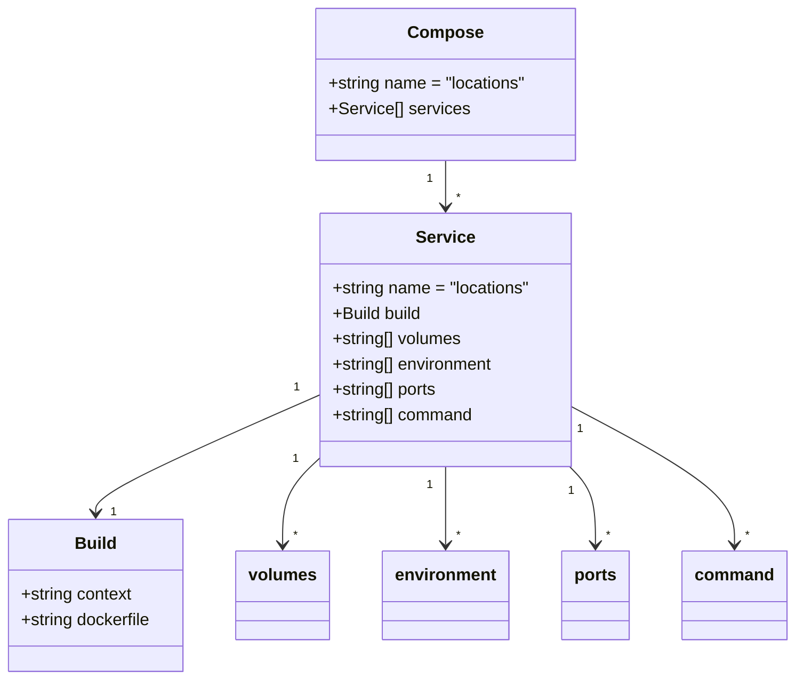

# Diagram: common/location_service/local/docker-compose.yml


> Auto-generated by Obscura crawlers

## Diagram 1

```mermaid
flowchart LR
  subgraph Compose [locations - docker-compose]
    direction TB
    svc[locations: service "locations"]
    subgraph Service["locations"]
      direction LR
      build["build\ncontext: ../../../../\nDockerfile: platform/common/location_service/local/Dockerfile"]
      volumes["volumes\n- ../location_service:/code/location_service\n- ./app:/code/app\n- ../../../common/fv/python/fv:/code/fv\n- ~/.aws:/root/.aws"]
      env["environment\n- AWS_PROFILE=fvdev\n- AWS_STAGE=dev\n- WATCHFILES_FORCE_POLLING=true"]
      ports["ports\n8080:8080"]
      cmd["command\npython -m fastapi run app/main.py --port 8080 --reload"]
    end
    svc --> Service
    Service --> build
    Service --> volumes
    Service --> env
    Service --> ports
    Service --> cmd
  end
```

> SVG rendering failed for this diagram.

## Diagram 2



### SVG

<svg id="container" width="745.75" xmlns="http://www.w3.org/2000/svg" class="classDiagram" height="644" viewBox="0 0 745.75 644" role="graphics-document document" aria-roledescription="class"><style>#container{font-family:"trebuchet ms",verdana,arial,sans-serif;font-size:16px;fill:#333;}@keyframes edge-animation-frame{from{stroke-dashoffset:0;}}@keyframes dash{to{stroke-dashoffset:0;}}#container .edge-animation-slow{stroke-dasharray:9,5!important;stroke-dashoffset:900;animation:dash 50s linear infinite;stroke-linecap:round;}#container .edge-animation-fast{stroke-dasharray:9,5!important;stroke-dashoffset:900;animation:dash 20s linear infinite;stroke-linecap:round;}#container .error-icon{fill:#552222;}#container .error-text{fill:#552222;stroke:#552222;}#container .edge-thickness-normal{stroke-width:1px;}#container .edge-thickness-thick{stroke-width:3.5px;}#container .edge-pattern-solid{stroke-dasharray:0;}#container .edge-thickness-invisible{stroke-width:0;fill:none;}#container .edge-pattern-dashed{stroke-dasharray:3;}#container .edge-pattern-dotted{stroke-dasharray:2;}#container .marker{fill:#333333;stroke:#333333;}#container .marker.cross{stroke:#333333;}#container svg{font-family:"trebuchet ms",verdana,arial,sans-serif;font-size:16px;}#container p{margin:0;}#container g.classGroup text{fill:#9370DB;stroke:none;font-family:"trebuchet ms",verdana,arial,sans-serif;font-size:10px;}#container g.classGroup text .title{font-weight:bolder;}#container .nodeLabel,#container .edgeLabel{color:#131300;}#container .edgeLabel .label rect{fill:#ECECFF;}#container .label text{fill:#131300;}#container .labelBkg{background:#ECECFF;}#container .edgeLabel .label span{background:#ECECFF;}#container .classTitle{font-weight:bolder;}#container .node rect,#container .node circle,#container .node ellipse,#container .node polygon,#container .node path{fill:#ECECFF;stroke:#9370DB;stroke-width:1px;}#container .divider{stroke:#9370DB;stroke-width:1;}#container g.clickable{cursor:pointer;}#container g.classGroup rect{fill:#ECECFF;stroke:#9370DB;}#container g.classGroup line{stroke:#9370DB;stroke-width:1;}#container .classLabel .box{stroke:none;stroke-width:0;fill:#ECECFF;opacity:0.5;}#container .classLabel .label{fill:#9370DB;font-size:10px;}#container .relation{stroke:#333333;stroke-width:1;fill:none;}#container .dashed-line{stroke-dasharray:3;}#container .dotted-line{stroke-dasharray:1 2;}#container #compositionStart,#container .composition{fill:#333333!important;stroke:#333333!important;stroke-width:1;}#container #compositionEnd,#container .composition{fill:#333333!important;stroke:#333333!important;stroke-width:1;}#container #dependencyStart,#container .dependency{fill:#333333!important;stroke:#333333!important;stroke-width:1;}#container #dependencyStart,#container .dependency{fill:#333333!important;stroke:#333333!important;stroke-width:1;}#container #extensionStart,#container .extension{fill:transparent!important;stroke:#333333!important;stroke-width:1;}#container #extensionEnd,#container .extension{fill:transparent!important;stroke:#333333!important;stroke-width:1;}#container #aggregationStart,#container .aggregation{fill:transparent!important;stroke:#333333!important;stroke-width:1;}#container #aggregationEnd,#container .aggregation{fill:transparent!important;stroke:#333333!important;stroke-width:1;}#container #lollipopStart,#container .lollipop{fill:#ECECFF!important;stroke:#333333!important;stroke-width:1;}#container #lollipopEnd,#container .lollipop{fill:#ECECFF!important;stroke:#333333!important;stroke-width:1;}#container .edgeTerminals{font-size:11px;line-height:initial;}#container .classTitleText{text-anchor:middle;font-size:18px;fill:#333;}#container .label-icon{display:inline-block;height:1em;overflow:visible;vertical-align:-0.125em;}#container .node .label-icon path{fill:currentColor;stroke:revert;stroke-width:revert;}#container :root{--mermaid-font-family:"trebuchet ms",verdana,arial,sans-serif;}</style><g><defs><marker id="container_class-aggregationStart" class="marker aggregation class" refX="18" refY="7" markerWidth="190" markerHeight="240" orient="auto"><path d="M 18,7 L9,13 L1,7 L9,1 Z"></path></marker></defs><defs><marker id="container_class-aggregationEnd" class="marker aggregation class" refX="1" refY="7" markerWidth="20" markerHeight="28" orient="auto"><path d="M 18,7 L9,13 L1,7 L9,1 Z"></path></marker></defs><defs><marker id="container_class-extensionStart" class="marker extension class" refX="18" refY="7" markerWidth="190" markerHeight="240" orient="auto"><path d="M 1,7 L18,13 V 1 Z"></path></marker></defs><defs><marker id="container_class-extensionEnd" class="marker extension class" refX="1" refY="7" markerWidth="20" markerHeight="28" orient="auto"><path d="M 1,1 V 13 L18,7 Z"></path></marker></defs><defs><marker id="container_class-compositionStart" class="marker composition class" refX="18" refY="7" markerWidth="190" markerHeight="240" orient="auto"><path d="M 18,7 L9,13 L1,7 L9,1 Z"></path></marker></defs><defs><marker id="container_class-compositionEnd" class="marker composition class" refX="1" refY="7" markerWidth="20" markerHeight="28" orient="auto"><path d="M 18,7 L9,13 L1,7 L9,1 Z"></path></marker></defs><defs><marker id="container_class-dependencyStart" class="marker dependency class" refX="6" refY="7" markerWidth="190" markerHeight="240" orient="auto"><path d="M 5,7 L9,13 L1,7 L9,1 Z"></path></marker></defs><defs><marker id="container_class-dependencyEnd" class="marker dependency class" refX="13" refY="7" markerWidth="20" markerHeight="28" orient="auto"><path d="M 18,7 L9,13 L14,7 L9,1 Z"></path></marker></defs><defs><marker id="container_class-lollipopStart" class="marker lollipop class" refX="13" refY="7" markerWidth="190" markerHeight="240" orient="auto"><circle stroke="black" fill="transparent" cx="7" cy="7" r="6"></circle></marker></defs><defs><marker id="container_class-lollipopEnd" class="marker lollipop class" refX="1" refY="7" markerWidth="190" markerHeight="240" orient="auto"><circle stroke="black" fill="transparent" cx="7" cy="7" r="6"></circle></marker></defs><g class="root"><g class="clusters"></g><g class="edgePaths"><path d="M420.703,152L420.703,156.167C420.703,160.333,420.703,168.667,420.703,176C420.703,183.333,420.703,189.667,420.703,192.833L420.703,196" id="id_Compose_Service_1" class="edge-thickness-normal edge-pattern-solid relation" style=";;;" data-edge="true" data-et="edge" data-id="id_Compose_Service_1" data-points="W3sieCI6NDIwLjcwMzEyNSwieSI6MTUyfSx7IngiOjQyMC43MDMxMjUsInkiOjE3N30seyJ4Ijo0MjAuNzAzMTI1LCJ5IjoyMDJ9XQ==" marker-end="url(#container_class-dependencyEnd)"></path><path d="M300.371,375.146L265.709,390.455C231.047,405.764,161.723,436.382,127.061,454.858C92.398,473.333,92.398,479.667,92.398,482.833L92.398,486" id="id_Service_Build_2" class="edge-thickness-normal edge-pattern-solid relation" style=";;;" data-edge="true" data-et="edge" data-id="id_Service_Build_2" data-points="W3sieCI6MzAwLjM3MTA5Mzc1LCJ5IjozNzUuMTQ2MTkzNzUxMDQxMX0seyJ4Ijo5Mi4zOTg0Mzc1LCJ5Ijo0Njd9LHsieCI6OTIuMzk4NDM3NSwieSI6NDkyfV0=" marker-end="url(#container_class-dependencyEnd)"></path><path d="M300.371,437.401L295.227,442.334C290.083,447.268,279.796,457.134,274.652,470.234C269.508,483.333,269.508,499.667,269.508,507.833L269.508,516" id="id_Service_volumes_3" class="edge-thickness-normal edge-pattern-solid relation" style=";;;" data-edge="true" data-et="edge" data-id="id_Service_volumes_3" data-points="W3sieCI6MzAwLjM3MTA5Mzc1LCJ5Ijo0MzcuNDAxMzU4OTYyNDM0NzZ9LHsieCI6MjY5LjUwNzgxMjUsInkiOjQ2N30seyJ4IjoyNjkuNTA3ODEyNSwieSI6NTIyfV0=" marker-end="url(#container_class-dependencyEnd)"></path><path d="M420.703,442L420.703,446.167C420.703,450.333,420.703,458.667,420.703,471C420.703,483.333,420.703,499.667,420.703,507.833L420.703,516" id="id_Service_environment_4" class="edge-thickness-normal edge-pattern-solid relation" style=";;;" data-edge="true" data-et="edge" data-id="id_Service_environment_4" data-points="W3sieCI6NDIwLjcwMzEyNSwieSI6NDQyfSx7IngiOjQyMC43MDMxMjUsInkiOjQ2N30seyJ4Ijo0MjAuNzAzMTI1LCJ5Ijo1MjJ9XQ==" marker-end="url(#container_class-dependencyEnd)"></path><path d="M536.643,442L540.668,446.167C544.694,450.333,552.746,458.667,556.771,471C560.797,483.333,560.797,499.667,560.797,507.833L560.797,516" id="id_Service_ports_5" class="edge-thickness-normal edge-pattern-solid relation" style=";;;" data-edge="true" data-et="edge" data-id="id_Service_ports_5" data-points="W3sieCI6NTM2LjY0Mjc4MDE3MjQxMzgsInkiOjQ0Mn0seyJ4Ijo1NjAuNzk2ODc1LCJ5Ijo0Njd9LHsieCI6NTYwLjc5Njg3NSwieSI6NTIyfV0=" marker-end="url(#container_class-dependencyEnd)"></path><path d="M541.035,386.773L565.876,400.144C590.716,413.515,640.397,440.258,665.238,461.795C690.078,483.333,690.078,499.667,690.078,507.833L690.078,516" id="id_Service_command_6" class="edge-thickness-normal edge-pattern-solid relation" style=";;;" data-edge="true" data-et="edge" data-id="id_Service_command_6" data-points="W3sieCI6NTQxLjAzNTE1NjI1LCJ5IjozODYuNzcyNjk0MzE1NTQ1Mn0seyJ4Ijo2OTAuMDc4MTI1LCJ5Ijo0Njd9LHsieCI6NjkwLjA3ODEyNSwieSI6NTIyfV0=" marker-end="url(#container_class-dependencyEnd)"></path></g><g class="edgeLabels"><g class="edgeLabel"><g class="label" data-id="id_Compose_Service_1" transform="translate(0, 0)"><foreignObject width="0" height="0"><div xmlns="http://www.w3.org/1999/xhtml" class="labelBkg" style="display: table-cell; white-space: nowrap; line-height: 1.5; max-width: 200px; text-align: center;"><span class="edgeLabel"></span></div></foreignObject></g></g><g class="edgeLabel"><g class="label" data-id="id_Service_Build_2" transform="translate(0, 0)"><foreignObject width="0" height="0"><div xmlns="http://www.w3.org/1999/xhtml" class="labelBkg" style="display: table-cell; white-space: nowrap; line-height: 1.5; max-width: 200px; text-align: center;"><span class="edgeLabel"></span></div></foreignObject></g></g><g class="edgeLabel"><g class="label" data-id="id_Service_volumes_3" transform="translate(0, 0)"><foreignObject width="0" height="0"><div xmlns="http://www.w3.org/1999/xhtml" class="labelBkg" style="display: table-cell; white-space: nowrap; line-height: 1.5; max-width: 200px; text-align: center;"><span class="edgeLabel"></span></div></foreignObject></g></g><g class="edgeLabel"><g class="label" data-id="id_Service_environment_4" transform="translate(0, 0)"><foreignObject width="0" height="0"><div xmlns="http://www.w3.org/1999/xhtml" class="labelBkg" style="display: table-cell; white-space: nowrap; line-height: 1.5; max-width: 200px; text-align: center;"><span class="edgeLabel"></span></div></foreignObject></g></g><g class="edgeLabel"><g class="label" data-id="id_Service_ports_5" transform="translate(0, 0)"><foreignObject width="0" height="0"><div xmlns="http://www.w3.org/1999/xhtml" class="labelBkg" style="display: table-cell; white-space: nowrap; line-height: 1.5; max-width: 200px; text-align: center;"><span class="edgeLabel"></span></div></foreignObject></g></g><g class="edgeLabel"><g class="label" data-id="id_Service_command_6" transform="translate(0, 0)"><foreignObject width="0" height="0"><div xmlns="http://www.w3.org/1999/xhtml" class="labelBkg" style="display: table-cell; white-space: nowrap; line-height: 1.5; max-width: 200px; text-align: center;"><span class="edgeLabel"></span></div></foreignObject></g></g><g class="edgeTerminals" transform="translate(405.70312750000016, 169.50000214285714)"><g class="inner" transform="translate(0, 0)"><foreignObject style="width: 9px; height: 12px;"><div xmlns="http://www.w3.org/1999/xhtml" style="display: inline-block; padding-right: 1px; white-space: nowrap;"><span class="edgeLabel">1</span></div></foreignObject></g></g><g class="edgeTerminals" transform="translate(278.30271663519596, 368.4951161260513)"><g class="inner" transform="translate(0, 0)"><foreignObject style="width: 9px; height: 12px;"><div xmlns="http://www.w3.org/1999/xhtml" style="display: inline-block; padding-right: 1px; white-space: nowrap;"><span class="edgeLabel">1</span></div></foreignObject></g></g><g class="edgeTerminals" transform="translate(277.35818080180985, 438.6881708511668)"><g class="inner" transform="translate(0, 0)"><foreignObject style="width: 9px; height: 12px;"><div xmlns="http://www.w3.org/1999/xhtml" style="display: inline-block; padding-right: 1px; white-space: nowrap;"><span class="edgeLabel">1</span></div></foreignObject></g></g><g class="edgeTerminals" transform="translate(405.70312750000016, 459.5000021428571)"><g class="inner" transform="translate(0, 0)"><foreignObject style="width: 9px; height: 12px;"><div xmlns="http://www.w3.org/1999/xhtml" style="display: inline-block; padding-right: 1px; white-space: nowrap;"><span class="edgeLabel">1</span></div></foreignObject></g></g><g class="edgeTerminals" transform="translate(537.883147356792, 464.99024781156277)"><g class="inner" transform="translate(0, 0)"><foreignObject style="width: 9px; height: 12px;"><div xmlns="http://www.w3.org/1999/xhtml" style="display: inline-block; padding-right: 1px; white-space: nowrap;"><span class="edgeLabel">1</span></div></foreignObject></g></g><g class="edgeTerminals" transform="translate(549.3348795120688, 408.2753581954655)"><g class="inner" transform="translate(0, 0)"><foreignObject style="width: 9px; height: 12px;"><div xmlns="http://www.w3.org/1999/xhtml" style="display: inline-block; padding-right: 1px; white-space: nowrap;"><span class="edgeLabel">1</span></div></foreignObject></g></g><g class="edgeTerminals" transform="translate(430.7031274999998, 179.50000214285714)"><g class="inner" transform="translate(0, 0)"></g><foreignObject style="width: 9px; height: 12px;"><div xmlns="http://www.w3.org/1999/xhtml" style="display: inline-block; padding-right: 1px; white-space: nowrap;"><span class="edgeLabel">*</span></div></foreignObject></g><g class="edgeTerminals" transform="translate(106.27919874638087, 476.98658499456724)"><g class="inner" transform="translate(0, 0)"></g><foreignObject style="width: 9px; height: 12px;"><div xmlns="http://www.w3.org/1999/xhtml" style="display: inline-block; padding-right: 1px; white-space: nowrap;"><span class="edgeLabel">1</span></div></foreignObject></g><g class="edgeTerminals" transform="translate(279.50781125, 499.4999989285714)"><g class="inner" transform="translate(0, 0)"></g><foreignObject style="width: 9px; height: 12px;"><div xmlns="http://www.w3.org/1999/xhtml" style="display: inline-block; padding-right: 1px; white-space: nowrap;"><span class="edgeLabel">*</span></div></foreignObject></g><g class="edgeTerminals" transform="translate(430.7031274999998, 499.5000021428571)"><g class="inner" transform="translate(0, 0)"></g><foreignObject style="width: 9px; height: 12px;"><div xmlns="http://www.w3.org/1999/xhtml" style="display: inline-block; padding-right: 1px; white-space: nowrap;"><span class="edgeLabel">*</span></div></foreignObject></g><g class="edgeTerminals" transform="translate(570.7968774999998, 499.5000021428571)"><g class="inner" transform="translate(0, 0)"></g><foreignObject style="width: 9px; height: 12px;"><div xmlns="http://www.w3.org/1999/xhtml" style="display: inline-block; padding-right: 1px; white-space: nowrap;"><span class="edgeLabel">*</span></div></foreignObject></g><g class="edgeTerminals" transform="translate(700.0781274999998, 499.5000021428571)"><g class="inner" transform="translate(0, 0)"></g><foreignObject style="width: 9px; height: 12px;"><div xmlns="http://www.w3.org/1999/xhtml" style="display: inline-block; padding-right: 1px; white-space: nowrap;"><span class="edgeLabel">*</span></div></foreignObject></g></g><g class="nodes"><g class="node default" id="classId-Compose-0" transform="translate(420.703125, 80)"><g class="basic label-container"><path d="M-123.80859375 -72 L123.80859375 -72 L123.80859375 72 L-123.80859375 72" stroke="none" stroke-width="0" fill="#ECECFF" style=""></path><path d="M-123.80859375 -72 C-47.98256589342141 -72, 27.843461963157182 -72, 123.80859375 -72 M-123.80859375 -72 C-46.04861577830111 -72, 31.711362193397775 -72, 123.80859375 -72 M123.80859375 -72 C123.80859375 -14.805873234087287, 123.80859375 42.38825353182543, 123.80859375 72 M123.80859375 -72 C123.80859375 -40.31003542950447, 123.80859375 -8.620070859008926, 123.80859375 72 M123.80859375 72 C34.26346340022661 72, -55.281666949546775 72, -123.80859375 72 M123.80859375 72 C37.16362527829568 72, -49.481343193408634 72, -123.80859375 72 M-123.80859375 72 C-123.80859375 32.41956355336525, -123.80859375 -7.160872893269499, -123.80859375 -72 M-123.80859375 72 C-123.80859375 18.288543834151525, -123.80859375 -35.42291233169695, -123.80859375 -72" stroke="#9370DB" stroke-width="1.3" fill="none" stroke-dasharray="0 0" style=""></path></g><g class="annotation-group text" transform="translate(0, -48)"></g><g class="label-group text" transform="translate(-33.6015625, -48)"><g class="label" style="font-weight: bolder" transform="translate(0,-12)"><foreignObject width="67.203125" height="24"><div xmlns="http://www.w3.org/1999/xhtml" style="display: table-cell; white-space: nowrap; line-height: 1.5; max-width: 117px; text-align: center;"><span class="nodeLabel markdown-node-label" style=""><p>Compose</p></span></div></foreignObject></g></g><g class="members-group text" transform="translate(-111.80859375, 0)"><g class="label" style="" transform="translate(0,-12)"><foreignObject width="190.015625" height="24"><div xmlns="http://www.w3.org/1999/xhtml" style="display: table-cell; white-space: nowrap; line-height: 1.5; max-width: 247px; text-align: center;"><span class="nodeLabel markdown-node-label" style=""><p>+string name = "locations"</p></span></div></foreignObject></g><g class="label" style="" transform="translate(0,12)"><foreignObject width="132.21875" height="24"><div xmlns="http://www.w3.org/1999/xhtml" style="display: table-cell; white-space: nowrap; line-height: 1.5; max-width: 190px; text-align: center;"><span class="nodeLabel markdown-node-label" style=""><p>+Service[] services</p></span></div></foreignObject></g></g><g class="methods-group text" transform="translate(-111.80859375, 72)"></g><g class="divider" style=""><path d="M-123.80859375 -24 C-46.83796975227176 -24, 30.13265424545648 -24, 123.80859375 -24 M-123.80859375 -24 C-51.961470192284196 -24, 19.885653365431608 -24, 123.80859375 -24" stroke="#9370DB" stroke-width="1.3" fill="none" stroke-dasharray="0 0" style=""></path></g><g class="divider" style=""><path d="M-123.80859375 48 C-32.788887757832256 48, 58.23081823433549 48, 123.80859375 48 M-123.80859375 48 C-25.742553771768314 48, 72.32348620646337 48, 123.80859375 48" stroke="#9370DB" stroke-width="1.3" fill="none" stroke-dasharray="0 0" style=""></path></g></g><g class="node default" id="classId-Service-1" transform="translate(420.703125, 322)"><g class="basic label-container"><path d="M-120.33203125 -120 L120.33203125 -120 L120.33203125 120 L-120.33203125 120" stroke="none" stroke-width="0" fill="#ECECFF" style=""></path><path d="M-120.33203125 -120 C-71.55099273836399 -120, -22.76995422672799 -120, 120.33203125 -120 M-120.33203125 -120 C-55.528767092995196 -120, 9.274497064009608 -120, 120.33203125 -120 M120.33203125 -120 C120.33203125 -66.21392452739033, 120.33203125 -12.427849054780665, 120.33203125 120 M120.33203125 -120 C120.33203125 -70.67629977238133, 120.33203125 -21.352599544762654, 120.33203125 120 M120.33203125 120 C56.77669505487323 120, -6.778641140253541 120, -120.33203125 120 M120.33203125 120 C47.51979072274676 120, -25.292449804506475 120, -120.33203125 120 M-120.33203125 120 C-120.33203125 24.027388901520112, -120.33203125 -71.94522219695978, -120.33203125 -120 M-120.33203125 120 C-120.33203125 55.630222585198496, -120.33203125 -8.739554829603009, -120.33203125 -120" stroke="#9370DB" stroke-width="1.3" fill="none" stroke-dasharray="0 0" style=""></path></g><g class="annotation-group text" transform="translate(0, -96)"></g><g class="label-group text" transform="translate(-26.6484375, -96)"><g class="label" style="font-weight: bolder" transform="translate(0,-12)"><foreignObject width="53.296875" height="24"><div xmlns="http://www.w3.org/1999/xhtml" style="display: table-cell; white-space: nowrap; line-height: 1.5; max-width: 102px; text-align: center;"><span class="nodeLabel markdown-node-label" style=""><p>Service</p></span></div></foreignObject></g></g><g class="members-group text" transform="translate(-108.33203125, -48)"><g class="label" style="" transform="translate(0,-12)"><foreignObject width="190.015625" height="24"><div xmlns="http://www.w3.org/1999/xhtml" style="display: table-cell; white-space: nowrap; line-height: 1.5; max-width: 247px; text-align: center;"><span class="nodeLabel markdown-node-label" style=""><p>+string name = "locations"</p></span></div></foreignObject></g><g class="label" style="" transform="translate(0,12)"><foreignObject width="87.46875" height="24"><div xmlns="http://www.w3.org/1999/xhtml" style="display: table-cell; white-space: nowrap; line-height: 1.5; max-width: 145px; text-align: center;"><span class="nodeLabel markdown-node-label" style=""><p>+Build build</p></span></div></foreignObject></g><g class="label" style="" transform="translate(0,36)"><foreignObject width="125.21875" height="24"><div xmlns="http://www.w3.org/1999/xhtml" style="display: table-cell; white-space: nowrap; line-height: 1.5; max-width: 183px; text-align: center;"><span class="nodeLabel markdown-node-label" style=""><p>+string[] volumes</p></span></div></foreignObject></g><g class="label" style="" transform="translate(0,60)"><foreignObject width="156.53125" height="24"><div xmlns="http://www.w3.org/1999/xhtml" style="display: table-cell; white-space: nowrap; line-height: 1.5; max-width: 214px; text-align: center;"><span class="nodeLabel markdown-node-label" style=""><p>+string[] environment</p></span></div></foreignObject></g><g class="label" style="" transform="translate(0,84)"><foreignObject width="102.4375" height="24"><div xmlns="http://www.w3.org/1999/xhtml" style="display: table-cell; white-space: nowrap; line-height: 1.5; max-width: 160px; text-align: center;"><span class="nodeLabel markdown-node-label" style=""><p>+string[] ports</p></span></div></foreignObject></g><g class="label" style="" transform="translate(0,108)"><foreignObject width="135.90625" height="24"><div xmlns="http://www.w3.org/1999/xhtml" style="display: table-cell; white-space: nowrap; line-height: 1.5; max-width: 193px; text-align: center;"><span class="nodeLabel markdown-node-label" style=""><p>+string[] command</p></span></div></foreignObject></g></g><g class="methods-group text" transform="translate(-108.33203125, 120)"></g><g class="divider" style=""><path d="M-120.33203125 -72 C-64.37522960576497 -72, -8.418427961529943 -72, 120.33203125 -72 M-120.33203125 -72 C-53.13375808566771 -72, 14.064515078664584 -72, 120.33203125 -72" stroke="#9370DB" stroke-width="1.3" fill="none" stroke-dasharray="0 0" style=""></path></g><g class="divider" style=""><path d="M-120.33203125 96 C-62.09330374745518 96, -3.854576244910362 96, 120.33203125 96 M-120.33203125 96 C-66.24957143992592 96, -12.167111629851846 96, 120.33203125 96" stroke="#9370DB" stroke-width="1.3" fill="none" stroke-dasharray="0 0" style=""></path></g></g><g class="node default" id="classId-Build-2" transform="translate(92.3984375, 564)"><g class="basic label-container"><path d="M-84.3984375 -72 L84.3984375 -72 L84.3984375 72 L-84.3984375 72" stroke="none" stroke-width="0" fill="#ECECFF" style=""></path><path d="M-84.3984375 -72 C-44.19821428455781 -72, -3.9979910691156135 -72, 84.3984375 -72 M-84.3984375 -72 C-38.97376092989722 -72, 6.450915640205565 -72, 84.3984375 -72 M84.3984375 -72 C84.3984375 -32.550835674061666, 84.3984375 6.8983286518766675, 84.3984375 72 M84.3984375 -72 C84.3984375 -15.191453504965132, 84.3984375 41.617092990069736, 84.3984375 72 M84.3984375 72 C23.345057727778723 72, -37.70832204444255 72, -84.3984375 72 M84.3984375 72 C17.46597551676362 72, -49.46648646647276 72, -84.3984375 72 M-84.3984375 72 C-84.3984375 35.47129134668323, -84.3984375 -1.057417306633539, -84.3984375 -72 M-84.3984375 72 C-84.3984375 26.058729614168826, -84.3984375 -19.88254077166235, -84.3984375 -72" stroke="#9370DB" stroke-width="1.3" fill="none" stroke-dasharray="0 0" style=""></path></g><g class="annotation-group text" transform="translate(0, -48)"></g><g class="label-group text" transform="translate(-18.90625, -48)"><g class="label" style="font-weight: bolder" transform="translate(0,-12)"><foreignObject width="37.8125" height="24"><div xmlns="http://www.w3.org/1999/xhtml" style="display: table-cell; white-space: nowrap; line-height: 1.5; max-width: 88px; text-align: center;"><span class="nodeLabel markdown-node-label" style=""><p>Build</p></span></div></foreignObject></g></g><g class="members-group text" transform="translate(-72.3984375, 0)"><g class="label" style="" transform="translate(0,-12)"><foreignObject width="107.5625" height="24"><div xmlns="http://www.w3.org/1999/xhtml" style="display: table-cell; white-space: nowrap; line-height: 1.5; max-width: 165px; text-align: center;"><span class="nodeLabel markdown-node-label" style=""><p>+string context</p></span></div></foreignObject></g><g class="label" style="" transform="translate(0,12)"><foreignObject width="125.890625" height="24"><div xmlns="http://www.w3.org/1999/xhtml" style="display: table-cell; white-space: nowrap; line-height: 1.5; max-width: 183px; text-align: center;"><span class="nodeLabel markdown-node-label" style=""><p>+string dockerfile</p></span></div></foreignObject></g></g><g class="methods-group text" transform="translate(-72.3984375, 72)"></g><g class="divider" style=""><path d="M-84.3984375 -24 C-29.02549289690657 -24, 26.34745170618686 -24, 84.3984375 -24 M-84.3984375 -24 C-44.15585435959957 -24, -3.913271219199146 -24, 84.3984375 -24" stroke="#9370DB" stroke-width="1.3" fill="none" stroke-dasharray="0 0" style=""></path></g><g class="divider" style=""><path d="M-84.3984375 48 C-42.38926549581721 48, -0.3800934916344261 48, 84.3984375 48 M-84.3984375 48 C-17.23223172628731 48, 49.93397404742538 48, 84.3984375 48" stroke="#9370DB" stroke-width="1.3" fill="none" stroke-dasharray="0 0" style=""></path></g></g><g class="node default" id="classId-volumes-3" transform="translate(269.5078125, 564)"><g class="basic label-container"><path d="M-42.7109375 -42 L42.7109375 -42 L42.7109375 42 L-42.7109375 42" stroke="none" stroke-width="0" fill="#ECECFF" style=""></path><path d="M-42.7109375 -42 C-18.64986866116421 -42, 5.4112001776715815 -42, 42.7109375 -42 M-42.7109375 -42 C-17.31256421574201 -42, 8.085809068515978 -42, 42.7109375 -42 M42.7109375 -42 C42.7109375 -9.784671703393585, 42.7109375 22.43065659321283, 42.7109375 42 M42.7109375 -42 C42.7109375 -22.192273984744475, 42.7109375 -2.384547969488949, 42.7109375 42 M42.7109375 42 C13.612196573478911 42, -15.486544353042177 42, -42.7109375 42 M42.7109375 42 C23.347628329357324 42, 3.984319158714648 42, -42.7109375 42 M-42.7109375 42 C-42.7109375 21.953673996777127, -42.7109375 1.9073479935542537, -42.7109375 -42 M-42.7109375 42 C-42.7109375 20.5622345660835, -42.7109375 -0.8755308678329996, -42.7109375 -42" stroke="#9370DB" stroke-width="1.3" fill="none" stroke-dasharray="0 0" style=""></path></g><g class="annotation-group text" transform="translate(0, -18)"></g><g class="label-group text" transform="translate(-30.7109375, -18)"><g class="label" style="font-weight: bolder" transform="translate(0,-12)"><foreignObject width="61.421875" height="24"><div xmlns="http://www.w3.org/1999/xhtml" style="display: table-cell; white-space: nowrap; line-height: 1.5; max-width: 111px; text-align: center;"><span class="nodeLabel markdown-node-label" style=""><p>volumes</p></span></div></foreignObject></g></g><g class="members-group text" transform="translate(-30.7109375, 30)"></g><g class="methods-group text" transform="translate(-30.7109375, 60)"></g><g class="divider" style=""><path d="M-42.7109375 6 C-24.01914648971794 6, -5.32735547943588 6, 42.7109375 6 M-42.7109375 6 C-18.201127384873548 6, 6.3086827302529045 6, 42.7109375 6" stroke="#9370DB" stroke-width="1.3" fill="none" stroke-dasharray="0 0" style=""></path></g><g class="divider" style=""><path d="M-42.7109375 24 C-24.502907613607576 24, -6.294877727215152 24, 42.7109375 24 M-42.7109375 24 C-9.490669964757416 24, 23.72959757048517 24, 42.7109375 24" stroke="#9370DB" stroke-width="1.3" fill="none" stroke-dasharray="0 0" style=""></path></g></g><g class="node default" id="classId-environment-4" transform="translate(420.703125, 564)"><g class="basic label-container"><path d="M-58.484375 -42 L58.484375 -42 L58.484375 42 L-58.484375 42" stroke="none" stroke-width="0" fill="#ECECFF" style=""></path><path d="M-58.484375 -42 C-26.871529961744923 -42, 4.741315076510155 -42, 58.484375 -42 M-58.484375 -42 C-12.64908950743817 -42, 33.18619598512366 -42, 58.484375 -42 M58.484375 -42 C58.484375 -11.376602253927075, 58.484375 19.24679549214585, 58.484375 42 M58.484375 -42 C58.484375 -21.758505423490952, 58.484375 -1.5170108469819041, 58.484375 42 M58.484375 42 C20.15056295345402 42, -18.18324909309196 42, -58.484375 42 M58.484375 42 C31.093802720410103 42, 3.7032304408202066 42, -58.484375 42 M-58.484375 42 C-58.484375 17.805209857693683, -58.484375 -6.389580284612634, -58.484375 -42 M-58.484375 42 C-58.484375 9.17603957934709, -58.484375 -23.64792084130582, -58.484375 -42" stroke="#9370DB" stroke-width="1.3" fill="none" stroke-dasharray="0 0" style=""></path></g><g class="annotation-group text" transform="translate(0, -18)"></g><g class="label-group text" transform="translate(-46.484375, -18)"><g class="label" style="font-weight: bolder" transform="translate(0,-12)"><foreignObject width="92.96875" height="24"><div xmlns="http://www.w3.org/1999/xhtml" style="display: table-cell; white-space: nowrap; line-height: 1.5; max-width: 143px; text-align: center;"><span class="nodeLabel markdown-node-label" style=""><p>environment</p></span></div></foreignObject></g></g><g class="members-group text" transform="translate(-46.484375, 30)"></g><g class="methods-group text" transform="translate(-46.484375, 60)"></g><g class="divider" style=""><path d="M-58.484375 6 C-12.622511879913219 6, 33.23935124017356 6, 58.484375 6 M-58.484375 6 C-14.585807345593388 6, 29.312760308813225 6, 58.484375 6" stroke="#9370DB" stroke-width="1.3" fill="none" stroke-dasharray="0 0" style=""></path></g><g class="divider" style=""><path d="M-58.484375 24 C-13.961528645675287 24, 30.561317708649426 24, 58.484375 24 M-58.484375 24 C-14.569873639635425 24, 29.34462772072915 24, 58.484375 24" stroke="#9370DB" stroke-width="1.3" fill="none" stroke-dasharray="0 0" style=""></path></g></g><g class="node default" id="classId-ports-5" transform="translate(560.796875, 564)"><g class="basic label-container"><path d="M-31.609375 -42 L31.609375 -42 L31.609375 42 L-31.609375 42" stroke="none" stroke-width="0" fill="#ECECFF" style=""></path><path d="M-31.609375 -42 C-11.841595216683334 -42, 7.9261845666333315 -42, 31.609375 -42 M-31.609375 -42 C-9.885722296092393 -42, 11.837930407815215 -42, 31.609375 -42 M31.609375 -42 C31.609375 -9.234312488679578, 31.609375 23.531375022640844, 31.609375 42 M31.609375 -42 C31.609375 -22.948371998616107, 31.609375 -3.896743997232214, 31.609375 42 M31.609375 42 C8.121046117860129 42, -15.367282764279743 42, -31.609375 42 M31.609375 42 C11.336203301876782 42, -8.936968396246435 42, -31.609375 42 M-31.609375 42 C-31.609375 21.98815365993617, -31.609375 1.9763073198723404, -31.609375 -42 M-31.609375 42 C-31.609375 19.127242993974615, -31.609375 -3.7455140120507693, -31.609375 -42" stroke="#9370DB" stroke-width="1.3" fill="none" stroke-dasharray="0 0" style=""></path></g><g class="annotation-group text" transform="translate(0, -18)"></g><g class="label-group text" transform="translate(-19.609375, -18)"><g class="label" style="font-weight: bolder" transform="translate(0,-12)"><foreignObject width="39.21875" height="24"><div xmlns="http://www.w3.org/1999/xhtml" style="display: table-cell; white-space: nowrap; line-height: 1.5; max-width: 88px; text-align: center;"><span class="nodeLabel markdown-node-label" style=""><p>ports</p></span></div></foreignObject></g></g><g class="members-group text" transform="translate(-19.609375, 30)"></g><g class="methods-group text" transform="translate(-19.609375, 60)"></g><g class="divider" style=""><path d="M-31.609375 6 C-10.021555474494022 6, 11.566264051011956 6, 31.609375 6 M-31.609375 6 C-10.130884462601141 6, 11.347606074797717 6, 31.609375 6" stroke="#9370DB" stroke-width="1.3" fill="none" stroke-dasharray="0 0" style=""></path></g><g class="divider" style=""><path d="M-31.609375 24 C-13.586612226835257 24, 4.436150546329486 24, 31.609375 24 M-31.609375 24 C-10.03266092513784 24, 11.54405314972432 24, 31.609375 24" stroke="#9370DB" stroke-width="1.3" fill="none" stroke-dasharray="0 0" style=""></path></g></g><g class="node default" id="classId-command-6" transform="translate(690.078125, 564)"><g class="basic label-container"><path d="M-47.671875 -42 L47.671875 -42 L47.671875 42 L-47.671875 42" stroke="none" stroke-width="0" fill="#ECECFF" style=""></path><path d="M-47.671875 -42 C-21.445054328251288 -42, 4.781766343497424 -42, 47.671875 -42 M-47.671875 -42 C-28.120563839800724 -42, -8.569252679601448 -42, 47.671875 -42 M47.671875 -42 C47.671875 -10.632525187180153, 47.671875 20.734949625639693, 47.671875 42 M47.671875 -42 C47.671875 -23.47966450504601, 47.671875 -4.95932901009202, 47.671875 42 M47.671875 42 C23.578255069121205 42, -0.5153648617575897 42, -47.671875 42 M47.671875 42 C27.624637966916673 42, 7.577400933833346 42, -47.671875 42 M-47.671875 42 C-47.671875 23.469743201165656, -47.671875 4.939486402331312, -47.671875 -42 M-47.671875 42 C-47.671875 16.763797649299185, -47.671875 -8.47240470140163, -47.671875 -42" stroke="#9370DB" stroke-width="1.3" fill="none" stroke-dasharray="0 0" style=""></path></g><g class="annotation-group text" transform="translate(0, -18)"></g><g class="label-group text" transform="translate(-35.671875, -18)"><g class="label" style="font-weight: bolder" transform="translate(0,-12)"><foreignObject width="71.34375" height="24"><div xmlns="http://www.w3.org/1999/xhtml" style="display: table-cell; white-space: nowrap; line-height: 1.5; max-width: 122px; text-align: center;"><span class="nodeLabel markdown-node-label" style=""><p>command</p></span></div></foreignObject></g></g><g class="members-group text" transform="translate(-35.671875, 30)"></g><g class="methods-group text" transform="translate(-35.671875, 60)"></g><g class="divider" style=""><path d="M-47.671875 6 C-27.48721318026895 6, -7.3025513605378976 6, 47.671875 6 M-47.671875 6 C-28.189644746724454 6, -8.707414493448908 6, 47.671875 6" stroke="#9370DB" stroke-width="1.3" fill="none" stroke-dasharray="0 0" style=""></path></g><g class="divider" style=""><path d="M-47.671875 24 C-16.48005172886395 24, 14.711771542272103 24, 47.671875 24 M-47.671875 24 C-24.522256814853144 24, -1.3726386297062874 24, 47.671875 24" stroke="#9370DB" stroke-width="1.3" fill="none" stroke-dasharray="0 0" style=""></path></g></g></g></g></g></svg>
