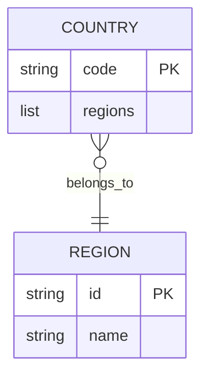

# Diagram: common/location_service/location_service/loc/common/constants.py


> Auto-generated by Obscura crawlers

## Diagram 1

```mermaid
classDiagram
class VersionOptions {
  <<enumeration>>
  SUMMARY: "summary"
  COUNT: "count"
  FULL: "full"
  CHILD_IDS: "childIds"
  BASIC: "basic"
}
class SORT_OPTIONS {
  +code
  +address
  +city
  +state
  +country
  +name
  +category
  +lad
  +organization
  +geofence_type
  +child_count
  +parent_code
}
class UNLINKED_SORT_OPTIONS {
  +name
  +code
  +address
  +count
  +source
}
class COUNTRIES {
  +<code>: { region: [...] }
}
class REGIONS {
  AS: "Asia"
  EU: "Europe"
  AF: "Africa"
  OC: "Australia"
  NA: "North America"
  SA: "South America"
}
class COUNTRY_CODE {
  value: "MEX"
}
VersionOptions --> SORT_OPTIONS : used_by
SORT_OPTIONS --> COUNTRIES : applies_to
UNLINKED_SORT_OPTIONS --> COUNTRIES : applies_to
COUNTRIES --> REGIONS : maps_to
COUNTRY_CODE --> COUNTRIES : references
```

> SVG rendering failed for this diagram.

## Diagram 2



### SVG

<svg id="container" width="204.828125" xmlns="http://www.w3.org/2000/svg" class="erDiagram" height="373.5" viewBox="0 0 204.828125 373.5" role="graphics-document document" aria-roledescription="er"><style>#container{font-family:"trebuchet ms",verdana,arial,sans-serif;font-size:16px;fill:#333;}@keyframes edge-animation-frame{from{stroke-dashoffset:0;}}@keyframes dash{to{stroke-dashoffset:0;}}#container .edge-animation-slow{stroke-dasharray:9,5!important;stroke-dashoffset:900;animation:dash 50s linear infinite;stroke-linecap:round;}#container .edge-animation-fast{stroke-dasharray:9,5!important;stroke-dashoffset:900;animation:dash 20s linear infinite;stroke-linecap:round;}#container .error-icon{fill:#552222;}#container .error-text{fill:#552222;stroke:#552222;}#container .edge-thickness-normal{stroke-width:1px;}#container .edge-thickness-thick{stroke-width:3.5px;}#container .edge-pattern-solid{stroke-dasharray:0;}#container .edge-thickness-invisible{stroke-width:0;fill:none;}#container .edge-pattern-dashed{stroke-dasharray:3;}#container .edge-pattern-dotted{stroke-dasharray:2;}#container .marker{fill:#333333;stroke:#333333;}#container .marker.cross{stroke:#333333;}#container svg{font-family:"trebuchet ms",verdana,arial,sans-serif;font-size:16px;}#container p{margin:0;}#container .entityBox{fill:#ECECFF;stroke:#9370DB;}#container .relationshipLabelBox{fill:hsl(80, 100%, 96.2745098039%);opacity:0.7;background-color:hsl(80, 100%, 96.2745098039%);}#container .relationshipLabelBox rect{opacity:0.5;}#container .labelBkg{background-color:rgba(248.6666666666, 255, 235.9999999999, 0.5);}#container .edgeLabel .label{fill:#9370DB;font-size:14px;}#container .label{font-family:"trebuchet ms",verdana,arial,sans-serif;color:#333;}#container .edge-pattern-dashed{stroke-dasharray:8,8;}#container .node rect,#container .node circle,#container .node ellipse,#container .node polygon{fill:#ECECFF;stroke:#9370DB;stroke-width:1px;}#container .relationshipLine{stroke:#333333;stroke-width:1;fill:none;}#container .marker{fill:none!important;stroke:#333333!important;stroke-width:1;}#container :root{--mermaid-font-family:"trebuchet ms",verdana,arial,sans-serif;}</style><g><defs><marker id="container_er-onlyOneStart" class="marker onlyOne er" refX="0" refY="9" markerWidth="18" markerHeight="18" orient="auto"><path d="M9,0 L9,18 M15,0 L15,18"></path></marker></defs><defs><marker id="container_er-onlyOneEnd" class="marker onlyOne er" refX="18" refY="9" markerWidth="18" markerHeight="18" orient="auto"><path d="M3,0 L3,18 M9,0 L9,18"></path></marker></defs><defs><marker id="container_er-zeroOrOneStart" class="marker zeroOrOne er" refX="0" refY="9" markerWidth="30" markerHeight="18" orient="auto"><circle fill="white" cx="21" cy="9" r="6"></circle><path d="M9,0 L9,18"></path></marker></defs><defs><marker id="container_er-zeroOrOneEnd" class="marker zeroOrOne er" refX="30" refY="9" markerWidth="30" markerHeight="18" orient="auto"><circle fill="white" cx="9" cy="9" r="6"></circle><path d="M21,0 L21,18"></path></marker></defs><defs><marker id="container_er-oneOrMoreStart" class="marker oneOrMore er" refX="18" refY="18" markerWidth="45" markerHeight="36" orient="auto"><path d="M0,18 Q 18,0 36,18 Q 18,36 0,18 M42,9 L42,27"></path></marker></defs><defs><marker id="container_er-oneOrMoreEnd" class="marker oneOrMore er" refX="27" refY="18" markerWidth="45" markerHeight="36" orient="auto"><path d="M3,9 L3,27 M9,18 Q27,0 45,18 Q27,36 9,18"></path></marker></defs><defs><marker id="container_er-zeroOrMoreStart" class="marker zeroOrMore er" refX="18" refY="18" markerWidth="57" markerHeight="36" orient="auto"><circle fill="white" cx="48" cy="18" r="6"></circle><path d="M0,18 Q18,0 36,18 Q18,36 0,18"></path></marker></defs><defs><marker id="container_er-zeroOrMoreEnd" class="marker zeroOrMore er" refX="39" refY="18" markerWidth="57" markerHeight="36" orient="auto"><circle fill="white" cx="9" cy="18" r="6"></circle><path d="M21,18 Q39,0 57,18 Q39,36 21,18"></path></marker></defs><g class="root"><g class="clusters"></g><g class="edgePaths"><path d="M102.414,136.25L102.414,144.667C102.414,153.083,102.414,169.917,102.414,186.75C102.414,203.583,102.414,220.417,102.414,228.833L102.414,237.25" id="id_entity-COUNTRY-0_entity-REGION-1_0" class="edge-thickness-normal edge-pattern-solid relationshipLine" style="undefined;;;undefined" data-edge="true" data-et="edge" data-id="id_entity-COUNTRY-0_entity-REGION-1_0" data-points="W3sieCI6MTAyLjQxNDA2MjUsInkiOjEzNi4yNX0seyJ4IjoxMDIuNDE0MDYyNSwieSI6MTg2Ljc1fSx7IngiOjEwMi40MTQwNjI1LCJ5IjoyMzcuMjV9XQ==" marker-start="url(#container_er-zeroOrMoreStart)" marker-end="url(#container_er-onlyOneEnd)"></path></g><g class="edgeLabels"><g class="edgeLabel" transform="translate(102.4140625, 186.75)"><g class="label" data-id="id_entity-COUNTRY-0_entity-REGION-1_0" transform="translate(-34.9140625, -10.5)"><foreignObject width="69.828125" height="21"><div xmlns="http://www.w3.org/1999/xhtml" class="labelBkg" style="display: table-cell; white-space: nowrap; line-height: 1.5; max-width: 200px; text-align: center;"><span class="edgeLabel"><p>belongs_to</p></span></div></foreignObject></g></g></g><g class="nodes"><g class="node default" id="entity-COUNTRY-0" transform="translate(102.4140625, 72.125)"><g style=""><path d="M-94.4140625 -64.125 L94.4140625 -64.125 L94.4140625 64.125 L-94.4140625 64.125" stroke="none" stroke-width="0" fill="#ECECFF"></path><path d="M-94.4140625 -64.125 C-34.28615328972676 -64.125, 25.841755920546476 -64.125, 94.4140625 -64.125 M-94.4140625 -64.125 C-34.23306157392793 -64.125, 25.947939352144147 -64.125, 94.4140625 -64.125 M94.4140625 -64.125 C94.4140625 -35.63777689406508, 94.4140625 -7.1505537881301535, 94.4140625 64.125 M94.4140625 -64.125 C94.4140625 -24.463381432558606, 94.4140625 15.198237134882788, 94.4140625 64.125 M94.4140625 64.125 C24.866707419882033 64.125, -44.680647660235934 64.125, -94.4140625 64.125 M94.4140625 64.125 C34.39736967561402 64.125, -25.619323148771954 64.125, -94.4140625 64.125 M-94.4140625 64.125 C-94.4140625 25.986822573939307, -94.4140625 -12.151354852121386, -94.4140625 -64.125 M-94.4140625 64.125 C-94.4140625 28.70731589673423, -94.4140625 -6.710368206531541, -94.4140625 -64.125" stroke="#9370DB" stroke-width="1.3" fill="none" stroke-dasharray="0 0"></path></g><g style="" class="row-rect-odd"><path d="M-94.4140625 -21.375 L94.4140625 -21.375 L94.4140625 21.375 L-94.4140625 21.375" stroke="none" stroke-width="0" fill="hsl(240, 100%, 100%)"></path><path d="M-94.4140625 -21.375 C-55.36679004782086 -21.375, -16.319517595641713 -21.375, 94.4140625 -21.375 M-94.4140625 -21.375 C-38.04536944154123 -21.375, 18.323323616917534 -21.375, 94.4140625 -21.375 M94.4140625 -21.375 C94.4140625 -9.929310437603373, 94.4140625 1.5163791247932537, 94.4140625 21.375 M94.4140625 -21.375 C94.4140625 -7.707797984776224, 94.4140625 5.959404030447551, 94.4140625 21.375 M94.4140625 21.375 C31.776701631200417 21.375, -30.860659237599165 21.375, -94.4140625 21.375 M94.4140625 21.375 C56.073027998087376 21.375, 17.731993496174752 21.375, -94.4140625 21.375 M-94.4140625 21.375 C-94.4140625 7.702471090767565, -94.4140625 -5.97005781846487, -94.4140625 -21.375 M-94.4140625 21.375 C-94.4140625 7.868247287284751, -94.4140625 -5.638505425430498, -94.4140625 -21.375" stroke="#9370DB" stroke-width="1.3" fill="none" stroke-dasharray="0 0"></path></g><g style="" class="row-rect-even"><path d="M-94.4140625 21.375 L94.4140625 21.375 L94.4140625 64.125 L-94.4140625 64.125" stroke="none" stroke-width="0" fill="hsl(240, 100%, 97.2745098039%)"></path><path d="M-94.4140625 21.375 C-50.2022706356453 21.375, -5.990478771290597 21.375, 94.4140625 21.375 M-94.4140625 21.375 C-39.57675547145093 21.375, 15.26055155709814 21.375, 94.4140625 21.375 M94.4140625 21.375 C94.4140625 31.27092330058548, 94.4140625 41.16684660117096, 94.4140625 64.125 M94.4140625 21.375 C94.4140625 33.623344101745914, 94.4140625 45.87168820349183, 94.4140625 64.125 M94.4140625 64.125 C31.94580477295949 64.125, -30.522452954081018 64.125, -94.4140625 64.125 M94.4140625 64.125 C46.78872327069701 64.125, -0.8366159586059752 64.125, -94.4140625 64.125 M-94.4140625 64.125 C-94.4140625 47.800013583002524, -94.4140625 31.475027166005056, -94.4140625 21.375 M-94.4140625 64.125 C-94.4140625 55.23470956165262, -94.4140625 46.34441912330524, -94.4140625 21.375" stroke="#9370DB" stroke-width="1.3" fill="none" stroke-dasharray="0 0"></path></g><g class="label name" transform="translate(-33.7890625, -54.75)" style=""><foreignObject width="67.578125" height="24"><div xmlns="http://www.w3.org/1999/xhtml" style="display: table-cell; white-space: nowrap; line-height: 1.5; max-width: 168px; text-align: start;"><span class="nodeLabel"><p>COUNTRY</p></span></div></foreignObject></g><g class="label attribute-type" transform="translate(-81.9140625, -12)" style=""><foreignObject width="41.640625" height="24"><div xmlns="http://www.w3.org/1999/xhtml" style="display: table-cell; white-space: nowrap; line-height: 1.5; max-width: 142px; text-align: start;"><span class="nodeLabel"><p>string</p></span></div></foreignObject></g><g class="label attribute-name" transform="translate(-15.2734375, -12)" style=""><foreignObject width="34.96875" height="24"><div xmlns="http://www.w3.org/1999/xhtml" style="display: table-cell; white-space: nowrap; line-height: 1.5; max-width: 135px; text-align: start;"><span class="nodeLabel"><p>code</p></span></div></foreignObject></g><g class="label attribute-keys" transform="translate(63.1796875, -12)" style=""><foreignObject width="18.734375" height="24"><div xmlns="http://www.w3.org/1999/xhtml" style="display: table-cell; white-space: nowrap; line-height: 1.5; max-width: 119px; text-align: start;"><span class="nodeLabel"><p>PK</p></span></div></foreignObject></g><g class="label attribute-comment" transform="translate(106.9140625, -12)" style=""><foreignObject width="0" height="0"><div xmlns="http://www.w3.org/1999/xhtml" style="display: table-cell; white-space: nowrap; line-height: 1.5; max-width: 100px; text-align: start;"><span class="nodeLabel"></span></div></foreignObject></g><g class="label attribute-type" transform="translate(-81.9140625, 30.75)" style=""><foreignObject width="22.453125" height="24"><div xmlns="http://www.w3.org/1999/xhtml" style="display: table-cell; white-space: nowrap; line-height: 1.5; max-width: 123px; text-align: start;"><span class="nodeLabel"><p>list</p></span></div></foreignObject></g><g class="label attribute-name" transform="translate(-15.2734375, 30.75)" style=""><foreignObject width="53.453125" height="24"><div xmlns="http://www.w3.org/1999/xhtml" style="display: table-cell; white-space: nowrap; line-height: 1.5; max-width: 153px; text-align: start;"><span class="nodeLabel"><p>regions</p></span></div></foreignObject></g><g class="label attribute-keys" transform="translate(63.1796875, 30.75)" style=""><foreignObject width="0" height="0"><div xmlns="http://www.w3.org/1999/xhtml" style="display: table-cell; white-space: nowrap; line-height: 1.5; max-width: 100px; text-align: start;"><span class="nodeLabel"></span></div></foreignObject></g><g class="label attribute-comment" transform="translate(106.9140625, 30.75)" style=""><foreignObject width="0" height="0"><div xmlns="http://www.w3.org/1999/xhtml" style="display: table-cell; white-space: nowrap; line-height: 1.5; max-width: 100px; text-align: start;"><span class="nodeLabel"></span></div></foreignObject></g><g class="divider"><path d="M-94.4140625 -21.375 C-36.59981005911402 -21.375, 21.21444238177196 -21.375, 94.4140625 -21.375 M-94.4140625 -21.375 C-43.044563536953234 -21.375, 8.324935426093532 -21.375, 94.4140625 -21.375" stroke="#9370DB" stroke-width="1.3" fill="none" stroke-dasharray="0 0"></path></g><g class="divider"><path d="M-27.7734375 -21.375 C-27.7734375 0.8491413465492386, -27.7734375 23.073282693098477, -27.7734375 64.125 M-27.7734375 -21.375 C-27.7734375 5.09734892601405, -27.7734375 31.5696978520281, -27.7734375 64.125" stroke="#9370DB" stroke-width="1.3" fill="none" stroke-dasharray="0 0"></path></g><g class="divider"><path d="M50.6796875 -21.375 C50.6796875 8.726054059788922, 50.6796875 38.827108119577844, 50.6796875 64.125 M50.6796875 -21.375 C50.6796875 0.31466598285616243, 50.6796875 22.004331965712325, 50.6796875 64.125" stroke="#9370DB" stroke-width="1.3" fill="none" stroke-dasharray="0 0"></path></g><g class="divider"><path d="M-94.4140625 -21.375 C-28.422194290859267 -21.375, 37.56967391828147 -21.375, 94.4140625 -21.375 M-94.4140625 -21.375 C-42.865590615490866 -21.375, 8.682881269018267 -21.375, 94.4140625 -21.375" stroke="#9370DB" stroke-width="1.3" fill="none" stroke-dasharray="0 0"></path></g></g><g class="node default" id="entity-REGION-1" transform="translate(102.4140625, 301.375)"><g style=""><path d="M-87.9453125 -64.125 L87.9453125 -64.125 L87.9453125 64.125 L-87.9453125 64.125" stroke="none" stroke-width="0" fill="#ECECFF"></path><path d="M-87.9453125 -64.125 C-24.398675181489367 -64.125, 39.14796213702127 -64.125, 87.9453125 -64.125 M-87.9453125 -64.125 C-50.386296269851265 -64.125, -12.82728003970253 -64.125, 87.9453125 -64.125 M87.9453125 -64.125 C87.9453125 -35.776147456314675, 87.9453125 -7.42729491262935, 87.9453125 64.125 M87.9453125 -64.125 C87.9453125 -28.967118069079902, 87.9453125 6.190763861840196, 87.9453125 64.125 M87.9453125 64.125 C30.00312498452223 64.125, -27.93906253095554 64.125, -87.9453125 64.125 M87.9453125 64.125 C30.420113720674678 64.125, -27.105085058650644 64.125, -87.9453125 64.125 M-87.9453125 64.125 C-87.9453125 26.131097247300083, -87.9453125 -11.862805505399834, -87.9453125 -64.125 M-87.9453125 64.125 C-87.9453125 31.505356440265288, -87.9453125 -1.1142871194694237, -87.9453125 -64.125" stroke="#9370DB" stroke-width="1.3" fill="none" stroke-dasharray="0 0"></path></g><g style="" class="row-rect-odd"><path d="M-87.9453125 -21.375 L87.9453125 -21.375 L87.9453125 21.375 L-87.9453125 21.375" stroke="none" stroke-width="0" fill="hsl(240, 100%, 100%)"></path><path d="M-87.9453125 -21.375 C-19.858242697587826 -21.375, 48.22882710482435 -21.375, 87.9453125 -21.375 M-87.9453125 -21.375 C-21.005081388363948 -21.375, 45.935149723272104 -21.375, 87.9453125 -21.375 M87.9453125 -21.375 C87.9453125 -12.368727247669868, 87.9453125 -3.362454495339737, 87.9453125 21.375 M87.9453125 -21.375 C87.9453125 -6.719703446322013, 87.9453125 7.935593107355974, 87.9453125 21.375 M87.9453125 21.375 C37.503208310769374 21.375, -12.938895878461253 21.375, -87.9453125 21.375 M87.9453125 21.375 C34.854156365885274 21.375, -18.236999768229452 21.375, -87.9453125 21.375 M-87.9453125 21.375 C-87.9453125 11.54722728547193, -87.9453125 1.71945457094386, -87.9453125 -21.375 M-87.9453125 21.375 C-87.9453125 12.143674418657227, -87.9453125 2.912348837314454, -87.9453125 -21.375" stroke="#9370DB" stroke-width="1.3" fill="none" stroke-dasharray="0 0"></path></g><g style="" class="row-rect-even"><path d="M-87.9453125 21.375 L87.9453125 21.375 L87.9453125 64.125 L-87.9453125 64.125" stroke="none" stroke-width="0" fill="hsl(240, 100%, 97.2745098039%)"></path><path d="M-87.9453125 21.375 C-34.6480505957163 21.375, 18.649211308567402 21.375, 87.9453125 21.375 M-87.9453125 21.375 C-18.3160719564045 21.375, 51.313168587191 21.375, 87.9453125 21.375 M87.9453125 21.375 C87.9453125 35.80576540865111, 87.9453125 50.236530817302224, 87.9453125 64.125 M87.9453125 21.375 C87.9453125 31.467360496895118, 87.9453125 41.559720993790236, 87.9453125 64.125 M87.9453125 64.125 C35.80562294053792 64.125, -16.334066618924155 64.125, -87.9453125 64.125 M87.9453125 64.125 C25.922990483521346 64.125, -36.09933153295731 64.125, -87.9453125 64.125 M-87.9453125 64.125 C-87.9453125 53.3045569940079, -87.9453125 42.48411398801581, -87.9453125 21.375 M-87.9453125 64.125 C-87.9453125 53.41590226161673, -87.9453125 42.70680452323346, -87.9453125 21.375" stroke="#9370DB" stroke-width="1.3" fill="none" stroke-dasharray="0 0"></path></g><g class="label name" transform="translate(-27.4375, -54.75)" style=""><foreignObject width="54.875" height="24"><div xmlns="http://www.w3.org/1999/xhtml" style="display: table-cell; white-space: nowrap; line-height: 1.5; max-width: 155px; text-align: start;"><span class="nodeLabel"><p>REGION</p></span></div></foreignObject></g><g class="label attribute-type" transform="translate(-75.4453125, -12)" style=""><foreignObject width="41.640625" height="24"><div xmlns="http://www.w3.org/1999/xhtml" style="display: table-cell; white-space: nowrap; line-height: 1.5; max-width: 142px; text-align: start;"><span class="nodeLabel"><p>string</p></span></div></foreignObject></g><g class="label attribute-name" transform="translate(-8.8046875, -12)" style=""><foreignObject width="14.09375" height="24"><div xmlns="http://www.w3.org/1999/xhtml" style="display: table-cell; white-space: nowrap; line-height: 1.5; max-width: 114px; text-align: start;"><span class="nodeLabel"><p>id</p></span></div></foreignObject></g><g class="label attribute-keys" transform="translate(56.7109375, -12)" style=""><foreignObject width="18.734375" height="24"><div xmlns="http://www.w3.org/1999/xhtml" style="display: table-cell; white-space: nowrap; line-height: 1.5; max-width: 119px; text-align: start;"><span class="nodeLabel"><p>PK</p></span></div></foreignObject></g><g class="label attribute-comment" transform="translate(100.4453125, -12)" style=""><foreignObject width="0" height="0"><div xmlns="http://www.w3.org/1999/xhtml" style="display: table-cell; white-space: nowrap; line-height: 1.5; max-width: 100px; text-align: start;"><span class="nodeLabel"></span></div></foreignObject></g><g class="label attribute-type" transform="translate(-75.4453125, 30.75)" style=""><foreignObject width="41.640625" height="24"><div xmlns="http://www.w3.org/1999/xhtml" style="display: table-cell; white-space: nowrap; line-height: 1.5; max-width: 142px; text-align: start;"><span class="nodeLabel"><p>string</p></span></div></foreignObject></g><g class="label attribute-name" transform="translate(-8.8046875, 30.75)" style=""><foreignObject width="40.515625" height="24"><div xmlns="http://www.w3.org/1999/xhtml" style="display: table-cell; white-space: nowrap; line-height: 1.5; max-width: 141px; text-align: start;"><span class="nodeLabel"><p>name</p></span></div></foreignObject></g><g class="label attribute-keys" transform="translate(56.7109375, 30.75)" style=""><foreignObject width="0" height="0"><div xmlns="http://www.w3.org/1999/xhtml" style="display: table-cell; white-space: nowrap; line-height: 1.5; max-width: 100px; text-align: start;"><span class="nodeLabel"></span></div></foreignObject></g><g class="label attribute-comment" transform="translate(100.4453125, 30.75)" style=""><foreignObject width="0" height="0"><div xmlns="http://www.w3.org/1999/xhtml" style="display: table-cell; white-space: nowrap; line-height: 1.5; max-width: 100px; text-align: start;"><span class="nodeLabel"></span></div></foreignObject></g><g class="divider"><path d="M-87.9453125 -21.375 C-48.18995012600867 -21.375, -8.434587752017336 -21.375, 87.9453125 -21.375 M-87.9453125 -21.375 C-19.890845893046986 -21.375, 48.16362071390603 -21.375, 87.9453125 -21.375" stroke="#9370DB" stroke-width="1.3" fill="none" stroke-dasharray="0 0"></path></g><g class="divider"><path d="M-21.3046875 -21.375 C-21.3046875 3.9526971915305644, -21.3046875 29.28039438306113, -21.3046875 64.125 M-21.3046875 -21.375 C-21.3046875 1.318281227012811, -21.3046875 24.011562454025622, -21.3046875 64.125" stroke="#9370DB" stroke-width="1.3" fill="none" stroke-dasharray="0 0"></path></g><g class="divider"><path d="M44.2109375 -21.375 C44.2109375 7.024085877659331, 44.2109375 35.42317175531866, 44.2109375 64.125 M44.2109375 -21.375 C44.2109375 10.43356391551933, 44.2109375 42.24212783103866, 44.2109375 64.125" stroke="#9370DB" stroke-width="1.3" fill="none" stroke-dasharray="0 0"></path></g><g class="divider"><path d="M-87.9453125 -21.375 C-33.51955424332728 -21.375, 20.906204013345445 -21.375, 87.9453125 -21.375 M-87.9453125 -21.375 C-44.169465977085395 -21.375, -0.39361945417078914 -21.375, 87.9453125 -21.375" stroke="#9370DB" stroke-width="1.3" fill="none" stroke-dasharray="0 0"></path></g></g></g></g></g></svg>
