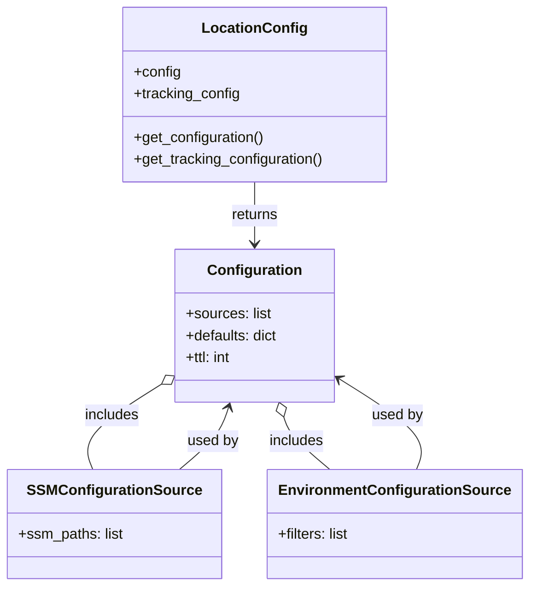

# Diagram: common/location_service/location_service/loc/config.py

> Auto-generated by Obscura crawlers

## Mermaid

### SVG

<svg id="container" width="560.3515625" xmlns="http://www.w3.org/2000/svg" class="classDiagram" height="644" viewBox="0 0 560.3515625 644" role="graphics-document document" aria-roledescription="class"><g><defs><marker id="container_class-aggregationStart" class="marker aggregation class" refX="18" refY="7" markerWidth="190" markerHeight="240" orient="auto"><path d="M 18,7 L9,13 L1,7 L9,1 Z"></path></marker></defs><defs><marker id="container_class-aggregationEnd" class="marker aggregation class" refX="1" refY="7" markerWidth="20" markerHeight="28" orient="auto"><path d="M 18,7 L9,13 L1,7 L9,1 Z"></path></marker></defs><defs><marker id="container_class-extensionStart" class="marker extension class" refX="18" refY="7" markerWidth="190" markerHeight="240" orient="auto"><path d="M 1,7 L18,13 V 1 Z"></path></marker></defs><defs><marker id="container_class-extensionEnd" class="marker extension class" refX="1" refY="7" markerWidth="20" markerHeight="28" orient="auto"><path d="M 1,1 V 13 L18,7 Z"></path></marker></defs><defs><marker id="container_class-compositionStart" class="marker composition class" refX="18" refY="7" markerWidth="190" markerHeight="240" orient="auto"><path d="M 18,7 L9,13 L1,7 L9,1 Z"></path></marker></defs><defs><marker id="container_class-compositionEnd" class="marker composition class" refX="1" refY="7" markerWidth="20" markerHeight="28" orient="auto"><path d="M 18,7 L9,13 L1,7 L9,1 Z"></path></marker></defs><defs><marker id="container_class-dependencyStart" class="marker dependency class" refX="6" refY="7" markerWidth="190" markerHeight="240" orient="auto"><path d="M 5,7 L9,13 L1,7 L9,1 Z"></path></marker></defs><defs><marker id="container_class-dependencyEnd" class="marker dependency class" refX="13" refY="7" markerWidth="20" markerHeight="28" orient="auto"><path d="M 18,7 L9,13 L14,7 L9,1 Z"></path></marker></defs><defs><marker id="container_class-lollipopStart" class="marker lollipop class" refX="13" refY="7" markerWidth="190" markerHeight="240" orient="auto"><circle stroke="black" fill="transparent" cx="7" cy="7" r="6"></circle></marker></defs><defs><marker id="container_class-lollipopEnd" class="marker lollipop class" refX="1" refY="7" markerWidth="190" markerHeight="240" orient="auto"><circle stroke="black" fill="transparent" cx="7" cy="7" r="6"></circle></marker></defs><g class="root"><g class="clusters"></g><g class="edgePaths"><path d="M271.318,200L271.318,206.167C271.318,212.333,271.318,224.667,271.318,236C271.318,247.333,271.318,257.667,271.318,262.833L271.318,268" id="id_LocationConfig_Configuration_1" class="edge-thickness-normal edge-pattern-solid relation" style=";;;" data-edge="true" data-et="edge" data-id="id_LocationConfig_Configuration_1" data-points="W3sieCI6MjcxLjMxODM1OTM3NSwieSI6MjAwfSx7IngiOjI3MS4zMTgzNTkzNzUsInkiOjIzN30seyJ4IjoyNzEuMzE4MzU5Mzc1LCJ5IjoyNzR9XQ==" marker-end="url(#container_class-dependencyEnd)"></path><path d="M168.71,424.017L154.467,433.18C140.223,442.344,111.737,460.672,100.003,476.003C88.27,491.333,93.29,503.667,95.8,509.833L98.31,516" id="id_Configuration_SSMConfigurationSource_2" class="edge-thickness-normal edge-pattern-solid relation" style=";;;" data-edge="true" data-et="edge" data-id="id_Configuration_SSMConfigurationSource_2" data-points="W3sieCI6MTgzLjIxNjc5Njg3NSwieSI6NDE0LjY4MzA1NDQ5MTA3Mzl9LHsieCI6ODMuMjUsInkiOjQ3OX0seyJ4Ijo5OC4zMDk1NjAyNDQ4NDUzNiwieSI6NTE2fV0=" marker-start="url(#container_class-aggregationStart)"></path><path d="M304.077,458.399L305.197,461.833C306.318,465.266,308.558,472.133,316.615,481.733C324.672,491.333,338.544,503.667,345.481,509.833L352.417,516" id="id_Configuration_EnvironmentConfigurationSource_3" class="edge-thickness-normal edge-pattern-solid relation" style=";;;" data-edge="true" data-et="edge" data-id="id_Configuration_EnvironmentConfigurationSource_3" data-points="W3sieCI6Mjk4LjcyNjI4ODA5NDAwODMsInkiOjQ0Mn0seyJ4IjozMTAuNzk4ODI4MTI1LCJ5Ijo0Nzl9LHsieCI6MzUyLjQxNzEyMzA2NzAxMDMsInkiOjUxNn1d" marker-start="url(#container_class-aggregationStart)"></path><path d="M190.22,516L197.156,509.833C204.092,503.667,217.965,491.333,226.603,479.951C235.242,468.568,238.645,458.136,240.347,452.92L242.049,447.704" id="id_SSMConfigurationSource_Configuration_4" class="edge-thickness-normal edge-pattern-solid relation" style=";;;" data-edge="true" data-et="edge" data-id="id_SSMConfigurationSource_Configuration_4" data-points="W3sieCI6MTkwLjIxOTU5NTY4Mjk4OTY4LCJ5Ijo1MTZ9LHsieCI6MjMxLjgzNzg5MDYyNSwieSI6NDc5fSx7IngiOjI0My45MTA0MzA2NTU5OTE3NSwieSI6NDQyfV0=" marker-end="url(#container_class-dependencyEnd)"></path><path d="M444.327,516L446.837,509.833C449.347,503.667,454.367,491.333,441.057,474.988C427.746,458.643,396.106,438.286,380.286,428.108L364.466,417.929" id="id_EnvironmentConfigurationSource_Configuration_5" class="edge-thickness-normal edge-pattern-solid relation" style=";;;" data-edge="true" data-et="edge" data-id="id_EnvironmentConfigurationSource_Configuration_5" data-points="W3sieCI6NDQ0LjMyNzE1ODUwNTE1NDYsInkiOjUxNn0seyJ4Ijo0NTkuMzg2NzE4NzUsInkiOjQ3OX0seyJ4IjozNTkuNDE5OTIxODc1LCJ5Ijo0MTQuNjgzMDU0NDkxMDczOX1d" marker-end="url(#container_class-dependencyEnd)"></path></g><g class="edgeLabels"><g class="edgeLabel" transform="translate(271.318359375, 237)"><g class="label" data-id="id_LocationConfig_Configuration_1" transform="translate(-26.265625, -12)"><foreignObject width="52.53125" height="24">

returns

</foreignObject></g></g><g class="edgeLabel" transform="translate(116.43599, 457.64869)"><g class="label" data-id="id_Configuration_SSMConfigurationSource_2" transform="translate(-30.6484375, -12)"><foreignObject width="61.296875" height="24">

includes

</foreignObject></g></g><g class="edgeLabel" transform="translate(317.06452, 484.5704)"><g class="label" data-id="id_Configuration_EnvironmentConfigurationSource_3" transform="translate(-30.6484375, -12)"><foreignObject width="61.296875" height="24">

includes

</foreignObject></g></g><g class="edgeLabel" transform="translate(225.5722, 484.5704)"><g class="label" data-id="id_SSMConfigurationSource_Configuration_4" transform="translate(-28.3125, -12)"><foreignObject width="56.625" height="24">

used by

</foreignObject></g></g><g class="edgeLabel" transform="translate(459.38671875, 479)"><g class="label" data-id="id_EnvironmentConfigurationSource_Configuration_5" transform="translate(-28.3125, -12)"><foreignObject width="56.625" height="24">

used by

</foreignObject></g></g></g><g class="nodes"><g class="node default" id="classId-LocationConfig-0" transform="translate(271.318359375, 104)"><g class="basic label-container"><path d="M-144.72265625 -96 L144.72265625 -96 L144.72265625 96 L-144.72265625 96" stroke="none" stroke-width="0" fill="#ECECFF" style=""></path><path d="M-144.72265625 -96 C-53.4553799520089 -96, 37.811896345982206 -96, 144.72265625 -96 M-144.72265625 -96 C-68.75128396235979 -96, 7.220088325280415 -96, 144.72265625 -96 M144.72265625 -96 C144.72265625 -44.89079179524316, 144.72265625 6.218416409513679, 144.72265625 96 M144.72265625 -96 C144.72265625 -46.03229353435921, 144.72265625 3.9354129312815758, 144.72265625 96 M144.72265625 96 C82.66319862999391 96, 20.60374100998783 96, -144.72265625 96 M144.72265625 96 C38.91574586795225 96, -66.8911645140955 96, -144.72265625 96 M-144.72265625 96 C-144.72265625 24.954261207590733, -144.72265625 -46.091477584818534, -144.72265625 -96 M-144.72265625 96 C-144.72265625 34.13672179027112, -144.72265625 -27.726556419457765, -144.72265625 -96" stroke="#9370DB" stroke-width="1.3" fill="none" stroke-dasharray="0 0" style=""></path></g><g class="annotation-group text" transform="translate(0, -72)"></g><g class="label-group text" transform="translate(-54.2734375, -72)"><g class="label" style="font-weight: bolder" transform="translate(0,-12)"><foreignObject width="108.546875" height="24">

LocationConfig

</foreignObject></g></g><g class="members-group text" transform="translate(-132.72265625, -24)"><g class="label" style="" transform="translate(0,-12)"><foreignObject width="51.5625" height="24">

+config

</foreignObject></g><g class="label" style="" transform="translate(0,12)"><foreignObject width="117.6875" height="24">

+tracking_config

</foreignObject></g></g><g class="methods-group text" transform="translate(-132.72265625, 48)"><g class="label" style="" transform="translate(0,-12)"><foreignObject width="144.96875" height="24">

+get_configuration()

</foreignObject></g><g class="label" style="" transform="translate(0,12)"><foreignObject width="211.171875" height="24">

+get_tracking_configuration()

</foreignObject></g></g><g class="divider" style=""><path d="M-144.72265625 -48 C-82.9720857557348 -48, -21.22151526146959 -48, 144.72265625 -48 M-144.72265625 -48 C-53.896116061715176 -48, 36.93042412656965 -48, 144.72265625 -48" stroke="#9370DB" stroke-width="1.3" fill="none" stroke-dasharray="0 0" style=""></path></g><g class="divider" style=""><path d="M-144.72265625 24 C-52.9141394460823 24, 38.894377357835396 24, 144.72265625 24 M-144.72265625 24 C-31.496186681167046 24, 81.73028288766591 24, 144.72265625 24" stroke="#9370DB" stroke-width="1.3" fill="none" stroke-dasharray="0 0" style=""></path></g></g><g class="node default" id="classId-Configuration-1" transform="translate(271.318359375, 358)"><g class="basic label-container"><path d="M-88.1015625 -84 L88.1015625 -84 L88.1015625 84 L-88.1015625 84" stroke="none" stroke-width="0" fill="#ECECFF" style=""></path><path d="M-88.1015625 -84 C-29.771570035831253 -84, 28.558422428337494 -84, 88.1015625 -84 M-88.1015625 -84 C-49.61622205885892 -84, -11.130881617717833 -84, 88.1015625 -84 M88.1015625 -84 C88.1015625 -39.30051588867994, 88.1015625 5.398968222640121, 88.1015625 84 M88.1015625 -84 C88.1015625 -46.708784671963855, 88.1015625 -9.41756934392771, 88.1015625 84 M88.1015625 84 C44.90782779486603 84, 1.71409308973206 84, -88.1015625 84 M88.1015625 84 C33.88453080049695 84, -20.332500899006106 84, -88.1015625 84 M-88.1015625 84 C-88.1015625 37.747769989635785, -88.1015625 -8.50446002072843, -88.1015625 -84 M-88.1015625 84 C-88.1015625 35.34311681186943, -88.1015625 -13.313766376261142, -88.1015625 -84" stroke="#9370DB" stroke-width="1.3" fill="none" stroke-dasharray="0 0" style=""></path></g><g class="annotation-group text" transform="translate(0, -60)"></g><g class="label-group text" transform="translate(-49.375, -60)"><g class="label" style="font-weight: bolder" transform="translate(0,-12)"><foreignObject width="98.75" height="24">

Configuration

</foreignObject></g></g><g class="members-group text" transform="translate(-76.1015625, -12)"><g class="label" style="" transform="translate(0,-12)"><foreignObject width="93.859375" height="24">

+sources: list

</foreignObject></g><g class="label" style="" transform="translate(0,12)"><foreignObject width="102.828125" height="24">

+defaults: dict

</foreignObject></g><g class="label" style="" transform="translate(0,36)"><foreignObject width="51.890625" height="24">

+ttl: int

</foreignObject></g></g><g class="methods-group text" transform="translate(-76.1015625, 84)"></g><g class="divider" style=""><path d="M-88.1015625 -36 C-33.51353651296499 -36, 21.07448947407002 -36, 88.1015625 -36 M-88.1015625 -36 C-27.733069405051516 -36, 32.63542368989697 -36, 88.1015625 -36" stroke="#9370DB" stroke-width="1.3" fill="none" stroke-dasharray="0 0" style=""></path></g><g class="divider" style=""><path d="M-88.1015625 60 C-36.90324644227632 60, 14.29506961544736 60, 88.1015625 60 M-88.1015625 60 C-26.202696071927114 60, 35.69617035614577 60, 88.1015625 60" stroke="#9370DB" stroke-width="1.3" fill="none" stroke-dasharray="0 0" style=""></path></g></g><g class="node default" id="classId-SSMConfigurationSource-2" transform="translate(122.73046875, 576)"><g class="basic label-container"><path d="M-114.73046875 -60 L114.73046875 -60 L114.73046875 60 L-114.73046875 60" stroke="none" stroke-width="0" fill="#ECECFF" style=""></path><path d="M-114.73046875 -60 C-43.922617836889 -60, 26.885233076221994 -60, 114.73046875 -60 M-114.73046875 -60 C-63.36324641409196 -60, -11.996024078183922 -60, 114.73046875 -60 M114.73046875 -60 C114.73046875 -19.204787638892363, 114.73046875 21.590424722215275, 114.73046875 60 M114.73046875 -60 C114.73046875 -23.60862942002734, 114.73046875 12.782741159945317, 114.73046875 60 M114.73046875 60 C26.995184124209942 60, -60.740100501580116 60, -114.73046875 60 M114.73046875 60 C51.97543327366101 60, -10.779602202677978 60, -114.73046875 60 M-114.73046875 60 C-114.73046875 26.137452009651945, -114.73046875 -7.725095980696111, -114.73046875 -60 M-114.73046875 60 C-114.73046875 25.82117682638212, -114.73046875 -8.357646347235757, -114.73046875 -60" stroke="#9370DB" stroke-width="1.3" fill="none" stroke-dasharray="0 0" style=""></path></g><g class="annotation-group text" transform="translate(0, -36)"></g><g class="label-group text" transform="translate(-89.4453125, -36)"><g class="label" style="font-weight: bolder" transform="translate(0,-12)"><foreignObject width="178.890625" height="24">

SSMConfigurationSource

</foreignObject></g></g><g class="members-group text" transform="translate(-102.73046875, 12)"><g class="label" style="" transform="translate(0,-12)"><foreignObject width="116.015625" height="24">

+ssm_paths: list

</foreignObject></g></g><g class="methods-group text" transform="translate(-102.73046875, 60)"></g><g class="divider" style=""><path d="M-114.73046875 -12 C-61.885838518718266 -12, -9.041208287436532 -12, 114.73046875 -12 M-114.73046875 -12 C-55.91696728753614 -12, 2.896534174927723 -12, 114.73046875 -12" stroke="#9370DB" stroke-width="1.3" fill="none" stroke-dasharray="0 0" style=""></path></g><g class="divider" style=""><path d="M-114.73046875 36 C-23.229184263141605 36, 68.27210022371679 36, 114.73046875 36 M-114.73046875 36 C-61.7574882638892 36, -8.784507777778401 36, 114.73046875 36" stroke="#9370DB" stroke-width="1.3" fill="none" stroke-dasharray="0 0" style=""></path></g></g><g class="node default" id="classId-EnvironmentConfigurationSource-3" transform="translate(419.90625, 576)"><g class="basic label-container"><path d="M-132.4453125 -60 L132.4453125 -60 L132.4453125 60 L-132.4453125 60" stroke="none" stroke-width="0" fill="#ECECFF" style=""></path><path d="M-132.4453125 -60 C-52.460236096568664 -60, 27.52484030686267 -60, 132.4453125 -60 M-132.4453125 -60 C-63.64289618966353 -60, 5.159520120672937 -60, 132.4453125 -60 M132.4453125 -60 C132.4453125 -35.45866629000039, 132.4453125 -10.917332580000775, 132.4453125 60 M132.4453125 -60 C132.4453125 -16.729654237361878, 132.4453125 26.540691525276245, 132.4453125 60 M132.4453125 60 C28.285233844876714 60, -75.87484481024657 60, -132.4453125 60 M132.4453125 60 C52.00591688742254 60, -28.433478725154913 60, -132.4453125 60 M-132.4453125 60 C-132.4453125 20.35946277979719, -132.4453125 -19.281074440405618, -132.4453125 -60 M-132.4453125 60 C-132.4453125 27.41055440189735, -132.4453125 -5.178891196205299, -132.4453125 -60" stroke="#9370DB" stroke-width="1.3" fill="none" stroke-dasharray="0 0" style=""></path></g><g class="annotation-group text" transform="translate(0, -36)"></g><g class="label-group text" transform="translate(-120.4453125, -36)"><g class="label" style="font-weight: bolder" transform="translate(0,-12)"><foreignObject width="240.890625" height="24">

EnvironmentConfigurationSource

</foreignObject></g></g><g class="members-group text" transform="translate(-120.4453125, 12)"><g class="label" style="" transform="translate(0,-12)"><foreignObject width="79.828125" height="24">

+filters: list

</foreignObject></g></g><g class="methods-group text" transform="translate(-120.4453125, 60)"></g><g class="divider" style=""><path d="M-132.4453125 -12 C-30.546980717625615 -12, 71.35135106474877 -12, 132.4453125 -12 M-132.4453125 -12 C-45.91496221248843 -12, 40.615388075023134 -12, 132.4453125 -12" stroke="#9370DB" stroke-width="1.3" fill="none" stroke-dasharray="0 0" style=""></path></g><g class="divider" style=""><path d="M-132.4453125 36 C-31.13352873691423 36, 70.17825502617154 36, 132.4453125 36 M-132.4453125 36 C-47.57307108367192 36, 37.29917033265616 36, 132.4453125 36" stroke="#9370DB" stroke-width="1.3" fill="none" stroke-dasharray="0 0" style=""></path></g></g></g></g></g></svg>
