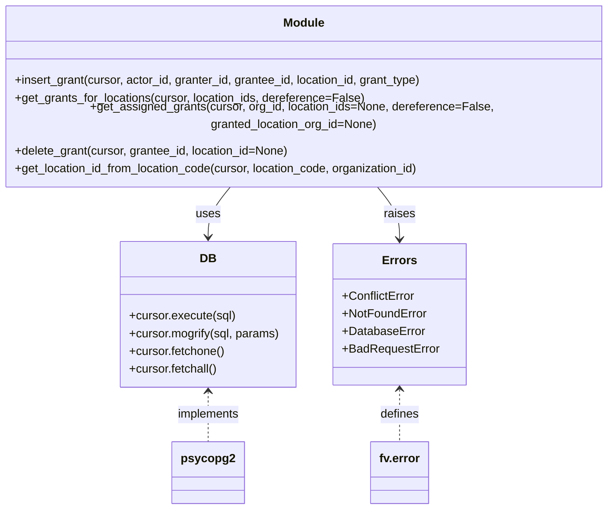

# Diagram: common/location_service/location_service/loc/db/grant.py


> Auto-generated by Obscura crawlers

## Diagram 1



### SVG

<svg id="container" width="845.84375" xmlns="http://www.w3.org/2000/svg" class="classDiagram" height="668" viewBox="0 0 845.84375 668" role="graphics-document document" aria-roledescription="class"><style>#container{font-family:"trebuchet ms",verdana,arial,sans-serif;font-size:16px;fill:#333;}@keyframes edge-animation-frame{from{stroke-dashoffset:0;}}@keyframes dash{to{stroke-dashoffset:0;}}#container .edge-animation-slow{stroke-dasharray:9,5!important;stroke-dashoffset:900;animation:dash 50s linear infinite;stroke-linecap:round;}#container .edge-animation-fast{stroke-dasharray:9,5!important;stroke-dashoffset:900;animation:dash 20s linear infinite;stroke-linecap:round;}#container .error-icon{fill:#552222;}#container .error-text{fill:#552222;stroke:#552222;}#container .edge-thickness-normal{stroke-width:1px;}#container .edge-thickness-thick{stroke-width:3.5px;}#container .edge-pattern-solid{stroke-dasharray:0;}#container .edge-thickness-invisible{stroke-width:0;fill:none;}#container .edge-pattern-dashed{stroke-dasharray:3;}#container .edge-pattern-dotted{stroke-dasharray:2;}#container .marker{fill:#333333;stroke:#333333;}#container .marker.cross{stroke:#333333;}#container svg{font-family:"trebuchet ms",verdana,arial,sans-serif;font-size:16px;}#container p{margin:0;}#container g.classGroup text{fill:#9370DB;stroke:none;font-family:"trebuchet ms",verdana,arial,sans-serif;font-size:10px;}#container g.classGroup text .title{font-weight:bolder;}#container .nodeLabel,#container .edgeLabel{color:#131300;}#container .edgeLabel .label rect{fill:#ECECFF;}#container .label text{fill:#131300;}#container .labelBkg{background:#ECECFF;}#container .edgeLabel .label span{background:#ECECFF;}#container .classTitle{font-weight:bolder;}#container .node rect,#container .node circle,#container .node ellipse,#container .node polygon,#container .node path{fill:#ECECFF;stroke:#9370DB;stroke-width:1px;}#container .divider{stroke:#9370DB;stroke-width:1;}#container g.clickable{cursor:pointer;}#container g.classGroup rect{fill:#ECECFF;stroke:#9370DB;}#container g.classGroup line{stroke:#9370DB;stroke-width:1;}#container .classLabel .box{stroke:none;stroke-width:0;fill:#ECECFF;opacity:0.5;}#container .classLabel .label{fill:#9370DB;font-size:10px;}#container .relation{stroke:#333333;stroke-width:1;fill:none;}#container .dashed-line{stroke-dasharray:3;}#container .dotted-line{stroke-dasharray:1 2;}#container #compositionStart,#container .composition{fill:#333333!important;stroke:#333333!important;stroke-width:1;}#container #compositionEnd,#container .composition{fill:#333333!important;stroke:#333333!important;stroke-width:1;}#container #dependencyStart,#container .dependency{fill:#333333!important;stroke:#333333!important;stroke-width:1;}#container #dependencyStart,#container .dependency{fill:#333333!important;stroke:#333333!important;stroke-width:1;}#container #extensionStart,#container .extension{fill:transparent!important;stroke:#333333!important;stroke-width:1;}#container #extensionEnd,#container .extension{fill:transparent!important;stroke:#333333!important;stroke-width:1;}#container #aggregationStart,#container .aggregation{fill:transparent!important;stroke:#333333!important;stroke-width:1;}#container #aggregationEnd,#container .aggregation{fill:transparent!important;stroke:#333333!important;stroke-width:1;}#container #lollipopStart,#container .lollipop{fill:#ECECFF!important;stroke:#333333!important;stroke-width:1;}#container #lollipopEnd,#container .lollipop{fill:#ECECFF!important;stroke:#333333!important;stroke-width:1;}#container .edgeTerminals{font-size:11px;line-height:initial;}#container .classTitleText{text-anchor:middle;font-size:18px;fill:#333;}#container .label-icon{display:inline-block;height:1em;overflow:visible;vertical-align:-0.125em;}#container .node .label-icon path{fill:currentColor;stroke:revert;stroke-width:revert;}#container :root{--mermaid-font-family:"trebuchet ms",verdana,arial,sans-serif;}</style><g><defs><marker id="container_class-aggregationStart" class="marker aggregation class" refX="18" refY="7" markerWidth="190" markerHeight="240" orient="auto"><path d="M 18,7 L9,13 L1,7 L9,1 Z"></path></marker></defs><defs><marker id="container_class-aggregationEnd" class="marker aggregation class" refX="1" refY="7" markerWidth="20" markerHeight="28" orient="auto"><path d="M 18,7 L9,13 L1,7 L9,1 Z"></path></marker></defs><defs><marker id="container_class-extensionStart" class="marker extension class" refX="18" refY="7" markerWidth="190" markerHeight="240" orient="auto"><path d="M 1,7 L18,13 V 1 Z"></path></marker></defs><defs><marker id="container_class-extensionEnd" class="marker extension class" refX="1" refY="7" markerWidth="20" markerHeight="28" orient="auto"><path d="M 1,1 V 13 L18,7 Z"></path></marker></defs><defs><marker id="container_class-compositionStart" class="marker composition class" refX="18" refY="7" markerWidth="190" markerHeight="240" orient="auto"><path d="M 18,7 L9,13 L1,7 L9,1 Z"></path></marker></defs><defs><marker id="container_class-compositionEnd" class="marker composition class" refX="1" refY="7" markerWidth="20" markerHeight="28" orient="auto"><path d="M 18,7 L9,13 L1,7 L9,1 Z"></path></marker></defs><defs><marker id="container_class-dependencyStart" class="marker dependency class" refX="6" refY="7" markerWidth="190" markerHeight="240" orient="auto"><path d="M 5,7 L9,13 L1,7 L9,1 Z"></path></marker></defs><defs><marker id="container_class-dependencyEnd" class="marker dependency class" refX="13" refY="7" markerWidth="20" markerHeight="28" orient="auto"><path d="M 18,7 L9,13 L14,7 L9,1 Z"></path></marker></defs><defs><marker id="container_class-lollipopStart" class="marker lollipop class" refX="13" refY="7" markerWidth="190" markerHeight="240" orient="auto"><circle stroke="black" fill="transparent" cx="7" cy="7" r="6"></circle></marker></defs><defs><marker id="container_class-lollipopEnd" class="marker lollipop class" refX="1" refY="7" markerWidth="190" markerHeight="240" orient="auto"><circle stroke="black" fill="transparent" cx="7" cy="7" r="6"></circle></marker></defs><g class="root"><g class="clusters"></g><g class="edgePaths"><path d="M326.121,230L320.743,236.167C315.365,242.333,304.609,254.667,299.231,266C293.854,277.333,293.854,287.667,293.854,292.833L293.854,298" id="id_Module_DB_1" class="edge-thickness-normal edge-pattern-solid relation" style=";;;" data-edge="true" data-et="edge" data-id="id_Module_DB_1" data-points="W3sieCI6MzI2LjEyMDYwNTQ2ODc1LCJ5IjoyMzB9LHsieCI6MjkzLjg1MzUxNTYyNSwieSI6MjY3fSx7IngiOjI5My44NTM1MTU2MjUsInkiOjMwNH1d" marker-end="url(#container_class-dependencyEnd)"></path><path d="M519.723,230L525.101,236.167C530.479,242.333,541.235,254.667,546.612,266.5C551.99,278.333,551.99,289.667,551.99,295.333L551.99,301" id="id_Module_Errors_2" class="edge-thickness-normal edge-pattern-solid relation" style=";;;" data-edge="true" data-et="edge" data-id="id_Module_Errors_2" data-points="W3sieCI6NTE5LjcyMzE0NDUzMTI1LCJ5IjoyMzB9LHsieCI6NTUxLjk5MDIzNDM3NSwieSI6MjY3fSx7IngiOjU1MS45OTAyMzQzNzUsInkiOjMwN31d" marker-end="url(#container_class-dependencyEnd)"></path><path d="M293.854,508L293.854,513.167C293.854,518.333,293.854,528.667,293.854,540C293.854,551.333,293.854,563.667,293.854,569.833L293.854,576" id="id_DB_psycopg2_3" class="edge-thickness-normal edge-pattern-dashed relation" style=";;;" data-edge="true" data-et="edge" data-id="id_DB_psycopg2_3" data-points="W3sieCI6MjkzLjg1MzUxNTYyNSwieSI6NTAyfSx7IngiOjI5My44NTM1MTU2MjUsInkiOjUzOX0seyJ4IjoyOTMuODUzNTE1NjI1LCJ5Ijo1NzZ9XQ==" marker-start="url(#container_class-dependencyStart)"></path><path d="M551.99,505L551.99,510.667C551.99,516.333,551.99,527.667,551.99,539.5C551.99,551.333,551.99,563.667,551.99,569.833L551.99,576" id="id_Errors_fv.error_4" class="edge-thickness-normal edge-pattern-dashed relation" style=";;;" data-edge="true" data-et="edge" data-id="id_Errors_fv.error_4" data-points="W3sieCI6NTUxLjk5MDIzNDM3NSwieSI6NDk5fSx7IngiOjU1MS45OTAyMzQzNzUsInkiOjUzOX0seyJ4Ijo1NTEuOTkwMjM0Mzc1LCJ5Ijo1NzZ9XQ==" marker-start="url(#container_class-dependencyStart)"></path></g><g class="edgeLabels"><g class="edgeLabel" transform="translate(293.853515625, 267)"><g class="label" data-id="id_Module_DB_1" transform="translate(-16.4921875, -12)"><foreignObject width="32.984375" height="24"><div xmlns="http://www.w3.org/1999/xhtml" class="labelBkg" style="display: table-cell; white-space: nowrap; line-height: 1.5; max-width: 200px; text-align: center;"><span class="edgeLabel"><p>uses</p></span></div></foreignObject></g></g><g class="edgeLabel" transform="translate(551.990234375, 267)"><g class="label" data-id="id_Module_Errors_2" transform="translate(-21.25, -12)"><foreignObject width="42.5" height="24"><div xmlns="http://www.w3.org/1999/xhtml" class="labelBkg" style="display: table-cell; white-space: nowrap; line-height: 1.5; max-width: 200px; text-align: center;"><span class="edgeLabel"><p>raises</p></span></div></foreignObject></g></g><g class="edgeLabel" transform="translate(293.853515625, 539)"><g class="label" data-id="id_DB_psycopg2_3" transform="translate(-43.0625, -12)"><foreignObject width="86.125" height="24"><div xmlns="http://www.w3.org/1999/xhtml" class="labelBkg" style="display: table-cell; white-space: nowrap; line-height: 1.5; max-width: 200px; text-align: center;"><span class="edgeLabel"><p>implements</p></span></div></foreignObject></g></g><g class="edgeLabel" transform="translate(551.990234375, 539)"><g class="label" data-id="id_Errors_fv.error_4" transform="translate(-26.53125, -12)"><foreignObject width="53.0625" height="24"><div xmlns="http://www.w3.org/1999/xhtml" class="labelBkg" style="display: table-cell; white-space: nowrap; line-height: 1.5; max-width: 200px; text-align: center;"><span class="edgeLabel"><p>defines</p></span></div></foreignObject></g></g></g><g class="nodes"><g class="node default" id="classId-Module-0" transform="translate(422.921875, 119)"><g class="basic label-container"><path d="M-414.921875 -111 L414.921875 -111 L414.921875 111 L-414.921875 111" stroke="none" stroke-width="0" fill="#ECECFF" style=""></path><path d="M-414.921875 -111 C-228.88297886296638 -111, -42.844082725932765 -111, 414.921875 -111 M-414.921875 -111 C-103.25328488904063 -111, 208.41530522191874 -111, 414.921875 -111 M414.921875 -111 C414.921875 -29.48771547174462, 414.921875 52.02456905651076, 414.921875 111 M414.921875 -111 C414.921875 -56.38409419792759, 414.921875 -1.7681883958551765, 414.921875 111 M414.921875 111 C159.2622023262998 111, -96.39747034740037 111, -414.921875 111 M414.921875 111 C127.16998544842289 111, -160.58190410315422 111, -414.921875 111 M-414.921875 111 C-414.921875 53.18847885071107, -414.921875 -4.623042298577857, -414.921875 -111 M-414.921875 111 C-414.921875 23.1247012500737, -414.921875 -64.7505974998526, -414.921875 -111" stroke="#9370DB" stroke-width="1.3" fill="none" stroke-dasharray="0 0" style=""></path></g><g class="annotation-group text" transform="translate(0, -87)"></g><g class="label-group text" transform="translate(-27.09375, -87)"><g class="label" style="font-weight: bolder" transform="translate(0,-12)"><foreignObject width="54.1875" height="24"><div xmlns="http://www.w3.org/1999/xhtml" style="display: table-cell; white-space: nowrap; line-height: 1.5; max-width: 104px; text-align: center;"><span class="nodeLabel markdown-node-label" style=""><p>Module</p></span></div></foreignObject></g></g><g class="members-group text" transform="translate(-402.921875, -39)"></g><g class="methods-group text" transform="translate(-402.921875, -9)"><g class="label" style="" transform="translate(0,-12)"><foreignObject width="559.796875" height="24"><div xmlns="http://www.w3.org/1999/xhtml" style="display: table-cell; white-space: nowrap; line-height: 1.5; max-width: 617px; text-align: center;"><span class="nodeLabel markdown-node-label" style=""><p>+insert_grant(cursor, actor_id, granter_id, grantee_id, location_id, grant_type)</p></span></div></foreignObject></g><g class="label" style="" transform="translate(0,12)"><foreignObject width="476.96875" height="24"><div xmlns="http://www.w3.org/1999/xhtml" style="display: table-cell; white-space: nowrap; line-height: 1.5; max-width: 534px; text-align: center;"><span class="nodeLabel markdown-node-label" style=""><p>+get_grants_for_locations(cursor, location_ids, dereference=False)</p></span></div></foreignObject></g><g class="label" style="" transform="translate(0,36)"><foreignObject width="778.75" height="24"><div xmlns="http://www.w3.org/1999/xhtml" style="display: table-cell; white-space: nowrap; line-height: 1.5; max-width: 836px; text-align: center;"><span class="nodeLabel markdown-node-label" style=""><p>+get_assigned_grants(cursor, org_id, location_ids=None, dereference=False, granted_location_org_id=None)</p></span></div></foreignObject></g><g class="label" style="" transform="translate(0,60)"><foreignObject width="375.765625" height="24"><div xmlns="http://www.w3.org/1999/xhtml" style="display: table-cell; white-space: nowrap; line-height: 1.5; max-width: 433px; text-align: center;"><span class="nodeLabel markdown-node-label" style=""><p>+delete_grant(cursor, grantee_id, location_id=None)</p></span></div></foreignObject></g><g class="label" style="" transform="translate(0,84)"><foreignObject width="558.328125" height="24"><div xmlns="http://www.w3.org/1999/xhtml" style="display: table-cell; white-space: nowrap; line-height: 1.5; max-width: 616px; text-align: center;"><span class="nodeLabel markdown-node-label" style=""><p>+get_location_id_from_location_code(cursor, location_code, organization_id)</p></span></div></foreignObject></g></g><g class="divider" style=""><path d="M-414.921875 -63 C-124.56816373427489 -63, 165.78554753145022 -63, 414.921875 -63 M-414.921875 -63 C-195.80162137836538 -63, 23.318632243269235 -63, 414.921875 -63" stroke="#9370DB" stroke-width="1.3" fill="none" stroke-dasharray="0 0" style=""></path></g><g class="divider" style=""><path d="M-414.921875 -39 C-129.0605976831074 -39, 156.8006796337852 -39, 414.921875 -39 M-414.921875 -39 C-247.69088419664973 -39, -80.45989339329947 -39, 414.921875 -39" stroke="#9370DB" stroke-width="1.3" fill="none" stroke-dasharray="0 0" style=""></path></g></g><g class="node default" id="classId-DB-1" transform="translate(293.853515625, 403)"><g class="basic label-container"><path d="M-119.76171875 -99 L119.76171875 -99 L119.76171875 99 L-119.76171875 99" stroke="none" stroke-width="0" fill="#ECECFF" style=""></path><path d="M-119.76171875 -99 C-55.68321989893829 -99, 8.39527895212342 -99, 119.76171875 -99 M-119.76171875 -99 C-56.16541994139196 -99, 7.43087886721608 -99, 119.76171875 -99 M119.76171875 -99 C119.76171875 -59.08692120503995, 119.76171875 -19.1738424100799, 119.76171875 99 M119.76171875 -99 C119.76171875 -28.110706805430496, 119.76171875 42.77858638913901, 119.76171875 99 M119.76171875 99 C34.59259528094475 99, -50.5765281881105 99, -119.76171875 99 M119.76171875 99 C24.966703114270132 99, -69.82831252145974 99, -119.76171875 99 M-119.76171875 99 C-119.76171875 36.140109953834575, -119.76171875 -26.71978009233085, -119.76171875 -99 M-119.76171875 99 C-119.76171875 35.4860383862239, -119.76171875 -28.027923227552193, -119.76171875 -99" stroke="#9370DB" stroke-width="1.3" fill="none" stroke-dasharray="0 0" style=""></path></g><g class="annotation-group text" transform="translate(0, -75)"></g><g class="label-group text" transform="translate(-10.1484375, -75)"><g class="label" style="font-weight: bolder" transform="translate(0,-12)"><foreignObject width="20.296875" height="24"><div xmlns="http://www.w3.org/1999/xhtml" style="display: table-cell; white-space: nowrap; line-height: 1.5; max-width: 70px; text-align: center;"><span class="nodeLabel markdown-node-label" style=""><p>DB</p></span></div></foreignObject></g></g><g class="members-group text" transform="translate(-107.76171875, -27)"></g><g class="methods-group text" transform="translate(-107.76171875, 3)"><g class="label" style="" transform="translate(0,-12)"><foreignObject width="144.1875" height="24"><div xmlns="http://www.w3.org/1999/xhtml" style="display: table-cell; white-space: nowrap; line-height: 1.5; max-width: 202px; text-align: center;"><span class="nodeLabel markdown-node-label" style=""><p>+cursor.execute(sql)</p></span></div></foreignObject></g><g class="label" style="" transform="translate(0,12)"><foreignObject width="205.375" height="24"><div xmlns="http://www.w3.org/1999/xhtml" style="display: table-cell; white-space: nowrap; line-height: 1.5; max-width: 263px; text-align: center;"><span class="nodeLabel markdown-node-label" style=""><p>+cursor.mogrify(sql, params)</p></span></div></foreignObject></g><g class="label" style="" transform="translate(0,36)"><foreignObject width="130.34375" height="24"><div xmlns="http://www.w3.org/1999/xhtml" style="display: table-cell; white-space: nowrap; line-height: 1.5; max-width: 188px; text-align: center;"><span class="nodeLabel markdown-node-label" style=""><p>+cursor.fetchone()</p></span></div></foreignObject></g><g class="label" style="" transform="translate(0,60)"><foreignObject width="120.828125" height="24"><div xmlns="http://www.w3.org/1999/xhtml" style="display: table-cell; white-space: nowrap; line-height: 1.5; max-width: 178px; text-align: center;"><span class="nodeLabel markdown-node-label" style=""><p>+cursor.fetchall()</p></span></div></foreignObject></g></g><g class="divider" style=""><path d="M-119.76171875 -51 C-50.300275152928606 -51, 19.16116844414279 -51, 119.76171875 -51 M-119.76171875 -51 C-46.92995947184589 -51, 25.90179980630822 -51, 119.76171875 -51" stroke="#9370DB" stroke-width="1.3" fill="none" stroke-dasharray="0 0" style=""></path></g><g class="divider" style=""><path d="M-119.76171875 -27 C-54.30891361351695 -27, 11.1438915229661 -27, 119.76171875 -27 M-119.76171875 -27 C-45.44898793540631 -27, 28.863742879187384 -27, 119.76171875 -27" stroke="#9370DB" stroke-width="1.3" fill="none" stroke-dasharray="0 0" style=""></path></g></g><g class="node default" id="classId-Errors-2" transform="translate(551.990234375, 403)"><g class="basic label-container"><path d="M-88.375 -96 L88.375 -96 L88.375 96 L-88.375 96" stroke="none" stroke-width="0" fill="#ECECFF" style=""></path><path d="M-88.375 -96 C-42.61623234156183 -96, 3.1425353168763337 -96, 88.375 -96 M-88.375 -96 C-29.991440987281656 -96, 28.392118025436687 -96, 88.375 -96 M88.375 -96 C88.375 -30.99279199961336, 88.375 34.01441600077328, 88.375 96 M88.375 -96 C88.375 -37.95955273371569, 88.375 20.08089453256862, 88.375 96 M88.375 96 C30.526348162079124 96, -27.322303675841752 96, -88.375 96 M88.375 96 C21.575959669793207 96, -45.223080660413586 96, -88.375 96 M-88.375 96 C-88.375 23.03441712003513, -88.375 -49.93116575992974, -88.375 -96 M-88.375 96 C-88.375 24.12144987067782, -88.375 -47.75710025864436, -88.375 -96" stroke="#9370DB" stroke-width="1.3" fill="none" stroke-dasharray="0 0" style=""></path></g><g class="annotation-group text" transform="translate(0, -72)"></g><g class="label-group text" transform="translate(-21.953125, -72)"><g class="label" style="font-weight: bolder" transform="translate(0,-12)"><foreignObject width="43.90625" height="24"><div xmlns="http://www.w3.org/1999/xhtml" style="display: table-cell; white-space: nowrap; line-height: 1.5; max-width: 93px; text-align: center;"><span class="nodeLabel markdown-node-label" style=""><p>Errors</p></span></div></foreignObject></g></g><g class="members-group text" transform="translate(-76.375, -24)"><g class="label" style="" transform="translate(0,-12)"><foreignObject width="98.546875" height="24"><div xmlns="http://www.w3.org/1999/xhtml" style="display: table-cell; white-space: nowrap; line-height: 1.5; max-width: 157px; text-align: center;"><span class="nodeLabel markdown-node-label" style=""><p>+ConflictError</p></span></div></foreignObject></g><g class="label" style="" transform="translate(0,12)"><foreignObject width="114.734375" height="24"><div xmlns="http://www.w3.org/1999/xhtml" style="display: table-cell; white-space: nowrap; line-height: 1.5; max-width: 173px; text-align: center;"><span class="nodeLabel markdown-node-label" style=""><p>+NotFoundError</p></span></div></foreignObject></g><g class="label" style="" transform="translate(0,36)"><foreignObject width="111.078125" height="24"><div xmlns="http://www.w3.org/1999/xhtml" style="display: table-cell; white-space: nowrap; line-height: 1.5; max-width: 169px; text-align: center;"><span class="nodeLabel markdown-node-label" style=""><p>+DatabaseError</p></span></div></foreignObject></g><g class="label" style="" transform="translate(0,60)"><foreignObject width="130.796875" height="24"><div xmlns="http://www.w3.org/1999/xhtml" style="display: table-cell; white-space: nowrap; line-height: 1.5; max-width: 189px; text-align: center;"><span class="nodeLabel markdown-node-label" style=""><p>+BadRequestError</p></span></div></foreignObject></g></g><g class="methods-group text" transform="translate(-76.375, 96)"></g><g class="divider" style=""><path d="M-88.375 -48 C-20.540223763463302 -48, 47.294552473073395 -48, 88.375 -48 M-88.375 -48 C-46.38582744505879 -48, -4.396654890117574 -48, 88.375 -48" stroke="#9370DB" stroke-width="1.3" fill="none" stroke-dasharray="0 0" style=""></path></g><g class="divider" style=""><path d="M-88.375 72 C-34.579835941089065 72, 19.21532811782187 72, 88.375 72 M-88.375 72 C-22.00080259116119 72, 44.37339481767762 72, 88.375 72" stroke="#9370DB" stroke-width="1.3" fill="none" stroke-dasharray="0 0" style=""></path></g></g><g class="node default" id="classId-psycopg2-3" transform="translate(293.853515625, 618)"><g class="basic label-container"><path d="M-46.234375 -42 L46.234375 -42 L46.234375 42 L-46.234375 42" stroke="none" stroke-width="0" fill="#ECECFF" style=""></path><path d="M-46.234375 -42 C-20.833468179233765 -42, 4.567438641532469 -42, 46.234375 -42 M-46.234375 -42 C-25.028724976244675 -42, -3.8230749524893497 -42, 46.234375 -42 M46.234375 -42 C46.234375 -15.20470532832492, 46.234375 11.59058934335016, 46.234375 42 M46.234375 -42 C46.234375 -15.66395346561027, 46.234375 10.67209306877946, 46.234375 42 M46.234375 42 C11.288523309533211 42, -23.657328380933578 42, -46.234375 42 M46.234375 42 C16.72356316229303 42, -12.787248675413942 42, -46.234375 42 M-46.234375 42 C-46.234375 23.033118752370132, -46.234375 4.066237504740265, -46.234375 -42 M-46.234375 42 C-46.234375 22.146938637283903, -46.234375 2.293877274567805, -46.234375 -42" stroke="#9370DB" stroke-width="1.3" fill="none" stroke-dasharray="0 0" style=""></path></g><g class="annotation-group text" transform="translate(0, -18)"></g><g class="label-group text" transform="translate(-34.234375, -18)"><g class="label" style="font-weight: bolder" transform="translate(0,-12)"><foreignObject width="68.46875" height="24"><div xmlns="http://www.w3.org/1999/xhtml" style="display: table-cell; white-space: nowrap; line-height: 1.5; max-width: 117px; text-align: center;"><span class="nodeLabel markdown-node-label" style=""><p>psycopg2</p></span></div></foreignObject></g></g><g class="members-group text" transform="translate(-34.234375, 30)"></g><g class="methods-group text" transform="translate(-34.234375, 60)"></g><g class="divider" style=""><path d="M-46.234375 6 C-15.281651578543006 6, 15.671071842913989 6, 46.234375 6 M-46.234375 6 C-25.946657600991127 6, -5.658940201982254 6, 46.234375 6" stroke="#9370DB" stroke-width="1.3" fill="none" stroke-dasharray="0 0" style=""></path></g><g class="divider" style=""><path d="M-46.234375 24 C-18.45755375725983 24, 9.319267485480339 24, 46.234375 24 M-46.234375 24 C-16.608539394384938 24, 13.017296211230125 24, 46.234375 24" stroke="#9370DB" stroke-width="1.3" fill="none" stroke-dasharray="0 0" style=""></path></g></g><g class="node default" id="classId-fv.error-4" transform="translate(551.990234375, 618)"><g class="basic label-container"><path d="M-38.9453125 -42 L38.9453125 -42 L38.9453125 42 L-38.9453125 42" stroke="none" stroke-width="0" fill="#ECECFF" style=""></path><path d="M-38.9453125 -42 C-7.965705279133314 -42, 23.013901941733373 -42, 38.9453125 -42 M-38.9453125 -42 C-9.952291128089332 -42, 19.040730243821336 -42, 38.9453125 -42 M38.9453125 -42 C38.9453125 -24.05447109050031, 38.9453125 -6.1089421810006215, 38.9453125 42 M38.9453125 -42 C38.9453125 -16.082284292850787, 38.9453125 9.835431414298426, 38.9453125 42 M38.9453125 42 C10.196375338259369 42, -18.552561823481263 42, -38.9453125 42 M38.9453125 42 C11.984363099960653 42, -14.976586300078694 42, -38.9453125 42 M-38.9453125 42 C-38.9453125 8.49577758105859, -38.9453125 -25.00844483788282, -38.9453125 -42 M-38.9453125 42 C-38.9453125 22.20084660114041, -38.9453125 2.4016932022808177, -38.9453125 -42" stroke="#9370DB" stroke-width="1.3" fill="none" stroke-dasharray="0 0" style=""></path></g><g class="annotation-group text" transform="translate(0, -18)"></g><g class="label-group text" transform="translate(-26.9453125, -18)"><g class="label" style="font-weight: bolder" transform="translate(0,-12)"><foreignObject width="53.890625" height="24"><div xmlns="http://www.w3.org/1999/xhtml" style="display: table-cell; white-space: nowrap; line-height: 1.5; max-width: 103px; text-align: center;"><span class="nodeLabel markdown-node-label" style=""><p>fv.error</p></span></div></foreignObject></g></g><g class="members-group text" transform="translate(-26.9453125, 30)"></g><g class="methods-group text" transform="translate(-26.9453125, 60)"></g><g class="divider" style=""><path d="M-38.9453125 6 C-15.861987708155116 6, 7.221337083689768 6, 38.9453125 6 M-38.9453125 6 C-18.65857531837019 6, 1.6281618632596206 6, 38.9453125 6" stroke="#9370DB" stroke-width="1.3" fill="none" stroke-dasharray="0 0" style=""></path></g><g class="divider" style=""><path d="M-38.9453125 24 C-20.079852058317442 24, -1.2143916166348845 24, 38.9453125 24 M-38.9453125 24 C-15.166963742116828 24, 8.611385015766345 24, 38.9453125 24" stroke="#9370DB" stroke-width="1.3" fill="none" stroke-dasharray="0 0" style=""></path></g></g></g></g></g></svg>

## Diagram 2

```mermaid
flowchart TD
    A[insert_grant called] --> B{Exists in DB?}
    B -- No --> C[Build INSERT query with mogrify]
    C --> D[Execute INSERT]
    D --> E{psycopg2.Error?}
    E -- UNIQUE_VIOLATION --> F[Raise ConflictError]
    E -- FOREIGN_KEY_VIOLATION --> G{Which FK?}
    G -- table "location" --> H[Raise NotFoundError: Location does not exist]
    G -- table "organizations" --> I[Raise NotFoundError: Organization does not exist]
    G -- other --> J[Raise DatabaseError]
    E -- No error --> K[Return id, location_id]
    B -- Yes --> L{grant_check.is_active?}
    L -- True --> M[Raise ConflictError: already active]
    L -- False --> N[Build UPDATE query]
    N --> O[Execute UPDATE]
    O --> P[Return id, location_id]
```

> SVG rendering failed for this diagram.
