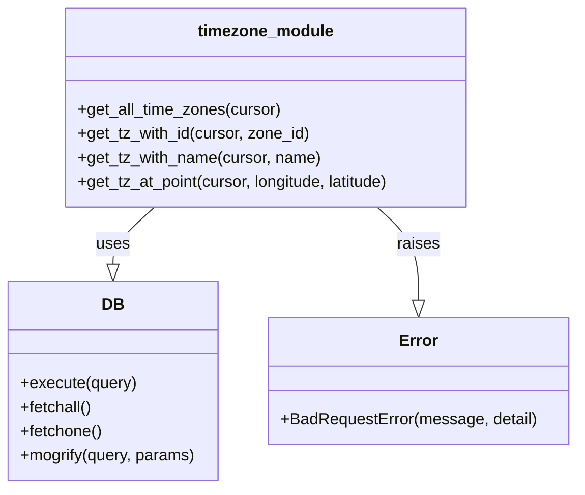

# Diagram: common/location_service/location_service/loc/db/timezone.py


> Auto-generated by Obscura crawlers

## Diagram 1



### SVG

<svg id="container" width="571.9609375" xmlns="http://www.w3.org/2000/svg" class="classDiagram" height="486" viewBox="0 0 571.9609375 486" role="graphics-document document" aria-roledescription="class"><style>#container{font-family:"trebuchet ms",verdana,arial,sans-serif;font-size:16px;fill:#333;}@keyframes edge-animation-frame{from{stroke-dashoffset:0;}}@keyframes dash{to{stroke-dashoffset:0;}}#container .edge-animation-slow{stroke-dasharray:9,5!important;stroke-dashoffset:900;animation:dash 50s linear infinite;stroke-linecap:round;}#container .edge-animation-fast{stroke-dasharray:9,5!important;stroke-dashoffset:900;animation:dash 20s linear infinite;stroke-linecap:round;}#container .error-icon{fill:#552222;}#container .error-text{fill:#552222;stroke:#552222;}#container .edge-thickness-normal{stroke-width:1px;}#container .edge-thickness-thick{stroke-width:3.5px;}#container .edge-pattern-solid{stroke-dasharray:0;}#container .edge-thickness-invisible{stroke-width:0;fill:none;}#container .edge-pattern-dashed{stroke-dasharray:3;}#container .edge-pattern-dotted{stroke-dasharray:2;}#container .marker{fill:#333333;stroke:#333333;}#container .marker.cross{stroke:#333333;}#container svg{font-family:"trebuchet ms",verdana,arial,sans-serif;font-size:16px;}#container p{margin:0;}#container g.classGroup text{fill:#9370DB;stroke:none;font-family:"trebuchet ms",verdana,arial,sans-serif;font-size:10px;}#container g.classGroup text .title{font-weight:bolder;}#container .nodeLabel,#container .edgeLabel{color:#131300;}#container .edgeLabel .label rect{fill:#ECECFF;}#container .label text{fill:#131300;}#container .labelBkg{background:#ECECFF;}#container .edgeLabel .label span{background:#ECECFF;}#container .classTitle{font-weight:bolder;}#container .node rect,#container .node circle,#container .node ellipse,#container .node polygon,#container .node path{fill:#ECECFF;stroke:#9370DB;stroke-width:1px;}#container .divider{stroke:#9370DB;stroke-width:1;}#container g.clickable{cursor:pointer;}#container g.classGroup rect{fill:#ECECFF;stroke:#9370DB;}#container g.classGroup line{stroke:#9370DB;stroke-width:1;}#container .classLabel .box{stroke:none;stroke-width:0;fill:#ECECFF;opacity:0.5;}#container .classLabel .label{fill:#9370DB;font-size:10px;}#container .relation{stroke:#333333;stroke-width:1;fill:none;}#container .dashed-line{stroke-dasharray:3;}#container .dotted-line{stroke-dasharray:1 2;}#container #compositionStart,#container .composition{fill:#333333!important;stroke:#333333!important;stroke-width:1;}#container #compositionEnd,#container .composition{fill:#333333!important;stroke:#333333!important;stroke-width:1;}#container #dependencyStart,#container .dependency{fill:#333333!important;stroke:#333333!important;stroke-width:1;}#container #dependencyStart,#container .dependency{fill:#333333!important;stroke:#333333!important;stroke-width:1;}#container #extensionStart,#container .extension{fill:transparent!important;stroke:#333333!important;stroke-width:1;}#container #extensionEnd,#container .extension{fill:transparent!important;stroke:#333333!important;stroke-width:1;}#container #aggregationStart,#container .aggregation{fill:transparent!important;stroke:#333333!important;stroke-width:1;}#container #aggregationEnd,#container .aggregation{fill:transparent!important;stroke:#333333!important;stroke-width:1;}#container #lollipopStart,#container .lollipop{fill:#ECECFF!important;stroke:#333333!important;stroke-width:1;}#container #lollipopEnd,#container .lollipop{fill:#ECECFF!important;stroke:#333333!important;stroke-width:1;}#container .edgeTerminals{font-size:11px;line-height:initial;}#container .classTitleText{text-anchor:middle;font-size:18px;fill:#333;}#container .label-icon{display:inline-block;height:1em;overflow:visible;vertical-align:-0.125em;}#container .node .label-icon path{fill:currentColor;stroke:revert;stroke-width:revert;}#container :root{--mermaid-font-family:"trebuchet ms",verdana,arial,sans-serif;}</style><g><defs><marker id="container_class-aggregationStart" class="marker aggregation class" refX="18" refY="7" markerWidth="190" markerHeight="240" orient="auto"><path d="M 18,7 L9,13 L1,7 L9,1 Z"></path></marker></defs><defs><marker id="container_class-aggregationEnd" class="marker aggregation class" refX="1" refY="7" markerWidth="20" markerHeight="28" orient="auto"><path d="M 18,7 L9,13 L1,7 L9,1 Z"></path></marker></defs><defs><marker id="container_class-extensionStart" class="marker extension class" refX="18" refY="7" markerWidth="190" markerHeight="240" orient="auto"><path d="M 1,7 L18,13 V 1 Z"></path></marker></defs><defs><marker id="container_class-extensionEnd" class="marker extension class" refX="1" refY="7" markerWidth="20" markerHeight="28" orient="auto"><path d="M 1,1 V 13 L18,7 Z"></path></marker></defs><defs><marker id="container_class-compositionStart" class="marker composition class" refX="18" refY="7" markerWidth="190" markerHeight="240" orient="auto"><path d="M 18,7 L9,13 L1,7 L9,1 Z"></path></marker></defs><defs><marker id="container_class-compositionEnd" class="marker composition class" refX="1" refY="7" markerWidth="20" markerHeight="28" orient="auto"><path d="M 18,7 L9,13 L1,7 L9,1 Z"></path></marker></defs><defs><marker id="container_class-dependencyStart" class="marker dependency class" refX="6" refY="7" markerWidth="190" markerHeight="240" orient="auto"><path d="M 5,7 L9,13 L1,7 L9,1 Z"></path></marker></defs><defs><marker id="container_class-dependencyEnd" class="marker dependency class" refX="13" refY="7" markerWidth="20" markerHeight="28" orient="auto"><path d="M 18,7 L9,13 L14,7 L9,1 Z"></path></marker></defs><defs><marker id="container_class-lollipopStart" class="marker lollipop class" refX="13" refY="7" markerWidth="190" markerHeight="240" orient="auto"><circle stroke="black" fill="transparent" cx="7" cy="7" r="6"></circle></marker></defs><defs><marker id="container_class-lollipopEnd" class="marker lollipop class" refX="1" refY="7" markerWidth="190" markerHeight="240" orient="auto"><circle stroke="black" fill="transparent" cx="7" cy="7" r="6"></circle></marker></defs><g class="root"><g class="clusters"></g><g class="edgePaths"><path d="M154.437,206L147.568,212.167C140.699,218.333,126.961,230.667,120.092,240.125C113.223,249.583,113.223,256.167,113.223,259.458L113.223,262.75" id="id_timezone_module_DB_1" class="edge-thickness-normal edge-pattern-solid relation" style=";;;" data-edge="true" data-et="edge" data-id="id_timezone_module_DB_1" data-points="W3sieCI6MTU0LjQzNjkxMTE5MDI1NzM1LCJ5IjoyMDZ9LHsieCI6MTEzLjIyMjY1NjI1LCJ5IjoyNDN9LHsieCI6MTEzLjIyMjY1NjI1LCJ5IjoyODB9XQ==" marker-end="url(#container_class-extensionEnd)"></path><path d="M374.989,206L381.858,212.167C388.727,218.333,402.465,230.667,409.334,246.125C416.203,261.583,416.203,280.167,416.203,289.458L416.203,298.75" id="id_timezone_module_Error_2" class="edge-thickness-normal edge-pattern-solid relation" style=";;;" data-edge="true" data-et="edge" data-id="id_timezone_module_Error_2" data-points="W3sieCI6Mzc0Ljk4ODg3MDA1OTc0MjcsInkiOjIwNn0seyJ4Ijo0MTYuMjAzMTI1LCJ5IjoyNDN9LHsieCI6NDE2LjIwMzEyNSwieSI6MzE2fV0=" marker-end="url(#container_class-extensionEnd)"></path></g><g class="edgeLabels"><g class="edgeLabel" transform="translate(113.22265625, 243)"><g class="label" data-id="id_timezone_module_DB_1" transform="translate(-16.4921875, -12)"><foreignObject width="32.984375" height="24"><div xmlns="http://www.w3.org/1999/xhtml" class="labelBkg" style="display: table-cell; white-space: nowrap; line-height: 1.5; max-width: 200px; text-align: center;"><span class="edgeLabel"><p>uses</p></span></div></foreignObject></g></g><g class="edgeLabel" transform="translate(416.203125, 243)"><g class="label" data-id="id_timezone_module_Error_2" transform="translate(-21.25, -12)"><foreignObject width="42.5" height="24"><div xmlns="http://www.w3.org/1999/xhtml" class="labelBkg" style="display: table-cell; white-space: nowrap; line-height: 1.5; max-width: 200px; text-align: center;"><span class="edgeLabel"><p>raises</p></span></div></foreignObject></g></g></g><g class="nodes"><g class="node default" id="classId-timezone_module-0" transform="translate(264.712890625, 107)"><g class="basic label-container"><path d="M-203.6328125 -99 L203.6328125 -99 L203.6328125 99 L-203.6328125 99" stroke="none" stroke-width="0" fill="#ECECFF" style=""></path><path d="M-203.6328125 -99 C-99.83598333289824 -99, 3.960845834203525 -99, 203.6328125 -99 M-203.6328125 -99 C-104.78303291012547 -99, -5.933253320250941 -99, 203.6328125 -99 M203.6328125 -99 C203.6328125 -49.45052393471076, 203.6328125 0.09895213057848196, 203.6328125 99 M203.6328125 -99 C203.6328125 -25.08768389329839, 203.6328125 48.82463221340322, 203.6328125 99 M203.6328125 99 C77.80912502635086 99, -48.01456244729829 99, -203.6328125 99 M203.6328125 99 C83.74054798675127 99, -36.15171652649747 99, -203.6328125 99 M-203.6328125 99 C-203.6328125 31.270826782906184, -203.6328125 -36.45834643418763, -203.6328125 -99 M-203.6328125 99 C-203.6328125 24.245034180286552, -203.6328125 -50.509931639426895, -203.6328125 -99" stroke="#9370DB" stroke-width="1.3" fill="none" stroke-dasharray="0 0" style=""></path></g><g class="annotation-group text" transform="translate(0, -75)"></g><g class="label-group text" transform="translate(-65.3125, -75)"><g class="label" style="font-weight: bolder" transform="translate(0,-12)"><foreignObject width="130.625" height="24"><div xmlns="http://www.w3.org/1999/xhtml" style="display: table-cell; white-space: nowrap; line-height: 1.5; max-width: 180px; text-align: center;"><span class="nodeLabel markdown-node-label" style=""><p>timezone_module</p></span></div></foreignObject></g></g><g class="members-group text" transform="translate(-191.6328125, -27)"></g><g class="methods-group text" transform="translate(-191.6328125, 3)"><g class="label" style="" transform="translate(0,-12)"><foreignObject width="203.078125" height="24"><div xmlns="http://www.w3.org/1999/xhtml" style="display: table-cell; white-space: nowrap; line-height: 1.5; max-width: 260px; text-align: center;"><span class="nodeLabel markdown-node-label" style=""><p>+get_all_time_zones(cursor)</p></span></div></foreignObject></g><g class="label" style="" transform="translate(0,12)"><foreignObject width="232.15625" height="24"><div xmlns="http://www.w3.org/1999/xhtml" style="display: table-cell; white-space: nowrap; line-height: 1.5; max-width: 290px; text-align: center;"><span class="nodeLabel markdown-node-label" style=""><p>+get_tz_with_id(cursor, zone_id)</p></span></div></foreignObject></g><g class="label" style="" transform="translate(0,36)"><foreignObject width="242.703125" height="24"><div xmlns="http://www.w3.org/1999/xhtml" style="display: table-cell; white-space: nowrap; line-height: 1.5; max-width: 300px; text-align: center;"><span class="nodeLabel markdown-node-label" style=""><p>+get_tz_with_name(cursor, name)</p></span></div></foreignObject></g><g class="label" style="" transform="translate(0,60)"><foreignObject width="317.953125" height="24"><div xmlns="http://www.w3.org/1999/xhtml" style="display: table-cell; white-space: nowrap; line-height: 1.5; max-width: 375px; text-align: center;"><span class="nodeLabel markdown-node-label" style=""><p>+get_tz_at_point(cursor, longitude, latitude)</p></span></div></foreignObject></g></g><g class="divider" style=""><path d="M-203.6328125 -51 C-101.92367909306964 -51, -0.2145456861392745 -51, 203.6328125 -51 M-203.6328125 -51 C-50.21909740188511 -51, 103.19461769622978 -51, 203.6328125 -51" stroke="#9370DB" stroke-width="1.3" fill="none" stroke-dasharray="0 0" style=""></path></g><g class="divider" style=""><path d="M-203.6328125 -27 C-76.72302737016793 -27, 50.18675775966415 -27, 203.6328125 -27 M-203.6328125 -27 C-79.75055522542196 -27, 44.131702049156075 -27, 203.6328125 -27" stroke="#9370DB" stroke-width="1.3" fill="none" stroke-dasharray="0 0" style=""></path></g></g><g class="node default" id="classId-DB-1" transform="translate(113.22265625, 379)"><g class="basic label-container"><path d="M-105.22265625 -99 L105.22265625 -99 L105.22265625 99 L-105.22265625 99" stroke="none" stroke-width="0" fill="#ECECFF" style=""></path><path d="M-105.22265625 -99 C-37.88722754176243 -99, 29.448201166475144 -99, 105.22265625 -99 M-105.22265625 -99 C-56.04240768733199 -99, -6.862159124663975 -99, 105.22265625 -99 M105.22265625 -99 C105.22265625 -22.94433530016211, 105.22265625 53.11132939967578, 105.22265625 99 M105.22265625 -99 C105.22265625 -37.179890156174345, 105.22265625 24.64021968765131, 105.22265625 99 M105.22265625 99 C54.74805855268855 99, 4.273460855377095 99, -105.22265625 99 M105.22265625 99 C34.91055759712094 99, -35.401541055758116 99, -105.22265625 99 M-105.22265625 99 C-105.22265625 35.3400655371508, -105.22265625 -28.3198689256984, -105.22265625 -99 M-105.22265625 99 C-105.22265625 43.849238761004955, -105.22265625 -11.30152247799009, -105.22265625 -99" stroke="#9370DB" stroke-width="1.3" fill="none" stroke-dasharray="0 0" style=""></path></g><g class="annotation-group text" transform="translate(0, -75)"></g><g class="label-group text" transform="translate(-10.1484375, -75)"><g class="label" style="font-weight: bolder" transform="translate(0,-12)"><foreignObject width="20.296875" height="24"><div xmlns="http://www.w3.org/1999/xhtml" style="display: table-cell; white-space: nowrap; line-height: 1.5; max-width: 70px; text-align: center;"><span class="nodeLabel markdown-node-label" style=""><p>DB</p></span></div></foreignObject></g></g><g class="members-group text" transform="translate(-93.22265625, -27)"></g><g class="methods-group text" transform="translate(-93.22265625, 3)"><g class="label" style="" transform="translate(0,-12)"><foreignObject width="115.96875" height="24"><div xmlns="http://www.w3.org/1999/xhtml" style="display: table-cell; white-space: nowrap; line-height: 1.5; max-width: 173px; text-align: center;"><span class="nodeLabel markdown-node-label" style=""><p>+execute(query)</p></span></div></foreignObject></g><g class="label" style="" transform="translate(0,12)"><foreignObject width="72.515625" height="24"><div xmlns="http://www.w3.org/1999/xhtml" style="display: table-cell; white-space: nowrap; line-height: 1.5; max-width: 130px; text-align: center;"><span class="nodeLabel markdown-node-label" style=""><p>+fetchall()</p></span></div></foreignObject></g><g class="label" style="" transform="translate(0,36)"><foreignObject width="82.046875" height="24"><div xmlns="http://www.w3.org/1999/xhtml" style="display: table-cell; white-space: nowrap; line-height: 1.5; max-width: 139px; text-align: center;"><span class="nodeLabel markdown-node-label" style=""><p>+fetchone()</p></span></div></foreignObject></g><g class="label" style="" transform="translate(0,60)"><foreignObject width="176.296875" height="24"><div xmlns="http://www.w3.org/1999/xhtml" style="display: table-cell; white-space: nowrap; line-height: 1.5; max-width: 234px; text-align: center;"><span class="nodeLabel markdown-node-label" style=""><p>+mogrify(query, params)</p></span></div></foreignObject></g></g><g class="divider" style=""><path d="M-105.22265625 -51 C-26.617388518845388 -51, 51.987879212309224 -51, 105.22265625 -51 M-105.22265625 -51 C-43.88044083603706 -51, 17.46177457792588 -51, 105.22265625 -51" stroke="#9370DB" stroke-width="1.3" fill="none" stroke-dasharray="0 0" style=""></path></g><g class="divider" style=""><path d="M-105.22265625 -27 C-51.49996416163165 -27, 2.2227279267366953 -27, 105.22265625 -27 M-105.22265625 -27 C-41.02147303443434 -27, 23.179710181131327 -27, 105.22265625 -27" stroke="#9370DB" stroke-width="1.3" fill="none" stroke-dasharray="0 0" style=""></path></g></g><g class="node default" id="classId-Error-2" transform="translate(416.203125, 379)"><g class="basic label-container"><path d="M-147.7578125 -63 L147.7578125 -63 L147.7578125 63 L-147.7578125 63" stroke="none" stroke-width="0" fill="#ECECFF" style=""></path><path d="M-147.7578125 -63 C-85.60956882743119 -63, -23.461325154862394 -63, 147.7578125 -63 M-147.7578125 -63 C-39.908224266031326 -63, 67.94136396793735 -63, 147.7578125 -63 M147.7578125 -63 C147.7578125 -25.32822532271816, 147.7578125 12.343549354563677, 147.7578125 63 M147.7578125 -63 C147.7578125 -32.85578118078797, 147.7578125 -2.711562361575943, 147.7578125 63 M147.7578125 63 C61.09004299585054 63, -25.577726508298923 63, -147.7578125 63 M147.7578125 63 C84.38500040975936 63, 21.012188319518728 63, -147.7578125 63 M-147.7578125 63 C-147.7578125 17.036332867614178, -147.7578125 -28.927334264771645, -147.7578125 -63 M-147.7578125 63 C-147.7578125 25.213453751447844, -147.7578125 -12.573092497104312, -147.7578125 -63" stroke="#9370DB" stroke-width="1.3" fill="none" stroke-dasharray="0 0" style=""></path></g><g class="annotation-group text" transform="translate(0, -39)"></g><g class="label-group text" transform="translate(-18.1875, -39)"><g class="label" style="font-weight: bolder" transform="translate(0,-12)"><foreignObject width="36.375" height="24"><div xmlns="http://www.w3.org/1999/xhtml" style="display: table-cell; white-space: nowrap; line-height: 1.5; max-width: 87px; text-align: center;"><span class="nodeLabel markdown-node-label" style=""><p>Error</p></span></div></foreignObject></g></g><g class="members-group text" transform="translate(-135.7578125, 9)"></g><g class="methods-group text" transform="translate(-135.7578125, 39)"><g class="label" style="" transform="translate(0,-12)"><foreignObject width="253.328125" height="24"><div xmlns="http://www.w3.org/1999/xhtml" style="display: table-cell; white-space: nowrap; line-height: 1.5; max-width: 311px; text-align: center;"><span class="nodeLabel markdown-node-label" style=""><p>+BadRequestError(message, detail)</p></span></div></foreignObject></g></g><g class="divider" style=""><path d="M-147.7578125 -15 C-86.68770738712851 -15, -25.617602274257038 -15, 147.7578125 -15 M-147.7578125 -15 C-61.1639416270434 -15, 25.4299292459132 -15, 147.7578125 -15" stroke="#9370DB" stroke-width="1.3" fill="none" stroke-dasharray="0 0" style=""></path></g><g class="divider" style=""><path d="M-147.7578125 9 C-46.76257419665349 9, 54.23266410669302 9, 147.7578125 9 M-147.7578125 9 C-36.991947843531264 9, 73.77391681293747 9, 147.7578125 9" stroke="#9370DB" stroke-width="1.3" fill="none" stroke-dasharray="0 0" style=""></path></g></g></g></g></g></svg>

## Diagram 2

```mermaid
flowchart TD
    A[get_tz_at_point(cursor, longitude, latitude)] --> B{latitude or longitude?}
    B -- No --> C[Build ST_Intersects query with NULL point]
    B -- Yes --> D{is -90 <= latitude <= 90?}
    D -- No --> E[Raise BadRequestError: Latitude must be between -90 and 90]
    D -- Yes --> F{is -180 <= longitude <= 180?}
    F -- No --> G[Raise BadRequestError: Longitude must be between -180 and 180]
    F -- Yes --> C
    C --> H[mogrify(query, {"longitude": longitude, "latitude": latitude})]
    H --> I[print(query)]
    I --> J[cursor.execute(query)]
    J --> K[cursor.fetchone() -> return]
```

> SVG rendering failed for this diagram.
