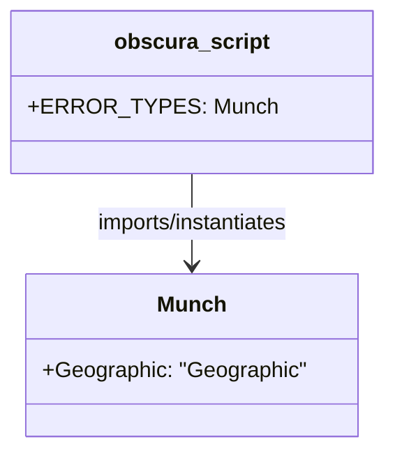

# Diagram: common/location_service/location_service/loc/error.py

> Auto-generated by Obscura crawlers

## Mermaid

### SVG

<svg id="container" width="257.90625" xmlns="http://www.w3.org/2000/svg" class="classDiagram" height="330" viewBox="0 0 257.90625 330" role="graphics-document document" aria-roledescription="class"><g><defs><marker id="container_class-aggregationStart" class="marker aggregation class" refX="18" refY="7" markerWidth="190" markerHeight="240" orient="auto"><path d="M 18,7 L9,13 L1,7 L9,1 Z"></path></marker></defs><defs><marker id="container_class-aggregationEnd" class="marker aggregation class" refX="1" refY="7" markerWidth="20" markerHeight="28" orient="auto"><path d="M 18,7 L9,13 L1,7 L9,1 Z"></path></marker></defs><defs><marker id="container_class-extensionStart" class="marker extension class" refX="18" refY="7" markerWidth="190" markerHeight="240" orient="auto"><path d="M 1,7 L18,13 V 1 Z"></path></marker></defs><defs><marker id="container_class-extensionEnd" class="marker extension class" refX="1" refY="7" markerWidth="20" markerHeight="28" orient="auto"><path d="M 1,1 V 13 L18,7 Z"></path></marker></defs><defs><marker id="container_class-compositionStart" class="marker composition class" refX="18" refY="7" markerWidth="190" markerHeight="240" orient="auto"><path d="M 18,7 L9,13 L1,7 L9,1 Z"></path></marker></defs><defs><marker id="container_class-compositionEnd" class="marker composition class" refX="1" refY="7" markerWidth="20" markerHeight="28" orient="auto"><path d="M 18,7 L9,13 L1,7 L9,1 Z"></path></marker></defs><defs><marker id="container_class-dependencyStart" class="marker dependency class" refX="6" refY="7" markerWidth="190" markerHeight="240" orient="auto"><path d="M 5,7 L9,13 L1,7 L9,1 Z"></path></marker></defs><defs><marker id="container_class-dependencyEnd" class="marker dependency class" refX="13" refY="7" markerWidth="20" markerHeight="28" orient="auto"><path d="M 18,7 L9,13 L14,7 L9,1 Z"></path></marker></defs><defs><marker id="container_class-lollipopStart" class="marker lollipop class" refX="13" refY="7" markerWidth="190" markerHeight="240" orient="auto"><circle stroke="black" fill="transparent" cx="7" cy="7" r="6"></circle></marker></defs><defs><marker id="container_class-lollipopEnd" class="marker lollipop class" refX="1" refY="7" markerWidth="190" markerHeight="240" orient="auto"><circle stroke="black" fill="transparent" cx="7" cy="7" r="6"></circle></marker></defs><g class="root"><g class="clusters"></g><g class="edgePaths"><path d="M128.953,128L128.953,134.167C128.953,140.333,128.953,152.667,128.953,164C128.953,175.333,128.953,185.667,128.953,190.833L128.953,196" id="id_obscura_script_Munch_1" class="edge-thickness-normal edge-pattern-solid relation" style=";;;" data-edge="true" data-et="edge" data-id="id_obscura_script_Munch_1" data-points="W3sieCI6MTI4Ljk1MzEyNSwieSI6MTI4fSx7IngiOjEyOC45NTMxMjUsInkiOjE2NX0seyJ4IjoxMjguOTUzMTI1LCJ5IjoyMDJ9XQ==" marker-end="url(#container_class-dependencyEnd)"></path></g><g class="edgeLabels"><g class="edgeLabel" transform="translate(128.953125, 165)"><g class="label" data-id="id_obscura_script_Munch_1" transform="translate(-75.3203125, -12)"><foreignObject width="150.640625" height="24">

imports/instantiates

</foreignObject></g></g></g><g class="nodes"><g class="node default" id="classId-obscura_script-0" transform="translate(128.953125, 68)"><g class="basic label-container"><path d="M-120.953125 -60 L120.953125 -60 L120.953125 60 L-120.953125 60" stroke="none" stroke-width="0" fill="#ECECFF" style=""></path><path d="M-120.953125 -60 C-40.89749225805117 -60, 39.158140483897654 -60, 120.953125 -60 M-120.953125 -60 C-36.173159448762604 -60, 48.60680610247479 -60, 120.953125 -60 M120.953125 -60 C120.953125 -16.556196411299965, 120.953125 26.88760717740007, 120.953125 60 M120.953125 -60 C120.953125 -33.62991676499843, 120.953125 -7.259833529996854, 120.953125 60 M120.953125 60 C60.62551789688021 60, 0.2979107937604226 60, -120.953125 60 M120.953125 60 C35.978149395780335 60, -48.99682620843933 60, -120.953125 60 M-120.953125 60 C-120.953125 24.266151069123936, -120.953125 -11.467697861752129, -120.953125 -60 M-120.953125 60 C-120.953125 17.024200673929023, -120.953125 -25.951598652141953, -120.953125 -60" stroke="#9370DB" stroke-width="1.3" fill="none" stroke-dasharray="0 0" style=""></path></g><g class="annotation-group text" transform="translate(0, -36)"></g><g class="label-group text" transform="translate(-54.140625, -36)"><g class="label" style="font-weight: bolder" transform="translate(0,-12)"><foreignObject width="108.28125" height="24">

obscura_script

</foreignObject></g></g><g class="members-group text" transform="translate(-108.953125, 12)"><g class="label" style="" transform="translate(0,-12)"><foreignObject width="163.765625" height="24">

+ERROR_TYPES: Munch

</foreignObject></g></g><g class="methods-group text" transform="translate(-108.953125, 60)"></g><g class="divider" style=""><path d="M-120.953125 -12 C-29.931737575036706 -12, 61.08964984992659 -12, 120.953125 -12 M-120.953125 -12 C-48.32218520203206 -12, 24.30875459593588 -12, 120.953125 -12" stroke="#9370DB" stroke-width="1.3" fill="none" stroke-dasharray="0 0" style=""></path></g><g class="divider" style=""><path d="M-120.953125 36 C-70.3373489573901 36, -19.721572914780225 36, 120.953125 36 M-120.953125 36 C-31.540704799649077 36, 57.871715400701845 36, 120.953125 36" stroke="#9370DB" stroke-width="1.3" fill="none" stroke-dasharray="0 0" style=""></path></g></g><g class="node default" id="classId-Munch-1" transform="translate(128.953125, 262)"><g class="basic label-container"><path d="M-120.25390625 -60 L120.25390625 -60 L120.25390625 60 L-120.25390625 60" stroke="none" stroke-width="0" fill="#ECECFF" style=""></path><path d="M-120.25390625 -60 C-51.75372368854586 -60, 16.746458872908278 -60, 120.25390625 -60 M-120.25390625 -60 C-48.90406775635452 -60, 22.445770737290957 -60, 120.25390625 -60 M120.25390625 -60 C120.25390625 -17.827726459491842, 120.25390625 24.344547081016316, 120.25390625 60 M120.25390625 -60 C120.25390625 -31.04175770695855, 120.25390625 -2.083515413917098, 120.25390625 60 M120.25390625 60 C49.93229646561748 60, -20.389313318765034 60, -120.25390625 60 M120.25390625 60 C34.895208691385534 60, -50.46348886722893 60, -120.25390625 60 M-120.25390625 60 C-120.25390625 15.748970774759513, -120.25390625 -28.502058450480973, -120.25390625 -60 M-120.25390625 60 C-120.25390625 26.395303923091546, -120.25390625 -7.209392153816907, -120.25390625 -60" stroke="#9370DB" stroke-width="1.3" fill="none" stroke-dasharray="0 0" style=""></path></g><g class="annotation-group text" transform="translate(0, -36)"></g><g class="label-group text" transform="translate(-23.9296875, -36)"><g class="label" style="font-weight: bolder" transform="translate(0,-12)"><foreignObject width="47.859375" height="24">

Munch

</foreignObject></g></g><g class="members-group text" transform="translate(-108.25390625, 12)"><g class="label" style="" transform="translate(0,-12)"><foreignObject width="192.578125" height="24">

+Geographic: "Geographic"

</foreignObject></g></g><g class="methods-group text" transform="translate(-108.25390625, 60)"></g><g class="divider" style=""><path d="M-120.25390625 -12 C-49.71402020474406 -12, 20.82586584051188 -12, 120.25390625 -12 M-120.25390625 -12 C-50.84265129087575 -12, 18.5686036682485 -12, 120.25390625 -12" stroke="#9370DB" stroke-width="1.3" fill="none" stroke-dasharray="0 0" style=""></path></g><g class="divider" style=""><path d="M-120.25390625 36 C-59.910957451078275 36, 0.43199134784345006 36, 120.25390625 36 M-120.25390625 36 C-54.09102266330038 36, 12.071860923399242 36, 120.25390625 36" stroke="#9370DB" stroke-width="1.3" fill="none" stroke-dasharray="0 0" style=""></path></g></g></g></g></g></svg>
