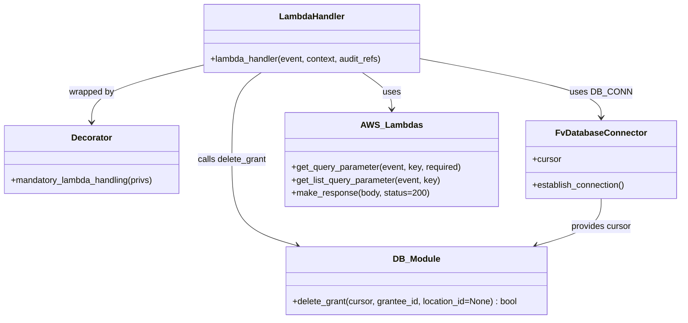

# Diagram: common/location_service/location_service/loc/lambdas/grant/grants_delete.py


> Auto-generated by Obscura crawlers

## Diagram 1



### SVG

<svg id="container" width="1261.8671875" xmlns="http://www.w3.org/2000/svg" class="classDiagram" height="590" viewBox="0 0 1261.8671875 590" role="graphics-document document" aria-roledescription="class"><style>#container{font-family:"trebuchet ms",verdana,arial,sans-serif;font-size:16px;fill:#333;}@keyframes edge-animation-frame{from{stroke-dashoffset:0;}}@keyframes dash{to{stroke-dashoffset:0;}}#container .edge-animation-slow{stroke-dasharray:9,5!important;stroke-dashoffset:900;animation:dash 50s linear infinite;stroke-linecap:round;}#container .edge-animation-fast{stroke-dasharray:9,5!important;stroke-dashoffset:900;animation:dash 20s linear infinite;stroke-linecap:round;}#container .error-icon{fill:#552222;}#container .error-text{fill:#552222;stroke:#552222;}#container .edge-thickness-normal{stroke-width:1px;}#container .edge-thickness-thick{stroke-width:3.5px;}#container .edge-pattern-solid{stroke-dasharray:0;}#container .edge-thickness-invisible{stroke-width:0;fill:none;}#container .edge-pattern-dashed{stroke-dasharray:3;}#container .edge-pattern-dotted{stroke-dasharray:2;}#container .marker{fill:#333333;stroke:#333333;}#container .marker.cross{stroke:#333333;}#container svg{font-family:"trebuchet ms",verdana,arial,sans-serif;font-size:16px;}#container p{margin:0;}#container g.classGroup text{fill:#9370DB;stroke:none;font-family:"trebuchet ms",verdana,arial,sans-serif;font-size:10px;}#container g.classGroup text .title{font-weight:bolder;}#container .nodeLabel,#container .edgeLabel{color:#131300;}#container .edgeLabel .label rect{fill:#ECECFF;}#container .label text{fill:#131300;}#container .labelBkg{background:#ECECFF;}#container .edgeLabel .label span{background:#ECECFF;}#container .classTitle{font-weight:bolder;}#container .node rect,#container .node circle,#container .node ellipse,#container .node polygon,#container .node path{fill:#ECECFF;stroke:#9370DB;stroke-width:1px;}#container .divider{stroke:#9370DB;stroke-width:1;}#container g.clickable{cursor:pointer;}#container g.classGroup rect{fill:#ECECFF;stroke:#9370DB;}#container g.classGroup line{stroke:#9370DB;stroke-width:1;}#container .classLabel .box{stroke:none;stroke-width:0;fill:#ECECFF;opacity:0.5;}#container .classLabel .label{fill:#9370DB;font-size:10px;}#container .relation{stroke:#333333;stroke-width:1;fill:none;}#container .dashed-line{stroke-dasharray:3;}#container .dotted-line{stroke-dasharray:1 2;}#container #compositionStart,#container .composition{fill:#333333!important;stroke:#333333!important;stroke-width:1;}#container #compositionEnd,#container .composition{fill:#333333!important;stroke:#333333!important;stroke-width:1;}#container #dependencyStart,#container .dependency{fill:#333333!important;stroke:#333333!important;stroke-width:1;}#container #dependencyStart,#container .dependency{fill:#333333!important;stroke:#333333!important;stroke-width:1;}#container #extensionStart,#container .extension{fill:transparent!important;stroke:#333333!important;stroke-width:1;}#container #extensionEnd,#container .extension{fill:transparent!important;stroke:#333333!important;stroke-width:1;}#container #aggregationStart,#container .aggregation{fill:transparent!important;stroke:#333333!important;stroke-width:1;}#container #aggregationEnd,#container .aggregation{fill:transparent!important;stroke:#333333!important;stroke-width:1;}#container #lollipopStart,#container .lollipop{fill:#ECECFF!important;stroke:#333333!important;stroke-width:1;}#container #lollipopEnd,#container .lollipop{fill:#ECECFF!important;stroke:#333333!important;stroke-width:1;}#container .edgeTerminals{font-size:11px;line-height:initial;}#container .classTitleText{text-anchor:middle;font-size:18px;fill:#333;}#container .label-icon{display:inline-block;height:1em;overflow:visible;vertical-align:-0.125em;}#container .node .label-icon path{fill:currentColor;stroke:revert;stroke-width:revert;}#container :root{--mermaid-font-family:"trebuchet ms",verdana,arial,sans-serif;}</style><g><defs><marker id="container_class-aggregationStart" class="marker aggregation class" refX="18" refY="7" markerWidth="190" markerHeight="240" orient="auto"><path d="M 18,7 L9,13 L1,7 L9,1 Z"></path></marker></defs><defs><marker id="container_class-aggregationEnd" class="marker aggregation class" refX="1" refY="7" markerWidth="20" markerHeight="28" orient="auto"><path d="M 18,7 L9,13 L1,7 L9,1 Z"></path></marker></defs><defs><marker id="container_class-extensionStart" class="marker extension class" refX="18" refY="7" markerWidth="190" markerHeight="240" orient="auto"><path d="M 1,7 L18,13 V 1 Z"></path></marker></defs><defs><marker id="container_class-extensionEnd" class="marker extension class" refX="1" refY="7" markerWidth="20" markerHeight="28" orient="auto"><path d="M 1,1 V 13 L18,7 Z"></path></marker></defs><defs><marker id="container_class-compositionStart" class="marker composition class" refX="18" refY="7" markerWidth="190" markerHeight="240" orient="auto"><path d="M 18,7 L9,13 L1,7 L9,1 Z"></path></marker></defs><defs><marker id="container_class-compositionEnd" class="marker composition class" refX="1" refY="7" markerWidth="20" markerHeight="28" orient="auto"><path d="M 18,7 L9,13 L1,7 L9,1 Z"></path></marker></defs><defs><marker id="container_class-dependencyStart" class="marker dependency class" refX="6" refY="7" markerWidth="190" markerHeight="240" orient="auto"><path d="M 5,7 L9,13 L1,7 L9,1 Z"></path></marker></defs><defs><marker id="container_class-dependencyEnd" class="marker dependency class" refX="13" refY="7" markerWidth="20" markerHeight="28" orient="auto"><path d="M 18,7 L9,13 L14,7 L9,1 Z"></path></marker></defs><defs><marker id="container_class-lollipopStart" class="marker lollipop class" refX="13" refY="7" markerWidth="190" markerHeight="240" orient="auto"><circle stroke="black" fill="transparent" cx="7" cy="7" r="6"></circle></marker></defs><defs><marker id="container_class-lollipopEnd" class="marker lollipop class" refX="1" refY="7" markerWidth="190" markerHeight="240" orient="auto"><circle stroke="black" fill="transparent" cx="7" cy="7" r="6"></circle></marker></defs><g class="root"><g class="clusters"></g><g class="edgePaths"><path d="M381.047,120.114L346.173,128.595C311.299,137.076,241.552,154.038,206.678,171.686C171.805,189.333,171.805,207.667,171.805,216.833L171.805,226" id="id_LambdaHandler_Decorator_1" class="edge-thickness-normal edge-pattern-solid relation" style=";;;" data-edge="true" data-et="edge" data-id="id_LambdaHandler_Decorator_1" data-points="W3sieCI6MzgxLjA0Njg3NSwieSI6MTIwLjExMzY3MzkzMDgwMzg3fSx7IngiOjE3MS44MDQ2ODc1LCJ5IjoxNzF9LHsieCI6MTcxLjgwNDY4NzUsInkiOjIzMn1d" marker-end="url(#container_class-dependencyEnd)"></path><path d="M676.191,134L685.313,140.167C694.434,146.333,712.678,158.667,721.8,170C730.922,181.333,730.922,191.667,730.922,196.833L730.922,202" id="id_LambdaHandler_AWS_Lambdas_2" class="edge-thickness-normal edge-pattern-solid relation" style=";;;" data-edge="true" data-et="edge" data-id="id_LambdaHandler_AWS_Lambdas_2" data-points="W3sieCI6Njc2LjE5MDc4MTI1LCJ5IjoxMzR9LHsieCI6NzMwLjkyMTg3NSwieSI6MTcxfSx7IngiOjczMC45MjE4NzUsInkiOjIwOH1d" marker-end="url(#container_class-dependencyEnd)"></path><path d="M784.953,108.92L840.058,119.266C895.163,129.613,1005.372,150.307,1060.477,168.32C1115.582,186.333,1115.582,201.667,1115.582,209.333L1115.582,217" id="id_LambdaHandler_FvDatabaseConnector_3" class="edge-thickness-normal edge-pattern-solid relation" style=";;;" data-edge="true" data-et="edge" data-id="id_LambdaHandler_FvDatabaseConnector_3" data-points="W3sieCI6Nzg0Ljk1MzEyNSwieSI6MTA4LjkxOTYyNzk5MTU3OTk0fSx7IngiOjExMTUuNTgyMDMxMjUsInkiOjE3MX0seyJ4IjoxMTE1LjU4MjAzMTI1LCJ5IjoyMjN9XQ==" marker-end="url(#container_class-dependencyEnd)"></path><path d="M489.809,134L480.687,140.167C471.566,146.333,453.322,158.667,444.2,185.5C435.078,212.333,435.078,253.667,435.078,295C435.078,336.333,435.078,377.667,455.101,404.218C475.124,430.769,515.169,442.539,535.192,448.423L555.215,454.308" id="id_LambdaHandler_DB_Module_4" class="edge-thickness-normal edge-pattern-solid relation" style=";;;" data-edge="true" data-et="edge" data-id="id_LambdaHandler_DB_Module_4" data-points="W3sieCI6NDg5LjgwOTIxODc1LCJ5IjoxMzR9LHsieCI6NDM1LjA3ODEyNSwieSI6MTcxfSx7IngiOjQzNS4wNzgxMjUsInkiOjI5NX0seyJ4Ijo0MzUuMDc4MTI1LCJ5Ijo0MTl9LHsieCI6NTYwLjk3MTM0NzY1NjI1LCJ5Ijo0NTZ9XQ==" marker-end="url(#container_class-dependencyEnd)"></path><path d="M1115.582,367L1115.582,375.667C1115.582,384.333,1115.582,401.667,1095.559,416.218C1075.536,430.769,1035.491,442.539,1015.468,448.423L995.445,454.308" id="id_FvDatabaseConnector_DB_Module_5" class="edge-thickness-normal edge-pattern-solid relation" style=";;;" data-edge="true" data-et="edge" data-id="id_FvDatabaseConnector_DB_Module_5" data-points="W3sieCI6MTExNS41ODIwMzEyNSwieSI6MzY3fSx7IngiOjExMTUuNTgyMDMxMjUsInkiOjQxOX0seyJ4Ijo5ODkuNjg4ODA4NTkzNzUsInkiOjQ1Nn1d" marker-end="url(#container_class-dependencyEnd)"></path></g><g class="edgeLabels"><g class="edgeLabel" transform="translate(171.8046875, 171)"><g class="label" data-id="id_LambdaHandler_Decorator_1" transform="translate(-42.3203125, -12)"><foreignObject width="84.640625" height="24"><div xmlns="http://www.w3.org/1999/xhtml" class="labelBkg" style="display: table-cell; white-space: nowrap; line-height: 1.5; max-width: 200px; text-align: center;"><span class="edgeLabel"><p>wrapped by</p></span></div></foreignObject></g></g><g class="edgeLabel" transform="translate(730.921875, 171)"><g class="label" data-id="id_LambdaHandler_AWS_Lambdas_2" transform="translate(-16.4921875, -12)"><foreignObject width="32.984375" height="24"><div xmlns="http://www.w3.org/1999/xhtml" class="labelBkg" style="display: table-cell; white-space: nowrap; line-height: 1.5; max-width: 200px; text-align: center;"><span class="edgeLabel"><p>uses</p></span></div></foreignObject></g></g><g class="edgeLabel" transform="translate(1115.58203125, 171)"><g class="label" data-id="id_LambdaHandler_FvDatabaseConnector_3" transform="translate(-53.09375, -12)"><foreignObject width="106.1875" height="24"><div xmlns="http://www.w3.org/1999/xhtml" class="labelBkg" style="display: table-cell; white-space: nowrap; line-height: 1.5; max-width: 200px; text-align: center;"><span class="edgeLabel"><p>uses DB_CONN</p></span></div></foreignObject></g></g><g class="edgeLabel" transform="translate(435.078125, 295)"><g class="label" data-id="id_LambdaHandler_DB_Module_4" transform="translate(-64.46875, -12)"><foreignObject width="128.9375" height="24"><div xmlns="http://www.w3.org/1999/xhtml" class="labelBkg" style="display: table-cell; white-space: nowrap; line-height: 1.5; max-width: 200px; text-align: center;"><span class="edgeLabel"><p>calls delete_grant</p></span></div></foreignObject></g></g><g class="edgeLabel" transform="translate(1115.58203125, 419)"><g class="label" data-id="id_FvDatabaseConnector_DB_Module_5" transform="translate(-56.296875, -12)"><foreignObject width="112.59375" height="24"><div xmlns="http://www.w3.org/1999/xhtml" class="labelBkg" style="display: table-cell; white-space: nowrap; line-height: 1.5; max-width: 200px; text-align: center;"><span class="edgeLabel"><p>provides cursor</p></span></div></foreignObject></g></g></g><g class="nodes"><g class="node default" id="classId-LambdaHandler-0" transform="translate(583, 71)"><g class="basic label-container"><path d="M-201.953125 -63 L201.953125 -63 L201.953125 63 L-201.953125 63" stroke="none" stroke-width="0" fill="#ECECFF" style=""></path><path d="M-201.953125 -63 C-83.43002458041194 -63, 35.09307583917612 -63, 201.953125 -63 M-201.953125 -63 C-41.47143771804829 -63, 119.01024956390341 -63, 201.953125 -63 M201.953125 -63 C201.953125 -34.066342278136915, 201.953125 -5.132684556273837, 201.953125 63 M201.953125 -63 C201.953125 -22.153442614917985, 201.953125 18.69311477016403, 201.953125 63 M201.953125 63 C104.09723039158199 63, 6.241335783163976 63, -201.953125 63 M201.953125 63 C55.29672893705137 63, -91.35966712589726 63, -201.953125 63 M-201.953125 63 C-201.953125 25.136041593319625, -201.953125 -12.72791681336075, -201.953125 -63 M-201.953125 63 C-201.953125 36.68759125066389, -201.953125 10.375182501327785, -201.953125 -63" stroke="#9370DB" stroke-width="1.3" fill="none" stroke-dasharray="0 0" style=""></path></g><g class="annotation-group text" transform="translate(0, -39)"></g><g class="label-group text" transform="translate(-58.21875, -39)"><g class="label" style="font-weight: bolder" transform="translate(0,-12)"><foreignObject width="116.4375" height="24"><div xmlns="http://www.w3.org/1999/xhtml" style="display: table-cell; white-space: nowrap; line-height: 1.5; max-width: 167px; text-align: center;"><span class="nodeLabel markdown-node-label" style=""><p>LambdaHandler</p></span></div></foreignObject></g></g><g class="members-group text" transform="translate(-189.953125, 9)"></g><g class="methods-group text" transform="translate(-189.953125, 39)"><g class="label" style="" transform="translate(0,-12)"><foreignObject width="321.6875" height="24"><div xmlns="http://www.w3.org/1999/xhtml" style="display: table-cell; white-space: nowrap; line-height: 1.5; max-width: 379px; text-align: center;"><span class="nodeLabel markdown-node-label" style=""><p>+lambda_handler(event, context, audit_refs)</p></span></div></foreignObject></g></g><g class="divider" style=""><path d="M-201.953125 -15 C-100.62372581170018 -15, 0.7056733765996341 -15, 201.953125 -15 M-201.953125 -15 C-60.34609058724109 -15, 81.26094382551781 -15, 201.953125 -15" stroke="#9370DB" stroke-width="1.3" fill="none" stroke-dasharray="0 0" style=""></path></g><g class="divider" style=""><path d="M-201.953125 9 C-91.30100897713444 9, 19.351107045731112 9, 201.953125 9 M-201.953125 9 C-91.72330249528511 9, 18.506520009429778 9, 201.953125 9" stroke="#9370DB" stroke-width="1.3" fill="none" stroke-dasharray="0 0" style=""></path></g></g><g class="node default" id="classId-Decorator-1" transform="translate(171.8046875, 295)"><g class="basic label-container"><path d="M-163.8046875 -63 L163.8046875 -63 L163.8046875 63 L-163.8046875 63" stroke="none" stroke-width="0" fill="#ECECFF" style=""></path><path d="M-163.8046875 -63 C-95.17631814253507 -63, -26.547948785070133 -63, 163.8046875 -63 M-163.8046875 -63 C-77.34564310122353 -63, 9.11340129755294 -63, 163.8046875 -63 M163.8046875 -63 C163.8046875 -35.40596314594102, 163.8046875 -7.811926291882045, 163.8046875 63 M163.8046875 -63 C163.8046875 -31.70311394423928, 163.8046875 -0.4062278884785613, 163.8046875 63 M163.8046875 63 C93.13780205471488 63, 22.470916609429764 63, -163.8046875 63 M163.8046875 63 C33.63534157099613 63, -96.53400435800773 63, -163.8046875 63 M-163.8046875 63 C-163.8046875 33.4198991797749, -163.8046875 3.839798359549796, -163.8046875 -63 M-163.8046875 63 C-163.8046875 19.914355224187773, -163.8046875 -23.171289551624454, -163.8046875 -63" stroke="#9370DB" stroke-width="1.3" fill="none" stroke-dasharray="0 0" style=""></path></g><g class="annotation-group text" transform="translate(0, -39)"></g><g class="label-group text" transform="translate(-36.109375, -39)"><g class="label" style="font-weight: bolder" transform="translate(0,-12)"><foreignObject width="72.21875" height="24"><div xmlns="http://www.w3.org/1999/xhtml" style="display: table-cell; white-space: nowrap; line-height: 1.5; max-width: 122px; text-align: center;"><span class="nodeLabel markdown-node-label" style=""><p>Decorator</p></span></div></foreignObject></g></g><g class="members-group text" transform="translate(-151.8046875, 9)"></g><g class="methods-group text" transform="translate(-151.8046875, 39)"><g class="label" style="" transform="translate(0,-12)"><foreignObject width="267.5" height="24"><div xmlns="http://www.w3.org/1999/xhtml" style="display: table-cell; white-space: nowrap; line-height: 1.5; max-width: 325px; text-align: center;"><span class="nodeLabel markdown-node-label" style=""><p>+mandatory_lambda_handling(privs)</p></span></div></foreignObject></g></g><g class="divider" style=""><path d="M-163.8046875 -15 C-34.67860219050553 -15, 94.44748311898894 -15, 163.8046875 -15 M-163.8046875 -15 C-81.09607458335468 -15, 1.6125383332906438 -15, 163.8046875 -15" stroke="#9370DB" stroke-width="1.3" fill="none" stroke-dasharray="0 0" style=""></path></g><g class="divider" style=""><path d="M-163.8046875 9 C-97.28140906798103 9, -30.75813063596206 9, 163.8046875 9 M-163.8046875 9 C-82.29598539486719 9, -0.7872832897343756 9, 163.8046875 9" stroke="#9370DB" stroke-width="1.3" fill="none" stroke-dasharray="0 0" style=""></path></g></g><g class="node default" id="classId-FvDatabaseConnector-2" transform="translate(1115.58203125, 295)"><g class="basic label-container"><path d="M-138.28515625 -72 L138.28515625 -72 L138.28515625 72 L-138.28515625 72" stroke="none" stroke-width="0" fill="#ECECFF" style=""></path><path d="M-138.28515625 -72 C-65.25872448958572 -72, 7.767707270828566 -72, 138.28515625 -72 M-138.28515625 -72 C-60.98622226317002 -72, 16.31271172365996 -72, 138.28515625 -72 M138.28515625 -72 C138.28515625 -31.214923387695436, 138.28515625 9.570153224609129, 138.28515625 72 M138.28515625 -72 C138.28515625 -28.964462618096306, 138.28515625 14.071074763807388, 138.28515625 72 M138.28515625 72 C64.76905274501028 72, -8.74705075997943 72, -138.28515625 72 M138.28515625 72 C61.76475609261226 72, -14.755644064775481 72, -138.28515625 72 M-138.28515625 72 C-138.28515625 32.0731269848074, -138.28515625 -7.853746030385196, -138.28515625 -72 M-138.28515625 72 C-138.28515625 21.05527069618924, -138.28515625 -29.88945860762152, -138.28515625 -72" stroke="#9370DB" stroke-width="1.3" fill="none" stroke-dasharray="0 0" style=""></path></g><g class="annotation-group text" transform="translate(0, -48)"></g><g class="label-group text" transform="translate(-79.3046875, -48)"><g class="label" style="font-weight: bolder" transform="translate(0,-12)"><foreignObject width="158.609375" height="24"><div xmlns="http://www.w3.org/1999/xhtml" style="display: table-cell; white-space: nowrap; line-height: 1.5; max-width: 207px; text-align: center;"><span class="nodeLabel markdown-node-label" style=""><p>FvDatabaseConnector</p></span></div></foreignObject></g></g><g class="members-group text" transform="translate(-126.28515625, 0)"><g class="label" style="" transform="translate(0,-12)"><foreignObject width="53.71875" height="24"><div xmlns="http://www.w3.org/1999/xhtml" style="display: table-cell; white-space: nowrap; line-height: 1.5; max-width: 112px; text-align: center;"><span class="nodeLabel markdown-node-label" style=""><p>+cursor</p></span></div></foreignObject></g></g><g class="methods-group text" transform="translate(-126.28515625, 48)"><g class="label" style="" transform="translate(0,-12)"><foreignObject width="173.265625" height="24"><div xmlns="http://www.w3.org/1999/xhtml" style="display: table-cell; white-space: nowrap; line-height: 1.5; max-width: 231px; text-align: center;"><span class="nodeLabel markdown-node-label" style=""><p>+establish_connection()</p></span></div></foreignObject></g></g><g class="divider" style=""><path d="M-138.28515625 -24 C-77.77383615209149 -24, -17.26251605418298 -24, 138.28515625 -24 M-138.28515625 -24 C-33.06026171661509 -24, 72.16463281676982 -24, 138.28515625 -24" stroke="#9370DB" stroke-width="1.3" fill="none" stroke-dasharray="0 0" style=""></path></g><g class="divider" style=""><path d="M-138.28515625 24 C-63.0131462755774 24, 12.258863698845204 24, 138.28515625 24 M-138.28515625 24 C-65.85308424735221 24, 6.578987755295572 24, 138.28515625 24" stroke="#9370DB" stroke-width="1.3" fill="none" stroke-dasharray="0 0" style=""></path></g></g><g class="node default" id="classId-AWS_Lambdas-3" transform="translate(730.921875, 295)"><g class="basic label-container"><path d="M-196.375 -87 L196.375 -87 L196.375 87 L-196.375 87" stroke="none" stroke-width="0" fill="#ECECFF" style=""></path><path d="M-196.375 -87 C-103.42079186764747 -87, -10.466583735294932 -87, 196.375 -87 M-196.375 -87 C-91.65720989339026 -87, 13.060580213219481 -87, 196.375 -87 M196.375 -87 C196.375 -44.007254079173826, 196.375 -1.0145081583476525, 196.375 87 M196.375 -87 C196.375 -33.792648312212215, 196.375 19.41470337557557, 196.375 87 M196.375 87 C68.58076297807392 87, -59.21347404385216 87, -196.375 87 M196.375 87 C96.47904255833862 87, -3.416914883322761 87, -196.375 87 M-196.375 87 C-196.375 34.19742665102609, -196.375 -18.605146697947816, -196.375 -87 M-196.375 87 C-196.375 32.727879529871636, -196.375 -21.544240940256728, -196.375 -87" stroke="#9370DB" stroke-width="1.3" fill="none" stroke-dasharray="0 0" style=""></path></g><g class="annotation-group text" transform="translate(0, -63)"></g><g class="label-group text" transform="translate(-52.828125, -63)"><g class="label" style="font-weight: bolder" transform="translate(0,-12)"><foreignObject width="105.65625" height="24"><div xmlns="http://www.w3.org/1999/xhtml" style="display: table-cell; white-space: nowrap; line-height: 1.5; max-width: 154px; text-align: center;"><span class="nodeLabel markdown-node-label" style=""><p>AWS_Lambdas</p></span></div></foreignObject></g></g><g class="members-group text" transform="translate(-184.375, -15)"></g><g class="methods-group text" transform="translate(-184.375, 15)"><g class="label" style="" transform="translate(0,-12)"><foreignObject width="315.921875" height="24"><div xmlns="http://www.w3.org/1999/xhtml" style="display: table-cell; white-space: nowrap; line-height: 1.5; max-width: 373px; text-align: center;"><span class="nodeLabel markdown-node-label" style=""><p>+get_query_parameter(event, key, required)</p></span></div></foreignObject></g><g class="label" style="" transform="translate(0,12)"><foreignObject width="277.296875" height="24"><div xmlns="http://www.w3.org/1999/xhtml" style="display: table-cell; white-space: nowrap; line-height: 1.5; max-width: 335px; text-align: center;"><span class="nodeLabel markdown-node-label" style=""><p>+get_list_query_parameter(event, key)</p></span></div></foreignObject></g><g class="label" style="" transform="translate(0,36)"><foreignObject width="253.75" height="24"><div xmlns="http://www.w3.org/1999/xhtml" style="display: table-cell; white-space: nowrap; line-height: 1.5; max-width: 311px; text-align: center;"><span class="nodeLabel markdown-node-label" style=""><p>+make_response(body, status=200)</p></span></div></foreignObject></g></g><g class="divider" style=""><path d="M-196.375 -39 C-98.9127765366984 -39, -1.4505530733968044 -39, 196.375 -39 M-196.375 -39 C-91.8075469199668 -39, 12.759906160066407 -39, 196.375 -39" stroke="#9370DB" stroke-width="1.3" fill="none" stroke-dasharray="0 0" style=""></path></g><g class="divider" style=""><path d="M-196.375 -15 C-106.61644413790613 -15, -16.857888275812257 -15, 196.375 -15 M-196.375 -15 C-84.46944708579196 -15, 27.43610582841609 -15, 196.375 -15" stroke="#9370DB" stroke-width="1.3" fill="none" stroke-dasharray="0 0" style=""></path></g></g><g class="node default" id="classId-DB_Module-4" transform="translate(775.330078125, 519)"><g class="basic label-container"><path d="M-243.1015625 -63 L243.1015625 -63 L243.1015625 63 L-243.1015625 63" stroke="none" stroke-width="0" fill="#ECECFF" style=""></path><path d="M-243.1015625 -63 C-89.13300068773398 -63, 64.83556112453203 -63, 243.1015625 -63 M-243.1015625 -63 C-121.28038725222797 -63, 0.5407879955440649 -63, 243.1015625 -63 M243.1015625 -63 C243.1015625 -31.10923363617626, 243.1015625 0.7815327276474804, 243.1015625 63 M243.1015625 -63 C243.1015625 -33.7255250869066, 243.1015625 -4.451050173813201, 243.1015625 63 M243.1015625 63 C86.92335317853005 63, -69.2548561429399 63, -243.1015625 63 M243.1015625 63 C50.00699110793437 63, -143.08758028413126 63, -243.1015625 63 M-243.1015625 63 C-243.1015625 33.1163247782839, -243.1015625 3.2326495565678, -243.1015625 -63 M-243.1015625 63 C-243.1015625 17.590706099232186, -243.1015625 -27.818587801535628, -243.1015625 -63" stroke="#9370DB" stroke-width="1.3" fill="none" stroke-dasharray="0 0" style=""></path></g><g class="annotation-group text" transform="translate(0, -39)"></g><g class="label-group text" transform="translate(-41.234375, -39)"><g class="label" style="font-weight: bolder" transform="translate(0,-12)"><foreignObject width="82.46875" height="24"><div xmlns="http://www.w3.org/1999/xhtml" style="display: table-cell; white-space: nowrap; line-height: 1.5; max-width: 132px; text-align: center;"><span class="nodeLabel markdown-node-label" style=""><p>DB_Module</p></span></div></foreignObject></g></g><g class="members-group text" transform="translate(-231.1015625, 9)"></g><g class="methods-group text" transform="translate(-231.1015625, 39)"><g class="label" style="" transform="translate(0,-12)"><foreignObject width="420.96875" height="24"><div xmlns="http://www.w3.org/1999/xhtml" style="display: table-cell; white-space: nowrap; line-height: 1.5; max-width: 479px; text-align: center;"><span class="nodeLabel markdown-node-label" style=""><p>+delete_grant(cursor, grantee_id, location_id=None) : bool</p></span></div></foreignObject></g></g><g class="divider" style=""><path d="M-243.1015625 -15 C-80.95225102008746 -15, 81.19706045982508 -15, 243.1015625 -15 M-243.1015625 -15 C-71.71179376596626 -15, 99.67797496806747 -15, 243.1015625 -15" stroke="#9370DB" stroke-width="1.3" fill="none" stroke-dasharray="0 0" style=""></path></g><g class="divider" style=""><path d="M-243.1015625 9 C-56.11306937092138 9, 130.87542375815724 9, 243.1015625 9 M-243.1015625 9 C-98.32707379729726 9, 46.44741490540548 9, 243.1015625 9" stroke="#9370DB" stroke-width="1.3" fill="none" stroke-dasharray="0 0" style=""></path></g></g></g></g></g></svg>

## Diagram 2

```mermaid
flowchart TD
    Event[Incoming event] -->|get_qsp(QSP.LocationGrant.GRANTEE_ID)| GetGrantee[Get grantee_id]
    Event -->|get_list_qsp(QSP.LocationGrant.LOCATION_IDS)| GetLocations[Get location_ids]
    GetGrantee --> DBConn[DB_CONN.establish_connection()]
    GetLocations --> DBConn
    DBConn --> Cursor[DB cursor acquired]
    Cursor --> CheckLocations{location_ids is None?}
    CheckLocations -->|Yes| DeleteAll[db.delete_grant(cursor, grantee_id)]
    CheckLocations -->|No| ForEach[for location_id in location_ids]
    ForEach --> DeleteOne[db.delete_grant(cursor, grantee_id, location_id)]
    DeleteOne -->|false| SetResp[response = "Some grant(s) were not deleted, please check DB"]
    DeleteOne -->|true| LoopContinue[continue]
    DeleteAll --> EndCheck{response is None?}
    LoopContinue --> EndCheck
    SetResp --> EndCheck
    EndCheck -->|Yes| Success[fv.aws.lambdas.make_response("Successfully deleted location grants.")]
    EndCheck -->|No| Error[fv.aws.lambdas.make_response(response, 500)]
    Success --> Return[Return HTTP 200]
    Error --> ReturnError[Return HTTP 500]
```

> SVG rendering failed for this diagram.
