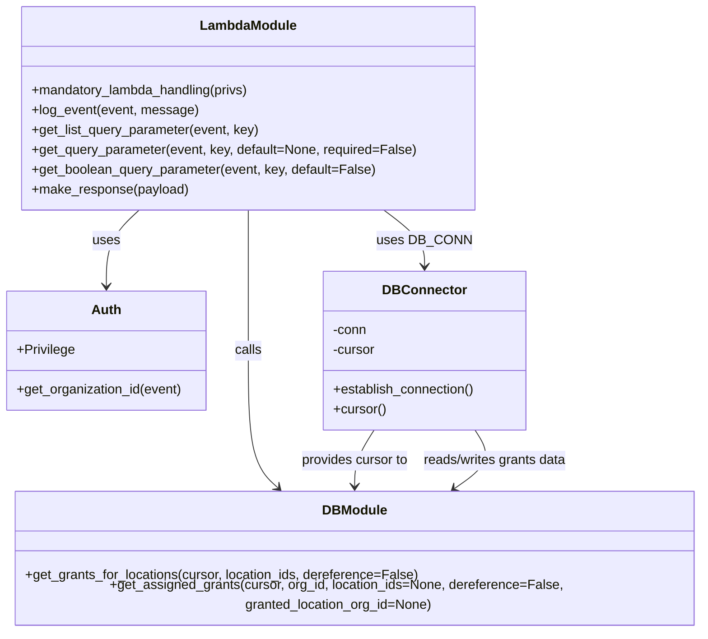

# Diagram: common/location_service/location_service/loc/lambdas/grant/grants_get.py


> Auto-generated by Obscura crawlers

## Diagram 1

```mermaid
flowchart TD
    Event[Event\n(event, context, audit_refs)] --> Log["log_event(event)"]
    Event --> GetParams["get query params:\nlocation_ids, pov, dereference"]
    Event --> GetOrg["auth.get_organization_id(event)"]
    GetParams --> POVCheck{pov == POV_GRANTER?}
    POVCheck -- yes --> GetGrants["db.get_grants_for_locations(cursor,\nlocation_ids, dereference)"]
    POVCheck -- no --> RequireGrantee["get_query_parameter(grantee_id)\n(required)"]
    RequireGrantee --> GetAssigned["db.get_assigned_grants(cursor,\norg_id=grantee_id,\nlocation_ids, dereference,\ngranted_location_org_id=user_org_id)"]
    DBConnect["DB_CONN.establish_connection()\ncursor = DB_CONN.cursor"] --> DBConnectCursor
    DBConnectCursor["cursor available"] --> POVCheck
    GetGrants --> MakeResp["make_response(retval)"]
    GetAssigned --> MakeResp
    MakeResp --> Return["return response"]
```

> SVG rendering failed for this diagram.

## Diagram 2



### SVG

<svg id="container" width="860.3203125" xmlns="http://www.w3.org/2000/svg" class="classDiagram" height="752" viewBox="0 0 860.3203125 752" role="graphics-document document" aria-roledescription="class"><style>#container{font-family:"trebuchet ms",verdana,arial,sans-serif;font-size:16px;fill:#333;}@keyframes edge-animation-frame{from{stroke-dashoffset:0;}}@keyframes dash{to{stroke-dashoffset:0;}}#container .edge-animation-slow{stroke-dasharray:9,5!important;stroke-dashoffset:900;animation:dash 50s linear infinite;stroke-linecap:round;}#container .edge-animation-fast{stroke-dasharray:9,5!important;stroke-dashoffset:900;animation:dash 20s linear infinite;stroke-linecap:round;}#container .error-icon{fill:#552222;}#container .error-text{fill:#552222;stroke:#552222;}#container .edge-thickness-normal{stroke-width:1px;}#container .edge-thickness-thick{stroke-width:3.5px;}#container .edge-pattern-solid{stroke-dasharray:0;}#container .edge-thickness-invisible{stroke-width:0;fill:none;}#container .edge-pattern-dashed{stroke-dasharray:3;}#container .edge-pattern-dotted{stroke-dasharray:2;}#container .marker{fill:#333333;stroke:#333333;}#container .marker.cross{stroke:#333333;}#container svg{font-family:"trebuchet ms",verdana,arial,sans-serif;font-size:16px;}#container p{margin:0;}#container g.classGroup text{fill:#9370DB;stroke:none;font-family:"trebuchet ms",verdana,arial,sans-serif;font-size:10px;}#container g.classGroup text .title{font-weight:bolder;}#container .nodeLabel,#container .edgeLabel{color:#131300;}#container .edgeLabel .label rect{fill:#ECECFF;}#container .label text{fill:#131300;}#container .labelBkg{background:#ECECFF;}#container .edgeLabel .label span{background:#ECECFF;}#container .classTitle{font-weight:bolder;}#container .node rect,#container .node circle,#container .node ellipse,#container .node polygon,#container .node path{fill:#ECECFF;stroke:#9370DB;stroke-width:1px;}#container .divider{stroke:#9370DB;stroke-width:1;}#container g.clickable{cursor:pointer;}#container g.classGroup rect{fill:#ECECFF;stroke:#9370DB;}#container g.classGroup line{stroke:#9370DB;stroke-width:1;}#container .classLabel .box{stroke:none;stroke-width:0;fill:#ECECFF;opacity:0.5;}#container .classLabel .label{fill:#9370DB;font-size:10px;}#container .relation{stroke:#333333;stroke-width:1;fill:none;}#container .dashed-line{stroke-dasharray:3;}#container .dotted-line{stroke-dasharray:1 2;}#container #compositionStart,#container .composition{fill:#333333!important;stroke:#333333!important;stroke-width:1;}#container #compositionEnd,#container .composition{fill:#333333!important;stroke:#333333!important;stroke-width:1;}#container #dependencyStart,#container .dependency{fill:#333333!important;stroke:#333333!important;stroke-width:1;}#container #dependencyStart,#container .dependency{fill:#333333!important;stroke:#333333!important;stroke-width:1;}#container #extensionStart,#container .extension{fill:transparent!important;stroke:#333333!important;stroke-width:1;}#container #extensionEnd,#container .extension{fill:transparent!important;stroke:#333333!important;stroke-width:1;}#container #aggregationStart,#container .aggregation{fill:transparent!important;stroke:#333333!important;stroke-width:1;}#container #aggregationEnd,#container .aggregation{fill:transparent!important;stroke:#333333!important;stroke-width:1;}#container #lollipopStart,#container .lollipop{fill:#ECECFF!important;stroke:#333333!important;stroke-width:1;}#container #lollipopEnd,#container .lollipop{fill:#ECECFF!important;stroke:#333333!important;stroke-width:1;}#container .edgeTerminals{font-size:11px;line-height:initial;}#container .classTitleText{text-anchor:middle;font-size:18px;fill:#333;}#container .label-icon{display:inline-block;height:1em;overflow:visible;vertical-align:-0.125em;}#container .node .label-icon path{fill:currentColor;stroke:revert;stroke-width:revert;}#container :root{--mermaid-font-family:"trebuchet ms",verdana,arial,sans-serif;}</style><g><defs><marker id="container_class-aggregationStart" class="marker aggregation class" refX="18" refY="7" markerWidth="190" markerHeight="240" orient="auto"><path d="M 18,7 L9,13 L1,7 L9,1 Z"></path></marker></defs><defs><marker id="container_class-aggregationEnd" class="marker aggregation class" refX="1" refY="7" markerWidth="20" markerHeight="28" orient="auto"><path d="M 18,7 L9,13 L1,7 L9,1 Z"></path></marker></defs><defs><marker id="container_class-extensionStart" class="marker extension class" refX="18" refY="7" markerWidth="190" markerHeight="240" orient="auto"><path d="M 1,7 L18,13 V 1 Z"></path></marker></defs><defs><marker id="container_class-extensionEnd" class="marker extension class" refX="1" refY="7" markerWidth="20" markerHeight="28" orient="auto"><path d="M 1,1 V 13 L18,7 Z"></path></marker></defs><defs><marker id="container_class-compositionStart" class="marker composition class" refX="18" refY="7" markerWidth="190" markerHeight="240" orient="auto"><path d="M 18,7 L9,13 L1,7 L9,1 Z"></path></marker></defs><defs><marker id="container_class-compositionEnd" class="marker composition class" refX="1" refY="7" markerWidth="20" markerHeight="28" orient="auto"><path d="M 18,7 L9,13 L1,7 L9,1 Z"></path></marker></defs><defs><marker id="container_class-dependencyStart" class="marker dependency class" refX="6" refY="7" markerWidth="190" markerHeight="240" orient="auto"><path d="M 5,7 L9,13 L1,7 L9,1 Z"></path></marker></defs><defs><marker id="container_class-dependencyEnd" class="marker dependency class" refX="13" refY="7" markerWidth="20" markerHeight="28" orient="auto"><path d="M 18,7 L9,13 L14,7 L9,1 Z"></path></marker></defs><defs><marker id="container_class-lollipopStart" class="marker lollipop class" refX="13" refY="7" markerWidth="190" markerHeight="240" orient="auto"><circle stroke="black" fill="transparent" cx="7" cy="7" r="6"></circle></marker></defs><defs><marker id="container_class-lollipopEnd" class="marker lollipop class" refX="1" refY="7" markerWidth="190" markerHeight="240" orient="auto"><circle stroke="black" fill="transparent" cx="7" cy="7" r="6"></circle></marker></defs><g class="root"><g class="clusters"></g><g class="edgePaths"><path d="M169.508,254L162.842,260.167C156.176,266.333,142.844,278.667,136.178,294C129.512,309.333,129.512,327.667,129.512,336.833L129.512,346" id="id_LambdaModule_Auth_1" class="edge-thickness-normal edge-pattern-solid relation" style=";;;" data-edge="true" data-et="edge" data-id="id_LambdaModule_Auth_1" data-points="W3sieCI6MTY5LjUwODAzMjIyNjU2MjUsInkiOjI1NH0seyJ4IjoxMjkuNTExNzE4NzUsInkiOjI5MX0seyJ4IjoxMjkuNTExNzE4NzUsInkiOjM1Mn1d" marker-end="url(#container_class-dependencyEnd)"></path><path d="M469.564,254L477.941,260.167C486.319,266.333,503.073,278.667,511.451,290C519.828,301.333,519.828,311.667,519.828,316.833L519.828,322" id="id_LambdaModule_DBConnector_2" class="edge-thickness-normal edge-pattern-solid relation" style=";;;" data-edge="true" data-et="edge" data-id="id_LambdaModule_DBConnector_2" data-points="W3sieCI6NDY5LjU2Mzc2OTUzMTI1LCJ5IjoyNTR9LHsieCI6NTE5LjgyODEyNSwieSI6MjkxfSx7IngiOjUxOS44MjgxMjUsInkiOjMyOH1d" marker-end="url(#container_class-dependencyEnd)"></path><path d="M302.469,254L302.469,260.167C302.469,266.333,302.469,278.667,302.469,307C302.469,335.333,302.469,379.667,302.469,424C302.469,468.333,302.469,512.667,308.861,540.347C315.254,568.027,328.04,579.054,334.432,584.568L340.825,590.081" id="id_LambdaModule_DBModule_3" class="edge-thickness-normal edge-pattern-solid relation" style=";;;" data-edge="true" data-et="edge" data-id="id_LambdaModule_DBModule_3" data-points="W3sieCI6MzAyLjQ2ODc1LCJ5IjoyNTR9LHsieCI6MzAyLjQ2ODc1LCJ5IjoyOTF9LHsieCI6MzAyLjQ2ODc1LCJ5Ijo0MjR9LHsieCI6MzAyLjQ2ODc1LCJ5Ijo1NTd9LHsieCI6MzQ1LjM2ODcyMjA5ODIxNDMsInkiOjU5NH1d" marker-end="url(#container_class-dependencyEnd)"></path><path d="M456.67,520L452.613,526.167C448.556,532.333,440.442,544.667,436.385,556C432.328,567.333,432.328,577.667,432.328,582.833L432.328,588" id="id_DBConnector_DBModule_4" class="edge-thickness-normal edge-pattern-solid relation" style=";;;" data-edge="true" data-et="edge" data-id="id_DBConnector_DBModule_4" data-points="W3sieCI6NDU2LjY3MDIzMDI2MzE1NzksInkiOjUyMH0seyJ4Ijo0MzIuMzI4MTI1LCJ5Ijo1NTd9LHsieCI6NDMyLjMyODEyNSwieSI6NTk0fV0=" marker-end="url(#container_class-dependencyEnd)"></path><path d="M554.569,590.766L563.362,585.138C572.156,579.51,589.742,568.255,594.478,556.461C599.214,544.667,591.1,532.333,587.043,526.167L582.986,520" id="id_DBModule_DBConnector_5" class="edge-thickness-normal edge-pattern-solid relation" style=";;;" data-edge="true" data-et="edge" data-id="id_DBModule_DBConnector_5" data-points="W3sieCI6NTQ5LjUxNTYyNSwieSI6NTk0fSx7IngiOjYwNy4zMjgxMjUsInkiOjU1N30seyJ4Ijo1ODIuOTg2MDE5NzM2ODQyMSwieSI6NTIwfV0=" marker-start="url(#container_class-dependencyStart)"></path></g><g class="edgeLabels"><g class="edgeLabel" transform="translate(129.51171875, 291)"><g class="label" data-id="id_LambdaModule_Auth_1" transform="translate(-16.4921875, -12)"><foreignObject width="32.984375" height="24"><div xmlns="http://www.w3.org/1999/xhtml" class="labelBkg" style="display: table-cell; white-space: nowrap; line-height: 1.5; max-width: 200px; text-align: center;"><span class="edgeLabel"><p>uses</p></span></div></foreignObject></g></g><g class="edgeLabel" transform="translate(519.828125, 291)"><g class="label" data-id="id_LambdaModule_DBConnector_2" transform="translate(-53.09375, -12)"><foreignObject width="106.1875" height="24"><div xmlns="http://www.w3.org/1999/xhtml" class="labelBkg" style="display: table-cell; white-space: nowrap; line-height: 1.5; max-width: 200px; text-align: center;"><span class="edgeLabel"><p>uses DB_CONN</p></span></div></foreignObject></g></g><g class="edgeLabel" transform="translate(302.46875, 424)"><g class="label" data-id="id_LambdaModule_DBModule_3" transform="translate(-16.4453125, -12)"><foreignObject width="32.890625" height="24"><div xmlns="http://www.w3.org/1999/xhtml" class="labelBkg" style="display: table-cell; white-space: nowrap; line-height: 1.5; max-width: 200px; text-align: center;"><span class="edgeLabel"><p>calls</p></span></div></foreignObject></g></g><g class="edgeLabel" transform="translate(432.328125, 557)"><g class="label" data-id="id_DBConnector_DBModule_4" transform="translate(-65.859375, -12)"><foreignObject width="131.71875" height="24"><div xmlns="http://www.w3.org/1999/xhtml" class="labelBkg" style="display: table-cell; white-space: nowrap; line-height: 1.5; max-width: 200px; text-align: center;"><span class="edgeLabel"><p>provides cursor to</p></span></div></foreignObject></g></g><g class="edgeLabel" transform="translate(597.07366, 563.56286)"><g class="label" data-id="id_DBModule_DBConnector_5" transform="translate(-89.140625, -12)"><foreignObject width="178.28125" height="24"><div xmlns="http://www.w3.org/1999/xhtml" class="labelBkg" style="display: table-cell; white-space: nowrap; line-height: 1.5; max-width: 200px; text-align: center;"><span class="edgeLabel"><p>reads/writes grants data</p></span></div></foreignObject></g></g></g><g class="nodes"><g class="node default" id="classId-LambdaModule-0" transform="translate(302.46875, 131)"><g class="basic label-container"><path d="M-273.265625 -123 L273.265625 -123 L273.265625 123 L-273.265625 123" stroke="none" stroke-width="0" fill="#ECECFF" style=""></path><path d="M-273.265625 -123 C-129.6950551012644 -123, 13.875514797471226 -123, 273.265625 -123 M-273.265625 -123 C-85.25530622767909 -123, 102.75501254464183 -123, 273.265625 -123 M273.265625 -123 C273.265625 -64.19962952071495, 273.265625 -5.399259041429886, 273.265625 123 M273.265625 -123 C273.265625 -64.34627690011953, 273.265625 -5.692553800239082, 273.265625 123 M273.265625 123 C87.88969865869794 123, -97.48622768260412 123, -273.265625 123 M273.265625 123 C162.95935607862128 123, 52.65308715724257 123, -273.265625 123 M-273.265625 123 C-273.265625 48.994902177907846, -273.265625 -25.010195644184307, -273.265625 -123 M-273.265625 123 C-273.265625 54.456177024601516, -273.265625 -14.087645950796968, -273.265625 -123" stroke="#9370DB" stroke-width="1.3" fill="none" stroke-dasharray="0 0" style=""></path></g><g class="annotation-group text" transform="translate(0, -99)"></g><g class="label-group text" transform="translate(-56.21875, -99)"><g class="label" style="font-weight: bolder" transform="translate(0,-12)"><foreignObject width="112.4375" height="24"><div xmlns="http://www.w3.org/1999/xhtml" style="display: table-cell; white-space: nowrap; line-height: 1.5; max-width: 162px; text-align: center;"><span class="nodeLabel markdown-node-label" style=""><p>LambdaModule</p></span></div></foreignObject></g></g><g class="members-group text" transform="translate(-261.265625, -51)"></g><g class="methods-group text" transform="translate(-261.265625, -21)"><g class="label" style="" transform="translate(0,-12)"><foreignObject width="267.5" height="24"><div xmlns="http://www.w3.org/1999/xhtml" style="display: table-cell; white-space: nowrap; line-height: 1.5; max-width: 325px; text-align: center;"><span class="nodeLabel markdown-node-label" style=""><p>+mandatory_lambda_handling(privs)</p></span></div></foreignObject></g><g class="label" style="" transform="translate(0,12)"><foreignObject width="199.890625" height="24"><div xmlns="http://www.w3.org/1999/xhtml" style="display: table-cell; white-space: nowrap; line-height: 1.5; max-width: 257px; text-align: center;"><span class="nodeLabel markdown-node-label" style=""><p>+log_event(event, message)</p></span></div></foreignObject></g><g class="label" style="" transform="translate(0,36)"><foreignObject width="277.296875" height="24"><div xmlns="http://www.w3.org/1999/xhtml" style="display: table-cell; white-space: nowrap; line-height: 1.5; max-width: 335px; text-align: center;"><span class="nodeLabel markdown-node-label" style=""><p>+get_list_query_parameter(event, key)</p></span></div></foreignObject></g><g class="label" style="" transform="translate(0,60)"><foreignObject width="466.3125" height="24"><div xmlns="http://www.w3.org/1999/xhtml" style="display: table-cell; white-space: nowrap; line-height: 1.5; max-width: 524px; text-align: center;"><span class="nodeLabel markdown-node-label" style=""><p>+get_query_parameter(event, key, default=None, required=False)</p></span></div></foreignObject></g><g class="label" style="" transform="translate(0,84)"><foreignObject width="418" height="24"><div xmlns="http://www.w3.org/1999/xhtml" style="display: table-cell; white-space: nowrap; line-height: 1.5; max-width: 475px; text-align: center;"><span class="nodeLabel markdown-node-label" style=""><p>+get_boolean_query_parameter(event, key, default=False)</p></span></div></foreignObject></g><g class="label" style="" transform="translate(0,108)"><foreignObject width="189.59375" height="24"><div xmlns="http://www.w3.org/1999/xhtml" style="display: table-cell; white-space: nowrap; line-height: 1.5; max-width: 247px; text-align: center;"><span class="nodeLabel markdown-node-label" style=""><p>+make_response(payload)</p></span></div></foreignObject></g></g><g class="divider" style=""><path d="M-273.265625 -75 C-156.2425065140834 -75, -39.219388028166776 -75, 273.265625 -75 M-273.265625 -75 C-132.42356380633066 -75, 8.418497387338675 -75, 273.265625 -75" stroke="#9370DB" stroke-width="1.3" fill="none" stroke-dasharray="0 0" style=""></path></g><g class="divider" style=""><path d="M-273.265625 -51 C-113.11932261611548 -51, 47.026979767769035 -51, 273.265625 -51 M-273.265625 -51 C-158.95128946925092 -51, -44.63695393850182 -51, 273.265625 -51" stroke="#9370DB" stroke-width="1.3" fill="none" stroke-dasharray="0 0" style=""></path></g></g><g class="node default" id="classId-Auth-1" transform="translate(129.51171875, 424)"><g class="basic label-container"><path d="M-121.51171875 -72 L121.51171875 -72 L121.51171875 72 L-121.51171875 72" stroke="none" stroke-width="0" fill="#ECECFF" style=""></path><path d="M-121.51171875 -72 C-36.22584500652923 -72, 49.06002873694155 -72, 121.51171875 -72 M-121.51171875 -72 C-59.31564155572457 -72, 2.880435638550864 -72, 121.51171875 -72 M121.51171875 -72 C121.51171875 -17.8251767716402, 121.51171875 36.3496464567196, 121.51171875 72 M121.51171875 -72 C121.51171875 -40.98477425697631, 121.51171875 -9.96954851395261, 121.51171875 72 M121.51171875 72 C57.83026797644588 72, -5.851182797108237 72, -121.51171875 72 M121.51171875 72 C56.888339884824234 72, -7.735038980351533 72, -121.51171875 72 M-121.51171875 72 C-121.51171875 42.79677773112188, -121.51171875 13.593555462243764, -121.51171875 -72 M-121.51171875 72 C-121.51171875 14.923861123888642, -121.51171875 -42.152277752222716, -121.51171875 -72" stroke="#9370DB" stroke-width="1.3" fill="none" stroke-dasharray="0 0" style=""></path></g><g class="annotation-group text" transform="translate(0, -48)"></g><g class="label-group text" transform="translate(-17.0078125, -48)"><g class="label" style="font-weight: bolder" transform="translate(0,-12)"><foreignObject width="34.015625" height="24"><div xmlns="http://www.w3.org/1999/xhtml" style="display: table-cell; white-space: nowrap; line-height: 1.5; max-width: 84px; text-align: center;"><span class="nodeLabel markdown-node-label" style=""><p>Auth</p></span></div></foreignObject></g></g><g class="members-group text" transform="translate(-109.51171875, 0)"><g class="label" style="" transform="translate(0,-12)"><foreignObject width="70.15625" height="24"><div xmlns="http://www.w3.org/1999/xhtml" style="display: table-cell; white-space: nowrap; line-height: 1.5; max-width: 128px; text-align: center;"><span class="nodeLabel markdown-node-label" style=""><p>+Privilege</p></span></div></foreignObject></g></g><g class="methods-group text" transform="translate(-109.51171875, 48)"><g class="label" style="" transform="translate(0,-12)"><foreignObject width="202.015625" height="24"><div xmlns="http://www.w3.org/1999/xhtml" style="display: table-cell; white-space: nowrap; line-height: 1.5; max-width: 259px; text-align: center;"><span class="nodeLabel markdown-node-label" style=""><p>+get_organization_id(event)</p></span></div></foreignObject></g></g><g class="divider" style=""><path d="M-121.51171875 -24 C-42.56179814843472 -24, 36.38812245313056 -24, 121.51171875 -24 M-121.51171875 -24 C-37.00231194603448 -24, 47.50709485793104 -24, 121.51171875 -24" stroke="#9370DB" stroke-width="1.3" fill="none" stroke-dasharray="0 0" style=""></path></g><g class="divider" style=""><path d="M-121.51171875 24 C-58.1330916121086 24, 5.245535525782799 24, 121.51171875 24 M-121.51171875 24 C-44.802979938188855 24, 31.90575887362229 24, 121.51171875 24" stroke="#9370DB" stroke-width="1.3" fill="none" stroke-dasharray="0 0" style=""></path></g></g><g class="node default" id="classId-DBConnector-2" transform="translate(519.828125, 424)"><g class="basic label-container"><path d="M-122.4140625 -96 L122.4140625 -96 L122.4140625 96 L-122.4140625 96" stroke="none" stroke-width="0" fill="#ECECFF" style=""></path><path d="M-122.4140625 -96 C-33.67242969383153 -96, 55.069203112336936 -96, 122.4140625 -96 M-122.4140625 -96 C-61.71438338990964 -96, -1.0147042798192842 -96, 122.4140625 -96 M122.4140625 -96 C122.4140625 -38.81033276963864, 122.4140625 18.379334460722717, 122.4140625 96 M122.4140625 -96 C122.4140625 -53.01476893672356, 122.4140625 -10.029537873447126, 122.4140625 96 M122.4140625 96 C51.10105825783127 96, -20.21194598433746 96, -122.4140625 96 M122.4140625 96 C48.4699653397366 96, -25.474131820526793 96, -122.4140625 96 M-122.4140625 96 C-122.4140625 45.694240462975905, -122.4140625 -4.611519074048189, -122.4140625 -96 M-122.4140625 96 C-122.4140625 24.040466110564864, -122.4140625 -47.91906777887027, -122.4140625 -96" stroke="#9370DB" stroke-width="1.3" fill="none" stroke-dasharray="0 0" style=""></path></g><g class="annotation-group text" transform="translate(0, -72)"></g><g class="label-group text" transform="translate(-47.5625, -72)"><g class="label" style="font-weight: bolder" transform="translate(0,-12)"><foreignObject width="95.125" height="24"><div xmlns="http://www.w3.org/1999/xhtml" style="display: table-cell; white-space: nowrap; line-height: 1.5; max-width: 145px; text-align: center;"><span class="nodeLabel markdown-node-label" style=""><p>DBConnector</p></span></div></foreignObject></g></g><g class="members-group text" transform="translate(-110.4140625, -24)"><g class="label" style="" transform="translate(0,-12)"><foreignObject width="41.875" height="24"><div xmlns="http://www.w3.org/1999/xhtml" style="display: table-cell; white-space: nowrap; line-height: 1.5; max-width: 99px; text-align: center;"><span class="nodeLabel markdown-node-label" style=""><p>-conn</p></span></div></foreignObject></g><g class="label" style="" transform="translate(0,12)"><foreignObject width="52.1875" height="24"><div xmlns="http://www.w3.org/1999/xhtml" style="display: table-cell; white-space: nowrap; line-height: 1.5; max-width: 110px; text-align: center;"><span class="nodeLabel markdown-node-label" style=""><p>-cursor</p></span></div></foreignObject></g></g><g class="methods-group text" transform="translate(-110.4140625, 48)"><g class="label" style="" transform="translate(0,-12)"><foreignObject width="173.265625" height="24"><div xmlns="http://www.w3.org/1999/xhtml" style="display: table-cell; white-space: nowrap; line-height: 1.5; max-width: 231px; text-align: center;"><span class="nodeLabel markdown-node-label" style=""><p>+establish_connection()</p></span></div></foreignObject></g><g class="label" style="" transform="translate(0,12)"><foreignObject width="64.09375" height="24"><div xmlns="http://www.w3.org/1999/xhtml" style="display: table-cell; white-space: nowrap; line-height: 1.5; max-width: 121px; text-align: center;"><span class="nodeLabel markdown-node-label" style=""><p>+cursor()</p></span></div></foreignObject></g></g><g class="divider" style=""><path d="M-122.4140625 -48 C-35.327491214512605 -48, 51.75908007097479 -48, 122.4140625 -48 M-122.4140625 -48 C-43.655754973315055 -48, 35.10255255336989 -48, 122.4140625 -48" stroke="#9370DB" stroke-width="1.3" fill="none" stroke-dasharray="0 0" style=""></path></g><g class="divider" style=""><path d="M-122.4140625 24 C-29.606868996039765 24, 63.20032450792047 24, 122.4140625 24 M-122.4140625 24 C-58.452882225082995 24, 5.508298049834011 24, 122.4140625 24" stroke="#9370DB" stroke-width="1.3" fill="none" stroke-dasharray="0 0" style=""></path></g></g><g class="node default" id="classId-DBModule-3" transform="translate(432.328125, 669)"><g class="basic label-container"><path d="M-419.9921875 -75 L419.9921875 -75 L419.9921875 75 L-419.9921875 75" stroke="none" stroke-width="0" fill="#ECECFF" style=""></path><path d="M-419.9921875 -75 C-132.96827195069915 -75, 154.0556435986017 -75, 419.9921875 -75 M-419.9921875 -75 C-100.2408064829404 -75, 219.5105745341192 -75, 419.9921875 -75 M419.9921875 -75 C419.9921875 -28.72471726380651, 419.9921875 17.550565472386978, 419.9921875 75 M419.9921875 -75 C419.9921875 -35.68524974313771, 419.9921875 3.6295005137245795, 419.9921875 75 M419.9921875 75 C98.33314952611488 75, -223.32588844777024 75, -419.9921875 75 M419.9921875 75 C211.84013848161493 75, 3.6880894632298578 75, -419.9921875 75 M-419.9921875 75 C-419.9921875 30.391956372447417, -419.9921875 -14.216087255105165, -419.9921875 -75 M-419.9921875 75 C-419.9921875 18.464263636513977, -419.9921875 -38.07147272697205, -419.9921875 -75" stroke="#9370DB" stroke-width="1.3" fill="none" stroke-dasharray="0 0" style=""></path></g><g class="annotation-group text" transform="translate(0, -51)"></g><g class="label-group text" transform="translate(-37.234375, -51)"><g class="label" style="font-weight: bolder" transform="translate(0,-12)"><foreignObject width="74.46875" height="24"><div xmlns="http://www.w3.org/1999/xhtml" style="display: table-cell; white-space: nowrap; line-height: 1.5; max-width: 124px; text-align: center;"><span class="nodeLabel markdown-node-label" style=""><p>DBModule</p></span></div></foreignObject></g></g><g class="members-group text" transform="translate(-407.9921875, -3)"></g><g class="methods-group text" transform="translate(-407.9921875, 27)"><g class="label" style="" transform="translate(0,-12)"><foreignObject width="476.96875" height="24"><div xmlns="http://www.w3.org/1999/xhtml" style="display: table-cell; white-space: nowrap; line-height: 1.5; max-width: 534px; text-align: center;"><span class="nodeLabel markdown-node-label" style=""><p>+get_grants_for_locations(cursor, location_ids, dereference=False)</p></span></div></foreignObject></g><g class="label" style="" transform="translate(0,12)"><foreignObject width="778.75" height="24"><div xmlns="http://www.w3.org/1999/xhtml" style="display: table-cell; white-space: nowrap; line-height: 1.5; max-width: 836px; text-align: center;"><span class="nodeLabel markdown-node-label" style=""><p>+get_assigned_grants(cursor, org_id, location_ids=None, dereference=False, granted_location_org_id=None)</p></span></div></foreignObject></g></g><g class="divider" style=""><path d="M-419.9921875 -27 C-126.55974680726655 -27, 166.8726938854669 -27, 419.9921875 -27 M-419.9921875 -27 C-246.27652303483296 -27, -72.56085856966592 -27, 419.9921875 -27" stroke="#9370DB" stroke-width="1.3" fill="none" stroke-dasharray="0 0" style=""></path></g><g class="divider" style=""><path d="M-419.9921875 -3 C-206.95071214326788 -3, 6.090763213464243 -3, 419.9921875 -3 M-419.9921875 -3 C-126.79705564837798 -3, 166.39807620324405 -3, 419.9921875 -3" stroke="#9370DB" stroke-width="1.3" fill="none" stroke-dasharray="0 0" style=""></path></g></g></g></g></g></svg>
