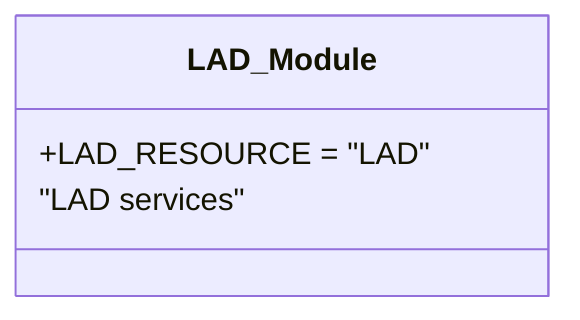

# Diagram: common/location_service/location_service/loc/lambdas/lad/__init__.py

> Auto-generated by Obscura crawlers

## Mermaid

### SVG

<svg id="container" width="260.2734375" xmlns="http://www.w3.org/2000/svg" class="classDiagram" height="160" viewBox="0 0 260.2734375 160" role="graphics-document document" aria-roledescription="class"><g><defs><marker id="container_class-aggregationStart" class="marker aggregation class" refX="18" refY="7" markerWidth="190" markerHeight="240" orient="auto"><path d="M 18,7 L9,13 L1,7 L9,1 Z"></path></marker></defs><defs><marker id="container_class-aggregationEnd" class="marker aggregation class" refX="1" refY="7" markerWidth="20" markerHeight="28" orient="auto"><path d="M 18,7 L9,13 L1,7 L9,1 Z"></path></marker></defs><defs><marker id="container_class-extensionStart" class="marker extension class" refX="18" refY="7" markerWidth="190" markerHeight="240" orient="auto"><path d="M 1,7 L18,13 V 1 Z"></path></marker></defs><defs><marker id="container_class-extensionEnd" class="marker extension class" refX="1" refY="7" markerWidth="20" markerHeight="28" orient="auto"><path d="M 1,1 V 13 L18,7 Z"></path></marker></defs><defs><marker id="container_class-compositionStart" class="marker composition class" refX="18" refY="7" markerWidth="190" markerHeight="240" orient="auto"><path d="M 18,7 L9,13 L1,7 L9,1 Z"></path></marker></defs><defs><marker id="container_class-compositionEnd" class="marker composition class" refX="1" refY="7" markerWidth="20" markerHeight="28" orient="auto"><path d="M 18,7 L9,13 L1,7 L9,1 Z"></path></marker></defs><defs><marker id="container_class-dependencyStart" class="marker dependency class" refX="6" refY="7" markerWidth="190" markerHeight="240" orient="auto"><path d="M 5,7 L9,13 L1,7 L9,1 Z"></path></marker></defs><defs><marker id="container_class-dependencyEnd" class="marker dependency class" refX="13" refY="7" markerWidth="20" markerHeight="28" orient="auto"><path d="M 18,7 L9,13 L14,7 L9,1 Z"></path></marker></defs><defs><marker id="container_class-lollipopStart" class="marker lollipop class" refX="13" refY="7" markerWidth="190" markerHeight="240" orient="auto"><circle stroke="black" fill="transparent" cx="7" cy="7" r="6"></circle></marker></defs><defs><marker id="container_class-lollipopEnd" class="marker lollipop class" refX="1" refY="7" markerWidth="190" markerHeight="240" orient="auto"><circle stroke="black" fill="transparent" cx="7" cy="7" r="6"></circle></marker></defs><g class="root"><g class="clusters"></g><g class="edgePaths"></g><g class="edgeLabels"></g><g class="nodes"><g class="node default" id="classId-LAD_Module-0" transform="translate(130.13671875, 80)"><g class="basic label-container"><path d="M-122.13671875 -72 L122.13671875 -72 L122.13671875 72 L-122.13671875 72" stroke="none" stroke-width="0" fill="#ECECFF" style=""></path><path d="M-122.13671875 -72 C-62.05022945013196 -72, -1.9637401502639165 -72, 122.13671875 -72 M-122.13671875 -72 C-50.72124946063637 -72, 20.694219828727256 -72, 122.13671875 -72 M122.13671875 -72 C122.13671875 -31.193526194136368, 122.13671875 9.612947611727265, 122.13671875 72 M122.13671875 -72 C122.13671875 -22.598738927798536, 122.13671875 26.80252214440293, 122.13671875 72 M122.13671875 72 C57.36705299720886 72, -7.4026127555822825 72, -122.13671875 72 M122.13671875 72 C61.73944697910301 72, 1.3421752082060152 72, -122.13671875 72 M-122.13671875 72 C-122.13671875 19.460258766915707, -122.13671875 -33.079482466168585, -122.13671875 -72 M-122.13671875 72 C-122.13671875 16.62240965437325, -122.13671875 -38.7551806912535, -122.13671875 -72" stroke="#9370DB" stroke-width="1.3" fill="none" stroke-dasharray="0 0" style=""></path></g><g class="annotation-group text" transform="translate(0, -48)"></g><g class="label-group text" transform="translate(-44.9609375, -48)"><g class="label" style="font-weight: bolder" transform="translate(0,-12)"><foreignObject width="89.921875" height="24">

LAD_Module

</foreignObject></g></g><g class="members-group text" transform="translate(-110.13671875, 0)"><g class="label" style="" transform="translate(0,-12)"><foreignObject width="175.3125" height="24">

+LAD_RESOURCE = "LAD"

</foreignObject></g><g class="label" style="" transform="translate(0,12)"><foreignObject width="102.484375" height="24">

"LAD services"

</foreignObject></g></g><g class="methods-group text" transform="translate(-110.13671875, 72)"></g><g class="divider" style=""><path d="M-122.13671875 -24 C-64.88908246419973 -24, -7.641446178399448 -24, 122.13671875 -24 M-122.13671875 -24 C-61.82070329931942 -24, -1.504687848638838 -24, 122.13671875 -24" stroke="#9370DB" stroke-width="1.3" fill="none" stroke-dasharray="0 0" style=""></path></g><g class="divider" style=""><path d="M-122.13671875 48 C-56.16137896865344 48, 9.813960812693125 48, 122.13671875 48 M-122.13671875 48 C-27.948521284234488 48, 66.23967618153102 48, 122.13671875 48" stroke="#9370DB" stroke-width="1.3" fill="none" stroke-dasharray="0 0" style=""></path></g></g></g></g></g></svg>
