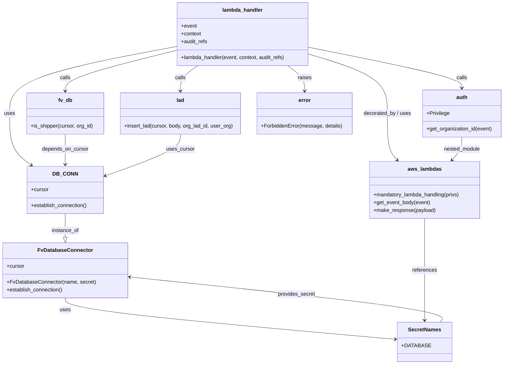

# Diagram: common/location_service/location_service/loc/lambdas/lad/edit_lad.py

> Auto-generated by Obscura crawlers

## Mermaid

### SVG

<svg id="container" width="1542.390625" xmlns="http://www.w3.org/2000/svg" class="classDiagram" height="1110" viewBox="0 0 1542.390625 1110" role="graphics-document document" aria-roledescription="class"><g><defs><marker id="container_class-aggregationStart" class="marker aggregation class" refX="18" refY="7" markerWidth="190" markerHeight="240" orient="auto"><path d="M 18,7 L9,13 L1,7 L9,1 Z"></path></marker></defs><defs><marker id="container_class-aggregationEnd" class="marker aggregation class" refX="1" refY="7" markerWidth="20" markerHeight="28" orient="auto"><path d="M 18,7 L9,13 L1,7 L9,1 Z"></path></marker></defs><defs><marker id="container_class-extensionStart" class="marker extension class" refX="18" refY="7" markerWidth="190" markerHeight="240" orient="auto"><path d="M 1,7 L18,13 V 1 Z"></path></marker></defs><defs><marker id="container_class-extensionEnd" class="marker extension class" refX="1" refY="7" markerWidth="20" markerHeight="28" orient="auto"><path d="M 1,1 V 13 L18,7 Z"></path></marker></defs><defs><marker id="container_class-compositionStart" class="marker composition class" refX="18" refY="7" markerWidth="190" markerHeight="240" orient="auto"><path d="M 18,7 L9,13 L1,7 L9,1 Z"></path></marker></defs><defs><marker id="container_class-compositionEnd" class="marker composition class" refX="1" refY="7" markerWidth="20" markerHeight="28" orient="auto"><path d="M 18,7 L9,13 L1,7 L9,1 Z"></path></marker></defs><defs><marker id="container_class-dependencyStart" class="marker dependency class" refX="6" refY="7" markerWidth="190" markerHeight="240" orient="auto"><path d="M 5,7 L9,13 L1,7 L9,1 Z"></path></marker></defs><defs><marker id="container_class-dependencyEnd" class="marker dependency class" refX="13" refY="7" markerWidth="20" markerHeight="28" orient="auto"><path d="M 18,7 L9,13 L14,7 L9,1 Z"></path></marker></defs><defs><marker id="container_class-lollipopStart" class="marker lollipop class" refX="13" refY="7" markerWidth="190" markerHeight="240" orient="auto"><circle stroke="black" fill="transparent" cx="7" cy="7" r="6"></circle></marker></defs><defs><marker id="container_class-lollipopEnd" class="marker lollipop class" refX="1" refY="7" markerWidth="190" markerHeight="240" orient="auto"><circle stroke="black" fill="transparent" cx="7" cy="7" r="6"></circle></marker></defs><g class="root"><g class="clusters"></g><g class="edgePaths"><path d="M535.023,141.816L449.935,157.68C364.846,173.544,194.669,205.272,109.581,239.303C24.492,273.333,24.492,309.667,24.492,346C24.492,382.333,24.492,418.667,35.548,444.91C46.604,471.154,68.716,487.307,79.772,495.384L90.828,503.461" id="id_lambda_handler_DB_CONN_1" class="edge-thickness-normal edge-pattern-solid relation" style=";;;" data-edge="true" data-et="edge" data-id="id_lambda_handler_DB_CONN_1" data-points="W3sieCI6NTM1LjAyMzQzNzUsInkiOjE0MS44MTYxNjAyNDQ0NDA2OH0seyJ4IjoyNC40OTIxODc1LCJ5IjoyMzd9LHsieCI6MjQuNDkyMTg3NSwieSI6MzQ2fSx7IngiOjI0LjQ5MjE4NzUsInkiOjQ1NX0seyJ4Ijo5NS42NzI3NTcwNTY0NTE2MiwieSI6NTA3fV0=" marker-end="url(#container_class-dependencyEnd)"></path><path d="M940.688,143.954L1019.415,159.462C1098.142,174.969,1255.596,205.985,1334.324,226.659C1413.051,247.333,1413.051,257.667,1413.051,262.833L1413.051,268" id="id_lambda_handler_auth_2" class="edge-thickness-normal edge-pattern-solid relation" style=";;;" data-edge="true" data-et="edge" data-id="id_lambda_handler_auth_2" data-points="W3sieCI6OTQwLjY4NzUsInkiOjE0My45NTM4NjE3Mjk4MjM1M30seyJ4IjoxNDEzLjA1MDc4MTI1LCJ5IjoyMzd9LHsieCI6MTQxMy4wNTA3ODEyNSwieSI6Mjc0fV0=" marker-end="url(#container_class-dependencyEnd)"></path><path d="M535.023,153.624L478.225,167.52C421.426,181.416,307.828,209.208,251.029,229.771C194.23,250.333,194.23,263.667,194.23,270.333L194.23,277" id="id_lambda_handler_fv_db_3" class="edge-thickness-normal edge-pattern-solid relation" style=";;;" data-edge="true" data-et="edge" data-id="id_lambda_handler_fv_db_3" data-points="W3sieCI6NTM1LjAyMzQzNzUsInkiOjE1My42MjM2NTYzMDAyOTg5M30seyJ4IjoxOTQuMjMwNDY4NzUsInkiOjIzN30seyJ4IjoxOTQuMjMwNDY4NzUsInkiOjI4M31d" marker-end="url(#container_class-dependencyEnd)"></path><path d="M600.583,200L591.765,206.167C582.947,212.333,565.311,224.667,556.494,237.5C547.676,250.333,547.676,263.667,547.676,270.333L547.676,277" id="id_lambda_handler_lad_4" class="edge-thickness-normal edge-pattern-solid relation" style=";;;" data-edge="true" data-et="edge" data-id="id_lambda_handler_lad_4" data-points="W3sieCI6NjAwLjU4MjkxMjM1OTAyMjUsInkiOjIwMH0seyJ4Ijo1NDcuNjc1NzgxMjUsInkiOjIzN30seyJ4Ijo1NDcuNjc1NzgxMjUsInkiOjI4M31d" marker-end="url(#container_class-dependencyEnd)"></path><path d="M940.688,164.677L980.982,176.73C1021.276,188.784,1101.865,212.892,1142.159,243.113C1182.453,273.333,1182.453,309.667,1182.453,346C1182.453,382.333,1182.453,418.667,1187.506,442.268C1192.559,465.869,1202.665,476.737,1207.718,482.172L1212.771,487.606" id="id_lambda_handler_aws_lambdas_5" class="edge-thickness-normal edge-pattern-solid relation" style=";;;" data-edge="true" data-et="edge" data-id="id_lambda_handler_aws_lambdas_5" data-points="W3sieCI6OTQwLjY4NzUsInkiOjE2NC42NzY1Njg1MjY2N30seyJ4IjoxMTgyLjQ1MzEyNSwieSI6MjM3fSx7IngiOjExODIuNDUzMTI1LCJ5IjozNDZ9LHsieCI6MTE4Mi40NTMxMjUsInkiOjQ1NX0seyJ4IjoxMjE2Ljg1NjgwNzU4NTY4NTYsInkiOjQ5Mn1d" marker-end="url(#container_class-dependencyEnd)"></path><path d="M875.128,200L883.946,206.167C892.764,212.333,910.399,224.667,919.217,237.5C928.035,250.333,928.035,263.667,928.035,270.333L928.035,277" id="id_lambda_handler_error_6" class="edge-thickness-normal edge-pattern-solid relation" style=";;;" data-edge="true" data-et="edge" data-id="id_lambda_handler_error_6" data-points="W3sieCI6ODc1LjEyODAyNTE0MDk3NzUsInkiOjIwMH0seyJ4Ijo5MjguMDM1MTU2MjUsInkiOjIzN30seyJ4Ijo5MjguMDM1MTU2MjUsInkiOjI4M31d" marker-end="url(#container_class-dependencyEnd)"></path><path d="M194.23,651L194.23,659.667C194.23,668.333,194.23,685.667,194.23,697.625C194.23,709.583,194.23,716.167,194.23,719.458L194.23,722.75" id="id_DB_CONN_FvDatabaseConnector_7" class="edge-thickness-normal edge-pattern-solid relation" style=";;;" data-edge="true" data-et="edge" data-id="id_DB_CONN_FvDatabaseConnector_7" data-points="W3sieCI6MTk0LjIzMDQ2ODc1LCJ5Ijo2NTF9LHsieCI6MTk0LjIzMDQ2ODc1LCJ5Ijo3MDN9LHsieCI6MTk0LjIzMDQ2ODc1LCJ5Ijo3NDB9XQ==" marker-end="url(#container_class-extensionEnd)"></path><path d="M194.23,908L194.23,914.167C194.23,920.333,194.23,932.667,364.549,953.804C534.868,974.942,875.505,1004.884,1045.824,1019.855L1216.142,1034.826" id="id_FvDatabaseConnector_SecretNames_8" class="edge-thickness-normal edge-pattern-solid relation" style=";;;" data-edge="true" data-et="edge" data-id="id_FvDatabaseConnector_SecretNames_8" data-points="W3sieCI6MTk0LjIzMDQ2ODc1LCJ5Ijo5MDh9LHsieCI6MTk0LjIzMDQ2ODc1LCJ5Ijo5NDV9LHsieCI6MTIyMi4xMTkxNDA2MjUsInkiOjEwMzUuMzUxODQ0MTQ5NX1d" marker-end="url(#container_class-dependencyEnd)"></path><path d="M1413.051,418L1413.051,424.167C1413.051,430.333,1413.051,442.667,1407.998,454.268C1402.945,465.869,1392.839,476.737,1387.786,482.172L1382.733,487.606" id="id_auth_aws_lambdas_9" class="edge-thickness-normal edge-pattern-solid relation" style=";;;" data-edge="true" data-et="edge" data-id="id_auth_aws_lambdas_9" data-points="W3sieCI6MTQxMy4wNTA3ODEyNSwieSI6NDE4fSx7IngiOjE0MTMuMDUwNzgxMjUsInkiOjQ1NX0seyJ4IjoxMzc4LjY0NzA5ODY2NDMxNDQsInkiOjQ5Mn1d" marker-end="url(#container_class-dependencyEnd)"></path><path d="M194.23,409L194.23,416.667C194.23,424.333,194.23,439.667,194.23,455C194.23,470.333,194.23,485.667,194.23,493.333L194.23,501" id="id_fv_db_DB_CONN_10" class="edge-thickness-normal edge-pattern-solid relation" style=";;;" data-edge="true" data-et="edge" data-id="id_fv_db_DB_CONN_10" data-points="W3sieCI6MTk0LjIzMDQ2ODc1LCJ5Ijo0MDl9LHsieCI6MTk0LjIzMDQ2ODc1LCJ5Ijo0NTV9LHsieCI6MTk0LjIzMDQ2ODc1LCJ5Ijo1MDd9XQ==" marker-end="url(#container_class-dependencyEnd)"></path><path d="M547.676,409L547.676,416.667C547.676,424.333,547.676,439.667,509.018,460.896C470.36,482.125,393.044,509.25,354.386,522.812L315.728,536.375" id="id_lad_DB_CONN_11" class="edge-thickness-normal edge-pattern-solid relation" style=";;;" data-edge="true" data-et="edge" data-id="id_lad_DB_CONN_11" data-points="W3sieCI6NTQ3LjY3NTc4MTI1LCJ5Ijo0MDl9LHsieCI6NTQ3LjY3NTc4MTI1LCJ5Ijo0NTV9LHsieCI6MzEwLjA2NjQwNjI1LCJ5Ijo1MzguMzYxMDIyMDgxNzR9XQ==" marker-end="url(#container_class-dependencyEnd)"></path><path d="M1297.752,666L1297.752,672.167C1297.752,678.333,1297.752,690.667,1297.752,717C1297.752,743.333,1297.752,783.667,1297.752,824C1297.752,864.333,1297.752,904.667,1297.752,930C1297.752,955.333,1297.752,965.667,1297.752,970.833L1297.752,976" id="id_aws_lambdas_SecretNames_12" class="edge-thickness-normal edge-pattern-solid relation" style=";;;" data-edge="true" data-et="edge" data-id="id_aws_lambdas_SecretNames_12" data-points="W3sieCI6MTI5Ny43NTE5NTMxMjUsInkiOjY2Nn0seyJ4IjoxMjk3Ljc1MTk1MzEyNSwieSI6NzAzfSx7IngiOjEyOTcuNzUxOTUzMTI1LCJ5Ijo4MjR9LHsieCI6MTI5Ny43NTE5NTMxMjUsInkiOjk0NX0seyJ4IjoxMjk3Ljc1MTk1MzEyNSwieSI6OTgyfV0=" marker-end="url(#container_class-dependencyEnd)"></path><path d="M1345.584,982L1350.5,975.833C1355.416,969.667,1365.248,957.333,1205.247,934.268C1045.246,911.202,715.412,877.405,550.495,860.506L385.578,843.607" id="id_SecretNames_FvDatabaseConnector_13" class="edge-thickness-normal edge-pattern-solid relation" style=";;;" data-edge="true" data-et="edge" data-id="id_SecretNames_FvDatabaseConnector_13" data-points="W3sieCI6MTM0NS41ODM3ODMwMjE5MDczLCJ5Ijo5ODJ9LHsieCI6MTM3NS4wODAwNzgxMjUsInkiOjk0NX0seyJ4IjozNzkuNjA5Mzc1LCJ5Ijo4NDIuOTk1NTE2MDA2NTgyOX1d" marker-end="url(#container_class-dependencyEnd)"></path></g><g class="edgeLabels"><g class="edgeLabel" transform="translate(24.4921875, 346)"><g class="label" data-id="id_lambda_handler_DB_CONN_1" transform="translate(-16.4921875, -12)"><foreignObject width="32.984375" height="24">

uses

</foreignObject></g></g><g class="edgeLabel" transform="translate(1413.05078125, 237)"><g class="label" data-id="id_lambda_handler_auth_2" transform="translate(-16.4453125, -12)"><foreignObject width="32.890625" height="24">

calls

</foreignObject></g></g><g class="edgeLabel" transform="translate(194.23046875, 237)"><g class="label" data-id="id_lambda_handler_fv_db_3" transform="translate(-16.4453125, -12)"><foreignObject width="32.890625" height="24">

calls

</foreignObject></g></g><g class="edgeLabel" transform="translate(547.67578125, 237)"><g class="label" data-id="id_lambda_handler_lad_4" transform="translate(-16.4453125, -12)"><foreignObject width="32.890625" height="24">

calls

</foreignObject></g></g><g class="edgeLabel" transform="translate(1182.453125, 346)"><g class="label" data-id="id_lambda_handler_aws_lambdas_5" transform="translate(-74.2578125, -12)"><foreignObject width="148.515625" height="24">

decorated_by / uses

</foreignObject></g></g><g class="edgeLabel" transform="translate(928.03515625, 237)"><g class="label" data-id="id_lambda_handler_error_6" transform="translate(-21.25, -12)"><foreignObject width="42.5" height="24">

raises

</foreignObject></g></g><g class="edgeLabel" transform="translate(194.23046875, 703)"><g class="label" data-id="id_DB_CONN_FvDatabaseConnector_7" transform="translate(-41.7734375, -12)"><foreignObject width="83.546875" height="24">

instance_of

</foreignObject></g></g><g class="edgeLabel" transform="translate(194.23046875, 945)"><g class="label" data-id="id_FvDatabaseConnector_SecretNames_8" transform="translate(-16.4921875, -12)"><foreignObject width="32.984375" height="24">

uses

</foreignObject></g></g><g class="edgeLabel" transform="translate(1413.05078125, 455)"><g class="label" data-id="id_auth_aws_lambdas_9" transform="translate(-56.4921875, -12)"><foreignObject width="112.984375" height="24">

nested_module

</foreignObject></g></g><g class="edgeLabel" transform="translate(194.23046875, 455)"><g class="label" data-id="id_fv_db_DB_CONN_10" transform="translate(-71.53125, -12)"><foreignObject width="143.0625" height="24">

depends_on_cursor

</foreignObject></g></g><g class="edgeLabel" transform="translate(547.67578125, 455)"><g class="label" data-id="id_lad_DB_CONN_11" transform="translate(-43.1953125, -12)"><foreignObject width="86.390625" height="24">

uses_cursor

</foreignObject></g></g><g class="edgeLabel" transform="translate(1297.751953125, 824)"><g class="label" data-id="id_aws_lambdas_SecretNames_12" transform="translate(-37.828125, -12)"><foreignObject width="75.65625" height="24">

references

</foreignObject></g></g><g class="edgeLabel" transform="translate(900.88069, 896.40946)"><g class="label" data-id="id_SecretNames_FvDatabaseConnector_13" transform="translate(-57.328125, -12)"><foreignObject width="114.65625" height="24">

provides_secret

</foreignObject></g></g></g><g class="nodes"><g class="node default" id="classId-lambda_handler-0" transform="translate(737.85546875, 104)"><g class="basic label-container"><path d="M-202.83203125 -96 L202.83203125 -96 L202.83203125 96 L-202.83203125 96" stroke="none" stroke-width="0" fill="#ECECFF" style=""></path><path d="M-202.83203125 -96 C-76.27605690934296 -96, 50.27991743131409 -96, 202.83203125 -96 M-202.83203125 -96 C-66.42112071249991 -96, 69.98978982500017 -96, 202.83203125 -96 M202.83203125 -96 C202.83203125 -35.42179489785662, 202.83203125 25.156410204286757, 202.83203125 96 M202.83203125 -96 C202.83203125 -42.25129747074095, 202.83203125 11.497405058518098, 202.83203125 96 M202.83203125 96 C102.5957509624111 96, 2.359470674822205 96, -202.83203125 96 M202.83203125 96 C87.35151841258588 96, -28.12899442482825 96, -202.83203125 96 M-202.83203125 96 C-202.83203125 26.62843560747538, -202.83203125 -42.74312878504924, -202.83203125 -96 M-202.83203125 96 C-202.83203125 24.30659501404135, -202.83203125 -47.3868099719173, -202.83203125 -96" stroke="#9370DB" stroke-width="1.3" fill="none" stroke-dasharray="0 0" style=""></path></g><g class="annotation-group text" transform="translate(0, -72)"></g><g class="label-group text" transform="translate(-59.9765625, -72)"><g class="label" style="font-weight: bolder" transform="translate(0,-12)"><foreignObject width="119.953125" height="24">

lambda_handler

</foreignObject></g></g><g class="members-group text" transform="translate(-190.83203125, -24)"><g class="label" style="" transform="translate(0,-12)"><foreignObject width="48.328125" height="24">

+event

</foreignObject></g><g class="label" style="" transform="translate(0,12)"><foreignObject width="61.6875" height="24">

+context

</foreignObject></g><g class="label" style="" transform="translate(0,36)"><foreignObject width="81.109375" height="24">

+audit_refs

</foreignObject></g></g><g class="methods-group text" transform="translate(-190.83203125, 72)"><g class="label" style="" transform="translate(0,-12)"><foreignObject width="321.6875" height="24">

+lambda_handler(event, context, audit_refs)

</foreignObject></g></g><g class="divider" style=""><path d="M-202.83203125 -48 C-114.05521611735661 -48, -25.278400984713215 -48, 202.83203125 -48 M-202.83203125 -48 C-44.81959109204823 -48, 113.19284906590354 -48, 202.83203125 -48" stroke="#9370DB" stroke-width="1.3" fill="none" stroke-dasharray="0 0" style=""></path></g><g class="divider" style=""><path d="M-202.83203125 48 C-48.26861845491848 48, 106.29479434016304 48, 202.83203125 48 M-202.83203125 48 C-97.96728040786591 48, 6.897470434268172 48, 202.83203125 48" stroke="#9370DB" stroke-width="1.3" fill="none" stroke-dasharray="0 0" style=""></path></g></g><g class="node default" id="classId-FvDatabaseConnector-1" transform="translate(194.23046875, 824)"><g class="basic label-container"><path d="M-185.37890625 -84 L185.37890625 -84 L185.37890625 84 L-185.37890625 84" stroke="none" stroke-width="0" fill="#ECECFF" style=""></path><path d="M-185.37890625 -84 C-88.66767563471616 -84, 8.043554980567677 -84, 185.37890625 -84 M-185.37890625 -84 C-87.9662422194519 -84, 9.4464218110962 -84, 185.37890625 -84 M185.37890625 -84 C185.37890625 -42.11900279386466, 185.37890625 -0.2380055877293188, 185.37890625 84 M185.37890625 -84 C185.37890625 -26.6312862523759, 185.37890625 30.7374274952482, 185.37890625 84 M185.37890625 84 C56.82644962771511 84, -71.72600699456979 84, -185.37890625 84 M185.37890625 84 C73.34097385538726 84, -38.69695853922548 84, -185.37890625 84 M-185.37890625 84 C-185.37890625 38.467698314678366, -185.37890625 -7.064603370643269, -185.37890625 -84 M-185.37890625 84 C-185.37890625 34.75684323235802, -185.37890625 -14.486313535283955, -185.37890625 -84" stroke="#9370DB" stroke-width="1.3" fill="none" stroke-dasharray="0 0" style=""></path></g><g class="annotation-group text" transform="translate(0, -60)"></g><g class="label-group text" transform="translate(-79.3046875, -60)"><g class="label" style="font-weight: bolder" transform="translate(0,-12)"><foreignObject width="158.609375" height="24">

FvDatabaseConnector

</foreignObject></g></g><g class="members-group text" transform="translate(-173.37890625, -12)"><g class="label" style="" transform="translate(0,-12)"><foreignObject width="53.71875" height="24">

+cursor

</foreignObject></g></g><g class="methods-group text" transform="translate(-173.37890625, 36)"><g class="label" style="" transform="translate(0,-12)"><foreignObject width="267.453125" height="24">

+FvDatabaseConnector(name, secret)

</foreignObject></g><g class="label" style="" transform="translate(0,12)"><foreignObject width="173.265625" height="24">

+establish_connection()

</foreignObject></g></g><g class="divider" style=""><path d="M-185.37890625 -36 C-108.65477723117787 -36, -31.93064821235575 -36, 185.37890625 -36 M-185.37890625 -36 C-64.18158609537588 -36, 57.015734059248246 -36, 185.37890625 -36" stroke="#9370DB" stroke-width="1.3" fill="none" stroke-dasharray="0 0" style=""></path></g><g class="divider" style=""><path d="M-185.37890625 12 C-96.27458695608784 12, -7.170267662175689 12, 185.37890625 12 M-185.37890625 12 C-39.9921585602855 12, 105.394589129429 12, 185.37890625 12" stroke="#9370DB" stroke-width="1.3" fill="none" stroke-dasharray="0 0" style=""></path></g></g><g class="node default" id="classId-DB_CONN-2" transform="translate(194.23046875, 579)"><g class="basic label-container"><path d="M-115.8359375 -72 L115.8359375 -72 L115.8359375 72 L-115.8359375 72" stroke="none" stroke-width="0" fill="#ECECFF" style=""></path><path d="M-115.8359375 -72 C-42.96296307208557 -72, 29.910011355828857 -72, 115.8359375 -72 M-115.8359375 -72 C-61.35393840988882 -72, -6.871939319777638 -72, 115.8359375 -72 M115.8359375 -72 C115.8359375 -25.265278831182385, 115.8359375 21.46944233763523, 115.8359375 72 M115.8359375 -72 C115.8359375 -42.05656428312768, 115.8359375 -12.113128566255355, 115.8359375 72 M115.8359375 72 C31.079850170750518 72, -53.676237158498964 72, -115.8359375 72 M115.8359375 72 C38.819022381290324 72, -38.19789273741935 72, -115.8359375 72 M-115.8359375 72 C-115.8359375 27.197582329609226, -115.8359375 -17.60483534078155, -115.8359375 -72 M-115.8359375 72 C-115.8359375 38.78448013892686, -115.8359375 5.568960277853719, -115.8359375 -72" stroke="#9370DB" stroke-width="1.3" fill="none" stroke-dasharray="0 0" style=""></path></g><g class="annotation-group text" transform="translate(0, -48)"></g><g class="label-group text" transform="translate(-34.40625, -48)"><g class="label" style="font-weight: bolder" transform="translate(0,-12)"><foreignObject width="68.8125" height="24">

DB_CONN

</foreignObject></g></g><g class="members-group text" transform="translate(-103.8359375, 0)"><g class="label" style="" transform="translate(0,-12)"><foreignObject width="53.71875" height="24">

+cursor

</foreignObject></g></g><g class="methods-group text" transform="translate(-103.8359375, 48)"><g class="label" style="" transform="translate(0,-12)"><foreignObject width="173.265625" height="24">

+establish_connection()

</foreignObject></g></g><g class="divider" style=""><path d="M-115.8359375 -24 C-55.38019021889829 -24, 5.075557062203416 -24, 115.8359375 -24 M-115.8359375 -24 C-62.386378376543874 -24, -8.936819253087748 -24, 115.8359375 -24" stroke="#9370DB" stroke-width="1.3" fill="none" stroke-dasharray="0 0" style=""></path></g><g class="divider" style=""><path d="M-115.8359375 24 C-45.015344399409216 24, 25.80524870118157 24, 115.8359375 24 M-115.8359375 24 C-50.92823299154149 24, 13.979471516917016 24, 115.8359375 24" stroke="#9370DB" stroke-width="1.3" fill="none" stroke-dasharray="0 0" style=""></path></g></g><g class="node default" id="classId-auth-3" transform="translate(1413.05078125, 346)"><g class="basic label-container"><path d="M-121.33984375 -72 L121.33984375 -72 L121.33984375 72 L-121.33984375 72" stroke="none" stroke-width="0" fill="#ECECFF" style=""></path><path d="M-121.33984375 -72 C-61.14404142397256 -72, -0.9482390979451196 -72, 121.33984375 -72 M-121.33984375 -72 C-59.35621433279544 -72, 2.6274150844091224 -72, 121.33984375 -72 M121.33984375 -72 C121.33984375 -40.69721693010458, 121.33984375 -9.394433860209162, 121.33984375 72 M121.33984375 -72 C121.33984375 -19.258399905240452, 121.33984375 33.483200189519096, 121.33984375 72 M121.33984375 72 C32.51161571549227 72, -56.31661231901546 72, -121.33984375 72 M121.33984375 72 C46.74812108667639 72, -27.843601576647217 72, -121.33984375 72 M-121.33984375 72 C-121.33984375 21.243049769569325, -121.33984375 -29.51390046086135, -121.33984375 -72 M-121.33984375 72 C-121.33984375 14.463493124180637, -121.33984375 -43.073013751638726, -121.33984375 -72" stroke="#9370DB" stroke-width="1.3" fill="none" stroke-dasharray="0 0" style=""></path></g><g class="annotation-group text" transform="translate(0, -48)"></g><g class="label-group text" transform="translate(-16.6640625, -48)"><g class="label" style="font-weight: bolder" transform="translate(0,-12)"><foreignObject width="33.328125" height="24">

auth

</foreignObject></g></g><g class="members-group text" transform="translate(-109.33984375, 0)"><g class="label" style="" transform="translate(0,-12)"><foreignObject width="70.15625" height="24">

+Privilege

</foreignObject></g></g><g class="methods-group text" transform="translate(-109.33984375, 48)"><g class="label" style="" transform="translate(0,-12)"><foreignObject width="202.015625" height="24">

+get_organization_id(event)

</foreignObject></g></g><g class="divider" style=""><path d="M-121.33984375 -24 C-67.96878240056141 -24, -14.597721051122818 -24, 121.33984375 -24 M-121.33984375 -24 C-55.13019823581088 -24, 11.07944727837824 -24, 121.33984375 -24" stroke="#9370DB" stroke-width="1.3" fill="none" stroke-dasharray="0 0" style=""></path></g><g class="divider" style=""><path d="M-121.33984375 24 C-52.533143549062714 24, 16.27355665187457 24, 121.33984375 24 M-121.33984375 24 C-63.136892894816455 24, -4.93394203963291 24, 121.33984375 24" stroke="#9370DB" stroke-width="1.3" fill="none" stroke-dasharray="0 0" style=""></path></g></g><g class="node default" id="classId-fv_db-4" transform="translate(194.23046875, 346)"><g class="basic label-container"><path d="M-118.24609375 -63 L118.24609375 -63 L118.24609375 63 L-118.24609375 63" stroke="none" stroke-width="0" fill="#ECECFF" style=""></path><path d="M-118.24609375 -63 C-44.52105200042671 -63, 29.203989749146587 -63, 118.24609375 -63 M-118.24609375 -63 C-34.04396720443194 -63, 50.15815934113613 -63, 118.24609375 -63 M118.24609375 -63 C118.24609375 -33.18133955466391, 118.24609375 -3.3626791093278072, 118.24609375 63 M118.24609375 -63 C118.24609375 -33.87177278279619, 118.24609375 -4.743545565592385, 118.24609375 63 M118.24609375 63 C24.542556110286142 63, -69.16098152942772 63, -118.24609375 63 M118.24609375 63 C40.88000525492002 63, -36.48608324015996 63, -118.24609375 63 M-118.24609375 63 C-118.24609375 12.798725954197792, -118.24609375 -37.402548091604416, -118.24609375 -63 M-118.24609375 63 C-118.24609375 20.771314890515917, -118.24609375 -21.457370218968165, -118.24609375 -63" stroke="#9370DB" stroke-width="1.3" fill="none" stroke-dasharray="0 0" style=""></path></g><g class="annotation-group text" transform="translate(0, -39)"></g><g class="label-group text" transform="translate(-20.2890625, -39)"><g class="label" style="font-weight: bolder" transform="translate(0,-12)"><foreignObject width="40.578125" height="24">

fv_db

</foreignObject></g></g><g class="members-group text" transform="translate(-106.24609375, 9)"></g><g class="methods-group text" transform="translate(-106.24609375, 39)"><g class="label" style="" transform="translate(0,-12)"><foreignObject width="192.203125" height="24">

+is_shipper(cursor, org_id)

</foreignObject></g></g><g class="divider" style=""><path d="M-118.24609375 -15 C-55.6376891054883 -15, 6.970715539023402 -15, 118.24609375 -15 M-118.24609375 -15 C-53.98096273262436 -15, 10.284168284751274 -15, 118.24609375 -15" stroke="#9370DB" stroke-width="1.3" fill="none" stroke-dasharray="0 0" style=""></path></g><g class="divider" style=""><path d="M-118.24609375 9 C-33.32688277413219 9, 51.592328201735626 9, 118.24609375 9 M-118.24609375 9 C-65.00942147167862 9, -11.772749193357257 9, 118.24609375 9" stroke="#9370DB" stroke-width="1.3" fill="none" stroke-dasharray="0 0" style=""></path></g></g><g class="node default" id="classId-lad-5" transform="translate(547.67578125, 346)"><g class="basic label-container"><path d="M-185.19921875 -63 L185.19921875 -63 L185.19921875 63 L-185.19921875 63" stroke="none" stroke-width="0" fill="#ECECFF" style=""></path><path d="M-185.19921875 -63 C-79.24166896087615 -63, 26.71588082824769 -63, 185.19921875 -63 M-185.19921875 -63 C-40.497494046013855 -63, 104.20423065797229 -63, 185.19921875 -63 M185.19921875 -63 C185.19921875 -31.449927031901698, 185.19921875 0.10014593619660417, 185.19921875 63 M185.19921875 -63 C185.19921875 -27.354386370518327, 185.19921875 8.291227258963346, 185.19921875 63 M185.19921875 63 C86.69285584171168 63, -11.813507066576648 63, -185.19921875 63 M185.19921875 63 C51.50969291307297 63, -82.17983292385406 63, -185.19921875 63 M-185.19921875 63 C-185.19921875 13.857007420324088, -185.19921875 -35.285985159351824, -185.19921875 -63 M-185.19921875 63 C-185.19921875 34.712019421928844, -185.19921875 6.424038843857687, -185.19921875 -63" stroke="#9370DB" stroke-width="1.3" fill="none" stroke-dasharray="0 0" style=""></path></g><g class="annotation-group text" transform="translate(0, -39)"></g><g class="label-group text" transform="translate(-11.5234375, -39)"><g class="label" style="font-weight: bolder" transform="translate(0,-12)"><foreignObject width="23.046875" height="24">

lad

</foreignObject></g></g><g class="members-group text" transform="translate(-173.19921875, 9)"></g><g class="methods-group text" transform="translate(-173.19921875, 39)"><g class="label" style="" transform="translate(0,-12)"><foreignObject width="334.875" height="24">

+insert_lad(cursor, body, org_lad_id, user_org)

</foreignObject></g></g><g class="divider" style=""><path d="M-185.19921875 -15 C-103.82225874609131 -15, -22.445298742182615 -15, 185.19921875 -15 M-185.19921875 -15 C-80.99001114155342 -15, 23.219196466893152 -15, 185.19921875 -15" stroke="#9370DB" stroke-width="1.3" fill="none" stroke-dasharray="0 0" style=""></path></g><g class="divider" style=""><path d="M-185.19921875 9 C-82.23144203111936 9, 20.736334687761286 9, 185.19921875 9 M-185.19921875 9 C-42.87348097995488 9, 99.45225679009025 9, 185.19921875 9" stroke="#9370DB" stroke-width="1.3" fill="none" stroke-dasharray="0 0" style=""></path></g></g><g class="node default" id="classId-aws_lambdas-6" transform="translate(1297.751953125, 579)"><g class="basic label-container"><path d="M-170.42578125 -87 L170.42578125 -87 L170.42578125 87 L-170.42578125 87" stroke="none" stroke-width="0" fill="#ECECFF" style=""></path><path d="M-170.42578125 -87 C-62.9251216572076 -87, 44.575537935584805 -87, 170.42578125 -87 M-170.42578125 -87 C-43.04862253766956 -87, 84.32853617466088 -87, 170.42578125 -87 M170.42578125 -87 C170.42578125 -29.97792181393141, 170.42578125 27.04415637213718, 170.42578125 87 M170.42578125 -87 C170.42578125 -17.72247541604729, 170.42578125 51.55504916790542, 170.42578125 87 M170.42578125 87 C42.22418547262211 87, -85.97741030475578 87, -170.42578125 87 M170.42578125 87 C65.94314222539037 87, -38.53949679921925 87, -170.42578125 87 M-170.42578125 87 C-170.42578125 48.784490022810836, -170.42578125 10.568980045621672, -170.42578125 -87 M-170.42578125 87 C-170.42578125 21.932361103245213, -170.42578125 -43.13527779350957, -170.42578125 -87" stroke="#9370DB" stroke-width="1.3" fill="none" stroke-dasharray="0 0" style=""></path></g><g class="annotation-group text" transform="translate(0, -63)"></g><g class="label-group text" transform="translate(-49.3515625, -63)"><g class="label" style="font-weight: bolder" transform="translate(0,-12)"><foreignObject width="98.703125" height="24">

aws_lambdas

</foreignObject></g></g><g class="members-group text" transform="translate(-158.42578125, -15)"></g><g class="methods-group text" transform="translate(-158.42578125, 15)"><g class="label" style="" transform="translate(0,-12)"><foreignObject width="267.5" height="24">

+mandatory_lambda_handling(privs)

</foreignObject></g><g class="label" style="" transform="translate(0,12)"><foreignObject width="174.203125" height="24">

+get_event_body(event)

</foreignObject></g><g class="label" style="" transform="translate(0,36)"><foreignObject width="189.59375" height="24">

+make_response(payload)

</foreignObject></g></g><g class="divider" style=""><path d="M-170.42578125 -39 C-94.78514654734201 -39, -19.14451184468402 -39, 170.42578125 -39 M-170.42578125 -39 C-91.44413918573554 -39, -12.462497121471074 -39, 170.42578125 -39" stroke="#9370DB" stroke-width="1.3" fill="none" stroke-dasharray="0 0" style=""></path></g><g class="divider" style=""><path d="M-170.42578125 -15 C-45.404734718734346 -15, 79.61631181253131 -15, 170.42578125 -15 M-170.42578125 -15 C-69.76110448143156 -15, 30.903572287136882 -15, 170.42578125 -15" stroke="#9370DB" stroke-width="1.3" fill="none" stroke-dasharray="0 0" style=""></path></g></g><g class="node default" id="classId-error-7" transform="translate(928.03515625, 346)"><g class="basic label-container"><path d="M-145.16015625 -63 L145.16015625 -63 L145.16015625 63 L-145.16015625 63" stroke="none" stroke-width="0" fill="#ECECFF" style=""></path><path d="M-145.16015625 -63 C-64.20606573514031 -63, 16.748024779719373 -63, 145.16015625 -63 M-145.16015625 -63 C-82.20569796146182 -63, -19.251239672923646 -63, 145.16015625 -63 M145.16015625 -63 C145.16015625 -16.04065633181844, 145.16015625 30.91868733636312, 145.16015625 63 M145.16015625 -63 C145.16015625 -29.588049018114553, 145.16015625 3.8239019637708935, 145.16015625 63 M145.16015625 63 C75.70382443856758 63, 6.247492627135159 63, -145.16015625 63 M145.16015625 63 C29.579424283028345 63, -86.00130768394331 63, -145.16015625 63 M-145.16015625 63 C-145.16015625 28.811862708119463, -145.16015625 -5.376274583761074, -145.16015625 -63 M-145.16015625 63 C-145.16015625 33.98149946202395, -145.16015625 4.962998924047895, -145.16015625 -63" stroke="#9370DB" stroke-width="1.3" fill="none" stroke-dasharray="0 0" style=""></path></g><g class="annotation-group text" transform="translate(0, -39)"></g><g class="label-group text" transform="translate(-18.4765625, -39)"><g class="label" style="font-weight: bolder" transform="translate(0,-12)"><foreignObject width="36.953125" height="24">

error

</foreignObject></g></g><g class="members-group text" transform="translate(-133.16015625, 9)"></g><g class="methods-group text" transform="translate(-133.16015625, 39)"><g class="label" style="" transform="translate(0,-12)"><foreignObject width="247.84375" height="24">

+ForbiddenError(message, details)

</foreignObject></g></g><g class="divider" style=""><path d="M-145.16015625 -15 C-72.15922498703134 -15, 0.8417062759373266 -15, 145.16015625 -15 M-145.16015625 -15 C-78.36316667809514 -15, -11.566177106190281 -15, 145.16015625 -15" stroke="#9370DB" stroke-width="1.3" fill="none" stroke-dasharray="0 0" style=""></path></g><g class="divider" style=""><path d="M-145.16015625 9 C-45.755593728878424 9, 53.64896879224315 9, 145.16015625 9 M-145.16015625 9 C-72.59946925721675 9, -0.03878226443350741 9, 145.16015625 9" stroke="#9370DB" stroke-width="1.3" fill="none" stroke-dasharray="0 0" style=""></path></g></g><g class="node default" id="classId-SecretNames-8" transform="translate(1297.751953125, 1042)"><g class="basic label-container"><path d="M-75.6328125 -60 L75.6328125 -60 L75.6328125 60 L-75.6328125 60" stroke="none" stroke-width="0" fill="#ECECFF" style=""></path><path d="M-75.6328125 -60 C-20.96337002853656 -60, 33.70607244292688 -60, 75.6328125 -60 M-75.6328125 -60 C-23.78155048922288 -60, 28.06971152155424 -60, 75.6328125 -60 M75.6328125 -60 C75.6328125 -22.061424252119174, 75.6328125 15.877151495761652, 75.6328125 60 M75.6328125 -60 C75.6328125 -24.76080897119489, 75.6328125 10.478382057610219, 75.6328125 60 M75.6328125 60 C20.364426778378096 60, -34.90395894324381 60, -75.6328125 60 M75.6328125 60 C26.099129413145512 60, -23.434553673708976 60, -75.6328125 60 M-75.6328125 60 C-75.6328125 32.543769692986444, -75.6328125 5.087539385972882, -75.6328125 -60 M-75.6328125 60 C-75.6328125 27.33568972016576, -75.6328125 -5.3286205596684795, -75.6328125 -60" stroke="#9370DB" stroke-width="1.3" fill="none" stroke-dasharray="0 0" style=""></path></g><g class="annotation-group text" transform="translate(0, -36)"></g><g class="label-group text" transform="translate(-48.03125, -36)"><g class="label" style="font-weight: bolder" transform="translate(0,-12)"><foreignObject width="96.0625" height="24">

SecretNames

</foreignObject></g></g><g class="members-group text" transform="translate(-63.6328125, 12)"><g class="label" style="" transform="translate(0,-12)"><foreignObject width="79.234375" height="24">

+DATABASE

</foreignObject></g></g><g class="methods-group text" transform="translate(-63.6328125, 60)"></g><g class="divider" style=""><path d="M-75.6328125 -12 C-34.83066684123717 -12, 5.971478817525664 -12, 75.6328125 -12 M-75.6328125 -12 C-24.3218873668366 -12, 26.989037766326803 -12, 75.6328125 -12" stroke="#9370DB" stroke-width="1.3" fill="none" stroke-dasharray="0 0" style=""></path></g><g class="divider" style=""><path d="M-75.6328125 36 C-18.295439571335066 36, 39.04193335732987 36, 75.6328125 36 M-75.6328125 36 C-16.863614846217494 36, 41.90558280756501 36, 75.6328125 36" stroke="#9370DB" stroke-width="1.3" fill="none" stroke-dasharray="0 0" style=""></path></g></g></g></g></g></svg>
