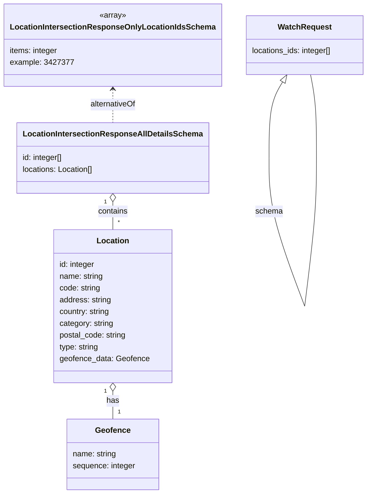
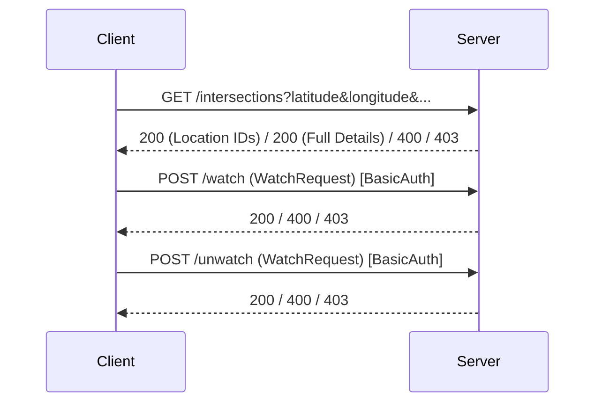
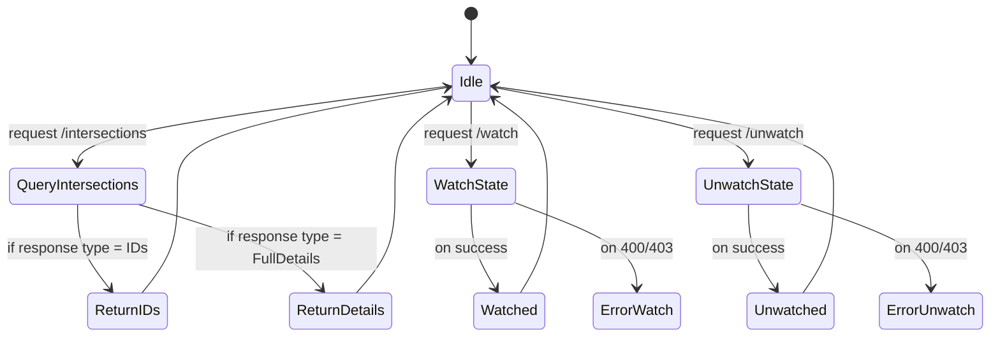

# Diagram: common/location_service/location_service/loc/lambdas/location/api_documentation/LocationService.yaml


> Auto-generated by Obscura crawlers

## Diagram 1

```mermaid
flowchart LR
  Server[https://data.freightverify.com/location]
  Server --> Intersections[/intersections\nGET]
  Server --> Watch[/watch\nPOST]
  Server --> Unwatch[/unwatch\nPOST]
  Intersections --> Params{query parameters}
  Params --> lat[latitude: number (required)]
  Params --> lon[longitude: number (required)]
  Params --> lad[lad: string]
  Params --> lob[lob: string]
  Params --> locids[location_ids: string]
  Params --> category[category: string]
  Intersections --> Responses200[200 OK\nanyOf: IDs or Full Details]
  Intersections --> Resp400[400 Bad Request]
  Intersections --> Resp403[403 Forbidden]
  Watch --> ReqBody[requestBody: WatchRequest]
  Watch --> Resp200w[200 OK]
  Watch --> Resp400w[400 Bad Request]
  Watch --> Resp403w[403 Forbidden]
  Unwatch --> ReqBodyU[requestBody: WatchRequest]
  Unwatch --> Resp200u[200 OK]
  Unwatch --> Resp400u[400 Bad Request]
  Unwatch --> Resp403u[403 Forbidden]
  Security[BasicAuth (http, basic)] -.-> Server
```

> SVG rendering failed for this diagram.

## Diagram 2



### SVG

<svg id="container" width="728.9296875" xmlns="http://www.w3.org/2000/svg" class="classDiagram" height="1006" viewBox="0 0 728.9296875 1006" role="graphics-document document" aria-roledescription="class"><style>#container{font-family:"trebuchet ms",verdana,arial,sans-serif;font-size:16px;fill:#333;}@keyframes edge-animation-frame{from{stroke-dashoffset:0;}}@keyframes dash{to{stroke-dashoffset:0;}}#container .edge-animation-slow{stroke-dasharray:9,5!important;stroke-dashoffset:900;animation:dash 50s linear infinite;stroke-linecap:round;}#container .edge-animation-fast{stroke-dasharray:9,5!important;stroke-dashoffset:900;animation:dash 20s linear infinite;stroke-linecap:round;}#container .error-icon{fill:#552222;}#container .error-text{fill:#552222;stroke:#552222;}#container .edge-thickness-normal{stroke-width:1px;}#container .edge-thickness-thick{stroke-width:3.5px;}#container .edge-pattern-solid{stroke-dasharray:0;}#container .edge-thickness-invisible{stroke-width:0;fill:none;}#container .edge-pattern-dashed{stroke-dasharray:3;}#container .edge-pattern-dotted{stroke-dasharray:2;}#container .marker{fill:#333333;stroke:#333333;}#container .marker.cross{stroke:#333333;}#container svg{font-family:"trebuchet ms",verdana,arial,sans-serif;font-size:16px;}#container p{margin:0;}#container g.classGroup text{fill:#9370DB;stroke:none;font-family:"trebuchet ms",verdana,arial,sans-serif;font-size:10px;}#container g.classGroup text .title{font-weight:bolder;}#container .nodeLabel,#container .edgeLabel{color:#131300;}#container .edgeLabel .label rect{fill:#ECECFF;}#container .label text{fill:#131300;}#container .labelBkg{background:#ECECFF;}#container .edgeLabel .label span{background:#ECECFF;}#container .classTitle{font-weight:bolder;}#container .node rect,#container .node circle,#container .node ellipse,#container .node polygon,#container .node path{fill:#ECECFF;stroke:#9370DB;stroke-width:1px;}#container .divider{stroke:#9370DB;stroke-width:1;}#container g.clickable{cursor:pointer;}#container g.classGroup rect{fill:#ECECFF;stroke:#9370DB;}#container g.classGroup line{stroke:#9370DB;stroke-width:1;}#container .classLabel .box{stroke:none;stroke-width:0;fill:#ECECFF;opacity:0.5;}#container .classLabel .label{fill:#9370DB;font-size:10px;}#container .relation{stroke:#333333;stroke-width:1;fill:none;}#container .dashed-line{stroke-dasharray:3;}#container .dotted-line{stroke-dasharray:1 2;}#container #compositionStart,#container .composition{fill:#333333!important;stroke:#333333!important;stroke-width:1;}#container #compositionEnd,#container .composition{fill:#333333!important;stroke:#333333!important;stroke-width:1;}#container #dependencyStart,#container .dependency{fill:#333333!important;stroke:#333333!important;stroke-width:1;}#container #dependencyStart,#container .dependency{fill:#333333!important;stroke:#333333!important;stroke-width:1;}#container #extensionStart,#container .extension{fill:transparent!important;stroke:#333333!important;stroke-width:1;}#container #extensionEnd,#container .extension{fill:transparent!important;stroke:#333333!important;stroke-width:1;}#container #aggregationStart,#container .aggregation{fill:transparent!important;stroke:#333333!important;stroke-width:1;}#container #aggregationEnd,#container .aggregation{fill:transparent!important;stroke:#333333!important;stroke-width:1;}#container #lollipopStart,#container .lollipop{fill:#ECECFF!important;stroke:#333333!important;stroke-width:1;}#container #lollipopEnd,#container .lollipop{fill:#ECECFF!important;stroke:#333333!important;stroke-width:1;}#container .edgeTerminals{font-size:11px;line-height:initial;}#container .classTitleText{text-anchor:middle;font-size:18px;fill:#333;}#container .label-icon{display:inline-block;height:1em;overflow:visible;vertical-align:-0.125em;}#container .node .label-icon path{fill:currentColor;stroke:revert;stroke-width:revert;}#container :root{--mermaid-font-family:"trebuchet ms",verdana,arial,sans-serif;}</style><g><defs><marker id="container_class-aggregationStart" class="marker aggregation class" refX="18" refY="7" markerWidth="190" markerHeight="240" orient="auto"><path d="M 18,7 L9,13 L1,7 L9,1 Z"></path></marker></defs><defs><marker id="container_class-aggregationEnd" class="marker aggregation class" refX="1" refY="7" markerWidth="20" markerHeight="28" orient="auto"><path d="M 18,7 L9,13 L1,7 L9,1 Z"></path></marker></defs><defs><marker id="container_class-extensionStart" class="marker extension class" refX="18" refY="7" markerWidth="190" markerHeight="240" orient="auto"><path d="M 1,7 L18,13 V 1 Z"></path></marker></defs><defs><marker id="container_class-extensionEnd" class="marker extension class" refX="1" refY="7" markerWidth="20" markerHeight="28" orient="auto"><path d="M 1,1 V 13 L18,7 Z"></path></marker></defs><defs><marker id="container_class-compositionStart" class="marker composition class" refX="18" refY="7" markerWidth="190" markerHeight="240" orient="auto"><path d="M 18,7 L9,13 L1,7 L9,1 Z"></path></marker></defs><defs><marker id="container_class-compositionEnd" class="marker composition class" refX="1" refY="7" markerWidth="20" markerHeight="28" orient="auto"><path d="M 18,7 L9,13 L1,7 L9,1 Z"></path></marker></defs><defs><marker id="container_class-dependencyStart" class="marker dependency class" refX="6" refY="7" markerWidth="190" markerHeight="240" orient="auto"><path d="M 5,7 L9,13 L1,7 L9,1 Z"></path></marker></defs><defs><marker id="container_class-dependencyEnd" class="marker dependency class" refX="13" refY="7" markerWidth="20" markerHeight="28" orient="auto"><path d="M 18,7 L9,13 L14,7 L9,1 Z"></path></marker></defs><defs><marker id="container_class-lollipopStart" class="marker lollipop class" refX="13" refY="7" markerWidth="190" markerHeight="240" orient="auto"><circle stroke="black" fill="transparent" cx="7" cy="7" r="6"></circle></marker></defs><defs><marker id="container_class-lollipopEnd" class="marker lollipop class" refX="1" refY="7" markerWidth="190" markerHeight="240" orient="auto"><circle stroke="black" fill="transparent" cx="7" cy="7" r="6"></circle></marker></defs><g class="root"><g class="clusters"></g><g class="edgePaths"><path d="M218.484,411.25L218.484,414.542C218.484,417.833,218.484,424.417,218.484,433.875C218.484,443.333,218.484,455.667,218.484,461.833L218.484,468" id="id_LocationIntersectionResponseAllDetailsSchema_Location_1" class="edge-thickness-normal edge-pattern-solid relation" style=";;;" data-edge="true" data-et="edge" data-id="id_LocationIntersectionResponseAllDetailsSchema_Location_1" data-points="W3sieCI6MjE4LjQ4NDM3NSwieSI6Mzk0fSx7IngiOjIxOC40ODQzNzUsInkiOjQzMX0seyJ4IjoyMTguNDg0Mzc1LCJ5Ijo0Njh9XQ==" marker-start="url(#container_class-aggregationStart)"></path><path d="M218.484,797.25L218.484,800.542C218.484,803.833,218.484,810.417,218.484,819.875C218.484,829.333,218.484,841.667,218.484,847.833L218.484,854" id="id_Location_Geofence_2" class="edge-thickness-normal edge-pattern-solid relation" style=";;;" data-edge="true" data-et="edge" data-id="id_Location_Geofence_2" data-points="W3sieCI6MjE4LjQ4NDM3NSwieSI6NzgwfSx7IngiOjIxOC40ODQzNzUsInkiOjgxN30seyJ4IjoyMTguNDg0Mzc1LCJ5Ijo4NTR9XQ==" marker-start="url(#container_class-aggregationStart)"></path><path d="M555.162,166.8L550.552,174.5C545.941,182.2,536.72,197.6,532.11,223.458C527.5,249.317,527.5,285.633,527.5,303.792L527.5,321.95" id="WatchRequest-cyclic-special-1" class="edge-thickness-normal edge-pattern-solid relation" style=";;;" data-edge="true" data-et="edge" data-id="WatchRequest-cyclic-special-1" data-points="W3sieCI6NTY0LjAyMzc5MjYxMzgyMTEsInkiOjE1Mn0seyJ4Ijo1MjcuNDk5NjA5Mzc1MzcyNSwieSI6MjEzfSx7IngiOjUyNy40OTk2MDkzNzUzNzI1LCJ5IjozMjEuOTQ5OTk5OTk5MjU0OTR9XQ==" marker-start="url(#container_class-extensionStart)"></path><path d="M527.5,322.05L527.5,340.208C527.5,358.367,527.5,394.683,539.571,445C551.643,495.317,575.787,559.633,587.859,591.792L599.93,623.95" id="WatchRequest-cyclic-special-mid" class="edge-thickness-normal edge-pattern-solid relation" style=";;;" data-edge="true" data-et="edge" data-id="WatchRequest-cyclic-special-mid" data-points="W3sieCI6NTI3LjQ5OTYwOTM3NTM3MjUsInkiOjMyMi4wNTAwMDAwMDA3NDUwNn0seyJ4Ijo1MjcuNDk5NjA5Mzc1MzcyNSwieSI6NDMxfSx7IngiOjU5OS45MzA0NDk0MjA4NjY4LCJ5Ijo2MjMuOTQ5OTk5OTk5MjU0OX1d"></path><path d="M599.955,623.95L603.939,591.792C607.923,559.633,615.891,495.317,619.875,444.992C623.859,394.667,623.859,358.333,623.859,322C623.859,285.667,623.859,249.333,621.85,221C619.841,192.667,615.823,172.333,613.814,162.167L611.805,152" id="WatchRequest-cyclic-special-2" class="edge-thickness-normal edge-pattern-solid relation" style=";;;" data-edge="true" data-et="edge" data-id="WatchRequest-cyclic-special-2" data-points="W3sieCI6NTk5Ljk1NTQxMzA5MTA4OTcsInkiOjYyMy45NDk5OTk5OTkyNTQ5fSx7IngiOjYyMy44NTkzNzUsInkiOjQzMX0seyJ4Ijo2MjMuODU5Mzc1LCJ5IjozMjJ9LHsieCI6NjIzLjg1OTM3NSwieSI6MjEzfSx7IngiOjYxMS44MDU0OTQ1NzY0NDYzLCJ5IjoxNTJ9XQ=="></path><path d="M218.484,182L218.484,187.167C218.484,192.333,218.484,202.667,218.484,214C218.484,225.333,218.484,237.667,218.484,243.833L218.484,250" id="id_LocationIntersectionResponseOnlyLocationIdsSchema_LocationIntersectionResponseAllDetailsSchema_4" class="edge-thickness-normal edge-pattern-dashed relation" style=";;;" data-edge="true" data-et="edge" data-id="id_LocationIntersectionResponseOnlyLocationIdsSchema_LocationIntersectionResponseAllDetailsSchema_4" data-points="W3sieCI6MjE4LjQ4NDM3NSwieSI6MTc2fSx7IngiOjIxOC40ODQzNzUsInkiOjIxM30seyJ4IjoyMTguNDg0Mzc1LCJ5IjoyNTB9XQ==" marker-start="url(#container_class-dependencyStart)"></path></g><g class="edgeLabels"><g class="edgeLabel" transform="translate(218.484375, 431)"><g class="label" data-id="id_LocationIntersectionResponseAllDetailsSchema_Location_1" transform="translate(-30.890625, -12)"><foreignObject width="61.78125" height="24"><div xmlns="http://www.w3.org/1999/xhtml" class="labelBkg" style="display: table-cell; white-space: nowrap; line-height: 1.5; max-width: 200px; text-align: center;"><span class="edgeLabel"><p>contains</p></span></div></foreignObject></g></g><g class="edgeLabel" transform="translate(218.484375, 817)"><g class="label" data-id="id_Location_Geofence_2" transform="translate(-12.703125, -12)"><foreignObject width="25.40625" height="24"><div xmlns="http://www.w3.org/1999/xhtml" class="labelBkg" style="display: table-cell; white-space: nowrap; line-height: 1.5; max-width: 200px; text-align: center;"><span class="edgeLabel"><p>has</p></span></div></foreignObject></g></g><g class="edgeLabel"><g class="label" data-id="WatchRequest-cyclic-special-1" transform="translate(0, 0)"><foreignObject width="0" height="0"><div xmlns="http://www.w3.org/1999/xhtml" class="labelBkg" style="display: table-cell; white-space: nowrap; line-height: 1.5; max-width: 200px; text-align: center;"><span class="edgeLabel"></span></div></foreignObject></g></g><g class="edgeLabel" transform="translate(544.5703, 476.47495)"><g class="label" data-id="WatchRequest-cyclic-special-mid" transform="translate(-27.8203125, -12)"><foreignObject width="55.640625" height="24"><div xmlns="http://www.w3.org/1999/xhtml" class="labelBkg" style="display: table-cell; white-space: nowrap; line-height: 1.5; max-width: 200px; text-align: center;"><span class="edgeLabel"><p>schema</p></span></div></foreignObject></g></g><g class="edgeLabel"><g class="label" data-id="WatchRequest-cyclic-special-2" transform="translate(0, 0)"><foreignObject width="0" height="0"><div xmlns="http://www.w3.org/1999/xhtml" class="labelBkg" style="display: table-cell; white-space: nowrap; line-height: 1.5; max-width: 200px; text-align: center;"><span class="edgeLabel"></span></div></foreignObject></g></g><g class="edgeLabel" transform="translate(218.484375, 213)"><g class="label" data-id="id_LocationIntersectionResponseOnlyLocationIdsSchema_LocationIntersectionResponseAllDetailsSchema_4" transform="translate(-47.5, -12)"><foreignObject width="95" height="24"><div xmlns="http://www.w3.org/1999/xhtml" class="labelBkg" style="display: table-cell; white-space: nowrap; line-height: 1.5; max-width: 200px; text-align: center;"><span class="edgeLabel"><p>alternativeOf</p></span></div></foreignObject></g></g><g class="edgeTerminals" transform="translate(203.48437750000014, 411.5000021428571)"><g class="inner" transform="translate(0, 0)"><foreignObject style="width: 9px; height: 12px;"><div xmlns="http://www.w3.org/1999/xhtml" style="display: inline-block; padding-right: 1px; white-space: nowrap;"><span class="edgeLabel">1</span></div></foreignObject></g></g><g class="edgeTerminals" transform="translate(203.48437750000014, 797.5000021428572)"><g class="inner" transform="translate(0, 0)"><foreignObject style="width: 9px; height: 12px;"><div xmlns="http://www.w3.org/1999/xhtml" style="display: inline-block; padding-right: 1px; white-space: nowrap;"><span class="edgeLabel">1</span></div></foreignObject></g></g><g class="edgeTerminals" transform="translate(228.48437749999985, 445.5000021428571)"><g class="inner" transform="translate(0, 0)"></g><foreignObject style="width: 9px; height: 12px;"><div xmlns="http://www.w3.org/1999/xhtml" style="display: inline-block; padding-right: 1px; white-space: nowrap;"><span class="edgeLabel">*</span></div></foreignObject></g><g class="edgeTerminals" transform="translate(228.48437749999985, 831.5000021428572)"><g class="inner" transform="translate(0, 0)"></g><foreignObject style="width: 9px; height: 12px;"><div xmlns="http://www.w3.org/1999/xhtml" style="display: inline-block; padding-right: 1px; white-space: nowrap;"><span class="edgeLabel">1</span></div></foreignObject></g></g><g class="nodes"><g class="node default" id="classId-LocationIntersectionResponseOnlyLocationIdsSchema-0" transform="translate(218.484375, 92)"><g class="basic label-container"><path d="M-210.484375 -84 L210.484375 -84 L210.484375 84 L-210.484375 84" stroke="none" stroke-width="0" fill="#ECECFF" style=""></path><path d="M-210.484375 -84 C-57.36505058150078 -84, 95.75427383699844 -84, 210.484375 -84 M-210.484375 -84 C-43.897220437098525 -84, 122.68993412580295 -84, 210.484375 -84 M210.484375 -84 C210.484375 -26.297385182180165, 210.484375 31.40522963563967, 210.484375 84 M210.484375 -84 C210.484375 -27.23700238130725, 210.484375 29.5259952373855, 210.484375 84 M210.484375 84 C107.54205852954553 84, 4.5997420590910565 84, -210.484375 84 M210.484375 84 C111.54233146218517 84, 12.600287924370349 84, -210.484375 84 M-210.484375 84 C-210.484375 22.697678513091162, -210.484375 -38.604642973817676, -210.484375 -84 M-210.484375 84 C-210.484375 26.122429292638074, -210.484375 -31.75514141472385, -210.484375 -84" stroke="#9370DB" stroke-width="1.3" fill="none" stroke-dasharray="0 0" style=""></path></g><g class="annotation-group text" transform="translate(-27.4296875, -60)"><g class="label" style="" transform="translate(0,-12)"><foreignObject width="54.859375" height="24"><div xmlns="http://www.w3.org/1999/xhtml" style="display: table-cell; white-space: nowrap; line-height: 1.5; max-width: 105px; text-align: center;"><span class="nodeLabel markdown-node-label" style=""><p>«array»</p></span></div></foreignObject></g></g><g class="label-group text" transform="translate(-198.484375, -36)"><g class="label" style="font-weight: bolder" transform="translate(0,-12)"><foreignObject width="396.96875" height="24"><div xmlns="http://www.w3.org/1999/xhtml" style="display: table-cell; white-space: nowrap; line-height: 1.5; max-width: 443px; text-align: center;"><span class="nodeLabel markdown-node-label" style=""><p>LocationIntersectionResponseOnlyLocationIdsSchema</p></span></div></foreignObject></g></g><g class="members-group text" transform="translate(-198.484375, 12)"><g class="label" style="" transform="translate(0,-12)"><foreignObject width="99.140625" height="24"><div xmlns="http://www.w3.org/1999/xhtml" style="display: table-cell; white-space: nowrap; line-height: 1.5; max-width: 150px; text-align: center;"><span class="nodeLabel markdown-node-label" style=""><p>items: integer</p></span></div></foreignObject></g><g class="label" style="" transform="translate(0,12)"><foreignObject width="122.34375" height="24"><div xmlns="http://www.w3.org/1999/xhtml" style="display: table-cell; white-space: nowrap; line-height: 1.5; max-width: 172px; text-align: center;"><span class="nodeLabel markdown-node-label" style=""><p>example: 3427377</p></span></div></foreignObject></g></g><g class="methods-group text" transform="translate(-198.484375, 84)"></g><g class="divider" style=""><path d="M-210.484375 -12 C-106.60352535066059 -12, -2.7226757013211795 -12, 210.484375 -12 M-210.484375 -12 C-104.82309737614972 -12, 0.8381802477005635 -12, 210.484375 -12" stroke="#9370DB" stroke-width="1.3" fill="none" stroke-dasharray="0 0" style=""></path></g><g class="divider" style=""><path d="M-210.484375 60 C-51.485961057751496 60, 107.51245288449701 60, 210.484375 60 M-210.484375 60 C-52.31644594538761 60, 105.85148310922477 60, 210.484375 60" stroke="#9370DB" stroke-width="1.3" fill="none" stroke-dasharray="0 0" style=""></path></g></g><g class="node default" id="classId-LocationIntersectionResponseAllDetailsSchema-1" transform="translate(218.484375, 322)"><g class="basic label-container"><path d="M-186.515625 -72 L186.515625 -72 L186.515625 72 L-186.515625 72" stroke="none" stroke-width="0" fill="#ECECFF" style=""></path><path d="M-186.515625 -72 C-109.17883863089847 -72, -31.842052261796937 -72, 186.515625 -72 M-186.515625 -72 C-105.61818574029577 -72, -24.720746480591544 -72, 186.515625 -72 M186.515625 -72 C186.515625 -27.19370571133689, 186.515625 17.61258857732622, 186.515625 72 M186.515625 -72 C186.515625 -16.39527281380299, 186.515625 39.20945437239402, 186.515625 72 M186.515625 72 C86.38029806421416 72, -13.755028871571682 72, -186.515625 72 M186.515625 72 C58.634565568247794 72, -69.24649386350441 72, -186.515625 72 M-186.515625 72 C-186.515625 24.294429407971876, -186.515625 -23.411141184056248, -186.515625 -72 M-186.515625 72 C-186.515625 24.731834873366935, -186.515625 -22.53633025326613, -186.515625 -72" stroke="#9370DB" stroke-width="1.3" fill="none" stroke-dasharray="0 0" style=""></path></g><g class="annotation-group text" transform="translate(0, -48)"></g><g class="label-group text" transform="translate(-174.515625, -48)"><g class="label" style="font-weight: bolder" transform="translate(0,-12)"><foreignObject width="349.03125" height="24"><div xmlns="http://www.w3.org/1999/xhtml" style="display: table-cell; white-space: nowrap; line-height: 1.5; max-width: 395px; text-align: center;"><span class="nodeLabel markdown-node-label" style=""><p>LocationIntersectionResponseAllDetailsSchema</p></span></div></foreignObject></g></g><g class="members-group text" transform="translate(-174.515625, 0)"><g class="label" style="" transform="translate(0,-12)"><foreignObject width="83.578125" height="24"><div xmlns="http://www.w3.org/1999/xhtml" style="display: table-cell; white-space: nowrap; line-height: 1.5; max-width: 134px; text-align: center;"><span class="nodeLabel markdown-node-label" style=""><p>id: integer[]</p></span></div></foreignObject></g><g class="label" style="" transform="translate(0,12)"><foreignObject width="147.125" height="24"><div xmlns="http://www.w3.org/1999/xhtml" style="display: table-cell; white-space: nowrap; line-height: 1.5; max-width: 197px; text-align: center;"><span class="nodeLabel markdown-node-label" style=""><p>locations: Location[]</p></span></div></foreignObject></g></g><g class="methods-group text" transform="translate(-174.515625, 72)"></g><g class="divider" style=""><path d="M-186.515625 -24 C-96.46889957578665 -24, -6.4221741515733015 -24, 186.515625 -24 M-186.515625 -24 C-102.80487814469217 -24, -19.094131289384336 -24, 186.515625 -24" stroke="#9370DB" stroke-width="1.3" fill="none" stroke-dasharray="0 0" style=""></path></g><g class="divider" style=""><path d="M-186.515625 48 C-109.45362370741032 48, -32.39162241482063 48, 186.515625 48 M-186.515625 48 C-55.04206929263873 48, 76.43148641472254 48, 186.515625 48" stroke="#9370DB" stroke-width="1.3" fill="none" stroke-dasharray="0 0" style=""></path></g></g><g class="node default" id="classId-Location-2" transform="translate(218.484375, 624)"><g class="basic label-container"><path d="M-118.37109375 -156 L118.37109375 -156 L118.37109375 156 L-118.37109375 156" stroke="none" stroke-width="0" fill="#ECECFF" style=""></path><path d="M-118.37109375 -156 C-59.452450451886065 -156, -0.5338071537721305 -156, 118.37109375 -156 M-118.37109375 -156 C-32.52015703972046 -156, 53.33077967055908 -156, 118.37109375 -156 M118.37109375 -156 C118.37109375 -51.41248282630269, 118.37109375 53.175034347394615, 118.37109375 156 M118.37109375 -156 C118.37109375 -47.51344417969955, 118.37109375 60.973111640600905, 118.37109375 156 M118.37109375 156 C27.31090327887628 156, -63.74928719224744 156, -118.37109375 156 M118.37109375 156 C60.558655620127865 156, 2.746217490255731 156, -118.37109375 156 M-118.37109375 156 C-118.37109375 68.20666302758609, -118.37109375 -19.586673944827822, -118.37109375 -156 M-118.37109375 156 C-118.37109375 63.21629324568866, -118.37109375 -29.56741350862268, -118.37109375 -156" stroke="#9370DB" stroke-width="1.3" fill="none" stroke-dasharray="0 0" style=""></path></g><g class="annotation-group text" transform="translate(0, -132)"></g><g class="label-group text" transform="translate(-31.3515625, -132)"><g class="label" style="font-weight: bolder" transform="translate(0,-12)"><foreignObject width="62.703125" height="24"><div xmlns="http://www.w3.org/1999/xhtml" style="display: table-cell; white-space: nowrap; line-height: 1.5; max-width: 112px; text-align: center;"><span class="nodeLabel markdown-node-label" style=""><p>Location</p></span></div></foreignObject></g></g><g class="members-group text" transform="translate(-106.37109375, -84)"><g class="label" style="" transform="translate(0,-12)"><foreignObject width="73.265625" height="24"><div xmlns="http://www.w3.org/1999/xhtml" style="display: table-cell; white-space: nowrap; line-height: 1.5; max-width: 124px; text-align: center;"><span class="nodeLabel markdown-node-label" style=""><p>id: integer</p></span></div></foreignObject></g><g class="label" style="" transform="translate(0,12)"><foreignObject width="90.234375" height="24"><div xmlns="http://www.w3.org/1999/xhtml" style="display: table-cell; white-space: nowrap; line-height: 1.5; max-width: 141px; text-align: center;"><span class="nodeLabel markdown-node-label" style=""><p>name: string</p></span></div></foreignObject></g><g class="label" style="" transform="translate(0,36)"><foreignObject width="84.6875" height="24"><div xmlns="http://www.w3.org/1999/xhtml" style="display: table-cell; white-space: nowrap; line-height: 1.5; max-width: 135px; text-align: center;"><span class="nodeLabel markdown-node-label" style=""><p>code: string</p></span></div></foreignObject></g><g class="label" style="" transform="translate(0,60)"><foreignObject width="106.765625" height="24"><div xmlns="http://www.w3.org/1999/xhtml" style="display: table-cell; white-space: nowrap; line-height: 1.5; max-width: 157px; text-align: center;"><span class="nodeLabel markdown-node-label" style=""><p>address: string</p></span></div></foreignObject></g><g class="label" style="" transform="translate(0,84)"><foreignObject width="104.96875" height="24"><div xmlns="http://www.w3.org/1999/xhtml" style="display: table-cell; white-space: nowrap; line-height: 1.5; max-width: 156px; text-align: center;"><span class="nodeLabel markdown-node-label" style=""><p>country: string</p></span></div></foreignObject></g><g class="label" style="" transform="translate(0,108)"><foreignObject width="111.6875" height="24"><div xmlns="http://www.w3.org/1999/xhtml" style="display: table-cell; white-space: nowrap; line-height: 1.5; max-width: 162px; text-align: center;"><span class="nodeLabel markdown-node-label" style=""><p>category: string</p></span></div></foreignObject></g><g class="label" style="" transform="translate(0,132)"><foreignObject width="137.890625" height="24"><div xmlns="http://www.w3.org/1999/xhtml" style="display: table-cell; white-space: nowrap; line-height: 1.5; max-width: 189px; text-align: center;"><span class="nodeLabel markdown-node-label" style=""><p>postal_code: string</p></span></div></foreignObject></g><g class="label" style="" transform="translate(0,156)"><foreignObject width="81.515625" height="24"><div xmlns="http://www.w3.org/1999/xhtml" style="display: table-cell; white-space: nowrap; line-height: 1.5; max-width: 132px; text-align: center;"><span class="nodeLabel markdown-node-label" style=""><p>type: string</p></span></div></foreignObject></g><g class="label" style="" transform="translate(0,180)"><foreignObject width="181.390625" height="24"><div xmlns="http://www.w3.org/1999/xhtml" style="display: table-cell; white-space: nowrap; line-height: 1.5; max-width: 231px; text-align: center;"><span class="nodeLabel markdown-node-label" style=""><p>geofence_data: Geofence</p></span></div></foreignObject></g></g><g class="methods-group text" transform="translate(-106.37109375, 156)"></g><g class="divider" style=""><path d="M-118.37109375 -108 C-31.726156484862514 -108, 54.91878078027497 -108, 118.37109375 -108 M-118.37109375 -108 C-62.144143061523806 -108, -5.917192373047612 -108, 118.37109375 -108" stroke="#9370DB" stroke-width="1.3" fill="none" stroke-dasharray="0 0" style=""></path></g><g class="divider" style=""><path d="M-118.37109375 132 C-51.630459691535194 132, 15.110174366929613 132, 118.37109375 132 M-118.37109375 132 C-45.37529555773624 132, 27.620502634527526 132, 118.37109375 132" stroke="#9370DB" stroke-width="1.3" fill="none" stroke-dasharray="0 0" style=""></path></g></g><g class="node default" id="classId-Geofence-3" transform="translate(218.484375, 926)"><g class="basic label-container"><path d="M-93.2734375 -72 L93.2734375 -72 L93.2734375 72 L-93.2734375 72" stroke="none" stroke-width="0" fill="#ECECFF" style=""></path><path d="M-93.2734375 -72 C-36.56397219148435 -72, 20.145493117031293 -72, 93.2734375 -72 M-93.2734375 -72 C-45.90049390961558 -72, 1.4724496807688467 -72, 93.2734375 -72 M93.2734375 -72 C93.2734375 -25.472058838807342, 93.2734375 21.055882322385315, 93.2734375 72 M93.2734375 -72 C93.2734375 -42.4850663660427, 93.2734375 -12.97013273208541, 93.2734375 72 M93.2734375 72 C26.061555781136548 72, -41.150325937726905 72, -93.2734375 72 M93.2734375 72 C34.540884321999755 72, -24.19166885600049 72, -93.2734375 72 M-93.2734375 72 C-93.2734375 28.686257860587418, -93.2734375 -14.627484278825165, -93.2734375 -72 M-93.2734375 72 C-93.2734375 37.48576470476902, -93.2734375 2.971529409538036, -93.2734375 -72" stroke="#9370DB" stroke-width="1.3" fill="none" stroke-dasharray="0 0" style=""></path></g><g class="annotation-group text" transform="translate(0, -48)"></g><g class="label-group text" transform="translate(-34.140625, -48)"><g class="label" style="font-weight: bolder" transform="translate(0,-12)"><foreignObject width="68.28125" height="24"><div xmlns="http://www.w3.org/1999/xhtml" style="display: table-cell; white-space: nowrap; line-height: 1.5; max-width: 118px; text-align: center;"><span class="nodeLabel markdown-node-label" style=""><p>Geofence</p></span></div></foreignObject></g></g><g class="members-group text" transform="translate(-81.2734375, 0)"><g class="label" style="" transform="translate(0,-12)"><foreignObject width="90.234375" height="24"><div xmlns="http://www.w3.org/1999/xhtml" style="display: table-cell; white-space: nowrap; line-height: 1.5; max-width: 141px; text-align: center;"><span class="nodeLabel markdown-node-label" style=""><p>name: string</p></span></div></foreignObject></g><g class="label" style="" transform="translate(0,12)"><foreignObject width="128.40625" height="24"><div xmlns="http://www.w3.org/1999/xhtml" style="display: table-cell; white-space: nowrap; line-height: 1.5; max-width: 179px; text-align: center;"><span class="nodeLabel markdown-node-label" style=""><p>sequence: integer</p></span></div></foreignObject></g></g><g class="methods-group text" transform="translate(-81.2734375, 72)"></g><g class="divider" style=""><path d="M-93.2734375 -24 C-52.87645366933079 -24, -12.479469838661586 -24, 93.2734375 -24 M-93.2734375 -24 C-42.92589450623934 -24, 7.421648487521324 -24, 93.2734375 -24" stroke="#9370DB" stroke-width="1.3" fill="none" stroke-dasharray="0 0" style=""></path></g><g class="divider" style=""><path d="M-93.2734375 48 C-41.16480649522887 48, 10.943824509542253 48, 93.2734375 48 M-93.2734375 48 C-29.599383521211642 48, 34.074670457576715 48, 93.2734375 48" stroke="#9370DB" stroke-width="1.3" fill="none" stroke-dasharray="0 0" style=""></path></g></g><g class="node default" id="classId-WatchRequest-4" transform="translate(599.94921875, 92)"><g class="basic label-container"><path d="M-120.98046875 -60 L120.98046875 -60 L120.98046875 60 L-120.98046875 60" stroke="none" stroke-width="0" fill="#ECECFF" style=""></path><path d="M-120.98046875 -60 C-49.64776761488187 -60, 21.684933520236257 -60, 120.98046875 -60 M-120.98046875 -60 C-44.03557854172729 -60, 32.90931166654542 -60, 120.98046875 -60 M120.98046875 -60 C120.98046875 -33.758654008622784, 120.98046875 -7.5173080172455755, 120.98046875 60 M120.98046875 -60 C120.98046875 -35.83036309171986, 120.98046875 -11.660726183439728, 120.98046875 60 M120.98046875 60 C46.0185444118943 60, -28.943379926211406 60, -120.98046875 60 M120.98046875 60 C42.31268190678351 60, -36.35510493643298 60, -120.98046875 60 M-120.98046875 60 C-120.98046875 34.6289650138946, -120.98046875 9.257930027789193, -120.98046875 -60 M-120.98046875 60 C-120.98046875 18.941875846894007, -120.98046875 -22.116248306211986, -120.98046875 -60" stroke="#9370DB" stroke-width="1.3" fill="none" stroke-dasharray="0 0" style=""></path></g><g class="annotation-group text" transform="translate(0, -36)"></g><g class="label-group text" transform="translate(-52.2890625, -36)"><g class="label" style="font-weight: bolder" transform="translate(0,-12)"><foreignObject width="104.578125" height="24"><div xmlns="http://www.w3.org/1999/xhtml" style="display: table-cell; white-space: nowrap; line-height: 1.5; max-width: 153px; text-align: center;"><span class="nodeLabel markdown-node-label" style=""><p>WatchRequest</p></span></div></foreignObject></g></g><g class="members-group text" transform="translate(-108.98046875, 12)"><g class="label" style="" transform="translate(0,-12)"><foreignObject width="165.671875" height="24"><div xmlns="http://www.w3.org/1999/xhtml" style="display: table-cell; white-space: nowrap; line-height: 1.5; max-width: 216px; text-align: center;"><span class="nodeLabel markdown-node-label" style=""><p>locations_ids: integer[]</p></span></div></foreignObject></g></g><g class="methods-group text" transform="translate(-108.98046875, 60)"></g><g class="divider" style=""><path d="M-120.98046875 -12 C-49.979996973660406 -12, 21.02047480267919 -12, 120.98046875 -12 M-120.98046875 -12 C-45.155998975374516 -12, 30.66847079925097 -12, 120.98046875 -12" stroke="#9370DB" stroke-width="1.3" fill="none" stroke-dasharray="0 0" style=""></path></g><g class="divider" style=""><path d="M-120.98046875 36 C-56.049633908761805 36, 8.88120093247639 36, 120.98046875 36 M-120.98046875 36 C-29.266502394010843 36, 62.447463961978315 36, 120.98046875 36" stroke="#9370DB" stroke-width="1.3" fill="none" stroke-dasharray="0 0" style=""></path></g></g><g class="label edgeLabel" id="WatchRequest---WatchRequest---1" transform="translate(527.4996093753725, 322)"><rect width="0.1" height="0.1"></rect><g class="label" style="" transform="translate(0, 0)"><rect></rect><foreignObject width="0" height="0"><div xmlns="http://www.w3.org/1999/xhtml" style="display: table-cell; white-space: nowrap; line-height: 1.5; max-width: 10px; text-align: center;"><span class="nodeLabel"></span></div></foreignObject></g></g><g class="label edgeLabel" id="WatchRequest---WatchRequest---2" transform="translate(599.94921875, 624)"><rect width="0.1" height="0.1"></rect><g class="label" style="" transform="translate(0, 0)"><rect></rect><foreignObject width="0" height="0"><div xmlns="http://www.w3.org/1999/xhtml" style="display: table-cell; white-space: nowrap; line-height: 1.5; max-width: 10px; text-align: center;"><span class="nodeLabel"></span></div></foreignObject></g></g></g></g></g></svg>

## Diagram 3



### SVG

<svg id="container" width="672" xmlns="http://www.w3.org/2000/svg" height="459" viewBox="-50 -10 672 459" role="graphics-document document" aria-roledescription="sequence"><g><rect x="422" y="373" fill="#eaeaea" stroke="#666" width="150" height="65" name="Server" rx="3" ry="3" class="actor actor-bottom"></rect><text x="497" y="405.5" dominant-baseline="central" alignment-baseline="central" class="actor actor-box" style="text-anchor: middle; font-size: 16px; font-weight: 400;"><tspan x="497" dy="0">Server</tspan></text></g><g><rect x="0" y="373" fill="#eaeaea" stroke="#666" width="150" height="65" name="Client" rx="3" ry="3" class="actor actor-bottom"></rect><text x="75" y="405.5" dominant-baseline="central" alignment-baseline="central" class="actor actor-box" style="text-anchor: middle; font-size: 16px; font-weight: 400;"><tspan x="75" dy="0">Client</tspan></text></g><g><line id="actor1" x1="497" y1="65" x2="497" y2="373" class="actor-line 200" stroke-width="0.5px" stroke="#999" name="Server"></line><g id="root-1"><rect x="422" y="0" fill="#eaeaea" stroke="#666" width="150" height="65" name="Server" rx="3" ry="3" class="actor actor-top"></rect><text x="497" y="32.5" dominant-baseline="central" alignment-baseline="central" class="actor actor-box" style="text-anchor: middle; font-size: 16px; font-weight: 400;"><tspan x="497" dy="0">Server</tspan></text></g></g><g><line id="actor0" x1="75" y1="65" x2="75" y2="373" class="actor-line 200" stroke-width="0.5px" stroke="#999" name="Client"></line><g id="root-0"><rect x="0" y="0" fill="#eaeaea" stroke="#666" width="150" height="65" name="Client" rx="3" ry="3" class="actor actor-top"></rect><text x="75" y="32.5" dominant-baseline="central" alignment-baseline="central" class="actor actor-box" style="text-anchor: middle; font-size: 16px; font-weight: 400;"><tspan x="75" dy="0">Client</tspan></text></g></g><style>#container{font-family:"trebuchet ms",verdana,arial,sans-serif;font-size:16px;fill:#333;}@keyframes edge-animation-frame{from{stroke-dashoffset:0;}}@keyframes dash{to{stroke-dashoffset:0;}}#container .edge-animation-slow{stroke-dasharray:9,5!important;stroke-dashoffset:900;animation:dash 50s linear infinite;stroke-linecap:round;}#container .edge-animation-fast{stroke-dasharray:9,5!important;stroke-dashoffset:900;animation:dash 20s linear infinite;stroke-linecap:round;}#container .error-icon{fill:#552222;}#container .error-text{fill:#552222;stroke:#552222;}#container .edge-thickness-normal{stroke-width:1px;}#container .edge-thickness-thick{stroke-width:3.5px;}#container .edge-pattern-solid{stroke-dasharray:0;}#container .edge-thickness-invisible{stroke-width:0;fill:none;}#container .edge-pattern-dashed{stroke-dasharray:3;}#container .edge-pattern-dotted{stroke-dasharray:2;}#container .marker{fill:#333333;stroke:#333333;}#container .marker.cross{stroke:#333333;}#container svg{font-family:"trebuchet ms",verdana,arial,sans-serif;font-size:16px;}#container p{margin:0;}#container .actor{stroke:hsl(259.6261682243, 59.7765363128%, 87.9019607843%);fill:#ECECFF;}#container text.actor&gt;tspan{fill:black;stroke:none;}#container .actor-line{stroke:hsl(259.6261682243, 59.7765363128%, 87.9019607843%);}#container .innerArc{stroke-width:1.5;stroke-dasharray:none;}#container .messageLine0{stroke-width:1.5;stroke-dasharray:none;stroke:#333;}#container .messageLine1{stroke-width:1.5;stroke-dasharray:2,2;stroke:#333;}#container #arrowhead path{fill:#333;stroke:#333;}#container .sequenceNumber{fill:white;}#container #sequencenumber{fill:#333;}#container #crosshead path{fill:#333;stroke:#333;}#container .messageText{fill:#333;stroke:none;}#container .labelBox{stroke:hsl(259.6261682243, 59.7765363128%, 87.9019607843%);fill:#ECECFF;}#container .labelText,#container .labelText&gt;tspan{fill:black;stroke:none;}#container .loopText,#container .loopText&gt;tspan{fill:black;stroke:none;}#container .loopLine{stroke-width:2px;stroke-dasharray:2,2;stroke:hsl(259.6261682243, 59.7765363128%, 87.9019607843%);fill:hsl(259.6261682243, 59.7765363128%, 87.9019607843%);}#container .note{stroke:#aaaa33;fill:#fff5ad;}#container .noteText,#container .noteText&gt;tspan{fill:black;stroke:none;}#container .activation0{fill:#f4f4f4;stroke:#666;}#container .activation1{fill:#f4f4f4;stroke:#666;}#container .activation2{fill:#f4f4f4;stroke:#666;}#container .actorPopupMenu{position:absolute;}#container .actorPopupMenuPanel{position:absolute;fill:#ECECFF;box-shadow:0px 8px 16px 0px rgba(0,0,0,0.2);filter:drop-shadow(3px 5px 2px rgb(0 0 0 / 0.4));}#container .actor-man line{stroke:hsl(259.6261682243, 59.7765363128%, 87.9019607843%);fill:#ECECFF;}#container .actor-man circle,#container line{stroke:hsl(259.6261682243, 59.7765363128%, 87.9019607843%);fill:#ECECFF;stroke-width:2px;}#container :root{--mermaid-font-family:"trebuchet ms",verdana,arial,sans-serif;}</style><g></g><defs><symbol id="computer" width="24" height="24"><path transform="scale(.5)" d="M2 2v13h20v-13h-20zm18 11h-16v-9h16v9zm-10.228 6l.466-1h3.524l.467 1h-4.457zm14.228 3h-24l2-6h2.104l-1.33 4h18.45l-1.297-4h2.073l2 6zm-5-10h-14v-7h14v7z"></path></symbol></defs><defs><symbol id="database" fill-rule="evenodd" clip-rule="evenodd"><path transform="scale(.5)" d="M12.258.001l.256.004.255.005.253.008.251.01.249.012.247.015.246.016.242.019.241.02.239.023.236.024.233.027.231.028.229.031.225.032.223.034.22.036.217.038.214.04.211.041.208.043.205.045.201.046.198.048.194.05.191.051.187.053.183.054.18.056.175.057.172.059.168.06.163.061.16.063.155.064.15.066.074.033.073.033.071.034.07.034.069.035.068.035.067.035.066.035.064.036.064.036.062.036.06.036.06.037.058.037.058.037.055.038.055.038.053.038.052.038.051.039.05.039.048.039.047.039.045.04.044.04.043.04.041.04.04.041.039.041.037.041.036.041.034.041.033.042.032.042.03.042.029.042.027.042.026.043.024.043.023.043.021.043.02.043.018.044.017.043.015.044.013.044.012.044.011.045.009.044.007.045.006.045.004.045.002.045.001.045v17l-.001.045-.002.045-.004.045-.006.045-.007.045-.009.044-.011.045-.012.044-.013.044-.015.044-.017.043-.018.044-.02.043-.021.043-.023.043-.024.043-.026.043-.027.042-.029.042-.03.042-.032.042-.033.042-.034.041-.036.041-.037.041-.039.041-.04.041-.041.04-.043.04-.044.04-.045.04-.047.039-.048.039-.05.039-.051.039-.052.038-.053.038-.055.038-.055.038-.058.037-.058.037-.06.037-.06.036-.062.036-.064.036-.064.036-.066.035-.067.035-.068.035-.069.035-.07.034-.071.034-.073.033-.074.033-.15.066-.155.064-.16.063-.163.061-.168.06-.172.059-.175.057-.18.056-.183.054-.187.053-.191.051-.194.05-.198.048-.201.046-.205.045-.208.043-.211.041-.214.04-.217.038-.22.036-.223.034-.225.032-.229.031-.231.028-.233.027-.236.024-.239.023-.241.02-.242.019-.246.016-.247.015-.249.012-.251.01-.253.008-.255.005-.256.004-.258.001-.258-.001-.256-.004-.255-.005-.253-.008-.251-.01-.249-.012-.247-.015-.245-.016-.243-.019-.241-.02-.238-.023-.236-.024-.234-.027-.231-.028-.228-.031-.226-.032-.223-.034-.22-.036-.217-.038-.214-.04-.211-.041-.208-.043-.204-.045-.201-.046-.198-.048-.195-.05-.19-.051-.187-.053-.184-.054-.179-.056-.176-.057-.172-.059-.167-.06-.164-.061-.159-.063-.155-.064-.151-.066-.074-.033-.072-.033-.072-.034-.07-.034-.069-.035-.068-.035-.067-.035-.066-.035-.064-.036-.063-.036-.062-.036-.061-.036-.06-.037-.058-.037-.057-.037-.056-.038-.055-.038-.053-.038-.052-.038-.051-.039-.049-.039-.049-.039-.046-.039-.046-.04-.044-.04-.043-.04-.041-.04-.04-.041-.039-.041-.037-.041-.036-.041-.034-.041-.033-.042-.032-.042-.03-.042-.029-.042-.027-.042-.026-.043-.024-.043-.023-.043-.021-.043-.02-.043-.018-.044-.017-.043-.015-.044-.013-.044-.012-.044-.011-.045-.009-.044-.007-.045-.006-.045-.004-.045-.002-.045-.001-.045v-17l.001-.045.002-.045.004-.045.006-.045.007-.045.009-.044.011-.045.012-.044.013-.044.015-.044.017-.043.018-.044.02-.043.021-.043.023-.043.024-.043.026-.043.027-.042.029-.042.03-.042.032-.042.033-.042.034-.041.036-.041.037-.041.039-.041.04-.041.041-.04.043-.04.044-.04.046-.04.046-.039.049-.039.049-.039.051-.039.052-.038.053-.038.055-.038.056-.038.057-.037.058-.037.06-.037.061-.036.062-.036.063-.036.064-.036.066-.035.067-.035.068-.035.069-.035.07-.034.072-.034.072-.033.074-.033.151-.066.155-.064.159-.063.164-.061.167-.06.172-.059.176-.057.179-.056.184-.054.187-.053.19-.051.195-.05.198-.048.201-.046.204-.045.208-.043.211-.041.214-.04.217-.038.22-.036.223-.034.226-.032.228-.031.231-.028.234-.027.236-.024.238-.023.241-.02.243-.019.245-.016.247-.015.249-.012.251-.01.253-.008.255-.005.256-.004.258-.001.258.001zm-9.258 20.499v.01l.001.021.003.021.004.022.005.021.006.022.007.022.009.023.01.022.011.023.012.023.013.023.015.023.016.024.017.023.018.024.019.024.021.024.022.025.023.024.024.025.052.049.056.05.061.051.066.051.07.051.075.051.079.052.084.052.088.052.092.052.097.052.102.051.105.052.11.052.114.051.119.051.123.051.127.05.131.05.135.05.139.048.144.049.147.047.152.047.155.047.16.045.163.045.167.043.171.043.176.041.178.041.183.039.187.039.19.037.194.035.197.035.202.033.204.031.209.03.212.029.216.027.219.025.222.024.226.021.23.02.233.018.236.016.24.015.243.012.246.01.249.008.253.005.256.004.259.001.26-.001.257-.004.254-.005.25-.008.247-.011.244-.012.241-.014.237-.016.233-.018.231-.021.226-.021.224-.024.22-.026.216-.027.212-.028.21-.031.205-.031.202-.034.198-.034.194-.036.191-.037.187-.039.183-.04.179-.04.175-.042.172-.043.168-.044.163-.045.16-.046.155-.046.152-.047.148-.048.143-.049.139-.049.136-.05.131-.05.126-.05.123-.051.118-.052.114-.051.11-.052.106-.052.101-.052.096-.052.092-.052.088-.053.083-.051.079-.052.074-.052.07-.051.065-.051.06-.051.056-.05.051-.05.023-.024.023-.025.021-.024.02-.024.019-.024.018-.024.017-.024.015-.023.014-.024.013-.023.012-.023.01-.023.01-.022.008-.022.006-.022.006-.022.004-.022.004-.021.001-.021.001-.021v-4.127l-.077.055-.08.053-.083.054-.085.053-.087.052-.09.052-.093.051-.095.05-.097.05-.1.049-.102.049-.105.048-.106.047-.109.047-.111.046-.114.045-.115.045-.118.044-.12.043-.122.042-.124.042-.126.041-.128.04-.13.04-.132.038-.134.038-.135.037-.138.037-.139.035-.142.035-.143.034-.144.033-.147.032-.148.031-.15.03-.151.03-.153.029-.154.027-.156.027-.158.026-.159.025-.161.024-.162.023-.163.022-.165.021-.166.02-.167.019-.169.018-.169.017-.171.016-.173.015-.173.014-.175.013-.175.012-.177.011-.178.01-.179.008-.179.008-.181.006-.182.005-.182.004-.184.003-.184.002h-.37l-.184-.002-.184-.003-.182-.004-.182-.005-.181-.006-.179-.008-.179-.008-.178-.01-.176-.011-.176-.012-.175-.013-.173-.014-.172-.015-.171-.016-.17-.017-.169-.018-.167-.019-.166-.02-.165-.021-.163-.022-.162-.023-.161-.024-.159-.025-.157-.026-.156-.027-.155-.027-.153-.029-.151-.03-.15-.03-.148-.031-.146-.032-.145-.033-.143-.034-.141-.035-.14-.035-.137-.037-.136-.037-.134-.038-.132-.038-.13-.04-.128-.04-.126-.041-.124-.042-.122-.042-.12-.044-.117-.043-.116-.045-.113-.045-.112-.046-.109-.047-.106-.047-.105-.048-.102-.049-.1-.049-.097-.05-.095-.05-.093-.052-.09-.051-.087-.052-.085-.053-.083-.054-.08-.054-.077-.054v4.127zm0-5.654v.011l.001.021.003.021.004.021.005.022.006.022.007.022.009.022.01.022.011.023.012.023.013.023.015.024.016.023.017.024.018.024.019.024.021.024.022.024.023.025.024.024.052.05.056.05.061.05.066.051.07.051.075.052.079.051.084.052.088.052.092.052.097.052.102.052.105.052.11.051.114.051.119.052.123.05.127.051.131.05.135.049.139.049.144.048.147.048.152.047.155.046.16.045.163.045.167.044.171.042.176.042.178.04.183.04.187.038.19.037.194.036.197.034.202.033.204.032.209.03.212.028.216.027.219.025.222.024.226.022.23.02.233.018.236.016.24.014.243.012.246.01.249.008.253.006.256.003.259.001.26-.001.257-.003.254-.006.25-.008.247-.01.244-.012.241-.015.237-.016.233-.018.231-.02.226-.022.224-.024.22-.025.216-.027.212-.029.21-.03.205-.032.202-.033.198-.035.194-.036.191-.037.187-.039.183-.039.179-.041.175-.042.172-.043.168-.044.163-.045.16-.045.155-.047.152-.047.148-.048.143-.048.139-.05.136-.049.131-.05.126-.051.123-.051.118-.051.114-.052.11-.052.106-.052.101-.052.096-.052.092-.052.088-.052.083-.052.079-.052.074-.051.07-.052.065-.051.06-.05.056-.051.051-.049.023-.025.023-.024.021-.025.02-.024.019-.024.018-.024.017-.024.015-.023.014-.023.013-.024.012-.022.01-.023.01-.023.008-.022.006-.022.006-.022.004-.021.004-.022.001-.021.001-.021v-4.139l-.077.054-.08.054-.083.054-.085.052-.087.053-.09.051-.093.051-.095.051-.097.05-.1.049-.102.049-.105.048-.106.047-.109.047-.111.046-.114.045-.115.044-.118.044-.12.044-.122.042-.124.042-.126.041-.128.04-.13.039-.132.039-.134.038-.135.037-.138.036-.139.036-.142.035-.143.033-.144.033-.147.033-.148.031-.15.03-.151.03-.153.028-.154.028-.156.027-.158.026-.159.025-.161.024-.162.023-.163.022-.165.021-.166.02-.167.019-.169.018-.169.017-.171.016-.173.015-.173.014-.175.013-.175.012-.177.011-.178.009-.179.009-.179.007-.181.007-.182.005-.182.004-.184.003-.184.002h-.37l-.184-.002-.184-.003-.182-.004-.182-.005-.181-.007-.179-.007-.179-.009-.178-.009-.176-.011-.176-.012-.175-.013-.173-.014-.172-.015-.171-.016-.17-.017-.169-.018-.167-.019-.166-.02-.165-.021-.163-.022-.162-.023-.161-.024-.159-.025-.157-.026-.156-.027-.155-.028-.153-.028-.151-.03-.15-.03-.148-.031-.146-.033-.145-.033-.143-.033-.141-.035-.14-.036-.137-.036-.136-.037-.134-.038-.132-.039-.13-.039-.128-.04-.126-.041-.124-.042-.122-.043-.12-.043-.117-.044-.116-.044-.113-.046-.112-.046-.109-.046-.106-.047-.105-.048-.102-.049-.1-.049-.097-.05-.095-.051-.093-.051-.09-.051-.087-.053-.085-.052-.083-.054-.08-.054-.077-.054v4.139zm0-5.666v.011l.001.02.003.022.004.021.005.022.006.021.007.022.009.023.01.022.011.023.012.023.013.023.015.023.016.024.017.024.018.023.019.024.021.025.022.024.023.024.024.025.052.05.056.05.061.05.066.051.07.051.075.052.079.051.084.052.088.052.092.052.097.052.102.052.105.051.11.052.114.051.119.051.123.051.127.05.131.05.135.05.139.049.144.048.147.048.152.047.155.046.16.045.163.045.167.043.171.043.176.042.178.04.183.04.187.038.19.037.194.036.197.034.202.033.204.032.209.03.212.028.216.027.219.025.222.024.226.021.23.02.233.018.236.017.24.014.243.012.246.01.249.008.253.006.256.003.259.001.26-.001.257-.003.254-.006.25-.008.247-.01.244-.013.241-.014.237-.016.233-.018.231-.02.226-.022.224-.024.22-.025.216-.027.212-.029.21-.03.205-.032.202-.033.198-.035.194-.036.191-.037.187-.039.183-.039.179-.041.175-.042.172-.043.168-.044.163-.045.16-.045.155-.047.152-.047.148-.048.143-.049.139-.049.136-.049.131-.051.126-.05.123-.051.118-.052.114-.051.11-.052.106-.052.101-.052.096-.052.092-.052.088-.052.083-.052.079-.052.074-.052.07-.051.065-.051.06-.051.056-.05.051-.049.023-.025.023-.025.021-.024.02-.024.019-.024.018-.024.017-.024.015-.023.014-.024.013-.023.012-.023.01-.022.01-.023.008-.022.006-.022.006-.022.004-.022.004-.021.001-.021.001-.021v-4.153l-.077.054-.08.054-.083.053-.085.053-.087.053-.09.051-.093.051-.095.051-.097.05-.1.049-.102.048-.105.048-.106.048-.109.046-.111.046-.114.046-.115.044-.118.044-.12.043-.122.043-.124.042-.126.041-.128.04-.13.039-.132.039-.134.038-.135.037-.138.036-.139.036-.142.034-.143.034-.144.033-.147.032-.148.032-.15.03-.151.03-.153.028-.154.028-.156.027-.158.026-.159.024-.161.024-.162.023-.163.023-.165.021-.166.02-.167.019-.169.018-.169.017-.171.016-.173.015-.173.014-.175.013-.175.012-.177.01-.178.01-.179.009-.179.007-.181.006-.182.006-.182.004-.184.003-.184.001-.185.001-.185-.001-.184-.001-.184-.003-.182-.004-.182-.006-.181-.006-.179-.007-.179-.009-.178-.01-.176-.01-.176-.012-.175-.013-.173-.014-.172-.015-.171-.016-.17-.017-.169-.018-.167-.019-.166-.02-.165-.021-.163-.023-.162-.023-.161-.024-.159-.024-.157-.026-.156-.027-.155-.028-.153-.028-.151-.03-.15-.03-.148-.032-.146-.032-.145-.033-.143-.034-.141-.034-.14-.036-.137-.036-.136-.037-.134-.038-.132-.039-.13-.039-.128-.041-.126-.041-.124-.041-.122-.043-.12-.043-.117-.044-.116-.044-.113-.046-.112-.046-.109-.046-.106-.048-.105-.048-.102-.048-.1-.05-.097-.049-.095-.051-.093-.051-.09-.052-.087-.052-.085-.053-.083-.053-.08-.054-.077-.054v4.153zm8.74-8.179l-.257.004-.254.005-.25.008-.247.011-.244.012-.241.014-.237.016-.233.018-.231.021-.226.022-.224.023-.22.026-.216.027-.212.028-.21.031-.205.032-.202.033-.198.034-.194.036-.191.038-.187.038-.183.04-.179.041-.175.042-.172.043-.168.043-.163.045-.16.046-.155.046-.152.048-.148.048-.143.048-.139.049-.136.05-.131.05-.126.051-.123.051-.118.051-.114.052-.11.052-.106.052-.101.052-.096.052-.092.052-.088.052-.083.052-.079.052-.074.051-.07.052-.065.051-.06.05-.056.05-.051.05-.023.025-.023.024-.021.024-.02.025-.019.024-.018.024-.017.023-.015.024-.014.023-.013.023-.012.023-.01.023-.01.022-.008.022-.006.023-.006.021-.004.022-.004.021-.001.021-.001.021.001.021.001.021.004.021.004.022.006.021.006.023.008.022.01.022.01.023.012.023.013.023.014.023.015.024.017.023.018.024.019.024.02.025.021.024.023.024.023.025.051.05.056.05.06.05.065.051.07.052.074.051.079.052.083.052.088.052.092.052.096.052.101.052.106.052.11.052.114.052.118.051.123.051.126.051.131.05.136.05.139.049.143.048.148.048.152.048.155.046.16.046.163.045.168.043.172.043.175.042.179.041.183.04.187.038.191.038.194.036.198.034.202.033.205.032.21.031.212.028.216.027.22.026.224.023.226.022.231.021.233.018.237.016.241.014.244.012.247.011.25.008.254.005.257.004.26.001.26-.001.257-.004.254-.005.25-.008.247-.011.244-.012.241-.014.237-.016.233-.018.231-.021.226-.022.224-.023.22-.026.216-.027.212-.028.21-.031.205-.032.202-.033.198-.034.194-.036.191-.038.187-.038.183-.04.179-.041.175-.042.172-.043.168-.043.163-.045.16-.046.155-.046.152-.048.148-.048.143-.048.139-.049.136-.05.131-.05.126-.051.123-.051.118-.051.114-.052.11-.052.106-.052.101-.052.096-.052.092-.052.088-.052.083-.052.079-.052.074-.051.07-.052.065-.051.06-.05.056-.05.051-.05.023-.025.023-.024.021-.024.02-.025.019-.024.018-.024.017-.023.015-.024.014-.023.013-.023.012-.023.01-.023.01-.022.008-.022.006-.023.006-.021.004-.022.004-.021.001-.021.001-.021-.001-.021-.001-.021-.004-.021-.004-.022-.006-.021-.006-.023-.008-.022-.01-.022-.01-.023-.012-.023-.013-.023-.014-.023-.015-.024-.017-.023-.018-.024-.019-.024-.02-.025-.021-.024-.023-.024-.023-.025-.051-.05-.056-.05-.06-.05-.065-.051-.07-.052-.074-.051-.079-.052-.083-.052-.088-.052-.092-.052-.096-.052-.101-.052-.106-.052-.11-.052-.114-.052-.118-.051-.123-.051-.126-.051-.131-.05-.136-.05-.139-.049-.143-.048-.148-.048-.152-.048-.155-.046-.16-.046-.163-.045-.168-.043-.172-.043-.175-.042-.179-.041-.183-.04-.187-.038-.191-.038-.194-.036-.198-.034-.202-.033-.205-.032-.21-.031-.212-.028-.216-.027-.22-.026-.224-.023-.226-.022-.231-.021-.233-.018-.237-.016-.241-.014-.244-.012-.247-.011-.25-.008-.254-.005-.257-.004-.26-.001-.26.001z"></path></symbol></defs><defs><symbol id="clock" width="24" height="24"><path transform="scale(.5)" d="M12 2c5.514 0 10 4.486 10 10s-4.486 10-10 10-10-4.486-10-10 4.486-10 10-10zm0-2c-6.627 0-12 5.373-12 12s5.373 12 12 12 12-5.373 12-12-5.373-12-12-12zm5.848 12.459c.202.038.202.333.001.372-1.907.361-6.045 1.111-6.547 1.111-.719 0-1.301-.582-1.301-1.301 0-.512.77-5.447 1.125-7.445.034-.192.312-.181.343.014l.985 6.238 5.394 1.011z"></path></symbol></defs><defs><marker id="arrowhead" refX="7.9" refY="5" markerUnits="userSpaceOnUse" markerWidth="12" markerHeight="12" orient="auto-start-reverse"><path d="M -1 0 L 10 5 L 0 10 z"></path></marker></defs><defs><marker id="crosshead" markerWidth="15" markerHeight="8" orient="auto" refX="4" refY="4.5"><path fill="none" stroke="#000000" stroke-width="1pt" d="M 1,2 L 6,7 M 6,2 L 1,7" style="stroke-dasharray: 0, 0;"></path></marker></defs><defs><marker id="filled-head" refX="15.5" refY="7" markerWidth="20" markerHeight="28" orient="auto"><path d="M 18,7 L9,13 L14,7 L9,1 Z"></path></marker></defs><defs><marker id="sequencenumber" refX="15" refY="15" markerWidth="60" markerHeight="40" orient="auto"><circle cx="15" cy="15" r="6"></circle></marker></defs><text x="285" y="80" text-anchor="middle" dominant-baseline="middle" alignment-baseline="middle" class="messageText" dy="1em" style="font-size: 16px; font-weight: 400;">GET /intersections?latitude&amp;longitude&amp;...</text><line x1="76" y1="113" x2="493" y2="113" class="messageLine0" stroke-width="2" stroke="none" marker-end="url(#arrowhead)" style="fill: none;"></line><text x="288" y="128" text-anchor="middle" dominant-baseline="middle" alignment-baseline="middle" class="messageText" dy="1em" style="font-size: 16px; font-weight: 400;">200 (Location IDs) / 200 (Full Details) / 400 / 403</text><line x1="496" y1="161" x2="79" y2="161" class="messageLine1" stroke-width="2" stroke="none" marker-end="url(#arrowhead)" style="stroke-dasharray: 3, 3; fill: none;"></line><text x="285" y="176" text-anchor="middle" dominant-baseline="middle" alignment-baseline="middle" class="messageText" dy="1em" style="font-size: 16px; font-weight: 400;">POST /watch (WatchRequest) [BasicAuth]</text><line x1="76" y1="209" x2="493" y2="209" class="messageLine0" stroke-width="2" stroke="none" marker-end="url(#arrowhead)" style="fill: none;"></line><text x="288" y="224" text-anchor="middle" dominant-baseline="middle" alignment-baseline="middle" class="messageText" dy="1em" style="font-size: 16px; font-weight: 400;">200 / 400 / 403</text><line x1="496" y1="257" x2="79" y2="257" class="messageLine1" stroke-width="2" stroke="none" marker-end="url(#arrowhead)" style="stroke-dasharray: 3, 3; fill: none;"></line><text x="285" y="272" text-anchor="middle" dominant-baseline="middle" alignment-baseline="middle" class="messageText" dy="1em" style="font-size: 16px; font-weight: 400;">POST /unwatch (WatchRequest) [BasicAuth]</text><line x1="76" y1="305" x2="493" y2="305" class="messageLine0" stroke-width="2" stroke="none" marker-end="url(#arrowhead)" style="fill: none;"></line><text x="288" y="320" text-anchor="middle" dominant-baseline="middle" alignment-baseline="middle" class="messageText" dy="1em" style="font-size: 16px; font-weight: 400;">200 / 400 / 403</text><line x1="496" y1="353" x2="79" y2="353" class="messageLine1" stroke-width="2" stroke="none" marker-end="url(#arrowhead)" style="stroke-dasharray: 3, 3; fill: none;"></line></svg>

## Diagram 4



### SVG

<svg id="container" width="1097.75" xmlns="http://www.w3.org/2000/svg" class="statediagram" height="372" viewBox="0 0 1097.75 372" role="graphics-document document" aria-roledescription="stateDiagram"><style>#container{font-family:"trebuchet ms",verdana,arial,sans-serif;font-size:16px;fill:#333;}@keyframes edge-animation-frame{from{stroke-dashoffset:0;}}@keyframes dash{to{stroke-dashoffset:0;}}#container .edge-animation-slow{stroke-dasharray:9,5!important;stroke-dashoffset:900;animation:dash 50s linear infinite;stroke-linecap:round;}#container .edge-animation-fast{stroke-dasharray:9,5!important;stroke-dashoffset:900;animation:dash 20s linear infinite;stroke-linecap:round;}#container .error-icon{fill:#552222;}#container .error-text{fill:#552222;stroke:#552222;}#container .edge-thickness-normal{stroke-width:1px;}#container .edge-thickness-thick{stroke-width:3.5px;}#container .edge-pattern-solid{stroke-dasharray:0;}#container .edge-thickness-invisible{stroke-width:0;fill:none;}#container .edge-pattern-dashed{stroke-dasharray:3;}#container .edge-pattern-dotted{stroke-dasharray:2;}#container .marker{fill:#333333;stroke:#333333;}#container .marker.cross{stroke:#333333;}#container svg{font-family:"trebuchet ms",verdana,arial,sans-serif;font-size:16px;}#container p{margin:0;}#container defs #statediagram-barbEnd{fill:#333333;stroke:#333333;}#container g.stateGroup text{fill:#9370DB;stroke:none;font-size:10px;}#container g.stateGroup text{fill:#333;stroke:none;font-size:10px;}#container g.stateGroup .state-title{font-weight:bolder;fill:#131300;}#container g.stateGroup rect{fill:#ECECFF;stroke:#9370DB;}#container g.stateGroup line{stroke:#333333;stroke-width:1;}#container .transition{stroke:#333333;stroke-width:1;fill:none;}#container .stateGroup .composit{fill:white;border-bottom:1px;}#container .stateGroup .alt-composit{fill:#e0e0e0;border-bottom:1px;}#container .state-note{stroke:#aaaa33;fill:#fff5ad;}#container .state-note text{fill:black;stroke:none;font-size:10px;}#container .stateLabel .box{stroke:none;stroke-width:0;fill:#ECECFF;opacity:0.5;}#container .edgeLabel .label rect{fill:#ECECFF;opacity:0.5;}#container .edgeLabel{background-color:rgba(232,232,232, 0.8);text-align:center;}#container .edgeLabel p{background-color:rgba(232,232,232, 0.8);}#container .edgeLabel rect{opacity:0.5;background-color:rgba(232,232,232, 0.8);fill:rgba(232,232,232, 0.8);}#container .edgeLabel .label text{fill:#333;}#container .label div .edgeLabel{color:#333;}#container .stateLabel text{fill:#131300;font-size:10px;font-weight:bold;}#container .node circle.state-start{fill:#333333;stroke:#333333;}#container .node .fork-join{fill:#333333;stroke:#333333;}#container .node circle.state-end{fill:#9370DB;stroke:white;stroke-width:1.5;}#container .end-state-inner{fill:white;stroke-width:1.5;}#container .node rect{fill:#ECECFF;stroke:#9370DB;stroke-width:1px;}#container .node polygon{fill:#ECECFF;stroke:#9370DB;stroke-width:1px;}#container #statediagram-barbEnd{fill:#333333;}#container .statediagram-cluster rect{fill:#ECECFF;stroke:#9370DB;stroke-width:1px;}#container .cluster-label,#container .nodeLabel{color:#131300;}#container .statediagram-cluster rect.outer{rx:5px;ry:5px;}#container .statediagram-state .divider{stroke:#9370DB;}#container .statediagram-state .title-state{rx:5px;ry:5px;}#container .statediagram-cluster.statediagram-cluster .inner{fill:white;}#container .statediagram-cluster.statediagram-cluster-alt .inner{fill:#f0f0f0;}#container .statediagram-cluster .inner{rx:0;ry:0;}#container .statediagram-state rect.basic{rx:5px;ry:5px;}#container .statediagram-state rect.divider{stroke-dasharray:10,10;fill:#f0f0f0;}#container .note-edge{stroke-dasharray:5;}#container .statediagram-note rect{fill:#fff5ad;stroke:#aaaa33;stroke-width:1px;rx:0;ry:0;}#container .statediagram-note rect{fill:#fff5ad;stroke:#aaaa33;stroke-width:1px;rx:0;ry:0;}#container .statediagram-note text{fill:black;}#container .statediagram-note .nodeLabel{color:black;}#container .statediagram .edgeLabel{color:red;}#container #dependencyStart,#container #dependencyEnd{fill:#333333;stroke:#333333;stroke-width:1;}#container .statediagramTitleText{text-anchor:middle;font-size:18px;fill:#333;}#container :root{--mermaid-font-family:"trebuchet ms",verdana,arial,sans-serif;}</style><g><defs><marker id="container_stateDiagram-barbEnd" refX="19" refY="7" markerWidth="20" markerHeight="14" markerUnits="userSpaceOnUse" orient="auto"><path d="M 19,7 L9,13 L14,7 L9,1 Z"></path></marker></defs><g class="root"><g class="clusters"></g><g class="edgePaths"><path d="M524.672,22L524.672,26.167C524.672,30.333,524.672,38.667,524.755,47.083C524.839,55.5,525.005,64,525.089,68.25L525.172,72.5" id="edge0" class="edge-thickness-normal edge-pattern-solid transition" style="fill:none;;;fill:none" data-edge="true" data-et="edge" data-id="edge0" data-points="W3sieCI6NTI0LjY3MTg3NSwieSI6MjJ9LHsieCI6NTI0LjY3MTg3NSwieSI6NDd9LHsieCI6NTI1LjE3MTg3NSwieSI6NzIuNX1d" marker-end="url(#container_stateDiagram-barbEnd)"></path><path d="M503.359,95.355L434.319,104.295C365.279,113.236,227.198,131.118,158.241,146.309C89.284,161.5,89.451,174,89.534,180.25L89.617,186.5" id="edge1" class="edge-thickness-normal edge-pattern-solid transition" style="fill:none;;;fill:none" data-edge="true" data-et="edge" data-id="edge1" data-points="W3sieCI6NTAzLjM1OTM3NSwieSI6OTUuMzU0NTQ5Njk0MTc1ODl9LHsieCI6ODkuMTE3MTg3NSwieSI6MTQ5fSx7IngiOjg5LjYxNzE4NzUsInkiOjE4Ni41fV0=" marker-end="url(#container_stateDiagram-barbEnd)"></path><path d="M89.617,226.5L89.534,234.583C89.451,242.667,89.284,258.833,95.904,275.167C102.525,291.5,115.933,308,122.637,316.25L129.341,324.5" id="edge2" class="edge-thickness-normal edge-pattern-solid transition" style="fill:none;;;fill:none" data-edge="true" data-et="edge" data-id="edge2" data-points="W3sieCI6ODkuNjE3MTg3NSwieSI6MjI2LjV9LHsieCI6ODkuMTE3MTg3NSwieSI6Mjc1fSx7IngiOjEyOS4zNDA5MTkzODQwNTc5NywieSI6MzI0LjV9XQ==" marker-end="url(#container_stateDiagram-barbEnd)"></path><path d="M156.827,226.5L184.188,234.583C211.549,242.667,266.271,258.833,300.816,275.167C335.362,291.5,349.731,308,356.916,316.25L364.101,324.5" id="edge3" class="edge-thickness-normal edge-pattern-solid transition" style="fill:none;;;fill:none" data-edge="true" data-et="edge" data-id="edge3" data-points="W3sieCI6MTU2LjgyNzMzMjQyNzUzNjIyLCJ5IjoyMjYuNX0seyJ4IjozMjAuOTkyMTg3NSwieSI6Mjc1fSx7IngiOjM2NC4xMDA4ODMxNTIxNzM5NCwieSI6MzI0LjV9XQ==" marker-end="url(#container_stateDiagram-barbEnd)"></path><path d="M161.768,324.5L168.306,316.25C174.843,308,187.918,291.5,194.455,271.75C200.992,252,200.992,229,200.992,208C200.992,187,200.992,168,251.387,149.724C301.781,131.447,402.57,113.894,452.965,105.118L503.359,96.341" id="edge4" class="edge-thickness-normal edge-pattern-solid transition" style="fill:none;;;fill:none" data-edge="true" data-et="edge" data-id="edge4" data-points="W3sieCI6MTYxLjc2ODQ1NTYxNTk0MjAzLCJ5IjozMjQuNX0seyJ4IjoyMDAuOTkyMTg3NSwieSI6Mjc1fSx7IngiOjIwMC45OTIxODc1LCJ5IjoyMDZ9LHsieCI6MjAwLjk5MjE4NzUsInkiOjE0OX0seyJ4Ijo1MDMuMzU5Mzc1LCJ5Ijo5Ni4zNDExODE3MjM4Mjk5OH1d" marker-end="url(#container_stateDiagram-barbEnd)"></path><path d="M398.883,324.5L405.902,316.25C412.92,308,426.956,291.5,433.974,271.75C440.992,252,440.992,229,440.992,208C440.992,187,440.992,168,451.387,151.56C461.781,135.119,482.57,121.239,492.965,114.298L503.359,107.358" id="edge5" class="edge-thickness-normal edge-pattern-solid transition" style="fill:none;;;fill:none" data-edge="true" data-et="edge" data-id="edge5" data-points="W3sieCI6Mzk4Ljg4MzQ5MTg0NzgyNjA2LCJ5IjozMjQuNX0seyJ4Ijo0NDAuOTkyMTg3NSwieSI6Mjc1fSx7IngiOjQ0MC45OTIxODc1LCJ5IjoyMDZ9LHsieCI6NDQwLjk5MjE4NzUsInkiOjE0OX0seyJ4Ijo1MDMuMzU5Mzc1LCJ5IjoxMDcuMzU3OTk2NDUyMjQ1MzZ9XQ==" marker-end="url(#container_stateDiagram-barbEnd)"></path><path d="M525.172,112.5L525.089,118.583C525.005,124.667,524.839,136.833,524.839,149.167C524.839,161.5,525.005,174,525.089,180.25L525.172,186.5" id="edge6" class="edge-thickness-normal edge-pattern-solid transition" style="fill:none;;;fill:none" data-edge="true" data-et="edge" data-id="edge6" data-points="W3sieCI6NTI1LjE3MTg3NSwieSI6MTEyLjV9LHsieCI6NTI0LjY3MTg3NSwieSI6MTQ5fSx7IngiOjUyNS4xNzE4NzUsInkiOjE4Ni41fV0=" marker-end="url(#container_stateDiagram-barbEnd)"></path><path d="M525.172,226.5L525.089,234.583C525.005,242.667,524.839,258.833,529.791,275.167C534.743,291.5,544.813,308,549.849,316.25L554.884,324.5" id="edge7" class="edge-thickness-normal edge-pattern-solid transition" style="fill:none;;;fill:none" data-edge="true" data-et="edge" data-id="edge7" data-points="W3sieCI6NTI1LjE3MTg3NSwieSI6MjI2LjV9LHsieCI6NTI0LjY3MTg3NSwieSI6Mjc1fSx7IngiOjU1NC44ODQyMjc4MDc5NzEsInkiOjMyNC41fV0=" marker-end="url(#container_stateDiagram-barbEnd)"></path><path d="M572.847,224.502L595.273,232.918C617.7,241.335,662.553,258.167,685.063,274.834C707.573,291.5,707.74,308,707.823,316.25L707.906,324.5" id="edge8" class="edge-thickness-normal edge-pattern-solid transition" style="fill:none;;;fill:none" data-edge="true" data-et="edge" data-id="edge8" data-points="W3sieCI6NTcyLjg0NjY2NzQ1NjgzNjYsInkiOjIyNC41MDE4NzExODMzNTk1NX0seyJ4Ijo3MDcuNDA2MjUsInkiOjI3NX0seyJ4Ijo3MDcuOTA2MjUsInkiOjMyNC41fV0=" marker-end="url(#container_stateDiagram-barbEnd)"></path><path d="M579.139,324.5L584.008,316.25C588.877,308,598.614,291.5,603.483,271.75C608.352,252,608.352,229,608.352,208C608.352,187,608.352,168,598.124,151.56C587.896,135.119,567.44,121.239,557.212,114.298L546.984,107.358" id="edge9" class="edge-thickness-normal edge-pattern-solid transition" style="fill:none;;;fill:none" data-edge="true" data-et="edge" data-id="edge9" data-points="W3sieCI6NTc5LjEzOTIwOTY5MjAyOSwieSI6MzI0LjV9LHsieCI6NjA4LjM1MTU2MjUsInkiOjI3NX0seyJ4Ijo2MDguMzUxNTYyNSwieSI6MjA2fSx7IngiOjYwOC4zNTE1NjI1LCJ5IjoxNDl9LHsieCI6NTQ2Ljk4NDM3NSwieSI6MTA3LjM1Nzk5NjQ1MjI0NTM2fV0=" marker-end="url(#container_stateDiagram-barbEnd)"></path><path d="M546.984,96.565L594.248,105.304C641.512,114.043,736.039,131.522,783.386,146.511C830.733,161.5,830.9,174,830.983,180.25L831.066,186.5" id="edge10" class="edge-thickness-normal edge-pattern-solid transition" style="fill:none;;;fill:none" data-edge="true" data-et="edge" data-id="edge10" data-points="W3sieCI6NTQ2Ljk4NDM3NSwieSI6OTYuNTY0NTEzNjU3NDM0fSx7IngiOjgzMC41NjY0MDYyNSwieSI6MTQ5fSx7IngiOjgzMS4wNjY0MDYyNSwieSI6MTg2LjV9XQ==" marker-end="url(#container_stateDiagram-barbEnd)"></path><path d="M831.066,226.5L830.983,234.583C830.9,242.667,830.733,258.833,836.233,275.167C841.732,291.5,852.898,308,858.48,316.25L864.063,324.5" id="edge11" class="edge-thickness-normal edge-pattern-solid transition" style="fill:none;;;fill:none" data-edge="true" data-et="edge" data-id="edge11" data-points="W3sieCI6ODMxLjA2NjQwNjI1LCJ5IjoyMjYuNX0seyJ4Ijo4MzAuNTY2NDA2MjUsInkiOjI3NX0seyJ4Ijo4NjQuMDYzMTc5MzQ3ODI2MSwieSI6MzI0LjV9XQ==" marker-end="url(#container_stateDiagram-barbEnd)"></path><path d="M886.896,225.568L911.179,233.807C935.462,242.045,984.028,258.523,1008.394,275.011C1032.76,291.5,1032.927,308,1033.01,316.25L1033.094,324.5" id="edge12" class="edge-thickness-normal edge-pattern-solid transition" style="fill:none;;;fill:none" data-edge="true" data-et="edge" data-id="edge12" data-points="W3sieCI6ODg2Ljg5NTk4Mzc1NzM4MDEsInkiOjIyNS41Njc5MTgxMTY5NDY2M30seyJ4IjoxMDMyLjU5Mzc1LCJ5IjoyNzV9LHsieCI6MTAzMy4wOTM3NSwieSI6MzI0LjV9XQ==" marker-end="url(#container_stateDiagram-barbEnd)"></path><path d="M891.227,324.5L896.736,316.25C902.245,308,913.263,291.5,918.772,271.75C924.281,252,924.281,229,924.281,208C924.281,187,924.281,168,861.398,149.602C798.516,131.204,672.75,113.408,609.867,104.509L546.984,95.611" id="edge13" class="edge-thickness-normal edge-pattern-solid transition" style="fill:none;;;fill:none" data-edge="true" data-et="edge" data-id="edge13" data-points="W3sieCI6ODkxLjIyNjkwMjE3MzkxMywieSI6MzI0LjV9LHsieCI6OTI0LjI4MTI1LCJ5IjoyNzV9LHsieCI6OTI0LjI4MTI1LCJ5IjoyMDZ9LHsieCI6OTI0LjI4MTI1LCJ5IjoxNDl9LHsieCI6NTQ2Ljk4NDM3NSwieSI6OTUuNjExMzE5NjQ4MDkzODR9XQ==" marker-end="url(#container_stateDiagram-barbEnd)"></path></g><g class="edgeLabels"><g class="edgeLabel"><g class="label" data-id="edge0" transform="translate(0, 0)"><foreignObject width="0" height="0"><div xmlns="http://www.w3.org/1999/xhtml" class="labelBkg" style="display: table-cell; white-space: nowrap; line-height: 1.5; max-width: 200px; text-align: center;"><span class="edgeLabel"></span></div></foreignObject></g></g><g class="edgeLabel" transform="translate(89.1171875, 149)"><g class="label" data-id="edge1" transform="translate(-81.1171875, -12)"><foreignObject width="162.234375" height="24"><div xmlns="http://www.w3.org/1999/xhtml" class="labelBkg" style="display: table-cell; white-space: nowrap; line-height: 1.5; max-width: 200px; text-align: center;"><span class="edgeLabel"><p>request /intersections</p></span></div></foreignObject></g></g><g class="edgeLabel" transform="translate(89.1171875, 275)"><g class="label" data-id="edge2" transform="translate(-77.71875, -12)"><foreignObject width="155.4375" height="24"><div xmlns="http://www.w3.org/1999/xhtml" class="labelBkg" style="display: table-cell; white-space: nowrap; line-height: 1.5; max-width: 200px; text-align: center;"><span class="edgeLabel"><p>if response type = IDs</p></span></div></foreignObject></g></g><g class="edgeLabel" transform="translate(320.9921875, 275)"><g class="label" data-id="edge3" transform="translate(-100, -24)"><foreignObject width="200" height="48"><div xmlns="http://www.w3.org/1999/xhtml" class="labelBkg" style="display: table; white-space: break-spaces; line-height: 1.5; max-width: 200px; text-align: center; width: 200px;"><span class="edgeLabel"><p>if response type = FullDetails</p></span></div></foreignObject></g></g><g class="edgeLabel"><g class="label" data-id="edge4" transform="translate(0, 0)"><foreignObject width="0" height="0"><div xmlns="http://www.w3.org/1999/xhtml" class="labelBkg" style="display: table-cell; white-space: nowrap; line-height: 1.5; max-width: 200px; text-align: center;"><span class="edgeLabel"></span></div></foreignObject></g></g><g class="edgeLabel"><g class="label" data-id="edge5" transform="translate(0, 0)"><foreignObject width="0" height="0"><div xmlns="http://www.w3.org/1999/xhtml" class="labelBkg" style="display: table-cell; white-space: nowrap; line-height: 1.5; max-width: 200px; text-align: center;"><span class="edgeLabel"></span></div></foreignObject></g></g><g class="edgeLabel" transform="translate(524.671875, 149)"><g class="label" data-id="edge6" transform="translate(-55.03125, -12)"><foreignObject width="110.0625" height="24"><div xmlns="http://www.w3.org/1999/xhtml" class="labelBkg" style="display: table-cell; white-space: nowrap; line-height: 1.5; max-width: 200px; text-align: center;"><span class="edgeLabel"><p>request /watch</p></span></div></foreignObject></g></g><g class="edgeLabel" transform="translate(524.671875, 275)"><g class="label" data-id="edge7" transform="translate(-38.953125, -12)"><foreignObject width="77.90625" height="24"><div xmlns="http://www.w3.org/1999/xhtml" class="labelBkg" style="display: table-cell; white-space: nowrap; line-height: 1.5; max-width: 200px; text-align: center;"><span class="edgeLabel"><p>on success</p></span></div></foreignObject></g></g><g class="edgeLabel" transform="translate(707.40625, 275)"><g class="label" data-id="edge8" transform="translate(-41.0625, -12)"><foreignObject width="82.125" height="24"><div xmlns="http://www.w3.org/1999/xhtml" class="labelBkg" style="display: table-cell; white-space: nowrap; line-height: 1.5; max-width: 200px; text-align: center;"><span class="edgeLabel"><p>on 400/403</p></span></div></foreignObject></g></g><g class="edgeLabel"><g class="label" data-id="edge9" transform="translate(0, 0)"><foreignObject width="0" height="0"><div xmlns="http://www.w3.org/1999/xhtml" class="labelBkg" style="display: table-cell; white-space: nowrap; line-height: 1.5; max-width: 200px; text-align: center;"><span class="edgeLabel"></span></div></foreignObject></g></g><g class="edgeLabel" transform="translate(830.56640625, 149)"><g class="label" data-id="edge10" transform="translate(-64.2890625, -12)"><foreignObject width="128.578125" height="24"><div xmlns="http://www.w3.org/1999/xhtml" class="labelBkg" style="display: table-cell; white-space: nowrap; line-height: 1.5; max-width: 200px; text-align: center;"><span class="edgeLabel"><p>request /unwatch</p></span></div></foreignObject></g></g><g class="edgeLabel" transform="translate(830.56640625, 275)"><g class="label" data-id="edge11" transform="translate(-38.953125, -12)"><foreignObject width="77.90625" height="24"><div xmlns="http://www.w3.org/1999/xhtml" class="labelBkg" style="display: table-cell; white-space: nowrap; line-height: 1.5; max-width: 200px; text-align: center;"><span class="edgeLabel"><p>on success</p></span></div></foreignObject></g></g><g class="edgeLabel" transform="translate(1032.59375, 275)"><g class="label" data-id="edge12" transform="translate(-41.0625, -12)"><foreignObject width="82.125" height="24"><div xmlns="http://www.w3.org/1999/xhtml" class="labelBkg" style="display: table-cell; white-space: nowrap; line-height: 1.5; max-width: 200px; text-align: center;"><span class="edgeLabel"><p>on 400/403</p></span></div></foreignObject></g></g><g class="edgeLabel"><g class="label" data-id="edge13" transform="translate(0, 0)"><foreignObject width="0" height="0"><div xmlns="http://www.w3.org/1999/xhtml" class="labelBkg" style="display: table-cell; white-space: nowrap; line-height: 1.5; max-width: 200px; text-align: center;"><span class="edgeLabel"></span></div></foreignObject></g></g></g><g class="nodes"><g class="node default" id="state-root_start-0" transform="translate(524.671875, 15)"><circle class="state-start" r="7" width="14" height="14"></circle></g><g class="node  statediagram-state" id="state-Idle-13" transform="translate(524.671875, 92)"><g class="basic label-container outer-path"><path d="M-16.8125 -20 C-9.23884813720349 -20, -1.6651962744069824 -20, 16.8125 -20 C16.8125 -20, 16.8125 -20, 16.8125 -20 C16.96181291421117 -19.993824372186946, 17.111125828422335 -19.98764874437389, 17.225396727361662 -19.982922465033347 C17.32517002007505 -19.97048573706647, 17.424943312788436 -19.95804900909959, 17.63547295140367 -19.931806517013612 C17.757378770908755 -19.906245554632296, 17.87928459041384 -19.880684592250976, 18.039927435703998 -19.847001329696653 C18.19104773452493 -19.802010867442416, 18.342168033345857 -19.75702040518818, 18.435997346023417 -19.729086208503173 C18.542260604442617 -19.687622156400373, 18.648523862861815 -19.64615810429757, 18.820977123264846 -19.578866633275286 C18.969267551608336 -19.506371860286784, 19.11755797995183 -19.433877087298285, 19.19223696518537 -19.397368756032446 C19.325404487676032 -19.31801813615517, 19.458572010166698 -19.238667516277896, 19.547240790612136 -19.185832391312644 C19.629129230957073 -19.127365168689906, 19.71101767130201 -19.068897946067167, 19.88356356344834 -18.94570254698197 C19.953733471142332 -18.88627166675093, 20.02390337883632 -18.826840786519888, 20.198907858128706 -18.678619553365657 C20.308871931484685 -18.568655480009678, 20.418836004840667 -18.458691406653696, 20.491119553365657 -18.386407858128706 C20.584514731348893 -18.276136379855625, 20.677909909332126 -18.165864901582548, 20.75820254698197 -18.07106356344834 C20.808957964970045 -17.999976177530982, 20.85971338295812 -17.928888791613623, 20.998332391312644 -17.734740790612136 C21.05663653103338 -17.63689381916354, 21.114940670754116 -17.539046847714946, 21.209868756032446 -17.37973696518537 C21.24864279732297 -17.300423396019603, 21.287416838613495 -17.221109826853837, 21.391366633275286 -17.008477123264846 C21.4503182170711 -16.857397162059303, 21.509269800866914 -16.70631720085376, 21.541586208503173 -16.623497346023417 C21.585590804010813 -16.475688515231013, 21.62959539951845 -16.327879684438606, 21.659501329696653 -16.227427435703994 C21.678956554654672 -16.13464121322997, 21.69841177961269 -16.041854990755944, 21.744306517013612 -15.82297295140367 C21.760691350622434 -15.691526094636632, 21.77707618423125 -15.560079237869596, 21.795422465033347 -15.412896727361662 C21.80192404212047 -15.255703086288511, 21.80842561920759 -15.098509445215361, 21.8125 -15 C21.8125 -15, 21.8125 -15, 21.8125 -15 C21.8125 -3.560082520250125, 21.8125 7.87983495949975, 21.8125 15 C21.8125 15, 21.8125 15, 21.8125 15 C21.80719261644161 15.128320703567075, 21.80188523288322 15.256641407134149, 21.795422465033347 15.412896727361662 C21.781370249158766 15.525630225389444, 21.767318033284187 15.638363723417227, 21.744306517013612 15.822972951403669 C21.723711733353948 15.921193978535108, 21.703116949694287 16.019415005666545, 21.659501329696653 16.227427435703994 C21.633637969374643 16.314300931652742, 21.60777460905263 16.401174427601486, 21.541586208503173 16.623497346023417 C21.494469634416294 16.744246776773892, 21.44735306032942 16.864996207524364, 21.391366633275286 17.008477123264846 C21.32019336991029 17.154064360467085, 21.24902010654529 17.299651597669325, 21.209868756032446 17.379736965185366 C21.14994551231391 17.480301143738018, 21.09002226859537 17.580865322290673, 20.998332391312644 17.734740790612133 C20.915364145612482 17.8509450488917, 20.832395899912324 17.967149307171265, 20.75820254698197 18.07106356344834 C20.70305775387806 18.136172897633912, 20.64791296077415 18.20128223181948, 20.491119553365657 18.386407858128706 C20.400047545592596 18.477479865901767, 20.30897553781953 18.56855187367483, 20.198907858128706 18.678619553365657 C20.109069965124156 18.754708367428893, 20.01923207211961 18.83079718149213, 19.88356356344834 18.94570254698197 C19.760328204229893 19.03369090226225, 19.637092845011445 19.121679257542528, 19.547240790612136 19.185832391312644 C19.433280193646507 19.253738167748793, 19.31931959668088 19.32164394418494, 19.19223696518537 19.397368756032446 C19.097278055335536 19.443791338323823, 19.002319145485703 19.4902139206152, 18.820977123264846 19.578866633275286 C18.737960077575053 19.611259985023665, 18.654943031885264 19.643653336772047, 18.435997346023417 19.729086208503173 C18.327651037458534 19.761342302118038, 18.21930472889365 19.793598395732904, 18.039927435703998 19.847001329696653 C17.902024392662483 19.875916557121922, 17.764121349620968 19.904831784547195, 17.63547295140367 19.931806517013612 C17.483333926731994 19.950770626661907, 17.331194902060314 19.969734736310198, 17.225396727361662 19.982922465033347 C17.07706851992842 19.989057365072803, 16.928740312495176 19.99519226511226, 16.8125 20 C16.8125 20, 16.8125 20, 16.8125 20 C9.197603164740478 20, 1.5827063294809545 20, -16.8125 20 C-16.8125 20, -16.8125 20, -16.8125 20 C-16.89784906622626 19.99646993650891, -16.983198132452525 19.992939873017818, -17.225396727361662 19.982922465033347 C-17.321287113347825 19.970969740885266, -17.417177499333988 19.959017016737185, -17.63547295140367 19.931806517013612 C-17.74373889256156 19.90910553636847, -17.85200483371945 19.88640455572333, -18.039927435703994 19.847001329696653 C-18.157169953996412 19.812096719694015, -18.27441247228883 19.777192109691377, -18.435997346023417 19.729086208503173 C-18.53698275255169 19.689681580598837, -18.637968159079964 19.6502769526945, -18.820977123264846 19.578866633275286 C-18.93751008371277 19.521897140316632, -19.05404304416069 19.46492764735798, -19.19223696518537 19.397368756032446 C-19.285889751791604 19.341563808013234, -19.37954253839784 19.28575885999402, -19.547240790612133 19.185832391312644 C-19.65829479530394 19.10654135599542, -19.76934879999575 19.0272503206782, -19.88356356344834 18.94570254698197 C-19.983344953477573 18.861192020532723, -20.083126343506805 18.776681494083476, -20.198907858128706 18.67861955336566 C-20.291512401023397 18.58601501047097, -20.384116943918087 18.49341046757628, -20.491119553365657 18.386407858128706 C-20.568682151355347 18.294829871730315, -20.646244749345037 18.203251885331927, -20.758202546981966 18.07106356344834 C-20.82760790021712 17.973855317989358, -20.897013253452275 17.876647072530375, -20.998332391312644 17.734740790612133 C-21.069533876275027 17.615249281097004, -21.140735361237407 17.49575777158188, -21.209868756032446 17.37973696518537 C-21.24904794470974 17.299594653793786, -21.288227133387036 17.219452342402203, -21.391366633275286 17.00847712326485 C-21.422442012023243 16.928837752896957, -21.453517390771196 16.849198382529064, -21.541586208503173 16.623497346023417 C-21.570692889094566 16.525729729327225, -21.59979956968596 16.427962112631032, -21.659501329696653 16.227427435703994 C-21.688620986330186 16.088549425061803, -21.71774064296372 15.949671414419608, -21.744306517013612 15.82297295140367 C-21.755219350361028 15.735425059481965, -21.76613218370844 15.64787716756026, -21.795422465033347 15.412896727361664 C-21.801690866174685 15.261340760876863, -21.807959267316026 15.10978479439206, -21.8125 15 C-21.8125 15, -21.8125 15, -21.8125 15 C-21.8125 3.194720351079148, -21.8125 -8.610559297841704, -21.8125 -15 C-21.8125 -15, -21.8125 -15, -21.8125 -15 C-21.807983212353495 -15.109205856762811, -21.803466424706986 -15.218411713525622, -21.795422465033347 -15.41289672736166 C-21.780587885592134 -15.531906714619568, -21.765753306150916 -15.650916701877476, -21.744306517013612 -15.822972951403669 C-21.724358113300475 -15.918111251213755, -21.70440970958734 -16.01324955102384, -21.659501329696653 -16.227427435703994 C-21.623860210749413 -16.347143843932535, -21.588219091802173 -16.46686025216108, -21.541586208503173 -16.623497346023417 C-21.511272835277126 -16.701183863604737, -21.480959462051082 -16.778870381186056, -21.39136663327529 -17.008477123264846 C-21.34995465785757 -17.093186672934277, -21.308542682439853 -17.177896222603703, -21.209868756032446 -17.379736965185366 C-21.130276563410074 -17.513309899051713, -21.050684370787707 -17.64688283291806, -20.998332391312644 -17.734740790612133 C-20.905188696497483 -17.865196652105578, -20.81204500168232 -17.99565251359902, -20.75820254698197 -18.07106356344834 C-20.657818372283042 -18.189586934550658, -20.55743419758412 -18.308110305652974, -20.49111955336566 -18.386407858128706 C-20.395875696207494 -18.48165171528687, -20.30063183904933 -18.576895572445036, -20.198907858128706 -18.678619553365657 C-20.129403732446665 -18.737486544996692, -20.059899606764624 -18.796353536627727, -19.88356356344834 -18.945702546981966 C-19.800945773629845 -19.004690515119712, -19.71832798381135 -19.063678483257455, -19.547240790612136 -19.185832391312644 C-19.462889737736912 -19.236094709089254, -19.37853868486169 -19.286357026865865, -19.192236965185366 -19.397368756032446 C-19.046363845938505 -19.46868177861291, -18.900490726691643 -19.539994801193373, -18.82097712326485 -19.578866633275286 C-18.710963134916053 -19.621794224738142, -18.600949146567256 -19.664721816201002, -18.43599734602342 -19.729086208503173 C-18.285980016685617 -19.77374830251512, -18.135962687347813 -19.818410396527064, -18.039927435703994 -19.847001329696653 C-17.88442464663958 -19.879606835796384, -17.728921857575166 -19.91221234189611, -17.635472951403674 -19.931806517013612 C-17.510713749187495 -19.947357735352018, -17.38595454697132 -19.96290895369042, -17.225396727361662 -19.982922465033347 C-17.07011484997068 -19.989344970989684, -16.9148329725797 -19.99576747694602, -16.8125 -20 C-16.8125 -20, -16.8125 -20, -16.8125 -20" stroke="none" stroke-width="0" fill="#ECECFF" style=""></path><path d="M-16.8125 -20 C-5.657144812905534 -20, 5.4982103741889325 -20, 16.8125 -20 M-16.8125 -20 C-5.492170119910902 -20, 5.828159760178195 -20, 16.8125 -20 M16.8125 -20 C16.8125 -20, 16.8125 -20, 16.8125 -20 M16.8125 -20 C16.8125 -20, 16.8125 -20, 16.8125 -20 M16.8125 -20 C16.94002939213955 -19.994725345324348, 17.0675587842791 -19.9894506906487, 17.225396727361662 -19.982922465033347 M16.8125 -20 C16.917991118835424 -19.99563685505067, 17.023482237670844 -19.99127371010134, 17.225396727361662 -19.982922465033347 M17.225396727361662 -19.982922465033347 C17.35850470552154 -19.966330572858844, 17.491612683681417 -19.94973868068434, 17.63547295140367 -19.931806517013612 M17.225396727361662 -19.982922465033347 C17.316802035239572 -19.97152880528843, 17.408207343117482 -19.960135145543514, 17.63547295140367 -19.931806517013612 M17.63547295140367 -19.931806517013612 C17.75128346395736 -19.907523606101204, 17.867093976511054 -19.883240695188796, 18.039927435703998 -19.847001329696653 M17.63547295140367 -19.931806517013612 C17.78080381796445 -19.901333838776544, 17.926134684525227 -19.870861160539476, 18.039927435703998 -19.847001329696653 M18.039927435703998 -19.847001329696653 C18.160695851624403 -19.811047014489738, 18.28146426754481 -19.775092699282823, 18.435997346023417 -19.729086208503173 M18.039927435703998 -19.847001329696653 C18.178798844943085 -19.805657519868912, 18.31767025418217 -19.764313710041172, 18.435997346023417 -19.729086208503173 M18.435997346023417 -19.729086208503173 C18.584293602530003 -19.671220829651507, 18.732589859036594 -19.61335545079984, 18.820977123264846 -19.578866633275286 M18.435997346023417 -19.729086208503173 C18.55066969116528 -19.684340920579142, 18.665342036307145 -19.639595632655116, 18.820977123264846 -19.578866633275286 M18.820977123264846 -19.578866633275286 C18.901409603811242 -19.539545589542062, 18.981842084357634 -19.500224545808837, 19.19223696518537 -19.397368756032446 M18.820977123264846 -19.578866633275286 C18.93516049709612 -19.523045783221598, 19.04934387092739 -19.46722493316791, 19.19223696518537 -19.397368756032446 M19.19223696518537 -19.397368756032446 C19.308181476506732 -19.328280823234397, 19.424125987828095 -19.259192890436346, 19.547240790612136 -19.185832391312644 M19.19223696518537 -19.397368756032446 C19.28476301945677 -19.34223519475628, 19.37728907372817 -19.28710163348012, 19.547240790612136 -19.185832391312644 M19.547240790612136 -19.185832391312644 C19.648325019798833 -19.113659638887373, 19.74940924898553 -19.041486886462103, 19.88356356344834 -18.94570254698197 M19.547240790612136 -19.185832391312644 C19.679598983041913 -19.09133045831529, 19.81195717547169 -18.996828525317934, 19.88356356344834 -18.94570254698197 M19.88356356344834 -18.94570254698197 C19.987484428610713 -18.857686063934775, 20.091405293773086 -18.769669580887584, 20.198907858128706 -18.678619553365657 M19.88356356344834 -18.94570254698197 C19.995897178063014 -18.850560828608916, 20.108230792677684 -18.755419110235866, 20.198907858128706 -18.678619553365657 M20.198907858128706 -18.678619553365657 C20.29323187032442 -18.584295541169944, 20.38755588252013 -18.489971528974234, 20.491119553365657 -18.386407858128706 M20.198907858128706 -18.678619553365657 C20.288974145809156 -18.588553265685206, 20.37904043348961 -18.498486978004753, 20.491119553365657 -18.386407858128706 M20.491119553365657 -18.386407858128706 C20.575157937544173 -18.287183925425143, 20.65919632172269 -18.187959992721577, 20.75820254698197 -18.07106356344834 M20.491119553365657 -18.386407858128706 C20.597276602280626 -18.261068467319227, 20.7034336511956 -18.135729076509747, 20.75820254698197 -18.07106356344834 M20.75820254698197 -18.07106356344834 C20.810693028270386 -17.997546070178675, 20.863183509558798 -17.924028576909006, 20.998332391312644 -17.734740790612136 M20.75820254698197 -18.07106356344834 C20.82365206749983 -17.97939580643662, 20.889101588017684 -17.887728049424904, 20.998332391312644 -17.734740790612136 M20.998332391312644 -17.734740790612136 C21.047324194723807 -17.652521935955367, 21.09631599813497 -17.570303081298594, 21.209868756032446 -17.37973696518537 M20.998332391312644 -17.734740790612136 C21.07092340380674 -17.61291735301481, 21.143514416300842 -17.49109391541749, 21.209868756032446 -17.37973696518537 M21.209868756032446 -17.37973696518537 C21.27150473116335 -17.25365856288483, 21.333140706294255 -17.127580160584287, 21.391366633275286 -17.008477123264846 M21.209868756032446 -17.37973696518537 C21.262665307182587 -17.27173989363987, 21.315461858332732 -17.163742822094378, 21.391366633275286 -17.008477123264846 M21.391366633275286 -17.008477123264846 C21.43636216975122 -16.89316344604877, 21.481357706227158 -16.7778497688327, 21.541586208503173 -16.623497346023417 M21.391366633275286 -17.008477123264846 C21.44038411307067 -16.882856088696375, 21.489401592866056 -16.757235054127904, 21.541586208503173 -16.623497346023417 M21.541586208503173 -16.623497346023417 C21.58626873764271 -16.473411376302014, 21.63095126678224 -16.32332540658061, 21.659501329696653 -16.227427435703994 M21.541586208503173 -16.623497346023417 C21.585072800032982 -16.477428459921455, 21.628559391562796 -16.33135957381949, 21.659501329696653 -16.227427435703994 M21.659501329696653 -16.227427435703994 C21.68236130644457 -16.118403207361222, 21.705221283192483 -16.009378979018454, 21.744306517013612 -15.82297295140367 M21.659501329696653 -16.227427435703994 C21.690464753839702 -16.079756094596714, 21.72142817798275 -15.932084753489436, 21.744306517013612 -15.82297295140367 M21.744306517013612 -15.82297295140367 C21.754967599639258 -15.737444722412652, 21.765628682264904 -15.651916493421634, 21.795422465033347 -15.412896727361662 M21.744306517013612 -15.82297295140367 C21.75699773727084 -15.721158001604453, 21.769688957528064 -15.619343051805235, 21.795422465033347 -15.412896727361662 M21.795422465033347 -15.412896727361662 C21.801414320247172 -15.268027024945912, 21.807406175460997 -15.12315732253016, 21.8125 -15 M21.795422465033347 -15.412896727361662 C21.801733446368814 -15.260311266699869, 21.80804442770428 -15.107725806038076, 21.8125 -15 M21.8125 -15 C21.8125 -15, 21.8125 -15, 21.8125 -15 M21.8125 -15 C21.8125 -15, 21.8125 -15, 21.8125 -15 M21.8125 -15 C21.8125 -4.314955806511266, 21.8125 6.370088386977468, 21.8125 15 M21.8125 -15 C21.8125 -8.063450100614475, 21.8125 -1.126900201228949, 21.8125 15 M21.8125 15 C21.8125 15, 21.8125 15, 21.8125 15 M21.8125 15 C21.8125 15, 21.8125 15, 21.8125 15 M21.8125 15 C21.807239107936052 15.127196642867322, 21.8019782158721 15.254393285734643, 21.795422465033347 15.412896727361662 M21.8125 15 C21.807426793674534 15.122658820087644, 21.80235358734907 15.245317640175285, 21.795422465033347 15.412896727361662 M21.795422465033347 15.412896727361662 C21.783141702477618 15.511418792046161, 21.77086093992189 15.60994085673066, 21.744306517013612 15.822972951403669 M21.795422465033347 15.412896727361662 C21.77574040887484 15.570795457279534, 21.75605835271633 15.728694187197405, 21.744306517013612 15.822972951403669 M21.744306517013612 15.822972951403669 C21.721066303891 15.933810610170994, 21.697826090768388 16.044648268938317, 21.659501329696653 16.227427435703994 M21.744306517013612 15.822972951403669 C21.71108105955526 15.981432424074077, 21.677855602096905 16.139891896744484, 21.659501329696653 16.227427435703994 M21.659501329696653 16.227427435703994 C21.62643863951643 16.33848305437323, 21.593375949336206 16.44953867304247, 21.541586208503173 16.623497346023417 M21.659501329696653 16.227427435703994 C21.614896479305077 16.377252487110376, 21.5702916289135 16.52707753851676, 21.541586208503173 16.623497346023417 M21.541586208503173 16.623497346023417 C21.484503921334976 16.769786710542697, 21.42742163416678 16.916076075061977, 21.391366633275286 17.008477123264846 M21.541586208503173 16.623497346023417 C21.50957383724411 16.70553802239724, 21.477561465985048 16.78757869877106, 21.391366633275286 17.008477123264846 M21.391366633275286 17.008477123264846 C21.3200559258026 17.15434550688306, 21.248745218329912 17.300213890501276, 21.209868756032446 17.379736965185366 M21.391366633275286 17.008477123264846 C21.35094500236048 17.091160890874544, 21.310523371445672 17.173844658484242, 21.209868756032446 17.379736965185366 M21.209868756032446 17.379736965185366 C21.155101832666887 17.471647721652136, 21.100334909301328 17.56355847811891, 20.998332391312644 17.734740790612133 M21.209868756032446 17.379736965185366 C21.15132909752976 17.477979188148574, 21.092789439027076 17.576221411111785, 20.998332391312644 17.734740790612133 M20.998332391312644 17.734740790612133 C20.93810552103321 17.819093770842827, 20.87787865075378 17.903446751073524, 20.75820254698197 18.07106356344834 M20.998332391312644 17.734740790612133 C20.93893498392734 17.817932035776973, 20.87953757654203 17.901123280941814, 20.75820254698197 18.07106356344834 M20.75820254698197 18.07106356344834 C20.65659706799551 18.191028925798125, 20.55499158900905 18.31099428814791, 20.491119553365657 18.386407858128706 M20.75820254698197 18.07106356344834 C20.660357640765387 18.186588825918854, 20.562512734548804 18.302114088389366, 20.491119553365657 18.386407858128706 M20.491119553365657 18.386407858128706 C20.421795571558206 18.455731839936156, 20.352471589750756 18.525055821743607, 20.198907858128706 18.678619553365657 M20.491119553365657 18.386407858128706 C20.41016155816787 18.46736585332649, 20.329203562970083 18.54832384852428, 20.198907858128706 18.678619553365657 M20.198907858128706 18.678619553365657 C20.073847283853944 18.784540456721572, 19.94878670957918 18.89046136007749, 19.88356356344834 18.94570254698197 M20.198907858128706 18.678619553365657 C20.120140238489704 18.745332324162856, 20.0413726188507 18.812045094960055, 19.88356356344834 18.94570254698197 M19.88356356344834 18.94570254698197 C19.777146175928216 19.021683101268522, 19.670728788408088 19.097663655555074, 19.547240790612136 19.185832391312644 M19.88356356344834 18.94570254698197 C19.79894278265804 19.00612062318584, 19.714322001867746 19.066538699389707, 19.547240790612136 19.185832391312644 M19.547240790612136 19.185832391312644 C19.4489269140973 19.24441474606462, 19.350613037582463 19.3029971008166, 19.19223696518537 19.397368756032446 M19.547240790612136 19.185832391312644 C19.456645632964445 19.239815387938023, 19.366050475316754 19.293798384563402, 19.19223696518537 19.397368756032446 M19.19223696518537 19.397368756032446 C19.079505015317714 19.45248004814684, 18.966773065450056 19.507591340261236, 18.820977123264846 19.578866633275286 M19.19223696518537 19.397368756032446 C19.04779272771616 19.467983240876823, 18.903348490246948 19.5385977257212, 18.820977123264846 19.578866633275286 M18.820977123264846 19.578866633275286 C18.69064932558445 19.629720697736072, 18.56032152790405 19.680574762196862, 18.435997346023417 19.729086208503173 M18.820977123264846 19.578866633275286 C18.72052506366844 19.61806314856101, 18.620073004072033 19.657259663846737, 18.435997346023417 19.729086208503173 M18.435997346023417 19.729086208503173 C18.314491505091713 19.76526006464797, 18.192985664160013 19.801433920792768, 18.039927435703998 19.847001329696653 M18.435997346023417 19.729086208503173 C18.34437486862024 19.75636340186111, 18.25275239121706 19.78364059521904, 18.039927435703998 19.847001329696653 M18.039927435703998 19.847001329696653 C17.899116244338384 19.876526331702113, 17.75830505297277 19.906051333707577, 17.63547295140367 19.931806517013612 M18.039927435703998 19.847001329696653 C17.947967088013357 19.866283386922767, 17.856006740322716 19.88556544414888, 17.63547295140367 19.931806517013612 M17.63547295140367 19.931806517013612 C17.498000167245394 19.94894248168842, 17.360527383087113 19.96607844636323, 17.225396727361662 19.982922465033347 M17.63547295140367 19.931806517013612 C17.53005669725845 19.944946639389425, 17.424640443113223 19.958086761765234, 17.225396727361662 19.982922465033347 M17.225396727361662 19.982922465033347 C17.1090239379054 19.98773567920873, 16.992651148449138 19.99254889338411, 16.8125 20 M17.225396727361662 19.982922465033347 C17.09105418986695 19.988478913485324, 16.956711652372235 19.9940353619373, 16.8125 20 M16.8125 20 C16.8125 20, 16.8125 20, 16.8125 20 M16.8125 20 C16.8125 20, 16.8125 20, 16.8125 20 M16.8125 20 C5.7171246998371235 20, -5.378250600325753 20, -16.8125 20 M16.8125 20 C4.847925993593259 20, -7.1166480128134815 20, -16.8125 20 M-16.8125 20 C-16.8125 20, -16.8125 20, -16.8125 20 M-16.8125 20 C-16.8125 20, -16.8125 20, -16.8125 20 M-16.8125 20 C-16.9605976037674 19.993874637798715, -17.108695207534804 19.98774927559743, -17.225396727361662 19.982922465033347 M-16.8125 20 C-16.903906886157362 19.99621938322321, -16.99531377231472 19.99243876644642, -17.225396727361662 19.982922465033347 M-17.225396727361662 19.982922465033347 C-17.324519448315097 19.97056683075178, -17.42364216926853 19.958211196470206, -17.63547295140367 19.931806517013612 M-17.225396727361662 19.982922465033347 C-17.361688738231422 19.96593368359546, -17.49798074910118 19.94894490215757, -17.63547295140367 19.931806517013612 M-17.63547295140367 19.931806517013612 C-17.743713922060394 19.909110772131978, -17.85195489271712 19.886415027250344, -18.039927435703994 19.847001329696653 M-17.63547295140367 19.931806517013612 C-17.73780925703909 19.910348850191717, -17.840145562674508 19.888891183369825, -18.039927435703994 19.847001329696653 M-18.039927435703994 19.847001329696653 C-18.14278488680342 19.81637933974983, -18.245642337902844 19.785757349803003, -18.435997346023417 19.729086208503173 M-18.039927435703994 19.847001329696653 C-18.169420206910363 19.808449661385964, -18.29891297811673 19.769897993075276, -18.435997346023417 19.729086208503173 M-18.435997346023417 19.729086208503173 C-18.556348875933192 19.68212489580613, -18.676700405842972 19.635163583109083, -18.820977123264846 19.578866633275286 M-18.435997346023417 19.729086208503173 C-18.573169501575737 19.67556146731335, -18.710341657128062 19.622036726123525, -18.820977123264846 19.578866633275286 M-18.820977123264846 19.578866633275286 C-18.952221764646406 19.514705037754943, -19.083466406027963 19.4505434422346, -19.19223696518537 19.397368756032446 M-18.820977123264846 19.578866633275286 C-18.938908492906045 19.5212134997193, -19.056839862547243 19.463560366163314, -19.19223696518537 19.397368756032446 M-19.19223696518537 19.397368756032446 C-19.268134583750165 19.35214359176052, -19.344032202314963 19.306918427488593, -19.547240790612133 19.185832391312644 M-19.19223696518537 19.397368756032446 C-19.266722193462574 19.352985193697187, -19.341207421739778 19.308601631361928, -19.547240790612133 19.185832391312644 M-19.547240790612133 19.185832391312644 C-19.631276824109136 19.1258318166515, -19.71531285760614 19.06583124199035, -19.88356356344834 18.94570254698197 M-19.547240790612133 19.185832391312644 C-19.678045878586598 19.09243935358259, -19.80885096656106 18.99904631585254, -19.88356356344834 18.94570254698197 M-19.88356356344834 18.94570254698197 C-19.99278297136099 18.853198427140896, -20.102002379273642 18.76069430729982, -20.198907858128706 18.67861955336566 M-19.88356356344834 18.94570254698197 C-19.988503208610435 18.856823201289878, -20.093442853772533 18.767943855597782, -20.198907858128706 18.67861955336566 M-20.198907858128706 18.67861955336566 C-20.281650115507315 18.59587729598705, -20.364392372885924 18.51313503860844, -20.491119553365657 18.386407858128706 M-20.198907858128706 18.67861955336566 C-20.2813772278459 18.59615018364846, -20.3638465975631 18.513680813931266, -20.491119553365657 18.386407858128706 M-20.491119553365657 18.386407858128706 C-20.558538960450164 18.306805914601835, -20.625958367534672 18.227203971074967, -20.758202546981966 18.07106356344834 M-20.491119553365657 18.386407858128706 C-20.54705361058471 18.32036664156329, -20.602987667803767 18.254325424997873, -20.758202546981966 18.07106356344834 M-20.758202546981966 18.07106356344834 C-20.83641323263031 17.961522682613683, -20.91462391827865 17.851981801779026, -20.998332391312644 17.734740790612133 M-20.758202546981966 18.07106356344834 C-20.80948101386968 17.99924360196652, -20.86075948075739 17.927423640484697, -20.998332391312644 17.734740790612133 M-20.998332391312644 17.734740790612133 C-21.043595794828114 17.65877899831646, -21.088859198343584 17.58281720602079, -21.209868756032446 17.37973696518537 M-20.998332391312644 17.734740790612133 C-21.063906225040874 17.624693698462018, -21.129480058769104 17.514646606311903, -21.209868756032446 17.37973696518537 M-21.209868756032446 17.37973696518537 C-21.270096364998086 17.256539421922, -21.330323973963726 17.133341878658634, -21.391366633275286 17.00847712326485 M-21.209868756032446 17.37973696518537 C-21.274011959730174 17.248529944878285, -21.3381551634279 17.1173229245712, -21.391366633275286 17.00847712326485 M-21.391366633275286 17.00847712326485 C-21.450834864278217 16.85607310874331, -21.51030309528115 16.70366909422177, -21.541586208503173 16.623497346023417 M-21.391366633275286 17.00847712326485 C-21.44820819299341 16.862804690326985, -21.505049752711535 16.717132257389117, -21.541586208503173 16.623497346023417 M-21.541586208503173 16.623497346023417 C-21.580737336285228 16.4919910259468, -21.619888464067284 16.360484705870178, -21.659501329696653 16.227427435703994 M-21.541586208503173 16.623497346023417 C-21.58855062458635 16.465746653169138, -21.635515040669524 16.307995960314862, -21.659501329696653 16.227427435703994 M-21.659501329696653 16.227427435703994 C-21.68850163238496 16.089118650128004, -21.71750193507327 15.950809864552017, -21.744306517013612 15.82297295140367 M-21.659501329696653 16.227427435703994 C-21.692074869727406 16.072077099813157, -21.724648409758164 15.916726763922322, -21.744306517013612 15.82297295140367 M-21.744306517013612 15.82297295140367 C-21.755221525954923 15.735407605842452, -21.766136534896233 15.647842260281234, -21.795422465033347 15.412896727361664 M-21.744306517013612 15.82297295140367 C-21.763890297555502 15.665862634795928, -21.78347407809739 15.508752318188186, -21.795422465033347 15.412896727361664 M-21.795422465033347 15.412896727361664 C-21.799269463471656 15.319884880602467, -21.803116461909966 15.22687303384327, -21.8125 15 M-21.795422465033347 15.412896727361664 C-21.80096010743932 15.27900887813815, -21.80649774984529 15.145121028914636, -21.8125 15 M-21.8125 15 C-21.8125 15, -21.8125 15, -21.8125 15 M-21.8125 15 C-21.8125 15, -21.8125 15, -21.8125 15 M-21.8125 15 C-21.8125 8.915624938654739, -21.8125 2.831249877309478, -21.8125 -15 M-21.8125 15 C-21.8125 6.515040368655761, -21.8125 -1.969919262688478, -21.8125 -15 M-21.8125 -15 C-21.8125 -15, -21.8125 -15, -21.8125 -15 M-21.8125 -15 C-21.8125 -15, -21.8125 -15, -21.8125 -15 M-21.8125 -15 C-21.808958078477577 -15.085635766990691, -21.805416156955157 -15.171271533981383, -21.795422465033347 -15.41289672736166 M-21.8125 -15 C-21.80816285007274 -15.104862617148195, -21.803825700145477 -15.20972523429639, -21.795422465033347 -15.41289672736166 M-21.795422465033347 -15.41289672736166 C-21.77805853494189 -15.552198357523832, -21.760694604850435 -15.691499987686003, -21.744306517013612 -15.822972951403669 M-21.795422465033347 -15.41289672736166 C-21.783239074541374 -15.510637627462915, -21.7710556840494 -15.60837852756417, -21.744306517013612 -15.822972951403669 M-21.744306517013612 -15.822972951403669 C-21.72024100007033 -15.93774666457686, -21.69617548312705 -16.05252037775005, -21.659501329696653 -16.227427435703994 M-21.744306517013612 -15.822972951403669 C-21.71566857723652 -15.959553549011176, -21.687030637459433 -16.096134146618684, -21.659501329696653 -16.227427435703994 M-21.659501329696653 -16.227427435703994 C-21.62031234577328 -16.359060912317833, -21.581123361849905 -16.490694388931672, -21.541586208503173 -16.623497346023417 M-21.659501329696653 -16.227427435703994 C-21.62945338527664 -16.328356701868163, -21.59940544085663 -16.42928596803233, -21.541586208503173 -16.623497346023417 M-21.541586208503173 -16.623497346023417 C-21.502486399979684 -16.723701567428787, -21.463386591456196 -16.823905788834157, -21.39136663327529 -17.008477123264846 M-21.541586208503173 -16.623497346023417 C-21.50131282087854 -16.72670919290136, -21.4610394332539 -16.8299210397793, -21.39136663327529 -17.008477123264846 M-21.39136663327529 -17.008477123264846 C-21.324973128113314 -17.14428720879, -21.258579622951338 -17.280097294315155, -21.209868756032446 -17.379736965185366 M-21.39136663327529 -17.008477123264846 C-21.33439157011121 -17.125021477750078, -21.277416506947134 -17.241565832235313, -21.209868756032446 -17.379736965185366 M-21.209868756032446 -17.379736965185366 C-21.133257064330603 -17.50830797311866, -21.05664537262876 -17.636878981051957, -20.998332391312644 -17.734740790612133 M-21.209868756032446 -17.379736965185366 C-21.158667291063576 -17.465664110409215, -21.107465826094707 -17.55159125563306, -20.998332391312644 -17.734740790612133 M-20.998332391312644 -17.734740790612133 C-20.91121944499507 -17.856750063291766, -20.82410649867749 -17.9787593359714, -20.75820254698197 -18.07106356344834 M-20.998332391312644 -17.734740790612133 C-20.929905852151357 -17.830578121662988, -20.86147931299007 -17.926415452713847, -20.75820254698197 -18.07106356344834 M-20.75820254698197 -18.07106356344834 C-20.653734773261267 -18.19440843080485, -20.549266999540567 -18.317753298161357, -20.49111955336566 -18.386407858128706 M-20.75820254698197 -18.07106356344834 C-20.676126994063228 -18.167969985662715, -20.59405144114449 -18.26487640787709, -20.49111955336566 -18.386407858128706 M-20.49111955336566 -18.386407858128706 C-20.382758759540266 -18.494768651954097, -20.274397965714876 -18.603129445779487, -20.198907858128706 -18.678619553365657 M-20.49111955336566 -18.386407858128706 C-20.432205567031147 -18.445321844463216, -20.373291580696637 -18.50423583079773, -20.198907858128706 -18.678619553365657 M-20.198907858128706 -18.678619553365657 C-20.100512522687072 -18.761956151461618, -20.00211718724544 -18.845292749557583, -19.88356356344834 -18.945702546981966 M-20.198907858128706 -18.678619553365657 C-20.115548890947128 -18.74922099716912, -20.03218992376555 -18.81982244097259, -19.88356356344834 -18.945702546981966 M-19.88356356344834 -18.945702546981966 C-19.762480829295097 -19.032153957506914, -19.641398095141852 -19.11860536803186, -19.547240790612136 -19.185832391312644 M-19.88356356344834 -18.945702546981966 C-19.76032536962586 -19.033692926130627, -19.63708717580338 -19.121683305279284, -19.547240790612136 -19.185832391312644 M-19.547240790612136 -19.185832391312644 C-19.43666884338976 -19.251718970780605, -19.326096896167382 -19.31760555024857, -19.192236965185366 -19.397368756032446 M-19.547240790612136 -19.185832391312644 C-19.44527347031652 -19.24659172603143, -19.343306150020904 -19.307351060750214, -19.192236965185366 -19.397368756032446 M-19.192236965185366 -19.397368756032446 C-19.098664907041282 -19.443113347837855, -19.005092848897203 -19.488857939643264, -18.82097712326485 -19.578866633275286 M-19.192236965185366 -19.397368756032446 C-19.11092380707554 -19.4371203367919, -19.02961064896571 -19.47687191755135, -18.82097712326485 -19.578866633275286 M-18.82097712326485 -19.578866633275286 C-18.671678480098517 -19.637123144615312, -18.522379836932185 -19.69537965595534, -18.43599734602342 -19.729086208503173 M-18.82097712326485 -19.578866633275286 C-18.71435761917683 -19.620469692869417, -18.607738115088814 -19.662072752463544, -18.43599734602342 -19.729086208503173 M-18.43599734602342 -19.729086208503173 C-18.308007693017217 -19.767190379137006, -18.180018040011017 -19.805294549770835, -18.039927435703994 -19.847001329696653 M-18.43599734602342 -19.729086208503173 C-18.310789163126927 -19.766362299607263, -18.185580980230434 -19.803638390711352, -18.039927435703994 -19.847001329696653 M-18.039927435703994 -19.847001329696653 C-17.927850502139314 -19.870501391418816, -17.81577356857463 -19.89400145314098, -17.635472951403674 -19.931806517013612 M-18.039927435703994 -19.847001329696653 C-17.9158146922885 -19.873025035360296, -17.79170194887301 -19.899048741023943, -17.635472951403674 -19.931806517013612 M-17.635472951403674 -19.931806517013612 C-17.51843217715189 -19.9463956343096, -17.40139140290011 -19.960984751605583, -17.225396727361662 -19.982922465033347 M-17.635472951403674 -19.931806517013612 C-17.529715599317985 -19.944989157203363, -17.423958247232296 -19.95817179739311, -17.225396727361662 -19.982922465033347 M-17.225396727361662 -19.982922465033347 C-17.08685991192354 -19.988652390104274, -16.948323096485417 -19.9943823151752, -16.8125 -20 M-17.225396727361662 -19.982922465033347 C-17.1060729658674 -19.987857732315053, -16.986749204373144 -19.992792999596755, -16.8125 -20 M-16.8125 -20 C-16.8125 -20, -16.8125 -20, -16.8125 -20 M-16.8125 -20 C-16.8125 -20, -16.8125 -20, -16.8125 -20" stroke="#9370DB" stroke-width="1.3" fill="none" stroke-dasharray="0 0" style=""></path></g><g class="label" style="" transform="translate(-13.8125, -12)"><rect></rect><foreignObject width="27.625" height="24"><div xmlns="http://www.w3.org/1999/xhtml" style="display: table-cell; white-space: nowrap; line-height: 1.5; max-width: 200px; text-align: center;"><span class="nodeLabel"><p>Idle</p></span></div></foreignObject></g></g><g class="node  statediagram-state" id="state-QueryIntersections-3" transform="translate(89.1171875, 206)"><g class="basic label-container outer-path"><path d="M-71.875 -20 C-34.984049158369736 -20, 1.9069016832605286 -20, 71.875 -20 C71.875 -20, 71.875 -20, 71.875 -20 C71.97814760738491 -19.995733783401246, 72.08129521476982 -19.991467566802488, 72.28789672736166 -19.982922465033347 C72.37192780876418 -19.972448001659988, 72.45595889016671 -19.961973538286628, 72.69797295140367 -19.931806517013612 C72.84698037585017 -19.90056294565437, 72.99598780029666 -19.86931937429513, 73.102427435704 -19.847001329696653 C73.18640074738232 -19.82200139164132, 73.27037405906063 -19.797001453585988, 73.49849734602341 -19.729086208503173 C73.64145803113641 -19.673302776069804, 73.78441871624939 -19.617519343636438, 73.88347712326485 -19.578866633275286 C73.96723725017264 -19.537918802363347, 74.05099737708042 -19.49697097145141, 74.25473696518537 -19.397368756032446 C74.38685399933723 -19.318644091337774, 74.51897103348911 -19.2399194266431, 74.60974079061214 -19.185832391312644 C74.7184540594871 -19.10821260924591, 74.82716732836207 -19.03059282717918, 74.94606356344833 -18.94570254698197 C75.07187396063333 -18.83914657601607, 75.1976843578183 -18.73259060505017, 75.2614078581287 -18.678619553365657 C75.35365451489064 -18.586372896603727, 75.44590117165257 -18.494126239841798, 75.55361955336566 -18.386407858128706 C75.64369857831686 -18.28005175434196, 75.73377760326805 -18.173695650555217, 75.82070254698196 -18.07106356344834 C75.91561586844712 -17.938129185619424, 76.01052918991226 -17.805194807790503, 76.06083239131264 -17.734740790612136 C76.11336399181852 -17.646581389933782, 76.16589559232439 -17.558421989255425, 76.27236875603245 -17.37973696518537 C76.32312392997613 -17.2759155974579, 76.37387910391983 -17.17209422973043, 76.45386663327528 -17.008477123264846 C76.49187190709857 -16.911077953893678, 76.52987718092184 -16.813678784522512, 76.60408620850318 -16.623497346023417 C76.63729730320449 -16.511943245354892, 76.6705083979058 -16.400389144686365, 76.72200132969665 -16.227427435703994 C76.74068208876021 -16.138334810448043, 76.75936284782377 -16.049242185192096, 76.80680651701361 -15.82297295140367 C76.82285948415095 -15.694188483867086, 76.8389124512883 -15.5654040163305, 76.85792246503335 -15.412896727361662 C76.86343270979292 -15.279671292155317, 76.86894295455247 -15.146445856948972, 76.875 -15 C76.875 -15, 76.875 -15, 76.875 -15 C76.875 -3.1352253686351794, 76.875 8.729549262729641, 76.875 15 C76.875 15, 76.875 15, 76.875 15 C76.86875146304348 15.151075694775832, 76.86250292608696 15.302151389551666, 76.85792246503335 15.412896727361662 C76.84688606442631 15.501435934072669, 76.83584966381927 15.589975140783677, 76.80680651701361 15.822972951403669 C76.77622720479975 15.968812378719457, 76.74564789258591 16.114651806035248, 76.72200132969665 16.227427435703994 C76.6832728348103 16.357514156908124, 76.64454433992393 16.487600878112254, 76.60408620850318 16.623497346023417 C76.57399166794647 16.70062304353737, 76.54389712738978 16.77774874105132, 76.45386663327528 17.008477123264846 C76.40919518483304 17.099854031573468, 76.3645237363908 17.191230939882086, 76.27236875603245 17.379736965185366 C76.1952429550897 17.509170759748525, 76.11811715414694 17.63860455431168, 76.06083239131264 17.734740790612133 C75.98788842972422 17.836905165438004, 75.91494446813579 17.939069540263873, 75.82070254698196 18.07106356344834 C75.75716451303923 18.146082778366367, 75.69362647909648 18.221101993284393, 75.55361955336566 18.386407858128706 C75.45231253636994 18.48771487512442, 75.35100551937423 18.589021892120137, 75.2614078581287 18.678619553365657 C75.14123170036964 18.78040356695668, 75.02105554261057 18.8821875805477, 74.94606356344833 18.94570254698197 C74.86070970716938 19.00664402902449, 74.77535585089043 19.06758551106701, 74.60974079061214 19.185832391312644 C74.50379040311745 19.248965118922936, 74.39784001562276 19.31209784653323, 74.25473696518537 19.397368756032446 C74.15609285660915 19.445592922202646, 74.05744874803293 19.493817088372847, 73.88347712326485 19.578866633275286 C73.78250982096272 19.61826419688866, 73.68154251866058 19.657661760502037, 73.49849734602341 19.729086208503173 C73.36736869762717 19.768124898554408, 73.23624004923093 19.807163588605643, 73.102427435704 19.847001329696653 C72.95346775960404 19.878234889280456, 72.80450808350409 19.909468448864256, 72.69797295140367 19.931806517013612 C72.61078983934317 19.942673880598747, 72.52360672728268 19.953541244183878, 72.28789672736166 19.982922465033347 C72.15161158817138 19.98855926008578, 72.01532644898109 19.99419605513821, 71.875 20 C71.875 20, 71.875 20, 71.875 20 C22.55720487855948 20, -26.760590242881037 20, -71.875 20 C-71.875 20, -71.875 20, -71.875 20 C-71.97394921355597 19.99590743025448, -72.07289842711194 19.99181486050896, -72.28789672736166 19.982922465033347 C-72.44380845261409 19.96348808874809, -72.59972017786652 19.94405371246283, -72.69797295140367 19.931806517013612 C-72.7941688451051 19.911636359180932, -72.89036473880654 19.891466201348255, -73.102427435704 19.847001329696653 C-73.20647152671067 19.816026061743013, -73.31051561771734 19.785050793789377, -73.49849734602341 19.729086208503173 C-73.5830419901349 19.696096786000975, -73.66758663424639 19.663107363498774, -73.88347712326485 19.578866633275286 C-74.01711605403787 19.513534540995032, -74.15075498481087 19.448202448714774, -74.25473696518537 19.397368756032446 C-74.3320834424891 19.35128025934359, -74.40942991979283 19.305191762654733, -74.60974079061214 19.185832391312644 C-74.67951848113618 19.136012077861984, -74.74929617166025 19.08619176441132, -74.94606356344833 18.94570254698197 C-75.06006522692124 18.849148063291544, -75.17406689039416 18.752593579601122, -75.2614078581287 18.67861955336566 C-75.34668090246329 18.593346509031083, -75.43195394679786 18.508073464696505, -75.55361955336566 18.386407858128706 C-75.62939468781262 18.296940325947247, -75.70516982225959 18.20747279376579, -75.82070254698196 18.07106356344834 C-75.88089048181742 17.986765115699935, -75.94107841665286 17.902466667951526, -76.06083239131264 17.734740790612133 C-76.11604093834215 17.642088894009444, -76.17124948537166 17.549436997406755, -76.27236875603245 17.37973696518537 C-76.30947031729866 17.303844508590586, -76.34657187856486 17.227952051995803, -76.45386663327528 17.00847712326485 C-76.51327621726676 16.856223408152502, -76.57268580125825 16.703969693040158, -76.60408620850318 16.623497346023417 C-76.64909748462057 16.472307134668554, -76.69410876073795 16.321116923313692, -76.72200132969665 16.227427435703994 C-76.75215336197155 16.083625799858616, -76.78230539424646 15.939824164013237, -76.80680651701361 15.82297295140367 C-76.82085058087756 15.710304852646953, -76.83489464474151 15.597636753890233, -76.85792246503335 15.412896727361664 C-76.86242432680655 15.304051744943639, -76.86692618857975 15.195206762525613, -76.875 15 C-76.875 15, -76.875 15, -76.875 15 C-76.875 7.904300104716124, -76.875 0.8086002094322478, -76.875 -15 C-76.875 -15, -76.875 -15, -76.875 -15 C-76.87151884762385 -15.084166504496643, -76.8680376952477 -15.168333008993287, -76.85792246503335 -15.41289672736166 C-76.84551489874107 -15.51243607137862, -76.83310733244879 -15.61197541539558, -76.80680651701361 -15.822972951403669 C-76.77367598303569 -15.980979713237193, -76.74054544905775 -16.138986475070716, -76.72200132969665 -16.227427435703994 C-76.69388335304488 -16.32187405440828, -76.66576537639311 -16.416320673112565, -76.60408620850318 -16.623497346023417 C-76.56788464837938 -16.716273993348555, -76.53168308825559 -16.809050640673693, -76.45386663327528 -17.008477123264846 C-76.39945290993651 -17.119782173395144, -76.34503918659776 -17.231087223525442, -76.27236875603245 -17.379736965185366 C-76.21540209766847 -17.475339353303255, -76.1584354393045 -17.570941741421144, -76.06083239131264 -17.734740790612133 C-76.01209155079415 -17.80300658522521, -75.96335071027565 -17.87127237983828, -75.82070254698196 -18.07106356344834 C-75.75287365530468 -18.151148984520304, -75.68504476362742 -18.231234405592264, -75.55361955336566 -18.386407858128706 C-75.46291282850537 -18.477114582988996, -75.37220610364508 -18.567821307849286, -75.2614078581287 -18.678619553365657 C-75.16766619280969 -18.75801469392261, -75.07392452749066 -18.837409834479566, -74.94606356344833 -18.945702546981966 C-74.877756170559 -18.994473088098847, -74.80944877766966 -19.04324362921573, -74.60974079061214 -19.185832391312644 C-74.51513636211497 -19.24220439481606, -74.42053193361781 -19.298576398319476, -74.25473696518537 -19.397368756032446 C-74.14492034882153 -19.451054828441794, -74.0351037324577 -19.504740900851143, -73.88347712326485 -19.578866633275286 C-73.73164402739474 -19.63811209112914, -73.5798109315246 -19.697357548983, -73.49849734602341 -19.729086208503173 C-73.36267083256303 -19.769523513581596, -73.22684431910264 -19.809960818660016, -73.102427435704 -19.847001329696653 C-72.98202871757837 -19.87224628614961, -72.86162999945275 -19.89749124260257, -72.69797295140367 -19.931806517013612 C-72.60343393312348 -19.94359079335281, -72.5088949148433 -19.955375069692014, -72.28789672736167 -19.982922465033347 C-72.15891327113796 -19.988257260244378, -72.02992981491427 -19.993592055455412, -71.875 -20 C-71.875 -20, -71.875 -20, -71.875 -20" stroke="none" stroke-width="0" fill="#ECECFF" style=""></path><path d="M-71.875 -20 C-19.413029382289352 -20, 33.048941235421296 -20, 71.875 -20 M-71.875 -20 C-37.34038344844837 -20, -2.805766896896742 -20, 71.875 -20 M71.875 -20 C71.875 -20, 71.875 -20, 71.875 -20 M71.875 -20 C71.875 -20, 71.875 -20, 71.875 -20 M71.875 -20 C72.02533902612558 -19.993781931884232, 72.17567805225116 -19.987563863768465, 72.28789672736166 -19.982922465033347 M71.875 -20 C71.97877733838516 -19.995707737534413, 72.0825546767703 -19.991415475068823, 72.28789672736166 -19.982922465033347 M72.28789672736166 -19.982922465033347 C72.43979698488299 -19.963988117679307, 72.59169724240432 -19.945053770325266, 72.69797295140367 -19.931806517013612 M72.28789672736166 -19.982922465033347 C72.39250114127356 -19.969883538437088, 72.49710555518546 -19.956844611840825, 72.69797295140367 -19.931806517013612 M72.69797295140367 -19.931806517013612 C72.80445202357174 -19.909480203395976, 72.91093109573981 -19.887153889778336, 73.102427435704 -19.847001329696653 M72.69797295140367 -19.931806517013612 C72.8558323535944 -19.898706881103564, 73.01369175578512 -19.865607245193516, 73.102427435704 -19.847001329696653 M73.102427435704 -19.847001329696653 C73.21678294051335 -19.812956220847404, 73.33113844532271 -19.77891111199816, 73.49849734602341 -19.729086208503173 M73.102427435704 -19.847001329696653 C73.2411255869014 -19.80570910102277, 73.3798237380988 -19.76441687234889, 73.49849734602341 -19.729086208503173 M73.49849734602341 -19.729086208503173 C73.61604981549058 -19.683217092580048, 73.73360228495774 -19.637347976656923, 73.88347712326485 -19.578866633275286 M73.49849734602341 -19.729086208503173 C73.6486432020098 -19.670499113694927, 73.79878905799617 -19.61191201888668, 73.88347712326485 -19.578866633275286 M73.88347712326485 -19.578866633275286 C73.98025788544348 -19.531553401651582, 74.0770386476221 -19.484240170027878, 74.25473696518537 -19.397368756032446 M73.88347712326485 -19.578866633275286 C74.00587485445556 -19.51903002860635, 74.12827258564624 -19.459193423937407, 74.25473696518537 -19.397368756032446 M74.25473696518537 -19.397368756032446 C74.37510354261126 -19.325645843774165, 74.49547012003715 -19.253922931515888, 74.60974079061214 -19.185832391312644 M74.25473696518537 -19.397368756032446 C74.34159663512611 -19.345611626942535, 74.42845630506685 -19.293854497852628, 74.60974079061214 -19.185832391312644 M74.60974079061214 -19.185832391312644 C74.73701765977118 -19.094958453397826, 74.86429452893022 -19.004084515483008, 74.94606356344833 -18.94570254698197 M74.60974079061214 -19.185832391312644 C74.70592511275584 -19.117158105272942, 74.80210943489955 -19.048483819233237, 74.94606356344833 -18.94570254698197 M74.94606356344833 -18.94570254698197 C75.0456268859803 -18.861376714281626, 75.14519020851228 -18.777050881581285, 75.2614078581287 -18.678619553365657 M74.94606356344833 -18.94570254698197 C75.02321492130011 -18.880358680090378, 75.1003662791519 -18.815014813198786, 75.2614078581287 -18.678619553365657 M75.2614078581287 -18.678619553365657 C75.34639650044711 -18.593630911047246, 75.43138514276554 -18.50864226872884, 75.55361955336566 -18.386407858128706 M75.2614078581287 -18.678619553365657 C75.3274825135392 -18.612544897955164, 75.3935571689497 -18.54647024254467, 75.55361955336566 -18.386407858128706 M75.55361955336566 -18.386407858128706 C75.61064161287051 -18.319082039691878, 75.66766367237534 -18.251756221255054, 75.82070254698196 -18.07106356344834 M75.55361955336566 -18.386407858128706 C75.61095022221306 -18.318717665329654, 75.66828089106045 -18.251027472530602, 75.82070254698196 -18.07106356344834 M75.82070254698196 -18.07106356344834 C75.8950664704034 -17.966910408334318, 75.96943039382485 -17.8627572532203, 76.06083239131264 -17.734740790612136 M75.82070254698196 -18.07106356344834 C75.91588010683259 -17.93775909673381, 76.0110576666832 -17.80445463001928, 76.06083239131264 -17.734740790612136 M76.06083239131264 -17.734740790612136 C76.12593669275581 -17.625481675307416, 76.19104099419899 -17.5162225600027, 76.27236875603245 -17.37973696518537 M76.06083239131264 -17.734740790612136 C76.11770802571411 -17.63929116041338, 76.17458366011557 -17.54384153021462, 76.27236875603245 -17.37973696518537 M76.27236875603245 -17.37973696518537 C76.33014886055597 -17.261545872278816, 76.38792896507947 -17.143354779372263, 76.45386663327528 -17.008477123264846 M76.27236875603245 -17.37973696518537 C76.3202955279133 -17.281701186351206, 76.36822229979417 -17.18366540751704, 76.45386663327528 -17.008477123264846 M76.45386663327528 -17.008477123264846 C76.48866966393943 -16.919284599773267, 76.52347269460357 -16.83009207628169, 76.60408620850318 -16.623497346023417 M76.45386663327528 -17.008477123264846 C76.49043977983602 -16.91474818151668, 76.52701292639675 -16.821019239768507, 76.60408620850318 -16.623497346023417 M76.60408620850318 -16.623497346023417 C76.64820376849025 -16.475309074233238, 76.69232132847732 -16.32712080244306, 76.72200132969665 -16.227427435703994 M76.60408620850318 -16.623497346023417 C76.6280778903839 -16.542910707136617, 76.65206957226464 -16.462324068249814, 76.72200132969665 -16.227427435703994 M76.72200132969665 -16.227427435703994 C76.74255398563797 -16.12940732487423, 76.76310664157928 -16.031387214044464, 76.80680651701361 -15.82297295140367 M76.72200132969665 -16.227427435703994 C76.74067974000948 -16.138346012153903, 76.75935815032231 -16.049264588603815, 76.80680651701361 -15.82297295140367 M76.80680651701361 -15.82297295140367 C76.82581581924813 -15.67047137050776, 76.84482512148264 -15.517969789611852, 76.85792246503335 -15.412896727361662 M76.80680651701361 -15.82297295140367 C76.82317360682099 -15.691668443773818, 76.83954069662836 -15.560363936143967, 76.85792246503335 -15.412896727361662 M76.85792246503335 -15.412896727361662 C76.8628787917888 -15.29306379473679, 76.86783511854424 -15.173230862111918, 76.875 -15 M76.85792246503335 -15.412896727361662 C76.8636735530196 -15.273848239806314, 76.86942464100582 -15.134799752250968, 76.875 -15 M76.875 -15 C76.875 -15, 76.875 -15, 76.875 -15 M76.875 -15 C76.875 -15, 76.875 -15, 76.875 -15 M76.875 -15 C76.875 -4.6539307090096145, 76.875 5.692138581980771, 76.875 15 M76.875 -15 C76.875 -5.61313378314764, 76.875 3.773732433704719, 76.875 15 M76.875 15 C76.875 15, 76.875 15, 76.875 15 M76.875 15 C76.875 15, 76.875 15, 76.875 15 M76.875 15 C76.86915460244147 15.141328682784643, 76.86330920488294 15.282657365569284, 76.85792246503335 15.412896727361662 M76.875 15 C76.8708849688642 15.099492279903357, 76.8667699377284 15.198984559806714, 76.85792246503335 15.412896727361662 M76.85792246503335 15.412896727361662 C76.84279691797273 15.534240993984595, 76.8276713709121 15.655585260607525, 76.80680651701361 15.822972951403669 M76.85792246503335 15.412896727361662 C76.84399238222313 15.524650416390433, 76.8300622994129 15.636404105419201, 76.80680651701361 15.822972951403669 M76.80680651701361 15.822972951403669 C76.78916537699033 15.907107406103037, 76.77152423696702 15.991241860802404, 76.72200132969665 16.227427435703994 M76.80680651701361 15.822972951403669 C76.78344558791943 15.934386331038668, 76.76008465882526 16.04579971067367, 76.72200132969665 16.227427435703994 M76.72200132969665 16.227427435703994 C76.682921452871 16.35869442803686, 76.64384157604533 16.489961420369724, 76.60408620850318 16.623497346023417 M76.72200132969665 16.227427435703994 C76.67844339338845 16.373735964692273, 76.63488545708023 16.520044493680548, 76.60408620850318 16.623497346023417 M76.60408620850318 16.623497346023417 C76.56714921094557 16.718158757960722, 76.53021221338795 16.812820169898032, 76.45386663327528 17.008477123264846 M76.60408620850318 16.623497346023417 C76.54808832652287 16.767007618223722, 76.49209044454257 16.910517890424032, 76.45386663327528 17.008477123264846 M76.45386663327528 17.008477123264846 C76.41547865822996 17.08700098130374, 76.37709068318463 17.165524839342634, 76.27236875603245 17.379736965185366 M76.45386663327528 17.008477123264846 C76.40873134378867 17.100802833594877, 76.36359605430205 17.19312854392491, 76.27236875603245 17.379736965185366 M76.27236875603245 17.379736965185366 C76.22595206849698 17.457634217795142, 76.1795353809615 17.535531470404923, 76.06083239131264 17.734740790612133 M76.27236875603245 17.379736965185366 C76.21927923502949 17.46883267726821, 76.16618971402652 17.55792838935105, 76.06083239131264 17.734740790612133 M76.06083239131264 17.734740790612133 C75.99805995685578 17.822659055303696, 75.93528752239894 17.91057731999526, 75.82070254698196 18.07106356344834 M76.06083239131264 17.734740790612133 C75.98145931576269 17.845909699799176, 75.90208624021275 17.95707860898622, 75.82070254698196 18.07106356344834 M75.82070254698196 18.07106356344834 C75.76712249808413 18.134325407640862, 75.7135424491863 18.19758725183338, 75.55361955336566 18.386407858128706 M75.82070254698196 18.07106356344834 C75.75571580874788 18.147793260290992, 75.69072907051378 18.224522957133644, 75.55361955336566 18.386407858128706 M75.55361955336566 18.386407858128706 C75.49428300385021 18.44574440764416, 75.43494645433475 18.505080957159613, 75.2614078581287 18.678619553365657 M75.55361955336566 18.386407858128706 C75.45990661153171 18.480120799962656, 75.36619366969776 18.573833741796605, 75.2614078581287 18.678619553365657 M75.2614078581287 18.678619553365657 C75.18189191427223 18.74596612244483, 75.10237597041575 18.813312691524004, 74.94606356344833 18.94570254698197 M75.2614078581287 18.678619553365657 C75.19223758331198 18.737203787737297, 75.12306730849525 18.79578802210894, 74.94606356344833 18.94570254698197 M74.94606356344833 18.94570254698197 C74.81734278253555 19.03760741807366, 74.68862200162276 19.129512289165348, 74.60974079061214 19.185832391312644 M74.94606356344833 18.94570254698197 C74.85469792222247 19.01093636097477, 74.76333228099661 19.07617017496757, 74.60974079061214 19.185832391312644 M74.60974079061214 19.185832391312644 C74.50490938053439 19.248298353107952, 74.40007797045665 19.310764314903263, 74.25473696518537 19.397368756032446 M74.60974079061214 19.185832391312644 C74.49804328318704 19.25238965908451, 74.38634577576197 19.318946926856377, 74.25473696518537 19.397368756032446 M74.25473696518537 19.397368756032446 C74.13434405739645 19.456225262262016, 74.01395114960751 19.515081768491584, 73.88347712326485 19.578866633275286 M74.25473696518537 19.397368756032446 C74.16176911624011 19.442817967959364, 74.06880126729483 19.488267179886282, 73.88347712326485 19.578866633275286 M73.88347712326485 19.578866633275286 C73.75197863263202 19.63017750354363, 73.62048014199918 19.681488373811977, 73.49849734602341 19.729086208503173 M73.88347712326485 19.578866633275286 C73.74060816394073 19.634614274194767, 73.59773920461663 19.690361915114252, 73.49849734602341 19.729086208503173 M73.49849734602341 19.729086208503173 C73.4070449832169 19.756312756551377, 73.3155926204104 19.78353930459958, 73.102427435704 19.847001329696653 M73.49849734602341 19.729086208503173 C73.41532678291831 19.753847157953636, 73.33215621981321 19.778608107404096, 73.102427435704 19.847001329696653 M73.102427435704 19.847001329696653 C73.01199439187137 19.86596314498011, 72.92156134803875 19.884924960263568, 72.69797295140367 19.931806517013612 M73.102427435704 19.847001329696653 C72.98100830958047 19.87246024320723, 72.85958918345696 19.897919156717805, 72.69797295140367 19.931806517013612 M72.69797295140367 19.931806517013612 C72.58915156422286 19.945371088779666, 72.48033017704206 19.958935660545716, 72.28789672736166 19.982922465033347 M72.69797295140367 19.931806517013612 C72.6126459356672 19.942442518433236, 72.52731891993072 19.95307851985286, 72.28789672736166 19.982922465033347 M72.28789672736166 19.982922465033347 C72.19776445469016 19.9866503634064, 72.10763218201866 19.99037826177946, 71.875 20 M72.28789672736166 19.982922465033347 C72.17721093168072 19.987500463406285, 72.06652513599977 19.992078461779222, 71.875 20 M71.875 20 C71.875 20, 71.875 20, 71.875 20 M71.875 20 C71.875 20, 71.875 20, 71.875 20 M71.875 20 C37.92320008198997 20, 3.9714001639799363 20, -71.875 20 M71.875 20 C30.822890714668553 20, -10.229218570662894 20, -71.875 20 M-71.875 20 C-71.875 20, -71.875 20, -71.875 20 M-71.875 20 C-71.875 20, -71.875 20, -71.875 20 M-71.875 20 C-71.96431792181272 19.99630578342761, -72.05363584362546 19.992611566855217, -72.28789672736166 19.982922465033347 M-71.875 20 C-72.04008236350569 19.993172142939567, -72.20516472701138 19.986344285879134, -72.28789672736166 19.982922465033347 M-72.28789672736166 19.982922465033347 C-72.4150279093985 19.96707557971864, -72.54215909143537 19.951228694403927, -72.69797295140367 19.931806517013612 M-72.28789672736166 19.982922465033347 C-72.43492971733598 19.96459482194633, -72.58196270731031 19.946267178859312, -72.69797295140367 19.931806517013612 M-72.69797295140367 19.931806517013612 C-72.85940831627138 19.89795708057858, -73.02084368113908 19.864107644143548, -73.102427435704 19.847001329696653 M-72.69797295140367 19.931806517013612 C-72.7978222526782 19.91087032016886, -72.89767155395273 19.88993412332411, -73.102427435704 19.847001329696653 M-73.102427435704 19.847001329696653 C-73.23552838397183 19.807375460533024, -73.36862933223965 19.767749591369395, -73.49849734602341 19.729086208503173 M-73.102427435704 19.847001329696653 C-73.19206224081493 19.820315892019032, -73.28169704592588 19.793630454341407, -73.49849734602341 19.729086208503173 M-73.49849734602341 19.729086208503173 C-73.62249386218078 19.680702617758836, -73.74649037833814 19.632319027014496, -73.88347712326485 19.578866633275286 M-73.49849734602341 19.729086208503173 C-73.65204037899588 19.669173531121526, -73.80558341196834 19.60926085373988, -73.88347712326485 19.578866633275286 M-73.88347712326485 19.578866633275286 C-73.99051054067827 19.526541183923992, -74.09754395809168 19.4742157345727, -74.25473696518537 19.397368756032446 M-73.88347712326485 19.578866633275286 C-74.00577495675925 19.519078865614212, -74.12807279025364 19.459291097953137, -74.25473696518537 19.397368756032446 M-74.25473696518537 19.397368756032446 C-74.32908362140047 19.35306776472367, -74.40343027761556 19.30876677341489, -74.60974079061214 19.185832391312644 M-74.25473696518537 19.397368756032446 C-74.38906962814607 19.317323863131147, -74.52340229110678 19.237278970229845, -74.60974079061214 19.185832391312644 M-74.60974079061214 19.185832391312644 C-74.69308356688715 19.126326792794178, -74.77642634316219 19.066821194275715, -74.94606356344833 18.94570254698197 M-74.60974079061214 19.185832391312644 C-74.70823255950978 19.11551061995652, -74.80672432840743 19.045188848600397, -74.94606356344833 18.94570254698197 M-74.94606356344833 18.94570254698197 C-75.03696603401742 18.868712081715046, -75.12786850458652 18.79172161644812, -75.2614078581287 18.67861955336566 M-74.94606356344833 18.94570254698197 C-75.01868123050413 18.884198520323256, -75.09129889755992 18.822694493664542, -75.2614078581287 18.67861955336566 M-75.2614078581287 18.67861955336566 C-75.34073265643089 18.599294755063475, -75.42005745473307 18.519969956761294, -75.55361955336566 18.386407858128706 M-75.2614078581287 18.67861955336566 C-75.34010741955159 18.599919991942784, -75.41880698097447 18.521220430519907, -75.55361955336566 18.386407858128706 M-75.55361955336566 18.386407858128706 C-75.65757887269953 18.263663321732324, -75.76153819203341 18.140918785335938, -75.82070254698196 18.07106356344834 M-75.55361955336566 18.386407858128706 C-75.64090149126943 18.28335426877835, -75.7281834291732 18.180300679427994, -75.82070254698196 18.07106356344834 M-75.82070254698196 18.07106356344834 C-75.8732182355648 17.997510765166165, -75.92573392414765 17.92395796688399, -76.06083239131264 17.734740790612133 M-75.82070254698196 18.07106356344834 C-75.88314881339059 17.98360212553187, -75.94559507979922 17.8961406876154, -76.06083239131264 17.734740790612133 M-76.06083239131264 17.734740790612133 C-76.12705521749162 17.623604548598866, -76.19327804367059 17.512468306585596, -76.27236875603245 17.37973696518537 M-76.06083239131264 17.734740790612133 C-76.12495063604538 17.627136491985176, -76.18906888077811 17.519532193358224, -76.27236875603245 17.37973696518537 M-76.27236875603245 17.37973696518537 C-76.30962722644682 17.30352354579793, -76.34688569686118 17.227310126410494, -76.45386663327528 17.00847712326485 M-76.27236875603245 17.37973696518537 C-76.33297298584934 17.255769031657245, -76.39357721566624 17.13180109812912, -76.45386663327528 17.00847712326485 M-76.45386663327528 17.00847712326485 C-76.50725914174261 16.87164385113684, -76.56065165020993 16.73481057900883, -76.60408620850318 16.623497346023417 M-76.45386663327528 17.00847712326485 C-76.5099403802125 16.864772425842883, -76.56601412714971 16.721067728420913, -76.60408620850318 16.623497346023417 M-76.60408620850318 16.623497346023417 C-76.64634175032707 16.481563482993014, -76.68859729215096 16.33962961996261, -76.72200132969665 16.227427435703994 M-76.60408620850318 16.623497346023417 C-76.64996627599251 16.46938891589141, -76.69584634348186 16.315280485759406, -76.72200132969665 16.227427435703994 M-76.72200132969665 16.227427435703994 C-76.75337805625851 16.07778496497657, -76.78475478282039 15.928142494249144, -76.80680651701361 15.82297295140367 M-76.72200132969665 16.227427435703994 C-76.74422510936876 16.121437370345248, -76.76644888904086 16.015447304986502, -76.80680651701361 15.82297295140367 M-76.80680651701361 15.82297295140367 C-76.82223096517961 15.699230759252547, -76.83765541334562 15.575488567101422, -76.85792246503335 15.412896727361664 M-76.80680651701361 15.82297295140367 C-76.81741171837592 15.737893028241844, -76.82801691973825 15.652813105080018, -76.85792246503335 15.412896727361664 M-76.85792246503335 15.412896727361664 C-76.86297569415522 15.290720911524966, -76.8680289232771 15.168545095688268, -76.875 15 M-76.85792246503335 15.412896727361664 C-76.86324077823033 15.28431176949718, -76.8685590914273 15.155726811632695, -76.875 15 M-76.875 15 C-76.875 15, -76.875 15, -76.875 15 M-76.875 15 C-76.875 15, -76.875 15, -76.875 15 M-76.875 15 C-76.875 7.593051078413493, -76.875 0.18610215682698517, -76.875 -15 M-76.875 15 C-76.875 5.0971460660133765, -76.875 -4.805707867973247, -76.875 -15 M-76.875 -15 C-76.875 -15, -76.875 -15, -76.875 -15 M-76.875 -15 C-76.875 -15, -76.875 -15, -76.875 -15 M-76.875 -15 C-76.8691872991964 -15.14053814813611, -76.86337459839278 -15.281076296272222, -76.85792246503335 -15.41289672736166 M-76.875 -15 C-76.87049876609879 -15.108829801873034, -76.86599753219758 -15.217659603746066, -76.85792246503335 -15.41289672736166 M-76.85792246503335 -15.41289672736166 C-76.84668422515598 -15.50305518381852, -76.83544598527862 -15.593213640275378, -76.80680651701361 -15.822972951403669 M-76.85792246503335 -15.41289672736166 C-76.84251375062385 -15.53651269590342, -76.82710503621435 -15.660128664445182, -76.80680651701361 -15.822972951403669 M-76.80680651701361 -15.822972951403669 C-76.78956852531859 -15.905184703561352, -76.77233053362355 -15.987396455719033, -76.72200132969665 -16.227427435703994 M-76.80680651701361 -15.822972951403669 C-76.78951211928212 -15.905453716284587, -76.77221772155065 -15.987934481165505, -76.72200132969665 -16.227427435703994 M-76.72200132969665 -16.227427435703994 C-76.68634016007333 -16.347211192966313, -76.65067899045 -16.46699495022863, -76.60408620850318 -16.623497346023417 M-76.72200132969665 -16.227427435703994 C-76.68136451355305 -16.363924095019254, -76.64072769740945 -16.500420754334513, -76.60408620850318 -16.623497346023417 M-76.60408620850318 -16.623497346023417 C-76.55796725892998 -16.74169008426253, -76.51184830935676 -16.859882822501643, -76.45386663327528 -17.008477123264846 M-76.60408620850318 -16.623497346023417 C-76.55847149273914 -16.740397843758984, -76.51285677697513 -16.857298341494555, -76.45386663327528 -17.008477123264846 M-76.45386663327528 -17.008477123264846 C-76.38930964264901 -17.140530558262913, -76.32475265202274 -17.27258399326098, -76.27236875603245 -17.379736965185366 M-76.45386663327528 -17.008477123264846 C-76.38646666272615 -17.14634596664553, -76.31906669217702 -17.28421481002621, -76.27236875603245 -17.379736965185366 M-76.27236875603245 -17.379736965185366 C-76.21991534804457 -17.467765141886957, -76.1674619400567 -17.55579331858855, -76.06083239131264 -17.734740790612133 M-76.27236875603245 -17.379736965185366 C-76.2006323968774 -17.50012610941578, -76.12889603772236 -17.620515253646193, -76.06083239131264 -17.734740790612133 M-76.06083239131264 -17.734740790612133 C-75.96970256583295 -17.862376052604823, -75.87857274035326 -17.99001131459751, -75.82070254698196 -18.07106356344834 M-76.06083239131264 -17.734740790612133 C-75.97913927912757 -17.849159113283722, -75.89744616694247 -17.96357743595531, -75.82070254698196 -18.07106356344834 M-75.82070254698196 -18.07106356344834 C-75.76145954830585 -18.141011639809605, -75.70221654962974 -18.210959716170873, -75.55361955336566 -18.386407858128706 M-75.82070254698196 -18.07106356344834 C-75.73849302519255 -18.168128162409424, -75.65628350340315 -18.265192761370507, -75.55361955336566 -18.386407858128706 M-75.55361955336566 -18.386407858128706 C-75.44013379467148 -18.499893616822884, -75.3266480359773 -18.613379375517063, -75.2614078581287 -18.678619553365657 M-75.55361955336566 -18.386407858128706 C-75.47338258504273 -18.466644826451645, -75.39314561671978 -18.546881794774585, -75.2614078581287 -18.678619553365657 M-75.2614078581287 -18.678619553365657 C-75.13998244236714 -18.781461634512464, -75.01855702660559 -18.884303715659275, -74.94606356344833 -18.945702546981966 M-75.2614078581287 -18.678619553365657 C-75.13973186909467 -18.78167385924861, -75.01805588006063 -18.884728165131563, -74.94606356344833 -18.945702546981966 M-74.94606356344833 -18.945702546981966 C-74.86431861957604 -19.00406731509249, -74.78257367570374 -19.062432083203017, -74.60974079061214 -19.185832391312644 M-74.94606356344833 -18.945702546981966 C-74.85274256822703 -19.012332456893507, -74.75942157300572 -19.078962366805047, -74.60974079061214 -19.185832391312644 M-74.60974079061214 -19.185832391312644 C-74.5307230687353 -19.232916733612825, -74.45170534685845 -19.280001075913006, -74.25473696518537 -19.397368756032446 M-74.60974079061214 -19.185832391312644 C-74.48303260738251 -19.26133408042381, -74.35632442415287 -19.33683576953498, -74.25473696518537 -19.397368756032446 M-74.25473696518537 -19.397368756032446 C-74.11620194732961 -19.46509439943775, -73.97766692947387 -19.532820042843053, -73.88347712326485 -19.578866633275286 M-74.25473696518537 -19.397368756032446 C-74.13626249325996 -19.455287396116688, -74.01778802133457 -19.513206036200934, -73.88347712326485 -19.578866633275286 M-73.88347712326485 -19.578866633275286 C-73.77861676252834 -19.619783273003616, -73.67375640179183 -19.660699912731946, -73.49849734602341 -19.729086208503173 M-73.88347712326485 -19.578866633275286 C-73.77138233889104 -19.62260615386661, -73.65928755451725 -19.66634567445793, -73.49849734602341 -19.729086208503173 M-73.49849734602341 -19.729086208503173 C-73.41739627605412 -19.753231043152788, -73.33629520608484 -19.7773758778024, -73.102427435704 -19.847001329696653 M-73.49849734602341 -19.729086208503173 C-73.34624361499739 -19.774414108144967, -73.19398988397138 -19.819742007786758, -73.102427435704 -19.847001329696653 M-73.102427435704 -19.847001329696653 C-72.99870825924572 -19.868748954038416, -72.89498908278743 -19.890496578380183, -72.69797295140367 -19.931806517013612 M-73.102427435704 -19.847001329696653 C-73.00648546142148 -19.867118246225996, -72.91054348713895 -19.88723516275534, -72.69797295140367 -19.931806517013612 M-72.69797295140367 -19.931806517013612 C-72.5713073957194 -19.947595362064003, -72.44464184003513 -19.96338420711439, -72.28789672736167 -19.982922465033347 M-72.69797295140367 -19.931806517013612 C-72.61368529532561 -19.942312962386925, -72.52939763924753 -19.952819407760238, -72.28789672736167 -19.982922465033347 M-72.28789672736167 -19.982922465033347 C-72.14552635795118 -19.98881094706942, -72.0031559885407 -19.994699429105495, -71.875 -20 M-72.28789672736167 -19.982922465033347 C-72.17071046242543 -19.98776932480346, -72.05352419748921 -19.99261618457357, -71.875 -20 M-71.875 -20 C-71.875 -20, -71.875 -20, -71.875 -20 M-71.875 -20 C-71.875 -20, -71.875 -20, -71.875 -20" stroke="#9370DB" stroke-width="1.3" fill="none" stroke-dasharray="0 0" style=""></path></g><g class="label" style="" transform="translate(-68.875, -12)"><rect></rect><foreignObject width="137.75" height="24"><div xmlns="http://www.w3.org/1999/xhtml" style="display: table-cell; white-space: nowrap; line-height: 1.5; max-width: 200px; text-align: center;"><span class="nodeLabel"><p>QueryIntersections</p></span></div></foreignObject></g></g><g class="node  statediagram-state" id="state-ReturnIDs-4" transform="translate(145.0546875, 344)"><g class="basic label-container outer-path"><path d="M-38.6484375 -20 C-12.368645776761916 -20, 13.911145946476168 -20, 38.6484375 -20 C38.6484375 -20, 38.6484375 -20, 38.6484375 -20 C38.73185817229995 -19.996549695471682, 38.8152788445999 -19.99309939094336, 39.06133422736166 -19.982922465033347 C39.20809837557359 -19.964628333037066, 39.35486252378553 -19.94633420104078, 39.47141045140367 -19.931806517013612 C39.62292220115431 -19.900037843857344, 39.77443395090495 -19.86826917070108, 39.875864935703994 -19.847001329696653 C39.967156178856364 -19.819822749047763, 40.05844742200873 -19.792644168398873, 40.27193484602342 -19.729086208503173 C40.37961275092692 -19.68707015962929, 40.487290655830414 -19.645054110755407, 40.656914623264846 -19.578866633275286 C40.786803911465995 -19.515367629550184, 40.91669319966714 -19.451868625825085, 41.028174465185366 -19.397368756032446 C41.139902822665036 -19.33079310561811, 41.25163118014471 -19.264217455203777, 41.383178290612136 -19.185832391312644 C41.46151419006925 -19.129901634131055, 41.53985008952637 -19.073970876949467, 41.71950106344834 -18.94570254698197 C41.8157806446804 -18.864157901293524, 41.91206022591246 -18.782613255605074, 42.034845358128706 -18.678619553365657 C42.13517934853619 -18.578285562958172, 42.235513338943676 -18.47795157255069, 42.32705705336566 -18.386407858128706 C42.4146293410419 -18.283011453449785, 42.50220162871814 -18.17961504877086, 42.59414004698197 -18.07106356344834 C42.68396626825716 -17.94525411274521, 42.77379248953235 -17.819444662042084, 42.834269891312644 -17.734740790612136 C42.883960204007934 -17.651349686123567, 42.93365051670323 -17.567958581635, 43.04580625603245 -17.37973696518537 C43.10800632157829 -17.25250469749831, 43.170206387124125 -17.125272429811247, 43.22730413327529 -17.008477123264846 C43.27360519388934 -16.889817674426727, 43.31990625450338 -16.771158225588604, 43.377523708503176 -16.623497346023417 C43.41753840496158 -16.489090349894955, 43.45755310141998 -16.354683353766493, 43.49543882969665 -16.227427435703994 C43.51916244016496 -16.114284349281235, 43.54288605063327 -16.001141262858475, 43.58024401701361 -15.82297295140367 C43.59579826145915 -15.698189472329956, 43.61135250590469 -15.57340599325624, 43.63135996503335 -15.412896727361662 C43.635414769953066 -15.314860583110702, 43.639469574872784 -15.216824438859744, 43.6484375 -15 C43.6484375 -15, 43.6484375 -15, 43.6484375 -15 C43.6484375 -3.9147830517625195, 43.6484375 7.170433896474961, 43.6484375 15 C43.6484375 15, 43.6484375 15, 43.6484375 15 C43.64236797741764 15.146747526255822, 43.636298454835284 15.293495052511643, 43.63135996503335 15.412896727361662 C43.61143789683641 15.572720946960526, 43.59151582863946 15.732545166559389, 43.58024401701361 15.822972951403669 C43.56115364173689 15.914019125958879, 43.54206326646016 16.005065300514087, 43.49543882969665 16.227427435703994 C43.45065410402826 16.377856677514764, 43.405869378359874 16.52828591932553, 43.377523708503176 16.623497346023417 C43.3176393866575 16.77696770998516, 43.257755064811825 16.93043807394691, 43.22730413327529 17.008477123264846 C43.19046001109116 17.08384297980033, 43.15361588890704 17.159208836335814, 43.04580625603245 17.379736965185366 C42.99071063165459 17.472199353126665, 42.93561500727674 17.564661741067965, 42.834269891312644 17.734740790612133 C42.739993175235746 17.866783547118533, 42.64571645915884 17.998826303624934, 42.59414004698197 18.07106356344834 C42.5175643774888 18.161476285572792, 42.44098870799564 18.251889007697244, 42.32705705336566 18.386407858128706 C42.230396375576575 18.48306853591779, 42.133735697787486 18.579729213706873, 42.034845358128706 18.678619553365657 C41.93725368801499 18.761275481650028, 41.83966201790128 18.843931409934402, 41.71950106344834 18.94570254698197 C41.61137062976672 19.022906192719102, 41.503240196085095 19.100109838456234, 41.383178290612136 19.185832391312644 C41.243694302296525 19.26894680786698, 41.10421031398092 19.352061224421316, 41.028174465185366 19.397368756032446 C40.882968188461696 19.468355779167915, 40.737761911738026 19.539342802303384, 40.656914623264846 19.578866633275286 C40.52506375908376 19.63031500012883, 40.39321289490267 19.681763366982377, 40.27193484602342 19.729086208503173 C40.12242878878472 19.773596090216337, 39.97292273154601 19.8181059719295, 39.875864935703994 19.847001329696653 C39.717967959917125 19.880108843961334, 39.560070984130256 19.913216358226013, 39.47141045140367 19.931806517013612 C39.37638057389283 19.943651978892106, 39.28135069638199 19.955497440770596, 39.06133422736166 19.982922465033347 C38.90265643635954 19.989485427015598, 38.74397864535742 19.996048388997846, 38.6484375 20 C38.6484375 20, 38.6484375 20, 38.6484375 20 C21.045324439236495 20, 3.44221137847299 20, -38.6484375 20 C-38.6484375 20, -38.6484375 20, -38.6484375 20 C-38.79436933732853 19.993964214561228, -38.940301174657066 19.98792842912246, -39.06133422736166 19.982922465033347 C-39.176994039259064 19.96850548451532, -39.292653851156466 19.95408850399729, -39.47141045140367 19.931806517013612 C-39.59372279732927 19.90616031500564, -39.71603514325487 19.880514112997663, -39.875864935703994 19.847001329696653 C-39.99913948925607 19.81030090499021, -40.12241404280816 19.773600480283765, -40.27193484602342 19.729086208503173 C-40.38558277404303 19.68474064938065, -40.49923070206263 19.640395090258128, -40.656914623264846 19.578866633275286 C-40.781311841522125 19.518052538942282, -40.905709059779404 19.457238444609278, -41.028174465185366 19.397368756032446 C-41.13704168109096 19.332497975943944, -41.24590889699657 19.267627195855443, -41.383178290612136 19.185832391312644 C-41.492485084297975 19.1077888406761, -41.601791877983814 19.029745290039553, -41.71950106344834 18.94570254698197 C-41.81466464080803 18.865103108358145, -41.90982821816772 18.78450366973432, -42.034845358128706 18.67861955336566 C-42.097624534381275 18.615840377113088, -42.16040371063385 18.553061200860515, -42.32705705336566 18.386407858128706 C-42.38501603048369 18.31797582315632, -42.44297500760172 18.249543788183935, -42.59414004698197 18.07106356344834 C-42.682091315021566 17.947880148142396, -42.77004258306116 17.82469673283645, -42.834269891312644 17.734740790612133 C-42.90787661025275 17.61121277766049, -42.981483329192855 17.487684764708845, -43.04580625603244 17.37973696518537 C-43.09762453618128 17.27374097895733, -43.149442816330115 17.167744992729297, -43.22730413327528 17.00847712326485 C-43.263290873688874 16.916251011674184, -43.299277614102465 16.82402490008352, -43.377523708503176 16.623497346023417 C-43.408209894499194 16.52042426419581, -43.438896080495205 16.417351182368208, -43.49543882969665 16.227427435703994 C-43.52605421404718 16.081415972479828, -43.556669598397704 15.935404509255662, -43.58024401701361 15.82297295140367 C-43.59216803922736 15.727312825860897, -43.6040920614411 15.631652700318124, -43.63135996503335 15.412896727361664 C-43.63570183246122 15.307920051564606, -43.64004369988909 15.202943375767548, -43.6484375 15 C-43.6484375 15, -43.6484375 15, -43.6484375 15 C-43.6484375 6.136231916280218, -43.6484375 -2.7275361674395633, -43.6484375 -15 C-43.6484375 -15, -43.6484375 -15, -43.6484375 -15 C-43.644161653519504 -15.103380436458998, -43.639885807039015 -15.206760872917997, -43.63135996503335 -15.41289672736166 C-43.613907162893796 -15.552911330975729, -43.59645436075424 -15.692925934589795, -43.58024401701361 -15.822972951403669 C-43.547309552574085 -15.980044614730252, -43.51437508813455 -16.137116278056837, -43.49543882969665 -16.227427435703994 C-43.45369562780954 -16.367640379222472, -43.41195242592242 -16.50785332274095, -43.377523708503176 -16.623497346023417 C-43.34521563497693 -16.706295842360287, -43.31290756145069 -16.789094338697158, -43.22730413327529 -17.008477123264846 C-43.165187857847116 -17.135537995526736, -43.103071582418934 -17.262598867788622, -43.04580625603245 -17.379736965185366 C-42.97152137163497 -17.504403086622315, -42.89723648723749 -17.629069208059263, -42.834269891312644 -17.734740790612133 C-42.752918988650464 -17.84867981902543, -42.67156808598828 -17.96261884743873, -42.59414004698197 -18.07106356344834 C-42.490963530444574 -18.19288384632941, -42.38778701390718 -18.31470412921048, -42.32705705336566 -18.386407858128706 C-42.21173129992771 -18.50173361156665, -42.09640554648977 -18.617059365004597, -42.034845358128706 -18.678619553365657 C-41.951064010444085 -18.749578735206885, -41.86728266275946 -18.820537917048114, -41.71950106344834 -18.945702546981966 C-41.62382309523292 -19.014015303265747, -41.5281451270175 -19.082328059549525, -41.383178290612136 -19.185832391312644 C-41.297303412895886 -19.237002711607122, -41.21142853517964 -19.288173031901596, -41.028174465185366 -19.397368756032446 C-40.910999366282596 -19.45465217135299, -40.79382426737982 -19.511935586673534, -40.656914623264846 -19.578866633275286 C-40.50637357474773 -19.63760793268754, -40.355832526230614 -19.696349232099795, -40.27193484602342 -19.729086208503173 C-40.12234689987353 -19.77362046960148, -39.972758953723634 -19.818154730699785, -39.875864935703994 -19.847001329696653 C-39.75319711762969 -19.87272206637621, -39.630529299555384 -19.898442803055765, -39.47141045140367 -19.931806517013612 C-39.3435079309232 -19.94774954956505, -39.21560541044273 -19.96369258211649, -39.06133422736166 -19.982922465033347 C-38.93662569200885 -19.988080448209278, -38.811917156656044 -19.993238431385205, -38.6484375 -20 C-38.6484375 -20, -38.6484375 -20, -38.6484375 -20" stroke="none" stroke-width="0" fill="#ECECFF" style=""></path><path d="M-38.6484375 -20 C-14.671812919042708 -20, 9.304811661914584 -20, 38.6484375 -20 M-38.6484375 -20 C-12.68539431598883 -20, 13.27764886802234 -20, 38.6484375 -20 M38.6484375 -20 C38.6484375 -20, 38.6484375 -20, 38.6484375 -20 M38.6484375 -20 C38.6484375 -20, 38.6484375 -20, 38.6484375 -20 M38.6484375 -20 C38.79262008422152 -19.994036564204908, 38.93680266844304 -19.988073128409813, 39.06133422736166 -19.982922465033347 M38.6484375 -20 C38.737748762493304 -19.996306058859098, 38.827060024986615 -19.992612117718195, 39.06133422736166 -19.982922465033347 M39.06133422736166 -19.982922465033347 C39.176909018245865 -19.96851608237356, 39.292483809130076 -19.95410969971378, 39.47141045140367 -19.931806517013612 M39.06133422736166 -19.982922465033347 C39.16547803966612 -19.96994095236758, 39.269621851970584 -19.956959439701812, 39.47141045140367 -19.931806517013612 M39.47141045140367 -19.931806517013612 C39.606611508910895 -19.903457836377306, 39.74181256641812 -19.875109155741004, 39.875864935703994 -19.847001329696653 M39.47141045140367 -19.931806517013612 C39.61774179699359 -19.901124060384248, 39.76407314258352 -19.870441603754884, 39.875864935703994 -19.847001329696653 M39.875864935703994 -19.847001329696653 C40.03410029871398 -19.79989262105638, 40.19233566172396 -19.75278391241611, 40.27193484602342 -19.729086208503173 M39.875864935703994 -19.847001329696653 C39.98586240621319 -19.814253663872687, 40.095859876722386 -19.781505998048726, 40.27193484602342 -19.729086208503173 M40.27193484602342 -19.729086208503173 C40.38320794779452 -19.68566730945835, 40.494481049565614 -19.64224841041353, 40.656914623264846 -19.578866633275286 M40.27193484602342 -19.729086208503173 C40.35520298497234 -19.69659487986105, 40.43847112392125 -19.664103551218926, 40.656914623264846 -19.578866633275286 M40.656914623264846 -19.578866633275286 C40.75376050584123 -19.531521566228996, 40.8506063884176 -19.484176499182706, 41.028174465185366 -19.397368756032446 M40.656914623264846 -19.578866633275286 C40.756048192499485 -19.53040318436975, 40.85518176173412 -19.481939735464213, 41.028174465185366 -19.397368756032446 M41.028174465185366 -19.397368756032446 C41.14370290567873 -19.328528747634408, 41.2592313461721 -19.25968873923637, 41.383178290612136 -19.185832391312644 M41.028174465185366 -19.397368756032446 C41.12739288736414 -19.33824740905625, 41.22661130954291 -19.279126062080056, 41.383178290612136 -19.185832391312644 M41.383178290612136 -19.185832391312644 C41.47996542957784 -19.116727702334703, 41.57675256854353 -19.047623013356763, 41.71950106344834 -18.94570254698197 M41.383178290612136 -19.185832391312644 C41.47314014249915 -19.121600863643096, 41.56310199438616 -19.05736933597355, 41.71950106344834 -18.94570254698197 M41.71950106344834 -18.94570254698197 C41.817907198151545 -18.86235680237802, 41.916313332854756 -18.77901105777407, 42.034845358128706 -18.678619553365657 M41.71950106344834 -18.94570254698197 C41.809217418084984 -18.86971667066547, 41.89893377272162 -18.793730794348967, 42.034845358128706 -18.678619553365657 M42.034845358128706 -18.678619553365657 C42.150294956305125 -18.563169955189238, 42.26574455448154 -18.447720357012816, 42.32705705336566 -18.386407858128706 M42.034845358128706 -18.678619553365657 C42.108883545427815 -18.604581366066544, 42.18292173272693 -18.530543178767434, 42.32705705336566 -18.386407858128706 M42.32705705336566 -18.386407858128706 C42.42783774464154 -18.26741632078863, 42.52861843591744 -18.14842478344855, 42.59414004698197 -18.07106356344834 M42.32705705336566 -18.386407858128706 C42.408463488617784 -18.290291461650448, 42.48986992386992 -18.19417506517219, 42.59414004698197 -18.07106356344834 M42.59414004698197 -18.07106356344834 C42.69013537948132 -17.936613734875362, 42.786130711980675 -17.802163906302383, 42.834269891312644 -17.734740790612136 M42.59414004698197 -18.07106356344834 C42.656749922695816 -17.983372976442368, 42.719359798409656 -17.89568238943639, 42.834269891312644 -17.734740790612136 M42.834269891312644 -17.734740790612136 C42.89907911154447 -17.62597688547602, 42.963888331776296 -17.517212980339906, 43.04580625603245 -17.37973696518537 M42.834269891312644 -17.734740790612136 C42.90438788243098 -17.617067618383707, 42.97450587354931 -17.499394446155282, 43.04580625603245 -17.37973696518537 M43.04580625603245 -17.37973696518537 C43.10589584498298 -17.256821746375426, 43.165985433933514 -17.13390652756548, 43.22730413327529 -17.008477123264846 M43.04580625603245 -17.37973696518537 C43.09199145253514 -17.285263635727553, 43.13817664903783 -17.19079030626974, 43.22730413327529 -17.008477123264846 M43.22730413327529 -17.008477123264846 C43.2708748647638 -16.896814908288896, 43.314445596252305 -16.785152693312945, 43.377523708503176 -16.623497346023417 M43.22730413327529 -17.008477123264846 C43.26449386956217 -16.913167997475668, 43.30168360584906 -16.817858871686493, 43.377523708503176 -16.623497346023417 M43.377523708503176 -16.623497346023417 C43.40637765539695 -16.526578646853128, 43.43523160229073 -16.42965994768284, 43.49543882969665 -16.227427435703994 M43.377523708503176 -16.623497346023417 C43.401343784104675 -16.54348712246772, 43.425163859706174 -16.463476898912024, 43.49543882969665 -16.227427435703994 M43.49543882969665 -16.227427435703994 C43.523104725433875 -16.09548272869824, 43.5507706211711 -15.963538021692486, 43.58024401701361 -15.82297295140367 M43.49543882969665 -16.227427435703994 C43.52461703841857 -16.088270177347574, 43.55379524714049 -15.949112918991155, 43.58024401701361 -15.82297295140367 M43.58024401701361 -15.82297295140367 C43.59221897168165 -15.726904221709985, 43.604193926349694 -15.630835492016299, 43.63135996503335 -15.412896727361662 M43.58024401701361 -15.82297295140367 C43.59689012731469 -15.689430009881487, 43.613536237615754 -15.555887068359306, 43.63135996503335 -15.412896727361662 M43.63135996503335 -15.412896727361662 C43.63648741671611 -15.288926375454801, 43.641614868398875 -15.164956023547942, 43.6484375 -15 M43.63135996503335 -15.412896727361662 C43.63635368795604 -15.292159638773866, 43.64134741087873 -15.17142255018607, 43.6484375 -15 M43.6484375 -15 C43.6484375 -15, 43.6484375 -15, 43.6484375 -15 M43.6484375 -15 C43.6484375 -15, 43.6484375 -15, 43.6484375 -15 M43.6484375 -15 C43.6484375 -5.000952903431358, 43.6484375 4.998094193137284, 43.6484375 15 M43.6484375 -15 C43.6484375 -4.423216027263965, 43.6484375 6.153567945472069, 43.6484375 15 M43.6484375 15 C43.6484375 15, 43.6484375 15, 43.6484375 15 M43.6484375 15 C43.6484375 15, 43.6484375 15, 43.6484375 15 M43.6484375 15 C43.64254021026291 15.142583319987585, 43.636642920525816 15.28516663997517, 43.63135996503335 15.412896727361662 M43.6484375 15 C43.643192493083184 15.126812575419823, 43.63794748616637 15.253625150839646, 43.63135996503335 15.412896727361662 M43.63135996503335 15.412896727361662 C43.61522222853899 15.542361254628894, 43.59908449204463 15.671825781896123, 43.58024401701361 15.822972951403669 M43.63135996503335 15.412896727361662 C43.61727395353337 15.525901349822961, 43.6031879420334 15.638905972284261, 43.58024401701361 15.822972951403669 M43.58024401701361 15.822972951403669 C43.55472666732549 15.944670772437286, 43.52920931763736 16.0663685934709, 43.49543882969665 16.227427435703994 M43.58024401701361 15.822972951403669 C43.55245416863381 15.955508815669019, 43.524664320254004 16.088044679934367, 43.49543882969665 16.227427435703994 M43.49543882969665 16.227427435703994 C43.45001768333436 16.37999437694303, 43.404596536972065 16.53256131818207, 43.377523708503176 16.623497346023417 M43.49543882969665 16.227427435703994 C43.44918497062239 16.38279140963751, 43.40293111154813 16.538155383571024, 43.377523708503176 16.623497346023417 M43.377523708503176 16.623497346023417 C43.32903562352585 16.747761657948928, 43.28054753854852 16.872025969874436, 43.22730413327529 17.008477123264846 M43.377523708503176 16.623497346023417 C43.32518855218264 16.757620856834908, 43.27285339586211 16.8917443676464, 43.22730413327529 17.008477123264846 M43.22730413327529 17.008477123264846 C43.189395664871554 17.08602013479104, 43.15148719646781 17.16356314631723, 43.04580625603245 17.379736965185366 M43.22730413327529 17.008477123264846 C43.1670530397888 17.131722704883433, 43.106801946302305 17.254968286502024, 43.04580625603245 17.379736965185366 M43.04580625603245 17.379736965185366 C42.99428165496354 17.466206402755976, 42.94275705389462 17.55267584032659, 42.834269891312644 17.734740790612133 M43.04580625603245 17.379736965185366 C42.975973491333136 17.49693146572064, 42.906140726633815 17.61412596625591, 42.834269891312644 17.734740790612133 M42.834269891312644 17.734740790612133 C42.75543745427175 17.845152488453905, 42.67660501723085 17.95556418629568, 42.59414004698197 18.07106356344834 M42.834269891312644 17.734740790612133 C42.74402284232387 17.861139647200705, 42.6537757933351 17.987538503789278, 42.59414004698197 18.07106356344834 M42.59414004698197 18.07106356344834 C42.53780893677831 18.137573579586817, 42.481477826574654 18.204083595725297, 42.32705705336566 18.386407858128706 M42.59414004698197 18.07106356344834 C42.52665738645708 18.150740190171145, 42.45917472593219 18.230416816893946, 42.32705705336566 18.386407858128706 M42.32705705336566 18.386407858128706 C42.23654144475401 18.476923466740356, 42.14602583614236 18.567439075352002, 42.034845358128706 18.678619553365657 M42.32705705336566 18.386407858128706 C42.22610303675305 18.487361874741307, 42.125149020140455 18.58831589135391, 42.034845358128706 18.678619553365657 M42.034845358128706 18.678619553365657 C41.93374909780105 18.764243718150666, 41.8326528374734 18.849867882935676, 41.71950106344834 18.94570254698197 M42.034845358128706 18.678619553365657 C41.934539984058304 18.763573871659826, 41.83423460998791 18.848528189953996, 41.71950106344834 18.94570254698197 M41.71950106344834 18.94570254698197 C41.59333467935334 19.035783613800632, 41.46716829525835 19.125864680619294, 41.383178290612136 19.185832391312644 M41.71950106344834 18.94570254698197 C41.619605978989625 19.01702626639051, 41.5197108945309 19.08834998579905, 41.383178290612136 19.185832391312644 M41.383178290612136 19.185832391312644 C41.281507148104495 19.24641524237663, 41.17983600559685 19.30699809344062, 41.028174465185366 19.397368756032446 M41.383178290612136 19.185832391312644 C41.2538837491884 19.262875215394924, 41.12458920776466 19.339918039477208, 41.028174465185366 19.397368756032446 M41.028174465185366 19.397368756032446 C40.95350896567629 19.43387049452932, 40.87884346616721 19.470372233026193, 40.656914623264846 19.578866633275286 M41.028174465185366 19.397368756032446 C40.928412972961276 19.446139177782307, 40.828651480737186 19.494909599532168, 40.656914623264846 19.578866633275286 M40.656914623264846 19.578866633275286 C40.52808224164974 19.629137184576688, 40.39924986003464 19.679407735878094, 40.27193484602342 19.729086208503173 M40.656914623264846 19.578866633275286 C40.524882533953445 19.630385714394116, 40.392850444642036 19.681904795512942, 40.27193484602342 19.729086208503173 M40.27193484602342 19.729086208503173 C40.14106934418781 19.76804655642899, 40.010203842352205 19.807006904354804, 39.875864935703994 19.847001329696653 M40.27193484602342 19.729086208503173 C40.191330918969435 19.75308303729427, 40.11072699191545 19.77707986608537, 39.875864935703994 19.847001329696653 M39.875864935703994 19.847001329696653 C39.78212482451582 19.86665656408521, 39.68838471332764 19.886311798473766, 39.47141045140367 19.931806517013612 M39.875864935703994 19.847001329696653 C39.72900445450357 19.877794734396335, 39.58214397330315 19.908588139096015, 39.47141045140367 19.931806517013612 M39.47141045140367 19.931806517013612 C39.33540011398381 19.948760187892585, 39.19938977656395 19.965713858771558, 39.06133422736166 19.982922465033347 M39.47141045140367 19.931806517013612 C39.35216270324745 19.946670733319895, 39.23291495509124 19.961534949626177, 39.06133422736166 19.982922465033347 M39.06133422736166 19.982922465033347 C38.97840552021544 19.986352421732395, 38.895476813069216 19.989782378431443, 38.6484375 20 M39.06133422736166 19.982922465033347 C38.97158215975218 19.986634638008717, 38.8818300921427 19.990346810984086, 38.6484375 20 M38.6484375 20 C38.6484375 20, 38.6484375 20, 38.6484375 20 M38.6484375 20 C38.6484375 20, 38.6484375 20, 38.6484375 20 M38.6484375 20 C8.711895876793164 20, -21.22464574641367 20, -38.6484375 20 M38.6484375 20 C18.96156388682551 20, -0.725309726348982 20, -38.6484375 20 M-38.6484375 20 C-38.6484375 20, -38.6484375 20, -38.6484375 20 M-38.6484375 20 C-38.6484375 20, -38.6484375 20, -38.6484375 20 M-38.6484375 20 C-38.782922661316626 19.994437652583116, -38.91740782263325 19.98887530516623, -39.06133422736166 19.982922465033347 M-38.6484375 20 C-38.74014647565728 19.99620688870907, -38.83185545131457 19.992413777418143, -39.06133422736166 19.982922465033347 M-39.06133422736166 19.982922465033347 C-39.187065385917876 19.967250092463505, -39.31279654447409 19.951577719893663, -39.47141045140367 19.931806517013612 M-39.06133422736166 19.982922465033347 C-39.20437312853719 19.965092684595895, -39.34741202971273 19.947262904158443, -39.47141045140367 19.931806517013612 M-39.47141045140367 19.931806517013612 C-39.59306202410547 19.906298864580915, -39.714713596807265 19.880791212148218, -39.875864935703994 19.847001329696653 M-39.47141045140367 19.931806517013612 C-39.62986256535612 19.898582602516157, -39.78831467930857 19.865358688018706, -39.875864935703994 19.847001329696653 M-39.875864935703994 19.847001329696653 C-39.96473286046921 19.820544202189915, -40.05360078523442 19.794087074683176, -40.27193484602342 19.729086208503173 M-39.875864935703994 19.847001329696653 C-39.99132884830057 19.81262623355184, -40.10679276089715 19.778251137407022, -40.27193484602342 19.729086208503173 M-40.27193484602342 19.729086208503173 C-40.415783806078764 19.67295617011174, -40.55963276613411 19.616826131720305, -40.656914623264846 19.578866633275286 M-40.27193484602342 19.729086208503173 C-40.40101048362338 19.678720738421934, -40.53008612122335 19.628355268340695, -40.656914623264846 19.578866633275286 M-40.656914623264846 19.578866633275286 C-40.799899896333756 19.508965392665075, -40.942885169402665 19.439064152054865, -41.028174465185366 19.397368756032446 M-40.656914623264846 19.578866633275286 C-40.783304956473366 19.51707816441559, -40.909695289681885 19.455289695555894, -41.028174465185366 19.397368756032446 M-41.028174465185366 19.397368756032446 C-41.1309841749628 19.336107466134877, -41.23379388474023 19.274846176237304, -41.383178290612136 19.185832391312644 M-41.028174465185366 19.397368756032446 C-41.116073838377176 19.344992098277302, -41.20397321156898 19.292615440522162, -41.383178290612136 19.185832391312644 M-41.383178290612136 19.185832391312644 C-41.476315876133164 19.11933343341011, -41.56945346165419 19.05283447550757, -41.71950106344834 18.94570254698197 M-41.383178290612136 19.185832391312644 C-41.503599508159496 19.099853294566074, -41.62402072570686 19.013874197819508, -41.71950106344834 18.94570254698197 M-41.71950106344834 18.94570254698197 C-41.78377380389974 18.89126631262712, -41.84804654435114 18.836830078272275, -42.034845358128706 18.67861955336566 M-41.71950106344834 18.94570254698197 C-41.813615552642815 18.8659916407098, -41.90773004183728 18.786280734437632, -42.034845358128706 18.67861955336566 M-42.034845358128706 18.67861955336566 C-42.11903754757296 18.594427363921405, -42.20322973701721 18.510235174477152, -42.32705705336566 18.386407858128706 M-42.034845358128706 18.67861955336566 C-42.11606222688493 18.597402684609435, -42.19727909564116 18.51618581585321, -42.32705705336566 18.386407858128706 M-42.32705705336566 18.386407858128706 C-42.393106583081746 18.308423325754433, -42.45915611279783 18.23043879338016, -42.59414004698197 18.07106356344834 M-42.32705705336566 18.386407858128706 C-42.39117892744233 18.31069930446714, -42.45530080151901 18.234990750805576, -42.59414004698197 18.07106356344834 M-42.59414004698197 18.07106356344834 C-42.679720803969076 17.95120025544698, -42.76530156095619 17.831336947445624, -42.834269891312644 17.734740790612133 M-42.59414004698197 18.07106356344834 C-42.6695283427591 17.965475685582376, -42.74491663853623 17.859887807716408, -42.834269891312644 17.734740790612133 M-42.834269891312644 17.734740790612133 C-42.89164418787316 17.638454297331737, -42.94901848443367 17.542167804051342, -43.04580625603244 17.37973696518537 M-42.834269891312644 17.734740790612133 C-42.88648577083972 17.647111238101438, -42.938701650366795 17.559481685590747, -43.04580625603244 17.37973696518537 M-43.04580625603244 17.37973696518537 C-43.10408195874478 17.260532109980144, -43.162357661457115 17.141327254774918, -43.22730413327528 17.00847712326485 M-43.04580625603244 17.37973696518537 C-43.11626485618846 17.23561159494281, -43.18672345634447 17.091486224700255, -43.22730413327528 17.00847712326485 M-43.22730413327528 17.00847712326485 C-43.27019120180202 16.898566986300924, -43.31307827032875 16.788656849337, -43.377523708503176 16.623497346023417 M-43.22730413327528 17.00847712326485 C-43.27092823412075 16.896678134348992, -43.31455233496623 16.784879145433134, -43.377523708503176 16.623497346023417 M-43.377523708503176 16.623497346023417 C-43.40442134629317 16.533149773299414, -43.43131898408316 16.442802200575407, -43.49543882969665 16.227427435703994 M-43.377523708503176 16.623497346023417 C-43.41782609610063 16.488124012393097, -43.4581284836981 16.352750678762778, -43.49543882969665 16.227427435703994 M-43.49543882969665 16.227427435703994 C-43.52670999552634 16.078288407193323, -43.55798116135603 15.929149378682649, -43.58024401701361 15.82297295140367 M-43.49543882969665 16.227427435703994 C-43.520181393369874 16.109424738612848, -43.544923957043096 15.9914220415217, -43.58024401701361 15.82297295140367 M-43.58024401701361 15.82297295140367 C-43.59525111316824 15.702578953770137, -43.610258209322865 15.582184956136606, -43.63135996503335 15.412896727361664 M-43.58024401701361 15.82297295140367 C-43.590518629057435 15.740545171549146, -43.60079324110125 15.65811739169462, -43.63135996503335 15.412896727361664 M-43.63135996503335 15.412896727361664 C-43.635150142141896 15.321258693693716, -43.63894031925044 15.229620660025768, -43.6484375 15 M-43.63135996503335 15.412896727361664 C-43.63714779275417 15.272959954921914, -43.642935620474994 15.133023182482164, -43.6484375 15 M-43.6484375 15 C-43.6484375 15, -43.6484375 15, -43.6484375 15 M-43.6484375 15 C-43.6484375 15, -43.6484375 15, -43.6484375 15 M-43.6484375 15 C-43.6484375 7.7150752892860615, -43.6484375 0.4301505785721229, -43.6484375 -15 M-43.6484375 15 C-43.6484375 7.979177351897437, -43.6484375 0.9583547037948748, -43.6484375 -15 M-43.6484375 -15 C-43.6484375 -15, -43.6484375 -15, -43.6484375 -15 M-43.6484375 -15 C-43.6484375 -15, -43.6484375 -15, -43.6484375 -15 M-43.6484375 -15 C-43.64344803531285 -15.12063413394465, -43.638458570625694 -15.241268267889302, -43.63135996503335 -15.41289672736166 M-43.6484375 -15 C-43.64500833845816 -15.08290948201748, -43.641579176916316 -15.165818964034958, -43.63135996503335 -15.41289672736166 M-43.63135996503335 -15.41289672736166 C-43.611896895697186 -15.569038641790417, -43.59243382636102 -15.725180556219176, -43.58024401701361 -15.822972951403669 M-43.63135996503335 -15.41289672736166 C-43.61727944360378 -15.525857305890936, -43.6031989221742 -15.638817884420213, -43.58024401701361 -15.822972951403669 M-43.58024401701361 -15.822972951403669 C-43.561133185435374 -15.91411668653438, -43.542022353857135 -16.005260421665092, -43.49543882969665 -16.227427435703994 M-43.58024401701361 -15.822972951403669 C-43.55802947640211 -15.9289189536619, -43.53581493579062 -16.03486495592013, -43.49543882969665 -16.227427435703994 M-43.49543882969665 -16.227427435703994 C-43.46493632320214 -16.329883548961735, -43.43443381670763 -16.432339662219476, -43.377523708503176 -16.623497346023417 M-43.49543882969665 -16.227427435703994 C-43.4708222463757 -16.310113081528034, -43.446205663054734 -16.392798727352076, -43.377523708503176 -16.623497346023417 M-43.377523708503176 -16.623497346023417 C-43.342554428006174 -16.71311593132167, -43.30758514750918 -16.802734516619925, -43.22730413327529 -17.008477123264846 M-43.377523708503176 -16.623497346023417 C-43.31867633866838 -16.774310229736315, -43.25982896883358 -16.925123113449214, -43.22730413327529 -17.008477123264846 M-43.22730413327529 -17.008477123264846 C-43.180112945252354 -17.10500824126792, -43.13292175722942 -17.201539359270992, -43.04580625603245 -17.379736965185366 M-43.22730413327529 -17.008477123264846 C-43.16215578297019 -17.141740203820294, -43.09700743266508 -17.275003284375742, -43.04580625603245 -17.379736965185366 M-43.04580625603245 -17.379736965185366 C-42.96310665099705 -17.518524809950204, -42.88040704596165 -17.65731265471504, -42.834269891312644 -17.734740790612133 M-43.04580625603245 -17.379736965185366 C-42.99754166898823 -17.460735393309243, -42.949277081944 -17.54173382143312, -42.834269891312644 -17.734740790612133 M-42.834269891312644 -17.734740790612133 C-42.76046260947231 -17.838114320683893, -42.68665532763198 -17.941487850755653, -42.59414004698197 -18.07106356344834 M-42.834269891312644 -17.734740790612133 C-42.77876353596376 -17.81248227831851, -42.72325718061489 -17.890223766024885, -42.59414004698197 -18.07106356344834 M-42.59414004698197 -18.07106356344834 C-42.525517774201475 -18.152085727818772, -42.45689550142099 -18.233107892189206, -42.32705705336566 -18.386407858128706 M-42.59414004698197 -18.07106356344834 C-42.49366244034457 -18.18969724943195, -42.39318483370718 -18.308330935415565, -42.32705705336566 -18.386407858128706 M-42.32705705336566 -18.386407858128706 C-42.26272026396557 -18.450744647528794, -42.19838347456548 -18.51508143692888, -42.034845358128706 -18.678619553365657 M-42.32705705336566 -18.386407858128706 C-42.23441977433173 -18.47904513716264, -42.14178249529779 -18.571682416196573, -42.034845358128706 -18.678619553365657 M-42.034845358128706 -18.678619553365657 C-41.91420932076258 -18.78079306511545, -41.793573283396455 -18.88296657686524, -41.71950106344834 -18.945702546981966 M-42.034845358128706 -18.678619553365657 C-41.94511717497464 -18.754615447925385, -41.855388991820575 -18.83061134248511, -41.71950106344834 -18.945702546981966 M-41.71950106344834 -18.945702546981966 C-41.587040726290525 -19.040277409913376, -41.45458038913271 -19.134852272844785, -41.383178290612136 -19.185832391312644 M-41.71950106344834 -18.945702546981966 C-41.62159823731746 -19.015603821284888, -41.52369541118657 -19.08550509558781, -41.383178290612136 -19.185832391312644 M-41.383178290612136 -19.185832391312644 C-41.25100378764966 -19.264591299985575, -41.11882928468719 -19.343350208658507, -41.028174465185366 -19.397368756032446 M-41.383178290612136 -19.185832391312644 C-41.28504115309613 -19.24430943248026, -41.186904015580126 -19.30278647364788, -41.028174465185366 -19.397368756032446 M-41.028174465185366 -19.397368756032446 C-40.895819154925725 -19.46207332448153, -40.76346384466609 -19.52677789293061, -40.656914623264846 -19.578866633275286 M-41.028174465185366 -19.397368756032446 C-40.90306321418636 -19.458531919702533, -40.777951963187355 -19.51969508337262, -40.656914623264846 -19.578866633275286 M-40.656914623264846 -19.578866633275286 C-40.505367049357766 -19.638000680113443, -40.35381947545069 -19.697134726951603, -40.27193484602342 -19.729086208503173 M-40.656914623264846 -19.578866633275286 C-40.52443233336811 -19.63056138320763, -40.39195004347138 -19.682256133139973, -40.27193484602342 -19.729086208503173 M-40.27193484602342 -19.729086208503173 C-40.17917363532447 -19.756702417451738, -40.08641242462551 -19.784318626400307, -39.875864935703994 -19.847001329696653 M-40.27193484602342 -19.729086208503173 C-40.13313006019785 -19.770410183681335, -39.99432527437228 -19.811734158859498, -39.875864935703994 -19.847001329696653 M-39.875864935703994 -19.847001329696653 C-39.72293203411407 -19.87906798705785, -39.56999913252415 -19.911134644419054, -39.47141045140367 -19.931806517013612 M-39.875864935703994 -19.847001329696653 C-39.72503702498531 -19.87862661688626, -39.57420911426663 -19.910251904075874, -39.47141045140367 -19.931806517013612 M-39.47141045140367 -19.931806517013612 C-39.381287894725624 -19.943040281988214, -39.291165338047584 -19.95427404696282, -39.06133422736166 -19.982922465033347 M-39.47141045140367 -19.931806517013612 C-39.307922597794445 -19.9521852567137, -39.14443474418522 -19.97256399641379, -39.06133422736166 -19.982922465033347 M-39.06133422736166 -19.982922465033347 C-38.91339703734448 -19.989041192472847, -38.7654598473273 -19.995159919912343, -38.6484375 -20 M-39.06133422736166 -19.982922465033347 C-38.90397187535333 -19.989431020056365, -38.746609523345 -19.99593957507938, -38.6484375 -20 M-38.6484375 -20 C-38.6484375 -20, -38.6484375 -20, -38.6484375 -20 M-38.6484375 -20 C-38.6484375 -20, -38.6484375 -20, -38.6484375 -20" stroke="#9370DB" stroke-width="1.3" fill="none" stroke-dasharray="0 0" style=""></path></g><g class="label" style="" transform="translate(-35.6484375, -12)"><rect></rect><foreignObject width="71.296875" height="24"><div xmlns="http://www.w3.org/1999/xhtml" style="display: table-cell; white-space: nowrap; line-height: 1.5; max-width: 200px; text-align: center;"><span class="nodeLabel"><p>ReturnIDs</p></span></div></foreignObject></g></g><g class="node  statediagram-state" id="state-ReturnDetails-5" transform="translate(380.9921875, 344)"><g class="basic label-container outer-path"><path d="M-52.4375 -20 C-13.79535474773327 -20, 24.84679050453346 -20, 52.4375 -20 C52.4375 -20, 52.4375 -20, 52.4375 -20 C52.52440802642964 -19.996405457437945, 52.61131605285927 -19.99281091487589, 52.85039672736166 -19.982922465033347 C53.007150192631684 -19.963383165964316, 53.163903657901706 -19.943843866895286, 53.26047295140367 -19.931806517013612 C53.352913412103646 -19.912423790675717, 53.445353872803615 -19.893041064337826, 53.664927435703994 -19.847001329696653 C53.80792661094667 -19.80442863068574, 53.950925786189345 -19.761855931674827, 54.06099734602342 -19.729086208503173 C54.14455032228419 -19.696483735997074, 54.22810329854495 -19.66388126349097, 54.445977123264846 -19.578866633275286 C54.53264587035009 -19.536496864603578, 54.61931461743533 -19.49412709593187, 54.817236965185366 -19.397368756032446 C54.895430724969465 -19.350775388570515, 54.97362448475356 -19.30418202110858, 55.172240790612136 -19.185832391312644 C55.298058523754065 -19.096000256489816, 55.423876256895994 -19.006168121666985, 55.50856356344834 -18.94570254698197 C55.6085094782059 -18.86105267519587, 55.708455392963465 -18.776402803409773, 55.823907858128706 -18.678619553365657 C55.92389612186175 -18.57863128963261, 56.0238843855948 -18.47864302589957, 56.11611955336566 -18.386407858128706 C56.21120576155612 -18.27413978426276, 56.306291969746596 -18.16187171039682, 56.38320254698197 -18.07106356344834 C56.44036729260923 -17.990999355638493, 56.49753203823649 -17.910935147828646, 56.623332391312644 -17.734740790612136 C56.68856610290296 -17.625264497058435, 56.75379981449328 -17.51578820350473, 56.83486875603245 -17.37973696518537 C56.89065750752328 -17.26561925001388, 56.9464462590141 -17.151501534842396, 57.01636663327529 -17.008477123264846 C57.05618408278807 -16.90643374562582, 57.09600153230086 -16.804390367986787, 57.166586208503176 -16.623497346023417 C57.205120796085744 -16.494061947971442, 57.24365538366832 -16.364626549919468, 57.28450132969665 -16.227427435703994 C57.31113195493353 -16.10042016011695, 57.337762580170406 -15.973412884529907, 57.36930651701361 -15.82297295140367 C57.38354287732548 -15.708762159919608, 57.397779237637344 -15.594551368435548, 57.42042246503335 -15.412896727361662 C57.42516889471696 -15.298138638044774, 57.42991532440057 -15.183380548727888, 57.4375 -15 C57.4375 -15, 57.4375 -15, 57.4375 -15 C57.4375 -7.551212190183718, 57.4375 -0.10242438036743629, 57.4375 15 C57.4375 15, 57.4375 15, 57.4375 15 C57.433516473786604 15.096312784021903, 57.429532947573215 15.192625568043805, 57.42042246503335 15.412896727361662 C57.401200485110216 15.567104508902698, 57.38197850518708 15.721312290443736, 57.36930651701361 15.822972951403669 C57.34948644341941 15.91749921681214, 57.329666369825205 16.012025482220608, 57.28450132969665 16.227427435703994 C57.25692068613238 16.32006918438293, 57.22934004256811 16.41271093306187, 57.166586208503176 16.623497346023417 C57.10726904002342 16.77551422047728, 57.04795187154366 16.92753109493114, 57.01636663327529 17.008477123264846 C56.948356091461264 17.147594910130316, 56.88034554964724 17.286712696995785, 56.83486875603245 17.379736965185366 C56.77779692581504 17.475515854446904, 56.720725095597636 17.571294743708442, 56.623332391312644 17.734740790612133 C56.54234830993736 17.848166053846896, 56.461364228562076 17.961591317081655, 56.38320254698197 18.07106356344834 C56.30630533907214 18.16185592526397, 56.229408131162316 18.2526482870796, 56.11611955336566 18.386407858128706 C56.04729367270536 18.455233738789005, 55.97846779204506 18.524059619449304, 55.823907858128706 18.678619553365657 C55.71733352445563 18.76888340960228, 55.61075919078256 18.859147265838907, 55.50856356344834 18.94570254698197 C55.38175544764883 19.03624180143095, 55.25494733184931 19.12678105587993, 55.172240790612136 19.185832391312644 C55.04652574889312 19.26074229653372, 54.9208107071741 19.335652201754797, 54.817236965185366 19.397368756032446 C54.67762419530476 19.46562128029751, 54.538011425424145 19.53387380456257, 54.445977123264846 19.578866633275286 C54.33049223204822 19.62392897766155, 54.2150073408316 19.668991322047813, 54.06099734602342 19.729086208503173 C53.95248639565903 19.76139131810546, 53.84397544529464 19.793696427707747, 53.664927435703994 19.847001329696653 C53.520639552562564 19.877255317308002, 53.376351669421126 19.90750930491935, 53.26047295140367 19.931806517013612 C53.12697903819176 19.94844651594218, 52.993485124979856 19.96508651487075, 52.85039672736166 19.982922465033347 C52.741698396792316 19.987418261241217, 52.633000066222976 19.991914057449087, 52.4375 20 C52.4375 20, 52.4375 20, 52.4375 20 C16.28323443540352 20, -19.871031129192957 20, -52.4375 20 C-52.4375 20, -52.4375 20, -52.4375 20 C-52.58134449634052 19.9940505476231, -52.72518899268104 19.9881010952462, -52.85039672736166 19.982922465033347 C-52.952233954161386 19.970228467950903, -53.0540711809611 19.95753447086846, -53.26047295140367 19.931806517013612 C-53.367848690607474 19.909292192089687, -53.47522442981128 19.886777867165765, -53.664927435703994 19.847001329696653 C-53.75771968293077 19.819375880773418, -53.85051193015754 19.79175043185018, -54.06099734602342 19.729086208503173 C-54.170741256307714 19.686264001828103, -54.28048516659201 19.643441795153034, -54.445977123264846 19.578866633275286 C-54.576092686469636 19.515257010441417, -54.70620824967443 19.451647387607544, -54.817236965185366 19.397368756032446 C-54.929887677541565 19.330243501406585, -55.042538389897764 19.263118246780728, -55.172240790612136 19.185832391312644 C-55.28703621136195 19.103870036274756, -55.401831632111765 19.021907681236872, -55.50856356344834 18.94570254698197 C-55.590878590175045 18.8759852756419, -55.67319361690175 18.806268004301824, -55.823907858128706 18.67861955336566 C-55.93227042126235 18.570256990232018, -56.04063298439599 18.461894427098372, -56.11611955336566 18.386407858128706 C-56.22268261669338 18.260589087007933, -56.32924568002112 18.13477031588716, -56.38320254698197 18.07106356344834 C-56.447908275440945 17.98043755203203, -56.51261400389992 17.889811540615717, -56.623332391312644 17.734740790612133 C-56.66585208144554 17.663383543487587, -56.708371771578435 17.59202629636304, -56.83486875603244 17.37973696518537 C-56.90578359549642 17.234678342521747, -56.97669843496041 17.089619719858128, -57.01636663327528 17.00847712326485 C-57.07452672211915 16.859425589778034, -57.13268681096302 16.71037405629122, -57.166586208503176 16.623497346023417 C-57.197559817990324 16.51945882570748, -57.22853342747747 16.415420305391546, -57.28450132969665 16.227427435703994 C-57.30654743631834 16.12228473197787, -57.328593542940034 16.01714202825175, -57.36930651701361 15.82297295140367 C-57.38024145679651 15.735247711238552, -57.39117639657942 15.647522471073433, -57.42042246503335 15.412896727361664 C-57.42577852745413 15.283399077413664, -57.431134589874915 15.153901427465666, -57.4375 15 C-57.4375 15, -57.4375 15, -57.4375 15 C-57.4375 7.51946427171611, -57.4375 0.03892854343222041, -57.4375 -15 C-57.4375 -15, -57.4375 -15, -57.4375 -15 C-57.43173238531676 -15.139448066248644, -57.42596477063352 -15.278896132497287, -57.42042246503335 -15.41289672736166 C-57.403203210086524 -15.551037705333616, -57.3859839551397 -15.68917868330557, -57.36930651701361 -15.822972951403669 C-57.342544086892644 -15.950608833307268, -57.31578165677168 -16.078244715210868, -57.28450132969665 -16.227427435703994 C-57.23836290126032 -16.382403684959375, -57.19222447282398 -16.537379934214755, -57.166586208503176 -16.623497346023417 C-57.1167325392632 -16.751261350478625, -57.06687887002322 -16.87902535493383, -57.01636663327529 -17.008477123264846 C-56.9617987971803 -17.12009741607667, -56.90723096108531 -17.231717708888496, -56.83486875603245 -17.379736965185366 C-56.78388701920297 -17.46529535901206, -56.7329052823735 -17.550853752838755, -56.623332391312644 -17.734740790612133 C-56.56759391272466 -17.812807387143, -56.51185543413668 -17.890873983673863, -56.38320254698197 -18.07106356344834 C-56.29946017452584 -18.169937995771704, -56.21571780206972 -18.26881242809507, -56.11611955336566 -18.386407858128706 C-56.01099414070234 -18.491533270792026, -55.90586872803902 -18.59665868345535, -55.823907858128706 -18.678619553365657 C-55.72829728059269 -18.759597581826853, -55.63268670305668 -18.84057561028805, -55.50856356344834 -18.945702546981966 C-55.43939473107826 -18.995088144066262, -55.37022589870818 -19.044473741150558, -55.172240790612136 -19.185832391312644 C-55.07609980391827 -19.243119984767016, -54.97995881722439 -19.300407578221392, -54.817236965185366 -19.397368756032446 C-54.71212750645444 -19.44875363929674, -54.60701804772353 -19.50013852256103, -54.445977123264846 -19.578866633275286 C-54.30674371518535 -19.633195677697056, -54.16751030710586 -19.687524722118827, -54.06099734602342 -19.729086208503173 C-53.94356219783679 -19.764048166910044, -53.82612704965017 -19.79901012531691, -53.664927435703994 -19.847001329696653 C-53.55477357358913 -19.870098165738657, -53.44461971147426 -19.89319500178066, -53.26047295140367 -19.931806517013612 C-53.11579729079505 -19.949840319301632, -52.97112163018644 -19.96787412158965, -52.85039672736166 -19.982922465033347 C-52.71109764023426 -19.988683917894555, -52.57179855310685 -19.994445370755763, -52.4375 -20 C-52.4375 -20, -52.4375 -20, -52.4375 -20" stroke="none" stroke-width="0" fill="#ECECFF" style=""></path><path d="M-52.4375 -20 C-24.02135664340935 -20, 4.394786713181297 -20, 52.4375 -20 M-52.4375 -20 C-12.96537662993375 -20, 26.5067467401325 -20, 52.4375 -20 M52.4375 -20 C52.4375 -20, 52.4375 -20, 52.4375 -20 M52.4375 -20 C52.4375 -20, 52.4375 -20, 52.4375 -20 M52.4375 -20 C52.568024660685836 -19.994601460100892, 52.69854932137167 -19.989202920201784, 52.85039672736166 -19.982922465033347 M52.4375 -20 C52.53930471425951 -19.99578932587176, 52.64110942851902 -19.99157865174352, 52.85039672736166 -19.982922465033347 M52.85039672736166 -19.982922465033347 C52.9923341940412 -19.96522997826264, 53.134271660720735 -19.947537491491936, 53.26047295140367 -19.931806517013612 M52.85039672736166 -19.982922465033347 C52.93813764252126 -19.97198557136442, 53.025878557680855 -19.961048677695494, 53.26047295140367 -19.931806517013612 M53.26047295140367 -19.931806517013612 C53.41595474518414 -19.89920541316199, 53.5714365389646 -19.866604309310368, 53.664927435703994 -19.847001329696653 M53.26047295140367 -19.931806517013612 C53.356596092805916 -19.911651613733916, 53.45271923420815 -19.891496710454224, 53.664927435703994 -19.847001329696653 M53.664927435703994 -19.847001329696653 C53.74455858321132 -19.82329410992444, 53.82418973071866 -19.79958689015223, 54.06099734602342 -19.729086208503173 M53.664927435703994 -19.847001329696653 C53.78773269585901 -19.810440619687913, 53.91053795601404 -19.773879909679174, 54.06099734602342 -19.729086208503173 M54.06099734602342 -19.729086208503173 C54.19247302697482 -19.67778423860014, 54.32394870792621 -19.626482268697107, 54.445977123264846 -19.578866633275286 M54.06099734602342 -19.729086208503173 C54.18636913258418 -19.680165985582196, 54.311740919144945 -19.631245762661216, 54.445977123264846 -19.578866633275286 M54.445977123264846 -19.578866633275286 C54.520346771543835 -19.54250952763168, 54.594716419822824 -19.506152421988073, 54.817236965185366 -19.397368756032446 M54.445977123264846 -19.578866633275286 C54.56335555690994 -19.521483813656364, 54.68073399055504 -19.46410099403744, 54.817236965185366 -19.397368756032446 M54.817236965185366 -19.397368756032446 C54.90240051180286 -19.346622297071185, 54.987564058420354 -19.295875838109925, 55.172240790612136 -19.185832391312644 M54.817236965185366 -19.397368756032446 C54.95248787132421 -19.316776708960067, 55.087738777463045 -19.236184661887684, 55.172240790612136 -19.185832391312644 M55.172240790612136 -19.185832391312644 C55.27933383253783 -19.10936942905276, 55.38642687446352 -19.032906466792873, 55.50856356344834 -18.94570254698197 M55.172240790612136 -19.185832391312644 C55.242457723310665 -19.13569846497728, 55.31267465600919 -19.085564538641922, 55.50856356344834 -18.94570254698197 M55.50856356344834 -18.94570254698197 C55.605585441736345 -18.863529207756972, 55.70260732002435 -18.78135586853197, 55.823907858128706 -18.678619553365657 M55.50856356344834 -18.94570254698197 C55.627676373738424 -18.844819142756844, 55.7467891840285 -18.743935738531714, 55.823907858128706 -18.678619553365657 M55.823907858128706 -18.678619553365657 C55.900156240974816 -18.60237117051955, 55.97640462382092 -18.52612278767344, 56.11611955336566 -18.386407858128706 M55.823907858128706 -18.678619553365657 C55.91439487364252 -18.58813253785184, 56.00488188915634 -18.49764552233803, 56.11611955336566 -18.386407858128706 M56.11611955336566 -18.386407858128706 C56.19468890008984 -18.293641205745637, 56.273258246814024 -18.200874553362564, 56.38320254698197 -18.07106356344834 M56.11611955336566 -18.386407858128706 C56.20011770856223 -18.28723142369436, 56.284115863758814 -18.18805498926002, 56.38320254698197 -18.07106356344834 M56.38320254698197 -18.07106356344834 C56.447375026422264 -17.98118441375209, 56.51154750586256 -17.891305264055838, 56.623332391312644 -17.734740790612136 M56.38320254698197 -18.07106356344834 C56.455168211220865 -17.97026937931313, 56.52713387545977 -17.86947519517792, 56.623332391312644 -17.734740790612136 M56.623332391312644 -17.734740790612136 C56.678719501440106 -17.64178922646558, 56.73410661156756 -17.548837662319027, 56.83486875603245 -17.37973696518537 M56.623332391312644 -17.734740790612136 C56.69056880339434 -17.62190353197536, 56.75780521547603 -17.50906627333858, 56.83486875603245 -17.37973696518537 M56.83486875603245 -17.37973696518537 C56.89273452893409 -17.261370634810444, 56.95060030183574 -17.143004304435518, 57.01636663327529 -17.008477123264846 M56.83486875603245 -17.37973696518537 C56.900107253024245 -17.246289486634975, 56.965345750016034 -17.11284200808458, 57.01636663327529 -17.008477123264846 M57.01636663327529 -17.008477123264846 C57.049209256612905 -16.924308693169376, 57.08205187995052 -16.84014026307391, 57.166586208503176 -16.623497346023417 M57.01636663327529 -17.008477123264846 C57.05227165002578 -16.916460451473004, 57.08817666677627 -16.824443779681165, 57.166586208503176 -16.623497346023417 M57.166586208503176 -16.623497346023417 C57.205521181106874 -16.49271707839231, 57.24445615371058 -16.361936810761204, 57.28450132969665 -16.227427435703994 M57.166586208503176 -16.623497346023417 C57.205958009201176 -16.49124979868821, 57.245329809899175 -16.359002251352997, 57.28450132969665 -16.227427435703994 M57.28450132969665 -16.227427435703994 C57.31133067181989 -16.09947243582864, 57.338160013943124 -15.971517435953286, 57.36930651701361 -15.82297295140367 M57.28450132969665 -16.227427435703994 C57.31624144450742 -16.076051886948456, 57.347981559318185 -15.924676338192917, 57.36930651701361 -15.82297295140367 M57.36930651701361 -15.82297295140367 C57.38018248401113 -15.735720818714547, 57.391058451008654 -15.648468686025424, 57.42042246503335 -15.412896727361662 M57.36930651701361 -15.82297295140367 C57.38534299101563 -15.694320799571264, 57.401379465017634 -15.565668647738857, 57.42042246503335 -15.412896727361662 M57.42042246503335 -15.412896727361662 C57.42591164791887 -15.280180521319604, 57.43140083080441 -15.147464315277547, 57.4375 -15 M57.42042246503335 -15.412896727361662 C57.42395966922199 -15.327375014986126, 57.42749687341064 -15.241853302610592, 57.4375 -15 M57.4375 -15 C57.4375 -15, 57.4375 -15, 57.4375 -15 M57.4375 -15 C57.4375 -15, 57.4375 -15, 57.4375 -15 M57.4375 -15 C57.4375 -8.478711409959892, 57.4375 -1.957422819919783, 57.4375 15 M57.4375 -15 C57.4375 -5.411719260603617, 57.4375 4.176561478792767, 57.4375 15 M57.4375 15 C57.4375 15, 57.4375 15, 57.4375 15 M57.4375 15 C57.4375 15, 57.4375 15, 57.4375 15 M57.4375 15 C57.433879941463886 15.087524945803889, 57.430259882927764 15.175049891607776, 57.42042246503335 15.412896727361662 M57.4375 15 C57.433703585326 15.091788844096166, 57.42990717065201 15.183577688192335, 57.42042246503335 15.412896727361662 M57.42042246503335 15.412896727361662 C57.40730209987562 15.518154479792596, 57.39418173471789 15.623412232223528, 57.36930651701361 15.822972951403669 M57.42042246503335 15.412896727361662 C57.402365485594316 15.557758325998233, 57.38430850615528 15.702619924634805, 57.36930651701361 15.822972951403669 M57.36930651701361 15.822972951403669 C57.3469762665944 15.92947079903936, 57.324646016175194 16.035968646675048, 57.28450132969665 16.227427435703994 M57.36930651701361 15.822972951403669 C57.33765794439448 15.973911915428035, 57.30600937177534 16.1248508794524, 57.28450132969665 16.227427435703994 M57.28450132969665 16.227427435703994 C57.25035093001334 16.34213660619069, 57.21620053033003 16.456845776677383, 57.166586208503176 16.623497346023417 M57.28450132969665 16.227427435703994 C57.25785906895937 16.31691721202884, 57.231216808222094 16.406406988353687, 57.166586208503176 16.623497346023417 M57.166586208503176 16.623497346023417 C57.11982718540185 16.74333045213004, 57.07306816230052 16.86316355823666, 57.01636663327529 17.008477123264846 M57.166586208503176 16.623497346023417 C57.13456359894528 16.705564260908425, 57.10254098938738 16.787631175793436, 57.01636663327529 17.008477123264846 M57.01636663327529 17.008477123264846 C56.96414762937925 17.115292803019333, 56.91192862548321 17.22210848277382, 56.83486875603245 17.379736965185366 M57.01636663327529 17.008477123264846 C56.97898446421083 17.08494357228534, 56.941602295146375 17.16141002130583, 56.83486875603245 17.379736965185366 M56.83486875603245 17.379736965185366 C56.759938363786844 17.505486388567732, 56.68500797154124 17.6312358119501, 56.623332391312644 17.734740790612133 M56.83486875603245 17.379736965185366 C56.78934647303824 17.45613321330331, 56.74382419004404 17.532529461421255, 56.623332391312644 17.734740790612133 M56.623332391312644 17.734740790612133 C56.52885154123323 17.86706945457809, 56.43437069115381 17.999398118544047, 56.38320254698197 18.07106356344834 M56.623332391312644 17.734740790612133 C56.53358989258832 17.86043298058687, 56.44384739386399 17.98612517056161, 56.38320254698197 18.07106356344834 M56.38320254698197 18.07106356344834 C56.31699667352593 18.14923269052757, 56.25079080006988 18.227401817606793, 56.11611955336566 18.386407858128706 M56.38320254698197 18.07106356344834 C56.28570613051521 18.18617736484875, 56.18820971404844 18.301291166249158, 56.11611955336566 18.386407858128706 M56.11611955336566 18.386407858128706 C56.02540900490349 18.477118406590872, 55.934698456441325 18.56782895505304, 55.823907858128706 18.678619553365657 M56.11611955336566 18.386407858128706 C56.010541791029816 18.491985620464543, 55.90496402869398 18.597563382800384, 55.823907858128706 18.678619553365657 M55.823907858128706 18.678619553365657 C55.71337596678351 18.772235289970215, 55.60284407543831 18.865851026574777, 55.50856356344834 18.94570254698197 M55.823907858128706 18.678619553365657 C55.758565336052314 18.733961846538556, 55.69322281397593 18.789304139711458, 55.50856356344834 18.94570254698197 M55.50856356344834 18.94570254698197 C55.41842085832461 19.01006320138062, 55.32827815320088 19.074423855779273, 55.172240790612136 19.185832391312644 M55.50856356344834 18.94570254698197 C55.39587249587591 19.026162422729975, 55.28318142830348 19.106622298477976, 55.172240790612136 19.185832391312644 M55.172240790612136 19.185832391312644 C55.0807497047007 19.240349245306277, 54.989258618789265 19.29486609929991, 54.817236965185366 19.397368756032446 M55.172240790612136 19.185832391312644 C55.03560813590618 19.267247781819403, 54.89897548120023 19.34866317232616, 54.817236965185366 19.397368756032446 M54.817236965185366 19.397368756032446 C54.72049389229774 19.444663562484507, 54.623750819410105 19.49195836893657, 54.445977123264846 19.578866633275286 M54.817236965185366 19.397368756032446 C54.728315090617784 19.440840011611783, 54.639393216050195 19.484311267191117, 54.445977123264846 19.578866633275286 M54.445977123264846 19.578866633275286 C54.348196015376146 19.617020939970573, 54.25041490748745 19.65517524666586, 54.06099734602342 19.729086208503173 M54.445977123264846 19.578866633275286 C54.31313621754547 19.630701315535852, 54.18029531182609 19.682535997796418, 54.06099734602342 19.729086208503173 M54.06099734602342 19.729086208503173 C53.967686826240765 19.756865953851474, 53.87437630645811 19.784645699199775, 53.664927435703994 19.847001329696653 M54.06099734602342 19.729086208503173 C53.941792371396936 19.764575067070115, 53.82258739677045 19.80006392563706, 53.664927435703994 19.847001329696653 M53.664927435703994 19.847001329696653 C53.52082890358649 19.87721561457339, 53.37673037146898 19.90742989945013, 53.26047295140367 19.931806517013612 M53.664927435703994 19.847001329696653 C53.57389687241217 19.866088431635667, 53.48286630912034 19.88517553357468, 53.26047295140367 19.931806517013612 M53.26047295140367 19.931806517013612 C53.11183261713606 19.950334515357845, 52.963192282868455 19.968862513702074, 52.85039672736166 19.982922465033347 M53.26047295140367 19.931806517013612 C53.11185620301686 19.95033157538087, 52.96323945463006 19.968856633748125, 52.85039672736166 19.982922465033347 M52.85039672736166 19.982922465033347 C52.74306165841866 19.98736187632327, 52.63572658947566 19.991801287613196, 52.4375 20 M52.85039672736166 19.982922465033347 C52.70634793422015 19.98888036718844, 52.56229914107864 19.994838269343532, 52.4375 20 M52.4375 20 C52.4375 20, 52.4375 20, 52.4375 20 M52.4375 20 C52.4375 20, 52.4375 20, 52.4375 20 M52.4375 20 C26.61195239937475 20, 0.7864047987495013 20, -52.4375 20 M52.4375 20 C30.6545575718296 20, 8.871615143659199 20, -52.4375 20 M-52.4375 20 C-52.4375 20, -52.4375 20, -52.4375 20 M-52.4375 20 C-52.4375 20, -52.4375 20, -52.4375 20 M-52.4375 20 C-52.58575741206446 19.993868028078655, -52.73401482412893 19.987736056157313, -52.85039672736166 19.982922465033347 M-52.4375 20 C-52.57792431597492 19.994192007329403, -52.71834863194984 19.988384014658806, -52.85039672736166 19.982922465033347 M-52.85039672736166 19.982922465033347 C-52.99299570661115 19.965147520806788, -53.13559468586064 19.947372576580232, -53.26047295140367 19.931806517013612 M-52.85039672736166 19.982922465033347 C-52.95231661752665 19.97021816397317, -53.05423650769163 19.957513862912993, -53.26047295140367 19.931806517013612 M-53.26047295140367 19.931806517013612 C-53.40967752632761 19.900521607546327, -53.558882101251555 19.869236698079046, -53.664927435703994 19.847001329696653 M-53.26047295140367 19.931806517013612 C-53.406703242947486 19.901145249189522, -53.5529335344913 19.87048398136543, -53.664927435703994 19.847001329696653 M-53.664927435703994 19.847001329696653 C-53.79064892785071 19.809572419807612, -53.916370419997435 19.772143509918575, -54.06099734602342 19.729086208503173 M-53.664927435703994 19.847001329696653 C-53.77884800627472 19.813085706380445, -53.89276857684545 19.779170083064237, -54.06099734602342 19.729086208503173 M-54.06099734602342 19.729086208503173 C-54.13996386053467 19.698273378925197, -54.218930375045915 19.667460549347226, -54.445977123264846 19.578866633275286 M-54.06099734602342 19.729086208503173 C-54.14487362665409 19.696357582240466, -54.22874990728476 19.663628955977764, -54.445977123264846 19.578866633275286 M-54.445977123264846 19.578866633275286 C-54.55586982673298 19.52514336414721, -54.665762530201114 19.47142009501913, -54.817236965185366 19.397368756032446 M-54.445977123264846 19.578866633275286 C-54.561389206004264 19.522445104038454, -54.67680128874369 19.466023574801625, -54.817236965185366 19.397368756032446 M-54.817236965185366 19.397368756032446 C-54.95180784105388 19.317181919047908, -55.08637871692238 19.23699508206337, -55.172240790612136 19.185832391312644 M-54.817236965185366 19.397368756032446 C-54.901261554366414 19.347300968393633, -54.98528614354747 19.297233180754816, -55.172240790612136 19.185832391312644 M-55.172240790612136 19.185832391312644 C-55.27360316232604 19.113461048939996, -55.37496553403994 19.041089706567348, -55.50856356344834 18.94570254698197 M-55.172240790612136 19.185832391312644 C-55.26683334987922 19.118294602122532, -55.361425909146305 19.05075681293242, -55.50856356344834 18.94570254698197 M-55.50856356344834 18.94570254698197 C-55.59886096623162 18.86922454798858, -55.689158369014905 18.79274654899519, -55.823907858128706 18.67861955336566 M-55.50856356344834 18.94570254698197 C-55.62181302115067 18.849785149081303, -55.735062478852996 18.753867751180636, -55.823907858128706 18.67861955336566 M-55.823907858128706 18.67861955336566 C-55.88549071981932 18.617036691675043, -55.94707358150994 18.555453829984426, -56.11611955336566 18.386407858128706 M-55.823907858128706 18.67861955336566 C-55.92878149851123 18.573745912983135, -56.03365513889376 18.46887227260061, -56.11611955336566 18.386407858128706 M-56.11611955336566 18.386407858128706 C-56.21770977346638 18.266460511911266, -56.31929999356711 18.14651316569383, -56.38320254698197 18.07106356344834 M-56.11611955336566 18.386407858128706 C-56.210136581663896 18.275402162576093, -56.30415360996214 18.16439646702348, -56.38320254698197 18.07106356344834 M-56.38320254698197 18.07106356344834 C-56.4773957497981 17.93913777454132, -56.571588952614235 17.807211985634297, -56.623332391312644 17.734740790612133 M-56.38320254698197 18.07106356344834 C-56.449705187668386 17.977920819867556, -56.5162078283548 17.884778076286775, -56.623332391312644 17.734740790612133 M-56.623332391312644 17.734740790612133 C-56.683541610096434 17.63369668397584, -56.743750828880216 17.532652577339544, -56.83486875603244 17.37973696518537 M-56.623332391312644 17.734740790612133 C-56.69367229744434 17.616695196938498, -56.76401220357604 17.498649603264862, -56.83486875603244 17.37973696518537 M-56.83486875603244 17.37973696518537 C-56.899659348349424 17.247205690291416, -56.964449940666405 17.114674415397463, -57.01636663327528 17.00847712326485 M-56.83486875603244 17.37973696518537 C-56.88658116903718 17.273957533661882, -56.938293582041915 17.168178102138395, -57.01636663327528 17.00847712326485 M-57.01636663327528 17.00847712326485 C-57.059692095597015 16.897443479292694, -57.10301755791875 16.786409835320537, -57.166586208503176 16.623497346023417 M-57.01636663327528 17.00847712326485 C-57.058156764974015 16.90137819446106, -57.09994689667274 16.794279265657273, -57.166586208503176 16.623497346023417 M-57.166586208503176 16.623497346023417 C-57.19253857272009 16.536324891261632, -57.218490936936995 16.449152436499848, -57.28450132969665 16.227427435703994 M-57.166586208503176 16.623497346023417 C-57.19587954732629 16.525102755378928, -57.2251728861494 16.426708164734443, -57.28450132969665 16.227427435703994 M-57.28450132969665 16.227427435703994 C-57.314295334956796 16.085333308988673, -57.34408934021694 15.943239182273349, -57.36930651701361 15.82297295140367 M-57.28450132969665 16.227427435703994 C-57.305548678490794 16.127048026475087, -57.326596027284936 16.026668617246184, -57.36930651701361 15.82297295140367 M-57.36930651701361 15.82297295140367 C-57.385213313500216 15.69536113371198, -57.40112010998683 15.567749316020288, -57.42042246503335 15.412896727361664 M-57.36930651701361 15.82297295140367 C-57.383308456600105 15.71064279345226, -57.3973103961866 15.598312635500852, -57.42042246503335 15.412896727361664 M-57.42042246503335 15.412896727361664 C-57.42697533609035 15.254462912437889, -57.43352820714736 15.096029097514114, -57.4375 15 M-57.42042246503335 15.412896727361664 C-57.423925451439295 15.328202324695615, -57.42742843784525 15.243507922029568, -57.4375 15 M-57.4375 15 C-57.4375 15, -57.4375 15, -57.4375 15 M-57.4375 15 C-57.4375 15, -57.4375 15, -57.4375 15 M-57.4375 15 C-57.4375 8.728681378920424, -57.4375 2.4573627578408477, -57.4375 -15 M-57.4375 15 C-57.4375 8.19196346943757, -57.4375 1.3839269388751383, -57.4375 -15 M-57.4375 -15 C-57.4375 -15, -57.4375 -15, -57.4375 -15 M-57.4375 -15 C-57.4375 -15, -57.4375 -15, -57.4375 -15 M-57.4375 -15 C-57.43362925026222 -15.093586100235596, -57.429758500524436 -15.187172200471194, -57.42042246503335 -15.41289672736166 M-57.4375 -15 C-57.43242089820875 -15.12280135930856, -57.427341796417494 -15.24560271861712, -57.42042246503335 -15.41289672736166 M-57.42042246503335 -15.41289672736166 C-57.405303018791905 -15.534192050338024, -57.39018357255046 -15.65548737331439, -57.36930651701361 -15.822972951403669 M-57.42042246503335 -15.41289672736166 C-57.406551683322135 -15.524174675027776, -57.39268090161093 -15.635452622693892, -57.36930651701361 -15.822972951403669 M-57.36930651701361 -15.822972951403669 C-57.339073704196494 -15.967159847320701, -57.30884089137938 -16.111346743237736, -57.28450132969665 -16.227427435703994 M-57.36930651701361 -15.822972951403669 C-57.34602767292894 -15.933994849677221, -57.32274882884427 -16.045016747950772, -57.28450132969665 -16.227427435703994 M-57.28450132969665 -16.227427435703994 C-57.240237905171924 -16.376105657839503, -57.1959744806472 -16.52478387997501, -57.166586208503176 -16.623497346023417 M-57.28450132969665 -16.227427435703994 C-57.24397054426484 -16.36356794413643, -57.203439758833035 -16.49970845256887, -57.166586208503176 -16.623497346023417 M-57.166586208503176 -16.623497346023417 C-57.112660111804885 -16.761698087590645, -57.058734015106594 -16.89989882915787, -57.01636663327529 -17.008477123264846 M-57.166586208503176 -16.623497346023417 C-57.119445197500255 -16.744309403222413, -57.072304186497334 -16.86512146042141, -57.01636663327529 -17.008477123264846 M-57.01636663327529 -17.008477123264846 C-56.97203738582511 -17.099154048256036, -56.92770813837493 -17.189830973247222, -56.83486875603245 -17.379736965185366 M-57.01636663327529 -17.008477123264846 C-56.97279829252927 -17.09759758871505, -56.929229951783256 -17.186718054165254, -56.83486875603245 -17.379736965185366 M-56.83486875603245 -17.379736965185366 C-56.78557494995553 -17.462462645709987, -56.736281143878614 -17.545188326234612, -56.623332391312644 -17.734740790612133 M-56.83486875603245 -17.379736965185366 C-56.76328823409305 -17.499864580823424, -56.691707712153644 -17.61999219646148, -56.623332391312644 -17.734740790612133 M-56.623332391312644 -17.734740790612133 C-56.55698063428257 -17.82767220848362, -56.4906288772525 -17.920603626355103, -56.38320254698197 -18.07106356344834 M-56.623332391312644 -17.734740790612133 C-56.54210626568986 -17.8485050579082, -56.460880140067076 -17.96226932520426, -56.38320254698197 -18.07106356344834 M-56.38320254698197 -18.07106356344834 C-56.2982539278525 -18.171362208527693, -56.21330530872303 -18.27166085360704, -56.11611955336566 -18.386407858128706 M-56.38320254698197 -18.07106356344834 C-56.30255070878111 -18.166289008871722, -56.22189887058026 -18.261514454295106, -56.11611955336566 -18.386407858128706 M-56.11611955336566 -18.386407858128706 C-56.03194807233255 -18.470579339161816, -55.94777659129944 -18.554750820194926, -55.823907858128706 -18.678619553365657 M-56.11611955336566 -18.386407858128706 C-56.015203398221324 -18.48732401327304, -55.91428724307699 -18.588240168417375, -55.823907858128706 -18.678619553365657 M-55.823907858128706 -18.678619553365657 C-55.71226051150132 -18.77318003240266, -55.60061316487393 -18.86774051143966, -55.50856356344834 -18.945702546981966 M-55.823907858128706 -18.678619553365657 C-55.70124886128395 -18.782506424394917, -55.57858986443919 -18.886393295424174, -55.50856356344834 -18.945702546981966 M-55.50856356344834 -18.945702546981966 C-55.38661531180569 -19.032771925116553, -55.26466706016304 -19.119841303251135, -55.172240790612136 -19.185832391312644 M-55.50856356344834 -18.945702546981966 C-55.4007529878884 -19.02267781840974, -55.292942412328465 -19.099653089837513, -55.172240790612136 -19.185832391312644 M-55.172240790612136 -19.185832391312644 C-55.05408055129256 -19.256240611421365, -54.93592031197298 -19.326648831530083, -54.817236965185366 -19.397368756032446 M-55.172240790612136 -19.185832391312644 C-55.03448965504334 -19.26791425175237, -54.89673851947454 -19.34999611219209, -54.817236965185366 -19.397368756032446 M-54.817236965185366 -19.397368756032446 C-54.72595864996866 -19.441992005249045, -54.634680334751955 -19.486615254465647, -54.445977123264846 -19.578866633275286 M-54.817236965185366 -19.397368756032446 C-54.70143777560646 -19.453979530271564, -54.58563858602755 -19.510590304510682, -54.445977123264846 -19.578866633275286 M-54.445977123264846 -19.578866633275286 C-54.35918883899995 -19.612731526882033, -54.27240055473505 -19.64659642048878, -54.06099734602342 -19.729086208503173 M-54.445977123264846 -19.578866633275286 C-54.32828655893063 -19.624789633982747, -54.21059599459642 -19.670712634690208, -54.06099734602342 -19.729086208503173 M-54.06099734602342 -19.729086208503173 C-53.9754984862805 -19.754540321895327, -53.88999962653759 -19.779994435287477, -53.664927435703994 -19.847001329696653 M-54.06099734602342 -19.729086208503173 C-53.90609120009412 -19.775203766275077, -53.75118505416482 -19.821321324046977, -53.664927435703994 -19.847001329696653 M-53.664927435703994 -19.847001329696653 C-53.51358961940179 -19.87873353284394, -53.36225180309959 -19.91046573599122, -53.26047295140367 -19.931806517013612 M-53.664927435703994 -19.847001329696653 C-53.53468258927681 -19.874310802151715, -53.40443774284964 -19.901620274606774, -53.26047295140367 -19.931806517013612 M-53.26047295140367 -19.931806517013612 C-53.17189887133742 -19.942847264579846, -53.083324791271174 -19.95388801214608, -52.85039672736166 -19.982922465033347 M-53.26047295140367 -19.931806517013612 C-53.146308899491586 -19.94603705124391, -53.0321448475795 -19.960267585474206, -52.85039672736166 -19.982922465033347 M-52.85039672736166 -19.982922465033347 C-52.75372822387331 -19.986920703912702, -52.657059720384964 -19.99091894279206, -52.4375 -20 M-52.85039672736166 -19.982922465033347 C-52.74439582918644 -19.987306694612137, -52.63839493101121 -19.991690924190923, -52.4375 -20 M-52.4375 -20 C-52.4375 -20, -52.4375 -20, -52.4375 -20 M-52.4375 -20 C-52.4375 -20, -52.4375 -20, -52.4375 -20" stroke="#9370DB" stroke-width="1.3" fill="none" stroke-dasharray="0 0" style=""></path></g><g class="label" style="" transform="translate(-49.4375, -12)"><rect></rect><foreignObject width="98.875" height="24"><div xmlns="http://www.w3.org/1999/xhtml" style="display: table-cell; white-space: nowrap; line-height: 1.5; max-width: 200px; text-align: center;"><span class="nodeLabel"><p>ReturnDetails</p></span></div></foreignObject></g></g><g class="node  statediagram-state" id="state-WatchState-8" transform="translate(524.671875, 206)"><g class="basic label-container outer-path"><path d="M-43.6796875 -20 C-16.26411383579524 -20, 11.151459828409521 -20, 43.6796875 -20 C43.6796875 -20, 43.6796875 -20, 43.6796875 -20 C43.787820199642255 -19.995527598460324, 43.89595289928452 -19.991055196920648, 44.09258422736166 -19.982922465033347 C44.19734473491624 -19.969864081384817, 44.30210524247082 -19.956805697736286, 44.50266045140367 -19.931806517013612 C44.641316875367046 -19.90273332222074, 44.77997329933043 -19.87366012742787, 44.907114935703994 -19.847001329696653 C44.99909547115417 -19.819617537839548, 45.091076006604354 -19.792233745982443, 45.30318484602342 -19.729086208503173 C45.44901696602591 -19.672182338699077, 45.5948490860284 -19.61527846889498, 45.688164623264846 -19.578866633275286 C45.78025306664985 -19.53384733653014, 45.87234151003485 -19.488828039784995, 46.059424465185366 -19.397368756032446 C46.175360856670025 -19.328285661606873, 46.291297248154684 -19.259202567181305, 46.414428290612136 -19.185832391312644 C46.4818666494737 -19.137682328565536, 46.549305008335274 -19.08953226581843, 46.75075106344834 -18.94570254698197 C46.81713984633391 -18.88947411610583, 46.88352862921947 -18.833245685229688, 47.066095358128706 -18.678619553365657 C47.13287844883313 -18.61183646266123, 47.19966153953756 -18.545053371956804, 47.35830705336566 -18.386407858128706 C47.46356232355461 -18.2621331954491, 47.56881759374356 -18.137858532769496, 47.62539004698197 -18.07106356344834 C47.71292765744932 -17.948459511620065, 47.800465267916664 -17.825855459791786, 47.865519891312644 -17.734740790612136 C47.925553194604696 -17.633991908263173, 47.98558649789675 -17.533243025914206, 48.07705625603245 -17.37973696518537 C48.13341881107763 -17.26444551608311, 48.18978136612281 -17.149154066980856, 48.25855413327529 -17.008477123264846 C48.29476172025002 -16.915685030444475, 48.330969307224755 -16.822892937624104, 48.408773708503176 -16.623497346023417 C48.44945425545494 -16.486853797512865, 48.49013480240669 -16.350210249002313, 48.52668882969665 -16.227427435703994 C48.56007200141403 -16.068215789241876, 48.59345517313141 -15.909004142779757, 48.61149401701361 -15.82297295140367 C48.62478410276077 -15.716353620421419, 48.63807418850792 -15.609734289439166, 48.66260996503335 -15.412896727361662 C48.667525722463736 -15.29404467058205, 48.67244147989413 -15.17519261380244, 48.6796875 -15 C48.6796875 -15, 48.6796875 -15, 48.6796875 -15 C48.6796875 -8.430278724535397, 48.6796875 -1.860557449070793, 48.6796875 15 C48.6796875 15, 48.6796875 15, 48.6796875 15 C48.673625875375556 15.146556571239048, 48.66756425075111 15.293113142478093, 48.66260996503335 15.412896727361662 C48.64248363794648 15.574359608035087, 48.6223573108596 15.73582248870851, 48.61149401701361 15.822972951403669 C48.592844002062314 15.911918951264825, 48.57419398711102 16.000864951125983, 48.52668882969665 16.227427435703994 C48.5016814904708 16.311425607475854, 48.47667415124496 16.395423779247718, 48.408773708503176 16.623497346023417 C48.36069633700835 16.746709089501955, 48.312618965513515 16.869920832980494, 48.25855413327529 17.008477123264846 C48.20468251371411 17.11867328239417, 48.150810894152926 17.228869441523493, 48.07705625603245 17.379736965185366 C47.99917646055716 17.510436125841753, 47.92129666508187 17.641135286498145, 47.865519891312644 17.734740790612133 C47.78653428682869 17.845367012805518, 47.70754868234473 17.955993234998903, 47.62539004698197 18.07106356344834 C47.52165252586336 18.193546223186807, 47.41791500474474 18.316028882925277, 47.35830705336566 18.386407858128706 C47.28436711621554 18.460347795278825, 47.21042717906542 18.534287732428943, 47.066095358128706 18.678619553365657 C46.94368037278001 18.782299757199905, 46.82126538743131 18.885979961034153, 46.75075106344834 18.94570254698197 C46.62446547968429 19.035868720728516, 46.49817989592024 19.126034894475065, 46.414428290612136 19.185832391312644 C46.32532533960601 19.23892622577762, 46.236222388599884 19.2920200602426, 46.059424465185366 19.397368756032446 C45.91678783521675 19.467099555416663, 45.77415120524814 19.53683035480088, 45.688164623264846 19.578866633275286 C45.54931542716902 19.63304575771581, 45.410466231073194 19.687224882156332, 45.30318484602342 19.729086208503173 C45.160564501760085 19.771546124645006, 45.01794415749675 19.814006040786843, 44.907114935703994 19.847001329696653 C44.745900468755856 19.880804448708652, 44.584686001807725 19.91460756772065, 44.50266045140367 19.931806517013612 C44.413506929628596 19.94291949191353, 44.32435340785352 19.954032466813445, 44.09258422736166 19.982922465033347 C43.92798475478176 19.989730349577354, 43.76338528220185 19.99653823412136, 43.6796875 20 C43.6796875 20, 43.6796875 20, 43.6796875 20 C12.546876864459072 20, -18.585933771081855 20, -43.6796875 20 C-43.6796875 20, -43.6796875 20, -43.6796875 20 C-43.77009166023265 19.996260856274233, -43.86049582046531 19.992521712548466, -44.09258422736166 19.982922465033347 C-44.19184138206382 19.970550073602475, -44.291098536765986 19.9581776821716, -44.50266045140367 19.931806517013612 C-44.61257121002994 19.908760654412845, -44.72248196865621 19.885714791812074, -44.907114935703994 19.847001329696653 C-45.02540175905795 19.811785816606744, -45.143688582411905 19.77657030351683, -45.30318484602342 19.729086208503173 C-45.39742868637979 19.69231214788206, -45.49167252673615 19.65553808726095, -45.688164623264846 19.578866633275286 C-45.7998314402189 19.52427605291307, -45.91149825717296 19.469685472550854, -46.059424465185366 19.397368756032446 C-46.17479875466192 19.32862060170295, -46.29017304413848 19.259872447373457, -46.414428290612136 19.185832391312644 C-46.49107225004051 19.131109656092494, -46.567716209468884 19.076386920872345, -46.75075106344834 18.94570254698197 C-46.823307241751294 18.88425059864038, -46.89586342005425 18.822798650298797, -47.066095358128706 18.67861955336566 C-47.13450672043191 18.610208191062462, -47.2029180827351 18.54179682875926, -47.35830705336566 18.386407858128706 C-47.43204465987571 18.29934603063648, -47.50578226638576 18.21228420314426, -47.62539004698197 18.07106356344834 C-47.68096428795269 17.993226996012755, -47.73653852892341 17.915390428577172, -47.865519891312644 17.734740790612133 C-47.933285389863855 17.62101561031277, -48.00105088841506 17.50729043001341, -48.07705625603244 17.37973696518537 C-48.12791776433756 17.27569808704504, -48.17877927264267 17.171659208904707, -48.25855413327528 17.00847712326485 C-48.309939571144724 16.876787532248358, -48.36132500901417 16.74509794123187, -48.408773708503176 16.623497346023417 C-48.44389421363532 16.505529648774168, -48.47901471876746 16.387561951524916, -48.52668882969665 16.227427435703994 C-48.54693451067543 16.130871355602736, -48.5671801916542 16.034315275501477, -48.61149401701361 15.82297295140367 C-48.62276662568721 15.732538772266677, -48.63403923436082 15.642104593129682, -48.66260996503335 15.412896727361664 C-48.66942753661415 15.248063043825738, -48.67624510819495 15.08322936028981, -48.6796875 15 C-48.6796875 15, -48.6796875 15, -48.6796875 15 C-48.6796875 7.490487076613891, -48.6796875 -0.019025846772217747, -48.6796875 -15 C-48.6796875 -15, -48.6796875 -15, -48.6796875 -15 C-48.67305756890667 -15.160296954824865, -48.666427637813335 -15.320593909649732, -48.66260996503335 -15.41289672736166 C-48.64452167684532 -15.558009499537313, -48.62643338865729 -15.703122271712965, -48.61149401701361 -15.822972951403669 C-48.59078972935922 -15.921716227033324, -48.570085441704826 -16.020459502662977, -48.52668882969665 -16.227427435703994 C-48.47961706639758 -16.385538701500437, -48.43254530309851 -16.543649967296876, -48.408773708503176 -16.623497346023417 C-48.36761246888841 -16.72898456254519, -48.32645122927365 -16.834471779066966, -48.25855413327529 -17.008477123264846 C-48.221481113770466 -17.08431119675355, -48.18440809426564 -17.160145270242253, -48.07705625603245 -17.379736965185366 C-48.00643080110946 -17.49826177156264, -47.93580534618647 -17.61678657793991, -47.865519891312644 -17.734740790612133 C-47.80251598629737 -17.82298324999201, -47.7395120812821 -17.911225709371887, -47.62539004698197 -18.07106356344834 C-47.55558254447431 -18.153485125913296, -47.48577504196666 -18.235906688378254, -47.35830705336566 -18.386407858128706 C-47.256837233260015 -18.487877678234348, -47.15536741315437 -18.589347498339986, -47.066095358128706 -18.678619553365657 C-46.96227208255287 -18.766553382249267, -46.85844880697703 -18.854487211132877, -46.75075106344834 -18.945702546981966 C-46.630953089170525 -19.031236656587062, -46.51115511489271 -19.11677076619216, -46.414428290612136 -19.185832391312644 C-46.329271509743116 -19.23657481876288, -46.244114728874095 -19.28731724621311, -46.059424465185366 -19.397368756032446 C-45.93263124619566 -19.459354183748985, -45.80583802720595 -19.521339611465525, -45.688164623264846 -19.578866633275286 C-45.576805243923 -19.622319197932686, -45.46544586458114 -19.665771762590083, -45.30318484602342 -19.729086208503173 C-45.17914190836415 -19.766015391069686, -45.05509897070488 -19.802944573636196, -44.907114935703994 -19.847001329696653 C-44.803686439332864 -19.86868800483351, -44.70025794296174 -19.89037467997036, -44.50266045140367 -19.931806517013612 C-44.39449922050778 -19.945288800384567, -44.286337989611894 -19.95877108375552, -44.09258422736166 -19.982922465033347 C-43.99482185005576 -19.986965946868462, -43.897059472749845 -19.991009428703574, -43.6796875 -20 C-43.6796875 -20, -43.6796875 -20, -43.6796875 -20" stroke="none" stroke-width="0" fill="#ECECFF" style=""></path><path d="M-43.6796875 -20 C-15.33862926527988 -20, 13.002428969440238 -20, 43.6796875 -20 M-43.6796875 -20 C-12.596949931577232 -20, 18.485787636845536 -20, 43.6796875 -20 M43.6796875 -20 C43.6796875 -20, 43.6796875 -20, 43.6796875 -20 M43.6796875 -20 C43.6796875 -20, 43.6796875 -20, 43.6796875 -20 M43.6796875 -20 C43.79319986913448 -19.99530509368425, 43.90671223826896 -19.990610187368507, 44.09258422736166 -19.982922465033347 M43.6796875 -20 C43.772198610585434 -19.996173712163035, 43.86470972117087 -19.99234742432607, 44.09258422736166 -19.982922465033347 M44.09258422736166 -19.982922465033347 C44.17579689309689 -19.972550017066528, 44.25900955883211 -19.96217756909971, 44.50266045140367 -19.931806517013612 M44.09258422736166 -19.982922465033347 C44.196568475873974 -19.969960841973528, 44.30055272438629 -19.956999218913708, 44.50266045140367 -19.931806517013612 M44.50266045140367 -19.931806517013612 C44.586294848038605 -19.914270228140374, 44.66992924467354 -19.89673393926714, 44.907114935703994 -19.847001329696653 M44.50266045140367 -19.931806517013612 C44.60836143290548 -19.909643351852136, 44.714062414407294 -19.88748018669066, 44.907114935703994 -19.847001329696653 M44.907114935703994 -19.847001329696653 C45.05903675033352 -19.801772245847474, 45.21095856496304 -19.756543161998298, 45.30318484602342 -19.729086208503173 M44.907114935703994 -19.847001329696653 C45.03566564630049 -19.808730124981132, 45.16421635689697 -19.770458920265607, 45.30318484602342 -19.729086208503173 M45.30318484602342 -19.729086208503173 C45.428913255728204 -19.680026830799584, 45.55464166543299 -19.630967453095998, 45.688164623264846 -19.578866633275286 M45.30318484602342 -19.729086208503173 C45.4350871817215 -19.677617757401375, 45.566989517419586 -19.626149306299574, 45.688164623264846 -19.578866633275286 M45.688164623264846 -19.578866633275286 C45.83311353141233 -19.508005429969952, 45.978062439559814 -19.43714422666462, 46.059424465185366 -19.397368756032446 M45.688164623264846 -19.578866633275286 C45.7676806262637 -19.539993628114075, 45.84719662926254 -19.501120622952865, 46.059424465185366 -19.397368756032446 M46.059424465185366 -19.397368756032446 C46.16286894306487 -19.335729226445228, 46.26631342094438 -19.27408969685801, 46.414428290612136 -19.185832391312644 M46.059424465185366 -19.397368756032446 C46.13635383065927 -19.351528804046048, 46.21328319613317 -19.305688852059653, 46.414428290612136 -19.185832391312644 M46.414428290612136 -19.185832391312644 C46.54003408797209 -19.096151575729674, 46.66563988533205 -19.00647076014671, 46.75075106344834 -18.94570254698197 M46.414428290612136 -19.185832391312644 C46.511761979607215 -19.11633747311422, 46.6090956686023 -19.0468425549158, 46.75075106344834 -18.94570254698197 M46.75075106344834 -18.94570254698197 C46.8440612996626 -18.8666728082375, 46.93737153587685 -18.78764306949303, 47.066095358128706 -18.678619553365657 M46.75075106344834 -18.94570254698197 C46.84450460454766 -18.866297348152173, 46.93825814564698 -18.786892149322377, 47.066095358128706 -18.678619553365657 M47.066095358128706 -18.678619553365657 C47.15455754571387 -18.590157365780488, 47.24301973329904 -18.501695178195323, 47.35830705336566 -18.386407858128706 M47.066095358128706 -18.678619553365657 C47.140409881435566 -18.604305030058796, 47.21472440474243 -18.529990506751936, 47.35830705336566 -18.386407858128706 M47.35830705336566 -18.386407858128706 C47.456426834753614 -18.27055805115662, 47.55454661614157 -18.15470824418453, 47.62539004698197 -18.07106356344834 M47.35830705336566 -18.386407858128706 C47.458563444606234 -18.268035360670567, 47.55881983584681 -18.14966286321243, 47.62539004698197 -18.07106356344834 M47.62539004698197 -18.07106356344834 C47.7055364462706 -17.958811546974825, 47.78568284555923 -17.84655953050131, 47.865519891312644 -17.734740790612136 M47.62539004698197 -18.07106356344834 C47.707031780538664 -17.956717201023146, 47.78867351409535 -17.84237083859795, 47.865519891312644 -17.734740790612136 M47.865519891312644 -17.734740790612136 C47.93542359288606 -17.61742724264167, 48.005327294459484 -17.500113694671207, 48.07705625603245 -17.37973696518537 M47.865519891312644 -17.734740790612136 C47.91956699852386 -17.6440380415191, 47.97361410573508 -17.553335292426063, 48.07705625603245 -17.37973696518537 M48.07705625603245 -17.37973696518537 C48.123319425968624 -17.285104138520047, 48.16958259590479 -17.190471311854726, 48.25855413327529 -17.008477123264846 M48.07705625603245 -17.37973696518537 C48.12771910368829 -17.276104453898277, 48.178381951344136 -17.172471942611185, 48.25855413327529 -17.008477123264846 M48.25855413327529 -17.008477123264846 C48.30821891301634 -16.881197201107902, 48.35788369275739 -16.753917278950958, 48.408773708503176 -16.623497346023417 M48.25855413327529 -17.008477123264846 C48.307217890653256 -16.883762601561003, 48.35588164803122 -16.75904807985716, 48.408773708503176 -16.623497346023417 M48.408773708503176 -16.623497346023417 C48.443351827783005 -16.507351490737364, 48.477929947062826 -16.391205635451307, 48.52668882969665 -16.227427435703994 M48.408773708503176 -16.623497346023417 C48.434717268016115 -16.536354465740956, 48.46066082752905 -16.449211585458492, 48.52668882969665 -16.227427435703994 M48.52668882969665 -16.227427435703994 C48.54450628108409 -16.14245211355162, 48.562323732471526 -16.057476791399246, 48.61149401701361 -15.82297295140367 M48.52668882969665 -16.227427435703994 C48.554200229210956 -16.096219554972013, 48.58171162872526 -15.965011674240031, 48.61149401701361 -15.82297295140367 M48.61149401701361 -15.82297295140367 C48.63072453598394 -15.668696665601926, 48.64995505495426 -15.514420379800182, 48.66260996503335 -15.412896727361662 M48.61149401701361 -15.82297295140367 C48.62640270477095 -15.703368432309322, 48.641311392528294 -15.583763913214971, 48.66260996503335 -15.412896727361662 M48.66260996503335 -15.412896727361662 C48.668279516866676 -15.275819602228626, 48.6739490687 -15.138742477095592, 48.6796875 -15 M48.66260996503335 -15.412896727361662 C48.66636413323843 -15.322129308710625, 48.67011830144352 -15.231361890059587, 48.6796875 -15 M48.6796875 -15 C48.6796875 -15, 48.6796875 -15, 48.6796875 -15 M48.6796875 -15 C48.6796875 -15, 48.6796875 -15, 48.6796875 -15 M48.6796875 -15 C48.6796875 -8.318438025722687, 48.6796875 -1.6368760514453733, 48.6796875 15 M48.6796875 -15 C48.6796875 -7.650388381687784, 48.6796875 -0.300776763375568, 48.6796875 15 M48.6796875 15 C48.6796875 15, 48.6796875 15, 48.6796875 15 M48.6796875 15 C48.6796875 15, 48.6796875 15, 48.6796875 15 M48.6796875 15 C48.67440816090813 15.12764265088159, 48.66912882181626 15.255285301763179, 48.66260996503335 15.412896727361662 M48.6796875 15 C48.67608502317893 15.08709985912611, 48.672482546357855 15.17419971825222, 48.66260996503335 15.412896727361662 M48.66260996503335 15.412896727361662 C48.64612521343361 15.545145173339394, 48.62964046183389 15.677393619317126, 48.61149401701361 15.822972951403669 M48.66260996503335 15.412896727361662 C48.64514784929202 15.55298604907827, 48.6276857335507 15.693075370794878, 48.61149401701361 15.822972951403669 M48.61149401701361 15.822972951403669 C48.58340669005982 15.956927556043757, 48.55531936310602 16.090882160683847, 48.52668882969665 16.227427435703994 M48.61149401701361 15.822972951403669 C48.59379120027451 15.90740155584877, 48.576088383535414 15.99183016029387, 48.52668882969665 16.227427435703994 M48.52668882969665 16.227427435703994 C48.496215433437214 16.329785769405753, 48.46574203717777 16.432144103107515, 48.408773708503176 16.623497346023417 M48.52668882969665 16.227427435703994 C48.48741538475327 16.359344611883095, 48.448141939809894 16.491261788062193, 48.408773708503176 16.623497346023417 M48.408773708503176 16.623497346023417 C48.37705822640285 16.704777160691812, 48.34534274430253 16.786056975360204, 48.25855413327529 17.008477123264846 M48.408773708503176 16.623497346023417 C48.34947809721223 16.775458974137152, 48.290182485921285 16.927420602250884, 48.25855413327529 17.008477123264846 M48.25855413327529 17.008477123264846 C48.21091716703877 17.10592009517839, 48.16328020080226 17.20336306709193, 48.07705625603245 17.379736965185366 M48.25855413327529 17.008477123264846 C48.21975889744848 17.08783404654753, 48.180963661621675 17.16719096983022, 48.07705625603245 17.379736965185366 M48.07705625603245 17.379736965185366 C48.03210158896392 17.455180630870245, 47.98714692189538 17.530624296555125, 47.865519891312644 17.734740790612133 M48.07705625603245 17.379736965185366 C48.02026003513492 17.475053322328566, 47.963463814237386 17.570369679471767, 47.865519891312644 17.734740790612133 M47.865519891312644 17.734740790612133 C47.77606638046867 17.860028227876906, 47.686612869624696 17.98531566514168, 47.62539004698197 18.07106356344834 M47.865519891312644 17.734740790612133 C47.799311499236026 17.827471413372923, 47.73310310715941 17.920202036133713, 47.62539004698197 18.07106356344834 M47.62539004698197 18.07106356344834 C47.56519683125015 18.142133558967277, 47.50500361551832 18.213203554486213, 47.35830705336566 18.386407858128706 M47.62539004698197 18.07106356344834 C47.570378788258 18.13601523388944, 47.51536752953403 18.200966904330542, 47.35830705336566 18.386407858128706 M47.35830705336566 18.386407858128706 C47.26018999533176 18.484524916162606, 47.16207293729786 18.58264197419651, 47.066095358128706 18.678619553365657 M47.35830705336566 18.386407858128706 C47.24415719601082 18.50055771548355, 47.13000733865597 18.61470757283839, 47.066095358128706 18.678619553365657 M47.066095358128706 18.678619553365657 C46.99903649344017 18.73541551457903, 46.93197762875164 18.792211475792406, 46.75075106344834 18.94570254698197 M47.066095358128706 18.678619553365657 C46.94915133480575 18.77766608872882, 46.8322073114828 18.876712624091983, 46.75075106344834 18.94570254698197 M46.75075106344834 18.94570254698197 C46.63289068825968 19.02985323742776, 46.51503031307101 19.114003927873547, 46.414428290612136 19.185832391312644 M46.75075106344834 18.94570254698197 C46.643076896679574 19.022580424404833, 46.53540272991081 19.099458301827696, 46.414428290612136 19.185832391312644 M46.414428290612136 19.185832391312644 C46.27518291068913 19.268804628125952, 46.13593753076613 19.351776864939257, 46.059424465185366 19.397368756032446 M46.414428290612136 19.185832391312644 C46.28570053062459 19.262537486964934, 46.15697277063704 19.339242582617224, 46.059424465185366 19.397368756032446 M46.059424465185366 19.397368756032446 C45.93108177302333 19.460111675025626, 45.80273908086129 19.52285459401881, 45.688164623264846 19.578866633275286 M46.059424465185366 19.397368756032446 C45.962850796759035 19.444580745689777, 45.8662771283327 19.491792735347104, 45.688164623264846 19.578866633275286 M45.688164623264846 19.578866633275286 C45.601252557271074 19.612779826662518, 45.51434049127731 19.64669302004975, 45.30318484602342 19.729086208503173 M45.688164623264846 19.578866633275286 C45.53920782261008 19.636989757253385, 45.390251021955315 19.69511288123148, 45.30318484602342 19.729086208503173 M45.30318484602342 19.729086208503173 C45.14940113448928 19.774869603077395, 44.99561742295515 19.820652997651617, 44.907114935703994 19.847001329696653 M45.30318484602342 19.729086208503173 C45.17474413043157 19.767324666286992, 45.04630341483972 19.80556312407081, 44.907114935703994 19.847001329696653 M44.907114935703994 19.847001329696653 C44.80516131162913 19.868378756633255, 44.70320768755427 19.889756183569858, 44.50266045140367 19.931806517013612 M44.907114935703994 19.847001329696653 C44.76776970450465 19.876218952179016, 44.62842447330531 19.905436574661376, 44.50266045140367 19.931806517013612 M44.50266045140367 19.931806517013612 C44.398072990574576 19.944843330410304, 44.293485529745475 19.957880143807, 44.09258422736166 19.982922465033347 M44.50266045140367 19.931806517013612 C44.35345011135588 19.950405566504248, 44.204239771308096 19.96900461599488, 44.09258422736166 19.982922465033347 M44.09258422736166 19.982922465033347 C43.946584239131454 19.988961069214263, 43.800584250901245 19.994999673395178, 43.6796875 20 M44.09258422736166 19.982922465033347 C43.999931211865864 19.98675462210082, 43.90727819637006 19.990586779168293, 43.6796875 20 M43.6796875 20 C43.6796875 20, 43.6796875 20, 43.6796875 20 M43.6796875 20 C43.6796875 20, 43.6796875 20, 43.6796875 20 M43.6796875 20 C16.714207781996528 20, -10.251271936006944 20, -43.6796875 20 M43.6796875 20 C25.74014390321153 20, 7.800600306423057 20, -43.6796875 20 M-43.6796875 20 C-43.6796875 20, -43.6796875 20, -43.6796875 20 M-43.6796875 20 C-43.6796875 20, -43.6796875 20, -43.6796875 20 M-43.6796875 20 C-43.773320219373396 19.996127322080415, -43.86695293874679 19.992254644160834, -44.09258422736166 19.982922465033347 M-43.6796875 20 C-43.80667178416798 19.994747891156827, -43.933656068335964 19.98949578231365, -44.09258422736166 19.982922465033347 M-44.09258422736166 19.982922465033347 C-44.18321501453978 19.971625349192976, -44.273845801717904 19.960328233352605, -44.50266045140367 19.931806517013612 M-44.09258422736166 19.982922465033347 C-44.19581819270057 19.97005436467356, -44.29905215803947 19.957186264313776, -44.50266045140367 19.931806517013612 M-44.50266045140367 19.931806517013612 C-44.637951844994596 19.903438894892425, -44.77324323858552 19.87507127277124, -44.907114935703994 19.847001329696653 M-44.50266045140367 19.931806517013612 C-44.6326275680692 19.904555278365752, -44.762594684734744 19.877304039717888, -44.907114935703994 19.847001329696653 M-44.907114935703994 19.847001329696653 C-45.03049076851505 19.810270752848417, -45.1538666013261 19.77354017600018, -45.30318484602342 19.729086208503173 M-44.907114935703994 19.847001329696653 C-45.00708794330494 19.817238075785657, -45.10706095090589 19.78747482187466, -45.30318484602342 19.729086208503173 M-45.30318484602342 19.729086208503173 C-45.39547377831415 19.69307495537635, -45.48776271060488 19.657063702249527, -45.688164623264846 19.578866633275286 M-45.30318484602342 19.729086208503173 C-45.384978976930036 19.69717003958394, -45.46677310783665 19.665253870664706, -45.688164623264846 19.578866633275286 M-45.688164623264846 19.578866633275286 C-45.8245534445935 19.512190201418964, -45.96094226592215 19.445513769562638, -46.059424465185366 19.397368756032446 M-45.688164623264846 19.578866633275286 C-45.78975344268686 19.529202885692673, -45.89134226210888 19.47953913811006, -46.059424465185366 19.397368756032446 M-46.059424465185366 19.397368756032446 C-46.16115419246953 19.33675099601885, -46.26288391975369 19.27613323600525, -46.414428290612136 19.185832391312644 M-46.059424465185366 19.397368756032446 C-46.19252772618571 19.318056427691996, -46.32563098718605 19.238744099351546, -46.414428290612136 19.185832391312644 M-46.414428290612136 19.185832391312644 C-46.52146915316839 19.10940668440646, -46.62851001572465 19.032980977500277, -46.75075106344834 18.94570254698197 M-46.414428290612136 19.185832391312644 C-46.4960589837036 19.12754919669173, -46.57768967679506 19.069266002070815, -46.75075106344834 18.94570254698197 M-46.75075106344834 18.94570254698197 C-46.82760981996524 18.880606500779617, -46.904468576482145 18.815510454577268, -47.066095358128706 18.67861955336566 M-46.75075106344834 18.94570254698197 C-46.84373421746777 18.866949832725425, -46.9367173714872 18.788197118468876, -47.066095358128706 18.67861955336566 M-47.066095358128706 18.67861955336566 C-47.16665718686481 18.578057724629556, -47.267219015600915 18.47749589589345, -47.35830705336566 18.386407858128706 M-47.066095358128706 18.67861955336566 C-47.13127568632941 18.61343922516496, -47.196456014530106 18.548258896964256, -47.35830705336566 18.386407858128706 M-47.35830705336566 18.386407858128706 C-47.435777421189044 18.294938767681902, -47.513247789012425 18.2034696772351, -47.62539004698197 18.07106356344834 M-47.35830705336566 18.386407858128706 C-47.4401777960107 18.289743254947542, -47.52204853865574 18.193078651766378, -47.62539004698197 18.07106356344834 M-47.62539004698197 18.07106356344834 C-47.718512720792226 17.940637143704116, -47.81163539460248 17.810210723959894, -47.865519891312644 17.734740790612133 M-47.62539004698197 18.07106356344834 C-47.71918519270418 17.939695288189597, -47.8129803384264 17.808327012930857, -47.865519891312644 17.734740790612133 M-47.865519891312644 17.734740790612133 C-47.910720692698014 17.65888405824644, -47.955921494083384 17.58302732588075, -48.07705625603244 17.37973696518537 M-47.865519891312644 17.734740790612133 C-47.90988049960536 17.660294084188724, -47.95424110789806 17.58584737776531, -48.07705625603244 17.37973696518537 M-48.07705625603244 17.37973696518537 C-48.12616369757744 17.27928608795157, -48.17527113912244 17.178835210717764, -48.25855413327528 17.00847712326485 M-48.07705625603244 17.37973696518537 C-48.14501079652176 17.240733730860544, -48.21296533701107 17.10173049653572, -48.25855413327528 17.00847712326485 M-48.25855413327528 17.00847712326485 C-48.29621289676235 16.91196598377825, -48.33387166024941 16.815454844291647, -48.408773708503176 16.623497346023417 M-48.25855413327528 17.00847712326485 C-48.29559184334009 16.91355760729198, -48.33262955340489 16.818638091319112, -48.408773708503176 16.623497346023417 M-48.408773708503176 16.623497346023417 C-48.44132832875867 16.514148304148463, -48.47388294901416 16.404799262273507, -48.52668882969665 16.227427435703994 M-48.408773708503176 16.623497346023417 C-48.437519794724075 16.526940944466862, -48.46626588094498 16.430384542910307, -48.52668882969665 16.227427435703994 M-48.52668882969665 16.227427435703994 C-48.55946219506748 16.0711240890667, -48.592235560438304 15.914820742429406, -48.61149401701361 15.82297295140367 M-48.52668882969665 16.227427435703994 C-48.5449181028364 16.140488045553862, -48.563147375976136 16.053548655403727, -48.61149401701361 15.82297295140367 M-48.61149401701361 15.82297295140367 C-48.63141148162688 15.663185663922592, -48.65132894624014 15.503398376441513, -48.66260996503335 15.412896727361664 M-48.61149401701361 15.82297295140367 C-48.62860153621426 15.685728370244378, -48.64570905541491 15.548483789085086, -48.66260996503335 15.412896727361664 M-48.66260996503335 15.412896727361664 C-48.66725021836634 15.300705745521313, -48.671890471699335 15.18851476368096, -48.6796875 15 M-48.66260996503335 15.412896727361664 C-48.66694236949859 15.308148844906743, -48.67127477396384 15.203400962451823, -48.6796875 15 M-48.6796875 15 C-48.6796875 15, -48.6796875 15, -48.6796875 15 M-48.6796875 15 C-48.6796875 15, -48.6796875 15, -48.6796875 15 M-48.6796875 15 C-48.6796875 8.09790144227396, -48.6796875 1.1958028845479198, -48.6796875 -15 M-48.6796875 15 C-48.6796875 6.016018242143094, -48.6796875 -2.9679635157138122, -48.6796875 -15 M-48.6796875 -15 C-48.6796875 -15, -48.6796875 -15, -48.6796875 -15 M-48.6796875 -15 C-48.6796875 -15, -48.6796875 -15, -48.6796875 -15 M-48.6796875 -15 C-48.674512870942436 -15.125110995664885, -48.669338241884866 -15.25022199132977, -48.66260996503335 -15.41289672736166 M-48.6796875 -15 C-48.67450640397375 -15.125267352551797, -48.66932530794751 -15.250534705103593, -48.66260996503335 -15.41289672736166 M-48.66260996503335 -15.41289672736166 C-48.64862163244795 -15.525117723537837, -48.63463329986255 -15.637338719714014, -48.61149401701361 -15.822972951403669 M-48.66260996503335 -15.41289672736166 C-48.642984661947594 -15.570340157384297, -48.62335935886184 -15.727783587406934, -48.61149401701361 -15.822972951403669 M-48.61149401701361 -15.822972951403669 C-48.59122316743621 -15.91964906605588, -48.57095231785881 -16.01632518070809, -48.52668882969665 -16.227427435703994 M-48.61149401701361 -15.822972951403669 C-48.58845151132881 -15.932867700163571, -48.56540900564401 -16.042762448923472, -48.52668882969665 -16.227427435703994 M-48.52668882969665 -16.227427435703994 C-48.4831374224369 -16.373714034005108, -48.439586015177134 -16.520000632306218, -48.408773708503176 -16.623497346023417 M-48.52668882969665 -16.227427435703994 C-48.4831756250922 -16.373585713547925, -48.43966242048774 -16.51974399139186, -48.408773708503176 -16.623497346023417 M-48.408773708503176 -16.623497346023417 C-48.35245171599339 -16.7678382423235, -48.2961297234836 -16.912179138623582, -48.25855413327529 -17.008477123264846 M-48.408773708503176 -16.623497346023417 C-48.37421491464235 -16.712063944232007, -48.33965612078152 -16.8006305424406, -48.25855413327529 -17.008477123264846 M-48.25855413327529 -17.008477123264846 C-48.2154068109068 -17.09673638185875, -48.1722594885383 -17.184995640452655, -48.07705625603245 -17.379736965185366 M-48.25855413327529 -17.008477123264846 C-48.198870439152245 -17.130562070934552, -48.1391867450292 -17.252647018604254, -48.07705625603245 -17.379736965185366 M-48.07705625603245 -17.379736965185366 C-48.033313724255024 -17.453146405379755, -47.989571192477605 -17.52655584557414, -47.865519891312644 -17.734740790612133 M-48.07705625603245 -17.379736965185366 C-48.00995393193404 -17.492349195151192, -47.942851607835635 -17.60496142511702, -47.865519891312644 -17.734740790612133 M-47.865519891312644 -17.734740790612133 C-47.76978057875017 -17.86883204095294, -47.67404126618769 -18.00292329129375, -47.62539004698197 -18.07106356344834 M-47.865519891312644 -17.734740790612133 C-47.80660337717349 -17.81725850287883, -47.747686863034325 -17.89977621514553, -47.62539004698197 -18.07106356344834 M-47.62539004698197 -18.07106356344834 C-47.54824924547854 -18.162143535676467, -47.4711084439751 -18.253223507904593, -47.35830705336566 -18.386407858128706 M-47.62539004698197 -18.07106356344834 C-47.55515390554505 -18.153991218940753, -47.48491776410813 -18.236918874433165, -47.35830705336566 -18.386407858128706 M-47.35830705336566 -18.386407858128706 C-47.29907862618213 -18.445636285312236, -47.239850198998596 -18.504864712495767, -47.066095358128706 -18.678619553365657 M-47.35830705336566 -18.386407858128706 C-47.26339748327379 -18.481317428220574, -47.16848791318192 -18.576226998312443, -47.066095358128706 -18.678619553365657 M-47.066095358128706 -18.678619553365657 C-46.957071484530175 -18.77095806409044, -46.848047610931644 -18.863296574815223, -46.75075106344834 -18.945702546981966 M-47.066095358128706 -18.678619553365657 C-46.977156243399456 -18.753947141060085, -46.888217128670206 -18.829274728754513, -46.75075106344834 -18.945702546981966 M-46.75075106344834 -18.945702546981966 C-46.624832332369586 -19.03560679294566, -46.49891360129084 -19.12551103890935, -46.414428290612136 -19.185832391312644 M-46.75075106344834 -18.945702546981966 C-46.63484307536402 -19.028459259828548, -46.51893508727969 -19.111215972675126, -46.414428290612136 -19.185832391312644 M-46.414428290612136 -19.185832391312644 C-46.31526076166865 -19.244923412503002, -46.21609323272516 -19.304014433693357, -46.059424465185366 -19.397368756032446 M-46.414428290612136 -19.185832391312644 C-46.31642096518669 -19.244232081263835, -46.21841363976124 -19.302631771215026, -46.059424465185366 -19.397368756032446 M-46.059424465185366 -19.397368756032446 C-45.93527575084249 -19.458061364204386, -45.81112703649962 -19.518753972376327, -45.688164623264846 -19.578866633275286 M-46.059424465185366 -19.397368756032446 C-45.9231072761282 -19.464010169005096, -45.78679008707103 -19.53065158197775, -45.688164623264846 -19.578866633275286 M-45.688164623264846 -19.578866633275286 C-45.566537671407026 -19.626325617160784, -45.444910719549206 -19.673784601046286, -45.30318484602342 -19.729086208503173 M-45.688164623264846 -19.578866633275286 C-45.53704763681163 -19.637832664367576, -45.38593065035841 -19.696798695459865, -45.30318484602342 -19.729086208503173 M-45.30318484602342 -19.729086208503173 C-45.15823949193754 -19.772238310059397, -45.01329413785166 -19.81539041161562, -44.907114935703994 -19.847001329696653 M-45.30318484602342 -19.729086208503173 C-45.15200897400873 -19.774093215614027, -45.00083310199404 -19.819100222724884, -44.907114935703994 -19.847001329696653 M-44.907114935703994 -19.847001329696653 C-44.769149635399536 -19.875929611097217, -44.63118433509508 -19.904857892497784, -44.50266045140367 -19.931806517013612 M-44.907114935703994 -19.847001329696653 C-44.819019741861595 -19.86547294938571, -44.730924548019196 -19.883944569074764, -44.50266045140367 -19.931806517013612 M-44.50266045140367 -19.931806517013612 C-44.36045441060288 -19.94953248151362, -44.218248369802076 -19.967258446013627, -44.09258422736166 -19.982922465033347 M-44.50266045140367 -19.931806517013612 C-44.40535874720619 -19.943935161793274, -44.308057043008716 -19.95606380657293, -44.09258422736166 -19.982922465033347 M-44.09258422736166 -19.982922465033347 C-43.96675961110432 -19.988126609656945, -43.840934994846975 -19.993330754280542, -43.6796875 -20 M-44.09258422736166 -19.982922465033347 C-43.97834049687216 -19.987647620678494, -43.86409676638265 -19.99237277632364, -43.6796875 -20 M-43.6796875 -20 C-43.6796875 -20, -43.6796875 -20, -43.6796875 -20 M-43.6796875 -20 C-43.6796875 -20, -43.6796875 -20, -43.6796875 -20" stroke="#9370DB" stroke-width="1.3" fill="none" stroke-dasharray="0 0" style=""></path></g><g class="label" style="" transform="translate(-40.6796875, -12)"><rect></rect><foreignObject width="81.359375" height="24"><div xmlns="http://www.w3.org/1999/xhtml" style="display: table-cell; white-space: nowrap; line-height: 1.5; max-width: 200px; text-align: center;"><span class="nodeLabel"><p>WatchState</p></span></div></foreignObject></g></g><g class="node  statediagram-state" id="state-Watched-9" transform="translate(566.51171875, 344)"><g class="basic label-container outer-path"><path d="M-34.1484375 -20 C-8.584438757138344 -20, 16.979559985723313 -20, 34.1484375 -20 C34.1484375 -20, 34.1484375 -20, 34.1484375 -20 C34.27038701057276 -19.99495613093308, 34.39233652114553 -19.989912261866156, 34.56133422736166 -19.982922465033347 C34.72394664448868 -19.962652848376965, 34.88655906161569 -19.942383231720584, 34.97141045140367 -19.931806517013612 C35.10104607943765 -19.904624784222612, 35.23068170747164 -19.87744305143161, 35.375864935703994 -19.847001329696653 C35.52753551424388 -19.801847042072044, 35.679206092783765 -19.75669275444744, 35.77193484602342 -19.729086208503173 C35.92265803798846 -19.670273836496992, 36.0733812299535 -19.611461464490812, 36.156914623264846 -19.578866633275286 C36.26319695658153 -19.526908366564815, 36.369479289898216 -19.47495009985434, 36.528174465185366 -19.397368756032446 C36.662897538132924 -19.317091229273554, 36.797620611080475 -19.236813702514663, 36.883178290612136 -19.185832391312644 C36.95615355515776 -19.133729053892, 37.02912881970339 -19.08162571647136, 37.21950106344834 -18.94570254698197 C37.304197305180374 -18.873968489409208, 37.38889354691241 -18.80223443183645, 37.534845358128706 -18.678619553365657 C37.593652407229236 -18.619812504265127, 37.652459456329765 -18.561005455164594, 37.82705705336566 -18.386407858128706 C37.91405560779688 -18.283688859012127, 38.001054162228115 -18.180969859895548, 38.09414004698197 -18.07106356344834 C38.149790945662325 -17.993119630210167, 38.20544184434268 -17.915175696971993, 38.334269891312644 -17.734740790612136 C38.3856531206599 -17.648508605402665, 38.437036350007155 -17.562276420193193, 38.54580625603245 -17.37973696518537 C38.59301947768149 -17.283160776679715, 38.640232699330525 -17.186584588174064, 38.72730413327529 -17.008477123264846 C38.78572892963271 -16.858747202560878, 38.84415372599013 -16.709017281856905, 38.877523708503176 -16.623497346023417 C38.90713159731036 -16.524046200606975, 38.936739486117546 -16.424595055190533, 38.99543882969665 -16.227427435703994 C39.02920637965093 -16.066382605370702, 39.06297392960521 -15.905337775037408, 39.08024401701361 -15.82297295140367 C39.09109449609515 -15.735925294788041, 39.10194497517669 -15.648877638172413, 39.13135996503335 -15.412896727361662 C39.13648341046162 -15.289023237757878, 39.14160685588989 -15.165149748154093, 39.1484375 -15 C39.1484375 -15, 39.1484375 -15, 39.1484375 -15 C39.1484375 -5.778915020166872, 39.1484375 3.4421699596662556, 39.1484375 15 C39.1484375 15, 39.1484375 15, 39.1484375 15 C39.14287108884812 15.134583413370208, 39.137304677696235 15.269166826740419, 39.13135996503335 15.412896727361662 C39.11236497109135 15.565283520392, 39.093369977149365 15.717670313422339, 39.08024401701361 15.822972951403669 C39.05863995555734 15.926007445065395, 39.03703589410106 16.02904193872712, 38.99543882969665 16.227427435703994 C38.953116717095725 16.36958490603278, 38.910794604494804 16.511742376361568, 38.877523708503176 16.623497346023417 C38.842338113198004 16.71367029866387, 38.807152517892824 16.803843251304322, 38.72730413327529 17.008477123264846 C38.67846364337785 17.108381942175654, 38.62962315348042 17.208286761086462, 38.54580625603245 17.379736965185366 C38.4944587726645 17.465909160901237, 38.44311128929655 17.552081356617105, 38.334269891312644 17.734740790612133 C38.28533921158834 17.803272471576275, 38.236408531864036 17.871804152540413, 38.09414004698197 18.07106356344834 C38.00555783982073 18.175652377809996, 37.91697563265949 18.28024119217165, 37.82705705336566 18.386407858128706 C37.7446946691233 18.46877024237107, 37.66233228488093 18.55113262661343, 37.534845358128706 18.678619553365657 C37.468437198388955 18.734864395600148, 37.4020290386492 18.791109237834636, 37.21950106344834 18.94570254698197 C37.11785116584539 19.018279178893586, 37.016201268242426 19.0908558108052, 36.883178290612136 19.185832391312644 C36.758445000719675 19.26015729942222, 36.63371171082721 19.334482207531796, 36.528174465185366 19.397368756032446 C36.41401212687238 19.453179322447873, 36.2998497885594 19.508989888863297, 36.156914623264846 19.578866633275286 C36.01309164907931 19.634986531948858, 35.86926867489376 19.691106430622433, 35.77193484602342 19.729086208503173 C35.674178204040835 19.75818962178076, 35.57642156205825 19.78729303505835, 35.375864935703994 19.847001329696653 C35.230719064477775 19.87743521849113, 35.085573193251555 19.907869107285602, 34.97141045140367 19.931806517013612 C34.865475537808294 19.945011290222464, 34.75954062421291 19.958216063431312, 34.56133422736166 19.982922465033347 C34.42318491631479 19.988636362804098, 34.28503560526792 19.994350260574848, 34.1484375 20 C34.1484375 20, 34.1484375 20, 34.1484375 20 C17.725257581789208 20, 1.302077663578416 20, -34.1484375 20 C-34.1484375 20, -34.1484375 20, -34.1484375 20 C-34.27272256986967 19.99485953148601, -34.39700763973934 19.98971906297202, -34.56133422736166 19.982922465033347 C-34.71507858214016 19.96375825119592, -34.868822936918654 19.944594037358495, -34.97141045140367 19.931806517013612 C-35.127624968622996 19.899051777213085, -35.283839485842314 19.86629703741256, -35.375864935703994 19.847001329696653 C-35.46205271469569 19.821342116157794, -35.54824049368738 19.79568290261894, -35.77193484602342 19.729086208503173 C-35.885905683905385 19.684614649561368, -35.99987652178735 19.640143090619564, -36.156914623264846 19.578866633275286 C-36.30468621044131 19.506625506277565, -36.452457797617775 19.434384379279845, -36.528174465185366 19.397368756032446 C-36.66398444125914 19.31644357558744, -36.799794417332905 19.235518395142435, -36.883178290612136 19.185832391312644 C-37.00370880461158 19.0997752583992, -37.124239318611025 19.013718125485763, -37.21950106344834 18.94570254698197 C-37.34126635475205 18.842572605934773, -37.463031646055754 18.739442664887576, -37.534845358128706 18.67861955336566 C-37.63521790752434 18.578247003970024, -37.73559045691998 18.477874454574387, -37.82705705336566 18.386407858128706 C-37.88523102259841 18.31772198244613, -37.943404991831166 18.24903610676356, -38.09414004698197 18.07106356344834 C-38.14625742839114 17.998068629072936, -38.198374809800306 17.92507369469753, -38.334269891312644 17.734740790612133 C-38.3992228075325 17.625735732492608, -38.46417572375236 17.516730674373086, -38.54580625603244 17.37973696518537 C-38.582852466100675 17.303957731275734, -38.619898676168916 17.228178497366095, -38.72730413327528 17.00847712326485 C-38.78077990382817 16.87143046869914, -38.83425567438106 16.734383814133423, -38.877523708503176 16.623497346023417 C-38.90733108625035 16.523376129069316, -38.93713846399753 16.423254912115212, -38.99543882969665 16.227427435703994 C-39.02915656701083 16.066620172744837, -39.06287430432501 15.905812909785679, -39.08024401701361 15.82297295140367 C-39.09314044220621 15.719511750907492, -39.106036867398814 15.616050550411313, -39.13135996503335 15.412896727361664 C-39.13571051804903 15.307710053412704, -39.140061071064714 15.202523379463745, -39.1484375 15 C-39.1484375 15, -39.1484375 15, -39.1484375 15 C-39.1484375 7.616427196018654, -39.1484375 0.23285439203730718, -39.1484375 -15 C-39.1484375 -15, -39.1484375 -15, -39.1484375 -15 C-39.144924684284405 -15.08493205346246, -39.1414118685688 -15.16986410692492, -39.13135996503335 -15.41289672736166 C-39.113196165866064 -15.558615284198407, -39.095032366698774 -15.704333841035155, -39.08024401701361 -15.822972951403669 C-39.04646571505429 -15.984069060400358, -39.01268741309497 -16.145165169397046, -38.99543882969665 -16.227427435703994 C-38.96162002665191 -16.34102279271563, -38.927801223607155 -16.45461814972727, -38.877523708503176 -16.623497346023417 C-38.846700273124775 -16.702491040871713, -38.81587683774637 -16.78148473572001, -38.72730413327529 -17.008477123264846 C-38.68990170824686 -17.08498500652191, -38.652499283218425 -17.161492889778977, -38.54580625603245 -17.379736965185366 C-38.48530912293619 -17.481264254382065, -38.424811989839924 -17.58279154357876, -38.334269891312644 -17.734740790612133 C-38.260110001367245 -17.838608179062682, -38.18595011142185 -17.942475567513227, -38.09414004698197 -18.07106356344834 C-38.00081696182485 -18.181249921882465, -37.90749387666774 -18.29143628031659, -37.82705705336566 -18.386407858128706 C-37.733729319512335 -18.479735591982024, -37.64040158565902 -18.573063325835346, -37.534845358128706 -18.678619553365657 C-37.42067178618688 -18.775319636102203, -37.30649821424505 -18.872019718838754, -37.21950106344834 -18.945702546981966 C-37.118799877008435 -19.017601812142658, -37.01809869056853 -19.089501077303346, -36.883178290612136 -19.185832391312644 C-36.77416859643632 -19.25078807002244, -36.6651589022605 -19.315743748732235, -36.528174465185366 -19.397368756032446 C-36.416656613116466 -19.45188651189983, -36.305138761047566 -19.506404267767213, -36.156914623264846 -19.578866633275286 C-36.0341971665258 -19.626751133485865, -35.91147970978676 -19.674635633696443, -35.77193484602342 -19.729086208503173 C-35.63708598435784 -19.769232454031584, -35.50223712269225 -19.80937869956, -35.375864935703994 -19.847001329696653 C-35.277341553900946 -19.86765951046417, -35.17881817209789 -19.88831769123168, -34.97141045140367 -19.931806517013612 C-34.871221712042605 -19.94429503035112, -34.77103297268153 -19.956783543688626, -34.56133422736166 -19.982922465033347 C-34.454518116834144 -19.987340412044436, -34.34770200630663 -19.991758359055524, -34.1484375 -20 C-34.1484375 -20, -34.1484375 -20, -34.1484375 -20" stroke="none" stroke-width="0" fill="#ECECFF" style=""></path><path d="M-34.1484375 -20 C-14.72197563724949 -20, 4.704486225501022 -20, 34.1484375 -20 M-34.1484375 -20 C-11.434513126294533 -20, 11.279411247410934 -20, 34.1484375 -20 M34.1484375 -20 C34.1484375 -20, 34.1484375 -20, 34.1484375 -20 M34.1484375 -20 C34.1484375 -20, 34.1484375 -20, 34.1484375 -20 M34.1484375 -20 C34.312646422683024 -19.993208268719215, 34.47685534536604 -19.98641653743843, 34.56133422736166 -19.982922465033347 M34.1484375 -20 C34.29220841526001 -19.9940535909591, 34.435979330520034 -19.988107181918203, 34.56133422736166 -19.982922465033347 M34.56133422736166 -19.982922465033347 C34.653516331845324 -19.9714319776925, 34.745698436328986 -19.959941490351657, 34.97141045140367 -19.931806517013612 M34.56133422736166 -19.982922465033347 C34.66951831477478 -19.969437332600492, 34.77770240218789 -19.95595220016764, 34.97141045140367 -19.931806517013612 M34.97141045140367 -19.931806517013612 C35.09897627322791 -19.90505877694649, 35.22654209505216 -19.878311036879367, 35.375864935703994 -19.847001329696653 M34.97141045140367 -19.931806517013612 C35.06613888932178 -19.91194405230195, 35.160867327239885 -19.89208158759029, 35.375864935703994 -19.847001329696653 M35.375864935703994 -19.847001329696653 C35.485087983462066 -19.81448421951495, 35.59431103122014 -19.781967109333245, 35.77193484602342 -19.729086208503173 M35.375864935703994 -19.847001329696653 C35.49506650886769 -19.81151348378906, 35.61426808203138 -19.776025637881464, 35.77193484602342 -19.729086208503173 M35.77193484602342 -19.729086208503173 C35.863542212237746 -19.69334090328463, 35.95514957845208 -19.657595598066084, 36.156914623264846 -19.578866633275286 M35.77193484602342 -19.729086208503173 C35.90424511654956 -19.67745858073752, 36.036555387075694 -19.625830952971874, 36.156914623264846 -19.578866633275286 M36.156914623264846 -19.578866633275286 C36.23637780754193 -19.54001944961373, 36.31584099181901 -19.50117226595217, 36.528174465185366 -19.397368756032446 M36.156914623264846 -19.578866633275286 C36.23229167377558 -19.54201703869012, 36.30766872428631 -19.505167444104952, 36.528174465185366 -19.397368756032446 M36.528174465185366 -19.397368756032446 C36.648472155754106 -19.32568689143139, 36.76876984632284 -19.254005026830335, 36.883178290612136 -19.185832391312644 M36.528174465185366 -19.397368756032446 C36.61484732235046 -19.34572294319496, 36.70152017951555 -19.294077130357476, 36.883178290612136 -19.185832391312644 M36.883178290612136 -19.185832391312644 C36.95821703009157 -19.132255761107047, 37.03325576957101 -19.07867913090145, 37.21950106344834 -18.94570254698197 M36.883178290612136 -19.185832391312644 C37.00642089570632 -19.097838862576527, 37.129663500800504 -19.00984533384041, 37.21950106344834 -18.94570254698197 M37.21950106344834 -18.94570254698197 C37.2896433462775 -18.88629506381795, 37.35978562910666 -18.826887580653928, 37.534845358128706 -18.678619553365657 M37.21950106344834 -18.94570254698197 C37.342687568558404 -18.8413688992422, 37.465874073668466 -18.737035251502437, 37.534845358128706 -18.678619553365657 M37.534845358128706 -18.678619553365657 C37.60615284246455 -18.607312069029806, 37.67746032680041 -18.536004584693956, 37.82705705336566 -18.386407858128706 M37.534845358128706 -18.678619553365657 C37.613466817289115 -18.599998094205247, 37.692088276449525 -18.521376635044835, 37.82705705336566 -18.386407858128706 M37.82705705336566 -18.386407858128706 C37.911604058014476 -18.286583398370627, 37.99615106266329 -18.18675893861255, 38.09414004698197 -18.07106356344834 M37.82705705336566 -18.386407858128706 C37.89834229182977 -18.3022415361169, 37.969627530293884 -18.218075214105095, 38.09414004698197 -18.07106356344834 M38.09414004698197 -18.07106356344834 C38.170622227980424 -17.96394360400449, 38.24710440897888 -17.856823644560638, 38.334269891312644 -17.734740790612136 M38.09414004698197 -18.07106356344834 C38.166392151304905 -17.969868195013927, 38.23864425562784 -17.868672826579516, 38.334269891312644 -17.734740790612136 M38.334269891312644 -17.734740790612136 C38.39521021931437 -17.63246972439602, 38.4561505473161 -17.530198658179906, 38.54580625603245 -17.37973696518537 M38.334269891312644 -17.734740790612136 C38.380663345403754 -17.656882528752906, 38.427056799494856 -17.579024266893676, 38.54580625603245 -17.37973696518537 M38.54580625603245 -17.37973696518537 C38.59696479442135 -17.27509050229734, 38.64812333281026 -17.170444039409304, 38.72730413327529 -17.008477123264846 M38.54580625603245 -17.37973696518537 C38.61794661845199 -17.232171495248046, 38.69008698087152 -17.084606025310723, 38.72730413327529 -17.008477123264846 M38.72730413327529 -17.008477123264846 C38.758927914391265 -16.927432318078235, 38.79055169550724 -16.846387512891624, 38.877523708503176 -16.623497346023417 M38.72730413327529 -17.008477123264846 C38.77665373385512 -16.882004936072494, 38.82600333443495 -16.755532748880142, 38.877523708503176 -16.623497346023417 M38.877523708503176 -16.623497346023417 C38.90413470361062 -16.534112589097944, 38.93074569871807 -16.444727832172468, 38.99543882969665 -16.227427435703994 M38.877523708503176 -16.623497346023417 C38.905197442850984 -16.530542910914498, 38.93287117719879 -16.437588475805576, 38.99543882969665 -16.227427435703994 M38.99543882969665 -16.227427435703994 C39.020257137621 -16.109063497714775, 39.04507544554535 -15.990699559725556, 39.08024401701361 -15.82297295140367 M38.99543882969665 -16.227427435703994 C39.02215089448251 -16.1000317570979, 39.04886295926837 -15.972636078491805, 39.08024401701361 -15.82297295140367 M39.08024401701361 -15.82297295140367 C39.090613021242326 -15.73978791295841, 39.10098202547105 -15.656602874513151, 39.13135996503335 -15.412896727361662 M39.08024401701361 -15.82297295140367 C39.09550018683262 -15.700580767455333, 39.11075635665164 -15.578188583506996, 39.13135996503335 -15.412896727361662 M39.13135996503335 -15.412896727361662 C39.13601260680478 -15.300406220695274, 39.14066524857622 -15.187915714028886, 39.1484375 -15 M39.13135996503335 -15.412896727361662 C39.136749264712144 -15.28259547460533, 39.14213856439093 -15.152294221848997, 39.1484375 -15 M39.1484375 -15 C39.1484375 -15, 39.1484375 -15, 39.1484375 -15 M39.1484375 -15 C39.1484375 -15, 39.1484375 -15, 39.1484375 -15 M39.1484375 -15 C39.1484375 -8.179635707123541, 39.1484375 -1.3592714142470808, 39.1484375 15 M39.1484375 -15 C39.1484375 -5.290232809089412, 39.1484375 4.419534381821176, 39.1484375 15 M39.1484375 15 C39.1484375 15, 39.1484375 15, 39.1484375 15 M39.1484375 15 C39.1484375 15, 39.1484375 15, 39.1484375 15 M39.1484375 15 C39.14206501607054 15.154072456286935, 39.135692532141086 15.30814491257387, 39.13135996503335 15.412896727361662 M39.1484375 15 C39.14455871637903 15.093780341622445, 39.14067993275806 15.18756068324489, 39.13135996503335 15.412896727361662 M39.13135996503335 15.412896727361662 C39.11266405627951 15.562884118064964, 39.09396814752568 15.712871508768266, 39.08024401701361 15.822972951403669 M39.13135996503335 15.412896727361662 C39.11627562842224 15.533910384337663, 39.101191291811126 15.654924041313663, 39.08024401701361 15.822972951403669 M39.08024401701361 15.822972951403669 C39.05411864952166 15.947570542310698, 39.02799328202971 16.07216813321773, 38.99543882969665 16.227427435703994 M39.08024401701361 15.822972951403669 C39.06299466786899 15.905238869722183, 39.04574531872437 15.987504788040697, 38.99543882969665 16.227427435703994 M38.99543882969665 16.227427435703994 C38.955492820890264 16.361603714076338, 38.91554681208388 16.495779992448682, 38.877523708503176 16.623497346023417 M38.99543882969665 16.227427435703994 C38.948865959085836 16.383862950500077, 38.90229308847502 16.54029846529616, 38.877523708503176 16.623497346023417 M38.877523708503176 16.623497346023417 C38.841410375425326 16.7160478868079, 38.805297042347476 16.80859842759238, 38.72730413327529 17.008477123264846 M38.877523708503176 16.623497346023417 C38.817700389341454 16.776811373504746, 38.75787707017974 16.93012540098608, 38.72730413327529 17.008477123264846 M38.72730413327529 17.008477123264846 C38.68040035416934 17.10442033693147, 38.6334965750634 17.200363550598087, 38.54580625603245 17.379736965185366 M38.72730413327529 17.008477123264846 C38.65583122017881 17.15467730378979, 38.58435830708233 17.300877484314732, 38.54580625603245 17.379736965185366 M38.54580625603245 17.379736965185366 C38.496931101030796 17.461760058552297, 38.44805594602914 17.543783151919225, 38.334269891312644 17.734740790612133 M38.54580625603245 17.379736965185366 C38.49304583912634 17.46828036933051, 38.44028542222023 17.556823773475653, 38.334269891312644 17.734740790612133 M38.334269891312644 17.734740790612133 C38.24117293531059 17.86513119032482, 38.14807597930853 17.99552159003751, 38.09414004698197 18.07106356344834 M38.334269891312644 17.734740790612133 C38.24565363417785 17.858855581095646, 38.15703737704305 17.98297037157916, 38.09414004698197 18.07106356344834 M38.09414004698197 18.07106356344834 C38.003444831017376 18.178147202589834, 37.91274961505278 18.285230841731327, 37.82705705336566 18.386407858128706 M38.09414004698197 18.07106356344834 C37.987846053160304 18.19656464480362, 37.88155205933864 18.3220657261589, 37.82705705336566 18.386407858128706 M37.82705705336566 18.386407858128706 C37.71716691855508 18.496297992939283, 37.6072767837445 18.606188127749856, 37.534845358128706 18.678619553365657 M37.82705705336566 18.386407858128706 C37.737913805940515 18.475551105553848, 37.64877055851537 18.564694352978986, 37.534845358128706 18.678619553365657 M37.534845358128706 18.678619553365657 C37.46557138803645 18.73729161315567, 37.396297417944204 18.795963672945682, 37.21950106344834 18.94570254698197 M37.534845358128706 18.678619553365657 C37.41847911519811 18.77717673369863, 37.30211287226751 18.875733914031606, 37.21950106344834 18.94570254698197 M37.21950106344834 18.94570254698197 C37.13026218152287 19.009417884020543, 37.041023299597406 19.073133221059113, 36.883178290612136 19.185832391312644 M37.21950106344834 18.94570254698197 C37.14128474857932 19.00154792240876, 37.06306843371029 19.057393297835553, 36.883178290612136 19.185832391312644 M36.883178290612136 19.185832391312644 C36.769166290809565 19.253768797191306, 36.655154291006994 19.321705203069968, 36.528174465185366 19.397368756032446 M36.883178290612136 19.185832391312644 C36.80281082072569 19.23372100885379, 36.72244335083924 19.28160962639494, 36.528174465185366 19.397368756032446 M36.528174465185366 19.397368756032446 C36.43331271420521 19.443743840246707, 36.33845096322506 19.490118924460965, 36.156914623264846 19.578866633275286 M36.528174465185366 19.397368756032446 C36.42838245999624 19.44615409466196, 36.32859045480713 19.49493943329147, 36.156914623264846 19.578866633275286 M36.156914623264846 19.578866633275286 C36.00450279652252 19.63833791261623, 35.85209096978019 19.69780919195717, 35.77193484602342 19.729086208503173 M36.156914623264846 19.578866633275286 C36.01329132331042 19.634908618822102, 35.869668023356 19.690950604368922, 35.77193484602342 19.729086208503173 M35.77193484602342 19.729086208503173 C35.67532382986233 19.75784855419632, 35.57871281370123 19.786610899889464, 35.375864935703994 19.847001329696653 M35.77193484602342 19.729086208503173 C35.62584453349856 19.77257917895546, 35.479754220973696 19.816072149407745, 35.375864935703994 19.847001329696653 M35.375864935703994 19.847001329696653 C35.234093113222826 19.87672775486556, 35.092321290741666 19.906454180034466, 34.97141045140367 19.931806517013612 M35.375864935703994 19.847001329696653 C35.241468953978384 19.875181203693113, 35.10707297225277 19.903361077689574, 34.97141045140367 19.931806517013612 M34.97141045140367 19.931806517013612 C34.832044439618514 19.949178472266006, 34.692678427833364 19.966550427518396, 34.56133422736166 19.982922465033347 M34.97141045140367 19.931806517013612 C34.84642313388431 19.947386169894905, 34.721435816364945 19.962965822776198, 34.56133422736166 19.982922465033347 M34.56133422736166 19.982922465033347 C34.44560152911584 19.987709204840435, 34.329868830870026 19.992495944647523, 34.1484375 20 M34.56133422736166 19.982922465033347 C34.435026584913366 19.988146587767982, 34.30871894246508 19.993370710502617, 34.1484375 20 M34.1484375 20 C34.1484375 20, 34.1484375 20, 34.1484375 20 M34.1484375 20 C34.1484375 20, 34.1484375 20, 34.1484375 20 M34.1484375 20 C19.22031321753158 20, 4.292188935063159 20, -34.1484375 20 M34.1484375 20 C15.997944237952762 20, -2.1525490240944762 20, -34.1484375 20 M-34.1484375 20 C-34.1484375 20, -34.1484375 20, -34.1484375 20 M-34.1484375 20 C-34.1484375 20, -34.1484375 20, -34.1484375 20 M-34.1484375 20 C-34.23112786292276 19.996579901290954, -34.31381822584552 19.99315980258191, -34.56133422736166 19.982922465033347 M-34.1484375 20 C-34.30314833689307 19.993601112453362, -34.45785917378613 19.987202224906728, -34.56133422736166 19.982922465033347 M-34.56133422736166 19.982922465033347 C-34.69827129358998 19.96585327752887, -34.835208359818296 19.94878409002439, -34.97141045140367 19.931806517013612 M-34.56133422736166 19.982922465033347 C-34.67995480807117 19.96813642506777, -34.79857538878068 19.953350385102194, -34.97141045140367 19.931806517013612 M-34.97141045140367 19.931806517013612 C-35.1117865703674 19.902372740097675, -35.25216268933113 19.872938963181735, -35.375864935703994 19.847001329696653 M-34.97141045140367 19.931806517013612 C-35.12508793154368 19.89958373794808, -35.2787654116837 19.867360958882553, -35.375864935703994 19.847001329696653 M-35.375864935703994 19.847001329696653 C-35.483435640642725 19.814976143285776, -35.591006345581455 19.7829509568749, -35.77193484602342 19.729086208503173 M-35.375864935703994 19.847001329696653 C-35.46921883169647 19.81920867069118, -35.56257272768895 19.791416011685705, -35.77193484602342 19.729086208503173 M-35.77193484602342 19.729086208503173 C-35.87365507783918 19.689394850881904, -35.97537530965494 19.649703493260635, -36.156914623264846 19.578866633275286 M-35.77193484602342 19.729086208503173 C-35.890687959800445 19.68274859971655, -36.00944107357747 19.63641099092993, -36.156914623264846 19.578866633275286 M-36.156914623264846 19.578866633275286 C-36.23191965562634 19.542198907281218, -36.306924687987845 19.50553118128715, -36.528174465185366 19.397368756032446 M-36.156914623264846 19.578866633275286 C-36.26170331420092 19.52763856383053, -36.36649200513699 19.476410494385775, -36.528174465185366 19.397368756032446 M-36.528174465185366 19.397368756032446 C-36.6008375270225 19.354070969221393, -36.67350058885963 19.310773182410337, -36.883178290612136 19.185832391312644 M-36.528174465185366 19.397368756032446 C-36.6648254270588 19.315942456821666, -36.801476388932244 19.234516157610887, -36.883178290612136 19.185832391312644 M-36.883178290612136 19.185832391312644 C-36.99361707955868 19.106980611594718, -37.10405586850523 19.028128831876792, -37.21950106344834 18.94570254698197 M-36.883178290612136 19.185832391312644 C-36.95698136089142 19.133138011958437, -37.0307844311707 19.08044363260423, -37.21950106344834 18.94570254698197 M-37.21950106344834 18.94570254698197 C-37.32667082950227 18.854934385243524, -37.4338405955562 18.764166223505082, -37.534845358128706 18.67861955336566 M-37.21950106344834 18.94570254698197 C-37.298138334902895 18.879100175465503, -37.37677560635745 18.812497803949032, -37.534845358128706 18.67861955336566 M-37.534845358128706 18.67861955336566 C-37.63769924453785 18.575765666956517, -37.74055313094699 18.472911780547374, -37.82705705336566 18.386407858128706 M-37.534845358128706 18.67861955336566 C-37.63063637913414 18.582828532360228, -37.72642740013956 18.487037511354796, -37.82705705336566 18.386407858128706 M-37.82705705336566 18.386407858128706 C-37.918751488505954 18.2781444431358, -38.010445923646245 18.169881028142893, -38.09414004698197 18.07106356344834 M-37.82705705336566 18.386407858128706 C-37.91216664730427 18.28591915045135, -37.99727624124288 18.18543044277399, -38.09414004698197 18.07106356344834 M-38.09414004698197 18.07106356344834 C-38.15263251414911 17.98913976591906, -38.21112498131625 17.907215968389774, -38.334269891312644 17.734740790612133 M-38.09414004698197 18.07106356344834 C-38.169910949983894 17.964939810822163, -38.245681852985825 17.858816058195984, -38.334269891312644 17.734740790612133 M-38.334269891312644 17.734740790612133 C-38.39792349661434 17.62791625756204, -38.461577101916035 17.521091724511948, -38.54580625603244 17.37973696518537 M-38.334269891312644 17.734740790612133 C-38.39875934561739 17.626513521942766, -38.46324879992214 17.5182862532734, -38.54580625603244 17.37973696518537 M-38.54580625603244 17.37973696518537 C-38.61801973708424 17.23202192869516, -38.69023321813604 17.084306892204953, -38.72730413327528 17.00847712326485 M-38.54580625603244 17.37973696518537 C-38.58711866314242 17.29523108574479, -38.62843107025239 17.210725206304204, -38.72730413327528 17.00847712326485 M-38.72730413327528 17.00847712326485 C-38.772685248069635 16.892175293506696, -38.81806636286398 16.775873463748546, -38.877523708503176 16.623497346023417 M-38.72730413327528 17.00847712326485 C-38.767621981879515 16.905151332661564, -38.807939830483754 16.80182554205828, -38.877523708503176 16.623497346023417 M-38.877523708503176 16.623497346023417 C-38.910775494531734 16.511806565596, -38.9440272805603 16.400115785168584, -38.99543882969665 16.227427435703994 M-38.877523708503176 16.623497346023417 C-38.90559150138035 16.529219291646605, -38.933659294257524 16.434941237269793, -38.99543882969665 16.227427435703994 M-38.99543882969665 16.227427435703994 C-39.02233400732143 16.09915845192428, -39.049229184946206 15.970889468144563, -39.08024401701361 15.82297295140367 M-38.99543882969665 16.227427435703994 C-39.01592546145143 16.129722208658613, -39.03641209320621 16.032016981613236, -39.08024401701361 15.82297295140367 M-39.08024401701361 15.82297295140367 C-39.09401671789851 15.712481854348024, -39.10778941878341 15.601990757292377, -39.13135996503335 15.412896727361664 M-39.08024401701361 15.82297295140367 C-39.09458224378253 15.707944939195286, -39.10892047055145 15.5929169269869, -39.13135996503335 15.412896727361664 M-39.13135996503335 15.412896727361664 C-39.13512067136451 15.321971231396542, -39.13888137769567 15.23104573543142, -39.1484375 15 M-39.13135996503335 15.412896727361664 C-39.13625545809946 15.294534617738174, -39.141150951165585 15.176172508114684, -39.1484375 15 M-39.1484375 15 C-39.1484375 15, -39.1484375 15, -39.1484375 15 M-39.1484375 15 C-39.1484375 15, -39.1484375 15, -39.1484375 15 M-39.1484375 15 C-39.1484375 8.485614755716268, -39.1484375 1.9712295114325364, -39.1484375 -15 M-39.1484375 15 C-39.1484375 4.146383047103875, -39.1484375 -6.7072339057922505, -39.1484375 -15 M-39.1484375 -15 C-39.1484375 -15, -39.1484375 -15, -39.1484375 -15 M-39.1484375 -15 C-39.1484375 -15, -39.1484375 -15, -39.1484375 -15 M-39.1484375 -15 C-39.14381664887939 -15.111721879595164, -39.139195797758774 -15.223443759190328, -39.13135996503335 -15.41289672736166 M-39.1484375 -15 C-39.14422604239512 -15.101823656978278, -39.14001458479023 -15.203647313956553, -39.13135996503335 -15.41289672736166 M-39.13135996503335 -15.41289672736166 C-39.11907516592352 -15.511451175185421, -39.10679036681369 -15.610005623009183, -39.08024401701361 -15.822972951403669 M-39.13135996503335 -15.41289672736166 C-39.1163473823381 -15.533334740609682, -39.10133479964285 -15.653772753857702, -39.08024401701361 -15.822972951403669 M-39.08024401701361 -15.822972951403669 C-39.05542867851649 -15.941322727545046, -39.03061334001938 -16.05967250368642, -38.99543882969665 -16.227427435703994 M-39.08024401701361 -15.822972951403669 C-39.05153183791735 -15.95990761255963, -39.0228196588211 -16.09684227371559, -38.99543882969665 -16.227427435703994 M-38.99543882969665 -16.227427435703994 C-38.9610816756823 -16.342831081746695, -38.92672452166795 -16.4582347277894, -38.877523708503176 -16.623497346023417 M-38.99543882969665 -16.227427435703994 C-38.96767870796931 -16.320672040905766, -38.939918586241966 -16.41391664610754, -38.877523708503176 -16.623497346023417 M-38.877523708503176 -16.623497346023417 C-38.84589760381745 -16.704548106008957, -38.81427149913172 -16.785598865994498, -38.72730413327529 -17.008477123264846 M-38.877523708503176 -16.623497346023417 C-38.84589901065921 -16.70454450058253, -38.814274312815236 -16.78559165514164, -38.72730413327529 -17.008477123264846 M-38.72730413327529 -17.008477123264846 C-38.67759076319671 -17.11016744712475, -38.62787739311813 -17.211857770984647, -38.54580625603245 -17.379736965185366 M-38.72730413327529 -17.008477123264846 C-38.68808764630765 -17.08869572952878, -38.64887115934001 -17.168914335792717, -38.54580625603245 -17.379736965185366 M-38.54580625603245 -17.379736965185366 C-38.484979150722175 -17.481818019208326, -38.42415204541191 -17.58389907323129, -38.334269891312644 -17.734740790612133 M-38.54580625603245 -17.379736965185366 C-38.480527893760346 -17.489288192251628, -38.41524953148824 -17.598839419317894, -38.334269891312644 -17.734740790612133 M-38.334269891312644 -17.734740790612133 C-38.28024093637311 -17.810413050298788, -38.22621198143357 -17.886085309985443, -38.09414004698197 -18.07106356344834 M-38.334269891312644 -17.734740790612133 C-38.27039268779925 -17.82420638064126, -38.206515484285866 -17.913671970670386, -38.09414004698197 -18.07106356344834 M-38.09414004698197 -18.07106356344834 C-38.01688779407258 -18.16227512610282, -37.93963554116319 -18.2534866887573, -37.82705705336566 -18.386407858128706 M-38.09414004698197 -18.07106356344834 C-37.99792427254523 -18.184665313661117, -37.901708498108476 -18.29826706387389, -37.82705705336566 -18.386407858128706 M-37.82705705336566 -18.386407858128706 C-37.75910167519617 -18.454363236298192, -37.691146297026684 -18.52231861446768, -37.534845358128706 -18.678619553365657 M-37.82705705336566 -18.386407858128706 C-37.74217828204418 -18.471286629450184, -37.6572995107227 -18.55616540077166, -37.534845358128706 -18.678619553365657 M-37.534845358128706 -18.678619553365657 C-37.442194280861926 -18.757091012959588, -37.34954320359515 -18.83556247255352, -37.21950106344834 -18.945702546981966 M-37.534845358128706 -18.678619553365657 C-37.425119467144434 -18.77155264248655, -37.31539357616016 -18.86448573160745, -37.21950106344834 -18.945702546981966 M-37.21950106344834 -18.945702546981966 C-37.13606723976169 -19.00527315210286, -37.05263341607503 -19.064843757223752, -36.883178290612136 -19.185832391312644 M-37.21950106344834 -18.945702546981966 C-37.087915905160045 -19.039652544210924, -36.95633074687174 -19.13360254143988, -36.883178290612136 -19.185832391312644 M-36.883178290612136 -19.185832391312644 C-36.75129380318496 -19.264418488236362, -36.61940931575778 -19.343004585160084, -36.528174465185366 -19.397368756032446 M-36.883178290612136 -19.185832391312644 C-36.773177634576186 -19.251378555122752, -36.663176978540235 -19.316924718932864, -36.528174465185366 -19.397368756032446 M-36.528174465185366 -19.397368756032446 C-36.41117231963612 -19.454567619610565, -36.29417017408687 -19.511766483188683, -36.156914623264846 -19.578866633275286 M-36.528174465185366 -19.397368756032446 C-36.42074613098337 -19.449887268437486, -36.31331779678138 -19.50240578084253, -36.156914623264846 -19.578866633275286 M-36.156914623264846 -19.578866633275286 C-36.008276510121064 -19.63686540500072, -35.85963839697728 -19.69486417672615, -35.77193484602342 -19.729086208503173 M-36.156914623264846 -19.578866633275286 C-36.049657183077194 -19.620718616307933, -35.94239974288954 -19.662570599340576, -35.77193484602342 -19.729086208503173 M-35.77193484602342 -19.729086208503173 C-35.63977404183203 -19.76843218464836, -35.50761323764064 -19.807778160793553, -35.375864935703994 -19.847001329696653 M-35.77193484602342 -19.729086208503173 C-35.685502223244455 -19.75481831519573, -35.5990696004655 -19.78055042188829, -35.375864935703994 -19.847001329696653 M-35.375864935703994 -19.847001329696653 C-35.251631425896946 -19.87305035740976, -35.127397916089905 -19.899099385122867, -34.97141045140367 -19.931806517013612 M-35.375864935703994 -19.847001329696653 C-35.24309038644061 -19.874841225057647, -35.11031583717724 -19.90268112041864, -34.97141045140367 -19.931806517013612 M-34.97141045140367 -19.931806517013612 C-34.81335871562969 -19.951507645332196, -34.655306979855716 -19.971208773650776, -34.56133422736166 -19.982922465033347 M-34.97141045140367 -19.931806517013612 C-34.84463445466203 -19.947609128527446, -34.717858457920386 -19.96341174004128, -34.56133422736166 -19.982922465033347 M-34.56133422736166 -19.982922465033347 C-34.44928173717861 -19.987556990309024, -34.33722924699556 -19.9921915155847, -34.1484375 -20 M-34.56133422736166 -19.982922465033347 C-34.477790784351896 -19.986377847395786, -34.39424734134214 -19.989833229758222, -34.1484375 -20 M-34.1484375 -20 C-34.1484375 -20, -34.1484375 -20, -34.1484375 -20 M-34.1484375 -20 C-34.1484375 -20, -34.1484375 -20, -34.1484375 -20" stroke="#9370DB" stroke-width="1.3" fill="none" stroke-dasharray="0 0" style=""></path></g><g class="label" style="" transform="translate(-31.1484375, -12)"><rect></rect><foreignObject width="62.296875" height="24"><div xmlns="http://www.w3.org/1999/xhtml" style="display: table-cell; white-space: nowrap; line-height: 1.5; max-width: 200px; text-align: center;"><span class="nodeLabel"><p>Watched</p></span></div></foreignObject></g></g><g class="node  statediagram-state" id="state-ErrorWatch-8" transform="translate(707.40625, 344)"><g class="basic label-container outer-path"><path d="M-42.8984375 -20 C-17.979596954590022 -20, 6.939243590819956 -20, 42.8984375 -20 C42.8984375 -20, 42.8984375 -20, 42.8984375 -20 C43.046066784783825 -19.993894007615154, 43.19369606956765 -19.98778801523031, 43.31133422736166 -19.982922465033347 C43.466587508973696 -19.963570163662272, 43.62184079058573 -19.944217862291193, 43.72141045140367 -19.931806517013612 C43.84700433445662 -19.90547224902646, 43.97259821750958 -19.87913798103931, 44.125864935703994 -19.847001329696653 C44.25803024717836 -19.80765401167518, 44.390195558652735 -19.76830669365371, 44.52193484602342 -19.729086208503173 C44.661979607506495 -19.674440573000908, 44.80202436898958 -19.61979493749864, 44.906914623264846 -19.578866633275286 C45.005274752687164 -19.53078129605397, 45.103634882109475 -19.48269595883265, 45.278174465185366 -19.397368756032446 C45.41535515252114 -19.315626808959376, 45.5525358398569 -19.233884861886306, 45.633178290612136 -19.185832391312644 C45.73896551368228 -19.110301765795413, 45.844752736752426 -19.034771140278185, 45.96950106344834 -18.94570254698197 C46.06105080758715 -18.86816386896598, 46.15260055172596 -18.79062519094999, 46.284845358128706 -18.678619553365657 C46.396149737312044 -18.56731517418232, 46.50745411649538 -18.456010794998978, 46.57705705336566 -18.386407858128706 C46.660100125423746 -18.288359088225114, 46.74314319748183 -18.190310318321522, 46.84414004698197 -18.07106356344834 C46.895148044387604 -17.999622418045934, 46.94615604179324 -17.928181272643528, 47.084269891312644 -17.734740790612136 C47.15872483610939 -17.60978927100086, 47.23317978090614 -17.48483775138958, 47.29580625603245 -17.37973696518537 C47.357207263941035 -17.25413919602027, 47.41860827184962 -17.128541426855172, 47.47730413327529 -17.008477123264846 C47.5140233068356 -16.914373946389983, 47.550742480395904 -16.82027076951512, 47.627523708503176 -16.623497346023417 C47.66339955073237 -16.502992516188776, 47.69927539296157 -16.382487686354132, 47.74543882969665 -16.227427435703994 C47.769555303844506 -16.112410696478413, 47.79367177799236 -15.997393957252832, 47.83024401701361 -15.82297295140367 C47.847498976188 -15.684545537292125, 47.86475393536239 -15.54611812318058, 47.88135996503335 -15.412896727361662 C47.88553437987869 -15.31196868173573, 47.88970879472404 -15.211040636109798, 47.8984375 -15 C47.8984375 -15, 47.8984375 -15, 47.8984375 -15 C47.8984375 -7.760554953952113, 47.8984375 -0.5211099079042256, 47.8984375 15 C47.8984375 15, 47.8984375 15, 47.8984375 15 C47.89452573068424 15.094577862192953, 47.89061396136848 15.189155724385905, 47.88135996503335 15.412896727361662 C47.86445796094903 15.548492569406168, 47.84755595686472 15.684088411450672, 47.83024401701361 15.822972951403669 C47.80158878420387 15.959636023265679, 47.77293355139413 16.09629909512769, 47.74543882969665 16.227427435703994 C47.708490843627544 16.35153353321512, 47.67154285755844 16.47563963072625, 47.627523708503176 16.623497346023417 C47.584775573662625 16.7330514264649, 47.542027438822075 16.842605506906388, 47.47730413327529 17.008477123264846 C47.42645109268202 17.11249868042374, 47.375598052088755 17.216520237582632, 47.29580625603245 17.379736965185366 C47.22257282663364 17.50263851745576, 47.14933939723482 17.625540069726153, 47.084269891312644 17.734740790612133 C47.018406346670496 17.8269884244896, 46.95254280202835 17.919236058367062, 46.84414004698197 18.07106356344834 C46.74410314351621 18.189176912180443, 46.644066240050456 18.307290260912545, 46.57705705336566 18.386407858128706 C46.480345684470336 18.483119227024027, 46.383634315575016 18.579830595919343, 46.284845358128706 18.678619553365657 C46.164667161334364 18.780405293931462, 46.04448896454003 18.882191034497268, 45.96950106344834 18.94570254698197 C45.8776572021047 19.01127780357608, 45.78581334076107 19.076853060170183, 45.633178290612136 19.185832391312644 C45.55370301012065 19.233189379367758, 45.47422772962916 19.280546367422872, 45.278174465185366 19.397368756032446 C45.14639602354038 19.461791310600184, 45.01461758189539 19.52621386516792, 44.906914623264846 19.578866633275286 C44.759493431511366 19.636390560800727, 44.61207223975789 19.69391448832617, 44.52193484602342 19.729086208503173 C44.39480999587651 19.766932916170735, 44.267685145729594 19.804779623838293, 44.125864935703994 19.847001329696653 C43.99092994971923 19.875294221001454, 43.855994963734474 19.90358711230626, 43.72141045140367 19.931806517013612 C43.56401692804552 19.951425599240125, 43.406623404687366 19.971044681466637, 43.31133422736166 19.982922465033347 C43.20037462522271 19.987511788125158, 43.08941502308376 19.992101111216968, 42.8984375 20 C42.8984375 20, 42.8984375 20, 42.8984375 20 C10.762530380216162 20, -21.373376739567675 20, -42.8984375 20 C-42.8984375 20, -42.8984375 20, -42.8984375 20 C-42.99626616329954 19.99595377655591, -43.094094826599076 19.99190755311182, -43.31133422736166 19.982922465033347 C-43.42876998544276 19.968284113054384, -43.546205743523856 19.953645761075418, -43.72141045140367 19.931806517013612 C-43.87028826228701 19.900590122760644, -44.019166073170354 19.86937372850767, -44.125864935703994 19.847001329696653 C-44.24856128460695 19.810473043972497, -44.371257633509906 19.773944758248337, -44.52193484602342 19.729086208503173 C-44.631130045664534 19.686478109385472, -44.74032524530565 19.643870010267776, -44.906914623264846 19.578866633275286 C-45.030081598787206 19.51865396796764, -45.153248574309565 19.45844130266, -45.278174465185366 19.397368756032446 C-45.38262579762566 19.335129271350844, -45.487077130065956 19.272889786669243, -45.633178290612136 19.185832391312644 C-45.765583767917704 19.091296697562882, -45.897989245223265 18.99676100381312, -45.96950106344834 18.94570254698197 C-46.08952301203534 18.84404914189731, -46.209544960622345 18.742395736812654, -46.284845358128706 18.67861955336566 C-46.36477826866281 18.598686642831556, -46.444711179196915 18.518753732297448, -46.57705705336566 18.386407858128706 C-46.66780403745099 18.279263096482556, -46.75855102153633 18.172118334836405, -46.84414004698197 18.07106356344834 C-46.918847126473004 17.966429788354894, -46.99355420596404 17.86179601326145, -47.084269891312644 17.734740790612133 C-47.15473391092392 17.61648690764461, -47.2251979305352 17.498233024677088, -47.29580625603244 17.37973696518537 C-47.35262495426994 17.263512460269755, -47.40944365250744 17.147287955354138, -47.47730413327528 17.00847712326485 C-47.52723795123319 16.88050771524937, -47.577171769191104 16.75253830723389, -47.627523708503176 16.623497346023417 C-47.6669210962506 16.491163853304222, -47.70631848399801 16.358830360585028, -47.74543882969665 16.227427435703994 C-47.7757652884803 16.0827939216932, -47.80609174726395 15.938160407682403, -47.83024401701361 15.82297295140367 C-47.85061066370169 15.659582113635798, -47.87097731038976 15.496191275867925, -47.88135996503335 15.412896727361664 C-47.88745774384461 15.26546602847804, -47.89355552265586 15.118035329594415, -47.8984375 15 C-47.8984375 15, -47.8984375 15, -47.8984375 15 C-47.8984375 5.937050721099835, -47.8984375 -3.1258985578003298, -47.8984375 -15 C-47.8984375 -15, -47.8984375 -15, -47.8984375 -15 C-47.892885448809686 -15.134236221509797, -47.88733339761937 -15.268472443019592, -47.88135996503335 -15.41289672736166 C-47.860989626448095 -15.576317183268523, -47.84061928786285 -15.739737639175386, -47.83024401701361 -15.822972951403669 C-47.81316873581082 -15.904408701640808, -47.796093454608034 -15.985844451877947, -47.74543882969665 -16.227427435703994 C-47.70798600880674 -16.35322924348686, -47.67053318791684 -16.47903105126973, -47.627523708503176 -16.623497346023417 C-47.570257614534356 -16.77025776700157, -47.51299152056553 -16.91701818797973, -47.47730413327529 -17.008477123264846 C-47.43862920825692 -17.087587946855344, -47.39995428323855 -17.16669877044584, -47.29580625603245 -17.379736965185366 C-47.228989575960654 -17.491869822622064, -47.16217289588886 -17.604002680058766, -47.084269891312644 -17.734740790612133 C-47.01828836061933 -17.82715367423602, -46.952306829926016 -17.919566557859902, -46.84414004698197 -18.07106356344834 C-46.75060105403964 -18.181504843722763, -46.65706206109731 -18.291946123997185, -46.57705705336566 -18.386407858128706 C-46.466879894584814 -18.496585016909545, -46.35670273580398 -18.606762175690385, -46.284845358128706 -18.678619553365657 C-46.17080027160086 -18.77521081450758, -46.05675518507302 -18.87180207564951, -45.96950106344834 -18.945702546981966 C-45.845413524302536 -19.03429934703562, -45.72132598515673 -19.12289614708927, -45.633178290612136 -19.185832391312644 C-45.52883977441162 -19.248004652106683, -45.42450125821111 -19.310176912900722, -45.278174465185366 -19.397368756032446 C-45.20290723759585 -19.434164661462948, -45.12764001000634 -19.47096056689345, -44.906914623264846 -19.578866633275286 C-44.79634904234767 -19.622009456826213, -44.6857834614305 -19.66515228037714, -44.52193484602342 -19.729086208503173 C-44.41520107157091 -19.760862229912764, -44.308467297118405 -19.792638251322355, -44.125864935703994 -19.847001329696653 C-43.99661692128393 -19.874101788459523, -43.86736890686386 -19.901202247222393, -43.72141045140367 -19.931806517013612 C-43.62968760716747 -19.943239757624312, -43.53796476293127 -19.954672998235015, -43.31133422736166 -19.982922465033347 C-43.2236280410106 -19.986550019733944, -43.13592185465954 -19.99017757443454, -42.8984375 -20 C-42.8984375 -20, -42.8984375 -20, -42.8984375 -20" stroke="none" stroke-width="0" fill="#ECECFF" style=""></path><path d="M-42.8984375 -20 C-18.637869268921605 -20, 5.6226989621567895 -20, 42.8984375 -20 M-42.8984375 -20 C-9.438776954768244 -20, 24.020883590463512 -20, 42.8984375 -20 M42.8984375 -20 C42.8984375 -20, 42.8984375 -20, 42.8984375 -20 M42.8984375 -20 C42.8984375 -20, 42.8984375 -20, 42.8984375 -20 M42.8984375 -20 C43.048805940315944 -19.99378071530432, 43.19917438063188 -19.98756143060864, 43.31133422736166 -19.982922465033347 M42.8984375 -20 C42.99453448866358 -19.996025399148646, 43.09063147732716 -19.992050798297296, 43.31133422736166 -19.982922465033347 M43.31133422736166 -19.982922465033347 C43.45165289048246 -19.965431761915806, 43.591971553603244 -19.947941058798264, 43.72141045140367 -19.931806517013612 M43.31133422736166 -19.982922465033347 C43.41130299409432 -19.970461371255375, 43.51127176082698 -19.958000277477407, 43.72141045140367 -19.931806517013612 M43.72141045140367 -19.931806517013612 C43.88126558174697 -19.89828842091488, 44.04112071209027 -19.864770324816153, 44.125864935703994 -19.847001329696653 M43.72141045140367 -19.931806517013612 C43.87240564428669 -19.900146154442638, 44.0234008371697 -19.868485791871663, 44.125864935703994 -19.847001329696653 M44.125864935703994 -19.847001329696653 C44.23530120453604 -19.814420740850895, 44.3447374733681 -19.781840152005135, 44.52193484602342 -19.729086208503173 M44.125864935703994 -19.847001329696653 C44.278873472361525 -19.80144871468215, 44.43188200901906 -19.755896099667645, 44.52193484602342 -19.729086208503173 M44.52193484602342 -19.729086208503173 C44.6235293235752 -19.68944392034798, 44.725123801126976 -19.649801632192784, 44.906914623264846 -19.578866633275286 M44.52193484602342 -19.729086208503173 C44.65143348224283 -19.678555683848444, 44.78093211846223 -19.628025159193715, 44.906914623264846 -19.578866633275286 M44.906914623264846 -19.578866633275286 C45.04698859474623 -19.51038864128635, 45.187062566227624 -19.44191064929742, 45.278174465185366 -19.397368756032446 M44.906914623264846 -19.578866633275286 C45.01701415649846 -19.525042251236123, 45.12711368973208 -19.471217869196963, 45.278174465185366 -19.397368756032446 M45.278174465185366 -19.397368756032446 C45.40261310986589 -19.323219418360573, 45.527051754546406 -19.249070080688696, 45.633178290612136 -19.185832391312644 M45.278174465185366 -19.397368756032446 C45.407453240273554 -19.320335326646976, 45.53673201536175 -19.243301897261507, 45.633178290612136 -19.185832391312644 M45.633178290612136 -19.185832391312644 C45.7072703255493 -19.13293169515827, 45.781362360486476 -19.080030999003892, 45.96950106344834 -18.94570254698197 M45.633178290612136 -19.185832391312644 C45.72305375820687 -19.1216625408423, 45.81292922580161 -19.057492690371955, 45.96950106344834 -18.94570254698197 M45.96950106344834 -18.94570254698197 C46.09227377455671 -18.84171936488429, 46.21504648566507 -18.73773618278661, 46.284845358128706 -18.678619553365657 M45.96950106344834 -18.94570254698197 C46.07739820291911 -18.85431833138454, 46.18529534238988 -18.762934115787107, 46.284845358128706 -18.678619553365657 M46.284845358128706 -18.678619553365657 C46.39915636347301 -18.56430854802135, 46.51346736881732 -18.449997542677043, 46.57705705336566 -18.386407858128706 M46.284845358128706 -18.678619553365657 C46.35296459848971 -18.61050031300465, 46.42108383885072 -18.542381072643646, 46.57705705336566 -18.386407858128706 M46.57705705336566 -18.386407858128706 C46.64650698302397 -18.304408481129197, 46.71595691268228 -18.222409104129685, 46.84414004698197 -18.07106356344834 M46.57705705336566 -18.386407858128706 C46.6705022378529 -18.276077337287912, 46.763947422340145 -18.16574681644712, 46.84414004698197 -18.07106356344834 M46.84414004698197 -18.07106356344834 C46.93481724814888 -17.94406224124915, 47.02549444931579 -17.817060919049958, 47.084269891312644 -17.734740790612136 M46.84414004698197 -18.07106356344834 C46.89583117365526 -17.998665635976035, 46.94752230032855 -17.92626770850373, 47.084269891312644 -17.734740790612136 M47.084269891312644 -17.734740790612136 C47.12833152923221 -17.660795821212975, 47.17239316715178 -17.586850851813814, 47.29580625603245 -17.37973696518537 M47.084269891312644 -17.734740790612136 C47.128372619320864 -17.660726863146692, 47.17247534732909 -17.58671293568125, 47.29580625603245 -17.37973696518537 M47.29580625603245 -17.37973696518537 C47.33301172649252 -17.303631958937263, 47.37021719695259 -17.22752695268916, 47.47730413327529 -17.008477123264846 M47.29580625603245 -17.37973696518537 C47.359010681724925 -17.250450245981103, 47.4222151074174 -17.121163526776833, 47.47730413327529 -17.008477123264846 M47.47730413327529 -17.008477123264846 C47.52603963870669 -16.883578727058705, 47.5747751441381 -16.758680330852563, 47.627523708503176 -16.623497346023417 M47.47730413327529 -17.008477123264846 C47.52760148704146 -16.87957605281941, 47.57789884080763 -16.750674982373972, 47.627523708503176 -16.623497346023417 M47.627523708503176 -16.623497346023417 C47.66129317726043 -16.510067699962374, 47.69506264601769 -16.396638053901327, 47.74543882969665 -16.227427435703994 M47.627523708503176 -16.623497346023417 C47.66113524401029 -16.510598188398347, 47.69474677951741 -16.397699030773275, 47.74543882969665 -16.227427435703994 M47.74543882969665 -16.227427435703994 C47.76668030663285 -16.12612218691186, 47.787921783569054 -16.024816938119727, 47.83024401701361 -15.82297295140367 M47.74543882969665 -16.227427435703994 C47.772189147133346 -16.099849321840637, 47.79893946457003 -15.972271207977279, 47.83024401701361 -15.82297295140367 M47.83024401701361 -15.82297295140367 C47.8470437962398 -15.688197205345816, 47.863843575465985 -15.55342145928796, 47.88135996503335 -15.412896727361662 M47.83024401701361 -15.82297295140367 C47.84540814844558 -15.701319142770448, 47.86057227987755 -15.579665334137225, 47.88135996503335 -15.412896727361662 M47.88135996503335 -15.412896727361662 C47.887350815439596 -15.268051318953285, 47.893341665845846 -15.123205910544907, 47.8984375 -15 M47.88135996503335 -15.412896727361662 C47.88494078456373 -15.326320493247282, 47.88852160409412 -15.239744259132902, 47.8984375 -15 M47.8984375 -15 C47.8984375 -15, 47.8984375 -15, 47.8984375 -15 M47.8984375 -15 C47.8984375 -15, 47.8984375 -15, 47.8984375 -15 M47.8984375 -15 C47.8984375 -7.375545777289055, 47.8984375 0.24890844542188972, 47.8984375 15 M47.8984375 -15 C47.8984375 -4.135707566519727, 47.8984375 6.728584866960546, 47.8984375 15 M47.8984375 15 C47.8984375 15, 47.8984375 15, 47.8984375 15 M47.8984375 15 C47.8984375 15, 47.8984375 15, 47.8984375 15 M47.8984375 15 C47.89427607078972 15.100614081916762, 47.890114641579444 15.201228163833523, 47.88135996503335 15.412896727361662 M47.8984375 15 C47.892334353451396 15.147560478807188, 47.8862312069028 15.295120957614378, 47.88135996503335 15.412896727361662 M47.88135996503335 15.412896727361662 C47.870521210807645 15.499850321658286, 47.85968245658194 15.58680391595491, 47.83024401701361 15.822972951403669 M47.88135996503335 15.412896727361662 C47.86599701544147 15.536145548969175, 47.8506340658496 15.659394370576686, 47.83024401701361 15.822972951403669 M47.83024401701361 15.822972951403669 C47.81043041119356 15.917468370582785, 47.7906168053735 16.011963789761904, 47.74543882969665 16.227427435703994 M47.83024401701361 15.822972951403669 C47.80435641226598 15.946436599786868, 47.77846880751836 16.069900248170068, 47.74543882969665 16.227427435703994 M47.74543882969665 16.227427435703994 C47.716727565729045 16.323866871373575, 47.68801630176143 16.420306307043152, 47.627523708503176 16.623497346023417 M47.74543882969665 16.227427435703994 C47.71475709600577 16.330485562502286, 47.68407536231488 16.43354368930058, 47.627523708503176 16.623497346023417 M47.627523708503176 16.623497346023417 C47.57516333831099 16.757685474449996, 47.5228029681188 16.89187360287658, 47.47730413327529 17.008477123264846 M47.627523708503176 16.623497346023417 C47.5939162467969 16.709625888869475, 47.560308785090626 16.795754431715533, 47.47730413327529 17.008477123264846 M47.47730413327529 17.008477123264846 C47.40937587485816 17.147426596751718, 47.341447616441044 17.28637607023859, 47.29580625603245 17.379736965185366 M47.47730413327529 17.008477123264846 C47.42937705999119 17.106513518629193, 47.38144998670709 17.20454991399354, 47.29580625603245 17.379736965185366 M47.29580625603245 17.379736965185366 C47.21694078617424 17.512090300891156, 47.13807531631603 17.644443636596947, 47.084269891312644 17.734740790612133 M47.29580625603245 17.379736965185366 C47.2187739869045 17.509013793110192, 47.141741717776554 17.63829062103502, 47.084269891312644 17.734740790612133 M47.084269891312644 17.734740790612133 C46.99851540220172 17.85484742559259, 46.91276091309079 17.97495406057305, 46.84414004698197 18.07106356344834 M47.084269891312644 17.734740790612133 C47.00897339147374 17.840200100267158, 46.93367689163484 17.94565940992218, 46.84414004698197 18.07106356344834 M46.84414004698197 18.07106356344834 C46.77636327847329 18.151087442811427, 46.70858650996461 18.231111322174517, 46.57705705336566 18.386407858128706 M46.84414004698197 18.07106356344834 C46.76832188430475 18.160581898965262, 46.69250372162753 18.250100234482186, 46.57705705336566 18.386407858128706 M46.57705705336566 18.386407858128706 C46.48069453653521 18.482770374959152, 46.384332019704765 18.5791328917896, 46.284845358128706 18.678619553365657 M46.57705705336566 18.386407858128706 C46.508714796957584 18.45475011453678, 46.44037254054951 18.52309237094485, 46.284845358128706 18.678619553365657 M46.284845358128706 18.678619553365657 C46.16982722204135 18.776034945445343, 46.05480908595399 18.87345033752503, 45.96950106344834 18.94570254698197 M46.284845358128706 18.678619553365657 C46.193071395578094 18.75634813468942, 46.10129743302748 18.83407671601319, 45.96950106344834 18.94570254698197 M45.96950106344834 18.94570254698197 C45.83512818653184 19.04164293705463, 45.700755309615346 19.137583327127288, 45.633178290612136 19.185832391312644 M45.96950106344834 18.94570254698197 C45.9002612741959 18.995138806306507, 45.831021484943456 19.044575065631044, 45.633178290612136 19.185832391312644 M45.633178290612136 19.185832391312644 C45.511273185832714 19.258472066884664, 45.389368081053284 19.33111174245668, 45.278174465185366 19.397368756032446 M45.633178290612136 19.185832391312644 C45.541412718490115 19.24051280358648, 45.4496471463681 19.295193215860316, 45.278174465185366 19.397368756032446 M45.278174465185366 19.397368756032446 C45.19167703112073 19.439654774871627, 45.10517959705611 19.48194079371081, 44.906914623264846 19.578866633275286 M45.278174465185366 19.397368756032446 C45.19686696875441 19.437117568965757, 45.11555947232344 19.476866381899068, 44.906914623264846 19.578866633275286 M44.906914623264846 19.578866633275286 C44.79455766256779 19.622708455385396, 44.682200701870734 19.666550277495503, 44.52193484602342 19.729086208503173 M44.906914623264846 19.578866633275286 C44.82843438966644 19.609489715452263, 44.749954156068036 19.640112797629236, 44.52193484602342 19.729086208503173 M44.52193484602342 19.729086208503173 C44.42453211830923 19.758084256937934, 44.32712939059504 19.787082305372696, 44.125864935703994 19.847001329696653 M44.52193484602342 19.729086208503173 C44.38497348109395 19.769861373502348, 44.248012116164475 19.810636538501523, 44.125864935703994 19.847001329696653 M44.125864935703994 19.847001329696653 C44.00599980307964 19.872134405035318, 43.886134670455284 19.89726748037398, 43.72141045140367 19.931806517013612 M44.125864935703994 19.847001329696653 C43.98047480009035 19.87748643534725, 43.8350846644767 19.90797154099785, 43.72141045140367 19.931806517013612 M43.72141045140367 19.931806517013612 C43.60587659192098 19.94620779757952, 43.49034273243829 19.960609078145424, 43.31133422736166 19.982922465033347 M43.72141045140367 19.931806517013612 C43.61453723464651 19.945128249589605, 43.507664017889354 19.9584499821656, 43.31133422736166 19.982922465033347 M43.31133422736166 19.982922465033347 C43.21339047476812 19.98697344860585, 43.115446722174575 19.99102443217835, 42.8984375 20 M43.31133422736166 19.982922465033347 C43.19402406682687 19.98777444916332, 43.076713906292085 19.992626433293292, 42.8984375 20 M42.8984375 20 C42.8984375 20, 42.8984375 20, 42.8984375 20 M42.8984375 20 C42.8984375 20, 42.8984375 20, 42.8984375 20 M42.8984375 20 C13.74580504673158 20, -15.406827406536841 20, -42.8984375 20 M42.8984375 20 C11.936897227216939 20, -19.024643045566123 20, -42.8984375 20 M-42.8984375 20 C-42.8984375 20, -42.8984375 20, -42.8984375 20 M-42.8984375 20 C-42.8984375 20, -42.8984375 20, -42.8984375 20 M-42.8984375 20 C-43.03088987307471 19.994521729326717, -43.163342246149426 19.989043458653434, -43.31133422736166 19.982922465033347 M-42.8984375 20 C-42.99786483402538 19.995887655045586, -43.09729216805075 19.991775310091175, -43.31133422736166 19.982922465033347 M-43.31133422736166 19.982922465033347 C-43.400661367146434 19.97178784867109, -43.4899885069312 19.960653232308836, -43.72141045140367 19.931806517013612 M-43.31133422736166 19.982922465033347 C-43.43606446360765 19.96737485729936, -43.56079469985363 19.951827249565376, -43.72141045140367 19.931806517013612 M-43.72141045140367 19.931806517013612 C-43.83358644539051 19.908285684505163, -43.94576243937734 19.88476485199671, -44.125864935703994 19.847001329696653 M-43.72141045140367 19.931806517013612 C-43.87696704354824 19.89918972959431, -44.03252363569281 19.866572942175, -44.125864935703994 19.847001329696653 M-44.125864935703994 19.847001329696653 C-44.2412494986629 19.812649856962498, -44.35663406162181 19.778298384228346, -44.52193484602342 19.729086208503173 M-44.125864935703994 19.847001329696653 C-44.27911194641231 19.801377717881163, -44.43235895712062 19.755754106065673, -44.52193484602342 19.729086208503173 M-44.52193484602342 19.729086208503173 C-44.61128759396276 19.694220658065507, -44.700640341902094 19.659355107627846, -44.906914623264846 19.578866633275286 M-44.52193484602342 19.729086208503173 C-44.66465191440057 19.67339783561511, -44.80736898277772 19.617709462727042, -44.906914623264846 19.578866633275286 M-44.906914623264846 19.578866633275286 C-45.01019499508718 19.528375936113864, -45.113475366909526 19.477885238952446, -45.278174465185366 19.397368756032446 M-44.906914623264846 19.578866633275286 C-45.016902746266815 19.525096716379572, -45.126890869268784 19.47132679948386, -45.278174465185366 19.397368756032446 M-45.278174465185366 19.397368756032446 C-45.412351925995026 19.317416343539744, -45.54652938680468 19.23746393104704, -45.633178290612136 19.185832391312644 M-45.278174465185366 19.397368756032446 C-45.38665415450576 19.332728891667088, -45.49513384382615 19.26808902730173, -45.633178290612136 19.185832391312644 M-45.633178290612136 19.185832391312644 C-45.71095885655963 19.130298134635893, -45.78873942250712 19.07476387795914, -45.96950106344834 18.94570254698197 M-45.633178290612136 19.185832391312644 C-45.72459819038963 19.120559837458593, -45.81601809016712 19.055287283604546, -45.96950106344834 18.94570254698197 M-45.96950106344834 18.94570254698197 C-46.079489349903206 18.852547220233884, -46.18947763635807 18.759391893485798, -46.284845358128706 18.67861955336566 M-45.96950106344834 18.94570254698197 C-46.08654560989979 18.846570872871926, -46.20359015635124 18.747439198761878, -46.284845358128706 18.67861955336566 M-46.284845358128706 18.67861955336566 C-46.347191534643976 18.616273376850387, -46.409537711159246 18.553927200335117, -46.57705705336566 18.386407858128706 M-46.284845358128706 18.67861955336566 C-46.36260949979836 18.600855411696006, -46.44037364146801 18.523091270026356, -46.57705705336566 18.386407858128706 M-46.57705705336566 18.386407858128706 C-46.66796562118603 18.2790723149271, -46.758874189006406 18.17173677172549, -46.84414004698197 18.07106356344834 M-46.57705705336566 18.386407858128706 C-46.6418545707298 18.30990157394504, -46.70665208809394 18.233395289761372, -46.84414004698197 18.07106356344834 M-46.84414004698197 18.07106356344834 C-46.89969099763406 17.993259616133606, -46.95524194828616 17.915455668818872, -47.084269891312644 17.734740790612133 M-46.84414004698197 18.07106356344834 C-46.91071738903112 17.977816194099283, -46.97729473108026 17.884568824750225, -47.084269891312644 17.734740790612133 M-47.084269891312644 17.734740790612133 C-47.15325247914912 17.61897307094737, -47.22223506698558 17.503205351282606, -47.29580625603244 17.37973696518537 M-47.084269891312644 17.734740790612133 C-47.148333112811905 17.627228832885507, -47.21239633431116 17.519716875158885, -47.29580625603244 17.37973696518537 M-47.29580625603244 17.37973696518537 C-47.3325883123351 17.304498066439663, -47.369370368637746 17.229259167693957, -47.47730413327528 17.00847712326485 M-47.29580625603244 17.37973696518537 C-47.33858477996846 17.292232095842852, -47.38136330390448 17.20472722650033, -47.47730413327528 17.00847712326485 M-47.47730413327528 17.00847712326485 C-47.53167819828122 16.869128337316404, -47.586052263287165 16.729779551367958, -47.627523708503176 16.623497346023417 M-47.47730413327528 17.00847712326485 C-47.52671205985537 16.88185545934451, -47.57611998643545 16.75523379542417, -47.627523708503176 16.623497346023417 M-47.627523708503176 16.623497346023417 C-47.65172014634145 16.542222943998866, -47.67591658417971 16.460948541974318, -47.74543882969665 16.227427435703994 M-47.627523708503176 16.623497346023417 C-47.66798049479534 16.487605396319566, -47.7084372810875 16.35171344661571, -47.74543882969665 16.227427435703994 M-47.74543882969665 16.227427435703994 C-47.76931096367321 16.113576008189895, -47.79318309764977 15.999724580675792, -47.83024401701361 15.82297295140367 M-47.74543882969665 16.227427435703994 C-47.77802271775022 16.072027747829384, -47.81060660580378 15.916628059954775, -47.83024401701361 15.82297295140367 M-47.83024401701361 15.82297295140367 C-47.84649878314845 15.692569557208875, -47.862753549283276 15.562166163014082, -47.88135996503335 15.412896727361664 M-47.83024401701361 15.82297295140367 C-47.84126067938983 15.734592094082164, -47.852277341766055 15.646211236760657, -47.88135996503335 15.412896727361664 M-47.88135996503335 15.412896727361664 C-47.88776272500344 15.25809226390151, -47.89416548497354 15.103287800441358, -47.8984375 15 M-47.88135996503335 15.412896727361664 C-47.88644003947003 15.290071851654716, -47.891520113906715 15.167246975947767, -47.8984375 15 M-47.8984375 15 C-47.8984375 15, -47.8984375 15, -47.8984375 15 M-47.8984375 15 C-47.8984375 15, -47.8984375 15, -47.8984375 15 M-47.8984375 15 C-47.8984375 4.659929084730869, -47.8984375 -5.680141830538261, -47.8984375 -15 M-47.8984375 15 C-47.8984375 5.939434201983255, -47.8984375 -3.1211315960334893, -47.8984375 -15 M-47.8984375 -15 C-47.8984375 -15, -47.8984375 -15, -47.8984375 -15 M-47.8984375 -15 C-47.8984375 -15, -47.8984375 -15, -47.8984375 -15 M-47.8984375 -15 C-47.89495046029794 -15.084308846913288, -47.89146342059588 -15.168617693826574, -47.88135996503335 -15.41289672736166 M-47.8984375 -15 C-47.89376222528854 -15.113037720704225, -47.88908695057709 -15.226075441408453, -47.88135996503335 -15.41289672736166 M-47.88135996503335 -15.41289672736166 C-47.86454323692362 -15.54780844535064, -47.84772650881389 -15.682720163339619, -47.83024401701361 -15.822972951403669 M-47.88135996503335 -15.41289672736166 C-47.864874769530594 -15.545148734538637, -47.848389574027834 -15.677400741715614, -47.83024401701361 -15.822972951403669 M-47.83024401701361 -15.822972951403669 C-47.808654092312295 -15.925940023789444, -47.78706416761098 -16.02890709617522, -47.74543882969665 -16.227427435703994 M-47.83024401701361 -15.822972951403669 C-47.800876398496534 -15.96303354649511, -47.77150877997945 -16.10309414158655, -47.74543882969665 -16.227427435703994 M-47.74543882969665 -16.227427435703994 C-47.70464294210407 -16.364458406597723, -47.66384705451149 -16.501489377491453, -47.627523708503176 -16.623497346023417 M-47.74543882969665 -16.227427435703994 C-47.7006052601165 -16.37802074132233, -47.65577169053634 -16.528614046940667, -47.627523708503176 -16.623497346023417 M-47.627523708503176 -16.623497346023417 C-47.57732009457617 -16.75215818184999, -47.52711648064917 -16.880819017676558, -47.47730413327529 -17.008477123264846 M-47.627523708503176 -16.623497346023417 C-47.57040135145068 -16.769889400855256, -47.51327899439818 -16.9162814556871, -47.47730413327529 -17.008477123264846 M-47.47730413327529 -17.008477123264846 C-47.42985259703179 -17.1055407920651, -47.38240106078829 -17.202604460865352, -47.29580625603245 -17.379736965185366 M-47.47730413327529 -17.008477123264846 C-47.42133847811086 -17.1229567006845, -47.365372822946426 -17.23743627810416, -47.29580625603245 -17.379736965185366 M-47.29580625603245 -17.379736965185366 C-47.23554317962885 -17.48087145656987, -47.17528010322524 -17.582005947954375, -47.084269891312644 -17.734740790612133 M-47.29580625603245 -17.379736965185366 C-47.21477925668699 -17.515717815421645, -47.13375225734153 -17.651698665657925, -47.084269891312644 -17.734740790612133 M-47.084269891312644 -17.734740790612133 C-47.01666648699109 -17.82942524958876, -46.94906308266955 -17.924109708565382, -46.84414004698197 -18.07106356344834 M-47.084269891312644 -17.734740790612133 C-47.01187693880026 -17.836133429209927, -46.93948398628788 -17.937526067807717, -46.84414004698197 -18.07106356344834 M-46.84414004698197 -18.07106356344834 C-46.75829238024893 -18.172423712027385, -46.672444713515894 -18.27378386060643, -46.57705705336566 -18.386407858128706 M-46.84414004698197 -18.07106356344834 C-46.75351047684372 -18.178069694709126, -46.66288090670547 -18.285075825969912, -46.57705705336566 -18.386407858128706 M-46.57705705336566 -18.386407858128706 C-46.503520302570266 -18.459944608924094, -46.42998355177488 -18.533481359719485, -46.284845358128706 -18.678619553365657 M-46.57705705336566 -18.386407858128706 C-46.50717043712165 -18.45629447437271, -46.437283820877646 -18.526181090616713, -46.284845358128706 -18.678619553365657 M-46.284845358128706 -18.678619553365657 C-46.1891196247108 -18.759695113883684, -46.09339389129289 -18.840770674401707, -45.96950106344834 -18.945702546981966 M-46.284845358128706 -18.678619553365657 C-46.20876053312125 -18.74306011301606, -46.132675708113794 -18.807500672666464, -45.96950106344834 -18.945702546981966 M-45.96950106344834 -18.945702546981966 C-45.86687774857839 -19.01897418546367, -45.764254433708444 -19.092245823945376, -45.633178290612136 -19.185832391312644 M-45.96950106344834 -18.945702546981966 C-45.859025154577516 -19.02458082981642, -45.74854924570669 -19.10345911265087, -45.633178290612136 -19.185832391312644 M-45.633178290612136 -19.185832391312644 C-45.524370407849226 -19.25066781652209, -45.41556252508632 -19.31550324173153, -45.278174465185366 -19.397368756032446 M-45.633178290612136 -19.185832391312644 C-45.55280386078443 -19.233725156078602, -45.47242943095672 -19.281617920844564, -45.278174465185366 -19.397368756032446 M-45.278174465185366 -19.397368756032446 C-45.16640385603856 -19.452010077305825, -45.05463324689177 -19.506651398579205, -44.906914623264846 -19.578866633275286 M-45.278174465185366 -19.397368756032446 C-45.20363342820126 -19.433809648508483, -45.12909239121715 -19.470250540984516, -44.906914623264846 -19.578866633275286 M-44.906914623264846 -19.578866633275286 C-44.780516388424594 -19.628187377557783, -44.65411815358435 -19.67750812184028, -44.52193484602342 -19.729086208503173 M-44.906914623264846 -19.578866633275286 C-44.78318167449512 -19.627147379705836, -44.65944872572539 -19.67542812613638, -44.52193484602342 -19.729086208503173 M-44.52193484602342 -19.729086208503173 C-44.43189952030447 -19.7558908863321, -44.34186419458552 -19.782695564161028, -44.125864935703994 -19.847001329696653 M-44.52193484602342 -19.729086208503173 C-44.371656865536266 -19.77382590172441, -44.221378885049106 -19.81856559494565, -44.125864935703994 -19.847001329696653 M-44.125864935703994 -19.847001329696653 C-43.999055580589264 -19.873590455374543, -43.872246225474534 -19.900179581052434, -43.72141045140367 -19.931806517013612 M-44.125864935703994 -19.847001329696653 C-44.02014016250173 -19.869169483453117, -43.91441538929947 -19.89133763720958, -43.72141045140367 -19.931806517013612 M-43.72141045140367 -19.931806517013612 C-43.56264064722302 -19.951597152465745, -43.40387084304236 -19.971387787917873, -43.31133422736166 -19.982922465033347 M-43.72141045140367 -19.931806517013612 C-43.58336397336187 -19.949013992556427, -43.44531749532007 -19.96622146809924, -43.31133422736166 -19.982922465033347 M-43.31133422736166 -19.982922465033347 C-43.21990959458367 -19.986703815815797, -43.12848496180567 -19.990485166598244, -42.8984375 -20 M-43.31133422736166 -19.982922465033347 C-43.19410777553057 -19.987770986945726, -43.07688132369948 -19.992619508858102, -42.8984375 -20 M-42.8984375 -20 C-42.8984375 -20, -42.8984375 -20, -42.8984375 -20 M-42.8984375 -20 C-42.8984375 -20, -42.8984375 -20, -42.8984375 -20" stroke="#9370DB" stroke-width="1.3" fill="none" stroke-dasharray="0 0" style=""></path></g><g class="label" style="" transform="translate(-39.8984375, -12)"><rect></rect><foreignObject width="79.796875" height="24"><div xmlns="http://www.w3.org/1999/xhtml" style="display: table-cell; white-space: nowrap; line-height: 1.5; max-width: 200px; text-align: center;"><span class="nodeLabel"><p>ErrorWatch</p></span></div></foreignObject></g></g><g class="node  statediagram-state" id="state-UnwatchState-12" transform="translate(830.56640625, 206)"><g class="basic label-container outer-path"><path d="M-52.9296875 -20 C-14.582932880347244 -20, 23.763821739305513 -20, 52.9296875 -20 C52.9296875 -20, 52.9296875 -20, 52.9296875 -20 C53.09130701758441 -19.993315367306305, 53.25292653516882 -19.98663073461261, 53.34258422736166 -19.982922465033347 C53.45432525267892 -19.96899396075312, 53.56606627799618 -19.95506545647289, 53.75266045140367 -19.931806517013612 C53.87786351515484 -19.905554195216652, 54.003066578906015 -19.879301873419692, 54.157114935703994 -19.847001329696653 C54.241071190601964 -19.822006469664846, 54.32502744549993 -19.79701160963304, 54.55318484602342 -19.729086208503173 C54.68131371091197 -19.679090170280315, 54.80944257580052 -19.62909413205746, 54.938164623264846 -19.578866633275286 C55.03545665488936 -19.531303457249713, 55.13274868651387 -19.48374028122414, 55.309424465185366 -19.397368756032446 C55.38139941131272 -19.354480997185394, 55.453374357440076 -19.31159323833834, 55.664428290612136 -19.185832391312644 C55.7730075036532 -19.10830832327163, 55.88158671669426 -19.030784255230614, 56.00075106344834 -18.94570254698197 C56.1052517145014 -18.857195010334145, 56.209752365554465 -18.76868747368632, 56.316095358128706 -18.678619553365657 C56.392777038506956 -18.601937872987406, 56.46945871888521 -18.525256192609156, 56.60830705336566 -18.386407858128706 C56.67488483750847 -18.307799616931366, 56.741462621651294 -18.22919137573403, 56.87539004698197 -18.07106356344834 C56.969141174996594 -17.939756938824953, 57.06289230301122 -17.80845031420156, 57.115519891312644 -17.734740790612136 C57.160355296121395 -17.659497272823852, 57.205190700930146 -17.584253755035565, 57.32705625603245 -17.37973696518537 C57.371015756079935 -17.289816370595172, 57.41497525612742 -17.19989577600498, 57.50855413327529 -17.008477123264846 C57.55762984879919 -16.88270684331503, 57.606705564323086 -16.75693656336522, 57.658773708503176 -16.623497346023417 C57.6891605145076 -16.52142986386124, 57.71954732051202 -16.419362381699067, 57.77668882969665 -16.227427435703994 C57.80431198771499 -16.09568655422587, 57.83193514573333 -15.963945672747748, 57.86149401701361 -15.82297295140367 C57.876912702190346 -15.699276992668329, 57.89233138736708 -15.57558103393299, 57.91260996503335 -15.412896727361662 C57.91872055579455 -15.26515626408797, 57.924831146555746 -15.117415800814278, 57.9296875 -15 C57.9296875 -15, 57.9296875 -15, 57.9296875 -15 C57.9296875 -7.360802969121318, 57.9296875 0.27839406175736414, 57.9296875 15 C57.9296875 15, 57.9296875 15, 57.9296875 15 C57.925260246653046 15.107041116983748, 57.920832993306085 15.214082233967494, 57.91260996503335 15.412896727361662 C57.89789580208914 15.530940676732811, 57.88318163914493 15.648984626103962, 57.86149401701361 15.822972951403669 C57.83301757656884 15.958783323377167, 57.80454113612407 16.094593695350664, 57.77668882969665 16.227427435703994 C57.74363512673468 16.338452866839265, 57.71058142377271 16.44947829797454, 57.658773708503176 16.623497346023417 C57.607593374642036 16.75466130051545, 57.556413040780896 16.885825255007486, 57.50855413327529 17.008477123264846 C57.44143109209508 17.14577949856727, 57.37430805091487 17.28308187386969, 57.32705625603245 17.379736965185366 C57.27759137632447 17.462749744306656, 57.2281264966165 17.54576252342795, 57.115519891312644 17.734740790612133 C57.05043228107746 17.825901660734694, 56.98534467084228 17.91706253085725, 56.87539004698197 18.07106356344834 C56.79488142610832 18.16611991249302, 56.71437280523467 18.261176261537702, 56.60830705336566 18.386407858128706 C56.541169505654096 18.453545405840266, 56.474031957942536 18.52068295355183, 56.316095358128706 18.678619553365657 C56.2116215753192 18.767104333771996, 56.107147792509686 18.855589114178336, 56.00075106344834 18.94570254698197 C55.87317109105165 19.036792896448876, 55.745591118654964 19.12788324591578, 55.664428290612136 19.185832391312644 C55.5643269177511 19.245479862697014, 55.46422554489007 19.30512733408138, 55.309424465185366 19.397368756032446 C55.166661098600215 19.467161513173124, 55.023897732015065 19.536954270313807, 54.938164623264846 19.578866633275286 C54.83881844721477 19.617631631462185, 54.73947227116469 19.656396629649088, 54.55318484602342 19.729086208503173 C54.45249452262373 19.759063016580086, 54.35180419922404 19.789039824656996, 54.157114935703994 19.847001329696653 C54.04068418885265 19.87141429006539, 53.9242534420013 19.895827250434127, 53.75266045140367 19.931806517013612 C53.64899684070333 19.94472817261185, 53.54533323000299 19.957649828210087, 53.34258422736166 19.982922465033347 C53.19272219352506 19.98912080460211, 53.04286015968845 19.99531914417087, 52.9296875 20 C52.9296875 20, 52.9296875 20, 52.9296875 20 C20.831327553216802 20, -11.267032393566396 20, -52.9296875 20 C-52.9296875 20, -52.9296875 20, -52.9296875 20 C-53.03072670283923 19.995820987658306, -53.13176590567846 19.99164197531661, -53.34258422736166 19.982922465033347 C-53.43708842556044 19.97114252901277, -53.53159262375921 19.95936259299219, -53.75266045140367 19.931806517013612 C-53.89560366945955 19.90183447602144, -54.038546887515416 19.871862435029268, -54.157114935703994 19.847001329696653 C-54.285072077022235 19.808906838211694, -54.41302921834047 19.770812346726736, -54.55318484602342 19.729086208503173 C-54.634312905843686 19.697429941328338, -54.71544096566395 19.665773674153503, -54.938164623264846 19.578866633275286 C-55.04772053862397 19.525308009821114, -55.157276453983094 19.471749386366938, -55.309424465185366 19.397368756032446 C-55.43459802743358 19.322781502542476, -55.559771589681795 19.248194249052506, -55.664428290612136 19.185832391312644 C-55.7939072964555 19.093386158025908, -55.92338630229887 19.000939924739168, -56.00075106344834 18.94570254698197 C-56.08949757881631 18.870538082625586, -56.178244094184265 18.795373618269203, -56.316095358128706 18.67861955336566 C-56.39385851383379 18.60085639766057, -56.471621669538884 18.523093241955483, -56.60830705336566 18.386407858128706 C-56.699188116747386 18.279104789356445, -56.790069180129116 18.17180172058418, -56.87539004698197 18.07106356344834 C-56.93435491483955 17.98847812758526, -56.993319782697135 17.905892691722176, -57.115519891312644 17.734740790612133 C-57.18504879103333 17.61805624130898, -57.25457769075401 17.501371692005826, -57.32705625603244 17.37973696518537 C-57.38593124995944 17.2593062402069, -57.44480624388643 17.13887551522843, -57.50855413327528 17.00847712326485 C-57.55890916810269 16.879428228928475, -57.6092642029301 16.750379334592097, -57.658773708503176 16.623497346023417 C-57.70215782655842 16.47777266225505, -57.74554194461366 16.33204797848668, -57.77668882969665 16.227427435703994 C-57.7936890067292 16.146349873679224, -57.810689183761745 16.065272311654457, -57.86149401701361 15.82297295140367 C-57.8754104181152 15.711329023489247, -57.889326819216784 15.599685095574825, -57.91260996503335 15.412896727361664 C-57.917700231824625 15.289825423240673, -57.92279049861591 15.166754119119682, -57.9296875 15 C-57.9296875 15, -57.9296875 15, -57.9296875 15 C-57.9296875 3.33269339400427, -57.9296875 -8.33461321199146, -57.9296875 -15 C-57.9296875 -15, -57.9296875 -15, -57.9296875 -15 C-57.925751865448795 -15.09515487038713, -57.92181623089759 -15.190309740774262, -57.91260996503335 -15.41289672736166 C-57.89869782858994 -15.524506442178405, -57.88478569214653 -15.636116156995149, -57.86149401701361 -15.822972951403669 C-57.82834294716643 -15.981077653288615, -57.795191877319255 -16.13918235517356, -57.77668882969665 -16.227427435703994 C-57.737632270446525 -16.358616105681293, -57.69857571119639 -16.48980477565859, -57.658773708503176 -16.623497346023417 C-57.61993144820484 -16.723041527895337, -57.5810891879065 -16.822585709767257, -57.50855413327529 -17.008477123264846 C-57.45238906459953 -17.1233646075417, -57.39622399592376 -17.238252091818552, -57.32705625603245 -17.379736965185366 C-57.27610988543926 -17.465236006809473, -57.225163514846074 -17.55073504843358, -57.115519891312644 -17.734740790612133 C-57.02672631946709 -17.859103925799964, -56.93793274762153 -17.9834670609878, -56.87539004698197 -18.07106356344834 C-56.8191715354421 -18.1374406345957, -56.76295302390224 -18.203817705743052, -56.60830705336566 -18.386407858128706 C-56.52780815080039 -18.466906760693977, -56.447309248235115 -18.547405663259248, -56.316095358128706 -18.678619553365657 C-56.247538739696594 -18.736684047291632, -56.17898212126448 -18.79474854121761, -56.00075106344834 -18.945702546981966 C-55.91951140595752 -19.003706547550337, -55.8382717484667 -19.06171054811871, -55.664428290612136 -19.185832391312644 C-55.53489369780099 -19.263018254974224, -55.40535910498984 -19.3402041186358, -55.309424465185366 -19.397368756032446 C-55.205930084055815 -19.447964075969033, -55.10243570292626 -19.49855939590562, -54.938164623264846 -19.578866633275286 C-54.813087312139366 -19.627671951524853, -54.688010001013886 -19.676477269774423, -54.55318484602342 -19.729086208503173 C-54.45034849721212 -19.759701916026625, -54.34751214840081 -19.79031762355008, -54.157114935703994 -19.847001329696653 C-54.04930234165273 -19.869607253449637, -53.94148974760146 -19.89221317720262, -53.75266045140367 -19.931806517013612 C-53.65348198542255 -19.944169099905636, -53.554303519441426 -19.956531682797664, -53.34258422736166 -19.982922465033347 C-53.21121013242099 -19.988356137793115, -53.07983603748031 -19.99378981055288, -52.9296875 -20 C-52.9296875 -20, -52.9296875 -20, -52.9296875 -20" stroke="none" stroke-width="0" fill="#ECECFF" style=""></path><path d="M-52.9296875 -20 C-16.212656360010307 -20, 20.504374779979386 -20, 52.9296875 -20 M-52.9296875 -20 C-15.769133494202997 -20, 21.391420511594006 -20, 52.9296875 -20 M52.9296875 -20 C52.9296875 -20, 52.9296875 -20, 52.9296875 -20 M52.9296875 -20 C52.9296875 -20, 52.9296875 -20, 52.9296875 -20 M52.9296875 -20 C53.063990555440384 -19.99444518453787, 53.19829361088077 -19.98889036907574, 53.34258422736166 -19.982922465033347 M52.9296875 -20 C53.01907181528504 -19.99630303737328, 53.10845613057007 -19.99260607474656, 53.34258422736166 -19.982922465033347 M53.34258422736166 -19.982922465033347 C53.45937782930098 -19.96836415773398, 53.57617143124031 -19.953805850434613, 53.75266045140367 -19.931806517013612 M53.34258422736166 -19.982922465033347 C53.48988193699021 -19.964561824675844, 53.63717964661876 -19.946201184318337, 53.75266045140367 -19.931806517013612 M53.75266045140367 -19.931806517013612 C53.904976855465925 -19.899869125590467, 54.05729325952818 -19.867931734167325, 54.157114935703994 -19.847001329696653 M53.75266045140367 -19.931806517013612 C53.85148509939596 -19.911085167369, 53.950309747388246 -19.890363817724385, 54.157114935703994 -19.847001329696653 M54.157114935703994 -19.847001329696653 C54.25218024129539 -19.81869916197817, 54.347245546886796 -19.790396994259684, 54.55318484602342 -19.729086208503173 M54.157114935703994 -19.847001329696653 C54.26370665143999 -19.815267600999377, 54.37029836717598 -19.783533872302105, 54.55318484602342 -19.729086208503173 M54.55318484602342 -19.729086208503173 C54.66149618723566 -19.68682299201463, 54.769807528447906 -19.644559775526087, 54.938164623264846 -19.578866633275286 M54.55318484602342 -19.729086208503173 C54.69746444053861 -19.672788136024078, 54.8417440350538 -19.616490063544983, 54.938164623264846 -19.578866633275286 M54.938164623264846 -19.578866633275286 C55.06582222875641 -19.516458632747227, 55.193479834247974 -19.454050632219168, 55.309424465185366 -19.397368756032446 M54.938164623264846 -19.578866633275286 C55.028507586234056 -19.534700649909244, 55.11885054920327 -19.490534666543205, 55.309424465185366 -19.397368756032446 M55.309424465185366 -19.397368756032446 C55.41669842148541 -19.333447352600974, 55.52397237778544 -19.2695259491695, 55.664428290612136 -19.185832391312644 M55.309424465185366 -19.397368756032446 C55.44600621408187 -19.3159836988041, 55.58258796297837 -19.234598641575754, 55.664428290612136 -19.185832391312644 M55.664428290612136 -19.185832391312644 C55.78336854150066 -19.10091068443667, 55.90230879238917 -19.015988977560696, 56.00075106344834 -18.94570254698197 M55.664428290612136 -19.185832391312644 C55.74535266658227 -19.128053497423323, 55.826277042552405 -19.070274603534, 56.00075106344834 -18.94570254698197 M56.00075106344834 -18.94570254698197 C56.10011686742486 -18.8615440039646, 56.19948267140137 -18.77738546094723, 56.316095358128706 -18.678619553365657 M56.00075106344834 -18.94570254698197 C56.092101486012815 -18.86833268572805, 56.1834519085773 -18.79096282447413, 56.316095358128706 -18.678619553365657 M56.316095358128706 -18.678619553365657 C56.383974700359026 -18.610740211135337, 56.451854042589346 -18.542860868905013, 56.60830705336566 -18.386407858128706 M56.316095358128706 -18.678619553365657 C56.425276664117334 -18.569438247377033, 56.534457970105954 -18.460256941388405, 56.60830705336566 -18.386407858128706 M56.60830705336566 -18.386407858128706 C56.696954716010445 -18.28174176062366, 56.785602378655234 -18.177075663118618, 56.87539004698197 -18.07106356344834 M56.60830705336566 -18.386407858128706 C56.6619321133698 -18.323092869423387, 56.71555717337395 -18.259777880718065, 56.87539004698197 -18.07106356344834 M56.87539004698197 -18.07106356344834 C56.971232606744 -17.93682770640719, 57.06707516650603 -17.80259184936604, 57.115519891312644 -17.734740790612136 M56.87539004698197 -18.07106356344834 C56.92415057024711 -18.00277020143336, 56.972911093512245 -17.93447683941838, 57.115519891312644 -17.734740790612136 M57.115519891312644 -17.734740790612136 C57.1730484192994 -17.638195463601715, 57.23057694728616 -17.541650136591294, 57.32705625603245 -17.37973696518537 M57.115519891312644 -17.734740790612136 C57.18171274720666 -17.623654845226696, 57.247905603100676 -17.51256889984126, 57.32705625603245 -17.37973696518537 M57.32705625603245 -17.37973696518537 C57.36365762981388 -17.304867658444195, 57.4002590035953 -17.22999835170302, 57.50855413327529 -17.008477123264846 M57.32705625603245 -17.37973696518537 C57.387938551371754 -17.255200239539892, 57.44882084671105 -17.13066351389442, 57.50855413327529 -17.008477123264846 M57.50855413327529 -17.008477123264846 C57.54018578063296 -16.927412158628506, 57.571817427990624 -16.84634719399217, 57.658773708503176 -16.623497346023417 M57.50855413327529 -17.008477123264846 C57.54015846160016 -16.927482171309244, 57.57176278992503 -16.84648721935364, 57.658773708503176 -16.623497346023417 M57.658773708503176 -16.623497346023417 C57.703688400052435 -16.472631556514106, 57.748603091601694 -16.32176576700479, 57.77668882969665 -16.227427435703994 M57.658773708503176 -16.623497346023417 C57.685405982404234 -16.534041114890115, 57.71203825630529 -16.444584883756814, 57.77668882969665 -16.227427435703994 M57.77668882969665 -16.227427435703994 C57.80308841732575 -16.101522028993895, 57.82948800495485 -15.975616622283795, 57.86149401701361 -15.82297295140367 M57.77668882969665 -16.227427435703994 C57.79391625169703 -16.1452660927316, 57.81114367369741 -16.06310474975921, 57.86149401701361 -15.82297295140367 M57.86149401701361 -15.82297295140367 C57.875962957736014 -15.706896290259879, 57.89043189845842 -15.590819629116087, 57.91260996503335 -15.412896727361662 M57.86149401701361 -15.82297295140367 C57.88140309790008 -15.663252922129852, 57.901312178786554 -15.503532892856033, 57.91260996503335 -15.412896727361662 M57.91260996503335 -15.412896727361662 C57.91822994033233 -15.2770182523162, 57.923849915631315 -15.141139777270736, 57.9296875 -15 M57.91260996503335 -15.412896727361662 C57.91686566307844 -15.310003435157121, 57.921121361123525 -15.207110142952581, 57.9296875 -15 M57.9296875 -15 C57.9296875 -15, 57.9296875 -15, 57.9296875 -15 M57.9296875 -15 C57.9296875 -15, 57.9296875 -15, 57.9296875 -15 M57.9296875 -15 C57.9296875 -5.102661825332811, 57.9296875 4.794676349334377, 57.9296875 15 M57.9296875 -15 C57.9296875 -6.023662937528881, 57.9296875 2.952674124942238, 57.9296875 15 M57.9296875 15 C57.9296875 15, 57.9296875 15, 57.9296875 15 M57.9296875 15 C57.9296875 15, 57.9296875 15, 57.9296875 15 M57.9296875 15 C57.923472510938396 15.15026458145963, 57.917257521876785 15.300529162919263, 57.91260996503335 15.412896727361662 M57.9296875 15 C57.92295160020021 15.162859041928535, 57.916215700400414 15.325718083857069, 57.91260996503335 15.412896727361662 M57.91260996503335 15.412896727361662 C57.90058335449406 15.509379864797955, 57.88855674395477 15.605863002234248, 57.86149401701361 15.822972951403669 M57.91260996503335 15.412896727361662 C57.89577362727197 15.547965763217443, 57.8789372895106 15.683034799073225, 57.86149401701361 15.822972951403669 M57.86149401701361 15.822972951403669 C57.834461043832306 15.9518991123269, 57.80742807065099 16.08082527325013, 57.77668882969665 16.227427435703994 M57.86149401701361 15.822972951403669 C57.844245447472 15.905235151624952, 57.82699687793039 15.987497351846235, 57.77668882969665 16.227427435703994 M57.77668882969665 16.227427435703994 C57.73715248977916 16.36022766053509, 57.697616149861666 16.493027885366185, 57.658773708503176 16.623497346023417 M57.77668882969665 16.227427435703994 C57.744345987961545 16.3360651260684, 57.712003146226444 16.444702816432805, 57.658773708503176 16.623497346023417 M57.658773708503176 16.623497346023417 C57.614002256875196 16.738236742991944, 57.56923080524721 16.85297613996047, 57.50855413327529 17.008477123264846 M57.658773708503176 16.623497346023417 C57.605380688426926 16.76033192929273, 57.551987668350684 16.89716651256204, 57.50855413327529 17.008477123264846 M57.50855413327529 17.008477123264846 C57.448317937449964 17.13169223123045, 57.38808174162464 17.254907339196052, 57.32705625603245 17.379736965185366 M57.50855413327529 17.008477123264846 C57.43685347289781 17.155143168299205, 57.365152812520336 17.301809213333566, 57.32705625603245 17.379736965185366 M57.32705625603245 17.379736965185366 C57.268825809177656 17.477460264047682, 57.21059536232286 17.575183562909995, 57.115519891312644 17.734740790612133 M57.32705625603245 17.379736965185366 C57.27215921748305 17.471866083105358, 57.21726217893365 17.56399520102535, 57.115519891312644 17.734740790612133 M57.115519891312644 17.734740790612133 C57.046648070017305 17.831201778095352, 56.977776248721966 17.92766276557857, 56.87539004698197 18.07106356344834 M57.115519891312644 17.734740790612133 C57.039109772176445 17.841759821138144, 56.962699653040254 17.94877885166415, 56.87539004698197 18.07106356344834 M56.87539004698197 18.07106356344834 C56.78273200892459 18.180464702255577, 56.69007397086721 18.289865841062817, 56.60830705336566 18.386407858128706 M56.87539004698197 18.07106356344834 C56.76937402084206 18.196236448981935, 56.66335799470215 18.321409334515533, 56.60830705336566 18.386407858128706 M56.60830705336566 18.386407858128706 C56.54614211880339 18.448572792690978, 56.48397718424111 18.51073772725325, 56.316095358128706 18.678619553365657 M56.60830705336566 18.386407858128706 C56.53311832410852 18.461596587385845, 56.45792959485138 18.53678531664298, 56.316095358128706 18.678619553365657 M56.316095358128706 18.678619553365657 C56.25086988010508 18.73386271528258, 56.18564440208145 18.789105877199507, 56.00075106344834 18.94570254698197 M56.316095358128706 18.678619553365657 C56.252096026701636 18.73282422208912, 56.18809669527457 18.78702889081259, 56.00075106344834 18.94570254698197 M56.00075106344834 18.94570254698197 C55.87972553628275 19.032113112502806, 55.75870000911715 19.118523678023642, 55.664428290612136 19.185832391312644 M56.00075106344834 18.94570254698197 C55.876767012141805 19.034225458138582, 55.75278296083527 19.122748369295195, 55.664428290612136 19.185832391312644 M55.664428290612136 19.185832391312644 C55.53105995526645 19.26530266967892, 55.39769161992076 19.344772948045197, 55.309424465185366 19.397368756032446 M55.664428290612136 19.185832391312644 C55.575812364431734 19.238636021971963, 55.48719643825133 19.291439652631283, 55.309424465185366 19.397368756032446 M55.309424465185366 19.397368756032446 C55.1741507922531 19.46350002505697, 55.03887711932084 19.529631294081497, 54.938164623264846 19.578866633275286 M55.309424465185366 19.397368756032446 C55.22077496418709 19.440706856287488, 55.13212546318883 19.484044956542533, 54.938164623264846 19.578866633275286 M54.938164623264846 19.578866633275286 C54.85897448765134 19.60976672007813, 54.77978435203784 19.640666806880972, 54.55318484602342 19.729086208503173 M54.938164623264846 19.578866633275286 C54.82180120671292 19.624271779311137, 54.705437790160985 19.669676925346987, 54.55318484602342 19.729086208503173 M54.55318484602342 19.729086208503173 C54.46514128273405 19.755297912965144, 54.37709771944468 19.781509617427112, 54.157114935703994 19.847001329696653 M54.55318484602342 19.729086208503173 C54.43669509205857 19.763766710855613, 54.32020533809372 19.798447213208053, 54.157114935703994 19.847001329696653 M54.157114935703994 19.847001329696653 C54.05900557263988 19.86757269986354, 53.960896209575765 19.888144070030428, 53.75266045140367 19.931806517013612 M54.157114935703994 19.847001329696653 C54.005952377328256 19.878696785121114, 53.85478981895252 19.91039224054558, 53.75266045140367 19.931806517013612 M53.75266045140367 19.931806517013612 C53.65245079430373 19.94429763774455, 53.552241137203794 19.956788758475486, 53.34258422736166 19.982922465033347 M53.75266045140367 19.931806517013612 C53.64679188607949 19.94500301991908, 53.54092332075532 19.958199522824554, 53.34258422736166 19.982922465033347 M53.34258422736166 19.982922465033347 C53.230290826878885 19.987566954432726, 53.11799742639611 19.9922114438321, 52.9296875 20 M53.34258422736166 19.982922465033347 C53.25230405893933 19.986656480419907, 53.16202389051699 19.990390495806462, 52.9296875 20 M52.9296875 20 C52.9296875 20, 52.9296875 20, 52.9296875 20 M52.9296875 20 C52.9296875 20, 52.9296875 20, 52.9296875 20 M52.9296875 20 C25.1766084072471 20, -2.5764706855057966 20, -52.9296875 20 M52.9296875 20 C17.696989479084458 20, -17.535708541831085 20, -52.9296875 20 M-52.9296875 20 C-52.9296875 20, -52.9296875 20, -52.9296875 20 M-52.9296875 20 C-52.9296875 20, -52.9296875 20, -52.9296875 20 M-52.9296875 20 C-53.09023224999674 19.993359820022548, -53.250776999993484 19.9867196400451, -53.34258422736166 19.982922465033347 M-52.9296875 20 C-53.01315610174805 19.996547713095044, -53.096624703496104 19.993095426190088, -53.34258422736166 19.982922465033347 M-53.34258422736166 19.982922465033347 C-53.45833764160298 19.96849381699532, -53.57409105584429 19.95406516895729, -53.75266045140367 19.931806517013612 M-53.34258422736166 19.982922465033347 C-53.462089293998986 19.968026174011847, -53.58159436063631 19.953129882990343, -53.75266045140367 19.931806517013612 M-53.75266045140367 19.931806517013612 C-53.85078748889141 19.911231440909802, -53.948914526379156 19.89065636480599, -54.157114935703994 19.847001329696653 M-53.75266045140367 19.931806517013612 C-53.89738755569518 19.90146043441172, -54.0421146599867 19.87111435180983, -54.157114935703994 19.847001329696653 M-54.157114935703994 19.847001329696653 C-54.30601397426559 19.802672165273574, -54.45491301282719 19.7583430008505, -54.55318484602342 19.729086208503173 M-54.157114935703994 19.847001329696653 C-54.274651518315736 19.812009172953026, -54.39218810092748 19.777017016209403, -54.55318484602342 19.729086208503173 M-54.55318484602342 19.729086208503173 C-54.70550327684234 19.66965137236463, -54.85782170766126 19.61021653622609, -54.938164623264846 19.578866633275286 M-54.55318484602342 19.729086208503173 C-54.69353744572691 19.674320454154557, -54.83389004543041 19.619554699805942, -54.938164623264846 19.578866633275286 M-54.938164623264846 19.578866633275286 C-55.05131403817304 19.523551254938454, -55.16446345308123 19.46823587660162, -55.309424465185366 19.397368756032446 M-54.938164623264846 19.578866633275286 C-55.02979256175153 19.534072463656937, -55.1214205002382 19.489278294038584, -55.309424465185366 19.397368756032446 M-55.309424465185366 19.397368756032446 C-55.44233184179227 19.31817314945533, -55.575239218399176 19.23897754287821, -55.664428290612136 19.185832391312644 M-55.309424465185366 19.397368756032446 C-55.38142541835119 19.354465500354145, -55.45342637151701 19.311562244675848, -55.664428290612136 19.185832391312644 M-55.664428290612136 19.185832391312644 C-55.73744509869744 19.133699392374787, -55.81046190678275 19.081566393436926, -56.00075106344834 18.94570254698197 M-55.664428290612136 19.185832391312644 C-55.732259163295 19.13740207908374, -55.80009003597785 19.088971766854833, -56.00075106344834 18.94570254698197 M-56.00075106344834 18.94570254698197 C-56.10168602136935 18.86021499836656, -56.20262097929037 18.774727449751143, -56.316095358128706 18.67861955336566 M-56.00075106344834 18.94570254698197 C-56.08219428678299 18.876723655450007, -56.163637510117645 18.80774476391804, -56.316095358128706 18.67861955336566 M-56.316095358128706 18.67861955336566 C-56.404215726606196 18.590499184888166, -56.492336095083694 18.502378816410673, -56.60830705336566 18.386407858128706 M-56.316095358128706 18.67861955336566 C-56.43228277131346 18.562432140180903, -56.548470184498214 18.44624472699615, -56.60830705336566 18.386407858128706 M-56.60830705336566 18.386407858128706 C-56.699120045067076 18.279185161437507, -56.7899330367685 18.17196246474631, -56.87539004698197 18.07106356344834 M-56.60830705336566 18.386407858128706 C-56.69273875043645 18.286719541770747, -56.77717044750723 18.187031225412785, -56.87539004698197 18.07106356344834 M-56.87539004698197 18.07106356344834 C-56.96878663539199 17.940253502437162, -57.06218322380201 17.809443441425984, -57.115519891312644 17.734740790612133 M-56.87539004698197 18.07106356344834 C-56.93780460551087 17.983646535180583, -57.00021916403977 17.89622950691282, -57.115519891312644 17.734740790612133 M-57.115519891312644 17.734740790612133 C-57.18712893911395 17.614565302400898, -57.25873798691526 17.494389814189663, -57.32705625603244 17.37973696518537 M-57.115519891312644 17.734740790612133 C-57.17504259421595 17.634848806279294, -57.23456529711926 17.534956821946455, -57.32705625603244 17.37973696518537 M-57.32705625603244 17.37973696518537 C-57.37404207285603 17.28362594068512, -57.42102788967961 17.18751491618487, -57.50855413327528 17.00847712326485 M-57.32705625603244 17.37973696518537 C-57.37673816182534 17.27811100255055, -57.42642006761823 17.176485039915725, -57.50855413327528 17.00847712326485 M-57.50855413327528 17.00847712326485 C-57.542367407805465 16.921821127355624, -57.576180682335654 16.8351651314464, -57.658773708503176 16.623497346023417 M-57.50855413327528 17.00847712326485 C-57.546456527285756 16.9113416122575, -57.58435892129623 16.81420610125015, -57.658773708503176 16.623497346023417 M-57.658773708503176 16.623497346023417 C-57.702786910405784 16.4756596068599, -57.746800112308385 16.327821867696382, -57.77668882969665 16.227427435703994 M-57.658773708503176 16.623497346023417 C-57.70102123377908 16.481590410103053, -57.743268759054985 16.33968347418269, -57.77668882969665 16.227427435703994 M-57.77668882969665 16.227427435703994 C-57.807499265434046 16.080485729760206, -57.83830970117145 15.933544023816419, -57.86149401701361 15.82297295140367 M-57.77668882969665 16.227427435703994 C-57.80303250038881 16.101788709094585, -57.82937617108097 15.976149982485177, -57.86149401701361 15.82297295140367 M-57.86149401701361 15.82297295140367 C-57.873168197378064 15.72931717491701, -57.884842377742515 15.63566139843035, -57.91260996503335 15.412896727361664 M-57.86149401701361 15.82297295140367 C-57.87885265930139 15.68371374249459, -57.89621130158916 15.54445453358551, -57.91260996503335 15.412896727361664 M-57.91260996503335 15.412896727361664 C-57.916889416981086 15.3094291187418, -57.92116886892882 15.205961510121938, -57.9296875 15 M-57.91260996503335 15.412896727361664 C-57.918686487330305 15.265979963610107, -57.92476300962726 15.119063199858552, -57.9296875 15 M-57.9296875 15 C-57.9296875 15, -57.9296875 15, -57.9296875 15 M-57.9296875 15 C-57.9296875 15, -57.9296875 15, -57.9296875 15 M-57.9296875 15 C-57.9296875 3.136326172079503, -57.9296875 -8.727347655840994, -57.9296875 -15 M-57.9296875 15 C-57.9296875 4.775081744946576, -57.9296875 -5.449836510106849, -57.9296875 -15 M-57.9296875 -15 C-57.9296875 -15, -57.9296875 -15, -57.9296875 -15 M-57.9296875 -15 C-57.9296875 -15, -57.9296875 -15, -57.9296875 -15 M-57.9296875 -15 C-57.92482943776713 -15.117457115513925, -57.91997137553426 -15.234914231027853, -57.91260996503335 -15.41289672736166 M-57.9296875 -15 C-57.92441772724395 -15.127411358206075, -57.9191479544879 -15.254822716412148, -57.91260996503335 -15.41289672736166 M-57.91260996503335 -15.41289672736166 C-57.893893449193996 -15.563049437816312, -57.87517693335465 -15.713202148270963, -57.86149401701361 -15.822972951403669 M-57.91260996503335 -15.41289672736166 C-57.90082252659571 -15.507461113485666, -57.88903508815808 -15.60202549960967, -57.86149401701361 -15.822972951403669 M-57.86149401701361 -15.822972951403669 C-57.83874331162028 -15.931476040759964, -57.81599260622694 -16.03997913011626, -57.77668882969665 -16.227427435703994 M-57.86149401701361 -15.822972951403669 C-57.83927912641211 -15.92892062284077, -57.817064235810605 -16.03486829427787, -57.77668882969665 -16.227427435703994 M-57.77668882969665 -16.227427435703994 C-57.734758754834786 -16.368268074479882, -57.69282867997292 -16.50910871325577, -57.658773708503176 -16.623497346023417 M-57.77668882969665 -16.227427435703994 C-57.73150369998808 -16.379201610977752, -57.68631857027951 -16.53097578625151, -57.658773708503176 -16.623497346023417 M-57.658773708503176 -16.623497346023417 C-57.60028343500295 -16.773395070263078, -57.54179316150272 -16.923292794502736, -57.50855413327529 -17.008477123264846 M-57.658773708503176 -16.623497346023417 C-57.62456939797882 -16.711155481298984, -57.59036508745446 -16.79881361657455, -57.50855413327529 -17.008477123264846 M-57.50855413327529 -17.008477123264846 C-57.46818642446652 -17.09105059144367, -57.42781871565776 -17.173624059622494, -57.32705625603245 -17.379736965185366 M-57.50855413327529 -17.008477123264846 C-57.45893166827457 -17.109981497815873, -57.40930920327385 -17.211485872366897, -57.32705625603245 -17.379736965185366 M-57.32705625603245 -17.379736965185366 C-57.24418109840758 -17.518819425208946, -57.161305940782704 -17.657901885232523, -57.115519891312644 -17.734740790612133 M-57.32705625603245 -17.379736965185366 C-57.28302473001326 -17.45363140029535, -57.23899320399408 -17.527525835405335, -57.115519891312644 -17.734740790612133 M-57.115519891312644 -17.734740790612133 C-57.03782862822194 -17.84355417489032, -56.960137365131224 -17.9523675591685, -56.87539004698197 -18.07106356344834 M-57.115519891312644 -17.734740790612133 C-57.05391428342591 -17.821024813010425, -56.99230867553918 -17.90730883540872, -56.87539004698197 -18.07106356344834 M-56.87539004698197 -18.07106356344834 C-56.78493115298674 -18.177868177767856, -56.69447225899151 -18.284672792087367, -56.60830705336566 -18.386407858128706 M-56.87539004698197 -18.07106356344834 C-56.77743326223988 -18.18672092064431, -56.67947647749779 -18.302378277840273, -56.60830705336566 -18.386407858128706 M-56.60830705336566 -18.386407858128706 C-56.513488045127424 -18.481226866366942, -56.418669036889185 -18.576045874605175, -56.316095358128706 -18.678619553365657 M-56.60830705336566 -18.386407858128706 C-56.517763949532224 -18.47695096196214, -56.42722084569879 -18.56749406579557, -56.316095358128706 -18.678619553365657 M-56.316095358128706 -18.678619553365657 C-56.23133199769181 -18.75041045758167, -56.146568637254916 -18.82220136179768, -56.00075106344834 -18.945702546981966 M-56.316095358128706 -18.678619553365657 C-56.19836186022637 -18.77833473958949, -56.08062836232403 -18.878049925813322, -56.00075106344834 -18.945702546981966 M-56.00075106344834 -18.945702546981966 C-55.90759118867545 -19.012217419104456, -55.814431313902546 -19.078732291226945, -55.664428290612136 -19.185832391312644 M-56.00075106344834 -18.945702546981966 C-55.89009654325453 -19.024708355849885, -55.77944202306072 -19.103714164717804, -55.664428290612136 -19.185832391312644 M-55.664428290612136 -19.185832391312644 C-55.56246736784445 -19.246587913932224, -55.46050644507676 -19.3073434365518, -55.309424465185366 -19.397368756032446 M-55.664428290612136 -19.185832391312644 C-55.535393968714224 -19.26272015821362, -55.40635964681631 -19.3396079251146, -55.309424465185366 -19.397368756032446 M-55.309424465185366 -19.397368756032446 C-55.218598614426924 -19.44177080885388, -55.127772763668474 -19.486172861675318, -54.938164623264846 -19.578866633275286 M-55.309424465185366 -19.397368756032446 C-55.20078958799874 -19.450477111360925, -55.09215471081211 -19.5035854666894, -54.938164623264846 -19.578866633275286 M-54.938164623264846 -19.578866633275286 C-54.85715959822018 -19.61047489213171, -54.7761545731755 -19.64208315098813, -54.55318484602342 -19.729086208503173 M-54.938164623264846 -19.578866633275286 C-54.798751807600325 -19.63326568275397, -54.659338991935805 -19.687664732232648, -54.55318484602342 -19.729086208503173 M-54.55318484602342 -19.729086208503173 C-54.436590753873006 -19.76379777367931, -54.31999666172259 -19.79850933885545, -54.157114935703994 -19.847001329696653 M-54.55318484602342 -19.729086208503173 C-54.435512432269334 -19.764118803929954, -54.31784001851525 -19.799151399356738, -54.157114935703994 -19.847001329696653 M-54.157114935703994 -19.847001329696653 C-54.0477828385354 -19.869925859748975, -53.9384507413668 -19.892850389801296, -53.75266045140367 -19.931806517013612 M-54.157114935703994 -19.847001329696653 C-54.040094919958676 -19.871537846759338, -53.92307490421336 -19.896074363822027, -53.75266045140367 -19.931806517013612 M-53.75266045140367 -19.931806517013612 C-53.63865698624378 -19.946017034126122, -53.524653521083884 -19.960227551238635, -53.34258422736166 -19.982922465033347 M-53.75266045140367 -19.931806517013612 C-53.62766530711442 -19.947387145500755, -53.50267016282517 -19.962967773987895, -53.34258422736166 -19.982922465033347 M-53.34258422736166 -19.982922465033347 C-53.20867664111011 -19.988460923768837, -53.07476905485856 -19.993999382504324, -52.9296875 -20 M-53.34258422736166 -19.982922465033347 C-53.178714730192404 -19.989700157571036, -53.01484523302314 -19.99647785010873, -52.9296875 -20 M-52.9296875 -20 C-52.9296875 -20, -52.9296875 -20, -52.9296875 -20 M-52.9296875 -20 C-52.9296875 -20, -52.9296875 -20, -52.9296875 -20" stroke="#9370DB" stroke-width="1.3" fill="none" stroke-dasharray="0 0" style=""></path></g><g class="label" style="" transform="translate(-49.9296875, -12)"><rect></rect><foreignObject width="99.859375" height="24"><div xmlns="http://www.w3.org/1999/xhtml" style="display: table-cell; white-space: nowrap; line-height: 1.5; max-width: 200px; text-align: center;"><span class="nodeLabel"><p>UnwatchState</p></span></div></foreignObject></g></g><g class="node  statediagram-state" id="state-Unwatched-13" transform="translate(877.03125, 344)"><g class="basic label-container outer-path"><path d="M-43.40625 -20 C-15.93744373590884 -20, 11.53136252818232 -20, 43.40625 -20 C43.40625 -20, 43.40625 -20, 43.40625 -20 C43.494429567888425 -19.99635286609419, 43.582609135776856 -19.99270573218838, 43.81914672736166 -19.982922465033347 C43.961262057376416 -19.965207807621027, 44.10337738739117 -19.947493150208707, 44.22922295140367 -19.931806517013612 C44.36888257604273 -19.902522973159176, 44.508542200681795 -19.87323942930474, 44.633677435703994 -19.847001329696653 C44.76520408128587 -19.807844150749503, 44.89673072686776 -19.768686971802353, 45.02974734602342 -19.729086208503173 C45.14425873603272 -19.68440372546676, 45.25877012604202 -19.639721242430348, 45.414727123264846 -19.578866633275286 C45.556439821111404 -19.509587516782496, 45.69815251895796 -19.440308400289705, 45.785986965185366 -19.397368756032446 C45.86027589039959 -19.353102164933418, 45.93456481561381 -19.308835573834386, 46.140990790612136 -19.185832391312644 C46.2746548262117 -19.090398104212603, 46.40831886181126 -18.99496381711256, 46.47731356344834 -18.94570254698197 C46.584070759634265 -18.855283814097263, 46.69082795582019 -18.764865081212555, 46.792657858128706 -18.678619553365657 C46.88002813835294 -18.59124927314142, 46.96739841857718 -18.50387899291718, 47.08486955336566 -18.386407858128706 C47.163895995888 -18.293101513756568, 47.24292243841033 -18.19979516938443, 47.35195254698197 -18.07106356344834 C47.437444375378725 -17.95132480768736, 47.52293620377548 -17.83158605192638, 47.592082391312644 -17.734740790612136 C47.67115947110561 -17.602032327614467, 47.75023655089857 -17.469323864616797, 47.80361875603245 -17.37973696518537 C47.842414015565666 -17.30037999341046, 47.881209275098875 -17.221023021635546, 47.98511663327529 -17.008477123264846 C48.03547859103808 -16.879410486965636, 48.08584054880086 -16.750343850666425, 48.135336208503176 -16.623497346023417 C48.176833667380386 -16.48410983872474, 48.218331126257596 -16.344722331426066, 48.25325132969665 -16.227427435703994 C48.28089340027661 -16.095596356083544, 48.30853547085656 -15.963765276463095, 48.33805651701361 -15.82297295140367 C48.352280944752366 -15.708857888644529, 48.36650537249111 -15.594742825885385, 48.38917246503335 -15.412896727361662 C48.3958929469662 -15.250410455087257, 48.40261342889905 -15.087924182812854, 48.40625 -15 C48.40625 -15, 48.40625 -15, 48.40625 -15 C48.40625 -6.907216273014001, 48.40625 1.1855674539719985, 48.40625 15 C48.40625 15, 48.40625 15, 48.40625 15 C48.400796925082965 15.131843195853346, 48.395343850165936 15.263686391706694, 48.38917246503335 15.412896727361662 C48.37799782379297 15.502544965580988, 48.36682318255259 15.592193203800313, 48.33805651701361 15.822972951403669 C48.315763128473165 15.929294996678241, 48.293469739932725 16.03561704195281, 48.25325132969665 16.227427435703994 C48.214928064762795 16.356153013491376, 48.176604799828944 16.48487859127876, 48.135336208503176 16.623497346023417 C48.10161151470931 16.709926328961238, 48.06788682091545 16.79635531189906, 47.98511663327529 17.008477123264846 C47.921871983995466 17.13784612113213, 47.85862733471564 17.267215118999417, 47.80361875603245 17.379736965185366 C47.73243415361103 17.499200142141067, 47.66124955118961 17.618663319096765, 47.592082391312644 17.734740790612133 C47.503588465117566 17.858684245954176, 47.41509453892249 17.98262770129622, 47.35195254698197 18.07106356344834 C47.27956265753139 18.156534144415303, 47.20717276808082 18.242004725382266, 47.08486955336566 18.386407858128706 C46.987986727679925 18.483290683814438, 46.89110390199419 18.58017350950017, 46.792657858128706 18.678619553365657 C46.70249001496508 18.754987820958632, 46.61232217180145 18.831356088551605, 46.47731356344834 18.94570254698197 C46.39568734014173 19.003982550237843, 46.314061116835106 19.06226255349372, 46.140990790612136 19.185832391312644 C46.05648520680479 19.23618678953819, 45.97197962299743 19.286541187763735, 45.785986965185366 19.397368756032446 C45.644693308824834 19.466443015625558, 45.503399652464296 19.535517275218673, 45.414727123264846 19.578866633275286 C45.326751213936454 19.61319493961983, 45.23877530460806 19.647523245964376, 45.02974734602342 19.729086208503173 C44.9325650496767 19.758018631676503, 44.835382753329974 19.786951054849833, 44.633677435703994 19.847001329696653 C44.528911106895684 19.868968518796976, 44.424144778087374 19.8909357078973, 44.22922295140367 19.931806517013612 C44.07697166972787 19.950784619482878, 43.924720388052066 19.96976272195214, 43.81914672736166 19.982922465033347 C43.66666182162088 19.989229287386518, 43.51417691588009 19.995536109739685, 43.40625 20 C43.40625 20, 43.40625 20, 43.40625 20 C10.805240961629018 20, -21.795768076741965 20, -43.40625 20 C-43.40625 20, -43.40625 20, -43.40625 20 C-43.56659592720362 19.993368043394103, -43.726941854407244 19.986736086788202, -43.81914672736166 19.982922465033347 C-43.96881065556661 19.964266875837886, -44.118474583771544 19.94561128664243, -44.22922295140367 19.931806517013612 C-44.337355803568556 19.909133442195753, -44.44548865573344 19.886460367377893, -44.633677435703994 19.847001329696653 C-44.731429558627944 19.81789926180111, -44.829181681551894 19.78879719390557, -45.02974734602342 19.729086208503173 C-45.13661458338372 19.687386483086232, -45.24348182074402 19.645686757669292, -45.414727123264846 19.578866633275286 C-45.513212914567525 19.530719863704007, -45.6116987058702 19.482573094132725, -45.785986965185366 19.397368756032446 C-45.907147129407434 19.325172968684015, -46.0283072936295 19.252977181335584, -46.140990790612136 19.185832391312644 C-46.24002766708488 19.115121420628604, -46.339064543557626 19.04441044994456, -46.47731356344834 18.94570254698197 C-46.59293890909524 18.84777287463893, -46.70856425474214 18.749843202295892, -46.792657858128706 18.67861955336566 C-46.88225547921113 18.58902193228323, -46.97185310029356 18.499424311200805, -47.08486955336566 18.386407858128706 C-47.17365531717309 18.281578704889036, -47.26244108098053 18.17674955164937, -47.35195254698197 18.07106356344834 C-47.43388277585216 17.95631313819598, -47.515813004722354 17.84156271294362, -47.592082391312644 17.734740790612133 C-47.66006960871335 17.620643518073, -47.72805682611406 17.506546245533865, -47.80361875603244 17.37973696518537 C-47.840841059729414 17.30359752600082, -47.87806336342639 17.22745808681627, -47.98511663327528 17.00847712326485 C-48.02983214889797 16.893881077992187, -48.074547664520644 16.779285032719528, -48.135336208503176 16.623497346023417 C-48.173932505174314 16.493854670796736, -48.21252880184546 16.364211995570056, -48.25325132969665 16.227427435703994 C-48.284881190003446 16.076577714789376, -48.31651105031024 15.92572799387476, -48.33805651701361 15.82297295140367 C-48.35643613143243 15.67552302291351, -48.37481574585125 15.528073094423346, -48.38917246503335 15.412896727361664 C-48.39312383386861 15.317361437059965, -48.39707520270386 15.221826146758268, -48.40625 15 C-48.40625 15, -48.40625 15, -48.40625 15 C-48.40625 5.1654966462775604, -48.40625 -4.669006707444879, -48.40625 -15 C-48.40625 -15, -48.40625 -15, -48.40625 -15 C-48.402103961383204 -15.100241971674066, -48.39795792276641 -15.200483943348132, -48.38917246503335 -15.41289672736166 C-48.370267334909954 -15.564562590489745, -48.35136220478656 -15.71622845361783, -48.33805651701361 -15.822972951403669 C-48.30569271891629 -15.977322982145635, -48.273328920818976 -16.1316730128876, -48.25325132969665 -16.227427435703994 C-48.22816515095471 -16.31169042474232, -48.203078972212765 -16.39595341378065, -48.135336208503176 -16.623497346023417 C-48.09251947914642 -16.733227219143924, -48.04970274978965 -16.842957092264427, -47.98511663327529 -17.008477123264846 C-47.9136585224674 -17.15464702522452, -47.84220041165952 -17.300816927184194, -47.80361875603245 -17.379736965185366 C-47.757085114156965 -17.457830492502605, -47.71055147228148 -17.53592401981985, -47.592082391312644 -17.734740790612133 C-47.5168328469131 -17.84013433508246, -47.44158330251354 -17.945527879552788, -47.35195254698197 -18.07106356344834 C-47.25680808746236 -18.183400414528638, -47.16166362794275 -18.29573726560894, -47.08486955336566 -18.386407858128706 C-46.993483959771204 -18.47779345172316, -46.90209836617675 -18.569179045317608, -46.792657858128706 -18.678619553365657 C-46.670952785738116 -18.781698491595115, -46.54924771334752 -18.88477742982457, -46.47731356344834 -18.945702546981966 C-46.352868850436735 -19.034554364274175, -46.22842413742514 -19.123406181566388, -46.140990790612136 -19.185832391312644 C-46.02151218062854 -19.25702618982262, -45.90203357064495 -19.328219988332595, -45.785986965185366 -19.397368756032446 C-45.64664276024711 -19.46548998689748, -45.50729855530886 -19.533611217762516, -45.414727123264846 -19.578866633275286 C-45.3088889089141 -19.620164832667918, -45.20305069456336 -19.661463032060546, -45.02974734602342 -19.729086208503173 C-44.94721153247837 -19.753658184821994, -44.86467571893333 -19.778230161140815, -44.633677435703994 -19.847001329696653 C-44.5154634575879 -19.871788194342155, -44.397249479471796 -19.896575058987658, -44.22922295140367 -19.931806517013612 C-44.089389669306776 -19.949236717449622, -43.94955638720988 -19.96666691788563, -43.81914672736166 -19.982922465033347 C-43.66657015834108 -19.989233078607814, -43.5139935893205 -19.995543692182277, -43.40625 -20 C-43.40625 -20, -43.40625 -20, -43.40625 -20" stroke="none" stroke-width="0" fill="#ECECFF" style=""></path><path d="M-43.40625 -20 C-19.559593610770676 -20, 4.2870627784586475 -20, 43.40625 -20 M-43.40625 -20 C-22.805315940301476 -20, -2.204381880602952 -20, 43.40625 -20 M43.40625 -20 C43.40625 -20, 43.40625 -20, 43.40625 -20 M43.40625 -20 C43.40625 -20, 43.40625 -20, 43.40625 -20 M43.40625 -20 C43.51591424799885 -19.99546425315173, 43.6255784959977 -19.990928506303458, 43.81914672736166 -19.982922465033347 M43.40625 -20 C43.56618384433812 -19.99338508726749, 43.72611768867625 -19.986770174534986, 43.81914672736166 -19.982922465033347 M43.81914672736166 -19.982922465033347 C43.91389855537837 -19.971111661988154, 44.008650383395064 -19.95930085894296, 44.22922295140367 -19.931806517013612 M43.81914672736166 -19.982922465033347 C43.90967507125278 -19.971638118735385, 44.00020341514389 -19.960353772437422, 44.22922295140367 -19.931806517013612 M44.22922295140367 -19.931806517013612 C44.35722443211081 -19.90496742888483, 44.48522591281795 -19.87812834075605, 44.633677435703994 -19.847001329696653 M44.22922295140367 -19.931806517013612 C44.3409226502601 -19.908385553091914, 44.452622349116524 -19.884964589170213, 44.633677435703994 -19.847001329696653 M44.633677435703994 -19.847001329696653 C44.71898505085911 -19.821604152285147, 44.80429266601423 -19.796206974873638, 45.02974734602342 -19.729086208503173 M44.633677435703994 -19.847001329696653 C44.769491286261676 -19.806567794527705, 44.90530513681936 -19.766134259358758, 45.02974734602342 -19.729086208503173 M45.02974734602342 -19.729086208503173 C45.14415163178476 -19.684445517674, 45.258555917546104 -19.639804826844827, 45.414727123264846 -19.578866633275286 M45.02974734602342 -19.729086208503173 C45.120580789550175 -19.693642888854416, 45.21141423307692 -19.65819956920566, 45.414727123264846 -19.578866633275286 M45.414727123264846 -19.578866633275286 C45.54243067127177 -19.51643617282005, 45.670134219278694 -19.45400571236482, 45.785986965185366 -19.397368756032446 M45.414727123264846 -19.578866633275286 C45.54755522848162 -19.513930929455764, 45.6803833336984 -19.448995225636242, 45.785986965185366 -19.397368756032446 M45.785986965185366 -19.397368756032446 C45.91971925348242 -19.317681608779846, 46.05345154177948 -19.237994461527244, 46.140990790612136 -19.185832391312644 M45.785986965185366 -19.397368756032446 C45.87744549441244 -19.3428713016119, 45.96890402363952 -19.28837384719135, 46.140990790612136 -19.185832391312644 M46.140990790612136 -19.185832391312644 C46.2298366548511 -19.122397663508718, 46.31868251909006 -19.05896293570479, 46.47731356344834 -18.94570254698197 M46.140990790612136 -19.185832391312644 C46.21558281509756 -19.13257470948234, 46.290174839582996 -19.07931702765204, 46.47731356344834 -18.94570254698197 M46.47731356344834 -18.94570254698197 C46.571124536886 -18.866248705442874, 46.664935510323666 -18.78679486390378, 46.792657858128706 -18.678619553365657 M46.47731356344834 -18.94570254698197 C46.55047204641826 -18.883740472609134, 46.62363052938818 -18.8217783982363, 46.792657858128706 -18.678619553365657 M46.792657858128706 -18.678619553365657 C46.90310310331883 -18.568174308175536, 47.01354834850895 -18.457729062985415, 47.08486955336566 -18.386407858128706 M46.792657858128706 -18.678619553365657 C46.907868357956346 -18.563409053538017, 47.023078857783986 -18.448198553710377, 47.08486955336566 -18.386407858128706 M47.08486955336566 -18.386407858128706 C47.1854606959653 -18.267640120487776, 47.286051838564944 -18.148872382846847, 47.35195254698197 -18.07106356344834 M47.08486955336566 -18.386407858128706 C47.18853833596098 -18.26400635781133, 47.2922071185563 -18.14160485749395, 47.35195254698197 -18.07106356344834 M47.35195254698197 -18.07106356344834 C47.4070325569648 -17.99391920958052, 47.462112566947624 -17.916774855712696, 47.592082391312644 -17.734740790612136 M47.35195254698197 -18.07106356344834 C47.42585761993751 -17.96755306839783, 47.49976269289306 -17.864042573347323, 47.592082391312644 -17.734740790612136 M47.592082391312644 -17.734740790612136 C47.66619849224784 -17.61035792437275, 47.74031459318303 -17.485975058133363, 47.80361875603245 -17.37973696518537 M47.592082391312644 -17.734740790612136 C47.65656220476684 -17.626529701377603, 47.721042018221034 -17.51831861214307, 47.80361875603245 -17.37973696518537 M47.80361875603245 -17.37973696518537 C47.85292931291429 -17.278870608889257, 47.90223986979613 -17.17800425259314, 47.98511663327529 -17.008477123264846 M47.80361875603245 -17.37973696518537 C47.851649663140336 -17.28148817433965, 47.89968057024822 -17.183239383493934, 47.98511663327529 -17.008477123264846 M47.98511663327529 -17.008477123264846 C48.04145498820979 -16.86409429366404, 48.097793343144296 -16.719711464063234, 48.135336208503176 -16.623497346023417 M47.98511663327529 -17.008477123264846 C48.01944678850502 -16.920496475649813, 48.053776943734746 -16.83251582803478, 48.135336208503176 -16.623497346023417 M48.135336208503176 -16.623497346023417 C48.18089533883517 -16.470466924800192, 48.22645446916717 -16.31743650357697, 48.25325132969665 -16.227427435703994 M48.135336208503176 -16.623497346023417 C48.16527725166134 -16.522927154868164, 48.1952182948195 -16.422356963712915, 48.25325132969665 -16.227427435703994 M48.25325132969665 -16.227427435703994 C48.27579255467592 -16.11992340425352, 48.29833377965518 -16.01241937280304, 48.33805651701361 -15.82297295140367 M48.25325132969665 -16.227427435703994 C48.286109416915956 -16.07072003204356, 48.31896750413525 -15.914012628383128, 48.33805651701361 -15.82297295140367 M48.33805651701361 -15.82297295140367 C48.35351007002321 -15.698997266481165, 48.36896362303281 -15.575021581558659, 48.38917246503335 -15.412896727361662 M48.33805651701361 -15.82297295140367 C48.35273909538942 -15.705182388324877, 48.36742167376522 -15.587391825246085, 48.38917246503335 -15.412896727361662 M48.38917246503335 -15.412896727361662 C48.395375004918925 -15.262933139227453, 48.40157754480451 -15.112969551093244, 48.40625 -15 M48.38917246503335 -15.412896727361662 C48.394846444712606 -15.275712546784227, 48.400520424391864 -15.13852836620679, 48.40625 -15 M48.40625 -15 C48.40625 -15, 48.40625 -15, 48.40625 -15 M48.40625 -15 C48.40625 -15, 48.40625 -15, 48.40625 -15 M48.40625 -15 C48.40625 -5.50897156200101, 48.40625 3.98205687599798, 48.40625 15 M48.40625 -15 C48.40625 -7.120401150198408, 48.40625 0.7591976996031846, 48.40625 15 M48.40625 15 C48.40625 15, 48.40625 15, 48.40625 15 M48.40625 15 C48.40625 15, 48.40625 15, 48.40625 15 M48.40625 15 C48.40200360398582 15.102668389832658, 48.39775720797164 15.205336779665316, 48.38917246503335 15.412896727361662 M48.40625 15 C48.402105863630155 15.100195979583166, 48.39796172726031 15.200391959166334, 48.38917246503335 15.412896727361662 M48.38917246503335 15.412896727361662 C48.36959313257116 15.569971359377783, 48.35001380010898 15.727045991393904, 48.33805651701361 15.822972951403669 M48.38917246503335 15.412896727361662 C48.376335277868925 15.51588269247913, 48.3634980907045 15.618868657596597, 48.33805651701361 15.822972951403669 M48.33805651701361 15.822972951403669 C48.30603769574709 15.975677712196843, 48.27401887448056 16.12838247299002, 48.25325132969665 16.227427435703994 M48.33805651701361 15.822972951403669 C48.316292664175336 15.926769525110826, 48.29452881133705 16.030566098817985, 48.25325132969665 16.227427435703994 M48.25325132969665 16.227427435703994 C48.21413266521992 16.358824713460198, 48.17501400074318 16.4902219912164, 48.135336208503176 16.623497346023417 M48.25325132969665 16.227427435703994 C48.21414304878106 16.358789835693138, 48.17503476786547 16.49015223568228, 48.135336208503176 16.623497346023417 M48.135336208503176 16.623497346023417 C48.08264019116287 16.75854566436945, 48.029944173822564 16.893593982715487, 47.98511663327529 17.008477123264846 M48.135336208503176 16.623497346023417 C48.10273267301004 16.707053046486486, 48.0701291375169 16.79060874694955, 47.98511663327529 17.008477123264846 M47.98511663327529 17.008477123264846 C47.94104688093522 17.098623242524187, 47.896977128595154 17.18876936178353, 47.80361875603245 17.379736965185366 M47.98511663327529 17.008477123264846 C47.943120748802684 17.09438107799678, 47.901124864330086 17.18028503272871, 47.80361875603245 17.379736965185366 M47.80361875603245 17.379736965185366 C47.74068530368157 17.485352925644303, 47.6777518513307 17.59096888610324, 47.592082391312644 17.734740790612133 M47.80361875603245 17.379736965185366 C47.75514693065299 17.461083184110514, 47.706675105273526 17.542429403035662, 47.592082391312644 17.734740790612133 M47.592082391312644 17.734740790612133 C47.504166048733715 17.857875289766874, 47.41624970615479 17.981009788921615, 47.35195254698197 18.07106356344834 M47.592082391312644 17.734740790612133 C47.51362356604333 17.844629212609817, 47.43516474077401 17.9545176346075, 47.35195254698197 18.07106356344834 M47.35195254698197 18.07106356344834 C47.251712004055584 18.189417348837274, 47.15147146112919 18.307771134226208, 47.08486955336566 18.386407858128706 M47.35195254698197 18.07106356344834 C47.28327599408519 18.152149816230978, 47.2145994411884 18.233236069013614, 47.08486955336566 18.386407858128706 M47.08486955336566 18.386407858128706 C47.01794399343787 18.453333418056495, 46.95101843351008 18.520258977984284, 46.792657858128706 18.678619553365657 M47.08486955336566 18.386407858128706 C47.00152224419275 18.469755167301614, 46.91817493501984 18.55310247647452, 46.792657858128706 18.678619553365657 M46.792657858128706 18.678619553365657 C46.69699071311246 18.759645492038697, 46.60132356809622 18.840671430711737, 46.47731356344834 18.94570254698197 M46.792657858128706 18.678619553365657 C46.726766662662556 18.73442654919507, 46.660875467196405 18.790233545024485, 46.47731356344834 18.94570254698197 M46.47731356344834 18.94570254698197 C46.387129476053396 19.010092747754367, 46.29694538865845 19.07448294852676, 46.140990790612136 19.185832391312644 M46.47731356344834 18.94570254698197 C46.399372874789584 19.001351129077143, 46.321432186130835 19.056999711172317, 46.140990790612136 19.185832391312644 M46.140990790612136 19.185832391312644 C46.02822410764008 19.25302674942623, 45.91545742466802 19.32022110753982, 45.785986965185366 19.397368756032446 M46.140990790612136 19.185832391312644 C46.035132468144326 19.24891026007436, 45.92927414567651 19.31198812883608, 45.785986965185366 19.397368756032446 M45.785986965185366 19.397368756032446 C45.69900154577071 19.439893336372645, 45.61201612635605 19.48241791671284, 45.414727123264846 19.578866633275286 M45.785986965185366 19.397368756032446 C45.70598439296382 19.436479630392206, 45.62598182074227 19.475590504751967, 45.414727123264846 19.578866633275286 M45.414727123264846 19.578866633275286 C45.30923884085144 19.620028288802256, 45.20375055843803 19.661189944329227, 45.02974734602342 19.729086208503173 M45.414727123264846 19.578866633275286 C45.267161376504696 19.636446966339363, 45.119595629744545 19.69402729940344, 45.02974734602342 19.729086208503173 M45.02974734602342 19.729086208503173 C44.90991341881405 19.764762314366877, 44.79007949160467 19.80043842023058, 44.633677435703994 19.847001329696653 M45.02974734602342 19.729086208503173 C44.91479251003808 19.76330974597426, 44.799837674052746 19.79753328344535, 44.633677435703994 19.847001329696653 M44.633677435703994 19.847001329696653 C44.50813125469578 19.87332559561683, 44.382585073687565 19.89964986153701, 44.22922295140367 19.931806517013612 M44.633677435703994 19.847001329696653 C44.52337131599818 19.870130090798266, 44.41306519629237 19.89325885189988, 44.22922295140367 19.931806517013612 M44.22922295140367 19.931806517013612 C44.135404804458744 19.94350093683458, 44.04158665751382 19.955195356655548, 43.81914672736166 19.982922465033347 M44.22922295140367 19.931806517013612 C44.08141948673821 19.950230199670724, 43.933616022072755 19.968653882327835, 43.81914672736166 19.982922465033347 M43.81914672736166 19.982922465033347 C43.679936124518136 19.9886802581575, 43.54072552167461 19.99443805128166, 43.40625 20 M43.81914672736166 19.982922465033347 C43.73597629249778 19.98636241966475, 43.6528058576339 19.989802374296158, 43.40625 20 M43.40625 20 C43.40625 20, 43.40625 20, 43.40625 20 M43.40625 20 C43.40625 20, 43.40625 20, 43.40625 20 M43.40625 20 C13.97267530785999 20, -15.460899384280019 20, -43.40625 20 M43.40625 20 C22.084110186144656 20, 0.7619703722893121 20, -43.40625 20 M-43.40625 20 C-43.40625 20, -43.40625 20, -43.40625 20 M-43.40625 20 C-43.40625 20, -43.40625 20, -43.40625 20 M-43.40625 20 C-43.51397631286577 19.995544406741733, -43.621702625731544 19.99108881348346, -43.81914672736166 19.982922465033347 M-43.40625 20 C-43.51113280361517 19.995662015154288, -43.61601560723034 19.99132403030858, -43.81914672736166 19.982922465033347 M-43.81914672736166 19.982922465033347 C-43.96739042808913 19.964443907008334, -44.115634128816595 19.94596534898332, -44.22922295140367 19.931806517013612 M-43.81914672736166 19.982922465033347 C-43.93066237962205 19.96902205347536, -44.04217803188244 19.955121641917376, -44.22922295140367 19.931806517013612 M-44.22922295140367 19.931806517013612 C-44.32282467672591 19.912180299089798, -44.41642640204814 19.89255408116598, -44.633677435703994 19.847001329696653 M-44.22922295140367 19.931806517013612 C-44.34433793020538 19.907669444192784, -44.45945290900709 19.88353237137196, -44.633677435703994 19.847001329696653 M-44.633677435703994 19.847001329696653 C-44.71632467880173 19.82239617936267, -44.79897192189947 19.797791029028684, -45.02974734602342 19.729086208503173 M-44.633677435703994 19.847001329696653 C-44.73353016770921 19.817273883381937, -44.83338289971444 19.787546437067217, -45.02974734602342 19.729086208503173 M-45.02974734602342 19.729086208503173 C-45.14683140877473 19.683399865447736, -45.26391547152603 19.637713522392303, -45.414727123264846 19.578866633275286 M-45.02974734602342 19.729086208503173 C-45.15948397763547 19.67846281775806, -45.28922060924752 19.627839427012947, -45.414727123264846 19.578866633275286 M-45.414727123264846 19.578866633275286 C-45.504783999395926 19.53484050924216, -45.594840875527005 19.49081438520903, -45.785986965185366 19.397368756032446 M-45.414727123264846 19.578866633275286 C-45.51723224571086 19.528754932440023, -45.61973736815687 19.47864323160476, -45.785986965185366 19.397368756032446 M-45.785986965185366 19.397368756032446 C-45.8750484273644 19.344299643542364, -45.96410988954344 19.291230531052282, -46.140990790612136 19.185832391312644 M-45.785986965185366 19.397368756032446 C-45.92214551554099 19.316235870399108, -46.058304065896614 19.235102984765774, -46.140990790612136 19.185832391312644 M-46.140990790612136 19.185832391312644 C-46.262240683523295 19.099261631728524, -46.38349057643446 19.0126908721444, -46.47731356344834 18.94570254698197 M-46.140990790612136 19.185832391312644 C-46.254416619121756 19.10484790633887, -46.36784244763137 19.023863421365093, -46.47731356344834 18.94570254698197 M-46.47731356344834 18.94570254698197 C-46.56626484808636 18.870364651900598, -46.655216132724384 18.795026756819222, -46.792657858128706 18.67861955336566 M-46.47731356344834 18.94570254698197 C-46.60143933916323 18.840573377619698, -46.72556511487811 18.73544420825743, -46.792657858128706 18.67861955336566 M-46.792657858128706 18.67861955336566 C-46.86467489513974 18.60660251635462, -46.93669193215078 18.534585479343583, -47.08486955336566 18.386407858128706 M-46.792657858128706 18.67861955336566 C-46.85661073651531 18.61466667497906, -46.92056361490191 18.55071379659246, -47.08486955336566 18.386407858128706 M-47.08486955336566 18.386407858128706 C-47.15878587063415 18.299135027242706, -47.23270218790264 18.21186219635671, -47.35195254698197 18.07106356344834 M-47.08486955336566 18.386407858128706 C-47.171911416874934 18.283637724080304, -47.258953280384205 18.180867590031905, -47.35195254698197 18.07106356344834 M-47.35195254698197 18.07106356344834 C-47.43516568201377 17.9545163163192, -47.51837881704557 17.83796906919006, -47.592082391312644 17.734740790612133 M-47.35195254698197 18.07106356344834 C-47.41700826751879 17.97994735762734, -47.4820639880556 17.888831151806333, -47.592082391312644 17.734740790612133 M-47.592082391312644 17.734740790612133 C-47.63801330369206 17.657658773902465, -47.683944216071474 17.580576757192794, -47.80361875603244 17.37973696518537 M-47.592082391312644 17.734740790612133 C-47.665215926737204 17.612006882061266, -47.738349462161764 17.4892729735104, -47.80361875603244 17.37973696518537 M-47.80361875603244 17.37973696518537 C-47.871629032686954 17.240619720712356, -47.939639309341466 17.10150247623934, -47.98511663327528 17.00847712326485 M-47.80361875603244 17.37973696518537 C-47.87070855713731 17.24250258354382, -47.93779835824219 17.105268201902277, -47.98511663327528 17.00847712326485 M-47.98511663327528 17.00847712326485 C-48.034653726436495 16.88152443376709, -48.08419081959771 16.754571744269334, -48.135336208503176 16.623497346023417 M-47.98511663327528 17.00847712326485 C-48.032434954000195 16.887210660192512, -48.07975327472511 16.765944197120174, -48.135336208503176 16.623497346023417 M-48.135336208503176 16.623497346023417 C-48.16351142836495 16.52885845076611, -48.19168664822672 16.4342195555088, -48.25325132969665 16.227427435703994 M-48.135336208503176 16.623497346023417 C-48.17516654963854 16.489709588509335, -48.21499689077391 16.35592183099525, -48.25325132969665 16.227427435703994 M-48.25325132969665 16.227427435703994 C-48.27857224643255 16.106666446377336, -48.303893163168446 15.985905457050675, -48.33805651701361 15.82297295140367 M-48.25325132969665 16.227427435703994 C-48.280585579678345 16.09706441983375, -48.30791982966003 15.966701403963501, -48.33805651701361 15.82297295140367 M-48.33805651701361 15.82297295140367 C-48.34945078104779 15.731562795632504, -48.36084504508197 15.640152639861338, -48.38917246503335 15.412896727361664 M-48.33805651701361 15.82297295140367 C-48.34830815181709 15.740729505799441, -48.358559786620575 15.658486060195212, -48.38917246503335 15.412896727361664 M-48.38917246503335 15.412896727361664 C-48.395995325359536 15.247935173751578, -48.402818185685724 15.082973620141491, -48.40625 15 M-48.38917246503335 15.412896727361664 C-48.39340051384933 15.31067193188309, -48.39762856266531 15.20844713640452, -48.40625 15 M-48.40625 15 C-48.40625 15, -48.40625 15, -48.40625 15 M-48.40625 15 C-48.40625 15, -48.40625 15, -48.40625 15 M-48.40625 15 C-48.40625 5.304040922124031, -48.40625 -4.391918155751938, -48.40625 -15 M-48.40625 15 C-48.40625 3.783624349682359, -48.40625 -7.432751300635282, -48.40625 -15 M-48.40625 -15 C-48.40625 -15, -48.40625 -15, -48.40625 -15 M-48.40625 -15 C-48.40625 -15, -48.40625 -15, -48.40625 -15 M-48.40625 -15 C-48.40093139153516 -15.128592096783144, -48.39561278307033 -15.257184193566289, -48.38917246503335 -15.41289672736166 M-48.40625 -15 C-48.401927524983975 -15.1045078105068, -48.39760504996796 -15.209015621013599, -48.38917246503335 -15.41289672736166 M-48.38917246503335 -15.41289672736166 C-48.377834573403156 -15.503854637141803, -48.36649668177297 -15.594812546921943, -48.33805651701361 -15.822972951403669 M-48.38917246503335 -15.41289672736166 C-48.37672540150417 -15.512752936826598, -48.36427833797499 -15.612609146291534, -48.33805651701361 -15.822972951403669 M-48.33805651701361 -15.822972951403669 C-48.319613698397035 -15.910930786632932, -48.30117087978046 -15.998888621862196, -48.25325132969665 -16.227427435703994 M-48.33805651701361 -15.822972951403669 C-48.31091497111872 -15.952416919341681, -48.28377342522382 -16.081860887279696, -48.25325132969665 -16.227427435703994 M-48.25325132969665 -16.227427435703994 C-48.22052824287773 -16.3373423467906, -48.1878051560588 -16.4472572578772, -48.135336208503176 -16.623497346023417 M-48.25325132969665 -16.227427435703994 C-48.20754669421868 -16.380946600097168, -48.16184205874071 -16.534465764490342, -48.135336208503176 -16.623497346023417 M-48.135336208503176 -16.623497346023417 C-48.090146936921336 -16.739307523764154, -48.044957665339496 -16.855117701504888, -47.98511663327529 -17.008477123264846 M-48.135336208503176 -16.623497346023417 C-48.1022945094617 -16.70817596342311, -48.06925281042022 -16.7928545808228, -47.98511663327529 -17.008477123264846 M-47.98511663327529 -17.008477123264846 C-47.92209332277344 -17.137393365425172, -47.8590700122716 -17.266309607585494, -47.80361875603245 -17.379736965185366 M-47.98511663327529 -17.008477123264846 C-47.92249816539597 -17.136565246604576, -47.85987969751666 -17.264653369944305, -47.80361875603245 -17.379736965185366 M-47.80361875603245 -17.379736965185366 C-47.75106591796504 -17.46793200709069, -47.69851307989764 -17.55612704899601, -47.592082391312644 -17.734740790612133 M-47.80361875603245 -17.379736965185366 C-47.72018766954067 -17.51975239422672, -47.6367565830489 -17.659767823268076, -47.592082391312644 -17.734740790612133 M-47.592082391312644 -17.734740790612133 C-47.496044746707355 -17.869249880976717, -47.40000710210207 -18.003758971341302, -47.35195254698197 -18.07106356344834 M-47.592082391312644 -17.734740790612133 C-47.52546455456018 -17.828044876322053, -47.45884671780771 -17.921348962031978, -47.35195254698197 -18.07106356344834 M-47.35195254698197 -18.07106356344834 C-47.24746366678469 -18.194433351174656, -47.1429747865874 -18.317803138900974, -47.08486955336566 -18.386407858128706 M-47.35195254698197 -18.07106356344834 C-47.250517729056455 -18.19082742666422, -47.14908291113095 -18.310591289880104, -47.08486955336566 -18.386407858128706 M-47.08486955336566 -18.386407858128706 C-47.02042217217686 -18.450855239317505, -46.95597479098806 -18.5153026205063, -46.792657858128706 -18.678619553365657 M-47.08486955336566 -18.386407858128706 C-46.981569640630674 -18.489707770863692, -46.878269727895685 -18.593007683598678, -46.792657858128706 -18.678619553365657 M-46.792657858128706 -18.678619553365657 C-46.668191332806245 -18.78403732292397, -46.543724807483784 -18.889455092482283, -46.47731356344834 -18.945702546981966 M-46.792657858128706 -18.678619553365657 C-46.66995694684292 -18.78254192411561, -46.54725603555715 -18.88646429486556, -46.47731356344834 -18.945702546981966 M-46.47731356344834 -18.945702546981966 C-46.3627076452537 -19.027529599796072, -46.24810172705905 -19.109356652610177, -46.140990790612136 -19.185832391312644 M-46.47731356344834 -18.945702546981966 C-46.358286591735116 -19.03068617133668, -46.2392596200219 -19.115669795691396, -46.140990790612136 -19.185832391312644 M-46.140990790612136 -19.185832391312644 C-46.04431365279036 -19.243439461494912, -45.94763651496858 -19.301046531677184, -45.785986965185366 -19.397368756032446 M-46.140990790612136 -19.185832391312644 C-46.03172431654174 -19.25094107762839, -45.922457842471346 -19.316049763944136, -45.785986965185366 -19.397368756032446 M-45.785986965185366 -19.397368756032446 C-45.65118187084944 -19.463270950939723, -45.51637677651352 -19.529173145847, -45.414727123264846 -19.578866633275286 M-45.785986965185366 -19.397368756032446 C-45.68415675194911 -19.447150513859953, -45.58232653871286 -19.49693227168746, -45.414727123264846 -19.578866633275286 M-45.414727123264846 -19.578866633275286 C-45.33442233140392 -19.61020166029554, -45.254117539543 -19.641536687315796, -45.02974734602342 -19.729086208503173 M-45.414727123264846 -19.578866633275286 C-45.324644965798335 -19.614016800193653, -45.234562808331816 -19.649166967112016, -45.02974734602342 -19.729086208503173 M-45.02974734602342 -19.729086208503173 C-44.894279526667844 -19.769416725719807, -44.758811707312276 -19.809747242936442, -44.633677435703994 -19.847001329696653 M-45.02974734602342 -19.729086208503173 C-44.88470120026268 -19.77226831704111, -44.73965505450195 -19.815450425579044, -44.633677435703994 -19.847001329696653 M-44.633677435703994 -19.847001329696653 C-44.54782100556564 -19.86500353000071, -44.46196457542728 -19.88300573030477, -44.22922295140367 -19.931806517013612 M-44.633677435703994 -19.847001329696653 C-44.4954523826937 -19.8759840755122, -44.35722732968341 -19.904966821327747, -44.22922295140367 -19.931806517013612 M-44.22922295140367 -19.931806517013612 C-44.133383285858976 -19.943752918865258, -44.037543620314274 -19.955699320716906, -43.81914672736166 -19.982922465033347 M-44.22922295140367 -19.931806517013612 C-44.108978560690375 -19.946794964685076, -43.98873416997708 -19.961783412356542, -43.81914672736166 -19.982922465033347 M-43.81914672736166 -19.982922465033347 C-43.671009050305706 -19.989049484678105, -43.52287137324975 -19.995176504322867, -43.40625 -20 M-43.81914672736166 -19.982922465033347 C-43.691122782001685 -19.9882175745815, -43.56309883664171 -19.99351268412965, -43.40625 -20 M-43.40625 -20 C-43.40625 -20, -43.40625 -20, -43.40625 -20 M-43.40625 -20 C-43.40625 -20, -43.40625 -20, -43.40625 -20" stroke="#9370DB" stroke-width="1.3" fill="none" stroke-dasharray="0 0" style=""></path></g><g class="label" style="" transform="translate(-40.40625, -12)"><rect></rect><foreignObject width="80.8125" height="24"><div xmlns="http://www.w3.org/1999/xhtml" style="display: table-cell; white-space: nowrap; line-height: 1.5; max-width: 200px; text-align: center;"><span class="nodeLabel"><p>Unwatched</p></span></div></foreignObject></g></g><g class="node  statediagram-state" id="state-ErrorUnwatch-12" transform="translate(1032.59375, 344)"><g class="basic label-container outer-path"><path d="M-52.15625 -20 C-15.37922685257545 -20, 21.3977962948491 -20, 52.15625 -20 C52.15625 -20, 52.15625 -20, 52.15625 -20 C52.27058502636 -19.995271068329718, 52.384920052720005 -19.99054213665944, 52.56914672736166 -19.982922465033347 C52.69856257836594 -19.96679079602884, 52.827978429370205 -19.95065912702433, 52.97922295140367 -19.931806517013612 C53.066260670309624 -19.91355662650188, 53.15329838921558 -19.895306735990147, 53.383677435703994 -19.847001329696653 C53.4744660513011 -19.81997238775434, 53.5652546668982 -19.79294344581203, 53.77974734602342 -19.729086208503173 C53.918005418438554 -19.675137741238608, 54.056263490853695 -19.621189273974046, 54.164727123264846 -19.578866633275286 C54.278080944839715 -19.523451326608193, 54.391434766414584 -19.468036019941096, 54.535986965185366 -19.397368756032446 C54.65610717767628 -19.325792645411237, 54.77622739016719 -19.254216534790032, 54.890990790612136 -19.185832391312644 C54.97038049686552 -19.12914923054027, 55.04977020311892 -19.072466069767902, 55.22731356344834 -18.94570254698197 C55.32181221929753 -18.865666268150605, 55.416310875146706 -18.785629989319244, 55.542657858128706 -18.678619553365657 C55.637834200497565 -18.583443210996798, 55.733010542866424 -18.48826686862794, 55.83486955336566 -18.386407858128706 C55.93777418029904 -18.264908594696493, 56.04067880723242 -18.14340933126428, 56.10195254698197 -18.07106356344834 C56.15166291463717 -18.00143986159193, 56.20137328229237 -17.93181615973552, 56.342082391312644 -17.734740790612136 C56.41991287184125 -17.604124391114798, 56.497743352369845 -17.47350799161746, 56.55361875603245 -17.37973696518537 C56.61363402875788 -17.256973762643618, 56.67364930148331 -17.134210560101867, 56.73511663327529 -17.008477123264846 C56.783343453753375 -16.884882374867043, 56.83157027423146 -16.76128762646924, 56.885336208503176 -16.623497346023417 C56.920447463461834 -16.505560719559202, 56.95555871842049 -16.387624093094985, 57.00325132969665 -16.227427435703994 C57.022561002390255 -16.13533538380969, 57.041870675083864 -16.043243331915384, 57.08805651701361 -15.82297295140367 C57.10045818654006 -15.72348091402114, 57.11285985606651 -15.62398887663861, 57.13917246503335 -15.412896727361662 C57.14424117657739 -15.290346581069388, 57.14930988812143 -15.167796434777111, 57.15625 -15 C57.15625 -15, 57.15625 -15, 57.15625 -15 C57.15625 -8.309741251368962, 57.15625 -1.619482502737922, 57.15625 15 C57.15625 15, 57.15625 15, 57.15625 15 C57.151034192438196 15.126106600104917, 57.14581838487639 15.252213200209832, 57.13917246503335 15.412896727361662 C57.123204215790295 15.541001548025944, 57.10723596654724 15.669106368690226, 57.08805651701361 15.822972951403669 C57.063932711684934 15.938024654633848, 57.039808906356264 16.053076357864025, 57.00325132969665 16.227427435703994 C56.96026375398425 16.371820157222075, 56.91727617827185 16.516212878740156, 56.885336208503176 16.623497346023417 C56.85429848813644 16.70304020623148, 56.82326076776971 16.782583066439546, 56.73511663327529 17.008477123264846 C56.68377941245646 17.113489086905265, 56.63244219163763 17.218501050545683, 56.55361875603245 17.379736965185366 C56.49759393220205 17.47375875101399, 56.44156910837166 17.567780536842612, 56.342082391312644 17.734740790612133 C56.25379912962224 17.858389191957258, 56.16551586793184 17.982037593302383, 56.10195254698197 18.07106356344834 C56.00035419168639 18.191020514872193, 55.89875583639081 18.310977466296045, 55.83486955336566 18.386407858128706 C55.73430203535871 18.486975376135657, 55.633734517351755 18.587542894142604, 55.542657858128706 18.678619553365657 C55.420120959982825 18.78240301207206, 55.29758406183694 18.886186470778465, 55.22731356344834 18.94570254698197 C55.14369118110075 19.005407780399118, 55.06006879875316 19.065113013816262, 54.890990790612136 19.185832391312644 C54.75181053004505 19.268765825412185, 54.61263026947796 19.35169925951173, 54.535986965185366 19.397368756032446 C54.39542817191054 19.46608376295382, 54.25486937863572 19.53479876987519, 54.164727123264846 19.578866633275286 C54.0215351973463 19.634740296150976, 53.87834327142776 19.69061395902667, 53.77974734602342 19.729086208503173 C53.656963173180365 19.765640640547133, 53.53417900033732 19.802195072591097, 53.383677435703994 19.847001329696653 C53.28063887355687 19.86860624422461, 53.17760031140974 19.890211158752567, 52.97922295140367 19.931806517013612 C52.83277821268005 19.950060834658697, 52.68633347395643 19.968315152303784, 52.56914672736166 19.982922465033347 C52.481913206543524 19.986530470142895, 52.394679685725386 19.99013847525244, 52.15625 20 C52.15625 20, 52.15625 20, 52.15625 20 C15.587625617893508 20, -20.980998764212984 20, -52.15625 20 C-52.15625 20, -52.15625 20, -52.15625 20 C-52.318197704581515 19.993301793391698, -52.48014540916303 19.986603586783396, -52.56914672736166 19.982922465033347 C-52.65393979747613 19.972353019866098, -52.73873286759059 19.96178357469885, -52.97922295140367 19.931806517013612 C-53.08103280517026 19.910459235540582, -53.18284265893685 19.889111954067552, -53.383677435703994 19.847001329696653 C-53.47707793246923 19.819194797040026, -53.57047842923446 19.791388264383404, -53.77974734602342 19.729086208503173 C-53.90586007235119 19.67987686998795, -54.03197279867896 19.630667531472728, -54.164727123264846 19.578866633275286 C-54.28789068423103 19.518655637242443, -54.41105424519721 19.458444641209596, -54.535986965185366 19.397368756032446 C-54.663808289909795 19.321203778561088, -54.79162961463423 19.24503880108973, -54.890990790612136 19.185832391312644 C-55.007813248622874 19.102422759488196, -55.12463570663362 19.019013127663744, -55.22731356344834 18.94570254698197 C-55.33032356721358 18.85845752418574, -55.43333357097883 18.771212501389517, -55.542657858128706 18.67861955336566 C-55.62417611009217 18.597101301402194, -55.70569436205564 18.515583049438725, -55.83486955336566 18.386407858128706 C-55.90057774525272 18.30882634256761, -55.96628593713979 18.23124482700651, -56.10195254698197 18.07106356344834 C-56.153293121128726 17.999156615337963, -56.204633695275476 17.92724966722758, -56.342082391312644 17.734740790612133 C-56.413318211021114 17.61519165995833, -56.48455403072958 17.495642529304526, -56.55361875603244 17.37973696518537 C-56.60869190236465 17.267083043762355, -56.663765048696845 17.15442912233934, -56.73511663327528 17.00847712326485 C-56.78559151542442 16.87912108656602, -56.83606639757355 16.749765049867193, -56.885336208503176 16.623497346023417 C-56.91156472675776 16.5353973062002, -56.937793245012344 16.44729726637698, -57.00325132969665 16.227427435703994 C-57.033109841064146 16.085025665255937, -57.06296835243163 15.942623894807882, -57.08805651701361 15.82297295140367 C-57.10216776328972 15.70976588367604, -57.11627900956582 15.596558815948411, -57.13917246503335 15.412896727361664 C-57.14469366019843 15.279406535759836, -57.1502148553635 15.145916344158008, -57.15625 15 C-57.15625 15, -57.15625 15, -57.15625 15 C-57.15625 8.287139211441264, -57.15625 1.5742784228825286, -57.15625 -15 C-57.15625 -15, -57.15625 -15, -57.15625 -15 C-57.15188498823814 -15.105536254201134, -57.14751997647627 -15.21107250840227, -57.13917246503335 -15.41289672736166 C-57.1282248945856 -15.500723296672518, -57.11727732413786 -15.588549865983374, -57.08805651701361 -15.822972951403669 C-57.0603813016355 -15.954962105814918, -57.0327060862574 -16.086951260226165, -57.00325132969665 -16.227427435703994 C-56.958806724252995 -16.376714233818454, -56.91436211880933 -16.526001031932918, -56.885336208503176 -16.623497346023417 C-56.83684123096132 -16.747779322077943, -56.788346253419455 -16.87206129813247, -56.73511663327529 -17.008477123264846 C-56.69664272578607 -17.087176758927257, -56.65816881829685 -17.16587639458967, -56.55361875603245 -17.379736965185366 C-56.49263107817047 -17.482087494719977, -56.43164340030849 -17.58443802425459, -56.342082391312644 -17.734740790612133 C-56.28554010157818 -17.813933194700887, -56.22899781184371 -17.893125598789638, -56.10195254698197 -18.07106356344834 C-56.017340000581285 -18.170965408206616, -55.93272745418061 -18.270867252964894, -55.83486955336566 -18.386407858128706 C-55.7660141008658 -18.455263310628563, -55.69715864836594 -18.524118763128417, -55.542657858128706 -18.678619553365657 C-55.46798178051141 -18.741866964839417, -55.39330570289411 -18.805114376313178, -55.22731356344834 -18.945702546981966 C-55.11866734656179 -19.023274454849144, -55.010021129675245 -19.10084636271632, -54.890990790612136 -19.185832391312644 C-54.77549059172168 -19.254655571368044, -54.65999039283122 -19.32347875142344, -54.535986965185366 -19.397368756032446 C-54.412355980512416 -19.457808261591428, -54.288724995839466 -19.518247767150413, -54.164727123264846 -19.578866633275286 C-54.02503211963741 -19.633375792838784, -53.885337116009964 -19.68788495240228, -53.77974734602342 -19.729086208503173 C-53.65478970225584 -19.76628771087689, -53.52983205848825 -19.803489213250607, -53.383677435703994 -19.847001329696653 C-53.24747062324037 -19.875560894970867, -53.11126381077675 -19.904120460245082, -52.97922295140367 -19.931806517013612 C-52.87952204268703 -19.944234222324706, -52.77982113397038 -19.9566619276358, -52.56914672736166 -19.982922465033347 C-52.468082939063116 -19.98710249423716, -52.36701915076457 -19.991282523440976, -52.15625 -20 C-52.15625 -20, -52.15625 -20, -52.15625 -20" stroke="none" stroke-width="0" fill="#ECECFF" style=""></path><path d="M-52.15625 -20 C-30.323260193968782 -20, -8.490270387937564 -20, 52.15625 -20 M-52.15625 -20 C-12.486843166582133 -20, 27.182563666835733 -20, 52.15625 -20 M52.15625 -20 C52.15625 -20, 52.15625 -20, 52.15625 -20 M52.15625 -20 C52.15625 -20, 52.15625 -20, 52.15625 -20 M52.15625 -20 C52.274911330030974 -19.995092131086285, 52.393572660061956 -19.990184262172566, 52.56914672736166 -19.982922465033347 M52.15625 -20 C52.281464046329646 -19.99482110873541, 52.406678092659284 -19.989642217470823, 52.56914672736166 -19.982922465033347 M52.56914672736166 -19.982922465033347 C52.69020965146608 -19.967831987281084, 52.811272575570484 -19.95274150952882, 52.97922295140367 -19.931806517013612 M52.56914672736166 -19.982922465033347 C52.67331438686725 -19.969937979817058, 52.77748204637283 -19.95695349460077, 52.97922295140367 -19.931806517013612 M52.97922295140367 -19.931806517013612 C53.06189572128689 -19.91447186006677, 53.144568491170105 -19.89713720311993, 53.383677435703994 -19.847001329696653 M52.97922295140367 -19.931806517013612 C53.133870858886525 -19.89938026073178, 53.288518766369386 -19.866954004449944, 53.383677435703994 -19.847001329696653 M53.383677435703994 -19.847001329696653 C53.53220729707269 -19.802782074085904, 53.68073715844138 -19.75856281847516, 53.77974734602342 -19.729086208503173 M53.383677435703994 -19.847001329696653 C53.52242106223201 -19.805695562430262, 53.66116468876004 -19.764389795163872, 53.77974734602342 -19.729086208503173 M53.77974734602342 -19.729086208503173 C53.87288126703837 -19.692745239753012, 53.966015188053326 -19.656404271002852, 54.164727123264846 -19.578866633275286 M53.77974734602342 -19.729086208503173 C53.90651694046409 -19.679620559254936, 54.033286534904754 -19.6301549100067, 54.164727123264846 -19.578866633275286 M54.164727123264846 -19.578866633275286 C54.30213183749644 -19.511693561641184, 54.439536551728025 -19.44452049000708, 54.535986965185366 -19.397368756032446 M54.164727123264846 -19.578866633275286 C54.28908643272692 -19.518071071422995, 54.41344574218898 -19.457275509570703, 54.535986965185366 -19.397368756032446 M54.535986965185366 -19.397368756032446 C54.6487571970211 -19.33017228325511, 54.76152742885683 -19.262975810477776, 54.890990790612136 -19.185832391312644 M54.535986965185366 -19.397368756032446 C54.63007437086444 -19.341304831258277, 54.72416177654351 -19.28524090648411, 54.890990790612136 -19.185832391312644 M54.890990790612136 -19.185832391312644 C55.010789143144244 -19.100298011639172, 55.13058749567636 -19.0147636319657, 55.22731356344834 -18.94570254698197 M54.890990790612136 -19.185832391312644 C54.98843885472542 -19.11625581084943, 55.08588691883871 -19.04667923038622, 55.22731356344834 -18.94570254698197 M55.22731356344834 -18.94570254698197 C55.330849672993075 -18.85801193532012, 55.43438578253782 -18.770321323658276, 55.542657858128706 -18.678619553365657 M55.22731356344834 -18.94570254698197 C55.29472892582267 -18.888604647630675, 55.362144288197 -18.83150674827938, 55.542657858128706 -18.678619553365657 M55.542657858128706 -18.678619553365657 C55.655794321695396 -18.565483089798963, 55.76893078526209 -18.452346626232274, 55.83486955336566 -18.386407858128706 M55.542657858128706 -18.678619553365657 C55.60464832043768 -18.616629091056684, 55.66663878274665 -18.55463862874771, 55.83486955336566 -18.386407858128706 M55.83486955336566 -18.386407858128706 C55.91272040623198 -18.294489529840593, 55.9905712590983 -18.20257120155248, 56.10195254698197 -18.07106356344834 M55.83486955336566 -18.386407858128706 C55.90025594666495 -18.309206289442233, 55.96564233996424 -18.23200472075576, 56.10195254698197 -18.07106356344834 M56.10195254698197 -18.07106356344834 C56.15402034611621 -17.998138073369766, 56.20608814525045 -17.92521258329119, 56.342082391312644 -17.734740790612136 M56.10195254698197 -18.07106356344834 C56.181504183058976 -17.95964456468269, 56.26105581913598 -17.84822556591704, 56.342082391312644 -17.734740790612136 M56.342082391312644 -17.734740790612136 C56.39950251615698 -17.638377387547976, 56.45692264100131 -17.54201398448382, 56.55361875603245 -17.37973696518537 M56.342082391312644 -17.734740790612136 C56.409125398777 -17.622228106802485, 56.476168406241364 -17.50971542299283, 56.55361875603245 -17.37973696518537 M56.55361875603245 -17.37973696518537 C56.61648061937951 -17.25115096845862, 56.679342482726575 -17.122564971731872, 56.73511663327529 -17.008477123264846 M56.55361875603245 -17.37973696518537 C56.59461404946928 -17.29587975213114, 56.635609342906115 -17.21202253907691, 56.73511663327529 -17.008477123264846 M56.73511663327529 -17.008477123264846 C56.782164336671116 -16.887904192968843, 56.82921204006695 -16.767331262672844, 56.885336208503176 -16.623497346023417 M56.73511663327529 -17.008477123264846 C56.774248739403454 -16.90819013019251, 56.81338084553162 -16.80790313712017, 56.885336208503176 -16.623497346023417 M56.885336208503176 -16.623497346023417 C56.92367511975854 -16.494719213168505, 56.96201403101391 -16.365941080313593, 57.00325132969665 -16.227427435703994 M56.885336208503176 -16.623497346023417 C56.92307201294464 -16.49674501324638, 56.9608078173861 -16.369992680469345, 57.00325132969665 -16.227427435703994 M57.00325132969665 -16.227427435703994 C57.0366673101977 -16.06805931697764, 57.07008329069874 -15.908691198251285, 57.08805651701361 -15.82297295140367 M57.00325132969665 -16.227427435703994 C57.022942901643496 -16.133514022753722, 57.04263447359034 -16.039600609803447, 57.08805651701361 -15.82297295140367 M57.08805651701361 -15.82297295140367 C57.10012209591992 -15.726177191362806, 57.11218767482623 -15.629381431321942, 57.13917246503335 -15.412896727361662 M57.08805651701361 -15.82297295140367 C57.10620738264981 -15.677358153448408, 57.12435824828601 -15.531743355493145, 57.13917246503335 -15.412896727361662 M57.13917246503335 -15.412896727361662 C57.142900256948145 -15.322767028613505, 57.146628048862944 -15.232637329865348, 57.15625 -15 M57.13917246503335 -15.412896727361662 C57.145220895364076 -15.266659164732813, 57.1512693256948 -15.120421602103963, 57.15625 -15 M57.15625 -15 C57.15625 -15, 57.15625 -15, 57.15625 -15 M57.15625 -15 C57.15625 -15, 57.15625 -15, 57.15625 -15 M57.15625 -15 C57.15625 -4.115273378734647, 57.15625 6.769453242530705, 57.15625 15 M57.15625 -15 C57.15625 -7.253243910929193, 57.15625 0.4935121781416143, 57.15625 15 M57.15625 15 C57.15625 15, 57.15625 15, 57.15625 15 M57.15625 15 C57.15625 15, 57.15625 15, 57.15625 15 M57.15625 15 C57.14999555352294 15.151218573809391, 57.14374110704588 15.30243714761878, 57.13917246503335 15.412896727361662 M57.15625 15 C57.15158774386184 15.112722960622081, 57.14692548772368 15.22544592124416, 57.13917246503335 15.412896727361662 M57.13917246503335 15.412896727361662 C57.127860850821904 15.503643827305067, 57.11654923661046 15.594390927248472, 57.08805651701361 15.822972951403669 M57.13917246503335 15.412896727361662 C57.12889919153368 15.495313768784248, 57.118625918034 15.577730810206832, 57.08805651701361 15.822972951403669 M57.08805651701361 15.822972951403669 C57.057389918142654 15.969228667875848, 57.02672331927169 16.115484384348026, 57.00325132969665 16.227427435703994 M57.08805651701361 15.822972951403669 C57.06326535063676 15.941207445417307, 57.03847418425991 16.059441939430947, 57.00325132969665 16.227427435703994 M57.00325132969665 16.227427435703994 C56.96496118507613 16.356041764319954, 56.9266710404556 16.484656092935918, 56.885336208503176 16.623497346023417 M57.00325132969665 16.227427435703994 C56.95794764000114 16.379599846953937, 56.91264395030563 16.531772258203876, 56.885336208503176 16.623497346023417 M56.885336208503176 16.623497346023417 C56.84211545136954 16.734262653595838, 56.79889469423589 16.845027961168263, 56.73511663327529 17.008477123264846 M56.885336208503176 16.623497346023417 C56.8544224676413 16.70272247399125, 56.82350872677943 16.78194760195909, 56.73511663327529 17.008477123264846 M56.73511663327529 17.008477123264846 C56.66739996221672 17.14699378789201, 56.59968329115815 17.285510452519176, 56.55361875603245 17.379736965185366 M56.73511663327529 17.008477123264846 C56.68853778888093 17.10375567235528, 56.64195894448656 17.199034221445718, 56.55361875603245 17.379736965185366 M56.55361875603245 17.379736965185366 C56.50764833484242 17.45688528623435, 56.4616779136524 17.534033607283334, 56.342082391312644 17.734740790612133 M56.55361875603245 17.379736965185366 C56.4737573793673 17.51376164816377, 56.39389600270216 17.647786331142168, 56.342082391312644 17.734740790612133 M56.342082391312644 17.734740790612133 C56.25958606529243 17.850284084255012, 56.17708973927222 17.965827377897888, 56.10195254698197 18.07106356344834 M56.342082391312644 17.734740790612133 C56.285350004490574 17.814199442237875, 56.228617617668505 17.89365809386362, 56.10195254698197 18.07106356344834 M56.10195254698197 18.07106356344834 C56.04742345949804 18.135445935382084, 55.99289437201412 18.199828307315823, 55.83486955336566 18.386407858128706 M56.10195254698197 18.07106356344834 C55.99940724664515 18.192138570769682, 55.89686194630833 18.313213578091023, 55.83486955336566 18.386407858128706 M55.83486955336566 18.386407858128706 C55.7651099825472 18.45616742894716, 55.69535041172875 18.525926999765616, 55.542657858128706 18.678619553365657 M55.83486955336566 18.386407858128706 C55.74368422784698 18.477593183647382, 55.652498902328304 18.568778509166062, 55.542657858128706 18.678619553365657 M55.542657858128706 18.678619553365657 C55.467554052784884 18.742229231744446, 55.39245024744107 18.805838910123235, 55.22731356344834 18.94570254698197 M55.542657858128706 18.678619553365657 C55.438457868505246 18.76687244277224, 55.33425787888178 18.855125332178822, 55.22731356344834 18.94570254698197 M55.22731356344834 18.94570254698197 C55.11647154812552 19.02484222479894, 55.00562953280269 19.103981902615914, 54.890990790612136 19.185832391312644 M55.22731356344834 18.94570254698197 C55.1113097867301 19.028527651598626, 54.99530601001185 19.111352756215283, 54.890990790612136 19.185832391312644 M54.890990790612136 19.185832391312644 C54.792540687881996 19.244495919269813, 54.69409058515185 19.30315944722698, 54.535986965185366 19.397368756032446 M54.890990790612136 19.185832391312644 C54.76678422344922 19.259843440800303, 54.642577656286306 19.33385449028796, 54.535986965185366 19.397368756032446 M54.535986965185366 19.397368756032446 C54.44002927861039 19.444279610512154, 54.344071592035405 19.49119046499186, 54.164727123264846 19.578866633275286 M54.535986965185366 19.397368756032446 C54.44731864928039 19.4407160543349, 54.358650333375415 19.484063352637353, 54.164727123264846 19.578866633275286 M54.164727123264846 19.578866633275286 C54.05043516303255 19.623463494547018, 53.93614320280026 19.668060355818746, 53.77974734602342 19.729086208503173 M54.164727123264846 19.578866633275286 C54.01920690628383 19.635648798142743, 53.8736866893028 19.692430963010196, 53.77974734602342 19.729086208503173 M53.77974734602342 19.729086208503173 C53.621905647936245 19.776077718018055, 53.46406394984907 19.823069227532937, 53.383677435703994 19.847001329696653 M53.77974734602342 19.729086208503173 C53.66434973261016 19.763441566525923, 53.548952119196905 19.797796924548674, 53.383677435703994 19.847001329696653 M53.383677435703994 19.847001329696653 C53.256143476364244 19.87374238890333, 53.128609517024486 19.90048344811001, 52.97922295140367 19.931806517013612 M53.383677435703994 19.847001329696653 C53.25992658468973 19.872949154503324, 53.13617573367547 19.898896979309995, 52.97922295140367 19.931806517013612 M52.97922295140367 19.931806517013612 C52.81948420590438 19.951717930875155, 52.65974546040509 19.971629344736698, 52.56914672736166 19.982922465033347 M52.97922295140367 19.931806517013612 C52.84993730849652 19.94792195559574, 52.72065166558937 19.96403739417787, 52.56914672736166 19.982922465033347 M52.56914672736166 19.982922465033347 C52.427096381463265 19.98879771079905, 52.285046035564875 19.994672956564756, 52.15625 20 M52.56914672736166 19.982922465033347 C52.46791440675394 19.98710946478503, 52.36668208614623 19.991296464536713, 52.15625 20 M52.15625 20 C52.15625 20, 52.15625 20, 52.15625 20 M52.15625 20 C52.15625 20, 52.15625 20, 52.15625 20 M52.15625 20 C20.709313357505184 20, -10.737623284989631 20, -52.15625 20 M52.15625 20 C11.382436306415983 20, -29.391377387168035 20, -52.15625 20 M-52.15625 20 C-52.15625 20, -52.15625 20, -52.15625 20 M-52.15625 20 C-52.15625 20, -52.15625 20, -52.15625 20 M-52.15625 20 C-52.282249225134706 19.994788633499812, -52.408248450269404 19.98957726699963, -52.56914672736166 19.982922465033347 M-52.15625 20 C-52.2558859065829 19.995879028420795, -52.35552181316579 19.991758056841594, -52.56914672736166 19.982922465033347 M-52.56914672736166 19.982922465033347 C-52.65454342903307 19.972277777270993, -52.739940130704476 19.961633089508638, -52.97922295140367 19.931806517013612 M-52.56914672736166 19.982922465033347 C-52.70521972039328 19.965960984140512, -52.84129271342489 19.94899950324768, -52.97922295140367 19.931806517013612 M-52.97922295140367 19.931806517013612 C-53.09094689386676 19.90838046974216, -53.20267083632984 19.884954422470702, -53.383677435703994 19.847001329696653 M-52.97922295140367 19.931806517013612 C-53.136156090051806 19.898901098144744, -53.29308922869994 19.86599567927588, -53.383677435703994 19.847001329696653 M-53.383677435703994 19.847001329696653 C-53.50986308057565 19.809434235554313, -53.6360487254473 19.77186714141197, -53.77974734602342 19.729086208503173 M-53.383677435703994 19.847001329696653 C-53.481102842882095 19.817996529292945, -53.578528250060195 19.788991728889236, -53.77974734602342 19.729086208503173 M-53.77974734602342 19.729086208503173 C-53.910386307413276 19.678110727586184, -54.04102526880313 19.627135246669198, -54.164727123264846 19.578866633275286 M-53.77974734602342 19.729086208503173 C-53.92371908620359 19.672908261158362, -54.06769082638377 19.616730313813555, -54.164727123264846 19.578866633275286 M-54.164727123264846 19.578866633275286 C-54.29865547130429 19.513393053514932, -54.43258381934373 19.447919473754578, -54.535986965185366 19.397368756032446 M-54.164727123264846 19.578866633275286 C-54.274166062205055 19.525365196107707, -54.383605001145256 19.471863758940128, -54.535986965185366 19.397368756032446 M-54.535986965185366 19.397368756032446 C-54.62195169401218 19.34614489609717, -54.707916422839 19.29492103616189, -54.890990790612136 19.185832391312644 M-54.535986965185366 19.397368756032446 C-54.62639691467852 19.343496119512846, -54.71680686417169 19.289623482993246, -54.890990790612136 19.185832391312644 M-54.890990790612136 19.185832391312644 C-55.023299885679286 19.091365513158426, -55.155608980746436 18.996898635004204, -55.22731356344834 18.94570254698197 M-54.890990790612136 19.185832391312644 C-54.987229652713495 19.117119164491648, -55.083468514814854 19.04840593767065, -55.22731356344834 18.94570254698197 M-55.22731356344834 18.94570254698197 C-55.337520206889536 18.852362281300252, -55.44772685033073 18.759022015618534, -55.542657858128706 18.67861955336566 M-55.22731356344834 18.94570254698197 C-55.32757427859316 18.86078605286834, -55.42783499373799 18.775869558754714, -55.542657858128706 18.67861955336566 M-55.542657858128706 18.67861955336566 C-55.60913421969898 18.612143191795383, -55.67561058126926 18.545666830225105, -55.83486955336566 18.386407858128706 M-55.542657858128706 18.67861955336566 C-55.616344736666555 18.604932674827815, -55.6900316152044 18.531245796289966, -55.83486955336566 18.386407858128706 M-55.83486955336566 18.386407858128706 C-55.92138082660382 18.284264190829617, -56.00789209984198 18.18212052353053, -56.10195254698197 18.07106356344834 M-55.83486955336566 18.386407858128706 C-55.940450298141705 18.261748908330276, -56.046031042917754 18.137089958531842, -56.10195254698197 18.07106356344834 M-56.10195254698197 18.07106356344834 C-56.19560159148471 17.939899915679305, -56.28925063598744 17.80873626791027, -56.342082391312644 17.734740790612133 M-56.10195254698197 18.07106356344834 C-56.16742843714132 17.979358873455762, -56.232904327300666 17.887654183463184, -56.342082391312644 17.734740790612133 M-56.342082391312644 17.734740790612133 C-56.40351907513295 17.631636731853092, -56.46495575895326 17.528532673094055, -56.55361875603244 17.37973696518537 M-56.342082391312644 17.734740790612133 C-56.4079662840597 17.62417335228921, -56.47385017680676 17.513605913966288, -56.55361875603244 17.37973696518537 M-56.55361875603244 17.37973696518537 C-56.59382219551789 17.29749951527813, -56.63402563500334 17.21526206537089, -56.73511663327528 17.00847712326485 M-56.55361875603244 17.37973696518537 C-56.61417191834585 17.255873491905266, -56.674725080659265 17.132010018625163, -56.73511663327528 17.00847712326485 M-56.73511663327528 17.00847712326485 C-56.775362591891586 16.905335570910797, -56.81560855050788 16.802194018556747, -56.885336208503176 16.623497346023417 M-56.73511663327528 17.00847712326485 C-56.78391298702505 16.88342278618341, -56.83270934077482 16.75836844910197, -56.885336208503176 16.623497346023417 M-56.885336208503176 16.623497346023417 C-56.92671654080522 16.484503259955652, -56.96809687310726 16.345509173887887, -57.00325132969665 16.227427435703994 M-56.885336208503176 16.623497346023417 C-56.911394693843654 16.53596843669101, -56.93745317918413 16.448439527358605, -57.00325132969665 16.227427435703994 M-57.00325132969665 16.227427435703994 C-57.02935909792299 16.102913779543442, -57.055466866149324 15.978400123382892, -57.08805651701361 15.82297295140367 M-57.00325132969665 16.227427435703994 C-57.0230092798109 16.13319745075717, -57.04276722992515 16.038967465810348, -57.08805651701361 15.82297295140367 M-57.08805651701361 15.82297295140367 C-57.1084225727583 15.659586854462143, -57.12878862850299 15.496200757520615, -57.13917246503335 15.412896727361664 M-57.08805651701361 15.82297295140367 C-57.10503555595438 15.686759099437074, -57.12201459489515 15.550545247470478, -57.13917246503335 15.412896727361664 M-57.13917246503335 15.412896727361664 C-57.145616918985894 15.257084196347337, -57.15206137293844 15.101271665333009, -57.15625 15 M-57.13917246503335 15.412896727361664 C-57.143812523772766 15.300710450360205, -57.14845258251218 15.188524173358745, -57.15625 15 M-57.15625 15 C-57.15625 15, -57.15625 15, -57.15625 15 M-57.15625 15 C-57.15625 15, -57.15625 15, -57.15625 15 M-57.15625 15 C-57.15625 3.647364773123229, -57.15625 -7.705270453753542, -57.15625 -15 M-57.15625 15 C-57.15625 4.366810874404351, -57.15625 -6.266378251191298, -57.15625 -15 M-57.15625 -15 C-57.15625 -15, -57.15625 -15, -57.15625 -15 M-57.15625 -15 C-57.15625 -15, -57.15625 -15, -57.15625 -15 M-57.15625 -15 C-57.150377301647175 -15.141988755133532, -57.144504603294344 -15.283977510267066, -57.13917246503335 -15.41289672736166 M-57.15625 -15 C-57.14996851553845 -15.151872292003166, -57.14368703107689 -15.303744584006331, -57.13917246503335 -15.41289672736166 M-57.13917246503335 -15.41289672736166 C-57.122428183226944 -15.547227246964175, -57.105683901420534 -15.681557766566689, -57.08805651701361 -15.822972951403669 M-57.13917246503335 -15.41289672736166 C-57.12201904796401 -15.550509522853524, -57.104865630894665 -15.688122318345387, -57.08805651701361 -15.822972951403669 M-57.08805651701361 -15.822972951403669 C-57.06926959641425 -15.912571884240236, -57.0504826758149 -16.002170817076806, -57.00325132969665 -16.227427435703994 M-57.08805651701361 -15.822972951403669 C-57.05747277435844 -15.968833508463, -57.02688903170326 -16.114694065522333, -57.00325132969665 -16.227427435703994 M-57.00325132969665 -16.227427435703994 C-56.97372758375622 -16.326595950213104, -56.9442038378158 -16.42576446472221, -56.885336208503176 -16.623497346023417 M-57.00325132969665 -16.227427435703994 C-56.965537744552584 -16.354105135176713, -56.92782415940851 -16.480782834649432, -56.885336208503176 -16.623497346023417 M-56.885336208503176 -16.623497346023417 C-56.83274175201241 -16.758285386218787, -56.78014729552165 -16.89307342641416, -56.73511663327529 -17.008477123264846 M-56.885336208503176 -16.623497346023417 C-56.85486634433538 -16.70158491551694, -56.824396480167586 -16.77967248501046, -56.73511663327529 -17.008477123264846 M-56.73511663327529 -17.008477123264846 C-56.66856916516614 -17.14460214503222, -56.60202169705699 -17.280727166799593, -56.55361875603245 -17.379736965185366 M-56.73511663327529 -17.008477123264846 C-56.67312972314846 -17.135273374573256, -56.611142813021644 -17.26206962588166, -56.55361875603245 -17.379736965185366 M-56.55361875603245 -17.379736965185366 C-56.50150917712242 -17.46718812224265, -56.44939959821239 -17.554639279299934, -56.342082391312644 -17.734740790612133 M-56.55361875603245 -17.379736965185366 C-56.50864167843313 -17.45521824059361, -56.463664600833816 -17.53069951600185, -56.342082391312644 -17.734740790612133 M-56.342082391312644 -17.734740790612133 C-56.24671129893962 -17.86831631648947, -56.1513402065666 -18.001891842366806, -56.10195254698197 -18.07106356344834 M-56.342082391312644 -17.734740790612133 C-56.27454629874634 -17.829330973609736, -56.20701020618002 -17.923921156607335, -56.10195254698197 -18.07106356344834 M-56.10195254698197 -18.07106356344834 C-56.01330934214564 -18.175724397628887, -55.9246661373093 -18.28038523180943, -55.83486955336566 -18.386407858128706 M-56.10195254698197 -18.07106356344834 C-56.044147115622174 -18.139314307286547, -55.986341684262385 -18.207565051124753, -55.83486955336566 -18.386407858128706 M-55.83486955336566 -18.386407858128706 C-55.747927627311356 -18.47334978418301, -55.66098570125705 -18.560291710237315, -55.542657858128706 -18.678619553365657 M-55.83486955336566 -18.386407858128706 C-55.74691840462212 -18.474359006872245, -55.65896725587858 -18.56231015561578, -55.542657858128706 -18.678619553365657 M-55.542657858128706 -18.678619553365657 C-55.45264971422441 -18.754852562585548, -55.3626415703201 -18.831085571805442, -55.22731356344834 -18.945702546981966 M-55.542657858128706 -18.678619553365657 C-55.46522374629117 -18.744202900667222, -55.38778963445363 -18.809786247968784, -55.22731356344834 -18.945702546981966 M-55.22731356344834 -18.945702546981966 C-55.160006533806445 -18.993758842468505, -55.09269950416454 -19.041815137955048, -54.890990790612136 -19.185832391312644 M-55.22731356344834 -18.945702546981966 C-55.14857448361545 -19.00192116941888, -55.069835403782555 -19.058139791855787, -54.890990790612136 -19.185832391312644 M-54.890990790612136 -19.185832391312644 C-54.779003859662915 -19.252562118071637, -54.66701692871369 -19.31929184483063, -54.535986965185366 -19.397368756032446 M-54.890990790612136 -19.185832391312644 C-54.776886620204735 -19.253823718950688, -54.66278244979733 -19.321815046588732, -54.535986965185366 -19.397368756032446 M-54.535986965185366 -19.397368756032446 C-54.44331938100967 -19.442671177458113, -54.350651796833986 -19.48797359888378, -54.164727123264846 -19.578866633275286 M-54.535986965185366 -19.397368756032446 C-54.44736988546074 -19.440691006492603, -54.35875280573611 -19.48401325695276, -54.164727123264846 -19.578866633275286 M-54.164727123264846 -19.578866633275286 C-54.015029203217416 -19.637278942937776, -53.865331283169986 -19.695691252600266, -53.77974734602342 -19.729086208503173 M-54.164727123264846 -19.578866633275286 C-54.03421680538558 -19.62979191733867, -53.90370648750633 -19.68071720140206, -53.77974734602342 -19.729086208503173 M-53.77974734602342 -19.729086208503173 C-53.67071907493516 -19.76154533115786, -53.56169080384689 -19.79400445381254, -53.383677435703994 -19.847001329696653 M-53.77974734602342 -19.729086208503173 C-53.69253162059367 -19.755051454956085, -53.60531589516392 -19.781016701408994, -53.383677435703994 -19.847001329696653 M-53.383677435703994 -19.847001329696653 C-53.2824971645592 -19.868216601575906, -53.18131689341442 -19.88943187345516, -52.97922295140367 -19.931806517013612 M-53.383677435703994 -19.847001329696653 C-53.25954047120187 -19.873030113988097, -53.13540350669975 -19.899058898279545, -52.97922295140367 -19.931806517013612 M-52.97922295140367 -19.931806517013612 C-52.85869796537128 -19.946829940855128, -52.738172979338884 -19.96185336469664, -52.56914672736166 -19.982922465033347 M-52.97922295140367 -19.931806517013612 C-52.86675955479869 -19.94582506478095, -52.75429615819371 -19.95984361254829, -52.56914672736166 -19.982922465033347 M-52.56914672736166 -19.982922465033347 C-52.42742459945071 -19.988784135602675, -52.28570247153976 -19.994645806172002, -52.15625 -20 M-52.56914672736166 -19.982922465033347 C-52.41235287674541 -19.989407506664858, -52.255559026129156 -19.99589254829637, -52.15625 -20 M-52.15625 -20 C-52.15625 -20, -52.15625 -20, -52.15625 -20 M-52.15625 -20 C-52.15625 -20, -52.15625 -20, -52.15625 -20" stroke="#9370DB" stroke-width="1.3" fill="none" stroke-dasharray="0 0" style=""></path></g><g class="label" style="" transform="translate(-49.15625, -12)"><rect></rect><foreignObject width="98.3125" height="24"><div xmlns="http://www.w3.org/1999/xhtml" style="display: table-cell; white-space: nowrap; line-height: 1.5; max-width: 200px; text-align: center;"><span class="nodeLabel"><p>ErrorUnwatch</p></span></div></foreignObject></g></g></g></g></g></svg>
