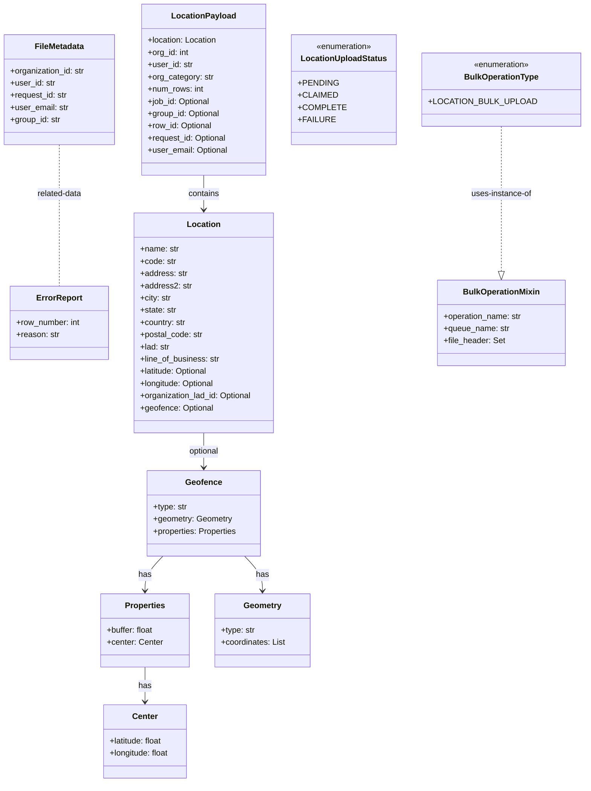

# Diagram: common/location_service/location_service/loc/lambdas/location/bulk_upload/models.py

> Auto-generated by Obscura crawlers

## Mermaid

```mermaid
classDiagram
    class ErrorReport {
        +row_number: int
        +reason: str
    }
    class FileMetadata {
        +organization_id: str
        +user_id: str
        +request_id: str
        +user_email: str
        +group_id: str
    }
    class Center {
        +latitude: float
        +longitude: float
    }
    class Properties {
        +buffer: float
        +center: Center
    }
    class Geometry {
        +type: str
        +coordinates: List<float>
    }
    class Geofence {
        +type: str
        +geometry: Geometry
        +properties: Properties
    }
    class Location {
        +name: str
        +code: str
        +address: str
        +address2: str
        +city: str
        +state: str
        +country: str
        +postal_code: str
        +lad: str
        +line_of_business: str
        +latitude: Optional<float>
        +longitude: Optional<float>
        +organization_lad_id: Optional<int>
        +geofence: Optional<Geofence>
    }
    class LocationPayload {
        +location: Location
        +org_id: int
        +user_id: str
        +org_category: str
        +num_rows: int
        +job_id: Optional<int>
        +group_id: Optional<str>
        +row_id: Optional<int>
        +request_id: Optional<str>
        +user_email: Optional<str>
    }
    class LocationUploadStatus <<enumeration>> {
        +PENDING
        +CLAIMED
        +COMPLETE
        +FAILURE
    }
    class BulkOperationMixin {
        +operation_name: str
        +queue_name: str
        +file_header: Set<str>
    }
    class BulkOperationType <<enumeration>> {
        +LOCATION_BULK_UPLOAD
    }

    Properties --> Center : has
    Geofence --> Geometry : has
    Geofence --> Properties : has
    Location --> Geofence : optional
    LocationPayload --> Location : contains
    BulkOperationType ..|> BulkOperationMixin : uses-instance-of
    FileMetadata .. ErrorReport : related-data
```

> SVG rendering failed for this diagram.
