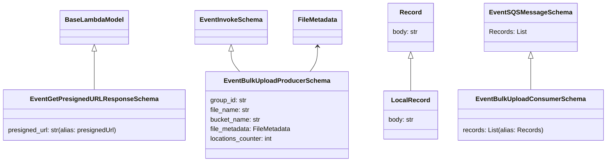

# Diagram: common/location_service/location_service/loc/lambdas/location/bulk_upload/schemas.py

> Auto-generated by Obscura crawlers

## Mermaid

### SVG

<svg id="container" width="1476.48046875" xmlns="http://www.w3.org/2000/svg" class="classDiagram" height="402" viewBox="0 0 1476.48046875 402" role="graphics-document document" aria-roledescription="class"><g><defs><marker id="container_class-aggregationStart" class="marker aggregation class" refX="18" refY="7" markerWidth="190" markerHeight="240" orient="auto"><path d="M 18,7 L9,13 L1,7 L9,1 Z"></path></marker></defs><defs><marker id="container_class-aggregationEnd" class="marker aggregation class" refX="1" refY="7" markerWidth="20" markerHeight="28" orient="auto"><path d="M 18,7 L9,13 L1,7 L9,1 Z"></path></marker></defs><defs><marker id="container_class-extensionStart" class="marker extension class" refX="18" refY="7" markerWidth="190" markerHeight="240" orient="auto"><path d="M 1,7 L18,13 V 1 Z"></path></marker></defs><defs><marker id="container_class-extensionEnd" class="marker extension class" refX="1" refY="7" markerWidth="20" markerHeight="28" orient="auto"><path d="M 1,1 V 13 L18,7 Z"></path></marker></defs><defs><marker id="container_class-compositionStart" class="marker composition class" refX="18" refY="7" markerWidth="190" markerHeight="240" orient="auto"><path d="M 18,7 L9,13 L1,7 L9,1 Z"></path></marker></defs><defs><marker id="container_class-compositionEnd" class="marker composition class" refX="1" refY="7" markerWidth="20" markerHeight="28" orient="auto"><path d="M 18,7 L9,13 L1,7 L9,1 Z"></path></marker></defs><defs><marker id="container_class-dependencyStart" class="marker dependency class" refX="6" refY="7" markerWidth="190" markerHeight="240" orient="auto"><path d="M 5,7 L9,13 L1,7 L9,1 Z"></path></marker></defs><defs><marker id="container_class-dependencyEnd" class="marker dependency class" refX="13" refY="7" markerWidth="20" markerHeight="28" orient="auto"><path d="M 18,7 L9,13 L14,7 L9,1 Z"></path></marker></defs><defs><marker id="container_class-lollipopStart" class="marker lollipop class" refX="13" refY="7" markerWidth="190" markerHeight="240" orient="auto"><circle stroke="black" fill="transparent" cx="7" cy="7" r="6"></circle></marker></defs><defs><marker id="container_class-lollipopEnd" class="marker lollipop class" refX="1" refY="7" markerWidth="190" markerHeight="240" orient="auto"><circle stroke="black" fill="transparent" cx="7" cy="7" r="6"></circle></marker></defs><g class="root"><g class="clusters"></g><g class="edgePaths"><path d="M230.406,127.25L230.406,131.542C230.406,135.833,230.406,144.417,230.406,160.375C230.406,176.333,230.406,199.667,230.406,211.333L230.406,223" id="id_BaseLambdaModel_EventGetPresignedURLResponseSchema_1" class="edge-thickness-normal edge-pattern-solid relation" style=";;;" data-edge="true" data-et="edge" data-id="id_BaseLambdaModel_EventGetPresignedURLResponseSchema_1" data-points="W3sieCI6MjMwLjQwNjI1LCJ5IjoxMTB9LHsieCI6MjMwLjQwNjI1LCJ5IjoxNTN9LHsieCI6MjMwLjQwNjI1LCJ5IjoyMjN9XQ==" marker-start="url(#container_class-extensionStart)"></path><path d="M562.166,127.25L562.166,131.542C562.166,135.833,562.166,144.417,565.782,152.875C569.397,161.333,576.628,169.667,580.244,173.833L583.859,178" id="id_EventInvokeSchema_EventBulkUploadProducerSchema_2" class="edge-thickness-normal edge-pattern-solid relation" style=";;;" data-edge="true" data-et="edge" data-id="id_EventInvokeSchema_EventBulkUploadProducerSchema_2" data-points="W3sieCI6NTYyLjE2NjAxNTYyNSwieSI6MTEwfSx7IngiOjU2Mi4xNjYwMTU2MjUsInkiOjE1M30seyJ4Ijo1ODMuODU5Mjg2ODg5MDk3OCwieSI6MTc4fV0=" marker-start="url(#container_class-extensionStart)"></path><path d="M1003.199,145.25L1003.199,146.542C1003.199,147.833,1003.199,150.417,1003.199,163.875C1003.199,177.333,1003.199,201.667,1003.199,213.833L1003.199,226" id="id_Record_LocalRecord_3" class="edge-thickness-normal edge-pattern-solid relation" style=";;;" data-edge="true" data-et="edge" data-id="id_Record_LocalRecord_3" data-points="W3sieCI6MTAwMy4xOTkyMTg3NSwieSI6MTI4fSx7IngiOjEwMDMuMTk5MjE4NzUsInkiOjE1M30seyJ4IjoxMDAzLjE5OTIxODc1LCJ5IjoyMjZ9XQ==" marker-start="url(#container_class-extensionStart)"></path><path d="M1293.895,145.25L1293.895,146.542C1293.895,147.833,1293.895,150.417,1293.895,163.375C1293.895,176.333,1293.895,199.667,1293.895,211.333L1293.895,223" id="id_EventSQSMessageSchema_EventBulkUploadConsumerSchema_4" class="edge-thickness-normal edge-pattern-solid relation" style=";;;" data-edge="true" data-et="edge" data-id="id_EventSQSMessageSchema_EventBulkUploadConsumerSchema_4" data-points="W3sieCI6MTI5My44OTQ1MzEyNSwieSI6MTI4fSx7IngiOjEyOTMuODk0NTMxMjUsInkiOjE1M30seyJ4IjoxMjkzLjg5NDUzMTI1LCJ5IjoyMjN9XQ==" marker-start="url(#container_class-extensionStart)"></path><path d="M774.805,116L774.805,122.167C774.805,128.333,774.805,140.667,771.759,151C768.713,161.333,762.62,169.667,759.574,173.833L756.528,178" id="id_FileMetadata_EventBulkUploadProducerSchema_5" class="edge-thickness-normal edge-pattern-solid relation" style=";;;" data-edge="true" data-et="edge" data-id="id_FileMetadata_EventBulkUploadProducerSchema_5" data-points="W3sieCI6Nzc0LjgwNDY4NzUsInkiOjExMH0seyJ4Ijo3NzQuODA0Njg3NSwieSI6MTUzfSx7IngiOjc1Ni41MjgyODM1OTk2MjQsInkiOjE3OH1d" marker-start="url(#container_class-dependencyStart)"></path></g><g class="edgeLabels"><g class="edgeLabel"><g class="label" data-id="id_BaseLambdaModel_EventGetPresignedURLResponseSchema_1" transform="translate(0, 0)"><foreignObject width="0" height="0">

</foreignObject></g></g><g class="edgeLabel"><g class="label" data-id="id_EventInvokeSchema_EventBulkUploadProducerSchema_2" transform="translate(0, 0)"><foreignObject width="0" height="0">

</foreignObject></g></g><g class="edgeLabel"><g class="label" data-id="id_Record_LocalRecord_3" transform="translate(0, 0)"><foreignObject width="0" height="0">

</foreignObject></g></g><g class="edgeLabel"><g class="label" data-id="id_EventSQSMessageSchema_EventBulkUploadConsumerSchema_4" transform="translate(0, 0)"><foreignObject width="0" height="0">

</foreignObject></g></g><g class="edgeLabel"><g class="label" data-id="id_FileMetadata_EventBulkUploadProducerSchema_5" transform="translate(0, 0)"><foreignObject width="0" height="0">

</foreignObject></g></g></g><g class="nodes"><g class="node default" id="classId-BaseLambdaModel-0" transform="translate(230.40625, 68)"><g class="basic label-container"><path d="M-81.203125 -42 L81.203125 -42 L81.203125 42 L-81.203125 42" stroke="none" stroke-width="0" fill="#ECECFF" style=""></path><path d="M-81.203125 -42 C-31.023487639212 -42, 19.156149721576 -42, 81.203125 -42 M-81.203125 -42 C-28.544968093725984 -42, 24.11318881254803 -42, 81.203125 -42 M81.203125 -42 C81.203125 -9.528109273098224, 81.203125 22.943781453803552, 81.203125 42 M81.203125 -42 C81.203125 -24.96823440202059, 81.203125 -7.9364688040411835, 81.203125 42 M81.203125 42 C19.929083882077272 42, -41.344957235845456 42, -81.203125 42 M81.203125 42 C16.536480826578455 42, -48.13016334684309 42, -81.203125 42 M-81.203125 42 C-81.203125 12.114500312018667, -81.203125 -17.770999375962667, -81.203125 -42 M-81.203125 42 C-81.203125 17.956066838199735, -81.203125 -6.0878663236005295, -81.203125 -42" stroke="#9370DB" stroke-width="1.3" fill="none" stroke-dasharray="0 0" style=""></path></g><g class="annotation-group text" transform="translate(0, -18)"></g><g class="label-group text" transform="translate(-69.203125, -18)"><g class="label" style="font-weight: bolder" transform="translate(0,-12)"><foreignObject width="138.40625" height="24">

BaseLambdaModel

</foreignObject></g></g><g class="members-group text" transform="translate(-69.203125, 30)"></g><g class="methods-group text" transform="translate(-69.203125, 60)"></g><g class="divider" style=""><path d="M-81.203125 6 C-25.01418994668625 6, 31.174745106627498 6, 81.203125 6 M-81.203125 6 C-41.603701322846376 6, -2.0042776456927527 6, 81.203125 6" stroke="#9370DB" stroke-width="1.3" fill="none" stroke-dasharray="0 0" style=""></path></g><g class="divider" style=""><path d="M-81.203125 24 C-40.99833721680583 24, -0.7935494336116591 24, 81.203125 24 M-81.203125 24 C-29.394599037215272 24, 22.413926925569456 24, 81.203125 24" stroke="#9370DB" stroke-width="1.3" fill="none" stroke-dasharray="0 0" style=""></path></g></g><g class="node default" id="classId-EventInvokeSchema-1" transform="translate(562.166015625, 68)"><g class="basic label-container"><path d="M-85.1484375 -42 L85.1484375 -42 L85.1484375 42 L-85.1484375 42" stroke="none" stroke-width="0" fill="#ECECFF" style=""></path><path d="M-85.1484375 -42 C-30.265205215298323 -42, 24.618027069403354 -42, 85.1484375 -42 M-85.1484375 -42 C-18.82859271457255 -42, 47.4912520708549 -42, 85.1484375 -42 M85.1484375 -42 C85.1484375 -24.865897720711263, 85.1484375 -7.731795441422527, 85.1484375 42 M85.1484375 -42 C85.1484375 -17.354024690760347, 85.1484375 7.291950618479305, 85.1484375 42 M85.1484375 42 C42.0357198644187 42, -1.0769977711625955 42, -85.1484375 42 M85.1484375 42 C45.34785868216523 42, 5.547279864330463 42, -85.1484375 42 M-85.1484375 42 C-85.1484375 14.474760748095918, -85.1484375 -13.050478503808165, -85.1484375 -42 M-85.1484375 42 C-85.1484375 19.110999794369977, -85.1484375 -3.778000411260045, -85.1484375 -42" stroke="#9370DB" stroke-width="1.3" fill="none" stroke-dasharray="0 0" style=""></path></g><g class="annotation-group text" transform="translate(0, -18)"></g><g class="label-group text" transform="translate(-73.1484375, -18)"><g class="label" style="font-weight: bolder" transform="translate(0,-12)"><foreignObject width="146.296875" height="24">

EventInvokeSchema

</foreignObject></g></g><g class="members-group text" transform="translate(-73.1484375, 30)"></g><g class="methods-group text" transform="translate(-73.1484375, 60)"></g><g class="divider" style=""><path d="M-85.1484375 6 C-29.31694656792053 6, 26.514544364158937 6, 85.1484375 6 M-85.1484375 6 C-49.61345441234542 6, -14.078471324690838 6, 85.1484375 6" stroke="#9370DB" stroke-width="1.3" fill="none" stroke-dasharray="0 0" style=""></path></g><g class="divider" style=""><path d="M-85.1484375 24 C-33.22037468045072 24, 18.707688139098565 24, 85.1484375 24 M-85.1484375 24 C-25.754810743816655 24, 33.63881601236669 24, 85.1484375 24" stroke="#9370DB" stroke-width="1.3" fill="none" stroke-dasharray="0 0" style=""></path></g></g><g class="node default" id="classId-Record-2" transform="translate(1003.19921875, 68)"><g class="basic label-container"><path d="M-56.60546875 -60 L56.60546875 -60 L56.60546875 60 L-56.60546875 60" stroke="none" stroke-width="0" fill="#ECECFF" style=""></path><path d="M-56.60546875 -60 C-19.27318266918003 -60, 18.05910341163994 -60, 56.60546875 -60 M-56.60546875 -60 C-23.697137507594938 -60, 9.211193734810124 -60, 56.60546875 -60 M56.60546875 -60 C56.60546875 -32.44873394950791, 56.60546875 -4.89746789901583, 56.60546875 60 M56.60546875 -60 C56.60546875 -28.34639131566451, 56.60546875 3.307217368670983, 56.60546875 60 M56.60546875 60 C19.82288136885986 60, -16.95970601228028 60, -56.60546875 60 M56.60546875 60 C28.43221243719815 60, 0.258956124396299 60, -56.60546875 60 M-56.60546875 60 C-56.60546875 28.775090400117648, -56.60546875 -2.449819199764704, -56.60546875 -60 M-56.60546875 60 C-56.60546875 14.51320741693786, -56.60546875 -30.97358516612428, -56.60546875 -60" stroke="#9370DB" stroke-width="1.3" fill="none" stroke-dasharray="0 0" style=""></path></g><g class="annotation-group text" transform="translate(0, -36)"></g><g class="label-group text" transform="translate(-25.3515625, -36)"><g class="label" style="font-weight: bolder" transform="translate(0,-12)"><foreignObject width="50.703125" height="24">

Record

</foreignObject></g></g><g class="members-group text" transform="translate(-44.60546875, 12)"><g class="label" style="" transform="translate(0,-12)"><foreignObject width="63.859375" height="24">

body: str

</foreignObject></g></g><g class="methods-group text" transform="translate(-44.60546875, 60)"></g><g class="divider" style=""><path d="M-56.60546875 -12 C-17.842900062564418 -12, 20.919668624871164 -12, 56.60546875 -12 M-56.60546875 -12 C-25.079672186598263 -12, 6.446124376803475 -12, 56.60546875 -12" stroke="#9370DB" stroke-width="1.3" fill="none" stroke-dasharray="0 0" style=""></path></g><g class="divider" style=""><path d="M-56.60546875 36 C-23.25301079740629 36, 10.09944715518742 36, 56.60546875 36 M-56.60546875 36 C-23.357604194169383 36, 9.890260361661234 36, 56.60546875 36" stroke="#9370DB" stroke-width="1.3" fill="none" stroke-dasharray="0 0" style=""></path></g></g><g class="node default" id="classId-EventSQSMessageSchema-3" transform="translate(1293.89453125, 68)"><g class="basic label-container"><path d="M-106.6328125 -60 L106.6328125 -60 L106.6328125 60 L-106.6328125 60" stroke="none" stroke-width="0" fill="#ECECFF" style=""></path><path d="M-106.6328125 -60 C-42.437271851150385 -60, 21.75826879769923 -60, 106.6328125 -60 M-106.6328125 -60 C-63.43576662017266 -60, -20.238720740345315 -60, 106.6328125 -60 M106.6328125 -60 C106.6328125 -21.786700733853948, 106.6328125 16.426598532292104, 106.6328125 60 M106.6328125 -60 C106.6328125 -14.03653946572473, 106.6328125 31.92692106855054, 106.6328125 60 M106.6328125 60 C39.532009634946164 60, -27.568793230107673 60, -106.6328125 60 M106.6328125 60 C32.37238681603361 60, -41.88803886793278 60, -106.6328125 60 M-106.6328125 60 C-106.6328125 19.104593788649836, -106.6328125 -21.790812422700327, -106.6328125 -60 M-106.6328125 60 C-106.6328125 31.43696726986977, -106.6328125 2.873934539739537, -106.6328125 -60" stroke="#9370DB" stroke-width="1.3" fill="none" stroke-dasharray="0 0" style=""></path></g><g class="annotation-group text" transform="translate(0, -36)"></g><g class="label-group text" transform="translate(-94.6328125, -36)"><g class="label" style="font-weight: bolder" transform="translate(0,-12)"><foreignObject width="189.265625" height="24">

EventSQSMessageSchema

</foreignObject></g></g><g class="members-group text" transform="translate(-94.6328125, 12)"><g class="label" style="" transform="translate(0,-12)"><foreignObject width="91.390625" height="24">

Records: List

</foreignObject></g></g><g class="methods-group text" transform="translate(-94.6328125, 60)"></g><g class="divider" style=""><path d="M-106.6328125 -12 C-34.48511782417816 -12, 37.66257685164368 -12, 106.6328125 -12 M-106.6328125 -12 C-40.68895245587315 -12, 25.2549075882537 -12, 106.6328125 -12" stroke="#9370DB" stroke-width="1.3" fill="none" stroke-dasharray="0 0" style=""></path></g><g class="divider" style=""><path d="M-106.6328125 36 C-38.91642655221662 36, 28.79995939556676 36, 106.6328125 36 M-106.6328125 36 C-54.48666056504348 36, -2.3405086300869584 36, 106.6328125 36" stroke="#9370DB" stroke-width="1.3" fill="none" stroke-dasharray="0 0" style=""></path></g></g><g class="node default" id="classId-FileMetadata-4" transform="translate(774.8046875, 68)"><g class="basic label-container"><path d="M-59.3125 -42 L59.3125 -42 L59.3125 42 L-59.3125 42" stroke="none" stroke-width="0" fill="#ECECFF" style=""></path><path d="M-59.3125 -42 C-14.016140962553486 -42, 31.28021807489303 -42, 59.3125 -42 M-59.3125 -42 C-23.34480467547062 -42, 12.62289064905876 -42, 59.3125 -42 M59.3125 -42 C59.3125 -16.467028962989456, 59.3125 9.065942074021088, 59.3125 42 M59.3125 -42 C59.3125 -23.533489467176725, 59.3125 -5.06697893435345, 59.3125 42 M59.3125 42 C15.918974280980976 42, -27.47455143803805 42, -59.3125 42 M59.3125 42 C23.272487452480775 42, -12.767525095038451 42, -59.3125 42 M-59.3125 42 C-59.3125 23.45627951580974, -59.3125 4.91255903161948, -59.3125 -42 M-59.3125 42 C-59.3125 11.473150466080128, -59.3125 -19.053699067839744, -59.3125 -42" stroke="#9370DB" stroke-width="1.3" fill="none" stroke-dasharray="0 0" style=""></path></g><g class="annotation-group text" transform="translate(0, -18)"></g><g class="label-group text" transform="translate(-47.3125, -18)"><g class="label" style="font-weight: bolder" transform="translate(0,-12)"><foreignObject width="94.625" height="24">

FileMetadata

</foreignObject></g></g><g class="members-group text" transform="translate(-47.3125, 30)"></g><g class="methods-group text" transform="translate(-47.3125, 60)"></g><g class="divider" style=""><path d="M-59.3125 6 C-24.281241204950938 6, 10.750017590098125 6, 59.3125 6 M-59.3125 6 C-28.494386465752388 6, 2.3237270684952236 6, 59.3125 6" stroke="#9370DB" stroke-width="1.3" fill="none" stroke-dasharray="0 0" style=""></path></g><g class="divider" style=""><path d="M-59.3125 24 C-16.80729129235754 24, 25.69791741528492 24, 59.3125 24 M-59.3125 24 C-15.708419043682149 24, 27.895661912635703 24, 59.3125 24" stroke="#9370DB" stroke-width="1.3" fill="none" stroke-dasharray="0 0" style=""></path></g></g><g class="node default" id="classId-EventGetPresignedURLResponseSchema-5" transform="translate(230.40625, 286)"><g class="basic label-container"><path d="M-222.40625 -63 L222.40625 -63 L222.40625 63 L-222.40625 63" stroke="none" stroke-width="0" fill="#ECECFF" style=""></path><path d="M-222.40625 -63 C-127.89182902115982 -63, -33.377408042319644 -63, 222.40625 -63 M-222.40625 -63 C-66.2316326750666 -63, 89.94298464986679 -63, 222.40625 -63 M222.40625 -63 C222.40625 -21.504538161242586, 222.40625 19.99092367751483, 222.40625 63 M222.40625 -63 C222.40625 -14.586181449240314, 222.40625 33.82763710151937, 222.40625 63 M222.40625 63 C122.18804996571268 63, 21.969849931425358 63, -222.40625 63 M222.40625 63 C93.58490765855962 63, -35.23643468288077 63, -222.40625 63 M-222.40625 63 C-222.40625 30.12211842208356, -222.40625 -2.755763155832881, -222.40625 -63 M-222.40625 63 C-222.40625 21.387008150957982, -222.40625 -20.225983698084036, -222.40625 -63" stroke="#9370DB" stroke-width="1.3" fill="none" stroke-dasharray="0 0" style=""></path></g><g class="annotation-group text" transform="translate(0, -39)"></g><g class="label-group text" transform="translate(-147.53125, -39)"><g class="label" style="font-weight: bolder" transform="translate(0,-12)"><foreignObject width="295.0625" height="24">

EventGetPresignedURLResponseSchema

</foreignObject></g></g><g class="members-group text" transform="translate(-210.40625, 9)"></g><g class="methods-group text" transform="translate(-210.40625, 39)"><g class="label" style="" transform="translate(0,-12)"><foreignObject width="273.28125" height="24">

presigned_url: str(alias: presignedUrl)

</foreignObject></g></g><g class="divider" style=""><path d="M-222.40625 -15 C-82.7891396589699 -15, 56.8279706820602 -15, 222.40625 -15 M-222.40625 -15 C-72.20699078651188 -15, 77.99226842697624 -15, 222.40625 -15" stroke="#9370DB" stroke-width="1.3" fill="none" stroke-dasharray="0 0" style=""></path></g><g class="divider" style=""><path d="M-222.40625 9 C-83.99358158774615 9, 54.4190868245077 9, 222.40625 9 M-222.40625 9 C-93.44058791813356 9, 35.52507416373288 9, 222.40625 9" stroke="#9370DB" stroke-width="1.3" fill="none" stroke-dasharray="0 0" style=""></path></g></g><g class="node default" id="classId-EventBulkUploadProducerSchema-6" transform="translate(677.57421875, 286)"><g class="basic label-container"><path d="M-174.76171875 -108 L174.76171875 -108 L174.76171875 108 L-174.76171875 108" stroke="none" stroke-width="0" fill="#ECECFF" style=""></path><path d="M-174.76171875 -108 C-78.22490703575306 -108, 18.311904678493875 -108, 174.76171875 -108 M-174.76171875 -108 C-61.01647733765037 -108, 52.72876407469926 -108, 174.76171875 -108 M174.76171875 -108 C174.76171875 -44.36321360263851, 174.76171875 19.27357279472298, 174.76171875 108 M174.76171875 -108 C174.76171875 -46.483313335563935, 174.76171875 15.03337332887213, 174.76171875 108 M174.76171875 108 C37.27860488766626 108, -100.20450897466748 108, -174.76171875 108 M174.76171875 108 C100.4621133680602 108, 26.162507986120403 108, -174.76171875 108 M-174.76171875 108 C-174.76171875 23.03066418394043, -174.76171875 -61.93867163211914, -174.76171875 -108 M-174.76171875 108 C-174.76171875 53.595036519205486, -174.76171875 -0.8099269615890279, -174.76171875 -108" stroke="#9370DB" stroke-width="1.3" fill="none" stroke-dasharray="0 0" style=""></path></g><g class="annotation-group text" transform="translate(0, -84)"></g><g class="label-group text" transform="translate(-124.1484375, -84)"><g class="label" style="font-weight: bolder" transform="translate(0,-12)"><foreignObject width="248.296875" height="24">

EventBulkUploadProducerSchema

</foreignObject></g></g><g class="members-group text" transform="translate(-162.76171875, -36)"><g class="label" style="" transform="translate(0,-12)"><foreignObject width="91.765625" height="24">

group_id: str

</foreignObject></g><g class="label" style="" transform="translate(0,12)"><foreignObject width="98.546875" height="24">

file_name: str

</foreignObject></g><g class="label" style="" transform="translate(0,36)"><foreignObject width="125.359375" height="24">

bucket_name: str

</foreignObject></g><g class="label" style="" transform="translate(0,60)"><foreignObject width="201.375" height="24">

file_metadata: FileMetadata

</foreignObject></g><g class="label" style="" transform="translate(0,84)"><foreignObject width="158.015625" height="24">

locations_counter: int

</foreignObject></g></g><g class="methods-group text" transform="translate(-162.76171875, 108)"></g><g class="divider" style=""><path d="M-174.76171875 -60 C-82.3519429882328 -60, 10.057832773534386 -60, 174.76171875 -60 M-174.76171875 -60 C-81.74696646156238 -60, 11.26778582687524 -60, 174.76171875 -60" stroke="#9370DB" stroke-width="1.3" fill="none" stroke-dasharray="0 0" style=""></path></g><g class="divider" style=""><path d="M-174.76171875 84 C-79.68146016844297 84, 15.398798413114065 84, 174.76171875 84 M-174.76171875 84 C-76.78819745053669 84, 21.18532384892663 84, 174.76171875 84" stroke="#9370DB" stroke-width="1.3" fill="none" stroke-dasharray="0 0" style=""></path></g></g><g class="node default" id="classId-LocalRecord-7" transform="translate(1003.19921875, 286)"><g class="basic label-container"><path d="M-66.109375 -60 L66.109375 -60 L66.109375 60 L-66.109375 60" stroke="none" stroke-width="0" fill="#ECECFF" style=""></path><path d="M-66.109375 -60 C-39.130988607029295 -60, -12.152602214058582 -60, 66.109375 -60 M-66.109375 -60 C-23.880404313674404 -60, 18.34856637265119 -60, 66.109375 -60 M66.109375 -60 C66.109375 -16.887164516017712, 66.109375 26.225670967964575, 66.109375 60 M66.109375 -60 C66.109375 -17.615948866833364, 66.109375 24.768102266333273, 66.109375 60 M66.109375 60 C14.818962596939564 60, -36.47144980612087 60, -66.109375 60 M66.109375 60 C23.856072643070966 60, -18.397229713858067 60, -66.109375 60 M-66.109375 60 C-66.109375 30.85965528141701, -66.109375 1.7193105628340177, -66.109375 -60 M-66.109375 60 C-66.109375 15.116490460127643, -66.109375 -29.767019079744713, -66.109375 -60" stroke="#9370DB" stroke-width="1.3" fill="none" stroke-dasharray="0 0" style=""></path></g><g class="annotation-group text" transform="translate(0, -36)"></g><g class="label-group text" transform="translate(-44.359375, -36)"><g class="label" style="font-weight: bolder" transform="translate(0,-12)"><foreignObject width="88.71875" height="24">

LocalRecord

</foreignObject></g></g><g class="members-group text" transform="translate(-54.109375, 12)"><g class="label" style="" transform="translate(0,-12)"><foreignObject width="63.859375" height="24">

body: str

</foreignObject></g></g><g class="methods-group text" transform="translate(-54.109375, 60)"></g><g class="divider" style=""><path d="M-66.109375 -12 C-24.31974815933851 -12, 17.46987868132298 -12, 66.109375 -12 M-66.109375 -12 C-13.516780730768822 -12, 39.075813538462356 -12, 66.109375 -12" stroke="#9370DB" stroke-width="1.3" fill="none" stroke-dasharray="0 0" style=""></path></g><g class="divider" style=""><path d="M-66.109375 36 C-35.68870292087238 36, -5.2680308417447606 36, 66.109375 36 M-66.109375 36 C-14.382605680862056 36, 37.34416363827589 36, 66.109375 36" stroke="#9370DB" stroke-width="1.3" fill="none" stroke-dasharray="0 0" style=""></path></g></g><g class="node default" id="classId-EventBulkUploadConsumerSchema-8" transform="translate(1293.89453125, 286)"><g class="basic label-container"><path d="M-174.5859375 -63 L174.5859375 -63 L174.5859375 63 L-174.5859375 63" stroke="none" stroke-width="0" fill="#ECECFF" style=""></path><path d="M-174.5859375 -63 C-38.99320702120713 -63, 96.59952345758575 -63, 174.5859375 -63 M-174.5859375 -63 C-76.0634874077204 -63, 22.458962684559197 -63, 174.5859375 -63 M174.5859375 -63 C174.5859375 -22.5490782208041, 174.5859375 17.901843558391803, 174.5859375 63 M174.5859375 -63 C174.5859375 -14.090225162822051, 174.5859375 34.8195496743559, 174.5859375 63 M174.5859375 63 C35.64579976737991 63, -103.29433796524017 63, -174.5859375 63 M174.5859375 63 C94.58481474964984 63, 14.583691999299674 63, -174.5859375 63 M-174.5859375 63 C-174.5859375 25.89855215067344, -174.5859375 -11.202895698653123, -174.5859375 -63 M-174.5859375 63 C-174.5859375 33.467209624085484, -174.5859375 3.9344192481709612, -174.5859375 -63" stroke="#9370DB" stroke-width="1.3" fill="none" stroke-dasharray="0 0" style=""></path></g><g class="annotation-group text" transform="translate(0, -39)"></g><g class="label-group text" transform="translate(-127.75, -39)"><g class="label" style="font-weight: bolder" transform="translate(0,-12)"><foreignObject width="255.5" height="24">

EventBulkUploadConsumerSchema

</foreignObject></g></g><g class="members-group text" transform="translate(-162.5859375, 9)"></g><g class="methods-group text" transform="translate(-162.5859375, 39)"><g class="label" style="" transform="translate(0,-12)"><foreignObject width="197.421875" height="24">

records: List(alias: Records)

</foreignObject></g></g><g class="divider" style=""><path d="M-174.5859375 -15 C-86.78728655717475 -15, 1.011364385650495 -15, 174.5859375 -15 M-174.5859375 -15 C-43.18634670422338 -15, 88.21324409155324 -15, 174.5859375 -15" stroke="#9370DB" stroke-width="1.3" fill="none" stroke-dasharray="0 0" style=""></path></g><g class="divider" style=""><path d="M-174.5859375 9 C-73.94562300734468 9, 26.694691485310642 9, 174.5859375 9 M-174.5859375 9 C-50.94655216473076 9, 72.69283317053848 9, 174.5859375 9" stroke="#9370DB" stroke-width="1.3" fill="none" stroke-dasharray="0 0" style=""></path></g></g></g></g></g></svg>
