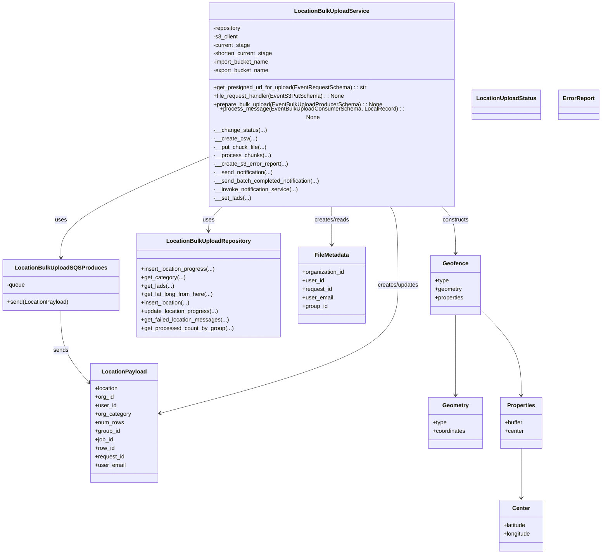

# Diagram: common/location_service/location_service/loc/lambdas/location/bulk_upload/service.py

> Auto-generated by Obscura crawlers

## Diagram 1

### SVG

<svg id="container" width="1661.89453125" xmlns="http://www.w3.org/2000/svg" class="classDiagram" height="1540" viewBox="0 0 1661.89453125 1540" role="graphics-document document" aria-roledescription="class"><g><defs><marker id="container_class-aggregationStart" class="marker aggregation class" refX="18" refY="7" markerWidth="190" markerHeight="240" orient="auto"><path d="M 18,7 L9,13 L1,7 L9,1 Z"></path></marker></defs><defs><marker id="container_class-aggregationEnd" class="marker aggregation class" refX="1" refY="7" markerWidth="20" markerHeight="28" orient="auto"><path d="M 18,7 L9,13 L1,7 L9,1 Z"></path></marker></defs><defs><marker id="container_class-extensionStart" class="marker extension class" refX="18" refY="7" markerWidth="190" markerHeight="240" orient="auto"><path d="M 1,7 L18,13 V 1 Z"></path></marker></defs><defs><marker id="container_class-extensionEnd" class="marker extension class" refX="1" refY="7" markerWidth="20" markerHeight="28" orient="auto"><path d="M 1,1 V 13 L18,7 Z"></path></marker></defs><defs><marker id="container_class-compositionStart" class="marker composition class" refX="18" refY="7" markerWidth="190" markerHeight="240" orient="auto"><path d="M 18,7 L9,13 L1,7 L9,1 Z"></path></marker></defs><defs><marker id="container_class-compositionEnd" class="marker composition class" refX="1" refY="7" markerWidth="20" markerHeight="28" orient="auto"><path d="M 18,7 L9,13 L1,7 L9,1 Z"></path></marker></defs><defs><marker id="container_class-dependencyStart" class="marker dependency class" refX="6" refY="7" markerWidth="190" markerHeight="240" orient="auto"><path d="M 5,7 L9,13 L1,7 L9,1 Z"></path></marker></defs><defs><marker id="container_class-dependencyEnd" class="marker dependency class" refX="13" refY="7" markerWidth="20" markerHeight="28" orient="auto"><path d="M 18,7 L9,13 L14,7 L9,1 Z"></path></marker></defs><defs><marker id="container_class-lollipopStart" class="marker lollipop class" refX="13" refY="7" markerWidth="190" markerHeight="240" orient="auto"><circle stroke="black" fill="transparent" cx="7" cy="7" r="6"></circle></marker></defs><defs><marker id="container_class-lollipopEnd" class="marker lollipop class" refX="1" refY="7" markerWidth="190" markerHeight="240" orient="auto"><circle stroke="black" fill="transparent" cx="7" cy="7" r="6"></circle></marker></defs><g class="root"><g class="clusters"></g><g class="edgePaths"><path d="M615.611,560L608.824,566.167C602.037,572.333,588.464,584.667,581.677,596C574.891,607.333,574.891,617.667,574.891,622.833L574.891,628" id="id_LocationBulkUploadService_LocationBulkUploadRepository_1" class="edge-thickness-normal edge-pattern-solid relation" style=";;;" data-edge="true" data-et="edge" data-id="id_LocationBulkUploadService_LocationBulkUploadRepository_1" data-points="W3sieCI6NjE1LjYxMDU3MzA4MzA2NywieSI6NTYwfSx7IngiOjU3NC44OTA2MjUsInkiOjU5N30seyJ4Ijo1NzQuODkwNjI1LCJ5Ijo2MzR9XQ==" marker-end="url(#container_class-dependencyEnd)"></path><path d="M580.996,424.81L512.035,453.508C443.073,482.207,305.15,539.603,236.188,585.968C167.227,632.333,167.227,667.667,167.227,685.333L167.227,703" id="id_LocationBulkUploadService_LocationBulkUploadSQSProduces_2" class="edge-thickness-normal edge-pattern-solid relation" style=";;;" data-edge="true" data-et="edge" data-id="id_LocationBulkUploadService_LocationBulkUploadSQSProduces_2" data-points="W3sieCI6NTgwLjk5NjA5Mzc1LCJ5Ijo0MjQuODA5ODQ4MDM2MzEzNH0seyJ4IjoxNjcuMjI2NTYyNSwieSI6NTk3fSx7IngiOjE2Ny4yMjY1NjI1LCJ5Ijo3MDl9XQ==" marker-end="url(#container_class-dependencyEnd)"></path><path d="M167.227,853L167.227,871.667C167.227,890.333,167.227,927.667,180.07,961.478C192.913,995.289,218.599,1025.579,231.442,1040.724L244.285,1055.868" id="id_LocationBulkUploadSQSProduces_LocationPayload_3" class="edge-thickness-normal edge-pattern-solid relation" style=";;;" data-edge="true" data-et="edge" data-id="id_LocationBulkUploadSQSProduces_LocationPayload_3" data-points="W3sieCI6MTY3LjIyNjU2MjUsInkiOjg1M30seyJ4IjoxNjcuMjI2NTYyNSwieSI6OTY1fSx7IngiOjI0OC4xNjYwMTU2MjUsInkiOjEwNjAuNDQ0MzM3MDg5NTA3OH1d" marker-end="url(#container_class-dependencyEnd)"></path><path d="M919.359,560L919.359,566.167C919.359,572.333,919.359,584.667,919.359,602.5C919.359,620.333,919.359,643.667,919.359,655.333L919.359,667" id="id_LocationBulkUploadService_FileMetadata_4" class="edge-thickness-normal edge-pattern-solid relation" style=";;;" data-edge="true" data-et="edge" data-id="id_LocationBulkUploadService_FileMetadata_4" data-points="W3sieCI6OTE5LjM1OTM3NSwieSI6NTYwfSx7IngiOjkxOS4zNTkzNzUsInkiOjU5N30seyJ4Ijo5MTkuMzU5Mzc1LCJ5Ijo2NzN9XQ==" marker-end="url(#container_class-dependencyEnd)"></path><path d="M1087.368,560L1091.122,566.167C1094.875,572.333,1102.383,584.667,1106.137,621.5C1109.891,658.333,1109.891,719.667,1109.891,781C1109.891,842.333,1109.891,903.667,998.205,964.114C886.519,1024.56,663.148,1084.121,551.462,1113.901L439.776,1143.681" id="id_LocationBulkUploadService_LocationPayload_5" class="edge-thickness-normal edge-pattern-solid relation" style=";;;" data-edge="true" data-et="edge" data-id="id_LocationBulkUploadService_LocationPayload_5" data-points="W3sieCI6MTA4Ny4zNjc3NjE1ODE0Njk3LCJ5Ijo1NjB9LHsieCI6MTEwOS44OTA2MjUsInkiOjU5N30seyJ4IjoxMTA5Ljg5MDYyNSwieSI6NzgxfSx7IngiOjExMDkuODkwNjI1LCJ5Ijo5NjV9LHsieCI6NDMzLjk3ODUxNTYyNSwieSI6MTE0NS4yMjcyMDI4NjU1OTg5fV0=" marker-end="url(#container_class-dependencyEnd)"></path><path d="M1233.111,560L1240.121,566.167C1247.131,572.333,1261.152,584.667,1268.162,606.5C1275.172,628.333,1275.172,659.667,1275.172,675.333L1275.172,691" id="id_LocationBulkUploadService_Geofence_6" class="edge-thickness-normal edge-pattern-solid relation" style=";;;" data-edge="true" data-et="edge" data-id="id_LocationBulkUploadService_Geofence_6" data-points="W3sieCI6MTIzMy4xMTA5NzI0NDQwODk0LCJ5Ijo1NjB9LHsieCI6MTI3NS4xNzE4NzUsInkiOjU5N30seyJ4IjoxMjc1LjE3MTg3NSwieSI6Njk3fV0=" marker-end="url(#container_class-dependencyEnd)"></path><path d="M1275.172,865L1275.172,881.667C1275.172,898.333,1275.172,931.667,1275.172,969.5C1275.172,1007.333,1275.172,1049.667,1275.172,1070.833L1275.172,1092" id="id_Geofence_Geometry_7" class="edge-thickness-normal edge-pattern-solid relation" style=";;;" data-edge="true" data-et="edge" data-id="id_Geofence_Geometry_7" data-points="W3sieCI6MTI3NS4xNzE4NzUsInkiOjg2NX0seyJ4IjoxMjc1LjE3MTg3NSwieSI6OTY1fSx7IngiOjEyNzUuMTcxODc1LCJ5IjoxMDk4fV0=" marker-end="url(#container_class-dependencyEnd)"></path><path d="M1345.953,851.473L1364.957,870.394C1383.961,889.315,1421.969,927.158,1440.973,967.246C1459.977,1007.333,1459.977,1049.667,1459.977,1070.833L1459.977,1092" id="id_Geofence_Properties_8" class="edge-thickness-normal edge-pattern-solid relation" style=";;;" data-edge="true" data-et="edge" data-id="id_Geofence_Properties_8" data-points="W3sieCI6MTM0NS45NTMxMjUsInkiOjg1MS40NzMwNTAwOTUxMTczfSx7IngiOjE0NTkuOTc2NTYyNSwieSI6OTY1fSx7IngiOjE0NTkuOTc2NTYyNSwieSI6MTA5OH1d" marker-end="url(#container_class-dependencyEnd)"></path><path d="M1459.977,1242L1459.977,1262.167C1459.977,1282.333,1459.977,1322.667,1459.977,1346C1459.977,1369.333,1459.977,1375.667,1459.977,1378.833L1459.977,1382" id="id_Properties_Center_9" class="edge-thickness-normal edge-pattern-solid relation" style=";;;" data-edge="true" data-et="edge" data-id="id_Properties_Center_9" data-points="W3sieCI6MTQ1OS45NzY1NjI1LCJ5IjoxMjQyfSx7IngiOjE0NTkuOTc2NTYyNSwieSI6MTM2M30seyJ4IjoxNDU5Ljk3NjU2MjUsInkiOjEzODh9XQ==" marker-end="url(#container_class-dependencyEnd)"></path></g><g class="edgeLabels"><g class="edgeLabel" transform="translate(574.890625, 597)"><g class="label" data-id="id_LocationBulkUploadService_LocationBulkUploadRepository_1" transform="translate(-16.4921875, -12)"><foreignObject width="32.984375" height="24">

uses

</foreignObject></g></g><g class="edgeLabel" transform="translate(167.2265625, 597)"><g class="label" data-id="id_LocationBulkUploadService_LocationBulkUploadSQSProduces_2" transform="translate(-16.4921875, -12)"><foreignObject width="32.984375" height="24">

uses

</foreignObject></g></g><g class="edgeLabel" transform="translate(167.2265625, 965)"><g class="label" data-id="id_LocationBulkUploadSQSProduces_LocationPayload_3" transform="translate(-21.3046875, -12)"><foreignObject width="42.609375" height="24">

sends

</foreignObject></g></g><g class="edgeLabel" transform="translate(919.359375, 597)"><g class="label" data-id="id_LocationBulkUploadService_FileMetadata_4" transform="translate(-50.09375, -12)"><foreignObject width="100.1875" height="24">

creates/reads

</foreignObject></g></g><g class="edgeLabel" transform="translate(1109.890625, 781)"><g class="label" data-id="id_LocationBulkUploadService_LocationPayload_5" transform="translate(-59.5, -12)"><foreignObject width="119" height="24">

creates/updates

</foreignObject></g></g><g class="edgeLabel" transform="translate(1275.171875, 597)"><g class="label" data-id="id_LocationBulkUploadService_Geofence_6" transform="translate(-37.84375, -12)"><foreignObject width="75.6875" height="24">

constructs

</foreignObject></g></g><g class="edgeLabel"><g class="label" data-id="id_Geofence_Geometry_7" transform="translate(0, 0)"><foreignObject width="0" height="0">

</foreignObject></g></g><g class="edgeLabel"><g class="label" data-id="id_Geofence_Properties_8" transform="translate(0, 0)"><foreignObject width="0" height="0">

</foreignObject></g></g><g class="edgeLabel"><g class="label" data-id="id_Properties_Center_9" transform="translate(0, 0)"><foreignObject width="0" height="0">

</foreignObject></g></g></g><g class="nodes"><g class="node default" id="classId-LocationBulkUploadSQSProduces-0" transform="translate(167.2265625, 781)"><g class="basic label-container"><path d="M-159.2265625 -72 L159.2265625 -72 L159.2265625 72 L-159.2265625 72" stroke="none" stroke-width="0" fill="#ECECFF" style=""></path><path d="M-159.2265625 -72 C-44.97916021864428 -72, 69.26824206271144 -72, 159.2265625 -72 M-159.2265625 -72 C-44.38016655284078 -72, 70.46622939431845 -72, 159.2265625 -72 M159.2265625 -72 C159.2265625 -28.13325325945359, 159.2265625 15.733493481092822, 159.2265625 72 M159.2265625 -72 C159.2265625 -21.0986336485608, 159.2265625 29.8027327028784, 159.2265625 72 M159.2265625 72 C39.28435712705175 72, -80.6578482458965 72, -159.2265625 72 M159.2265625 72 C81.10836815530566 72, 2.99017381061131 72, -159.2265625 72 M-159.2265625 72 C-159.2265625 16.21055615760738, -159.2265625 -39.57888768478524, -159.2265625 -72 M-159.2265625 72 C-159.2265625 17.378442853441925, -159.2265625 -37.24311429311615, -159.2265625 -72" stroke="#9370DB" stroke-width="1.3" fill="none" stroke-dasharray="0 0" style=""></path></g><g class="annotation-group text" transform="translate(0, -48)"></g><g class="label-group text" transform="translate(-122.03125, -48)"><g class="label" style="font-weight: bolder" transform="translate(0,-12)"><foreignObject width="244.0625" height="24">

LocationBulkUploadSQSProduces

</foreignObject></g></g><g class="members-group text" transform="translate(-147.2265625, 0)"><g class="label" style="" transform="translate(0,-12)"><foreignObject width="52.09375" height="24">

-queue

</foreignObject></g></g><g class="methods-group text" transform="translate(-147.2265625, 48)"><g class="label" style="" transform="translate(0,-12)"><foreignObject width="172.421875" height="24">

+send(LocationPayload)

</foreignObject></g></g><g class="divider" style=""><path d="M-159.2265625 -24 C-88.77755343047318 -24, -18.328544360946353 -24, 159.2265625 -24 M-159.2265625 -24 C-84.10493900903835 -24, -8.983315518076694 -24, 159.2265625 -24" stroke="#9370DB" stroke-width="1.3" fill="none" stroke-dasharray="0 0" style=""></path></g><g class="divider" style=""><path d="M-159.2265625 24 C-95.16700736473638 24, -31.107452229472756 24, 159.2265625 24 M-159.2265625 24 C-76.80969640842603 24, 5.60716968314793 24, 159.2265625 24" stroke="#9370DB" stroke-width="1.3" fill="none" stroke-dasharray="0 0" style=""></path></g></g><g class="node default" id="classId-LocationBulkUploadService-1" transform="translate(919.359375, 284)"><g class="basic label-container"><path d="M-338.36328125 -276 L338.36328125 -276 L338.36328125 276 L-338.36328125 276" stroke="none" stroke-width="0" fill="#ECECFF" style=""></path><path d="M-338.36328125 -276 C-180.45993035153165 -276, -22.556579453063307 -276, 338.36328125 -276 M-338.36328125 -276 C-91.59451728720549 -276, 155.17424667558902 -276, 338.36328125 -276 M338.36328125 -276 C338.36328125 -163.77766780013332, 338.36328125 -51.55533560026666, 338.36328125 276 M338.36328125 -276 C338.36328125 -133.36161345337578, 338.36328125 9.276773093248437, 338.36328125 276 M338.36328125 276 C163.1485857141294 276, -12.066109821741179 276, -338.36328125 276 M338.36328125 276 C114.79300915340247 276, -108.77726294319507 276, -338.36328125 276 M-338.36328125 276 C-338.36328125 106.67792661871434, -338.36328125 -62.644146762571324, -338.36328125 -276 M-338.36328125 276 C-338.36328125 60.04022326362565, -338.36328125 -155.9195534727487, -338.36328125 -276" stroke="#9370DB" stroke-width="1.3" fill="none" stroke-dasharray="0 0" style=""></path></g><g class="annotation-group text" transform="translate(0, -252)"></g><g class="label-group text" transform="translate(-100.3984375, -252)"><g class="label" style="font-weight: bolder" transform="translate(0,-12)"><foreignObject width="200.796875" height="24">

LocationBulkUploadService

</foreignObject></g></g><g class="members-group text" transform="translate(-326.36328125, -204)"><g class="label" style="" transform="translate(0,-12)"><foreignObject width="80.625" height="24">

-repository

</foreignObject></g><g class="label" style="" transform="translate(0,12)"><foreignObject width="70.3125" height="24">

-s3_client

</foreignObject></g><g class="label" style="" transform="translate(0,36)"><foreignObject width="105.78125" height="24">

-current_stage

</foreignObject></g><g class="label" style="" transform="translate(0,60)"><foreignObject width="169.78125" height="24">

-shorten_current_stage

</foreignObject></g><g class="label" style="" transform="translate(0,84)"><foreignObject width="161.640625" height="24">

-import_bucket_name

</foreignObject></g><g class="label" style="" transform="translate(0,108)"><foreignObject width="159.75" height="24">

-export_bucket_name

</foreignObject></g></g><g class="methods-group text" transform="translate(-326.36328125, -36)"><g class="label" style="" transform="translate(0,-12)"><foreignObject width="431.25" height="24">

+get_presigned_url_for_upload(EventRequestSchema) : : str

</foreignObject></g><g class="label" style="" transform="translate(0,12)"><foreignObject width="364.984375" height="24">

+file_request_handler(EventS3PutSchema) : : None

</foreignObject></g><g class="label" style="" transform="translate(0,36)"><foreignObject width="478.09375" height="24">

+prepare_bulk_upload(EventBulkUploadProducerSchema) : : None

</foreignObject></g><g class="label" style="" transform="translate(0,60)"><foreignObject width="552.328125" height="24">

+process_message(EventBulkUploadConsumerSchema, LocalRecord) : : None

</foreignObject></g><g class="label" style="" transform="translate(0,84)"><foreignObject width="147.515625" height="24">

-__change_status(...)

</foreignObject></g><g class="label" style="" transform="translate(0,108)"><foreignObject width="118.484375" height="24">

-__create_csv(...)

</foreignObject></g><g class="label" style="" transform="translate(0,132)"><foreignObject width="148.84375" height="24">

-__put_chuck_file(...)

</foreignObject></g><g class="label" style="" transform="translate(0,156)"><foreignObject width="157.890625" height="24">

-__process_chunks(...)

</foreignObject></g><g class="label" style="" transform="translate(0,180)"><foreignObject width="207.59375" height="24">

-__create_s3_error_report(...)

</foreignObject></g><g class="label" style="" transform="translate(0,204)"><foreignObject width="170.40625" height="24">

-__send_notification(...)

</foreignObject></g><g class="label" style="" transform="translate(0,228)"><foreignObject width="304.375" height="24">

-__send_batch_completed_notification(...)

</foreignObject></g><g class="label" style="" transform="translate(0,252)"><foreignObject width="241.765625" height="24">

-__invoke_notification_service(...)

</foreignObject></g><g class="label" style="" transform="translate(0,276)"><foreignObject width="104.03125" height="24">

-__set_lads(...)

</foreignObject></g></g><g class="divider" style=""><path d="M-338.36328125 -228 C-115.02819594091693 -228, 108.30688936816614 -228, 338.36328125 -228 M-338.36328125 -228 C-147.4848218861407 -228, 43.393637477718585 -228, 338.36328125 -228" stroke="#9370DB" stroke-width="1.3" fill="none" stroke-dasharray="0 0" style=""></path></g><g class="divider" style=""><path d="M-338.36328125 -60 C-173.69642349587417 -60, -9.029565741748343 -60, 338.36328125 -60 M-338.36328125 -60 C-129.3238791985681 -60, 79.71552285286378 -60, 338.36328125 -60" stroke="#9370DB" stroke-width="1.3" fill="none" stroke-dasharray="0 0" style=""></path></g></g><g class="node default" id="classId-LocationBulkUploadRepository-2" transform="translate(574.890625, 781)"><g class="basic label-container"><path d="M-198.4375 -147 L198.4375 -147 L198.4375 147 L-198.4375 147" stroke="none" stroke-width="0" fill="#ECECFF" style=""></path><path d="M-198.4375 -147 C-42.699671608137066 -147, 113.03815678372587 -147, 198.4375 -147 M-198.4375 -147 C-93.70824379236136 -147, 11.021012415277283 -147, 198.4375 -147 M198.4375 -147 C198.4375 -35.8354262294548, 198.4375 75.3291475410904, 198.4375 147 M198.4375 -147 C198.4375 -46.15011538207298, 198.4375 54.699769235854035, 198.4375 147 M198.4375 147 C58.690978596343626 147, -81.05554280731275 147, -198.4375 147 M198.4375 147 C111.19124798018633 147, 23.944995960372665 147, -198.4375 147 M-198.4375 147 C-198.4375 60.402079096484016, -198.4375 -26.195841807031968, -198.4375 -147 M-198.4375 147 C-198.4375 49.967467785283816, -198.4375 -47.06506442943237, -198.4375 -147" stroke="#9370DB" stroke-width="1.3" fill="none" stroke-dasharray="0 0" style=""></path></g><g class="annotation-group text" transform="translate(0, -123)"></g><g class="label-group text" transform="translate(-113.515625, -123)"><g class="label" style="font-weight: bolder" transform="translate(0,-12)"><foreignObject width="227.03125" height="24">

LocationBulkUploadRepository

</foreignObject></g></g><g class="members-group text" transform="translate(-186.4375, -75)"></g><g class="methods-group text" transform="translate(-186.4375, -45)"><g class="label" style="" transform="translate(0,-12)"><foreignObject width="209.609375" height="24">

+insert_location_progress(...)

</foreignObject></g><g class="label" style="" transform="translate(0,12)"><foreignObject width="122.34375" height="24">

+get_category(...)

</foreignObject></g><g class="label" style="" transform="translate(0,36)"><foreignObject width="90.953125" height="24">

+get_lads(...)

</foreignObject></g><g class="label" style="" transform="translate(0,60)"><foreignObject width="202.5" height="24">

+get_lat_long_from_here(...)

</foreignObject></g><g class="label" style="" transform="translate(0,84)"><foreignObject width="139.21875" height="24">

+insert_location(...)

</foreignObject></g><g class="label" style="" transform="translate(0,108)"><foreignObject width="218.59375" height="24">

+update_location_progress(...)

</foreignObject></g><g class="label" style="" transform="translate(0,132)"><foreignObject width="247.046875" height="24">

+get_failed_location_messages(...)

</foreignObject></g><g class="label" style="" transform="translate(0,156)"><foreignObject width="259.359375" height="24">

+get_processed_count_by_group(...)

</foreignObject></g></g><g class="divider" style=""><path d="M-198.4375 -99 C-112.70546672327089 -99, -26.973433446541776 -99, 198.4375 -99 M-198.4375 -99 C-99.94471889536459 -99, -1.4519377907291755 -99, 198.4375 -99" stroke="#9370DB" stroke-width="1.3" fill="none" stroke-dasharray="0 0" style=""></path></g><g class="divider" style=""><path d="M-198.4375 -75 C-105.63593839396268 -75, -12.83437678792535 -75, 198.4375 -75 M-198.4375 -75 C-91.17491618564443 -75, 16.08766762871113 -75, 198.4375 -75" stroke="#9370DB" stroke-width="1.3" fill="none" stroke-dasharray="0 0" style=""></path></g></g><g class="node default" id="classId-LocationPayload-3" transform="translate(341.072265625, 1170)"><g class="basic label-container"><path d="M-92.90625 -168 L92.90625 -168 L92.90625 168 L-92.90625 168" stroke="none" stroke-width="0" fill="#ECECFF" style=""></path><path d="M-92.90625 -168 C-41.00232383766144 -168, 10.901602324677114 -168, 92.90625 -168 M-92.90625 -168 C-20.148071818291356 -168, 52.61010636341729 -168, 92.90625 -168 M92.90625 -168 C92.90625 -81.87547835061517, 92.90625 4.249043298769664, 92.90625 168 M92.90625 -168 C92.90625 -44.84668744656584, 92.90625 78.30662510686832, 92.90625 168 M92.90625 168 C30.162028062049394 168, -32.58219387590121 168, -92.90625 168 M92.90625 168 C35.41811056600351 168, -22.070028867992974 168, -92.90625 168 M-92.90625 168 C-92.90625 89.83079350634901, -92.90625 11.661587012698021, -92.90625 -168 M-92.90625 168 C-92.90625 50.517505529297694, -92.90625 -66.96498894140461, -92.90625 -168" stroke="#9370DB" stroke-width="1.3" fill="none" stroke-dasharray="0 0" style=""></path></g><g class="annotation-group text" transform="translate(0, -144)"></g><g class="label-group text" transform="translate(-60.25, -144)"><g class="label" style="font-weight: bolder" transform="translate(0,-12)"><foreignObject width="120.5" height="24">

LocationPayload

</foreignObject></g></g><g class="members-group text" transform="translate(-80.90625, -96)"><g class="label" style="" transform="translate(0,-12)"><foreignObject width="67.140625" height="24">

+location

</foreignObject></g><g class="label" style="" transform="translate(0,12)"><foreignObject width="54.0625" height="24">

+org_id

</foreignObject></g><g class="label" style="" transform="translate(0,36)"><foreignObject width="60.796875" height="24">

+user_id

</foreignObject></g><g class="label" style="" transform="translate(0,60)"><foreignObject width="101.5625" height="24">

+org_category

</foreignObject></g><g class="label" style="" transform="translate(0,84)"><foreignObject width="82.703125" height="24">

+num_rows

</foreignObject></g><g class="label" style="" transform="translate(0,108)"><foreignObject width="72.25" height="24">

+group_id

</foreignObject></g><g class="label" style="" transform="translate(0,132)"><foreignObject width="53.234375" height="24">

+job_id

</foreignObject></g><g class="label" style="" transform="translate(0,156)"><foreignObject width="56.578125" height="24">

+row_id

</foreignObject></g><g class="label" style="" transform="translate(0,180)"><foreignObject width="85.65625" height="24">

+request_id

</foreignObject></g><g class="label" style="" transform="translate(0,204)"><foreignObject width="86.734375" height="24">

+user_email

</foreignObject></g></g><g class="methods-group text" transform="translate(-80.90625, 168)"></g><g class="divider" style=""><path d="M-92.90625 -120 C-35.20944632435912 -120, 22.48735735128176 -120, 92.90625 -120 M-92.90625 -120 C-43.47438265747901 -120, 5.957484685041976 -120, 92.90625 -120" stroke="#9370DB" stroke-width="1.3" fill="none" stroke-dasharray="0 0" style=""></path></g><g class="divider" style=""><path d="M-92.90625 144 C-53.86504114653373 144, -14.823832293067454 144, 92.90625 144 M-92.90625 144 C-42.26284496600927 144, 8.380560067981463 144, 92.90625 144" stroke="#9370DB" stroke-width="1.3" fill="none" stroke-dasharray="0 0" style=""></path></g></g><g class="node default" id="classId-FileMetadata-4" transform="translate(919.359375, 781)"><g class="basic label-container"><path d="M-96.03125 -108 L96.03125 -108 L96.03125 108 L-96.03125 108" stroke="none" stroke-width="0" fill="#ECECFF" style=""></path><path d="M-96.03125 -108 C-38.81278082055522 -108, 18.405688358889563 -108, 96.03125 -108 M-96.03125 -108 C-42.6359785915136 -108, 10.759292816972803 -108, 96.03125 -108 M96.03125 -108 C96.03125 -50.99012072981116, 96.03125 6.01975854037768, 96.03125 108 M96.03125 -108 C96.03125 -63.75397574764249, 96.03125 -19.507951495284985, 96.03125 108 M96.03125 108 C21.970222345506343 108, -52.09080530898731 108, -96.03125 108 M96.03125 108 C23.304339916533294 108, -49.42257016693341 108, -96.03125 108 M-96.03125 108 C-96.03125 51.27676298024236, -96.03125 -5.44647403951528, -96.03125 -108 M-96.03125 108 C-96.03125 49.86727766820874, -96.03125 -8.265444663582514, -96.03125 -108" stroke="#9370DB" stroke-width="1.3" fill="none" stroke-dasharray="0 0" style=""></path></g><g class="annotation-group text" transform="translate(0, -84)"></g><g class="label-group text" transform="translate(-47.3125, -84)"><g class="label" style="font-weight: bolder" transform="translate(0,-12)"><foreignObject width="94.625" height="24">

FileMetadata

</foreignObject></g></g><g class="members-group text" transform="translate(-84.03125, -36)"><g class="label" style="" transform="translate(0,-12)"><foreignObject width="120.75" height="24">

+organization_id

</foreignObject></g><g class="label" style="" transform="translate(0,12)"><foreignObject width="60.796875" height="24">

+user_id

</foreignObject></g><g class="label" style="" transform="translate(0,36)"><foreignObject width="85.65625" height="24">

+request_id

</foreignObject></g><g class="label" style="" transform="translate(0,60)"><foreignObject width="86.734375" height="24">

+user_email

</foreignObject></g><g class="label" style="" transform="translate(0,84)"><foreignObject width="72.25" height="24">

+group_id

</foreignObject></g></g><g class="methods-group text" transform="translate(-84.03125, 108)"></g><g class="divider" style=""><path d="M-96.03125 -60 C-55.811656165946914 -60, -15.592062331893828 -60, 96.03125 -60 M-96.03125 -60 C-33.81559529493895 -60, 28.400059410122097 -60, 96.03125 -60" stroke="#9370DB" stroke-width="1.3" fill="none" stroke-dasharray="0 0" style=""></path></g><g class="divider" style=""><path d="M-96.03125 84 C-54.55943478141648 84, -13.087619562832955 84, 96.03125 84 M-96.03125 84 C-40.030028953299514 84, 15.971192093400973 84, 96.03125 84" stroke="#9370DB" stroke-width="1.3" fill="none" stroke-dasharray="0 0" style=""></path></g></g><g class="node default" id="classId-LocationUploadStatus-5" transform="translate(1400.64453125, 284)"><g class="basic label-container"><path d="M-92.921875 -42 L92.921875 -42 L92.921875 42 L-92.921875 42" stroke="none" stroke-width="0" fill="#ECECFF" style=""></path><path d="M-92.921875 -42 C-33.67541422831558 -42, 25.571046543368837 -42, 92.921875 -42 M-92.921875 -42 C-27.17335940390221 -42, 38.57515619219558 -42, 92.921875 -42 M92.921875 -42 C92.921875 -14.069349288394775, 92.921875 13.861301423210449, 92.921875 42 M92.921875 -42 C92.921875 -21.233798086958448, 92.921875 -0.46759617391689545, 92.921875 42 M92.921875 42 C33.228782555916894 42, -26.464309888166213 42, -92.921875 42 M92.921875 42 C42.53519040400485 42, -7.851494191990298 42, -92.921875 42 M-92.921875 42 C-92.921875 24.156685460358922, -92.921875 6.313370920717844, -92.921875 -42 M-92.921875 42 C-92.921875 24.539465715400524, -92.921875 7.078931430801049, -92.921875 -42" stroke="#9370DB" stroke-width="1.3" fill="none" stroke-dasharray="0 0" style=""></path></g><g class="annotation-group text" transform="translate(0, -18)"></g><g class="label-group text" transform="translate(-80.921875, -18)"><g class="label" style="font-weight: bolder" transform="translate(0,-12)"><foreignObject width="161.84375" height="24">

LocationUploadStatus

</foreignObject></g></g><g class="members-group text" transform="translate(-80.921875, 30)"></g><g class="methods-group text" transform="translate(-80.921875, 60)"></g><g class="divider" style=""><path d="M-92.921875 6 C-45.280667353899325 6, 2.3605402922013496 6, 92.921875 6 M-92.921875 6 C-23.255876964530046 6, 46.41012107093991 6, 92.921875 6" stroke="#9370DB" stroke-width="1.3" fill="none" stroke-dasharray="0 0" style=""></path></g><g class="divider" style=""><path d="M-92.921875 24 C-48.66277409278003 24, -4.403673185560066 24, 92.921875 24 M-92.921875 24 C-50.863837237752435 24, -8.80579947550487 24, 92.921875 24" stroke="#9370DB" stroke-width="1.3" fill="none" stroke-dasharray="0 0" style=""></path></g></g><g class="node default" id="classId-ErrorReport-6" transform="translate(1598.73046875, 284)"><g class="basic label-container"><path d="M-55.1640625 -42 L55.1640625 -42 L55.1640625 42 L-55.1640625 42" stroke="none" stroke-width="0" fill="#ECECFF" style=""></path><path d="M-55.1640625 -42 C-24.01684158937312 -42, 7.130379321253763 -42, 55.1640625 -42 M-55.1640625 -42 C-32.7545645330476 -42, -10.345066566095205 -42, 55.1640625 -42 M55.1640625 -42 C55.1640625 -19.585863171497635, 55.1640625 2.828273657004729, 55.1640625 42 M55.1640625 -42 C55.1640625 -15.161487951977314, 55.1640625 11.677024096045372, 55.1640625 42 M55.1640625 42 C26.153829107303565 42, -2.8564042853928697 42, -55.1640625 42 M55.1640625 42 C27.02417366819636 42, -1.1157151636072768 42, -55.1640625 42 M-55.1640625 42 C-55.1640625 24.696431193958826, -55.1640625 7.392862387917653, -55.1640625 -42 M-55.1640625 42 C-55.1640625 14.755898038975356, -55.1640625 -12.488203922049287, -55.1640625 -42" stroke="#9370DB" stroke-width="1.3" fill="none" stroke-dasharray="0 0" style=""></path></g><g class="annotation-group text" transform="translate(0, -18)"></g><g class="label-group text" transform="translate(-43.1640625, -18)"><g class="label" style="font-weight: bolder" transform="translate(0,-12)"><foreignObject width="86.328125" height="24">

ErrorReport

</foreignObject></g></g><g class="members-group text" transform="translate(-43.1640625, 30)"></g><g class="methods-group text" transform="translate(-43.1640625, 60)"></g><g class="divider" style=""><path d="M-55.1640625 6 C-23.920995068310702 6, 7.322072363378595 6, 55.1640625 6 M-55.1640625 6 C-28.280728688170512 6, -1.3973948763410249 6, 55.1640625 6" stroke="#9370DB" stroke-width="1.3" fill="none" stroke-dasharray="0 0" style=""></path></g><g class="divider" style=""><path d="M-55.1640625 24 C-31.314166163683684 24, -7.464269827367367 24, 55.1640625 24 M-55.1640625 24 C-11.528359042161227 24, 32.107344415677545 24, 55.1640625 24" stroke="#9370DB" stroke-width="1.3" fill="none" stroke-dasharray="0 0" style=""></path></g></g><g class="node default" id="classId-Geofence-7" transform="translate(1275.171875, 781)"><g class="basic label-container"><path d="M-70.78125 -84 L70.78125 -84 L70.78125 84 L-70.78125 84" stroke="none" stroke-width="0" fill="#ECECFF" style=""></path><path d="M-70.78125 -84 C-32.794789006197846 -84, 5.191671987604309 -84, 70.78125 -84 M-70.78125 -84 C-29.82783710450716 -84, 11.125575790985678 -84, 70.78125 -84 M70.78125 -84 C70.78125 -48.09504024140129, 70.78125 -12.190080482802585, 70.78125 84 M70.78125 -84 C70.78125 -27.175228069781156, 70.78125 29.64954386043769, 70.78125 84 M70.78125 84 C37.56070097565099 84, 4.340151951301976 84, -70.78125 84 M70.78125 84 C36.71195552491319 84, 2.642661049826387 84, -70.78125 84 M-70.78125 84 C-70.78125 29.66767002085811, -70.78125 -24.664659958283778, -70.78125 -84 M-70.78125 84 C-70.78125 19.709440158900023, -70.78125 -44.581119682199954, -70.78125 -84" stroke="#9370DB" stroke-width="1.3" fill="none" stroke-dasharray="0 0" style=""></path></g><g class="annotation-group text" transform="translate(0, -60)"></g><g class="label-group text" transform="translate(-34.140625, -60)"><g class="label" style="font-weight: bolder" transform="translate(0,-12)"><foreignObject width="68.28125" height="24">

Geofence

</foreignObject></g></g><g class="members-group text" transform="translate(-58.78125, -12)"><g class="label" style="" transform="translate(0,-12)"><foreignObject width="39.703125" height="24">

+type

</foreignObject></g><g class="label" style="" transform="translate(0,12)"><foreignObject width="76.375" height="24">

+geometry

</foreignObject></g><g class="label" style="" transform="translate(0,36)"><foreignObject width="83.421875" height="24">

+properties

</foreignObject></g></g><g class="methods-group text" transform="translate(-58.78125, 84)"></g><g class="divider" style=""><path d="M-70.78125 -36 C-21.198266044490758 -36, 28.384717911018484 -36, 70.78125 -36 M-70.78125 -36 C-20.152106004165944 -36, 30.477037991668112 -36, 70.78125 -36" stroke="#9370DB" stroke-width="1.3" fill="none" stroke-dasharray="0 0" style=""></path></g><g class="divider" style=""><path d="M-70.78125 60 C-30.730945602646656 60, 9.319358794706687 60, 70.78125 60 M-70.78125 60 C-39.167830930792306 60, -7.554411861584612 60, 70.78125 60" stroke="#9370DB" stroke-width="1.3" fill="none" stroke-dasharray="0 0" style=""></path></g></g><g class="node default" id="classId-Geometry-8" transform="translate(1275.171875, 1170)"><g class="basic label-container"><path d="M-76.73046875 -72 L76.73046875 -72 L76.73046875 72 L-76.73046875 72" stroke="none" stroke-width="0" fill="#ECECFF" style=""></path><path d="M-76.73046875 -72 C-36.63711848517027 -72, 3.4562317796594613 -72, 76.73046875 -72 M-76.73046875 -72 C-43.695053450988034 -72, -10.659638151976068 -72, 76.73046875 -72 M76.73046875 -72 C76.73046875 -20.395008535568913, 76.73046875 31.209982928862175, 76.73046875 72 M76.73046875 -72 C76.73046875 -42.86693660020109, 76.73046875 -13.733873200402186, 76.73046875 72 M76.73046875 72 C32.33979284045286 72, -12.050883069094283 72, -76.73046875 72 M76.73046875 72 C17.448606968316575 72, -41.83325481336685 72, -76.73046875 72 M-76.73046875 72 C-76.73046875 31.079676461982714, -76.73046875 -9.840647076034571, -76.73046875 -72 M-76.73046875 72 C-76.73046875 32.829700085046944, -76.73046875 -6.340599829906111, -76.73046875 -72" stroke="#9370DB" stroke-width="1.3" fill="none" stroke-dasharray="0 0" style=""></path></g><g class="annotation-group text" transform="translate(0, -48)"></g><g class="label-group text" transform="translate(-35.8671875, -48)"><g class="label" style="font-weight: bolder" transform="translate(0,-12)"><foreignObject width="71.734375" height="24">

Geometry

</foreignObject></g></g><g class="members-group text" transform="translate(-64.73046875, 0)"><g class="label" style="" transform="translate(0,-12)"><foreignObject width="39.703125" height="24">

+type

</foreignObject></g><g class="label" style="" transform="translate(0,12)"><foreignObject width="93.59375" height="24">

+coordinates

</foreignObject></g></g><g class="methods-group text" transform="translate(-64.73046875, 72)"></g><g class="divider" style=""><path d="M-76.73046875 -24 C-39.44483269509468 -24, -2.1591966401893643 -24, 76.73046875 -24 M-76.73046875 -24 C-42.69057932076236 -24, -8.65068989152472 -24, 76.73046875 -24" stroke="#9370DB" stroke-width="1.3" fill="none" stroke-dasharray="0 0" style=""></path></g><g class="divider" style=""><path d="M-76.73046875 48 C-20.816352589446645 48, 35.09776357110671 48, 76.73046875 48 M-76.73046875 48 C-16.731610236159156 48, 43.26724827768169 48, 76.73046875 48" stroke="#9370DB" stroke-width="1.3" fill="none" stroke-dasharray="0 0" style=""></path></g></g><g class="node default" id="classId-Properties-9" transform="translate(1459.9765625, 1170)"><g class="basic label-container"><path d="M-58.07421875 -72 L58.07421875 -72 L58.07421875 72 L-58.07421875 72" stroke="none" stroke-width="0" fill="#ECECFF" style=""></path><path d="M-58.07421875 -72 C-30.917076744743394 -72, -3.7599347394867877 -72, 58.07421875 -72 M-58.07421875 -72 C-27.182149741804306 -72, 3.7099192663913882 -72, 58.07421875 -72 M58.07421875 -72 C58.07421875 -14.75232894161286, 58.07421875 42.49534211677428, 58.07421875 72 M58.07421875 -72 C58.07421875 -19.52523452400903, 58.07421875 32.94953095198194, 58.07421875 72 M58.07421875 72 C22.937656979029704 72, -12.198904791940592 72, -58.07421875 72 M58.07421875 72 C23.94057105469478 72, -10.193076640610442 72, -58.07421875 72 M-58.07421875 72 C-58.07421875 39.18019489630374, -58.07421875 6.360389792607478, -58.07421875 -72 M-58.07421875 72 C-58.07421875 19.820614016181253, -58.07421875 -32.358771967637495, -58.07421875 -72" stroke="#9370DB" stroke-width="1.3" fill="none" stroke-dasharray="0 0" style=""></path></g><g class="annotation-group text" transform="translate(0, -48)"></g><g class="label-group text" transform="translate(-38.3046875, -48)"><g class="label" style="font-weight: bolder" transform="translate(0,-12)"><foreignObject width="76.609375" height="24">

Properties

</foreignObject></g></g><g class="members-group text" transform="translate(-46.07421875, 0)"><g class="label" style="" transform="translate(0,-12)"><foreignObject width="52.265625" height="24">

+buffer

</foreignObject></g><g class="label" style="" transform="translate(0,12)"><foreignObject width="53.84375" height="24">

+center

</foreignObject></g></g><g class="methods-group text" transform="translate(-46.07421875, 72)"></g><g class="divider" style=""><path d="M-58.07421875 -24 C-24.136860159104607 -24, 9.800498431790786 -24, 58.07421875 -24 M-58.07421875 -24 C-19.851113881684384 -24, 18.371990986631232 -24, 58.07421875 -24" stroke="#9370DB" stroke-width="1.3" fill="none" stroke-dasharray="0 0" style=""></path></g><g class="divider" style=""><path d="M-58.07421875 48 C-13.808557766362746 48, 30.457103217274508 48, 58.07421875 48 M-58.07421875 48 C-29.53169446836272 48, -0.9891701867254383 48, 58.07421875 48" stroke="#9370DB" stroke-width="1.3" fill="none" stroke-dasharray="0 0" style=""></path></g></g><g class="node default" id="classId-Center-10" transform="translate(1459.9765625, 1460)"><g class="basic label-container"><path d="M-62.7890625 -72 L62.7890625 -72 L62.7890625 72 L-62.7890625 72" stroke="none" stroke-width="0" fill="#ECECFF" style=""></path><path d="M-62.7890625 -72 C-18.901363258402633 -72, 24.986335983194735 -72, 62.7890625 -72 M-62.7890625 -72 C-34.37926639581352 -72, -5.969470291627033 -72, 62.7890625 -72 M62.7890625 -72 C62.7890625 -18.304822621758177, 62.7890625 35.390354756483646, 62.7890625 72 M62.7890625 -72 C62.7890625 -36.137533931277126, 62.7890625 -0.275067862554252, 62.7890625 72 M62.7890625 72 C13.869313308170774 72, -35.05043588365845 72, -62.7890625 72 M62.7890625 72 C35.64245064945209 72, 8.495838798904167 72, -62.7890625 72 M-62.7890625 72 C-62.7890625 28.910957368861204, -62.7890625 -14.178085262277591, -62.7890625 -72 M-62.7890625 72 C-62.7890625 15.420906083416185, -62.7890625 -41.15818783316763, -62.7890625 -72" stroke="#9370DB" stroke-width="1.3" fill="none" stroke-dasharray="0 0" style=""></path></g><g class="annotation-group text" transform="translate(0, -48)"></g><g class="label-group text" transform="translate(-24.046875, -48)"><g class="label" style="font-weight: bolder" transform="translate(0,-12)"><foreignObject width="48.09375" height="24">

Center

</foreignObject></g></g><g class="members-group text" transform="translate(-50.7890625, 0)"><g class="label" style="" transform="translate(0,-12)"><foreignObject width="64.96875" height="24">

+latitude

</foreignObject></g><g class="label" style="" transform="translate(0,12)"><foreignObject width="77.53125" height="24">

+longitude

</foreignObject></g></g><g class="methods-group text" transform="translate(-50.7890625, 72)"></g><g class="divider" style=""><path d="M-62.7890625 -24 C-32.43627664816162 -24, -2.0834907963232467 -24, 62.7890625 -24 M-62.7890625 -24 C-22.700812073977048 -24, 17.387438352045905 -24, 62.7890625 -24" stroke="#9370DB" stroke-width="1.3" fill="none" stroke-dasharray="0 0" style=""></path></g><g class="divider" style=""><path d="M-62.7890625 48 C-20.354800158394212 48, 22.079462183211575 48, 62.7890625 48 M-62.7890625 48 C-35.5777539981033 48, -8.366445496206595 48, 62.7890625 48" stroke="#9370DB" stroke-width="1.3" fill="none" stroke-dasharray="0 0" style=""></path></g></g></g></g></g></svg>

## Diagram 2

```mermaid
flowchart LR
    A[Generate presigned URL] --> B[Client uploads CSV to S3]
    B --> C[file_request_handler parses S3 object]
    C --> D{Header valid?}
    D -- no --> E[create error report & notify ERROR]
    D -- yes --> F[Chunk rows into files]
    F --> G[Upload chunk files to import bucket]
    G --> H[__process_chunks invokes producer lambda per chunk]
    H --> I[prepare_bulk_upload invoked per chunk]
    I --> J[Read chunk CSV and validate rows]
    J --> K{Row valid?}
    K -- no --> L[insert_location_progress FAILURE]
    K -- yes --> M[insert_location_progress PENDING & build LocationPayload]
    M --> N[send LocationPayload to SQS]
    N --> O[process_message consumes SQS message]
    O --> P[geocode if needed & build Geofence]
    P --> Q[insert_location into DB]
    Q --> R[__change_status COMPLETE]
    O --> S[on error __change_status FAILURE]
    R --> T[__invoke_notification_service -> __send_batch_completed_notification]
    T --> U[create_notification lambda invoked]
```

### SVG

<svg id="container" width="5350.265625" xmlns="http://www.w3.org/2000/svg" class="flowchart" height="344" viewBox="0 0 5350.265625 344" role="graphics-document document" aria-roledescription="flowchart-v2"><g><marker id="container_flowchart-v2-pointEnd" class="marker flowchart-v2" viewBox="0 0 10 10" refX="5" refY="5" markerUnits="userSpaceOnUse" markerWidth="8" markerHeight="8" orient="auto"><path d="M 0 0 L 10 5 L 0 10 z" class="arrowMarkerPath" style="stroke-width: 1; stroke-dasharray: 1, 0;"></path></marker><marker id="container_flowchart-v2-pointStart" class="marker flowchart-v2" viewBox="0 0 10 10" refX="4.5" refY="5" markerUnits="userSpaceOnUse" markerWidth="8" markerHeight="8" orient="auto"><path d="M 0 5 L 10 10 L 10 0 z" class="arrowMarkerPath" style="stroke-width: 1; stroke-dasharray: 1, 0;"></path></marker><marker id="container_flowchart-v2-circleEnd" class="marker flowchart-v2" viewBox="0 0 10 10" refX="11" refY="5" markerUnits="userSpaceOnUse" markerWidth="11" markerHeight="11" orient="auto"><circle cx="5" cy="5" r="5" class="arrowMarkerPath" style="stroke-width: 1; stroke-dasharray: 1, 0;"></circle></marker><marker id="container_flowchart-v2-circleStart" class="marker flowchart-v2" viewBox="0 0 10 10" refX="-1" refY="5" markerUnits="userSpaceOnUse" markerWidth="11" markerHeight="11" orient="auto"><circle cx="5" cy="5" r="5" class="arrowMarkerPath" style="stroke-width: 1; stroke-dasharray: 1, 0;"></circle></marker><marker id="container_flowchart-v2-crossEnd" class="marker cross flowchart-v2" viewBox="0 0 11 11" refX="12" refY="5.2" markerUnits="userSpaceOnUse" markerWidth="11" markerHeight="11" orient="auto"><path d="M 1,1 l 9,9 M 10,1 l -9,9" class="arrowMarkerPath" style="stroke-width: 2; stroke-dasharray: 1, 0;"></path></marker><marker id="container_flowchart-v2-crossStart" class="marker cross flowchart-v2" viewBox="0 0 11 11" refX="-1" refY="5.2" markerUnits="userSpaceOnUse" markerWidth="11" markerHeight="11" orient="auto"><path d="M 1,1 l 9,9 M 10,1 l -9,9" class="arrowMarkerPath" style="stroke-width: 2; stroke-dasharray: 1, 0;"></path></marker><g class="root"><g class="clusters"></g><g class="edgePaths"><path d="M242.109,105L246.276,105C250.443,105,258.776,105,266.443,105C274.109,105,281.109,105,284.609,105L288.109,105" id="L_A_B_0" class="edge-thickness-normal edge-pattern-solid edge-thickness-normal edge-pattern-solid flowchart-link" style=";" data-edge="true" data-et="edge" data-id="L_A_B_0" data-points="W3sieCI6MjQyLjEwOTM3NSwieSI6MTA1fSx7IngiOjI2Ny4xMDkzNzUsInkiOjEwNX0seyJ4IjoyOTIuMTA5Mzc1LCJ5IjoxMDV9XQ==" marker-end="url(#container_flowchart-v2-pointEnd)"></path><path d="M526.984,105L531.151,105C535.318,105,543.651,105,551.318,105C558.984,105,565.984,105,569.484,105L572.984,105" id="L_B_C_0" class="edge-thickness-normal edge-pattern-solid edge-thickness-normal edge-pattern-solid flowchart-link" style=";" data-edge="true" data-et="edge" data-id="L_B_C_0" data-points="W3sieCI6NTI2Ljk4NDM3NSwieSI6MTA1fSx7IngiOjU1MS45ODQzNzUsInkiOjEwNX0seyJ4Ijo1NzYuOTg0Mzc1LCJ5IjoxMDV9XQ==" marker-end="url(#container_flowchart-v2-pointEnd)"></path><path d="M836.984,105L841.151,105C845.318,105,853.651,105,861.318,105C868.984,105,875.984,105,879.484,105L882.984,105" id="L_C_D_0" class="edge-thickness-normal edge-pattern-solid edge-thickness-normal edge-pattern-solid flowchart-link" style=";" data-edge="true" data-et="edge" data-id="L_C_D_0" data-points="W3sieCI6ODM2Ljk4NDM3NSwieSI6MTA1fSx7IngiOjg2MS45ODQzNzUsInkiOjEwNX0seyJ4Ijo4ODYuOTg0Mzc1LCJ5IjoxMDV9XQ==" marker-end="url(#container_flowchart-v2-pointEnd)"></path><path d="M1014.227,79.118L1024.709,73.765C1035.19,68.412,1056.154,57.706,1072.137,52.353C1088.12,47,1099.122,47,1104.624,47L1110.125,47" id="L_D_E_0" class="edge-thickness-normal edge-pattern-solid edge-thickness-normal edge-pattern-solid flowchart-link" style=";" data-edge="true" data-et="edge" data-id="L_D_E_0" data-points="W3sieCI6MTAxNC4yMjcxMjkyMDA2Mjg0LCJ5Ijo3OS4xMTc3NTQyMDA2MjgzOH0seyJ4IjoxMDc3LjExNzE4NzUsInkiOjQ3fSx7IngiOjExMTQuMTI1LCJ5Ijo0N31d" marker-end="url(#container_flowchart-v2-pointEnd)"></path><path d="M1014.227,130.882L1024.709,136.235C1035.19,141.588,1056.154,152.294,1076.259,157.647C1096.365,163,1115.612,163,1125.236,163L1134.859,163" id="L_D_F_0" class="edge-thickness-normal edge-pattern-solid edge-thickness-normal edge-pattern-solid flowchart-link" style=";" data-edge="true" data-et="edge" data-id="L_D_F_0" data-points="W3sieCI6MTAxNC4yMjcxMjkyMDA2Mjg0LCJ5IjoxMzAuODgyMjQ1Nzk5MzcxNjJ9LHsieCI6MTA3Ny4xMTcxODc1LCJ5IjoxNjN9LHsieCI6MTEzOC44NTkzNzUsInkiOjE2M31d" marker-end="url(#container_flowchart-v2-pointEnd)"></path><path d="M1349.391,163L1357.68,163C1365.969,163,1382.547,163,1394.336,163C1406.125,163,1413.125,163,1416.625,163L1420.125,163" id="L_F_G_0" class="edge-thickness-normal edge-pattern-solid edge-thickness-normal edge-pattern-solid flowchart-link" style=";" data-edge="true" data-et="edge" data-id="L_F_G_0" data-points="W3sieCI6MTM0OS4zOTA2MjUsInkiOjE2M30seyJ4IjoxMzk5LjEyNSwieSI6MTYzfSx7IngiOjE0MjQuMTI1LCJ5IjoxNjN9XQ==" marker-end="url(#container_flowchart-v2-pointEnd)"></path><path d="M1684.125,163L1688.292,163C1692.458,163,1700.792,163,1708.458,163C1716.125,163,1723.125,163,1726.625,163L1730.125,163" id="L_G_H_0" class="edge-thickness-normal edge-pattern-solid edge-thickness-normal edge-pattern-solid flowchart-link" style=";" data-edge="true" data-et="edge" data-id="L_G_H_0" data-points="W3sieCI6MTY4NC4xMjUsInkiOjE2M30seyJ4IjoxNzA5LjEyNSwieSI6MTYzfSx7IngiOjE3MzQuMTI1LCJ5IjoxNjN9XQ==" marker-end="url(#container_flowchart-v2-pointEnd)"></path><path d="M1994.125,163L1998.292,163C2002.458,163,2010.792,163,2018.458,163C2026.125,163,2033.125,163,2036.625,163L2040.125,163" id="L_H_I_0" class="edge-thickness-normal edge-pattern-solid edge-thickness-normal edge-pattern-solid flowchart-link" style=";" data-edge="true" data-et="edge" data-id="L_H_I_0" data-points="W3sieCI6MTk5NC4xMjUsInkiOjE2M30seyJ4IjoyMDE5LjEyNSwieSI6MTYzfSx7IngiOjIwNDQuMTI1LCJ5IjoxNjN9XQ==" marker-end="url(#container_flowchart-v2-pointEnd)"></path><path d="M2304.125,163L2308.292,163C2312.458,163,2320.792,163,2328.458,163C2336.125,163,2343.125,163,2346.625,163L2350.125,163" id="L_I_J_0" class="edge-thickness-normal edge-pattern-solid edge-thickness-normal edge-pattern-solid flowchart-link" style=";" data-edge="true" data-et="edge" data-id="L_I_J_0" data-points="W3sieCI6MjMwNC4xMjUsInkiOjE2M30seyJ4IjoyMzI5LjEyNSwieSI6MTYzfSx7IngiOjIzNTQuMTI1LCJ5IjoxNjN9XQ==" marker-end="url(#container_flowchart-v2-pointEnd)"></path><path d="M2614.125,163L2618.292,163C2622.458,163,2630.792,163,2638.458,163C2646.125,163,2653.125,163,2656.625,163L2660.125,163" id="L_J_K_0" class="edge-thickness-normal edge-pattern-solid edge-thickness-normal edge-pattern-solid flowchart-link" style=";" data-edge="true" data-et="edge" data-id="L_J_K_0" data-points="W3sieCI6MjYxNC4xMjUsInkiOjE2M30seyJ4IjoyNjM5LjEyNSwieSI6MTYzfSx7IngiOjI2NjQuMTI1LCJ5IjoxNjN9XQ==" marker-end="url(#container_flowchart-v2-pointEnd)"></path><path d="M2768.355,136.449L2778.948,129.208C2789.542,121.966,2810.728,107.483,2826.822,100.242C2842.917,93,2853.919,93,2859.421,93L2864.922,93" id="L_K_L_0" class="edge-thickness-normal edge-pattern-solid edge-thickness-normal edge-pattern-solid flowchart-link" style=";" data-edge="true" data-et="edge" data-id="L_K_L_0" data-points="W3sieCI6Mjc2OC4zNTUyOTE1NTUyNjM2LCJ5IjoxMzYuNDQ5MDQxNTU1MjYzNX0seyJ4IjoyODMxLjkxNDA2MjUsInkiOjkzfSx7IngiOjI4NjguOTIxODc1LCJ5Ijo5M31d" marker-end="url(#container_flowchart-v2-pointEnd)"></path><path d="M2768.355,189.551L2778.948,196.792C2789.542,204.034,2810.728,218.517,2826.822,225.758C2842.917,233,2853.919,233,2859.421,233L2864.922,233" id="L_K_M_0" class="edge-thickness-normal edge-pattern-solid edge-thickness-normal edge-pattern-solid flowchart-link" style=";" data-edge="true" data-et="edge" data-id="L_K_M_0" data-points="W3sieCI6Mjc2OC4zNTUyOTE1NTUyNjM2LCJ5IjoxODkuNTUwOTU4NDQ0NzM2NX0seyJ4IjoyODMxLjkxNDA2MjUsInkiOjIzM30seyJ4IjoyODY4LjkyMTg3NSwieSI6MjMzfV0=" marker-end="url(#container_flowchart-v2-pointEnd)"></path><path d="M3128.922,233L3133.089,233C3137.255,233,3145.589,233,3153.255,233C3160.922,233,3167.922,233,3171.422,233L3174.922,233" id="L_M_N_0" class="edge-thickness-normal edge-pattern-solid edge-thickness-normal edge-pattern-solid flowchart-link" style=";" data-edge="true" data-et="edge" data-id="L_M_N_0" data-points="W3sieCI6MzEyOC45MjE4NzUsInkiOjIzM30seyJ4IjozMTUzLjkyMTg3NSwieSI6MjMzfSx7IngiOjMxNzguOTIxODc1LCJ5IjoyMzN9XQ==" marker-end="url(#container_flowchart-v2-pointEnd)"></path><path d="M3438.922,233L3443.089,233C3447.255,233,3455.589,233,3463.255,233C3470.922,233,3477.922,233,3481.422,233L3484.922,233" id="L_N_O_0" class="edge-thickness-normal edge-pattern-solid edge-thickness-normal edge-pattern-solid flowchart-link" style=";" data-edge="true" data-et="edge" data-id="L_N_O_0" data-points="W3sieCI6MzQzOC45MjE4NzUsInkiOjIzM30seyJ4IjozNDYzLjkyMTg3NSwieSI6MjMzfSx7IngiOjM0ODguOTIxODc1LCJ5IjoyMzN9XQ==" marker-end="url(#container_flowchart-v2-pointEnd)"></path><path d="M3713.375,194L3723.466,189.833C3733.557,185.667,3753.74,177.333,3767.331,173.167C3780.922,169,3787.922,169,3791.422,169L3794.922,169" id="L_O_P_0" class="edge-thickness-normal edge-pattern-solid edge-thickness-normal edge-pattern-solid flowchart-link" style=";" data-edge="true" data-et="edge" data-id="L_O_P_0" data-points="W3sieCI6MzcxMy4zNzUsInkiOjE5NH0seyJ4IjozNzczLjkyMTg3NSwieSI6MTY5fSx7IngiOjM3OTguOTIxODc1LCJ5IjoxNjl9XQ==" marker-end="url(#container_flowchart-v2-pointEnd)"></path><path d="M4058.922,169L4063.089,169C4067.255,169,4075.589,169,4083.255,169C4090.922,169,4097.922,169,4101.422,169L4104.922,169" id="L_P_Q_0" class="edge-thickness-normal edge-pattern-solid edge-thickness-normal edge-pattern-solid flowchart-link" style=";" data-edge="true" data-et="edge" data-id="L_P_Q_0" data-points="W3sieCI6NDA1OC45MjE4NzUsInkiOjE2OX0seyJ4Ijo0MDgzLjkyMTg3NSwieSI6MTY5fSx7IngiOjQxMDguOTIxODc1LCJ5IjoxNjl9XQ==" marker-end="url(#container_flowchart-v2-pointEnd)"></path><path d="M4335.547,169L4339.714,169C4343.88,169,4352.214,169,4359.88,169C4367.547,169,4374.547,169,4378.047,169L4381.547,169" id="L_Q_R_0" class="edge-thickness-normal edge-pattern-solid edge-thickness-normal edge-pattern-solid flowchart-link" style=";" data-edge="true" data-et="edge" data-id="L_Q_R_0" data-points="W3sieCI6NDMzNS41NDY4NzUsInkiOjE2OX0seyJ4Ijo0MzYwLjU0Njg3NSwieSI6MTY5fSx7IngiOjQzODUuNTQ2ODc1LCJ5IjoxNjl9XQ==" marker-end="url(#container_flowchart-v2-pointEnd)"></path><path d="M3713.375,272L3723.466,276.167C3733.557,280.333,3753.74,288.667,3767.331,292.833C3780.922,297,3787.922,297,3791.422,297L3794.922,297" id="L_O_S_0" class="edge-thickness-normal edge-pattern-solid edge-thickness-normal edge-pattern-solid flowchart-link" style=";" data-edge="true" data-et="edge" data-id="L_O_S_0" data-points="W3sieCI6MzcxMy4zNzUsInkiOjI3Mn0seyJ4IjozNzczLjkyMTg3NSwieSI6Mjk3fSx7IngiOjM3OTguOTIxODc1LCJ5IjoyOTd9XQ==" marker-end="url(#container_flowchart-v2-pointEnd)"></path><path d="M4644.953,169L4649.12,169C4653.286,169,4661.62,169,4669.286,169C4676.953,169,4683.953,169,4687.453,169L4690.953,169" id="L_R_T_0" class="edge-thickness-normal edge-pattern-solid edge-thickness-normal edge-pattern-solid flowchart-link" style=";" data-edge="true" data-et="edge" data-id="L_R_T_0" data-points="W3sieCI6NDY0NC45NTMxMjUsInkiOjE2OX0seyJ4Ijo0NjY5Ljk1MzEyNSwieSI6MTY5fSx7IngiOjQ2OTQuOTUzMTI1LCJ5IjoxNjl9XQ==" marker-end="url(#container_flowchart-v2-pointEnd)"></path><path d="M5032.266,169L5036.432,169C5040.599,169,5048.932,169,5056.599,169C5064.266,169,5071.266,169,5074.766,169L5078.266,169" id="L_T_U_0" class="edge-thickness-normal edge-pattern-solid edge-thickness-normal edge-pattern-solid flowchart-link" style=";" data-edge="true" data-et="edge" data-id="L_T_U_0" data-points="W3sieCI6NTAzMi4yNjU2MjUsInkiOjE2OX0seyJ4Ijo1MDU3LjI2NTYyNSwieSI6MTY5fSx7IngiOjUwODIuMjY1NjI1LCJ5IjoxNjl9XQ==" marker-end="url(#container_flowchart-v2-pointEnd)"></path></g><g class="edgeLabels"><g class="edgeLabel"><g class="label" data-id="L_A_B_0" transform="translate(0, 0)"><foreignObject width="0" height="0">

</foreignObject></g></g><g class="edgeLabel"><g class="label" data-id="L_B_C_0" transform="translate(0, 0)"><foreignObject width="0" height="0">

</foreignObject></g></g><g class="edgeLabel"><g class="label" data-id="L_C_D_0" transform="translate(0, 0)"><foreignObject width="0" height="0">

</foreignObject></g></g><g class="edgeLabel" transform="translate(1077.1171875, 47)"><g class="label" data-id="L_D_E_0" transform="translate(-9.3671875, -12)"><foreignObject width="18.734375" height="24">

no

</foreignObject></g></g><g class="edgeLabel" transform="translate(1077.1171875, 163)"><g class="label" data-id="L_D_F_0" transform="translate(-12.0078125, -12)"><foreignObject width="24.015625" height="24">

yes

</foreignObject></g></g><g class="edgeLabel"><g class="label" data-id="L_F_G_0" transform="translate(0, 0)"><foreignObject width="0" height="0">

</foreignObject></g></g><g class="edgeLabel"><g class="label" data-id="L_G_H_0" transform="translate(0, 0)"><foreignObject width="0" height="0">

</foreignObject></g></g><g class="edgeLabel"><g class="label" data-id="L_H_I_0" transform="translate(0, 0)"><foreignObject width="0" height="0">

</foreignObject></g></g><g class="edgeLabel"><g class="label" data-id="L_I_J_0" transform="translate(0, 0)"><foreignObject width="0" height="0">

</foreignObject></g></g><g class="edgeLabel"><g class="label" data-id="L_J_K_0" transform="translate(0, 0)"><foreignObject width="0" height="0">

</foreignObject></g></g><g class="edgeLabel" transform="translate(2831.9140625, 93)"><g class="label" data-id="L_K_L_0" transform="translate(-9.3671875, -12)"><foreignObject width="18.734375" height="24">

no

</foreignObject></g></g><g class="edgeLabel" transform="translate(2831.9140625, 233)"><g class="label" data-id="L_K_M_0" transform="translate(-12.0078125, -12)"><foreignObject width="24.015625" height="24">

yes

</foreignObject></g></g><g class="edgeLabel"><g class="label" data-id="L_M_N_0" transform="translate(0, 0)"><foreignObject width="0" height="0">

</foreignObject></g></g><g class="edgeLabel"><g class="label" data-id="L_N_O_0" transform="translate(0, 0)"><foreignObject width="0" height="0">

</foreignObject></g></g><g class="edgeLabel"><g class="label" data-id="L_O_P_0" transform="translate(0, 0)"><foreignObject width="0" height="0">

</foreignObject></g></g><g class="edgeLabel"><g class="label" data-id="L_P_Q_0" transform="translate(0, 0)"><foreignObject width="0" height="0">

</foreignObject></g></g><g class="edgeLabel"><g class="label" data-id="L_Q_R_0" transform="translate(0, 0)"><foreignObject width="0" height="0">

</foreignObject></g></g><g class="edgeLabel"><g class="label" data-id="L_O_S_0" transform="translate(0, 0)"><foreignObject width="0" height="0">

</foreignObject></g></g><g class="edgeLabel"><g class="label" data-id="L_R_T_0" transform="translate(0, 0)"><foreignObject width="0" height="0">

</foreignObject></g></g><g class="edgeLabel"><g class="label" data-id="L_T_U_0" transform="translate(0, 0)"><foreignObject width="0" height="0">

</foreignObject></g></g></g><g class="nodes"><g class="node default" id="flowchart-A-0" transform="translate(125.0546875, 105)"><rect class="basic label-container" style="" x="-117.0546875" y="-27" width="234.109375" height="54"></rect><g class="label" style="" transform="translate(-87.0546875, -12)"><rect></rect><foreignObject width="174.109375" height="24">

Generate presigned URL

</foreignObject></g></g><g class="node default" id="flowchart-B-1" transform="translate(409.546875, 105)"><rect class="basic label-container" style="" x="-117.4375" y="-27" width="234.875" height="54"></rect><g class="label" style="" transform="translate(-87.4375, -12)"><rect></rect><foreignObject width="174.875" height="24">

Client uploads CSV to S3

</foreignObject></g></g><g class="node default" id="flowchart-C-3" transform="translate(706.984375, 105)"><rect class="basic label-container" style="" x="-130" y="-39" width="260" height="78"></rect><g class="label" style="" transform="translate(-100, -24)"><rect></rect><foreignObject width="200" height="48">

file_request_handler parses S3 object

</foreignObject></g></g><g class="node default" id="flowchart-D-5" transform="translate(963.546875, 105)"><polygon points="76.5625,0 153.125,-76.5625 76.5625,-153.125 0,-76.5625" class="label-container" transform="translate(-76.0625, 76.5625)"></polygon><g class="label" style="" transform="translate(-49.5625, -12)"><rect></rect><foreignObject width="99.125" height="24">

Header valid?

</foreignObject></g></g><g class="node default" id="flowchart-E-7" transform="translate(1244.125, 47)"><rect class="basic label-container" style="" x="-130" y="-39" width="260" height="78"></rect><g class="label" style="" transform="translate(-100, -24)"><rect></rect><foreignObject width="200" height="48">

create error report &amp; notify ERROR

</foreignObject></g></g><g class="node default" id="flowchart-F-9" transform="translate(1244.125, 163)"><rect class="basic label-container" style="" x="-105.265625" y="-27" width="210.53125" height="54"></rect><g class="label" style="" transform="translate(-75.265625, -12)"><rect></rect><foreignObject width="150.53125" height="24">

Chunk rows into files

</foreignObject></g></g><g class="node default" id="flowchart-G-11" transform="translate(1554.125, 163)"><rect class="basic label-container" style="" x="-130" y="-39" width="260" height="78"></rect><g class="label" style="" transform="translate(-100, -24)"><rect></rect><foreignObject width="200" height="48">

Upload chunk files to import bucket

</foreignObject></g></g><g class="node default" id="flowchart-H-13" transform="translate(1864.125, 163)"><rect class="basic label-container" style="" x="-130" y="-51" width="260" height="102"></rect><g class="label" style="" transform="translate(-100, -36)"><rect></rect><foreignObject width="200" height="72">

__process_chunks invokes producer lambda per chunk

</foreignObject></g></g><g class="node default" id="flowchart-I-15" transform="translate(2174.125, 163)"><rect class="basic label-container" style="" x="-130" y="-39" width="260" height="78"></rect><g class="label" style="" transform="translate(-100, -24)"><rect></rect><foreignObject width="200" height="48">

prepare_bulk_upload invoked per chunk

</foreignObject></g></g><g class="node default" id="flowchart-J-17" transform="translate(2484.125, 163)"><rect class="basic label-container" style="" x="-130" y="-39" width="260" height="78"></rect><g class="label" style="" transform="translate(-100, -24)"><rect></rect><foreignObject width="200" height="48">

Read chunk CSV and validate rows

</foreignObject></g></g><g class="node default" id="flowchart-K-19" transform="translate(2729.515625, 163)"><polygon points="65.390625,0 130.78125,-65.390625 65.390625,-130.78125 0,-65.390625" class="label-container" transform="translate(-64.890625, 65.390625)"></polygon><g class="label" style="" transform="translate(-38.390625, -12)"><rect></rect><foreignObject width="76.78125" height="24">

Row valid?

</foreignObject></g></g><g class="node default" id="flowchart-L-21" transform="translate(2998.921875, 93)"><rect class="basic label-container" style="" x="-130" y="-39" width="260" height="78"></rect><g class="label" style="" transform="translate(-100, -24)"><rect></rect><foreignObject width="200" height="48">

insert_location_progress FAILURE

</foreignObject></g></g><g class="node default" id="flowchart-M-23" transform="translate(2998.921875, 233)"><rect class="basic label-container" style="" x="-130" y="-51" width="260" height="102"></rect><g class="label" style="" transform="translate(-100, -36)"><rect></rect><foreignObject width="200" height="72">

insert_location_progress PENDING &amp; build LocationPayload

</foreignObject></g></g><g class="node default" id="flowchart-N-25" transform="translate(3308.921875, 233)"><rect class="basic label-container" style="" x="-130" y="-39" width="260" height="78"></rect><g class="label" style="" transform="translate(-100, -24)"><rect></rect><foreignObject width="200" height="48">

send LocationPayload to SQS

</foreignObject></g></g><g class="node default" id="flowchart-O-27" transform="translate(3618.921875, 233)"><rect class="basic label-container" style="" x="-130" y="-39" width="260" height="78"></rect><g class="label" style="" transform="translate(-100, -24)"><rect></rect><foreignObject width="200" height="48">

process_message consumes SQS message

</foreignObject></g></g><g class="node default" id="flowchart-P-29" transform="translate(3928.921875, 169)"><rect class="basic label-container" style="" x="-130" y="-39" width="260" height="78"></rect><g class="label" style="" transform="translate(-100, -24)"><rect></rect><foreignObject width="200" height="48">

geocode if needed &amp; build Geofence

</foreignObject></g></g><g class="node default" id="flowchart-Q-31" transform="translate(4222.234375, 169)"><rect class="basic label-container" style="" x="-113.3125" y="-27" width="226.625" height="54"></rect><g class="label" style="" transform="translate(-83.3125, -12)"><rect></rect><foreignObject width="166.625" height="24">

insert_location into DB

</foreignObject></g></g><g class="node default" id="flowchart-R-33" transform="translate(4515.25, 169)"><rect class="basic label-container" style="" x="-129.703125" y="-27" width="259.40625" height="54"></rect><g class="label" style="" transform="translate(-99.703125, -12)"><rect></rect><foreignObject width="199.40625" height="24">

__change_status COMPLETE

</foreignObject></g></g><g class="node default" id="flowchart-S-35" transform="translate(3928.921875, 297)"><rect class="basic label-container" style="" x="-130" y="-39" width="260" height="78"></rect><g class="label" style="" transform="translate(-100, -24)"><rect></rect><foreignObject width="200" height="48">

on error __change_status FAILURE

</foreignObject></g></g><g class="node default" id="flowchart-T-37" transform="translate(4863.609375, 169)"><rect class="basic label-container" style="" x="-168.65625" y="-39" width="337.3125" height="78"></rect><g class="label" style="" transform="translate(-138.65625, -24)"><rect></rect><foreignObject width="277.3125" height="48">

__invoke_notification_service -&gt; __send_batch_completed_notification

</foreignObject></g></g><g class="node default" id="flowchart-U-39" transform="translate(5212.265625, 169)"><rect class="basic label-container" style="" x="-130" y="-39" width="260" height="78"></rect><g class="label" style="" transform="translate(-100, -24)"><rect></rect><foreignObject width="200" height="48">

create_notification lambda invoked

</foreignObject></g></g></g></g></g></svg>
