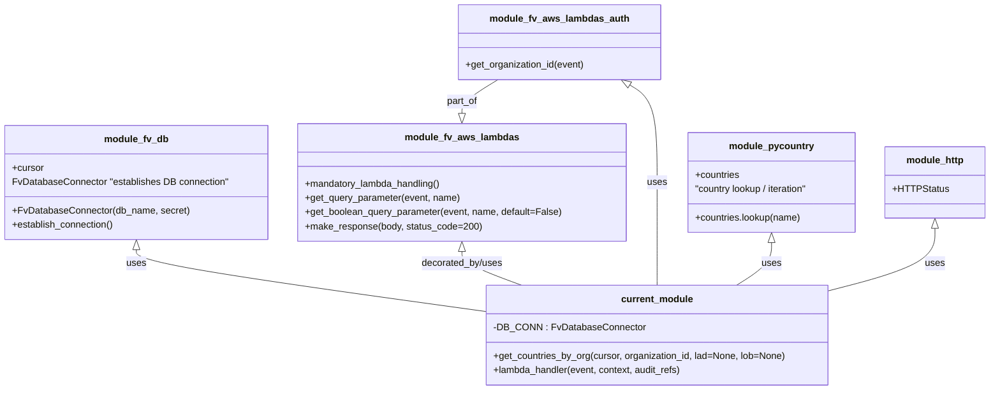

# Diagram: common/location_service/location_service/loc/lambdas/location/locations_countries.py


> Auto-generated by Obscura crawlers

## Diagram 1



### SVG

<svg id="container" width="1663.96875" xmlns="http://www.w3.org/2000/svg" class="classDiagram" height="656" viewBox="0 0 1663.96875 656" role="graphics-document document" aria-roledescription="class"><style>#container{font-family:"trebuchet ms",verdana,arial,sans-serif;font-size:16px;fill:#333;}@keyframes edge-animation-frame{from{stroke-dashoffset:0;}}@keyframes dash{to{stroke-dashoffset:0;}}#container .edge-animation-slow{stroke-dasharray:9,5!important;stroke-dashoffset:900;animation:dash 50s linear infinite;stroke-linecap:round;}#container .edge-animation-fast{stroke-dasharray:9,5!important;stroke-dashoffset:900;animation:dash 20s linear infinite;stroke-linecap:round;}#container .error-icon{fill:#552222;}#container .error-text{fill:#552222;stroke:#552222;}#container .edge-thickness-normal{stroke-width:1px;}#container .edge-thickness-thick{stroke-width:3.5px;}#container .edge-pattern-solid{stroke-dasharray:0;}#container .edge-thickness-invisible{stroke-width:0;fill:none;}#container .edge-pattern-dashed{stroke-dasharray:3;}#container .edge-pattern-dotted{stroke-dasharray:2;}#container .marker{fill:#333333;stroke:#333333;}#container .marker.cross{stroke:#333333;}#container svg{font-family:"trebuchet ms",verdana,arial,sans-serif;font-size:16px;}#container p{margin:0;}#container g.classGroup text{fill:#9370DB;stroke:none;font-family:"trebuchet ms",verdana,arial,sans-serif;font-size:10px;}#container g.classGroup text .title{font-weight:bolder;}#container .nodeLabel,#container .edgeLabel{color:#131300;}#container .edgeLabel .label rect{fill:#ECECFF;}#container .label text{fill:#131300;}#container .labelBkg{background:#ECECFF;}#container .edgeLabel .label span{background:#ECECFF;}#container .classTitle{font-weight:bolder;}#container .node rect,#container .node circle,#container .node ellipse,#container .node polygon,#container .node path{fill:#ECECFF;stroke:#9370DB;stroke-width:1px;}#container .divider{stroke:#9370DB;stroke-width:1;}#container g.clickable{cursor:pointer;}#container g.classGroup rect{fill:#ECECFF;stroke:#9370DB;}#container g.classGroup line{stroke:#9370DB;stroke-width:1;}#container .classLabel .box{stroke:none;stroke-width:0;fill:#ECECFF;opacity:0.5;}#container .classLabel .label{fill:#9370DB;font-size:10px;}#container .relation{stroke:#333333;stroke-width:1;fill:none;}#container .dashed-line{stroke-dasharray:3;}#container .dotted-line{stroke-dasharray:1 2;}#container #compositionStart,#container .composition{fill:#333333!important;stroke:#333333!important;stroke-width:1;}#container #compositionEnd,#container .composition{fill:#333333!important;stroke:#333333!important;stroke-width:1;}#container #dependencyStart,#container .dependency{fill:#333333!important;stroke:#333333!important;stroke-width:1;}#container #dependencyStart,#container .dependency{fill:#333333!important;stroke:#333333!important;stroke-width:1;}#container #extensionStart,#container .extension{fill:transparent!important;stroke:#333333!important;stroke-width:1;}#container #extensionEnd,#container .extension{fill:transparent!important;stroke:#333333!important;stroke-width:1;}#container #aggregationStart,#container .aggregation{fill:transparent!important;stroke:#333333!important;stroke-width:1;}#container #aggregationEnd,#container .aggregation{fill:transparent!important;stroke:#333333!important;stroke-width:1;}#container #lollipopStart,#container .lollipop{fill:#ECECFF!important;stroke:#333333!important;stroke-width:1;}#container #lollipopEnd,#container .lollipop{fill:#ECECFF!important;stroke:#333333!important;stroke-width:1;}#container .edgeTerminals{font-size:11px;line-height:initial;}#container .classTitleText{text-anchor:middle;font-size:18px;fill:#333;}#container .label-icon{display:inline-block;height:1em;overflow:visible;vertical-align:-0.125em;}#container .node .label-icon path{fill:currentColor;stroke:revert;stroke-width:revert;}#container :root{--mermaid-font-family:"trebuchet ms",verdana,arial,sans-serif;}</style><g><defs><marker id="container_class-aggregationStart" class="marker aggregation class" refX="18" refY="7" markerWidth="190" markerHeight="240" orient="auto"><path d="M 18,7 L9,13 L1,7 L9,1 Z"></path></marker></defs><defs><marker id="container_class-aggregationEnd" class="marker aggregation class" refX="1" refY="7" markerWidth="20" markerHeight="28" orient="auto"><path d="M 18,7 L9,13 L1,7 L9,1 Z"></path></marker></defs><defs><marker id="container_class-extensionStart" class="marker extension class" refX="18" refY="7" markerWidth="190" markerHeight="240" orient="auto"><path d="M 1,7 L18,13 V 1 Z"></path></marker></defs><defs><marker id="container_class-extensionEnd" class="marker extension class" refX="1" refY="7" markerWidth="20" markerHeight="28" orient="auto"><path d="M 1,1 V 13 L18,7 Z"></path></marker></defs><defs><marker id="container_class-compositionStart" class="marker composition class" refX="18" refY="7" markerWidth="190" markerHeight="240" orient="auto"><path d="M 18,7 L9,13 L1,7 L9,1 Z"></path></marker></defs><defs><marker id="container_class-compositionEnd" class="marker composition class" refX="1" refY="7" markerWidth="20" markerHeight="28" orient="auto"><path d="M 18,7 L9,13 L1,7 L9,1 Z"></path></marker></defs><defs><marker id="container_class-dependencyStart" class="marker dependency class" refX="6" refY="7" markerWidth="190" markerHeight="240" orient="auto"><path d="M 5,7 L9,13 L1,7 L9,1 Z"></path></marker></defs><defs><marker id="container_class-dependencyEnd" class="marker dependency class" refX="13" refY="7" markerWidth="20" markerHeight="28" orient="auto"><path d="M 18,7 L9,13 L14,7 L9,1 Z"></path></marker></defs><defs><marker id="container_class-lollipopStart" class="marker lollipop class" refX="13" refY="7" markerWidth="190" markerHeight="240" orient="auto"><circle stroke="black" fill="transparent" cx="7" cy="7" r="6"></circle></marker></defs><defs><marker id="container_class-lollipopEnd" class="marker lollipop class" refX="1" refY="7" markerWidth="190" markerHeight="240" orient="auto"><circle stroke="black" fill="transparent" cx="7" cy="7" r="6"></circle></marker></defs><g class="root"><g class="clusters"></g><g class="edgePaths"><path d="M228.316,420.25L228.316,424.042C228.316,427.833,228.316,435.417,325.59,452.711C422.863,470.006,617.41,497.011,714.684,510.514L811.957,524.017" id="id_module_fv_db_current_module_1" class="edge-thickness-normal edge-pattern-solid relation" style=";;;" data-edge="true" data-et="edge" data-id="id_module_fv_db_current_module_1" data-points="W3sieCI6MjI4LjMxNjQwNjI1LCJ5Ijo0MDN9LHsieCI6MjI4LjMxNjQwNjI1LCJ5Ijo0NDN9LHsieCI6ODExLjk1NzAzMTI1LCJ5Ijo1MjQuMDE2OTUyNzk4MzU0NX1d" marker-start="url(#container_class-extensionStart)"></path><path d="M773.566,423.25L773.566,426.542C773.566,429.833,773.566,436.417,790.202,445.875C806.838,455.333,840.111,467.667,856.747,473.833L873.383,480" id="id_module_fv_aws_lambdas_current_module_2" class="edge-thickness-normal edge-pattern-solid relation" style=";;;" data-edge="true" data-et="edge" data-id="id_module_fv_aws_lambdas_current_module_2" data-points="W3sieCI6NzczLjU2NjQwNjI1LCJ5Ijo0MDZ9LHsieCI6NzczLjU2NjQwNjI1LCJ5Ijo0NDN9LHsieCI6ODczLjM4MjU1NDIzNTUzNzIsInkiOjQ4MH1d" marker-start="url(#container_class-extensionStart)"></path><path d="M1054.312,143.012L1061.925,147.677C1069.539,152.341,1084.766,161.671,1092.379,189.002C1099.992,216.333,1099.992,261.667,1099.992,307C1099.992,352.333,1099.992,397.667,1099.992,426.5C1099.992,455.333,1099.992,467.667,1099.992,473.833L1099.992,480" id="id_module_fv_aws_lambdas_auth_current_module_3" class="edge-thickness-normal edge-pattern-solid relation" style=";;;" data-edge="true" data-et="edge" data-id="id_module_fv_aws_lambdas_auth_current_module_3" data-points="W3sieCI6MTAzOS42MDM0MTc5Njg3NSwieSI6MTM0fSx7IngiOjEwOTkuOTkyMTg3NSwieSI6MTcxfSx7IngiOjEwOTkuOTkyMTg3NSwieSI6MzA3fSx7IngiOjEwOTkuOTkyMTg3NSwieSI6NDQzfSx7IngiOjEwOTkuOTkyMTg3NSwieSI6NDgwfV0=" marker-start="url(#container_class-extensionStart)"></path><path d="M1298.137,408.25L1298.137,414.042C1298.137,419.833,1298.137,431.417,1288.038,443.375C1277.94,455.333,1257.744,467.667,1247.645,473.833L1237.547,480" id="id_module_pycountry_current_module_4" class="edge-thickness-normal edge-pattern-solid relation" style=";;;" data-edge="true" data-et="edge" data-id="id_module_pycountry_current_module_4" data-points="W3sieCI6MTI5OC4xMzY3MTg3NSwieSI6MzkxfSx7IngiOjEyOTguMTM2NzE4NzUsInkiOjQ0M30seyJ4IjoxMjM3LjU0NzA2ODY5ODM0NzIsInkiOjQ4MH1d" marker-start="url(#container_class-extensionStart)"></path><path d="M1575.379,384.25L1575.379,394.042C1575.379,403.833,1575.379,423.417,1544.154,441.156C1512.928,458.896,1450.478,474.791,1419.253,482.739L1388.027,490.687" id="id_module_http_current_module_5" class="edge-thickness-normal edge-pattern-solid relation" style=";;;" data-edge="true" data-et="edge" data-id="id_module_http_current_module_5" data-points="W3sieCI6MTU3NS4zNzg5MDYyNSwieSI6MzY3fSx7IngiOjE1NzUuMzc4OTA2MjUsInkiOjQ0M30seyJ4IjoxMzg4LjAyNzM0Mzc1LCJ5Ijo0OTAuNjg2NTIxNjY0MTA1N31d" marker-start="url(#container_class-extensionStart)"></path><path d="M833.955,134L823.89,140.167C813.826,146.333,793.696,158.667,783.631,168.125C773.566,177.583,773.566,184.167,773.566,187.458L773.566,190.75" id="id_module_fv_aws_lambdas_auth_module_fv_aws_lambdas_6" class="edge-thickness-normal edge-pattern-solid relation" style=";;;" data-edge="true" data-et="edge" data-id="id_module_fv_aws_lambdas_auth_module_fv_aws_lambdas_6" data-points="W3sieCI6ODMzLjk1NTE3NTc4MTI1LCJ5IjoxMzR9LHsieCI6NzczLjU2NjQwNjI1LCJ5IjoxNzF9LHsieCI6NzczLjU2NjQwNjI1LCJ5IjoyMDh9XQ==" marker-end="url(#container_class-extensionEnd)"></path></g><g class="edgeLabels"><g class="edgeLabel" transform="translate(228.31640625, 443)"><g class="label" data-id="id_module_fv_db_current_module_1" transform="translate(-16.4921875, -12)"><foreignObject width="32.984375" height="24"><div xmlns="http://www.w3.org/1999/xhtml" class="labelBkg" style="display: table-cell; white-space: nowrap; line-height: 1.5; max-width: 200px; text-align: center;"><span class="edgeLabel"><p>uses</p></span></div></foreignObject></g></g><g class="edgeLabel" transform="translate(773.56640625, 443)"><g class="label" data-id="id_module_fv_aws_lambdas_current_module_2" transform="translate(-69.78125, -12)"><foreignObject width="139.5625" height="24"><div xmlns="http://www.w3.org/1999/xhtml" class="labelBkg" style="display: table-cell; white-space: nowrap; line-height: 1.5; max-width: 200px; text-align: center;"><span class="edgeLabel"><p>decorated_by/uses</p></span></div></foreignObject></g></g><g class="edgeLabel" transform="translate(1099.9921875, 307)"><g class="label" data-id="id_module_fv_aws_lambdas_auth_current_module_3" transform="translate(-16.4921875, -12)"><foreignObject width="32.984375" height="24"><div xmlns="http://www.w3.org/1999/xhtml" class="labelBkg" style="display: table-cell; white-space: nowrap; line-height: 1.5; max-width: 200px; text-align: center;"><span class="edgeLabel"><p>uses</p></span></div></foreignObject></g></g><g class="edgeLabel" transform="translate(1298.13671875, 443)"><g class="label" data-id="id_module_pycountry_current_module_4" transform="translate(-16.4921875, -12)"><foreignObject width="32.984375" height="24"><div xmlns="http://www.w3.org/1999/xhtml" class="labelBkg" style="display: table-cell; white-space: nowrap; line-height: 1.5; max-width: 200px; text-align: center;"><span class="edgeLabel"><p>uses</p></span></div></foreignObject></g></g><g class="edgeLabel" transform="translate(1575.37890625, 443)"><g class="label" data-id="id_module_http_current_module_5" transform="translate(-16.4921875, -12)"><foreignObject width="32.984375" height="24"><div xmlns="http://www.w3.org/1999/xhtml" class="labelBkg" style="display: table-cell; white-space: nowrap; line-height: 1.5; max-width: 200px; text-align: center;"><span class="edgeLabel"><p>uses</p></span></div></foreignObject></g></g><g class="edgeLabel" transform="translate(773.56640625, 171)"><g class="label" data-id="id_module_fv_aws_lambdas_auth_module_fv_aws_lambdas_6" transform="translate(-26.359375, -12)"><foreignObject width="52.71875" height="24"><div xmlns="http://www.w3.org/1999/xhtml" class="labelBkg" style="display: table-cell; white-space: nowrap; line-height: 1.5; max-width: 200px; text-align: center;"><span class="edgeLabel"><p>part_of</p></span></div></foreignObject></g></g></g><g class="nodes"><g class="node default" id="classId-module_fv_db-0" transform="translate(228.31640625, 307)"><g class="basic label-container"><path d="M-220.31640625 -96 L220.31640625 -96 L220.31640625 96 L-220.31640625 96" stroke="none" stroke-width="0" fill="#ECECFF" style=""></path><path d="M-220.31640625 -96 C-94.13636248857664 -96, 32.043681272846726 -96, 220.31640625 -96 M-220.31640625 -96 C-64.21793830184092 -96, 91.88052964631817 -96, 220.31640625 -96 M220.31640625 -96 C220.31640625 -39.117339796576104, 220.31640625 17.765320406847792, 220.31640625 96 M220.31640625 -96 C220.31640625 -34.27010685997326, 220.31640625 27.45978628005348, 220.31640625 96 M220.31640625 96 C46.31531793607792 96, -127.68577037784416 96, -220.31640625 96 M220.31640625 96 C61.443788074832526 96, -97.42883010033495 96, -220.31640625 96 M-220.31640625 96 C-220.31640625 53.82165146714074, -220.31640625 11.643302934281479, -220.31640625 -96 M-220.31640625 96 C-220.31640625 38.14342226523373, -220.31640625 -19.713155469532538, -220.31640625 -96" stroke="#9370DB" stroke-width="1.3" fill="none" stroke-dasharray="0 0" style=""></path></g><g class="annotation-group text" transform="translate(0, -72)"></g><g class="label-group text" transform="translate(-51.6953125, -72)"><g class="label" style="font-weight: bolder" transform="translate(0,-12)"><foreignObject width="103.390625" height="24"><div xmlns="http://www.w3.org/1999/xhtml" style="display: table-cell; white-space: nowrap; line-height: 1.5; max-width: 153px; text-align: center;"><span class="nodeLabel markdown-node-label" style=""><p>module_fv_db</p></span></div></foreignObject></g></g><g class="members-group text" transform="translate(-208.31640625, -24)"><g class="label" style="" transform="translate(0,-12)"><foreignObject width="53.71875" height="24"><div xmlns="http://www.w3.org/1999/xhtml" style="display: table-cell; white-space: nowrap; line-height: 1.5; max-width: 112px; text-align: center;"><span class="nodeLabel markdown-node-label" style=""><p>+cursor</p></span></div></foreignObject></g><g class="label" style="" transform="translate(0,12)"><foreignObject width="364.9375" height="24"><div xmlns="http://www.w3.org/1999/xhtml" style="display: table-cell; white-space: nowrap; line-height: 1.5; max-width: 415px; text-align: center;"><span class="nodeLabel markdown-node-label" style=""><p>FvDatabaseConnector "establishes DB connection"</p></span></div></foreignObject></g></g><g class="methods-group text" transform="translate(-208.31640625, 48)"><g class="label" style="" transform="translate(0,-12)"><foreignObject width="294.515625" height="24"><div xmlns="http://www.w3.org/1999/xhtml" style="display: table-cell; white-space: nowrap; line-height: 1.5; max-width: 352px; text-align: center;"><span class="nodeLabel markdown-node-label" style=""><p>+FvDatabaseConnector(db_name, secret)</p></span></div></foreignObject></g><g class="label" style="" transform="translate(0,12)"><foreignObject width="173.265625" height="24"><div xmlns="http://www.w3.org/1999/xhtml" style="display: table-cell; white-space: nowrap; line-height: 1.5; max-width: 231px; text-align: center;"><span class="nodeLabel markdown-node-label" style=""><p>+establish_connection()</p></span></div></foreignObject></g></g><g class="divider" style=""><path d="M-220.31640625 -48 C-82.28997849684689 -48, 55.73644925630623 -48, 220.31640625 -48 M-220.31640625 -48 C-63.3919334385443 -48, 93.5325393729114 -48, 220.31640625 -48" stroke="#9370DB" stroke-width="1.3" fill="none" stroke-dasharray="0 0" style=""></path></g><g class="divider" style=""><path d="M-220.31640625 24 C-63.06875430521359 24, 94.17889763957282 24, 220.31640625 24 M-220.31640625 24 C-68.06684716534681 24, 84.18271191930637 24, 220.31640625 24" stroke="#9370DB" stroke-width="1.3" fill="none" stroke-dasharray="0 0" style=""></path></g></g><g class="node default" id="classId-module_fv_aws_lambdas-1" transform="translate(773.56640625, 307)"><g class="basic label-container"><path d="M-274.93359375 -99 L274.93359375 -99 L274.93359375 99 L-274.93359375 99" stroke="none" stroke-width="0" fill="#ECECFF" style=""></path><path d="M-274.93359375 -99 C-119.04150495465944 -99, 36.85058384068111 -99, 274.93359375 -99 M-274.93359375 -99 C-92.72605614182388 -99, 89.48148146635225 -99, 274.93359375 -99 M274.93359375 -99 C274.93359375 -52.161701897415035, 274.93359375 -5.323403794830071, 274.93359375 99 M274.93359375 -99 C274.93359375 -51.564891744676444, 274.93359375 -4.129783489352889, 274.93359375 99 M274.93359375 99 C57.39153687298625 99, -160.1505200040275 99, -274.93359375 99 M274.93359375 99 C100.12599476628631 99, -74.68160421742738 99, -274.93359375 99 M-274.93359375 99 C-274.93359375 21.013585291893094, -274.93359375 -56.97282941621381, -274.93359375 -99 M-274.93359375 99 C-274.93359375 50.564274385855704, -274.93359375 2.128548771711408, -274.93359375 -99" stroke="#9370DB" stroke-width="1.3" fill="none" stroke-dasharray="0 0" style=""></path></g><g class="annotation-group text" transform="translate(0, -75)"></g><g class="label-group text" transform="translate(-91.4609375, -75)"><g class="label" style="font-weight: bolder" transform="translate(0,-12)"><foreignObject width="182.921875" height="24"><div xmlns="http://www.w3.org/1999/xhtml" style="display: table-cell; white-space: nowrap; line-height: 1.5; max-width: 231px; text-align: center;"><span class="nodeLabel markdown-node-label" style=""><p>module_fv_aws_lambdas</p></span></div></foreignObject></g></g><g class="members-group text" transform="translate(-262.93359375, -27)"></g><g class="methods-group text" transform="translate(-262.93359375, 3)"><g class="label" style="" transform="translate(0,-12)"><foreignObject width="232.078125" height="24"><div xmlns="http://www.w3.org/1999/xhtml" style="display: table-cell; white-space: nowrap; line-height: 1.5; max-width: 289px; text-align: center;"><span class="nodeLabel markdown-node-label" style=""><p>+mandatory_lambda_handling()</p></span></div></foreignObject></g><g class="label" style="" transform="translate(0,12)"><foreignObject width="262.625" height="24"><div xmlns="http://www.w3.org/1999/xhtml" style="display: table-cell; white-space: nowrap; line-height: 1.5; max-width: 320px; text-align: center;"><span class="nodeLabel markdown-node-label" style=""><p>+get_query_parameter(event, name)</p></span></div></foreignObject></g><g class="label" style="" transform="translate(0,36)"><foreignObject width="434.40625" height="24"><div xmlns="http://www.w3.org/1999/xhtml" style="display: table-cell; white-space: nowrap; line-height: 1.5; max-width: 492px; text-align: center;"><span class="nodeLabel markdown-node-label" style=""><p>+get_boolean_query_parameter(event, name, default=False)</p></span></div></foreignObject></g><g class="label" style="" transform="translate(0,60)"><foreignObject width="296.390625" height="24"><div xmlns="http://www.w3.org/1999/xhtml" style="display: table-cell; white-space: nowrap; line-height: 1.5; max-width: 354px; text-align: center;"><span class="nodeLabel markdown-node-label" style=""><p>+make_response(body, status_code=200)</p></span></div></foreignObject></g></g><g class="divider" style=""><path d="M-274.93359375 -51 C-90.65289463840006 -51, 93.62780447319989 -51, 274.93359375 -51 M-274.93359375 -51 C-115.89974015505857 -51, 43.13411343988287 -51, 274.93359375 -51" stroke="#9370DB" stroke-width="1.3" fill="none" stroke-dasharray="0 0" style=""></path></g><g class="divider" style=""><path d="M-274.93359375 -27 C-86.78497435646781 -27, 101.36364503706437 -27, 274.93359375 -27 M-274.93359375 -27 C-155.26258320961318 -27, -35.59157266922634 -27, 274.93359375 -27" stroke="#9370DB" stroke-width="1.3" fill="none" stroke-dasharray="0 0" style=""></path></g></g><g class="node default" id="classId-module_fv_aws_lambdas_auth-2" transform="translate(936.779296875, 71)"><g class="basic label-container"><path d="M-168.98828125 -63 L168.98828125 -63 L168.98828125 63 L-168.98828125 63" stroke="none" stroke-width="0" fill="#ECECFF" style=""></path><path d="M-168.98828125 -63 C-36.01983365946026 -63, 96.94861393107948 -63, 168.98828125 -63 M-168.98828125 -63 C-51.59270546862065 -63, 65.8028703127587 -63, 168.98828125 -63 M168.98828125 -63 C168.98828125 -27.689763666926773, 168.98828125 7.620472666146455, 168.98828125 63 M168.98828125 -63 C168.98828125 -30.183240433384647, 168.98828125 2.633519133230706, 168.98828125 63 M168.98828125 63 C76.7985208310051 63, -15.391239587989787 63, -168.98828125 63 M168.98828125 63 C101.38340651730158 63, 33.77853178460316 63, -168.98828125 63 M-168.98828125 63 C-168.98828125 21.895598603862915, -168.98828125 -19.20880279227417, -168.98828125 -63 M-168.98828125 63 C-168.98828125 28.01447511482627, -168.98828125 -6.971049770347463, -168.98828125 -63" stroke="#9370DB" stroke-width="1.3" fill="none" stroke-dasharray="0 0" style=""></path></g><g class="annotation-group text" transform="translate(0, -39)"></g><g class="label-group text" transform="translate(-111.9609375, -39)"><g class="label" style="font-weight: bolder" transform="translate(0,-12)"><foreignObject width="223.921875" height="24"><div xmlns="http://www.w3.org/1999/xhtml" style="display: table-cell; white-space: nowrap; line-height: 1.5; max-width: 272px; text-align: center;"><span class="nodeLabel markdown-node-label" style=""><p>module_fv_aws_lambdas_auth</p></span></div></foreignObject></g></g><g class="members-group text" transform="translate(-156.98828125, 9)"></g><g class="methods-group text" transform="translate(-156.98828125, 39)"><g class="label" style="" transform="translate(0,-12)"><foreignObject width="202.015625" height="24"><div xmlns="http://www.w3.org/1999/xhtml" style="display: table-cell; white-space: nowrap; line-height: 1.5; max-width: 259px; text-align: center;"><span class="nodeLabel markdown-node-label" style=""><p>+get_organization_id(event)</p></span></div></foreignObject></g></g><g class="divider" style=""><path d="M-168.98828125 -15 C-93.11526492558457 -15, -17.242248601169138 -15, 168.98828125 -15 M-168.98828125 -15 C-49.19402019833821 -15, 70.60024085332358 -15, 168.98828125 -15" stroke="#9370DB" stroke-width="1.3" fill="none" stroke-dasharray="0 0" style=""></path></g><g class="divider" style=""><path d="M-168.98828125 9 C-41.04734517272591 9, 86.89359090454818 9, 168.98828125 9 M-168.98828125 9 C-94.72750594677086 9, -20.466730643541723 9, 168.98828125 9" stroke="#9370DB" stroke-width="1.3" fill="none" stroke-dasharray="0 0" style=""></path></g></g><g class="node default" id="classId-module_pycountry-3" transform="translate(1298.13671875, 307)"><g class="basic label-container"><path d="M-146.65234375 -84 L146.65234375 -84 L146.65234375 84 L-146.65234375 84" stroke="none" stroke-width="0" fill="#ECECFF" style=""></path><path d="M-146.65234375 -84 C-77.56330924751366 -84, -8.474274745027316 -84, 146.65234375 -84 M-146.65234375 -84 C-84.24874184342153 -84, -21.84513993684304 -84, 146.65234375 -84 M146.65234375 -84 C146.65234375 -21.612187430352805, 146.65234375 40.77562513929439, 146.65234375 84 M146.65234375 -84 C146.65234375 -38.33054561228119, 146.65234375 7.338908775437616, 146.65234375 84 M146.65234375 84 C86.99930197434117 84, 27.34626019868233 84, -146.65234375 84 M146.65234375 84 C57.670436402240725 84, -31.31147094551855 84, -146.65234375 84 M-146.65234375 84 C-146.65234375 43.37344896273966, -146.65234375 2.746897925479317, -146.65234375 -84 M-146.65234375 84 C-146.65234375 45.03528586104821, -146.65234375 6.0705717220964175, -146.65234375 -84" stroke="#9370DB" stroke-width="1.3" fill="none" stroke-dasharray="0 0" style=""></path></g><g class="annotation-group text" transform="translate(0, -60)"></g><g class="label-group text" transform="translate(-68.3359375, -60)"><g class="label" style="font-weight: bolder" transform="translate(0,-12)"><foreignObject width="136.671875" height="24"><div xmlns="http://www.w3.org/1999/xhtml" style="display: table-cell; white-space: nowrap; line-height: 1.5; max-width: 186px; text-align: center;"><span class="nodeLabel markdown-node-label" style=""><p>module_pycountry</p></span></div></foreignObject></g></g><g class="members-group text" transform="translate(-134.65234375, -12)"><g class="label" style="" transform="translate(0,-12)"><foreignObject width="76.015625" height="24"><div xmlns="http://www.w3.org/1999/xhtml" style="display: table-cell; white-space: nowrap; line-height: 1.5; max-width: 133px; text-align: center;"><span class="nodeLabel markdown-node-label" style=""><p>+countries</p></span></div></foreignObject></g><g class="label" style="" transform="translate(0,12)"><foreignObject width="200.96875" height="24"><div xmlns="http://www.w3.org/1999/xhtml" style="display: table-cell; white-space: nowrap; line-height: 1.5; max-width: 251px; text-align: center;"><span class="nodeLabel markdown-node-label" style=""><p>"country lookup / iteration"</p></span></div></foreignObject></g></g><g class="methods-group text" transform="translate(-134.65234375, 60)"><g class="label" style="" transform="translate(0,-12)"><foreignObject width="180.921875" height="24"><div xmlns="http://www.w3.org/1999/xhtml" style="display: table-cell; white-space: nowrap; line-height: 1.5; max-width: 238px; text-align: center;"><span class="nodeLabel markdown-node-label" style=""><p>+countries.lookup(name)</p></span></div></foreignObject></g></g><g class="divider" style=""><path d="M-146.65234375 -36 C-62.64918598551938 -36, 21.353971778961238 -36, 146.65234375 -36 M-146.65234375 -36 C-39.80772090947089 -36, 67.03690193105822 -36, 146.65234375 -36" stroke="#9370DB" stroke-width="1.3" fill="none" stroke-dasharray="0 0" style=""></path></g><g class="divider" style=""><path d="M-146.65234375 36 C-40.21176086892109 36, 66.22882201215782 36, 146.65234375 36 M-146.65234375 36 C-79.66593582770206 36, -12.679527905404115 36, 146.65234375 36" stroke="#9370DB" stroke-width="1.3" fill="none" stroke-dasharray="0 0" style=""></path></g></g><g class="node default" id="classId-module_http-4" transform="translate(1575.37890625, 307)"><g class="basic label-container"><path d="M-80.58984375 -60 L80.58984375 -60 L80.58984375 60 L-80.58984375 60" stroke="none" stroke-width="0" fill="#ECECFF" style=""></path><path d="M-80.58984375 -60 C-27.882612727164656 -60, 24.82461829567069 -60, 80.58984375 -60 M-80.58984375 -60 C-44.151313921884764 -60, -7.712784093769528 -60, 80.58984375 -60 M80.58984375 -60 C80.58984375 -18.777832782360754, 80.58984375 22.444334435278492, 80.58984375 60 M80.58984375 -60 C80.58984375 -12.421854794216621, 80.58984375 35.15629041156676, 80.58984375 60 M80.58984375 60 C16.305061508345247 60, -47.979720733309506 60, -80.58984375 60 M80.58984375 60 C32.39712550619819 60, -15.795592737603613 60, -80.58984375 60 M-80.58984375 60 C-80.58984375 33.583952870827915, -80.58984375 7.1679057416558365, -80.58984375 -60 M-80.58984375 60 C-80.58984375 21.33703229469338, -80.58984375 -17.32593541061324, -80.58984375 -60" stroke="#9370DB" stroke-width="1.3" fill="none" stroke-dasharray="0 0" style=""></path></g><g class="annotation-group text" transform="translate(0, -36)"></g><g class="label-group text" transform="translate(-47.1328125, -36)"><g class="label" style="font-weight: bolder" transform="translate(0,-12)"><foreignObject width="94.265625" height="24"><div xmlns="http://www.w3.org/1999/xhtml" style="display: table-cell; white-space: nowrap; line-height: 1.5; max-width: 144px; text-align: center;"><span class="nodeLabel markdown-node-label" style=""><p>module_http</p></span></div></foreignObject></g></g><g class="members-group text" transform="translate(-68.58984375, 12)"><g class="label" style="" transform="translate(0,-12)"><foreignObject width="90.046875" height="24"><div xmlns="http://www.w3.org/1999/xhtml" style="display: table-cell; white-space: nowrap; line-height: 1.5; max-width: 147px; text-align: center;"><span class="nodeLabel markdown-node-label" style=""><p>+HTTPStatus</p></span></div></foreignObject></g></g><g class="methods-group text" transform="translate(-68.58984375, 60)"></g><g class="divider" style=""><path d="M-80.58984375 -12 C-26.44708395781612 -12, 27.695675834367762 -12, 80.58984375 -12 M-80.58984375 -12 C-37.615082135645736 -12, 5.359679478708529 -12, 80.58984375 -12" stroke="#9370DB" stroke-width="1.3" fill="none" stroke-dasharray="0 0" style=""></path></g><g class="divider" style=""><path d="M-80.58984375 36 C-17.803202188821466 36, 44.98343937235707 36, 80.58984375 36 M-80.58984375 36 C-40.299130556830754 36, -0.008417363661507693 36, 80.58984375 36" stroke="#9370DB" stroke-width="1.3" fill="none" stroke-dasharray="0 0" style=""></path></g></g><g class="node default" id="classId-current_module-5" transform="translate(1099.9921875, 564)"><g class="basic label-container"><path d="M-288.03515625 -84 L288.03515625 -84 L288.03515625 84 L-288.03515625 84" stroke="none" stroke-width="0" fill="#ECECFF" style=""></path><path d="M-288.03515625 -84 C-165.84524534190348 -84, -43.655334433806985 -84, 288.03515625 -84 M-288.03515625 -84 C-66.43248988658155 -84, 155.1701764768369 -84, 288.03515625 -84 M288.03515625 -84 C288.03515625 -29.663075500645824, 288.03515625 24.67384899870835, 288.03515625 84 M288.03515625 -84 C288.03515625 -37.89797300691838, 288.03515625 8.204053986163245, 288.03515625 84 M288.03515625 84 C126.09280372329437 84, -35.84954880341127 84, -288.03515625 84 M288.03515625 84 C152.2539132155117 84, 16.472670181023375 84, -288.03515625 84 M-288.03515625 84 C-288.03515625 22.460905549196056, -288.03515625 -39.07818890160789, -288.03515625 -84 M-288.03515625 84 C-288.03515625 34.30500224346473, -288.03515625 -15.389995513070545, -288.03515625 -84" stroke="#9370DB" stroke-width="1.3" fill="none" stroke-dasharray="0 0" style=""></path></g><g class="annotation-group text" transform="translate(0, -60)"></g><g class="label-group text" transform="translate(-58.3515625, -60)"><g class="label" style="font-weight: bolder" transform="translate(0,-12)"><foreignObject width="116.703125" height="24"><div xmlns="http://www.w3.org/1999/xhtml" style="display: table-cell; white-space: nowrap; line-height: 1.5; max-width: 166px; text-align: center;"><span class="nodeLabel markdown-node-label" style=""><p>current_module</p></span></div></foreignObject></g></g><g class="members-group text" transform="translate(-276.03515625, -12)"><g class="label" style="" transform="translate(0,-12)"><foreignObject width="244.359375" height="24"><div xmlns="http://www.w3.org/1999/xhtml" style="display: table-cell; white-space: nowrap; line-height: 1.5; max-width: 303px; text-align: center;"><span class="nodeLabel markdown-node-label" style=""><p>-DB_CONN : FvDatabaseConnector</p></span></div></foreignObject></g></g><g class="methods-group text" transform="translate(-276.03515625, 36)"><g class="label" style="" transform="translate(0,-12)"><foreignObject width="493.71875" height="24"><div xmlns="http://www.w3.org/1999/xhtml" style="display: table-cell; white-space: nowrap; line-height: 1.5; max-width: 551px; text-align: center;"><span class="nodeLabel markdown-node-label" style=""><p>+get_countries_by_org(cursor, organization_id, lad=None, lob=None)</p></span></div></foreignObject></g><g class="label" style="" transform="translate(0,12)"><foreignObject width="321.6875" height="24"><div xmlns="http://www.w3.org/1999/xhtml" style="display: table-cell; white-space: nowrap; line-height: 1.5; max-width: 379px; text-align: center;"><span class="nodeLabel markdown-node-label" style=""><p>+lambda_handler(event, context, audit_refs)</p></span></div></foreignObject></g></g><g class="divider" style=""><path d="M-288.03515625 -36 C-79.1914908555415 -36, 129.652174538917 -36, 288.03515625 -36 M-288.03515625 -36 C-69.44866121450889 -36, 149.13783382098222 -36, 288.03515625 -36" stroke="#9370DB" stroke-width="1.3" fill="none" stroke-dasharray="0 0" style=""></path></g><g class="divider" style=""><path d="M-288.03515625 12 C-165.93618815489538 12, -43.837220059790724 12, 288.03515625 12 M-288.03515625 12 C-99.67650896871888 12, 88.68213831256224 12, 288.03515625 12" stroke="#9370DB" stroke-width="1.3" fill="none" stroke-dasharray="0 0" style=""></path></g></g></g></g></g></svg>

## Diagram 2

```mermaid
flowchart TD
    Start([Start])
    EventParsed[/Parse event query params: lad, lob, hasLocation/]
    ConnectDB[[Establish DB connection via DB_CONN]]
    CheckParams{(lad and lob) OR hasLocation?}
    QueryDB[get_countries_by_org(cursor, org_id, lad, lob)]
    LookupLoop[For each country from DB: pycountry.lookup(name)]
    AppendFinal1[Append {"code", "name"} to final_countries]
    AllCountriesLoop[Iterate all pycountry.countries]
    AppendFinal2[Append {"code","name"} to final_countries]
    HasFinal{final_countries not empty?}
    ReturnOK[/make_response(final_countries) -> 200/]
    ReturnNotFound[/make_response({}, 404)/]
    End([End])

    Start --> EventParsed --> ConnectDB --> CheckParams
    CheckParams -->|Yes| QueryDB --> LookupLoop -->|lookup success| AppendFinal1 --> HasFinal
    LookupLoop -->|lookup fail| LookupLoop
    CheckParams -->|No| HasCountriesEmpty{countries empty?}
    HasCountriesEmpty -->|True| AllCountriesLoop --> AppendFinal2 --> HasFinal
    HasCountriesEmpty -->|False| HasFinal
    HasFinal -->|Yes| ReturnOK --> End
    HasFinal -->|No| ReturnNotFound --> End
```

> SVG rendering failed for this diagram.
