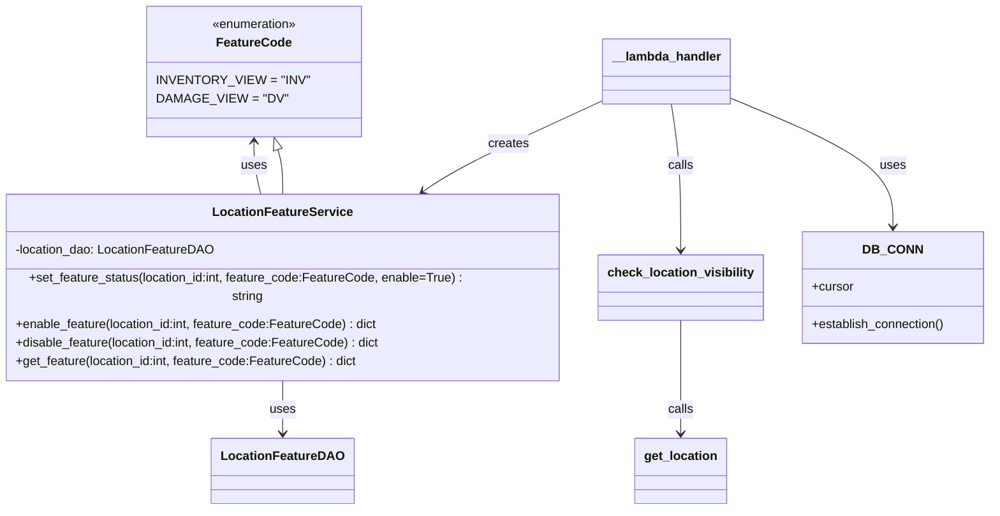

# Diagram: common/location_service/location_service/loc/lambdas/location/locations_feature.py


> Auto-generated by Obscura crawlers

## Diagram 1



### SVG

<svg id="container" width="1267.6953125" xmlns="http://www.w3.org/2000/svg" class="classDiagram" height="632" viewBox="0 0 1267.6953125 632" role="graphics-document document" aria-roledescription="class"><style>#container{font-family:"trebuchet ms",verdana,arial,sans-serif;font-size:16px;fill:#333;}@keyframes edge-animation-frame{from{stroke-dashoffset:0;}}@keyframes dash{to{stroke-dashoffset:0;}}#container .edge-animation-slow{stroke-dasharray:9,5!important;stroke-dashoffset:900;animation:dash 50s linear infinite;stroke-linecap:round;}#container .edge-animation-fast{stroke-dasharray:9,5!important;stroke-dashoffset:900;animation:dash 20s linear infinite;stroke-linecap:round;}#container .error-icon{fill:#552222;}#container .error-text{fill:#552222;stroke:#552222;}#container .edge-thickness-normal{stroke-width:1px;}#container .edge-thickness-thick{stroke-width:3.5px;}#container .edge-pattern-solid{stroke-dasharray:0;}#container .edge-thickness-invisible{stroke-width:0;fill:none;}#container .edge-pattern-dashed{stroke-dasharray:3;}#container .edge-pattern-dotted{stroke-dasharray:2;}#container .marker{fill:#333333;stroke:#333333;}#container .marker.cross{stroke:#333333;}#container svg{font-family:"trebuchet ms",verdana,arial,sans-serif;font-size:16px;}#container p{margin:0;}#container g.classGroup text{fill:#9370DB;stroke:none;font-family:"trebuchet ms",verdana,arial,sans-serif;font-size:10px;}#container g.classGroup text .title{font-weight:bolder;}#container .nodeLabel,#container .edgeLabel{color:#131300;}#container .edgeLabel .label rect{fill:#ECECFF;}#container .label text{fill:#131300;}#container .labelBkg{background:#ECECFF;}#container .edgeLabel .label span{background:#ECECFF;}#container .classTitle{font-weight:bolder;}#container .node rect,#container .node circle,#container .node ellipse,#container .node polygon,#container .node path{fill:#ECECFF;stroke:#9370DB;stroke-width:1px;}#container .divider{stroke:#9370DB;stroke-width:1;}#container g.clickable{cursor:pointer;}#container g.classGroup rect{fill:#ECECFF;stroke:#9370DB;}#container g.classGroup line{stroke:#9370DB;stroke-width:1;}#container .classLabel .box{stroke:none;stroke-width:0;fill:#ECECFF;opacity:0.5;}#container .classLabel .label{fill:#9370DB;font-size:10px;}#container .relation{stroke:#333333;stroke-width:1;fill:none;}#container .dashed-line{stroke-dasharray:3;}#container .dotted-line{stroke-dasharray:1 2;}#container #compositionStart,#container .composition{fill:#333333!important;stroke:#333333!important;stroke-width:1;}#container #compositionEnd,#container .composition{fill:#333333!important;stroke:#333333!important;stroke-width:1;}#container #dependencyStart,#container .dependency{fill:#333333!important;stroke:#333333!important;stroke-width:1;}#container #dependencyStart,#container .dependency{fill:#333333!important;stroke:#333333!important;stroke-width:1;}#container #extensionStart,#container .extension{fill:transparent!important;stroke:#333333!important;stroke-width:1;}#container #extensionEnd,#container .extension{fill:transparent!important;stroke:#333333!important;stroke-width:1;}#container #aggregationStart,#container .aggregation{fill:transparent!important;stroke:#333333!important;stroke-width:1;}#container #aggregationEnd,#container .aggregation{fill:transparent!important;stroke:#333333!important;stroke-width:1;}#container #lollipopStart,#container .lollipop{fill:#ECECFF!important;stroke:#333333!important;stroke-width:1;}#container #lollipopEnd,#container .lollipop{fill:#ECECFF!important;stroke:#333333!important;stroke-width:1;}#container .edgeTerminals{font-size:11px;line-height:initial;}#container .classTitleText{text-anchor:middle;font-size:18px;fill:#333;}#container .label-icon{display:inline-block;height:1em;overflow:visible;vertical-align:-0.125em;}#container .node .label-icon path{fill:currentColor;stroke:revert;stroke-width:revert;}#container :root{--mermaid-font-family:"trebuchet ms",verdana,arial,sans-serif;}</style><g><defs><marker id="container_class-aggregationStart" class="marker aggregation class" refX="18" refY="7" markerWidth="190" markerHeight="240" orient="auto"><path d="M 18,7 L9,13 L1,7 L9,1 Z"></path></marker></defs><defs><marker id="container_class-aggregationEnd" class="marker aggregation class" refX="1" refY="7" markerWidth="20" markerHeight="28" orient="auto"><path d="M 18,7 L9,13 L1,7 L9,1 Z"></path></marker></defs><defs><marker id="container_class-extensionStart" class="marker extension class" refX="18" refY="7" markerWidth="190" markerHeight="240" orient="auto"><path d="M 1,7 L18,13 V 1 Z"></path></marker></defs><defs><marker id="container_class-extensionEnd" class="marker extension class" refX="1" refY="7" markerWidth="20" markerHeight="28" orient="auto"><path d="M 1,1 V 13 L18,7 Z"></path></marker></defs><defs><marker id="container_class-compositionStart" class="marker composition class" refX="18" refY="7" markerWidth="190" markerHeight="240" orient="auto"><path d="M 18,7 L9,13 L1,7 L9,1 Z"></path></marker></defs><defs><marker id="container_class-compositionEnd" class="marker composition class" refX="1" refY="7" markerWidth="20" markerHeight="28" orient="auto"><path d="M 18,7 L9,13 L1,7 L9,1 Z"></path></marker></defs><defs><marker id="container_class-dependencyStart" class="marker dependency class" refX="6" refY="7" markerWidth="190" markerHeight="240" orient="auto"><path d="M 5,7 L9,13 L1,7 L9,1 Z"></path></marker></defs><defs><marker id="container_class-dependencyEnd" class="marker dependency class" refX="13" refY="7" markerWidth="20" markerHeight="28" orient="auto"><path d="M 18,7 L9,13 L14,7 L9,1 Z"></path></marker></defs><defs><marker id="container_class-lollipopStart" class="marker lollipop class" refX="13" refY="7" markerWidth="190" markerHeight="240" orient="auto"><circle stroke="black" fill="transparent" cx="7" cy="7" r="6"></circle></marker></defs><defs><marker id="container_class-lollipopEnd" class="marker lollipop class" refX="1" refY="7" markerWidth="190" markerHeight="240" orient="auto"><circle stroke="black" fill="transparent" cx="7" cy="7" r="6"></circle></marker></defs><g class="root"><g class="clusters"></g><g class="edgePaths"><path d="M359.607,192.515L360.637,195.929C361.667,199.344,363.726,206.172,364.755,215.753C365.785,225.333,365.785,237.667,365.785,243.833L365.785,250" id="id_FeatureCode_LocationFeatureService_1" class="edge-thickness-normal edge-pattern-solid relation" style=";;;" data-edge="true" data-et="edge" data-id="id_FeatureCode_LocationFeatureService_1" data-points="W3sieCI6MzU0LjYyNjM4ODE3MTQ4NzYzLCJ5IjoxNzZ9LHsieCI6MzY1Ljc4NTE1NjI1LCJ5IjoyMTN9LHsieCI6MzY1Ljc4NTE1NjI1LCJ5IjoyNTB9XQ==" marker-start="url(#container_class-extensionStart)"></path><path d="M365.785,466L365.785,472.167C365.785,478.333,365.785,490.667,365.785,502C365.785,513.333,365.785,523.667,365.785,528.833L365.785,534" id="id_LocationFeatureService_LocationFeatureDAO_2" class="edge-thickness-normal edge-pattern-solid relation" style=";;;" data-edge="true" data-et="edge" data-id="id_LocationFeatureService_LocationFeatureDAO_2" data-points="W3sieCI6MzY1Ljc4NTE1NjI1LCJ5Ijo0NjZ9LHsieCI6MzY1Ljc4NTE1NjI1LCJ5Ijo1MDN9LHsieCI6MzY1Ljc4NTE1NjI1LCJ5Ijo1NDB9XQ==" marker-end="url(#container_class-dependencyEnd)"></path><path d="M338.605,250L337.053,243.833C335.501,237.667,332.397,225.333,330.845,214C329.293,202.667,329.293,192.333,329.293,187.167L329.293,182" id="id_LocationFeatureService_FeatureCode_3" class="edge-thickness-normal edge-pattern-solid relation" style=";;;" data-edge="true" data-et="edge" data-id="id_LocationFeatureService_FeatureCode_3" data-points="W3sieCI6MzM4LjYwNDc2ODMxODk2NTUsInkiOjI1MH0seyJ4IjozMjkuMjkyOTY4NzUsInkiOjIxM30seyJ4IjozMjkuMjkyOTY4NzUsInkiOjE3Nn1d" marker-end="url(#container_class-dependencyEnd)"></path><path d="M937.691,125.869L972.053,140.391C1006.414,154.913,1075.137,183.956,1109.498,209.645C1143.859,235.333,1143.859,257.667,1143.859,268.833L1143.859,280" id="id___lambda_handler_DB_CONN_4" class="edge-thickness-normal edge-pattern-solid relation" style=";;;" data-edge="true" data-et="edge" data-id="id___lambda_handler_DB_CONN_4" data-points="W3sieCI6OTM3LjY5MTQwNjI1LCJ5IjoxMjUuODY5MTA0MzA0NTIyODJ9LHsieCI6MTE0My44NTkzNzUsInkiOjIxM30seyJ4IjoxMTQzLjg1OTM3NSwieSI6Mjg2fV0=" marker-end="url(#container_class-dependencyEnd)"></path><path d="M863.884,134L865.87,147.167C867.855,160.333,871.826,186.667,873.811,216C875.797,245.333,875.797,277.667,875.797,293.833L875.797,310" id="id___lambda_handler_check_location_visibility_5" class="edge-thickness-normal edge-pattern-solid relation" style=";;;" data-edge="true" data-et="edge" data-id="id___lambda_handler_check_location_visibility_5" data-points="W3sieCI6ODYzLjg4NDEzNjEwNTM3MTksInkiOjEzNH0seyJ4Ijo4NzUuNzk2ODc1LCJ5IjoyMTN9LHsieCI6ODc1Ljc5Njg3NSwieSI6MzE2fV0=" marker-end="url(#container_class-dependencyEnd)"></path><path d="M777.41,128.839L746.896,142.866C716.381,156.893,655.352,184.946,615.962,204.604C576.572,224.262,558.822,235.524,549.947,241.155L541.072,246.786" id="id___lambda_handler_LocationFeatureService_6" class="edge-thickness-normal edge-pattern-solid relation" style=";;;" data-edge="true" data-et="edge" data-id="id___lambda_handler_LocationFeatureService_6" data-points="W3sieCI6Nzc3LjQxMDE1NjI1LCJ5IjoxMjguODM4NzczMzQ0ODA5NDN9LHsieCI6NTk0LjMyMjI2NTYyNSwieSI6MjEzfSx7IngiOjUzNi4wMDU4OTk3ODQ0ODI3LCJ5IjoyNTB9XQ==" marker-end="url(#container_class-dependencyEnd)"></path><path d="M875.797,400L875.797,417.167C875.797,434.333,875.797,468.667,875.797,491C875.797,513.333,875.797,523.667,875.797,528.833L875.797,534" id="id_check_location_visibility_get_location_7" class="edge-thickness-normal edge-pattern-solid relation" style=";;;" data-edge="true" data-et="edge" data-id="id_check_location_visibility_get_location_7" data-points="W3sieCI6ODc1Ljc5Njg3NSwieSI6NDAwfSx7IngiOjg3NS43OTY4NzUsInkiOjUwM30seyJ4Ijo4NzUuNzk2ODc1LCJ5Ijo1NDB9XQ==" marker-end="url(#container_class-dependencyEnd)"></path></g><g class="edgeLabels"><g class="edgeLabel"><g class="label" data-id="id_FeatureCode_LocationFeatureService_1" transform="translate(0, 0)"><foreignObject width="0" height="0"><div xmlns="http://www.w3.org/1999/xhtml" class="labelBkg" style="display: table-cell; white-space: nowrap; line-height: 1.5; max-width: 200px; text-align: center;"><span class="edgeLabel"></span></div></foreignObject></g></g><g class="edgeLabel" transform="translate(365.78515625, 503)"><g class="label" data-id="id_LocationFeatureService_LocationFeatureDAO_2" transform="translate(-16.4921875, -12)"><foreignObject width="32.984375" height="24"><div xmlns="http://www.w3.org/1999/xhtml" class="labelBkg" style="display: table-cell; white-space: nowrap; line-height: 1.5; max-width: 200px; text-align: center;"><span class="edgeLabel"><p>uses</p></span></div></foreignObject></g></g><g class="edgeLabel" transform="translate(329.29296875, 213)"><g class="label" data-id="id_LocationFeatureService_FeatureCode_3" transform="translate(-16.4921875, -12)"><foreignObject width="32.984375" height="24"><div xmlns="http://www.w3.org/1999/xhtml" class="labelBkg" style="display: table-cell; white-space: nowrap; line-height: 1.5; max-width: 200px; text-align: center;"><span class="edgeLabel"><p>uses</p></span></div></foreignObject></g></g><g class="edgeLabel" transform="translate(1143.859375, 213)"><g class="label" data-id="id___lambda_handler_DB_CONN_4" transform="translate(-16.4921875, -12)"><foreignObject width="32.984375" height="24"><div xmlns="http://www.w3.org/1999/xhtml" class="labelBkg" style="display: table-cell; white-space: nowrap; line-height: 1.5; max-width: 200px; text-align: center;"><span class="edgeLabel"><p>uses</p></span></div></foreignObject></g></g><g class="edgeLabel" transform="translate(875.796875, 213)"><g class="label" data-id="id___lambda_handler_check_location_visibility_5" transform="translate(-16.4453125, -12)"><foreignObject width="32.890625" height="24"><div xmlns="http://www.w3.org/1999/xhtml" class="labelBkg" style="display: table-cell; white-space: nowrap; line-height: 1.5; max-width: 200px; text-align: center;"><span class="edgeLabel"><p>calls</p></span></div></foreignObject></g></g><g class="edgeLabel" transform="translate(654.49049, 185.34207)"><g class="label" data-id="id___lambda_handler_LocationFeatureService_6" transform="translate(-26.171875, -12)"><foreignObject width="52.34375" height="24"><div xmlns="http://www.w3.org/1999/xhtml" class="labelBkg" style="display: table-cell; white-space: nowrap; line-height: 1.5; max-width: 200px; text-align: center;"><span class="edgeLabel"><p>creates</p></span></div></foreignObject></g></g><g class="edgeLabel" transform="translate(875.796875, 503)"><g class="label" data-id="id_check_location_visibility_get_location_7" transform="translate(-16.4453125, -12)"><foreignObject width="32.890625" height="24"><div xmlns="http://www.w3.org/1999/xhtml" class="labelBkg" style="display: table-cell; white-space: nowrap; line-height: 1.5; max-width: 200px; text-align: center;"><span class="edgeLabel"><p>calls</p></span></div></foreignObject></g></g></g><g class="nodes"><g class="node default" id="classId-FeatureCode-0" transform="translate(329.29296875, 92)"><g class="basic label-container"><path d="M-128.01171875 -84 L128.01171875 -84 L128.01171875 84 L-128.01171875 84" stroke="none" stroke-width="0" fill="#ECECFF" style=""></path><path d="M-128.01171875 -84 C-61.47659628693904 -84, 5.058526176121916 -84, 128.01171875 -84 M-128.01171875 -84 C-42.854227268560365 -84, 42.30326421287927 -84, 128.01171875 -84 M128.01171875 -84 C128.01171875 -22.379378383312286, 128.01171875 39.24124323337543, 128.01171875 84 M128.01171875 -84 C128.01171875 -20.489575725605086, 128.01171875 43.02084854878983, 128.01171875 84 M128.01171875 84 C38.24760370646929 84, -51.51651133706142 84, -128.01171875 84 M128.01171875 84 C27.08393972154927 84, -73.84383930690146 84, -128.01171875 84 M-128.01171875 84 C-128.01171875 37.18513071773813, -128.01171875 -9.629738564523734, -128.01171875 -84 M-128.01171875 84 C-128.01171875 41.28328406191021, -128.01171875 -1.4334318761795828, -128.01171875 -84" stroke="#9370DB" stroke-width="1.3" fill="none" stroke-dasharray="0 0" style=""></path></g><g class="annotation-group text" transform="translate(-55.5546875, -60)"><g class="label" style="" transform="translate(0,-12)"><foreignObject width="111.109375" height="24"><div xmlns="http://www.w3.org/1999/xhtml" style="display: table-cell; white-space: nowrap; line-height: 1.5; max-width: 161px; text-align: center;"><span class="nodeLabel markdown-node-label" style=""><p>«enumeration»</p></span></div></foreignObject></g></g><g class="label-group text" transform="translate(-45.71875, -36)"><g class="label" style="font-weight: bolder" transform="translate(0,-12)"><foreignObject width="91.4375" height="24"><div xmlns="http://www.w3.org/1999/xhtml" style="display: table-cell; white-space: nowrap; line-height: 1.5; max-width: 140px; text-align: center;"><span class="nodeLabel markdown-node-label" style=""><p>FeatureCode</p></span></div></foreignObject></g></g><g class="members-group text" transform="translate(-116.01171875, 12)"><g class="label" style="" transform="translate(0,-12)"><foreignObject width="176.46875" height="24"><div xmlns="http://www.w3.org/1999/xhtml" style="display: table-cell; white-space: nowrap; line-height: 1.5; max-width: 226px; text-align: center;"><span class="nodeLabel markdown-node-label" style=""><p>INVENTORY_VIEW = "INV"</p></span></div></foreignObject></g><g class="label" style="" transform="translate(0,12)"><foreignObject width="150.875" height="24"><div xmlns="http://www.w3.org/1999/xhtml" style="display: table-cell; white-space: nowrap; line-height: 1.5; max-width: 201px; text-align: center;"><span class="nodeLabel markdown-node-label" style=""><p>DAMAGE_VIEW = "DV"</p></span></div></foreignObject></g></g><g class="methods-group text" transform="translate(-116.01171875, 84)"></g><g class="divider" style=""><path d="M-128.01171875 -12 C-49.68030783285796 -12, 28.651103084284074 -12, 128.01171875 -12 M-128.01171875 -12 C-54.34958661879112 -12, 19.312545512417756 -12, 128.01171875 -12" stroke="#9370DB" stroke-width="1.3" fill="none" stroke-dasharray="0 0" style=""></path></g><g class="divider" style=""><path d="M-128.01171875 60 C-62.20305216252967 60, 3.6056144249406543 60, 128.01171875 60 M-128.01171875 60 C-38.21401702713929 60, 51.583684695721416 60, 128.01171875 60" stroke="#9370DB" stroke-width="1.3" fill="none" stroke-dasharray="0 0" style=""></path></g></g><g class="node default" id="classId-LocationFeatureService-1" transform="translate(365.78515625, 358)"><g class="basic label-container"><path d="M-357.78515625 -108 L357.78515625 -108 L357.78515625 108 L-357.78515625 108" stroke="none" stroke-width="0" fill="#ECECFF" style=""></path><path d="M-357.78515625 -108 C-109.7881774965175 -108, 138.208801256965 -108, 357.78515625 -108 M-357.78515625 -108 C-212.05068521044103 -108, -66.31621417088206 -108, 357.78515625 -108 M357.78515625 -108 C357.78515625 -40.07628764819586, 357.78515625 27.847424703608283, 357.78515625 108 M357.78515625 -108 C357.78515625 -50.87236418345325, 357.78515625 6.2552716330935, 357.78515625 108 M357.78515625 108 C208.8167547319226 108, 59.8483532138452 108, -357.78515625 108 M357.78515625 108 C112.98335153736775 108, -131.8184531752645 108, -357.78515625 108 M-357.78515625 108 C-357.78515625 24.157663151918157, -357.78515625 -59.684673696163685, -357.78515625 -108 M-357.78515625 108 C-357.78515625 46.8709337257765, -357.78515625 -14.258132548446994, -357.78515625 -108" stroke="#9370DB" stroke-width="1.3" fill="none" stroke-dasharray="0 0" style=""></path></g><g class="annotation-group text" transform="translate(0, -84)"></g><g class="label-group text" transform="translate(-85.3828125, -84)"><g class="label" style="font-weight: bolder" transform="translate(0,-12)"><foreignObject width="170.765625" height="24"><div xmlns="http://www.w3.org/1999/xhtml" style="display: table-cell; white-space: nowrap; line-height: 1.5; max-width: 218px; text-align: center;"><span class="nodeLabel markdown-node-label" style=""><p>LocationFeatureService</p></span></div></foreignObject></g></g><g class="members-group text" transform="translate(-345.78515625, -36)"><g class="label" style="" transform="translate(0,-12)"><foreignObject width="255.703125" height="24"><div xmlns="http://www.w3.org/1999/xhtml" style="display: table-cell; white-space: nowrap; line-height: 1.5; max-width: 313px; text-align: center;"><span class="nodeLabel markdown-node-label" style=""><p>-location_dao: LocationFeatureDAO</p></span></div></foreignObject></g></g><g class="methods-group text" transform="translate(-345.78515625, 12)"><g class="label" style="" transform="translate(0,-12)"><foreignObject width="606.1875" height="24"><div xmlns="http://www.w3.org/1999/xhtml" style="display: table-cell; white-space: nowrap; line-height: 1.5; max-width: 664px; text-align: center;"><span class="nodeLabel markdown-node-label" style=""><p>+set_feature_status(location_id:int, feature_code:FeatureCode, enable=True) : string</p></span></div></foreignObject></g><g class="label" style="" transform="translate(0,12)"><foreignObject width="469.453125" height="24"><div xmlns="http://www.w3.org/1999/xhtml" style="display: table-cell; white-space: nowrap; line-height: 1.5; max-width: 527px; text-align: center;"><span class="nodeLabel markdown-node-label" style=""><p>+enable_feature(location_id:int, feature_code:FeatureCode) : dict</p></span></div></foreignObject></g><g class="label" style="" transform="translate(0,36)"><foreignObject width="472.75" height="24"><div xmlns="http://www.w3.org/1999/xhtml" style="display: table-cell; white-space: nowrap; line-height: 1.5; max-width: 530px; text-align: center;"><span class="nodeLabel markdown-node-label" style=""><p>+disable_feature(location_id:int, feature_code:FeatureCode) : dict</p></span></div></foreignObject></g><g class="label" style="" transform="translate(0,60)"><foreignObject width="442.703125" height="24"><div xmlns="http://www.w3.org/1999/xhtml" style="display: table-cell; white-space: nowrap; line-height: 1.5; max-width: 500px; text-align: center;"><span class="nodeLabel markdown-node-label" style=""><p>+get_feature(location_id:int, feature_code:FeatureCode) : dict</p></span></div></foreignObject></g></g><g class="divider" style=""><path d="M-357.78515625 -60 C-107.23845725040212 -60, 143.30824174919576 -60, 357.78515625 -60 M-357.78515625 -60 C-96.2479800191324 -60, 165.2891962117352 -60, 357.78515625 -60" stroke="#9370DB" stroke-width="1.3" fill="none" stroke-dasharray="0 0" style=""></path></g><g class="divider" style=""><path d="M-357.78515625 -12 C-172.87722722179748 -12, 12.030701806405034 -12, 357.78515625 -12 M-357.78515625 -12 C-203.5813896444385 -12, -49.377623038877005 -12, 357.78515625 -12" stroke="#9370DB" stroke-width="1.3" fill="none" stroke-dasharray="0 0" style=""></path></g></g><g class="node default" id="classId-LocationFeatureDAO-2" transform="translate(365.78515625, 582)"><g class="basic label-container"><path d="M-86.03125 -42 L86.03125 -42 L86.03125 42 L-86.03125 42" stroke="none" stroke-width="0" fill="#ECECFF" style=""></path><path d="M-86.03125 -42 C-36.68064831674852 -42, 12.669953366502966 -42, 86.03125 -42 M-86.03125 -42 C-30.919211100019787 -42, 24.192827799960426 -42, 86.03125 -42 M86.03125 -42 C86.03125 -20.90625550881019, 86.03125 0.18748898237961953, 86.03125 42 M86.03125 -42 C86.03125 -12.138352933338052, 86.03125 17.723294133323897, 86.03125 42 M86.03125 42 C17.905162072924426 42, -50.22092585415115 42, -86.03125 42 M86.03125 42 C41.10457713949392 42, -3.822095721012161 42, -86.03125 42 M-86.03125 42 C-86.03125 13.938615564653958, -86.03125 -14.122768870692084, -86.03125 -42 M-86.03125 42 C-86.03125 11.432732032648953, -86.03125 -19.134535934702093, -86.03125 -42" stroke="#9370DB" stroke-width="1.3" fill="none" stroke-dasharray="0 0" style=""></path></g><g class="annotation-group text" transform="translate(0, -18)"></g><g class="label-group text" transform="translate(-74.03125, -18)"><g class="label" style="font-weight: bolder" transform="translate(0,-12)"><foreignObject width="148.0625" height="24"><div xmlns="http://www.w3.org/1999/xhtml" style="display: table-cell; white-space: nowrap; line-height: 1.5; max-width: 196px; text-align: center;"><span class="nodeLabel markdown-node-label" style=""><p>LocationFeatureDAO</p></span></div></foreignObject></g></g><g class="members-group text" transform="translate(-74.03125, 30)"></g><g class="methods-group text" transform="translate(-74.03125, 60)"></g><g class="divider" style=""><path d="M-86.03125 6 C-51.26262147511936 6, -16.49399295023872 6, 86.03125 6 M-86.03125 6 C-33.23944466668005 6, 19.5523606666399 6, 86.03125 6" stroke="#9370DB" stroke-width="1.3" fill="none" stroke-dasharray="0 0" style=""></path></g><g class="divider" style=""><path d="M-86.03125 24 C-50.38361689739866 24, -14.73598379479732 24, 86.03125 24 M-86.03125 24 C-19.53278196549107 24, 46.96568606901786 24, 86.03125 24" stroke="#9370DB" stroke-width="1.3" fill="none" stroke-dasharray="0 0" style=""></path></g></g><g class="node default" id="classId-DB_CONN-3" transform="translate(1143.859375, 358)"><g class="basic label-container"><path d="M-115.8359375 -72 L115.8359375 -72 L115.8359375 72 L-115.8359375 72" stroke="none" stroke-width="0" fill="#ECECFF" style=""></path><path d="M-115.8359375 -72 C-27.18024070949278 -72, 61.47545608101444 -72, 115.8359375 -72 M-115.8359375 -72 C-65.52461122317183 -72, -15.213284946343649 -72, 115.8359375 -72 M115.8359375 -72 C115.8359375 -32.3517184360214, 115.8359375 7.296563127957199, 115.8359375 72 M115.8359375 -72 C115.8359375 -24.294781443064117, 115.8359375 23.410437113871765, 115.8359375 72 M115.8359375 72 C63.472485333011946 72, 11.109033166023892 72, -115.8359375 72 M115.8359375 72 C40.59151791718786 72, -34.652901665624285 72, -115.8359375 72 M-115.8359375 72 C-115.8359375 28.88899111558092, -115.8359375 -14.222017768838157, -115.8359375 -72 M-115.8359375 72 C-115.8359375 23.169829879079536, -115.8359375 -25.660340241840927, -115.8359375 -72" stroke="#9370DB" stroke-width="1.3" fill="none" stroke-dasharray="0 0" style=""></path></g><g class="annotation-group text" transform="translate(0, -48)"></g><g class="label-group text" transform="translate(-34.40625, -48)"><g class="label" style="font-weight: bolder" transform="translate(0,-12)"><foreignObject width="68.8125" height="24"><div xmlns="http://www.w3.org/1999/xhtml" style="display: table-cell; white-space: nowrap; line-height: 1.5; max-width: 119px; text-align: center;"><span class="nodeLabel markdown-node-label" style=""><p>DB_CONN</p></span></div></foreignObject></g></g><g class="members-group text" transform="translate(-103.8359375, 0)"><g class="label" style="" transform="translate(0,-12)"><foreignObject width="53.71875" height="24"><div xmlns="http://www.w3.org/1999/xhtml" style="display: table-cell; white-space: nowrap; line-height: 1.5; max-width: 112px; text-align: center;"><span class="nodeLabel markdown-node-label" style=""><p>+cursor</p></span></div></foreignObject></g></g><g class="methods-group text" transform="translate(-103.8359375, 48)"><g class="label" style="" transform="translate(0,-12)"><foreignObject width="173.265625" height="24"><div xmlns="http://www.w3.org/1999/xhtml" style="display: table-cell; white-space: nowrap; line-height: 1.5; max-width: 231px; text-align: center;"><span class="nodeLabel markdown-node-label" style=""><p>+establish_connection()</p></span></div></foreignObject></g></g><g class="divider" style=""><path d="M-115.8359375 -24 C-36.31742760299426 -24, 43.201082294011485 -24, 115.8359375 -24 M-115.8359375 -24 C-25.278369053781816 -24, 65.27919939243637 -24, 115.8359375 -24" stroke="#9370DB" stroke-width="1.3" fill="none" stroke-dasharray="0 0" style=""></path></g><g class="divider" style=""><path d="M-115.8359375 24 C-39.80895539483201 24, 36.21802671033598 24, 115.8359375 24 M-115.8359375 24 C-25.40397884221389 24, 65.02797981557222 24, 115.8359375 24" stroke="#9370DB" stroke-width="1.3" fill="none" stroke-dasharray="0 0" style=""></path></g></g><g class="node default" id="classId-__lambda_handler-4" transform="translate(857.55078125, 92)"><g class="basic label-container"><path d="M-80.140625 -42 L80.140625 -42 L80.140625 42 L-80.140625 42" stroke="none" stroke-width="0" fill="#ECECFF" style=""></path><path d="M-80.140625 -42 C-16.93209242191987 -42, 46.27644015616026 -42, 80.140625 -42 M-80.140625 -42 C-43.22585357653732 -42, -6.311082153074636 -42, 80.140625 -42 M80.140625 -42 C80.140625 -8.959991643762251, 80.140625 24.080016712475498, 80.140625 42 M80.140625 -42 C80.140625 -21.801950062348208, 80.140625 -1.6039001246964162, 80.140625 42 M80.140625 42 C22.760732071710287 42, -34.61916085657943 42, -80.140625 42 M80.140625 42 C24.478186505388102 42, -31.184251989223796 42, -80.140625 42 M-80.140625 42 C-80.140625 10.551448345616254, -80.140625 -20.89710330876749, -80.140625 -42 M-80.140625 42 C-80.140625 22.51307708282375, -80.140625 3.0261541656474975, -80.140625 -42" stroke="#9370DB" stroke-width="1.3" fill="none" stroke-dasharray="0 0" style=""></path></g><g class="annotation-group text" transform="translate(0, -18)"></g><g class="label-group text" transform="translate(-68.140625, -18)"><g class="label" style="font-weight: bolder" transform="translate(0,-12)"><foreignObject width="136.28125" height="24"><div xmlns="http://www.w3.org/1999/xhtml" style="display: table-cell; white-space: nowrap; line-height: 1.5; max-width: 187px; text-align: center;"><span class="nodeLabel markdown-node-label" style=""><p>__lambda_handler</p></span></div></foreignObject></g></g><g class="members-group text" transform="translate(-68.140625, 30)"></g><g class="methods-group text" transform="translate(-68.140625, 60)"></g><g class="divider" style=""><path d="M-80.140625 6 C-36.77244094988063 6, 6.595743100238735 6, 80.140625 6 M-80.140625 6 C-23.743106197054203 6, 32.654412605891594 6, 80.140625 6" stroke="#9370DB" stroke-width="1.3" fill="none" stroke-dasharray="0 0" style=""></path></g><g class="divider" style=""><path d="M-80.140625 24 C-46.06252133469894 24, -11.984417669397885 24, 80.140625 24 M-80.140625 24 C-46.66199416033892 24, -13.183363320677842 24, 80.140625 24" stroke="#9370DB" stroke-width="1.3" fill="none" stroke-dasharray="0 0" style=""></path></g></g><g class="node default" id="classId-check_location_visibility-5" transform="translate(875.796875, 358)"><g class="basic label-container"><path d="M-102.2265625 -42 L102.2265625 -42 L102.2265625 42 L-102.2265625 42" stroke="none" stroke-width="0" fill="#ECECFF" style=""></path><path d="M-102.2265625 -42 C-29.892573232908006 -42, 42.44141603418399 -42, 102.2265625 -42 M-102.2265625 -42 C-23.379409142736307 -42, 55.467744214527386 -42, 102.2265625 -42 M102.2265625 -42 C102.2265625 -9.207649899895372, 102.2265625 23.584700200209255, 102.2265625 42 M102.2265625 -42 C102.2265625 -23.769159454779487, 102.2265625 -5.538318909558974, 102.2265625 42 M102.2265625 42 C36.12510878151515 42, -29.976344936969696 42, -102.2265625 42 M102.2265625 42 C51.486569907674095 42, 0.7465773153481905 42, -102.2265625 42 M-102.2265625 42 C-102.2265625 21.31869907322214, -102.2265625 0.6373981464442835, -102.2265625 -42 M-102.2265625 42 C-102.2265625 19.02385448362052, -102.2265625 -3.952291032758957, -102.2265625 -42" stroke="#9370DB" stroke-width="1.3" fill="none" stroke-dasharray="0 0" style=""></path></g><g class="annotation-group text" transform="translate(0, -18)"></g><g class="label-group text" transform="translate(-90.2265625, -18)"><g class="label" style="font-weight: bolder" transform="translate(0,-12)"><foreignObject width="180.453125" height="24"><div xmlns="http://www.w3.org/1999/xhtml" style="display: table-cell; white-space: nowrap; line-height: 1.5; max-width: 228px; text-align: center;"><span class="nodeLabel markdown-node-label" style=""><p>check_location_visibility</p></span></div></foreignObject></g></g><g class="members-group text" transform="translate(-90.2265625, 30)"></g><g class="methods-group text" transform="translate(-90.2265625, 60)"></g><g class="divider" style=""><path d="M-102.2265625 6 C-59.03697560936254 6, -15.847388718725085 6, 102.2265625 6 M-102.2265625 6 C-60.80561941972339 6, -19.384676339446784 6, 102.2265625 6" stroke="#9370DB" stroke-width="1.3" fill="none" stroke-dasharray="0 0" style=""></path></g><g class="divider" style=""><path d="M-102.2265625 24 C-48.411126675529786 24, 5.404309148940428 24, 102.2265625 24 M-102.2265625 24 C-43.71986903877365 24, 14.786824422452696 24, 102.2265625 24" stroke="#9370DB" stroke-width="1.3" fill="none" stroke-dasharray="0 0" style=""></path></g></g><g class="node default" id="classId-get_location-6" transform="translate(875.796875, 582)"><g class="basic label-container"><path d="M-57.59375 -42 L57.59375 -42 L57.59375 42 L-57.59375 42" stroke="none" stroke-width="0" fill="#ECECFF" style=""></path><path d="M-57.59375 -42 C-19.016951898269653 -42, 19.559846203460694 -42, 57.59375 -42 M-57.59375 -42 C-23.328545126656024 -42, 10.936659746687951 -42, 57.59375 -42 M57.59375 -42 C57.59375 -19.868510718567588, 57.59375 2.2629785628648236, 57.59375 42 M57.59375 -42 C57.59375 -10.431821462613577, 57.59375 21.136357074772846, 57.59375 42 M57.59375 42 C27.72761066730455 42, -2.1385286653909006 42, -57.59375 42 M57.59375 42 C20.547698170610076 42, -16.49835365877985 42, -57.59375 42 M-57.59375 42 C-57.59375 16.895041780507846, -57.59375 -8.209916438984308, -57.59375 -42 M-57.59375 42 C-57.59375 22.68481599118893, -57.59375 3.369631982377861, -57.59375 -42" stroke="#9370DB" stroke-width="1.3" fill="none" stroke-dasharray="0 0" style=""></path></g><g class="annotation-group text" transform="translate(0, -18)"></g><g class="label-group text" transform="translate(-45.59375, -18)"><g class="label" style="font-weight: bolder" transform="translate(0,-12)"><foreignObject width="91.1875" height="24"><div xmlns="http://www.w3.org/1999/xhtml" style="display: table-cell; white-space: nowrap; line-height: 1.5; max-width: 140px; text-align: center;"><span class="nodeLabel markdown-node-label" style=""><p>get_location</p></span></div></foreignObject></g></g><g class="members-group text" transform="translate(-45.59375, 30)"></g><g class="methods-group text" transform="translate(-45.59375, 60)"></g><g class="divider" style=""><path d="M-57.59375 6 C-26.560367853117178 6, 4.473014293765644 6, 57.59375 6 M-57.59375 6 C-14.627839430667912 6, 28.338071138664176 6, 57.59375 6" stroke="#9370DB" stroke-width="1.3" fill="none" stroke-dasharray="0 0" style=""></path></g><g class="divider" style=""><path d="M-57.59375 24 C-21.584993753134462 24, 14.423762493731076 24, 57.59375 24 M-57.59375 24 C-24.48456175807219 24, 8.624626483855621 24, 57.59375 24" stroke="#9370DB" stroke-width="1.3" fill="none" stroke-dasharray="0 0" style=""></path></g></g></g></g></g></svg>

## Diagram 2

```mermaid
flowchart TD
    Start([Start: Lambda invoked])
    A[Get path params: id, feature_code]
    B[DB_CONN.establish_connection()]
    C{check_location_visibility(event, cursor, id)}
    D[raise NotFoundError -> 404]
    E[Instantiate LocationFeatureService(LocationFeatureDAO(DB_CONN))]
    F[http_method = get_http_method(event)]
    G{http_method}
    G1[GET -> service.get_feature]
    G2[POST -> if body present -> BadRequestError]
    G3[POST -> service.set_feature_status(enable=True)]
    G4[DELETE -> service.set_feature_status(enable=False)]
    H[make_response(result)]
    I[handle NotFoundError -> 404 response]
    J[handle BadRequestError -> 400 response]
    K[handle Exception -> 500 response]
    Start --> A --> B --> C
    C -- visible --> E --> F --> G
    C -- not visible --> D
    G -->|GET| G1 --> H
    G -->|POST| G2 -->|no body| G3 --> H
    G -->|DELETE| G4 --> H
    H --> End([Return response])
    G2 --> J
    D --> I
    K --> End
```

> SVG rendering failed for this diagram.
