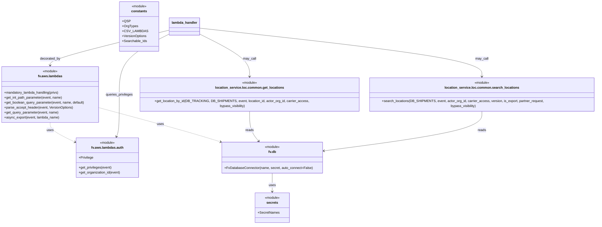

# Diagram: common/location_service/location_service/loc/lambdas/location/locations_get.py


> Auto-generated by Obscura crawlers

## Diagram 1



### SVG

<svg id="container" width="2851.34375" xmlns="http://www.w3.org/2000/svg" class="classDiagram" height="1084" viewBox="0 0 2851.34375 1084" role="graphics-document document" aria-roledescription="class"><style>#container{font-family:"trebuchet ms",verdana,arial,sans-serif;font-size:16px;fill:#333;}@keyframes edge-animation-frame{from{stroke-dashoffset:0;}}@keyframes dash{to{stroke-dashoffset:0;}}#container .edge-animation-slow{stroke-dasharray:9,5!important;stroke-dashoffset:900;animation:dash 50s linear infinite;stroke-linecap:round;}#container .edge-animation-fast{stroke-dasharray:9,5!important;stroke-dashoffset:900;animation:dash 20s linear infinite;stroke-linecap:round;}#container .error-icon{fill:#552222;}#container .error-text{fill:#552222;stroke:#552222;}#container .edge-thickness-normal{stroke-width:1px;}#container .edge-thickness-thick{stroke-width:3.5px;}#container .edge-pattern-solid{stroke-dasharray:0;}#container .edge-thickness-invisible{stroke-width:0;fill:none;}#container .edge-pattern-dashed{stroke-dasharray:3;}#container .edge-pattern-dotted{stroke-dasharray:2;}#container .marker{fill:#333333;stroke:#333333;}#container .marker.cross{stroke:#333333;}#container svg{font-family:"trebuchet ms",verdana,arial,sans-serif;font-size:16px;}#container p{margin:0;}#container g.classGroup text{fill:#9370DB;stroke:none;font-family:"trebuchet ms",verdana,arial,sans-serif;font-size:10px;}#container g.classGroup text .title{font-weight:bolder;}#container .nodeLabel,#container .edgeLabel{color:#131300;}#container .edgeLabel .label rect{fill:#ECECFF;}#container .label text{fill:#131300;}#container .labelBkg{background:#ECECFF;}#container .edgeLabel .label span{background:#ECECFF;}#container .classTitle{font-weight:bolder;}#container .node rect,#container .node circle,#container .node ellipse,#container .node polygon,#container .node path{fill:#ECECFF;stroke:#9370DB;stroke-width:1px;}#container .divider{stroke:#9370DB;stroke-width:1;}#container g.clickable{cursor:pointer;}#container g.classGroup rect{fill:#ECECFF;stroke:#9370DB;}#container g.classGroup line{stroke:#9370DB;stroke-width:1;}#container .classLabel .box{stroke:none;stroke-width:0;fill:#ECECFF;opacity:0.5;}#container .classLabel .label{fill:#9370DB;font-size:10px;}#container .relation{stroke:#333333;stroke-width:1;fill:none;}#container .dashed-line{stroke-dasharray:3;}#container .dotted-line{stroke-dasharray:1 2;}#container #compositionStart,#container .composition{fill:#333333!important;stroke:#333333!important;stroke-width:1;}#container #compositionEnd,#container .composition{fill:#333333!important;stroke:#333333!important;stroke-width:1;}#container #dependencyStart,#container .dependency{fill:#333333!important;stroke:#333333!important;stroke-width:1;}#container #dependencyStart,#container .dependency{fill:#333333!important;stroke:#333333!important;stroke-width:1;}#container #extensionStart,#container .extension{fill:transparent!important;stroke:#333333!important;stroke-width:1;}#container #extensionEnd,#container .extension{fill:transparent!important;stroke:#333333!important;stroke-width:1;}#container #aggregationStart,#container .aggregation{fill:transparent!important;stroke:#333333!important;stroke-width:1;}#container #aggregationEnd,#container .aggregation{fill:transparent!important;stroke:#333333!important;stroke-width:1;}#container #lollipopStart,#container .lollipop{fill:#ECECFF!important;stroke:#333333!important;stroke-width:1;}#container #lollipopEnd,#container .lollipop{fill:#ECECFF!important;stroke:#333333!important;stroke-width:1;}#container .edgeTerminals{font-size:11px;line-height:initial;}#container .classTitleText{text-anchor:middle;font-size:18px;fill:#333;}#container .label-icon{display:inline-block;height:1em;overflow:visible;vertical-align:-0.125em;}#container .node .label-icon path{fill:currentColor;stroke:revert;stroke-width:revert;}#container :root{--mermaid-font-family:"trebuchet ms",verdana,arial,sans-serif;}</style><g><defs><marker id="container_class-aggregationStart" class="marker aggregation class" refX="18" refY="7" markerWidth="190" markerHeight="240" orient="auto"><path d="M 18,7 L9,13 L1,7 L9,1 Z"></path></marker></defs><defs><marker id="container_class-aggregationEnd" class="marker aggregation class" refX="1" refY="7" markerWidth="20" markerHeight="28" orient="auto"><path d="M 18,7 L9,13 L1,7 L9,1 Z"></path></marker></defs><defs><marker id="container_class-extensionStart" class="marker extension class" refX="18" refY="7" markerWidth="190" markerHeight="240" orient="auto"><path d="M 1,7 L18,13 V 1 Z"></path></marker></defs><defs><marker id="container_class-extensionEnd" class="marker extension class" refX="1" refY="7" markerWidth="20" markerHeight="28" orient="auto"><path d="M 1,1 V 13 L18,7 Z"></path></marker></defs><defs><marker id="container_class-compositionStart" class="marker composition class" refX="18" refY="7" markerWidth="190" markerHeight="240" orient="auto"><path d="M 18,7 L9,13 L1,7 L9,1 Z"></path></marker></defs><defs><marker id="container_class-compositionEnd" class="marker composition class" refX="1" refY="7" markerWidth="20" markerHeight="28" orient="auto"><path d="M 18,7 L9,13 L1,7 L9,1 Z"></path></marker></defs><defs><marker id="container_class-dependencyStart" class="marker dependency class" refX="6" refY="7" markerWidth="190" markerHeight="240" orient="auto"><path d="M 5,7 L9,13 L1,7 L9,1 Z"></path></marker></defs><defs><marker id="container_class-dependencyEnd" class="marker dependency class" refX="13" refY="7" markerWidth="20" markerHeight="28" orient="auto"><path d="M 18,7 L9,13 L14,7 L9,1 Z"></path></marker></defs><defs><marker id="container_class-lollipopStart" class="marker lollipop class" refX="13" refY="7" markerWidth="190" markerHeight="240" orient="auto"><circle stroke="black" fill="transparent" cx="7" cy="7" r="6"></circle></marker></defs><defs><marker id="container_class-lollipopEnd" class="marker lollipop class" refX="1" refY="7" markerWidth="190" markerHeight="240" orient="auto"><circle stroke="black" fill="transparent" cx="7" cy="7" r="6"></circle></marker></defs><g class="root"><g class="clusters"></g><g class="edgePaths"><path d="M242.996,592L242.996,598.167C242.996,604.333,242.996,616.667,262.709,632.404C282.421,648.142,321.846,667.285,341.558,676.856L361.271,686.427" id="id_fv.aws.lambdas_fv.aws.lambdas.auth_1" class="edge-thickness-normal edge-pattern-dashed relation" style=";;;" data-edge="true" data-et="edge" data-id="id_fv.aws.lambdas_fv.aws.lambdas.auth_1" data-points="W3sieCI6MjQyLjk5NjA5Mzc1LCJ5Ijo1OTJ9LHsieCI6MjQyLjk5NjA5Mzc1LCJ5Ijo2Mjl9LHsieCI6MzY2LjY2Nzk2ODc1LCJ5Ijo2ODkuMDQ3NjI5OTEyNzI2fV0=" marker-end="url(#container_class-dependencyEnd)"></path><path d="M477.992,520.824L544.376,538.853C610.759,556.882,743.526,592.941,839.682,620.337C935.838,647.733,995.383,666.466,1025.155,675.833L1054.928,685.199" id="id_fv.aws.lambdas_fv.db_2" class="edge-thickness-normal edge-pattern-dashed relation" style=";;;" data-edge="true" data-et="edge" data-id="id_fv.aws.lambdas_fv.db_2" data-points="W3sieCI6NDc3Ljk5MjE4NzUsInkiOjUyMC44MjM2NjU4MzYwMjY3fSx7IngiOjg3Ni4yOTI5Njg3NSwieSI6NjI5fSx7IngiOjEwNjAuNjUwOTYzMzQ1ODY0NywieSI6Njg3fV0=" marker-end="url(#container_class-dependencyEnd)"></path><path d="M1193.281,532L1193.281,548.167C1193.281,564.333,1193.281,596.667,1200.346,621.717C1207.411,646.768,1221.54,664.536,1228.605,673.42L1235.669,682.304" id="id_location_service.loc.common.get_locations_fv.db_3" class="edge-thickness-normal edge-pattern-solid relation" style=";;;" data-edge="true" data-et="edge" data-id="id_location_service.loc.common.get_locations_fv.db_3" data-points="W3sieCI6MTE5My4yODEyNSwieSI6NTMyfSx7IngiOjExOTMuMjgxMjUsInkiOjYyOX0seyJ4IjoxMjM5LjQwMzc1MzUyNDQzNiwieSI6Njg3fV0=" marker-end="url(#container_class-dependencyEnd)"></path><path d="M2299.637,532L2299.637,548.167C2299.637,564.333,2299.637,596.667,2173.751,629.566C2047.866,662.466,1796.095,695.931,1670.21,712.664L1544.325,729.397" id="id_location_service.loc.common.search_locations_fv.db_4" class="edge-thickness-normal edge-pattern-solid relation" style=";;;" data-edge="true" data-et="edge" data-id="id_location_service.loc.common.search_locations_fv.db_4" data-points="W3sieCI6MjI5OS42MzY3MTg3NSwieSI6NTMyfSx7IngiOjIyOTkuNjM2NzE4NzUsInkiOjYyOX0seyJ4IjoxNTM4LjM3Njk1MzEyNSwieSI6NzMwLjE4NzY2NjI4MzQzfV0=" marker-end="url(#container_class-dependencyEnd)"></path><path d="M814.32,145.566L719.1,168.805C623.879,192.044,433.438,238.522,338.217,266.928C242.996,295.333,242.996,305.667,242.996,310.833L242.996,316" id="id_lambda_handler_fv.aws.lambdas_5" class="edge-thickness-normal edge-pattern-solid relation" style=";;;" data-edge="true" data-et="edge" data-id="id_lambda_handler_fv.aws.lambdas_5" data-points="W3sieCI6ODE0LjMyMDMxMjUsInkiOjE0NS41NjYxNTM1NjU4OTg1M30seyJ4IjoyNDIuOTk2MDkzNzUsInkiOjI4NX0seyJ4IjoyNDIuOTk2MDkzNzUsInkiOjMyMn1d" marker-end="url(#container_class-dependencyEnd)"></path><path d="M814.32,164.811L775.152,184.842C735.984,204.874,657.648,244.937,618.48,293.635C579.313,342.333,579.313,399.667,579.313,457C579.313,514.333,579.313,571.667,576.844,605.595C574.376,639.523,569.439,650.045,566.971,655.307L564.503,660.568" id="id_lambda_handler_fv.aws.lambdas.auth_6" class="edge-thickness-normal edge-pattern-solid relation" style=";;;" data-edge="true" data-et="edge" data-id="id_lambda_handler_fv.aws.lambdas.auth_6" data-points="W3sieCI6ODE0LjMyMDMxMjUsInkiOjE2NC44MTA3MzQ0NjMyNzY4NH0seyJ4Ijo1NzkuMzEyNSwieSI6Mjg1fSx7IngiOjU3OS4zMTI1LCJ5Ijo0NTd9LHsieCI6NTc5LjMxMjUsInkiOjYyOX0seyJ4Ijo1NjEuOTU0NjIyODg1MzM4NCwieSI6NjY2fV0=" marker-end="url(#container_class-dependencyEnd)"></path><path d="M958.273,164.811L997.441,184.842C1036.609,204.874,1114.945,244.937,1154.113,280.135C1193.281,315.333,1193.281,345.667,1193.281,360.833L1193.281,376" id="id_lambda_handler_location_service.loc.common.get_locations_7" class="edge-thickness-normal edge-pattern-solid relation" style=";;;" data-edge="true" data-et="edge" data-id="id_lambda_handler_location_service.loc.common.get_locations_7" data-points="W3sieCI6OTU4LjI3MzQzNzUsInkiOjE2NC44MTA3MzQ0NjMyNzY4NH0seyJ4IjoxMTkzLjI4MTI1LCJ5IjoyODV9LHsieCI6MTE5My4yODEyNSwieSI6MzgyfV0=" marker-end="url(#container_class-dependencyEnd)"></path><path d="M958.273,135.995L1181.834,160.83C1405.395,185.664,1852.516,235.332,2076.076,275.333C2299.637,315.333,2299.637,345.667,2299.637,360.833L2299.637,376" id="id_lambda_handler_location_service.loc.common.search_locations_8" class="edge-thickness-normal edge-pattern-solid relation" style=";;;" data-edge="true" data-et="edge" data-id="id_lambda_handler_location_service.loc.common.search_locations_8" data-points="W3sieCI6OTU4LjI3MzQzNzUsInkiOjEzNS45OTU0NzI4MjQ1MDk3Nn0seyJ4IjoyMjk5LjYzNjcxODc1LCJ5IjoyODV9LHsieCI6MjI5OS42MzY3MTg3NSwieSI6MzgyfV0=" marker-end="url(#container_class-dependencyEnd)"></path><path d="M1299.045,837L1299.045,846.667C1299.045,856.333,1299.045,875.667,1299.045,890.5C1299.045,905.333,1299.045,915.667,1299.045,920.833L1299.045,926" id="id_fv.db_secrets_9" class="edge-thickness-normal edge-pattern-solid relation" style=";;;" data-edge="true" data-et="edge" data-id="id_fv.db_secrets_9" data-points="W3sieCI6MTI5OS4wNDQ5MjE4NzUsInkiOjgzN30seyJ4IjoxMjk5LjA0NDkyMTg3NSwieSI6ODk1fSx7IngiOjEyOTkuMDQ0OTIxODc1LCJ5Ijo5MzJ9XQ==" marker-end="url(#container_class-dependencyEnd)"></path></g><g class="edgeLabels"><g class="edgeLabel" transform="translate(242.99609375, 629)"><g class="label" data-id="id_fv.aws.lambdas_fv.aws.lambdas.auth_1" transform="translate(-16.4921875, -12)"><foreignObject width="32.984375" height="24"><div xmlns="http://www.w3.org/1999/xhtml" class="labelBkg" style="display: table-cell; white-space: nowrap; line-height: 1.5; max-width: 200px; text-align: center;"><span class="edgeLabel"><p>uses</p></span></div></foreignObject></g></g><g class="edgeLabel" transform="translate(770.39752, 600.23937)"><g class="label" data-id="id_fv.aws.lambdas_fv.db_2" transform="translate(-16.4921875, -12)"><foreignObject width="32.984375" height="24"><div xmlns="http://www.w3.org/1999/xhtml" class="labelBkg" style="display: table-cell; white-space: nowrap; line-height: 1.5; max-width: 200px; text-align: center;"><span class="edgeLabel"><p>uses</p></span></div></foreignObject></g></g><g class="edgeLabel" transform="translate(1193.28125, 629)"><g class="label" data-id="id_location_service.loc.common.get_locations_fv.db_3" transform="translate(-20.0078125, -12)"><foreignObject width="40.015625" height="24"><div xmlns="http://www.w3.org/1999/xhtml" class="labelBkg" style="display: table-cell; white-space: nowrap; line-height: 1.5; max-width: 200px; text-align: center;"><span class="edgeLabel"><p>reads</p></span></div></foreignObject></g></g><g class="edgeLabel" transform="translate(2299.63671875, 629)"><g class="label" data-id="id_location_service.loc.common.search_locations_fv.db_4" transform="translate(-20.0078125, -12)"><foreignObject width="40.015625" height="24"><div xmlns="http://www.w3.org/1999/xhtml" class="labelBkg" style="display: table-cell; white-space: nowrap; line-height: 1.5; max-width: 200px; text-align: center;"><span class="edgeLabel"><p>reads</p></span></div></foreignObject></g></g><g class="edgeLabel" transform="translate(242.99609375, 285)"><g class="label" data-id="id_lambda_handler_fv.aws.lambdas_5" transform="translate(-49.375, -12)"><foreignObject width="98.75" height="24"><div xmlns="http://www.w3.org/1999/xhtml" class="labelBkg" style="display: table-cell; white-space: nowrap; line-height: 1.5; max-width: 200px; text-align: center;"><span class="edgeLabel"><p>decorated_by</p></span></div></foreignObject></g></g><g class="edgeLabel" transform="translate(579.3125, 457)"><g class="label" data-id="id_lambda_handler_fv.aws.lambdas.auth_6" transform="translate(-66.3203125, -12)"><foreignObject width="132.640625" height="24"><div xmlns="http://www.w3.org/1999/xhtml" class="labelBkg" style="display: table-cell; white-space: nowrap; line-height: 1.5; max-width: 200px; text-align: center;"><span class="edgeLabel"><p>queries_privileges</p></span></div></foreignObject></g></g><g class="edgeLabel" transform="translate(1193.28125, 285)"><g class="label" data-id="id_lambda_handler_location_service.loc.common.get_locations_7" transform="translate(-31.4921875, -12)"><foreignObject width="62.984375" height="24"><div xmlns="http://www.w3.org/1999/xhtml" class="labelBkg" style="display: table-cell; white-space: nowrap; line-height: 1.5; max-width: 200px; text-align: center;"><span class="edgeLabel"><p>may_call</p></span></div></foreignObject></g></g><g class="edgeLabel" transform="translate(2299.63671875, 285)"><g class="label" data-id="id_lambda_handler_location_service.loc.common.search_locations_8" transform="translate(-31.4921875, -12)"><foreignObject width="62.984375" height="24"><div xmlns="http://www.w3.org/1999/xhtml" class="labelBkg" style="display: table-cell; white-space: nowrap; line-height: 1.5; max-width: 200px; text-align: center;"><span class="edgeLabel"><p>may_call</p></span></div></foreignObject></g></g><g class="edgeLabel" transform="translate(1299.044921875, 895)"><g class="label" data-id="id_fv.db_secrets_9" transform="translate(-16.4921875, -12)"><foreignObject width="32.984375" height="24"><div xmlns="http://www.w3.org/1999/xhtml" class="labelBkg" style="display: table-cell; white-space: nowrap; line-height: 1.5; max-width: 200px; text-align: center;"><span class="edgeLabel"><p>uses</p></span></div></foreignObject></g></g></g><g class="nodes"><g class="node default" id="classId-fv.aws.lambdas-0" transform="translate(242.99609375, 457)"><g class="basic label-container"><path d="M-234.99609375 -135 L234.99609375 -135 L234.99609375 135 L-234.99609375 135" stroke="none" stroke-width="0" fill="#ECECFF" style=""></path><path d="M-234.99609375 -135 C-83.55482003852134 -135, 67.88645367295732 -135, 234.99609375 -135 M-234.99609375 -135 C-94.23139114634895 -135, 46.53331145730209 -135, 234.99609375 -135 M234.99609375 -135 C234.99609375 -31.237713775917754, 234.99609375 72.52457244816449, 234.99609375 135 M234.99609375 -135 C234.99609375 -79.65941993087937, 234.99609375 -24.318839861758732, 234.99609375 135 M234.99609375 135 C70.33057636730223 135, -94.33494101539554 135, -234.99609375 135 M234.99609375 135 C121.76233319784396 135, 8.528572645687916 135, -234.99609375 135 M-234.99609375 135 C-234.99609375 67.25843073875527, -234.99609375 -0.48313852248946887, -234.99609375 -135 M-234.99609375 135 C-234.99609375 62.94068161299559, -234.99609375 -9.11863677400882, -234.99609375 -135" stroke="#9370DB" stroke-width="1.3" fill="none" stroke-dasharray="0 0" style=""></path></g><g class="annotation-group text" transform="translate(-36.6015625, -111)"><g class="label" style="" transform="translate(0,-12)"><foreignObject width="73.203125" height="24"><div xmlns="http://www.w3.org/1999/xhtml" style="display: table-cell; white-space: nowrap; line-height: 1.5; max-width: 123px; text-align: center;"><span class="nodeLabel markdown-node-label" style=""><p>«module»</p></span></div></foreignObject></g></g><g class="label-group text" transform="translate(-55.8984375, -87)"><g class="label" style="font-weight: bolder" transform="translate(0,-12)"><foreignObject width="111.796875" height="24"><div xmlns="http://www.w3.org/1999/xhtml" style="display: table-cell; white-space: nowrap; line-height: 1.5; max-width: 160px; text-align: center;"><span class="nodeLabel markdown-node-label" style=""><p>fv.aws.lambdas</p></span></div></foreignObject></g></g><g class="members-group text" transform="translate(-222.99609375, -39)"></g><g class="methods-group text" transform="translate(-222.99609375, -9)"><g class="label" style="" transform="translate(0,-12)"><foreignObject width="267.5" height="24"><div xmlns="http://www.w3.org/1999/xhtml" style="display: table-cell; white-space: nowrap; line-height: 1.5; max-width: 325px; text-align: center;"><span class="nodeLabel markdown-node-label" style=""><p>+mandatory_lambda_handling(privs)</p></span></div></foreignObject></g><g class="label" style="" transform="translate(0,12)"><foreignObject width="282.96875" height="24"><div xmlns="http://www.w3.org/1999/xhtml" style="display: table-cell; white-space: nowrap; line-height: 1.5; max-width: 340px; text-align: center;"><span class="nodeLabel markdown-node-label" style=""><p>+get_int_path_parameter(event, name)</p></span></div></foreignObject></g><g class="label" style="" transform="translate(0,36)"><foreignObject width="390.09375" height="24"><div xmlns="http://www.w3.org/1999/xhtml" style="display: table-cell; white-space: nowrap; line-height: 1.5; max-width: 447px; text-align: center;"><span class="nodeLabel markdown-node-label" style=""><p>+get_boolean_query_parameter(event, name, default)</p></span></div></foreignObject></g><g class="label" style="" transform="translate(0,60)"><foreignObject width="332.390625" height="24"><div xmlns="http://www.w3.org/1999/xhtml" style="display: table-cell; white-space: nowrap; line-height: 1.5; max-width: 390px; text-align: center;"><span class="nodeLabel markdown-node-label" style=""><p>+parse_accept_header(event, VersionOptions)</p></span></div></foreignObject></g><g class="label" style="" transform="translate(0,84)"><foreignObject width="262.625" height="24"><div xmlns="http://www.w3.org/1999/xhtml" style="display: table-cell; white-space: nowrap; line-height: 1.5; max-width: 320px; text-align: center;"><span class="nodeLabel markdown-node-label" style=""><p>+get_query_parameter(event, name)</p></span></div></foreignObject></g><g class="label" style="" transform="translate(0,108)"><foreignObject width="266.015625" height="24"><div xmlns="http://www.w3.org/1999/xhtml" style="display: table-cell; white-space: nowrap; line-height: 1.5; max-width: 323px; text-align: center;"><span class="nodeLabel markdown-node-label" style=""><p>+async_export(event, lambda_name)</p></span></div></foreignObject></g></g><g class="divider" style=""><path d="M-234.99609375 -63 C-104.19223226240996 -63, 26.61162922518008 -63, 234.99609375 -63 M-234.99609375 -63 C-56.98359154742096 -63, 121.02891065515809 -63, 234.99609375 -63" stroke="#9370DB" stroke-width="1.3" fill="none" stroke-dasharray="0 0" style=""></path></g><g class="divider" style=""><path d="M-234.99609375 -39 C-69.99716902426127 -39, 95.00175570147746 -39, 234.99609375 -39 M-234.99609375 -39 C-56.502860812506725 -39, 121.99037212498655 -39, 234.99609375 -39" stroke="#9370DB" stroke-width="1.3" fill="none" stroke-dasharray="0 0" style=""></path></g></g><g class="node default" id="classId-fv.aws.lambdas.auth-1" transform="translate(516.91796875, 762)"><g class="basic label-container"><path d="M-150.25 -96 L150.25 -96 L150.25 96 L-150.25 96" stroke="none" stroke-width="0" fill="#ECECFF" style=""></path><path d="M-150.25 -96 C-56.70972437342556 -96, 36.83055125314888 -96, 150.25 -96 M-150.25 -96 C-65.0936212233641 -96, 20.06275755327181 -96, 150.25 -96 M150.25 -96 C150.25 -28.010090043145013, 150.25 39.979819913709974, 150.25 96 M150.25 -96 C150.25 -44.64797393927038, 150.25 6.704052121459242, 150.25 96 M150.25 96 C69.13609370716334 96, -11.97781258567332 96, -150.25 96 M150.25 96 C41.95268979744566 96, -66.34462040510869 96, -150.25 96 M-150.25 96 C-150.25 44.36710451101665, -150.25 -7.265790977966702, -150.25 -96 M-150.25 96 C-150.25 20.345628012994183, -150.25 -55.308743974011634, -150.25 -96" stroke="#9370DB" stroke-width="1.3" fill="none" stroke-dasharray="0 0" style=""></path></g><g class="annotation-group text" transform="translate(-36.6015625, -72)"><g class="label" style="" transform="translate(0,-12)"><foreignObject width="73.203125" height="24"><div xmlns="http://www.w3.org/1999/xhtml" style="display: table-cell; white-space: nowrap; line-height: 1.5; max-width: 123px; text-align: center;"><span class="nodeLabel markdown-node-label" style=""><p>«module»</p></span></div></foreignObject></g></g><g class="label-group text" transform="translate(-74.484375, -48)"><g class="label" style="font-weight: bolder" transform="translate(0,-12)"><foreignObject width="148.96875" height="24"><div xmlns="http://www.w3.org/1999/xhtml" style="display: table-cell; white-space: nowrap; line-height: 1.5; max-width: 197px; text-align: center;"><span class="nodeLabel markdown-node-label" style=""><p>fv.aws.lambdas.auth</p></span></div></foreignObject></g></g><g class="members-group text" transform="translate(-138.25, 0)"><g class="label" style="" transform="translate(0,-12)"><foreignObject width="70.15625" height="24"><div xmlns="http://www.w3.org/1999/xhtml" style="display: table-cell; white-space: nowrap; line-height: 1.5; max-width: 128px; text-align: center;"><span class="nodeLabel markdown-node-label" style=""><p>+Privilege</p></span></div></foreignObject></g></g><g class="methods-group text" transform="translate(-138.25, 48)"><g class="label" style="" transform="translate(0,-12)"><foreignObject width="159.734375" height="24"><div xmlns="http://www.w3.org/1999/xhtml" style="display: table-cell; white-space: nowrap; line-height: 1.5; max-width: 217px; text-align: center;"><span class="nodeLabel markdown-node-label" style=""><p>+get_privileges(event)</p></span></div></foreignObject></g><g class="label" style="" transform="translate(0,12)"><foreignObject width="202.015625" height="24"><div xmlns="http://www.w3.org/1999/xhtml" style="display: table-cell; white-space: nowrap; line-height: 1.5; max-width: 259px; text-align: center;"><span class="nodeLabel markdown-node-label" style=""><p>+get_organization_id(event)</p></span></div></foreignObject></g></g><g class="divider" style=""><path d="M-150.25 -24 C-47.35826021926597 -24, 55.533479561468056 -24, 150.25 -24 M-150.25 -24 C-84.8071547857 -24, -19.364309571400014 -24, 150.25 -24" stroke="#9370DB" stroke-width="1.3" fill="none" stroke-dasharray="0 0" style=""></path></g><g class="divider" style=""><path d="M-150.25 24 C-54.181981599563215 24, 41.88603680087357 24, 150.25 24 M-150.25 24 C-72.84727227338449 24, 4.555455453231019 24, 150.25 24" stroke="#9370DB" stroke-width="1.3" fill="none" stroke-dasharray="0 0" style=""></path></g></g><g class="node default" id="classId-fv.db-2" transform="translate(1299.044921875, 762)"><g class="basic label-container"><path d="M-239.33203125 -75 L239.33203125 -75 L239.33203125 75 L-239.33203125 75" stroke="none" stroke-width="0" fill="#ECECFF" style=""></path><path d="M-239.33203125 -75 C-102.92021402746295 -75, 33.491603195074106 -75, 239.33203125 -75 M-239.33203125 -75 C-92.8648024093674 -75, 53.6024264312652 -75, 239.33203125 -75 M239.33203125 -75 C239.33203125 -38.90276670048893, 239.33203125 -2.8055334009778647, 239.33203125 75 M239.33203125 -75 C239.33203125 -20.57524168276315, 239.33203125 33.8495166344737, 239.33203125 75 M239.33203125 75 C69.03760444229388 75, -101.25682236541223 75, -239.33203125 75 M239.33203125 75 C101.16241822969948 75, -37.007194790601034 75, -239.33203125 75 M-239.33203125 75 C-239.33203125 30.889907189345827, -239.33203125 -13.220185621308346, -239.33203125 -75 M-239.33203125 75 C-239.33203125 37.65763096614865, -239.33203125 0.3152619322973038, -239.33203125 -75" stroke="#9370DB" stroke-width="1.3" fill="none" stroke-dasharray="0 0" style=""></path></g><g class="annotation-group text" transform="translate(-36.6015625, -51)"><g class="label" style="" transform="translate(0,-12)"><foreignObject width="73.203125" height="24"><div xmlns="http://www.w3.org/1999/xhtml" style="display: table-cell; white-space: nowrap; line-height: 1.5; max-width: 123px; text-align: center;"><span class="nodeLabel markdown-node-label" style=""><p>«module»</p></span></div></foreignObject></g></g><g class="label-group text" transform="translate(-18.0546875, -27)"><g class="label" style="font-weight: bolder" transform="translate(0,-12)"><foreignObject width="36.109375" height="24"><div xmlns="http://www.w3.org/1999/xhtml" style="display: table-cell; white-space: nowrap; line-height: 1.5; max-width: 85px; text-align: center;"><span class="nodeLabel markdown-node-label" style=""><p>fv.db</p></span></div></foreignObject></g></g><g class="members-group text" transform="translate(-227.33203125, 21)"></g><g class="methods-group text" transform="translate(-227.33203125, 51)"><g class="label" style="" transform="translate(0,-12)"><foreignObject width="418.0625" height="24"><div xmlns="http://www.w3.org/1999/xhtml" style="display: table-cell; white-space: nowrap; line-height: 1.5; max-width: 475px; text-align: center;"><span class="nodeLabel markdown-node-label" style=""><p>+FvDatabaseConnector(name, secret, auto_connect=False)</p></span></div></foreignObject></g></g><g class="divider" style=""><path d="M-239.33203125 -3 C-74.55537872386284 -3, 90.22127380227431 -3, 239.33203125 -3 M-239.33203125 -3 C-135.34135734905055 -3, -31.35068344810108 -3, 239.33203125 -3" stroke="#9370DB" stroke-width="1.3" fill="none" stroke-dasharray="0 0" style=""></path></g><g class="divider" style=""><path d="M-239.33203125 21 C-59.858911778875495 21, 119.61420769224901 21, 239.33203125 21 M-239.33203125 21 C-64.72448303360144 21, 109.88306518279711 21, 239.33203125 21" stroke="#9370DB" stroke-width="1.3" fill="none" stroke-dasharray="0 0" style=""></path></g></g><g class="node default" id="classId-location_service.loc.common.get_locations-3" transform="translate(1193.28125, 457)"><g class="basic label-container"><path d="M-512.6484375 -75 L512.6484375 -75 L512.6484375 75 L-512.6484375 75" stroke="none" stroke-width="0" fill="#ECECFF" style=""></path><path d="M-512.6484375 -75 C-127.33038123276873 -75, 257.98767503446254 -75, 512.6484375 -75 M-512.6484375 -75 C-225.8843821595778 -75, 60.87967318084441 -75, 512.6484375 -75 M512.6484375 -75 C512.6484375 -43.89142578653568, 512.6484375 -12.782851573071348, 512.6484375 75 M512.6484375 -75 C512.6484375 -40.410067704442554, 512.6484375 -5.820135408885108, 512.6484375 75 M512.6484375 75 C264.61491054317105 75, 16.581383586342156 75, -512.6484375 75 M512.6484375 75 C107.67861132222424 75, -297.2912148555515 75, -512.6484375 75 M-512.6484375 75 C-512.6484375 37.5877562004763, -512.6484375 0.17551240095259857, -512.6484375 -75 M-512.6484375 75 C-512.6484375 32.44888227252331, -512.6484375 -10.102235454953373, -512.6484375 -75" stroke="#9370DB" stroke-width="1.3" fill="none" stroke-dasharray="0 0" style=""></path></g><g class="annotation-group text" transform="translate(-36.6015625, -51)"><g class="label" style="" transform="translate(0,-12)"><foreignObject width="73.203125" height="24"><div xmlns="http://www.w3.org/1999/xhtml" style="display: table-cell; white-space: nowrap; line-height: 1.5; max-width: 123px; text-align: center;"><span class="nodeLabel markdown-node-label" style=""><p>«module»</p></span></div></foreignObject></g></g><g class="label-group text" transform="translate(-156.921875, -27)"><g class="label" style="font-weight: bolder" transform="translate(0,-12)"><foreignObject width="313.84375" height="24"><div xmlns="http://www.w3.org/1999/xhtml" style="display: table-cell; white-space: nowrap; line-height: 1.5; max-width: 361px; text-align: center;"><span class="nodeLabel markdown-node-label" style=""><p>location_service.loc.common.get_locations</p></span></div></foreignObject></g></g><g class="members-group text" transform="translate(-500.6484375, 21)"></g><g class="methods-group text" transform="translate(-500.6484375, 51)"><g class="label" style="" transform="translate(0,-12)"><foreignObject width="844.375" height="24"><div xmlns="http://www.w3.org/1999/xhtml" style="display: table-cell; white-space: nowrap; line-height: 1.5; max-width: 902px; text-align: center;"><span class="nodeLabel markdown-node-label" style=""><p>+get_location_by_id(DB_TRACKING, DB_SHIPMENTS, event, location_id, actor_org_id, carrier_access, bypass_visibility)</p></span></div></foreignObject></g></g><g class="divider" style=""><path d="M-512.6484375 -3 C-109.2567410171456 -3, 294.1349554657088 -3, 512.6484375 -3 M-512.6484375 -3 C-223.10580747803277 -3, 66.43682254393445 -3, 512.6484375 -3" stroke="#9370DB" stroke-width="1.3" fill="none" stroke-dasharray="0 0" style=""></path></g><g class="divider" style=""><path d="M-512.6484375 21 C-111.02231388742888 21, 290.60380972514224 21, 512.6484375 21 M-512.6484375 21 C-158.9147515665632 21, 194.81893436687358 21, 512.6484375 21" stroke="#9370DB" stroke-width="1.3" fill="none" stroke-dasharray="0 0" style=""></path></g></g><g class="node default" id="classId-location_service.loc.common.search_locations-4" transform="translate(2299.63671875, 457)"><g class="basic label-container"><path d="M-543.70703125 -75 L543.70703125 -75 L543.70703125 75 L-543.70703125 75" stroke="none" stroke-width="0" fill="#ECECFF" style=""></path><path d="M-543.70703125 -75 C-159.82925571993593 -75, 224.04851981012814 -75, 543.70703125 -75 M-543.70703125 -75 C-318.9712741017951 -75, -94.23551695359009 -75, 543.70703125 -75 M543.70703125 -75 C543.70703125 -18.941978453718548, 543.70703125 37.116043092562904, 543.70703125 75 M543.70703125 -75 C543.70703125 -18.286377398823653, 543.70703125 38.427245202352694, 543.70703125 75 M543.70703125 75 C210.20803988814532 75, -123.29095147370936 75, -543.70703125 75 M543.70703125 75 C120.64396405562934 75, -302.4191031387413 75, -543.70703125 75 M-543.70703125 75 C-543.70703125 26.837760996714607, -543.70703125 -21.324478006570786, -543.70703125 -75 M-543.70703125 75 C-543.70703125 20.1593772406284, -543.70703125 -34.6812455187432, -543.70703125 -75" stroke="#9370DB" stroke-width="1.3" fill="none" stroke-dasharray="0 0" style=""></path></g><g class="annotation-group text" transform="translate(-36.6015625, -51)"><g class="label" style="" transform="translate(0,-12)"><foreignObject width="73.203125" height="24"><div xmlns="http://www.w3.org/1999/xhtml" style="display: table-cell; white-space: nowrap; line-height: 1.5; max-width: 123px; text-align: center;"><span class="nodeLabel markdown-node-label" style=""><p>«module»</p></span></div></foreignObject></g></g><g class="label-group text" transform="translate(-169.3359375, -27)"><g class="label" style="font-weight: bolder" transform="translate(0,-12)"><foreignObject width="338.671875" height="24"><div xmlns="http://www.w3.org/1999/xhtml" style="display: table-cell; white-space: nowrap; line-height: 1.5; max-width: 386px; text-align: center;"><span class="nodeLabel markdown-node-label" style=""><p>location_service.loc.common.search_locations</p></span></div></foreignObject></g></g><g class="members-group text" transform="translate(-531.70703125, 21)"></g><g class="methods-group text" transform="translate(-531.70703125, 51)"><g class="label" style="" transform="translate(0,-12)"><foreignObject width="894.078125" height="24"><div xmlns="http://www.w3.org/1999/xhtml" style="display: table-cell; white-space: nowrap; line-height: 1.5; max-width: 951px; text-align: center;"><span class="nodeLabel markdown-node-label" style=""><p>+search_locations(DB_SHIPMENTS, event, actor_org_id, carrier_access, version, is_export, partner_request, bypass_visibility)</p></span></div></foreignObject></g></g><g class="divider" style=""><path d="M-543.70703125 -3 C-213.07691747860304 -3, 117.55319629279393 -3, 543.70703125 -3 M-543.70703125 -3 C-298.12331574529924 -3, -52.539600240598475 -3, 543.70703125 -3" stroke="#9370DB" stroke-width="1.3" fill="none" stroke-dasharray="0 0" style=""></path></g><g class="divider" style=""><path d="M-543.70703125 21 C-316.73209962808176 21, -89.75716800616345 21, 543.70703125 21 M-543.70703125 21 C-291.5056209049181 21, -39.30421055983618 21, 543.70703125 21" stroke="#9370DB" stroke-width="1.3" fill="none" stroke-dasharray="0 0" style=""></path></g></g><g class="node default" id="classId-constants-5" transform="translate(674.76953125, 128)"><g class="basic label-container"><path d="M-89.55078125 -120 L89.55078125 -120 L89.55078125 120 L-89.55078125 120" stroke="none" stroke-width="0" fill="#ECECFF" style=""></path><path d="M-89.55078125 -120 C-25.740857038498696 -120, 38.06906717300261 -120, 89.55078125 -120 M-89.55078125 -120 C-36.734484793821444 -120, 16.08181166235711 -120, 89.55078125 -120 M89.55078125 -120 C89.55078125 -52.162935514524804, 89.55078125 15.674128970950392, 89.55078125 120 M89.55078125 -120 C89.55078125 -69.81787784283144, 89.55078125 -19.635755685662872, 89.55078125 120 M89.55078125 120 C24.400925409282507 120, -40.748930431434985 120, -89.55078125 120 M89.55078125 120 C26.403703129876078 120, -36.743374990247844 120, -89.55078125 120 M-89.55078125 120 C-89.55078125 51.63965939356487, -89.55078125 -16.72068121287026, -89.55078125 -120 M-89.55078125 120 C-89.55078125 28.8774083601935, -89.55078125 -62.245183279613, -89.55078125 -120" stroke="#9370DB" stroke-width="1.3" fill="none" stroke-dasharray="0 0" style=""></path></g><g class="annotation-group text" transform="translate(-36.6015625, -96)"><g class="label" style="" transform="translate(0,-12)"><foreignObject width="73.203125" height="24"><div xmlns="http://www.w3.org/1999/xhtml" style="display: table-cell; white-space: nowrap; line-height: 1.5; max-width: 123px; text-align: center;"><span class="nodeLabel markdown-node-label" style=""><p>«module»</p></span></div></foreignObject></g></g><g class="label-group text" transform="translate(-35.7734375, -72)"><g class="label" style="font-weight: bolder" transform="translate(0,-12)"><foreignObject width="71.546875" height="24"><div xmlns="http://www.w3.org/1999/xhtml" style="display: table-cell; white-space: nowrap; line-height: 1.5; max-width: 121px; text-align: center;"><span class="nodeLabel markdown-node-label" style=""><p>constants</p></span></div></foreignObject></g></g><g class="members-group text" transform="translate(-77.55078125, -24)"><g class="label" style="" transform="translate(0,-12)"><foreignObject width="37.0625" height="24"><div xmlns="http://www.w3.org/1999/xhtml" style="display: table-cell; white-space: nowrap; line-height: 1.5; max-width: 94px; text-align: center;"><span class="nodeLabel markdown-node-label" style=""><p>+QSP</p></span></div></foreignObject></g><g class="label" style="" transform="translate(0,12)"><foreignObject width="74.515625" height="24"><div xmlns="http://www.w3.org/1999/xhtml" style="display: table-cell; white-space: nowrap; line-height: 1.5; max-width: 132px; text-align: center;"><span class="nodeLabel markdown-node-label" style=""><p>+OrgTypes</p></span></div></foreignObject></g><g class="label" style="" transform="translate(0,36)"><foreignObject width="108.953125" height="24"><div xmlns="http://www.w3.org/1999/xhtml" style="display: table-cell; white-space: nowrap; line-height: 1.5; max-width: 167px; text-align: center;"><span class="nodeLabel markdown-node-label" style=""><p>+CSV_LAMBDAS</p></span></div></foreignObject></g><g class="label" style="" transform="translate(0,60)"><foreignObject width="118.5" height="24"><div xmlns="http://www.w3.org/1999/xhtml" style="display: table-cell; white-space: nowrap; line-height: 1.5; max-width: 176px; text-align: center;"><span class="nodeLabel markdown-node-label" style=""><p>+VersionOptions</p></span></div></foreignObject></g><g class="label" style="" transform="translate(0,84)"><foreignObject width="117.359375" height="24"><div xmlns="http://www.w3.org/1999/xhtml" style="display: table-cell; white-space: nowrap; line-height: 1.5; max-width: 175px; text-align: center;"><span class="nodeLabel markdown-node-label" style=""><p>+Searchable_Ids</p></span></div></foreignObject></g></g><g class="methods-group text" transform="translate(-77.55078125, 120)"></g><g class="divider" style=""><path d="M-89.55078125 -48 C-50.2416155902269 -48, -10.9324499304538 -48, 89.55078125 -48 M-89.55078125 -48 C-22.235985443245 -48, 45.07881036351 -48, 89.55078125 -48" stroke="#9370DB" stroke-width="1.3" fill="none" stroke-dasharray="0 0" style=""></path></g><g class="divider" style=""><path d="M-89.55078125 96 C-35.65413151785412 96, 18.242518214291763 96, 89.55078125 96 M-89.55078125 96 C-38.394042612201325 96, 12.76269602559735 96, 89.55078125 96" stroke="#9370DB" stroke-width="1.3" fill="none" stroke-dasharray="0 0" style=""></path></g></g><g class="node default" id="classId-secrets-6" transform="translate(1299.044921875, 1004)"><g class="basic label-container"><path d="M-81.38671875 -72 L81.38671875 -72 L81.38671875 72 L-81.38671875 72" stroke="none" stroke-width="0" fill="#ECECFF" style=""></path><path d="M-81.38671875 -72 C-38.55476486104779 -72, 4.277189027904413 -72, 81.38671875 -72 M-81.38671875 -72 C-37.30912324807895 -72, 6.768472253842106 -72, 81.38671875 -72 M81.38671875 -72 C81.38671875 -36.57065310467418, 81.38671875 -1.1413062093483575, 81.38671875 72 M81.38671875 -72 C81.38671875 -37.143906597119894, 81.38671875 -2.2878131942397886, 81.38671875 72 M81.38671875 72 C20.405123125798667 72, -40.576472498402666 72, -81.38671875 72 M81.38671875 72 C38.97086974166504 72, -3.444979266669918 72, -81.38671875 72 M-81.38671875 72 C-81.38671875 34.69585803349255, -81.38671875 -2.608283933014903, -81.38671875 -72 M-81.38671875 72 C-81.38671875 16.177224571582904, -81.38671875 -39.64555085683419, -81.38671875 -72" stroke="#9370DB" stroke-width="1.3" fill="none" stroke-dasharray="0 0" style=""></path></g><g class="annotation-group text" transform="translate(-36.6015625, -48)"><g class="label" style="" transform="translate(0,-12)"><foreignObject width="73.203125" height="24"><div xmlns="http://www.w3.org/1999/xhtml" style="display: table-cell; white-space: nowrap; line-height: 1.5; max-width: 123px; text-align: center;"><span class="nodeLabel markdown-node-label" style=""><p>«module»</p></span></div></foreignObject></g></g><g class="label-group text" transform="translate(-26.453125, -24)"><g class="label" style="font-weight: bolder" transform="translate(0,-12)"><foreignObject width="52.90625" height="24"><div xmlns="http://www.w3.org/1999/xhtml" style="display: table-cell; white-space: nowrap; line-height: 1.5; max-width: 102px; text-align: center;"><span class="nodeLabel markdown-node-label" style=""><p>secrets</p></span></div></foreignObject></g></g><g class="members-group text" transform="translate(-69.38671875, 24)"><g class="label" style="" transform="translate(0,-12)"><foreignObject width="102.171875" height="24"><div xmlns="http://www.w3.org/1999/xhtml" style="display: table-cell; white-space: nowrap; line-height: 1.5; max-width: 160px; text-align: center;"><span class="nodeLabel markdown-node-label" style=""><p>+SecretNames</p></span></div></foreignObject></g></g><g class="methods-group text" transform="translate(-69.38671875, 72)"></g><g class="divider" style=""><path d="M-81.38671875 0 C-46.24410059106955 0, -11.101482432139093 0, 81.38671875 0 M-81.38671875 0 C-27.309699383676914 0, 26.76731998264617 0, 81.38671875 0" stroke="#9370DB" stroke-width="1.3" fill="none" stroke-dasharray="0 0" style=""></path></g><g class="divider" style=""><path d="M-81.38671875 48 C-45.28123995069589 48, -9.175761151391782 48, 81.38671875 48 M-81.38671875 48 C-19.69521224300039 48, 41.99629426399922 48, 81.38671875 48" stroke="#9370DB" stroke-width="1.3" fill="none" stroke-dasharray="0 0" style=""></path></g></g><g class="node default" id="classId-lambda_handler-7" transform="translate(886.296875, 128)"><g class="basic label-container"><path d="M-71.9765625 -42 L71.9765625 -42 L71.9765625 42 L-71.9765625 42" stroke="none" stroke-width="0" fill="#ECECFF" style=""></path><path d="M-71.9765625 -42 C-25.565211954633824 -42, 20.84613859073235 -42, 71.9765625 -42 M-71.9765625 -42 C-32.29943746170627 -42, 7.377687576587462 -42, 71.9765625 -42 M71.9765625 -42 C71.9765625 -10.630101652698333, 71.9765625 20.739796694603335, 71.9765625 42 M71.9765625 -42 C71.9765625 -23.21551650750399, 71.9765625 -4.4310330150079835, 71.9765625 42 M71.9765625 42 C18.945804396296076 42, -34.08495370740785 42, -71.9765625 42 M71.9765625 42 C23.007314083799756 42, -25.96193433240049 42, -71.9765625 42 M-71.9765625 42 C-71.9765625 13.602334882014201, -71.9765625 -14.795330235971598, -71.9765625 -42 M-71.9765625 42 C-71.9765625 10.217642418561258, -71.9765625 -21.564715162877484, -71.9765625 -42" stroke="#9370DB" stroke-width="1.3" fill="none" stroke-dasharray="0 0" style=""></path></g><g class="annotation-group text" transform="translate(0, -18)"></g><g class="label-group text" transform="translate(-59.9765625, -18)"><g class="label" style="font-weight: bolder" transform="translate(0,-12)"><foreignObject width="119.953125" height="24"><div xmlns="http://www.w3.org/1999/xhtml" style="display: table-cell; white-space: nowrap; line-height: 1.5; max-width: 170px; text-align: center;"><span class="nodeLabel markdown-node-label" style=""><p>lambda_handler</p></span></div></foreignObject></g></g><g class="members-group text" transform="translate(-59.9765625, 30)"></g><g class="methods-group text" transform="translate(-59.9765625, 60)"></g><g class="divider" style=""><path d="M-71.9765625 6 C-31.470401261101685 6, 9.03575997779663 6, 71.9765625 6 M-71.9765625 6 C-35.43640669667706 6, 1.1037491066458784 6, 71.9765625 6" stroke="#9370DB" stroke-width="1.3" fill="none" stroke-dasharray="0 0" style=""></path></g><g class="divider" style=""><path d="M-71.9765625 24 C-21.529181944593347 24, 28.918198610813306 24, 71.9765625 24 M-71.9765625 24 C-35.23878385178211 24, 1.498994796435781 24, 71.9765625 24" stroke="#9370DB" stroke-width="1.3" fill="none" stroke-dasharray="0 0" style=""></path></g></g></g></g></g></svg>

## Diagram 2

```mermaid
flowchart LR
    Start([Start]) --> ParseID{Has path param "id"?}
    ParseHeaders[/"Parse Accept header -> requested_format, version"/]
    ParseID --> ParseHeaders
    ParseHeaders --> DetermineFormat{Is "text/csv" in requested_format?}
    DetermineFormat -- yes --> AsyncCheck{QSP.ASYNC_EXPORT present?}
    AsyncCheck -- yes --> AsyncExport[/Call async_export(CSV_LAMBDAS.LOCATIONS)/]
    AsyncCheck -- no --> ContinueExport[Set is_export = true]
    DetermineFormat -- no --> ContinueExport2[Set is_export = false]
    ContinueExport & ContinueExport2 --> CheckLocationID
    CheckLocationID{location_id present?}
    CheckLocationID -- yes --> GetPrivileges[/privileges = auth.get_privileges(event)/]
    GetPrivileges --> CarrierAccess{MANAGE_CARRIER_LOCATIONS in privileges?}
    CarrierAccess -- yes --> CarrierTrue[/carrier_access = true/]
    CarrierAccess -- no --> CarrierFalse[/carrier_access = false/]
    CarrierTrue & CarrierFalse --> ActorOrg[/actor_organization_id = auth.get_organization_id(event)/]
    ActorOrg --> BypassCheck{bypassVisibility query param and SUPER_PRIVILEGE?}
    BypassCheck -- yes --> BypassTrue[/bypass_visibility = true/]
    BypassCheck -- no --> BypassFalse[/bypass_visibility = false/]
    BypassTrue & BypassFalse --> CallGet[get_location_by_id(DB_CONN_TRACKING, DB_CONN_SHIPMENTS, event, location_id, actor_organization_id, carrier_access, bypass_visibility)]
    CallGet --> End([End])
    CheckLocationID -- no --> CallSearch[search_locations(DB_CONN_SHIPMENTS, event, actor_organization_id, carrier_access, version, is_export, partner_request, bypass_visibility)]
    CallSearch --> End
```

> SVG rendering failed for this diagram.
