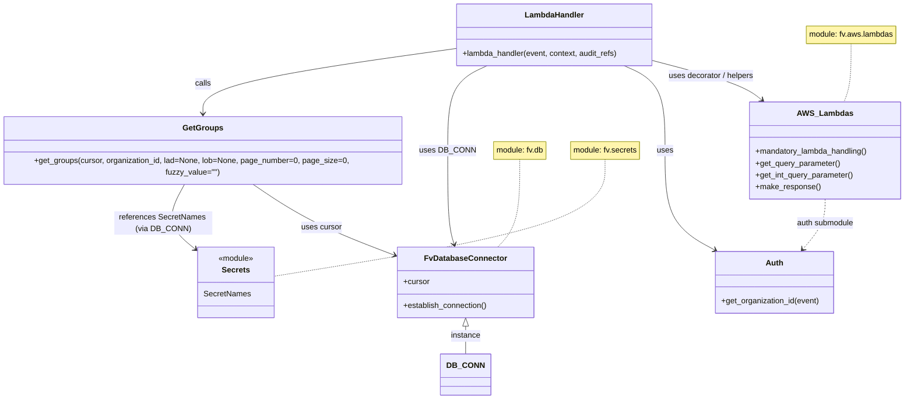

# Diagram: common/location_service/location_service/loc/lambdas/location/locations_group.py


> Auto-generated by Obscura crawlers

## Diagram 1



### SVG

<svg id="container" width="1844.37109375" xmlns="http://www.w3.org/2000/svg" class="classDiagram" height="814" viewBox="0 0 1844.37109375 814" role="graphics-document document" aria-roledescription="class"><style>#container{font-family:"trebuchet ms",verdana,arial,sans-serif;font-size:16px;fill:#333;}@keyframes edge-animation-frame{from{stroke-dashoffset:0;}}@keyframes dash{to{stroke-dashoffset:0;}}#container .edge-animation-slow{stroke-dasharray:9,5!important;stroke-dashoffset:900;animation:dash 50s linear infinite;stroke-linecap:round;}#container .edge-animation-fast{stroke-dasharray:9,5!important;stroke-dashoffset:900;animation:dash 20s linear infinite;stroke-linecap:round;}#container .error-icon{fill:#552222;}#container .error-text{fill:#552222;stroke:#552222;}#container .edge-thickness-normal{stroke-width:1px;}#container .edge-thickness-thick{stroke-width:3.5px;}#container .edge-pattern-solid{stroke-dasharray:0;}#container .edge-thickness-invisible{stroke-width:0;fill:none;}#container .edge-pattern-dashed{stroke-dasharray:3;}#container .edge-pattern-dotted{stroke-dasharray:2;}#container .marker{fill:#333333;stroke:#333333;}#container .marker.cross{stroke:#333333;}#container svg{font-family:"trebuchet ms",verdana,arial,sans-serif;font-size:16px;}#container p{margin:0;}#container g.classGroup text{fill:#9370DB;stroke:none;font-family:"trebuchet ms",verdana,arial,sans-serif;font-size:10px;}#container g.classGroup text .title{font-weight:bolder;}#container .nodeLabel,#container .edgeLabel{color:#131300;}#container .edgeLabel .label rect{fill:#ECECFF;}#container .label text{fill:#131300;}#container .labelBkg{background:#ECECFF;}#container .edgeLabel .label span{background:#ECECFF;}#container .classTitle{font-weight:bolder;}#container .node rect,#container .node circle,#container .node ellipse,#container .node polygon,#container .node path{fill:#ECECFF;stroke:#9370DB;stroke-width:1px;}#container .divider{stroke:#9370DB;stroke-width:1;}#container g.clickable{cursor:pointer;}#container g.classGroup rect{fill:#ECECFF;stroke:#9370DB;}#container g.classGroup line{stroke:#9370DB;stroke-width:1;}#container .classLabel .box{stroke:none;stroke-width:0;fill:#ECECFF;opacity:0.5;}#container .classLabel .label{fill:#9370DB;font-size:10px;}#container .relation{stroke:#333333;stroke-width:1;fill:none;}#container .dashed-line{stroke-dasharray:3;}#container .dotted-line{stroke-dasharray:1 2;}#container #compositionStart,#container .composition{fill:#333333!important;stroke:#333333!important;stroke-width:1;}#container #compositionEnd,#container .composition{fill:#333333!important;stroke:#333333!important;stroke-width:1;}#container #dependencyStart,#container .dependency{fill:#333333!important;stroke:#333333!important;stroke-width:1;}#container #dependencyStart,#container .dependency{fill:#333333!important;stroke:#333333!important;stroke-width:1;}#container #extensionStart,#container .extension{fill:transparent!important;stroke:#333333!important;stroke-width:1;}#container #extensionEnd,#container .extension{fill:transparent!important;stroke:#333333!important;stroke-width:1;}#container #aggregationStart,#container .aggregation{fill:transparent!important;stroke:#333333!important;stroke-width:1;}#container #aggregationEnd,#container .aggregation{fill:transparent!important;stroke:#333333!important;stroke-width:1;}#container #lollipopStart,#container .lollipop{fill:#ECECFF!important;stroke:#333333!important;stroke-width:1;}#container #lollipopEnd,#container .lollipop{fill:#ECECFF!important;stroke:#333333!important;stroke-width:1;}#container .edgeTerminals{font-size:11px;line-height:initial;}#container .classTitleText{text-anchor:middle;font-size:18px;fill:#333;}#container .label-icon{display:inline-block;height:1em;overflow:visible;vertical-align:-0.125em;}#container .node .label-icon path{fill:currentColor;stroke:revert;stroke-width:revert;}#container :root{--mermaid-font-family:"trebuchet ms",verdana,arial,sans-serif;}</style><g><defs><marker id="container_class-aggregationStart" class="marker aggregation class" refX="18" refY="7" markerWidth="190" markerHeight="240" orient="auto"><path d="M 18,7 L9,13 L1,7 L9,1 Z"></path></marker></defs><defs><marker id="container_class-aggregationEnd" class="marker aggregation class" refX="1" refY="7" markerWidth="20" markerHeight="28" orient="auto"><path d="M 18,7 L9,13 L1,7 L9,1 Z"></path></marker></defs><defs><marker id="container_class-extensionStart" class="marker extension class" refX="18" refY="7" markerWidth="190" markerHeight="240" orient="auto"><path d="M 1,7 L18,13 V 1 Z"></path></marker></defs><defs><marker id="container_class-extensionEnd" class="marker extension class" refX="1" refY="7" markerWidth="20" markerHeight="28" orient="auto"><path d="M 1,1 V 13 L18,7 Z"></path></marker></defs><defs><marker id="container_class-compositionStart" class="marker composition class" refX="18" refY="7" markerWidth="190" markerHeight="240" orient="auto"><path d="M 18,7 L9,13 L1,7 L9,1 Z"></path></marker></defs><defs><marker id="container_class-compositionEnd" class="marker composition class" refX="1" refY="7" markerWidth="20" markerHeight="28" orient="auto"><path d="M 18,7 L9,13 L1,7 L9,1 Z"></path></marker></defs><defs><marker id="container_class-dependencyStart" class="marker dependency class" refX="6" refY="7" markerWidth="190" markerHeight="240" orient="auto"><path d="M 5,7 L9,13 L1,7 L9,1 Z"></path></marker></defs><defs><marker id="container_class-dependencyEnd" class="marker dependency class" refX="13" refY="7" markerWidth="20" markerHeight="28" orient="auto"><path d="M 18,7 L9,13 L14,7 L9,1 Z"></path></marker></defs><defs><marker id="container_class-lollipopStart" class="marker lollipop class" refX="13" refY="7" markerWidth="190" markerHeight="240" orient="auto"><circle stroke="black" fill="transparent" cx="7" cy="7" r="6"></circle></marker></defs><defs><marker id="container_class-lollipopEnd" class="marker lollipop class" refX="1" refY="7" markerWidth="190" markerHeight="240" orient="auto"><circle stroke="black" fill="transparent" cx="7" cy="7" r="6"></circle></marker></defs><g class="root"><g class="clusters"></g><g class="edgePaths"><path d="M1052.43,325L1052.43,346.667C1052.43,368.333,1052.43,411.667,1045.307,441.5C1038.183,471.333,1023.937,487.667,1016.814,495.833L1009.691,504" id="edgeNote1" class="edge-thickness-normal edge-pattern-dotted relation" style="fill: none;;;fill: none" data-edge="true" data-et="edge" data-id="edgeNote1" data-points="W3sieCI6MTA1Mi40Mjk2ODc1LCJ5IjozMjV9LHsieCI6MTA1Mi40Mjk2ODc1LCJ5Ijo0NTV9LHsieCI6MTAwOS42OTA3MjgzMDU3ODUxLCJ5Ijo1MDR9XQ=="></path><path d="M1736.613,89L1736.613,102.667C1736.613,116.333,1736.613,143.667,1734.133,163.5C1731.653,183.333,1726.693,195.667,1724.213,201.833L1721.733,208" id="edgeNote2" class="edge-thickness-normal edge-pattern-dotted relation" style="fill: none;;;fill: none" data-edge="true" data-et="edge" data-id="edgeNote2" data-points="W3sieCI6MTczNi42MTMyODEyNSwieSI6ODl9LHsieCI6MTczNi42MTMyODEyNSwieSI6MTcxfSx7IngiOjE3MjEuNzMyOTM4ODc4Njc2NiwieSI6MjA4fV0="></path><path d="M1229.461,325L1229.461,346.667C1229.461,368.333,1229.461,411.667,1118.018,451.4C1006.576,491.134,783.69,527.267,672.247,545.334L560.805,563.401" id="edgeNote3" class="edge-thickness-normal edge-pattern-dotted relation" style="fill: none;;;fill: none" data-edge="true" data-et="edge" data-id="edgeNote3" data-points="W3sieCI6MTIyOS40NjA5Mzc1LCJ5IjozMjV9LHsieCI6MTIyOS40NjA5Mzc1LCJ5Ijo0NTV9LHsieCI6NTYwLjgwNDY4NzUsInkiOjU2My40MDEwNDQ2Mzc4NTcxfV0="></path><path d="M946.891,665.25L946.891,668.542C946.891,671.833,946.891,678.417,946.891,687.875C946.891,697.333,946.891,709.667,946.891,715.833L946.891,722" id="id_FvDatabaseConnector_DB_CONN_1" class="edge-thickness-normal edge-pattern-solid relation" style=";;;" data-edge="true" data-et="edge" data-id="id_FvDatabaseConnector_DB_CONN_1" data-points="W3sieCI6OTQ2Ljg5MDYyNSwieSI6NjQ4fSx7IngiOjk0Ni44OTA2MjUsInkiOjY4NX0seyJ4Ijo5NDYuODkwNjI1LCJ5Ijo3MjJ9XQ==" marker-start="url(#container_class-extensionStart)"></path><path d="M1332.762,124.217L1362.352,132.014C1391.941,139.811,1451.121,155.406,1487.709,168.748C1524.297,182.091,1538.292,193.182,1545.29,198.728L1552.288,204.273" id="id_LambdaHandler_AWS_Lambdas_2" class="edge-thickness-normal edge-pattern-solid relation" style=";;;" data-edge="true" data-et="edge" data-id="id_LambdaHandler_AWS_Lambdas_2" data-points="W3sieCI6MTMzMi43NjE3MTg3NSwieSI6MTI0LjIxNjY3NTI0NDQ2NzMzfSx7IngiOjE1MTAuMzAwNzgxMjUsInkiOjE3MX0seyJ4IjoxNTU2Ljk5MDc1MTM3ODY3NjYsInkiOjIwOH1d" marker-end="url(#container_class-dependencyEnd)"></path><path d="M1270.558,134L1284.237,140.167C1297.916,146.333,1325.274,158.667,1338.954,187.5C1352.633,216.333,1352.633,261.667,1352.633,309C1352.633,356.333,1352.633,405.667,1369.831,439.529C1387.029,473.39,1421.426,491.781,1438.624,500.976L1455.822,510.171" id="id_LambdaHandler_Auth_3" class="edge-thickness-normal edge-pattern-solid relation" style=";;;" data-edge="true" data-et="edge" data-id="id_LambdaHandler_Auth_3" data-points="W3sieCI6MTI3MC41NTc4NTE1NjI1LCJ5IjoxMzR9LHsieCI6MTM1Mi42MzI4MTI1LCJ5IjoxNzF9LHsieCI6MTM1Mi42MzI4MTI1LCJ5IjozMDd9LHsieCI6MTM1Mi42MzI4MTI1LCJ5Ijo0NTV9LHsieCI6MTQ2MS4xMTMxODQ0MDA4MjY0LCJ5Ijo1MTN9XQ==" marker-end="url(#container_class-dependencyEnd)"></path><path d="M991.059,134L977.38,140.167C963.701,146.333,936.343,158.667,922.664,187.5C908.984,216.333,908.984,261.667,908.984,309C908.984,356.333,908.984,405.667,911.244,437.546C913.503,469.425,918.022,483.85,920.282,491.062L922.541,498.274" id="id_LambdaHandler_FvDatabaseConnector_4" class="edge-thickness-normal edge-pattern-solid relation" style=";;;" data-edge="true" data-et="edge" data-id="id_LambdaHandler_FvDatabaseConnector_4" data-points="W3sieCI6OTkxLjA1OTMzNTkzNzUsInkiOjEzNH0seyJ4Ijo5MDguOTg0Mzc1LCJ5IjoxNzF9LHsieCI6OTA4Ljk4NDM3NSwieSI6MzA3fSx7IngiOjkwOC45ODQzNzUsInkiOjQ1NX0seyJ4Ijo5MjQuMzM0ODM5ODc2MDMzLCJ5Ijo1MDR9XQ==" marker-end="url(#container_class-dependencyEnd)"></path><path d="M928.855,99.191L843.12,111.16C757.385,123.128,585.915,147.064,500.18,170.199C414.445,193.333,414.445,215.667,414.445,226.833L414.445,238" id="id_LambdaHandler_GetGroups_5" class="edge-thickness-normal edge-pattern-solid relation" style=";;;" data-edge="true" data-et="edge" data-id="id_LambdaHandler_GetGroups_5" data-points="W3sieCI6OTI4Ljg1NTQ2ODc1LCJ5Ijo5OS4xOTE0NDAwNTM2NTY0NH0seyJ4Ijo0MTQuNDQ1MzEyNSwieSI6MTcxfSx7IngiOjQxNC40NDUzMTI1LCJ5IjoyNDR9XQ==" marker-end="url(#container_class-dependencyEnd)"></path><path d="M506.617,370L527.344,384.167C548.07,398.333,589.524,426.667,638.921,451.815C688.319,476.963,745.66,498.926,774.331,509.907L803.002,520.889" id="id_GetGroups_FvDatabaseConnector_6" class="edge-thickness-normal edge-pattern-solid relation" style=";;;" data-edge="true" data-et="edge" data-id="id_GetGroups_FvDatabaseConnector_6" data-points="W3sieCI6NTA2LjYxNzM5ODY0ODY0ODY1LCJ5IjozNzB9LHsieCI6NjMwLjk3NjU2MjUsInkiOjQ1NX0seyJ4Ijo4MDguNjA1NDY4NzUsInkiOjUyMy4wMzQ2MzQxMjIyMTQ4fV0=" marker-end="url(#container_class-dependencyEnd)"></path><path d="M380.077,370L372.349,384.167C364.62,398.333,349.164,426.667,352.603,449.879C356.042,473.091,378.377,491.183,389.545,500.229L400.713,509.274" id="id_GetGroups_Secrets_7" class="edge-thickness-normal edge-pattern-solid relation" style=";;;" data-edge="true" data-et="edge" data-id="id_GetGroups_Secrets_7" data-points="W3sieCI6MzgwLjA3Njk5MDA3NjAxMzU0LCJ5IjozNzB9LHsieCI6MzMzLjcwNzAzMTI1LCJ5Ijo0NTV9LHsieCI6NDA1LjM3NSwieSI6NTEzLjA1MTAxNzIwNjIxM31d" marker-end="url(#container_class-dependencyEnd)"></path><path d="M1681.918,406L1681.918,414.167C1681.918,422.333,1681.918,438.667,1674.34,455.738C1666.761,472.81,1651.604,490.62,1644.026,499.526L1636.448,508.431" id="id_AWS_Lambdas_Auth_8" class="edge-thickness-normal edge-pattern-dashed relation" style=";;;" data-edge="true" data-et="edge" data-id="id_AWS_Lambdas_Auth_8" data-points="W3sieCI6MTY4MS45MTc5Njg3NSwieSI6NDA2fSx7IngiOjE2ODEuOTE3OTY4NzUsInkiOjQ1NX0seyJ4IjoxNjMyLjU1OTE3NDg0NTA0MTMsInkiOjUxM31d" marker-end="url(#container_class-dependencyEnd)"></path></g><g class="edgeLabels"><g class="edgeLabel"><g class="label" data-id="edgeNote1" transform="translate(0, 0)"><foreignObject width="0" height="0"><div xmlns="http://www.w3.org/1999/xhtml" class="labelBkg" style="display: table-cell; white-space: nowrap; line-height: 1.5; max-width: 200px; text-align: center;"><span class="edgeLabel"></span></div></foreignObject></g></g><g class="edgeLabel"><g class="label" data-id="edgeNote2" transform="translate(0, 0)"><foreignObject width="0" height="0"><div xmlns="http://www.w3.org/1999/xhtml" class="labelBkg" style="display: table-cell; white-space: nowrap; line-height: 1.5; max-width: 200px; text-align: center;"><span class="edgeLabel"></span></div></foreignObject></g></g><g class="edgeLabel"><g class="label" data-id="edgeNote3" transform="translate(0, 0)"><foreignObject width="0" height="0"><div xmlns="http://www.w3.org/1999/xhtml" class="labelBkg" style="display: table-cell; white-space: nowrap; line-height: 1.5; max-width: 200px; text-align: center;"><span class="edgeLabel"></span></div></foreignObject></g></g><g class="edgeLabel" transform="translate(946.890625, 685)"><g class="label" data-id="id_FvDatabaseConnector_DB_CONN_1" transform="translate(-30.578125, -12)"><foreignObject width="61.15625" height="24"><div xmlns="http://www.w3.org/1999/xhtml" class="labelBkg" style="display: table-cell; white-space: nowrap; line-height: 1.5; max-width: 200px; text-align: center;"><span class="edgeLabel"><p>instance</p></span></div></foreignObject></g></g><g class="edgeLabel" transform="translate(1450.33456, 155.1983)"><g class="label" data-id="id_LambdaHandler_AWS_Lambdas_2" transform="translate(-89.390625, -12)"><foreignObject width="178.78125" height="24"><div xmlns="http://www.w3.org/1999/xhtml" class="labelBkg" style="display: table-cell; white-space: nowrap; line-height: 1.5; max-width: 200px; text-align: center;"><span class="edgeLabel"><p>uses decorator / helpers</p></span></div></foreignObject></g></g><g class="edgeLabel" transform="translate(1352.6328125, 307)"><g class="label" data-id="id_LambdaHandler_Auth_3" transform="translate(-16.4921875, -12)"><foreignObject width="32.984375" height="24"><div xmlns="http://www.w3.org/1999/xhtml" class="labelBkg" style="display: table-cell; white-space: nowrap; line-height: 1.5; max-width: 200px; text-align: center;"><span class="edgeLabel"><p>uses</p></span></div></foreignObject></g></g><g class="edgeLabel" transform="translate(908.984375, 307)"><g class="label" data-id="id_LambdaHandler_FvDatabaseConnector_4" transform="translate(-53.09375, -12)"><foreignObject width="106.1875" height="24"><div xmlns="http://www.w3.org/1999/xhtml" class="labelBkg" style="display: table-cell; white-space: nowrap; line-height: 1.5; max-width: 200px; text-align: center;"><span class="edgeLabel"><p>uses DB_CONN</p></span></div></foreignObject></g></g><g class="edgeLabel" transform="translate(414.4453125, 171)"><g class="label" data-id="id_LambdaHandler_GetGroups_5" transform="translate(-16.4453125, -12)"><foreignObject width="32.890625" height="24"><div xmlns="http://www.w3.org/1999/xhtml" class="labelBkg" style="display: table-cell; white-space: nowrap; line-height: 1.5; max-width: 200px; text-align: center;"><span class="edgeLabel"><p>calls</p></span></div></foreignObject></g></g><g class="edgeLabel" transform="translate(649.45721, 462.07838)"><g class="label" data-id="id_GetGroups_FvDatabaseConnector_6" transform="translate(-41.4765625, -12)"><foreignObject width="82.953125" height="24"><div xmlns="http://www.w3.org/1999/xhtml" class="labelBkg" style="display: table-cell; white-space: nowrap; line-height: 1.5; max-width: 200px; text-align: center;"><span class="edgeLabel"><p>uses cursor</p></span></div></foreignObject></g></g><g class="edgeLabel" transform="translate(334.80762, 452.98252)"><g class="label" data-id="id_GetGroups_Secrets_7" transform="translate(-100, -24)"><foreignObject width="200" height="48"><div xmlns="http://www.w3.org/1999/xhtml" class="labelBkg" style="display: table; white-space: break-spaces; line-height: 1.5; max-width: 200px; text-align: center; width: 200px;"><span class="edgeLabel"><p>references SecretNames (via DB_CONN)</p></span></div></foreignObject></g></g><g class="edgeLabel" transform="translate(1681.91796875, 455)"><g class="label" data-id="id_AWS_Lambdas_Auth_8" transform="translate(-59.484375, -12)"><foreignObject width="118.96875" height="24"><div xmlns="http://www.w3.org/1999/xhtml" class="labelBkg" style="display: table-cell; white-space: nowrap; line-height: 1.5; max-width: 200px; text-align: center;"><span class="edgeLabel"><p>auth submodule</p></span></div></foreignObject></g></g></g><g class="nodes"><g class="node default" id="classId-FvDatabaseConnector-0" transform="translate(946.890625, 576)"><g class="basic label-container"><path d="M-138.28515625 -72 L138.28515625 -72 L138.28515625 72 L-138.28515625 72" stroke="none" stroke-width="0" fill="#ECECFF" style=""></path><path d="M-138.28515625 -72 C-63.992304232505134 -72, 10.300547784989732 -72, 138.28515625 -72 M-138.28515625 -72 C-31.815111014956088 -72, 74.65493422008782 -72, 138.28515625 -72 M138.28515625 -72 C138.28515625 -34.27077880331173, 138.28515625 3.4584423933765436, 138.28515625 72 M138.28515625 -72 C138.28515625 -40.696292394320764, 138.28515625 -9.392584788641521, 138.28515625 72 M138.28515625 72 C73.81910631512802 72, 9.35305638025605 72, -138.28515625 72 M138.28515625 72 C78.97798993560303 72, 19.67082362120607 72, -138.28515625 72 M-138.28515625 72 C-138.28515625 21.903644168744016, -138.28515625 -28.192711662511968, -138.28515625 -72 M-138.28515625 72 C-138.28515625 25.2864487706849, -138.28515625 -21.427102458630202, -138.28515625 -72" stroke="#9370DB" stroke-width="1.3" fill="none" stroke-dasharray="0 0" style=""></path></g><g class="annotation-group text" transform="translate(0, -48)"></g><g class="label-group text" transform="translate(-79.3046875, -48)"><g class="label" style="font-weight: bolder" transform="translate(0,-12)"><foreignObject width="158.609375" height="24"><div xmlns="http://www.w3.org/1999/xhtml" style="display: table-cell; white-space: nowrap; line-height: 1.5; max-width: 207px; text-align: center;"><span class="nodeLabel markdown-node-label" style=""><p>FvDatabaseConnector</p></span></div></foreignObject></g></g><g class="members-group text" transform="translate(-126.28515625, 0)"><g class="label" style="" transform="translate(0,-12)"><foreignObject width="53.71875" height="24"><div xmlns="http://www.w3.org/1999/xhtml" style="display: table-cell; white-space: nowrap; line-height: 1.5; max-width: 112px; text-align: center;"><span class="nodeLabel markdown-node-label" style=""><p>+cursor</p></span></div></foreignObject></g></g><g class="methods-group text" transform="translate(-126.28515625, 48)"><g class="label" style="" transform="translate(0,-12)"><foreignObject width="173.265625" height="24"><div xmlns="http://www.w3.org/1999/xhtml" style="display: table-cell; white-space: nowrap; line-height: 1.5; max-width: 231px; text-align: center;"><span class="nodeLabel markdown-node-label" style=""><p>+establish_connection()</p></span></div></foreignObject></g></g><g class="divider" style=""><path d="M-138.28515625 -24 C-43.04218115775575 -24, 52.2007939344885 -24, 138.28515625 -24 M-138.28515625 -24 C-70.17964616464418 -24, -2.0741360792883654 -24, 138.28515625 -24" stroke="#9370DB" stroke-width="1.3" fill="none" stroke-dasharray="0 0" style=""></path></g><g class="divider" style=""><path d="M-138.28515625 24 C-76.87081274795088 24, -15.456469245901744 24, 138.28515625 24 M-138.28515625 24 C-81.42184004820194 24, -24.5585238464039 24, 138.28515625 24" stroke="#9370DB" stroke-width="1.3" fill="none" stroke-dasharray="0 0" style=""></path></g></g><g class="node default" id="classId-LambdaHandler-1" transform="translate(1130.80859375, 71)"><g class="basic label-container"><path d="M-201.953125 -63 L201.953125 -63 L201.953125 63 L-201.953125 63" stroke="none" stroke-width="0" fill="#ECECFF" style=""></path><path d="M-201.953125 -63 C-73.12935423584182 -63, 55.69441652831637 -63, 201.953125 -63 M-201.953125 -63 C-95.31895125500472 -63, 11.31522248999056 -63, 201.953125 -63 M201.953125 -63 C201.953125 -25.032552549829553, 201.953125 12.934894900340893, 201.953125 63 M201.953125 -63 C201.953125 -28.070396727850188, 201.953125 6.859206544299624, 201.953125 63 M201.953125 63 C72.84124950521792 63, -56.27062598956417 63, -201.953125 63 M201.953125 63 C109.10798404845116 63, 16.262843096902316 63, -201.953125 63 M-201.953125 63 C-201.953125 34.485315658955834, -201.953125 5.970631317911668, -201.953125 -63 M-201.953125 63 C-201.953125 32.2837269301679, -201.953125 1.567453860335796, -201.953125 -63" stroke="#9370DB" stroke-width="1.3" fill="none" stroke-dasharray="0 0" style=""></path></g><g class="annotation-group text" transform="translate(0, -39)"></g><g class="label-group text" transform="translate(-58.21875, -39)"><g class="label" style="font-weight: bolder" transform="translate(0,-12)"><foreignObject width="116.4375" height="24"><div xmlns="http://www.w3.org/1999/xhtml" style="display: table-cell; white-space: nowrap; line-height: 1.5; max-width: 167px; text-align: center;"><span class="nodeLabel markdown-node-label" style=""><p>LambdaHandler</p></span></div></foreignObject></g></g><g class="members-group text" transform="translate(-189.953125, 9)"></g><g class="methods-group text" transform="translate(-189.953125, 39)"><g class="label" style="" transform="translate(0,-12)"><foreignObject width="321.6875" height="24"><div xmlns="http://www.w3.org/1999/xhtml" style="display: table-cell; white-space: nowrap; line-height: 1.5; max-width: 379px; text-align: center;"><span class="nodeLabel markdown-node-label" style=""><p>+lambda_handler(event, context, audit_refs)</p></span></div></foreignObject></g></g><g class="divider" style=""><path d="M-201.953125 -15 C-48.18940971812117 -15, 105.57430556375766 -15, 201.953125 -15 M-201.953125 -15 C-87.52040970307249 -15, 26.912305593855024 -15, 201.953125 -15" stroke="#9370DB" stroke-width="1.3" fill="none" stroke-dasharray="0 0" style=""></path></g><g class="divider" style=""><path d="M-201.953125 9 C-105.554951344336 9, -9.156777688672008 9, 201.953125 9 M-201.953125 9 C-93.68183230539081 9, 14.589460389218374 9, 201.953125 9" stroke="#9370DB" stroke-width="1.3" fill="none" stroke-dasharray="0 0" style=""></path></g></g><g class="node default" id="classId-GetGroups-2" transform="translate(414.4453125, 307)"><g class="basic label-container"><path d="M-406.4453125 -63 L406.4453125 -63 L406.4453125 63 L-406.4453125 63" stroke="none" stroke-width="0" fill="#ECECFF" style=""></path><path d="M-406.4453125 -63 C-238.49536242304106 -63, -70.54541234608212 -63, 406.4453125 -63 M-406.4453125 -63 C-164.71463299318754 -63, 77.01604651362493 -63, 406.4453125 -63 M406.4453125 -63 C406.4453125 -19.239504783538386, 406.4453125 24.520990432923227, 406.4453125 63 M406.4453125 -63 C406.4453125 -25.375491083339092, 406.4453125 12.249017833321815, 406.4453125 63 M406.4453125 63 C216.08073148786025 63, 25.716150475720497 63, -406.4453125 63 M406.4453125 63 C133.2490317869984 63, -139.94724892600323 63, -406.4453125 63 M-406.4453125 63 C-406.4453125 16.03016027070425, -406.4453125 -30.9396794585915, -406.4453125 -63 M-406.4453125 63 C-406.4453125 18.64626412027284, -406.4453125 -25.70747175945432, -406.4453125 -63" stroke="#9370DB" stroke-width="1.3" fill="none" stroke-dasharray="0 0" style=""></path></g><g class="annotation-group text" transform="translate(0, -39)"></g><g class="label-group text" transform="translate(-38.6875, -39)"><g class="label" style="font-weight: bolder" transform="translate(0,-12)"><foreignObject width="77.375" height="24"><div xmlns="http://www.w3.org/1999/xhtml" style="display: table-cell; white-space: nowrap; line-height: 1.5; max-width: 126px; text-align: center;"><span class="nodeLabel markdown-node-label" style=""><p>GetGroups</p></span></div></foreignObject></g></g><g class="members-group text" transform="translate(-394.4453125, 9)"></g><g class="methods-group text" transform="translate(-394.4453125, 39)"><g class="label" style="" transform="translate(0,-12)"><foreignObject width="750.203125" height="24"><div xmlns="http://www.w3.org/1999/xhtml" style="display: table-cell; white-space: nowrap; line-height: 1.5; max-width: 808px; text-align: center;"><span class="nodeLabel markdown-node-label" style=""><p>+get_groups(cursor, organization_id, lad=None, lob=None, page_number=0, page_size=0, fuzzy_value="")</p></span></div></foreignObject></g></g><g class="divider" style=""><path d="M-406.4453125 -15 C-168.61982216844822 -15, 69.20566816310355 -15, 406.4453125 -15 M-406.4453125 -15 C-143.45745902992002 -15, 119.53039444015997 -15, 406.4453125 -15" stroke="#9370DB" stroke-width="1.3" fill="none" stroke-dasharray="0 0" style=""></path></g><g class="divider" style=""><path d="M-406.4453125 9 C-176.64089887071177 9, 53.16351475857647 9, 406.4453125 9 M-406.4453125 9 C-234.01375476095822 9, -61.58219702191644 9, 406.4453125 9" stroke="#9370DB" stroke-width="1.3" fill="none" stroke-dasharray="0 0" style=""></path></g></g><g class="node default" id="classId-AWS_Lambdas-3" transform="translate(1681.91796875, 307)"><g class="basic label-container"><path d="M-154.453125 -99 L154.453125 -99 L154.453125 99 L-154.453125 99" stroke="none" stroke-width="0" fill="#ECECFF" style=""></path><path d="M-154.453125 -99 C-59.33120752199679 -99, 35.790709956006424 -99, 154.453125 -99 M-154.453125 -99 C-41.874512340150645 -99, 70.70410031969871 -99, 154.453125 -99 M154.453125 -99 C154.453125 -37.78033672777452, 154.453125 23.439326544450964, 154.453125 99 M154.453125 -99 C154.453125 -57.52031932435168, 154.453125 -16.040638648703364, 154.453125 99 M154.453125 99 C45.235884291860074 99, -63.98135641627985 99, -154.453125 99 M154.453125 99 C35.23417869493555 99, -83.9847676101289 99, -154.453125 99 M-154.453125 99 C-154.453125 20.928724651471967, -154.453125 -57.142550697056066, -154.453125 -99 M-154.453125 99 C-154.453125 29.336566427715923, -154.453125 -40.326867144568155, -154.453125 -99" stroke="#9370DB" stroke-width="1.3" fill="none" stroke-dasharray="0 0" style=""></path></g><g class="annotation-group text" transform="translate(0, -75)"></g><g class="label-group text" transform="translate(-52.828125, -75)"><g class="label" style="font-weight: bolder" transform="translate(0,-12)"><foreignObject width="105.65625" height="24"><div xmlns="http://www.w3.org/1999/xhtml" style="display: table-cell; white-space: nowrap; line-height: 1.5; max-width: 154px; text-align: center;"><span class="nodeLabel markdown-node-label" style=""><p>AWS_Lambdas</p></span></div></foreignObject></g></g><g class="members-group text" transform="translate(-142.453125, -27)"></g><g class="methods-group text" transform="translate(-142.453125, 3)"><g class="label" style="" transform="translate(0,-12)"><foreignObject width="232.078125" height="24"><div xmlns="http://www.w3.org/1999/xhtml" style="display: table-cell; white-space: nowrap; line-height: 1.5; max-width: 289px; text-align: center;"><span class="nodeLabel markdown-node-label" style=""><p>+mandatory_lambda_handling()</p></span></div></foreignObject></g><g class="label" style="" transform="translate(0,12)"><foreignObject width="173.640625" height="24"><div xmlns="http://www.w3.org/1999/xhtml" style="display: table-cell; white-space: nowrap; line-height: 1.5; max-width: 231px; text-align: center;"><span class="nodeLabel markdown-node-label" style=""><p>+get_query_parameter()</p></span></div></foreignObject></g><g class="label" style="" transform="translate(0,36)"><foreignObject width="201.625" height="24"><div xmlns="http://www.w3.org/1999/xhtml" style="display: table-cell; white-space: nowrap; line-height: 1.5; max-width: 259px; text-align: center;"><span class="nodeLabel markdown-node-label" style=""><p>+get_int_query_parameter()</p></span></div></foreignObject></g><g class="label" style="" transform="translate(0,60)"><foreignObject width="131.84375" height="24"><div xmlns="http://www.w3.org/1999/xhtml" style="display: table-cell; white-space: nowrap; line-height: 1.5; max-width: 189px; text-align: center;"><span class="nodeLabel markdown-node-label" style=""><p>+make_response()</p></span></div></foreignObject></g></g><g class="divider" style=""><path d="M-154.453125 -51 C-82.4127734650616 -51, -10.37242193012321 -51, 154.453125 -51 M-154.453125 -51 C-78.06039999402743 -51, -1.6676749880548698 -51, 154.453125 -51" stroke="#9370DB" stroke-width="1.3" fill="none" stroke-dasharray="0 0" style=""></path></g><g class="divider" style=""><path d="M-154.453125 -27 C-57.23286569722411 -27, 39.98739360555177 -27, 154.453125 -27 M-154.453125 -27 C-50.56207342450897 -27, 53.32897815098207 -27, 154.453125 -27" stroke="#9370DB" stroke-width="1.3" fill="none" stroke-dasharray="0 0" style=""></path></g></g><g class="node default" id="classId-Auth-4" transform="translate(1578.9453125, 576)"><g class="basic label-container"><path d="M-121.51171875 -63 L121.51171875 -63 L121.51171875 63 L-121.51171875 63" stroke="none" stroke-width="0" fill="#ECECFF" style=""></path><path d="M-121.51171875 -63 C-28.724679701783586 -63, 64.06235934643283 -63, 121.51171875 -63 M-121.51171875 -63 C-69.24757548777772 -63, -16.983432225555447 -63, 121.51171875 -63 M121.51171875 -63 C121.51171875 -16.975478591107006, 121.51171875 29.04904281778599, 121.51171875 63 M121.51171875 -63 C121.51171875 -23.608239762147896, 121.51171875 15.783520475704208, 121.51171875 63 M121.51171875 63 C29.640745663156707 63, -62.230227423686586 63, -121.51171875 63 M121.51171875 63 C63.41629918745517 63, 5.320879624910333 63, -121.51171875 63 M-121.51171875 63 C-121.51171875 25.551585831245866, -121.51171875 -11.896828337508268, -121.51171875 -63 M-121.51171875 63 C-121.51171875 28.998834488461583, -121.51171875 -5.0023310230768345, -121.51171875 -63" stroke="#9370DB" stroke-width="1.3" fill="none" stroke-dasharray="0 0" style=""></path></g><g class="annotation-group text" transform="translate(0, -39)"></g><g class="label-group text" transform="translate(-17.0078125, -39)"><g class="label" style="font-weight: bolder" transform="translate(0,-12)"><foreignObject width="34.015625" height="24"><div xmlns="http://www.w3.org/1999/xhtml" style="display: table-cell; white-space: nowrap; line-height: 1.5; max-width: 84px; text-align: center;"><span class="nodeLabel markdown-node-label" style=""><p>Auth</p></span></div></foreignObject></g></g><g class="members-group text" transform="translate(-109.51171875, 9)"></g><g class="methods-group text" transform="translate(-109.51171875, 39)"><g class="label" style="" transform="translate(0,-12)"><foreignObject width="202.015625" height="24"><div xmlns="http://www.w3.org/1999/xhtml" style="display: table-cell; white-space: nowrap; line-height: 1.5; max-width: 259px; text-align: center;"><span class="nodeLabel markdown-node-label" style=""><p>+get_organization_id(event)</p></span></div></foreignObject></g></g><g class="divider" style=""><path d="M-121.51171875 -15 C-40.882034839067686 -15, 39.74764907186463 -15, 121.51171875 -15 M-121.51171875 -15 C-40.63063049378766 -15, 40.25045776242467 -15, 121.51171875 -15" stroke="#9370DB" stroke-width="1.3" fill="none" stroke-dasharray="0 0" style=""></path></g><g class="divider" style=""><path d="M-121.51171875 9 C-66.94120616151076 9, -12.37069357302154 9, 121.51171875 9 M-121.51171875 9 C-41.13887035601198 9, 39.233978037976044 9, 121.51171875 9" stroke="#9370DB" stroke-width="1.3" fill="none" stroke-dasharray="0 0" style=""></path></g></g><g class="node default" id="classId-Secrets-5" transform="translate(483.08984375, 576)"><g class="basic label-container"><path d="M-77.71484375 -72 L77.71484375 -72 L77.71484375 72 L-77.71484375 72" stroke="none" stroke-width="0" fill="#ECECFF" style=""></path><path d="M-77.71484375 -72 C-44.84051851313447 -72, -11.966193276268939 -72, 77.71484375 -72 M-77.71484375 -72 C-19.24225702716833 -72, 39.23032969566334 -72, 77.71484375 -72 M77.71484375 -72 C77.71484375 -38.81354509378694, 77.71484375 -5.627090187573884, 77.71484375 72 M77.71484375 -72 C77.71484375 -22.425721669113173, 77.71484375 27.148556661773654, 77.71484375 72 M77.71484375 72 C33.454811264754106 72, -10.805221220491788 72, -77.71484375 72 M77.71484375 72 C43.61702013262425 72, 9.519196515248495 72, -77.71484375 72 M-77.71484375 72 C-77.71484375 37.259284108788215, -77.71484375 2.51856821757643, -77.71484375 -72 M-77.71484375 72 C-77.71484375 17.4548511934845, -77.71484375 -37.090297613031, -77.71484375 -72" stroke="#9370DB" stroke-width="1.3" fill="none" stroke-dasharray="0 0" style=""></path></g><g class="annotation-group text" transform="translate(-36.6015625, -48)"><g class="label" style="" transform="translate(0,-12)"><foreignObject width="73.203125" height="24"><div xmlns="http://www.w3.org/1999/xhtml" style="display: table-cell; white-space: nowrap; line-height: 1.5; max-width: 123px; text-align: center;"><span class="nodeLabel markdown-node-label" style=""><p>«module»</p></span></div></foreignObject></g></g><g class="label-group text" transform="translate(-27.1640625, -24)"><g class="label" style="font-weight: bolder" transform="translate(0,-12)"><foreignObject width="54.328125" height="24"><div xmlns="http://www.w3.org/1999/xhtml" style="display: table-cell; white-space: nowrap; line-height: 1.5; max-width: 103px; text-align: center;"><span class="nodeLabel markdown-node-label" style=""><p>Secrets</p></span></div></foreignObject></g></g><g class="members-group text" transform="translate(-65.71484375, 24)"><g class="label" style="" transform="translate(0,-12)"><foreignObject width="94.828125" height="24"><div xmlns="http://www.w3.org/1999/xhtml" style="display: table-cell; white-space: nowrap; line-height: 1.5; max-width: 145px; text-align: center;"><span class="nodeLabel markdown-node-label" style=""><p>SecretNames</p></span></div></foreignObject></g></g><g class="methods-group text" transform="translate(-65.71484375, 72)"></g><g class="divider" style=""><path d="M-77.71484375 0 C-37.83479761865581 0, 2.0452485126883744 0, 77.71484375 0 M-77.71484375 0 C-45.33276355033793 0, -12.95068335067586 0, 77.71484375 0" stroke="#9370DB" stroke-width="1.3" fill="none" stroke-dasharray="0 0" style=""></path></g><g class="divider" style=""><path d="M-77.71484375 48 C-32.47129734990653 48, 12.772249050186943 48, 77.71484375 48 M-77.71484375 48 C-39.3559350261527 48, -0.9970263023054002 48, 77.71484375 48" stroke="#9370DB" stroke-width="1.3" fill="none" stroke-dasharray="0 0" style=""></path></g></g><g class="node default" id="classId-DB_CONN-6" transform="translate(946.890625, 764)"><g class="basic label-container"><path d="M-46.40625 -42 L46.40625 -42 L46.40625 42 L-46.40625 42" stroke="none" stroke-width="0" fill="#ECECFF" style=""></path><path d="M-46.40625 -42 C-21.751639367715047 -42, 2.9029712645699064 -42, 46.40625 -42 M-46.40625 -42 C-10.560774397587842 -42, 25.284701204824316 -42, 46.40625 -42 M46.40625 -42 C46.40625 -15.392682754554524, 46.40625 11.214634490890951, 46.40625 42 M46.40625 -42 C46.40625 -14.929548014232761, 46.40625 12.140903971534478, 46.40625 42 M46.40625 42 C23.480934185500598 42, 0.555618371001195 42, -46.40625 42 M46.40625 42 C17.38171264502114 42, -11.642824709957722 42, -46.40625 42 M-46.40625 42 C-46.40625 17.87737577381016, -46.40625 -6.245248452379677, -46.40625 -42 M-46.40625 42 C-46.40625 13.99766803901888, -46.40625 -14.00466392196224, -46.40625 -42" stroke="#9370DB" stroke-width="1.3" fill="none" stroke-dasharray="0 0" style=""></path></g><g class="annotation-group text" transform="translate(0, -18)"></g><g class="label-group text" transform="translate(-34.40625, -18)"><g class="label" style="font-weight: bolder" transform="translate(0,-12)"><foreignObject width="68.8125" height="24"><div xmlns="http://www.w3.org/1999/xhtml" style="display: table-cell; white-space: nowrap; line-height: 1.5; max-width: 119px; text-align: center;"><span class="nodeLabel markdown-node-label" style=""><p>DB_CONN</p></span></div></foreignObject></g></g><g class="members-group text" transform="translate(-34.40625, 30)"></g><g class="methods-group text" transform="translate(-34.40625, 60)"></g><g class="divider" style=""><path d="M-46.40625 6 C-25.85856206286262 6, -5.310874125725242 6, 46.40625 6 M-46.40625 6 C-14.086885714074086 6, 18.23247857185183 6, 46.40625 6" stroke="#9370DB" stroke-width="1.3" fill="none" stroke-dasharray="0 0" style=""></path></g><g class="divider" style=""><path d="M-46.40625 24 C-21.98595588673844 24, 2.434338226523117 24, 46.40625 24 M-46.40625 24 C-12.178127024814465 24, 22.04999595037107 24, 46.40625 24" stroke="#9370DB" stroke-width="1.3" fill="none" stroke-dasharray="0 0" style=""></path></g></g><g class="node undefined" id="note0" transform="translate(1052.4296875, 307)"><g class="basic label-container"><path d="M-55.3515625 -18 L55.3515625 -18 L55.3515625 18 L-55.3515625 18" stroke="none" stroke-width="0" fill="#fff5ad" style="fill:#fff5ad !important;stroke:#aaaa33 !important"></path><path d="M-55.3515625 -18 C-31.06241778776652 -18, -6.773273075533041 -18, 55.3515625 -18 M-55.3515625 -18 C-30.028902611177642 -18, -4.7062427223552845 -18, 55.3515625 -18 M55.3515625 -18 C55.3515625 -4.1708839974227985, 55.3515625 9.658232005154403, 55.3515625 18 M55.3515625 -18 C55.3515625 -5.288577152353904, 55.3515625 7.422845695292192, 55.3515625 18 M55.3515625 18 C16.956379233327475 18, -21.43880403334505 18, -55.3515625 18 M55.3515625 18 C31.893154478834614 18, 8.434746457669227 18, -55.3515625 18 M-55.3515625 18 C-55.3515625 3.777794396974132, -55.3515625 -10.444411206051736, -55.3515625 -18 M-55.3515625 18 C-55.3515625 8.53499463955234, -55.3515625 -0.9300107208953214, -55.3515625 -18" stroke="#aaaa33" stroke-width="1.3" fill="none" stroke-dasharray="0 0" style="fill:#fff5ad !important;stroke:#aaaa33 !important"></path></g><g class="label" style="text-align:left !important;white-space:nowrap !important" transform="translate(-49.3515625, -12)"><rect></rect><foreignObject width="98.703125" height="24"><div style="text-align: center; white-space: nowrap; display: table-cell; line-height: 1.5; max-width: 200px;" xmlns="http://www.w3.org/1999/xhtml"><span style="text-align:left !important;white-space:nowrap !important" class="nodeLabel"><p>module: fv.db</p></span></div></foreignObject></g></g><g class="node undefined" id="note1" transform="translate(1736.61328125, 71)"><g class="basic label-container"><path d="M-92.6484375 -18 L92.6484375 -18 L92.6484375 18 L-92.6484375 18" stroke="none" stroke-width="0" fill="#fff5ad" style="fill:#fff5ad !important;stroke:#aaaa33 !important"></path><path d="M-92.6484375 -18 C-23.853671347476052 -18, 44.941094805047896 -18, 92.6484375 -18 M-92.6484375 -18 C-47.81980263529349 -18, -2.9911677705869835 -18, 92.6484375 -18 M92.6484375 -18 C92.6484375 -8.72470700090555, 92.6484375 0.5505859981889003, 92.6484375 18 M92.6484375 -18 C92.6484375 -6.951039346756579, 92.6484375 4.0979213064868425, 92.6484375 18 M92.6484375 18 C21.506858996853822 18, -49.634719506292356 18, -92.6484375 18 M92.6484375 18 C34.04504047113283 18, -24.558356557734342 18, -92.6484375 18 M-92.6484375 18 C-92.6484375 7.324928679121564, -92.6484375 -3.3501426417568716, -92.6484375 -18 M-92.6484375 18 C-92.6484375 7.76753477334298, -92.6484375 -2.4649304533140395, -92.6484375 -18" stroke="#aaaa33" stroke-width="1.3" fill="none" stroke-dasharray="0 0" style="fill:#fff5ad !important;stroke:#aaaa33 !important"></path></g><g class="label" style="text-align:left !important;white-space:nowrap !important" transform="translate(-86.6484375, -12)"><rect></rect><foreignObject width="173.296875" height="24"><div style="text-align: center; white-space: nowrap; display: table-cell; line-height: 1.5; max-width: 200px;" xmlns="http://www.w3.org/1999/xhtml"><span style="text-align:left !important;white-space:nowrap !important" class="nodeLabel"><p>module: fv.aws.lambdas</p></span></div></foreignObject></g></g><g class="node undefined" id="note2" transform="translate(1229.4609375, 307)"><g class="basic label-container"><path d="M-71.6796875 -18 L71.6796875 -18 L71.6796875 18 L-71.6796875 18" stroke="none" stroke-width="0" fill="#fff5ad" style="fill:#fff5ad !important;stroke:#aaaa33 !important"></path><path d="M-71.6796875 -18 C-41.12808554865482 -18, -10.576483597309647 -18, 71.6796875 -18 M-71.6796875 -18 C-39.44316266050281 -18, -7.206637821005614 -18, 71.6796875 -18 M71.6796875 -18 C71.6796875 -10.366413533926893, 71.6796875 -2.732827067853787, 71.6796875 18 M71.6796875 -18 C71.6796875 -4.159629922306092, 71.6796875 9.680740155387817, 71.6796875 18 M71.6796875 18 C15.494285725457317 18, -40.691116049085366 18, -71.6796875 18 M71.6796875 18 C21.38780728709218 18, -28.90407292581564 18, -71.6796875 18 M-71.6796875 18 C-71.6796875 8.543232988512933, -71.6796875 -0.9135340229741331, -71.6796875 -18 M-71.6796875 18 C-71.6796875 7.561100402971764, -71.6796875 -2.8777991940564718, -71.6796875 -18" stroke="#aaaa33" stroke-width="1.3" fill="none" stroke-dasharray="0 0" style="fill:#fff5ad !important;stroke:#aaaa33 !important"></path></g><g class="label" style="text-align:left !important;white-space:nowrap !important" transform="translate(-65.6796875, -12)"><rect></rect><foreignObject width="131.359375" height="24"><div style="text-align: center; white-space: nowrap; display: table-cell; line-height: 1.5; max-width: 200px;" xmlns="http://www.w3.org/1999/xhtml"><span style="text-align:left !important;white-space:nowrap !important" class="nodeLabel"><p>module: fv.secrets</p></span></div></foreignObject></g></g></g></g></g></svg>

## Diagram 2

```mermaid
flowchart TD
    A[API Event] --> B{mandatory_lambda_handling}
    B --> C[establish DB connection]
    C --> D[get_query_parameter: lad,lob,query,pageNumber,pageSize]
    D --> E[get_organization_id]
    E --> F[get_groups(cursor, org_id, lad, lob, pageNumber, pageSize, query)]
    F --> G{Has groups?}
    G -- Yes --> H[make_response({meta,data:groups})]
    G -- No --> I[make_response({meta:{},data:[]}, 404)]
    H --> J[Return 200]
    I --> K[Return 404]
    subgraph DB
        C
        F
    end
    subgraph Modules
        D
        E
        H
        I
    end
```

> SVG rendering failed for this diagram.
