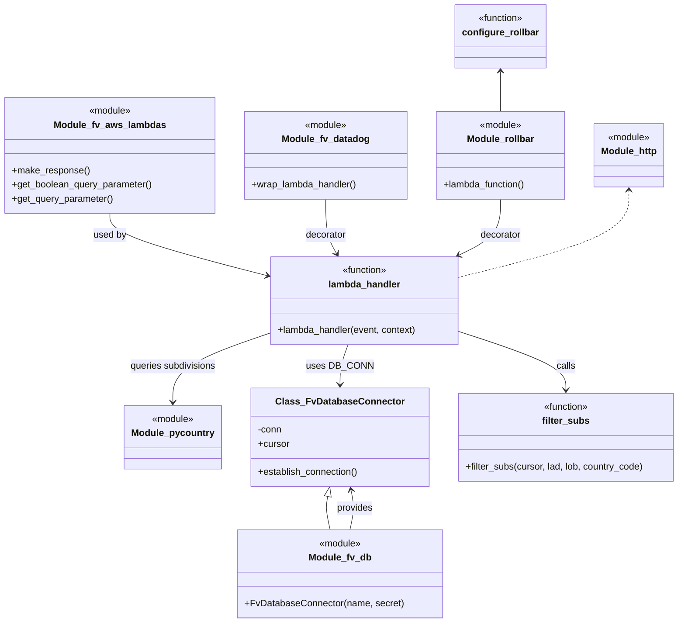

# Diagram: common/location_service/location_service/loc/lambdas/location/locations_subdivisions.py


> Auto-generated by Obscura crawlers

## Diagram 1



### SVG

<svg id="container" width="1154.794921875" xmlns="http://www.w3.org/2000/svg" class="classDiagram" height="1062" viewBox="0 0 1154.794921875 1062" role="graphics-document document" aria-roledescription="class"><style>#container{font-family:"trebuchet ms",verdana,arial,sans-serif;font-size:16px;fill:#333;}@keyframes edge-animation-frame{from{stroke-dashoffset:0;}}@keyframes dash{to{stroke-dashoffset:0;}}#container .edge-animation-slow{stroke-dasharray:9,5!important;stroke-dashoffset:900;animation:dash 50s linear infinite;stroke-linecap:round;}#container .edge-animation-fast{stroke-dasharray:9,5!important;stroke-dashoffset:900;animation:dash 20s linear infinite;stroke-linecap:round;}#container .error-icon{fill:#552222;}#container .error-text{fill:#552222;stroke:#552222;}#container .edge-thickness-normal{stroke-width:1px;}#container .edge-thickness-thick{stroke-width:3.5px;}#container .edge-pattern-solid{stroke-dasharray:0;}#container .edge-thickness-invisible{stroke-width:0;fill:none;}#container .edge-pattern-dashed{stroke-dasharray:3;}#container .edge-pattern-dotted{stroke-dasharray:2;}#container .marker{fill:#333333;stroke:#333333;}#container .marker.cross{stroke:#333333;}#container svg{font-family:"trebuchet ms",verdana,arial,sans-serif;font-size:16px;}#container p{margin:0;}#container g.classGroup text{fill:#9370DB;stroke:none;font-family:"trebuchet ms",verdana,arial,sans-serif;font-size:10px;}#container g.classGroup text .title{font-weight:bolder;}#container .nodeLabel,#container .edgeLabel{color:#131300;}#container .edgeLabel .label rect{fill:#ECECFF;}#container .label text{fill:#131300;}#container .labelBkg{background:#ECECFF;}#container .edgeLabel .label span{background:#ECECFF;}#container .classTitle{font-weight:bolder;}#container .node rect,#container .node circle,#container .node ellipse,#container .node polygon,#container .node path{fill:#ECECFF;stroke:#9370DB;stroke-width:1px;}#container .divider{stroke:#9370DB;stroke-width:1;}#container g.clickable{cursor:pointer;}#container g.classGroup rect{fill:#ECECFF;stroke:#9370DB;}#container g.classGroup line{stroke:#9370DB;stroke-width:1;}#container .classLabel .box{stroke:none;stroke-width:0;fill:#ECECFF;opacity:0.5;}#container .classLabel .label{fill:#9370DB;font-size:10px;}#container .relation{stroke:#333333;stroke-width:1;fill:none;}#container .dashed-line{stroke-dasharray:3;}#container .dotted-line{stroke-dasharray:1 2;}#container #compositionStart,#container .composition{fill:#333333!important;stroke:#333333!important;stroke-width:1;}#container #compositionEnd,#container .composition{fill:#333333!important;stroke:#333333!important;stroke-width:1;}#container #dependencyStart,#container .dependency{fill:#333333!important;stroke:#333333!important;stroke-width:1;}#container #dependencyStart,#container .dependency{fill:#333333!important;stroke:#333333!important;stroke-width:1;}#container #extensionStart,#container .extension{fill:transparent!important;stroke:#333333!important;stroke-width:1;}#container #extensionEnd,#container .extension{fill:transparent!important;stroke:#333333!important;stroke-width:1;}#container #aggregationStart,#container .aggregation{fill:transparent!important;stroke:#333333!important;stroke-width:1;}#container #aggregationEnd,#container .aggregation{fill:transparent!important;stroke:#333333!important;stroke-width:1;}#container #lollipopStart,#container .lollipop{fill:#ECECFF!important;stroke:#333333!important;stroke-width:1;}#container #lollipopEnd,#container .lollipop{fill:#ECECFF!important;stroke:#333333!important;stroke-width:1;}#container .edgeTerminals{font-size:11px;line-height:initial;}#container .classTitleText{text-anchor:middle;font-size:18px;fill:#333;}#container .label-icon{display:inline-block;height:1em;overflow:visible;vertical-align:-0.125em;}#container .node .label-icon path{fill:currentColor;stroke:revert;stroke-width:revert;}#container :root{--mermaid-font-family:"trebuchet ms",verdana,arial,sans-serif;}</style><g><defs><marker id="container_class-aggregationStart" class="marker aggregation class" refX="18" refY="7" markerWidth="190" markerHeight="240" orient="auto"><path d="M 18,7 L9,13 L1,7 L9,1 Z"></path></marker></defs><defs><marker id="container_class-aggregationEnd" class="marker aggregation class" refX="1" refY="7" markerWidth="20" markerHeight="28" orient="auto"><path d="M 18,7 L9,13 L1,7 L9,1 Z"></path></marker></defs><defs><marker id="container_class-extensionStart" class="marker extension class" refX="18" refY="7" markerWidth="190" markerHeight="240" orient="auto"><path d="M 1,7 L18,13 V 1 Z"></path></marker></defs><defs><marker id="container_class-extensionEnd" class="marker extension class" refX="1" refY="7" markerWidth="20" markerHeight="28" orient="auto"><path d="M 1,1 V 13 L18,7 Z"></path></marker></defs><defs><marker id="container_class-compositionStart" class="marker composition class" refX="18" refY="7" markerWidth="190" markerHeight="240" orient="auto"><path d="M 18,7 L9,13 L1,7 L9,1 Z"></path></marker></defs><defs><marker id="container_class-compositionEnd" class="marker composition class" refX="1" refY="7" markerWidth="20" markerHeight="28" orient="auto"><path d="M 18,7 L9,13 L1,7 L9,1 Z"></path></marker></defs><defs><marker id="container_class-dependencyStart" class="marker dependency class" refX="6" refY="7" markerWidth="190" markerHeight="240" orient="auto"><path d="M 5,7 L9,13 L1,7 L9,1 Z"></path></marker></defs><defs><marker id="container_class-dependencyEnd" class="marker dependency class" refX="13" refY="7" markerWidth="20" markerHeight="28" orient="auto"><path d="M 18,7 L9,13 L14,7 L9,1 Z"></path></marker></defs><defs><marker id="container_class-lollipopStart" class="marker lollipop class" refX="13" refY="7" markerWidth="190" markerHeight="240" orient="auto"><circle stroke="black" fill="transparent" cx="7" cy="7" r="6"></circle></marker></defs><defs><marker id="container_class-lollipopEnd" class="marker lollipop class" refX="1" refY="7" markerWidth="190" markerHeight="240" orient="auto"><circle stroke="black" fill="transparent" cx="7" cy="7" r="6"></circle></marker></defs><g class="root"><g class="clusters"></g><g class="edgePaths"><path d="M594.236,904L595.584,897.833C596.932,891.667,599.628,879.333,599.927,867.98C600.225,856.627,598.127,846.254,597.077,841.067L596.028,835.881" id="id_Module_fv_db_Class_FvDatabaseConnector_1" class="edge-thickness-normal edge-pattern-solid relation" style=";;;" data-edge="true" data-et="edge" data-id="id_Module_fv_db_Class_FvDatabaseConnector_1" data-points="W3sieCI6NTk0LjIzNjI3NTgwOTE1MTgsInkiOjkwNH0seyJ4Ijo2MDIuMzI0MjE4NzUsInkiOjg2N30seyJ4Ijo1OTQuODM3ODU4MzQxOTQyMSwieSI6ODMwfV0=" marker-end="url(#container_class-dependencyEnd)"></path><path d="M186.195,364L186.195,370.167C186.195,376.333,186.195,388.667,230.563,406.28C274.93,423.894,363.665,446.788,408.032,458.236L452.399,469.683" id="id_Module_fv_aws_lambdas_lambda_handler_2" class="edge-thickness-normal edge-pattern-solid relation" style=";;;" data-edge="true" data-et="edge" data-id="id_Module_fv_aws_lambdas_lambda_handler_2" data-points="W3sieCI6MTg2LjE5NTMxMjUsInkiOjM2NH0seyJ4IjoxODYuMTk1MzEyNSwieSI6NDAxfSx7IngiOjQ1OC4yMDg5ODQzNzUsInkiOjQ3MS4xODE2MDA1Nzk1MDkzNH1d" marker-end="url(#container_class-dependencyEnd)"></path><path d="M553.004,340L553.004,350.167C553.004,360.333,553.004,380.667,556.194,396.143C559.384,411.619,565.763,422.238,568.953,427.547L572.143,432.857" id="id_Module_fv_datadog_lambda_handler_3" class="edge-thickness-normal edge-pattern-solid relation" style=";;;" data-edge="true" data-et="edge" data-id="id_Module_fv_datadog_lambda_handler_3" data-points="W3sieCI6NTUzLjAwMzkwNjI1LCJ5IjozNDB9LHsieCI6NTUzLjAwMzkwNjI1LCJ5Ijo0MDF9LHsieCI6NTc1LjIzMjY4MzQ1NDI0MSwieSI6NDM4fV0=" marker-end="url(#container_class-dependencyEnd)"></path><path d="M852.434,340L852.434,350.167C852.434,360.333,852.434,380.667,840.553,396.565C828.672,412.464,804.91,423.929,793.029,429.661L781.148,435.393" id="id_Module_rollbar_lambda_handler_4" class="edge-thickness-normal edge-pattern-solid relation" style=";;;" data-edge="true" data-et="edge" data-id="id_Module_rollbar_lambda_handler_4" data-points="W3sieCI6ODUyLjQzMzU5Mzc1LCJ5IjozNDB9LHsieCI6ODUyLjQzMzU5Mzc1LCJ5Ijo0MDF9LHsieCI6Nzc1Ljc0MzYzNDkwNTEzNCwieSI6NDM4fV0=" marker-end="url(#container_class-dependencyEnd)"></path><path d="M555.482,846.841L554.737,850.201C553.992,853.561,552.502,860.28,553.234,869.807C553.966,879.333,556.921,891.667,558.398,897.833L559.875,904" id="id_Class_FvDatabaseConnector_Module_fv_db_5" class="edge-thickness-normal edge-pattern-solid relation" style=";;;" data-edge="true" data-et="edge" data-id="id_Class_FvDatabaseConnector_Module_fv_db_5" data-points="W3sieCI6NTU5LjIxNTk1NzUxNTQ5NTksInkiOjgzMH0seyJ4Ijo1NTEuMDExNzE4NzUsInkiOjg2N30seyJ4Ijo1NTkuODc1MjI2NzAyMDA5LCJ5Ijo5MDR9XQ==" marker-start="url(#container_class-extensionStart)"></path><path d="M591.865,588L589.528,594.167C587.191,600.333,582.516,612.667,580.179,624C577.842,635.333,577.842,645.667,577.842,650.833L577.842,656" id="id_lambda_handler_Class_FvDatabaseConnector_6" class="edge-thickness-normal edge-pattern-solid relation" style=";;;" data-edge="true" data-et="edge" data-id="id_lambda_handler_Class_FvDatabaseConnector_6" data-points="W3sieCI6NTkxLjg2NTE5OTQ5Nzc2NzksInkiOjU4OH0seyJ4Ijo1NzcuODQxNzk2ODc1LCJ5Ijo2MjV9LHsieCI6NTc3Ljg0MTc5Njg3NSwieSI6NjYyfV0=" marker-end="url(#container_class-dependencyEnd)"></path><path d="M782.373,566.098L812.339,575.915C842.305,585.732,902.238,605.366,932.204,621.85C962.17,638.333,962.17,651.667,962.17,658.333L962.17,665" id="id_lambda_handler_filter_subs_7" class="edge-thickness-normal edge-pattern-solid relation" style=";;;" data-edge="true" data-et="edge" data-id="id_lambda_handler_filter_subs_7" data-points="W3sieCI6NzgyLjM3MzA0Njg3NSwieSI6NTY2LjA5ODI5NjQwODg2MTl9LHsieCI6OTYyLjE2OTkyMTg3NSwieSI6NjI1fSx7IngiOjk2Mi4xNjk5MjE4NzUsInkiOjY3MX1d" marker-end="url(#container_class-dependencyEnd)"></path><path d="M458.209,569.374L431.554,578.645C404.899,587.916,351.589,606.458,324.934,625.896C298.279,645.333,298.279,665.667,298.279,675.833L298.279,686" id="id_lambda_handler_Module_pycountry_8" class="edge-thickness-normal edge-pattern-solid relation" style=";;;" data-edge="true" data-et="edge" data-id="id_lambda_handler_Module_pycountry_8" data-points="W3sieCI6NDU4LjIwODk4NDM3NSwieSI6NTY5LjM3NDMwNzAyOTc4MX0seyJ4IjoyOTguMjc5Mjk2ODc1LCJ5Ijo2MjV9LHsieCI6Mjk4LjI3OTI5Njg3NSwieSI6NjkyfV0=" marker-end="url(#container_class-dependencyEnd)"></path><path d="M852.434,122L852.434,125.167C852.434,128.333,852.434,134.667,852.434,146C852.434,157.333,852.434,173.667,852.434,181.833L852.434,190" id="id_configure_rollbar_Module_rollbar_9" class="edge-thickness-normal edge-pattern-solid relation" style=";;;" data-edge="true" data-et="edge" data-id="id_configure_rollbar_Module_rollbar_9" data-points="W3sieCI6ODUyLjQzMzU5Mzc1LCJ5IjoxMTZ9LHsieCI6ODUyLjQzMzU5Mzc1LCJ5IjoxNDF9LHsieCI6ODUyLjQzMzU5Mzc1LCJ5IjoxOTB9XQ==" marker-start="url(#container_class-dependencyStart)"></path><path d="M1071.906,325L1071.906,337.667C1071.906,350.333,1071.906,375.667,1023.651,400.301C975.395,424.935,878.884,448.869,830.629,460.837L782.373,472.804" id="id_Module_http_lambda_handler_10" class="edge-thickness-normal edge-pattern-dashed relation" style=";;;" data-edge="true" data-et="edge" data-id="id_Module_http_lambda_handler_10" data-points="W3sieCI6MTA3MS45MDYyNSwieSI6MzE5fSx7IngiOjEwNzEuOTA2MjUsInkiOjQwMX0seyJ4Ijo3ODIuMzczMDQ2ODc1LCJ5Ijo0NzIuODAzODYzNzM1NjM2NH1d" marker-start="url(#container_class-dependencyStart)"></path></g><g class="edgeLabels"><g class="edgeLabel" transform="translate(602.31099, 867.06052)"><g class="label" data-id="id_Module_fv_db_Class_FvDatabaseConnector_1" transform="translate(-31.3125, -12)"><foreignObject width="62.625" height="24"><div xmlns="http://www.w3.org/1999/xhtml" class="labelBkg" style="display: table-cell; white-space: nowrap; line-height: 1.5; max-width: 200px; text-align: center;"><span class="edgeLabel"><p>provides</p></span></div></foreignObject></g></g><g class="edgeLabel" transform="translate(186.1953125, 401)"><g class="label" data-id="id_Module_fv_aws_lambdas_lambda_handler_2" transform="translate(-28.3125, -12)"><foreignObject width="56.625" height="24"><div xmlns="http://www.w3.org/1999/xhtml" class="labelBkg" style="display: table-cell; white-space: nowrap; line-height: 1.5; max-width: 200px; text-align: center;"><span class="edgeLabel"><p>used by</p></span></div></foreignObject></g></g><g class="edgeLabel" transform="translate(553.00390625, 401)"><g class="label" data-id="id_Module_fv_datadog_lambda_handler_3" transform="translate(-35.171875, -12)"><foreignObject width="70.34375" height="24"><div xmlns="http://www.w3.org/1999/xhtml" class="labelBkg" style="display: table-cell; white-space: nowrap; line-height: 1.5; max-width: 200px; text-align: center;"><span class="edgeLabel"><p>decorator</p></span></div></foreignObject></g></g><g class="edgeLabel" transform="translate(852.43359375, 401)"><g class="label" data-id="id_Module_rollbar_lambda_handler_4" transform="translate(-35.171875, -12)"><foreignObject width="70.34375" height="24"><div xmlns="http://www.w3.org/1999/xhtml" class="labelBkg" style="display: table-cell; white-space: nowrap; line-height: 1.5; max-width: 200px; text-align: center;"><span class="edgeLabel"><p>decorator</p></span></div></foreignObject></g></g><g class="edgeLabel"><g class="label" data-id="id_Class_FvDatabaseConnector_Module_fv_db_5" transform="translate(0, 0)"><foreignObject width="0" height="0"><div xmlns="http://www.w3.org/1999/xhtml" class="labelBkg" style="display: table-cell; white-space: nowrap; line-height: 1.5; max-width: 200px; text-align: center;"><span class="edgeLabel"></span></div></foreignObject></g></g><g class="edgeLabel" transform="translate(577.841796875, 625)"><g class="label" data-id="id_lambda_handler_Class_FvDatabaseConnector_6" transform="translate(-53.09375, -12)"><foreignObject width="106.1875" height="24"><div xmlns="http://www.w3.org/1999/xhtml" class="labelBkg" style="display: table-cell; white-space: nowrap; line-height: 1.5; max-width: 200px; text-align: center;"><span class="edgeLabel"><p>uses DB_CONN</p></span></div></foreignObject></g></g><g class="edgeLabel" transform="translate(962.169921875, 625)"><g class="label" data-id="id_lambda_handler_filter_subs_7" transform="translate(-16.4453125, -12)"><foreignObject width="32.890625" height="24"><div xmlns="http://www.w3.org/1999/xhtml" class="labelBkg" style="display: table-cell; white-space: nowrap; line-height: 1.5; max-width: 200px; text-align: center;"><span class="edgeLabel"><p>calls</p></span></div></foreignObject></g></g><g class="edgeLabel" transform="translate(298.279296875, 625)"><g class="label" data-id="id_lambda_handler_Module_pycountry_8" transform="translate(-74.828125, -12)"><foreignObject width="149.65625" height="24"><div xmlns="http://www.w3.org/1999/xhtml" class="labelBkg" style="display: table-cell; white-space: nowrap; line-height: 1.5; max-width: 200px; text-align: center;"><span class="edgeLabel"><p>queries subdivisions</p></span></div></foreignObject></g></g><g class="edgeLabel"><g class="label" data-id="id_configure_rollbar_Module_rollbar_9" transform="translate(0, 0)"><foreignObject width="0" height="0"><div xmlns="http://www.w3.org/1999/xhtml" class="labelBkg" style="display: table-cell; white-space: nowrap; line-height: 1.5; max-width: 200px; text-align: center;"><span class="edgeLabel"></span></div></foreignObject></g></g><g class="edgeLabel"><g class="label" data-id="id_Module_http_lambda_handler_10" transform="translate(0, 0)"><foreignObject width="0" height="0"><div xmlns="http://www.w3.org/1999/xhtml" class="labelBkg" style="display: table-cell; white-space: nowrap; line-height: 1.5; max-width: 200px; text-align: center;"><span class="edgeLabel"></span></div></foreignObject></g></g></g><g class="nodes"><g class="node default" id="classId-Module_http-0" transform="translate(1071.90625, 265)"><g class="basic label-container"><path d="M-58.65625 -54 L58.65625 -54 L58.65625 54 L-58.65625 54" stroke="none" stroke-width="0" fill="#ECECFF" style=""></path><path d="M-58.65625 -54 C-29.825080835740284 -54, -0.9939116714805678 -54, 58.65625 -54 M-58.65625 -54 C-21.746392101935555 -54, 15.16346579612889 -54, 58.65625 -54 M58.65625 -54 C58.65625 -27.03562321730931, 58.65625 -0.07124643461862235, 58.65625 54 M58.65625 -54 C58.65625 -22.564120264780613, 58.65625 8.871759470438775, 58.65625 54 M58.65625 54 C22.67652309286369 54, -13.30320381427262 54, -58.65625 54 M58.65625 54 C27.608190673326526 54, -3.4398686533469487 54, -58.65625 54 M-58.65625 54 C-58.65625 15.455992234169436, -58.65625 -23.088015531661128, -58.65625 -54 M-58.65625 54 C-58.65625 26.903176466934404, -58.65625 -0.19364706613119154, -58.65625 -54" stroke="#9370DB" stroke-width="1.3" fill="none" stroke-dasharray="0 0" style=""></path></g><g class="annotation-group text" transform="translate(-36.6015625, -30)"><g class="label" style="" transform="translate(0,-12)"><foreignObject width="73.203125" height="24"><div xmlns="http://www.w3.org/1999/xhtml" style="display: table-cell; white-space: nowrap; line-height: 1.5; max-width: 123px; text-align: center;"><span class="nodeLabel markdown-node-label" style=""><p>«module»</p></span></div></foreignObject></g></g><g class="label-group text" transform="translate(-46.65625, -6)"><g class="label" style="font-weight: bolder" transform="translate(0,-12)"><foreignObject width="93.3125" height="24"><div xmlns="http://www.w3.org/1999/xhtml" style="display: table-cell; white-space: nowrap; line-height: 1.5; max-width: 142px; text-align: center;"><span class="nodeLabel markdown-node-label" style=""><p>Module_http</p></span></div></foreignObject></g></g><g class="members-group text" transform="translate(-46.65625, 42)"></g><g class="methods-group text" transform="translate(-46.65625, 72)"></g><g class="divider" style=""><path d="M-58.65625 18 C-22.15564643964673 18, 14.344957120706539 18, 58.65625 18 M-58.65625 18 C-17.398770486967244 18, 23.85870902606551 18, 58.65625 18" stroke="#9370DB" stroke-width="1.3" fill="none" stroke-dasharray="0 0" style=""></path></g><g class="divider" style=""><path d="M-58.65625 36 C-12.36089305523398 36, 33.93446388953204 36, 58.65625 36 M-58.65625 36 C-31.017982658103765 36, -3.3797153162075304 36, 58.65625 36" stroke="#9370DB" stroke-width="1.3" fill="none" stroke-dasharray="0 0" style=""></path></g></g><g class="node default" id="classId-Module_pycountry-1" transform="translate(298.279296875, 746)"><g class="basic label-container"><path d="M-79.859375 -54 L79.859375 -54 L79.859375 54 L-79.859375 54" stroke="none" stroke-width="0" fill="#ECECFF" style=""></path><path d="M-79.859375 -54 C-37.08811767693313 -54, 5.683139646133739 -54, 79.859375 -54 M-79.859375 -54 C-40.36387095723442 -54, -0.8683669144688366 -54, 79.859375 -54 M79.859375 -54 C79.859375 -25.636562987107443, 79.859375 2.726874025785115, 79.859375 54 M79.859375 -54 C79.859375 -23.86709806917256, 79.859375 6.265803861654881, 79.859375 54 M79.859375 54 C34.98580092391255 54, -9.887773152174901 54, -79.859375 54 M79.859375 54 C42.28640823890118 54, 4.7134414778023626 54, -79.859375 54 M-79.859375 54 C-79.859375 27.49269223733779, -79.859375 0.9853844746755769, -79.859375 -54 M-79.859375 54 C-79.859375 31.80849672590111, -79.859375 9.616993451802223, -79.859375 -54" stroke="#9370DB" stroke-width="1.3" fill="none" stroke-dasharray="0 0" style=""></path></g><g class="annotation-group text" transform="translate(-36.6015625, -30)"><g class="label" style="" transform="translate(0,-12)"><foreignObject width="73.203125" height="24"><div xmlns="http://www.w3.org/1999/xhtml" style="display: table-cell; white-space: nowrap; line-height: 1.5; max-width: 123px; text-align: center;"><span class="nodeLabel markdown-node-label" style=""><p>«module»</p></span></div></foreignObject></g></g><g class="label-group text" transform="translate(-67.859375, -6)"><g class="label" style="font-weight: bolder" transform="translate(0,-12)"><foreignObject width="135.71875" height="24"><div xmlns="http://www.w3.org/1999/xhtml" style="display: table-cell; white-space: nowrap; line-height: 1.5; max-width: 185px; text-align: center;"><span class="nodeLabel markdown-node-label" style=""><p>Module_pycountry</p></span></div></foreignObject></g></g><g class="members-group text" transform="translate(-67.859375, 42)"></g><g class="methods-group text" transform="translate(-67.859375, 72)"></g><g class="divider" style=""><path d="M-79.859375 18 C-41.01692410283175 18, -2.174473205663503 18, 79.859375 18 M-79.859375 18 C-17.346802717291318 18, 45.165769565417364 18, 79.859375 18" stroke="#9370DB" stroke-width="1.3" fill="none" stroke-dasharray="0 0" style=""></path></g><g class="divider" style=""><path d="M-79.859375 36 C-45.52536816077514 36, -11.191361321550275 36, 79.859375 36 M-79.859375 36 C-20.90731872427539 36, 38.04473755144922 36, 79.859375 36" stroke="#9370DB" stroke-width="1.3" fill="none" stroke-dasharray="0 0" style=""></path></g></g><g class="node default" id="classId-Module_fv_aws_lambdas-2" transform="translate(186.1953125, 265)"><g class="basic label-container"><path d="M-178.1953125 -99 L178.1953125 -99 L178.1953125 99 L-178.1953125 99" stroke="none" stroke-width="0" fill="#ECECFF" style=""></path><path d="M-178.1953125 -99 C-83.45310628044662 -99, 11.289099939106762 -99, 178.1953125 -99 M-178.1953125 -99 C-58.841635213661945 -99, 60.51204207267611 -99, 178.1953125 -99 M178.1953125 -99 C178.1953125 -29.72910268102163, 178.1953125 39.54179463795674, 178.1953125 99 M178.1953125 -99 C178.1953125 -22.586648887298466, 178.1953125 53.82670222540307, 178.1953125 99 M178.1953125 99 C78.16021562279661 99, -21.874881254406773 99, -178.1953125 99 M178.1953125 99 C43.035412833753895 99, -92.12448683249221 99, -178.1953125 99 M-178.1953125 99 C-178.1953125 40.86214663572357, -178.1953125 -17.275706728552862, -178.1953125 -99 M-178.1953125 99 C-178.1953125 34.06613586853568, -178.1953125 -30.867728262928637, -178.1953125 -99" stroke="#9370DB" stroke-width="1.3" fill="none" stroke-dasharray="0 0" style=""></path></g><g class="annotation-group text" transform="translate(-36.6015625, -75)"><g class="label" style="" transform="translate(0,-12)"><foreignObject width="73.203125" height="24"><div xmlns="http://www.w3.org/1999/xhtml" style="display: table-cell; white-space: nowrap; line-height: 1.5; max-width: 123px; text-align: center;"><span class="nodeLabel markdown-node-label" style=""><p>«module»</p></span></div></foreignObject></g></g><g class="label-group text" transform="translate(-90.984375, -51)"><g class="label" style="font-weight: bolder" transform="translate(0,-12)"><foreignObject width="181.96875" height="24"><div xmlns="http://www.w3.org/1999/xhtml" style="display: table-cell; white-space: nowrap; line-height: 1.5; max-width: 230px; text-align: center;"><span class="nodeLabel markdown-node-label" style=""><p>Module_fv_aws_lambdas</p></span></div></foreignObject></g></g><g class="members-group text" transform="translate(-166.1953125, -3)"></g><g class="methods-group text" transform="translate(-166.1953125, 27)"><g class="label" style="" transform="translate(0,-12)"><foreignObject width="131.84375" height="24"><div xmlns="http://www.w3.org/1999/xhtml" style="display: table-cell; white-space: nowrap; line-height: 1.5; max-width: 189px; text-align: center;"><span class="nodeLabel markdown-node-label" style=""><p>+make_response()</p></span></div></foreignObject></g><g class="label" style="" transform="translate(0,12)"><foreignObject width="241.40625" height="24"><div xmlns="http://www.w3.org/1999/xhtml" style="display: table-cell; white-space: nowrap; line-height: 1.5; max-width: 299px; text-align: center;"><span class="nodeLabel markdown-node-label" style=""><p>+get_boolean_query_parameter()</p></span></div></foreignObject></g><g class="label" style="" transform="translate(0,36)"><foreignObject width="173.640625" height="24"><div xmlns="http://www.w3.org/1999/xhtml" style="display: table-cell; white-space: nowrap; line-height: 1.5; max-width: 231px; text-align: center;"><span class="nodeLabel markdown-node-label" style=""><p>+get_query_parameter()</p></span></div></foreignObject></g></g><g class="divider" style=""><path d="M-178.1953125 -27 C-53.174154365225775 -27, 71.84700376954845 -27, 178.1953125 -27 M-178.1953125 -27 C-56.78549067789848 -27, 64.62433114420304 -27, 178.1953125 -27" stroke="#9370DB" stroke-width="1.3" fill="none" stroke-dasharray="0 0" style=""></path></g><g class="divider" style=""><path d="M-178.1953125 -3 C-82.65898128417575 -3, 12.877349931648496 -3, 178.1953125 -3 M-178.1953125 -3 C-83.83497762786759 -3, 10.525357244264825 -3, 178.1953125 -3" stroke="#9370DB" stroke-width="1.3" fill="none" stroke-dasharray="0 0" style=""></path></g></g><g class="node default" id="classId-Module_fv_datadog-3" transform="translate(553.00390625, 265)"><g class="basic label-container"><path d="M-138.61328125 -75 L138.61328125 -75 L138.61328125 75 L-138.61328125 75" stroke="none" stroke-width="0" fill="#ECECFF" style=""></path><path d="M-138.61328125 -75 C-46.90437957553445 -75, 44.8045220989311 -75, 138.61328125 -75 M-138.61328125 -75 C-82.60532827421517 -75, -26.597375298430322 -75, 138.61328125 -75 M138.61328125 -75 C138.61328125 -28.6506408390211, 138.61328125 17.6987183219578, 138.61328125 75 M138.61328125 -75 C138.61328125 -31.784075365306336, 138.61328125 11.431849269387328, 138.61328125 75 M138.61328125 75 C33.63633407665925 75, -71.3406130966815 75, -138.61328125 75 M138.61328125 75 C44.08803321635783 75, -50.43721481728434 75, -138.61328125 75 M-138.61328125 75 C-138.61328125 23.54393215631488, -138.61328125 -27.912135687370238, -138.61328125 -75 M-138.61328125 75 C-138.61328125 39.869911451876945, -138.61328125 4.73982290375389, -138.61328125 -75" stroke="#9370DB" stroke-width="1.3" fill="none" stroke-dasharray="0 0" style=""></path></g><g class="annotation-group text" transform="translate(-36.6015625, -51)"><g class="label" style="" transform="translate(0,-12)"><foreignObject width="73.203125" height="24"><div xmlns="http://www.w3.org/1999/xhtml" style="display: table-cell; white-space: nowrap; line-height: 1.5; max-width: 123px; text-align: center;"><span class="nodeLabel markdown-node-label" style=""><p>«module»</p></span></div></foreignObject></g></g><g class="label-group text" transform="translate(-72.0859375, -27)"><g class="label" style="font-weight: bolder" transform="translate(0,-12)"><foreignObject width="144.171875" height="24"><div xmlns="http://www.w3.org/1999/xhtml" style="display: table-cell; white-space: nowrap; line-height: 1.5; max-width: 193px; text-align: center;"><span class="nodeLabel markdown-node-label" style=""><p>Module_fv_datadog</p></span></div></foreignObject></g></g><g class="members-group text" transform="translate(-126.61328125, 21)"></g><g class="methods-group text" transform="translate(-126.61328125, 51)"><g class="label" style="" transform="translate(0,-12)"><foreignObject width="181.140625" height="24"><div xmlns="http://www.w3.org/1999/xhtml" style="display: table-cell; white-space: nowrap; line-height: 1.5; max-width: 239px; text-align: center;"><span class="nodeLabel markdown-node-label" style=""><p>+wrap_lambda_handler()</p></span></div></foreignObject></g></g><g class="divider" style=""><path d="M-138.61328125 -3 C-39.565018559452255 -3, 59.48324413109549 -3, 138.61328125 -3 M-138.61328125 -3 C-29.846265018173753 -3, 78.9207512136525 -3, 138.61328125 -3" stroke="#9370DB" stroke-width="1.3" fill="none" stroke-dasharray="0 0" style=""></path></g><g class="divider" style=""><path d="M-138.61328125 21 C-38.56019196472624 21, 61.49289732054751 21, 138.61328125 21 M-138.61328125 21 C-73.363523198524 21, -8.113765147048014 21, 138.61328125 21" stroke="#9370DB" stroke-width="1.3" fill="none" stroke-dasharray="0 0" style=""></path></g></g><g class="node default" id="classId-Module_fv_db-4" transform="translate(577.841796875, 979)"><g class="basic label-container"><path d="M-171.3359375 -75 L171.3359375 -75 L171.3359375 75 L-171.3359375 75" stroke="none" stroke-width="0" fill="#ECECFF" style=""></path><path d="M-171.3359375 -75 C-37.148828161964474 -75, 97.03828117607105 -75, 171.3359375 -75 M-171.3359375 -75 C-52.12420891495215 -75, 67.0875196700957 -75, 171.3359375 -75 M171.3359375 -75 C171.3359375 -37.254535221942675, 171.3359375 0.4909295561146507, 171.3359375 75 M171.3359375 -75 C171.3359375 -44.35028759577654, 171.3359375 -13.700575191553085, 171.3359375 75 M171.3359375 75 C83.42872190435341 75, -4.478493691293181 75, -171.3359375 75 M171.3359375 75 C35.956822280038324 75, -99.42229293992335 75, -171.3359375 75 M-171.3359375 75 C-171.3359375 20.099000227154548, -171.3359375 -34.801999545690904, -171.3359375 -75 M-171.3359375 75 C-171.3359375 43.03283847205087, -171.3359375 11.065676944101746, -171.3359375 -75" stroke="#9370DB" stroke-width="1.3" fill="none" stroke-dasharray="0 0" style=""></path></g><g class="annotation-group text" transform="translate(-36.6015625, -51)"><g class="label" style="" transform="translate(0,-12)"><foreignObject width="73.203125" height="24"><div xmlns="http://www.w3.org/1999/xhtml" style="display: table-cell; white-space: nowrap; line-height: 1.5; max-width: 123px; text-align: center;"><span class="nodeLabel markdown-node-label" style=""><p>«module»</p></span></div></foreignObject></g></g><g class="label-group text" transform="translate(-51.21875, -27)"><g class="label" style="font-weight: bolder" transform="translate(0,-12)"><foreignObject width="102.4375" height="24"><div xmlns="http://www.w3.org/1999/xhtml" style="display: table-cell; white-space: nowrap; line-height: 1.5; max-width: 152px; text-align: center;"><span class="nodeLabel markdown-node-label" style=""><p>Module_fv_db</p></span></div></foreignObject></g></g><g class="members-group text" transform="translate(-159.3359375, 21)"></g><g class="methods-group text" transform="translate(-159.3359375, 51)"><g class="label" style="" transform="translate(0,-12)"><foreignObject width="267.453125" height="24"><div xmlns="http://www.w3.org/1999/xhtml" style="display: table-cell; white-space: nowrap; line-height: 1.5; max-width: 325px; text-align: center;"><span class="nodeLabel markdown-node-label" style=""><p>+FvDatabaseConnector(name, secret)</p></span></div></foreignObject></g></g><g class="divider" style=""><path d="M-171.3359375 -3 C-37.88875492128824 -3, 95.55842765742352 -3, 171.3359375 -3 M-171.3359375 -3 C-85.84829513765362 -3, -0.36065277530724416 -3, 171.3359375 -3" stroke="#9370DB" stroke-width="1.3" fill="none" stroke-dasharray="0 0" style=""></path></g><g class="divider" style=""><path d="M-171.3359375 21 C-89.03074837006034 21, -6.725559240120674 21, 171.3359375 21 M-171.3359375 21 C-37.726104715549184 21, 95.88372806890163 21, 171.3359375 21" stroke="#9370DB" stroke-width="1.3" fill="none" stroke-dasharray="0 0" style=""></path></g></g><g class="node default" id="classId-Class_FvDatabaseConnector-5" transform="translate(577.841796875, 746)"><g class="basic label-container"><path d="M-149.703125 -84 L149.703125 -84 L149.703125 84 L-149.703125 84" stroke="none" stroke-width="0" fill="#ECECFF" style=""></path><path d="M-149.703125 -84 C-67.36859261508647 -84, 14.96593976982706 -84, 149.703125 -84 M-149.703125 -84 C-60.871427081684914 -84, 27.960270836630173 -84, 149.703125 -84 M149.703125 -84 C149.703125 -20.355849608504734, 149.703125 43.28830078299053, 149.703125 84 M149.703125 -84 C149.703125 -23.287460574012833, 149.703125 37.425078851974334, 149.703125 84 M149.703125 84 C80.28551683522754 84, 10.86790867045508 84, -149.703125 84 M149.703125 84 C60.356870385496975 84, -28.98938422900605 84, -149.703125 84 M-149.703125 84 C-149.703125 40.77343241254253, -149.703125 -2.4531351749149337, -149.703125 -84 M-149.703125 84 C-149.703125 43.91626568122246, -149.703125 3.832531362444925, -149.703125 -84" stroke="#9370DB" stroke-width="1.3" fill="none" stroke-dasharray="0 0" style=""></path></g><g class="annotation-group text" transform="translate(0, -60)"></g><g class="label-group text" transform="translate(-102.140625, -60)"><g class="label" style="font-weight: bolder" transform="translate(0,-12)"><foreignObject width="204.28125" height="24"><div xmlns="http://www.w3.org/1999/xhtml" style="display: table-cell; white-space: nowrap; line-height: 1.5; max-width: 252px; text-align: center;"><span class="nodeLabel markdown-node-label" style=""><p>Class_FvDatabaseConnector</p></span></div></foreignObject></g></g><g class="members-group text" transform="translate(-137.703125, -12)"><g class="label" style="" transform="translate(0,-12)"><foreignObject width="41.875" height="24"><div xmlns="http://www.w3.org/1999/xhtml" style="display: table-cell; white-space: nowrap; line-height: 1.5; max-width: 99px; text-align: center;"><span class="nodeLabel markdown-node-label" style=""><p>-conn</p></span></div></foreignObject></g><g class="label" style="" transform="translate(0,12)"><foreignObject width="53.71875" height="24"><div xmlns="http://www.w3.org/1999/xhtml" style="display: table-cell; white-space: nowrap; line-height: 1.5; max-width: 112px; text-align: center;"><span class="nodeLabel markdown-node-label" style=""><p>+cursor</p></span></div></foreignObject></g></g><g class="methods-group text" transform="translate(-137.703125, 60)"><g class="label" style="" transform="translate(0,-12)"><foreignObject width="173.265625" height="24"><div xmlns="http://www.w3.org/1999/xhtml" style="display: table-cell; white-space: nowrap; line-height: 1.5; max-width: 231px; text-align: center;"><span class="nodeLabel markdown-node-label" style=""><p>+establish_connection()</p></span></div></foreignObject></g></g><g class="divider" style=""><path d="M-149.703125 -36 C-67.9529264315466 -36, 13.797272136906798 -36, 149.703125 -36 M-149.703125 -36 C-41.402999998945546 -36, 66.89712500210891 -36, 149.703125 -36" stroke="#9370DB" stroke-width="1.3" fill="none" stroke-dasharray="0 0" style=""></path></g><g class="divider" style=""><path d="M-149.703125 36 C-68.07443793933724 36, 13.554249121325512 36, 149.703125 36 M-149.703125 36 C-44.274682621907615 36, 61.15375975618477 36, 149.703125 36" stroke="#9370DB" stroke-width="1.3" fill="none" stroke-dasharray="0 0" style=""></path></g></g><g class="node default" id="classId-Module_rollbar-6" transform="translate(852.43359375, 265)"><g class="basic label-container"><path d="M-110.81640625 -75 L110.81640625 -75 L110.81640625 75 L-110.81640625 75" stroke="none" stroke-width="0" fill="#ECECFF" style=""></path><path d="M-110.81640625 -75 C-54.84019350844683 -75, 1.1360192331063388 -75, 110.81640625 -75 M-110.81640625 -75 C-45.92767048594715 -75, 18.961065278105707 -75, 110.81640625 -75 M110.81640625 -75 C110.81640625 -38.98008726021389, 110.81640625 -2.9601745204277847, 110.81640625 75 M110.81640625 -75 C110.81640625 -43.98439705831628, 110.81640625 -12.968794116632566, 110.81640625 75 M110.81640625 75 C56.887432475084346 75, 2.9584587001686913 75, -110.81640625 75 M110.81640625 75 C22.302120157886264 75, -66.21216593422747 75, -110.81640625 75 M-110.81640625 75 C-110.81640625 39.890437416892574, -110.81640625 4.780874833785148, -110.81640625 -75 M-110.81640625 75 C-110.81640625 22.57586220554652, -110.81640625 -29.848275588906958, -110.81640625 -75" stroke="#9370DB" stroke-width="1.3" fill="none" stroke-dasharray="0 0" style=""></path></g><g class="annotation-group text" transform="translate(-36.6015625, -51)"><g class="label" style="" transform="translate(0,-12)"><foreignObject width="73.203125" height="24"><div xmlns="http://www.w3.org/1999/xhtml" style="display: table-cell; white-space: nowrap; line-height: 1.5; max-width: 123px; text-align: center;"><span class="nodeLabel markdown-node-label" style=""><p>«module»</p></span></div></foreignObject></g></g><g class="label-group text" transform="translate(-55.7734375, -27)"><g class="label" style="font-weight: bolder" transform="translate(0,-12)"><foreignObject width="111.546875" height="24"><div xmlns="http://www.w3.org/1999/xhtml" style="display: table-cell; white-space: nowrap; line-height: 1.5; max-width: 161px; text-align: center;"><span class="nodeLabel markdown-node-label" style=""><p>Module_rollbar</p></span></div></foreignObject></g></g><g class="members-group text" transform="translate(-98.81640625, 21)"></g><g class="methods-group text" transform="translate(-98.81640625, 51)"><g class="label" style="" transform="translate(0,-12)"><foreignObject width="141.859375" height="24"><div xmlns="http://www.w3.org/1999/xhtml" style="display: table-cell; white-space: nowrap; line-height: 1.5; max-width: 199px; text-align: center;"><span class="nodeLabel markdown-node-label" style=""><p>+lambda_function()</p></span></div></foreignObject></g></g><g class="divider" style=""><path d="M-110.81640625 -3 C-38.658654886477635 -3, 33.49909647704473 -3, 110.81640625 -3 M-110.81640625 -3 C-25.92415054875552 -3, 58.96810515248896 -3, 110.81640625 -3" stroke="#9370DB" stroke-width="1.3" fill="none" stroke-dasharray="0 0" style=""></path></g><g class="divider" style=""><path d="M-110.81640625 21 C-33.7190170664027 21, 43.3783721171946 21, 110.81640625 21 M-110.81640625 21 C-38.527287108130054 21, 33.76183203373989 21, 110.81640625 21" stroke="#9370DB" stroke-width="1.3" fill="none" stroke-dasharray="0 0" style=""></path></g></g><g class="node default" id="classId-configure_rollbar-7" transform="translate(852.43359375, 62)"><g class="basic label-container"><path d="M-74.7265625 -54 L74.7265625 -54 L74.7265625 54 L-74.7265625 54" stroke="none" stroke-width="0" fill="#ECECFF" style=""></path><path d="M-74.7265625 -54 C-25.619563255156926 -54, 23.487435989686148 -54, 74.7265625 -54 M-74.7265625 -54 C-35.929432730710566 -54, 2.867697038578868 -54, 74.7265625 -54 M74.7265625 -54 C74.7265625 -25.931489593010966, 74.7265625 2.1370208139780686, 74.7265625 54 M74.7265625 -54 C74.7265625 -12.341154094349406, 74.7265625 29.317691811301188, 74.7265625 54 M74.7265625 54 C30.151369833834927 54, -14.423822832330146 54, -74.7265625 54 M74.7265625 54 C20.19601207440617 54, -34.33453835118766 54, -74.7265625 54 M-74.7265625 54 C-74.7265625 21.51572880768658, -74.7265625 -10.968542384626843, -74.7265625 -54 M-74.7265625 54 C-74.7265625 19.383555944976465, -74.7265625 -15.232888110047071, -74.7265625 -54" stroke="#9370DB" stroke-width="1.3" fill="none" stroke-dasharray="0 0" style=""></path></g><g class="annotation-group text" transform="translate(-39.484375, -30)"><g class="label" style="" transform="translate(0,-12)"><foreignObject width="78.96875" height="24"><div xmlns="http://www.w3.org/1999/xhtml" style="display: table-cell; white-space: nowrap; line-height: 1.5; max-width: 129px; text-align: center;"><span class="nodeLabel markdown-node-label" style=""><p>«function»</p></span></div></foreignObject></g></g><g class="label-group text" transform="translate(-62.7265625, -6)"><g class="label" style="font-weight: bolder" transform="translate(0,-12)"><foreignObject width="125.453125" height="24"><div xmlns="http://www.w3.org/1999/xhtml" style="display: table-cell; white-space: nowrap; line-height: 1.5; max-width: 175px; text-align: center;"><span class="nodeLabel markdown-node-label" style=""><p>configure_rollbar</p></span></div></foreignObject></g></g><g class="members-group text" transform="translate(-62.7265625, 42)"></g><g class="methods-group text" transform="translate(-62.7265625, 72)"></g><g class="divider" style=""><path d="M-74.7265625 18 C-17.088262653137058 18, 40.550037193725885 18, 74.7265625 18 M-74.7265625 18 C-43.957406779086085 18, -13.18825105817217 18, 74.7265625 18" stroke="#9370DB" stroke-width="1.3" fill="none" stroke-dasharray="0 0" style=""></path></g><g class="divider" style=""><path d="M-74.7265625 36 C-31.955200702204614 36, 10.816161095590772 36, 74.7265625 36 M-74.7265625 36 C-19.936962255931874 36, 34.85263798813625 36, 74.7265625 36" stroke="#9370DB" stroke-width="1.3" fill="none" stroke-dasharray="0 0" style=""></path></g></g><g class="node default" id="classId-filter_subs-8" transform="translate(962.169921875, 746)"><g class="basic label-container"><path d="M-184.625 -75 L184.625 -75 L184.625 75 L-184.625 75" stroke="none" stroke-width="0" fill="#ECECFF" style=""></path><path d="M-184.625 -75 C-37.03850462906499 -75, 110.54799074187002 -75, 184.625 -75 M-184.625 -75 C-75.98441395794399 -75, 32.65617208411203 -75, 184.625 -75 M184.625 -75 C184.625 -15.595763107330527, 184.625 43.80847378533895, 184.625 75 M184.625 -75 C184.625 -35.15514030576937, 184.625 4.689719388461256, 184.625 75 M184.625 75 C48.50518240098867 75, -87.61463519802265 75, -184.625 75 M184.625 75 C71.03032366117544 75, -42.56435267764911 75, -184.625 75 M-184.625 75 C-184.625 27.92738913057373, -184.625 -19.14522173885254, -184.625 -75 M-184.625 75 C-184.625 35.3641976561898, -184.625 -4.271604687620396, -184.625 -75" stroke="#9370DB" stroke-width="1.3" fill="none" stroke-dasharray="0 0" style=""></path></g><g class="annotation-group text" transform="translate(-39.484375, -51)"><g class="label" style="" transform="translate(0,-12)"><foreignObject width="78.96875" height="24"><div xmlns="http://www.w3.org/1999/xhtml" style="display: table-cell; white-space: nowrap; line-height: 1.5; max-width: 129px; text-align: center;"><span class="nodeLabel markdown-node-label" style=""><p>«function»</p></span></div></foreignObject></g></g><g class="label-group text" transform="translate(-38.34375, -27)"><g class="label" style="font-weight: bolder" transform="translate(0,-12)"><foreignObject width="76.6875" height="24"><div xmlns="http://www.w3.org/1999/xhtml" style="display: table-cell; white-space: nowrap; line-height: 1.5; max-width: 125px; text-align: center;"><span class="nodeLabel markdown-node-label" style=""><p>filter_subs</p></span></div></foreignObject></g></g><g class="members-group text" transform="translate(-172.625, 21)"></g><g class="methods-group text" transform="translate(-172.625, 51)"><g class="label" style="" transform="translate(0,-12)"><foreignObject width="305.765625" height="24"><div xmlns="http://www.w3.org/1999/xhtml" style="display: table-cell; white-space: nowrap; line-height: 1.5; max-width: 363px; text-align: center;"><span class="nodeLabel markdown-node-label" style=""><p>+filter_subs(cursor, lad, lob, country_code)</p></span></div></foreignObject></g></g><g class="divider" style=""><path d="M-184.625 -3 C-108.92353728393867 -3, -33.22207456787734 -3, 184.625 -3 M-184.625 -3 C-37.89218136318641 -3, 108.84063727362718 -3, 184.625 -3" stroke="#9370DB" stroke-width="1.3" fill="none" stroke-dasharray="0 0" style=""></path></g><g class="divider" style=""><path d="M-184.625 21 C-103.27768096809434 21, -21.93036193618869 21, 184.625 21 M-184.625 21 C-48.5740582664198 21, 87.4768834671604 21, 184.625 21" stroke="#9370DB" stroke-width="1.3" fill="none" stroke-dasharray="0 0" style=""></path></g></g><g class="node default" id="classId-lambda_handler-9" transform="translate(620.291015625, 513)"><g class="basic label-container"><path d="M-162.08203125 -75 L162.08203125 -75 L162.08203125 75 L-162.08203125 75" stroke="none" stroke-width="0" fill="#ECECFF" style=""></path><path d="M-162.08203125 -75 C-87.20622853763966 -75, -12.33042582527932 -75, 162.08203125 -75 M-162.08203125 -75 C-63.45050148214821 -75, 35.181028285703576 -75, 162.08203125 -75 M162.08203125 -75 C162.08203125 -16.289882619830884, 162.08203125 42.42023476033823, 162.08203125 75 M162.08203125 -75 C162.08203125 -19.090384847188524, 162.08203125 36.81923030562295, 162.08203125 75 M162.08203125 75 C88.97418339963299 75, 15.866335549265983 75, -162.08203125 75 M162.08203125 75 C41.4138993470189 75, -79.2542325559622 75, -162.08203125 75 M-162.08203125 75 C-162.08203125 28.835882309776295, -162.08203125 -17.32823538044741, -162.08203125 -75 M-162.08203125 75 C-162.08203125 27.8674350238308, -162.08203125 -19.2651299523384, -162.08203125 -75" stroke="#9370DB" stroke-width="1.3" fill="none" stroke-dasharray="0 0" style=""></path></g><g class="annotation-group text" transform="translate(-39.484375, -51)"><g class="label" style="" transform="translate(0,-12)"><foreignObject width="78.96875" height="24"><div xmlns="http://www.w3.org/1999/xhtml" style="display: table-cell; white-space: nowrap; line-height: 1.5; max-width: 129px; text-align: center;"><span class="nodeLabel markdown-node-label" style=""><p>«function»</p></span></div></foreignObject></g></g><g class="label-group text" transform="translate(-59.9765625, -27)"><g class="label" style="font-weight: bolder" transform="translate(0,-12)"><foreignObject width="119.953125" height="24"><div xmlns="http://www.w3.org/1999/xhtml" style="display: table-cell; white-space: nowrap; line-height: 1.5; max-width: 170px; text-align: center;"><span class="nodeLabel markdown-node-label" style=""><p>lambda_handler</p></span></div></foreignObject></g></g><g class="members-group text" transform="translate(-150.08203125, 21)"></g><g class="methods-group text" transform="translate(-150.08203125, 51)"><g class="label" style="" transform="translate(0,-12)"><foreignObject width="240.1875" height="24"><div xmlns="http://www.w3.org/1999/xhtml" style="display: table-cell; white-space: nowrap; line-height: 1.5; max-width: 298px; text-align: center;"><span class="nodeLabel markdown-node-label" style=""><p>+lambda_handler(event, context)</p></span></div></foreignObject></g></g><g class="divider" style=""><path d="M-162.08203125 -3 C-50.32915430260843 -3, 61.42372264478314 -3, 162.08203125 -3 M-162.08203125 -3 C-58.32500376903856 -3, 45.43202371192288 -3, 162.08203125 -3" stroke="#9370DB" stroke-width="1.3" fill="none" stroke-dasharray="0 0" style=""></path></g><g class="divider" style=""><path d="M-162.08203125 21 C-61.183149864387175 21, 39.71573152122565 21, 162.08203125 21 M-162.08203125 21 C-54.03002678506935 21, 54.021977679861294 21, 162.08203125 21" stroke="#9370DB" stroke-width="1.3" fill="none" stroke-dasharray="0 0" style=""></path></g></g></g></g></g></svg>

## Diagram 2

```mermaid
flowchart TD
    Start([Start: lambda_handler invoked])
    Start --> EstablishDB[DB_CONN.establish_connection()]
    EstablishDB --> GetCountry[Set country_code = event.pathParameters.country_code]
    GetCountry --> |country_code is null| Return404a[make_response(Invalid country code, 404)]
    GetCountry --> |country_code present| ReadParams[Read query params: hasLocation, lad, lob]
    ReadParams --> CheckHasLocation{hasLocation?}
    CheckHasLocation --> |yes| CallFilter[filter_subs(cursor, lad, lob, country_code)]
    CallFilter --> SortA[sorted(subdivisions by name)]
    SortA --> ReturnSuccessA[make_response(subdivisions)]
    CheckHasLocation --> |no| PycountryGet[pycountry.subdivisions.get(country_code)]
    PycountryGet --> |None| Return404b[make_response({}, 404)]
    PycountryGet --> |found| BuildList[for subdivision in subs: extract code,name,type; append]
    BuildList --> SortB[sorted(subdivisions by name)]
    SortB --> ReturnSuccessB[make_response(subdivisions)]
    Return404a --> End([End])
    Return404b --> End
    ReturnSuccessA --> End
    ReturnSuccessB --> End
```

> SVG rendering failed for this diagram.
