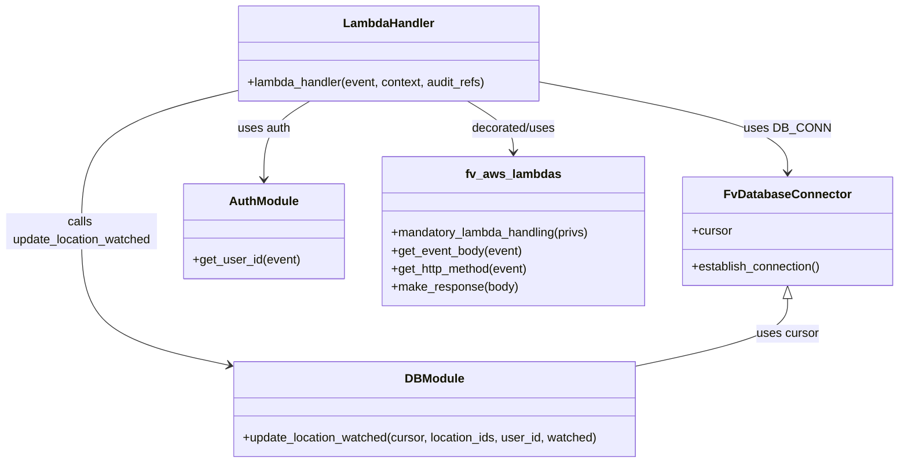

# Diagram: common/location_service/location_service/loc/lambdas/location/locations_watch.py


> Auto-generated by Obscura crawlers

## Diagram 1

```mermaid
flowchart TD
    A[HTTP Event] --> B[get_event_body(event) -> location_ids]
    B --> C{is list?}
    C -- No --> D[Raise BadRequestError: Body must be a list]
    C -- Yes --> E[get_http_method(event)]
    E --> F{method in POST or DELETE?}
    F -- No --> G[Raise BadRequestError: Method not allowed]
    F -- Yes --> H[Determine watched flag from resource path]
    H --> I[DB_CONN.establish_connection()]
    I --> J[db.update_location_watched(cursor, location_ids, user_id, watched)]
    J --> K[make_response({"message":"success"})]
    subgraph AuthFlow
        L[auth.get_user_id(event)] --> J
    end
```

> SVG rendering failed for this diagram.

## Diagram 2



### SVG

<svg id="container" width="1189.2890625" xmlns="http://www.w3.org/2000/svg" class="classDiagram" height="614" viewBox="0 0 1189.2890625 614" role="graphics-document document" aria-roledescription="class"><style>#container{font-family:"trebuchet ms",verdana,arial,sans-serif;font-size:16px;fill:#333;}@keyframes edge-animation-frame{from{stroke-dashoffset:0;}}@keyframes dash{to{stroke-dashoffset:0;}}#container .edge-animation-slow{stroke-dasharray:9,5!important;stroke-dashoffset:900;animation:dash 50s linear infinite;stroke-linecap:round;}#container .edge-animation-fast{stroke-dasharray:9,5!important;stroke-dashoffset:900;animation:dash 20s linear infinite;stroke-linecap:round;}#container .error-icon{fill:#552222;}#container .error-text{fill:#552222;stroke:#552222;}#container .edge-thickness-normal{stroke-width:1px;}#container .edge-thickness-thick{stroke-width:3.5px;}#container .edge-pattern-solid{stroke-dasharray:0;}#container .edge-thickness-invisible{stroke-width:0;fill:none;}#container .edge-pattern-dashed{stroke-dasharray:3;}#container .edge-pattern-dotted{stroke-dasharray:2;}#container .marker{fill:#333333;stroke:#333333;}#container .marker.cross{stroke:#333333;}#container svg{font-family:"trebuchet ms",verdana,arial,sans-serif;font-size:16px;}#container p{margin:0;}#container g.classGroup text{fill:#9370DB;stroke:none;font-family:"trebuchet ms",verdana,arial,sans-serif;font-size:10px;}#container g.classGroup text .title{font-weight:bolder;}#container .nodeLabel,#container .edgeLabel{color:#131300;}#container .edgeLabel .label rect{fill:#ECECFF;}#container .label text{fill:#131300;}#container .labelBkg{background:#ECECFF;}#container .edgeLabel .label span{background:#ECECFF;}#container .classTitle{font-weight:bolder;}#container .node rect,#container .node circle,#container .node ellipse,#container .node polygon,#container .node path{fill:#ECECFF;stroke:#9370DB;stroke-width:1px;}#container .divider{stroke:#9370DB;stroke-width:1;}#container g.clickable{cursor:pointer;}#container g.classGroup rect{fill:#ECECFF;stroke:#9370DB;}#container g.classGroup line{stroke:#9370DB;stroke-width:1;}#container .classLabel .box{stroke:none;stroke-width:0;fill:#ECECFF;opacity:0.5;}#container .classLabel .label{fill:#9370DB;font-size:10px;}#container .relation{stroke:#333333;stroke-width:1;fill:none;}#container .dashed-line{stroke-dasharray:3;}#container .dotted-line{stroke-dasharray:1 2;}#container #compositionStart,#container .composition{fill:#333333!important;stroke:#333333!important;stroke-width:1;}#container #compositionEnd,#container .composition{fill:#333333!important;stroke:#333333!important;stroke-width:1;}#container #dependencyStart,#container .dependency{fill:#333333!important;stroke:#333333!important;stroke-width:1;}#container #dependencyStart,#container .dependency{fill:#333333!important;stroke:#333333!important;stroke-width:1;}#container #extensionStart,#container .extension{fill:transparent!important;stroke:#333333!important;stroke-width:1;}#container #extensionEnd,#container .extension{fill:transparent!important;stroke:#333333!important;stroke-width:1;}#container #aggregationStart,#container .aggregation{fill:transparent!important;stroke:#333333!important;stroke-width:1;}#container #aggregationEnd,#container .aggregation{fill:transparent!important;stroke:#333333!important;stroke-width:1;}#container #lollipopStart,#container .lollipop{fill:#ECECFF!important;stroke:#333333!important;stroke-width:1;}#container #lollipopEnd,#container .lollipop{fill:#ECECFF!important;stroke:#333333!important;stroke-width:1;}#container .edgeTerminals{font-size:11px;line-height:initial;}#container .classTitleText{text-anchor:middle;font-size:18px;fill:#333;}#container .label-icon{display:inline-block;height:1em;overflow:visible;vertical-align:-0.125em;}#container .node .label-icon path{fill:currentColor;stroke:revert;stroke-width:revert;}#container :root{--mermaid-font-family:"trebuchet ms",verdana,arial,sans-serif;}</style><g><defs><marker id="container_class-aggregationStart" class="marker aggregation class" refX="18" refY="7" markerWidth="190" markerHeight="240" orient="auto"><path d="M 18,7 L9,13 L1,7 L9,1 Z"></path></marker></defs><defs><marker id="container_class-aggregationEnd" class="marker aggregation class" refX="1" refY="7" markerWidth="20" markerHeight="28" orient="auto"><path d="M 18,7 L9,13 L1,7 L9,1 Z"></path></marker></defs><defs><marker id="container_class-extensionStart" class="marker extension class" refX="18" refY="7" markerWidth="190" markerHeight="240" orient="auto"><path d="M 1,7 L18,13 V 1 Z"></path></marker></defs><defs><marker id="container_class-extensionEnd" class="marker extension class" refX="1" refY="7" markerWidth="20" markerHeight="28" orient="auto"><path d="M 1,1 V 13 L18,7 Z"></path></marker></defs><defs><marker id="container_class-compositionStart" class="marker composition class" refX="18" refY="7" markerWidth="190" markerHeight="240" orient="auto"><path d="M 18,7 L9,13 L1,7 L9,1 Z"></path></marker></defs><defs><marker id="container_class-compositionEnd" class="marker composition class" refX="1" refY="7" markerWidth="20" markerHeight="28" orient="auto"><path d="M 18,7 L9,13 L1,7 L9,1 Z"></path></marker></defs><defs><marker id="container_class-dependencyStart" class="marker dependency class" refX="6" refY="7" markerWidth="190" markerHeight="240" orient="auto"><path d="M 5,7 L9,13 L1,7 L9,1 Z"></path></marker></defs><defs><marker id="container_class-dependencyEnd" class="marker dependency class" refX="13" refY="7" markerWidth="20" markerHeight="28" orient="auto"><path d="M 18,7 L9,13 L14,7 L9,1 Z"></path></marker></defs><defs><marker id="container_class-lollipopStart" class="marker lollipop class" refX="13" refY="7" markerWidth="190" markerHeight="240" orient="auto"><circle stroke="black" fill="transparent" cx="7" cy="7" r="6"></circle></marker></defs><defs><marker id="container_class-lollipopEnd" class="marker lollipop class" refX="1" refY="7" markerWidth="190" markerHeight="240" orient="auto"><circle stroke="black" fill="transparent" cx="7" cy="7" r="6"></circle></marker></defs><g class="root"><g class="clusters"></g><g class="edgePaths"><path d="M715.461,109.141L770.051,119.451C824.642,129.76,933.823,150.38,988.413,170.357C1043.004,190.333,1043.004,209.667,1043.004,219.333L1043.004,229" id="id_LambdaHandler_FvDatabaseConnector_1" class="edge-thickness-normal edge-pattern-solid relation" style=";;;" data-edge="true" data-et="edge" data-id="id_LambdaHandler_FvDatabaseConnector_1" data-points="W3sieCI6NzE1LjQ2MDkzNzUsInkiOjEwOS4xNDA2MjYwMzc0MzI0MX0seyJ4IjoxMDQzLjAwMzkwNjI1LCJ5IjoxNzF9LHsieCI6MTA0My4wMDM5MDYyNSwieSI6MjM1fV0=" marker-end="url(#container_class-dependencyEnd)"></path><path d="M409.287,134L399.086,140.167C388.884,146.333,368.481,158.667,358.28,176C348.078,193.333,348.078,215.667,348.078,226.833L348.078,238" id="id_LambdaHandler_AuthModule_2" class="edge-thickness-normal edge-pattern-solid relation" style=";;;" data-edge="true" data-et="edge" data-id="id_LambdaHandler_AuthModule_2" data-points="W3sieCI6NDA5LjI4NzEwOTM3NSwieSI6MTM0fSx7IngiOjM0OC4wNzgxMjUsInkiOjE3MX0seyJ4IjozNDguMDc4MTI1LCJ5IjoyNDR9XQ==" marker-end="url(#container_class-dependencyEnd)"></path><path d="M311.555,120.803L277.629,129.169C243.703,137.535,175.852,154.268,141.926,185.3C108,216.333,108,261.667,108,307C108,352.333,108,397.667,140.097,427.199C172.193,456.731,236.387,470.462,268.483,477.328L300.58,484.193" id="id_LambdaHandler_DBModule_3" class="edge-thickness-normal edge-pattern-solid relation" style=";;;" data-edge="true" data-et="edge" data-id="id_LambdaHandler_DBModule_3" data-points="W3sieCI6MzExLjU1NDY4NzUsInkiOjEyMC44MDI1MjM4NDE2MzM3Nn0seyJ4IjoxMDgsInkiOjE3MX0seyJ4IjoxMDgsInkiOjMwN30seyJ4IjoxMDgsInkiOjQ0M30seyJ4IjozMDYuNDQ3MjY1NjI1LCJ5Ijo0ODUuNDQ4NDM1NjI2NTIyMjd9XQ==" marker-end="url(#container_class-dependencyEnd)"></path><path d="M617.729,134L627.93,140.167C638.132,146.333,658.535,158.667,668.736,170C678.938,181.333,678.938,191.667,678.938,196.833L678.938,202" id="id_LambdaHandler_fv_aws_lambdas_4" class="edge-thickness-normal edge-pattern-solid relation" style=";;;" data-edge="true" data-et="edge" data-id="id_LambdaHandler_fv_aws_lambdas_4" data-points="W3sieCI6NjE3LjcyODUxNTYyNSwieSI6MTM0fSx7IngiOjY3OC45Mzc1LCJ5IjoxNzF9LHsieCI6Njc4LjkzNzUsInkiOjIwOH1d" marker-end="url(#container_class-dependencyEnd)"></path><path d="M1043.004,396.25L1043.004,404.042C1043.004,411.833,1043.004,427.417,1009.929,442.283C976.855,457.149,910.706,471.299,877.631,478.374L844.557,485.448" id="id_FvDatabaseConnector_DBModule_5" class="edge-thickness-normal edge-pattern-solid relation" style=";;;" data-edge="true" data-et="edge" data-id="id_FvDatabaseConnector_DBModule_5" data-points="W3sieCI6MTA0My4wMDM5MDYyNSwieSI6Mzc5fSx7IngiOjEwNDMuMDAzOTA2MjUsInkiOjQ0M30seyJ4Ijo4NDQuNTU2NjQwNjI1LCJ5Ijo0ODUuNDQ4NDM1NjI2NTIyMjd9XQ==" marker-start="url(#container_class-extensionStart)"></path></g><g class="edgeLabels"><g class="edgeLabel" transform="translate(1043.00390625, 171)"><g class="label" data-id="id_LambdaHandler_FvDatabaseConnector_1" transform="translate(-53.09375, -12)"><foreignObject width="106.1875" height="24"><div xmlns="http://www.w3.org/1999/xhtml" class="labelBkg" style="display: table-cell; white-space: nowrap; line-height: 1.5; max-width: 200px; text-align: center;"><span class="edgeLabel"><p>uses DB_CONN</p></span></div></foreignObject></g></g><g class="edgeLabel" transform="translate(348.078125, 171)"><g class="label" data-id="id_LambdaHandler_AuthModule_2" transform="translate(-35.1953125, -12)"><foreignObject width="70.390625" height="24"><div xmlns="http://www.w3.org/1999/xhtml" class="labelBkg" style="display: table-cell; white-space: nowrap; line-height: 1.5; max-width: 200px; text-align: center;"><span class="edgeLabel"><p>uses auth</p></span></div></foreignObject></g></g><g class="edgeLabel" transform="translate(108, 307)"><g class="label" data-id="id_LambdaHandler_DBModule_3" transform="translate(-100, -24)"><foreignObject width="200" height="48"><div xmlns="http://www.w3.org/1999/xhtml" class="labelBkg" style="display: table; white-space: break-spaces; line-height: 1.5; max-width: 200px; text-align: center; width: 200px;"><span class="edgeLabel"><p>calls update_location_watched</p></span></div></foreignObject></g></g><g class="edgeLabel" transform="translate(678.9375, 171)"><g class="label" data-id="id_LambdaHandler_fv_aws_lambdas_4" transform="translate(-56.9609375, -12)"><foreignObject width="113.921875" height="24"><div xmlns="http://www.w3.org/1999/xhtml" class="labelBkg" style="display: table-cell; white-space: nowrap; line-height: 1.5; max-width: 200px; text-align: center;"><span class="edgeLabel"><p>decorated/uses</p></span></div></foreignObject></g></g><g class="edgeLabel" transform="translate(1043.00390625, 443)"><g class="label" data-id="id_FvDatabaseConnector_DBModule_5" transform="translate(-41.4765625, -12)"><foreignObject width="82.953125" height="24"><div xmlns="http://www.w3.org/1999/xhtml" class="labelBkg" style="display: table-cell; white-space: nowrap; line-height: 1.5; max-width: 200px; text-align: center;"><span class="edgeLabel"><p>uses cursor</p></span></div></foreignObject></g></g></g><g class="nodes"><g class="node default" id="classId-FvDatabaseConnector-0" transform="translate(1043.00390625, 307)"><g class="basic label-container"><path d="M-138.28515625 -72 L138.28515625 -72 L138.28515625 72 L-138.28515625 72" stroke="none" stroke-width="0" fill="#ECECFF" style=""></path><path d="M-138.28515625 -72 C-71.87229356192245 -72, -5.4594308738448944 -72, 138.28515625 -72 M-138.28515625 -72 C-67.65647475640178 -72, 2.9722067371964442 -72, 138.28515625 -72 M138.28515625 -72 C138.28515625 -28.8574083210914, 138.28515625 14.285183357817203, 138.28515625 72 M138.28515625 -72 C138.28515625 -40.36462145747985, 138.28515625 -8.729242914959698, 138.28515625 72 M138.28515625 72 C40.44448416148387 72, -57.39618792703226 72, -138.28515625 72 M138.28515625 72 C62.79356597077434 72, -12.698024308451323 72, -138.28515625 72 M-138.28515625 72 C-138.28515625 28.77255217827576, -138.28515625 -14.45489564344848, -138.28515625 -72 M-138.28515625 72 C-138.28515625 26.71186342881949, -138.28515625 -18.576273142361018, -138.28515625 -72" stroke="#9370DB" stroke-width="1.3" fill="none" stroke-dasharray="0 0" style=""></path></g><g class="annotation-group text" transform="translate(0, -48)"></g><g class="label-group text" transform="translate(-79.3046875, -48)"><g class="label" style="font-weight: bolder" transform="translate(0,-12)"><foreignObject width="158.609375" height="24"><div xmlns="http://www.w3.org/1999/xhtml" style="display: table-cell; white-space: nowrap; line-height: 1.5; max-width: 207px; text-align: center;"><span class="nodeLabel markdown-node-label" style=""><p>FvDatabaseConnector</p></span></div></foreignObject></g></g><g class="members-group text" transform="translate(-126.28515625, 0)"><g class="label" style="" transform="translate(0,-12)"><foreignObject width="53.71875" height="24"><div xmlns="http://www.w3.org/1999/xhtml" style="display: table-cell; white-space: nowrap; line-height: 1.5; max-width: 112px; text-align: center;"><span class="nodeLabel markdown-node-label" style=""><p>+cursor</p></span></div></foreignObject></g></g><g class="methods-group text" transform="translate(-126.28515625, 48)"><g class="label" style="" transform="translate(0,-12)"><foreignObject width="173.265625" height="24"><div xmlns="http://www.w3.org/1999/xhtml" style="display: table-cell; white-space: nowrap; line-height: 1.5; max-width: 231px; text-align: center;"><span class="nodeLabel markdown-node-label" style=""><p>+establish_connection()</p></span></div></foreignObject></g></g><g class="divider" style=""><path d="M-138.28515625 -24 C-36.48676490744175 -24, 65.3116264351165 -24, 138.28515625 -24 M-138.28515625 -24 C-39.24684394619693 -24, 59.791468357606135 -24, 138.28515625 -24" stroke="#9370DB" stroke-width="1.3" fill="none" stroke-dasharray="0 0" style=""></path></g><g class="divider" style=""><path d="M-138.28515625 24 C-37.78757812745731 24, 62.70999999508538 24, 138.28515625 24 M-138.28515625 24 C-28.435519775957232 24, 81.41411669808554 24, 138.28515625 24" stroke="#9370DB" stroke-width="1.3" fill="none" stroke-dasharray="0 0" style=""></path></g></g><g class="node default" id="classId-LambdaHandler-1" transform="translate(513.5078125, 71)"><g class="basic label-container"><path d="M-201.953125 -63 L201.953125 -63 L201.953125 63 L-201.953125 63" stroke="none" stroke-width="0" fill="#ECECFF" style=""></path><path d="M-201.953125 -63 C-94.40361460827064 -63, 13.145895783458712 -63, 201.953125 -63 M-201.953125 -63 C-54.23533266568046 -63, 93.48245966863908 -63, 201.953125 -63 M201.953125 -63 C201.953125 -25.331814867107433, 201.953125 12.336370265785135, 201.953125 63 M201.953125 -63 C201.953125 -24.872482498683993, 201.953125 13.255035002632013, 201.953125 63 M201.953125 63 C72.59857486484745 63, -56.7559752703051 63, -201.953125 63 M201.953125 63 C110.05188043246947 63, 18.15063586493895 63, -201.953125 63 M-201.953125 63 C-201.953125 29.178629461164256, -201.953125 -4.642741077671488, -201.953125 -63 M-201.953125 63 C-201.953125 17.637877534709908, -201.953125 -27.724244930580184, -201.953125 -63" stroke="#9370DB" stroke-width="1.3" fill="none" stroke-dasharray="0 0" style=""></path></g><g class="annotation-group text" transform="translate(0, -39)"></g><g class="label-group text" transform="translate(-58.21875, -39)"><g class="label" style="font-weight: bolder" transform="translate(0,-12)"><foreignObject width="116.4375" height="24"><div xmlns="http://www.w3.org/1999/xhtml" style="display: table-cell; white-space: nowrap; line-height: 1.5; max-width: 167px; text-align: center;"><span class="nodeLabel markdown-node-label" style=""><p>LambdaHandler</p></span></div></foreignObject></g></g><g class="members-group text" transform="translate(-189.953125, 9)"></g><g class="methods-group text" transform="translate(-189.953125, 39)"><g class="label" style="" transform="translate(0,-12)"><foreignObject width="321.6875" height="24"><div xmlns="http://www.w3.org/1999/xhtml" style="display: table-cell; white-space: nowrap; line-height: 1.5; max-width: 379px; text-align: center;"><span class="nodeLabel markdown-node-label" style=""><p>+lambda_handler(event, context, audit_refs)</p></span></div></foreignObject></g></g><g class="divider" style=""><path d="M-201.953125 -15 C-114.1078334297477 -15, -26.2625418594954 -15, 201.953125 -15 M-201.953125 -15 C-73.30462329591904 -15, 55.34387840816191 -15, 201.953125 -15" stroke="#9370DB" stroke-width="1.3" fill="none" stroke-dasharray="0 0" style=""></path></g><g class="divider" style=""><path d="M-201.953125 9 C-87.53775890498811 9, 26.87760719002378 9, 201.953125 9 M-201.953125 9 C-52.923208348558376 9, 96.10670830288325 9, 201.953125 9" stroke="#9370DB" stroke-width="1.3" fill="none" stroke-dasharray="0 0" style=""></path></g></g><g class="node default" id="classId-AuthModule-2" transform="translate(348.078125, 307)"><g class="basic label-container"><path d="M-105.078125 -63 L105.078125 -63 L105.078125 63 L-105.078125 63" stroke="none" stroke-width="0" fill="#ECECFF" style=""></path><path d="M-105.078125 -63 C-34.824261595698246 -63, 35.42960180860351 -63, 105.078125 -63 M-105.078125 -63 C-30.439226198191804 -63, 44.19967260361639 -63, 105.078125 -63 M105.078125 -63 C105.078125 -14.623760482320577, 105.078125 33.752479035358846, 105.078125 63 M105.078125 -63 C105.078125 -23.944370522079538, 105.078125 15.111258955840924, 105.078125 63 M105.078125 63 C45.08403282468464 63, -14.910059350630718 63, -105.078125 63 M105.078125 63 C49.631581223169 63, -5.814962553661999 63, -105.078125 63 M-105.078125 63 C-105.078125 36.782418425360135, -105.078125 10.564836850720276, -105.078125 -63 M-105.078125 63 C-105.078125 25.785268632579218, -105.078125 -11.429462734841564, -105.078125 -63" stroke="#9370DB" stroke-width="1.3" fill="none" stroke-dasharray="0 0" style=""></path></g><g class="annotation-group text" transform="translate(0, -39)"></g><g class="label-group text" transform="translate(-44.09375, -39)"><g class="label" style="font-weight: bolder" transform="translate(0,-12)"><foreignObject width="88.1875" height="24"><div xmlns="http://www.w3.org/1999/xhtml" style="display: table-cell; white-space: nowrap; line-height: 1.5; max-width: 138px; text-align: center;"><span class="nodeLabel markdown-node-label" style=""><p>AuthModule</p></span></div></foreignObject></g></g><g class="members-group text" transform="translate(-93.078125, 9)"></g><g class="methods-group text" transform="translate(-93.078125, 39)"><g class="label" style="" transform="translate(0,-12)"><foreignObject width="142.0625" height="24"><div xmlns="http://www.w3.org/1999/xhtml" style="display: table-cell; white-space: nowrap; line-height: 1.5; max-width: 199px; text-align: center;"><span class="nodeLabel markdown-node-label" style=""><p>+get_user_id(event)</p></span></div></foreignObject></g></g><g class="divider" style=""><path d="M-105.078125 -15 C-48.353802132107916 -15, 8.370520735784169 -15, 105.078125 -15 M-105.078125 -15 C-56.98647240051379 -15, -8.89481980102758 -15, 105.078125 -15" stroke="#9370DB" stroke-width="1.3" fill="none" stroke-dasharray="0 0" style=""></path></g><g class="divider" style=""><path d="M-105.078125 9 C-47.391342000686386 9, 10.295440998627228 9, 105.078125 9 M-105.078125 9 C-50.93631433401993 9, 3.205496331960134 9, 105.078125 9" stroke="#9370DB" stroke-width="1.3" fill="none" stroke-dasharray="0 0" style=""></path></g></g><g class="node default" id="classId-DBModule-3" transform="translate(575.501953125, 543)"><g class="basic label-container"><path d="M-269.0546875 -63 L269.0546875 -63 L269.0546875 63 L-269.0546875 63" stroke="none" stroke-width="0" fill="#ECECFF" style=""></path><path d="M-269.0546875 -63 C-115.35083845875934 -63, 38.35301058248132 -63, 269.0546875 -63 M-269.0546875 -63 C-149.66070063455362 -63, -30.26671376910724 -63, 269.0546875 -63 M269.0546875 -63 C269.0546875 -26.34843066892651, 269.0546875 10.303138662146978, 269.0546875 63 M269.0546875 -63 C269.0546875 -15.60107133560583, 269.0546875 31.79785732878834, 269.0546875 63 M269.0546875 63 C139.31069454167613 63, 9.566701583352256 63, -269.0546875 63 M269.0546875 63 C104.54220379282063 63, -59.97027991435874 63, -269.0546875 63 M-269.0546875 63 C-269.0546875 30.56983758784321, -269.0546875 -1.8603248243135795, -269.0546875 -63 M-269.0546875 63 C-269.0546875 14.99319606306166, -269.0546875 -33.01360787387668, -269.0546875 -63" stroke="#9370DB" stroke-width="1.3" fill="none" stroke-dasharray="0 0" style=""></path></g><g class="annotation-group text" transform="translate(0, -39)"></g><g class="label-group text" transform="translate(-37.234375, -39)"><g class="label" style="font-weight: bolder" transform="translate(0,-12)"><foreignObject width="74.46875" height="24"><div xmlns="http://www.w3.org/1999/xhtml" style="display: table-cell; white-space: nowrap; line-height: 1.5; max-width: 124px; text-align: center;"><span class="nodeLabel markdown-node-label" style=""><p>DBModule</p></span></div></foreignObject></g></g><g class="members-group text" transform="translate(-257.0546875, 9)"></g><g class="methods-group text" transform="translate(-257.0546875, 39)"><g class="label" style="" transform="translate(0,-12)"><foreignObject width="476.875" height="24"><div xmlns="http://www.w3.org/1999/xhtml" style="display: table-cell; white-space: nowrap; line-height: 1.5; max-width: 534px; text-align: center;"><span class="nodeLabel markdown-node-label" style=""><p>+update_location_watched(cursor, location_ids, user_id, watched)</p></span></div></foreignObject></g></g><g class="divider" style=""><path d="M-269.0546875 -15 C-87.8181227049129 -15, 93.41844209017421 -15, 269.0546875 -15 M-269.0546875 -15 C-140.98800234460322 -15, -12.921317189206434 -15, 269.0546875 -15" stroke="#9370DB" stroke-width="1.3" fill="none" stroke-dasharray="0 0" style=""></path></g><g class="divider" style=""><path d="M-269.0546875 9 C-137.9673335902607 9, -6.879979680521387 9, 269.0546875 9 M-269.0546875 9 C-149.93648290555535 9, -30.81827831111073 9, 269.0546875 9" stroke="#9370DB" stroke-width="1.3" fill="none" stroke-dasharray="0 0" style=""></path></g></g><g class="node default" id="classId-fv_aws_lambdas-4" transform="translate(678.9375, 307)"><g class="basic label-container"><path d="M-175.78125 -99 L175.78125 -99 L175.78125 99 L-175.78125 99" stroke="none" stroke-width="0" fill="#ECECFF" style=""></path><path d="M-175.78125 -99 C-70.57462809898443 -99, 34.63199380203113 -99, 175.78125 -99 M-175.78125 -99 C-80.42072540629849 -99, 14.939799187403025 -99, 175.78125 -99 M175.78125 -99 C175.78125 -27.34510749915667, 175.78125 44.30978500168666, 175.78125 99 M175.78125 -99 C175.78125 -36.09286245316671, 175.78125 26.81427509366658, 175.78125 99 M175.78125 99 C51.91628280467512 99, -71.94868439064976 99, -175.78125 99 M175.78125 99 C46.78278151809238 99, -82.21568696381524 99, -175.78125 99 M-175.78125 99 C-175.78125 36.725111129027034, -175.78125 -25.54977774194593, -175.78125 -99 M-175.78125 99 C-175.78125 22.57508517886025, -175.78125 -53.8498296422795, -175.78125 -99" stroke="#9370DB" stroke-width="1.3" fill="none" stroke-dasharray="0 0" style=""></path></g><g class="annotation-group text" transform="translate(0, -75)"></g><g class="label-group text" transform="translate(-60.0625, -75)"><g class="label" style="font-weight: bolder" transform="translate(0,-12)"><foreignObject width="120.125" height="24"><div xmlns="http://www.w3.org/1999/xhtml" style="display: table-cell; white-space: nowrap; line-height: 1.5; max-width: 168px; text-align: center;"><span class="nodeLabel markdown-node-label" style=""><p>fv_aws_lambdas</p></span></div></foreignObject></g></g><g class="members-group text" transform="translate(-163.78125, -27)"></g><g class="methods-group text" transform="translate(-163.78125, 3)"><g class="label" style="" transform="translate(0,-12)"><foreignObject width="267.5" height="24"><div xmlns="http://www.w3.org/1999/xhtml" style="display: table-cell; white-space: nowrap; line-height: 1.5; max-width: 325px; text-align: center;"><span class="nodeLabel markdown-node-label" style=""><p>+mandatory_lambda_handling(privs)</p></span></div></foreignObject></g><g class="label" style="" transform="translate(0,12)"><foreignObject width="174.203125" height="24"><div xmlns="http://www.w3.org/1999/xhtml" style="display: table-cell; white-space: nowrap; line-height: 1.5; max-width: 232px; text-align: center;"><span class="nodeLabel markdown-node-label" style=""><p>+get_event_body(event)</p></span></div></foreignObject></g><g class="label" style="" transform="translate(0,36)"><foreignObject width="184.5" height="24"><div xmlns="http://www.w3.org/1999/xhtml" style="display: table-cell; white-space: nowrap; line-height: 1.5; max-width: 242px; text-align: center;"><span class="nodeLabel markdown-node-label" style=""><p>+get_http_method(event)</p></span></div></foreignObject></g><g class="label" style="" transform="translate(0,60)"><foreignObject width="168.140625" height="24"><div xmlns="http://www.w3.org/1999/xhtml" style="display: table-cell; white-space: nowrap; line-height: 1.5; max-width: 226px; text-align: center;"><span class="nodeLabel markdown-node-label" style=""><p>+make_response(body)</p></span></div></foreignObject></g></g><g class="divider" style=""><path d="M-175.78125 -51 C-100.48690222062545 -51, -25.192554441250905 -51, 175.78125 -51 M-175.78125 -51 C-75.29851685515301 -51, 25.18421628969398 -51, 175.78125 -51" stroke="#9370DB" stroke-width="1.3" fill="none" stroke-dasharray="0 0" style=""></path></g><g class="divider" style=""><path d="M-175.78125 -27 C-42.446304257840126 -27, 90.88864148431975 -27, 175.78125 -27 M-175.78125 -27 C-67.99315515158497 -27, 39.794939696830056 -27, 175.78125 -27" stroke="#9370DB" stroke-width="1.3" fill="none" stroke-dasharray="0 0" style=""></path></g></g></g></g></g></svg>
