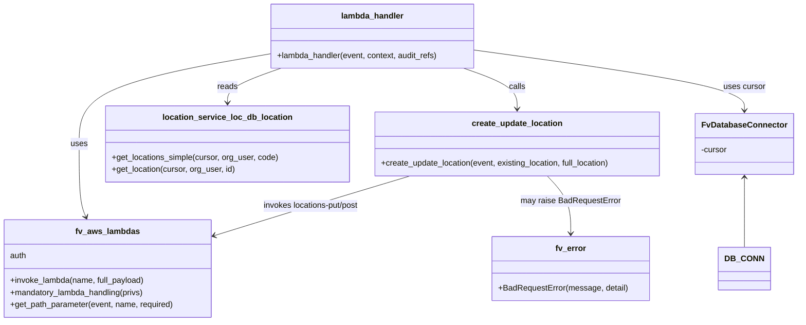
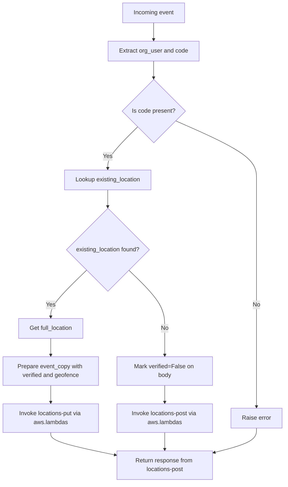

# Diagram: common/location_service/location_service/loc/lambdas/registered/registered_put.py

> Auto-generated by Obscura crawlers

## Diagram 1

### SVG

<svg id="container" width="1561.88671875" xmlns="http://www.w3.org/2000/svg" class="classDiagram" height="632" viewBox="0 0 1561.88671875 632" role="graphics-document document" aria-roledescription="class"><g><defs><marker id="container_class-aggregationStart" class="marker aggregation class" refX="18" refY="7" markerWidth="190" markerHeight="240" orient="auto"><path d="M 18,7 L9,13 L1,7 L9,1 Z"></path></marker></defs><defs><marker id="container_class-aggregationEnd" class="marker aggregation class" refX="1" refY="7" markerWidth="20" markerHeight="28" orient="auto"><path d="M 18,7 L9,13 L1,7 L9,1 Z"></path></marker></defs><defs><marker id="container_class-extensionStart" class="marker extension class" refX="18" refY="7" markerWidth="190" markerHeight="240" orient="auto"><path d="M 1,7 L18,13 V 1 Z"></path></marker></defs><defs><marker id="container_class-extensionEnd" class="marker extension class" refX="1" refY="7" markerWidth="20" markerHeight="28" orient="auto"><path d="M 1,1 V 13 L18,7 Z"></path></marker></defs><defs><marker id="container_class-compositionStart" class="marker composition class" refX="18" refY="7" markerWidth="190" markerHeight="240" orient="auto"><path d="M 18,7 L9,13 L1,7 L9,1 Z"></path></marker></defs><defs><marker id="container_class-compositionEnd" class="marker composition class" refX="1" refY="7" markerWidth="20" markerHeight="28" orient="auto"><path d="M 18,7 L9,13 L1,7 L9,1 Z"></path></marker></defs><defs><marker id="container_class-dependencyStart" class="marker dependency class" refX="6" refY="7" markerWidth="190" markerHeight="240" orient="auto"><path d="M 5,7 L9,13 L1,7 L9,1 Z"></path></marker></defs><defs><marker id="container_class-dependencyEnd" class="marker dependency class" refX="13" refY="7" markerWidth="20" markerHeight="28" orient="auto"><path d="M 18,7 L9,13 L14,7 L9,1 Z"></path></marker></defs><defs><marker id="container_class-lollipopStart" class="marker lollipop class" refX="13" refY="7" markerWidth="190" markerHeight="240" orient="auto"><circle stroke="black" fill="transparent" cx="7" cy="7" r="6"></circle></marker></defs><defs><marker id="container_class-lollipopEnd" class="marker lollipop class" refX="1" refY="7" markerWidth="190" markerHeight="240" orient="auto"><circle stroke="black" fill="transparent" cx="7" cy="7" r="6"></circle></marker></defs><g class="root"><g class="clusters"></g><g class="edgePaths"><path d="M1462.582,349L1462.582,356.667C1462.582,364.333,1462.582,379.667,1462.582,402.5C1462.582,425.333,1462.582,455.667,1462.582,470.833L1462.582,486" id="id_FvDatabaseConnector_DB_CONN_1" class="edge-thickness-normal edge-pattern-solid relation" style=";;;" data-edge="true" data-et="edge" data-id="id_FvDatabaseConnector_DB_CONN_1" data-points="W3sieCI6MTQ2Mi41ODIwMzEyNSwieSI6MzQzfSx7IngiOjE0NjIuNTgyMDMxMjUsInkiOjM5NX0seyJ4IjoxNDYyLjU4MjAzMTI1LCJ5Ijo0ODZ9XQ==" marker-start="url(#container_class-dependencyStart)"></path><path d="M526.441,106.207L464.229,117.006C402.017,127.805,277.592,149.402,215.38,178.868C153.168,208.333,153.168,245.667,153.168,283C153.168,320.333,153.168,357.667,155.507,381.586C157.846,405.506,162.523,416.012,164.862,421.266L167.201,426.519" id="id_lambda_handler_fv_aws_lambdas_2" class="edge-thickness-normal edge-pattern-solid relation" style=";;;" data-edge="true" data-et="edge" data-id="id_lambda_handler_fv_aws_lambdas_2" data-points="W3sieCI6NTI2LjQ0MTQwNjI1LCJ5IjoxMDYuMjA3NDQ3NjM4MDMyODZ9LHsieCI6MTUzLjE2Nzk2ODc1LCJ5IjoxNzF9LHsieCI6MTUzLjE2Nzk2ODc1LCJ5IjoyODN9LHsieCI6MTUzLjE2Nzk2ODc1LCJ5IjozOTV9LHsieCI6MTY5LjY0MTI3MTE0NjYxNjUzLCJ5Ijo0MzJ9XQ==" marker-end="url(#container_class-dependencyEnd)"></path><path d="M548.633,134L530.952,140.167C513.27,146.333,477.906,158.667,460.225,170C442.543,181.333,442.543,191.667,442.543,196.833L442.543,202" id="id_lambda_handler_location_service_loc_db_location_3" class="edge-thickness-normal edge-pattern-solid relation" style=";;;" data-edge="true" data-et="edge" data-id="id_lambda_handler_location_service_loc_db_location_3" data-points="W3sieCI6NTQ4LjYzMzI0MjE4NzUsInkiOjEzNH0seyJ4Ijo0NDIuNTQyOTY4NzUsInkiOjE3MX0seyJ4Ijo0NDIuNTQyOTY4NzUsInkiOjIwOH1d" marker-end="url(#container_class-dependencyEnd)"></path><path d="M806.64,346L779.5,354.167C752.36,362.333,698.08,378.667,634.057,398.204C570.034,417.741,496.266,440.483,459.383,451.853L422.499,463.224" id="id_create_update_location_fv_aws_lambdas_4" class="edge-thickness-normal edge-pattern-solid relation" style=";;;" data-edge="true" data-et="edge" data-id="id_create_update_location_fv_aws_lambdas_4" data-points="W3sieCI6ODA2LjYzOTY0ODQzNzUsInkiOjM0Nn0seyJ4Ijo2NDMuODAwNzgxMjUsInkiOjM5NX0seyJ4Ijo0MTYuNzY1NjI1LCJ5Ijo0NjQuOTkxNjk3MDc0NTA5MDN9XQ==" marker-end="url(#container_class-dependencyEnd)"></path><path d="M1076.925,346L1084.823,354.167C1092.72,362.333,1108.514,378.667,1116.411,397.5C1124.309,416.333,1124.309,437.667,1124.309,448.333L1124.309,459" id="id_create_update_location_fv_error_5" class="edge-thickness-normal edge-pattern-solid relation" style=";;;" data-edge="true" data-et="edge" data-id="id_create_update_location_fv_error_5" data-points="W3sieCI6MTA3Ni45MjUyOTI5Njg3NSwieSI6MzQ2fSx7IngiOjExMjQuMzA4NTkzNzUsInkiOjM5NX0seyJ4IjoxMTI0LjMwODU5Mzc1LCJ5Ijo0NjV9XQ==" marker-end="url(#container_class-dependencyEnd)"></path><path d="M909.914,134L927.595,140.167C945.277,146.333,980.64,158.667,998.322,172C1016.004,185.333,1016.004,199.667,1016.004,206.833L1016.004,214" id="id_lambda_handler_create_update_location_6" class="edge-thickness-normal edge-pattern-solid relation" style=";;;" data-edge="true" data-et="edge" data-id="id_lambda_handler_create_update_location_6" data-points="W3sieCI6OTA5LjkxMzYzMjgxMjUsInkiOjEzNH0seyJ4IjoxMDE2LjAwMzkwNjI1LCJ5IjoxNzF9LHsieCI6MTAxNi4wMDM5MDYyNSwieSI6MjIwfV0=" marker-end="url(#container_class-dependencyEnd)"></path><path d="M932.105,98.66L1020.518,110.717C1108.931,122.773,1285.757,146.887,1374.169,166.61C1462.582,186.333,1462.582,201.667,1462.582,209.333L1462.582,217" id="id_lambda_handler_FvDatabaseConnector_7" class="edge-thickness-normal edge-pattern-solid relation" style=";;;" data-edge="true" data-et="edge" data-id="id_lambda_handler_FvDatabaseConnector_7" data-points="W3sieCI6OTMyLjEwNTQ2ODc1LCJ5Ijo5OC42NTk4NDY0NzkxOTU4NX0seyJ4IjoxNDYyLjU4MjAzMTI1LCJ5IjoxNzF9LHsieCI6MTQ2Mi41ODIwMzEyNSwieSI6MjIzfV0=" marker-end="url(#container_class-dependencyEnd)"></path></g><g class="edgeLabels"><g class="edgeLabel"><g class="label" data-id="id_FvDatabaseConnector_DB_CONN_1" transform="translate(0, 0)"><foreignObject width="0" height="0">

</foreignObject></g></g><g class="edgeLabel" transform="translate(153.16796875, 283)"><g class="label" data-id="id_lambda_handler_fv_aws_lambdas_2" transform="translate(-16.4921875, -12)"><foreignObject width="32.984375" height="24">

uses

</foreignObject></g></g><g class="edgeLabel" transform="translate(442.54296875, 171)"><g class="label" data-id="id_lambda_handler_location_service_loc_db_location_3" transform="translate(-20.0078125, -12)"><foreignObject width="40.015625" height="24">

reads

</foreignObject></g></g><g class="edgeLabel" transform="translate(611.53544, 404.94694)"><g class="label" data-id="id_create_update_location_fv_aws_lambdas_4" transform="translate(-98.4296875, -12)"><foreignObject width="196.859375" height="24">

invokes locations-put/post

</foreignObject></g></g><g class="edgeLabel" transform="translate(1124.30859375, 395)"><g class="label" data-id="id_create_update_location_fv_error_5" transform="translate(-98.1796875, -12)"><foreignObject width="196.359375" height="24">

may raise BadRequestError

</foreignObject></g></g><g class="edgeLabel" transform="translate(1016.00390625, 171)"><g class="label" data-id="id_lambda_handler_create_update_location_6" transform="translate(-16.4453125, -12)"><foreignObject width="32.890625" height="24">

calls

</foreignObject></g></g><g class="edgeLabel" transform="translate(1462.58203125, 171)"><g class="label" data-id="id_lambda_handler_FvDatabaseConnector_7" transform="translate(-41.4765625, -12)"><foreignObject width="82.953125" height="24">

uses cursor

</foreignObject></g></g></g><g class="nodes"><g class="node default" id="classId-FvDatabaseConnector-0" transform="translate(1462.58203125, 283)"><g class="basic label-container"><path d="M-91.3046875 -60 L91.3046875 -60 L91.3046875 60 L-91.3046875 60" stroke="none" stroke-width="0" fill="#ECECFF" style=""></path><path d="M-91.3046875 -60 C-30.911450536646065 -60, 29.48178642670787 -60, 91.3046875 -60 M-91.3046875 -60 C-54.3832206074943 -60, -17.461753714988603 -60, 91.3046875 -60 M91.3046875 -60 C91.3046875 -33.9230661704904, 91.3046875 -7.846132340980795, 91.3046875 60 M91.3046875 -60 C91.3046875 -34.86015259769884, 91.3046875 -9.720305195397678, 91.3046875 60 M91.3046875 60 C29.02381801291625 60, -33.2570514741675 60, -91.3046875 60 M91.3046875 60 C29.078457721046995 60, -33.14777205790601 60, -91.3046875 60 M-91.3046875 60 C-91.3046875 20.51208787485676, -91.3046875 -18.97582425028648, -91.3046875 -60 M-91.3046875 60 C-91.3046875 26.60649314961119, -91.3046875 -6.787013700777621, -91.3046875 -60" stroke="#9370DB" stroke-width="1.3" fill="none" stroke-dasharray="0 0" style=""></path></g><g class="annotation-group text" transform="translate(0, -36)"></g><g class="label-group text" transform="translate(-79.3046875, -36)"><g class="label" style="font-weight: bolder" transform="translate(0,-12)"><foreignObject width="158.609375" height="24">

FvDatabaseConnector

</foreignObject></g></g><g class="members-group text" transform="translate(-79.3046875, 12)"><g class="label" style="" transform="translate(0,-12)"><foreignObject width="52.1875" height="24">

-cursor

</foreignObject></g></g><g class="methods-group text" transform="translate(-79.3046875, 60)"></g><g class="divider" style=""><path d="M-91.3046875 -12 C-35.94155488092492 -12, 19.421577738150162 -12, 91.3046875 -12 M-91.3046875 -12 C-47.34645916412912 -12, -3.3882308282582443 -12, 91.3046875 -12" stroke="#9370DB" stroke-width="1.3" fill="none" stroke-dasharray="0 0" style=""></path></g><g class="divider" style=""><path d="M-91.3046875 36 C-50.202095821073044 36, -9.099504142146088 36, 91.3046875 36 M-91.3046875 36 C-30.515663427371656 36, 30.273360645256687 36, 91.3046875 36" stroke="#9370DB" stroke-width="1.3" fill="none" stroke-dasharray="0 0" style=""></path></g></g><g class="node default" id="classId-location_service_loc_db_location-1" transform="translate(442.54296875, 283)"><g class="basic label-container"><path d="M-237.8828125 -75 L237.8828125 -75 L237.8828125 75 L-237.8828125 75" stroke="none" stroke-width="0" fill="#ECECFF" style=""></path><path d="M-237.8828125 -75 C-48.1730680590976 -75, 141.5366763818048 -75, 237.8828125 -75 M-237.8828125 -75 C-75.98220997696177 -75, 85.91839254607646 -75, 237.8828125 -75 M237.8828125 -75 C237.8828125 -27.316575447277593, 237.8828125 20.366849105444814, 237.8828125 75 M237.8828125 -75 C237.8828125 -18.833641997418837, 237.8828125 37.332716005162325, 237.8828125 75 M237.8828125 75 C47.758758619949106 75, -142.3652952601018 75, -237.8828125 75 M237.8828125 75 C103.44864091816734 75, -30.985530663665315 75, -237.8828125 75 M-237.8828125 75 C-237.8828125 18.793554089564964, -237.8828125 -37.41289182087007, -237.8828125 -75 M-237.8828125 75 C-237.8828125 41.99548756188928, -237.8828125 8.990975123778554, -237.8828125 -75" stroke="#9370DB" stroke-width="1.3" fill="none" stroke-dasharray="0 0" style=""></path></g><g class="annotation-group text" transform="translate(0, -51)"></g><g class="label-group text" transform="translate(-121.90625, -51)"><g class="label" style="font-weight: bolder" transform="translate(0,-12)"><foreignObject width="243.8125" height="24">

location_service_loc_db_location

</foreignObject></g></g><g class="members-group text" transform="translate(-225.8828125, -3)"></g><g class="methods-group text" transform="translate(-225.8828125, 27)"><g class="label" style="" transform="translate(0,-12)"><foreignObject width="329.859375" height="24">

+get_locations_simple(cursor, org_user, code)

</foreignObject></g><g class="label" style="" transform="translate(0,12)"><foreignObject width="244.984375" height="24">

+get_location(cursor, org_user, id)

</foreignObject></g></g><g class="divider" style=""><path d="M-237.8828125 -27 C-79.81677533248617 -27, 78.24926183502765 -27, 237.8828125 -27 M-237.8828125 -27 C-132.1821720132058 -27, -26.4815315264116 -27, 237.8828125 -27" stroke="#9370DB" stroke-width="1.3" fill="none" stroke-dasharray="0 0" style=""></path></g><g class="divider" style=""><path d="M-237.8828125 -3 C-103.29354481511444 -3, 31.29572286977111 -3, 237.8828125 -3 M-237.8828125 -3 C-117.13286985065301 -3, 3.6170727986939823 -3, 237.8828125 -3" stroke="#9370DB" stroke-width="1.3" fill="none" stroke-dasharray="0 0" style=""></path></g></g><g class="node default" id="classId-fv_aws_lambdas-2" transform="translate(212.3828125, 528)"><g class="basic label-container"><path d="M-204.3828125 -96 L204.3828125 -96 L204.3828125 96 L-204.3828125 96" stroke="none" stroke-width="0" fill="#ECECFF" style=""></path><path d="M-204.3828125 -96 C-54.942415170278224 -96, 94.49798215944355 -96, 204.3828125 -96 M-204.3828125 -96 C-77.54428093428095 -96, 49.2942506314381 -96, 204.3828125 -96 M204.3828125 -96 C204.3828125 -19.242608401249754, 204.3828125 57.51478319750049, 204.3828125 96 M204.3828125 -96 C204.3828125 -48.52535073271834, 204.3828125 -1.0507014654366742, 204.3828125 96 M204.3828125 96 C79.91269483166813 96, -44.55742283666373 96, -204.3828125 96 M204.3828125 96 C100.6532807182966 96, -3.0762510634068008 96, -204.3828125 96 M-204.3828125 96 C-204.3828125 37.622384044431314, -204.3828125 -20.755231911137372, -204.3828125 -96 M-204.3828125 96 C-204.3828125 37.38402874275572, -204.3828125 -21.231942514488566, -204.3828125 -96" stroke="#9370DB" stroke-width="1.3" fill="none" stroke-dasharray="0 0" style=""></path></g><g class="annotation-group text" transform="translate(0, -72)"></g><g class="label-group text" transform="translate(-60.0625, -72)"><g class="label" style="font-weight: bolder" transform="translate(0,-12)"><foreignObject width="120.125" height="24">

fv_aws_lambdas

</foreignObject></g></g><g class="members-group text" transform="translate(-192.3828125, -24)"><g class="label" style="" transform="translate(0,-12)"><foreignObject width="33.171875" height="24">

auth

</foreignObject></g></g><g class="methods-group text" transform="translate(-192.3828125, 24)"><g class="label" style="" transform="translate(0,-12)"><foreignObject width="267.234375" height="24">

+invoke_lambda(name, full_payload)

</foreignObject></g><g class="label" style="" transform="translate(0,12)"><foreignObject width="267.5" height="24">

+mandatory_lambda_handling(privs)

</foreignObject></g><g class="label" style="" transform="translate(0,36)"><foreignObject width="324.703125" height="24">

+get_path_parameter(event, name, required)

</foreignObject></g></g><g class="divider" style=""><path d="M-204.3828125 -48 C-75.95733600522536 -48, 52.468140489549285 -48, 204.3828125 -48 M-204.3828125 -48 C-49.97989683903555 -48, 104.4230188219289 -48, 204.3828125 -48" stroke="#9370DB" stroke-width="1.3" fill="none" stroke-dasharray="0 0" style=""></path></g><g class="divider" style=""><path d="M-204.3828125 0 C-59.334553409036175 0, 85.71370568192765 0, 204.3828125 0 M-204.3828125 0 C-49.42026472190676 0, 105.54228305618648 0, 204.3828125 0" stroke="#9370DB" stroke-width="1.3" fill="none" stroke-dasharray="0 0" style=""></path></g></g><g class="node default" id="classId-fv_error-3" transform="translate(1124.30859375, 528)"><g class="basic label-container"><path d="M-153.2578125 -63 L153.2578125 -63 L153.2578125 63 L-153.2578125 63" stroke="none" stroke-width="0" fill="#ECECFF" style=""></path><path d="M-153.2578125 -63 C-86.14340596284308 -63, -19.028999425686152 -63, 153.2578125 -63 M-153.2578125 -63 C-83.4906645065183 -63, -13.7235165130366 -63, 153.2578125 -63 M153.2578125 -63 C153.2578125 -19.348756378487955, 153.2578125 24.30248724302409, 153.2578125 63 M153.2578125 -63 C153.2578125 -17.474582482588687, 153.2578125 28.050835034822626, 153.2578125 63 M153.2578125 63 C38.768980516152965 63, -75.71985146769407 63, -153.2578125 63 M153.2578125 63 C45.21073873809371 63, -62.83633502381258 63, -153.2578125 63 M-153.2578125 63 C-153.2578125 13.075582238461998, -153.2578125 -36.848835523076005, -153.2578125 -63 M-153.2578125 63 C-153.2578125 30.19111547146108, -153.2578125 -2.6177690570778367, -153.2578125 -63" stroke="#9370DB" stroke-width="1.3" fill="none" stroke-dasharray="0 0" style=""></path></g><g class="annotation-group text" transform="translate(0, -39)"></g><g class="label-group text" transform="translate(-29.1875, -39)"><g class="label" style="font-weight: bolder" transform="translate(0,-12)"><foreignObject width="58.375" height="24">

fv_error

</foreignObject></g></g><g class="members-group text" transform="translate(-141.2578125, 9)"></g><g class="methods-group text" transform="translate(-141.2578125, 39)"><g class="label" style="" transform="translate(0,-12)"><foreignObject width="253.328125" height="24">

+BadRequestError(message, detail)

</foreignObject></g></g><g class="divider" style=""><path d="M-153.2578125 -15 C-57.50011311062302 -15, 38.25758627875396 -15, 153.2578125 -15 M-153.2578125 -15 C-69.82622705771458 -15, 13.605358384570849 -15, 153.2578125 -15" stroke="#9370DB" stroke-width="1.3" fill="none" stroke-dasharray="0 0" style=""></path></g><g class="divider" style=""><path d="M-153.2578125 9 C-52.57694465092483 9, 48.10392319815034 9, 153.2578125 9 M-153.2578125 9 C-81.13337978507371 9, -9.008947070147428 9, 153.2578125 9" stroke="#9370DB" stroke-width="1.3" fill="none" stroke-dasharray="0 0" style=""></path></g></g><g class="node default" id="classId-create_update_location-4" transform="translate(1016.00390625, 283)"><g class="basic label-container"><path d="M-285.578125 -63 L285.578125 -63 L285.578125 63 L-285.578125 63" stroke="none" stroke-width="0" fill="#ECECFF" style=""></path><path d="M-285.578125 -63 C-89.53465326125558 -63, 106.50881847748883 -63, 285.578125 -63 M-285.578125 -63 C-116.1462218466977 -63, 53.2856813066046 -63, 285.578125 -63 M285.578125 -63 C285.578125 -16.552721315008178, 285.578125 29.894557369983644, 285.578125 63 M285.578125 -63 C285.578125 -36.230742966874686, 285.578125 -9.461485933749373, 285.578125 63 M285.578125 63 C88.73754538182502 63, -108.10303423634997 63, -285.578125 63 M285.578125 63 C92.52755030729429 63, -100.52302438541142 63, -285.578125 63 M-285.578125 63 C-285.578125 13.04340695103047, -285.578125 -36.91318609793906, -285.578125 -63 M-285.578125 63 C-285.578125 29.487043837570205, -285.578125 -4.02591232485959, -285.578125 -63" stroke="#9370DB" stroke-width="1.3" fill="none" stroke-dasharray="0 0" style=""></path></g><g class="annotation-group text" transform="translate(0, -39)"></g><g class="label-group text" transform="translate(-86.3125, -39)"><g class="label" style="font-weight: bolder" transform="translate(0,-12)"><foreignObject width="172.625" height="24">

create_update_location

</foreignObject></g></g><g class="members-group text" transform="translate(-273.578125, 9)"></g><g class="methods-group text" transform="translate(-273.578125, 39)"><g class="label" style="" transform="translate(0,-12)"><foreignObject width="460.84375" height="24">

+create_update_location(event, existing_location, full_location)

</foreignObject></g></g><g class="divider" style=""><path d="M-285.578125 -15 C-88.83726730312964 -15, 107.90359039374073 -15, 285.578125 -15 M-285.578125 -15 C-72.0555260425057 -15, 141.4670729149886 -15, 285.578125 -15" stroke="#9370DB" stroke-width="1.3" fill="none" stroke-dasharray="0 0" style=""></path></g><g class="divider" style=""><path d="M-285.578125 9 C-71.45537143190063 9, 142.66738213619874 9, 285.578125 9 M-285.578125 9 C-144.300459281694 9, -3.0227935633880065 9, 285.578125 9" stroke="#9370DB" stroke-width="1.3" fill="none" stroke-dasharray="0 0" style=""></path></g></g><g class="node default" id="classId-lambda_handler-5" transform="translate(729.2734375, 71)"><g class="basic label-container"><path d="M-202.83203125 -63 L202.83203125 -63 L202.83203125 63 L-202.83203125 63" stroke="none" stroke-width="0" fill="#ECECFF" style=""></path><path d="M-202.83203125 -63 C-87.84448148727809 -63, 27.143068275443824 -63, 202.83203125 -63 M-202.83203125 -63 C-54.98178071948058 -63, 92.86846981103884 -63, 202.83203125 -63 M202.83203125 -63 C202.83203125 -36.79540572282223, 202.83203125 -10.590811445644462, 202.83203125 63 M202.83203125 -63 C202.83203125 -24.367018805254446, 202.83203125 14.265962389491108, 202.83203125 63 M202.83203125 63 C109.93986323401697 63, 17.047695218033937 63, -202.83203125 63 M202.83203125 63 C112.26463589054435 63, 21.69724053108871 63, -202.83203125 63 M-202.83203125 63 C-202.83203125 20.916581249309267, -202.83203125 -21.166837501381465, -202.83203125 -63 M-202.83203125 63 C-202.83203125 26.913507399682366, -202.83203125 -9.172985200635267, -202.83203125 -63" stroke="#9370DB" stroke-width="1.3" fill="none" stroke-dasharray="0 0" style=""></path></g><g class="annotation-group text" transform="translate(0, -39)"></g><g class="label-group text" transform="translate(-59.9765625, -39)"><g class="label" style="font-weight: bolder" transform="translate(0,-12)"><foreignObject width="119.953125" height="24">

lambda_handler

</foreignObject></g></g><g class="members-group text" transform="translate(-190.83203125, 9)"></g><g class="methods-group text" transform="translate(-190.83203125, 39)"><g class="label" style="" transform="translate(0,-12)"><foreignObject width="321.6875" height="24">

+lambda_handler(event, context, audit_refs)

</foreignObject></g></g><g class="divider" style=""><path d="M-202.83203125 -15 C-87.77923931507426 -15, 27.273552619851472 -15, 202.83203125 -15 M-202.83203125 -15 C-46.425343600174244 -15, 109.98134404965151 -15, 202.83203125 -15" stroke="#9370DB" stroke-width="1.3" fill="none" stroke-dasharray="0 0" style=""></path></g><g class="divider" style=""><path d="M-202.83203125 9 C-109.1380834907626 9, -15.444135731525193 9, 202.83203125 9 M-202.83203125 9 C-75.52936190432482 9, 51.77330744135037 9, 202.83203125 9" stroke="#9370DB" stroke-width="1.3" fill="none" stroke-dasharray="0 0" style=""></path></g></g><g class="node default" id="classId-DB_CONN-6" transform="translate(1462.58203125, 528)"><g class="basic label-container"><path d="M-46.40625 -42 L46.40625 -42 L46.40625 42 L-46.40625 42" stroke="none" stroke-width="0" fill="#ECECFF" style=""></path><path d="M-46.40625 -42 C-11.71492582246303 -42, 22.97639835507394 -42, 46.40625 -42 M-46.40625 -42 C-11.045435170565852 -42, 24.315379658868295 -42, 46.40625 -42 M46.40625 -42 C46.40625 -11.92114046927129, 46.40625 18.15771906145742, 46.40625 42 M46.40625 -42 C46.40625 -15.985095428517539, 46.40625 10.029809142964922, 46.40625 42 M46.40625 42 C17.50183096113946 42, -11.402588077721077 42, -46.40625 42 M46.40625 42 C17.977170997571044 42, -10.451908004857913 42, -46.40625 42 M-46.40625 42 C-46.40625 19.298781569532096, -46.40625 -3.4024368609358078, -46.40625 -42 M-46.40625 42 C-46.40625 22.745973600926035, -46.40625 3.4919472018520707, -46.40625 -42" stroke="#9370DB" stroke-width="1.3" fill="none" stroke-dasharray="0 0" style=""></path></g><g class="annotation-group text" transform="translate(0, -18)"></g><g class="label-group text" transform="translate(-34.40625, -18)"><g class="label" style="font-weight: bolder" transform="translate(0,-12)"><foreignObject width="68.8125" height="24">

DB_CONN

</foreignObject></g></g><g class="members-group text" transform="translate(-34.40625, 30)"></g><g class="methods-group text" transform="translate(-34.40625, 60)"></g><g class="divider" style=""><path d="M-46.40625 6 C-14.126977202698328 6, 18.152295594603345 6, 46.40625 6 M-46.40625 6 C-12.128338131467494 6, 22.149573737065012 6, 46.40625 6" stroke="#9370DB" stroke-width="1.3" fill="none" stroke-dasharray="0 0" style=""></path></g><g class="divider" style=""><path d="M-46.40625 24 C-20.679568610970932 24, 5.0471127780581355 24, 46.40625 24 M-46.40625 24 C-17.617895754372704 24, 11.170458491254593 24, 46.40625 24" stroke="#9370DB" stroke-width="1.3" fill="none" stroke-dasharray="0 0" style=""></path></g></g></g></g></g></svg>

## Diagram 2

### SVG

<svg id="container" width="775.28125" xmlns="http://www.w3.org/2000/svg" class="flowchart" height="1317.84375" viewBox="0 0 775.28125 1317.84375" role="graphics-document document" aria-roledescription="flowchart-v2"><g><marker id="container_flowchart-v2-pointEnd" class="marker flowchart-v2" viewBox="0 0 10 10" refX="5" refY="5" markerUnits="userSpaceOnUse" markerWidth="8" markerHeight="8" orient="auto"><path d="M 0 0 L 10 5 L 0 10 z" class="arrowMarkerPath" style="stroke-width: 1; stroke-dasharray: 1, 0;"></path></marker><marker id="container_flowchart-v2-pointStart" class="marker flowchart-v2" viewBox="0 0 10 10" refX="4.5" refY="5" markerUnits="userSpaceOnUse" markerWidth="8" markerHeight="8" orient="auto"><path d="M 0 5 L 10 10 L 10 0 z" class="arrowMarkerPath" style="stroke-width: 1; stroke-dasharray: 1, 0;"></path></marker><marker id="container_flowchart-v2-circleEnd" class="marker flowchart-v2" viewBox="0 0 10 10" refX="11" refY="5" markerUnits="userSpaceOnUse" markerWidth="11" markerHeight="11" orient="auto"><circle cx="5" cy="5" r="5" class="arrowMarkerPath" style="stroke-width: 1; stroke-dasharray: 1, 0;"></circle></marker><marker id="container_flowchart-v2-circleStart" class="marker flowchart-v2" viewBox="0 0 10 10" refX="-1" refY="5" markerUnits="userSpaceOnUse" markerWidth="11" markerHeight="11" orient="auto"><circle cx="5" cy="5" r="5" class="arrowMarkerPath" style="stroke-width: 1; stroke-dasharray: 1, 0;"></circle></marker><marker id="container_flowchart-v2-crossEnd" class="marker cross flowchart-v2" viewBox="0 0 11 11" refX="12" refY="5.2" markerUnits="userSpaceOnUse" markerWidth="11" markerHeight="11" orient="auto"><path d="M 1,1 l 9,9 M 10,1 l -9,9" class="arrowMarkerPath" style="stroke-width: 2; stroke-dasharray: 1, 0;"></path></marker><marker id="container_flowchart-v2-crossStart" class="marker cross flowchart-v2" viewBox="0 0 11 11" refX="-1" refY="5.2" markerUnits="userSpaceOnUse" markerWidth="11" markerHeight="11" orient="auto"><path d="M 1,1 l 9,9 M 10,1 l -9,9" class="arrowMarkerPath" style="stroke-width: 2; stroke-dasharray: 1, 0;"></path></marker><g class="root"><g class="clusters"></g><g class="edgePaths"><path d="M417.82,62L417.82,66.167C417.82,70.333,417.82,78.667,417.82,86.333C417.82,94,417.82,101,417.82,104.5L417.82,108" id="L_A_B_0" class="edge-thickness-normal edge-pattern-solid edge-thickness-normal edge-pattern-solid flowchart-link" style=";" data-edge="true" data-et="edge" data-id="L_A_B_0" data-points="W3sieCI6NDE3LjgyMDMxMjUsInkiOjYyfSx7IngiOjQxNy44MjAzMTI1LCJ5Ijo4N30seyJ4Ijo0MTcuODIwMzEyNSwieSI6MTEyfV0=" marker-end="url(#container_flowchart-v2-pointEnd)"></path><path d="M417.82,166L417.82,170.167C417.82,174.333,417.82,182.667,417.82,190.333C417.82,198,417.82,205,417.82,208.5L417.82,212" id="L_B_C_0" class="edge-thickness-normal edge-pattern-solid edge-thickness-normal edge-pattern-solid flowchart-link" style=";" data-edge="true" data-et="edge" data-id="L_B_C_0" data-points="W3sieCI6NDE3LjgyMDMxMjUsInkiOjE2Nn0seyJ4Ijo0MTcuODIwMzEyNSwieSI6MTkxfSx7IngiOjQxNy44MjAzMTI1LCJ5IjoyMTZ9XQ==" marker-end="url(#container_flowchart-v2-pointEnd)"></path><path d="M477.496,328.09L514.187,344.202C550.878,360.315,624.259,392.54,660.95,419.32C697.641,446.099,697.641,467.432,697.641,486.766C697.641,506.099,697.641,523.432,697.641,555.605C697.641,587.779,697.641,634.792,697.641,683.805C697.641,732.818,697.641,783.831,697.641,820.004C697.641,856.177,697.641,877.51,697.641,896.844C697.641,916.177,697.641,933.51,697.641,952.844C697.641,972.177,697.641,993.51,697.641,1014.844C697.641,1036.177,697.641,1057.51,697.641,1073.677C697.641,1089.844,697.641,1100.844,697.641,1106.344L697.641,1111.844" id="L_C_D_0" class="edge-thickness-normal edge-pattern-solid edge-thickness-normal edge-pattern-solid flowchart-link" style=";" data-edge="true" data-et="edge" data-id="L_C_D_0" data-points="W3sieCI6NDc3LjQ5NjQyMTEyNzQ4ODEsInkiOjMyOC4wODk1MTYzNzI1MTE5fSx7IngiOjY5Ny42NDA2MjUsInkiOjQyNC43NjU2MjV9LHsieCI6Njk3LjY0MDYyNSwieSI6NDg4Ljc2NTYyNX0seyJ4Ijo2OTcuNjQwNjI1LCJ5Ijo1NDAuNzY1NjI1fSx7IngiOjY5Ny42NDA2MjUsInkiOjY4MS44MDQ2ODc1fSx7IngiOjY5Ny42NDA2MjUsInkiOjgzNC44NDM3NX0seyJ4Ijo2OTcuNjQwNjI1LCJ5Ijo4OTguODQzNzV9LHsieCI6Njk3LjY0MDYyNSwieSI6OTUwLjg0Mzc1fSx7IngiOjY5Ny42NDA2MjUsInkiOjEwMTQuODQzNzV9LHsieCI6Njk3LjY0MDYyNSwieSI6MTA3OC44NDM3NX0seyJ4Ijo2OTcuNjQwNjI1LCJ5IjoxMTE1Ljg0Mzc1fV0=" marker-end="url(#container_flowchart-v2-pointEnd)"></path><path d="M374.543,344.488L360.953,357.868C347.362,371.247,320.181,398.007,306.591,416.886C293,435.766,293,446.766,293,452.266L293,457.766" id="L_C_E_0" class="edge-thickness-normal edge-pattern-solid edge-thickness-normal edge-pattern-solid flowchart-link" style=";" data-edge="true" data-et="edge" data-id="L_C_E_0" data-points="W3sieCI6Mzc0LjU0MzAyNDQzNzQwOTMsInkiOjM0NC40ODgzMzY5Mzc0MDkzfSx7IngiOjI5MywieSI6NDI0Ljc2NTYyNX0seyJ4IjoyOTMsInkiOjQ2MS43NjU2MjV9XQ==" marker-end="url(#container_flowchart-v2-pointEnd)"></path><path d="M293,515.766L293,519.932C293,524.099,293,532.432,293,540.099C293,547.766,293,554.766,293,558.266L293,561.766" id="L_E_F_0" class="edge-thickness-normal edge-pattern-solid edge-thickness-normal edge-pattern-solid flowchart-link" style=";" data-edge="true" data-et="edge" data-id="L_E_F_0" data-points="W3sieCI6MjkzLCJ5Ijo1MTUuNzY1NjI1fSx7IngiOjI5MywieSI6NTQwLjc2NTYyNX0seyJ4IjoyOTMsInkiOjU2NS43NjU2MjV9XQ==" marker-end="url(#container_flowchart-v2-pointEnd)"></path><path d="M234.611,739.455L218.509,755.353C202.407,771.251,170.204,803.047,154.102,824.446C138,845.844,138,856.844,138,862.344L138,867.844" id="L_F_G_0" class="edge-thickness-normal edge-pattern-solid edge-thickness-normal edge-pattern-solid flowchart-link" style=";" data-edge="true" data-et="edge" data-id="L_F_G_0" data-points="W3sieCI6MjM0LjYxMTEyMzc5MjEzMjcsInkiOjczOS40NTQ4NzM3OTIxMzI3fSx7IngiOjEzOCwieSI6ODM0Ljg0Mzc1fSx7IngiOjEzOCwieSI6ODcxLjg0Mzc1fV0=" marker-end="url(#container_flowchart-v2-pointEnd)"></path><path d="M138,925.844L138,930.01C138,934.177,138,942.51,138,950.177C138,957.844,138,964.844,138,968.344L138,971.844" id="L_G_H_0" class="edge-thickness-normal edge-pattern-solid edge-thickness-normal edge-pattern-solid flowchart-link" style=";" data-edge="true" data-et="edge" data-id="L_G_H_0" data-points="W3sieCI6MTM4LCJ5Ijo5MjUuODQzNzV9LHsieCI6MTM4LCJ5Ijo5NTAuODQzNzV9LHsieCI6MTM4LCJ5Ijo5NzUuODQzNzV9XQ==" marker-end="url(#container_flowchart-v2-pointEnd)"></path><path d="M138,1053.844L138,1058.01C138,1062.177,138,1070.51,138,1078.177C138,1085.844,138,1092.844,138,1096.344L138,1099.844" id="L_H_I_0" class="edge-thickness-normal edge-pattern-solid edge-thickness-normal edge-pattern-solid flowchart-link" style=";" data-edge="true" data-et="edge" data-id="L_H_I_0" data-points="W3sieCI6MTM4LCJ5IjoxMDUzLjg0Mzc1fSx7IngiOjEzOCwieSI6MTA3OC44NDM3NX0seyJ4IjoxMzgsInkiOjExMDMuODQzNzV9XQ==" marker-end="url(#container_flowchart-v2-pointEnd)"></path><path d="M351.389,739.455L367.491,755.353C383.593,771.251,415.796,803.047,431.898,829.612C448,856.177,448,877.51,448,896.844C448,916.177,448,933.51,448,945.677C448,957.844,448,964.844,448,968.344L448,971.844" id="L_F_J_0" class="edge-thickness-normal edge-pattern-solid edge-thickness-normal edge-pattern-solid flowchart-link" style=";" data-edge="true" data-et="edge" data-id="L_F_J_0" data-points="W3sieCI6MzUxLjM4ODg3NjIwNzg2NzMsInkiOjczOS40NTQ4NzM3OTIxMzI3fSx7IngiOjQ0OCwieSI6ODM0Ljg0Mzc1fSx7IngiOjQ0OCwieSI6ODk4Ljg0Mzc1fSx7IngiOjQ0OCwieSI6OTUwLjg0Mzc1fSx7IngiOjQ0OCwieSI6OTc1Ljg0Mzc1fV0=" marker-end="url(#container_flowchart-v2-pointEnd)"></path><path d="M448,1053.844L448,1058.01C448,1062.177,448,1070.51,448,1078.177C448,1085.844,448,1092.844,448,1096.344L448,1099.844" id="L_J_K_0" class="edge-thickness-normal edge-pattern-solid edge-thickness-normal edge-pattern-solid flowchart-link" style=";" data-edge="true" data-et="edge" data-id="L_J_K_0" data-points="W3sieCI6NDQ4LCJ5IjoxMDUzLjg0Mzc1fSx7IngiOjQ0OCwieSI6MTA3OC44NDM3NX0seyJ4Ijo0NDgsInkiOjExMDMuODQzNzV9XQ==" marker-end="url(#container_flowchart-v2-pointEnd)"></path><path d="M138,1181.844L138,1186.01C138,1190.177,138,1198.51,167.347,1208.736C196.694,1218.961,255.388,1231.079,284.736,1237.138L314.083,1243.196" id="L_I_L_0" class="edge-thickness-normal edge-pattern-solid edge-thickness-normal edge-pattern-solid flowchart-link" style=";" data-edge="true" data-et="edge" data-id="L_I_L_0" data-points="W3sieCI6MTM4LCJ5IjoxMTgxLjg0Mzc1fSx7IngiOjEzOCwieSI6MTIwNi44NDM3NX0seyJ4IjozMTgsInkiOjEyNDQuMDA1MDQwMzIyNTgwN31d" marker-end="url(#container_flowchart-v2-pointEnd)"></path><path d="M448,1181.844L448,1186.01C448,1190.177,448,1198.51,448,1206.177C448,1213.844,448,1220.844,448,1224.344L448,1227.844" id="L_K_L_0" class="edge-thickness-normal edge-pattern-solid edge-thickness-normal edge-pattern-solid flowchart-link" style=";" data-edge="true" data-et="edge" data-id="L_K_L_0" data-points="W3sieCI6NDQ4LCJ5IjoxMTgxLjg0Mzc1fSx7IngiOjQ0OCwieSI6MTIwNi44NDM3NX0seyJ4Ijo0NDgsInkiOjEyMzEuODQzNzV9XQ==" marker-end="url(#container_flowchart-v2-pointEnd)"></path><path d="M697.641,1169.844L697.641,1176.01C697.641,1182.177,697.641,1194.51,678.346,1205.624C659.052,1216.737,620.463,1226.63,601.169,1231.576L581.875,1236.522" id="L_D_L_0" class="edge-thickness-normal edge-pattern-solid edge-thickness-normal edge-pattern-solid flowchart-link" style=";" data-edge="true" data-et="edge" data-id="L_D_L_0" data-points="W3sieCI6Njk3LjY0MDYyNSwieSI6MTE2OS44NDM3NX0seyJ4Ijo2OTcuNjQwNjI1LCJ5IjoxMjA2Ljg0Mzc1fSx7IngiOjU3OCwieSI6MTIzNy41MTU4NDExMzEwMDA4fV0=" marker-end="url(#container_flowchart-v2-pointEnd)"></path></g><g class="edgeLabels"><g class="edgeLabel"><g class="label" data-id="L_A_B_0" transform="translate(0, 0)"><foreignObject width="0" height="0">

</foreignObject></g></g><g class="edgeLabel"><g class="label" data-id="L_B_C_0" transform="translate(0, 0)"><foreignObject width="0" height="0">

</foreignObject></g></g><g class="edgeLabel" transform="translate(697.640625, 834.84375)"><g class="label" data-id="L_C_D_0" transform="translate(-10.140625, -12)"><foreignObject width="20.28125" height="24">

No

</foreignObject></g></g><g class="edgeLabel" transform="translate(293, 424.765625)"><g class="label" data-id="L_C_E_0" transform="translate(-12.03125, -12)"><foreignObject width="24.0625" height="24">

Yes

</foreignObject></g></g><g class="edgeLabel"><g class="label" data-id="L_E_F_0" transform="translate(0, 0)"><foreignObject width="0" height="0">

</foreignObject></g></g><g class="edgeLabel" transform="translate(138, 834.84375)"><g class="label" data-id="L_F_G_0" transform="translate(-12.03125, -12)"><foreignObject width="24.0625" height="24">

Yes

</foreignObject></g></g><g class="edgeLabel"><g class="label" data-id="L_G_H_0" transform="translate(0, 0)"><foreignObject width="0" height="0">

</foreignObject></g></g><g class="edgeLabel"><g class="label" data-id="L_H_I_0" transform="translate(0, 0)"><foreignObject width="0" height="0">

</foreignObject></g></g><g class="edgeLabel" transform="translate(448, 898.84375)"><g class="label" data-id="L_F_J_0" transform="translate(-10.140625, -12)"><foreignObject width="20.28125" height="24">

No

</foreignObject></g></g><g class="edgeLabel"><g class="label" data-id="L_J_K_0" transform="translate(0, 0)"><foreignObject width="0" height="0">

</foreignObject></g></g><g class="edgeLabel"><g class="label" data-id="L_I_L_0" transform="translate(0, 0)"><foreignObject width="0" height="0">

</foreignObject></g></g><g class="edgeLabel"><g class="label" data-id="L_K_L_0" transform="translate(0, 0)"><foreignObject width="0" height="0">

</foreignObject></g></g><g class="edgeLabel"><g class="label" data-id="L_D_L_0" transform="translate(0, 0)"><foreignObject width="0" height="0">

</foreignObject></g></g></g><g class="nodes"><g class="node default" id="flowchart-A-0" transform="translate(417.8203125, 35)"><rect class="basic label-container" style="" x="-85.6328125" y="-27" width="171.265625" height="54"></rect><g class="label" style="" transform="translate(-55.6328125, -12)"><rect></rect><foreignObject width="111.265625" height="24">

Incoming event

</foreignObject></g></g><g class="node default" id="flowchart-B-1" transform="translate(417.8203125, 139)"><rect class="basic label-container" style="" x="-124.2578125" y="-27" width="248.515625" height="54"></rect><g class="label" style="" transform="translate(-94.2578125, -12)"><rect></rect><foreignObject width="188.515625" height="24">

Extract org_user and code

</foreignObject></g></g><g class="node default" id="flowchart-C-3" transform="translate(417.8203125, 301.8828125)"><polygon points="85.8828125,0 171.765625,-85.8828125 85.8828125,-171.765625 0,-85.8828125" class="label-container" transform="translate(-85.3828125, 85.8828125)"></polygon><g class="label" style="" transform="translate(-58.8828125, -12)"><rect></rect><foreignObject width="117.765625" height="24">

Is code present?

</foreignObject></g></g><g class="node default" id="flowchart-D-5" transform="translate(697.640625, 1142.84375)"><rect class="basic label-container" style="" x="-69.640625" y="-27" width="139.28125" height="54"></rect><g class="label" style="" transform="translate(-39.640625, -12)"><rect></rect><foreignObject width="79.28125" height="24">

Raise error

</foreignObject></g></g><g class="node default" id="flowchart-E-7" transform="translate(293, 488.765625)"><rect class="basic label-container" style="" x="-120.5390625" y="-27" width="241.078125" height="54"></rect><g class="label" style="" transform="translate(-90.5390625, -12)"><rect></rect><foreignObject width="181.078125" height="24">

Lookup existing_location

</foreignObject></g></g><g class="node default" id="flowchart-F-9" transform="translate(293, 681.8046875)"><polygon points="116.0390625,0 232.078125,-116.0390625 116.0390625,-232.078125 0,-116.0390625" class="label-container" transform="translate(-115.5390625, 116.0390625)"></polygon><g class="label" style="" transform="translate(-89.0390625, -12)"><rect></rect><foreignObject width="178.078125" height="24">

existing_location found?

</foreignObject></g></g><g class="node default" id="flowchart-G-11" transform="translate(138, 898.84375)"><rect class="basic label-container" style="" x="-90.1015625" y="-27" width="180.203125" height="54"></rect><g class="label" style="" transform="translate(-60.1015625, -12)"><rect></rect><foreignObject width="120.203125" height="24">

Get full_location

</foreignObject></g></g><g class="node default" id="flowchart-H-13" transform="translate(138, 1014.84375)"><rect class="basic label-container" style="" x="-130" y="-39" width="260" height="78"></rect><g class="label" style="" transform="translate(-100, -24)"><rect></rect><foreignObject width="200" height="48">

Prepare event_copy with verified and geofence

</foreignObject></g></g><g class="node default" id="flowchart-I-15" transform="translate(138, 1142.84375)"><rect class="basic label-container" style="" x="-130" y="-39" width="260" height="78"></rect><g class="label" style="" transform="translate(-100, -24)"><rect></rect><foreignObject width="200" height="48">

Invoke locations-put via aws.lambdas

</foreignObject></g></g><g class="node default" id="flowchart-J-17" transform="translate(448, 1014.84375)"><rect class="basic label-container" style="" x="-130" y="-39" width="260" height="78"></rect><g class="label" style="" transform="translate(-100, -24)"><rect></rect><foreignObject width="200" height="48">

Mark verified=False on body

</foreignObject></g></g><g class="node default" id="flowchart-K-19" transform="translate(448, 1142.84375)"><rect class="basic label-container" style="" x="-130" y="-39" width="260" height="78"></rect><g class="label" style="" transform="translate(-100, -24)"><rect></rect><foreignObject width="200" height="48">

Invoke locations-post via aws.lambdas

</foreignObject></g></g><g class="node default" id="flowchart-L-21" transform="translate(448, 1270.84375)"><rect class="basic label-container" style="" x="-130" y="-39" width="260" height="78"></rect><g class="label" style="" transform="translate(-100, -24)"><rect></rect><foreignObject width="200" height="48">

Return response from locations-post

</foreignObject></g></g></g></g></g></svg>
