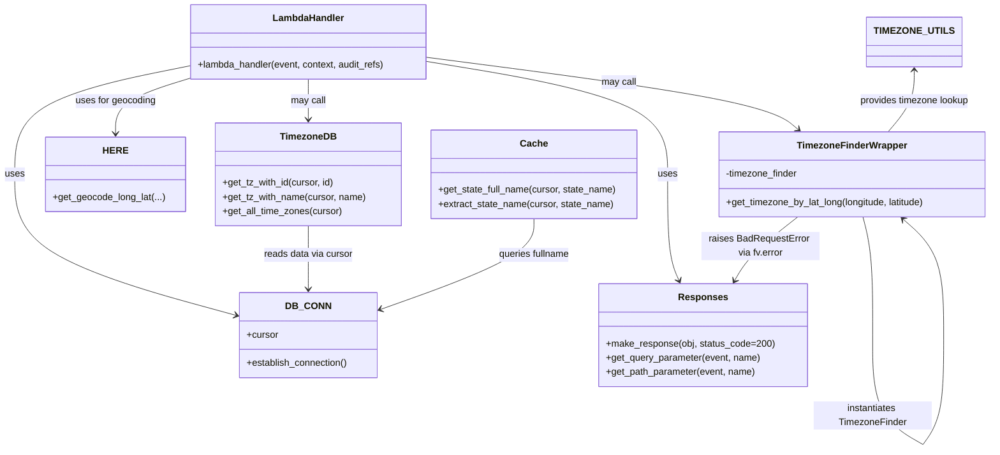

# Diagram: common/location_service/location_service/loc/lambdas/timezone/timezones_get.py


> Auto-generated by Obscura crawlers

## Diagram 1



### SVG

<svg id="container" width="1666.7261962890625" xmlns="http://www.w3.org/2000/svg" class="classDiagram" height="760.1499633789062" viewBox="0 0 1666.7261962890625 760.1499633789062" role="graphics-document document" aria-roledescription="class"><style>#container{font-family:"trebuchet ms",verdana,arial,sans-serif;font-size:16px;fill:#333;}@keyframes edge-animation-frame{from{stroke-dashoffset:0;}}@keyframes dash{to{stroke-dashoffset:0;}}#container .edge-animation-slow{stroke-dasharray:9,5!important;stroke-dashoffset:900;animation:dash 50s linear infinite;stroke-linecap:round;}#container .edge-animation-fast{stroke-dasharray:9,5!important;stroke-dashoffset:900;animation:dash 20s linear infinite;stroke-linecap:round;}#container .error-icon{fill:#552222;}#container .error-text{fill:#552222;stroke:#552222;}#container .edge-thickness-normal{stroke-width:1px;}#container .edge-thickness-thick{stroke-width:3.5px;}#container .edge-pattern-solid{stroke-dasharray:0;}#container .edge-thickness-invisible{stroke-width:0;fill:none;}#container .edge-pattern-dashed{stroke-dasharray:3;}#container .edge-pattern-dotted{stroke-dasharray:2;}#container .marker{fill:#333333;stroke:#333333;}#container .marker.cross{stroke:#333333;}#container svg{font-family:"trebuchet ms",verdana,arial,sans-serif;font-size:16px;}#container p{margin:0;}#container g.classGroup text{fill:#9370DB;stroke:none;font-family:"trebuchet ms",verdana,arial,sans-serif;font-size:10px;}#container g.classGroup text .title{font-weight:bolder;}#container .nodeLabel,#container .edgeLabel{color:#131300;}#container .edgeLabel .label rect{fill:#ECECFF;}#container .label text{fill:#131300;}#container .labelBkg{background:#ECECFF;}#container .edgeLabel .label span{background:#ECECFF;}#container .classTitle{font-weight:bolder;}#container .node rect,#container .node circle,#container .node ellipse,#container .node polygon,#container .node path{fill:#ECECFF;stroke:#9370DB;stroke-width:1px;}#container .divider{stroke:#9370DB;stroke-width:1;}#container g.clickable{cursor:pointer;}#container g.classGroup rect{fill:#ECECFF;stroke:#9370DB;}#container g.classGroup line{stroke:#9370DB;stroke-width:1;}#container .classLabel .box{stroke:none;stroke-width:0;fill:#ECECFF;opacity:0.5;}#container .classLabel .label{fill:#9370DB;font-size:10px;}#container .relation{stroke:#333333;stroke-width:1;fill:none;}#container .dashed-line{stroke-dasharray:3;}#container .dotted-line{stroke-dasharray:1 2;}#container #compositionStart,#container .composition{fill:#333333!important;stroke:#333333!important;stroke-width:1;}#container #compositionEnd,#container .composition{fill:#333333!important;stroke:#333333!important;stroke-width:1;}#container #dependencyStart,#container .dependency{fill:#333333!important;stroke:#333333!important;stroke-width:1;}#container #dependencyStart,#container .dependency{fill:#333333!important;stroke:#333333!important;stroke-width:1;}#container #extensionStart,#container .extension{fill:transparent!important;stroke:#333333!important;stroke-width:1;}#container #extensionEnd,#container .extension{fill:transparent!important;stroke:#333333!important;stroke-width:1;}#container #aggregationStart,#container .aggregation{fill:transparent!important;stroke:#333333!important;stroke-width:1;}#container #aggregationEnd,#container .aggregation{fill:transparent!important;stroke:#333333!important;stroke-width:1;}#container #lollipopStart,#container .lollipop{fill:#ECECFF!important;stroke:#333333!important;stroke-width:1;}#container #lollipopEnd,#container .lollipop{fill:#ECECFF!important;stroke:#333333!important;stroke-width:1;}#container .edgeTerminals{font-size:11px;line-height:initial;}#container .classTitleText{text-anchor:middle;font-size:18px;fill:#333;}#container .label-icon{display:inline-block;height:1em;overflow:visible;vertical-align:-0.125em;}#container .node .label-icon path{fill:currentColor;stroke:revert;stroke-width:revert;}#container :root{--mermaid-font-family:"trebuchet ms",verdana,arial,sans-serif;}</style><g><defs><marker id="container_class-aggregationStart" class="marker aggregation class" refX="18" refY="7" markerWidth="190" markerHeight="240" orient="auto"><path d="M 18,7 L9,13 L1,7 L9,1 Z"></path></marker></defs><defs><marker id="container_class-aggregationEnd" class="marker aggregation class" refX="1" refY="7" markerWidth="20" markerHeight="28" orient="auto"><path d="M 18,7 L9,13 L1,7 L9,1 Z"></path></marker></defs><defs><marker id="container_class-extensionStart" class="marker extension class" refX="18" refY="7" markerWidth="190" markerHeight="240" orient="auto"><path d="M 1,7 L18,13 V 1 Z"></path></marker></defs><defs><marker id="container_class-extensionEnd" class="marker extension class" refX="1" refY="7" markerWidth="20" markerHeight="28" orient="auto"><path d="M 1,1 V 13 L18,7 Z"></path></marker></defs><defs><marker id="container_class-compositionStart" class="marker composition class" refX="18" refY="7" markerWidth="190" markerHeight="240" orient="auto"><path d="M 18,7 L9,13 L1,7 L9,1 Z"></path></marker></defs><defs><marker id="container_class-compositionEnd" class="marker composition class" refX="1" refY="7" markerWidth="20" markerHeight="28" orient="auto"><path d="M 18,7 L9,13 L1,7 L9,1 Z"></path></marker></defs><defs><marker id="container_class-dependencyStart" class="marker dependency class" refX="6" refY="7" markerWidth="190" markerHeight="240" orient="auto"><path d="M 5,7 L9,13 L1,7 L9,1 Z"></path></marker></defs><defs><marker id="container_class-dependencyEnd" class="marker dependency class" refX="13" refY="7" markerWidth="20" markerHeight="28" orient="auto"><path d="M 18,7 L9,13 L14,7 L9,1 Z"></path></marker></defs><defs><marker id="container_class-lollipopStart" class="marker lollipop class" refX="13" refY="7" markerWidth="190" markerHeight="240" orient="auto"><circle stroke="black" fill="transparent" cx="7" cy="7" r="6"></circle></marker></defs><defs><marker id="container_class-lollipopEnd" class="marker lollipop class" refX="1" refY="7" markerWidth="190" markerHeight="240" orient="auto"><circle stroke="black" fill="transparent" cx="7" cy="7" r="6"></circle></marker></defs><g class="root"><g class="clusters"></g><g class="edgePaths"><path d="M311.434,112.308L263.61,122.09C215.786,131.872,120.139,151.436,72.316,181.885C24.492,212.333,24.492,253.667,24.492,297C24.492,340.333,24.492,385.667,85.705,425.361C146.918,465.056,269.344,499.113,330.557,516.141L391.77,533.169" id="id_LambdaHandler_DB_CONN_1" class="edge-thickness-normal edge-pattern-solid relation" style=";;;" data-edge="true" data-et="edge" data-id="id_LambdaHandler_DB_CONN_1" data-points="W3sieCI6MzExLjQzMzU5Mzc1LCJ5IjoxMTIuMzA4MTE3MDA1MDQxNjd9LHsieCI6MjQuNDkyMTg3NSwieSI6MTcxfSx7IngiOjI0LjQ5MjE4NzUsInkiOjI5NX0seyJ4IjoyNC40OTIxODc1LCJ5Ijo0MzF9LHsieCI6Mzk3LjU1MDc4MTI1LCJ5Ijo1MzQuNzc2OTIwMTg4MjQzNn1d" marker-end="url(#container_class-dependencyEnd)"></path><path d="M715.34,104.314L782.717,115.428C850.094,126.543,984.848,148.771,1052.225,180.552C1119.602,212.333,1119.602,253.667,1119.602,297C1119.602,340.333,1119.602,385.667,1122.801,415.585C1126,445.503,1132.399,460.007,1135.598,467.259L1138.797,474.51" id="id_LambdaHandler_Responses_2" class="edge-thickness-normal edge-pattern-solid relation" style=";;;" data-edge="true" data-et="edge" data-id="id_LambdaHandler_Responses_2" data-points="W3sieCI6NzE1LjMzOTg0Mzc1LCJ5IjoxMDQuMzEzNzg3NTI2MzM4NX0seyJ4IjoxMTE5LjYwMTU2MjUsInkiOjE3MX0seyJ4IjoxMTE5LjYwMTU2MjUsInkiOjI5NX0seyJ4IjoxMTE5LjYwMTU2MjUsInkiOjQzMX0seyJ4IjoxMTQxLjIxOTIwOTU1ODgyMzQsInkiOjQ4MH1d" marker-end="url(#container_class-dependencyEnd)"></path><path d="M513.387,134L513.387,140.167C513.387,146.333,513.387,158.667,513.387,170C513.387,181.333,513.387,191.667,513.387,196.833L513.387,202" id="id_LambdaHandler_TimezoneDB_3" class="edge-thickness-normal edge-pattern-solid relation" style=";;;" data-edge="true" data-et="edge" data-id="id_LambdaHandler_TimezoneDB_3" data-points="W3sieCI6NTEzLjM4NjcxODc1LCJ5IjoxMzR9LHsieCI6NTEzLjM4NjcxODc1LCJ5IjoxNzF9LHsieCI6NTEzLjM4NjcxODc1LCJ5IjoyMDh9XQ==" marker-end="url(#container_class-dependencyEnd)"></path><path d="M715.34,97.203L810.135,109.503C904.93,121.802,1094.52,146.401,1198.821,166.722C1303.122,187.043,1322.134,203.087,1331.64,211.109L1341.146,219.13" id="id_LambdaHandler_TimezoneFinderWrapper_4" class="edge-thickness-normal edge-pattern-solid relation" style=";;;" data-edge="true" data-et="edge" data-id="id_LambdaHandler_TimezoneFinderWrapper_4" data-points="W3sieCI6NzE1LjMzOTg0Mzc1LCJ5Ijo5Ny4yMDMwODY1OTE4MjQ4NH0seyJ4IjoxMjg0LjEwOTM3NSwieSI6MTcxfSx7IngiOjEzNDUuNzMxNDM5MDEyMjUzLCJ5IjoyMjN9XQ==" marker-end="url(#container_class-dependencyEnd)"></path><path d="M1448.148,367L1450.681,377.667C1453.213,388.333,1458.278,409.667,1460.811,442.992C1463.343,476.317,1463.343,521.633,1463.343,544.292L1463.343,566.95" id="TimezoneFinderWrapper-cyclic-special-1" class="edge-thickness-normal edge-pattern-solid relation" style=";;;" data-edge="true" data-et="edge" data-id="TimezoneFinderWrapper-cyclic-special-1" data-points="W3sieCI6MTQ0OC4xNDgyOTk2MzI5MjI4LCJ5IjozNjd9LHsieCI6MTQ2My4zNDI5Njg3NTA3NDUsInkiOjQzMX0seyJ4IjoxNDYzLjM0Mjk2ODc1MDc0NSwieSI6NTY2Ljk0OTk5OTk5OTI1NDl9XQ=="></path><path d="M1463.343,567.05L1463.343,589.708C1463.343,612.367,1463.343,657.683,1477.953,688.512C1492.563,719.341,1521.784,735.681,1536.394,743.852L1551.004,752.022" id="TimezoneFinderWrapper-cyclic-special-mid" class="edge-thickness-normal edge-pattern-solid relation" style=";;;" data-edge="true" data-et="edge" data-id="TimezoneFinderWrapper-cyclic-special-mid" data-points="W3sieCI6MTQ2My4zNDI5Njg3NTA3NDUsInkiOjU2Ny4wNTAwMDAwMDA3NDUxfSx7IngiOjE0NjMuMzQyOTY4NzUwNzQ1LCJ5Ijo3MDN9LHsieCI6MTU1MS4wMDQyOTY4NzQ2Mjc1LCJ5Ijo3NTIuMDIyMDM4OTU5ODA1Mn1d"></path><path d="M1551.087,752L1556.463,743.833C1561.839,735.667,1572.591,719.333,1577.967,688.5C1583.343,657.667,1583.343,612.333,1583.343,567C1583.343,521.667,1583.343,476.333,1572.145,443.666C1560.946,410.999,1538.55,390.998,1527.351,380.997L1516.153,370.997" id="TimezoneFinderWrapper-cyclic-special-2" class="edge-thickness-normal edge-pattern-solid relation" style=";;;" data-edge="true" data-et="edge" data-id="TimezoneFinderWrapper-cyclic-special-2" data-points="W3sieCI6MTU1MS4wODcyMTA5MTQ0NzE0LCJ5Ijo3NTJ9LHsieCI6MTU4My4zNDI5Njg3NTA3NDUsInkiOjcwM30seyJ4IjoxNTgzLjM0Mjk2ODc1MDc0NSwieSI6NTY3fSx7IngiOjE1ODMuMzQyOTY4NzUwNzQ1LCJ5Ijo0MzF9LHsieCI6MTUxMS42Nzc3MTEzOTc2Mjg2LCJ5IjozNjd9XQ==" marker-end="url(#container_class-dependencyEnd)"></path><path d="M1340.064,367L1326.584,377.667C1313.104,388.333,1286.144,409.667,1268.39,427.637C1250.636,445.607,1242.088,460.214,1237.815,467.518L1233.541,474.821" id="id_TimezoneFinderWrapper_Responses_6" class="edge-thickness-normal edge-pattern-solid relation" style=";;;" data-edge="true" data-et="edge" data-id="id_TimezoneFinderWrapper_Responses_6" data-points="W3sieCI6MTM0MC4wNjM5MjQ2MzI1MjgxLCJ5IjozNjd9LHsieCI6MTI1OS4xODM1OTM3NSwieSI6NDMxfSx7IngiOjEyMzAuNTEwNjU2MDIwMjIwNSwieSI6NDgwfV0=" marker-end="url(#container_class-dependencyEnd)"></path><path d="M513.387,382L513.387,390.167C513.387,398.333,513.387,414.667,513.387,432.5C513.387,450.333,513.387,469.667,513.387,479.333L513.387,489" id="id_TimezoneDB_DB_CONN_7" class="edge-thickness-normal edge-pattern-solid relation" style=";;;" data-edge="true" data-et="edge" data-id="id_TimezoneDB_DB_CONN_7" data-points="W3sieCI6NTEzLjM4NjcxODc1LCJ5IjozODJ9LHsieCI6NTEzLjM4NjcxODc1LCJ5Ijo0MzF9LHsieCI6NTEzLjM4NjcxODc1LCJ5Ijo0OTV9XQ==" marker-end="url(#container_class-dependencyEnd)"></path><path d="M893.707,370L893.707,380.167C893.707,390.333,893.707,410.667,850.568,436.26C807.429,461.853,721.151,492.705,678.011,508.131L634.872,523.558" id="id_Cache_DB_CONN_8" class="edge-thickness-normal edge-pattern-solid relation" style=";;;" data-edge="true" data-et="edge" data-id="id_Cache_DB_CONN_8" data-points="W3sieCI6ODkzLjcwNzAzMTI1LCJ5IjozNzB9LHsieCI6ODkzLjcwNzAzMTI1LCJ5Ijo0MzF9LHsieCI6NjI5LjIyMjY1NjI1LCJ5Ijo1MjUuNTc3ODQzNTExODQyNH1d" marker-end="url(#container_class-dependencyEnd)"></path><path d="M311.434,133.785L291.482,139.987C271.531,146.19,231.629,158.595,211.678,173.964C191.727,189.333,191.727,207.667,191.727,216.833L191.727,226" id="id_LambdaHandler_HERE_9" class="edge-thickness-normal edge-pattern-solid relation" style=";;;" data-edge="true" data-et="edge" data-id="id_LambdaHandler_HERE_9" data-points="W3sieCI6MzExLjQzMzU5Mzc1LCJ5IjoxMzMuNzg0NjI1NjYwMzMxNTN9LHsieCI6MTkxLjcyNjU2MjUsInkiOjE3MX0seyJ4IjoxOTEuNzI2NTYyNSwieSI6MjMyfV0=" marker-end="url(#container_class-dependencyEnd)"></path><path d="M1542.734,119L1542.734,127.667C1542.734,136.333,1542.734,153.667,1534.929,171C1527.123,188.333,1511.512,205.667,1503.706,214.333L1495.901,223" id="id_TIMEZONE_UTILS_TimezoneFinderWrapper_10" class="edge-thickness-normal edge-pattern-solid relation" style=";;;" data-edge="true" data-et="edge" data-id="id_TIMEZONE_UTILS_TimezoneFinderWrapper_10" data-points="W3sieCI6MTU0Mi43MzQzNzUsInkiOjExM30seyJ4IjoxNTQyLjczNDM3NSwieSI6MTcxfSx7IngiOjE0OTUuOTAwNzkzODUwOTYyNiwieSI6MjIzfV0=" marker-start="url(#container_class-dependencyStart)"></path></g><g class="edgeLabels"><g class="edgeLabel" transform="translate(24.4921875, 295)"><g class="label" data-id="id_LambdaHandler_DB_CONN_1" transform="translate(-16.4921875, -12)"><foreignObject width="32.984375" height="24"><div xmlns="http://www.w3.org/1999/xhtml" class="labelBkg" style="display: table-cell; white-space: nowrap; line-height: 1.5; max-width: 200px; text-align: center;"><span class="edgeLabel"><p>uses</p></span></div></foreignObject></g></g><g class="edgeLabel" transform="translate(1119.6015625, 295)"><g class="label" data-id="id_LambdaHandler_Responses_2" transform="translate(-16.4921875, -12)"><foreignObject width="32.984375" height="24"><div xmlns="http://www.w3.org/1999/xhtml" class="labelBkg" style="display: table-cell; white-space: nowrap; line-height: 1.5; max-width: 200px; text-align: center;"><span class="edgeLabel"><p>uses</p></span></div></foreignObject></g></g><g class="edgeLabel" transform="translate(513.38671875, 171)"><g class="label" data-id="id_LambdaHandler_TimezoneDB_3" transform="translate(-29.8515625, -12)"><foreignObject width="59.703125" height="24"><div xmlns="http://www.w3.org/1999/xhtml" class="labelBkg" style="display: table-cell; white-space: nowrap; line-height: 1.5; max-width: 200px; text-align: center;"><span class="edgeLabel"><p>may call</p></span></div></foreignObject></g></g><g class="edgeLabel" transform="translate(1039.70474, 139.2889)"><g class="label" data-id="id_LambdaHandler_TimezoneFinderWrapper_4" transform="translate(-29.8515625, -12)"><foreignObject width="59.703125" height="24"><div xmlns="http://www.w3.org/1999/xhtml" class="labelBkg" style="display: table-cell; white-space: nowrap; line-height: 1.5; max-width: 200px; text-align: center;"><span class="edgeLabel"><p>may call</p></span></div></foreignObject></g></g><g class="edgeLabel"><g class="label" data-id="TimezoneFinderWrapper-cyclic-special-1" transform="translate(0, 0)"><foreignObject width="0" height="0"><div xmlns="http://www.w3.org/1999/xhtml" class="labelBkg" style="display: table-cell; white-space: nowrap; line-height: 1.5; max-width: 200px; text-align: center;"><span class="edgeLabel"></span></div></foreignObject></g></g><g class="edgeLabel" transform="translate(1463.342968750745, 703)"><g class="label" data-id="TimezoneFinderWrapper-cyclic-special-mid" transform="translate(-100, -24)"><foreignObject width="200" height="48"><div xmlns="http://www.w3.org/1999/xhtml" class="labelBkg" style="display: table; white-space: break-spaces; line-height: 1.5; max-width: 200px; text-align: center; width: 200px;"><span class="edgeLabel"><p>instantiates TimezoneFinder</p></span></div></foreignObject></g></g><g class="edgeLabel"><g class="label" data-id="TimezoneFinderWrapper-cyclic-special-2" transform="translate(0, 0)"><foreignObject width="0" height="0"><div xmlns="http://www.w3.org/1999/xhtml" class="labelBkg" style="display: table-cell; white-space: nowrap; line-height: 1.5; max-width: 200px; text-align: center;"><span class="edgeLabel"></span></div></foreignObject></g></g><g class="edgeLabel" transform="translate(1277.36351, 416.61436)"><g class="label" data-id="id_TimezoneFinderWrapper_Responses_6" transform="translate(-100, -24)"><foreignObject width="200" height="48"><div xmlns="http://www.w3.org/1999/xhtml" class="labelBkg" style="display: table; white-space: break-spaces; line-height: 1.5; max-width: 200px; text-align: center; width: 200px;"><span class="edgeLabel"><p>raises BadRequestError via fv.error</p></span></div></foreignObject></g></g><g class="edgeLabel" transform="translate(513.38671875, 431)"><g class="label" data-id="id_TimezoneDB_DB_CONN_7" transform="translate(-76.09375, -12)"><foreignObject width="152.1875" height="24"><div xmlns="http://www.w3.org/1999/xhtml" class="labelBkg" style="display: table-cell; white-space: nowrap; line-height: 1.5; max-width: 200px; text-align: center;"><span class="edgeLabel"><p>reads data via cursor</p></span></div></foreignObject></g></g><g class="edgeLabel" transform="translate(893.70703125, 431)"><g class="label" data-id="id_Cache_DB_CONN_8" transform="translate(-61.640625, -12)"><foreignObject width="123.28125" height="24"><div xmlns="http://www.w3.org/1999/xhtml" class="labelBkg" style="display: table-cell; white-space: nowrap; line-height: 1.5; max-width: 200px; text-align: center;"><span class="edgeLabel"><p>queries fullname</p></span></div></foreignObject></g></g><g class="edgeLabel" transform="translate(191.7265625, 171)"><g class="label" data-id="id_LambdaHandler_HERE_9" transform="translate(-68.3828125, -12)"><foreignObject width="136.765625" height="24"><div xmlns="http://www.w3.org/1999/xhtml" class="labelBkg" style="display: table-cell; white-space: nowrap; line-height: 1.5; max-width: 200px; text-align: center;"><span class="edgeLabel"><p>uses for geocoding</p></span></div></foreignObject></g></g><g class="edgeLabel" transform="translate(1542.734375, 171)"><g class="label" data-id="id_TIMEZONE_UTILS_TimezoneFinderWrapper_10" transform="translate(-94.1171875, -12)"><foreignObject width="188.234375" height="24"><div xmlns="http://www.w3.org/1999/xhtml" class="labelBkg" style="display: table-cell; white-space: nowrap; line-height: 1.5; max-width: 200px; text-align: center;"><span class="edgeLabel"><p>provides timezone lookup</p></span></div></foreignObject></g></g></g><g class="nodes"><g class="node default" id="classId-LambdaHandler-0" transform="translate(513.38671875, 71)"><g class="basic label-container"><path d="M-201.953125 -63 L201.953125 -63 L201.953125 63 L-201.953125 63" stroke="none" stroke-width="0" fill="#ECECFF" style=""></path><path d="M-201.953125 -63 C-77.65388710902143 -63, 46.64535078195715 -63, 201.953125 -63 M-201.953125 -63 C-89.62484751945745 -63, 22.703429961085106 -63, 201.953125 -63 M201.953125 -63 C201.953125 -30.086198049019316, 201.953125 2.8276039019613677, 201.953125 63 M201.953125 -63 C201.953125 -30.5713467530325, 201.953125 1.857306493934999, 201.953125 63 M201.953125 63 C96.89854613556658 63, -8.156032728866847 63, -201.953125 63 M201.953125 63 C59.824009392878395 63, -82.30510621424321 63, -201.953125 63 M-201.953125 63 C-201.953125 12.619857512465785, -201.953125 -37.76028497506843, -201.953125 -63 M-201.953125 63 C-201.953125 30.51674606194169, -201.953125 -1.9665078761166228, -201.953125 -63" stroke="#9370DB" stroke-width="1.3" fill="none" stroke-dasharray="0 0" style=""></path></g><g class="annotation-group text" transform="translate(0, -39)"></g><g class="label-group text" transform="translate(-58.21875, -39)"><g class="label" style="font-weight: bolder" transform="translate(0,-12)"><foreignObject width="116.4375" height="24"><div xmlns="http://www.w3.org/1999/xhtml" style="display: table-cell; white-space: nowrap; line-height: 1.5; max-width: 167px; text-align: center;"><span class="nodeLabel markdown-node-label" style=""><p>LambdaHandler</p></span></div></foreignObject></g></g><g class="members-group text" transform="translate(-189.953125, 9)"></g><g class="methods-group text" transform="translate(-189.953125, 39)"><g class="label" style="" transform="translate(0,-12)"><foreignObject width="321.6875" height="24"><div xmlns="http://www.w3.org/1999/xhtml" style="display: table-cell; white-space: nowrap; line-height: 1.5; max-width: 379px; text-align: center;"><span class="nodeLabel markdown-node-label" style=""><p>+lambda_handler(event, context, audit_refs)</p></span></div></foreignObject></g></g><g class="divider" style=""><path d="M-201.953125 -15 C-76.6165974639035 -15, 48.719930072192994 -15, 201.953125 -15 M-201.953125 -15 C-93.97083057605147 -15, 14.011463847897062 -15, 201.953125 -15" stroke="#9370DB" stroke-width="1.3" fill="none" stroke-dasharray="0 0" style=""></path></g><g class="divider" style=""><path d="M-201.953125 9 C-91.28722309405009 9, 19.378678811899817 9, 201.953125 9 M-201.953125 9 C-51.194277453778795 9, 99.56457009244241 9, 201.953125 9" stroke="#9370DB" stroke-width="1.3" fill="none" stroke-dasharray="0 0" style=""></path></g></g><g class="node default" id="classId-DB_CONN-1" transform="translate(513.38671875, 567)"><g class="basic label-container"><path d="M-115.8359375 -72 L115.8359375 -72 L115.8359375 72 L-115.8359375 72" stroke="none" stroke-width="0" fill="#ECECFF" style=""></path><path d="M-115.8359375 -72 C-57.55582376226373 -72, 0.7242899754725443 -72, 115.8359375 -72 M-115.8359375 -72 C-59.5651563176308 -72, -3.2943751352616033 -72, 115.8359375 -72 M115.8359375 -72 C115.8359375 -40.87570374768194, 115.8359375 -9.751407495363871, 115.8359375 72 M115.8359375 -72 C115.8359375 -22.79262479464475, 115.8359375 26.414750410710496, 115.8359375 72 M115.8359375 72 C43.3340815663162 72, -29.1677743673676 72, -115.8359375 72 M115.8359375 72 C32.971539432973415 72, -49.89285863405317 72, -115.8359375 72 M-115.8359375 72 C-115.8359375 15.800370421783938, -115.8359375 -40.39925915643212, -115.8359375 -72 M-115.8359375 72 C-115.8359375 41.61045624382683, -115.8359375 11.22091248765367, -115.8359375 -72" stroke="#9370DB" stroke-width="1.3" fill="none" stroke-dasharray="0 0" style=""></path></g><g class="annotation-group text" transform="translate(0, -48)"></g><g class="label-group text" transform="translate(-34.40625, -48)"><g class="label" style="font-weight: bolder" transform="translate(0,-12)"><foreignObject width="68.8125" height="24"><div xmlns="http://www.w3.org/1999/xhtml" style="display: table-cell; white-space: nowrap; line-height: 1.5; max-width: 119px; text-align: center;"><span class="nodeLabel markdown-node-label" style=""><p>DB_CONN</p></span></div></foreignObject></g></g><g class="members-group text" transform="translate(-103.8359375, 0)"><g class="label" style="" transform="translate(0,-12)"><foreignObject width="53.71875" height="24"><div xmlns="http://www.w3.org/1999/xhtml" style="display: table-cell; white-space: nowrap; line-height: 1.5; max-width: 112px; text-align: center;"><span class="nodeLabel markdown-node-label" style=""><p>+cursor</p></span></div></foreignObject></g></g><g class="methods-group text" transform="translate(-103.8359375, 48)"><g class="label" style="" transform="translate(0,-12)"><foreignObject width="173.265625" height="24"><div xmlns="http://www.w3.org/1999/xhtml" style="display: table-cell; white-space: nowrap; line-height: 1.5; max-width: 231px; text-align: center;"><span class="nodeLabel markdown-node-label" style=""><p>+establish_connection()</p></span></div></foreignObject></g></g><g class="divider" style=""><path d="M-115.8359375 -24 C-57.350534056334105 -24, 1.1348693873317899 -24, 115.8359375 -24 M-115.8359375 -24 C-58.1858163112283 -24, -0.5356951224566018 -24, 115.8359375 -24" stroke="#9370DB" stroke-width="1.3" fill="none" stroke-dasharray="0 0" style=""></path></g><g class="divider" style=""><path d="M-115.8359375 24 C-46.90312738044642 24, 22.02968273910716 24, 115.8359375 24 M-115.8359375 24 C-30.333732924003883 24, 55.168471651992235 24, 115.8359375 24" stroke="#9370DB" stroke-width="1.3" fill="none" stroke-dasharray="0 0" style=""></path></g></g><g class="node default" id="classId-TimezoneFinderWrapper-2" transform="translate(1431.0542968753725, 295)"><g class="basic label-container"><path d="M-227.671875 -72 L227.671875 -72 L227.671875 72 L-227.671875 72" stroke="none" stroke-width="0" fill="#ECECFF" style=""></path><path d="M-227.671875 -72 C-86.119358474705 -72, 55.43315805059001 -72, 227.671875 -72 M-227.671875 -72 C-66.3004187627177 -72, 95.0710374745646 -72, 227.671875 -72 M227.671875 -72 C227.671875 -29.956488134170336, 227.671875 12.087023731659329, 227.671875 72 M227.671875 -72 C227.671875 -38.0058699334156, 227.671875 -4.011739866831206, 227.671875 72 M227.671875 72 C86.99520356889886 72, -53.68146786220228 72, -227.671875 72 M227.671875 72 C64.564156238398 72, -98.543562523204 72, -227.671875 72 M-227.671875 72 C-227.671875 33.26585942083181, -227.671875 -5.4682811583363815, -227.671875 -72 M-227.671875 72 C-227.671875 27.73249169345104, -227.671875 -16.535016613097923, -227.671875 -72" stroke="#9370DB" stroke-width="1.3" fill="none" stroke-dasharray="0 0" style=""></path></g><g class="annotation-group text" transform="translate(0, -48)"></g><g class="label-group text" transform="translate(-89.171875, -48)"><g class="label" style="font-weight: bolder" transform="translate(0,-12)"><foreignObject width="178.34375" height="24"><div xmlns="http://www.w3.org/1999/xhtml" style="display: table-cell; white-space: nowrap; line-height: 1.5; max-width: 227px; text-align: center;"><span class="nodeLabel markdown-node-label" style=""><p>TimezoneFinderWrapper</p></span></div></foreignObject></g></g><g class="members-group text" transform="translate(-215.671875, 0)"><g class="label" style="" transform="translate(0,-12)"><foreignObject width="124.03125" height="24"><div xmlns="http://www.w3.org/1999/xhtml" style="display: table-cell; white-space: nowrap; line-height: 1.5; max-width: 182px; text-align: center;"><span class="nodeLabel markdown-node-label" style=""><p>-timezone_finder</p></span></div></foreignObject></g></g><g class="methods-group text" transform="translate(-215.671875, 48)"><g class="label" style="" transform="translate(0,-12)"><foreignObject width="342.171875" height="24"><div xmlns="http://www.w3.org/1999/xhtml" style="display: table-cell; white-space: nowrap; line-height: 1.5; max-width: 400px; text-align: center;"><span class="nodeLabel markdown-node-label" style=""><p>+get_timezone_by_lat_long(longitude, latitude)</p></span></div></foreignObject></g></g><g class="divider" style=""><path d="M-227.671875 -24 C-118.461291597392 -24, -9.25070819478401 -24, 227.671875 -24 M-227.671875 -24 C-51.32699776854349 -24, 125.01787946291302 -24, 227.671875 -24" stroke="#9370DB" stroke-width="1.3" fill="none" stroke-dasharray="0 0" style=""></path></g><g class="divider" style=""><path d="M-227.671875 24 C-125.65086826920366 24, -23.62986153840731 24, 227.671875 24 M-227.671875 24 C-89.82832234144897 24, 48.015230317102066 24, 227.671875 24" stroke="#9370DB" stroke-width="1.3" fill="none" stroke-dasharray="0 0" style=""></path></g></g><g class="node default" id="classId-HERE-3" transform="translate(191.7265625, 295)"><g class="basic label-container"><path d="M-115.7421875 -63 L115.7421875 -63 L115.7421875 63 L-115.7421875 63" stroke="none" stroke-width="0" fill="#ECECFF" style=""></path><path d="M-115.7421875 -63 C-56.018166045340564 -63, 3.705855409318872 -63, 115.7421875 -63 M-115.7421875 -63 C-26.77643180025568 -63, 62.18932389948864 -63, 115.7421875 -63 M115.7421875 -63 C115.7421875 -32.3228782664914, 115.7421875 -1.6457565329828014, 115.7421875 63 M115.7421875 -63 C115.7421875 -36.62872015258434, 115.7421875 -10.257440305168686, 115.7421875 63 M115.7421875 63 C28.30744288585433 63, -59.12730172829134 63, -115.7421875 63 M115.7421875 63 C61.426337171889536 63, 7.110486843779071 63, -115.7421875 63 M-115.7421875 63 C-115.7421875 15.620105785411305, -115.7421875 -31.75978842917739, -115.7421875 -63 M-115.7421875 63 C-115.7421875 30.743831711741663, -115.7421875 -1.5123365765166739, -115.7421875 -63" stroke="#9370DB" stroke-width="1.3" fill="none" stroke-dasharray="0 0" style=""></path></g><g class="annotation-group text" transform="translate(0, -39)"></g><g class="label-group text" transform="translate(-18.6875, -39)"><g class="label" style="font-weight: bolder" transform="translate(0,-12)"><foreignObject width="37.375" height="24"><div xmlns="http://www.w3.org/1999/xhtml" style="display: table-cell; white-space: nowrap; line-height: 1.5; max-width: 88px; text-align: center;"><span class="nodeLabel markdown-node-label" style=""><p>HERE</p></span></div></foreignObject></g></g><g class="members-group text" transform="translate(-103.7421875, 9)"></g><g class="methods-group text" transform="translate(-103.7421875, 39)"><g class="label" style="" transform="translate(0,-12)"><foreignObject width="188.796875" height="24"><div xmlns="http://www.w3.org/1999/xhtml" style="display: table-cell; white-space: nowrap; line-height: 1.5; max-width: 246px; text-align: center;"><span class="nodeLabel markdown-node-label" style=""><p>+get_geocode_long_lat(...)</p></span></div></foreignObject></g></g><g class="divider" style=""><path d="M-115.7421875 -15 C-50.70459144668203 -15, 14.333004606635939 -15, 115.7421875 -15 M-115.7421875 -15 C-57.66790562864586 -15, 0.40637624270827644 -15, 115.7421875 -15" stroke="#9370DB" stroke-width="1.3" fill="none" stroke-dasharray="0 0" style=""></path></g><g class="divider" style=""><path d="M-115.7421875 9 C-43.411572346836266 9, 28.919042806327468 9, 115.7421875 9 M-115.7421875 9 C-67.67743178682694 9, -19.612676073653887 9, 115.7421875 9" stroke="#9370DB" stroke-width="1.3" fill="none" stroke-dasharray="0 0" style=""></path></g></g><g class="node default" id="classId-TimezoneDB-4" transform="translate(513.38671875, 295)"><g class="basic label-container"><path d="M-155.91796875 -87 L155.91796875 -87 L155.91796875 87 L-155.91796875 87" stroke="none" stroke-width="0" fill="#ECECFF" style=""></path><path d="M-155.91796875 -87 C-73.53179158788254 -87, 8.854385574234925 -87, 155.91796875 -87 M-155.91796875 -87 C-81.68779747659623 -87, -7.457626203192461 -87, 155.91796875 -87 M155.91796875 -87 C155.91796875 -47.9277531569645, 155.91796875 -8.855506313928998, 155.91796875 87 M155.91796875 -87 C155.91796875 -35.27231947626924, 155.91796875 16.455361047461523, 155.91796875 87 M155.91796875 87 C43.08298870915429 87, -69.75199133169141 87, -155.91796875 87 M155.91796875 87 C68.76424840547784 87, -18.389471939044313 87, -155.91796875 87 M-155.91796875 87 C-155.91796875 35.929304609712176, -155.91796875 -15.141390780575648, -155.91796875 -87 M-155.91796875 87 C-155.91796875 41.426146774401346, -155.91796875 -4.147706451197308, -155.91796875 -87" stroke="#9370DB" stroke-width="1.3" fill="none" stroke-dasharray="0 0" style=""></path></g><g class="annotation-group text" transform="translate(0, -63)"></g><g class="label-group text" transform="translate(-45.1328125, -63)"><g class="label" style="font-weight: bolder" transform="translate(0,-12)"><foreignObject width="90.265625" height="24"><div xmlns="http://www.w3.org/1999/xhtml" style="display: table-cell; white-space: nowrap; line-height: 1.5; max-width: 140px; text-align: center;"><span class="nodeLabel markdown-node-label" style=""><p>TimezoneDB</p></span></div></foreignObject></g></g><g class="members-group text" transform="translate(-143.91796875, -15)"></g><g class="methods-group text" transform="translate(-143.91796875, 15)"><g class="label" style="" transform="translate(0,-12)"><foreignObject width="189.828125" height="24"><div xmlns="http://www.w3.org/1999/xhtml" style="display: table-cell; white-space: nowrap; line-height: 1.5; max-width: 247px; text-align: center;"><span class="nodeLabel markdown-node-label" style=""><p>+get_tz_with_id(cursor, id)</p></span></div></foreignObject></g><g class="label" style="" transform="translate(0,12)"><foreignObject width="242.703125" height="24"><div xmlns="http://www.w3.org/1999/xhtml" style="display: table-cell; white-space: nowrap; line-height: 1.5; max-width: 300px; text-align: center;"><span class="nodeLabel markdown-node-label" style=""><p>+get_tz_with_name(cursor, name)</p></span></div></foreignObject></g><g class="label" style="" transform="translate(0,36)"><foreignObject width="203.078125" height="24"><div xmlns="http://www.w3.org/1999/xhtml" style="display: table-cell; white-space: nowrap; line-height: 1.5; max-width: 260px; text-align: center;"><span class="nodeLabel markdown-node-label" style=""><p>+get_all_time_zones(cursor)</p></span></div></foreignObject></g></g><g class="divider" style=""><path d="M-155.91796875 -39 C-56.813837565981444 -39, 42.29029361803711 -39, 155.91796875 -39 M-155.91796875 -39 C-86.78515140086503 -39, -17.652334051730065 -39, 155.91796875 -39" stroke="#9370DB" stroke-width="1.3" fill="none" stroke-dasharray="0 0" style=""></path></g><g class="divider" style=""><path d="M-155.91796875 -15 C-43.42243318079882 -15, 69.07310238840236 -15, 155.91796875 -15 M-155.91796875 -15 C-63.54882412550806 -15, 28.820320498983875 -15, 155.91796875 -15" stroke="#9370DB" stroke-width="1.3" fill="none" stroke-dasharray="0 0" style=""></path></g></g><g class="node default" id="classId-Cache-5" transform="translate(893.70703125, 295)"><g class="basic label-container"><path d="M-174.40234375 -75 L174.40234375 -75 L174.40234375 75 L-174.40234375 75" stroke="none" stroke-width="0" fill="#ECECFF" style=""></path><path d="M-174.40234375 -75 C-94.62461257647504 -75, -14.846881402950089 -75, 174.40234375 -75 M-174.40234375 -75 C-88.9435705537266 -75, -3.4847973574532034 -75, 174.40234375 -75 M174.40234375 -75 C174.40234375 -38.92093569343635, 174.40234375 -2.841871386872697, 174.40234375 75 M174.40234375 -75 C174.40234375 -22.561773569120483, 174.40234375 29.876452861759034, 174.40234375 75 M174.40234375 75 C46.698276713588854 75, -81.00579032282229 75, -174.40234375 75 M174.40234375 75 C66.24213799415826 75, -41.91806776168349 75, -174.40234375 75 M-174.40234375 75 C-174.40234375 26.45873152175136, -174.40234375 -22.08253695649728, -174.40234375 -75 M-174.40234375 75 C-174.40234375 38.87396271255862, -174.40234375 2.747925425117245, -174.40234375 -75" stroke="#9370DB" stroke-width="1.3" fill="none" stroke-dasharray="0 0" style=""></path></g><g class="annotation-group text" transform="translate(0, -51)"></g><g class="label-group text" transform="translate(-21.7734375, -51)"><g class="label" style="font-weight: bolder" transform="translate(0,-12)"><foreignObject width="43.546875" height="24"><div xmlns="http://www.w3.org/1999/xhtml" style="display: table-cell; white-space: nowrap; line-height: 1.5; max-width: 93px; text-align: center;"><span class="nodeLabel markdown-node-label" style=""><p>Cache</p></span></div></foreignObject></g></g><g class="members-group text" transform="translate(-162.40234375, -3)"></g><g class="methods-group text" transform="translate(-162.40234375, 27)"><g class="label" style="" transform="translate(0,-12)"><foreignObject width="303.03125" height="24"><div xmlns="http://www.w3.org/1999/xhtml" style="display: table-cell; white-space: nowrap; line-height: 1.5; max-width: 360px; text-align: center;"><span class="nodeLabel markdown-node-label" style=""><p>+get_state_full_name(cursor, state_name)</p></span></div></foreignObject></g><g class="label" style="" transform="translate(0,12)"><foreignObject width="298.28125" height="24"><div xmlns="http://www.w3.org/1999/xhtml" style="display: table-cell; white-space: nowrap; line-height: 1.5; max-width: 356px; text-align: center;"><span class="nodeLabel markdown-node-label" style=""><p>+extract_state_name(cursor, state_name)</p></span></div></foreignObject></g></g><g class="divider" style=""><path d="M-174.40234375 -27 C-72.26772126257245 -27, 29.8669012248551 -27, 174.40234375 -27 M-174.40234375 -27 C-102.07995257136459 -27, -29.757561392729173 -27, 174.40234375 -27" stroke="#9370DB" stroke-width="1.3" fill="none" stroke-dasharray="0 0" style=""></path></g><g class="divider" style=""><path d="M-174.40234375 -3 C-72.93030031251567 -3, 28.54174312496866 -3, 174.40234375 -3 M-174.40234375 -3 C-63.6867660548388 -3, 47.0288116403224 -3, 174.40234375 -3" stroke="#9370DB" stroke-width="1.3" fill="none" stroke-dasharray="0 0" style=""></path></g></g><g class="node default" id="classId-Responses-6" transform="translate(1179.6015625, 567)"><g class="basic label-container"><path d="M-173.69140625 -87 L173.69140625 -87 L173.69140625 87 L-173.69140625 87" stroke="none" stroke-width="0" fill="#ECECFF" style=""></path><path d="M-173.69140625 -87 C-42.220668435793016 -87, 89.25006937841397 -87, 173.69140625 -87 M-173.69140625 -87 C-60.753148439754284 -87, 52.18510937049143 -87, 173.69140625 -87 M173.69140625 -87 C173.69140625 -35.30277898631151, 173.69140625 16.394442027376982, 173.69140625 87 M173.69140625 -87 C173.69140625 -35.850851958159076, 173.69140625 15.298296083681848, 173.69140625 87 M173.69140625 87 C94.47115441792997 87, 15.250902585859933 87, -173.69140625 87 M173.69140625 87 C104.20796787328466 87, 34.72452949656932 87, -173.69140625 87 M-173.69140625 87 C-173.69140625 40.80178231718211, -173.69140625 -5.3964353656357815, -173.69140625 -87 M-173.69140625 87 C-173.69140625 28.347430956110266, -173.69140625 -30.30513808777947, -173.69140625 -87" stroke="#9370DB" stroke-width="1.3" fill="none" stroke-dasharray="0 0" style=""></path></g><g class="annotation-group text" transform="translate(0, -63)"></g><g class="label-group text" transform="translate(-39.3046875, -63)"><g class="label" style="font-weight: bolder" transform="translate(0,-12)"><foreignObject width="78.609375" height="24"><div xmlns="http://www.w3.org/1999/xhtml" style="display: table-cell; white-space: nowrap; line-height: 1.5; max-width: 128px; text-align: center;"><span class="nodeLabel markdown-node-label" style=""><p>Responses</p></span></div></foreignObject></g></g><g class="members-group text" transform="translate(-161.69140625, -15)"></g><g class="methods-group text" transform="translate(-161.69140625, 15)"><g class="label" style="" transform="translate(0,-12)"><foreignObject width="284.078125" height="24"><div xmlns="http://www.w3.org/1999/xhtml" style="display: table-cell; white-space: nowrap; line-height: 1.5; max-width: 341px; text-align: center;"><span class="nodeLabel markdown-node-label" style=""><p>+make_response(obj, status_code=200)</p></span></div></foreignObject></g><g class="label" style="" transform="translate(0,12)"><foreignObject width="262.625" height="24"><div xmlns="http://www.w3.org/1999/xhtml" style="display: table-cell; white-space: nowrap; line-height: 1.5; max-width: 320px; text-align: center;"><span class="nodeLabel markdown-node-label" style=""><p>+get_query_parameter(event, name)</p></span></div></foreignObject></g><g class="label" style="" transform="translate(0,36)"><foreignObject width="254.984375" height="24"><div xmlns="http://www.w3.org/1999/xhtml" style="display: table-cell; white-space: nowrap; line-height: 1.5; max-width: 312px; text-align: center;"><span class="nodeLabel markdown-node-label" style=""><p>+get_path_parameter(event, name)</p></span></div></foreignObject></g></g><g class="divider" style=""><path d="M-173.69140625 -39 C-91.63480091963719 -39, -9.578195589274372 -39, 173.69140625 -39 M-173.69140625 -39 C-66.67422039961836 -39, 40.34296545076327 -39, 173.69140625 -39" stroke="#9370DB" stroke-width="1.3" fill="none" stroke-dasharray="0 0" style=""></path></g><g class="divider" style=""><path d="M-173.69140625 -15 C-53.70656310481172 -15, 66.27828004037656 -15, 173.69140625 -15 M-173.69140625 -15 C-70.88427090327143 -15, 31.922864443457144 -15, 173.69140625 -15" stroke="#9370DB" stroke-width="1.3" fill="none" stroke-dasharray="0 0" style=""></path></g></g><g class="node default" id="classId-TIMEZONE_UTILS-7" transform="translate(1542.734375, 71)"><g class="basic label-container"><path d="M-72.6484375 -42 L72.6484375 -42 L72.6484375 42 L-72.6484375 42" stroke="none" stroke-width="0" fill="#ECECFF" style=""></path><path d="M-72.6484375 -42 C-31.970179100950688 -42, 8.708079298098625 -42, 72.6484375 -42 M-72.6484375 -42 C-15.573064658420954 -42, 41.50230818315809 -42, 72.6484375 -42 M72.6484375 -42 C72.6484375 -10.973092893604399, 72.6484375 20.053814212791202, 72.6484375 42 M72.6484375 -42 C72.6484375 -24.677718224445155, 72.6484375 -7.355436448890309, 72.6484375 42 M72.6484375 42 C27.638166197096865 42, -17.37210510580627 42, -72.6484375 42 M72.6484375 42 C31.437035731233863 42, -9.774366037532275 42, -72.6484375 42 M-72.6484375 42 C-72.6484375 25.18544106889479, -72.6484375 8.370882137789579, -72.6484375 -42 M-72.6484375 42 C-72.6484375 16.89076057400397, -72.6484375 -8.21847885199206, -72.6484375 -42" stroke="#9370DB" stroke-width="1.3" fill="none" stroke-dasharray="0 0" style=""></path></g><g class="annotation-group text" transform="translate(0, -18)"></g><g class="label-group text" transform="translate(-60.6484375, -18)"><g class="label" style="font-weight: bolder" transform="translate(0,-12)"><foreignObject width="121.296875" height="24"><div xmlns="http://www.w3.org/1999/xhtml" style="display: table-cell; white-space: nowrap; line-height: 1.5; max-width: 171px; text-align: center;"><span class="nodeLabel markdown-node-label" style=""><p>TIMEZONE_UTILS</p></span></div></foreignObject></g></g><g class="members-group text" transform="translate(-60.6484375, 30)"></g><g class="methods-group text" transform="translate(-60.6484375, 60)"></g><g class="divider" style=""><path d="M-72.6484375 6 C-34.789553727489405 6, 3.0693300450211893 6, 72.6484375 6 M-72.6484375 6 C-18.40299387103321 6, 35.84244975793358 6, 72.6484375 6" stroke="#9370DB" stroke-width="1.3" fill="none" stroke-dasharray="0 0" style=""></path></g><g class="divider" style=""><path d="M-72.6484375 24 C-34.1311160431156 24, 4.386205413768806 24, 72.6484375 24 M-72.6484375 24 C-15.069333580791174 24, 42.50977033841765 24, 72.6484375 24" stroke="#9370DB" stroke-width="1.3" fill="none" stroke-dasharray="0 0" style=""></path></g></g><g class="label edgeLabel" id="TimezoneFinderWrapper---TimezoneFinderWrapper---1" transform="translate(1463.342968750745, 567)"><rect width="0.1" height="0.1"></rect><g class="label" style="" transform="translate(0, 0)"><rect></rect><foreignObject width="0" height="0"><div xmlns="http://www.w3.org/1999/xhtml" style="display: table-cell; white-space: nowrap; line-height: 1.5; max-width: 10px; text-align: center;"><span class="nodeLabel"></span></div></foreignObject></g></g><g class="label edgeLabel" id="TimezoneFinderWrapper---TimezoneFinderWrapper---2" transform="translate(1551.0542968753725, 752.0500000007451)"><rect width="0.1" height="0.1"></rect><g class="label" style="" transform="translate(0, 0)"><rect></rect><foreignObject width="0" height="0"><div xmlns="http://www.w3.org/1999/xhtml" style="display: table-cell; white-space: nowrap; line-height: 1.5; max-width: 10px; text-align: center;"><span class="nodeLabel"></span></div></foreignObject></g></g></g></g></g></svg>

## Diagram 2

```mermaid
flowchart TD
    A[Start: get_time_zones(cursor,event)] --> B{Query parameters present?}
    B -->|name| C[DB lookup: get_tz_with_name] --> D[Return zone dict]
    B -->|lat & long| E[Call get_timezone_by_lat_long] --> F{timezone found?}
    F -->|yes| G[Return timezone dict]
    F -->|no| H[Raise BadRequestError or return 404]
    B -->|address & city & state| I[If country==US then expand state name via cache]
    I --> J[HERE geocode -> (lat,long)] --> E
    B -->|city & state| K[If country==US then expand state name via cache]
    K --> L[HERE geocode with city/state -> (lat,long)] --> E
    B -->|no params| M[get_all_time_zones(cursor)] --> N[Return list of zones]
    B -->|other combinations| H
    D --> O[Responses.make_response(result)]
    G --> O
    N --> O
    H --> P[Responses.make_response({}, status=404) or raise BadRequestError]
    O --> Z[End]
```

> SVG rendering failed for this diagram.
