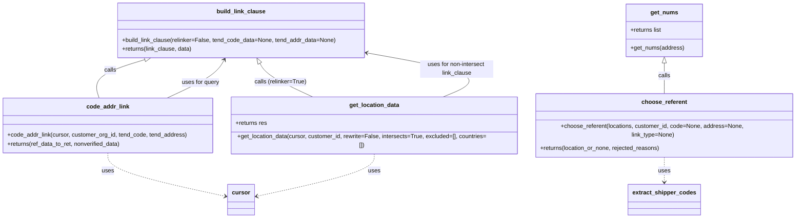

# Diagram: common/location_service/location_service/loc/linking.py


> Auto-generated by Obscura crawlers

## Diagram 1



### SVG

<svg id="container" width="2182" xmlns="http://www.w3.org/2000/svg" class="classDiagram" height="572" viewBox="0 0 2182 572" role="graphics-document document" aria-roledescription="class"><style>#container{font-family:"trebuchet ms",verdana,arial,sans-serif;font-size:16px;fill:#333;}@keyframes edge-animation-frame{from{stroke-dashoffset:0;}}@keyframes dash{to{stroke-dashoffset:0;}}#container .edge-animation-slow{stroke-dasharray:9,5!important;stroke-dashoffset:900;animation:dash 50s linear infinite;stroke-linecap:round;}#container .edge-animation-fast{stroke-dasharray:9,5!important;stroke-dashoffset:900;animation:dash 20s linear infinite;stroke-linecap:round;}#container .error-icon{fill:#552222;}#container .error-text{fill:#552222;stroke:#552222;}#container .edge-thickness-normal{stroke-width:1px;}#container .edge-thickness-thick{stroke-width:3.5px;}#container .edge-pattern-solid{stroke-dasharray:0;}#container .edge-thickness-invisible{stroke-width:0;fill:none;}#container .edge-pattern-dashed{stroke-dasharray:3;}#container .edge-pattern-dotted{stroke-dasharray:2;}#container .marker{fill:#333333;stroke:#333333;}#container .marker.cross{stroke:#333333;}#container svg{font-family:"trebuchet ms",verdana,arial,sans-serif;font-size:16px;}#container p{margin:0;}#container g.classGroup text{fill:#9370DB;stroke:none;font-family:"trebuchet ms",verdana,arial,sans-serif;font-size:10px;}#container g.classGroup text .title{font-weight:bolder;}#container .nodeLabel,#container .edgeLabel{color:#131300;}#container .edgeLabel .label rect{fill:#ECECFF;}#container .label text{fill:#131300;}#container .labelBkg{background:#ECECFF;}#container .edgeLabel .label span{background:#ECECFF;}#container .classTitle{font-weight:bolder;}#container .node rect,#container .node circle,#container .node ellipse,#container .node polygon,#container .node path{fill:#ECECFF;stroke:#9370DB;stroke-width:1px;}#container .divider{stroke:#9370DB;stroke-width:1;}#container g.clickable{cursor:pointer;}#container g.classGroup rect{fill:#ECECFF;stroke:#9370DB;}#container g.classGroup line{stroke:#9370DB;stroke-width:1;}#container .classLabel .box{stroke:none;stroke-width:0;fill:#ECECFF;opacity:0.5;}#container .classLabel .label{fill:#9370DB;font-size:10px;}#container .relation{stroke:#333333;stroke-width:1;fill:none;}#container .dashed-line{stroke-dasharray:3;}#container .dotted-line{stroke-dasharray:1 2;}#container #compositionStart,#container .composition{fill:#333333!important;stroke:#333333!important;stroke-width:1;}#container #compositionEnd,#container .composition{fill:#333333!important;stroke:#333333!important;stroke-width:1;}#container #dependencyStart,#container .dependency{fill:#333333!important;stroke:#333333!important;stroke-width:1;}#container #dependencyStart,#container .dependency{fill:#333333!important;stroke:#333333!important;stroke-width:1;}#container #extensionStart,#container .extension{fill:transparent!important;stroke:#333333!important;stroke-width:1;}#container #extensionEnd,#container .extension{fill:transparent!important;stroke:#333333!important;stroke-width:1;}#container #aggregationStart,#container .aggregation{fill:transparent!important;stroke:#333333!important;stroke-width:1;}#container #aggregationEnd,#container .aggregation{fill:transparent!important;stroke:#333333!important;stroke-width:1;}#container #lollipopStart,#container .lollipop{fill:#ECECFF!important;stroke:#333333!important;stroke-width:1;}#container #lollipopEnd,#container .lollipop{fill:#ECECFF!important;stroke:#333333!important;stroke-width:1;}#container .edgeTerminals{font-size:11px;line-height:initial;}#container .classTitleText{text-anchor:middle;font-size:18px;fill:#333;}#container .label-icon{display:inline-block;height:1em;overflow:visible;vertical-align:-0.125em;}#container .node .label-icon path{fill:currentColor;stroke:revert;stroke-width:revert;}#container :root{--mermaid-font-family:"trebuchet ms",verdana,arial,sans-serif;}</style><g><defs><marker id="container_class-aggregationStart" class="marker aggregation class" refX="18" refY="7" markerWidth="190" markerHeight="240" orient="auto"><path d="M 18,7 L9,13 L1,7 L9,1 Z"></path></marker></defs><defs><marker id="container_class-aggregationEnd" class="marker aggregation class" refX="1" refY="7" markerWidth="20" markerHeight="28" orient="auto"><path d="M 18,7 L9,13 L1,7 L9,1 Z"></path></marker></defs><defs><marker id="container_class-extensionStart" class="marker extension class" refX="18" refY="7" markerWidth="190" markerHeight="240" orient="auto"><path d="M 1,7 L18,13 V 1 Z"></path></marker></defs><defs><marker id="container_class-extensionEnd" class="marker extension class" refX="1" refY="7" markerWidth="20" markerHeight="28" orient="auto"><path d="M 1,1 V 13 L18,7 Z"></path></marker></defs><defs><marker id="container_class-compositionStart" class="marker composition class" refX="18" refY="7" markerWidth="190" markerHeight="240" orient="auto"><path d="M 18,7 L9,13 L1,7 L9,1 Z"></path></marker></defs><defs><marker id="container_class-compositionEnd" class="marker composition class" refX="1" refY="7" markerWidth="20" markerHeight="28" orient="auto"><path d="M 18,7 L9,13 L1,7 L9,1 Z"></path></marker></defs><defs><marker id="container_class-dependencyStart" class="marker dependency class" refX="6" refY="7" markerWidth="190" markerHeight="240" orient="auto"><path d="M 5,7 L9,13 L1,7 L9,1 Z"></path></marker></defs><defs><marker id="container_class-dependencyEnd" class="marker dependency class" refX="13" refY="7" markerWidth="20" markerHeight="28" orient="auto"><path d="M 18,7 L9,13 L14,7 L9,1 Z"></path></marker></defs><defs><marker id="container_class-lollipopStart" class="marker lollipop class" refX="13" refY="7" markerWidth="190" markerHeight="240" orient="auto"><circle stroke="black" fill="transparent" cx="7" cy="7" r="6"></circle></marker></defs><defs><marker id="container_class-lollipopEnd" class="marker lollipop class" refX="1" refY="7" markerWidth="190" markerHeight="240" orient="auto"><circle stroke="black" fill="transparent" cx="7" cy="7" r="6"></circle></marker></defs><g class="root"><g class="clusters"></g><g class="edgePaths"><path d="M395.016,163L370.804,170.334C346.591,177.667,298.167,192.333,276.864,207.833C255.562,223.333,261.381,239.667,264.291,247.833L267.2,256" id="id_build_link_clause_code_addr_link_1" class="edge-thickness-normal edge-pattern-solid relation" style=";;;" data-edge="true" data-et="edge" data-id="id_build_link_clause_code_addr_link_1" data-points="W3sieCI6NDExLjUyNTIzMzExNDkxOTQsInkiOjE1OH0seyJ4IjoyNDkuNzQyMTg3NSwieSI6MjA3fSx7IngiOjI2Ny4yMDAyODk4MTg1NDg0LCJ5IjoyNTZ9XQ==" marker-start="url(#container_class-extensionStart)"></path><path d="M711.235,172.927L714.524,178.606C717.813,184.285,724.391,195.642,748.187,209.988C771.984,224.333,812.998,241.667,833.506,250.333L854.013,259" id="id_build_link_clause_get_location_data_2" class="edge-thickness-normal edge-pattern-solid relation" style=";;;" data-edge="true" data-et="edge" data-id="id_build_link_clause_get_location_data_2" data-points="W3sieCI6NzAyLjU4OTY4NjIzOTkxOTQsInkiOjE1OH0seyJ4Ijo3MzAuOTY4NzUsInkiOjIwN30seyJ4Ijo4NTQuMDEzMzU2ODU0ODM4OCwieSI6MjU5fV0=" marker-start="url(#container_class-extensionStart)"></path><path d="M1821.461,172.25L1821.461,178.042C1821.461,183.833,1821.461,195.417,1821.461,209.375C1821.461,223.333,1821.461,239.667,1821.461,247.833L1821.461,256" id="id_get_nums_choose_referent_3" class="edge-thickness-normal edge-pattern-solid relation" style=";;;" data-edge="true" data-et="edge" data-id="id_get_nums_choose_referent_3" data-points="W3sieCI6MTgyMS40NjA5Mzc1LCJ5IjoxNTV9LHsieCI6MTgyMS40NjA5Mzc1LCJ5IjoyMDd9LHsieCI6MTgyMS40NjA5Mzc1LCJ5IjoyNTZ9XQ==" marker-start="url(#container_class-extensionStart)"></path><path d="M1821.461,406L1821.461,412.167C1821.461,418.333,1821.461,430.667,1821.461,442C1821.461,453.333,1821.461,463.667,1821.461,468.833L1821.461,474" id="id_choose_referent_extract_shipper_codes_4" class="edge-thickness-normal edge-pattern-dashed relation" style=";;;" data-edge="true" data-et="edge" data-id="id_choose_referent_extract_shipper_codes_4" data-points="W3sieCI6MTgyMS40NjA5Mzc1LCJ5Ijo0MDZ9LHsieCI6MTgyMS40NjA5Mzc1LCJ5Ijo0NDN9LHsieCI6MTgyMS40NjA5Mzc1LCJ5Ijo0ODB9XQ==" marker-end="url(#container_class-dependencyEnd)"></path><path d="M293.922,406L293.922,412.167C293.922,418.333,293.922,430.667,347.952,448.52C401.981,466.373,510.041,489.747,564.071,501.434L618.1,513.12" id="id_code_addr_link_cursor_5" class="edge-thickness-normal edge-pattern-dashed relation" style=";;;" data-edge="true" data-et="edge" data-id="id_code_addr_link_cursor_5" data-points="W3sieCI6MjkzLjkyMTg3NSwieSI6NDA2fSx7IngiOjI5My45MjE4NzUsInkiOjQ0M30seyJ4Ijo2MjMuOTY0ODQzNzUsInkiOjUxNC4zODg4ODExNjQ1MDQ1fV0=" marker-end="url(#container_class-dependencyEnd)"></path><path d="M1024.383,403L1024.383,409.667C1024.383,416.333,1024.383,429.667,970.353,448.02C916.323,466.373,808.264,489.747,754.234,501.434L700.204,513.12" id="id_get_location_data_cursor_6" class="edge-thickness-normal edge-pattern-dashed relation" style=";;;" data-edge="true" data-et="edge" data-id="id_get_location_data_cursor_6" data-points="W3sieCI6MTAyNC4zODI4MTI1LCJ5Ijo0MDN9LHsieCI6MTAyNC4zODI4MTI1LCJ5Ijo0NDN9LHsieCI6Njk0LjMzOTg0Mzc1LCJ5Ijo1MTQuMzg4ODgxMTY0NTA0NX1d" marker-end="url(#container_class-dependencyEnd)"></path><path d="M471.39,256L490.714,247.833C510.039,239.667,548.687,223.333,572.24,207.865C595.793,192.397,604.251,177.795,608.479,170.493L612.708,163.192" id="id_code_addr_link_build_link_clause_7" class="edge-thickness-normal edge-pattern-solid relation" style=";;;" data-edge="true" data-et="edge" data-id="id_code_addr_link_build_link_clause_7" data-points="W3sieCI6NDcxLjM5MDA1Nzk2MzcwOTY0LCJ5IjoyNTZ9LHsieCI6NTg3LjMzNTkzNzUsInkiOjIwN30seyJ4Ijo2MTUuNzE1MDAxMjYwMDgwNiwieSI6MTU4fV0=" marker-end="url(#container_class-dependencyEnd)"></path><path d="M1216.179,259L1239.266,250.333C1262.353,241.667,1308.526,224.333,1272.759,205.174C1236.992,186.016,1119.286,165.031,1060.432,154.539L1001.579,144.047" id="id_get_location_data_build_link_clause_8" class="edge-thickness-normal edge-pattern-solid relation" style=";;;" data-edge="true" data-et="edge" data-id="id_get_location_data_build_link_clause_8" data-points="W3sieCI6MTIxNi4xNzk0MzU0ODM4NzEsInkiOjI1OX0seyJ4IjoxMzU0LjY5OTIxODc1LCJ5IjoyMDd9LHsieCI6OTk1LjY3MTg3NSwieSI6MTQyLjk5MzY4NzUyMTA2MDN9XQ==" marker-end="url(#container_class-dependencyEnd)"></path></g><g class="edgeLabels"><g class="edgeLabel" transform="translate(305.74179, 190.03913)"><g class="label" data-id="id_build_link_clause_code_addr_link_1" transform="translate(-16.4453125, -12)"><foreignObject width="32.890625" height="24"><div xmlns="http://www.w3.org/1999/xhtml" class="labelBkg" style="display: table-cell; white-space: nowrap; line-height: 1.5; max-width: 200px; text-align: center;"><span class="edgeLabel"><p>calls</p></span></div></foreignObject></g></g><g class="edgeLabel" transform="translate(766.41189, 221.97866)"><g class="label" data-id="id_build_link_clause_get_location_data_2" transform="translate(-71.71875, -12)"><foreignObject width="143.4375" height="24"><div xmlns="http://www.w3.org/1999/xhtml" class="labelBkg" style="display: table-cell; white-space: nowrap; line-height: 1.5; max-width: 200px; text-align: center;"><span class="edgeLabel"><p>calls (relinker=True)</p></span></div></foreignObject></g></g><g class="edgeLabel" transform="translate(1821.4609375, 207)"><g class="label" data-id="id_get_nums_choose_referent_3" transform="translate(-16.4453125, -12)"><foreignObject width="32.890625" height="24"><div xmlns="http://www.w3.org/1999/xhtml" class="labelBkg" style="display: table-cell; white-space: nowrap; line-height: 1.5; max-width: 200px; text-align: center;"><span class="edgeLabel"><p>calls</p></span></div></foreignObject></g></g><g class="edgeLabel" transform="translate(1821.4609375, 443)"><g class="label" data-id="id_choose_referent_extract_shipper_codes_4" transform="translate(-16.4921875, -12)"><foreignObject width="32.984375" height="24"><div xmlns="http://www.w3.org/1999/xhtml" class="labelBkg" style="display: table-cell; white-space: nowrap; line-height: 1.5; max-width: 200px; text-align: center;"><span class="edgeLabel"><p>uses</p></span></div></foreignObject></g></g><g class="edgeLabel" transform="translate(293.921875, 443)"><g class="label" data-id="id_code_addr_link_cursor_5" transform="translate(-16.4921875, -12)"><foreignObject width="32.984375" height="24"><div xmlns="http://www.w3.org/1999/xhtml" class="labelBkg" style="display: table-cell; white-space: nowrap; line-height: 1.5; max-width: 200px; text-align: center;"><span class="edgeLabel"><p>uses</p></span></div></foreignObject></g></g><g class="edgeLabel" transform="translate(1024.3828125, 443)"><g class="label" data-id="id_get_location_data_cursor_6" transform="translate(-16.4921875, -12)"><foreignObject width="32.984375" height="24"><div xmlns="http://www.w3.org/1999/xhtml" class="labelBkg" style="display: table-cell; white-space: nowrap; line-height: 1.5; max-width: 200px; text-align: center;"><span class="edgeLabel"><p>uses</p></span></div></foreignObject></g></g><g class="edgeLabel" transform="translate(555.44216, 220.47866)"><g class="label" data-id="id_code_addr_link_build_link_clause_7" transform="translate(-51.9140625, -12)"><foreignObject width="103.828125" height="24"><div xmlns="http://www.w3.org/1999/xhtml" class="labelBkg" style="display: table-cell; white-space: nowrap; line-height: 1.5; max-width: 200px; text-align: center;"><span class="edgeLabel"><p>uses for query</p></span></div></foreignObject></g></g><g class="edgeLabel" transform="translate(1248.01649, 187.98092)"><g class="label" data-id="id_get_location_data_build_link_clause_8" transform="translate(-100, -24)"><foreignObject width="200" height="48"><div xmlns="http://www.w3.org/1999/xhtml" class="labelBkg" style="display: table; white-space: break-spaces; line-height: 1.5; max-width: 200px; text-align: center; width: 200px;"><span class="edgeLabel"><p>uses for non-intersect link_clause</p></span></div></foreignObject></g></g></g><g class="nodes"><g class="node default" id="classId-build_link_clause-0" transform="translate(659.15234375, 83)"><g class="basic label-container"><path d="M-336.51953125 -75 L336.51953125 -75 L336.51953125 75 L-336.51953125 75" stroke="none" stroke-width="0" fill="#ECECFF" style=""></path><path d="M-336.51953125 -75 C-69.62934442364872 -75, 197.26084240270256 -75, 336.51953125 -75 M-336.51953125 -75 C-168.45863568336992 -75, -0.3977401167398398 -75, 336.51953125 -75 M336.51953125 -75 C336.51953125 -18.68466612847, 336.51953125 37.63066774306, 336.51953125 75 M336.51953125 -75 C336.51953125 -16.005131999311907, 336.51953125 42.98973600137619, 336.51953125 75 M336.51953125 75 C82.92645696079697 75, -170.66661732840606 75, -336.51953125 75 M336.51953125 75 C118.94386278635005 75, -98.6318056772999 75, -336.51953125 75 M-336.51953125 75 C-336.51953125 33.544285626130275, -336.51953125 -7.91142874773945, -336.51953125 -75 M-336.51953125 75 C-336.51953125 21.746309372961335, -336.51953125 -31.50738125407733, -336.51953125 -75" stroke="#9370DB" stroke-width="1.3" fill="none" stroke-dasharray="0 0" style=""></path></g><g class="annotation-group text" transform="translate(0, -51)"></g><g class="label-group text" transform="translate(-63.8984375, -51)"><g class="label" style="font-weight: bolder" transform="translate(0,-12)"><foreignObject width="127.796875" height="24"><div xmlns="http://www.w3.org/1999/xhtml" style="display: table-cell; white-space: nowrap; line-height: 1.5; max-width: 177px; text-align: center;"><span class="nodeLabel markdown-node-label" style=""><p>build_link_clause</p></span></div></foreignObject></g></g><g class="members-group text" transform="translate(-324.51953125, -3)"></g><g class="methods-group text" transform="translate(-324.51953125, 27)"><g class="label" style="" transform="translate(0,-12)"><foreignObject width="585.140625" height="24"><div xmlns="http://www.w3.org/1999/xhtml" style="display: table-cell; white-space: nowrap; line-height: 1.5; max-width: 643px; text-align: center;"><span class="nodeLabel markdown-node-label" style=""><p>+build_link_clause(relinker=False, tend_code_data=None, tend_addr_data=None)</p></span></div></foreignObject></g><g class="label" style="" transform="translate(0,12)"><foreignObject width="192.6875" height="24"><div xmlns="http://www.w3.org/1999/xhtml" style="display: table-cell; white-space: nowrap; line-height: 1.5; max-width: 250px; text-align: center;"><span class="nodeLabel markdown-node-label" style=""><p>+returns(link_clause, data)</p></span></div></foreignObject></g></g><g class="divider" style=""><path d="M-336.51953125 -27 C-200.74309918259453 -27, -64.96666711518907 -27, 336.51953125 -27 M-336.51953125 -27 C-104.8550893179943 -27, 126.8093526140114 -27, 336.51953125 -27" stroke="#9370DB" stroke-width="1.3" fill="none" stroke-dasharray="0 0" style=""></path></g><g class="divider" style=""><path d="M-336.51953125 -3 C-201.30342388420368 -3, -66.08731651840736 -3, 336.51953125 -3 M-336.51953125 -3 C-172.70307546039857 -3, -8.886619670797131 -3, 336.51953125 -3" stroke="#9370DB" stroke-width="1.3" fill="none" stroke-dasharray="0 0" style=""></path></g></g><g class="node default" id="classId-code_addr_link-1" transform="translate(293.921875, 331)"><g class="basic label-container"><path d="M-285.921875 -75 L285.921875 -75 L285.921875 75 L-285.921875 75" stroke="none" stroke-width="0" fill="#ECECFF" style=""></path><path d="M-285.921875 -75 C-69.64946644996647 -75, 146.62294210006706 -75, 285.921875 -75 M-285.921875 -75 C-57.79885773641996 -75, 170.32415952716008 -75, 285.921875 -75 M285.921875 -75 C285.921875 -32.08925412425711, 285.921875 10.82149175148578, 285.921875 75 M285.921875 -75 C285.921875 -22.800809683897384, 285.921875 29.39838063220523, 285.921875 75 M285.921875 75 C152.93838402224725 75, 19.954893044494497 75, -285.921875 75 M285.921875 75 C120.91295830874927 75, -44.095958382501465 75, -285.921875 75 M-285.921875 75 C-285.921875 35.76290256445895, -285.921875 -3.474194871082105, -285.921875 -75 M-285.921875 75 C-285.921875 30.13769628180168, -285.921875 -14.724607436396639, -285.921875 -75" stroke="#9370DB" stroke-width="1.3" fill="none" stroke-dasharray="0 0" style=""></path></g><g class="annotation-group text" transform="translate(0, -51)"></g><g class="label-group text" transform="translate(-55.703125, -51)"><g class="label" style="font-weight: bolder" transform="translate(0,-12)"><foreignObject width="111.40625" height="24"><div xmlns="http://www.w3.org/1999/xhtml" style="display: table-cell; white-space: nowrap; line-height: 1.5; max-width: 161px; text-align: center;"><span class="nodeLabel markdown-node-label" style=""><p>code_addr_link</p></span></div></foreignObject></g></g><g class="members-group text" transform="translate(-273.921875, -3)"></g><g class="methods-group text" transform="translate(-273.921875, 27)"><g class="label" style="" transform="translate(0,-12)"><foreignObject width="492.140625" height="24"><div xmlns="http://www.w3.org/1999/xhtml" style="display: table-cell; white-space: nowrap; line-height: 1.5; max-width: 550px; text-align: center;"><span class="nodeLabel markdown-node-label" style=""><p>+code_addr_link(cursor, customer_org_id, tend_code, tend_address)</p></span></div></foreignObject></g><g class="label" style="" transform="translate(0,12)"><foreignObject width="313.375" height="24"><div xmlns="http://www.w3.org/1999/xhtml" style="display: table-cell; white-space: nowrap; line-height: 1.5; max-width: 371px; text-align: center;"><span class="nodeLabel markdown-node-label" style=""><p>+returns(ref_data_to_ret, nonverified_data)</p></span></div></foreignObject></g></g><g class="divider" style=""><path d="M-285.921875 -27 C-145.97174976084352 -27, -6.021624521687045 -27, 285.921875 -27 M-285.921875 -27 C-86.93535336081214 -27, 112.05116827837571 -27, 285.921875 -27" stroke="#9370DB" stroke-width="1.3" fill="none" stroke-dasharray="0 0" style=""></path></g><g class="divider" style=""><path d="M-285.921875 -3 C-76.34260323513558 -3, 133.23666852972883 -3, 285.921875 -3 M-285.921875 -3 C-95.73610139805061 -3, 94.44967220389879 -3, 285.921875 -3" stroke="#9370DB" stroke-width="1.3" fill="none" stroke-dasharray="0 0" style=""></path></g></g><g class="node default" id="classId-get_nums-2" transform="translate(1821.4609375, 83)"><g class="basic label-container"><path d="M-102.9375 -72 L102.9375 -72 L102.9375 72 L-102.9375 72" stroke="none" stroke-width="0" fill="#ECECFF" style=""></path><path d="M-102.9375 -72 C-56.97086320885898 -72, -11.004226417717959 -72, 102.9375 -72 M-102.9375 -72 C-57.374554795206194 -72, -11.811609590412388 -72, 102.9375 -72 M102.9375 -72 C102.9375 -17.44449786858077, 102.9375 37.11100426283846, 102.9375 72 M102.9375 -72 C102.9375 -24.541585296968677, 102.9375 22.916829406062647, 102.9375 72 M102.9375 72 C33.12733764048666 72, -36.682824719026684 72, -102.9375 72 M102.9375 72 C40.43081089204882 72, -22.075878215902364 72, -102.9375 72 M-102.9375 72 C-102.9375 16.253006873493042, -102.9375 -39.493986253013915, -102.9375 -72 M-102.9375 72 C-102.9375 39.27540452408631, -102.9375 6.550809048172624, -102.9375 -72" stroke="#9370DB" stroke-width="1.3" fill="none" stroke-dasharray="0 0" style=""></path></g><g class="annotation-group text" transform="translate(0, -48)"></g><g class="label-group text" transform="translate(-35.71875, -48)"><g class="label" style="font-weight: bolder" transform="translate(0,-12)"><foreignObject width="71.4375" height="24"><div xmlns="http://www.w3.org/1999/xhtml" style="display: table-cell; white-space: nowrap; line-height: 1.5; max-width: 121px; text-align: center;"><span class="nodeLabel markdown-node-label" style=""><p>get_nums</p></span></div></foreignObject></g></g><g class="members-group text" transform="translate(-90.9375, 0)"><g class="label" style="" transform="translate(0,-12)"><foreignObject width="87.203125" height="24"><div xmlns="http://www.w3.org/1999/xhtml" style="display: table-cell; white-space: nowrap; line-height: 1.5; max-width: 145px; text-align: center;"><span class="nodeLabel markdown-node-label" style=""><p>+returns list</p></span></div></foreignObject></g></g><g class="methods-group text" transform="translate(-90.9375, 48)"><g class="label" style="" transform="translate(0,-12)"><foreignObject width="146.15625" height="24"><div xmlns="http://www.w3.org/1999/xhtml" style="display: table-cell; white-space: nowrap; line-height: 1.5; max-width: 204px; text-align: center;"><span class="nodeLabel markdown-node-label" style=""><p>+get_nums(address)</p></span></div></foreignObject></g></g><g class="divider" style=""><path d="M-102.9375 -24 C-43.20520181508241 -24, 16.527096369835178 -24, 102.9375 -24 M-102.9375 -24 C-27.094736620048593 -24, 48.748026759902814 -24, 102.9375 -24" stroke="#9370DB" stroke-width="1.3" fill="none" stroke-dasharray="0 0" style=""></path></g><g class="divider" style=""><path d="M-102.9375 24 C-43.70303939864842 24, 15.531421202703157 24, 102.9375 24 M-102.9375 24 C-21.318331111831228 24, 60.300837776337545 24, 102.9375 24" stroke="#9370DB" stroke-width="1.3" fill="none" stroke-dasharray="0 0" style=""></path></g></g><g class="node default" id="classId-choose_referent-3" transform="translate(1821.4609375, 331)"><g class="basic label-container"><path d="M-352.5390625 -75 L352.5390625 -75 L352.5390625 75 L-352.5390625 75" stroke="none" stroke-width="0" fill="#ECECFF" style=""></path><path d="M-352.5390625 -75 C-157.43818389477818 -75, 37.662694710443645 -75, 352.5390625 -75 M-352.5390625 -75 C-167.33658773659883 -75, 17.86588702680234 -75, 352.5390625 -75 M352.5390625 -75 C352.5390625 -29.409271066754222, 352.5390625 16.181457866491556, 352.5390625 75 M352.5390625 -75 C352.5390625 -37.65559872307943, 352.5390625 -0.31119744615885736, 352.5390625 75 M352.5390625 75 C156.8130559255004 75, -38.912950648999185 75, -352.5390625 75 M352.5390625 75 C161.20417771086542 75, -30.130707078269154 75, -352.5390625 75 M-352.5390625 75 C-352.5390625 40.173661161821684, -352.5390625 5.347322323643368, -352.5390625 -75 M-352.5390625 75 C-352.5390625 26.791087599832707, -352.5390625 -21.417824800334586, -352.5390625 -75" stroke="#9370DB" stroke-width="1.3" fill="none" stroke-dasharray="0 0" style=""></path></g><g class="annotation-group text" transform="translate(0, -51)"></g><g class="label-group text" transform="translate(-59.734375, -51)"><g class="label" style="font-weight: bolder" transform="translate(0,-12)"><foreignObject width="119.46875" height="24"><div xmlns="http://www.w3.org/1999/xhtml" style="display: table-cell; white-space: nowrap; line-height: 1.5; max-width: 168px; text-align: center;"><span class="nodeLabel markdown-node-label" style=""><p>choose_referent</p></span></div></foreignObject></g></g><g class="members-group text" transform="translate(-340.5390625, -3)"></g><g class="methods-group text" transform="translate(-340.5390625, 27)"><g class="label" style="" transform="translate(0,-12)"><foreignObject width="621.34375" height="24"><div xmlns="http://www.w3.org/1999/xhtml" style="display: table-cell; white-space: nowrap; line-height: 1.5; max-width: 679px; text-align: center;"><span class="nodeLabel markdown-node-label" style=""><p>+choose_referent(locations, customer_id, code=None, address=None, link_type=None)</p></span></div></foreignObject></g><g class="label" style="" transform="translate(0,12)"><foreignObject width="329.203125" height="24"><div xmlns="http://www.w3.org/1999/xhtml" style="display: table-cell; white-space: nowrap; line-height: 1.5; max-width: 387px; text-align: center;"><span class="nodeLabel markdown-node-label" style=""><p>+returns(location_or_none, rejected_reasons)</p></span></div></foreignObject></g></g><g class="divider" style=""><path d="M-352.5390625 -27 C-182.0367110139974 -27, -11.534359527994809 -27, 352.5390625 -27 M-352.5390625 -27 C-141.30999006533298 -27, 69.91908236933403 -27, 352.5390625 -27" stroke="#9370DB" stroke-width="1.3" fill="none" stroke-dasharray="0 0" style=""></path></g><g class="divider" style=""><path d="M-352.5390625 -3 C-202.77858050221158 -3, -53.018098504423165 -3, 352.5390625 -3 M-352.5390625 -3 C-210.0020281342537 -3, -67.46499376850738 -3, 352.5390625 -3" stroke="#9370DB" stroke-width="1.3" fill="none" stroke-dasharray="0 0" style=""></path></g></g><g class="node default" id="classId-get_location_data-4" transform="translate(1024.3828125, 331)"><g class="basic label-container"><path d="M-394.5390625 -72 L394.5390625 -72 L394.5390625 72 L-394.5390625 72" stroke="none" stroke-width="0" fill="#ECECFF" style=""></path><path d="M-394.5390625 -72 C-79.94389633128884 -72, 234.65126983742232 -72, 394.5390625 -72 M-394.5390625 -72 C-106.48369309139014 -72, 181.57167631721973 -72, 394.5390625 -72 M394.5390625 -72 C394.5390625 -16.96308394887673, 394.5390625 38.07383210224654, 394.5390625 72 M394.5390625 -72 C394.5390625 -21.013206279705344, 394.5390625 29.973587440589313, 394.5390625 72 M394.5390625 72 C164.5055723512849 72, -65.52791779743018 72, -394.5390625 72 M394.5390625 72 C183.1613989628852 72, -28.216264574229626 72, -394.5390625 72 M-394.5390625 72 C-394.5390625 30.70700086828942, -394.5390625 -10.58599826342116, -394.5390625 -72 M-394.5390625 72 C-394.5390625 39.52153656110215, -394.5390625 7.043073122204305, -394.5390625 -72" stroke="#9370DB" stroke-width="1.3" fill="none" stroke-dasharray="0 0" style=""></path></g><g class="annotation-group text" transform="translate(0, -48)"></g><g class="label-group text" transform="translate(-66.15625, -48)"><g class="label" style="font-weight: bolder" transform="translate(0,-12)"><foreignObject width="132.3125" height="24"><div xmlns="http://www.w3.org/1999/xhtml" style="display: table-cell; white-space: nowrap; line-height: 1.5; max-width: 181px; text-align: center;"><span class="nodeLabel markdown-node-label" style=""><p>get_location_data</p></span></div></foreignObject></g></g><g class="members-group text" transform="translate(-382.5390625, 0)"><g class="label" style="" transform="translate(0,-12)"><foreignObject width="86.640625" height="24"><div xmlns="http://www.w3.org/1999/xhtml" style="display: table-cell; white-space: nowrap; line-height: 1.5; max-width: 144px; text-align: center;"><span class="nodeLabel markdown-node-label" style=""><p>+returns res</p></span></div></foreignObject></g></g><g class="methods-group text" transform="translate(-382.5390625, 48)"><g class="label" style="" transform="translate(0,-12)"><foreignObject width="698.921875" height="24"><div xmlns="http://www.w3.org/1999/xhtml" style="display: table-cell; white-space: nowrap; line-height: 1.5; max-width: 756px; text-align: center;"><span class="nodeLabel markdown-node-label" style=""><p>+get_location_data(cursor, customer_id, rewrite=False, intersects=True, excluded=[], countries=[])</p></span></div></foreignObject></g></g><g class="divider" style=""><path d="M-394.5390625 -24 C-207.9201454889575 -24, -21.301228477915004 -24, 394.5390625 -24 M-394.5390625 -24 C-196.42773438590982 -24, 1.6835937281803695 -24, 394.5390625 -24" stroke="#9370DB" stroke-width="1.3" fill="none" stroke-dasharray="0 0" style=""></path></g><g class="divider" style=""><path d="M-394.5390625 24 C-102.77438010573383 24, 188.99030228853235 24, 394.5390625 24 M-394.5390625 24 C-115.71468885505664 24, 163.10968478988673 24, 394.5390625 24" stroke="#9370DB" stroke-width="1.3" fill="none" stroke-dasharray="0 0" style=""></path></g></g><g class="node default" id="classId-extract_shipper_codes-5" transform="translate(1821.4609375, 522)"><g class="basic label-container"><path d="M-94.5859375 -42 L94.5859375 -42 L94.5859375 42 L-94.5859375 42" stroke="none" stroke-width="0" fill="#ECECFF" style=""></path><path d="M-94.5859375 -42 C-33.40753068482753 -42, 27.770876130344945 -42, 94.5859375 -42 M-94.5859375 -42 C-50.246377092031246 -42, -5.906816684062491 -42, 94.5859375 -42 M94.5859375 -42 C94.5859375 -9.797911004420264, 94.5859375 22.40417799115947, 94.5859375 42 M94.5859375 -42 C94.5859375 -12.24885574578451, 94.5859375 17.50228850843098, 94.5859375 42 M94.5859375 42 C27.46805961984316 42, -39.64981826031368 42, -94.5859375 42 M94.5859375 42 C26.768616386855257 42, -41.048704726289486 42, -94.5859375 42 M-94.5859375 42 C-94.5859375 23.80813343976288, -94.5859375 5.61626687952576, -94.5859375 -42 M-94.5859375 42 C-94.5859375 17.203540166864045, -94.5859375 -7.592919666271911, -94.5859375 -42" stroke="#9370DB" stroke-width="1.3" fill="none" stroke-dasharray="0 0" style=""></path></g><g class="annotation-group text" transform="translate(0, -18)"></g><g class="label-group text" transform="translate(-82.5859375, -18)"><g class="label" style="font-weight: bolder" transform="translate(0,-12)"><foreignObject width="165.171875" height="24"><div xmlns="http://www.w3.org/1999/xhtml" style="display: table-cell; white-space: nowrap; line-height: 1.5; max-width: 213px; text-align: center;"><span class="nodeLabel markdown-node-label" style=""><p>extract_shipper_codes</p></span></div></foreignObject></g></g><g class="members-group text" transform="translate(-82.5859375, 30)"></g><g class="methods-group text" transform="translate(-82.5859375, 60)"></g><g class="divider" style=""><path d="M-94.5859375 6 C-38.21210415914319 6, 18.161729181713625 6, 94.5859375 6 M-94.5859375 6 C-53.34096502192748 6, -12.095992543854962 6, 94.5859375 6" stroke="#9370DB" stroke-width="1.3" fill="none" stroke-dasharray="0 0" style=""></path></g><g class="divider" style=""><path d="M-94.5859375 24 C-49.39687788153632 24, -4.207818263072639 24, 94.5859375 24 M-94.5859375 24 C-22.97402548371646 24, 48.63788653256708 24, 94.5859375 24" stroke="#9370DB" stroke-width="1.3" fill="none" stroke-dasharray="0 0" style=""></path></g></g><g class="node default" id="classId-cursor-6" transform="translate(659.15234375, 522)"><g class="basic label-container"><path d="M-35.1875 -42 L35.1875 -42 L35.1875 42 L-35.1875 42" stroke="none" stroke-width="0" fill="#ECECFF" style=""></path><path d="M-35.1875 -42 C-20.907303964370556 -42, -6.627107928741111 -42, 35.1875 -42 M-35.1875 -42 C-8.470180496900024 -42, 18.24713900619995 -42, 35.1875 -42 M35.1875 -42 C35.1875 -22.265198495925986, 35.1875 -2.5303969918519726, 35.1875 42 M35.1875 -42 C35.1875 -8.877011015901765, 35.1875 24.24597796819647, 35.1875 42 M35.1875 42 C10.029277642800956 42, -15.128944714398088 42, -35.1875 42 M35.1875 42 C19.289431673895876 42, 3.3913633477917493 42, -35.1875 42 M-35.1875 42 C-35.1875 19.741333154496665, -35.1875 -2.5173336910066695, -35.1875 -42 M-35.1875 42 C-35.1875 14.449993925915564, -35.1875 -13.100012148168872, -35.1875 -42" stroke="#9370DB" stroke-width="1.3" fill="none" stroke-dasharray="0 0" style=""></path></g><g class="annotation-group text" transform="translate(0, -18)"></g><g class="label-group text" transform="translate(-23.1875, -18)"><g class="label" style="font-weight: bolder" transform="translate(0,-12)"><foreignObject width="46.375" height="24"><div xmlns="http://www.w3.org/1999/xhtml" style="display: table-cell; white-space: nowrap; line-height: 1.5; max-width: 97px; text-align: center;"><span class="nodeLabel markdown-node-label" style=""><p>cursor</p></span></div></foreignObject></g></g><g class="members-group text" transform="translate(-23.1875, 30)"></g><g class="methods-group text" transform="translate(-23.1875, 60)"></g><g class="divider" style=""><path d="M-35.1875 6 C-16.785641788496896 6, 1.6162164230062075 6, 35.1875 6 M-35.1875 6 C-16.61557021986414 6, 1.9563595602717214 6, 35.1875 6" stroke="#9370DB" stroke-width="1.3" fill="none" stroke-dasharray="0 0" style=""></path></g><g class="divider" style=""><path d="M-35.1875 24 C-7.4111145805255205 24, 20.36527083894896 24, 35.1875 24 M-35.1875 24 C-16.641940877530416 24, 1.9036182449391674 24, 35.1875 24" stroke="#9370DB" stroke-width="1.3" fill="none" stroke-dasharray="0 0" style=""></path></g></g></g></g></g></svg>

## Diagram 2

```mermaid
flowchart TD
    Start([Start: choose_referent]) --> CheckEmpty{locations empty?}
    CheckEmpty -- Yes --> LogEmpty[/log info/]
    LogEmpty --> EndNone([return None, []])
    CheckEmpty -- No --> FilterOrg[Filter locations by organization_id==customer_id]
    FilterOrg --> HasCode{code provided?}
    HasCode -- Yes --> ExtractCodes[/extract_shipper_codes(code)/]
    ExtractCodes --> ForEachCode{for each shipper_code}
    ForEachCode --> MatchCode[locations with code == shipper_code]
    MatchCode --> OneMatchCode{len == 1?}
    OneMatchCode -- Yes --> ReturnByCode([return that location, rejected_reasons])
    OneMatchCode -- No --> ContinueLoop --> AfterCodeChecks[rejected_reasons += INTER_CODE]
    HasCode -- No --> HasAddress{address provided?}
    HasAddress -- Yes --> ExactAddr[filter exact address (case-insensitive)]
    ExactAddr --> OneExact{len == 1?}
    OneExact -- Yes --> ReturnByAddress([return that location, rejected_reasons])
    OneExact -- No --> ManyExact{len > 1?}
    ManyExact -- Yes --> AddReasonExactMany[/rejected_reasons += INTER_ADDR_EXACT_TOO_MANY/]
    ManyExact -- No --> AddReasonExactNone[/rejected_reasons += INTER_ADDR_EXACT_NONE/]
    ManyExact --> AddrNums[filter by get_nums(address) equality]
    AddrNums --> OneNum{len == 1?}
    OneNum -- Yes --> ReturnByNum([return that location, rejected_reasons])
    OneNum -- No --> AddReasonNum[/rejected_reasons += INTER_ADDR_NUM/]
    HasAddress -- No --> SkipAddress
    AfterCodeChecks --> DecideDefault{link_type is None or 'default'?}
    DecideDefault -- Yes --> SingleCandidate{len(locations) == 1 and (not code or locations[0].code in shipper_codes)}
    SingleCandidate -- Yes --> ReturnOnly([return locations[0], rejected_reasons])
    SingleCandidate -- No --> AddReasonOnly[/rejected_reasons += INTER_ONLY/]
    DecideDefault -- No --> IsStrict{link_type.lower() == 'strict'?}
    IsStrict -- Yes --> LogStrict[/log strict linking enabled/]
    LogStrict --> EndFail([return None, rejected_reasons])
    AddReasonNum --> DecideDefault
    AddReasonOnly --> EndFail
    AddReasonExactMany --> AddrNums
    AddReasonExactNone --> AddrNums
    EndNone --> EndFail
    ReturnByCode --> EndDone([END])
    ReturnByAddress --> EndDone
    ReturnByNum --> EndDone
    ReturnOnly --> EndDone
```

> SVG rendering failed for this diagram.
