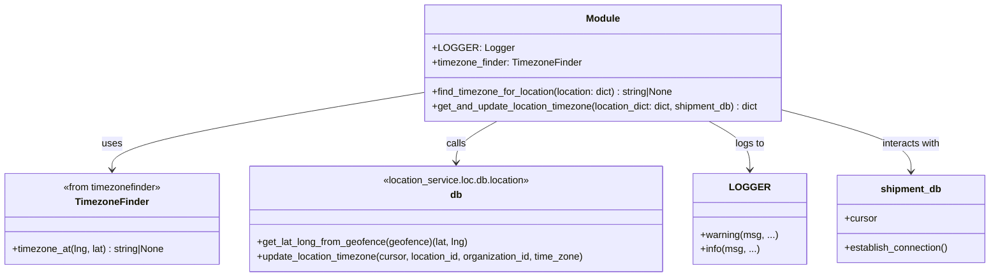

# Diagram: common/location_service/location_service/loc/utilities/location_timezone_updater.py


> Auto-generated by Obscura crawlers

## Diagram 1

```mermaid
flowchart TD
  A[Start: get_and_update_location_timezone(location_dict, shipment_db)] --> B{has location_id and organization_id?}
  B -- No --> C[Return location_dict unchanged]
  B -- Yes --> D[calculated_timezone = find_timezone_for_location(location_dict)]
  D --> E{calculated_timezone exists and differs from location_dict.time_zone?}
  E -- No --> C
  E -- Yes --> F[shipment_db.establish_connection()]
  F --> G[cursor = shipment_db.cursor]
  G --> H[LOGGER.info(Update time_zone for location...)]
  H --> I[db.update_location_timezone(cursor, location_id, organization_id, calculated_timezone)]
  I --> J[location_dict.time_zone = calculated_timezone]
  J --> K[Return updated location_dict]
```

> SVG rendering failed for this diagram.

## Diagram 2



### SVG

<svg id="container" width="1649.5390625" xmlns="http://www.w3.org/2000/svg" class="classDiagram" height="456" viewBox="0 0 1649.5390625 456" role="graphics-document document" aria-roledescription="class"><style>#container{font-family:"trebuchet ms",verdana,arial,sans-serif;font-size:16px;fill:#333;}@keyframes edge-animation-frame{from{stroke-dashoffset:0;}}@keyframes dash{to{stroke-dashoffset:0;}}#container .edge-animation-slow{stroke-dasharray:9,5!important;stroke-dashoffset:900;animation:dash 50s linear infinite;stroke-linecap:round;}#container .edge-animation-fast{stroke-dasharray:9,5!important;stroke-dashoffset:900;animation:dash 20s linear infinite;stroke-linecap:round;}#container .error-icon{fill:#552222;}#container .error-text{fill:#552222;stroke:#552222;}#container .edge-thickness-normal{stroke-width:1px;}#container .edge-thickness-thick{stroke-width:3.5px;}#container .edge-pattern-solid{stroke-dasharray:0;}#container .edge-thickness-invisible{stroke-width:0;fill:none;}#container .edge-pattern-dashed{stroke-dasharray:3;}#container .edge-pattern-dotted{stroke-dasharray:2;}#container .marker{fill:#333333;stroke:#333333;}#container .marker.cross{stroke:#333333;}#container svg{font-family:"trebuchet ms",verdana,arial,sans-serif;font-size:16px;}#container p{margin:0;}#container g.classGroup text{fill:#9370DB;stroke:none;font-family:"trebuchet ms",verdana,arial,sans-serif;font-size:10px;}#container g.classGroup text .title{font-weight:bolder;}#container .nodeLabel,#container .edgeLabel{color:#131300;}#container .edgeLabel .label rect{fill:#ECECFF;}#container .label text{fill:#131300;}#container .labelBkg{background:#ECECFF;}#container .edgeLabel .label span{background:#ECECFF;}#container .classTitle{font-weight:bolder;}#container .node rect,#container .node circle,#container .node ellipse,#container .node polygon,#container .node path{fill:#ECECFF;stroke:#9370DB;stroke-width:1px;}#container .divider{stroke:#9370DB;stroke-width:1;}#container g.clickable{cursor:pointer;}#container g.classGroup rect{fill:#ECECFF;stroke:#9370DB;}#container g.classGroup line{stroke:#9370DB;stroke-width:1;}#container .classLabel .box{stroke:none;stroke-width:0;fill:#ECECFF;opacity:0.5;}#container .classLabel .label{fill:#9370DB;font-size:10px;}#container .relation{stroke:#333333;stroke-width:1;fill:none;}#container .dashed-line{stroke-dasharray:3;}#container .dotted-line{stroke-dasharray:1 2;}#container #compositionStart,#container .composition{fill:#333333!important;stroke:#333333!important;stroke-width:1;}#container #compositionEnd,#container .composition{fill:#333333!important;stroke:#333333!important;stroke-width:1;}#container #dependencyStart,#container .dependency{fill:#333333!important;stroke:#333333!important;stroke-width:1;}#container #dependencyStart,#container .dependency{fill:#333333!important;stroke:#333333!important;stroke-width:1;}#container #extensionStart,#container .extension{fill:transparent!important;stroke:#333333!important;stroke-width:1;}#container #extensionEnd,#container .extension{fill:transparent!important;stroke:#333333!important;stroke-width:1;}#container #aggregationStart,#container .aggregation{fill:transparent!important;stroke:#333333!important;stroke-width:1;}#container #aggregationEnd,#container .aggregation{fill:transparent!important;stroke:#333333!important;stroke-width:1;}#container #lollipopStart,#container .lollipop{fill:#ECECFF!important;stroke:#333333!important;stroke-width:1;}#container #lollipopEnd,#container .lollipop{fill:#ECECFF!important;stroke:#333333!important;stroke-width:1;}#container .edgeTerminals{font-size:11px;line-height:initial;}#container .classTitleText{text-anchor:middle;font-size:18px;fill:#333;}#container .label-icon{display:inline-block;height:1em;overflow:visible;vertical-align:-0.125em;}#container .node .label-icon path{fill:currentColor;stroke:revert;stroke-width:revert;}#container :root{--mermaid-font-family:"trebuchet ms",verdana,arial,sans-serif;}</style><g><defs><marker id="container_class-aggregationStart" class="marker aggregation class" refX="18" refY="7" markerWidth="190" markerHeight="240" orient="auto"><path d="M 18,7 L9,13 L1,7 L9,1 Z"></path></marker></defs><defs><marker id="container_class-aggregationEnd" class="marker aggregation class" refX="1" refY="7" markerWidth="20" markerHeight="28" orient="auto"><path d="M 18,7 L9,13 L1,7 L9,1 Z"></path></marker></defs><defs><marker id="container_class-extensionStart" class="marker extension class" refX="18" refY="7" markerWidth="190" markerHeight="240" orient="auto"><path d="M 1,7 L18,13 V 1 Z"></path></marker></defs><defs><marker id="container_class-extensionEnd" class="marker extension class" refX="1" refY="7" markerWidth="20" markerHeight="28" orient="auto"><path d="M 1,1 V 13 L18,7 Z"></path></marker></defs><defs><marker id="container_class-compositionStart" class="marker composition class" refX="18" refY="7" markerWidth="190" markerHeight="240" orient="auto"><path d="M 18,7 L9,13 L1,7 L9,1 Z"></path></marker></defs><defs><marker id="container_class-compositionEnd" class="marker composition class" refX="1" refY="7" markerWidth="20" markerHeight="28" orient="auto"><path d="M 18,7 L9,13 L1,7 L9,1 Z"></path></marker></defs><defs><marker id="container_class-dependencyStart" class="marker dependency class" refX="6" refY="7" markerWidth="190" markerHeight="240" orient="auto"><path d="M 5,7 L9,13 L1,7 L9,1 Z"></path></marker></defs><defs><marker id="container_class-dependencyEnd" class="marker dependency class" refX="13" refY="7" markerWidth="20" markerHeight="28" orient="auto"><path d="M 18,7 L9,13 L14,7 L9,1 Z"></path></marker></defs><defs><marker id="container_class-lollipopStart" class="marker lollipop class" refX="13" refY="7" markerWidth="190" markerHeight="240" orient="auto"><circle stroke="black" fill="transparent" cx="7" cy="7" r="6"></circle></marker></defs><defs><marker id="container_class-lollipopEnd" class="marker lollipop class" refX="1" refY="7" markerWidth="190" markerHeight="240" orient="auto"><circle stroke="black" fill="transparent" cx="7" cy="7" r="6"></circle></marker></defs><g class="root"><g class="clusters"></g><g class="edgePaths"><path d="M712.109,152.641L624.999,166.7C537.889,180.76,363.669,208.88,276.559,230.107C189.449,251.333,189.449,265.667,189.449,272.833L189.449,280" id="id_Module_TimezoneFinder_1" class="edge-thickness-normal edge-pattern-solid relation" style=";;;" data-edge="true" data-et="edge" data-id="id_Module_TimezoneFinder_1" data-points="W3sieCI6NzEyLjEwOTM3NSwieSI6MTUyLjY0MDU5MDg1MzcxMzQ2fSx7IngiOjE4OS40NDkyMTg3NSwieSI6MjM3fSx7IngiOjE4OS40NDkyMTg3NSwieSI6Mjg2fV0=" marker-end="url(#container_class-dependencyEnd)"></path><path d="M837.456,200L826.149,206.167C814.843,212.333,792.23,224.667,780.924,236C769.617,247.333,769.617,257.667,769.617,262.833L769.617,268" id="id_Module_db_2" class="edge-thickness-normal edge-pattern-solid relation" style=";;;" data-edge="true" data-et="edge" data-id="id_Module_db_2" data-points="W3sieCI6ODM3LjQ1NTU5MjEwNTI2MzEsInkiOjIwMH0seyJ4Ijo3NjkuNjE3MTg3NSwieSI6MjM3fSx7IngiOjc2OS42MTcxODc1LCJ5IjoyNzR9XQ==" marker-end="url(#container_class-dependencyEnd)"></path><path d="M1189.482,200L1200.788,206.167C1212.095,212.333,1234.708,224.667,1246.014,238C1257.32,251.333,1257.32,265.667,1257.32,272.833L1257.32,280" id="id_Module_LOGGER_3" class="edge-thickness-normal edge-pattern-solid relation" style=";;;" data-edge="true" data-et="edge" data-id="id_Module_LOGGER_3" data-points="W3sieCI6MTE4OS40ODE5MDc4OTQ3MzY5LCJ5IjoyMDB9LHsieCI6MTI1Ny4zMjAzMTI1LCJ5IjoyMzd9LHsieCI6MTI1Ny4zMjAzMTI1LCJ5IjoyODZ9XQ==" marker-end="url(#container_class-dependencyEnd)"></path><path d="M1314.828,183.297L1348.844,192.247C1382.859,201.198,1450.891,219.099,1484.906,235.716C1518.922,252.333,1518.922,267.667,1518.922,275.333L1518.922,283" id="id_Module_shipment_db_4" class="edge-thickness-normal edge-pattern-solid relation" style=";;;" data-edge="true" data-et="edge" data-id="id_Module_shipment_db_4" data-points="W3sieCI6MTMxNC44MjgxMjUsInkiOjE4My4yOTY3NjM0MjM5MDh9LHsieCI6MTUxOC45MjE4NzUsInkiOjIzN30seyJ4IjoxNTE4LjkyMTg3NSwieSI6Mjg5fV0=" marker-end="url(#container_class-dependencyEnd)"></path></g><g class="edgeLabels"><g class="edgeLabel" transform="translate(189.44921875, 237)"><g class="label" data-id="id_Module_TimezoneFinder_1" transform="translate(-16.4921875, -12)"><foreignObject width="32.984375" height="24"><div xmlns="http://www.w3.org/1999/xhtml" class="labelBkg" style="display: table-cell; white-space: nowrap; line-height: 1.5; max-width: 200px; text-align: center;"><span class="edgeLabel"><p>uses</p></span></div></foreignObject></g></g><g class="edgeLabel" transform="translate(769.6171875, 237)"><g class="label" data-id="id_Module_db_2" transform="translate(-16.4453125, -12)"><foreignObject width="32.890625" height="24"><div xmlns="http://www.w3.org/1999/xhtml" class="labelBkg" style="display: table-cell; white-space: nowrap; line-height: 1.5; max-width: 200px; text-align: center;"><span class="edgeLabel"><p>calls</p></span></div></foreignObject></g></g><g class="edgeLabel" transform="translate(1257.3203125, 237)"><g class="label" data-id="id_Module_LOGGER_3" transform="translate(-24.3828125, -12)"><foreignObject width="48.765625" height="24"><div xmlns="http://www.w3.org/1999/xhtml" class="labelBkg" style="display: table-cell; white-space: nowrap; line-height: 1.5; max-width: 200px; text-align: center;"><span class="edgeLabel"><p>logs to</p></span></div></foreignObject></g></g><g class="edgeLabel" transform="translate(1518.921875, 237)"><g class="label" data-id="id_Module_shipment_db_4" transform="translate(-49.375, -12)"><foreignObject width="98.75" height="24"><div xmlns="http://www.w3.org/1999/xhtml" class="labelBkg" style="display: table-cell; white-space: nowrap; line-height: 1.5; max-width: 200px; text-align: center;"><span class="edgeLabel"><p>interacts with</p></span></div></foreignObject></g></g></g><g class="nodes"><g class="node default" id="classId-Module-0" transform="translate(1013.46875, 104)"><g class="basic label-container"><path d="M-301.359375 -96 L301.359375 -96 L301.359375 96 L-301.359375 96" stroke="none" stroke-width="0" fill="#ECECFF" style=""></path><path d="M-301.359375 -96 C-112.878528715323 -96, 75.602317569354 -96, 301.359375 -96 M-301.359375 -96 C-95.40797017372358 -96, 110.54343465255283 -96, 301.359375 -96 M301.359375 -96 C301.359375 -46.790568523424014, 301.359375 2.4188629531519723, 301.359375 96 M301.359375 -96 C301.359375 -25.554094133616758, 301.359375 44.891811732766485, 301.359375 96 M301.359375 96 C70.99539830176062 96, -159.36857839647877 96, -301.359375 96 M301.359375 96 C63.12143701183348 96, -175.11650097633304 96, -301.359375 96 M-301.359375 96 C-301.359375 28.117119006406696, -301.359375 -39.76576198718661, -301.359375 -96 M-301.359375 96 C-301.359375 35.54789799443784, -301.359375 -24.90420401112432, -301.359375 -96" stroke="#9370DB" stroke-width="1.3" fill="none" stroke-dasharray="0 0" style=""></path></g><g class="annotation-group text" transform="translate(0, -72)"></g><g class="label-group text" transform="translate(-27.09375, -72)"><g class="label" style="font-weight: bolder" transform="translate(0,-12)"><foreignObject width="54.1875" height="24"><div xmlns="http://www.w3.org/1999/xhtml" style="display: table-cell; white-space: nowrap; line-height: 1.5; max-width: 104px; text-align: center;"><span class="nodeLabel markdown-node-label" style=""><p>Module</p></span></div></foreignObject></g></g><g class="members-group text" transform="translate(-289.359375, -24)"><g class="label" style="" transform="translate(0,-12)"><foreignObject width="121.015625" height="24"><div xmlns="http://www.w3.org/1999/xhtml" style="display: table-cell; white-space: nowrap; line-height: 1.5; max-width: 179px; text-align: center;"><span class="nodeLabel markdown-node-label" style=""><p>+LOGGER: Logger</p></span></div></foreignObject></g><g class="label" style="" transform="translate(0,12)"><foreignObject width="248.875" height="24"><div xmlns="http://www.w3.org/1999/xhtml" style="display: table-cell; white-space: nowrap; line-height: 1.5; max-width: 307px; text-align: center;"><span class="nodeLabel markdown-node-label" style=""><p>+timezone_finder: TimezoneFinder</p></span></div></foreignObject></g></g><g class="methods-group text" transform="translate(-289.359375, 48)"><g class="label" style="" transform="translate(0,-12)"><foreignObject width="409.125" height="24"><div xmlns="http://www.w3.org/1999/xhtml" style="display: table-cell; white-space: nowrap; line-height: 1.5; max-width: 466px; text-align: center;"><span class="nodeLabel markdown-node-label" style=""><p>+find_timezone_for_location(location: dict) : string|None</p></span></div></foreignObject></g><g class="label" style="" transform="translate(0,12)"><foreignObject width="551.625" height="24"><div xmlns="http://www.w3.org/1999/xhtml" style="display: table-cell; white-space: nowrap; line-height: 1.5; max-width: 609px; text-align: center;"><span class="nodeLabel markdown-node-label" style=""><p>+get_and_update_location_timezone(location_dict: dict, shipment_db) : dict</p></span></div></foreignObject></g></g><g class="divider" style=""><path d="M-301.359375 -48 C-103.36106052280655 -48, 94.63725395438689 -48, 301.359375 -48 M-301.359375 -48 C-100.0568012112627 -48, 101.24577257747461 -48, 301.359375 -48" stroke="#9370DB" stroke-width="1.3" fill="none" stroke-dasharray="0 0" style=""></path></g><g class="divider" style=""><path d="M-301.359375 24 C-113.20399779882962 24, 74.95137940234076 24, 301.359375 24 M-301.359375 24 C-73.21514388191846 24, 154.92908723616307 24, 301.359375 24" stroke="#9370DB" stroke-width="1.3" fill="none" stroke-dasharray="0 0" style=""></path></g></g><g class="node default" id="classId-TimezoneFinder-1" transform="translate(189.44921875, 361)"><g class="basic label-container"><path d="M-181.44921875 -75 L181.44921875 -75 L181.44921875 75 L-181.44921875 75" stroke="none" stroke-width="0" fill="#ECECFF" style=""></path><path d="M-181.44921875 -75 C-101.36745038664006 -75, -21.285682023280117 -75, 181.44921875 -75 M-181.44921875 -75 C-94.0062065795734 -75, -6.563194409146803 -75, 181.44921875 -75 M181.44921875 -75 C181.44921875 -35.4006741073365, 181.44921875 4.198651785327002, 181.44921875 75 M181.44921875 -75 C181.44921875 -26.441795115710143, 181.44921875 22.116409768579715, 181.44921875 75 M181.44921875 75 C48.105206598911366 75, -85.23880555217727 75, -181.44921875 75 M181.44921875 75 C67.2818784016349 75, -46.8854619467302 75, -181.44921875 75 M-181.44921875 75 C-181.44921875 29.363803229638783, -181.44921875 -16.272393540722433, -181.44921875 -75 M-181.44921875 75 C-181.44921875 40.00793572779585, -181.44921875 5.015871455591693, -181.44921875 -75" stroke="#9370DB" stroke-width="1.3" fill="none" stroke-dasharray="0 0" style=""></path></g><g class="annotation-group text" transform="translate(-83.2109375, -51)"><g class="label" style="" transform="translate(0,-12)"><foreignObject width="166.421875" height="24"><div xmlns="http://www.w3.org/1999/xhtml" style="display: table-cell; white-space: nowrap; line-height: 1.5; max-width: 216px; text-align: center;"><span class="nodeLabel markdown-node-label" style=""><p>«from timezonefinder»</p></span></div></foreignObject></g></g><g class="label-group text" transform="translate(-57.9453125, -27)"><g class="label" style="font-weight: bolder" transform="translate(0,-12)"><foreignObject width="115.890625" height="24"><div xmlns="http://www.w3.org/1999/xhtml" style="display: table-cell; white-space: nowrap; line-height: 1.5; max-width: 166px; text-align: center;"><span class="nodeLabel markdown-node-label" style=""><p>TimezoneFinder</p></span></div></foreignObject></g></g><g class="members-group text" transform="translate(-169.44921875, 21)"></g><g class="methods-group text" transform="translate(-169.44921875, 51)"><g class="label" style="" transform="translate(0,-12)"><foreignObject width="255.6875" height="24"><div xmlns="http://www.w3.org/1999/xhtml" style="display: table-cell; white-space: nowrap; line-height: 1.5; max-width: 313px; text-align: center;"><span class="nodeLabel markdown-node-label" style=""><p>+timezone_at(lng, lat) : string|None</p></span></div></foreignObject></g></g><g class="divider" style=""><path d="M-181.44921875 -3 C-106.94136877381098 -3, -32.43351879762196 -3, 181.44921875 -3 M-181.44921875 -3 C-76.58387245841459 -3, 28.28147383317082 -3, 181.44921875 -3" stroke="#9370DB" stroke-width="1.3" fill="none" stroke-dasharray="0 0" style=""></path></g><g class="divider" style=""><path d="M-181.44921875 21 C-64.3138365914772 21, 52.821545567045604 21, 181.44921875 21 M-181.44921875 21 C-88.59965735109459 21, 4.249904047810816 21, 181.44921875 21" stroke="#9370DB" stroke-width="1.3" fill="none" stroke-dasharray="0 0" style=""></path></g></g><g class="node default" id="classId-db-2" transform="translate(769.6171875, 361)"><g class="basic label-container"><path d="M-348.71875 -87 L348.71875 -87 L348.71875 87 L-348.71875 87" stroke="none" stroke-width="0" fill="#ECECFF" style=""></path><path d="M-348.71875 -87 C-192.28658815678182 -87, -35.854426313563636 -87, 348.71875 -87 M-348.71875 -87 C-86.93101429786117 -87, 174.85672140427766 -87, 348.71875 -87 M348.71875 -87 C348.71875 -48.034664048940876, 348.71875 -9.069328097881751, 348.71875 87 M348.71875 -87 C348.71875 -18.29954887528487, 348.71875 50.40090224943026, 348.71875 87 M348.71875 87 C97.64135784655741 87, -153.43603430688518 87, -348.71875 87 M348.71875 87 C139.1303588130676 87, -70.4580323738648 87, -348.71875 87 M-348.71875 87 C-348.71875 18.823629846821362, -348.71875 -49.352740306357276, -348.71875 -87 M-348.71875 87 C-348.71875 19.963439475448922, -348.71875 -47.073121049102156, -348.71875 -87" stroke="#9370DB" stroke-width="1.3" fill="none" stroke-dasharray="0 0" style=""></path></g><g class="annotation-group text" transform="translate(-123.78125, -63)"><g class="label" style="" transform="translate(0,-12)"><foreignObject width="247.5625" height="24"><div xmlns="http://www.w3.org/1999/xhtml" style="display: table-cell; white-space: nowrap; line-height: 1.5; max-width: 298px; text-align: center;"><span class="nodeLabel markdown-node-label" style=""><p>«location_service.loc.db.location»</p></span></div></foreignObject></g></g><g class="label-group text" transform="translate(-9.578125, -39)"><g class="label" style="font-weight: bolder" transform="translate(0,-12)"><foreignObject width="19.15625" height="24"><div xmlns="http://www.w3.org/1999/xhtml" style="display: table-cell; white-space: nowrap; line-height: 1.5; max-width: 69px; text-align: center;"><span class="nodeLabel markdown-node-label" style=""><p>db</p></span></div></foreignObject></g></g><g class="members-group text" transform="translate(-336.71875, 9)"></g><g class="methods-group text" transform="translate(-336.71875, 39)"><g class="label" style="" transform="translate(0,-12)"><foreignObject width="349.546875" height="24"><div xmlns="http://www.w3.org/1999/xhtml" style="display: table-cell; white-space: nowrap; line-height: 1.5; max-width: 407px; text-align: center;"><span class="nodeLabel markdown-node-label" style=""><p>+get_lat_long_from_geofence(geofence)(lat, lng)</p></span></div></foreignObject></g><g class="label" style="" transform="translate(0,12)"><foreignObject width="549.65625" height="24"><div xmlns="http://www.w3.org/1999/xhtml" style="display: table-cell; white-space: nowrap; line-height: 1.5; max-width: 607px; text-align: center;"><span class="nodeLabel markdown-node-label" style=""><p>+update_location_timezone(cursor, location_id, organization_id, time_zone)</p></span></div></foreignObject></g></g><g class="divider" style=""><path d="M-348.71875 -15 C-186.79606981705132 -15, -24.873389634102637 -15, 348.71875 -15 M-348.71875 -15 C-87.36898246954496 -15, 173.98078506091008 -15, 348.71875 -15" stroke="#9370DB" stroke-width="1.3" fill="none" stroke-dasharray="0 0" style=""></path></g><g class="divider" style=""><path d="M-348.71875 9 C-99.2902383928402 9, 150.1382732143196 9, 348.71875 9 M-348.71875 9 C-103.2777235025712 9, 142.1633029948576 9, 348.71875 9" stroke="#9370DB" stroke-width="1.3" fill="none" stroke-dasharray="0 0" style=""></path></g></g><g class="node default" id="classId-LOGGER-3" transform="translate(1257.3203125, 361)"><g class="basic label-container"><path d="M-88.984375 -75 L88.984375 -75 L88.984375 75 L-88.984375 75" stroke="none" stroke-width="0" fill="#ECECFF" style=""></path><path d="M-88.984375 -75 C-27.432996127751927 -75, 34.118382744496145 -75, 88.984375 -75 M-88.984375 -75 C-25.572374858024013 -75, 37.839625283951975 -75, 88.984375 -75 M88.984375 -75 C88.984375 -26.936006045259113, 88.984375 21.127987909481774, 88.984375 75 M88.984375 -75 C88.984375 -34.82514872577205, 88.984375 5.349702548455895, 88.984375 75 M88.984375 75 C26.28985728659316 75, -36.40466042681368 75, -88.984375 75 M88.984375 75 C17.83999353310844 75, -53.30438793378312 75, -88.984375 75 M-88.984375 75 C-88.984375 43.77874249388367, -88.984375 12.557484987767332, -88.984375 -75 M-88.984375 75 C-88.984375 19.349866592219385, -88.984375 -36.30026681556123, -88.984375 -75" stroke="#9370DB" stroke-width="1.3" fill="none" stroke-dasharray="0 0" style=""></path></g><g class="annotation-group text" transform="translate(0, -51)"></g><g class="label-group text" transform="translate(-28.765625, -51)"><g class="label" style="font-weight: bolder" transform="translate(0,-12)"><foreignObject width="57.53125" height="24"><div xmlns="http://www.w3.org/1999/xhtml" style="display: table-cell; white-space: nowrap; line-height: 1.5; max-width: 107px; text-align: center;"><span class="nodeLabel markdown-node-label" style=""><p>LOGGER</p></span></div></foreignObject></g></g><g class="members-group text" transform="translate(-76.984375, -3)"></g><g class="methods-group text" transform="translate(-76.984375, 27)"><g class="label" style="" transform="translate(0,-12)"><foreignObject width="125.203125" height="24"><div xmlns="http://www.w3.org/1999/xhtml" style="display: table-cell; white-space: nowrap; line-height: 1.5; max-width: 183px; text-align: center;"><span class="nodeLabel markdown-node-label" style=""><p>+warning(msg, ...)</p></span></div></foreignObject></g><g class="label" style="" transform="translate(0,12)"><foreignObject width="95.890625" height="24"><div xmlns="http://www.w3.org/1999/xhtml" style="display: table-cell; white-space: nowrap; line-height: 1.5; max-width: 153px; text-align: center;"><span class="nodeLabel markdown-node-label" style=""><p>+info(msg, ...)</p></span></div></foreignObject></g></g><g class="divider" style=""><path d="M-88.984375 -27 C-28.96732398199655 -27, 31.0497270360069 -27, 88.984375 -27 M-88.984375 -27 C-52.41821720245587 -27, -15.852059404911742 -27, 88.984375 -27" stroke="#9370DB" stroke-width="1.3" fill="none" stroke-dasharray="0 0" style=""></path></g><g class="divider" style=""><path d="M-88.984375 -3 C-50.904438756770425 -3, -12.82450251354085 -3, 88.984375 -3 M-88.984375 -3 C-36.50063165091498 -3, 15.983111698170035 -3, 88.984375 -3" stroke="#9370DB" stroke-width="1.3" fill="none" stroke-dasharray="0 0" style=""></path></g></g><g class="node default" id="classId-shipment_db-4" transform="translate(1518.921875, 361)"><g class="basic label-container"><path d="M-122.6171875 -72 L122.6171875 -72 L122.6171875 72 L-122.6171875 72" stroke="none" stroke-width="0" fill="#ECECFF" style=""></path><path d="M-122.6171875 -72 C-58.68090566783712 -72, 5.255376164325753 -72, 122.6171875 -72 M-122.6171875 -72 C-66.26301581208321 -72, -9.908844124166436 -72, 122.6171875 -72 M122.6171875 -72 C122.6171875 -19.377301817546297, 122.6171875 33.24539636490741, 122.6171875 72 M122.6171875 -72 C122.6171875 -16.33174255874112, 122.6171875 39.33651488251776, 122.6171875 72 M122.6171875 72 C54.39745281761182 72, -13.822281864776357 72, -122.6171875 72 M122.6171875 72 C56.217529080456416 72, -10.182129339087169 72, -122.6171875 72 M-122.6171875 72 C-122.6171875 35.18091292850262, -122.6171875 -1.6381741429947567, -122.6171875 -72 M-122.6171875 72 C-122.6171875 20.402451050616406, -122.6171875 -31.195097898767187, -122.6171875 -72" stroke="#9370DB" stroke-width="1.3" fill="none" stroke-dasharray="0 0" style=""></path></g><g class="annotation-group text" transform="translate(0, -48)"></g><g class="label-group text" transform="translate(-47.96875, -48)"><g class="label" style="font-weight: bolder" transform="translate(0,-12)"><foreignObject width="95.9375" height="24"><div xmlns="http://www.w3.org/1999/xhtml" style="display: table-cell; white-space: nowrap; line-height: 1.5; max-width: 146px; text-align: center;"><span class="nodeLabel markdown-node-label" style=""><p>shipment_db</p></span></div></foreignObject></g></g><g class="members-group text" transform="translate(-110.6171875, 0)"><g class="label" style="" transform="translate(0,-12)"><foreignObject width="53.71875" height="24"><div xmlns="http://www.w3.org/1999/xhtml" style="display: table-cell; white-space: nowrap; line-height: 1.5; max-width: 112px; text-align: center;"><span class="nodeLabel markdown-node-label" style=""><p>+cursor</p></span></div></foreignObject></g></g><g class="methods-group text" transform="translate(-110.6171875, 48)"><g class="label" style="" transform="translate(0,-12)"><foreignObject width="173.265625" height="24"><div xmlns="http://www.w3.org/1999/xhtml" style="display: table-cell; white-space: nowrap; line-height: 1.5; max-width: 231px; text-align: center;"><span class="nodeLabel markdown-node-label" style=""><p>+establish_connection()</p></span></div></foreignObject></g></g><g class="divider" style=""><path d="M-122.6171875 -24 C-50.5803426466198 -24, 21.456502206760405 -24, 122.6171875 -24 M-122.6171875 -24 C-57.44377199096863 -24, 7.729643518062744 -24, 122.6171875 -24" stroke="#9370DB" stroke-width="1.3" fill="none" stroke-dasharray="0 0" style=""></path></g><g class="divider" style=""><path d="M-122.6171875 24 C-30.10276129488878 24, 62.41166491022244 24, 122.6171875 24 M-122.6171875 24 C-28.02378935369076 24, 66.56960879261848 24, 122.6171875 24" stroke="#9370DB" stroke-width="1.3" fill="none" stroke-dasharray="0 0" style=""></path></g></g></g></g></g></svg>
