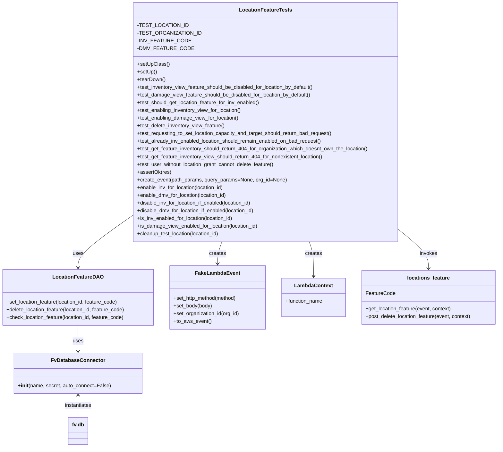
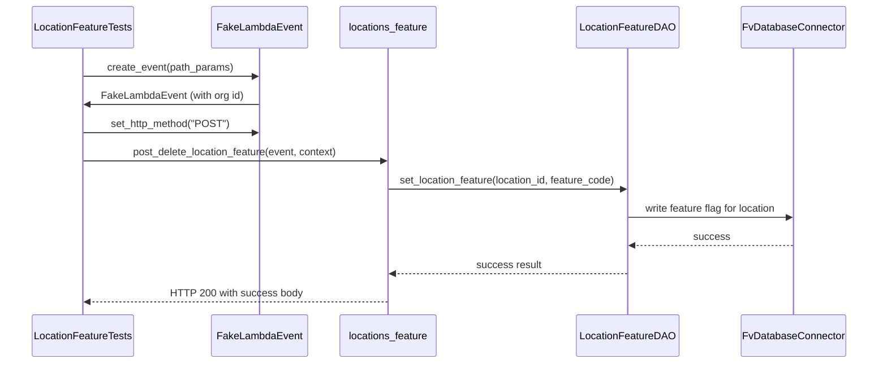
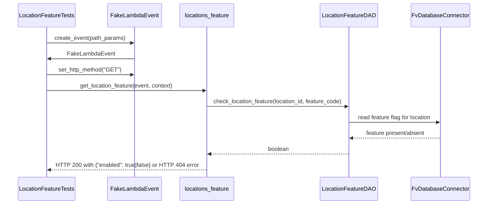
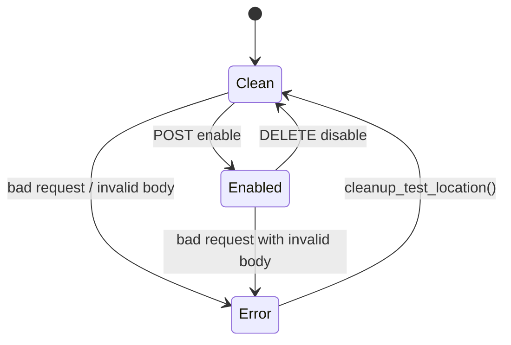

# Diagram: common/location_service/location_service_tests/integration/test_location_feature.py

> Auto-generated by Obscura crawlers

## Diagram 1

### SVG

<svg id="container" width="1556.546875" xmlns="http://www.w3.org/2000/svg" class="classDiagram" height="1390" viewBox="0 0 1556.546875 1390" role="graphics-document document" aria-roledescription="class"><g><defs><marker id="container_class-aggregationStart" class="marker aggregation class" refX="18" refY="7" markerWidth="190" markerHeight="240" orient="auto"><path d="M 18,7 L9,13 L1,7 L9,1 Z"></path></marker></defs><defs><marker id="container_class-aggregationEnd" class="marker aggregation class" refX="1" refY="7" markerWidth="20" markerHeight="28" orient="auto"><path d="M 18,7 L9,13 L1,7 L9,1 Z"></path></marker></defs><defs><marker id="container_class-extensionStart" class="marker extension class" refX="18" refY="7" markerWidth="190" markerHeight="240" orient="auto"><path d="M 1,7 L18,13 V 1 Z"></path></marker></defs><defs><marker id="container_class-extensionEnd" class="marker extension class" refX="1" refY="7" markerWidth="20" markerHeight="28" orient="auto"><path d="M 1,1 V 13 L18,7 Z"></path></marker></defs><defs><marker id="container_class-compositionStart" class="marker composition class" refX="18" refY="7" markerWidth="190" markerHeight="240" orient="auto"><path d="M 18,7 L9,13 L1,7 L9,1 Z"></path></marker></defs><defs><marker id="container_class-compositionEnd" class="marker composition class" refX="1" refY="7" markerWidth="20" markerHeight="28" orient="auto"><path d="M 18,7 L9,13 L1,7 L9,1 Z"></path></marker></defs><defs><marker id="container_class-dependencyStart" class="marker dependency class" refX="6" refY="7" markerWidth="190" markerHeight="240" orient="auto"><path d="M 5,7 L9,13 L1,7 L9,1 Z"></path></marker></defs><defs><marker id="container_class-dependencyEnd" class="marker dependency class" refX="13" refY="7" markerWidth="20" markerHeight="28" orient="auto"><path d="M 18,7 L9,13 L14,7 L9,1 Z"></path></marker></defs><defs><marker id="container_class-lollipopStart" class="marker lollipop class" refX="13" refY="7" markerWidth="190" markerHeight="240" orient="auto"><circle stroke="black" fill="transparent" cx="7" cy="7" r="6"></circle></marker></defs><defs><marker id="container_class-lollipopEnd" class="marker lollipop class" refX="1" refY="7" markerWidth="190" markerHeight="240" orient="auto"><circle stroke="black" fill="transparent" cx="7" cy="7" r="6"></circle></marker></defs><g class="root"><g class="clusters"></g><g class="edgePaths"><path d="M413.885,670.564L385.693,690.303C357.501,710.043,301.118,749.521,272.926,776.427C244.734,803.333,244.734,817.667,244.734,824.833L244.734,832" id="id_LocationFeatureTests_LocationFeatureDAO_1" class="edge-thickness-normal edge-pattern-solid relation" style=";;;" data-edge="true" data-et="edge" data-id="id_LocationFeatureTests_LocationFeatureDAO_1" data-points="W3sieCI6NDEzLjg4NDc2NTYyNSwieSI6NjcwLjU2NDEyODk3MDEzMTR9LHsieCI6MjQ0LjczNDM3NSwieSI6Nzg5fSx7IngiOjI0NC43MzQzNzUsInkiOjgzOH1d" marker-end="url(#container_class-dependencyEnd)"></path><path d="M693.443,752L691.198,758.167C688.953,764.333,684.463,776.667,682.218,788C679.973,799.333,679.973,809.667,679.973,814.833L679.973,820" id="id_LocationFeatureTests_FakeLambdaEvent_2" class="edge-thickness-normal edge-pattern-solid relation" style=";;;" data-edge="true" data-et="edge" data-id="id_LocationFeatureTests_FakeLambdaEvent_2" data-points="W3sieCI6NjkzLjQ0MjUwOTM1OTcxODgsInkiOjc1Mn0seyJ4Ijo2NzkuOTcyNjU2MjUsInkiOjc4OX0seyJ4Ijo2NzkuOTcyNjU2MjUsInkiOjgyNn1d" marker-end="url(#container_class-dependencyEnd)"></path><path d="M964.296,752L966.541,758.167C968.786,764.333,973.276,776.667,975.521,794.5C977.766,812.333,977.766,835.667,977.766,847.333L977.766,859" id="id_LocationFeatureTests_LambdaContext_3" class="edge-thickness-normal edge-pattern-solid relation" style=";;;" data-edge="true" data-et="edge" data-id="id_LocationFeatureTests_LambdaContext_3" data-points="W3sieCI6OTY0LjI5NTc3MTg5MDI4MTIsInkiOjc1Mn0seyJ4Ijo5NzcuNzY1NjI1LCJ5Ijo3ODl9LHsieCI6OTc3Ljc2NTYyNSwieSI6ODY1fV0=" marker-end="url(#container_class-dependencyEnd)"></path><path d="M244.734,1012L244.734,1020.167C244.734,1028.333,244.734,1044.667,244.734,1058C244.734,1071.333,244.734,1081.667,244.734,1086.833L244.734,1092" id="id_LocationFeatureDAO_FvDatabaseConnector_4" class="edge-thickness-normal edge-pattern-solid relation" style=";;;" data-edge="true" data-et="edge" data-id="id_LocationFeatureDAO_FvDatabaseConnector_4" data-points="W3sieCI6MjQ0LjczNDM3NSwieSI6MTAxMn0seyJ4IjoyNDQuNzM0Mzc1LCJ5IjoxMDYxfSx7IngiOjI0NC43MzQzNzUsInkiOjEwOTh9XQ==" marker-end="url(#container_class-dependencyEnd)"></path><path d="M1243.854,713.5L1259.511,726.083C1275.169,738.667,1306.485,763.833,1322.143,784.083C1337.801,804.333,1337.801,819.667,1337.801,827.333L1337.801,835" id="id_LocationFeatureTests_locations_feature_5" class="edge-thickness-normal edge-pattern-solid relation" style=";;;" data-edge="true" data-et="edge" data-id="id_LocationFeatureTests_locations_feature_5" data-points="W3sieCI6MTI0My44NTM1MTU2MjUsInkiOjcxMy40OTk4MTc3MDk0MzI2fSx7IngiOjEzMzcuODAwNzgxMjUsInkiOjc4OX0seyJ4IjoxMzM3LjgwMDc4MTI1LCJ5Ijo4NDF9XQ==" marker-end="url(#container_class-dependencyEnd)"></path><path d="M244.734,1230L244.734,1235.167C244.734,1240.333,244.734,1250.667,244.734,1262C244.734,1273.333,244.734,1285.667,244.734,1291.833L244.734,1298" id="id_FvDatabaseConnector_fv.db_6" class="edge-thickness-normal edge-pattern-dashed relation" style=";;;" data-edge="true" data-et="edge" data-id="id_FvDatabaseConnector_fv.db_6" data-points="W3sieCI6MjQ0LjczNDM3NSwieSI6MTIyNH0seyJ4IjoyNDQuNzM0Mzc1LCJ5IjoxMjYxfSx7IngiOjI0NC43MzQzNzUsInkiOjEyOTh9XQ==" marker-start="url(#container_class-dependencyStart)"></path></g><g class="edgeLabels"><g class="edgeLabel" transform="translate(244.734375, 789)"><g class="label" data-id="id_LocationFeatureTests_LocationFeatureDAO_1" transform="translate(-16.4921875, -12)"><foreignObject width="32.984375" height="24">

uses

</foreignObject></g></g><g class="edgeLabel" transform="translate(679.97265625, 789)"><g class="label" data-id="id_LocationFeatureTests_FakeLambdaEvent_2" transform="translate(-26.171875, -12)"><foreignObject width="52.34375" height="24">

creates

</foreignObject></g></g><g class="edgeLabel" transform="translate(977.765625, 789)"><g class="label" data-id="id_LocationFeatureTests_LambdaContext_3" transform="translate(-26.171875, -12)"><foreignObject width="52.34375" height="24">

creates

</foreignObject></g></g><g class="edgeLabel" transform="translate(244.734375, 1061)"><g class="label" data-id="id_LocationFeatureDAO_FvDatabaseConnector_4" transform="translate(-16.4921875, -12)"><foreignObject width="32.984375" height="24">

uses

</foreignObject></g></g><g class="edgeLabel" transform="translate(1337.80078125, 789)"><g class="label" data-id="id_LocationFeatureTests_locations_feature_5" transform="translate(-27.5859375, -12)"><foreignObject width="55.171875" height="24">

invokes

</foreignObject></g></g><g class="edgeLabel" transform="translate(244.734375, 1261)"><g class="label" data-id="id_FvDatabaseConnector_fv.db_6" transform="translate(-42.9140625, -12)"><foreignObject width="85.828125" height="24">

instantiates

</foreignObject></g></g></g><g class="nodes"><g class="node default" id="classId-LocationFeatureTests-0" transform="translate(828.869140625, 380)"><g class="basic label-container"><path d="M-414.984375 -372 L414.984375 -372 L414.984375 372 L-414.984375 372" stroke="none" stroke-width="0" fill="#ECECFF" style=""></path><path d="M-414.984375 -372 C-165.76154756731094 -372, 83.46127986537812 -372, 414.984375 -372 M-414.984375 -372 C-244.38655632522645 -372, -73.7887376504529 -372, 414.984375 -372 M414.984375 -372 C414.984375 -159.34750548755454, 414.984375 53.304989024890915, 414.984375 372 M414.984375 -372 C414.984375 -76.67076602783732, 414.984375 218.65846794432537, 414.984375 372 M414.984375 372 C168.24540248080643 372, -78.49357003838713 372, -414.984375 372 M414.984375 372 C213.0179832068925 372, 11.05159141378499 372, -414.984375 372 M-414.984375 372 C-414.984375 123.99337036906985, -414.984375 -124.0132592618603, -414.984375 -372 M-414.984375 372 C-414.984375 124.5956837134379, -414.984375 -122.80863257312421, -414.984375 -372" stroke="#9370DB" stroke-width="1.3" fill="none" stroke-dasharray="0 0" style=""></path></g><g class="annotation-group text" transform="translate(0, -348)"></g><g class="label-group text" transform="translate(-77.84375, -348)"><g class="label" style="font-weight: bolder" transform="translate(0,-12)"><foreignObject width="155.6875" height="24">

LocationFeatureTests

</foreignObject></g></g><g class="members-group text" transform="translate(-402.984375, -300)"><g class="label" style="" transform="translate(0,-12)"><foreignObject width="140.46875" height="24">

-TEST_LOCATION_ID

</foreignObject></g><g class="label" style="" transform="translate(0,12)"><foreignObject width="176.421875" height="24">

-TEST_ORGANIZATION_ID

</foreignObject></g><g class="label" style="" transform="translate(0,36)"><foreignObject width="146.671875" height="24">

-INV_FEATURE_CODE

</foreignObject></g><g class="label" style="" transform="translate(0,60)"><foreignObject width="153.59375" height="24">

-DMV_FEATURE_CODE

</foreignObject></g></g><g class="methods-group text" transform="translate(-402.984375, -180)"><g class="label" style="" transform="translate(0,-12)"><foreignObject width="97.15625" height="24">

+setUpClass()

</foreignObject></g><g class="label" style="" transform="translate(0,12)"><foreignObject width="60.421875" height="24">

+setUp()

</foreignObject></g><g class="label" style="" transform="translate(0,36)"><foreignObject width="87.75" height="24">

+tearDown()

</foreignObject></g><g class="label" style="" transform="translate(0,60)"><foreignObject width="556.375" height="24">

+test_inventory_view_feature_should_be_disabled_for_location_by_default()

</foreignObject></g><g class="label" style="" transform="translate(0,84)"><foreignObject width="544.921875" height="24">

+test_damage_view_feature_should_be_disabled_for_location_by_default()

</foreignObject></g><g class="label" style="" transform="translate(0,108)"><foreignObject width="385.890625" height="24">

+test_should_get_location_feature_for_inv_enabled()

</foreignObject></g><g class="label" style="" transform="translate(0,132)"><foreignObject width="328.34375" height="24">

+test_enabling_inventory_view_for_location()

</foreignObject></g><g class="label" style="" transform="translate(0,156)"><foreignObject width="316.890625" height="24">

+test_enabling_damage_view_for_location()

</foreignObject></g><g class="label" style="" transform="translate(0,180)"><foreignObject width="275.84375" height="24">

+test_delete_inventory_view_feature()

</foreignObject></g><g class="label" style="" transform="translate(0,204)"><foreignObject width="616.703125" height="24">

+test_requesting_to_set_location_capacity_and_target_should_return_bad_request()

</foreignObject></g><g class="label" style="" transform="translate(0,228)"><foreignObject width="581.421875" height="24">

+test_already_inv_enabled_location_should_remain_enabled_on_bad_request()

</foreignObject></g><g class="label" style="" transform="translate(0,252)"><foreignObject width="728.125" height="24">

+test_get_feature_inventory_should_return_404_for_organization_which_doesnt_own_the_location()

</foreignObject></g><g class="label" style="" transform="translate(0,276)"><foreignObject width="585.625" height="24">

+test_get_feature_inventory_view_should_return_404_for_nonexistent_location()

</foreignObject></g><g class="label" style="" transform="translate(0,300)"><foreignObject width="432.90625" height="24">

+test_user_without_location_grant_cannot_delete_feature()

</foreignObject></g><g class="label" style="" transform="translate(0,324)"><foreignObject width="103.265625" height="24">

+assertOk(res)

</foreignObject></g><g class="label" style="" transform="translate(0,348)"><foreignObject width="464.15625" height="24">

+create_event(path_params, query_params=None, org_id=None)

</foreignObject></g><g class="label" style="" transform="translate(0,372)"><foreignObject width="273.46875" height="24">

+enable_inv_for_location(location_id)

</foreignObject></g><g class="label" style="" transform="translate(0,396)"><foreignObject width="282.53125" height="24">

+enable_dmv_for_location(location_id)

</foreignObject></g><g class="label" style="" transform="translate(0,420)"><foreignObject width="361.671875" height="24">

+disable_inv_for_location_if_enabled(location_id)

</foreignObject></g><g class="label" style="" transform="translate(0,444)"><foreignObject width="370.75" height="24">

+disable_dmv_for_location_if_enabled(location_id)

</foreignObject></g><g class="label" style="" transform="translate(0,468)"><foreignObject width="303.015625" height="24">

+is_inv_enabled_for_location(location_id)

</foreignObject></g><g class="label" style="" transform="translate(0,492)"><foreignObject width="378.609375" height="24">

+is_damage_view_enabled_for_location(location_id)

</foreignObject></g><g class="label" style="" transform="translate(0,516)"><foreignObject width="260.125" height="24">

+cleanup_test_location(location_id)

</foreignObject></g></g><g class="divider" style=""><path d="M-414.984375 -324 C-208.44646152268803 -324, -1.908548045376051 -324, 414.984375 -324 M-414.984375 -324 C-93.11889192415163 -324, 228.74659115169675 -324, 414.984375 -324" stroke="#9370DB" stroke-width="1.3" fill="none" stroke-dasharray="0 0" style=""></path></g><g class="divider" style=""><path d="M-414.984375 -204 C-243.93096524159478 -204, -72.87755548318955 -204, 414.984375 -204 M-414.984375 -204 C-174.5198498258725 -204, 65.94467534825498 -204, 414.984375 -204" stroke="#9370DB" stroke-width="1.3" fill="none" stroke-dasharray="0 0" style=""></path></g></g><g class="node default" id="classId-LocationFeatureDAO-1" transform="translate(244.734375, 925)"><g class="basic label-container"><path d="M-236.734375 -87 L236.734375 -87 L236.734375 87 L-236.734375 87" stroke="none" stroke-width="0" fill="#ECECFF" style=""></path><path d="M-236.734375 -87 C-49.38695253622379 -87, 137.96046992755242 -87, 236.734375 -87 M-236.734375 -87 C-75.47192475928009 -87, 85.79052548143983 -87, 236.734375 -87 M236.734375 -87 C236.734375 -24.56032800055597, 236.734375 37.87934399888806, 236.734375 87 M236.734375 -87 C236.734375 -30.96257198344717, 236.734375 25.07485603310566, 236.734375 87 M236.734375 87 C112.434784404135 87, -11.864806191729997 87, -236.734375 87 M236.734375 87 C88.60110367098434 87, -59.53216765803131 87, -236.734375 87 M-236.734375 87 C-236.734375 38.22972974325211, -236.734375 -10.540540513495785, -236.734375 -87 M-236.734375 87 C-236.734375 46.27215177232649, -236.734375 5.544303544652976, -236.734375 -87" stroke="#9370DB" stroke-width="1.3" fill="none" stroke-dasharray="0 0" style=""></path></g><g class="annotation-group text" transform="translate(0, -63)"></g><g class="label-group text" transform="translate(-74.03125, -63)"><g class="label" style="font-weight: bolder" transform="translate(0,-12)"><foreignObject width="148.0625" height="24">

LocationFeatureDAO

</foreignObject></g></g><g class="members-group text" transform="translate(-224.734375, -15)"></g><g class="methods-group text" transform="translate(-224.734375, 15)"><g class="label" style="" transform="translate(0,-12)"><foreignObject width="351.84375" height="24">

+set_location_feature(location_id, feature_code)

</foreignObject></g><g class="label" style="" transform="translate(0,12)"><foreignObject width="375.4375" height="24">

+delete_location_feature(location_id, feature_code)

</foreignObject></g><g class="label" style="" transform="translate(0,36)"><foreignObject width="371.46875" height="24">

+check_location_feature(location_id, feature_code)

</foreignObject></g></g><g class="divider" style=""><path d="M-236.734375 -39 C-99.2736697505112 -39, 38.18703549897759 -39, 236.734375 -39 M-236.734375 -39 C-131.916169246161 -39, -27.09796349232198 -39, 236.734375 -39" stroke="#9370DB" stroke-width="1.3" fill="none" stroke-dasharray="0 0" style=""></path></g><g class="divider" style=""><path d="M-236.734375 -15 C-50.80802569647483 -15, 135.11832360705034 -15, 236.734375 -15 M-236.734375 -15 C-48.7930905605904 -15, 139.1481938788192 -15, 236.734375 -15" stroke="#9370DB" stroke-width="1.3" fill="none" stroke-dasharray="0 0" style=""></path></g></g><g class="node default" id="classId-FvDatabaseConnector-2" transform="translate(244.734375, 1161)"><g class="basic label-container"><path d="M-194.58984375 -63 L194.58984375 -63 L194.58984375 63 L-194.58984375 63" stroke="none" stroke-width="0" fill="#ECECFF" style=""></path><path d="M-194.58984375 -63 C-84.96456743200199 -63, 24.66070888599603 -63, 194.58984375 -63 M-194.58984375 -63 C-100.81034248426008 -63, -7.030841218520152 -63, 194.58984375 -63 M194.58984375 -63 C194.58984375 -22.06727982574143, 194.58984375 18.86544034851714, 194.58984375 63 M194.58984375 -63 C194.58984375 -15.62356255239174, 194.58984375 31.75287489521652, 194.58984375 63 M194.58984375 63 C65.81499845975452 63, -62.95984683049096 63, -194.58984375 63 M194.58984375 63 C44.11937392456599 63, -106.35109590086802 63, -194.58984375 63 M-194.58984375 63 C-194.58984375 28.623642131702603, -194.58984375 -5.752715736594794, -194.58984375 -63 M-194.58984375 63 C-194.58984375 23.690348865824085, -194.58984375 -15.61930226835183, -194.58984375 -63" stroke="#9370DB" stroke-width="1.3" fill="none" stroke-dasharray="0 0" style=""></path></g><g class="annotation-group text" transform="translate(0, -39)"></g><g class="label-group text" transform="translate(-79.3046875, -39)"><g class="label" style="font-weight: bolder" transform="translate(0,-12)"><foreignObject width="158.609375" height="24">

FvDatabaseConnector

</foreignObject></g></g><g class="members-group text" transform="translate(-182.58984375, 9)"></g><g class="methods-group text" transform="translate(-182.58984375, 39)"><g class="label" style="" transform="translate(0,-12)"><foreignObject width="285.875" height="24">

+<strong>init</strong>(name, secret, auto_connect=False)

</foreignObject></g></g><g class="divider" style=""><path d="M-194.58984375 -15 C-53.117977065271475 -15, 88.35388961945705 -15, 194.58984375 -15 M-194.58984375 -15 C-113.74153968180924 -15, -32.89323561361849 -15, 194.58984375 -15" stroke="#9370DB" stroke-width="1.3" fill="none" stroke-dasharray="0 0" style=""></path></g><g class="divider" style=""><path d="M-194.58984375 9 C-64.63482144708348 9, 65.32020085583304 9, 194.58984375 9 M-194.58984375 9 C-106.52742590441885 9, -18.465008058837697 9, 194.58984375 9" stroke="#9370DB" stroke-width="1.3" fill="none" stroke-dasharray="0 0" style=""></path></g></g><g class="node default" id="classId-FakeLambdaEvent-3" transform="translate(679.97265625, 925)"><g class="basic label-container"><path d="M-148.50390625 -99 L148.50390625 -99 L148.50390625 99 L-148.50390625 99" stroke="none" stroke-width="0" fill="#ECECFF" style=""></path><path d="M-148.50390625 -99 C-30.745195243811708 -99, 87.01351576237658 -99, 148.50390625 -99 M-148.50390625 -99 C-77.03159029364306 -99, -5.559274337286126 -99, 148.50390625 -99 M148.50390625 -99 C148.50390625 -42.589672724679225, 148.50390625 13.82065455064155, 148.50390625 99 M148.50390625 -99 C148.50390625 -21.48457861648083, 148.50390625 56.03084276703834, 148.50390625 99 M148.50390625 99 C63.94654507937747 99, -20.610816091245056 99, -148.50390625 99 M148.50390625 99 C30.07870699049343 99, -88.34649226901314 99, -148.50390625 99 M-148.50390625 99 C-148.50390625 29.56474745645653, -148.50390625 -39.87050508708694, -148.50390625 -99 M-148.50390625 99 C-148.50390625 47.00026102549211, -148.50390625 -4.999477949015784, -148.50390625 -99" stroke="#9370DB" stroke-width="1.3" fill="none" stroke-dasharray="0 0" style=""></path></g><g class="annotation-group text" transform="translate(0, -75)"></g><g class="label-group text" transform="translate(-65.8671875, -75)"><g class="label" style="font-weight: bolder" transform="translate(0,-12)"><foreignObject width="131.734375" height="24">

FakeLambdaEvent

</foreignObject></g></g><g class="members-group text" transform="translate(-136.50390625, -27)"></g><g class="methods-group text" transform="translate(-136.50390625, 3)"><g class="label" style="" transform="translate(0,-12)"><foreignObject width="200.078125" height="24">

+set_http_method(method)

</foreignObject></g><g class="label" style="" transform="translate(0,12)"><foreignObject width="121.21875" height="24">

+set_body(body)

</foreignObject></g><g class="label" style="" transform="translate(0,36)"><foreignObject width="207.140625" height="24">

+set_organization_id(org_id)

</foreignObject></g><g class="label" style="" transform="translate(0,60)"><foreignObject width="116.421875" height="24">

+to_aws_event()

</foreignObject></g></g><g class="divider" style=""><path d="M-148.50390625 -51 C-47.63668129604683 -51, 53.23054365790634 -51, 148.50390625 -51 M-148.50390625 -51 C-63.3739855135406 -51, 21.755935222918794 -51, 148.50390625 -51" stroke="#9370DB" stroke-width="1.3" fill="none" stroke-dasharray="0 0" style=""></path></g><g class="divider" style=""><path d="M-148.50390625 -27 C-48.16072051453469 -27, 52.182465220930624 -27, 148.50390625 -27 M-148.50390625 -27 C-52.68899450323249 -27, 43.125917243535014 -27, 148.50390625 -27" stroke="#9370DB" stroke-width="1.3" fill="none" stroke-dasharray="0 0" style=""></path></g></g><g class="node default" id="classId-LambdaContext-4" transform="translate(977.765625, 925)"><g class="basic label-container"><path d="M-99.2890625 -60 L99.2890625 -60 L99.2890625 60 L-99.2890625 60" stroke="none" stroke-width="0" fill="#ECECFF" style=""></path><path d="M-99.2890625 -60 C-22.548871165854024 -60, 54.19132016829195 -60, 99.2890625 -60 M-99.2890625 -60 C-28.08410739057281 -60, 43.12084771885438 -60, 99.2890625 -60 M99.2890625 -60 C99.2890625 -35.95930115780098, 99.2890625 -11.918602315601952, 99.2890625 60 M99.2890625 -60 C99.2890625 -25.731850473800783, 99.2890625 8.536299052398434, 99.2890625 60 M99.2890625 60 C36.82008843848448 60, -25.648885623031035 60, -99.2890625 60 M99.2890625 60 C50.59899591090788 60, 1.9089293218157621 60, -99.2890625 60 M-99.2890625 60 C-99.2890625 30.303922149759018, -99.2890625 0.6078442995180353, -99.2890625 -60 M-99.2890625 60 C-99.2890625 17.72746203312463, -99.2890625 -24.545075933750738, -99.2890625 -60" stroke="#9370DB" stroke-width="1.3" fill="none" stroke-dasharray="0 0" style=""></path></g><g class="annotation-group text" transform="translate(0, -36)"></g><g class="label-group text" transform="translate(-57.296875, -36)"><g class="label" style="font-weight: bolder" transform="translate(0,-12)"><foreignObject width="114.59375" height="24">

LambdaContext

</foreignObject></g></g><g class="members-group text" transform="translate(-87.2890625, 12)"><g class="label" style="" transform="translate(0,-12)"><foreignObject width="117.28125" height="24">

+function_name

</foreignObject></g></g><g class="methods-group text" transform="translate(-87.2890625, 60)"></g><g class="divider" style=""><path d="M-99.2890625 -12 C-20.698603190140403 -12, 57.89185611971919 -12, 99.2890625 -12 M-99.2890625 -12 C-25.703534672977824 -12, 47.88199315404435 -12, 99.2890625 -12" stroke="#9370DB" stroke-width="1.3" fill="none" stroke-dasharray="0 0" style=""></path></g><g class="divider" style=""><path d="M-99.2890625 36 C-55.282676285713976 36, -11.276290071427951 36, 99.2890625 36 M-99.2890625 36 C-58.687478982850294 36, -18.085895465700588 36, 99.2890625 36" stroke="#9370DB" stroke-width="1.3" fill="none" stroke-dasharray="0 0" style=""></path></g></g><g class="node default" id="classId-locations_feature-5" transform="translate(1337.80078125, 925)"><g class="basic label-container"><path d="M-210.74609375 -84 L210.74609375 -84 L210.74609375 84 L-210.74609375 84" stroke="none" stroke-width="0" fill="#ECECFF" style=""></path><path d="M-210.74609375 -84 C-103.9795384773424 -84, 2.7870167953151963 -84, 210.74609375 -84 M-210.74609375 -84 C-80.44717942448258 -84, 49.85173490103483 -84, 210.74609375 -84 M210.74609375 -84 C210.74609375 -30.41534970407242, 210.74609375 23.169300591855162, 210.74609375 84 M210.74609375 -84 C210.74609375 -35.94221623780004, 210.74609375 12.115567524399921, 210.74609375 84 M210.74609375 84 C61.2400198859504 84, -88.2660539780992 84, -210.74609375 84 M210.74609375 84 C68.71788245833875 84, -73.3103288333225 84, -210.74609375 84 M-210.74609375 84 C-210.74609375 31.573759441398956, -210.74609375 -20.85248111720209, -210.74609375 -84 M-210.74609375 84 C-210.74609375 45.56344262347576, -210.74609375 7.126885246951517, -210.74609375 -84" stroke="#9370DB" stroke-width="1.3" fill="none" stroke-dasharray="0 0" style=""></path></g><g class="annotation-group text" transform="translate(0, -60)"></g><g class="label-group text" transform="translate(-64.0234375, -60)"><g class="label" style="font-weight: bolder" transform="translate(0,-12)"><foreignObject width="128.046875" height="24">

locations_feature

</foreignObject></g></g><g class="members-group text" transform="translate(-198.74609375, -12)"><g class="label" style="" transform="translate(0,-12)"><foreignObject width="90.34375" height="24">

FeatureCode

</foreignObject></g></g><g class="methods-group text" transform="translate(-198.74609375, 36)"><g class="label" style="" transform="translate(0,-12)"><foreignObject width="270.375" height="24">

+get_location_feature(event, context)

</foreignObject></g><g class="label" style="" transform="translate(0,12)"><foreignObject width="333.46875" height="24">

+post_delete_location_feature(event, context)

</foreignObject></g></g><g class="divider" style=""><path d="M-210.74609375 -36 C-98.58122845131643 -36, 13.583636847367131 -36, 210.74609375 -36 M-210.74609375 -36 C-45.1466068518331 -36, 120.4528800463338 -36, 210.74609375 -36" stroke="#9370DB" stroke-width="1.3" fill="none" stroke-dasharray="0 0" style=""></path></g><g class="divider" style=""><path d="M-210.74609375 12 C-85.2079318733672 12, 40.3302300032656 12, 210.74609375 12 M-210.74609375 12 C-68.133836979481 12, 74.478419791038 12, 210.74609375 12" stroke="#9370DB" stroke-width="1.3" fill="none" stroke-dasharray="0 0" style=""></path></g></g><g class="node default" id="classId-fv.db-6" transform="translate(244.734375, 1340)"><g class="basic label-container"><path d="M-30.0546875 -42 L30.0546875 -42 L30.0546875 42 L-30.0546875 42" stroke="none" stroke-width="0" fill="#ECECFF" style=""></path><path d="M-30.0546875 -42 C-8.097805835350279 -42, 13.859075829299442 -42, 30.0546875 -42 M-30.0546875 -42 C-11.472130910378986 -42, 7.110425679242027 -42, 30.0546875 -42 M30.0546875 -42 C30.0546875 -20.106349339893477, 30.0546875 1.7873013202130466, 30.0546875 42 M30.0546875 -42 C30.0546875 -22.45641817965544, 30.0546875 -2.91283635931088, 30.0546875 42 M30.0546875 42 C15.22615296412325 42, 0.3976184282464992 42, -30.0546875 42 M30.0546875 42 C14.926730036928763 42, -0.20122742614247358 42, -30.0546875 42 M-30.0546875 42 C-30.0546875 14.275741468594845, -30.0546875 -13.44851706281031, -30.0546875 -42 M-30.0546875 42 C-30.0546875 9.0112426640654, -30.0546875 -23.9775146718692, -30.0546875 -42" stroke="#9370DB" stroke-width="1.3" fill="none" stroke-dasharray="0 0" style=""></path></g><g class="annotation-group text" transform="translate(0, -18)"></g><g class="label-group text" transform="translate(-18.0546875, -18)"><g class="label" style="font-weight: bolder" transform="translate(0,-12)"><foreignObject width="36.109375" height="24">

fv.db

</foreignObject></g></g><g class="members-group text" transform="translate(-18.0546875, 30)"></g><g class="methods-group text" transform="translate(-18.0546875, 60)"></g><g class="divider" style=""><path d="M-30.0546875 6 C-11.208370911692715 6, 7.637945676614571 6, 30.0546875 6 M-30.0546875 6 C-8.605978036683855 6, 12.842731426632291 6, 30.0546875 6" stroke="#9370DB" stroke-width="1.3" fill="none" stroke-dasharray="0 0" style=""></path></g><g class="divider" style=""><path d="M-30.0546875 24 C-16.048791558551525 24, -2.0428956171030492 24, 30.0546875 24 M-30.0546875 24 C-10.80542171518389 24, 8.44384406963222 24, 30.0546875 24" stroke="#9370DB" stroke-width="1.3" fill="none" stroke-dasharray="0 0" style=""></path></g></g></g></g></g></svg>

## Diagram 2

### SVG

<svg id="container" width="1462.5" xmlns="http://www.w3.org/2000/svg" height="603" viewBox="-50 -10 1462.5 603" role="graphics-document document" aria-roledescription="sequence"><g><rect x="1185.5" y="517" fill="#eaeaea" stroke="#666" width="177" height="65" name="DB" rx="3" ry="3" class="actor actor-bottom"></rect><text x="1274" y="549.5" dominant-baseline="central" alignment-baseline="central" class="actor actor-box" style="text-anchor: middle; font-size: 16px; font-weight: 400;"><tspan x="1274" dy="0">FvDatabaseConnector</tspan></text></g><g><rect x="910" y="517" fill="#eaeaea" stroke="#666" width="166" height="65" name="DAO" rx="3" ry="3" class="actor actor-bottom"></rect><text x="993" y="549.5" dominant-baseline="central" alignment-baseline="central" class="actor actor-box" style="text-anchor: middle; font-size: 16px; font-weight: 400;"><tspan x="993" dy="0">LocationFeatureDAO</tspan></text></g><g><rect x="504" y="517" fill="#eaeaea" stroke="#666" width="150" height="65" name="Lambda" rx="3" ry="3" class="actor actor-bottom"></rect><text x="579" y="549.5" dominant-baseline="central" alignment-baseline="central" class="actor actor-box" style="text-anchor: middle; font-size: 16px; font-weight: 400;"><tspan x="579" dy="0">locations_feature</tspan></text></g><g><rect x="303" y="517" fill="#eaeaea" stroke="#666" width="151" height="65" name="Event" rx="3" ry="3" class="actor actor-bottom"></rect><text x="378.5" y="549.5" dominant-baseline="central" alignment-baseline="central" class="actor actor-box" style="text-anchor: middle; font-size: 16px; font-weight: 400;"><tspan x="378.5" dy="0">FakeLambdaEvent</tspan></text></g><g><rect x="0" y="517" fill="#eaeaea" stroke="#666" width="173" height="65" name="Test" rx="3" ry="3" class="actor actor-bottom"></rect><text x="86.5" y="549.5" dominant-baseline="central" alignment-baseline="central" class="actor actor-box" style="text-anchor: middle; font-size: 16px; font-weight: 400;"><tspan x="86.5" dy="0">LocationFeatureTests</tspan></text></g><g><line id="actor4" x1="1274" y1="65" x2="1274" y2="517" class="actor-line 200" stroke-width="0.5px" stroke="#999" name="DB"></line><g id="root-4"><rect x="1185.5" y="0" fill="#eaeaea" stroke="#666" width="177" height="65" name="DB" rx="3" ry="3" class="actor actor-top"></rect><text x="1274" y="32.5" dominant-baseline="central" alignment-baseline="central" class="actor actor-box" style="text-anchor: middle; font-size: 16px; font-weight: 400;"><tspan x="1274" dy="0">FvDatabaseConnector</tspan></text></g></g><g><line id="actor3" x1="993" y1="65" x2="993" y2="517" class="actor-line 200" stroke-width="0.5px" stroke="#999" name="DAO"></line><g id="root-3"><rect x="910" y="0" fill="#eaeaea" stroke="#666" width="166" height="65" name="DAO" rx="3" ry="3" class="actor actor-top"></rect><text x="993" y="32.5" dominant-baseline="central" alignment-baseline="central" class="actor actor-box" style="text-anchor: middle; font-size: 16px; font-weight: 400;"><tspan x="993" dy="0">LocationFeatureDAO</tspan></text></g></g><g><line id="actor2" x1="579" y1="65" x2="579" y2="517" class="actor-line 200" stroke-width="0.5px" stroke="#999" name="Lambda"></line><g id="root-2"><rect x="504" y="0" fill="#eaeaea" stroke="#666" width="150" height="65" name="Lambda" rx="3" ry="3" class="actor actor-top"></rect><text x="579" y="32.5" dominant-baseline="central" alignment-baseline="central" class="actor actor-box" style="text-anchor: middle; font-size: 16px; font-weight: 400;"><tspan x="579" dy="0">locations_feature</tspan></text></g></g><g><line id="actor1" x1="378.5" y1="65" x2="378.5" y2="517" class="actor-line 200" stroke-width="0.5px" stroke="#999" name="Event"></line><g id="root-1"><rect x="303" y="0" fill="#eaeaea" stroke="#666" width="151" height="65" name="Event" rx="3" ry="3" class="actor actor-top"></rect><text x="378.5" y="32.5" dominant-baseline="central" alignment-baseline="central" class="actor actor-box" style="text-anchor: middle; font-size: 16px; font-weight: 400;"><tspan x="378.5" dy="0">FakeLambdaEvent</tspan></text></g></g><g><line id="actor0" x1="86.5" y1="65" x2="86.5" y2="517" class="actor-line 200" stroke-width="0.5px" stroke="#999" name="Test"></line><g id="root-0"><rect x="0" y="0" fill="#eaeaea" stroke="#666" width="173" height="65" name="Test" rx="3" ry="3" class="actor actor-top"></rect><text x="86.5" y="32.5" dominant-baseline="central" alignment-baseline="central" class="actor actor-box" style="text-anchor: middle; font-size: 16px; font-weight: 400;"><tspan x="86.5" dy="0">LocationFeatureTests</tspan></text></g></g><g></g><defs><symbol id="computer" width="24" height="24"><path transform="scale(.5)" d="M2 2v13h20v-13h-20zm18 11h-16v-9h16v9zm-10.228 6l.466-1h3.524l.467 1h-4.457zm14.228 3h-24l2-6h2.104l-1.33 4h18.45l-1.297-4h2.073l2 6zm-5-10h-14v-7h14v7z"></path></symbol></defs><defs><symbol id="database" fill-rule="evenodd" clip-rule="evenodd"><path transform="scale(.5)" d="M12.258.001l.256.004.255.005.253.008.251.01.249.012.247.015.246.016.242.019.241.02.239.023.236.024.233.027.231.028.229.031.225.032.223.034.22.036.217.038.214.04.211.041.208.043.205.045.201.046.198.048.194.05.191.051.187.053.183.054.18.056.175.057.172.059.168.06.163.061.16.063.155.064.15.066.074.033.073.033.071.034.07.034.069.035.068.035.067.035.066.035.064.036.064.036.062.036.06.036.06.037.058.037.058.037.055.038.055.038.053.038.052.038.051.039.05.039.048.039.047.039.045.04.044.04.043.04.041.04.04.041.039.041.037.041.036.041.034.041.033.042.032.042.03.042.029.042.027.042.026.043.024.043.023.043.021.043.02.043.018.044.017.043.015.044.013.044.012.044.011.045.009.044.007.045.006.045.004.045.002.045.001.045v17l-.001.045-.002.045-.004.045-.006.045-.007.045-.009.044-.011.045-.012.044-.013.044-.015.044-.017.043-.018.044-.02.043-.021.043-.023.043-.024.043-.026.043-.027.042-.029.042-.03.042-.032.042-.033.042-.034.041-.036.041-.037.041-.039.041-.04.041-.041.04-.043.04-.044.04-.045.04-.047.039-.048.039-.05.039-.051.039-.052.038-.053.038-.055.038-.055.038-.058.037-.058.037-.06.037-.06.036-.062.036-.064.036-.064.036-.066.035-.067.035-.068.035-.069.035-.07.034-.071.034-.073.033-.074.033-.15.066-.155.064-.16.063-.163.061-.168.06-.172.059-.175.057-.18.056-.183.054-.187.053-.191.051-.194.05-.198.048-.201.046-.205.045-.208.043-.211.041-.214.04-.217.038-.22.036-.223.034-.225.032-.229.031-.231.028-.233.027-.236.024-.239.023-.241.02-.242.019-.246.016-.247.015-.249.012-.251.01-.253.008-.255.005-.256.004-.258.001-.258-.001-.256-.004-.255-.005-.253-.008-.251-.01-.249-.012-.247-.015-.245-.016-.243-.019-.241-.02-.238-.023-.236-.024-.234-.027-.231-.028-.228-.031-.226-.032-.223-.034-.22-.036-.217-.038-.214-.04-.211-.041-.208-.043-.204-.045-.201-.046-.198-.048-.195-.05-.19-.051-.187-.053-.184-.054-.179-.056-.176-.057-.172-.059-.167-.06-.164-.061-.159-.063-.155-.064-.151-.066-.074-.033-.072-.033-.072-.034-.07-.034-.069-.035-.068-.035-.067-.035-.066-.035-.064-.036-.063-.036-.062-.036-.061-.036-.06-.037-.058-.037-.057-.037-.056-.038-.055-.038-.053-.038-.052-.038-.051-.039-.049-.039-.049-.039-.046-.039-.046-.04-.044-.04-.043-.04-.041-.04-.04-.041-.039-.041-.037-.041-.036-.041-.034-.041-.033-.042-.032-.042-.03-.042-.029-.042-.027-.042-.026-.043-.024-.043-.023-.043-.021-.043-.02-.043-.018-.044-.017-.043-.015-.044-.013-.044-.012-.044-.011-.045-.009-.044-.007-.045-.006-.045-.004-.045-.002-.045-.001-.045v-17l.001-.045.002-.045.004-.045.006-.045.007-.045.009-.044.011-.045.012-.044.013-.044.015-.044.017-.043.018-.044.02-.043.021-.043.023-.043.024-.043.026-.043.027-.042.029-.042.03-.042.032-.042.033-.042.034-.041.036-.041.037-.041.039-.041.04-.041.041-.04.043-.04.044-.04.046-.04.046-.039.049-.039.049-.039.051-.039.052-.038.053-.038.055-.038.056-.038.057-.037.058-.037.06-.037.061-.036.062-.036.063-.036.064-.036.066-.035.067-.035.068-.035.069-.035.07-.034.072-.034.072-.033.074-.033.151-.066.155-.064.159-.063.164-.061.167-.06.172-.059.176-.057.179-.056.184-.054.187-.053.19-.051.195-.05.198-.048.201-.046.204-.045.208-.043.211-.041.214-.04.217-.038.22-.036.223-.034.226-.032.228-.031.231-.028.234-.027.236-.024.238-.023.241-.02.243-.019.245-.016.247-.015.249-.012.251-.01.253-.008.255-.005.256-.004.258-.001.258.001zm-9.258 20.499v.01l.001.021.003.021.004.022.005.021.006.022.007.022.009.023.01.022.011.023.012.023.013.023.015.023.016.024.017.023.018.024.019.024.021.024.022.025.023.024.024.025.052.049.056.05.061.051.066.051.07.051.075.051.079.052.084.052.088.052.092.052.097.052.102.051.105.052.11.052.114.051.119.051.123.051.127.05.131.05.135.05.139.048.144.049.147.047.152.047.155.047.16.045.163.045.167.043.171.043.176.041.178.041.183.039.187.039.19.037.194.035.197.035.202.033.204.031.209.03.212.029.216.027.219.025.222.024.226.021.23.02.233.018.236.016.24.015.243.012.246.01.249.008.253.005.256.004.259.001.26-.001.257-.004.254-.005.25-.008.247-.011.244-.012.241-.014.237-.016.233-.018.231-.021.226-.021.224-.024.22-.026.216-.027.212-.028.21-.031.205-.031.202-.034.198-.034.194-.036.191-.037.187-.039.183-.04.179-.04.175-.042.172-.043.168-.044.163-.045.16-.046.155-.046.152-.047.148-.048.143-.049.139-.049.136-.05.131-.05.126-.05.123-.051.118-.052.114-.051.11-.052.106-.052.101-.052.096-.052.092-.052.088-.053.083-.051.079-.052.074-.052.07-.051.065-.051.06-.051.056-.05.051-.05.023-.024.023-.025.021-.024.02-.024.019-.024.018-.024.017-.024.015-.023.014-.024.013-.023.012-.023.01-.023.01-.022.008-.022.006-.022.006-.022.004-.022.004-.021.001-.021.001-.021v-4.127l-.077.055-.08.053-.083.054-.085.053-.087.052-.09.052-.093.051-.095.05-.097.05-.1.049-.102.049-.105.048-.106.047-.109.047-.111.046-.114.045-.115.045-.118.044-.12.043-.122.042-.124.042-.126.041-.128.04-.13.04-.132.038-.134.038-.135.037-.138.037-.139.035-.142.035-.143.034-.144.033-.147.032-.148.031-.15.03-.151.03-.153.029-.154.027-.156.027-.158.026-.159.025-.161.024-.162.023-.163.022-.165.021-.166.02-.167.019-.169.018-.169.017-.171.016-.173.015-.173.014-.175.013-.175.012-.177.011-.178.01-.179.008-.179.008-.181.006-.182.005-.182.004-.184.003-.184.002h-.37l-.184-.002-.184-.003-.182-.004-.182-.005-.181-.006-.179-.008-.179-.008-.178-.01-.176-.011-.176-.012-.175-.013-.173-.014-.172-.015-.171-.016-.17-.017-.169-.018-.167-.019-.166-.02-.165-.021-.163-.022-.162-.023-.161-.024-.159-.025-.157-.026-.156-.027-.155-.027-.153-.029-.151-.03-.15-.03-.148-.031-.146-.032-.145-.033-.143-.034-.141-.035-.14-.035-.137-.037-.136-.037-.134-.038-.132-.038-.13-.04-.128-.04-.126-.041-.124-.042-.122-.042-.12-.044-.117-.043-.116-.045-.113-.045-.112-.046-.109-.047-.106-.047-.105-.048-.102-.049-.1-.049-.097-.05-.095-.05-.093-.052-.09-.051-.087-.052-.085-.053-.083-.054-.08-.054-.077-.054v4.127zm0-5.654v.011l.001.021.003.021.004.021.005.022.006.022.007.022.009.022.01.022.011.023.012.023.013.023.015.024.016.023.017.024.018.024.019.024.021.024.022.024.023.025.024.024.052.05.056.05.061.05.066.051.07.051.075.052.079.051.084.052.088.052.092.052.097.052.102.052.105.052.11.051.114.051.119.052.123.05.127.051.131.05.135.049.139.049.144.048.147.048.152.047.155.046.16.045.163.045.167.044.171.042.176.042.178.04.183.04.187.038.19.037.194.036.197.034.202.033.204.032.209.03.212.028.216.027.219.025.222.024.226.022.23.02.233.018.236.016.24.014.243.012.246.01.249.008.253.006.256.003.259.001.26-.001.257-.003.254-.006.25-.008.247-.01.244-.012.241-.015.237-.016.233-.018.231-.02.226-.022.224-.024.22-.025.216-.027.212-.029.21-.03.205-.032.202-.033.198-.035.194-.036.191-.037.187-.039.183-.039.179-.041.175-.042.172-.043.168-.044.163-.045.16-.045.155-.047.152-.047.148-.048.143-.048.139-.05.136-.049.131-.05.126-.051.123-.051.118-.051.114-.052.11-.052.106-.052.101-.052.096-.052.092-.052.088-.052.083-.052.079-.052.074-.051.07-.052.065-.051.06-.05.056-.051.051-.049.023-.025.023-.024.021-.025.02-.024.019-.024.018-.024.017-.024.015-.023.014-.023.013-.024.012-.022.01-.023.01-.023.008-.022.006-.022.006-.022.004-.021.004-.022.001-.021.001-.021v-4.139l-.077.054-.08.054-.083.054-.085.052-.087.053-.09.051-.093.051-.095.051-.097.05-.1.049-.102.049-.105.048-.106.047-.109.047-.111.046-.114.045-.115.044-.118.044-.12.044-.122.042-.124.042-.126.041-.128.04-.13.039-.132.039-.134.038-.135.037-.138.036-.139.036-.142.035-.143.033-.144.033-.147.033-.148.031-.15.03-.151.03-.153.028-.154.028-.156.027-.158.026-.159.025-.161.024-.162.023-.163.022-.165.021-.166.02-.167.019-.169.018-.169.017-.171.016-.173.015-.173.014-.175.013-.175.012-.177.011-.178.009-.179.009-.179.007-.181.007-.182.005-.182.004-.184.003-.184.002h-.37l-.184-.002-.184-.003-.182-.004-.182-.005-.181-.007-.179-.007-.179-.009-.178-.009-.176-.011-.176-.012-.175-.013-.173-.014-.172-.015-.171-.016-.17-.017-.169-.018-.167-.019-.166-.02-.165-.021-.163-.022-.162-.023-.161-.024-.159-.025-.157-.026-.156-.027-.155-.028-.153-.028-.151-.03-.15-.03-.148-.031-.146-.033-.145-.033-.143-.033-.141-.035-.14-.036-.137-.036-.136-.037-.134-.038-.132-.039-.13-.039-.128-.04-.126-.041-.124-.042-.122-.043-.12-.043-.117-.044-.116-.044-.113-.046-.112-.046-.109-.046-.106-.047-.105-.048-.102-.049-.1-.049-.097-.05-.095-.051-.093-.051-.09-.051-.087-.053-.085-.052-.083-.054-.08-.054-.077-.054v4.139zm0-5.666v.011l.001.02.003.022.004.021.005.022.006.021.007.022.009.023.01.022.011.023.012.023.013.023.015.023.016.024.017.024.018.023.019.024.021.025.022.024.023.024.024.025.052.05.056.05.061.05.066.051.07.051.075.052.079.051.084.052.088.052.092.052.097.052.102.052.105.051.11.052.114.051.119.051.123.051.127.05.131.05.135.05.139.049.144.048.147.048.152.047.155.046.16.045.163.045.167.043.171.043.176.042.178.04.183.04.187.038.19.037.194.036.197.034.202.033.204.032.209.03.212.028.216.027.219.025.222.024.226.021.23.02.233.018.236.017.24.014.243.012.246.01.249.008.253.006.256.003.259.001.26-.001.257-.003.254-.006.25-.008.247-.01.244-.013.241-.014.237-.016.233-.018.231-.02.226-.022.224-.024.22-.025.216-.027.212-.029.21-.03.205-.032.202-.033.198-.035.194-.036.191-.037.187-.039.183-.039.179-.041.175-.042.172-.043.168-.044.163-.045.16-.045.155-.047.152-.047.148-.048.143-.049.139-.049.136-.049.131-.051.126-.05.123-.051.118-.052.114-.051.11-.052.106-.052.101-.052.096-.052.092-.052.088-.052.083-.052.079-.052.074-.052.07-.051.065-.051.06-.051.056-.05.051-.049.023-.025.023-.025.021-.024.02-.024.019-.024.018-.024.017-.024.015-.023.014-.024.013-.023.012-.023.01-.022.01-.023.008-.022.006-.022.006-.022.004-.022.004-.021.001-.021.001-.021v-4.153l-.077.054-.08.054-.083.053-.085.053-.087.053-.09.051-.093.051-.095.051-.097.05-.1.049-.102.048-.105.048-.106.048-.109.046-.111.046-.114.046-.115.044-.118.044-.12.043-.122.043-.124.042-.126.041-.128.04-.13.039-.132.039-.134.038-.135.037-.138.036-.139.036-.142.034-.143.034-.144.033-.147.032-.148.032-.15.03-.151.03-.153.028-.154.028-.156.027-.158.026-.159.024-.161.024-.162.023-.163.023-.165.021-.166.02-.167.019-.169.018-.169.017-.171.016-.173.015-.173.014-.175.013-.175.012-.177.01-.178.01-.179.009-.179.007-.181.006-.182.006-.182.004-.184.003-.184.001-.185.001-.185-.001-.184-.001-.184-.003-.182-.004-.182-.006-.181-.006-.179-.007-.179-.009-.178-.01-.176-.01-.176-.012-.175-.013-.173-.014-.172-.015-.171-.016-.17-.017-.169-.018-.167-.019-.166-.02-.165-.021-.163-.023-.162-.023-.161-.024-.159-.024-.157-.026-.156-.027-.155-.028-.153-.028-.151-.03-.15-.03-.148-.032-.146-.032-.145-.033-.143-.034-.141-.034-.14-.036-.137-.036-.136-.037-.134-.038-.132-.039-.13-.039-.128-.041-.126-.041-.124-.041-.122-.043-.12-.043-.117-.044-.116-.044-.113-.046-.112-.046-.109-.046-.106-.048-.105-.048-.102-.048-.1-.05-.097-.049-.095-.051-.093-.051-.09-.052-.087-.052-.085-.053-.083-.053-.08-.054-.077-.054v4.153zm8.74-8.179l-.257.004-.254.005-.25.008-.247.011-.244.012-.241.014-.237.016-.233.018-.231.021-.226.022-.224.023-.22.026-.216.027-.212.028-.21.031-.205.032-.202.033-.198.034-.194.036-.191.038-.187.038-.183.04-.179.041-.175.042-.172.043-.168.043-.163.045-.16.046-.155.046-.152.048-.148.048-.143.048-.139.049-.136.05-.131.05-.126.051-.123.051-.118.051-.114.052-.11.052-.106.052-.101.052-.096.052-.092.052-.088.052-.083.052-.079.052-.074.051-.07.052-.065.051-.06.05-.056.05-.051.05-.023.025-.023.024-.021.024-.02.025-.019.024-.018.024-.017.023-.015.024-.014.023-.013.023-.012.023-.01.023-.01.022-.008.022-.006.023-.006.021-.004.022-.004.021-.001.021-.001.021.001.021.001.021.004.021.004.022.006.021.006.023.008.022.01.022.01.023.012.023.013.023.014.023.015.024.017.023.018.024.019.024.02.025.021.024.023.024.023.025.051.05.056.05.06.05.065.051.07.052.074.051.079.052.083.052.088.052.092.052.096.052.101.052.106.052.11.052.114.052.118.051.123.051.126.051.131.05.136.05.139.049.143.048.148.048.152.048.155.046.16.046.163.045.168.043.172.043.175.042.179.041.183.04.187.038.191.038.194.036.198.034.202.033.205.032.21.031.212.028.216.027.22.026.224.023.226.022.231.021.233.018.237.016.241.014.244.012.247.011.25.008.254.005.257.004.26.001.26-.001.257-.004.254-.005.25-.008.247-.011.244-.012.241-.014.237-.016.233-.018.231-.021.226-.022.224-.023.22-.026.216-.027.212-.028.21-.031.205-.032.202-.033.198-.034.194-.036.191-.038.187-.038.183-.04.179-.041.175-.042.172-.043.168-.043.163-.045.16-.046.155-.046.152-.048.148-.048.143-.048.139-.049.136-.05.131-.05.126-.051.123-.051.118-.051.114-.052.11-.052.106-.052.101-.052.096-.052.092-.052.088-.052.083-.052.079-.052.074-.051.07-.052.065-.051.06-.05.056-.05.051-.05.023-.025.023-.024.021-.024.02-.025.019-.024.018-.024.017-.023.015-.024.014-.023.013-.023.012-.023.01-.023.01-.022.008-.022.006-.023.006-.021.004-.022.004-.021.001-.021.001-.021-.001-.021-.001-.021-.004-.021-.004-.022-.006-.021-.006-.023-.008-.022-.01-.022-.01-.023-.012-.023-.013-.023-.014-.023-.015-.024-.017-.023-.018-.024-.019-.024-.02-.025-.021-.024-.023-.024-.023-.025-.051-.05-.056-.05-.06-.05-.065-.051-.07-.052-.074-.051-.079-.052-.083-.052-.088-.052-.092-.052-.096-.052-.101-.052-.106-.052-.11-.052-.114-.052-.118-.051-.123-.051-.126-.051-.131-.05-.136-.05-.139-.049-.143-.048-.148-.048-.152-.048-.155-.046-.16-.046-.163-.045-.168-.043-.172-.043-.175-.042-.179-.041-.183-.04-.187-.038-.191-.038-.194-.036-.198-.034-.202-.033-.205-.032-.21-.031-.212-.028-.216-.027-.22-.026-.224-.023-.226-.022-.231-.021-.233-.018-.237-.016-.241-.014-.244-.012-.247-.011-.25-.008-.254-.005-.257-.004-.26-.001-.26.001z"></path></symbol></defs><defs><symbol id="clock" width="24" height="24"><path transform="scale(.5)" d="M12 2c5.514 0 10 4.486 10 10s-4.486 10-10 10-10-4.486-10-10 4.486-10 10-10zm0-2c-6.627 0-12 5.373-12 12s5.373 12 12 12 12-5.373 12-12-5.373-12-12-12zm5.848 12.459c.202.038.202.333.001.372-1.907.361-6.045 1.111-6.547 1.111-.719 0-1.301-.582-1.301-1.301 0-.512.77-5.447 1.125-7.445.034-.192.312-.181.343.014l.985 6.238 5.394 1.011z"></path></symbol></defs><defs><marker id="arrowhead" refX="7.9" refY="5" markerUnits="userSpaceOnUse" markerWidth="12" markerHeight="12" orient="auto-start-reverse"><path d="M -1 0 L 10 5 L 0 10 z"></path></marker></defs><defs><marker id="crosshead" markerWidth="15" markerHeight="8" orient="auto" refX="4" refY="4.5"><path fill="none" stroke="#000000" stroke-width="1pt" d="M 1,2 L 6,7 M 6,2 L 1,7" style="stroke-dasharray: 0, 0;"></path></marker></defs><defs><marker id="filled-head" refX="15.5" refY="7" markerWidth="20" markerHeight="28" orient="auto"><path d="M 18,7 L9,13 L14,7 L9,1 Z"></path></marker></defs><defs><marker id="sequencenumber" refX="15" refY="15" markerWidth="60" markerHeight="40" orient="auto"><circle cx="15" cy="15" r="6"></circle></marker></defs><text x="231" y="80" text-anchor="middle" dominant-baseline="middle" alignment-baseline="middle" class="messageText" dy="1em" style="font-size: 16px; font-weight: 400;">create_event(path_params)</text><line x1="87.5" y1="113" x2="374.5" y2="113" class="messageLine0" stroke-width="2" stroke="none" marker-end="url(#arrowhead)" style="fill: none;"></line><text x="234" y="128" text-anchor="middle" dominant-baseline="middle" alignment-baseline="middle" class="messageText" dy="1em" style="font-size: 16px; font-weight: 400;">FakeLambdaEvent (with org id)</text><line x1="377.5" y1="161" x2="90.5" y2="161" class="messageLine0" stroke-width="2" stroke="none" marker-end="url(#arrowhead)" style="fill: none;"></line><text x="231" y="176" text-anchor="middle" dominant-baseline="middle" alignment-baseline="middle" class="messageText" dy="1em" style="font-size: 16px; font-weight: 400;">set_http_method("POST")</text><line x1="87.5" y1="209" x2="374.5" y2="209" class="messageLine0" stroke-width="2" stroke="none" marker-end="url(#arrowhead)" style="fill: none;"></line><text x="331" y="224" text-anchor="middle" dominant-baseline="middle" alignment-baseline="middle" class="messageText" dy="1em" style="font-size: 16px; font-weight: 400;">post_delete_location_feature(event, context)</text><line x1="87.5" y1="257" x2="575" y2="257" class="messageLine0" stroke-width="2" stroke="none" marker-end="url(#arrowhead)" style="fill: none;"></line><text x="785" y="272" text-anchor="middle" dominant-baseline="middle" alignment-baseline="middle" class="messageText" dy="1em" style="font-size: 16px; font-weight: 400;">set_location_feature(location_id, feature_code)</text><line x1="580" y1="305" x2="989" y2="305" class="messageLine0" stroke-width="2" stroke="none" marker-end="url(#arrowhead)" style="fill: none;"></line><text x="1132" y="320" text-anchor="middle" dominant-baseline="middle" alignment-baseline="middle" class="messageText" dy="1em" style="font-size: 16px; font-weight: 400;">write feature flag for location</text><line x1="994" y1="353" x2="1270" y2="353" class="messageLine0" stroke-width="2" stroke="none" marker-end="url(#arrowhead)" style="fill: none;"></line><text x="1135" y="368" text-anchor="middle" dominant-baseline="middle" alignment-baseline="middle" class="messageText" dy="1em" style="font-size: 16px; font-weight: 400;">success</text><line x1="1273" y1="401" x2="997" y2="401" class="messageLine1" stroke-width="2" stroke="none" marker-end="url(#arrowhead)" style="stroke-dasharray: 3, 3; fill: none;"></line><text x="788" y="416" text-anchor="middle" dominant-baseline="middle" alignment-baseline="middle" class="messageText" dy="1em" style="font-size: 16px; font-weight: 400;">success result</text><line x1="992" y1="449" x2="583" y2="449" class="messageLine1" stroke-width="2" stroke="none" marker-end="url(#arrowhead)" style="stroke-dasharray: 3, 3; fill: none;"></line><text x="334" y="464" text-anchor="middle" dominant-baseline="middle" alignment-baseline="middle" class="messageText" dy="1em" style="font-size: 16px; font-weight: 400;">HTTP 200 with success body</text><line x1="578" y1="497" x2="90.5" y2="497" class="messageLine1" stroke-width="2" stroke="none" marker-end="url(#arrowhead)" style="stroke-dasharray: 3, 3; fill: none;"></line></svg>

## Diagram 3

### SVG

<svg id="container" width="1454.5" xmlns="http://www.w3.org/2000/svg" height="603" viewBox="-50 -10 1454.5 603" role="graphics-document document" aria-roledescription="sequence"><g><rect x="1177.5" y="517" fill="#eaeaea" stroke="#666" width="177" height="65" name="DB" rx="3" ry="3" class="actor actor-bottom"></rect><text x="1266" y="549.5" dominant-baseline="central" alignment-baseline="central" class="actor actor-box" style="text-anchor: middle; font-size: 16px; font-weight: 400;"><tspan x="1266" dy="0">FvDatabaseConnector</tspan></text></g><g><rect x="905" y="517" fill="#eaeaea" stroke="#666" width="166" height="65" name="DAO" rx="3" ry="3" class="actor actor-bottom"></rect><text x="988" y="549.5" dominant-baseline="central" alignment-baseline="central" class="actor actor-box" style="text-anchor: middle; font-size: 16px; font-weight: 400;"><tspan x="988" dy="0">LocationFeatureDAO</tspan></text></g><g><rect x="480" y="517" fill="#eaeaea" stroke="#666" width="150" height="65" name="Lambda" rx="3" ry="3" class="actor actor-bottom"></rect><text x="555" y="549.5" dominant-baseline="central" alignment-baseline="central" class="actor actor-box" style="text-anchor: middle; font-size: 16px; font-weight: 400;"><tspan x="555" dy="0">locations_feature</tspan></text></g><g><rect x="279" y="517" fill="#eaeaea" stroke="#666" width="151" height="65" name="Event" rx="3" ry="3" class="actor actor-bottom"></rect><text x="354.5" y="549.5" dominant-baseline="central" alignment-baseline="central" class="actor actor-box" style="text-anchor: middle; font-size: 16px; font-weight: 400;"><tspan x="354.5" dy="0">FakeLambdaEvent</tspan></text></g><g><rect x="0" y="517" fill="#eaeaea" stroke="#666" width="173" height="65" name="Test" rx="3" ry="3" class="actor actor-bottom"></rect><text x="86.5" y="549.5" dominant-baseline="central" alignment-baseline="central" class="actor actor-box" style="text-anchor: middle; font-size: 16px; font-weight: 400;"><tspan x="86.5" dy="0">LocationFeatureTests</tspan></text></g><g><line id="actor4" x1="1266" y1="65" x2="1266" y2="517" class="actor-line 200" stroke-width="0.5px" stroke="#999" name="DB"></line><g id="root-4"><rect x="1177.5" y="0" fill="#eaeaea" stroke="#666" width="177" height="65" name="DB" rx="3" ry="3" class="actor actor-top"></rect><text x="1266" y="32.5" dominant-baseline="central" alignment-baseline="central" class="actor actor-box" style="text-anchor: middle; font-size: 16px; font-weight: 400;"><tspan x="1266" dy="0">FvDatabaseConnector</tspan></text></g></g><g><line id="actor3" x1="988" y1="65" x2="988" y2="517" class="actor-line 200" stroke-width="0.5px" stroke="#999" name="DAO"></line><g id="root-3"><rect x="905" y="0" fill="#eaeaea" stroke="#666" width="166" height="65" name="DAO" rx="3" ry="3" class="actor actor-top"></rect><text x="988" y="32.5" dominant-baseline="central" alignment-baseline="central" class="actor actor-box" style="text-anchor: middle; font-size: 16px; font-weight: 400;"><tspan x="988" dy="0">LocationFeatureDAO</tspan></text></g></g><g><line id="actor2" x1="555" y1="65" x2="555" y2="517" class="actor-line 200" stroke-width="0.5px" stroke="#999" name="Lambda"></line><g id="root-2"><rect x="480" y="0" fill="#eaeaea" stroke="#666" width="150" height="65" name="Lambda" rx="3" ry="3" class="actor actor-top"></rect><text x="555" y="32.5" dominant-baseline="central" alignment-baseline="central" class="actor actor-box" style="text-anchor: middle; font-size: 16px; font-weight: 400;"><tspan x="555" dy="0">locations_feature</tspan></text></g></g><g><line id="actor1" x1="354.5" y1="65" x2="354.5" y2="517" class="actor-line 200" stroke-width="0.5px" stroke="#999" name="Event"></line><g id="root-1"><rect x="279" y="0" fill="#eaeaea" stroke="#666" width="151" height="65" name="Event" rx="3" ry="3" class="actor actor-top"></rect><text x="354.5" y="32.5" dominant-baseline="central" alignment-baseline="central" class="actor actor-box" style="text-anchor: middle; font-size: 16px; font-weight: 400;"><tspan x="354.5" dy="0">FakeLambdaEvent</tspan></text></g></g><g><line id="actor0" x1="86.5" y1="65" x2="86.5" y2="517" class="actor-line 200" stroke-width="0.5px" stroke="#999" name="Test"></line><g id="root-0"><rect x="0" y="0" fill="#eaeaea" stroke="#666" width="173" height="65" name="Test" rx="3" ry="3" class="actor actor-top"></rect><text x="86.5" y="32.5" dominant-baseline="central" alignment-baseline="central" class="actor actor-box" style="text-anchor: middle; font-size: 16px; font-weight: 400;"><tspan x="86.5" dy="0">LocationFeatureTests</tspan></text></g></g><g></g><defs><symbol id="computer" width="24" height="24"><path transform="scale(.5)" d="M2 2v13h20v-13h-20zm18 11h-16v-9h16v9zm-10.228 6l.466-1h3.524l.467 1h-4.457zm14.228 3h-24l2-6h2.104l-1.33 4h18.45l-1.297-4h2.073l2 6zm-5-10h-14v-7h14v7z"></path></symbol></defs><defs><symbol id="database" fill-rule="evenodd" clip-rule="evenodd"><path transform="scale(.5)" d="M12.258.001l.256.004.255.005.253.008.251.01.249.012.247.015.246.016.242.019.241.02.239.023.236.024.233.027.231.028.229.031.225.032.223.034.22.036.217.038.214.04.211.041.208.043.205.045.201.046.198.048.194.05.191.051.187.053.183.054.18.056.175.057.172.059.168.06.163.061.16.063.155.064.15.066.074.033.073.033.071.034.07.034.069.035.068.035.067.035.066.035.064.036.064.036.062.036.06.036.06.037.058.037.058.037.055.038.055.038.053.038.052.038.051.039.05.039.048.039.047.039.045.04.044.04.043.04.041.04.04.041.039.041.037.041.036.041.034.041.033.042.032.042.03.042.029.042.027.042.026.043.024.043.023.043.021.043.02.043.018.044.017.043.015.044.013.044.012.044.011.045.009.044.007.045.006.045.004.045.002.045.001.045v17l-.001.045-.002.045-.004.045-.006.045-.007.045-.009.044-.011.045-.012.044-.013.044-.015.044-.017.043-.018.044-.02.043-.021.043-.023.043-.024.043-.026.043-.027.042-.029.042-.03.042-.032.042-.033.042-.034.041-.036.041-.037.041-.039.041-.04.041-.041.04-.043.04-.044.04-.045.04-.047.039-.048.039-.05.039-.051.039-.052.038-.053.038-.055.038-.055.038-.058.037-.058.037-.06.037-.06.036-.062.036-.064.036-.064.036-.066.035-.067.035-.068.035-.069.035-.07.034-.071.034-.073.033-.074.033-.15.066-.155.064-.16.063-.163.061-.168.06-.172.059-.175.057-.18.056-.183.054-.187.053-.191.051-.194.05-.198.048-.201.046-.205.045-.208.043-.211.041-.214.04-.217.038-.22.036-.223.034-.225.032-.229.031-.231.028-.233.027-.236.024-.239.023-.241.02-.242.019-.246.016-.247.015-.249.012-.251.01-.253.008-.255.005-.256.004-.258.001-.258-.001-.256-.004-.255-.005-.253-.008-.251-.01-.249-.012-.247-.015-.245-.016-.243-.019-.241-.02-.238-.023-.236-.024-.234-.027-.231-.028-.228-.031-.226-.032-.223-.034-.22-.036-.217-.038-.214-.04-.211-.041-.208-.043-.204-.045-.201-.046-.198-.048-.195-.05-.19-.051-.187-.053-.184-.054-.179-.056-.176-.057-.172-.059-.167-.06-.164-.061-.159-.063-.155-.064-.151-.066-.074-.033-.072-.033-.072-.034-.07-.034-.069-.035-.068-.035-.067-.035-.066-.035-.064-.036-.063-.036-.062-.036-.061-.036-.06-.037-.058-.037-.057-.037-.056-.038-.055-.038-.053-.038-.052-.038-.051-.039-.049-.039-.049-.039-.046-.039-.046-.04-.044-.04-.043-.04-.041-.04-.04-.041-.039-.041-.037-.041-.036-.041-.034-.041-.033-.042-.032-.042-.03-.042-.029-.042-.027-.042-.026-.043-.024-.043-.023-.043-.021-.043-.02-.043-.018-.044-.017-.043-.015-.044-.013-.044-.012-.044-.011-.045-.009-.044-.007-.045-.006-.045-.004-.045-.002-.045-.001-.045v-17l.001-.045.002-.045.004-.045.006-.045.007-.045.009-.044.011-.045.012-.044.013-.044.015-.044.017-.043.018-.044.02-.043.021-.043.023-.043.024-.043.026-.043.027-.042.029-.042.03-.042.032-.042.033-.042.034-.041.036-.041.037-.041.039-.041.04-.041.041-.04.043-.04.044-.04.046-.04.046-.039.049-.039.049-.039.051-.039.052-.038.053-.038.055-.038.056-.038.057-.037.058-.037.06-.037.061-.036.062-.036.063-.036.064-.036.066-.035.067-.035.068-.035.069-.035.07-.034.072-.034.072-.033.074-.033.151-.066.155-.064.159-.063.164-.061.167-.06.172-.059.176-.057.179-.056.184-.054.187-.053.19-.051.195-.05.198-.048.201-.046.204-.045.208-.043.211-.041.214-.04.217-.038.22-.036.223-.034.226-.032.228-.031.231-.028.234-.027.236-.024.238-.023.241-.02.243-.019.245-.016.247-.015.249-.012.251-.01.253-.008.255-.005.256-.004.258-.001.258.001zm-9.258 20.499v.01l.001.021.003.021.004.022.005.021.006.022.007.022.009.023.01.022.011.023.012.023.013.023.015.023.016.024.017.023.018.024.019.024.021.024.022.025.023.024.024.025.052.049.056.05.061.051.066.051.07.051.075.051.079.052.084.052.088.052.092.052.097.052.102.051.105.052.11.052.114.051.119.051.123.051.127.05.131.05.135.05.139.048.144.049.147.047.152.047.155.047.16.045.163.045.167.043.171.043.176.041.178.041.183.039.187.039.19.037.194.035.197.035.202.033.204.031.209.03.212.029.216.027.219.025.222.024.226.021.23.02.233.018.236.016.24.015.243.012.246.01.249.008.253.005.256.004.259.001.26-.001.257-.004.254-.005.25-.008.247-.011.244-.012.241-.014.237-.016.233-.018.231-.021.226-.021.224-.024.22-.026.216-.027.212-.028.21-.031.205-.031.202-.034.198-.034.194-.036.191-.037.187-.039.183-.04.179-.04.175-.042.172-.043.168-.044.163-.045.16-.046.155-.046.152-.047.148-.048.143-.049.139-.049.136-.05.131-.05.126-.05.123-.051.118-.052.114-.051.11-.052.106-.052.101-.052.096-.052.092-.052.088-.053.083-.051.079-.052.074-.052.07-.051.065-.051.06-.051.056-.05.051-.05.023-.024.023-.025.021-.024.02-.024.019-.024.018-.024.017-.024.015-.023.014-.024.013-.023.012-.023.01-.023.01-.022.008-.022.006-.022.006-.022.004-.022.004-.021.001-.021.001-.021v-4.127l-.077.055-.08.053-.083.054-.085.053-.087.052-.09.052-.093.051-.095.05-.097.05-.1.049-.102.049-.105.048-.106.047-.109.047-.111.046-.114.045-.115.045-.118.044-.12.043-.122.042-.124.042-.126.041-.128.04-.13.04-.132.038-.134.038-.135.037-.138.037-.139.035-.142.035-.143.034-.144.033-.147.032-.148.031-.15.03-.151.03-.153.029-.154.027-.156.027-.158.026-.159.025-.161.024-.162.023-.163.022-.165.021-.166.02-.167.019-.169.018-.169.017-.171.016-.173.015-.173.014-.175.013-.175.012-.177.011-.178.01-.179.008-.179.008-.181.006-.182.005-.182.004-.184.003-.184.002h-.37l-.184-.002-.184-.003-.182-.004-.182-.005-.181-.006-.179-.008-.179-.008-.178-.01-.176-.011-.176-.012-.175-.013-.173-.014-.172-.015-.171-.016-.17-.017-.169-.018-.167-.019-.166-.02-.165-.021-.163-.022-.162-.023-.161-.024-.159-.025-.157-.026-.156-.027-.155-.027-.153-.029-.151-.03-.15-.03-.148-.031-.146-.032-.145-.033-.143-.034-.141-.035-.14-.035-.137-.037-.136-.037-.134-.038-.132-.038-.13-.04-.128-.04-.126-.041-.124-.042-.122-.042-.12-.044-.117-.043-.116-.045-.113-.045-.112-.046-.109-.047-.106-.047-.105-.048-.102-.049-.1-.049-.097-.05-.095-.05-.093-.052-.09-.051-.087-.052-.085-.053-.083-.054-.08-.054-.077-.054v4.127zm0-5.654v.011l.001.021.003.021.004.021.005.022.006.022.007.022.009.022.01.022.011.023.012.023.013.023.015.024.016.023.017.024.018.024.019.024.021.024.022.024.023.025.024.024.052.05.056.05.061.05.066.051.07.051.075.052.079.051.084.052.088.052.092.052.097.052.102.052.105.052.11.051.114.051.119.052.123.05.127.051.131.05.135.049.139.049.144.048.147.048.152.047.155.046.16.045.163.045.167.044.171.042.176.042.178.04.183.04.187.038.19.037.194.036.197.034.202.033.204.032.209.03.212.028.216.027.219.025.222.024.226.022.23.02.233.018.236.016.24.014.243.012.246.01.249.008.253.006.256.003.259.001.26-.001.257-.003.254-.006.25-.008.247-.01.244-.012.241-.015.237-.016.233-.018.231-.02.226-.022.224-.024.22-.025.216-.027.212-.029.21-.03.205-.032.202-.033.198-.035.194-.036.191-.037.187-.039.183-.039.179-.041.175-.042.172-.043.168-.044.163-.045.16-.045.155-.047.152-.047.148-.048.143-.048.139-.05.136-.049.131-.05.126-.051.123-.051.118-.051.114-.052.11-.052.106-.052.101-.052.096-.052.092-.052.088-.052.083-.052.079-.052.074-.051.07-.052.065-.051.06-.05.056-.051.051-.049.023-.025.023-.024.021-.025.02-.024.019-.024.018-.024.017-.024.015-.023.014-.023.013-.024.012-.022.01-.023.01-.023.008-.022.006-.022.006-.022.004-.021.004-.022.001-.021.001-.021v-4.139l-.077.054-.08.054-.083.054-.085.052-.087.053-.09.051-.093.051-.095.051-.097.05-.1.049-.102.049-.105.048-.106.047-.109.047-.111.046-.114.045-.115.044-.118.044-.12.044-.122.042-.124.042-.126.041-.128.04-.13.039-.132.039-.134.038-.135.037-.138.036-.139.036-.142.035-.143.033-.144.033-.147.033-.148.031-.15.03-.151.03-.153.028-.154.028-.156.027-.158.026-.159.025-.161.024-.162.023-.163.022-.165.021-.166.02-.167.019-.169.018-.169.017-.171.016-.173.015-.173.014-.175.013-.175.012-.177.011-.178.009-.179.009-.179.007-.181.007-.182.005-.182.004-.184.003-.184.002h-.37l-.184-.002-.184-.003-.182-.004-.182-.005-.181-.007-.179-.007-.179-.009-.178-.009-.176-.011-.176-.012-.175-.013-.173-.014-.172-.015-.171-.016-.17-.017-.169-.018-.167-.019-.166-.02-.165-.021-.163-.022-.162-.023-.161-.024-.159-.025-.157-.026-.156-.027-.155-.028-.153-.028-.151-.03-.15-.03-.148-.031-.146-.033-.145-.033-.143-.033-.141-.035-.14-.036-.137-.036-.136-.037-.134-.038-.132-.039-.13-.039-.128-.04-.126-.041-.124-.042-.122-.043-.12-.043-.117-.044-.116-.044-.113-.046-.112-.046-.109-.046-.106-.047-.105-.048-.102-.049-.1-.049-.097-.05-.095-.051-.093-.051-.09-.051-.087-.053-.085-.052-.083-.054-.08-.054-.077-.054v4.139zm0-5.666v.011l.001.02.003.022.004.021.005.022.006.021.007.022.009.023.01.022.011.023.012.023.013.023.015.023.016.024.017.024.018.023.019.024.021.025.022.024.023.024.024.025.052.05.056.05.061.05.066.051.07.051.075.052.079.051.084.052.088.052.092.052.097.052.102.052.105.051.11.052.114.051.119.051.123.051.127.05.131.05.135.05.139.049.144.048.147.048.152.047.155.046.16.045.163.045.167.043.171.043.176.042.178.04.183.04.187.038.19.037.194.036.197.034.202.033.204.032.209.03.212.028.216.027.219.025.222.024.226.021.23.02.233.018.236.017.24.014.243.012.246.01.249.008.253.006.256.003.259.001.26-.001.257-.003.254-.006.25-.008.247-.01.244-.013.241-.014.237-.016.233-.018.231-.02.226-.022.224-.024.22-.025.216-.027.212-.029.21-.03.205-.032.202-.033.198-.035.194-.036.191-.037.187-.039.183-.039.179-.041.175-.042.172-.043.168-.044.163-.045.16-.045.155-.047.152-.047.148-.048.143-.049.139-.049.136-.049.131-.051.126-.05.123-.051.118-.052.114-.051.11-.052.106-.052.101-.052.096-.052.092-.052.088-.052.083-.052.079-.052.074-.052.07-.051.065-.051.06-.051.056-.05.051-.049.023-.025.023-.025.021-.024.02-.024.019-.024.018-.024.017-.024.015-.023.014-.024.013-.023.012-.023.01-.022.01-.023.008-.022.006-.022.006-.022.004-.022.004-.021.001-.021.001-.021v-4.153l-.077.054-.08.054-.083.053-.085.053-.087.053-.09.051-.093.051-.095.051-.097.05-.1.049-.102.048-.105.048-.106.048-.109.046-.111.046-.114.046-.115.044-.118.044-.12.043-.122.043-.124.042-.126.041-.128.04-.13.039-.132.039-.134.038-.135.037-.138.036-.139.036-.142.034-.143.034-.144.033-.147.032-.148.032-.15.03-.151.03-.153.028-.154.028-.156.027-.158.026-.159.024-.161.024-.162.023-.163.023-.165.021-.166.02-.167.019-.169.018-.169.017-.171.016-.173.015-.173.014-.175.013-.175.012-.177.01-.178.01-.179.009-.179.007-.181.006-.182.006-.182.004-.184.003-.184.001-.185.001-.185-.001-.184-.001-.184-.003-.182-.004-.182-.006-.181-.006-.179-.007-.179-.009-.178-.01-.176-.01-.176-.012-.175-.013-.173-.014-.172-.015-.171-.016-.17-.017-.169-.018-.167-.019-.166-.02-.165-.021-.163-.023-.162-.023-.161-.024-.159-.024-.157-.026-.156-.027-.155-.028-.153-.028-.151-.03-.15-.03-.148-.032-.146-.032-.145-.033-.143-.034-.141-.034-.14-.036-.137-.036-.136-.037-.134-.038-.132-.039-.13-.039-.128-.041-.126-.041-.124-.041-.122-.043-.12-.043-.117-.044-.116-.044-.113-.046-.112-.046-.109-.046-.106-.048-.105-.048-.102-.048-.1-.05-.097-.049-.095-.051-.093-.051-.09-.052-.087-.052-.085-.053-.083-.053-.08-.054-.077-.054v4.153zm8.74-8.179l-.257.004-.254.005-.25.008-.247.011-.244.012-.241.014-.237.016-.233.018-.231.021-.226.022-.224.023-.22.026-.216.027-.212.028-.21.031-.205.032-.202.033-.198.034-.194.036-.191.038-.187.038-.183.04-.179.041-.175.042-.172.043-.168.043-.163.045-.16.046-.155.046-.152.048-.148.048-.143.048-.139.049-.136.05-.131.05-.126.051-.123.051-.118.051-.114.052-.11.052-.106.052-.101.052-.096.052-.092.052-.088.052-.083.052-.079.052-.074.051-.07.052-.065.051-.06.05-.056.05-.051.05-.023.025-.023.024-.021.024-.02.025-.019.024-.018.024-.017.023-.015.024-.014.023-.013.023-.012.023-.01.023-.01.022-.008.022-.006.023-.006.021-.004.022-.004.021-.001.021-.001.021.001.021.001.021.004.021.004.022.006.021.006.023.008.022.01.022.01.023.012.023.013.023.014.023.015.024.017.023.018.024.019.024.02.025.021.024.023.024.023.025.051.05.056.05.06.05.065.051.07.052.074.051.079.052.083.052.088.052.092.052.096.052.101.052.106.052.11.052.114.052.118.051.123.051.126.051.131.05.136.05.139.049.143.048.148.048.152.048.155.046.16.046.163.045.168.043.172.043.175.042.179.041.183.04.187.038.191.038.194.036.198.034.202.033.205.032.21.031.212.028.216.027.22.026.224.023.226.022.231.021.233.018.237.016.241.014.244.012.247.011.25.008.254.005.257.004.26.001.26-.001.257-.004.254-.005.25-.008.247-.011.244-.012.241-.014.237-.016.233-.018.231-.021.226-.022.224-.023.22-.026.216-.027.212-.028.21-.031.205-.032.202-.033.198-.034.194-.036.191-.038.187-.038.183-.04.179-.041.175-.042.172-.043.168-.043.163-.045.16-.046.155-.046.152-.048.148-.048.143-.048.139-.049.136-.05.131-.05.126-.051.123-.051.118-.051.114-.052.11-.052.106-.052.101-.052.096-.052.092-.052.088-.052.083-.052.079-.052.074-.051.07-.052.065-.051.06-.05.056-.05.051-.05.023-.025.023-.024.021-.024.02-.025.019-.024.018-.024.017-.023.015-.024.014-.023.013-.023.012-.023.01-.023.01-.022.008-.022.006-.023.006-.021.004-.022.004-.021.001-.021.001-.021-.001-.021-.001-.021-.004-.021-.004-.022-.006-.021-.006-.023-.008-.022-.01-.022-.01-.023-.012-.023-.013-.023-.014-.023-.015-.024-.017-.023-.018-.024-.019-.024-.02-.025-.021-.024-.023-.024-.023-.025-.051-.05-.056-.05-.06-.05-.065-.051-.07-.052-.074-.051-.079-.052-.083-.052-.088-.052-.092-.052-.096-.052-.101-.052-.106-.052-.11-.052-.114-.052-.118-.051-.123-.051-.126-.051-.131-.05-.136-.05-.139-.049-.143-.048-.148-.048-.152-.048-.155-.046-.16-.046-.163-.045-.168-.043-.172-.043-.175-.042-.179-.041-.183-.04-.187-.038-.191-.038-.194-.036-.198-.034-.202-.033-.205-.032-.21-.031-.212-.028-.216-.027-.22-.026-.224-.023-.226-.022-.231-.021-.233-.018-.237-.016-.241-.014-.244-.012-.247-.011-.25-.008-.254-.005-.257-.004-.26-.001-.26.001z"></path></symbol></defs><defs><symbol id="clock" width="24" height="24"><path transform="scale(.5)" d="M12 2c5.514 0 10 4.486 10 10s-4.486 10-10 10-10-4.486-10-10 4.486-10 10-10zm0-2c-6.627 0-12 5.373-12 12s5.373 12 12 12 12-5.373 12-12-5.373-12-12-12zm5.848 12.459c.202.038.202.333.001.372-1.907.361-6.045 1.111-6.547 1.111-.719 0-1.301-.582-1.301-1.301 0-.512.77-5.447 1.125-7.445.034-.192.312-.181.343.014l.985 6.238 5.394 1.011z"></path></symbol></defs><defs><marker id="arrowhead" refX="7.9" refY="5" markerUnits="userSpaceOnUse" markerWidth="12" markerHeight="12" orient="auto-start-reverse"><path d="M -1 0 L 10 5 L 0 10 z"></path></marker></defs><defs><marker id="crosshead" markerWidth="15" markerHeight="8" orient="auto" refX="4" refY="4.5"><path fill="none" stroke="#000000" stroke-width="1pt" d="M 1,2 L 6,7 M 6,2 L 1,7" style="stroke-dasharray: 0, 0;"></path></marker></defs><defs><marker id="filled-head" refX="15.5" refY="7" markerWidth="20" markerHeight="28" orient="auto"><path d="M 18,7 L9,13 L14,7 L9,1 Z"></path></marker></defs><defs><marker id="sequencenumber" refX="15" refY="15" markerWidth="60" markerHeight="40" orient="auto"><circle cx="15" cy="15" r="6"></circle></marker></defs><text x="219" y="80" text-anchor="middle" dominant-baseline="middle" alignment-baseline="middle" class="messageText" dy="1em" style="font-size: 16px; font-weight: 400;">create_event(path_params)</text><line x1="87.5" y1="113" x2="350.5" y2="113" class="messageLine0" stroke-width="2" stroke="none" marker-end="url(#arrowhead)" style="fill: none;"></line><text x="222" y="128" text-anchor="middle" dominant-baseline="middle" alignment-baseline="middle" class="messageText" dy="1em" style="font-size: 16px; font-weight: 400;">FakeLambdaEvent</text><line x1="353.5" y1="161" x2="90.5" y2="161" class="messageLine0" stroke-width="2" stroke="none" marker-end="url(#arrowhead)" style="fill: none;"></line><text x="219" y="176" text-anchor="middle" dominant-baseline="middle" alignment-baseline="middle" class="messageText" dy="1em" style="font-size: 16px; font-weight: 400;">set_http_method("GET")</text><line x1="87.5" y1="209" x2="350.5" y2="209" class="messageLine0" stroke-width="2" stroke="none" marker-end="url(#arrowhead)" style="fill: none;"></line><text x="319" y="224" text-anchor="middle" dominant-baseline="middle" alignment-baseline="middle" class="messageText" dy="1em" style="font-size: 16px; font-weight: 400;">get_location_feature(event, context)</text><line x1="87.5" y1="257" x2="551" y2="257" class="messageLine0" stroke-width="2" stroke="none" marker-end="url(#arrowhead)" style="fill: none;"></line><text x="770" y="272" text-anchor="middle" dominant-baseline="middle" alignment-baseline="middle" class="messageText" dy="1em" style="font-size: 16px; font-weight: 400;">check_location_feature(location_id, feature_code)</text><line x1="556" y1="305" x2="984" y2="305" class="messageLine0" stroke-width="2" stroke="none" marker-end="url(#arrowhead)" style="fill: none;"></line><text x="1126" y="320" text-anchor="middle" dominant-baseline="middle" alignment-baseline="middle" class="messageText" dy="1em" style="font-size: 16px; font-weight: 400;">read feature flag for location</text><line x1="989" y1="353" x2="1262" y2="353" class="messageLine0" stroke-width="2" stroke="none" marker-end="url(#arrowhead)" style="fill: none;"></line><text x="1129" y="368" text-anchor="middle" dominant-baseline="middle" alignment-baseline="middle" class="messageText" dy="1em" style="font-size: 16px; font-weight: 400;">feature present/absent</text><line x1="1265" y1="401" x2="992" y2="401" class="messageLine1" stroke-width="2" stroke="none" marker-end="url(#arrowhead)" style="stroke-dasharray: 3, 3; fill: none;"></line><text x="773" y="416" text-anchor="middle" dominant-baseline="middle" alignment-baseline="middle" class="messageText" dy="1em" style="font-size: 16px; font-weight: 400;">boolean</text><line x1="987" y1="449" x2="559" y2="449" class="messageLine1" stroke-width="2" stroke="none" marker-end="url(#arrowhead)" style="stroke-dasharray: 3, 3; fill: none;"></line><text x="322" y="464" text-anchor="middle" dominant-baseline="middle" alignment-baseline="middle" class="messageText" dy="1em" style="font-size: 16px; font-weight: 400;">HTTP 200 with {"enabled": true|false} or HTTP 404 error</text><line x1="554" y1="497" x2="90.5" y2="497" class="messageLine1" stroke-width="2" stroke="none" marker-end="url(#arrowhead)" style="stroke-dasharray: 3, 3; fill: none;"></line></svg>

## Diagram 4

### SVG

<svg id="container" width="551.46875" xmlns="http://www.w3.org/2000/svg" class="statediagram" height="372" viewBox="0 0 551.46875 372" role="graphics-document document" aria-roledescription="stateDiagram"><g><defs><marker id="container_stateDiagram-barbEnd" refX="19" refY="7" markerWidth="20" markerHeight="14" markerUnits="userSpaceOnUse" orient="auto"><path d="M 19,7 L9,13 L14,7 L9,1 Z"></path></marker></defs><g class="root"><g class="clusters"></g><g class="edgePaths"><path d="M281.887,22L281.887,26.167C281.887,30.333,281.887,38.667,281.97,47.083C282.053,55.5,282.22,64,282.303,68.25L282.387,72.5" id="edge0" class="edge-thickness-normal edge-pattern-solid transition" style="fill:none;;;fill:none" data-edge="true" data-et="edge" data-id="edge0" data-points="W3sieCI6MjgxLjg4NjcxODc1LCJ5IjoyMn0seyJ4IjoyODEuODg2NzE4NzUsInkiOjQ3fSx7IngiOjI4Mi4zODY3MTg3NSwieSI6NzIuNX1d" marker-end="url(#container_stateDiagram-barbEnd)"></path><path d="M261.308,112.5L254.725,118.583C248.143,124.667,234.978,136.833,234.978,149.167C234.978,161.5,248.143,174,254.725,180.25L261.308,186.5" id="edge1" class="edge-thickness-normal edge-pattern-solid transition" style="fill:none;;;fill:none" data-edge="true" data-et="edge" data-id="edge1" data-points="W3sieCI6MjYxLjMwODA0NTUwNDM4NiwieSI6MTEyLjV9LHsieCI6MjIxLjgxMjUsInkiOjE0OX0seyJ4IjoyNjEuMzA4MDQ1NTA0Mzg2LCJ5IjoxODYuNX1d" marker-end="url(#container_stateDiagram-barbEnd)"></path><path d="M303.465,186.5L309.881,180.25C316.297,174,329.129,161.5,329.129,149.167C329.129,136.833,316.297,124.667,309.881,118.583L303.465,112.5" id="edge2" class="edge-thickness-normal edge-pattern-solid transition" style="fill:none;;;fill:none" data-edge="true" data-et="edge" data-id="edge2" data-points="W3sieCI6MzAzLjQ2NTM5MTk5NTYxNCwieSI6MTg2LjV9LHsieCI6MzQxLjk2MDkzNzUsInkiOjE0OX0seyJ4IjozMDMuNDY1MzkxOTk1NjE0LCJ5IjoxMTIuNX1d" marker-end="url(#container_stateDiagram-barbEnd)"></path><path d="M254.355,101.511L229.393,109.426C204.43,117.341,154.504,133.17,129.541,150.585C104.578,168,104.578,187,104.578,208C104.578,229,104.578,252,129.896,273.404C155.215,294.807,205.852,314.614,231.17,324.518L256.488,334.422" id="edge3" class="edge-thickness-normal edge-pattern-solid transition" style="fill:none;;;fill:none" data-edge="true" data-et="edge" data-id="edge3" data-points="W3sieCI6MjU0LjM1NTQ2ODc1LCJ5IjoxMDEuNTExMzAxNzk5OTE2Mjh9LHsieCI6MTA0LjU3ODEyNSwieSI6MTQ5fSx7IngiOjEwNC41NzgxMjUsInkiOjIwNn0seyJ4IjoxMDQuNTc4MTI1LCJ5IjoyNzV9LHsieCI6MjU2LjQ4ODI4MTI1LCJ5IjozMzQuNDIxNTcwMzU1MzU2OH1d" marker-end="url(#container_stateDiagram-barbEnd)"></path><path d="M282.387,226.5L282.303,234.583C282.22,242.667,282.053,258.833,282.053,275.167C282.053,291.5,282.22,308,282.303,316.25L282.387,324.5" id="edge4" class="edge-thickness-normal edge-pattern-solid transition" style="fill:none;;;fill:none" data-edge="true" data-et="edge" data-id="edge4" data-points="W3sieCI6MjgyLjM4NjcxODc1LCJ5IjoyMjYuNX0seyJ4IjoyODEuODg2NzE4NzUsInkiOjI3NX0seyJ4IjoyODIuMzg2NzE4NzUsInkiOjMyNC41fV0=" marker-end="url(#container_stateDiagram-barbEnd)"></path><path d="M308.285,334.364L333.268,324.47C358.25,314.576,408.215,294.788,433.197,273.394C458.18,252,458.18,229,458.18,208C458.18,187,458.18,168,433.553,150.594C408.926,133.188,359.672,117.375,335.045,109.469L310.418,101.563" id="edge5" class="edge-thickness-normal edge-pattern-solid transition" style="fill:none;;;fill:none" data-edge="true" data-et="edge" data-id="edge5" data-points="W3sieCI6MzA4LjI4NTE1NjI1LCJ5IjozMzQuMzYzNTA4NDUzMTY5N30seyJ4Ijo0NTguMTc5Njg3NSwieSI6Mjc1fSx7IngiOjQ1OC4xNzk2ODc1LCJ5IjoyMDZ9LHsieCI6NDU4LjE3OTY4NzUsInkiOjE0OX0seyJ4IjozMTAuNDE3OTY4NzUsInkiOjEwMS41NjMyMTU5NzEyODM2fV0=" marker-end="url(#container_stateDiagram-barbEnd)"></path></g><g class="edgeLabels"><g class="edgeLabel"><g class="label" data-id="edge0" transform="translate(0, 0)"><foreignObject width="0" height="0">

</foreignObject></g></g><g class="edgeLabel" transform="translate(221.8125, 149)"><g class="label" data-id="edge1" transform="translate(-45.4453125, -12)"><foreignObject width="90.890625" height="24">

POST enable

</foreignObject></g></g><g class="edgeLabel" transform="translate(341.9609375, 149)"><g class="label" data-id="edge2" transform="translate(-54.703125, -12)"><foreignObject width="109.40625" height="24">

DELETE disable

</foreignObject></g></g><g class="edgeLabel" transform="translate(104.578125, 206)"><g class="label" data-id="edge3" transform="translate(-96.578125, -12)"><foreignObject width="193.15625" height="24">

bad request / invalid body

</foreignObject></g></g><g class="edgeLabel" transform="translate(281.88671875, 275)"><g class="label" data-id="edge4" transform="translate(-100, -24)"><foreignObject width="200" height="48">

bad request with invalid body

</foreignObject></g></g><g class="edgeLabel" transform="translate(458.1796875, 206)"><g class="label" data-id="edge5" transform="translate(-85.2890625, -12)"><foreignObject width="170.578125" height="24">

cleanup_test_location()

</foreignObject></g></g></g><g class="nodes"><g class="node default" id="state-root_start-0" transform="translate(281.88671875, 15)"><circle class="state-start" r="7" width="14" height="14"></circle></g><g class="node  statediagram-state" id="state-Clean-5" transform="translate(281.88671875, 92)"><g class="basic label-container outer-path"><path d="M-23.03125 -20 C-6.157541787047251 -20, 10.716166425905499 -20, 23.03125 -20 C23.03125 -20, 23.03125 -20, 23.03125 -20 C23.17673007283008 -19.9939828996791, 23.322210145660158 -19.987965799358197, 23.444146727361662 -19.982922465033347 C23.557062118882005 -19.968847576158563, 23.669977510402347 -19.954772687283782, 23.85422295140367 -19.931806517013612 C23.974342180721738 -19.906620163200994, 24.094461410039802 -19.88143380938838, 24.258677435703998 -19.847001329696653 C24.38979053598651 -19.80796726851943, 24.520903636269022 -19.768933207342208, 24.654747346023417 -19.729086208503173 C24.771451132784506 -19.683548249599575, 24.8881549195456 -19.638010290695973, 25.039727123264846 -19.578866633275286 C25.122125876239284 -19.53858433752535, 25.20452462921372 -19.49830204177541, 25.41098696518537 -19.397368756032446 C25.52632668544786 -19.328641200483446, 25.64166640571035 -19.259913644934443, 25.765990790612136 -19.185832391312644 C25.85357090500681 -19.123301391527214, 25.941151019401484 -19.060770391741787, 26.10231356344834 -18.94570254698197 C26.20590529853124 -18.85796482289252, 26.309497033614136 -18.77022709880307, 26.417657858128706 -18.678619553365657 C26.517009543059874 -18.57926786843449, 26.616361227991042 -18.47991618350332, 26.709869553365657 -18.386407858128706 C26.779582562803363 -18.304097863420616, 26.849295572241072 -18.22178786871253, 26.97695254698197 -18.07106356344834 C27.063666806526804 -17.949612686337055, 27.15038106607164 -17.82816180922577, 27.217082391312644 -17.734740790612136 C27.274666803896565 -17.638101677146594, 27.332251216480486 -17.54146256368105, 27.428618756032446 -17.37973696518537 C27.47640716012718 -17.281984222181624, 27.524195564221912 -17.184231479177875, 27.610116633275286 -17.008477123264846 C27.65603698665417 -16.89079334345232, 27.70195734003305 -16.773109563639792, 27.760336208503173 -16.623497346023417 C27.79772281897755 -16.497917935105995, 27.835109429451926 -16.372338524188574, 27.878251329696653 -16.227427435703994 C27.90002261402913 -16.12359541957582, 27.921793898361607 -16.019763403447644, 27.963056517013612 -15.82297295140367 C27.977391935532104 -15.707967468303655, 27.991727354050596 -15.59296198520364, 28.014172465033347 -15.412896727361662 C28.02055043298389 -15.258691679669596, 28.026928400934427 -15.10448663197753, 28.03125 -15 C28.03125 -15, 28.03125 -15, 28.03125 -15 C28.03125 -8.008780894220058, 28.03125 -1.0175617884401156, 28.03125 15 C28.03125 15, 28.03125 15, 28.03125 15 C28.02470703264031 15.158194365599353, 28.01816406528062 15.316388731198705, 28.014172465033347 15.412896727361662 C27.998073798179224 15.54204781956287, 27.9819751313251 15.671198911764076, 27.963056517013612 15.822972951403669 C27.939972391899346 15.933066192324409, 27.91688826678508 16.04315943324515, 27.878251329696653 16.227427435703994 C27.832054101412783 16.38260119016569, 27.785856873128914 16.537774944627383, 27.760336208503173 16.623497346023417 C27.721928067304727 16.721928975991773, 27.683519926106282 16.82036060596013, 27.610116633275286 17.008477123264846 C27.56087747396659 17.109197433490777, 27.511638314657887 17.20991774371671, 27.428618756032446 17.379736965185366 C27.356008780826457 17.501592226319367, 27.283398805620468 17.62344748745337, 27.217082391312644 17.734740790612133 C27.138766366920585 17.844429207536994, 27.060450342528526 17.95411762446186, 26.97695254698197 18.07106356344834 C26.901661535302317 18.15995949295855, 26.826370523622664 18.248855422468758, 26.709869553365657 18.386407858128706 C26.600244351314835 18.496033060179528, 26.490619149264013 18.60565826223035, 26.417657858128706 18.678619553365657 C26.338616728375765 18.745563975412768, 26.259575598622824 18.81250839745988, 26.10231356344834 18.94570254698197 C25.97157465028251 19.0390483368068, 25.84083573711668 19.13239412663163, 25.765990790612136 19.185832391312644 C25.667594860867013 19.24446363917733, 25.56919893112189 19.303094887042015, 25.41098696518537 19.397368756032446 C25.319079621178712 19.44229951868629, 25.22717227717206 19.48723028134014, 25.039727123264846 19.578866633275286 C24.908217666193238 19.63018178266132, 24.776708209121633 19.68149693204736, 24.654747346023417 19.729086208503173 C24.563809490644854 19.756159581053467, 24.472871635266287 19.783232953603758, 24.258677435703998 19.847001329696653 C24.14934074355798 19.86992682321442, 24.04000405141196 19.892852316732192, 23.85422295140367 19.931806517013612 C23.745067805063954 19.945412691815434, 23.63591265872424 19.95901886661726, 23.444146727361662 19.982922465033347 C23.288067845912757 19.989377935321357, 23.131988964463847 19.995833405609368, 23.03125 20 C23.03125 20, 23.03125 20, 23.03125 20 C5.175889348985031 20, -12.679471302029938 20, -23.03125 20 C-23.03125 20, -23.03125 20, -23.03125 20 C-23.182541828612464 19.99374252368187, -23.333833657224925 19.987485047363744, -23.444146727361662 19.982922465033347 C-23.58707512938117 19.965106458301328, -23.73000353140068 19.947290451569312, -23.85422295140367 19.931806517013612 C-23.989615290720025 19.90341772879961, -24.12500763003638 19.87502894058561, -24.258677435703994 19.847001329696653 C-24.401022090361625 19.804623489906547, -24.54336674501926 19.762245650116437, -24.654747346023417 19.729086208503173 C-24.737996857000173 19.69660214851834, -24.82124636797693 19.66411808853351, -25.039727123264846 19.578866633275286 C-25.183173892047492 19.50873978115814, -25.326620660830137 19.438612929041, -25.41098696518537 19.397368756032446 C-25.482664202683324 19.354658393023687, -25.554341440181275 19.31194803001493, -25.765990790612133 19.185832391312644 C-25.89890669280275 19.090932261199693, -26.031822594993372 18.996032131086743, -26.10231356344834 18.94570254698197 C-26.20841602560737 18.85583834553124, -26.314518487766396 18.765974144080513, -26.417657858128706 18.67861955336566 C-26.482670339214145 18.61360707228022, -26.547682820299585 18.54859459119478, -26.709869553365657 18.386407858128706 C-26.793767966802392 18.287349188567678, -26.877666380239123 18.18829051900665, -26.976952546981966 18.07106356344834 C-27.049941299856943 17.968836454522368, -27.122930052731924 17.866609345596395, -27.217082391312644 17.734740790612133 C-27.29755915337181 17.599683357688924, -27.37803591543098 17.464625924765716, -27.428618756032446 17.37973696518537 C-27.495631223839748 17.242660771332396, -27.56264369164705 17.105584577479423, -27.610116633275286 17.00847712326485 C-27.66972702785648 16.855708774716874, -27.729337422437677 16.7029404261689, -27.760336208503173 16.623497346023417 C-27.797275239592203 16.499421327760146, -27.83421427068123 16.375345309496876, -27.878251329696653 16.227427435703994 C-27.898369715027897 16.131478456383995, -27.91848810035914 16.035529477063996, -27.963056517013612 15.82297295140367 C-27.980571675825328 15.68245809317916, -27.998086834637043 15.54194323495465, -28.014172465033347 15.412896727361664 C-28.020615132894864 15.257127380047043, -28.027057800756378 15.101358032732424, -28.03125 15 C-28.03125 15, -28.03125 15, -28.03125 15 C-28.03125 6.190529629710806, -28.03125 -2.618940740578388, -28.03125 -15 C-28.03125 -15, -28.03125 -15, -28.03125 -15 C-28.025340438459214 -15.142880024845365, -28.019430876918427 -15.28576004969073, -28.014172465033347 -15.41289672736166 C-27.994757698596413 -15.568651133169462, -27.975342932159474 -15.724405538977262, -27.963056517013612 -15.822972951403669 C-27.9337077582898 -15.962943600016576, -27.90435899956599 -16.10291424862948, -27.878251329696653 -16.227427435703994 C-27.840396693815734 -16.35457891625015, -27.80254205793481 -16.481730396796305, -27.760336208503173 -16.623497346023417 C-27.714825503442647 -16.740131287170716, -27.669314798382125 -16.856765228318014, -27.61011663327529 -17.008477123264846 C-27.550320694434447 -17.13079167117461, -27.490524755593604 -17.253106219084373, -27.428618756032446 -17.379736965185366 C-27.35778840079992 -17.498605638650524, -27.28695804556739 -17.61747431211568, -27.217082391312644 -17.734740790612133 C-27.163755531163478 -17.809429705361598, -27.110428671014315 -17.88411862011106, -26.97695254698197 -18.07106356344834 C-26.88524635423538 -18.17934086062077, -26.79354016148879 -18.287618157793197, -26.70986955336566 -18.386407858128706 C-26.597462494334067 -18.498814917160296, -26.485055435302478 -18.61122197619189, -26.417657858128706 -18.678619553365657 C-26.30876078574626 -18.770850668938674, -26.199863713363808 -18.863081784511692, -26.10231356344834 -18.945702546981966 C-26.02771087111877 -18.998967845506588, -25.9531081787892 -19.05223314403121, -25.765990790612136 -19.185832391312644 C-25.66437920730706 -19.24637975279513, -25.56276762400198 -19.306927114277613, -25.410986965185366 -19.397368756032446 C-25.327593410642393 -19.438137380635062, -25.244199856099417 -19.478906005237683, -25.03972712326485 -19.578866633275286 C-24.896634174643857 -19.63470167508963, -24.75354122602286 -19.69053671690397, -24.65474734602342 -19.729086208503173 C-24.52114514909414 -19.768861305858906, -24.38754295216486 -19.80863640321464, -24.258677435703994 -19.847001329696653 C-24.158944448592674 -19.867913138026054, -24.059211461481357 -19.888824946355456, -23.854222951403674 -19.931806517013612 C-23.734575558008896 -19.94672054904693, -23.61492816461412 -19.961634581080247, -23.444146727361662 -19.982922465033347 C-23.279559663310142 -19.989729836356823, -23.114972599258618 -19.996537207680298, -23.03125 -20 C-23.03125 -20, -23.03125 -20, -23.03125 -20" stroke="none" stroke-width="0" fill="#ECECFF" style=""></path><path d="M-23.03125 -20 C-6.069139704924616 -20, 10.892970590150767 -20, 23.03125 -20 M-23.03125 -20 C-6.914055528792179 -20, 9.203138942415642 -20, 23.03125 -20 M23.03125 -20 C23.03125 -20, 23.03125 -20, 23.03125 -20 M23.03125 -20 C23.03125 -20, 23.03125 -20, 23.03125 -20 M23.03125 -20 C23.187312736486916 -19.993545197472557, 23.343375472973833 -19.987090394945113, 23.444146727361662 -19.982922465033347 M23.03125 -20 C23.1646941974008 -19.99448070716915, 23.2981383948016 -19.9889614143383, 23.444146727361662 -19.982922465033347 M23.444146727361662 -19.982922465033347 C23.58189009336004 -19.965752772367345, 23.719633459358423 -19.94858307970134, 23.85422295140367 -19.931806517013612 M23.444146727361662 -19.982922465033347 C23.566732334353603 -19.96764218505709, 23.68931794134554 -19.952361905080835, 23.85422295140367 -19.931806517013612 M23.85422295140367 -19.931806517013612 C23.941409818651262 -19.913525353383292, 24.02859668589885 -19.895244189752972, 24.258677435703998 -19.847001329696653 M23.85422295140367 -19.931806517013612 C24.006441914152102 -19.89988955688544, 24.15866087690053 -19.86797259675727, 24.258677435703998 -19.847001329696653 M24.258677435703998 -19.847001329696653 C24.403493368298385 -19.803887758587848, 24.54830930089277 -19.760774187479043, 24.654747346023417 -19.729086208503173 M24.258677435703998 -19.847001329696653 C24.34535349739105 -19.821196748101045, 24.4320295590781 -19.79539216650544, 24.654747346023417 -19.729086208503173 M24.654747346023417 -19.729086208503173 C24.73791294208041 -19.696634892221642, 24.821078538137403 -19.664183575940108, 25.039727123264846 -19.578866633275286 M24.654747346023417 -19.729086208503173 C24.76751289583138 -19.685084954427253, 24.880278445639345 -19.64108370035133, 25.039727123264846 -19.578866633275286 M25.039727123264846 -19.578866633275286 C25.136316974322295 -19.53164673241167, 25.232906825379743 -19.484426831548053, 25.41098696518537 -19.397368756032446 M25.039727123264846 -19.578866633275286 C25.16664216846277 -19.516821648354636, 25.293557213660694 -19.454776663433982, 25.41098696518537 -19.397368756032446 M25.41098696518537 -19.397368756032446 C25.524771547200665 -19.3295678617414, 25.63855612921596 -19.261766967450352, 25.765990790612136 -19.185832391312644 M25.41098696518537 -19.397368756032446 C25.5111278107845 -19.33769776400147, 25.611268656383633 -19.278026771970488, 25.765990790612136 -19.185832391312644 M25.765990790612136 -19.185832391312644 C25.8809828840577 -19.103729614669, 25.995974977503266 -19.02162683802536, 26.10231356344834 -18.94570254698197 M25.765990790612136 -19.185832391312644 C25.878481031688914 -19.105515902926523, 25.990971272765695 -19.025199414540403, 26.10231356344834 -18.94570254698197 M26.10231356344834 -18.94570254698197 C26.197704704755914 -18.86491037152585, 26.293095846063487 -18.784118196069723, 26.417657858128706 -18.678619553365657 M26.10231356344834 -18.94570254698197 C26.16798819262526 -18.890078973443114, 26.233662821802174 -18.834455399904257, 26.417657858128706 -18.678619553365657 M26.417657858128706 -18.678619553365657 C26.530745134968196 -18.565532276526167, 26.643832411807686 -18.452444999686676, 26.709869553365657 -18.386407858128706 M26.417657858128706 -18.678619553365657 C26.5221292105427 -18.57414820095166, 26.626600562956693 -18.46967684853767, 26.709869553365657 -18.386407858128706 M26.709869553365657 -18.386407858128706 C26.76350081407495 -18.323085548264654, 26.81713207478424 -18.259763238400605, 26.97695254698197 -18.07106356344834 M26.709869553365657 -18.386407858128706 C26.788698864783665 -18.293334266011637, 26.86752817620167 -18.20026067389457, 26.97695254698197 -18.07106356344834 M26.97695254698197 -18.07106356344834 C27.067790306522355 -17.943837365255416, 27.15862806606274 -17.81661116706249, 27.217082391312644 -17.734740790612136 M26.97695254698197 -18.07106356344834 C27.027656183425055 -18.000048702097185, 27.07835981986814 -17.92903384074603, 27.217082391312644 -17.734740790612136 M27.217082391312644 -17.734740790612136 C27.260017211854763 -17.66268686476987, 27.302952032396878 -17.5906329389276, 27.428618756032446 -17.37973696518537 M27.217082391312644 -17.734740790612136 C27.281829486960657 -17.62608114397992, 27.34657658260867 -17.5174214973477, 27.428618756032446 -17.37973696518537 M27.428618756032446 -17.37973696518537 C27.48915063343165 -17.25591703089318, 27.54968251083085 -17.132097096600994, 27.610116633275286 -17.008477123264846 M27.428618756032446 -17.37973696518537 C27.484699271181974 -17.265022437910883, 27.540779786331502 -17.150307910636393, 27.610116633275286 -17.008477123264846 M27.610116633275286 -17.008477123264846 C27.64092682796381 -16.92951736139653, 27.671737022652337 -16.850557599528216, 27.760336208503173 -16.623497346023417 M27.610116633275286 -17.008477123264846 C27.643936923168713 -16.921803148520475, 27.67775721306214 -16.8351291737761, 27.760336208503173 -16.623497346023417 M27.760336208503173 -16.623497346023417 C27.795599463318048 -16.505050161042096, 27.830862718132927 -16.38660297606077, 27.878251329696653 -16.227427435703994 M27.760336208503173 -16.623497346023417 C27.786424405896195 -16.53586863566577, 27.81251260328922 -16.448239925308123, 27.878251329696653 -16.227427435703994 M27.878251329696653 -16.227427435703994 C27.909512315181193 -16.07833695948567, 27.940773300665732 -15.929246483267345, 27.963056517013612 -15.82297295140367 M27.878251329696653 -16.227427435703994 C27.907457681577657 -16.088135956467283, 27.936664033458662 -15.948844477230574, 27.963056517013612 -15.82297295140367 M27.963056517013612 -15.82297295140367 C27.978939629783955 -15.695551135645081, 27.9948227425543 -15.56812931988649, 28.014172465033347 -15.412896727361662 M27.963056517013612 -15.82297295140367 C27.976601682676495 -15.714307249127861, 27.99014684833938 -15.605641546852054, 28.014172465033347 -15.412896727361662 M28.014172465033347 -15.412896727361662 C28.017650487613057 -15.32880589436638, 28.021128510192767 -15.244715061371096, 28.03125 -15 M28.014172465033347 -15.412896727361662 C28.01964347130259 -15.280619991383286, 28.025114477571833 -15.148343255404908, 28.03125 -15 M28.03125 -15 C28.03125 -15, 28.03125 -15, 28.03125 -15 M28.03125 -15 C28.03125 -15, 28.03125 -15, 28.03125 -15 M28.03125 -15 C28.03125 -5.602199550811955, 28.03125 3.7956008983760903, 28.03125 15 M28.03125 -15 C28.03125 -3.9072455746955157, 28.03125 7.185508850608969, 28.03125 15 M28.03125 15 C28.03125 15, 28.03125 15, 28.03125 15 M28.03125 15 C28.03125 15, 28.03125 15, 28.03125 15 M28.03125 15 C28.026674667116982 15.110621350076434, 28.022099334233964 15.221242700152866, 28.014172465033347 15.412896727361662 M28.03125 15 C28.026269520335862 15.120416896117032, 28.02128904067172 15.240833792234064, 28.014172465033347 15.412896727361662 M28.014172465033347 15.412896727361662 C27.996460219599175 15.554992707351039, 27.978747974165003 15.697088687340417, 27.963056517013612 15.822972951403669 M28.014172465033347 15.412896727361662 C27.998493017463304 15.538684644903668, 27.98281356989326 15.664472562445676, 27.963056517013612 15.822972951403669 M27.963056517013612 15.822972951403669 C27.932581329369143 15.968315785877131, 27.902106141724673 16.11365862035059, 27.878251329696653 16.227427435703994 M27.963056517013612 15.822972951403669 C27.93644965214977 15.949866908575588, 27.90984278728592 16.07676086574751, 27.878251329696653 16.227427435703994 M27.878251329696653 16.227427435703994 C27.83684073164504 16.36652318263253, 27.795430133593428 16.505618929561063, 27.760336208503173 16.623497346023417 M27.878251329696653 16.227427435703994 C27.839968604887414 16.356016841613172, 27.801685880078175 16.48460624752235, 27.760336208503173 16.623497346023417 M27.760336208503173 16.623497346023417 C27.725290843680515 16.71331091873725, 27.690245478857857 16.803124491451086, 27.610116633275286 17.008477123264846 M27.760336208503173 16.623497346023417 C27.706024339028893 16.76268673848478, 27.651712469554614 16.901876130946142, 27.610116633275286 17.008477123264846 M27.610116633275286 17.008477123264846 C27.557237766788653 17.116642573522405, 27.504358900302023 17.224808023779968, 27.428618756032446 17.379736965185366 M27.610116633275286 17.008477123264846 C27.55881208083725 17.113422262664262, 27.507507528399216 17.218367402063677, 27.428618756032446 17.379736965185366 M27.428618756032446 17.379736965185366 C27.36260929392513 17.490515136085207, 27.29659983181781 17.601293306985045, 27.217082391312644 17.734740790612133 M27.428618756032446 17.379736965185366 C27.373977855152724 17.471436228632385, 27.319336954273002 17.563135492079404, 27.217082391312644 17.734740790612133 M27.217082391312644 17.734740790612133 C27.16449129229167 17.80839920778447, 27.1119001932707 17.882057624956804, 26.97695254698197 18.07106356344834 M27.217082391312644 17.734740790612133 C27.165693494845375 17.806715418343387, 27.114304598378105 17.878690046074645, 26.97695254698197 18.07106356344834 M26.97695254698197 18.07106356344834 C26.88949645765138 18.174322772999798, 26.802040368320792 18.277581982551258, 26.709869553365657 18.386407858128706 M26.97695254698197 18.07106356344834 C26.883093719059886 18.18188247216978, 26.789234891137806 18.29270138089122, 26.709869553365657 18.386407858128706 M26.709869553365657 18.386407858128706 C26.64655840841662 18.449719003077742, 26.583247263467587 18.513030148026775, 26.417657858128706 18.678619553365657 M26.709869553365657 18.386407858128706 C26.626176853408335 18.470100558086028, 26.54248415345101 18.553793258043353, 26.417657858128706 18.678619553365657 M26.417657858128706 18.678619553365657 C26.31943155065448 18.76181299207583, 26.22120524318025 18.845006430786, 26.10231356344834 18.94570254698197 M26.417657858128706 18.678619553365657 C26.350550916131734 18.73545623398217, 26.283443974134762 18.792292914598683, 26.10231356344834 18.94570254698197 M26.10231356344834 18.94570254698197 C26.02681485721338 18.99960758713873, 25.951316150978418 19.05351262729549, 25.765990790612136 19.185832391312644 M26.10231356344834 18.94570254698197 C25.96790286540012 19.041669940823645, 25.833492167351896 19.137637334665325, 25.765990790612136 19.185832391312644 M25.765990790612136 19.185832391312644 C25.669318567313592 19.243436533074696, 25.572646344015048 19.301040674836752, 25.41098696518537 19.397368756032446 M25.765990790612136 19.185832391312644 C25.63601795824904 19.263279389066465, 25.506045125885947 19.34072638682029, 25.41098696518537 19.397368756032446 M25.41098696518537 19.397368756032446 C25.286563151652764 19.45819585200331, 25.162139338120156 19.51902294797417, 25.039727123264846 19.578866633275286 M25.41098696518537 19.397368756032446 C25.28748463209081 19.45774536766716, 25.16398229899625 19.518121979301874, 25.039727123264846 19.578866633275286 M25.039727123264846 19.578866633275286 C24.90859991142296 19.63003263010985, 24.777472699581075 19.681198626944408, 24.654747346023417 19.729086208503173 M25.039727123264846 19.578866633275286 C24.913515284743948 19.628114645488274, 24.78730344622305 19.677362657701266, 24.654747346023417 19.729086208503173 M24.654747346023417 19.729086208503173 C24.50837208159152 19.772664012813767, 24.361996817159625 19.816241817124364, 24.258677435703998 19.847001329696653 M24.654747346023417 19.729086208503173 C24.55531476106782 19.758688571621757, 24.455882176112222 19.78829093474034, 24.258677435703998 19.847001329696653 M24.258677435703998 19.847001329696653 C24.12063429761613 19.87594593196411, 23.982591159528265 19.904890534231566, 23.85422295140367 19.931806517013612 M24.258677435703998 19.847001329696653 C24.15253107630621 19.86925788078253, 24.046384716908424 19.89151443186841, 23.85422295140367 19.931806517013612 M23.85422295140367 19.931806517013612 C23.707556886955096 19.950088422881542, 23.56089082250652 19.968370328749472, 23.444146727361662 19.982922465033347 M23.85422295140367 19.931806517013612 C23.7674445153027 19.942623437792996, 23.680666079201725 19.95344035857238, 23.444146727361662 19.982922465033347 M23.444146727361662 19.982922465033347 C23.351933485449273 19.986736432930865, 23.25972024353688 19.990550400828383, 23.03125 20 M23.444146727361662 19.982922465033347 C23.35745251984052 19.98650816397993, 23.270758312319376 19.990093862926514, 23.03125 20 M23.03125 20 C23.03125 20, 23.03125 20, 23.03125 20 M23.03125 20 C23.03125 20, 23.03125 20, 23.03125 20 M23.03125 20 C9.984320096821007 20, -3.0626098063579867 20, -23.03125 20 M23.03125 20 C6.28280312668538 20, -10.46564374662924 20, -23.03125 20 M-23.03125 20 C-23.03125 20, -23.03125 20, -23.03125 20 M-23.03125 20 C-23.03125 20, -23.03125 20, -23.03125 20 M-23.03125 20 C-23.15421238524198 19.994914238126878, -23.27717477048396 19.989828476253756, -23.444146727361662 19.982922465033347 M-23.03125 20 C-23.18915290042823 19.993469087728958, -23.347055800856456 19.98693817545792, -23.444146727361662 19.982922465033347 M-23.444146727361662 19.982922465033347 C-23.55061070554164 19.969651743992802, -23.657074683721618 19.956381022952254, -23.85422295140367 19.931806517013612 M-23.444146727361662 19.982922465033347 C-23.52786103330207 19.972487487680162, -23.611575339242478 19.962052510326977, -23.85422295140367 19.931806517013612 M-23.85422295140367 19.931806517013612 C-23.970882582600137 19.9073455646445, -24.087542213796603 19.88288461227539, -24.258677435703994 19.847001329696653 M-23.85422295140367 19.931806517013612 C-23.992674206332175 19.902776341643467, -24.131125461260677 19.87374616627332, -24.258677435703994 19.847001329696653 M-24.258677435703994 19.847001329696653 C-24.352977818320866 19.8189268894144, -24.44727820093774 19.790852449132146, -24.654747346023417 19.729086208503173 M-24.258677435703994 19.847001329696653 C-24.352679806247682 19.819015611452635, -24.44668217679137 19.791029893208613, -24.654747346023417 19.729086208503173 M-24.654747346023417 19.729086208503173 C-24.786216272337843 19.677786874267664, -24.917685198652265 19.62648754003216, -25.039727123264846 19.578866633275286 M-24.654747346023417 19.729086208503173 C-24.780819051310537 19.67989287644768, -24.906890756597658 19.63069954439219, -25.039727123264846 19.578866633275286 M-25.039727123264846 19.578866633275286 C-25.179157203103642 19.510703420729506, -25.31858728294244 19.442540208183726, -25.41098696518537 19.397368756032446 M-25.039727123264846 19.578866633275286 C-25.15241257904635 19.5237780707346, -25.265098034827847 19.46868950819391, -25.41098696518537 19.397368756032446 M-25.41098696518537 19.397368756032446 C-25.54233243192108 19.319103845725362, -25.67367789865679 19.240838935418275, -25.765990790612133 19.185832391312644 M-25.41098696518537 19.397368756032446 C-25.53382864982857 19.324170999996323, -25.65667033447177 19.2509732439602, -25.765990790612133 19.185832391312644 M-25.765990790612133 19.185832391312644 C-25.87617719142565 19.10716081325809, -25.98636359223917 19.028489235203537, -26.10231356344834 18.94570254698197 M-25.765990790612133 19.185832391312644 C-25.894641401556953 19.093977620615117, -26.023292012501773 19.002122849917594, -26.10231356344834 18.94570254698197 M-26.10231356344834 18.94570254698197 C-26.219366882925815 18.846563442497906, -26.33642020240329 18.747424338013843, -26.417657858128706 18.67861955336566 M-26.10231356344834 18.94570254698197 C-26.197872832231695 18.864767974817557, -26.29343210101505 18.783833402653144, -26.417657858128706 18.67861955336566 M-26.417657858128706 18.67861955336566 C-26.4946087768853 18.601668634609062, -26.5715596956419 18.524717715852468, -26.709869553365657 18.386407858128706 M-26.417657858128706 18.67861955336566 C-26.520365983185055 18.57591142830931, -26.623074108241404 18.47320330325296, -26.709869553365657 18.386407858128706 M-26.709869553365657 18.386407858128706 C-26.775034956687676 18.309467211815353, -26.8402003600097 18.232526565502, -26.976952546981966 18.07106356344834 M-26.709869553365657 18.386407858128706 C-26.765067865954144 18.3212353336071, -26.820266178542635 18.256062809085492, -26.976952546981966 18.07106356344834 M-26.976952546981966 18.07106356344834 C-27.038171974804026 17.985320419883863, -27.099391402626086 17.899577276319384, -27.217082391312644 17.734740790612133 M-26.976952546981966 18.07106356344834 C-27.03112336033994 17.99519261868457, -27.08529417369791 17.9193216739208, -27.217082391312644 17.734740790612133 M-27.217082391312644 17.734740790612133 C-27.260262419594472 17.66227535308611, -27.3034424478763 17.589809915560085, -27.428618756032446 17.37973696518537 M-27.217082391312644 17.734740790612133 C-27.27563428462524 17.636478034988603, -27.334186177937838 17.538215279365076, -27.428618756032446 17.37973696518537 M-27.428618756032446 17.37973696518537 C-27.493510860091078 17.246998044704977, -27.558402964149707 17.114259124224585, -27.610116633275286 17.00847712326485 M-27.428618756032446 17.37973696518537 C-27.474887373229144 17.285092995970547, -27.52115599042584 17.190449026755726, -27.610116633275286 17.00847712326485 M-27.610116633275286 17.00847712326485 C-27.664025162652187 16.870321402883878, -27.717933692029085 16.73216568250291, -27.760336208503173 16.623497346023417 M-27.610116633275286 17.00847712326485 C-27.643653682351438 16.92252903252444, -27.67719073142759 16.836580941784035, -27.760336208503173 16.623497346023417 M-27.760336208503173 16.623497346023417 C-27.799645108362284 16.491461078881674, -27.838954008221396 16.359424811739927, -27.878251329696653 16.227427435703994 M-27.760336208503173 16.623497346023417 C-27.807093304334472 16.466443029619736, -27.853850400165772 16.309388713216055, -27.878251329696653 16.227427435703994 M-27.878251329696653 16.227427435703994 C-27.9067540796763 16.09149158780506, -27.935256829655945 15.955555739906123, -27.963056517013612 15.82297295140367 M-27.878251329696653 16.227427435703994 C-27.899363634003098 16.126738239431823, -27.920475938309547 16.026049043159652, -27.963056517013612 15.82297295140367 M-27.963056517013612 15.82297295140367 C-27.974274423888627 15.73297761587386, -27.985492330763638 15.64298228034405, -28.014172465033347 15.412896727361664 M-27.963056517013612 15.82297295140367 C-27.97883125443696 15.696420573751901, -27.994605991860315 15.56986819610013, -28.014172465033347 15.412896727361664 M-28.014172465033347 15.412896727361664 C-28.01999754792292 15.272059207988331, -28.025822630812492 15.131221688615, -28.03125 15 M-28.014172465033347 15.412896727361664 C-28.020896563996384 15.250323003360197, -28.02762066295942 15.087749279358732, -28.03125 15 M-28.03125 15 C-28.03125 15, -28.03125 15, -28.03125 15 M-28.03125 15 C-28.03125 15, -28.03125 15, -28.03125 15 M-28.03125 15 C-28.03125 4.33847235288915, -28.03125 -6.3230552942216995, -28.03125 -15 M-28.03125 15 C-28.03125 7.377016075330217, -28.03125 -0.24596784933956606, -28.03125 -15 M-28.03125 -15 C-28.03125 -15, -28.03125 -15, -28.03125 -15 M-28.03125 -15 C-28.03125 -15, -28.03125 -15, -28.03125 -15 M-28.03125 -15 C-28.026236402980654 -15.121217599942856, -28.021222805961308 -15.242435199885712, -28.014172465033347 -15.41289672736166 M-28.03125 -15 C-28.02598005358833 -15.12741555681184, -28.02071010717666 -15.254831113623682, -28.014172465033347 -15.41289672736166 M-28.014172465033347 -15.41289672736166 C-27.99737335770925 -15.54766708310431, -27.980574250385153 -15.68243743884696, -27.963056517013612 -15.822972951403669 M-28.014172465033347 -15.41289672736166 C-28.0008166822801 -15.520043110687332, -27.987460899526848 -15.627189494013006, -27.963056517013612 -15.822972951403669 M-27.963056517013612 -15.822972951403669 C-27.932413409953295 -15.969116630293492, -27.901770302892974 -16.115260309183316, -27.878251329696653 -16.227427435703994 M-27.963056517013612 -15.822972951403669 C-27.93177624738128 -15.972155397940048, -27.90049597774895 -16.12133784447643, -27.878251329696653 -16.227427435703994 M-27.878251329696653 -16.227427435703994 C-27.846350924738083 -16.33457900713276, -27.81445051977951 -16.441730578561522, -27.760336208503173 -16.623497346023417 M-27.878251329696653 -16.227427435703994 C-27.85014046536186 -16.321850164556672, -27.82202960102707 -16.416272893409353, -27.760336208503173 -16.623497346023417 M-27.760336208503173 -16.623497346023417 C-27.72694121753435 -16.709081373036234, -27.693546226565527 -16.79466540004905, -27.61011663327529 -17.008477123264846 M-27.760336208503173 -16.623497346023417 C-27.7279228656573 -16.706565624505266, -27.69550952281142 -16.78963390298712, -27.61011663327529 -17.008477123264846 M-27.61011663327529 -17.008477123264846 C-27.55378407760642 -17.123707207662033, -27.49745152193755 -17.238937292059223, -27.428618756032446 -17.379736965185366 M-27.61011663327529 -17.008477123264846 C-27.540180365281852 -17.15153404599135, -27.47024409728842 -17.294590968717856, -27.428618756032446 -17.379736965185366 M-27.428618756032446 -17.379736965185366 C-27.365031040364272 -17.486450921162874, -27.301443324696102 -17.593164877140378, -27.217082391312644 -17.734740790612133 M-27.428618756032446 -17.379736965185366 C-27.35375273936366 -17.505378352410148, -27.27888672269487 -17.631019739634933, -27.217082391312644 -17.734740790612133 M-27.217082391312644 -17.734740790612133 C-27.141274845902853 -17.840915864123687, -27.065467300493065 -17.94709093763524, -26.97695254698197 -18.07106356344834 M-27.217082391312644 -17.734740790612133 C-27.139527434183737 -17.843363266512583, -27.06197247705483 -17.95198574241303, -26.97695254698197 -18.07106356344834 M-26.97695254698197 -18.07106356344834 C-26.874460969932457 -18.19207513980422, -26.77196939288294 -18.313086716160104, -26.70986955336566 -18.386407858128706 M-26.97695254698197 -18.07106356344834 C-26.889929377087363 -18.173811625987614, -26.802906207192756 -18.276559688526888, -26.70986955336566 -18.386407858128706 M-26.70986955336566 -18.386407858128706 C-26.606796615592604 -18.48948079590176, -26.50372367781955 -18.592553733674816, -26.417657858128706 -18.678619553365657 M-26.70986955336566 -18.386407858128706 C-26.621953996148704 -18.474323415345662, -26.53403843893175 -18.562238972562614, -26.417657858128706 -18.678619553365657 M-26.417657858128706 -18.678619553365657 C-26.349035022855347 -18.73674013009537, -26.280412187581987 -18.794860706825084, -26.10231356344834 -18.945702546981966 M-26.417657858128706 -18.678619553365657 C-26.33740224630501 -18.746592589256814, -26.25714663448132 -18.814565625147974, -26.10231356344834 -18.945702546981966 M-26.10231356344834 -18.945702546981966 C-26.02651482607771 -18.99982180525216, -25.950716088707086 -19.053941063522355, -25.765990790612136 -19.185832391312644 M-26.10231356344834 -18.945702546981966 C-25.98504400843934 -19.02943139992751, -25.867774453430332 -19.11316025287305, -25.765990790612136 -19.185832391312644 M-25.765990790612136 -19.185832391312644 C-25.667590579963523 -19.24446619004213, -25.569190369314914 -19.30309998877161, -25.410986965185366 -19.397368756032446 M-25.765990790612136 -19.185832391312644 C-25.644544858562426 -19.25819845932591, -25.523098926512716 -19.330564527339178, -25.410986965185366 -19.397368756032446 M-25.410986965185366 -19.397368756032446 C-25.311094814318015 -19.446203052900803, -25.21120266345066 -19.495037349769163, -25.03972712326485 -19.578866633275286 M-25.410986965185366 -19.397368756032446 C-25.306040657248992 -19.44867387973339, -25.20109434931262 -19.499979003434333, -25.03972712326485 -19.578866633275286 M-25.03972712326485 -19.578866633275286 C-24.92759203720275 -19.62262187963418, -24.81545695114065 -19.666377125993076, -24.65474734602342 -19.729086208503173 M-25.03972712326485 -19.578866633275286 C-24.896047865176484 -19.63493045375372, -24.75236860708812 -19.69099427423216, -24.65474734602342 -19.729086208503173 M-24.65474734602342 -19.729086208503173 C-24.53644189275455 -19.764307267959058, -24.41813643948568 -19.799528327414947, -24.258677435703994 -19.847001329696653 M-24.65474734602342 -19.729086208503173 C-24.508820148185894 -19.77253061760903, -24.36289295034837 -19.815975026714884, -24.258677435703994 -19.847001329696653 M-24.258677435703994 -19.847001329696653 C-24.169428755880425 -19.865714809962107, -24.080180076056855 -19.884428290227564, -23.854222951403674 -19.931806517013612 M-24.258677435703994 -19.847001329696653 C-24.110256856197115 -19.878121852611727, -23.961836276690235 -19.9092423755268, -23.854222951403674 -19.931806517013612 M-23.854222951403674 -19.931806517013612 C-23.769509834750817 -19.942365995992265, -23.68479671809796 -19.952925474970918, -23.444146727361662 -19.982922465033347 M-23.854222951403674 -19.931806517013612 C-23.70669250987805 -19.950196167371836, -23.559162068352425 -19.968585817730055, -23.444146727361662 -19.982922465033347 M-23.444146727361662 -19.982922465033347 C-23.351597487243048 -19.98675032991947, -23.25904824712443 -19.990578194805593, -23.03125 -20 M-23.444146727361662 -19.982922465033347 C-23.316827693450136 -19.98818841922833, -23.189508659538607 -19.99345437342331, -23.03125 -20 M-23.03125 -20 C-23.03125 -20, -23.03125 -20, -23.03125 -20 M-23.03125 -20 C-23.03125 -20, -23.03125 -20, -23.03125 -20" stroke="#9370DB" stroke-width="1.3" fill="none" stroke-dasharray="0 0" style=""></path></g><g class="label" style="" transform="translate(-20.03125, -12)"><rect></rect><foreignObject width="40.0625" height="24">

Clean

</foreignObject></g></g><g class="node  statediagram-state" id="state-Enabled-4" transform="translate(281.88671875, 206)"><g class="basic label-container outer-path"><path d="M-32.4453125 -20 C-18.29151300004496 -20, -4.137713500089923 -20, 32.4453125 -20 C32.4453125 -20, 32.4453125 -20, 32.4453125 -20 C32.56149255794592 -19.99519475725885, 32.677672615891844 -19.9903895145177, 32.85820922736166 -19.982922465033347 C32.94484540486389 -19.972123276769803, 33.03148158236612 -19.96132408850626, 33.26828545140367 -19.931806517013612 C33.37575815938519 -19.90927185987512, 33.48323086736671 -19.886737202736626, 33.672739935703994 -19.847001329696653 C33.78820677083305 -19.812625363476222, 33.903673605962105 -19.778249397255788, 34.06880984602342 -19.729086208503173 C34.168296686421535 -19.690266322917346, 34.267783526819656 -19.651446437331515, 34.453789623264846 -19.578866633275286 C34.53823631643696 -19.537583160568865, 34.62268300960907 -19.496299687862447, 34.825049465185366 -19.397368756032446 C34.916313610179245 -19.342987129473755, 35.007577755173116 -19.28860550291506, 35.180053290612136 -19.185832391312644 C35.26460225549986 -19.12546559067766, 35.34915122038758 -19.065098790042676, 35.51637606344834 -18.94570254698197 C35.57975390895274 -18.892024249984637, 35.64313175445714 -18.838345952987307, 35.831720358128706 -18.678619553365657 C35.91716929556337 -18.593170615930994, 36.00261823299803 -18.507721678496328, 36.12393205336566 -18.386407858128706 C36.178542641335824 -18.321929258752693, 36.233153229306 -18.257450659376676, 36.39101504698197 -18.07106356344834 C36.46923319830862 -17.96151222628062, 36.547451349635274 -17.8519608891129, 36.631144891312644 -17.734740790612136 C36.685682429317104 -17.64321499245168, 36.740219967321565 -17.551689194291225, 36.84268125603245 -17.37973696518537 C36.902042699694775 -17.258311191368946, 36.96140414335711 -17.136885417552524, 37.02417913327529 -17.008477123264846 C37.07127042438736 -16.88779248722569, 37.11836171549942 -16.76710785118653, 37.174398708503176 -16.623497346023417 C37.220720933843616 -16.467903733849784, 37.26704315918406 -16.31231012167615, 37.29231382969665 -16.227427435703994 C37.309536328993346 -16.14528957018202, 37.32675882829004 -16.063151704660044, 37.37711901701361 -15.82297295140367 C37.39698294907944 -15.663615127246006, 37.41684688114527 -15.504257303088341, 37.42823496503335 -15.412896727361662 C37.43226487687858 -15.315462442161813, 37.43629478872381 -15.218028156961962, 37.4453125 -15 C37.4453125 -15, 37.4453125 -15, 37.4453125 -15 C37.4453125 -4.75991941559529, 37.4453125 5.4801611688094205, 37.4453125 15 C37.4453125 15, 37.4453125 15, 37.4453125 15 C37.44063564280707 15.113075981578692, 37.43595878561414 15.226151963157383, 37.42823496503335 15.412896727361662 C37.41761336183205 15.498108233805345, 37.40699175863076 15.583319740249028, 37.37711901701361 15.822972951403669 C37.34472242496752 15.977479383659006, 37.31232583292144 16.13198581591434, 37.29231382969665 16.227427435703994 C37.264123608475856 16.32211671963803, 37.23593338725506 16.416806003572066, 37.174398708503176 16.623497346023417 C37.12382653574897 16.753102717174247, 37.07325436299476 16.882708088325078, 37.02417913327529 17.008477123264846 C36.95905268770118 17.141695396976868, 36.89392624212708 17.27491367068889, 36.84268125603245 17.379736965185366 C36.78898242795766 17.469855226472184, 36.73528359988288 17.559973487759006, 36.631144891312644 17.734740790612133 C36.57917665034587 17.807526840801284, 36.5272084093791 17.880312890990435, 36.39101504698197 18.07106356344834 C36.302307914890115 18.17579987639686, 36.21360078279825 18.280536189345376, 36.12393205336566 18.386407858128706 C36.049976906142064 18.460363005352303, 35.97602175891846 18.534318152575896, 35.831720358128706 18.678619553365657 C35.722389295117694 18.77121824025115, 35.61305823210669 18.863816927136646, 35.51637606344834 18.94570254698197 C35.416056290253096 19.01732948832024, 35.31573651705785 19.088956429658506, 35.180053290612136 19.185832391312644 C35.07603119971823 19.24781610354954, 34.972009108824324 19.309799815786434, 34.825049465185366 19.397368756032446 C34.73973767232754 19.439075150204726, 34.65442587946972 19.480781544377006, 34.453789623264846 19.578866633275286 C34.37389492192777 19.61004164247658, 34.2940002205907 19.641216651677876, 34.06880984602342 19.729086208503173 C33.933834679606214 19.769270056585345, 33.798859513189 19.809453904667517, 33.672739935703994 19.847001329696653 C33.564204891825376 19.869758735248734, 33.455669847946766 19.892516140800815, 33.26828545140367 19.931806517013612 C33.1100494380174 19.951530615512613, 32.95181342463112 19.971254714011614, 32.85820922736166 19.982922465033347 C32.706936844546455 19.989179137067353, 32.55566446173125 19.995435809101355, 32.4453125 20 C32.4453125 20, 32.4453125 20, 32.4453125 20 C15.129025251021357 20, -2.187261997957286 20, -32.4453125 20 C-32.4453125 20, -32.4453125 20, -32.4453125 20 C-32.58525525439049 19.994211924863865, -32.72519800878098 19.98842384972773, -32.85820922736166 19.982922465033347 C-32.984920510596744 19.967127920049695, -33.111631793831826 19.95133337506604, -33.26828545140367 19.931806517013612 C-33.35193468265695 19.914267117648006, -33.435583913910236 19.896727718282396, -33.672739935703994 19.847001329696653 C-33.75751979747983 19.82176127127363, -33.84229965925566 19.796521212850607, -34.06880984602342 19.729086208503173 C-34.174599051163156 19.687807132564018, -34.2803882563029 19.646528056624867, -34.453789623264846 19.578866633275286 C-34.547300632087655 19.53315188666445, -34.64081164091046 19.487437140053615, -34.825049465185366 19.397368756032446 C-34.92129981924276 19.340015993774692, -35.01755017330016 19.282663231516935, -35.180053290612136 19.185832391312644 C-35.27660495419469 19.11689582852676, -35.373156617777234 19.04795926574088, -35.51637606344834 18.94570254698197 C-35.60836981214916 18.867787816284515, -35.700363560849965 18.789873085587057, -35.831720358128706 18.67861955336566 C-35.901806382281215 18.608533529213148, -35.97189240643373 18.538447505060635, -36.12393205336566 18.386407858128706 C-36.22446911410723 18.267703974816943, -36.325006174848795 18.149000091505176, -36.39101504698197 18.07106356344834 C-36.44471860603771 17.995847049053207, -36.498422165093444 17.920630534658077, -36.631144891312644 17.734740790612133 C-36.686546462754464 17.64176495724867, -36.741948034196284 17.54878912388521, -36.84268125603244 17.37973696518537 C-36.91441967839092 17.232993676784258, -36.9861581007494 17.086250388383146, -37.02417913327528 17.00847712326485 C-37.06847798950864 16.89494888449241, -37.11277684574199 16.78142064571997, -37.174398708503176 16.623497346023417 C-37.209857238355475 16.50439424375365, -37.245315768207774 16.38529114148389, -37.29231382969665 16.227427435703994 C-37.31829728525444 16.103506653845606, -37.34428074081222 15.979585871987215, -37.37711901701361 15.82297295140367 C-37.38995961641176 15.719959611739192, -37.40280021580991 15.616946272074712, -37.42823496503335 15.412896727361664 C-37.43166160380083 15.330048240404539, -37.43508824256831 15.247199753447411, -37.4453125 15 C-37.4453125 15, -37.4453125 15, -37.4453125 15 C-37.4453125 5.596318759864413, -37.4453125 -3.8073624802711734, -37.4453125 -15 C-37.4453125 -15, -37.4453125 -15, -37.4453125 -15 C-37.43947294474326 -15.14118742895059, -37.43363338948652 -15.282374857901177, -37.42823496503335 -15.41289672736166 C-37.40949249841179 -15.563257627220839, -37.390750031790226 -15.713618527080015, -37.37711901701361 -15.822972951403669 C-37.35045151070166 -15.950156120903245, -37.32378400438971 -16.07733929040282, -37.29231382969665 -16.227427435703994 C-37.2611642196093 -16.332057131615006, -37.230014609521945 -16.43668682752602, -37.174398708503176 -16.623497346023417 C-37.13698348185856 -16.719384354073004, -37.099568255213946 -16.81527136212259, -37.02417913327529 -17.008477123264846 C-36.97967929837798 -17.09950299045644, -36.93517946348068 -17.190528857648033, -36.84268125603245 -17.379736965185366 C-36.790672950102724 -17.467018164252362, -36.738664644173 -17.55429936331936, -36.631144891312644 -17.734740790612133 C-36.55297203102271 -17.844228693736092, -36.47479917073277 -17.95371659686005, -36.39101504698197 -18.07106356344834 C-36.293271815228096 -18.186468779107578, -36.19552858347422 -18.30187399476681, -36.12393205336566 -18.386407858128706 C-36.01895345459518 -18.49138645689919, -35.91397485582469 -18.596365055669672, -35.831720358128706 -18.678619553365657 C-35.72415193527959 -18.76972536018625, -35.61658351243048 -18.860831167006847, -35.51637606344834 -18.945702546981966 C-35.4145803750978 -19.01838327148662, -35.312784686747264 -19.091063995991274, -35.180053290612136 -19.185832391312644 C-35.07630631111159 -19.24765217274126, -34.972559331611045 -19.309471954169876, -34.825049465185366 -19.397368756032446 C-34.68989471573663 -19.46344188690849, -34.55473996628789 -19.529515017784536, -34.453789623264846 -19.578866633275286 C-34.301328878036465 -19.63835700066872, -34.14886813280809 -19.69784736806215, -34.06880984602342 -19.729086208503173 C-33.94137030491065 -19.767026603730457, -33.81393076379787 -19.80496699895774, -33.672739935703994 -19.847001329696653 C-33.522071516196604 -19.878593175095965, -33.37140309668922 -19.910185020495277, -33.26828545140367 -19.931806517013612 C-33.17147138966896 -19.94387437722368, -33.07465732793425 -19.955942237433746, -32.85820922736166 -19.982922465033347 C-32.73832545698369 -19.987880894453813, -32.61844168660572 -19.99283932387428, -32.4453125 -20 C-32.4453125 -20, -32.4453125 -20, -32.4453125 -20" stroke="none" stroke-width="0" fill="#ECECFF" style=""></path><path d="M-32.4453125 -20 C-10.506614021018759 -20, 11.432084457962482 -20, 32.4453125 -20 M-32.4453125 -20 C-19.381289470808884 -20, -6.317266441617768 -20, 32.4453125 -20 M32.4453125 -20 C32.4453125 -20, 32.4453125 -20, 32.4453125 -20 M32.4453125 -20 C32.4453125 -20, 32.4453125 -20, 32.4453125 -20 M32.4453125 -20 C32.536472421089414 -19.99622959777398, 32.627632342178835 -19.992459195547955, 32.85820922736166 -19.982922465033347 M32.4453125 -20 C32.60565745485298 -19.99336808361082, 32.76600240970596 -19.986736167221643, 32.85820922736166 -19.982922465033347 M32.85820922736166 -19.982922465033347 C32.988662402948236 -19.966661493654502, 33.1191155785348 -19.950400522275654, 33.26828545140367 -19.931806517013612 M32.85820922736166 -19.982922465033347 C32.99690456700294 -19.965634108976506, 33.135599906644224 -19.948345752919664, 33.26828545140367 -19.931806517013612 M33.26828545140367 -19.931806517013612 C33.41338950127716 -19.901381397234662, 33.558493551150654 -19.87095627745571, 33.672739935703994 -19.847001329696653 M33.26828545140367 -19.931806517013612 C33.4093475776136 -19.902228899504298, 33.55040970382353 -19.872651281994983, 33.672739935703994 -19.847001329696653 M33.672739935703994 -19.847001329696653 C33.761939090910694 -19.820445590614955, 33.8511382461174 -19.793889851533255, 34.06880984602342 -19.729086208503173 M33.672739935703994 -19.847001329696653 C33.80433961174356 -19.80782240864023, 33.93593928778313 -19.768643487583812, 34.06880984602342 -19.729086208503173 M34.06880984602342 -19.729086208503173 C34.1496167405764 -19.697555260404513, 34.23042363512938 -19.666024312305854, 34.453789623264846 -19.578866633275286 M34.06880984602342 -19.729086208503173 C34.155493091188916 -19.6952623012802, 34.24217633635441 -19.66143839405722, 34.453789623264846 -19.578866633275286 M34.453789623264846 -19.578866633275286 C34.52880349389255 -19.542194586516153, 34.60381736452026 -19.50552253975702, 34.825049465185366 -19.397368756032446 M34.453789623264846 -19.578866633275286 C34.58569040999978 -19.514384267837617, 34.71759119673471 -19.449901902399947, 34.825049465185366 -19.397368756032446 M34.825049465185366 -19.397368756032446 C34.939424347055365 -19.329216119375783, 35.05379922892536 -19.261063482719123, 35.180053290612136 -19.185832391312644 M34.825049465185366 -19.397368756032446 C34.93014554265306 -19.334745086704093, 35.03524162012075 -19.272121417375743, 35.180053290612136 -19.185832391312644 M35.180053290612136 -19.185832391312644 C35.27975016372562 -19.11465019208448, 35.3794470368391 -19.04346799285631, 35.51637606344834 -18.94570254698197 M35.180053290612136 -19.185832391312644 C35.26800324510156 -19.123037330775006, 35.355953199590985 -19.06024227023737, 35.51637606344834 -18.94570254698197 M35.51637606344834 -18.94570254698197 C35.613898108315844 -18.863105588273086, 35.71142015318334 -18.780508629564203, 35.831720358128706 -18.678619553365657 M35.51637606344834 -18.94570254698197 C35.60550283286543 -18.87021602387428, 35.69462960228252 -18.794729500766593, 35.831720358128706 -18.678619553365657 M35.831720358128706 -18.678619553365657 C35.93818485770421 -18.57215505379016, 36.0446493572797 -18.465690554214657, 36.12393205336566 -18.386407858128706 M35.831720358128706 -18.678619553365657 C35.9422806915175 -18.568059219976856, 36.05284102490631 -18.45749888658806, 36.12393205336566 -18.386407858128706 M36.12393205336566 -18.386407858128706 C36.22499574818367 -18.26708217913784, 36.3260594430017 -18.147756500146976, 36.39101504698197 -18.07106356344834 M36.12393205336566 -18.386407858128706 C36.2028784990923 -18.293195965794766, 36.28182494481894 -18.199984073460826, 36.39101504698197 -18.07106356344834 M36.39101504698197 -18.07106356344834 C36.45296849748375 -17.98429235715531, 36.514921947985535 -17.89752115086228, 36.631144891312644 -17.734740790612136 M36.39101504698197 -18.07106356344834 C36.443824960148184 -17.99709867799728, 36.49663487331439 -17.923133792546217, 36.631144891312644 -17.734740790612136 M36.631144891312644 -17.734740790612136 C36.683423648437945 -17.647005715876308, 36.73570240556324 -17.55927064114048, 36.84268125603245 -17.37973696518537 M36.631144891312644 -17.734740790612136 C36.68271513415781 -17.648194756257848, 36.734285377002976 -17.56164872190356, 36.84268125603245 -17.37973696518537 M36.84268125603245 -17.37973696518537 C36.884300435759386 -17.29460357232695, 36.92591961548632 -17.209470179468525, 37.02417913327529 -17.008477123264846 M36.84268125603245 -17.37973696518537 C36.90215966741929 -17.258071930064233, 36.961638078806125 -17.1364068949431, 37.02417913327529 -17.008477123264846 M37.02417913327529 -17.008477123264846 C37.08058492663992 -16.863921463779725, 37.136990720004555 -16.719365804294604, 37.174398708503176 -16.623497346023417 M37.02417913327529 -17.008477123264846 C37.06651436680787 -16.899981218186475, 37.108849600340456 -16.791485313108105, 37.174398708503176 -16.623497346023417 M37.174398708503176 -16.623497346023417 C37.22147301505538 -16.4653775375903, 37.268547321607585 -16.30725772915718, 37.29231382969665 -16.227427435703994 M37.174398708503176 -16.623497346023417 C37.21112293583847 -16.500142840850387, 37.24784716317376 -16.376788335677357, 37.29231382969665 -16.227427435703994 M37.29231382969665 -16.227427435703994 C37.31969945283586 -16.096819410010767, 37.34708507597507 -15.966211384317537, 37.37711901701361 -15.82297295140367 M37.29231382969665 -16.227427435703994 C37.31750013806168 -16.107308423135397, 37.34268644642672 -15.9871894105668, 37.37711901701361 -15.82297295140367 M37.37711901701361 -15.82297295140367 C37.38778679661686 -15.73739099610229, 37.39845457622011 -15.651809040800908, 37.42823496503335 -15.412896727361662 M37.37711901701361 -15.82297295140367 C37.38799054249541 -15.735756450646823, 37.3988620679772 -15.648539949889976, 37.42823496503335 -15.412896727361662 M37.42823496503335 -15.412896727361662 C37.43363235399829 -15.282399893698242, 37.43902974296324 -15.15190306003482, 37.4453125 -15 M37.42823496503335 -15.412896727361662 C37.433380691431395 -15.28848453357603, 37.43852641782944 -15.164072339790398, 37.4453125 -15 M37.4453125 -15 C37.4453125 -15, 37.4453125 -15, 37.4453125 -15 M37.4453125 -15 C37.4453125 -15, 37.4453125 -15, 37.4453125 -15 M37.4453125 -15 C37.4453125 -7.278366934750532, 37.4453125 0.4432661304989356, 37.4453125 15 M37.4453125 -15 C37.4453125 -7.391004549785032, 37.4453125 0.2179909004299354, 37.4453125 15 M37.4453125 15 C37.4453125 15, 37.4453125 15, 37.4453125 15 M37.4453125 15 C37.4453125 15, 37.4453125 15, 37.4453125 15 M37.4453125 15 C37.439404239735325 15.142848562889656, 37.433495979470656 15.285697125779311, 37.42823496503335 15.412896727361662 M37.4453125 15 C37.44122814681434 15.098750555454421, 37.43714379362868 15.197501110908842, 37.42823496503335 15.412896727361662 M37.42823496503335 15.412896727361662 C37.41595603038174 15.511404127737867, 37.40367709573013 15.60991152811407, 37.37711901701361 15.822972951403669 M37.42823496503335 15.412896727361662 C37.41521858509043 15.51732026139505, 37.40220220514751 15.621743795428435, 37.37711901701361 15.822972951403669 M37.37711901701361 15.822972951403669 C37.34396049286577 15.981113204478664, 37.310801968717925 16.139253457553657, 37.29231382969665 16.227427435703994 M37.37711901701361 15.822972951403669 C37.35854574068826 15.911552967975787, 37.33997246436291 16.000132984547903, 37.29231382969665 16.227427435703994 M37.29231382969665 16.227427435703994 C37.26262879707512 16.327137702625127, 37.23294376445359 16.426847969546255, 37.174398708503176 16.623497346023417 M37.29231382969665 16.227427435703994 C37.25536804604773 16.35152613541613, 37.21842226239881 16.47562483512827, 37.174398708503176 16.623497346023417 M37.174398708503176 16.623497346023417 C37.12296076849057 16.755321488501313, 37.07152282847797 16.887145630979212, 37.02417913327529 17.008477123264846 M37.174398708503176 16.623497346023417 C37.12191244447852 16.75800811269143, 37.06942618045387 16.892518879359447, 37.02417913327529 17.008477123264846 M37.02417913327529 17.008477123264846 C36.963536491398415 17.13252362991753, 36.90289384952154 17.256570136570208, 36.84268125603245 17.379736965185366 M37.02417913327529 17.008477123264846 C36.96238647991058 17.134876016015184, 36.90059382654587 17.261274908765518, 36.84268125603245 17.379736965185366 M36.84268125603245 17.379736965185366 C36.759570957880314 17.51921404193029, 36.67646065972818 17.658691118675215, 36.631144891312644 17.734740790612133 M36.84268125603245 17.379736965185366 C36.75807096650432 17.521731352262684, 36.67346067697619 17.663725739340002, 36.631144891312644 17.734740790612133 M36.631144891312644 17.734740790612133 C36.57109519248684 17.81884562678261, 36.51104549366104 17.902950462953086, 36.39101504698197 18.07106356344834 M36.631144891312644 17.734740790612133 C36.53518493413567 17.869141072963384, 36.43922497695869 18.00354135531463, 36.39101504698197 18.07106356344834 M36.39101504698197 18.07106356344834 C36.317628247448624 18.157711193925845, 36.24424144791528 18.24435882440335, 36.12393205336566 18.386407858128706 M36.39101504698197 18.07106356344834 C36.329359518780244 18.143860108037963, 36.26770399057851 18.216656652627584, 36.12393205336566 18.386407858128706 M36.12393205336566 18.386407858128706 C36.04447997453244 18.46585993696192, 35.96502789569923 18.54531201579513, 35.831720358128706 18.678619553365657 M36.12393205336566 18.386407858128706 C36.046650938783415 18.463688972710948, 35.96936982420117 18.54097008729319, 35.831720358128706 18.678619553365657 M35.831720358128706 18.678619553365657 C35.73812627927072 18.757889694566366, 35.64453220041275 18.837159835767075, 35.51637606344834 18.94570254698197 M35.831720358128706 18.678619553365657 C35.72902889188776 18.76559478864074, 35.62633742564682 18.852570023915824, 35.51637606344834 18.94570254698197 M35.51637606344834 18.94570254698197 C35.432721719933 19.005430600234273, 35.34906737641766 19.065158653486577, 35.180053290612136 19.185832391312644 M35.51637606344834 18.94570254698197 C35.39552518503382 19.031988415691306, 35.274674306619296 19.11827428440064, 35.180053290612136 19.185832391312644 M35.180053290612136 19.185832391312644 C35.051445458835744 19.262466025262274, 34.92283762705935 19.339099659211907, 34.825049465185366 19.397368756032446 M35.180053290612136 19.185832391312644 C35.057562251321826 19.258821208069964, 34.93507121203152 19.331810024827284, 34.825049465185366 19.397368756032446 M34.825049465185366 19.397368756032446 C34.73025260076329 19.44371211914137, 34.635455736341214 19.49005548225029, 34.453789623264846 19.578866633275286 M34.825049465185366 19.397368756032446 C34.73072600779644 19.4434806845452, 34.63640255040751 19.489592613057955, 34.453789623264846 19.578866633275286 M34.453789623264846 19.578866633275286 C34.35749094244958 19.61644249513154, 34.261192261634314 19.654018356987795, 34.06880984602342 19.729086208503173 M34.453789623264846 19.578866633275286 C34.342289303128446 19.622374193201374, 34.230788982992046 19.66588175312746, 34.06880984602342 19.729086208503173 M34.06880984602342 19.729086208503173 C33.92128013673806 19.773007705937786, 33.773750427452704 19.816929203372396, 33.672739935703994 19.847001329696653 M34.06880984602342 19.729086208503173 C33.961009745295755 19.76117968899938, 33.85320964456809 19.793273169495592, 33.672739935703994 19.847001329696653 M33.672739935703994 19.847001329696653 C33.58408730801752 19.865589830971643, 33.49543468033106 19.88417833224663, 33.26828545140367 19.931806517013612 M33.672739935703994 19.847001329696653 C33.57742356897423 19.86698707011655, 33.48210720224447 19.886972810536445, 33.26828545140367 19.931806517013612 M33.26828545140367 19.931806517013612 C33.147998867996925 19.94680022399883, 33.02771228459019 19.961793930984047, 32.85820922736166 19.982922465033347 M33.26828545140367 19.931806517013612 C33.14879116722471 19.94670146400308, 33.02929688304575 19.96159641099255, 32.85820922736166 19.982922465033347 M32.85820922736166 19.982922465033347 C32.760025147471815 19.98698338861635, 32.66184106758196 19.991044312199353, 32.4453125 20 M32.85820922736166 19.982922465033347 C32.71856492314912 19.988698196178813, 32.578920618936564 19.99447392732428, 32.4453125 20 M32.4453125 20 C32.4453125 20, 32.4453125 20, 32.4453125 20 M32.4453125 20 C32.4453125 20, 32.4453125 20, 32.4453125 20 M32.4453125 20 C16.38540476007318 20, 0.32549702014635784 20, -32.4453125 20 M32.4453125 20 C6.8236897957716955 20, -18.79793290845661 20, -32.4453125 20 M-32.4453125 20 C-32.4453125 20, -32.4453125 20, -32.4453125 20 M-32.4453125 20 C-32.4453125 20, -32.4453125 20, -32.4453125 20 M-32.4453125 20 C-32.53928176344159 19.99611340251479, -32.633251026883194 19.992226805029585, -32.85820922736166 19.982922465033347 M-32.4453125 20 C-32.58223754966982 19.994336738054358, -32.71916259933964 19.98867347610872, -32.85820922736166 19.982922465033347 M-32.85820922736166 19.982922465033347 C-33.0208797365856 19.962645607204635, -33.183550245809535 19.942368749375923, -33.26828545140367 19.931806517013612 M-32.85820922736166 19.982922465033347 C-33.000176876982536 19.96522621596293, -33.1421445266034 19.94752996689251, -33.26828545140367 19.931806517013612 M-33.26828545140367 19.931806517013612 C-33.36325308695102 19.911893897833302, -33.45822072249837 19.891981278652988, -33.672739935703994 19.847001329696653 M-33.26828545140367 19.931806517013612 C-33.41198395752933 19.90167610876697, -33.555682463654996 19.871545700520326, -33.672739935703994 19.847001329696653 M-33.672739935703994 19.847001329696653 C-33.78147624641173 19.814629127413237, -33.890212557119455 19.782256925129825, -34.06880984602342 19.729086208503173 M-33.672739935703994 19.847001329696653 C-33.76887139840598 19.818381753254027, -33.86500286110797 19.7897621768114, -34.06880984602342 19.729086208503173 M-34.06880984602342 19.729086208503173 C-34.21902559033795 19.670471843184657, -34.36924133465247 19.611857477866145, -34.453789623264846 19.578866633275286 M-34.06880984602342 19.729086208503173 C-34.146327022506924 19.698838912378537, -34.223844198990435 19.668591616253902, -34.453789623264846 19.578866633275286 M-34.453789623264846 19.578866633275286 C-34.582117299862986 19.516131054943994, -34.71044497646113 19.453395476612698, -34.825049465185366 19.397368756032446 M-34.453789623264846 19.578866633275286 C-34.558608469418225 19.527623821843086, -34.663427315571596 19.476381010410886, -34.825049465185366 19.397368756032446 M-34.825049465185366 19.397368756032446 C-34.93884963137162 19.329558575591122, -35.05264979755787 19.2617483951498, -35.180053290612136 19.185832391312644 M-34.825049465185366 19.397368756032446 C-34.95642459327125 19.31908617139698, -35.08779972135713 19.240803586761512, -35.180053290612136 19.185832391312644 M-35.180053290612136 19.185832391312644 C-35.2778126936058 19.11603351916145, -35.37557209659946 19.046234647010262, -35.51637606344834 18.94570254698197 M-35.180053290612136 19.185832391312644 C-35.29271531929053 19.10539324893647, -35.40537734796893 19.024954106560298, -35.51637606344834 18.94570254698197 M-35.51637606344834 18.94570254698197 C-35.624305173860876 18.854291253378122, -35.73223428427342 18.76287995977427, -35.831720358128706 18.67861955336566 M-35.51637606344834 18.94570254698197 C-35.635224497745156 18.845043057801174, -35.754072932041964 18.74438356862038, -35.831720358128706 18.67861955336566 M-35.831720358128706 18.67861955336566 C-35.92609814572085 18.584241765773516, -36.020475933312994 18.48986397818137, -36.12393205336566 18.386407858128706 M-35.831720358128706 18.67861955336566 C-35.933416539396525 18.57692337209784, -36.035112720664344 18.47522719083002, -36.12393205336566 18.386407858128706 M-36.12393205336566 18.386407858128706 C-36.20337937212912 18.292604586117676, -36.28282669089259 18.198801314106646, -36.39101504698197 18.07106356344834 M-36.12393205336566 18.386407858128706 C-36.18830135109251 18.310407171915394, -36.25267064881937 18.23440648570208, -36.39101504698197 18.07106356344834 M-36.39101504698197 18.07106356344834 C-36.465587523986876 17.966618310866508, -36.540160000991776 17.862173058284675, -36.631144891312644 17.734740790612133 M-36.39101504698197 18.07106356344834 C-36.45164782866344 17.986142068926394, -36.5122806103449 17.901220574404444, -36.631144891312644 17.734740790612133 M-36.631144891312644 17.734740790612133 C-36.6966200360979 17.62485931987813, -36.76209518088314 17.51497784914413, -36.84268125603244 17.37973696518537 M-36.631144891312644 17.734740790612133 C-36.690842843729044 17.634554699648344, -36.750540796145444 17.53436860868456, -36.84268125603244 17.37973696518537 M-36.84268125603244 17.37973696518537 C-36.910844322776725 17.240307183588307, -36.979007389521 17.100877401991244, -37.02417913327528 17.00847712326485 M-36.84268125603244 17.37973696518537 C-36.90604834958036 17.250117503564418, -36.96941544312828 17.120498041943467, -37.02417913327528 17.00847712326485 M-37.02417913327528 17.00847712326485 C-37.056057055629715 16.92678100990339, -37.08793497798415 16.845084896541927, -37.174398708503176 16.623497346023417 M-37.02417913327528 17.00847712326485 C-37.0573461330997 16.923477387479416, -37.090513132924116 16.83847765169398, -37.174398708503176 16.623497346023417 M-37.174398708503176 16.623497346023417 C-37.20482981534332 16.52128105997712, -37.235260922183464 16.419064773930824, -37.29231382969665 16.227427435703994 M-37.174398708503176 16.623497346023417 C-37.21473463582228 16.48801135445398, -37.25507056314138 16.35252536288455, -37.29231382969665 16.227427435703994 M-37.29231382969665 16.227427435703994 C-37.31256276393799 16.13085584008212, -37.33281169817933 16.03428424446025, -37.37711901701361 15.82297295140367 M-37.29231382969665 16.227427435703994 C-37.3160757669672 16.114101560379677, -37.33983770423775 16.000775685055363, -37.37711901701361 15.82297295140367 M-37.37711901701361 15.82297295140367 C-37.39278101895497 15.697324990916448, -37.40844302089633 15.571677030429223, -37.42823496503335 15.412896727361664 M-37.37711901701361 15.82297295140367 C-37.391024745154425 15.711414647010349, -37.40493047329524 15.599856342617029, -37.42823496503335 15.412896727361664 M-37.42823496503335 15.412896727361664 C-37.434589261860694 15.259263994662248, -37.44094355868804 15.105631261962834, -37.4453125 15 M-37.42823496503335 15.412896727361664 C-37.43487148600145 15.25244044405465, -37.44150800696954 15.09198416074764, -37.4453125 15 M-37.4453125 15 C-37.4453125 15, -37.4453125 15, -37.4453125 15 M-37.4453125 15 C-37.4453125 15, -37.4453125 15, -37.4453125 15 M-37.4453125 15 C-37.4453125 8.757061245031524, -37.4453125 2.5141224900630483, -37.4453125 -15 M-37.4453125 15 C-37.4453125 6.040760296921588, -37.4453125 -2.9184794061568233, -37.4453125 -15 M-37.4453125 -15 C-37.4453125 -15, -37.4453125 -15, -37.4453125 -15 M-37.4453125 -15 C-37.4453125 -15, -37.4453125 -15, -37.4453125 -15 M-37.4453125 -15 C-37.43848628330529 -15.165042703119099, -37.43166006661058 -15.330085406238197, -37.42823496503335 -15.41289672736166 M-37.4453125 -15 C-37.440737078683775 -15.110623488194296, -37.43616165736754 -15.221246976388594, -37.42823496503335 -15.41289672736166 M-37.42823496503335 -15.41289672736166 C-37.411804330424204 -15.5447110213376, -37.39537369581506 -15.676525315313539, -37.37711901701361 -15.822972951403669 M-37.42823496503335 -15.41289672736166 C-37.40935918826372 -15.56432710405269, -37.390483411494095 -15.71575748074372, -37.37711901701361 -15.822972951403669 M-37.37711901701361 -15.822972951403669 C-37.35067122437711 -15.949108258335995, -37.32422343174061 -16.075243565268323, -37.29231382969665 -16.227427435703994 M-37.37711901701361 -15.822972951403669 C-37.35557549277508 -15.925718729835138, -37.33403196853654 -16.028464508266605, -37.29231382969665 -16.227427435703994 M-37.29231382969665 -16.227427435703994 C-37.24763965259275 -16.37748535143223, -37.20296547548885 -16.52754326716047, -37.174398708503176 -16.623497346023417 M-37.29231382969665 -16.227427435703994 C-37.25642817112234 -16.34796523806066, -37.22054251254803 -16.46850304041733, -37.174398708503176 -16.623497346023417 M-37.174398708503176 -16.623497346023417 C-37.13237338937503 -16.731199008552473, -37.09034807024689 -16.83890067108153, -37.02417913327529 -17.008477123264846 M-37.174398708503176 -16.623497346023417 C-37.13195259104416 -16.732277422250796, -37.08950647358515 -16.84105749847818, -37.02417913327529 -17.008477123264846 M-37.02417913327529 -17.008477123264846 C-36.97000125777474 -17.119299738931094, -36.9158233822742 -17.230122354597338, -36.84268125603245 -17.379736965185366 M-37.02417913327529 -17.008477123264846 C-36.968394537885324 -17.122586336996143, -36.91260994249535 -17.23669555072744, -36.84268125603245 -17.379736965185366 M-36.84268125603245 -17.379736965185366 C-36.765947840243086 -17.50851225249528, -36.689214424453716 -17.63728753980519, -36.631144891312644 -17.734740790612133 M-36.84268125603245 -17.379736965185366 C-36.779308687316075 -17.486089857990507, -36.71593611859969 -17.592442750795648, -36.631144891312644 -17.734740790612133 M-36.631144891312644 -17.734740790612133 C-36.54903766094207 -17.849739121890384, -36.46693043057149 -17.964737453168635, -36.39101504698197 -18.07106356344834 M-36.631144891312644 -17.734740790612133 C-36.577171176738766 -17.810335681352825, -36.52319746216489 -17.885930572093518, -36.39101504698197 -18.07106356344834 M-36.39101504698197 -18.07106356344834 C-36.32771404473438 -18.14580291557273, -36.264413042486794 -18.220542267697123, -36.12393205336566 -18.386407858128706 M-36.39101504698197 -18.07106356344834 C-36.28545160357179 -18.195702085562694, -36.1798881601616 -18.32034060767705, -36.12393205336566 -18.386407858128706 M-36.12393205336566 -18.386407858128706 C-36.01068105891156 -18.499658852582805, -35.89743006445746 -18.612909847036903, -35.831720358128706 -18.678619553365657 M-36.12393205336566 -18.386407858128706 C-36.02684741566113 -18.483492495833236, -35.9297627779566 -18.580577133537762, -35.831720358128706 -18.678619553365657 M-35.831720358128706 -18.678619553365657 C-35.76217592304662 -18.737520685317023, -35.69263148796453 -18.79642181726839, -35.51637606344834 -18.945702546981966 M-35.831720358128706 -18.678619553365657 C-35.72997161799008 -18.764796340361144, -35.62822287785146 -18.850973127356628, -35.51637606344834 -18.945702546981966 M-35.51637606344834 -18.945702546981966 C-35.403113630267924 -19.026570369933026, -35.2898511970875 -19.107438192884086, -35.180053290612136 -19.185832391312644 M-35.51637606344834 -18.945702546981966 C-35.44483167528217 -18.996784258304093, -35.373287287116 -19.047865969626223, -35.180053290612136 -19.185832391312644 M-35.180053290612136 -19.185832391312644 C-35.09116002058847 -19.23880128303165, -35.00226675056479 -19.291770174750653, -34.825049465185366 -19.397368756032446 M-35.180053290612136 -19.185832391312644 C-35.071158268525494 -19.25071974028867, -34.96226324643886 -19.31560708926469, -34.825049465185366 -19.397368756032446 M-34.825049465185366 -19.397368756032446 C-34.71297143572998 -19.452160365936937, -34.6008934062746 -19.506951975841428, -34.453789623264846 -19.578866633275286 M-34.825049465185366 -19.397368756032446 C-34.73178231654324 -19.44296428666531, -34.63851516790111 -19.488559817298167, -34.453789623264846 -19.578866633275286 M-34.453789623264846 -19.578866633275286 C-34.36950856852335 -19.611753202886153, -34.28522751378185 -19.64463977249702, -34.06880984602342 -19.729086208503173 M-34.453789623264846 -19.578866633275286 C-34.35794286277843 -19.61626615527202, -34.26209610229201 -19.653665677268755, -34.06880984602342 -19.729086208503173 M-34.06880984602342 -19.729086208503173 C-33.91181782385606 -19.775824758536785, -33.75482580168871 -19.8225633085704, -33.672739935703994 -19.847001329696653 M-34.06880984602342 -19.729086208503173 C-33.927689124493256 -19.77109966761376, -33.7865684029631 -19.813113126724353, -33.672739935703994 -19.847001329696653 M-33.672739935703994 -19.847001329696653 C-33.533301135738306 -19.876238571486166, -33.393862335772624 -19.905475813275682, -33.26828545140367 -19.931806517013612 M-33.672739935703994 -19.847001329696653 C-33.579525065107774 -19.866546432714397, -33.48631019451155 -19.88609153573214, -33.26828545140367 -19.931806517013612 M-33.26828545140367 -19.931806517013612 C-33.17728429959973 -19.943149798756448, -33.08628314779578 -19.954493080499283, -32.85820922736166 -19.982922465033347 M-33.26828545140367 -19.931806517013612 C-33.140627231975934 -19.947719097470586, -33.012969012548204 -19.96363167792756, -32.85820922736166 -19.982922465033347 M-32.85820922736166 -19.982922465033347 C-32.74915590807281 -19.987432943683263, -32.64010258878396 -19.99194342233318, -32.4453125 -20 M-32.85820922736166 -19.982922465033347 C-32.71630435097299 -19.988791694135625, -32.57439947458431 -19.994660923237902, -32.4453125 -20 M-32.4453125 -20 C-32.4453125 -20, -32.4453125 -20, -32.4453125 -20 M-32.4453125 -20 C-32.4453125 -20, -32.4453125 -20, -32.4453125 -20" stroke="#9370DB" stroke-width="1.3" fill="none" stroke-dasharray="0 0" style=""></path></g><g class="label" style="" transform="translate(-29.4453125, -12)"><rect></rect><foreignObject width="58.890625" height="24">

Enabled

</foreignObject></g></g><g class="node  statediagram-state" id="state-Error-5" transform="translate(281.88671875, 344)"><g class="basic label-container outer-path"><path d="M-20.8984375 -20 C-6.5619594086805275 -20, 7.774518682638945 -20, 20.8984375 -20 C20.8984375 -20, 20.8984375 -20, 20.8984375 -20 C21.037650156551837 -19.99424212193384, 21.176862813103675 -19.98848424386768, 21.311334227361662 -19.982922465033347 C21.457693034157575 -19.964678858791878, 21.604051840953492 -19.946435252550412, 21.72141045140367 -19.931806517013612 C21.881177480967466 -19.89830689370576, 22.04094451053126 -19.86480727039791, 22.125864935703998 -19.847001329696653 C22.283556224706523 -19.800054598906392, 22.441247513709047 -19.75310786811613, 22.521934846023417 -19.729086208503173 C22.623263952397878 -19.68954746850269, 22.724593058772342 -19.650008728502204, 22.906914623264846 -19.578866633275286 C23.052813994649668 -19.5075407768066, 23.19871336603449 -19.436214920337914, 23.27817446518537 -19.397368756032446 C23.40423679080134 -19.322251914525545, 23.530299116417307 -19.247135073018644, 23.633178290612136 -19.185832391312644 C23.70747313436038 -19.132786892450376, 23.78176797810863 -19.079741393588105, 23.96950106344834 -18.94570254698197 C24.049325564242263 -18.87809464350752, 24.129150065036185 -18.81048674003307, 24.284845358128706 -18.678619553365657 C24.392969763762014 -18.57049514773235, 24.50109416939532 -18.462370742099043, 24.577057053365657 -18.386407858128706 C24.655185235241753 -18.2941620880975, 24.733313417117845 -18.201916318066296, 24.84414004698197 -18.07106356344834 C24.91470201777121 -17.9722353743127, 24.985263988560448 -17.873407185177058, 25.084269891312644 -17.734740790612136 C25.13207656791091 -17.654510835371084, 25.179883244509174 -17.574280880130033, 25.295806256032446 -17.37973696518537 C25.350422945505017 -17.268016741192454, 25.405039634977584 -17.156296517199543, 25.477304133275286 -17.008477123264846 C25.51249470156151 -16.91829142596622, 25.547685269847737 -16.828105728667595, 25.627523708503173 -16.623497346023417 C25.667751728696704 -16.488373808099592, 25.70797974889023 -16.35325027017577, 25.745438829696653 -16.227427435703994 C25.77893739919359 -16.06766543199489, 25.812435968690533 -15.907903428285787, 25.830244017013612 -15.82297295140367 C25.84891317784511 -15.673200145138654, 25.867582338676602 -15.523427338873638, 25.881359965033347 -15.412896727361662 C25.886438610393533 -15.290106403538784, 25.891517255753723 -15.167316079715905, 25.8984375 -15 C25.8984375 -15, 25.8984375 -15, 25.8984375 -15 C25.8984375 -4.458085470783493, 25.8984375 6.083829058433015, 25.8984375 15 C25.8984375 15, 25.8984375 15, 25.8984375 15 C25.893437268934406 15.120894440975684, 25.888437037868812 15.241788881951368, 25.881359965033347 15.412896727361662 C25.86787252644335 15.52109931585418, 25.854385087853355 15.629301904346697, 25.830244017013612 15.822972951403669 C25.80051055141657 15.964778351226297, 25.77077708581952 16.106583751048927, 25.745438829696653 16.227427435703994 C25.701889918029032 16.37370565145888, 25.658341006361407 16.51998386721377, 25.627523708503173 16.623497346023417 C25.58765437892437 16.725673680876767, 25.547785049345567 16.827850015730117, 25.477304133275286 17.008477123264846 C25.41872819865917 17.128296112645252, 25.36015226404305 17.24811510202566, 25.295806256032446 17.379736965185366 C25.24053217911418 17.472498835131038, 25.18525810219591 17.56526070507671, 25.084269891312644 17.734740790612133 C24.994560940141824 17.86038599431472, 24.904851988971004 17.986031198017308, 24.84414004698197 18.07106356344834 C24.75936652332754 18.171155473690963, 24.674592999673113 18.271247383933588, 24.577057053365657 18.386407858128706 C24.509544939568922 18.45391997192544, 24.44203282577219 18.52143208572217, 24.284845358128706 18.678619553365657 C24.188754927620202 18.760003996563224, 24.092664497111702 18.84138843976079, 23.96950106344834 18.94570254698197 C23.881574130267353 19.008481170621312, 23.79364719708636 19.07125979426066, 23.633178290612136 19.185832391312644 C23.504908291792606 19.262264720514388, 23.376638292973077 19.338697049716128, 23.27817446518537 19.397368756032446 C23.18728439523545 19.441802203703563, 23.096394325285534 19.486235651374685, 22.906914623264846 19.578866633275286 C22.757102468715875 19.637323517378597, 22.607290314166907 19.69578040148191, 22.521934846023417 19.729086208503173 C22.42864694344169 19.75685922041902, 22.335359040859966 19.784632232334868, 22.125864935703998 19.847001329696653 C21.9709742746238 19.87947848605524, 21.816083613543597 19.91195564241383, 21.72141045140367 19.931806517013612 C21.609530213992656 19.94575237406323, 21.497649976581645 19.95969823111285, 21.311334227361662 19.982922465033347 C21.215090734553872 19.986903125340927, 21.11884724174608 19.990883785648506, 20.8984375 20 C20.8984375 20, 20.8984375 20, 20.8984375 20 C5.217271963335699 20, -10.463893573328601 20, -20.8984375 20 C-20.8984375 20, -20.8984375 20, -20.8984375 20 C-21.047332632282323 19.99384165177534, -21.196227764564647 19.98768330355068, -21.311334227361662 19.982922465033347 C-21.475318735286365 19.962481817437396, -21.639303243211067 19.942041169841445, -21.72141045140367 19.931806517013612 C-21.87338359375428 19.899941100002632, -22.02535673610489 19.868075682991655, -22.125864935703994 19.847001329696653 C-22.230647908470385 19.81580608711234, -22.33543088123677 19.784610844528025, -22.521934846023417 19.729086208503173 C-22.643677785237617 19.68158196621077, -22.76542072445182 19.63407772391837, -22.906914623264846 19.578866633275286 C-22.98939395530094 19.538544944822476, -23.071873287337038 19.498223256369666, -23.27817446518537 19.397368756032446 C-23.349193952017863 19.355050327348607, -23.42021343885036 19.312731898664772, -23.633178290612133 19.185832391312644 C-23.752496468053106 19.100640850064636, -23.87181464549408 19.015449308816624, -23.96950106344834 18.94570254698197 C-24.073133551285636 18.857930307070205, -24.17676603912293 18.770158067158444, -24.284845358128706 18.67861955336566 C-24.35072609121546 18.612738820278903, -24.416606824302217 18.54685808719215, -24.577057053365657 18.386407858128706 C-24.663127608286 18.28478454596419, -24.749198163206344 18.183161233799673, -24.844140046981966 18.07106356344834 C-24.928266931355225 17.95323653073881, -25.012393815728483 17.835409498029282, -25.084269891312644 17.734740790612133 C-25.1445206080803 17.633627041373067, -25.204771324847954 17.532513292134, -25.295806256032446 17.37973696518537 C-25.335581991495886 17.298374397838806, -25.375357726959322 17.217011830492243, -25.477304133275286 17.00847712326485 C-25.534240060269187 16.862562847725897, -25.59117598726309 16.716648572186944, -25.627523708503173 16.623497346023417 C-25.672911469765666 16.471042543357882, -25.71829923102816 16.318587740692344, -25.745438829696653 16.227427435703994 C-25.776370134322324 16.07990927959929, -25.807301438947995 15.932391123494579, -25.830244017013612 15.82297295140367 C-25.843711246816042 15.714932487328666, -25.85717847661847 15.60689202325366, -25.881359965033347 15.412896727361664 C-25.886177186729803 15.296427044979124, -25.890994408426263 15.179957362596582, -25.8984375 15 C-25.8984375 15, -25.8984375 15, -25.8984375 15 C-25.8984375 4.879192832375606, -25.8984375 -5.241614335248787, -25.8984375 -15 C-25.8984375 -15, -25.8984375 -15, -25.8984375 -15 C-25.893839902093944 -15.111159668701752, -25.889242304187885 -15.222319337403507, -25.881359965033347 -15.41289672736166 C-25.866012669852513 -15.536019961906478, -25.850665374671678 -15.659143196451293, -25.830244017013612 -15.822972951403669 C-25.813174343620798 -15.904381956768667, -25.796104670227983 -15.985790962133665, -25.745438829696653 -16.227427435703994 C-25.70427128420043 -16.365706783490143, -25.66310373870421 -16.503986131276292, -25.627523708503173 -16.623497346023417 C-25.589501580722757 -16.720939708384936, -25.551479452942345 -16.818382070746456, -25.47730413327529 -17.008477123264846 C-25.42914806579067 -17.10698193375325, -25.38099199830605 -17.20548674424165, -25.295806256032446 -17.379736965185366 C-25.240664242399724 -17.47227720434132, -25.185522228767 -17.564817443497272, -25.084269891312644 -17.734740790612133 C-25.0167697594321 -17.829280607535562, -24.949269627551562 -17.92382042445899, -24.84414004698197 -18.07106356344834 C-24.7484620503156 -18.184030360647462, -24.652784053649224 -18.296997157846583, -24.57705705336566 -18.386407858128706 C-24.473091681008338 -18.490373230486025, -24.36912630865102 -18.594338602843344, -24.284845358128706 -18.678619553365657 C-24.159997616296252 -18.784360196838044, -24.035149874463798 -18.89010084031043, -23.96950106344834 -18.945702546981966 C-23.846010824469385 -19.033872882913446, -23.72252058549043 -19.122043218844926, -23.633178290612136 -19.185832391312644 C-23.51102721938706 -19.258618631073634, -23.388876148161987 -19.331404870834625, -23.278174465185366 -19.397368756032446 C-23.198543157040543 -19.436298130444694, -23.11891184889572 -19.475227504856942, -22.90691462326485 -19.578866633275286 C-22.804458066583305 -19.618845305750753, -22.70200150990176 -19.65882397822622, -22.52193484602342 -19.729086208503173 C-22.370348869606254 -19.774215308984566, -22.218762893189083 -19.819344409465963, -22.125864935703994 -19.847001329696653 C-21.976664267648204 -19.87828541997983, -21.827463599592413 -19.909569510263005, -21.721410451403674 -19.931806517013612 C-21.58147335097325 -19.9492496583914, -21.441536250542832 -19.966692799769188, -21.311334227361662 -19.982922465033347 C-21.167834342908844 -19.98885766415714, -21.024334458456025 -19.99479286328093, -20.8984375 -20 C-20.8984375 -20, -20.8984375 -20, -20.8984375 -20" stroke="none" stroke-width="0" fill="#ECECFF" style=""></path><path d="M-20.8984375 -20 C-11.820196280877925 -20, -2.7419550617558492 -20, 20.8984375 -20 M-20.8984375 -20 C-8.443874214090634 -20, 4.010689071818732 -20, 20.8984375 -20 M20.8984375 -20 C20.8984375 -20, 20.8984375 -20, 20.8984375 -20 M20.8984375 -20 C20.8984375 -20, 20.8984375 -20, 20.8984375 -20 M20.8984375 -20 C21.04465704307259 -19.993952314963632, 21.190876586145183 -19.987904629927264, 21.311334227361662 -19.982922465033347 M20.8984375 -20 C21.036015856202365 -19.994309717096296, 21.173594212404733 -19.988619434192596, 21.311334227361662 -19.982922465033347 M21.311334227361662 -19.982922465033347 C21.465232640923077 -19.963739047788657, 21.619131054484495 -19.944555630543967, 21.72141045140367 -19.931806517013612 M21.311334227361662 -19.982922465033347 C21.433059737282928 -19.967749396045143, 21.554785247204194 -19.952576327056942, 21.72141045140367 -19.931806517013612 M21.72141045140367 -19.931806517013612 C21.809932334980896 -19.913245429895483, 21.898454218558122 -19.894684342777353, 22.125864935703998 -19.847001329696653 M21.72141045140367 -19.931806517013612 C21.81733071812775 -19.91169415208063, 21.913250984851828 -19.891581787147654, 22.125864935703998 -19.847001329696653 M22.125864935703998 -19.847001329696653 C22.242791147055815 -19.812190888350262, 22.35971735840763 -19.777380447003875, 22.521934846023417 -19.729086208503173 M22.125864935703998 -19.847001329696653 C22.222672654891976 -19.818180422975136, 22.319480374079955 -19.789359516253622, 22.521934846023417 -19.729086208503173 M22.521934846023417 -19.729086208503173 C22.627870018238916 -19.687750176034314, 22.733805190454415 -19.64641414356546, 22.906914623264846 -19.578866633275286 M22.521934846023417 -19.729086208503173 C22.630317720770513 -19.686795079542712, 22.738700595517614 -19.644503950582255, 22.906914623264846 -19.578866633275286 M22.906914623264846 -19.578866633275286 C22.98865314712648 -19.53890710387101, 23.070391670988112 -19.498947574466737, 23.27817446518537 -19.397368756032446 M22.906914623264846 -19.578866633275286 C23.029703106879918 -19.518839001386205, 23.152491590494993 -19.458811369497127, 23.27817446518537 -19.397368756032446 M23.27817446518537 -19.397368756032446 C23.413895792118712 -19.316496399009495, 23.549617119052055 -19.235624041986544, 23.633178290612136 -19.185832391312644 M23.27817446518537 -19.397368756032446 C23.356921622500753 -19.350445635216804, 23.43566877981614 -19.303522514401163, 23.633178290612136 -19.185832391312644 M23.633178290612136 -19.185832391312644 C23.723712316062954 -19.121192339570676, 23.814246341513773 -19.05655228782871, 23.96950106344834 -18.94570254698197 M23.633178290612136 -19.185832391312644 C23.71954972994698 -19.124164368932863, 23.805921169281827 -19.062496346553083, 23.96950106344834 -18.94570254698197 M23.96950106344834 -18.94570254698197 C24.036255025184076 -18.88916482539674, 24.103008986919814 -18.83262710381151, 24.284845358128706 -18.678619553365657 M23.96950106344834 -18.94570254698197 C24.073080747083203 -18.857975029948342, 24.176660430718062 -18.77024751291471, 24.284845358128706 -18.678619553365657 M24.284845358128706 -18.678619553365657 C24.369490944498885 -18.593973966995478, 24.454136530869064 -18.5093283806253, 24.577057053365657 -18.386407858128706 M24.284845358128706 -18.678619553365657 C24.34559147589003 -18.617873435604334, 24.406337593651354 -18.55712731784301, 24.577057053365657 -18.386407858128706 M24.577057053365657 -18.386407858128706 C24.638070903453336 -18.31436894145671, 24.69908475354102 -18.24233002478471, 24.84414004698197 -18.07106356344834 M24.577057053365657 -18.386407858128706 C24.678697110452344 -18.26640166949313, 24.780337167539034 -18.146395480857553, 24.84414004698197 -18.07106356344834 M24.84414004698197 -18.07106356344834 C24.907473292549696 -17.982359833924736, 24.97080653811742 -17.89365610440113, 25.084269891312644 -17.734740790612136 M24.84414004698197 -18.07106356344834 C24.920210762032788 -17.964519897920898, 24.996281477083606 -17.857976232393458, 25.084269891312644 -17.734740790612136 M25.084269891312644 -17.734740790612136 C25.16836253508623 -17.59361512520034, 25.25245517885982 -17.452489459788545, 25.295806256032446 -17.37973696518537 M25.084269891312644 -17.734740790612136 C25.154283578888702 -17.617242662313213, 25.22429726646476 -17.49974453401429, 25.295806256032446 -17.37973696518537 M25.295806256032446 -17.37973696518537 C25.36652026755253 -17.235089142647002, 25.437234279072616 -17.090441320108635, 25.477304133275286 -17.008477123264846 M25.295806256032446 -17.37973696518537 C25.34421732577943 -17.280710539232075, 25.392628395526412 -17.18168411327878, 25.477304133275286 -17.008477123264846 M25.477304133275286 -17.008477123264846 C25.526635168678492 -16.882052514542547, 25.5759662040817 -16.755627905820248, 25.627523708503173 -16.623497346023417 M25.477304133275286 -17.008477123264846 C25.531804203122668 -16.868805414583345, 25.586304272970054 -16.729133705901845, 25.627523708503173 -16.623497346023417 M25.627523708503173 -16.623497346023417 C25.668198779661004 -16.486872190380456, 25.708873850818833 -16.350247034737492, 25.745438829696653 -16.227427435703994 M25.627523708503173 -16.623497346023417 C25.672667366430872 -16.47186247200606, 25.717811024358575 -16.320227597988698, 25.745438829696653 -16.227427435703994 M25.745438829696653 -16.227427435703994 C25.76744176476007 -16.122490626580433, 25.789444699823484 -16.017553817456875, 25.830244017013612 -15.82297295140367 M25.745438829696653 -16.227427435703994 C25.763143642277086 -16.142989312655104, 25.780848454857523 -16.058551189606213, 25.830244017013612 -15.82297295140367 M25.830244017013612 -15.82297295140367 C25.85030211565047 -15.662057431509771, 25.87036021428733 -15.50114191161587, 25.881359965033347 -15.412896727361662 M25.830244017013612 -15.82297295140367 C25.84904044221226 -15.67217917041043, 25.867836867410908 -15.521385389417192, 25.881359965033347 -15.412896727361662 M25.881359965033347 -15.412896727361662 C25.88517546684045 -15.320646398934768, 25.888990968647555 -15.228396070507873, 25.8984375 -15 M25.881359965033347 -15.412896727361662 C25.885425715549 -15.314595943000219, 25.88949146606465 -15.216295158638777, 25.8984375 -15 M25.8984375 -15 C25.8984375 -15, 25.8984375 -15, 25.8984375 -15 M25.8984375 -15 C25.8984375 -15, 25.8984375 -15, 25.8984375 -15 M25.8984375 -15 C25.8984375 -3.422743635580405, 25.8984375 8.15451272883919, 25.8984375 15 M25.8984375 -15 C25.8984375 -3.079229361531903, 25.8984375 8.841541276936194, 25.8984375 15 M25.8984375 15 C25.8984375 15, 25.8984375 15, 25.8984375 15 M25.8984375 15 C25.8984375 15, 25.8984375 15, 25.8984375 15 M25.8984375 15 C25.894602969043365 15.092710410844052, 25.890768438086727 15.185420821688107, 25.881359965033347 15.412896727361662 M25.8984375 15 C25.893133332765743 15.128242940019161, 25.887829165531485 15.256485880038325, 25.881359965033347 15.412896727361662 M25.881359965033347 15.412896727361662 C25.866540081833836 15.53178881444283, 25.851720198634325 15.650680901523998, 25.830244017013612 15.822972951403669 M25.881359965033347 15.412896727361662 C25.863770654454452 15.554006466007424, 25.846181343875557 15.695116204653186, 25.830244017013612 15.822972951403669 M25.830244017013612 15.822972951403669 C25.80151018308117 15.96001088920908, 25.772776349148725 16.09704882701449, 25.745438829696653 16.227427435703994 M25.830244017013612 15.822972951403669 C25.80505824782196 15.943089392536496, 25.77987247863031 16.063205833669326, 25.745438829696653 16.227427435703994 M25.745438829696653 16.227427435703994 C25.709284252395534 16.348868520141284, 25.673129675094415 16.470309604578574, 25.627523708503173 16.623497346023417 M25.745438829696653 16.227427435703994 C25.702270582957716 16.37242702050264, 25.659102336218783 16.51742660530129, 25.627523708503173 16.623497346023417 M25.627523708503173 16.623497346023417 C25.586787458853387 16.727895406609292, 25.546051209203604 16.832293467195168, 25.477304133275286 17.008477123264846 M25.627523708503173 16.623497346023417 C25.586146321786693 16.729538500092566, 25.544768935070216 16.835579654161712, 25.477304133275286 17.008477123264846 M25.477304133275286 17.008477123264846 C25.414697236133524 17.136541578282607, 25.352090338991765 17.264606033300364, 25.295806256032446 17.379736965185366 M25.477304133275286 17.008477123264846 C25.431576991691973 17.102013486409103, 25.38584985010866 17.19554984955336, 25.295806256032446 17.379736965185366 M25.295806256032446 17.379736965185366 C25.234507354678556 17.482609795130767, 25.173208453324666 17.58548262507617, 25.084269891312644 17.734740790612133 M25.295806256032446 17.379736965185366 C25.24163041749689 17.47065575331572, 25.187454578961333 17.561574541446078, 25.084269891312644 17.734740790612133 M25.084269891312644 17.734740790612133 C25.009885269963373 17.83892293497778, 24.9355006486141 17.943105079343425, 24.84414004698197 18.07106356344834 M25.084269891312644 17.734740790612133 C25.016194553827756 17.830086233110105, 24.94811921634287 17.92543167560808, 24.84414004698197 18.07106356344834 M24.84414004698197 18.07106356344834 C24.740526427032002 18.193399933353426, 24.63691280708203 18.31573630325851, 24.577057053365657 18.386407858128706 M24.84414004698197 18.07106356344834 C24.743570086722052 18.189806291148017, 24.643000126462134 18.308549018847692, 24.577057053365657 18.386407858128706 M24.577057053365657 18.386407858128706 C24.476520331546585 18.486944579947778, 24.375983609727516 18.587481301766847, 24.284845358128706 18.678619553365657 M24.577057053365657 18.386407858128706 C24.50968883425589 18.453776077238473, 24.442320615146123 18.52114429634824, 24.284845358128706 18.678619553365657 M24.284845358128706 18.678619553365657 C24.204807477760635 18.746408180120667, 24.12476959739256 18.814196806875675, 23.96950106344834 18.94570254698197 M24.284845358128706 18.678619553365657 C24.172650373706947 18.77364385795462, 24.06045538928519 18.868668162543585, 23.96950106344834 18.94570254698197 M23.96950106344834 18.94570254698197 C23.848534184933108 19.032071238171305, 23.72756730641787 19.118439929360637, 23.633178290612136 19.185832391312644 M23.96950106344834 18.94570254698197 C23.872582599887348 19.014900999918737, 23.775664136326352 19.084099452855508, 23.633178290612136 19.185832391312644 M23.633178290612136 19.185832391312644 C23.504033147165785 19.262786193523134, 23.37488800371943 19.339739995733623, 23.27817446518537 19.397368756032446 M23.633178290612136 19.185832391312644 C23.49511840569345 19.268098226432095, 23.357058520774768 19.350364061551545, 23.27817446518537 19.397368756032446 M23.27817446518537 19.397368756032446 C23.18349547538959 19.443654493747943, 23.088816485593814 19.48994023146344, 22.906914623264846 19.578866633275286 M23.27817446518537 19.397368756032446 C23.166766672454994 19.451832707167785, 23.055358879724622 19.506296658303125, 22.906914623264846 19.578866633275286 M22.906914623264846 19.578866633275286 C22.7993457269602 19.620840146861905, 22.69177683065556 19.66281366044852, 22.521934846023417 19.729086208503173 M22.906914623264846 19.578866633275286 C22.823983161612688 19.611226590028554, 22.74105169996053 19.64358654678182, 22.521934846023417 19.729086208503173 M22.521934846023417 19.729086208503173 C22.432588013914415 19.755685912903566, 22.343241181805414 19.78228561730396, 22.125864935703998 19.847001329696653 M22.521934846023417 19.729086208503173 C22.365011045830844 19.775804447974902, 22.20808724563827 19.82252268744663, 22.125864935703998 19.847001329696653 M22.125864935703998 19.847001329696653 C22.00205199712033 19.872962172897626, 21.87823905853666 19.8989230160986, 21.72141045140367 19.931806517013612 M22.125864935703998 19.847001329696653 C21.992299147958033 19.875007130320988, 21.85873336021207 19.903012930945327, 21.72141045140367 19.931806517013612 M21.72141045140367 19.931806517013612 C21.569110699267537 19.950790661319456, 21.4168109471314 19.969774805625303, 21.311334227361662 19.982922465033347 M21.72141045140367 19.931806517013612 C21.60150656402282 19.94675252098895, 21.481602676641966 19.96169852496429, 21.311334227361662 19.982922465033347 M21.311334227361662 19.982922465033347 C21.197716979838972 19.987621709151316, 21.084099732316282 19.99232095326929, 20.8984375 20 M21.311334227361662 19.982922465033347 C21.187727923005358 19.98803485959804, 21.064121618649054 19.993147254162736, 20.8984375 20 M20.8984375 20 C20.8984375 20, 20.8984375 20, 20.8984375 20 M20.8984375 20 C20.8984375 20, 20.8984375 20, 20.8984375 20 M20.8984375 20 C6.856603703103861 20, -7.185230093792278 20, -20.8984375 20 M20.8984375 20 C7.643659865619524 20, -5.611117768760952 20, -20.8984375 20 M-20.8984375 20 C-20.8984375 20, -20.8984375 20, -20.8984375 20 M-20.8984375 20 C-20.8984375 20, -20.8984375 20, -20.8984375 20 M-20.8984375 20 C-21.029045638903494 19.994598007416272, -21.159653777806987 19.98919601483254, -21.311334227361662 19.982922465033347 M-20.8984375 20 C-21.017422506694672 19.995078743720445, -21.136407513389344 19.990157487440893, -21.311334227361662 19.982922465033347 M-21.311334227361662 19.982922465033347 C-21.421317864079604 19.969213019013576, -21.531301500797547 19.955503572993802, -21.72141045140367 19.931806517013612 M-21.311334227361662 19.982922465033347 C-21.414109352684104 19.97011155902197, -21.516884478006546 19.957300653010588, -21.72141045140367 19.931806517013612 M-21.72141045140367 19.931806517013612 C-21.860590894086602 19.902623447049628, -21.999771336769534 19.873440377085643, -22.125864935703994 19.847001329696653 M-21.72141045140367 19.931806517013612 C-21.865613781391442 19.901570258334225, -22.009817111379217 19.87133399965484, -22.125864935703994 19.847001329696653 M-22.125864935703994 19.847001329696653 C-22.25595490740433 19.80827186709564, -22.38604487910467 19.769542404494633, -22.521934846023417 19.729086208503173 M-22.125864935703994 19.847001329696653 C-22.211621914543475 19.821470370919982, -22.297378893382955 19.795939412143316, -22.521934846023417 19.729086208503173 M-22.521934846023417 19.729086208503173 C-22.619045803458864 19.691193395326188, -22.71615676089431 19.653300582149207, -22.906914623264846 19.578866633275286 M-22.521934846023417 19.729086208503173 C-22.61279389597444 19.69363289719666, -22.703652945925466 19.658179585890146, -22.906914623264846 19.578866633275286 M-22.906914623264846 19.578866633275286 C-23.031393011469472 19.518012857372998, -23.155871399674098 19.457159081470714, -23.27817446518537 19.397368756032446 M-22.906914623264846 19.578866633275286 C-23.012854883344957 19.527075595980143, -23.118795143425064 19.475284558685, -23.27817446518537 19.397368756032446 M-23.27817446518537 19.397368756032446 C-23.371627845261266 19.34168262851461, -23.465081225337162 19.28599650099678, -23.633178290612133 19.185832391312644 M-23.27817446518537 19.397368756032446 C-23.389371230263635 19.331109865934625, -23.5005679953419 19.264850975836804, -23.633178290612133 19.185832391312644 M-23.633178290612133 19.185832391312644 C-23.74505622962786 19.10595307819528, -23.856934168643587 19.026073765077918, -23.96950106344834 18.94570254698197 M-23.633178290612133 19.185832391312644 C-23.719070618074625 19.12450644823471, -23.804962945537113 19.06318050515677, -23.96950106344834 18.94570254698197 M-23.96950106344834 18.94570254698197 C-24.076657486990797 18.8549456857743, -24.183813910533253 18.76418882456663, -24.284845358128706 18.67861955336566 M-23.96950106344834 18.94570254698197 C-24.057436966079056 18.871224636592725, -24.14537286870977 18.796746726203484, -24.284845358128706 18.67861955336566 M-24.284845358128706 18.67861955336566 C-24.357731370069722 18.605733541424645, -24.430617382010734 18.53284752948363, -24.577057053365657 18.386407858128706 M-24.284845358128706 18.67861955336566 C-24.349855692336458 18.613609219157908, -24.414866026544207 18.548598884950156, -24.577057053365657 18.386407858128706 M-24.577057053365657 18.386407858128706 C-24.67979436580254 18.26510614254921, -24.782531678239422 18.14380442696972, -24.844140046981966 18.07106356344834 M-24.577057053365657 18.386407858128706 C-24.64217975740221 18.30951762676644, -24.70730246143876 18.232627395404172, -24.844140046981966 18.07106356344834 M-24.844140046981966 18.07106356344834 C-24.938855636389523 17.938406126597226, -25.03357122579708 17.805748689746107, -25.084269891312644 17.734740790612133 M-24.844140046981966 18.07106356344834 C-24.89305664761782 18.002551601474487, -24.94197324825367 17.93403963950063, -25.084269891312644 17.734740790612133 M-25.084269891312644 17.734740790612133 C-25.164107044092983 17.600756760557804, -25.243944196873326 17.46677273050347, -25.295806256032446 17.37973696518537 M-25.084269891312644 17.734740790612133 C-25.158300024489915 17.61050219688573, -25.23233015766718 17.48626360315933, -25.295806256032446 17.37973696518537 M-25.295806256032446 17.37973696518537 C-25.359943033792444 17.248543089344007, -25.424079811552442 17.117349213502642, -25.477304133275286 17.00847712326485 M-25.295806256032446 17.37973696518537 C-25.36284523532813 17.242606541216123, -25.429884214623815 17.10547611724688, -25.477304133275286 17.00847712326485 M-25.477304133275286 17.00847712326485 C-25.519713304605453 16.899791731850897, -25.562122475935617 16.79110634043694, -25.627523708503173 16.623497346023417 M-25.477304133275286 17.00847712326485 C-25.523771520959418 16.889391414678002, -25.570238908643546 16.770305706091158, -25.627523708503173 16.623497346023417 M-25.627523708503173 16.623497346023417 C-25.66193691830448 16.507905411911402, -25.696350128105784 16.392313477799387, -25.745438829696653 16.227427435703994 M-25.627523708503173 16.623497346023417 C-25.672354326724555 16.47291395384446, -25.717184944945934 16.32233056166551, -25.745438829696653 16.227427435703994 M-25.745438829696653 16.227427435703994 C-25.770768824279124 16.106623152141804, -25.79609881886159 15.985818868579614, -25.830244017013612 15.82297295140367 M-25.745438829696653 16.227427435703994 C-25.76736819054894 16.122841518083202, -25.789297551401226 16.01825560046241, -25.830244017013612 15.82297295140367 M-25.830244017013612 15.82297295140367 C-25.840752296967587 15.738670577454966, -25.85126057692156 15.654368203506262, -25.881359965033347 15.412896727361664 M-25.830244017013612 15.82297295140367 C-25.849406545685213 15.669242115819584, -25.868569074356813 15.515511280235499, -25.881359965033347 15.412896727361664 M-25.881359965033347 15.412896727361664 C-25.88527030644297 15.318353388756192, -25.889180647852587 15.223810050150721, -25.8984375 15 M-25.881359965033347 15.412896727361664 C-25.885478379781528 15.313322639253334, -25.889596794529712 15.213748551145006, -25.8984375 15 M-25.8984375 15 C-25.8984375 15, -25.8984375 15, -25.8984375 15 M-25.8984375 15 C-25.8984375 15, -25.8984375 15, -25.8984375 15 M-25.8984375 15 C-25.8984375 6.97975429777115, -25.8984375 -1.0404914044577005, -25.8984375 -15 M-25.8984375 15 C-25.8984375 5.241479110025882, -25.8984375 -4.5170417799482365, -25.8984375 -15 M-25.8984375 -15 C-25.8984375 -15, -25.8984375 -15, -25.8984375 -15 M-25.8984375 -15 C-25.8984375 -15, -25.8984375 -15, -25.8984375 -15 M-25.8984375 -15 C-25.893229808291434 -15.12591037686497, -25.888022116582864 -15.251820753729941, -25.881359965033347 -15.41289672736166 M-25.8984375 -15 C-25.89282865562029 -15.135609354229755, -25.887219811240577 -15.27121870845951, -25.881359965033347 -15.41289672736166 M-25.881359965033347 -15.41289672736166 C-25.864254105635432 -15.550127992801222, -25.847148246237513 -15.687359258240782, -25.830244017013612 -15.822972951403669 M-25.881359965033347 -15.41289672736166 C-25.86574368499594 -15.538177885188379, -25.85012740495853 -15.663459043015097, -25.830244017013612 -15.822972951403669 M-25.830244017013612 -15.822972951403669 C-25.79849690305033 -15.974381880648192, -25.76674978908705 -16.125790809892717, -25.745438829696653 -16.227427435703994 M-25.830244017013612 -15.822972951403669 C-25.81178884034406 -15.910989724890136, -25.793333663674513 -15.999006498376604, -25.745438829696653 -16.227427435703994 M-25.745438829696653 -16.227427435703994 C-25.721071876530644 -16.30927458861819, -25.696704923364635 -16.391121741532384, -25.627523708503173 -16.623497346023417 M-25.745438829696653 -16.227427435703994 C-25.700610154629047 -16.37800430094447, -25.65578147956144 -16.528581166184946, -25.627523708503173 -16.623497346023417 M-25.627523708503173 -16.623497346023417 C-25.570254353232176 -16.77026612500273, -25.512984997961183 -16.91703490398205, -25.47730413327529 -17.008477123264846 M-25.627523708503173 -16.623497346023417 C-25.589817488024213 -16.720130107356855, -25.55211126754525 -16.816762868690294, -25.47730413327529 -17.008477123264846 M-25.47730413327529 -17.008477123264846 C-25.405645801267642 -17.1550565842348, -25.33398746926 -17.301636045204752, -25.295806256032446 -17.379736965185366 M-25.47730413327529 -17.008477123264846 C-25.40930057652268 -17.147580621958813, -25.341297019770067 -17.286684120652783, -25.295806256032446 -17.379736965185366 M-25.295806256032446 -17.379736965185366 C-25.224419228507564 -17.499539855297176, -25.153032200982686 -17.61934274540899, -25.084269891312644 -17.734740790612133 M-25.295806256032446 -17.379736965185366 C-25.220344245959758 -17.506378558396452, -25.14488223588707 -17.633020151607543, -25.084269891312644 -17.734740790612133 M-25.084269891312644 -17.734740790612133 C-25.02981919425014 -17.811003736894257, -24.97536849718764 -17.88726668317638, -24.84414004698197 -18.07106356344834 M-25.084269891312644 -17.734740790612133 C-25.021629606640666 -17.82247396801393, -24.958989321968687 -17.910207145415733, -24.84414004698197 -18.07106356344834 M-24.84414004698197 -18.07106356344834 C-24.777841016813806 -18.14934268044973, -24.71154198664564 -18.227621797451118, -24.57705705336566 -18.386407858128706 M-24.84414004698197 -18.07106356344834 C-24.739189936659105 -18.194977924554895, -24.634239826336238 -18.318892285661445, -24.57705705336566 -18.386407858128706 M-24.57705705336566 -18.386407858128706 C-24.51500233235398 -18.448462579140383, -24.452947611342303 -18.510517300152063, -24.284845358128706 -18.678619553365657 M-24.57705705336566 -18.386407858128706 C-24.493202303181665 -18.4702626083127, -24.40934755299767 -18.554117358496693, -24.284845358128706 -18.678619553365657 M-24.284845358128706 -18.678619553365657 C-24.19605810205976 -18.75381852333563, -24.107270845990815 -18.829017493305606, -23.96950106344834 -18.945702546981966 M-24.284845358128706 -18.678619553365657 C-24.204505641212492 -18.746663822636545, -24.12416592429628 -18.814708091907434, -23.96950106344834 -18.945702546981966 M-23.96950106344834 -18.945702546981966 C-23.89935940405476 -18.9957827292106, -23.829217744661175 -19.045862911439233, -23.633178290612136 -19.185832391312644 M-23.96950106344834 -18.945702546981966 C-23.874955081639513 -19.01320708050608, -23.78040909983069 -19.080711614030193, -23.633178290612136 -19.185832391312644 M-23.633178290612136 -19.185832391312644 C-23.54168546453196 -19.240350282221776, -23.45019263845178 -19.29486817313091, -23.278174465185366 -19.397368756032446 M-23.633178290612136 -19.185832391312644 C-23.53498738577264 -19.24434147085094, -23.436796480933147 -19.302850550389238, -23.278174465185366 -19.397368756032446 M-23.278174465185366 -19.397368756032446 C-23.169021125091668 -19.45073057243168, -23.05986778499797 -19.504092388830916, -22.90691462326485 -19.578866633275286 M-23.278174465185366 -19.397368756032446 C-23.154778515192262 -19.45769336013791, -23.031382565199163 -19.51801796424337, -22.90691462326485 -19.578866633275286 M-22.90691462326485 -19.578866633275286 C-22.772122321193915 -19.631462752755056, -22.637330019122977 -19.68405887223482, -22.52193484602342 -19.729086208503173 M-22.90691462326485 -19.578866633275286 C-22.768172964426462 -19.633003796547747, -22.629431305588078 -19.68714095982021, -22.52193484602342 -19.729086208503173 M-22.52193484602342 -19.729086208503173 C-22.437870938965425 -19.75411311797162, -22.35380703190743 -19.77914002744007, -22.125864935703994 -19.847001329696653 M-22.52193484602342 -19.729086208503173 C-22.399098837785527 -19.765656072612803, -22.276262829547633 -19.802225936722433, -22.125864935703994 -19.847001329696653 M-22.125864935703994 -19.847001329696653 C-22.0140644732585 -19.870443421521188, -21.902264010813003 -19.893885513345722, -21.721410451403674 -19.931806517013612 M-22.125864935703994 -19.847001329696653 C-22.029214794961895 -19.867266733117816, -21.9325646542198 -19.887532136538976, -21.721410451403674 -19.931806517013612 M-21.721410451403674 -19.931806517013612 C-21.634325303339637 -19.94266166939932, -21.5472401552756 -19.95351682178503, -21.311334227361662 -19.982922465033347 M-21.721410451403674 -19.931806517013612 C-21.564977047015184 -19.951305920535365, -21.408543642626693 -19.97080532405712, -21.311334227361662 -19.982922465033347 M-21.311334227361662 -19.982922465033347 C-21.178350824958017 -19.98842269924214, -21.04536742255437 -19.993922933450932, -20.8984375 -20 M-21.311334227361662 -19.982922465033347 C-21.170275835239465 -19.988756683287388, -21.029217443117272 -19.994590901541425, -20.8984375 -20 M-20.8984375 -20 C-20.8984375 -20, -20.8984375 -20, -20.8984375 -20 M-20.8984375 -20 C-20.8984375 -20, -20.8984375 -20, -20.8984375 -20" stroke="#9370DB" stroke-width="1.3" fill="none" stroke-dasharray="0 0" style=""></path></g><g class="label" style="" transform="translate(-17.8984375, -12)"><rect></rect><foreignObject width="35.796875" height="24">

Error

</foreignObject></g></g></g></g></g></svg>
